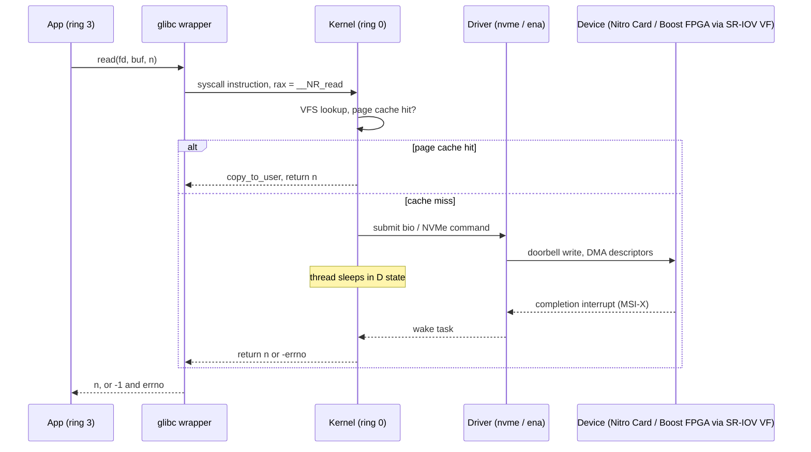
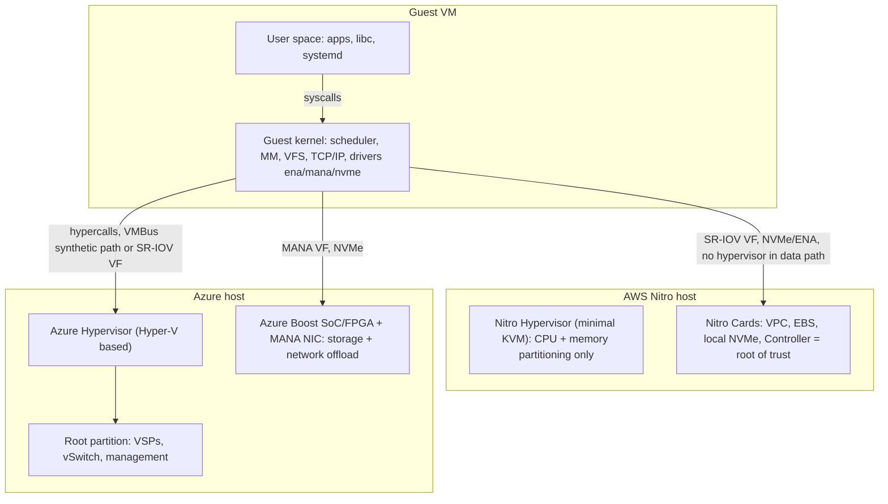

# A1 Why an OS?
> Last verified: 2026-10 · Audience: senior/staff DevOps, SRE, AI eng, NetEng, DevSecOps, architects

## TL;DR
- An OS **multiplexes** scarce hardware (CPU, memory, disk, NIC) across many programs, **isolates** them from each other, and gives them **portable abstractions** (process, virtual memory, file, socket) in place of raw devices.
- The hardware enforces the line between them. **User mode** (x86 ring 3 / Arm EL0) cannot touch devices or page tables. **Kernel mode** (ring 0 / EL1) can. The only sanctioned way across is a **system call**, plus traps from **interrupts and exceptions** (page faults, timer).
- A syscall is a **mode switch, not a context switch**. It is cheap (roughly 100 ns order) but not free. The **vDSO** exists because some calls (`clock_gettime`, `gettimeofday`) were hot enough to dominate performance.
- **Drivers run in kernel space** (Linux modules), so a buggy driver can crash or compromise the whole box. That is why cloud VMs depend on **paravirtual/SR-IOV drivers** (AWS **ENA** + NVMe, Azure **MANA**/mlx5 + NVMe), and why a missing driver means "the instance boots but has no network or disk".
- A cloud VM runs **two kernels**: your guest kernel and a hypervisor below it. AWS **Nitro** moved I/O, network and storage onto **Nitro Cards** and left a minimal **KVM-based hypervisor** with no networking stack, no shell and no operator access. **Azure** runs a **Hyper-V-based hypervisor** with a **root partition**, and **Azure Boost** offloads networking and storage to FPGA/SoC hardware.
- **Bare metal** (`*.metal` on EC2, Azure BareMetal Infrastructure) removes the hypervisor, but on Nitro the Cards still provide VPC, EBS and the root of trust. Use it for nested virtualization, licensing, PMU/perf counters, or running your own hypervisor (Firecracker, Kata).
- For SRE debugging, every "app is slow or hung" question ends up as "**which syscall is it blocked in and what is the kernel waiting on?**". Tools: `strace -f -T -p`, `/proc/<pid>/{status,stack,wchan,syscall,fd,limits}`, `perf trace`, eBPF/bpftrace, and `/proc/pressure/*` (PSI).

## A1.1 Why do we need an Operating System?
- **How it works:**
  - **Resource multiplexing.** The CPU is time-sliced by the scheduler. Memory is split into pages and handed out through per-process virtual address spaces. Disks and NICs are shared through queues.
  - **Isolation and protection.** The MMU and page tables stop process A from reading process B's memory. Privilege levels stop apps from issuing raw I/O, reprogramming the timer or disabling interrupts.
  - **Abstraction and portability.** "Everything is a file descriptor" covers files, pipes, sockets, eventfd and devices. The same `read()` works on ext4, NFS or a TCP socket. Without an OS, every app would need its own NVMe and NIC driver.
  - **Arbitration and fairness.** The kernel enforces the scheduler, cgroups (CPU, memory, IO limits) and rlimits (`ulimit -n`).
  - **Security boundary.** The kernel checks UIDs and capabilities, LSMs (SELinux, AppArmor) and seccomp on every syscall.
- **Trade-offs / when to use:**
  - The abstraction costs time: mode switches, copies between user and kernel buffers, and page-cache double buffering. High-performance stacks **bypass the kernel** to avoid this: **DPDK** and AF_XDP for networking, **SPDK** and `O_DIRECT` for storage, **RDMA**/EFA for HPC and AI. The price is your own drivers, polling cores (100% CPU) and the loss of kernel tooling (`tcpdump`, `ss`, iptables no longer see the traffic).
  - **Unikernels** and library OSes merge app and kernel to shrink the attack surface and speed up boot. They are rare in production. **MicroVMs** (Firecracker for Lambda and Fargate) are the mainstream compromise.
- **Interview angles:**
  - If asked "why not let apps drive the hardware directly?", answer: **isolation, multiplexing, portability**. One bad app must not take down the others. Then mention where we deliberately bypass the kernel (DPDK, RDMA, GPUDirect) and what that costs.
  - Follow-up "what is the kernel's job in one sentence?": it is a **trusted resource manager** that turns untrusted requests (syscalls) into safe hardware operations.
  - Pitfall: saying "the OS is the shell/GUI". The **kernel** is the OS proper. Shell, systemd and libc are user space.

## A1.2 System Architecture Overview
### Hardware components the OS manages
| Resource | Kernel subsystem | Abstraction handed to apps | SRE signal to watch |
|---|---|---|---|
| **CPU** | Scheduler (Linux **EEVDF** since 6.6, replacing CFS), interrupts, timers | Process/thread, time slice | run-queue length, `%steal` in VMs, PSI cpu |
| **Memory** | MMU, page tables, page allocator, page cache, OOM killer | Virtual address space, `mmap`, `brk` | RSS vs VSZ, major faults, PSI memory, `oom_kill` in `dmesg` |
| **Storage** | Block layer, I/O schedulers, NVMe/SCSI drivers | Block device → **file system** → file/fd | `iostat -x` await/util, PSI io, D-state tasks |
| **Network** | NIC driver, NAPI, TCP/IP stack, netfilter | **Socket** fd | `ss -s`, drops in `/proc/net/softnet_stat`, retransmits |
| **File system** | VFS + ext4/xfs/overlayfs | Path, inode, fd | `EMFILE`/`ENOSPC`, inode exhaustion (`df -i`) |
| **Security** | Credentials, capabilities, LSM, seccomp, namespaces | UID/GID, permissions | `EACCES`/`EPERM`, AVC denials in audit log |

### Program, process, kernel, user space, kernel space
- **How it works:**
  - **Program** = executable file on disk (ELF). **Process** = running instance with its own address space, PID, fds, credentials and ≥1 thread. Details in A2.
  - **User space** holds apps, libc, runtimes (JVM, Python) and daemons. Each process lives in its own virtual address space and runs unprivileged.
  - **Kernel space** is a single shared address space mapped into every process (above the user half) but accessible only in kernel mode. It contains the scheduler, MM, VFS, the network stack and **drivers**.
  - **Kernel type:** Linux is a **monolithic kernel with loadable modules**. Drivers and file systems run in ring 0 in one address space, which is fast but has no fault isolation. **Microkernels** (seL4, QNX) push drivers to user space. Windows NT and macOS XNU are hybrids.
  - **Mode switch triggers:** (1) a **syscall** (voluntary), (2) a **hardware interrupt** (NIC packet, disk completion, timer tick), (3) an **exception** (page fault, divide-by-zero, illegal instruction → `SIGSEGV`/`SIGILL`).
- **Interview angles:**
  - "Kernel space vs user space?" Separate privilege **and** memory protection. A user process cannot read kernel memory. **Meltdown** (2018) broke this speculatively, and the fix (**KPTI**, separate page tables) made syscalls measurably slower on affected CPUs. Bring this up as the reason "syscall-heavy workloads regressed after the patch".
  - "Mode switch vs context switch?" A **mode switch** stays in the same process, same address space, ring 3→0→3. A **context switch** changes the running task: it saves and restores registers, may switch page tables, and loses cache/TLB warmth. It is much more expensive. Cross-link A5.2 and A8.2.

### System calls
- **How it works:**
  - The syscall is "the fundamental interface between an application and the Linux kernel" (syscalls(2)). Linux x86-64 has **~450+** syscall numbers (approximate; it grows each release).
  - Apps rarely issue syscalls directly. They call **glibc wrappers** (`read()`, `open()`), which put the number in `rax` and arguments in `rdi, rsi, rdx, r10, r8, r9`, then execute the `syscall` instruction. The CPU jumps to the kernel entry point (MSR `LSTAR`) and the kernel dispatches through `sys_call_table`. The result comes back in `rax`, and a negative value becomes `-1` + `errno`.
  - Legacy 32-bit x86 used `int $0x80`, which is slow because it takes the full interrupt path. The **vDSO** (vdso(7)) maps kernel-provided code into every process so that `clock_gettime`, `gettimeofday`, `time` and `getcpu` run **without entering the kernel**.
  - **Blocking:** a syscall like `read()` on an empty socket puts the thread to sleep (**S**, interruptible). Waiting on disk or NFS usually puts it in **D** (uninterruptible; it can't be killed and it counts toward load average).
  - **Cost reducers:** batching (`readv`/`writev`, `sendmmsg`, `recvmmsg`), zero-copy (`sendfile`, `splice`, `MSG_ZEROCOPY`), and **io_uring**, which uses shared submission/completion rings so many I/Os need few or zero syscalls (see A7.4).
- **Interview angles:**
  - "How does `printf("hi")` reach the screen?" libc buffers it → `write(1, ...)` → syscall → VFS → tty/pty driver → terminal. Mention the buffering: line-buffered on a TTY, fully buffered on a pipe. That is why logs "disappear" when a crashing process is piped.
  - "Why is my service doing 200k syscalls/s?" Look for tiny unbuffered writes, `epoll_wait` busy loops, `futex` contention, or `clock_gettime` falling back from the vDSO to a real syscall. The classic cloud case: `clocksource` = `xen` on older EC2 Xen instances, where the vDSO can't be used. Nitro uses `kvm-clock`/`tsc`. Check `/sys/devices/system/clocksource/clocksource0/current_clocksource`.
  - **Security angle:** the syscall table is the attack surface of the kernel. **seccomp-bpf** filters it. Docker's default profile blocks dozens of syscalls (for example `kexec_load`, `add_key`), and Kubernetes `seccompProfile: RuntimeDefault` applies a similar default. Containers **share the host kernel**, so a kernel exploit is a container escape. VMs and microVMs (Firecracker, Kata, gVisor's user-space kernel) shrink this surface. Cross-link A8.3.

### Drivers (kernel space)
- **How it works:**
  - A driver is kernel code that talks to a device: it programs registers through MMIO, sets up **DMA** ring buffers (A3.4) and handles **interrupts**. Linux ships most drivers in-tree as **loadable modules** (`lsmod`, `modinfo`, `modprobe`, `/lib/modules/$(uname -r)`).
  - Drivers sit at the bottom of the stacks. Storage: app → VFS → file system → block layer → **nvme** driver (A6.1). Network: socket → TCP/IP → qdisc → **ena/mana/mlx5** driver → NIC.
  - Because drivers run in ring 0, a driver bug causes a **kernel panic/oops** for the whole host. Tainted kernels (`/proc/sys/kernel/tainted`) flag out-of-tree or proprietary modules (NVIDIA, ZFS), and many vendors refuse support on them.
  - The **IOMMU** (Intel VT-d / AMD-Vi) limits which memory a DMA-capable device can touch. It is what makes **SR-IOV passthrough** of NIC virtual functions safe in VMs.
- **Interview angles:**
  - "The new instance type boots but has no network/disk." Cause: the AMI or image lacks the driver. On AWS, Nitro **requires ENA and NVMe drivers**. ENA ≥ 2.2.9 is required on Nitro v5+ (older versions cause ENI attachment failures), and the upstream kernel needs ≥ 5.9 for best performance on Nitro v4+. On Azure, newer v6 sizes expose **NVMe only**, need a Gen2 image marked NVMe-capable, and need **MANA** driver support. Without MANA, traffic falls back to the slower synthetic vSwitch path (netvsc).
  - Device naming changes during migrations: EBS shows up as `/dev/nvme1n1` and not `/dev/xvdf`, and Azure SCSI→NVMe moves disks off `/dev/sdX`. **Mount by UUID/label in `/etc/fstab`** (add `nofail` for data disks), or the box won't boot after a resize.

## How a syscall flows (and where the hypervisor sits)




## SRE debugging: seeing the user/kernel boundary
- **strace** (ptrace-based) shows every syscall, its arguments, return value and `errno`.
  - `-f` follows forks/threads, `-p PID` attaches, `-T` prints time spent in each call, `-tt` gives µs timestamps, `-c` gives a summary table, `-e trace=network,file` filters, `-y` decodes fds to paths and sockets, `-k` prints stack traces, `-s 256` lengthens strings (default 32).
  - **Overhead is large** because the tracee stops on every syscall, so it can slow a hot process by an order of magnitude or more (magnitude unverified, workload-dependent). `--seccomp-bpf` stops the tracee only for the traced syscalls (use it with `-f`). In production, prefer **`perf trace`** or **eBPF** (`bpftrace`, BCC `syscount`, `opensnoop`, `execsnoop`) for low overhead.
  - Pattern reading: lots of `EAGAIN` + `epoll_wait` is a normal async loop. Lots of `futex` time means lock contention. `connect` with `EINPROGRESS` that never finishes points at network or firewall problems. `EMFILE` means you hit the fd limit (`/proc/<pid>/limits`). `ENOSPC` with free bytes means you are out of inodes.
- **/proc** is a "pseudo-filesystem which provides an interface to kernel data structures" (proc(5)).
  - `/proc/<pid>/status`: state (R/S/D/Z), threads, `VmRSS`, `voluntary_ctxt_switches`.
  - `/proc/<pid>/wchan` and `/proc/<pid>/stack` (root only): the kernel function a task is blocked in. This is the first stop for a **D-state hang** (NFS, EBS volume stall).
  - `/proc/<pid>/syscall`: the syscall number and arguments currently executing.
  - `/proc/<pid>/fd` and `fdinfo`: open files and sockets (fd leak hunting). `/proc/<pid>/maps`: memory mappings (A2.7). `/proc/<pid>/limits`: effective rlimits.
  - System-wide: `/proc/meminfo`, `/proc/loadavg`, `/proc/stat` (including `steal`), `/proc/interrupts`, `/proc/net/*`, `/proc/sys/*` (sysctl), and **`/proc/pressure/{cpu,memory,io}`** (PSI). PSI reports `some`/`full` stall percentages over 10, 60 and 300 s windows, has been in Linux since 4.20, and is better than load average for saturation alerts.
  - Hardening: mount `/proc` with **`hidepid=2`** on multi-tenant hosts so users can't enumerate other users' processes.
- **VM-specific signals:**
  - **`%st` (steal)** in `top`/`mpstat` is time the hypervisor ran something else while your vCPU was ready. Burstable instances (T-family / B-series) out of credits show up as throttling instead.
  - On Nitro, steal is typically near 0 on non-burstable sizes. Sustained high steal means noisy-neighbour or credit trouble, so move to a larger, dedicated or metal instance.
  - When the kernel won't boot, you need out-of-band access: the **EC2 Serial Console** or **Azure Serial Console** plus boot diagnostics. SSH depends on the guest kernel and network driver working.

```bash
# What is PID 1234 blocked on right now?
cat /proc/1234/status | egrep 'State|Threads|VmRSS|ctxt'
sudo cat /proc/1234/wchan; echo; sudo cat /proc/1234/stack
# Syscall latency profile for 10 s, low-overhead filter
sudo timeout 10 strace -f -c --seccomp-bpf -p 1234
# Slow syscalls only (>100 ms) with timestamps and fd decoding
sudo strace -f -tt -T -y -e trace=network,read,write -p 1234 2>&1 | awk -F'<' '$NF+0 > 0.1'
# Production-safe alternative
sudo perf trace -s -p 1234 -- sleep 10
# Saturation and virtualization signals
cat /proc/pressure/{cpu,memory,io}; mpstat 1 3 | tail -1    # %steal column
lsmod | egrep 'ena|mana|mlx5|nvme|hv_'; ethtool -i eth0      # which NIC driver is bound
```

## Cloud mapping: AWS vs Azure
| Capability | AWS | Azure | Role it plays | Key differences | Alternatives |
|---|---|---|---|---|---|
| Hypervisor | **Nitro Hypervisor** (minimal, KVM-based) | **Azure Hypervisor** (Hyper-V based, root + guest partitions) | Partitions CPU and memory between VMs | Nitro has no networking stack, file system or shell. Hyper-V root partition hosts the VSPs and vSwitch | KVM/QEMU (self-managed), VMware ESXi (VMware Cloud on AWS, Azure VMware Solution), GCP KVM + Titanium |
| I/O offload | **Nitro Cards** (VPC, EBS, local NVMe, Controller) | **Azure Boost** (FPGA/SoC storage offload + **MANA** NIC) | Moves network and storage virtualization off host CPUs | Nitro has been complete since C5 (2017), with the hypervisor left only for CPU and memory. Boost is rolling out per VM family (v5/v6/v7). Boost: up to 200 Gbps network, remote disk up to 14 GBps / 750K IOPS, local up to 36 GBps / 6.6M IOPS. Nitro v6: up to 400 Gbps per network card | SmartNIC/DPU (NVIDIA BlueField), GCP Titanium |
| Hardware root of trust | **Nitro Controller + Nitro Security Chip** | **Cerberus** (NIST 800-193) + attestation | Verified boot. Blocks firmware tampering, including on bare metal | Nitro: "no operator access" by design. Boost: SELinux-confined, Rust-first SoC software, FIPS 140 kernel | TPM / Secure Boot on own hardware |
| Guest NIC driver | **ENA** (+ EFA for HPC/ML) | **MANA** (+ mlx4/mlx5 still needed, netvsc fallback) | SR-IOV VF in guest kernel | Azure VMs may land on either Mellanox or MANA hardware, so images need both drivers. DPDK on MANA needs kernel ≥ 6.14 | virtio-net (generic KVM) |
| Guest disk interface | **NVMe** for EBS + instance store | **NVMe** on v6+/Ebsv5 (SCSI on older), Gen2 images only | Block device the guest driver sees | Azure SCSI→NVMe migration changes device names and needs an NVMe-tagged image | virtio-blk/scsi |
| No-hypervisor compute | **`*.metal`** instances (Nitro) | **BareMetal Infrastructure** (SAP HANA, Epic, Oracle); **Azure VMware Solution** hosts | Full hardware access: VT-x, PMU, licensing | EC2 metal is self-service on the same APIs/VPC/EBS and boots slowly (up to ~20 min). Azure BareMetal is a specialized, workload-certified offering, not a general VM SKU | On-prem, Equinix Metal (sunset, unverified), OCI BM |
| Single-tenant (still virtualized) | **Dedicated Hosts / Dedicated Instances** | **Azure Dedicated Host** | Compliance, BYOL per-socket licensing | Both still run the hypervisor, so this is isolation, not bare metal | — |
| MicroVM sandbox for untrusted code | **Firecracker** (Lambda, Fargate) | Hyper-V isolated containers (ACI), **AKS Pod Sandboxing** (Kata) | Per-workload kernel, so a smaller shared-kernel blast radius | Firecracker is open source and KVM-based; Azure uses Hyper-V utility VMs | gVisor (GKE Sandbox), Kata Containers |
| Out-of-band console | **EC2 Serial Console**, Get System Log | **Azure Serial Console**, Boot diagnostics | Debug when the guest kernel or network is broken | Both need IAM/RBAC enablement. EC2 serial needs Nitro instance types | IPMI/BMC on-prem |

- **AWS Nitro:** Nitro removed Xen Dom0 step by step. Device emulation moved to discrete cards, and the host runs a firmware-like hypervisor loaded from a read-only NVMe boot device that the Controller provides. The hypervisor "has no networking stack and no access to the EC2 network". Because I/O is already offloaded, **bare metal is "just turn the hypervisor off"**: VPC, EBS and security still come from the Cards. The trade-off AWS states openly is that operators can't debug in place, so rare issues need customer-assisted reproduction on debug hardware.
- **Azure Hyper-V:** the **root partition** has direct device access and serves synthetic devices (VSP ↔ VSC over **VMBus**). Linux guests use the in-kernel `hv_*` drivers (`hv_vmbus`, `hv_netvsc`, `hv_storvsc`). Accelerated Networking adds an **SR-IOV VF bonded under netvsc**, which is why an Azure Linux VM shows two NICs with the same MAC. Azure Boost shrinks the host's data-path role by moving storage to the FPGA and networking to MANA, which brings it architecturally close to Nitro.
- **Interview framing:** "Nitro and Boost are both answers to the same problem. The hypervisor/host OS was eating host CPU and adding jitter and attack surface. Moving I/O to dedicated silicon gives near-bare-metal performance, lets you sell metal SKUs, and keeps a hardware root of trust."
- **Gotchas:** AMIs or images without ENA/NVMe (AWS) or NVMe/MANA (Azure) support break on new families. `fstab` entries using device names break on interface change. Applications that rely on `clock_gettime` performance should verify the clocksource.

## Cross-links
- [A2 The Anatomy of a Process](../A-operating-systems/) (A2.1, A2.7 `/proc/<pid>/maps`)
- [A3 Memory Management](../A-operating-systems/) (A3.3 virtual memory, A3.4 DMA)
- [A5 Process Management](../A-operating-systems/) (A5.2 context switching)
- [A6 Storage Management](../A-operating-systems/) (A6.1 App → FS → block layer → NVMe driver)
- [A7 Socket Management](../A-operating-systems/) (A7.1 kernel queues, A7.4 epoll/io_uring)
- [A8 More OS Concepts](../A-operating-systems/) (A8.2 kernel vs user mode switching, A8.3 cgroups vs namespaces)
- [H1/H2 Linux diagnostics and troubleshooting](../H-full-stack-troubleshooting/) (H1, H2)
- [G4 Network performance and optimization](../G-cloud-network-architecture/) (G4: ENA/MANA, accelerated networking)

## Sources
- https://man7.org/linux/man-pages/man2/syscalls.2.html
- https://man7.org/linux/man-pages/man7/vdso.7.html
- https://man7.org/linux/man-pages/man1/strace.1.html
- https://man7.org/linux/man-pages/man5/proc.5.html
- https://docs.kernel.org/accounting/psi.html
- https://docs.aws.amazon.com/whitepapers/latest/security-design-of-aws-nitro-system/the-nitro-system-journey.html
- https://docs.aws.amazon.com/whitepapers/latest/security-design-of-aws-nitro-system/the-components-of-the-nitro-system.html
- https://docs.aws.amazon.com/whitepapers/latest/security-design-of-aws-nitro-system/no-aws-operator-access.html
- https://docs.aws.amazon.com/ec2/latest/instancetypes/ec2-nitro-instances.html
- https://learn.microsoft.com/en-us/azure/azure-boost/overview
- https://learn.microsoft.com/en-us/azure/security/fundamentals/hypervisor
- https://learn.microsoft.com/en-us/windows-server/virtualization/hyper-v/architecture
- https://learn.microsoft.com/en-us/azure/virtual-network/accelerated-networking-mana-overview
- https://learn.microsoft.com/en-us/azure/virtual-machines/nvme-overview
- https://learn.microsoft.com/en-us/azure/baremetal-infrastructure
