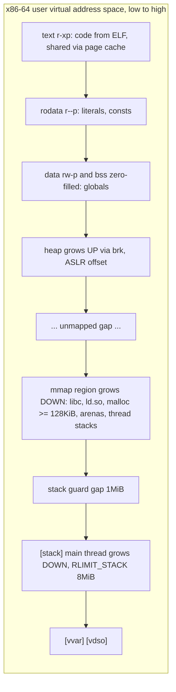
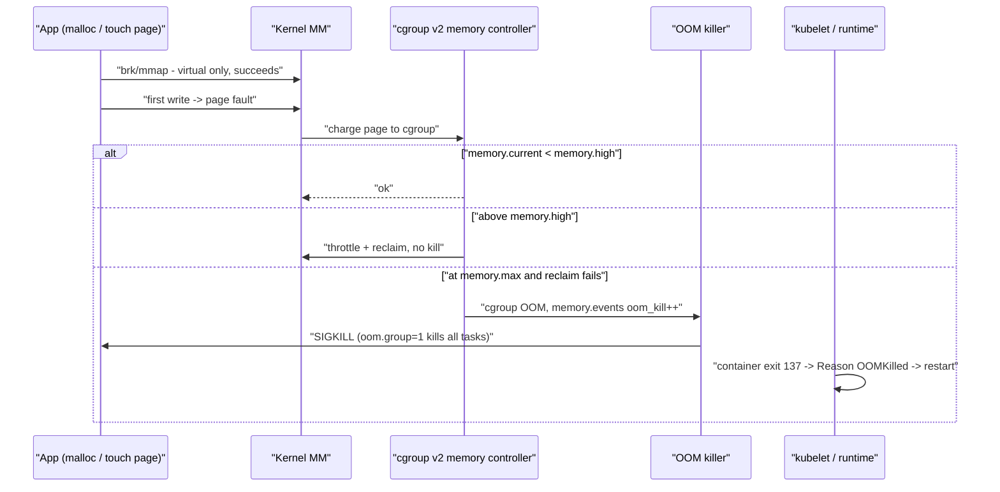

# A2 The Anatomy of a Process
> Last verified: 2026-10 · Audience: senior/staff DevOps, SRE, AI eng, NetEng, DevSecOps, architects

## TL;DR
- A **program** is an ELF file on disk. A **process** is a running instance of it, with a PID, its own **virtual address space**, registers (PC/IP, SP, BP), open file descriptors, credentials, and a cgroup/namespace membership. Two processes running the same binary share the read-only **text** pages through the page cache.
- Typical x86-64 user layout, from low to high addresses: **text (r-x) → rodata (r--) → data / bss (rw-) → heap (grows up via `brk`) → … mmap region (shared libs, anonymous mmaps, thread stacks; grows down) … → main stack (grows down) → `[vvar]`/`[vdso]`**. Every region shows up in **`/proc/<pid>/maps`**.
- The **stack** holds a frame for each function call (return address, saved registers, locals) and is managed by the compiler through `SP` and `BP`. Allocating on it is a single subtraction, which makes it fast and LIFO. Its size is fixed: **`ulimit -s`, 8 MiB by default** for the main thread. A thread stack is a **fixed-size mmap**: its default equals RLIMIT_STACK, or 2 MiB on x86-64 if that is unlimited. Overflowing it raises **SIGSEGV**.
- The **heap** is dynamic memory (`malloc`/`new`). glibc grows the main arena with `brk`/`sbrk` and serves allocations of **≥128 KiB by default (`M_MMAP_THRESHOLD`)** with `mmap`. Allocation is **lazy**: VSZ grows at once, but RSS grows only when pages are touched (on page fault).
- **Stack overflow vs OOM:** a stack overflow is a *per-thread* limit (SIGSEGV, exit code 139). An OOM kill is a *memory-pool* limit, either host RAM or the cgroup's `memory.max` (SIGKILL, exit code 137, Kubernetes `OOMKilled`). `malloc` rarely returns NULL on Linux because of **overcommit**.
- In containers, **cgroup v2 `memory.max`** is a hard cap on **anon + page cache + kernel memory (slab, sockets) + tmpfs**. When usage hits it, the kernel first reclaims. If reclaim fails, the cgroup OOM killer runs. Kubernetes `limits.memory` maps to `memory.max`. Since Kubernetes 1.28 on cgroup v2, `memory.oom.group=1` kills **every process in the container**. Kubernetes 1.32 added the kubelet `singleProcessOOMKill` opt-out.
- **ASLR** (`kernel.randomize_va_space=2`, the default) randomizes stack, mmap base, vDSO and heap. The text segment is randomized only for **PIE** binaries. It is a defence-in-depth mitigation against memory-corruption exploits.
- To measure memory, use **PSS** (`/proc/<pid>/smaps_rollup`), not the sum of RSS. RSS double-counts shared libraries. VSZ is almost meaningless for capacity planning.

## A2.1 Program vs Process
- **How it works:**
  - A **program** is a passive file: an ELF header, a program header table listing the loadable **segments** (PT_LOAD for text and data, PT_INTERP pointing at `ld-linux`, PT_GNU_STACK), and section headers (`.text`, `.rodata`, `.data`, `.bss`, `.plt`/`.got`).
  - A **process** is an active kernel object, a `task_struct` on Linux. It holds a PID/TGID, an `mm_struct` (the address space: a tree of VMAs plus the page tables), a file descriptor table, signal handlers, credentials, rlimits, and its namespaces and cgroup.
  - **Threads** on Linux are tasks that share one `mm_struct`, so they have the same address space and heap. Each thread has its own stack, registers and TID. A process's PID is the TGID of its main thread.
  - **`fork()`** duplicates the address space with **copy-on-write**: pages are shared read-only until one side writes. **`execve()`** replaces the address space with a fresh image of the new program but keeps the PID and the file descriptors that are not marked `O_CLOEXEC`.
  - One program can have N processes. For example, 32 nginx workers share the physical text pages and libc, and each has a private data, heap and stack.
- **Trade-offs / when to use:**
  - Processes give isolation (a crash or memory corruption stays contained) at the cost of heavier context switches and IPC. Threads are cheap to share data between, but one bad thread kills the whole process. See A3/A4 for the full treatment.
  - Pre-fork servers (Postgres backends, gunicorn workers) use CoW to share warmed-up state. Refcount writes (CPython) and GC marking quietly *break* CoW, so RSS creeps up per worker over time.
- **Interview angles:**
  - "Program vs process?" → A program is the file. A process is the program plus an execution context and an address space. Mention `task_struct`, `mm_struct` and CoW on fork.
  - "Why does `fork()` of a 20 GB Redis not need 20 GB?" → CoW. The duplicated pages are only the ones written during the BGSAVE window. This is also why Redis recommends `vm.overcommit_memory=1`: under heuristic overcommit a large fork can fail.
  - Pitfall: saying "threads have separate heaps". They share one heap. glibc does keep **per-thread arenas** for contention, but the address space is the same.

## A2.2 Simple Process Execution
- **How it works:**
  - **Load:** `execve` maps the ELF segments, sets up the initial stack (argc, argv, envp, the **auxv** auxiliary vector), maps the dynamic loader (`ld-linux-x86-64.so.2`), then jumps to the loader's entry point. The loader maps the shared libraries, resolves relocations (lazy PLT binding or BIND_NOW), and calls `_start` → `__libc_start_main` → `main`.
  - **Execute:** the CPU runs a **fetch-decode-execute** loop. The **instruction pointer (RIP)** points into the text segment and advances. Jumps and calls change it. Operands move between memory and **registers**: about 16 general-purpose registers on x86-64, each ~1 cycle to access, against ~100 ns for DRAM.
  - The instructions in text are **read-only and executable** (`r-xp`). **W^X / NX** prevents the data, heap and stack from being executed.
  - Pages are loaded **on demand**. Only touched text pages fault in from the page cache, which is why a cold start is slower than a warm one.
- **Trade-offs / when to use:**
  - Static linking gives fewer mappings, faster startup and no runtime library dependency. That suits distroless or scratch images, and Go uses it by default. The costs: no shared page-cache savings across processes, and a CVE in a library means rebuilding the binary.
  - Full RELRO + BIND_NOW makes startup slightly slower but makes the GOT read-only, which hardens the binary.
- **Interview angles:**
  - "Walk me through what happens when you run `./app`" → the shell calls `fork` then `execve` → the kernel parses the ELF and maps the segments → it builds the stack and auxv → `ld.so` maps the libs → `main` runs → page faults bring code in → `exit` → the parent `wait`s, otherwise the child is a zombie (A3).
  - Follow-up on the "Exec format error" seen with containers: it usually means an architecture mismatch, such as an arm64 image on an amd64 node.

## A2.3 The Stack
- **How it works:**
  - The stack is a contiguous LIFO region. On x86-64 it **grows downward**, toward lower addresses. **RSP** points to the top of the stack. **RBP**, the frame pointer, is optional: `-fomit-frame-pointer` is the default at -O2. Many distros re-enabled frame pointers in 2023–24 (Fedora 38+, Ubuntu 24.04) so profilers can unwind the stack.
  - Each call pushes a **stack frame**: the return address, saved callee registers, locals and spilled arguments. The SysV ABI passes the first 6 integer arguments in registers.
  - **Main thread:** the stack is **`[stack]`** in maps. It grows automatically, through page faults, up to **RLIMIT_STACK**. That limit is `ulimit -s`, **8192 KiB by default** on most distros. Exceeding it, or running into the **guard gap**, raises **SIGSEGV**.
  - **Guard gap:** the kernel's `stack_guard_gap` is **256 pages, which is 1 MiB with 4 KiB pages**. It was raised in 2017 for **Stack Clash** (CVE-2017-1000364). No other mapping may be placed in this gap below a growing stack.
  - **Thread stacks:** these are fixed-size anonymous mmaps that do not grow automatically. The NPTL default comes from RLIMIT_STACK at program start. If RLIMIT_STACK is unlimited, the default is **2 MiB on x86-64**. Each thread stack has a guard page and can be overridden with `pthread_attr_setstacksize`. Runtimes differ: **Go** goroutines start at a few KiB and grow by copying. **JVM** `-Xss` defaults to about 1 MiB on 64-bit Linux.
  - Stack memory is virtual until it is touched. 1,000 threads × 8 MiB is 8 GB of **VSZ**, but RSS is only the pages actually used.
- **Trade-offs / when to use:**
  - The stack gives fast, automatically freed, cache-hot allocation, but its size is bounded and must be known at compile time (VLAs and `alloca` are dangerous). Use it for small, short-lived data. Large or long-lived data, or data that outlives the function, belongs on the heap.
  - Deep recursion (parsers, tree walks) → convert to iteration or raise the stack for that one thread. Avoid raising it globally.
- **Interview angles:**
  - "What causes a stack overflow and how do you diagnose it?" → Unbounded recursion or a large local array. It shows up as SIGSEGV (exit 139, or core dump), often with a huge repeating backtrace in `gdb`. Fixes: `ulimit -s`, `-Xss`, or `RecursionError` in Python (its default recursion limit is 1000). To print a message on overflow, a handler must run on a `sigaltstack`.
  - "Why do 10k-thread servers run out of memory?" → Each thread costs VSZ for its stack plus kernel structures, and touched stack pages become real RSS. Also `vm.max_map_count` (default **65530**) and `pid_max` / cgroup `pids.max` can run out first. This is the case for event loops and goroutines over thread-per-connection.
  - **Buffer overflows** on the stack overwrite the return address. Mitigations: **stack canaries** (`-fstack-protector-strong`), **NX**, **ASLR**, **shadow stacks / Intel CET** (Linux 6.6+ for user space).

## A2.4 Process Execution with Stack
- **How it works:** a function call looks like this:
  1. The caller places arguments in RDI, RSI, RDX, RCX, R8 and R9 (more go on the stack).
  2. `call` pushes the return address and jumps.
  3. The prologue runs `push rbp; mov rbp, rsp; sub rsp, N` to reserve space for locals.
  4. The function body accesses locals as `[rbp-k]` or `[rsp+k]`.
  5. The epilogue runs `leave; ret`, which pops the return address into RIP.
  6. The return value comes back in RAX.
- "Freeing" the stack is just moving RSP back. The old data stays in memory until it is overwritten, which is why reading an uninitialised local returns garbage.
- The top of the stack is almost always in **L1 cache**, so stack access is about as cheap as register spills.
- **Trade-offs / when to use:**
  - Inlining removes call overhead but grows the text segment, which puts pressure on the i-cache.
  - Frame pointers cost about 1% of performance but make `perf` and eBPF stack unwinding cheap and reliable. Without them you need DWARF or ORC unwinding.
- **Interview angles:**
  - "Why is returning a pointer to a local variable a bug?" → The frame is popped, and the next call overwrites it.
  - "Why are flame graphs broken for my service?" → It was built without frame pointers. Rebuild with `-fno-omit-frame-pointer` or use DWARF unwinding.
  - A **return-oriented programming (ROP)** attack chains `ret` instructions through existing code ("gadgets"). This is why NX alone is not enough, and why ASLR and CET exist.

## A2.5 Data section
- **How it works:**
  - **`.data`** holds initialized globals and statics. It is file-backed and private (`rw-p`), so a write triggers CoW and the page becomes private anonymous.
  - **`.bss`** holds zero-initialized globals. It takes **no space in the file**. The kernel maps zero pages for it (anonymous, `rw-p`, often merged next to the data mapping).
  - **`.rodata`** holds string literals and const tables (`r--p`).
  - After relocation, **RELRO** remaps the GOT read-only.
  - The data section's size is fixed when the program loads. Access goes through absolute or RIP-relative addresses, so no allocator is involved.
- **Trade-offs / when to use:**
  - Globals give simple, lifetime-of-process storage, but they are shared mutable state. They are not thread-safe without synchronisation, are hard to test, and cause **false sharing** when two hot globals sit on the same 64-byte cache line.
  - A large static array inflates `.bss` but is free until it is touched.
- **Interview angles:**
  - "Where does `static int x = 5;` live versus `static int y;` versus `const char *s = "hi"`?" → `.data`, `.bss`, and `.rodata` for the literal (the pointer itself lives in `.data` or on the stack).
  - Attempting to write to `.rodata` raises SIGSEGV, which is a common cause of "segfault on string modify".
  - `size ./binary` prints the text, data and bss sizes. `readelf -lS` shows the segments and sections.

## A2.6 The Heap
- **How it works:**
  - The heap holds dynamic allocations whose lifetime is controlled by the program (`malloc`/`free`, `new`/`delete`, or GC-managed). In maps, **`[heap]`** is the `brk` region that grows upward from just after `.bss`, with a randomized gap when ASLR=2.
  - **glibc ptmalloc:**
    - Small requests come from the main arena, grown with **`brk`**.
    - Requests **≥ `M_MMAP_THRESHOLD`** use their **own `mmap`** and return memory to the OS on `free`. The threshold is **128 KiB by default** and adjusts dynamically up to 32 MiB on 64-bit.
    - Threads get **extra arenas**: up to `8 × cores` on 64-bit, tunable with `MALLOC_ARENA_MAX`. Each arena is a 64 MiB-reserved mmap, which shows up as many `---p`/`rw-p` anonymous regions.
  - **Lazy allocation / overcommit:** `malloc` reserves *virtual* space. Physical pages are allocated on first write (a minor fault).
    - `vm.overcommit_memory`: **0** = heuristic (the default), **1** = always allow, **2** = strict, with the limit = swap + `overcommit_ratio`% of RAM (default 50).
    - The result is that `malloc` almost never returns NULL. The **OOM killer** runs later instead.
  - **Fragmentation:** `free` does not necessarily return memory to the OS. A `brk` heap can shrink only from the top, so a single live chunk can pin the whole region. Long-running services therefore show "RSS never drops".
  - Mitigations for fragmentation: `malloc_trim`, `MALLOC_ARENA_MAX=2`, or **jemalloc / tcmalloc / mimalloc**.
  - **Managed runtimes** reserve a big heap and manage it themselves:
    - JVM: `-Xmx`. In containers the default is `MaxRAMPercentage=25` of the cgroup limit. JVMs have been container-aware since 8u191 and 10+.
    - Go: `GOGC` plus **`GOMEMLIMIT`** (Go 1.19+) as a soft limit.
    - Node: `--max-old-space-size`.
- **Trade-offs / when to use:**
  - The heap gives flexible size and lifetime, at the cost of allocator overhead, fragmentation, leaks, use-after-free, and GC pauses.
  - Arena or bump allocators and object pools give predictable latency but need you to manage lifetimes by hand.
  - Raising `MALLOC_ARENA_MAX` lowers lock contention but raises RSS. Lowering it does the reverse.
- **Interview angles:**
  - "Container RSS grows forever, but there's no leak in the heap profiler" → Suspect fragmentation or glibc arenas (try jemalloc or `MALLOC_ARENA_MAX`). Also consider the page cache counted in the cgroup, and off-heap or native memory: JVM metaspace, direct buffers, thread stacks, and the JIT code cache.
  - "JVM with `-Xmx` set to the container limit gets OOMKilled" → The JVM's total footprint is heap + metaspace + code cache + thread stacks + GC structures + direct memory. Leave **~25%+ headroom**, or use `MaxRAMPercentage≈75`.
  - "Go service OOMs in Kubernetes" → Set `GOMEMLIMIT` to about 90% of `limits.memory` so the GC works harder before the cgroup kills the process.
  - "How does heap growth interact with cgroup `memory.max`?" → `brk` and `mmap` **succeed** because they are virtual. The charge happens at **page-fault time**. When `memory.current` reaches `memory.max`:
    1. The kernel reclaims within the cgroup: it drops clean page cache and swaps anon pages if `memory.swap.max` allows.
    2. If that fails, the **cgroup OOM killer** sends SIGKILL to the process with the highest badness score in that cgroup.
    3. The `oom_kill` counter in **`memory.events`** increments.

    The process never sees `ENOMEM` from `malloc`. RLIMIT_AS and RLIMIT_DATA *do* make `mmap`/`brk` fail with ENOMEM (RLIMIT_DATA has included mmap since Linux 4.7).

### Stack overflow vs OOM (comparison)
| | Stack overflow | OOM (host or cgroup) |
|---|---|---|
| Limit | RLIMIT_STACK (`ulimit -s`, 8 MiB) or the thread's stack size | Host RAM+swap, or cgroup `memory.max` |
| Scope | One thread | A whole memory pool (cgroup or node) |
| Signal / exit | SIGSEGV → 139 | SIGKILL → 137 (`OOMKilled` in Kubernetes) |
| Evidence | Core dump, deep repeating backtrace | `dmesg`: "Memory cgroup out of memory: Killed process …", `memory.events` oom_kill |
| Fix | Iteration, `-Xss`, `ulimit -s`, pthread attr | Fix the leak or fragmentation, right-size limits, GOMEMLIMIT/Xmx, add headroom |

## A2.7 Process memory mappings (/proc/<pid>/maps)
- **How it works:**
  - **`/proc/<pid>/maps`** has one line per **VMA**: `address perms offset dev inode pathname`. For example: `7f3a1c000000-7f3a1c021000 rw-p 00000000 00:00 0`.
  - **perms:** `r`, `w`, `x`, then **`p`** (private, CoW) or **`s`** (shared).
  - **Pseudo-paths:**
    - `[heap]`: the brk area.
    - `[stack]`: the main thread's stack.
    - `[vdso]` and `[vvar]`: the kernel-provided fast syscalls (`clock_gettime`, `gettimeofday`) and the data they read.
    - `[vsyscall]`: legacy.
    - `[anon:name]`: named anonymous mappings (Linux 5.17+), set with `prctl(PR_SET_VMA_ANON_NAME)`.
    - A blank pathname means an anonymous mmap.
    - ` (deleted)` means the backing file was unlinked. This is a classic way to find leaked deleted files or a binary upgraded in place.
  - Reading maps requires **ptrace read access** (PTRACE_MODE_READ_FSCREDS), so other users' processes are hidden unless you are root or have CAP_SYS_PTRACE. This matters for sidecar and debug containers.
  - **`/proc/<pid>/smaps`** has per-VMA counters: **Rss, Pss, Shared/Private Clean/Dirty, Referenced, Anonymous, Swap, SwapPss, Locked, THPeligible, VmFlags**.
  - **`smaps_rollup`** gives the summed totals plus Pss_Anon, Pss_File and Pss_Shmem. It is much cheaper to read than parsing smaps.
  - **`/proc/<pid>/status`** gives the totals: VmPeak, VmSize (VSZ), VmRSS, RssAnon, RssFile, RssShmem, VmData, VmStk, VmExe, VmLib, VmSwap, Threads.
  - Default x86-64 user space is **128 TiB** (47-bit addressing). With 5-level paging it can go up to 56 bits, but only if the process maps above the hint.
  - Non-PIE text sits at `0x400000`. PIE text is around `0x55…` / `0x56…`, and mmap and libs are around `0x7f…`, all randomized.
- **ASLR:**
  - `kernel.randomize_va_space`:
    - **0** = off.
    - **1** = randomize the mmap base, stack and vDSO, and the text segment for PIE.
    - **2** = also randomize the heap/brk. This is the default.
  - Run `setarch -R` (or set the `ADDR_NO_RANDOMIZE` personality) to disable ASLR for one process while debugging.
  - The kernel has its own **KASLR**.
  - Weaknesses: a single **info leak** defeats ASLR, and on 32-bit systems the entropy is low enough to brute-force. ASLR is only effective together with PIE, NX and canaries.
- **Trade-offs / when to use:**
  - `maps` is cheap, but reading `smaps` walks the page tables and takes the mmap lock. On processes with huge RSS, frequent scraping adds latency and lock contention, so prefer `smaps_rollup` or `status` for monitoring.
  - Which metric to use:
    - **RSS** overstates memory because shared libraries are counted in every process.
    - **PSS** splits shared pages fairly between processes.
    - **USS** (the Private_* fields) is what you would free by killing the process.
- **Interview angles:**
  - "How do you find what's using memory in a process?" →
    1. `cat /proc/<pid>/smaps_rollup` for the totals.
    2. `pmap -x <pid>` (built on smaps) sorted by RSS.
    3. Look for many 64 MiB anonymous regions (glibc arenas), a big `[heap]` (brk fragmentation), or large file-backed regions (mmapped data files, which are reclaimable).
  - "Why do `kubectl top` and `ps` disagree?" → Kubernetes reports the cgroup **working set** = `memory.current − inactive_file`. That includes page cache and kernel memory, while `ps` RSS is per process and excludes the page cache. The kubelet's eviction signal uses the working set.
  - "Is the process mapping a deleted library after patching glibc/OpenSSL?" → `grep deleted /proc/*/maps`. Processes that match need a restart for the patch to take effect.
  - Security: `/proc/<pid>/maps` leaks the ASLR layout. This is why `hidepid=2` mounts and `ptrace_scope` / Yama exist.

### cgroup v2 memory and Kubernetes OOMKilled
- **cgroup v2 memory knobs:**
  - **`memory.max`**: hard limit. If usage cannot be reclaimed below it, the cgroup OOM killer runs.
  - **`memory.high`**: throttle and heavy-reclaim point. It never triggers an OOM kill.
  - **`memory.low`** / **`memory.min`**: soft and hard protection from reclaim.
  - **`memory.current`** / **`memory.peak`**: current and peak usage.
  - **`memory.events`**: counters for low, high, max, oom and oom_kill.
  - **`memory.oom.group`**: kill the whole cgroup together.
  - **`memory.swap.max`**: swap limit.
- **What is charged to a cgroup:** anonymous memory, **page cache** (file I/O), **tmpfs / shm**, which includes Kubernetes `emptyDir.medium: Memory` and `/dev/shm`, plus kernel memory such as dentries, inodes and **TCP socket buffers**. A container that "only uses 200 MB heap" can be killed because of 1 GB of tmpfs writes or socket buffers.
- **Kubernetes mapping:**
  - `resources.limits.memory` → `memory.max`. `requests.memory` is used for scheduling and for `memory.min` when MemoryQoS is enabled. MemoryQoS also sets `memory.high`; it is still feature-gated, so status as of 2026 is (unverified).
  - The docs describe limit enforcement as "**reactive**": the kernel kills the container only when it is under pressure at the limit.
  - **Container OOM** is a kernel kill inside the container's cgroup. The status shows `Reason: OOMKilled` and exit code **137**, and the container restarts according to `restartPolicy`, leading to CrashLoopBackOff if it repeats. The pod stays on the node.
  - **Node-pressure eviction** is the kubelet acting on `memory.available` (hard threshold **100Mi** by default). It evicts whole pods: **BestEffort first, then Burstable over their request, then Guaranteed**. The pod gets `Status: Failed, Reason: Evicted`.
  - **`oom_score_adj` by QoS class:**

    | QoS class | oom_score_adj |
    |---|---|
    | Guaranteed | **-997** |
    | BestEffort | **1000** |
    | Burstable | 2–999, scaled by request/node memory |
    | kubelet and system components | -999 |

  - **Group kill:** Kubernetes ≥1.28 on cgroup v2 sets `memory.oom.group=1`, so one OOM kills every process in the container. That is safer for multi-process apps but surprising for pre-fork servers whose workers used to be killed one at a time. Kubernetes **1.32** added the kubelet setting **`singleProcessOOMKill`** to opt back into the old behaviour.

## Diagrams




## Cloud mapping: AWS vs Azure
| Capability | AWS | Azure | Role it plays | Key differences | Alternatives |
|---|---|---|---|---|---|
| Container hard memory limit | ECS container `memory` (hard) / task `memory`; EKS `limits.memory` | AKS `limits.memory`; Container Apps / ACI container `memory` | Sets the cgroup `memory.max`; exceeding it → OOM kill | ECS has both container-level and task-level limits; Fargate and ACI size the whole task/group | Self-managed Kubernetes, Docker `--memory` |
| Soft limit / reservation | ECS `memoryReservation` (Docker `--memory-reservation`) | AKS `requests.memory` | Scheduling reservation; reclaim target under contention | ECS soft limit subtracts from instance capacity; K8s request drives QoS and `oom_score_adj` | Kubernetes MemoryQoS (`memory.high`) |
| OOM visibility | CloudWatch Container Insights; ECS stopped reason "OutOfMemoryError"; EKS events | Azure Monitor Container Insights; AKS events, `kubectl describe` | Alerting on OOMKilled / restarts | Both read cgroup working set; naming differs | Prometheus `kube_pod_container_status_last_terminated_reason`, Datadog |

- **ECS:** if a container exceeds `memory`, the container is killed. `memoryReservation` is the soft limit, and when both are set `memory` must be greater than `memoryReservation`. The Docker daemon reserves a minimum of **6 MiB** for a container.
- **EKS / AKS:** both are standard Kubernetes, so the OOM semantics are identical: `memory.max`, QoS classes and group kill. The real differences are the node image's cgroup version and kernel; current AL2023 and Azure Linux / Ubuntu node images default to cgroup v2. Also the per-SKU kube-reserved / eviction defaults, which reduce allocatable memory.
- **Fargate / ACI / Container Apps:** these are serverless-style. You don't see the node, so OOM shows up only as a container exit or stopped reason. Right-size with headroom, because there is no node-level memory to burst into.

## Hands-on (optional)
```bash
# Layout and accounting of a process
cat /proc/$$/maps | head
grep -E 'Rss|Pss|Private|Swap' /proc/$$/smaps_rollup
grep -E 'Vm|Rss|Threads' /proc/$$/status
pmap -x $$ | sort -k3 -n | tail

# Stack limit and ASLR
ulimit -s                        # 8192 KiB typical
sysctl kernel.randomize_va_space vm.overcommit_memory vm.max_map_count
setarch "$(uname -m)" -R cat /proc/self/maps | grep stack   # ASLR off for one run

# cgroup v2: inspect a container's memory controller (inside the container)
cat /sys/fs/cgroup/memory.max /sys/fs/cgroup/memory.current /sys/fs/cgroup/memory.peak
cat /sys/fs/cgroup/memory.events      # look at oom / oom_kill
grep -E '^(anon|file|shmem|sock|slab|inactive_file) ' /sys/fs/cgroup/memory.stat

# Reproduce an OOMKill and a stack overflow
docker run --rm -m 64m alpine sh -c 'head -c 200m /dev/zero | tail' ; echo "exit=$?"   # 137
kubectl get pod app -o jsonpath='{.status.containerStatuses[0].lastState.terminated.reason}'
dmesg -T | grep -i 'out of memory'
```

## Cross-links
- [A1 Why an OS?](./A1-why-an-os.md) (user space vs kernel space, syscalls)
- `./ (A3)`: process lifecycle, fork/exec, threads; `./ (A4)` onward: memory management, virtual memory, paging
- [A7 sockets and kernel queues](./) (A7.1). Socket buffers are charged to the cgroup.
- `../H-full-stack-troubleshooting/` (H1, H2): Linux diagnostic tools (`pmap`, `dmesg`, `/proc`)
- `../J-sre/` capacity planning and right-sizing; `../L-data-privacy-ai-security/` exploit mitigations

## Sources
- https://man7.org/linux/man-pages/man5/proc_pid_maps.5.html
- https://man7.org/linux/man-pages/man5/proc_pid_smaps.5.html
- https://docs.kernel.org/filesystems/proc.html
- https://man7.org/linux/man-pages/man3/malloc.3.html
- https://man7.org/linux/man-pages/man2/getrlimit.2.html
- https://man7.org/linux/man-pages/man3/pthread_create.3.html
- https://docs.kernel.org/admin-guide/sysctl/kernel.html (randomize_va_space)
- https://docs.kernel.org/admin-guide/sysctl/vm.html (overcommit, max_map_count, panic_on_oom)
- https://docs.kernel.org/admin-guide/cgroup-v2.html (memory controller)
- https://lkml.iu.edu/1706.3/01634.html (stack guard gap, Stack Clash)
- https://kubernetes.io/docs/concepts/configuration/manage-resources-containers/
- https://kubernetes.io/docs/concepts/scheduling-eviction/node-pressure-eviction/
- https://docs.cloud.google.com/kubernetes-engine/docs/troubleshooting/oom-events (singleProcessOOMKill, oom.group)
- https://docs.docker.com/engine/containers/resource_constraints/
- https://docs.aws.amazon.com/AmazonECS/latest/developerguide/task_definition_parameters.html
