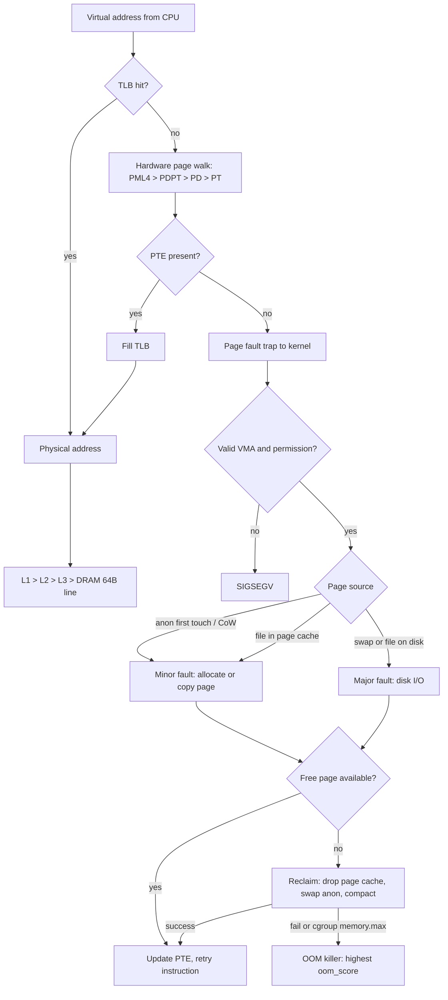
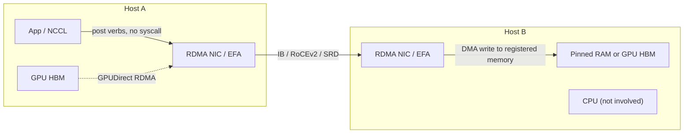

# A3 Memory Management
> Last verified: 2026-10 · Audience: senior/staff DevOps, SRE, AI eng, NetEng, DevSecOps, architects

## TL;DR
- **DRAM is slow relative to the CPU** (~80–120 ns per random access vs ~1 ns L1 hit); everything is moved in **64-byte cache lines**, so locality and access patterns dominate performance more than raw capacity.
- **Virtual memory** gives every process a private address space; the **MMU** translates virtual → physical through **multi-level page tables** (4-level, 48-bit on x86-64; 5-level/57-bit optional) cached by the **TLB**. A TLB miss = page walk = up to 4–5 extra memory reads.
- **Huge pages** (2 MiB / 1 GiB on x86-64) cut TLB misses and page-table size. Static **HugeTLB** for DBs (PostgreSQL `huge_pages`, Oracle, JVM); **THP** is workload-dependent (`madvise` is the safe default; MongoDB ≥8.0 now *wants* THP on, older versions wanted it off).
- Linux **overcommits** by default (`vm.overcommit_memory=0`); memory is committed lazily on first touch (page fault). When reclaim fails the **OOM killer** picks a victim via `oom_score` (+`oom_score_adj`, −1000..1000), or within a **cgroup** that hits `memory.max`.
- **Swap** is not evil: `vm.swappiness` (0–200, default 60) is the relative cost of swapping anon vs dropping page cache. **Kubernetes node swap is GA since v1.34** (`LimitedSwap`, cgroup v2 only, Burstable pods only).
- **Memory metrics:** VSZ (reserved address space, mostly meaningless), **RSS** (resident, double-counts shared pages), **PSS** (shared pages divided proportionally — sums correctly), **USS** (private only). Containers are judged by the **cgroup working set** (usage − `inactive_file`), not RSS.
- **NUMA:** multi-socket/chiplet systems have local vs remote memory (remote ~1.3–2× latency); pin DB/latency-sensitive processes, watch `numa_miss`, keep `zone_reclaim_mode=0` for most servers.
- **DMA** lets devices write RAM without the CPU (via IOMMU-translated addresses); **RDMA** extends that across the network (InfiniBand/RoCE/AWS EFA) — the basis of GPU clusters (NCCL, GPUDirect RDMA) and kernel-bypass storage.

---

## A3.1 The Anatomy of Memory
- **How it works:**
  - **DRAM** cell = 1 transistor + 1 capacitor; leaks, so it must be **refreshed** (every ~64 ms per row; ~32 ms at high temp). **SRAM** (6T, no refresh) is used for CPU caches/registers: faster, larger, pricier.
  - Organisation: **channel → DIMM → rank → bank (bank groups) → row → column**. Opening a row loads it into the bank's **row buffer**; hits in an open row are cheap, row conflicts (precharge + activate) are expensive. Timings `CL-tRCD-tRP` (e.g. DDR5-6400 CL32).
  - **DDR5** (current server standard): 2 independent 32-bit subchannels per DIMM, on-die ECC (for cell reliability, *not* a replacement for side-band ECC), PMIC on DIMM. Servers use **RDIMMs with ECC** (SECDED / Chipkill-class) — correctable errors show in `edac`/`rasdaemon`, MCE logs.
  - **Memory hierarchy (rough orders):** register ~0.3 ns · L1 ~1 ns · L2 ~3–4 ns · L3 ~10–20 ns · local DRAM ~80–100 ns · remote NUMA ~130–200 ns · CXL-attached memory ~170–250 ns · NVMe ~10–100 µs · network RTT in-AZ ~100–500 µs.
  - Bandwidth: per DDR5-4800 channel ≈ 38.4 GB/s; a 12-channel server socket ≈ 460 GB/s. **HBM** (GPU/accelerator) gives TB/s — this is why LLM inference is memory-bandwidth-bound.
  - **CXL** (Compute Express Link, 2.0/3.x): memory expansion & pooling over PCIe 5/6 PHY; appears as a CPU-less NUMA node. Emerging "far memory" tier.
- **Trade-offs / when to use:**
  - More channels populated evenly > more GB on fewer channels (bandwidth scales with channels; unbalanced DIMMs lose interleaving).
  - ECC is mandatory for servers/DBs; silent bit flips corrupt data and checksums.
- **Interview angles:**
  - "Why is memory 'slow' if it's RAM?" → latency hasn't improved much in 20 years (~tens of ns) while CPUs did; caches + prefetchers + out-of-order execution hide it. Count **cache misses**, not instructions.
  - "What limits LLM token generation?" → each decoded token reads all weights once → **memory bandwidth / HBM**, not FLOPs (see [K section](../K-ai-infra-llm/)).
  - Pitfall: confusing DDR5 on-die ECC with end-to-end ECC.

## A3.2 Reading and Writing from and to Memory
- **How it works:**
  - The CPU never reads a single byte from DRAM; it requests a **64-byte cache line** through L1→L2→L3→memory controller. Writes are **write-back**: line is fetched (**read-for-ownership**), modified in cache, flushed later on eviction.
  - **Cache coherence** (MESI/MOESI/MESIF) keeps cores consistent; writing a line invalidates it in other cores → **false sharing** when two threads write different variables in the same line (fix: pad/align to 64 B).
  - Hardware **prefetchers** detect sequential/strided access → arrays beat linked lists; random pointer chasing pays full DRAM latency each hop.
  - **Store buffers & memory ordering:** x86 is TSO (stores can be reordered after later loads); ARM (Graviton/Ampere) is weakly ordered → code with data races "working on x86" can break on ARM. Use proper atomics/barriers.
  - Every access uses a **virtual address** → TLB lookup first (see A3.3), then cache (L1 is VIPT so both overlap).
  - **Non-temporal / streaming stores** bypass cache for large copies; `memcpy`/`memset` use AVX and `rep movsb` (ERMS).
- **Trade-offs / when to use:**
  - Structure-of-arrays vs array-of-structures for scan-heavy data (columnar engines, Arrow/Parquet exploit this).
  - Bigger working set than L3 → throughput drops by an order of magnitude; size hot data structures to the cache.
- **Interview angles:**
  - "Why are columnar DBs fast for analytics?" → sequential, cache-line-dense reads, SIMD, prefetch-friendly.
  - "Two counters on different threads are slow?" → false sharing.
  - Migration to Graviton/ARM: memory-model differences + different page sizes (64 KiB kernels on some ARM distros) — mention both. Deeper CPU-cache detail in [A4 Inside the CPU](../A-operating-systems/) (A4.2).

## A3.3 Virtual Memory
- **How it works:**
  - Each process sees a contiguous private **virtual address space** (x86-64: 48-bit = 256 TiB, split user/kernel 128 TiB each; with **5-level paging/LA57**, 57-bit = 128 PiB). Physical RAM is managed in **pages** (4 KiB base on x86-64; ARM64 4/16/64 KiB).
  - The **MMU** translates using per-process **page tables** pointed to by `CR3` (x86) / `TTBR` (ARM). On a context switch the base register changes; **PCID/ASID** tags avoid full TLB flushes.
  - **Page fault** types: **minor** (page is in RAM, just not mapped — e.g. first touch of zero page, page cache hit, CoW), **major** (needs disk I/O — swap-in or file read), **invalid** → `SIGSEGV`.
  - **Demand paging + overcommit:** `malloc`/`mmap` only reserves VMAs; physical pages are allocated on first write. `vm.overcommit_memory`: `0` heuristic (default), `1` always allow, `2` strict (commit limit = swap + `overcommit_ratio`% of RAM, default 50%).
  - **Copy-on-write (CoW):** `fork()` shares pages read-only; first write copies. Redis `BGSAVE` and PostgreSQL forked backends rely on it (and Redis docs warn THP inflates CoW copies to 2 MiB).

### Page tables and the cost of virtual memory
- x86-64 4-level walk: **PML4 → PDPT → PD → PT → page**, 9 bits per level + 12-bit offset. 5-level adds PML5. Each level is a memory read → a cold **TLB miss costs up to 4–5 DRAM accesses** (page-walk caches help).
- **TLB:** small (L1 dTLB ~64–96 entries; unified L2 STLB ~1.5–3K entries). Reach with 4 KiB pages ≈ 2K × 4 KiB = ~8 MiB — tiny vs a 256 GiB buffer pool → TLB misses dominate for big-memory DBs/JVMs.
- **Page-table memory overhead:** 8 bytes per 4 KiB page ≈ 0.2 % per process mapping. 500 PostgreSQL backends each mapping 64 GiB of `shared_buffers` with 4 KiB pages ≈ 128 MiB page tables *each* (visible as `PageTables` in `/proc/meminfo`) → huge pages fix this.
- **Huge pages:**
  | | HugeTLB (static) | THP (transparent) |
  |---|---|---|
  | Sizes (x86-64) | 2 MiB, 1 GiB | 2 MiB PMD (+ **mTHP** 16K–1M "multi-size THP" on newer kernels, anon/shmem) |
  | Setup | `vm.nr_hugepages`, `hugetlbfs`, `SHM_HUGETLB`/`MAP_HUGETLB` | `/sys/kernel/mm/transparent_hugepage/enabled` = `always` / `madvise` / `never` |
  | Swappable | No (pinned, pre-reserved) | Yes (split on swap) |
  | Risk | Wasted RAM if over-reserved; not counted as "free" | **khugepaged** collapse + **direct compaction** latency spikes, memory bloat (RSS jumps to 2 MiB granularity) |
  - `defrag` modes: `always`, `defer`, `defer+madvise`, `madvise` (common distro default), `never`. Direct compaction stalls are the classic p99 killer.
  - **Database guidance (2026):** PostgreSQL `huge_pages=try` (default; `on` = refuse to start without them), size via `shared_memory_size_in_huge_pages`; Oracle: HugeTLB on, THP off; Redis: disable THP (latency + CoW bloat); **MongoDB ≤7.0: disable THP; MongoDB 8.0+ on x86_64: enable THP** (new per-CPU TCMalloc); JVM: `-XX:+UseLargePages` or `-XX:+UseTransparentHugePages`.
  - Kubernetes: request `hugepages-2Mi` / `hugepages-1Gi` as resources (must be pre-allocated on the node; requests must equal limits).
- **Cost of virtual memory summary:** TLB misses, page-walk memory reads, page-table RAM, page-fault handling (~µs minor, ~ms major), TLB shootdowns (IPIs) on `munmap`/`mprotect` across cores. Meltdown mitigations (**KPTI**) added CR3 switches on syscalls → PCID mattered.

### Internal vs external fragmentation
- **Internal:** allocated block larger than needed — page granularity (a 5 KiB object uses 8 KiB), slab/size-class rounding, THP mapping 2 MiB for sparse use.
- **External:** enough free memory in total but not **contiguous** — the buddy allocator can't satisfy order-9 (2 MiB) requests → THP/hugepage allocation fails or triggers **compaction** (`kcompactd`). Inspect `/proc/buddyinfo`, `/proc/pagetypeinfo`.
- **Virtual memory solves external fragmentation for user space** (non-contiguous physical frames look contiguous), but not for the kernel/DMA needing physically contiguous buffers (→ CMA, IOMMU).
- **User-space allocator fragmentation** (glibc malloc arenas, `MALLOC_ARENA_MAX`) is why long-running services "leak" without leaking → jemalloc/tcmalloc/mimalloc; Redis reports `mem_fragmentation_ratio`.

### Shared memory, isolation, swap
- **Isolation:** separate page tables per process; permissions per page (R/W/X, **NX**, user/supervisor; **SMEP/SMAP** stop the kernel executing/accessing user pages). **ASLR** randomises layout. Cross-VM isolation adds a second stage (**EPT/NPT** — a nested walk can cost up to 24 memory refs, hence huge pages on hypervisors).
- **Shared memory:** same physical frames mapped into multiple processes — shared libraries (`.text`), `mmap(MAP_SHARED)`, POSIX `shm_open` (`/dev/shm`, tmpfs), SysV shm (PostgreSQL ≥9.3 uses a small SysV segment + anonymous shared mmap). **KSM** dedups identical pages (VMs) — side-channel risk. Containers: `/dev/shm` default 64 MiB in Docker (`--shm-size`; in k8s use `emptyDir: {medium: Memory}`) — a classic PyTorch DataLoader / Chrome / PostgreSQL failure.
- **Swap:** anonymous pages written to swap device/file; file-backed pages are just dropped (re-read from file). **zswap** (compressed cache in front of swap) and **zram** (compressed RAM block device) are common on desktops/ChromeOS/Fedora.
  - `vm.swappiness` 0–200, **default 60**; = relative IO cost of swapping anon vs reclaiming page cache (100 = equal; 0 = avoid swap until free+file pages fall below high watermark; does **not** fully disable swap). DB servers commonly set 1–10.
  - Swap's real value: lets the kernel evict **cold anon pages** (init-only code, leaked-but-unused heap) so RAM goes to page cache; gives a gradual degradation (+ PSI signal) instead of an instant OOM kill. Downside: unpredictable latency, thrashing.
  - **Monitor `si/so` in `vmstat`, not swap "used"** — used-but-idle swap is fine; sustained swap-in is the problem. Prefer **PSI** (`/proc/pressure/memory`, `some`/`full` avg10/60/300) to detect thrashing.
- **Kubernetes swap (current status):**
  - Historically kubelet refused to start with swap on (`failSwapOn: true`). Node swap: alpha 1.22 → beta 1.28 → **GA in v1.34** (Aug 2025). cgroup **v2 only**, Linux only.
  - `memorySwap.swapBehavior`: **`NoSwap`** (default when swap is enabled — pods get `memory.swap.max=0`, system daemons can still swap) or **`LimitedSwap`**.
  - `LimitedSwap`: only **Burstable** pods swap; **Guaranteed** and **BestEffort** do not; high-priority (`system-node-critical`/`system-cluster-critical`) pods are excluded. Per-container limit = `(container memory request / node memory capacity) × node swap available to pods`.
  - Memory-backed volumes (`emptyDir: Memory`, secrets) are mounted tmpfs **`noswap`** (kernel ≥6.4) so secrets never hit disk. Recommend **dedicated, encrypted swap disk**, no swap on control plane/etcd. Metrics: `node_swap_usage_bytes`, `container_swap_usage_bytes`, `kubectl top pod --show-swap`.
  - Managed status varies (check EKS/AKS docs; typically requires custom node config) *(unverified per provider)*.
- **Interview angles:**
  - "Should prod have swap?" → Nuanced: small swap + low swappiness + PSI-based alerting gives a buffer and reclaims cold anon; latency-critical in-memory stores (Redis, Elasticsearch, Kafka brokers' JVM heap) are often run with swap off or `swappiness=1` and `mlock`. Never use swap to "add capacity".
  - "TLB miss vs page fault?" → TLB miss = translation not cached → hardware page walk (ns). Page fault = PTE not present/permission → kernel trap (µs–ms).
  - "Why does my DB on a 512 GiB host have high sys CPU?" → page-table/TLB overhead, THP compaction, NUMA balancing — enable HugeTLB, set THP `madvise`/`never`, check `numastat`.
  - "Process VSZ is 40 GiB, is it leaking?" → no, look at RSS/PSS/working set (A3.5).

### OOM killer
- Triggers when an allocation can't be satisfied after reclaim/compaction, globally or **inside a memory cgroup** at `memory.max`.
- Victim = highest `/proc/<pid>/oom_score` (≈ % of RAM+swap used ×10, plus `oom_score_adj` −1000..+1000; −1000 = never kill). Logged as `Out of memory: Killed process … total-vm, anon-rss, file-rss, shmem-rss` in `dmesg`.
- Sysctls: `vm.panic_on_oom` (0 default), `vm.oom_kill_allocating_task` (0 default). Container exit code **137** (`SIGKILL`) + `OOMKilled` reason.
- **Kubernetes:** `oom_score_adj` Guaranteed = **−997**, BestEffort = **1000**, Burstable = scaled by request/capacity (2..999). Kubelet sets cgroup v2 `memory.oom.group=1` so the whole container is killed (since 1.28; `singleProcessOOMKill` kubelet option to revert). Kubelet **eviction** (`memory.available<100Mi` hard default) should fire *before* the kernel OOM killer.
- User-space killers acting on PSI: **systemd-oomd** (Fedora/Ubuntu default), Meta's **oomd**, Android **lmkd** — kill earlier and more predictably than the kernel.

### cgroup v2 memory accounting
| File | Meaning |
|---|---|
| `memory.current` | Total usage incl. **page cache, anon, kernel memory (slab, dentries/inodes), TCP socket buffers** |
| `memory.min` / `memory.low` | Hard / best-effort protection from reclaim (k8s `MemoryQoS` uses these) |
| `memory.high` | Throttle point: heavy reclaim + allocation slowdown, **no OOM** |
| `memory.max` | Hard limit → cgroup OOM kill (k8s `limits.memory`) |
| `memory.swap.max`, `memory.zswap.max` | Swap / zswap caps |
| `memory.peak` | High-water mark (resettable on newer kernels) |
| `memory.events` | Counters `low`, `high`, `max`, `oom`, `oom_kill` |
| `memory.stat` | Breakdown: `anon`, `file`, `active_file`, `inactive_file`, `shmem`, `slab`, `sock`, `pgmajfault`… |
| `memory.pressure` | Per-cgroup PSI |
- Page cache is charged to the cgroup that first touched the page → a log-reading sidecar can "own" another container's file cache.
- Kubernetes **working set** = `memory.current − inactive_file`; this (not RSS) drives eviction and `kubectl top`. `active_file` is *not* subtracted → apps doing heavy file I/O can look near their limit and be evicted prematurely (known issue).
- k8s cgroup v1 is in maintenance since 1.31; recent kubelets refuse to start on v1 by default (`failCgroupV1`) — plan migration to v2 (RHEL 9+, Ubuntu 21.10+, AL2023 are v2 by default).
- JVM/Go/Node: make runtimes cgroup-aware (JDK ≥ 8u191/10 reads cgroup limits; `-XX:MaxRAMPercentage=75`; Go 1.19+ `GOMEMLIMIT`; Node `--max-old-space-size`) — leave headroom for off-heap, thread stacks, page cache.

### NUMA
- Multi-socket and chiplet CPUs (AMD EPYC NPS1/2/4, Intel SNC) expose **NUMA nodes**: local memory faster than remote (cross-socket via UPI/Infinity Fabric). `numactl --hardware` shows distances (10 local, ~20–32 remote).
- Default policy: **first-touch local allocation**; **AutoNUMA** (`kernel.numa_balancing=1`) migrates pages/tasks — can cause overhead for DBs. `vm.zone_reclaim_mode=0` (default) is right for file servers/DBs; `1` reclaims locally before going remote (causes stalls).
- Large DB on one NUMA node can exhaust local memory and swap/OOM while the other node is free ("swap insanity" — MySQL fix: `innodb_numa_interleave=ON` / `numactl --interleave=all`).
- **Kubernetes:** `Topology Manager` (`single-numa-node` policy) + CPU Manager `static` + Memory Manager align CPUs, memory, GPUs/NICs (SR-IOV) on one NUMA node for Guaranteed pods — key for DPDK/telco/AI.
- GPUs: keep data-loader threads + NIC on the GPU's NUMA node (`nvidia-smi topo -m`).
- Cloud: large instances (e.g. `*.metal`, 48xlarge, Azure M/HB series) expose multiple NUMA nodes to the guest; smaller sizes usually one.

## A3.4 DMA (Direct Memory Access)
- **How it works:**
  - Device (NIC, NVMe, GPU) reads/writes RAM directly via bus-master transactions over PCIe; CPU only sets up **descriptor rings** and handles a completion **interrupt** (or polls). Frees CPU from copying each byte (vs PIO).
  - Driver maps buffers with the DMA API → **bus/IO virtual addresses**; the **IOMMU** (Intel VT-d / AMD-Vi / ARM SMMU) translates them and restricts devices to permitted pages (protects against malicious/buggy devices; required for VFIO/**SR-IOV** device passthrough to VMs).
  - Buffers must be **pinned** (non-swappable); contiguous via IOMMU or CMA. Cache coherence on x86 is handled by hardware snooping; some ARM SoCs need explicit sync.
  - **Zero-copy paths:** `sendfile()`, `splice()`, `MSG_ZEROCOPY`, `io_uring` registered buffers, kTLS — avoid user↔kernel copies; DMA does the device↔RAM leg.
  - **Kernel bypass:** **DPDK** (NIC rings polled in user space), **SPDK** (NVMe), **AF_XDP** — DMA directly into user-mapped hugepage buffers (why DPDK requires hugepages).
- **RDMA (Remote DMA):**
  - NIC writes directly into a **remote host's registered memory** — no remote CPU, no kernel, no copies. Verbs: one-sided `READ`/`WRITE`/atomics; two-sided `SEND`/`RECV`. Memory must be **registered/pinned** (memory regions + keys).
  - Transports: **InfiniBand** (lossless, credit-based; HDR 200 / NDR 400 / XDR 800 Gb/s), **RoCEv2** (RDMA over UDP/IP Ethernet — needs PFC/ECN/DCQCN lossless tuning), **iWARP** (over TCP).
  - **GPUDirect RDMA**: NIC DMAs straight into GPU HBM, bypassing host RAM — what NCCL all-reduce uses for multi-node training.
  - Cloud: **AWS EFA** — OS-bypass via **libfabric**, AWS **SRD** transport (multipath, out-of-order reliable datagrams, not InfiniBand/RoCE); RDMA read on Nitro v4+, RDMA write on most Nitro v4+; GPUDirect RDMA on P5/P5e/P5en/P6; EFA traffic **can't cross AZs/VPCs and is not routable**. **Azure**: real InfiniBand on HB/HC/HX/ND-series (SR-IOV), VMs must be in the same **VMSS (single placement group)** or availability set; RDMA network reserves `172.16.0.0/16`.
- **Trade-offs / when to use:**
  - DMA + interrupts is the default; at very high packet/IO rates interrupts cost too much → NAPI/polling, interrupt coalescing, kernel bypass.
  - RDMA: microsecond latency, near-zero CPU — but needs pinned memory, lossless fabric or specialised transport, special NICs, and bypasses kernel firewalls/observability.
  - IOMMU adds small translation overhead (IOTLB misses); `iommu=pt` (passthrough) on trusted bare metal for performance.
- **Interview angles:**
  - "How does a packet get from wire to app?" → NIC DMAs into RX ring (pre-allocated `sk_buff` pages) → IRQ/NAPI poll → stack → socket buffer → `recv()` copy (see [A7 / F4 socket queues](../A-operating-systems/) A7.1, F4.9, H6.7).
  - "Why can't I just use TCP for multi-node GPU training?" → kernel copies + CPU overhead + tail latency; RDMA/EFA + GPUDirect deliver ~400–3200 Gb/s per node with low CPU.
  - Security: DMA attacks (Thunderbolt/PCIe) — IOMMU + kernel DMA protection; in VMs the hypervisor's IOMMU confines passthrough devices.

## A3.5 Reading memory usage: virtual, resident, shared
- **How it works:**
  | Metric | Source | Meaning | Pitfall |
  |---|---|---|---|
  | **VSZ / VIRT** | `ps`, `top` | Total mapped virtual address space | Includes reserved-but-untouched, mapped files, guard regions; JVM/Go/glibc arenas → huge and meaningless |
  | **RSS / RES** | `/proc/<pid>/status` `VmRSS` | Pages currently resident (anon + file + shmem) | Counts shared pages fully in every process → summing RSS over-counts |
  | **SHR** | `top` | Resident shared (file-backed + shmem) | Shared ≠ actually shared with someone |
  | **PSS** | `/proc/<pid>/smaps_rollup` | Private + shared ÷ number of sharers | Sums correctly to total; costlier to compute |
  | **USS** | `smem` | Private only | = memory freed if process exits |
  | **Swap / SwapPss** | `smaps` | Anon pages on swap | Not in RSS |
  | **AnonHugePages** | `smaps` | THP-backed anon | Explains RSS jumps |
  - System view: `free -h` → **`available`** (estimate of reclaimable + free, from `MemAvailable`) is what matters; "free" being low is normal (page cache). `buff/cache` is reclaimable *except* dirty pages, shmem/tmpfs, and locked pages.
  - `/proc/meminfo` key lines: `MemAvailable`, `Cached`, `Shmem`, `AnonPages`, `Slab`/`SReclaimable`/`SUnreclaim`, `PageTables`, `HugePages_Total/Free`, `Committed_AS` vs `CommitLimit`.
  - Containers: use cgroup `memory.current`/`memory.stat`, cAdvisor `container_memory_working_set_bytes` (what OOM/eviction track) vs `container_memory_rss`.
- **Trade-offs / when to use:**
  - Capacity planning per process → PSS; "what would I free by killing this" → USS; container limits/alerts → working set; leak detection → anon RSS trend over days (not VSZ).
  - Postgres: each backend's RSS includes touched `shared_buffers` pages → many backends look huge; PSS shows the truth.
- **Interview angles:**
  - "`free` shows 1 GiB free on a 64 GiB box — problem?" → No if `available` is high and no swap-in/PSI; Linux uses idle RAM as page cache.
  - "Sum of RSS > physical RAM?" → shared pages double-counted; use PSS.
  - "Pod OOMKilled but app heap is small?" → page cache from writes (dirty), tmpfs `emptyDir: Memory`, kernel/socket memory, off-heap/native buffers, thread stacks all charge the cgroup.
  - Kernel slab leak (dentry cache from millions of files) shows in `Slab` not process RSS → `slabtop`.
  - Process memory mappings in detail: [A2.7 /proc/<pid>/maps](../A-operating-systems/) (A2.7).

## Diagrams




## Cloud mapping: AWS vs Azure
| Capability | AWS | Azure | Role it plays | Key differences | Alternatives |
|---|---|---|---|---|---|
| Memory-optimized general | **R** family (R7i/R7a/R8g/R8i, ~8 GiB/vCPU) | **E** series (Ev5/Ev6, Ebsv5/Ebdsv5, Epsv6 ARM) ~8 GiB/vCPU | DBs, caches, JVM heaps | AWS Graviton (R8g) vs Azure Cobalt (Epsv6) for ARM; Eb = higher remote-disk throughput | GCP M3/N4-highmem |
| High memory per vCPU | **X** family (X2idn/X2iedn up to 4 TiB, X8g up to 3 TiB, X2iezn high-freq) ~16–32 GiB/vCPU | **M** series (Msv3/Mdsv3 Medium Memory up to ~4 TB) | SAP HANA, large in-memory DBs, EDA | X2iedn has local NVMe; M-series has Write Accelerator for log disks | Bare-metal / on-prem |
| Ultra-high memory | **U7i/U7in/U7inh** (6–32 TiB); older U-*tb1 no longer launchable | **Msv3 High Memory** (6–16 TB), Mv2 | Scale-up SAP HANA | Both are SAP-certified; capacity reservations usually needed | Scale-out HANA, distributed DBs |
| RDMA fabric | **EFA** (SRD over Ethernet, libfabric, GPUDirect on P5/P6) | **InfiniBand** on HB/HC/HX/ND (NDR on newest) | MPI/NCCL, AI training | EFA: not routable, single AZ/VPC; Azure IB: same VMSS placement group/availability set, `172.16.0.0/16` reserved | GCP GPUDirect-TCPX/RoCE, on-prem IB |
| Huge pages / NUMA control | Full guest control on Nitro; metal instances expose real NUMA | Full guest control; large M/HB sizes expose NUMA | DB tuning | Same Linux knobs; verify NUMA layout per size | — |
| Managed k8s swap | EKS: node config via launch template/bootstrap *(unverified)* | AKS: custom node configuration (`failSwapOn`, swap file) *(unverified)* | Pod density | Both follow upstream `LimitedSwap` semantics | Self-managed kubelet config |

- **R vs X (AWS):** R ≈ 8 GiB/vCPU for typical DBs (RDS `db.r*`), X ≈ 16–32 GiB/vCPU for licensing-per-core workloads (Oracle/SQL Server: fewer cores, same RAM → lower license cost); U7i for multi-TiB HANA.
- **E vs M (Azure):** E-series for most DBs/caches (Azure SQL MI/Business Critical uses memory-optimized hardware); M-series for SAP HANA/Large SQL. Constrained-vCPU sizes (AWS "optimize CPUs", Azure constrained-core sizes like `E32-8s_v5`) cut per-core licensing.
- Managed caches: ElastiCache/MemoryDB (r-family nodes) ↔ Azure Cache for Redis / **Azure Managed Redis** — both reserve memory for CoW/fork (`reserved-memory-percent` / `maxmemory-reserved`), the A3.3 CoW point in practice.
- Alternatives: Kubernetes Topology/Memory Manager for NUMA on any cloud; Databricks/Spark executors on memory-optimized nodes (watch `spark.executor.memoryOverhead` = off-heap counted by cgroup).

## Hands-on (optional)
```bash
# Who is really using memory? (PSS sorts correctly)
for p in /proc/[0-9]*; do awk -v p="${p#/proc/}" '/^Pss:/{print $2, p}' "$p/smaps_rollup" 2>/dev/null; done | sort -rn | head
free -h; grep -E 'MemAvailable|PageTables|AnonHugePages|HugePages_|Committed_AS|CommitLimit' /proc/meminfo
vmstat 1 5                      # si/so = swap-in/out; >0 sustained = thrashing
cat /proc/pressure/memory       # PSI some/full
# THP / swappiness / NUMA
cat /sys/kernel/mm/transparent_hugepage/{enabled,defrag}
sysctl vm.swappiness vm.overcommit_memory vm.zone_reclaim_mode kernel.numa_balancing
numactl --hardware; numastat -m
# Reserve 2 MiB huge pages for a DB (persist in /etc/sysctl.d/)
sudo sysctl -w vm.nr_hugepages=4096
psql -c "SHOW shared_memory_size_in_huge_pages;"
# cgroup v2 view of a container/pod
CG=/sys/fs/cgroup/$(awk -F: '{print $3}' /proc/self/cgroup)
cat $CG/memory.current $CG/memory.max $CG/memory.events
grep -E '^(anon|file|inactive_file|active_file|shmem|slab|sock) ' $CG/memory.stat
# OOM forensics
dmesg -T | grep -iE 'out of memory|oom-kill'; cat /proc/<pid>/oom_score /proc/<pid>/oom_score_adj
```

```yaml
# KubeletConfiguration fragment: enable LimitedSwap (cgroup v2, swap pre-provisioned)
apiVersion: kubelet.config.k8s.io/v1beta1
kind: KubeletConfiguration
failSwapOn: false
memorySwap:
  swapBehavior: LimitedSwap
```

## Cross-links
- [A2 Anatomy of a Process](../A-operating-systems/) (A2.3 stack, A2.6 heap, A2.7 `/proc/<pid>/maps`)
- [A4 Inside the CPU](../A-operating-systems/) (A4.2 cache lines, A4.3 SMT)
- [A7 sockets and kernel queues](../A-operating-systems/) (A7.1) · [F4.9](../F-network-engineering/) · [H6.7](../H-full-stack-troubleshooting/) — DMA/NIC rings
- [B database engineering](../B-database-engineering/) — buffer pools, shared_buffers, huge pages
- [C1 Performance / caching](../C-large-scale-architecture/) (C1.26–C1.30)
- [H troubleshooting tools](../H-full-stack-troubleshooting/) (H1, H2) — `vmstat`, `free`, PSI
- [K AI infra](../K-ai-infra-llm/) — HBM bandwidth, NCCL, GPUDirect RDMA, EFA/InfiniBand

## Sources
- https://docs.kernel.org/admin-guide/cgroup-v2.html
- https://docs.kernel.org/admin-guide/mm/transhuge.html
- https://docs.kernel.org/admin-guide/sysctl/vm.html
- https://man7.org/linux/man-pages/man5/proc_pid_smaps.5.html
- https://kubernetes.io/docs/concepts/cluster-administration/swap-memory-management/
- https://kubernetes.io/blog/2026/10/05/scaling-kubernetes-workloads-with-node-swap/
- https://github.com/kubernetes/enhancements/blob/master/keps/sig-node/2400-node-swap/README.md
- https://kubernetes.io/docs/concepts/scheduling-eviction/node-pressure-eviction/
- https://www.postgresql.org/docs/current/runtime-config-resource.html
- https://www.mongodb.com/docs/v8.0/tutorial/disable-transparent-huge-pages/
- https://docs.aws.amazon.com/AWSEC2/latest/UserGuide/efa.html
- https://docs.aws.amazon.com/ec2/latest/instancetypes/mo.html
- https://learn.microsoft.com/en-us/azure/virtual-machines/sizes/high-performance-compute/setup-infiniband
- https://learn.microsoft.com/en-us/azure/virtual-machines/sizes/memory-optimized/m-family
