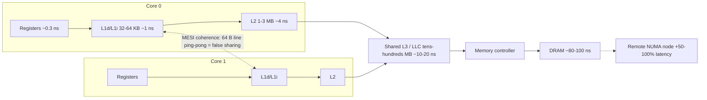
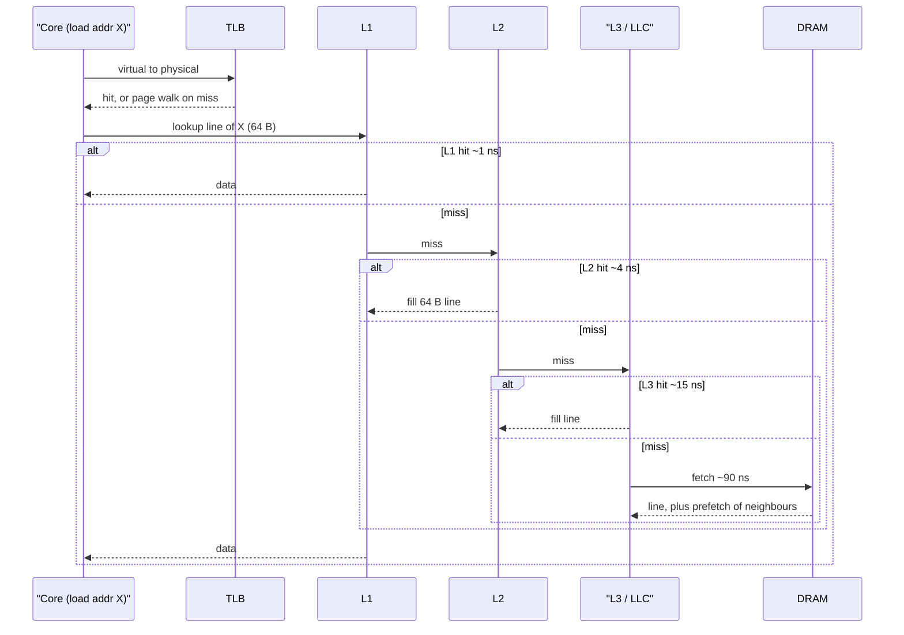
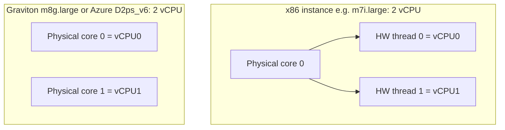
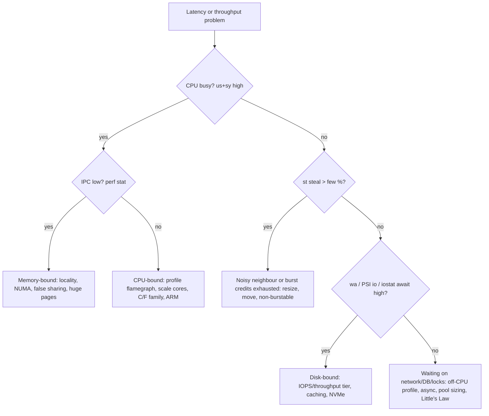

# A4 Inside the CPU
> Last verified: 2026-10 · Audience: senior/staff DevOps, SRE, AI eng, NetEng, DevSecOps, architects

## TL;DR
- A core = **control unit + ALUs/FPUs/vector units + registers + private L1/L2**; cores share **L3 (LLC)** and the memory controller. Memory is ~100x slower than L1, so **cache locality dominates real-world performance**, not GHz.
- Caches move data in **64-byte cache lines** (x86, Graviton/Neoverse). Two threads writing different variables on the same line cause **false sharing**: the line ping-pongs between cores via coherence (MESI), and throughput collapses with no visible bug.
- Modern CPUs are **pipelined, superscalar, out-of-order and speculative**; branch mispredicts and cache misses stall the pipeline. Speculation is also the root of Spectre/Meltdown-class side channels.
- **SMT/Hyper-Threading** = 2 hardware threads sharing one core's execution units; gives roughly +15–30% throughput, not 2x. **On AWS/Azure x86, 1 vCPU = 1 hyperthread** (half a core); on **Graviton, Cobalt 100, AWS M7a/C7a/R7a and Azure Fasv6, 1 vCPU = 1 full physical core**.
- **ARM vs x86:** Graviton (AWS) and Cobalt/Ampere (Azure) give better price-performance and energy use for scale-out Linux workloads (AWS says Graviton costs up to 20% less than comparable x86 and uses up to 60% less energy). The cost is a multi-arch build pipeline and checking that native or licensed software runs on arm64.
- **Burstable families** (AWS T3/T3a/T4g/T8i, Azure B-series v2) bank **CPU credits** below a baseline. AWS T3+ defaults to **Unlimited**, which means a surprise bill. Azure B-series **throttles to baseline** when it runs out of credits. Both are wrong for sustained CPU load.
- **Steal time** (`st` in top/vmstat, field 8 of `/proc/stat`) is time your vCPU was runnable but the hypervisor ran something else. Sustained steal points to a noisy neighbour, CPU-credit exhaustion or an oversubscribed host, so resize or move the VM.
- **Size by bottleneck.** For CPU-bound work, threads ≈ cores and you buy faster or more cores (C / F families). For IO-bound work, threads ≫ cores or you go async, buy network/EBS/disk bandwidth, and look at memory-heavy families. Measure first with USE (utilization, saturation, errors), run queue, PSI and iowait.



---

## A4.1 CPU Components and Architecture
- **How it works:**
  - **Control unit (CU):** fetches and decodes instructions, then dispatches them to execution units. On x86, CISC instructions are decoded into internal **micro-ops (µops)**, so the core behind the decoder is effectively RISC-like.
  - **ALU / FPU / SIMD units:** integer, floating-point and vector math (x86 **AVX2/AVX-512/AMX**; ARM **NEON/SVE/SVE2**). Vector width matters for ML inference, compression, crypto and JSON parsing.
  - **Registers:** the fastest storage, under 1 cycle. x86-64 has 16 general-purpose registers (32 with APX). AArch64 has 31. Special registers include the program counter/RIP, the stack pointer and flags.
  - **Caches:** L1i/L1d per core (typically 32–64 KB each), L2 per core (1–3 MB on current server parts) and a shared L3/LLC. Cobalt 200 has 3 MB L2 per core and 192 MB L3. Graviton5 has more than 5x Graviton4's L3.
  - **Clock speed:** cycles/sec (3–4 GHz). **Performance ≈ IPC × frequency × cores**. Turbo or boost clocks fall when many cores are busy or the chip runs hot. Cloud docs quote "all-core turbo" versus "max turbo", so read which one.
  - **Cores:** independent execution engines. Current server sockets: Graviton4 96 cores, **Graviton5 192 cores** (GA June 2026), Cobalt 100 128 cores, **Cobalt 200 132 cores**, AMD EPYC Genoa/Turin up to 96–192 cores.
  - **NUMA:** multi-socket or chiplet designs mean "local" and "remote" memory. A remote access costs noticeably more latency, so pin big DBs and JVMs per NUMA node (`numactl`).
- **RISC vs CISC:**

  | | RISC (ARM/AArch64, RISC-V) | CISC (x86-64) |
  |---|---|---|
  | Instructions | Fixed-length (4 B on AArch64), load/store only | Variable 1–15 B, memory operands allowed |
  | Decode | Simple and cheap, so wide decode is easy | Complex decoders plus a µop cache |
  | Power | Lower W per core, so better perf/W | Higher clocks, strong single-thread performance |
  | Memory model | **Weakly ordered**, needs explicit barriers | **TSO** (stronger ordering) |
  | Cloud | Graviton, Cobalt, Ampere Altra | Intel Xeon, AMD EPYC |

  - The weak memory model matters in practice: lock-free C/C++ code that "worked on x86" can break on ARM if it relied on TSO instead of proper atomics.
- **32 vs 64 bit:**
  - 64-bit means 64-bit registers and pointers, and therefore a very large virtual address space. x86-64 uses 48-bit virtual addresses (256 TiB), or 57-bit with 5-level paging. A 32-bit process is capped at 4 GiB.
  - 64-bit pointers enlarge data structures. That is why the JVM uses **compressed oops** below ~32 GB heap, and why heaps sized just above 32 GB can perform worse.
  - Cloud images are 64-bit only: `x86_64`/`amd64` and `arm64`/`aarch64`. A **container image must match the arch** or you hit `exec format error`.
- **Trade-offs / when to use:** prefer high-clock or full-core SKUs for single-threaded or latency-bound work (game servers, Redis main thread, Node.js event loop). Prefer many-core ARM for horizontally scaled stateless services.
- **Interview angles:**
  - If asked "why is a 3 GHz CPU from 2024 faster than a 3 GHz CPU from 2015?", say higher IPC (wider out-of-order engine, better branch predictors, bigger caches) and more memory bandwidth (DDR5).
  - If asked about migrating to ARM, cover: multi-arch images (`docker buildx --platform linux/amd64,linux/arm64`), native dependencies and wheels, JIT maturity (Java/.NET/Node are fine), licensed or closed-source agents, and memory-ordering bugs in custom lock-free code.

## A4.2 Instruction Life Cycle (L1/L2/L3 lookups, 64 byte cache lines)
- **How it works:**
  - The classic cycle is **Fetch → Decode → Execute → Memory access → Write-back**. Each stage reads the instruction or operand from the nearest level that has it: **L1 → L2 → L3 → DRAM** (and then page fault → disk).
  - Approximate latencies: L1 ~1 ns (4–5 cycles), L2 ~3–5 ns, L3 ~10–20 ns, DRAM ~80–100 ns, a remote NUMA node more still. Jeff Dean's "latency numbers" is the classic reference.
  - **The cache line is the unit of transfer:** **64 bytes** on x86 and Neoverse/Graviton. Apple M-series uses 128 B, and some Intel prefetchers pull pairs of lines (128 B), so padding to 128 B is the conservative choice.
  - Reading 1 byte loads all 64 bytes. **Sequential access is fast** because of spatial locality and the hardware prefetcher. **Pointer chasing** (linked lists, trees, hash maps with chaining) is slow.
  - Address translation goes through the **TLB** before the cache. A TLB miss triggers a page-table walk, so huge pages (2 MB/1 GB) cut misses for large heaps and databases (see [A3 Memory Management](../A-operating-systems/) (A3.3)).
  - **Cache coherence (MESI/MOESI):** a write to a line invalidates copies held by other cores. A line that is **Modified** on core A must be transferred before core B can write it.
- **False sharing:**
  - What it is: two hot variables written by different threads sit in the **same 64 B line**. Each write invalidates the other core's copy, the line bounces between cores ("cache-line ping-pong"), and scaling goes *negative* as you add threads.
  - Typical culprits: per-thread counters in an array, the head and tail indices of a queue, adjacent atomics, and metrics structs.
  - Fixes: **pad or align to 64/128 B** (C++ `alignas(std::hardware_destructive_interference_size)`, Java `@Contended`, Go padding fields), use per-thread or per-CPU sharded counters merged on read (the Linux kernel's per-CPU variables, LongAdder in Java), and batch updates.
  - Detection: `perf c2c` (cache-to-cache HITM events), a high LLC miss rate with low IPC, and throughput that falls as threads are added.
  - **True sharing**, where threads really do write the same variable, is a contention or lock problem. See [Locking and concurrency](../B-database-engineering/) (B7, C1.20–C1.24).
- **Trade-offs / when to use:** struct-of-arrays layouts and contiguous arrays beat object graphs for hot loops. Padding wastes memory, so apply it only to proven-hot, write-shared fields.
- **Interview angles:**
  - If asked "the service got slower when we went from 8 to 32 threads with no lock contention", say false sharing (or memory bandwidth saturation), and verify with `perf c2c` or IPC.
  - If asked why arrays beat linked lists even for inserts, say cache lines plus prefetching; big-O ignores memory latency.
  - Follow-up on why a 64-byte line: it balances bandwidth and spatial locality against false sharing and wasted transfer.



## A4.3 Pipelining and Parallelism (hyper-threading / SMT)
- **How it works:**
  - **Pipelining:** overlap the stages of consecutive instructions, the way an assembly line works. Modern cores have 10–20+ stages.
  - **Superscalar:** issue multiple µops per cycle (Neoverse V2/V3 and Zen 4/5 issue 6–8+ wide).
  - **Out-of-order (OoO):** execute instructions whose operands are ready while earlier ones wait on memory, then retire them in order.
  - **Branch prediction plus speculation:** guess the branch outcome and execute ahead. A mispredict flushes the pipeline (~15–20 cycles). Sorted data makes branches predictable, which is the famous "sorted array is faster" effect.
  - **Hazards:** data dependencies, control (branches) and structural (a contended unit). Stalls show up as **low IPC** in `perf stat`. IPC above about 1 is decent; below about 0.5 usually means memory-bound.
  - **Parallelism levels:** ILP (inside one core, done by the hardware), **SIMD/data-level parallelism** (vectors), **TLP** (threads across cores), SMT (threads sharing one core) and multi-socket/NUMA.
  - **SMT / Intel Hyper-Threading:** one core exposes **2 hardware threads**, each with its own architectural registers, sharing the execution units, L1/L2 and the TLB. When one thread stalls on memory, the other fills the idle units. Typical gain is **+15–30%** throughput, and close to zero or negative for FP-heavy or cache-thrashing HPC code.
- **SMT in cloud (key fact):**
  - **AWS:** "Each vCPU is a thread of either an Intel Xeon core or an AMD EPYC core" on most x86 families, with 2 threads per core by default. So **an m7i.large with 2 vCPUs is 1 physical core**.
  - **Graviton (all generations), M7a/C7a/R7a (AMD Genoa) and later AMD generations** have **1 thread per core**, so a vCPU is a full core.
  - On AWS you can set **CPU options**: `threads_per_core = 1` disables SMT, and `core_count` is used for per-core licensing such as Oracle or SQL Server. **You still pay for the full instance.**
  - **Azure:** most x86 series (Dv5/Dv6, Dasv6, Ev5/Ev6) are SMT, so a vCPU is a hyperthread. **Cobalt 100 (Dpsv6/Epsv6)** "provides an entire physical core for each vCPU". **Fasv6/Falsv6/Famsv6** are explicitly **non-SMT** (1 vCPU = 1 full Genoa core). For licensing, Azure offers **constrained-vCPU sizes** (e.g. `Standard_E32-8s_v5`) instead of a threads-per-core option.
  - **Consequence for comparisons:** "4 vCPU x86" ≈ 2 cores plus SMT, while "4 vCPU Graviton/Cobalt" = 4 real cores. Comparing on vCPU count alone favours ARM in benchmarks more than the label suggests.
- **Security:** SMT siblings share L1 and other buffers, which enables side channels (L1TF, MDS, PortSmash). Cloud hypervisors never co-schedule different tenants on sibling threads, because a vCPU pair is pinned to one core. Inside your own VM, the kernel has `mitigations=` and `nosmt` options.
- **Trade-offs / when to use:** keep SMT on for throughput-oriented web, microservice and CI work. Turn it off or choose full-core SKUs for HPC, low-latency trading, per-core-licensed databases and noisy cache-heavy workloads.
- **Interview angles:**
  - If asked "a c6i.xlarge has 4 vCPUs; how many threads should my CPU-bound pool run?", say about 4, but expect only about 2 cores' worth of throughput plus the SMT gain. On c7g.xlarge, 4 vCPUs are 4 real cores.
  - If asked "why did p99 improve after moving to Graviton?", cite no SMT sibling interference, a large per-core L2, and the fact that each vCPU is a full core.
  - Kubernetes: `cpu: "1"` is 1 vCPU, which means 1 hyperthread on x86. CPU Manager `static` policy (Guaranteed QoS, integer CPUs) pins exclusive CPUs. The `full-pcpus-only` option allocates whole physical cores so SMT siblings are not shared across containers.



## A4.4 CPU wait times: IO-bound vs CPU-bound workloads
- **How it works:**
  - **CPU-bound:** time is spent executing instructions (compression, crypto/TLS handshakes, JSON/protobuf serialization, image/video work, ML inference on CPU, regex, GC). Latency scales with clock and IPC, and throughput scales with cores. Symptoms are high `us`/`sy`, run queue > cores, and PSI `cpu some` rising.
  - **IO-bound:** time is spent waiting on disk, network, DB or remote API calls. The thread blocks in uninterruptible (D) or sleeping (S) state. Symptoms are low CPU with high latency, high `wa` (iowait), disk `await`/queue depth, and network RTT.
  - **Memory-bound** is a third class: CPU looks "busy" at 100% but IPC is low because cores are stalled on cache misses. Adding cores won't help; locality, NUMA placement or memory bandwidth will.
  - **Linux CPU time breakdown** (`/proc/stat`, top, vmstat, mpstat): `us`, `sy`, `ni`, `id`, `wa` (iowait), `hi`/`si` (IRQs, softirq, which is where network-heavy boxes burn CPU), `st` (steal).
  - **iowait is unreliable.** The man page says the CPU isn't really waiting, the value is per-CPU-ambiguous on SMP and can even decrease. It is just idle time while some task has I/O outstanding. Use `iostat -x` (await, aqu-sz, %util), PSI `/proc/pressure/io`, and off-CPU profiling instead.
  - **Steal time (`st`):** "time spent in other operating systems when running in a virtualized environment", meaning your vCPU was runnable but the hypervisor didn't schedule it.
    - Causes: an oversubscribed or shared host (older Xen generations), **burstable instances at baseline** (the hypervisor caps you, and on T-family this shows as steal), and noisy neighbours.
    - On Nitro and modern Azure hosts with dedicated vCPU-to-core mapping, steal should be about 0 on non-burstable sizes. Sustained `st` above a few % means move, resize or check credits.
    - CloudWatch has **no steal metric**. Collect it with the CloudWatch agent (`cpu_usage_steal`) or node_exporter (`node_cpu_seconds_total{mode="steal"}`).
- **Burstable CPU credits (CPU-bound work on small boxes is a trap):**
  - **AWS T3/T3a/T4g/T8i:**
    - 1 credit = 1 vCPU at 100% for 1 min. Baseline runs 5–40% per vCPU by size (t3.nano 5%, t3.large 30%, xlarge/2xlarge 40%). Credits accrue up to a 24 h earning cap.
    - **Unlimited is the default** for T3/T3a/T4g/T8i. If the 24 h average exceeds baseline you pay a flat surplus rate per vCPU-hour.
    - Standard mode throttles to baseline when credits run out.
    - Credits persist **7 days** after stop (T2 loses them, and only T2 gets launch credits). T3 on Dedicated Host runs Standard only.
    - Monitor `CPUCreditBalance`, `CPUSurplusCreditBalance` and `CPUSurplusCreditsCharged`.
    - **T8i** (Intel Xeon 6, custom) is the 2025–26 generation, sizes nano through medium.
  - **Azure B-series v2** (Bsv2 Intel, Basv2 AMD, **Bpsv2 Ampere Altra Arm**):
    - Each size has a base CPU % (e.g. B2pts_v2 20%, B2ps_v2 40%), **initial credits** at deploy (e.g. 60 for 2 vCPU), credits banked per hour, and max banked credits (24 h worth).
    - Formula: credits/min = `(base% × vCPU − used% × vCPU)/100`.
    - **No unlimited mode.** When credits are exhausted the VM is **throttled to baseline**.
    - Monitor `CPU Credits Remaining` and `CPU Credits Consumed`.
  - **Rule of thumb:** if average CPU stays above baseline all day, a fixed-performance M/D-family size is cheaper and more predictable than T-Unlimited surplus charges or B-series throttling.
- **Sizing by workload class:**

  | Workload | Bottleneck | Thread model | AWS family | Azure family |
  |---|---|---|---|---|
  | TLS termination, API JSON, compression, encoding, CPU ML inference | CPU (IPC, cores, SIMD) | threads ≈ cores (or vCPU) | C7g/C8g, C7i/C8i, C7a | Fsv2, Fasv6, Dpsv6/Cobalt |
  | Web/API calling DBs and downstream services | IO (network RTT) | async/event loop, or threads ≫ cores (Little's Law: concurrency = throughput × latency) | M (general), T for spiky low load | Dv5/Dv6, Dpsv6, B for spiky |
  | In-memory cache, JVM with big heap, analytics | Memory capacity/bandwidth | depends | R/X families | E/M series |
  | OLTP DB, Kafka, Elasticsearch | Disk IOPS/throughput plus memory | depends | R/I families (NVMe), EBS-optimized io2 | Ebdsv5/Lsv3, Premium SSD v2/Ultra |
  | Packet processing, NVA, proxies | softirq, NIC PPS, ENA/MANA queues | per-queue cores | C*n (network-optimized) | Accelerated Networking, high-NIC D/F |

  - **Little's Law** for IO-bound pools: required concurrency = arrival rate × latency. Example: 2,000 rps × 50 ms = 100 in-flight requests, so you need about 100 threads or an async loop, *not* 100 cores.
  - **Amdahl's Law:** the serial fraction caps speed-up. More vCPUs don't help a single-threaded event loop (Node, Redis main thread), so scale out with processes or shards instead.
  - **Kubernetes CPU limits:** CFS quota is enforced per 100 ms period. A multi-threaded app can burn its quota in 20 ms and then sit **throttled** for 80 ms, which inflates p99 even at low average CPU. Watch `container_cpu_cfs_throttled_periods_total`. A common practice is to set requests and avoid CPU limits for latency-sensitive services.
- **Trade-offs / when to use:** autoscale CPU-bound services on CPU utilization (target 50–70%). Autoscale IO-bound services on request rate, queue depth or latency, because CPU stays low while they saturate.
- **Interview angles:**
  - If asked "CPU is 30% but latency is terrible", consider IO-bound behaviour (check DB or downstream latency, iostat), CFS throttling, steal time, a single hot thread (`top -H`, per-core `mpstat -P ALL`), or exhausted burst credits.
  - If asked "load average is 20 on an 8-vCPU box": Linux load includes D-state (IO-waiting) tasks, so this may be IO, not CPU. Check `vmstat` r versus b columns and PSI.
  - If asked "should we put prod on T3?": only for spiky, low-average workloads. Otherwise Unlimited surplus charges or Standard-mode throttling bite. Azure B-series has no unlimited escape hatch.
  - Pitfall: autoscaling an IO-bound fleet on CPU% means it never scales out while queues grow.



---

## Cloud mapping: AWS vs Azure

| Capability | AWS | Azure | Role it plays | Key differences | Alternatives |
|---|---|---|---|---|---|
| General purpose x86 | M7i/M8i (Intel), M7a/M8a (AMD) | Dv5/Dv6 (Intel), Dasv6/Dasv7 (AMD) | Balanced ~4 GiB/vCPU | AWS M7a+ have no SMT (vCPU = core); Azure D x86 are SMT | GCP N4/C4, on-prem K8s nodes |
| General purpose ARM | M7g/M8g, **M9g (Graviton5, GA Jun 2026)** | Dpsv5 (Ampere Altra), **Dpsv6 (Cobalt 100)**, Cobalt 200 VMs (preview 2026) | Best price-performance for scale-out Linux | Both are 1 vCPU = 1 core; AWS has broader managed-service support (RDS, Aurora, ElastiCache, Lambda arm64) | GCP Axion (C4A), Ampere on OCI |
| Compute optimized | C7i/C8i, C7a, C7g/C8g | Fsv2, Fasv6/Falsv6 (non-SMT), Dpsv6 for ARM | ~2 GiB/vCPU, high clock for CPU-bound work | Azure Fasv6 is explicitly full-core; AWS C7a too | GPUs/accelerators for ML |
| Memory optimized | R7i/R7g/R8g, X2/X8 | Ev5/Ev6, Epsv6 (Cobalt), M-series | 8+ GiB/vCPU for caches, DBs, SAP | Azure M-series and AWS X/u- families for SAP HANA | Managed Redis/ElastiCache instead of self-hosting |
| Burstable | T3, T3a, T4g (ARM), **T8i** | Bsv2, Basv2, **Bpsv2 (Arm)** | Low-average, spiky CPU | AWS defaults to **Unlimited** (pay surplus); Azure **throttles at baseline**, gives initial credits, has no unlimited mode | Serverless (Lambda / Functions / Container Apps) for spiky load |
| Disable SMT or licence cores | CPU options: `core_count`, `threads_per_core=1` | Constrained-vCPU sizes; non-SMT series (Fasv6) | Per-core licensing, HPC determinism | AWS is a per-launch setting; Azure is a SKU choice | Dedicated Host / Azure Dedicated Host |
| Steal and credit visibility | CloudWatch `CPUCreditBalance`, `CPUSurplusCreditsCharged`; steal via CW agent | Azure Monitor `CPU Credits Remaining/Consumed`; steal via guest metrics / AMA | Detect throttling and noisy neighbours | Neither platform metric shows steal by default | Prometheus node_exporter, Datadog |
| Sizing recommendation | Compute Optimizer (incl. Graviton recommendations) | Azure Advisor rightsizing | Right-size by observed CPU, memory, IO | Compute Optimizer suggests ARM migration targets | Kubecost, Karpenter consolidation |

- **Graviton:** AWS-designed Neoverse-based chips. Graviton2 (N1), Graviton3 (V1, DDR5, SVE), Graviton4 (V2, 96 cores), Graviton5 (192 cores, 3 nm, 12-channel DDR5, PCIe Gen 6, larger L3).
  - AWS claims up to 20% lower cost than comparable x86 and up to 60% less energy.
  - M9g claims up to 25% better compute than M8g.
  - Built on Nitro v6. M9g is the first to use the Nitro Isolation Engine.
- **Azure ARM:**
  - Dpsv5/Epsv5 and Bpsv2 run third-party **Ampere Altra** at 3.0 GHz.
  - **Cobalt 100** is Microsoft's first in-house Arm CPU (128 Neoverse N2 cores, 3.4 GHz; Dpsv6/Dplsv6/Epsv6, GA Oct 2024, up to 50% better price-performance than Ampere VMs).
  - **Cobalt 200** (Neoverse V3, 132 cores, TSMC 3 nm) claims up to 50% more performance than Cobalt 100. It was in preview/early access in 2026 (GA status unverified).
- **Pricing-model shape:** ARM sizes are typically ~10–20% cheaper per vCPU-hour than their x86 siblings, *and* each vCPU is a full core. So the cost per unit of work often drops 20–40%, but benchmark your own workload.
- **Gotchas:**
  - Windows Server on ARM in the cloud is limited, so ARM VMs are effectively Linux.
  - Some marketplace AMIs and images and security or monitoring agents are x86-only.
  - Spot/Low-priority capacity and RIs/Savings Plans apply per family. AWS Compute Savings Plans span families including Graviton. Azure Savings Plan for Compute likewise spans series.
- **Alternatives:**
  - Kubernetes mixed-arch node pools: Karpenter `kubernetes.io/arch` requirements on EKS, an arm64 node pool on AKS.
  - GCP Axion as the third ARM option.
  - Serverless arm64: Lambda on Graviton is ~20% cheaper per GB-s.

## Hands-on (optional)
```bash
# Topology: cores vs threads (SMT), caches, NUMA
lscpu | egrep 'Architecture|Thread|Core|Socket|NUMA|L1d|L2|L3|Model name'
getconf LEVEL1_DCACHE_LINESIZE         # usually 64
cat /sys/devices/system/cpu/smt/active # 1 = SMT on

# Where does CPU time go? (us sy wa st per CPU), run queue (r) vs blocked (b)
mpstat -P ALL 1 5; vmstat 1 5
cat /proc/pressure/cpu /proc/pressure/io   # PSI: stall time %

# IPC and cache misses; false sharing hunt
perf stat -e cycles,instructions,cache-misses,LLC-load-misses -p <PID> -- sleep 10
perf c2c record -p <PID> -- sleep 10 && perf c2c report --stdio | head -50

# AWS burstable: check/switch credit mode
aws ec2 describe-instance-credit-specifications --instance-ids i-0123456789abcdef0
aws ec2 modify-instance-credit-specification \
  --instance-credit-specifications 'InstanceId=i-0123456789abcdef0,CpuCredits=standard'

# Multi-arch image for x86 + Graviton/Cobalt
docker buildx build --platform linux/amd64,linux/arm64 -t myrepo/app:1.0 --push .
```

```hcl
# AWS: disable SMT for per-core licensing / HPC determinism
resource "aws_instance" "db" {
  ami           = var.ami_id
  instance_type = "r7i.4xlarge"     # 16 vCPU = 8 cores x 2 threads by default
  cpu_options {
    core_count       = 8
    threads_per_core = 1            # 8 vCPU, SMT off; still billed as r7i.4xlarge
  }
}

# AWS burstable without surprise surplus charges
resource "aws_instance" "dev" {
  ami           = var.arm64_ami_id
  instance_type = "t4g.medium"
  credit_specification { cpu_credits = "standard" }   # default is "unlimited"
}

# Azure: Cobalt 100 ARM VM (1 vCPU = 1 physical core)
resource "azurerm_linux_virtual_machine" "app" {
  name                  = "app-arm"
  resource_group_name   = var.rg
  location              = var.location
  size                  = "Standard_D4ps_v6"
  admin_username        = "azureuser"
  network_interface_ids = [var.nic_id]
  admin_ssh_key {
    username   = "azureuser"
    public_key = var.ssh_pub
  }
  os_disk {
    caching              = "ReadWrite"
    storage_account_type = "Premium_LRS"
  }
  source_image_reference {          # must be an arm64 image
    publisher = "Canonical"
    offer     = "ubuntu-24_04-lts"
    sku       = "server-arm64"
    version   = "latest"
  }
}
```

## Cross-links
- [A3 Memory Management](../A-operating-systems/) (A3.3 virtual memory, TLB, huge pages; A3.4 DMA)
- [A5 Process Management](../A-operating-systems/) (A5: scheduling, context switches, threads vs processes)
- [A7 Sockets and kernel queues](../A-operating-systems/) (A7.1; also F4.9, H6.7 for softirq/network CPU)
- [Locking and concurrency](../B-database-engineering/) (B7, C1.20–C1.24 in [C1 Performance](../C-large-scale-architecture/))
- [Latency](../C-large-scale-architecture/) (C1.6–C1.15, F6, H5)
- [Diagnostic tools](../H-full-stack-troubleshooting/) (H1, H2, F8)
- [J SRE](../J-sre/) (capacity planning, USE/RED methods)
- [K AI infra / LLM](../K-ai-infra-llm/) (CPU vs GPU inference sizing)

## Sources
- https://docs.aws.amazon.com/AWSEC2/latest/UserGuide/burstable-credits-baseline-concepts.html
- https://docs.aws.amazon.com/AWSEC2/latest/UserGuide/cpu-options-supported-instances-values.html
- https://aws.amazon.com/ec2/graviton/
- https://aws.amazon.com/about-aws/whats-new/2026/06/ec2-m9g-m9gd-instances-graviton5-processors-available/
- https://aws.amazon.com/blogs/aws/new-low-cost-burstable-amazon-ec2-t8i-instances-are-generally-available/
- https://learn.microsoft.com/en-us/azure/virtual-machines/sizes/b-series-cpu-credit-model
- https://learn.microsoft.com/en-us/azure/virtual-machines/sizes/general-purpose/bpsv2-series
- https://learn.microsoft.com/en-us/azure/virtual-machines/sizes/general-purpose/dpsv6-series
- https://learn.microsoft.com/en-us/azure/virtual-machines/sizes/compute-optimized/fasv6-series
- https://azure.microsoft.com/en-us/blog/azure-cobalt-100-based-virtual-machines-are-now-generally-available/
- https://azure.microsoft.com/en-us/blog/new-azure-cobalt-200-vms-deliver-50-performance-improvement-fully-optimized-for-modern-agentic-ai-workloads/
- https://man7.org/linux/man-pages/man5/proc_stat.5.html
- https://kubernetes.io/docs/tasks/administer-cluster/cpu-management-policies/
