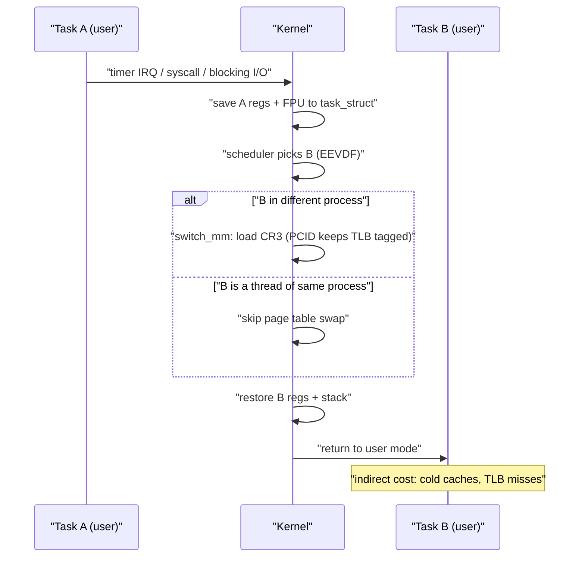
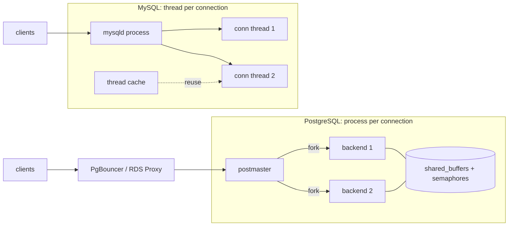

# A5 Process Management
> Last verified: 2026-10 · Audience: senior/staff DevOps, SRE, AI eng, NetEng, DevSecOps, architects

## TL;DR
- On Linux, **processes and threads are both `task_struct`s** created by `clone()`; the only difference is what they share (address space, fd table, signal handlers). Threads = shared memory, cheap creation, no isolation; processes = isolation, crash containment, more memory.
- A **context switch** costs ~1–5 µs of direct work (save/restore registers, scheduler, possibly CR3 swap) but the real cost is **indirect**: cold L1/L2, TLB misses, branch predictor pollution. Thread-to-thread switches in the same process skip the page-table swap; **PCID** avoids full TLB flushes on process switches.
- **`fork()` + copy-on-write**: child gets copied page tables, pages shared read-only until written. Fork time scales with **resident memory (page-table size)**, not data copy. Redis `BGSAVE` relies on this; write-heavy workloads + **THP** cause memory blow-up and latency spikes; set `vm.overcommit_memory=1`.
- **PostgreSQL = process per connection** (postmaster forks a backend) → ~MBs per connection, use **PgBouncer**. **MySQL = thread per connection** + thread cache (Enterprise thread pool). Both argue for connection pooling at scale.
- **Mutex** = ownership + mutual exclusion (1 holder); **semaphore** = counter (N permits), no owner, can signal across threads/processes. Linux implements both on **futexes** (userspace fast path, syscall only on contention).
- **PID 1 in containers**: ignores signals with default action unless it installs handlers, and must **reap zombies**. Use `docker run --init` (tini), `tini` as ENTRYPOINT, exec-form CMD, or k8s `shareProcessNamespace` (pause becomes PID 1).
- **Scheduler**: CFS (2.6.23) replaced by **EEVDF** in Linux 6.6. k8s **requests → `cpu.weight`** (proportional share), **limits → `cpu.max` quota/period (100 ms)** → **CFS throttling**. Multi-threaded apps burn a quota in a fraction of a period and stall for the rest → tail-latency spikes even at low average CPU.
- Use threads for shared-state, low-latency concurrency (and I/O overlap); use processes for isolation, GIL-bound runtimes, or crash containment; use async/event loops for 10k+ mostly-idle connections.

## A5.1 Process vs Thread
- **How it works:**
  - **Process** = address space (page tables, `mm_struct`) + resources (fd table, cwd, credentials, signal handlers) + ≥1 thread of execution. Identified by **PID** (= TGID, thread-group ID).
  - **Thread** = schedulable entity with its own **registers, PC, stack, TLS, TID**, sharing the process's heap, code, data, fds.
  - Linux has no separate thread object: `clone(CLONE_VM|CLONE_FS|CLONE_FILES|CLONE_SIGHAND|CLONE_THREAD...)` makes a thread; `fork()` ≈ `clone()` with nothing shared (CoW memory). Kernel scheduler schedules **tasks**, not processes.
  - Each thread costs a stack (glibc default 8 MiB **virtual**, from `ulimit -s`; only touched pages become RSS) plus a kernel stack (16 KiB on x86-64) and `task_struct`.
  - Limits: `kernel.pid_max` (default 32768, up to 4,194,304 on 64-bit), `kernel.threads-max`, `ulimit -u`, cgroup `pids.max` (k8s `podPidsLimit`). Hitting them yields `fork: EAGAIN` / "Resource temporarily unavailable".
  - Inspect: `ps -eLf`, `/proc/<pid>/task/`, `top -H`, `/proc/<pid>/status` (`Threads:`).
- **Trade-offs / when to use:**

| | Process | Thread |
|---|---|---|
| Memory isolation | Yes (separate page tables) | No (shared heap; one bad write corrupts all) |
| Crash blast radius | One process | Whole process (SIGSEGV kills all threads) |
| Creation cost | Higher (copy page tables, `fork` ~ 10s µs to ms+) | Lower (~ few µs) |
| Communication | IPC: pipes, sockets, shared memory, signals | Direct shared memory (needs locks) |
| Context switch | May swap CR3 / TLB effects | Same address space, cheaper |
| Security boundary | Yes (UID, namespaces, seccomp per process) | No |
| Examples | Postgres backends, Chrome renderers, nginx workers, Gunicorn workers | MySQL connections, JVM, Go runtime (M:N goroutines) |

- **Interview angles:**
  - "Thread vs process?" → say what's shared, then isolation vs cost; mention Linux `clone()` flags to show depth.
  - "Green threads / goroutines?" → **M:N** user-space scheduling onto N kernel threads; switch is ~100s ns, stacks start at a few KiB (Go: 2 KiB) and grow. Blocking syscalls handed off to extra OS threads.
  - Pitfall: counting `VSZ` of thread stacks as memory usage; look at RSS/PSS ([A3.5](./A3-memory-management.md)).
  - Pitfall: OOM killer kills the whole process (thread group), not one thread.

## A5.2 Context Switching (PCB, page table swap, TLB flush)
- **How it works:**
  - **PCB** (Linux: `task_struct` + `thread_struct`) holds state: registers, PC, SP, FPU/SIMD state, scheduling info, `mm` pointer, open files, credentials.
  - Switch steps: trap/interrupt → save registers to kernel stack/PCB → scheduler `pick_next_task` → `switch_mm` (load new **CR3** = page-table root, only if different `mm`) → `switch_to` (restore registers, stack) → return to user.
  - **TLB**: caches virtual→physical translations. Changing CR3 historically flushed non-global TLB entries. **PCID/ASID** (x86 PCID, ARM ASID) tags entries per address space so they survive a switch. Meltdown's **KPTI** made every syscall switch page tables and relies on PCID to keep that affordable.
  - **Triggers**: voluntary (blocking I/O, `futex` wait, `sleep`, `sched_yield`) vs **involuntary** (timeslice expired, higher-priority wakeup, interrupt). Seen in `/proc/<pid>/status` (`voluntary_ctxt_switches`, `nonvoluntary_ctxt_switches`), `pidstat -w`, `vmstat` `cs` column, `perf sched`.
  - Mode switch (user↔kernel, a syscall) ≠ context switch; a syscall is ~100 ns order, a full context switch ~1–5 µs direct, and indirect cache/TLB refill can cost tens of µs (rough orders, hardware-dependent).
- **Trade-offs / when to use:**
  - Thread switch inside one process: no CR3 load, warm TLB → cheaper than cross-process switch.
  - More runnable threads than cores → more involuntary switches, cache thrash, lock convoys. Size thread pools ≈ cores for CPU-bound work.
  - Mitigations: CPU pinning (`taskset`, k8s **CPU Manager `static` policy** for Guaranteed pods with integer CPUs), `isolcpus`/`nohz_full` for latency-critical, batching, event loops (epoll) instead of thread-per-connection, huge pages to reduce TLB misses.
- **Interview angles:**
  - "Why is thread-per-connection bad at 10k connections?" → memory per stack + scheduler/context-switch overhead + cache pollution; use epoll/io_uring event loops (nginx, Envoy, Redis) — see [A7](./A7-sockets.md) (A7.1).
  - "High `cs` in vmstat, what do you check?" → `pidstat -w` per task, voluntary (lock/IO waits) vs nonvoluntary (CPU oversubscription or cgroup throttling).
  - Follow-up: "Does a context switch always flush the TLB?" → No: not on same-mm thread switch, and not with PCID; kernel mappings are global.



### Linux scheduler: CFS → EEVDF
- **CFS** (2.6.23, 2007): red-black tree ordered by **vruntime**; pick smallest vruntime; weights from **nice** (-20..19, ~10% CPU per nice step).
- **EEVDF** (Earliest Eligible Virtual Deadline First) merged in **Linux 6.6** (released late 2023) and replaced CFS as the fair-class policy: tracks **lag** (owed vs received service); only tasks with lag ≥ 0 are **eligible**; among them picks the earliest **virtual deadline**. Shorter requested **slices** (`sched_setattr`) → earlier deadlines → better latency without needing more CPU share. Fewer heuristics than CFS.
- **sched_ext** (BPF-defined schedulers) merged in Linux 6.12 — pluggable scheduling policies.
- Other classes: `SCHED_FIFO`/`SCHED_RR` (real-time, priority 1–99), `SCHED_DEADLINE`, `SCHED_IDLE`, `SCHED_BATCH`.

### CPU throttling under cgroups / Kubernetes
- **Requests** → `cpu.weight` (cgroup v2; v1 `cpu.shares`): proportional share only under contention. A newer request→weight mapping (implemented in runc/crun, announced on the k8s blog Jan 2026) maps 1 CPU → weight 100 (the default) instead of the old linear formula.
- **Limits** → `cpu.max` = `"$QUOTA $PERIOD"` (v1 `cpu.cfs_quota_us`/`cpu.cfs_period_us`). Default period **100 ms**; kubelet `cpuCFSQuotaPeriod`. Limit 500m → 50 ms runtime per 100 ms window, **summed across all threads/CPUs**.
- **The trap**: 8 threads on 8 cores with a 1-CPU limit burn the 100 ms quota in ~12.5 ms, then are **throttled ~87.5 ms** → p99 latency spikes while average CPU looks well under the limit. Each CPU can also overrun by up to ~1 ms of cached slice.
- **Burst**: `cpu.max.burst` (v1 `cpu.cfs_burst_us`) lets a group bank unused quota; default 0.
- **Observe**: `cpu.stat` → `nr_periods`, `nr_throttled`, `throttled_usec`; Prometheus `container_cpu_cfs_throttled_periods_total / container_cpu_cfs_periods_total`.
- **Fixes**: no CPU limit on latency-sensitive pods (keep requests accurate; common SRE practice, debated), set runtime thread counts to the limit (JVM `-XX:ActiveProcessorCount`, `GOMAXPROCS` via automaxprocs / Go 1.25+ cgroup-aware default), Guaranteed QoS + CPU Manager static for pinning, raise the limit.
- Memory limit, unlike CPU, is **not throttled** — exceeding it triggers the OOM kill (see [A3](./A3-memory-management.md)).

## A5.3 Concurrency (mutexes, semaphores)
- **How it works:**
  - **Race condition**: outcome depends on interleaving; `count++` = load/add/store, not atomic.
  - **Mutex**: binary lock with **ownership**; only the locker unlocks. pthread mutex = **futex**: uncontended lock/unlock is one atomic CAS in user space; `FUTEX_WAIT`/`FUTEX_WAKE` syscalls only on contention.
  - **Semaphore**: integer counter; `sem_wait` (P) decrements or blocks at 0, `sem_post` (V) increments. **No ownership** → any thread can post, so it fits signalling and **bounded resources** (N DB connections, rate slots). POSIX named semaphores live in `/dev/shm/sem.<name>` and work across processes; unnamed ones sit in (shared) memory. PostgreSQL backends coordinate via shared memory + semaphores.
  - **Spinlock**: busy-wait; good only for very short critical sections on multi-core (kernel, no sleeping). **RW lock**: many readers or one writer. **Condition variable**: wait for a predicate under a mutex (always loop on spurious wakeups). **Atomics/CAS**: lock-free counters, queues.
  - Also: `flock`/`fcntl` file locks between processes; distributed locks are a different beast (leases, fencing tokens).
- **Trade-offs / when to use:**

| Primitive | Holders | Owner | Use for |
|---|---|---|---|
| Mutex | 1 | Yes | Protect a critical section |
| Semaphore (counting) | N | No | Pool/permit limiting, producer–consumer signalling |
| Spinlock | 1 | Yes | Tiny sections, can't sleep (kernel/IRQ) |
| RW lock | N readers / 1 writer | Yes | Read-heavy shared data |
| Atomic/CAS | n/a | n/a | Counters, lock-free structures |

  - Coarse locks → contention, convoys; fine-grained → deadlock risk and complexity.
- **Interview angles:**
  - "Mutex vs binary semaphore?" → ownership: a mutex can do priority inheritance and error-check recursive/unlock-by-other; a semaphore can be released by another thread (signalling).
  - **Deadlock** needs all four Coffman conditions (mutual exclusion, hold-and-wait, no preemption, circular wait); prevent with **global lock ordering**, try-lock with timeout, or single lock.
  - **Priority inversion** (Mars Pathfinder) → priority inheritance mutexes (`PTHREAD_PRIO_INHERIT`).
  - Livelock and starvation; lock contention shows as high voluntary context switches and `futex` in `strace -c`/`perf`.
  - Database-level locking, MVCC and optimistic concurrency → [B7](../B-database-engineering/) (B7) and [C1](../C-large-scale-architecture/) (C1.20–C1.24).

## A5.4 fork() and copy-on-write
- **How it works:**
  - `fork()` duplicates the caller: returns child PID to parent, 0 to child. Linux copies **page tables** and marks writable private pages **read-only + CoW**; the first write by either side triggers a page fault and a private copy of that page (4 KiB, or **2 MiB with THP**).
  - Per `fork(2)`: the only cost is "the time and memory required to duplicate the parent's page tables, and to create a unique task structure". Page tables are ~0.2% of mapped memory (8 bytes per 4 KiB page), so a 50 GB heap → ~100 MB of page tables copied while the parent is stopped → fork latency of **many ms to ~1 s** on large heaps.
  - Child inherits fds (shared offsets), but **not** memory locks, timers, pending signals, or other **threads** — only the calling thread is copied. In a multithreaded parent the child may only call async-signal-safe functions until `execve` (a mutex held by another thread stays locked forever).
  - `fork`+`exec` pattern (shells); `vfork`/`posix_spawn`/`clone(CLONE_VM|CLONE_VFORK)` avoid page-table copy for spawn-then-exec.
  - **Zombie**: child exited but parent hasn't `wait()`ed → entry stays in process table (state `Z`). **Orphan**: parent died → reparented to PID 1 or nearest **subreaper** (`prctl(PR_SET_CHILD_SUBREAPER)`), which must reap.

### Redis BGSAVE / BGREWRITEAOF
- Redis forks; child writes the snapshot to a temp RDB file and atomically renames it; parent keeps serving. Docs: fork "can be time consuming if the dataset is big… stopping serving clients for some milliseconds or even for one second". Check `INFO stats` → `latest_fork_usec`.
- Memory: every page the parent dirties during the save is duplicated → worst case ~2× RSS on write-heavy workloads.
- Tuning: **`vm.overcommit_memory=1`** (otherwise fork can fail with "Can't save in background: fork: Cannot allocate memory"), **disable THP** (2 MiB CoW copies amplify memory and latency), leave memory headroom, run BGSAVE on replicas, stagger forks across nodes. Redis 8.10+ adds a `BACKUP` command family so control planes can stagger forks cluster-wide.
- Same trick: Postgres doesn't fork for snapshots, but Python `multiprocessing` (fork start method), Gunicorn `--preload`, Chrome zygote, Android zygote share pre-loaded code via CoW. Note: refcount writes (CPython) break CoW sharing over time.

### Postgres process-per-connection vs MySQL thread-per-connection
- **PostgreSQL** (18 current): postmaster listens, **forks a backend process per client**; backends share `shared_buffers` and coordinate with shared memory + semaphores. Each backend ≈ several MB RSS + per-backend caches + `work_mem` per sort/hash. Thousands of connections → memory and snapshot/ProcArray overhead. Use **PgBouncer** (transaction pooling), RDS Proxy / Azure Flexible Server built-in PgBouncer. A crashing backend makes the postmaster reset all backends (shared memory may be corrupt).
- **MySQL**: one **thread per connection**, recycled via the **thread cache** (`thread_cache_size`, autosized; watch `Threads_created`). Enterprise **thread pool plugin** (also in Percona/MariaDB) decouples connections from execution threads for high concurrency.
- Takeaway: both need pooling past a few hundred active connections; Postgres hurts sooner on idle connections because each is a full process.



### PID 1 and zombie reaping in containers
- In a PID namespace, the entrypoint is **PID 1**. The kernel gives PID 1 special treatment: signals with **default action are ignored** unless the process installs a handler, so `SIGTERM` does nothing → `docker stop`/pod deletion waits the grace period (Docker 10 s, k8s `terminationGracePeriodSeconds` 30 s) then SIGKILL. When PID 1 exits, the kernel kills the whole namespace.
- PID 1 is also the reaper for orphans; most apps never call `wait()` on adopted children → **zombies** accumulate → `pids.max`/`pid_max` exhaustion → `fork: EAGAIN`.
- Fixes:
  - `docker run --init` (docker-init = **tini**) or Compose `init: true`.
  - `tini` / `dumb-init` as `ENTRYPOINT`; `tini -s` (subreaper) when not PID 1, `-g` to signal the whole process group.
  - **Exec-form** `CMD ["app"]`, not shell form (`/bin/sh -c app` makes sh PID 1, which doesn't forward signals); in wrapper scripts use `exec "$@"`.
  - k8s `shareProcessNamespace: true` → **pause** container is PID 1 and reaps zombies (but `kill -HUP 1` hits pause, and systemd-style images may refuse to start).
- **Interview angles:**
  - "Why does fork of a 100 GB process take long if memory isn't copied?" → page-table copy proportional to RSS/mapped pages, done while parent is paused; huge pages shrink it but worsen CoW amplification.
  - "Redis OOM-killed during BGSAVE at 60% memory" → CoW duplication under write load + THP; leave ~2× headroom or snapshot on a replica.
  - "Container takes 30 s to stop" → PID 1 not handling SIGTERM; shell-form CMD; add `--init`/tini or a handler.
  - Zombies use no memory beyond a PID slot; you can't kill them — kill/fix the parent.

## A5.5 When do you use threads?
- **How it works / when to use:**
  - **Threads**: shared in-memory state with low-latency access (caches, connection pools), parallel CPU work in one runtime (JVM, Go, Rust, C++), overlapping blocking I/O in legacy/blocking APIs, background work (Redis uses threads for `lazyfree`, I/O threads, AOF fsync while keeping one command thread).
  - **Processes**: isolation/security boundaries, crash containment, languages with a GIL (CPython multiprocessing, Gunicorn workers), mixing privilege levels (nginx master as root, workers unprivileged), independent restarts.
  - **Event loop / async** (epoll, io_uring): many mostly-idle connections — nginx, Envoy, Node.js, Redis main loop. Typically **one event loop per core** (thread or process) → combine both.
  - Sizing: CPU-bound pool ≈ number of cores (container **limit**, not host cores); I/O-bound pool ≈ cores × (1 + wait/compute) (Little's-law style); cap with a semaphore/bulkhead.
- **Trade-offs:**
  - Threads: bugs (races, deadlocks), one crash kills all, memory corruption across components, harder debugging.
  - Processes: higher memory, IPC serialization cost, slower spawn; but fault isolation and simpler reasoning.
  - Async: no per-connection stack, but one blocking call stalls the whole loop; CPU-heavy work must be offloaded to a worker pool.
- **Interview angles:**
  - "Design a server for 100k concurrent WebSocket connections" → event loop per core + worker pool for CPU tasks, not thread per connection.
  - "App sees CPU throttling with low utilization" → runtime spawned threads for host core count (e.g. 64) under a 2-CPU limit; set `GOMAXPROCS`/`ActiveProcessorCount`, revisit limits.
  - "Why is Redis single-threaded yet fast?" → in-memory, no lock contention, epoll multiplexing; network I/O threads since Redis 6; scale out with cluster sharding rather than threads.
  - Workload type (CPU- vs I/O-bound) drives the choice → [A4.4](./A4-inside-the-cpu.md).

## Hands-on (optional)
```bash
# Threads, context switches, scheduler class of a process
ps -o pid,nlwp,stat,cls,ni,comm -p "$PID"
grep -E 'Threads|ctxt_switches' /proc/$PID/status
pidstat -w -t -p "$PID" 1            # per-thread voluntary/nonvoluntary switches
# Find zombies and their parents
ps -eo pid,ppid,stat,comm | awk '$3 ~ /Z/'
# cgroup v2 CPU limit and throttling for a container/pod
cat /sys/fs/cgroup/cpu.max            # e.g. "50000 100000" = 0.5 CPU
grep -E 'nr_periods|nr_throttled|throttled_usec' /sys/fs/cgroup/cpu.stat
# Redis fork cost and kernel prerequisites
redis-cli INFO stats | grep latest_fork_usec
sysctl vm.overcommit_memory; cat /sys/kernel/mm/transparent_hugepage/enabled
```

```dockerfile
FROM debian:stable-slim
RUN apt-get update && apt-get install -y --no-install-recommends tini && rm -rf /var/lib/apt/lists/*
COPY app /usr/local/bin/app
# tini is PID 1: forwards SIGTERM, reaps zombies; exec form, no shell in between
ENTRYPOINT ["/usr/bin/tini", "--"]
CMD ["/usr/local/bin/app"]
# Alternative without changing the image: docker run --init myimage
```

## Cross-links
- [A2 The Anatomy of a Process](./A2-the-anatomy-of-a-process.md) (A2.1 program vs process, stack/heap)
- [A3 Memory Management](./A3-memory-management.md) (A3.3 virtual memory, page tables, TLB; A3.5 RSS/shared)
- [A4 Inside the CPU](./A4-inside-the-cpu.md) (A4.3 SMT, A4.4 IO-bound vs CPU-bound)
- [A7 Sockets](./A7-sockets.md) (A7.1 kernel queues; epoll vs thread per connection)
- `../B-database-engineering/` (B7 locking and concurrency); `../C-large-scale-architecture/` (C1.20–C1.24 concurrency and locking)
- `../H-full-stack-troubleshooting/` (H1/H2 Linux diagnostic tools)

## Sources
- https://man7.org/linux/man-pages/man2/fork.2.html
- https://man7.org/linux/man-pages/man2/futex.2.html
- https://man7.org/linux/man-pages/man7/sem_overview.7.html
- https://man7.org/linux/man-pages/man2/prctl.2.html
- https://docs.kernel.org/scheduler/sched-eevdf.html
- https://docs.kernel.org/scheduler/sched-bwc.html
- https://kubernetes.io/docs/concepts/configuration/manage-resources-containers/
- https://kubernetes.io/blog/2026/01/30/new-cgroup-v1-to-v2-cpu-conversion-formula/
- https://kubernetes.io/docs/tasks/configure-pod-container/share-process-namespace/
- https://docs.docker.com/reference/cli/docker/container/run/
- https://github.com/krallin/tini
- https://redis.io/docs/latest/operate/oss_and_stack/management/persistence/
- https://www.postgresql.org/docs/current/connect-estab.html
- https://dev.mysql.com/doc/refman/8.4/en/connection-interfaces.html
