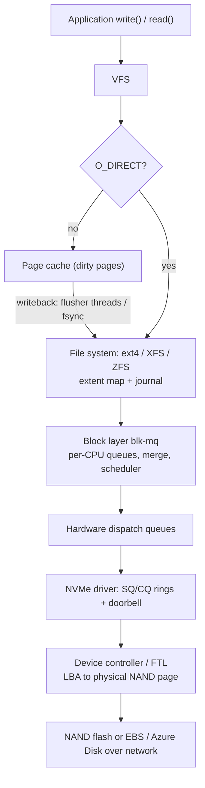
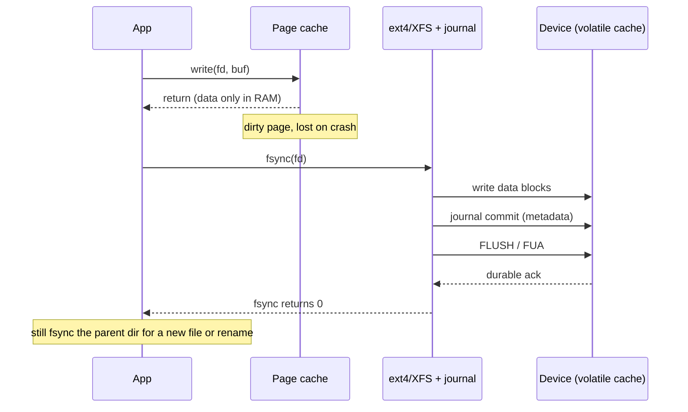

# A6 Storage Management
> Last verified: 2026-10 · Audience: senior/staff DevOps, SRE, AI eng, NetEng, DevSecOps, architects

## TL;DR
- Three performance numbers matter, and they are linked: **IOPS × I/O size = throughput**, and **queue depth ≈ IOPS × latency** (Little's Law). Ask which one is the bottleneck before buying anything.
- HDD (~5–10 ms seek, ~100–200 random IOPS) → SATA SSD (~100 µs, tens of thousands of IOPS, one queue of 32) → **NVMe** (PCIe, up to 64K queues × 64K commands, ~10–20 µs device latency, 100Ks–1M+ IOPS). NVMe removed the protocol bottleneck, so the kernel and the network became the bottleneck.
- Linux I/O stack: **app → syscalls → VFS → page cache → file system (ext4/XFS/ZFS) → block layer (blk-mq + I/O scheduler) → driver (nvme) → device FTL**. Each layer adds caching, reordering or remapping.
- `write()` only dirties the **page cache**. Data is durable only after **`fsync`/`fdatasync`** (plus a directory fsync for new files) or `O_SYNC`/`O_DSYNC`. **`O_DIRECT` bypasses the cache but does NOT guarantee durability.**
- File systems: **ext4** (journaled, default `data=ordered`, 5 s commit), **XFS** (allocation groups, parallel and large-file friendly, RHEL default, **cannot shrink**), **ZFS** (copy-on-write, end-to-end checksums, pooled storage with snapshots and send/recv, ARC cache, out-of-tree because of its CDDL license).
- Cloud block storage is **network-attached** (EBS, Azure Managed Disks). Performance is capped per volume AND per instance/VM, so check both. Modern SKUs (gp3, io2 Block Express, Premium SSD v2, Ultra) let you **provision IOPS and throughput separately from capacity**.
- **Local NVMe / instance store / Azure temp disk** is fastest but **ephemeral**: data is lost on stop, deallocate or host failure. Only use it for caches, scratch space, or data replicated at the application layer.
- Shared block storage (EBS **Multi-Attach** on io1/io2, Azure **shared disks**) gives raw block access with SCSI/NVMe reservations, not a shared file system. You need a cluster-aware FS (GFS2/OCFS2/CSV) or a cluster manager. Use EFS/FSx/Azure Files/ANF if you really want shared files.

## A6.1 Persistent Storage
### Why persist?
- RAM is volatile and ~100× more expensive per GB. Persistent storage keeps state across power loss, reboots and process crashes. A database's **D in ACID** comes down to a durable write on non-volatile media (or a quorum of replicas).
- Hierarchy latency, from memorable approximate numbers: L1 ~1 ns, DRAM ~100 ns, NVMe read ~10–100 µs, network block storage (EBS/Azure Disk) ~0.2–1+ ms, HDD seek ~5–10 ms, object storage first byte ~10–100 ms.

### HDD vs SSD vs NVMe
| | HDD | SATA/SAS SSD | NVMe SSD |
|---|---|---|---|
| Access | Mechanical seek and rotation (7.2K/10K/15K RPM) | NAND flash, no moving parts | NAND flash over **PCIe** |
| Random 4K latency | ~5–10 ms | ~50–150 µs | ~10–100 µs |
| Random IOPS | ~75–200 | ~10K–100K | 100K–1M+ |
| Seq throughput | ~150–250 MB/s | ~550 MB/s (SATA 6 Gb/s cap) | 3–14 GB/s (PCIe Gen3–Gen5 x4) |
| Queues | 1 (NCQ depth 32) | 1 × 32 (AHCI) | Up to **64K queues × 64K entries** |
| Best for | Cheap bulk sequential storage, archive, backup | General purpose | DBs, logs, AI data loaders, high QD |
- **SSD internals:** you cannot overwrite NAND in place. Writes go to erased pages, and erase happens in larger blocks. The **FTL (Flash Translation Layer)** maps logical blocks to physical pages and runs **garbage collection** and **wear leveling**. Side effects are **write amplification**, **TRIM/discard** to tell the FTL which blocks are free, write endurance limits (**DWPD/TBW**), and latency spikes when GC runs under sustained writes.
- **Volatile device write cache:** a drive can ack a write before it reaches flash. `fsync` sends a **FLUSH** (or the write uses **FUA**). Enterprise drives with **PLP (power-loss protection)** capacitors make flushes cheap. Consumer drives do not.
- **HDD:** sequential I/O is far cheaper than random I/O. This is why log-structured designs (LSM trees, WAL, Kafka segments) exist. Per-byte cost is still the lowest outside tape.

### App → File System → Block Layer → NVMe Driver
- **VFS** gives one API (`open/read/write/fsync/mmap`) over all file systems.
- **File system** maps file offset → logical block (extents) and handles metadata and journaling.
- **Block layer (`blk-mq`)** turns `bio`s into `request`s. It has per-CPU **software staging queues** where merging, plugging and the scheduler run, then **hardware dispatch queues** mapped to NVMe submission queues. **Tags** identify in-flight requests. Multi-queue replaced the old single-lock queue so the stack scales on many cores.
- **I/O schedulers:** `none` (the usual default for NVMe, since the device is fast and parallel), `mq-deadline` (common for SATA SSD/HDD and virtual disks), `bfq` (fairness, desktops), `kyber` (latency targets). Check with `cat /sys/block/nvme0n1/queue/scheduler`.
- **NVMe driver** writes commands into a submission queue (SQ) ring and rings a doorbell. The device posts to a completion queue (CQ) and raises an MSI-X interrupt, or the driver polls. **io_uring** cuts syscall overhead with shared SQ/CQ rings between user space and the kernel.
- In the cloud, the "NVMe device" is often a **virtual NVMe controller** (AWS Nitro card, Azure Boost/NVMe on v6 VMs) that sends block I/O over the network to EBS or Azure Disk. That is why you get NVMe semantics but ~ms latency.



- **Trade-offs / when to use:** NVMe local storage for latency-critical scratch, caches, or replicated DB data (Cassandra/Kafka/ClickHouse). Network block storage for durability, snapshots and fast reattach. HDD tiers (st1/sc1, Standard HDD) only for sequential bulk data.
- **Interview angles:**
  - "Why is NVMe faster than SATA SSD with the same NAND?" → The protocol. Many deep parallel queues, no AHCI single-queue bottleneck, PCIe bandwidth, and fewer CPU cycles per I/O.
  - "Why are random writes slow on an HDD but fine on an SSD?" → Seek plus rotational latency on the HDD. On an SSD, sustained random writes still hurt through GC and write amplification, so leave over-provisioning and enable TRIM.
  - Pitfall: benchmarking at **queue depth 1** and concluding the disk is slow. Network disks need concurrency to reach their provisioned IOPS (QD ≈ IOPS × latency, so 16K IOPS at 1 ms needs QD ~16).

## A6.2 File Systems
### FAT, ext4 (and XFS, for comparison)
| | FAT32/exFAT | ext4 | XFS | ZFS (see A6.4) |
|---|---|---|---|---|
| Design | File Allocation Table (linked clusters) | Extents + journal (JBD2) | Extents + B+trees, **allocation groups**, metadata journal | Copy-on-write, Merkle-checksummed pool |
| Journaling | None | Yes (`data=ordered` default) | Metadata journal | Not needed (CoW plus ZIL for sync writes) |
| Max file | FAT32: 4 GiB | 16 TiB (4K blocks) | 8 EiB | 16 EiB |
| Max FS | FAT32: ~2 TiB (typical) | 1 EiB | 8 EiB | 256 ZiB (theoretical) |
| Shrink | — | Offline shrink yes | **No shrink** | Can't remove raidz vdevs; limited device removal |
| Typical use | USB/SD cards, EFI System Partition | Default on Debian/Ubuntu | Default on RHEL/Rocky/Amazon Linux 2023; big files, parallel I/O | NAS, data integrity, snapshots |
- **FAT:** no permissions, no journal, and fragile on crash. It survives because every OS reads it, and the **UEFI ESP must be FAT**.
- **ext4 defaults:** `data=ordered` (data is written to the main FS before its metadata commits to the journal, so no stale-data exposure), **`commit=5`** (up to ~5 s of metadata can be lost on power loss), `barrier=1`, **delalloc** on (block allocation deferred to writeback, which helps fragmentation), `auto_da_alloc` (protects the rename-over-file pattern), `nodiscard` by default (use periodic `fstrim.timer` instead).
- Other ext4 data modes: `data=journal` journals data and metadata (safest, about 2× writes). `data=writeback` journals metadata only (fastest, and stale data can appear after a crash).
- **Inodes** hold metadata and the extent map. A **directory** is a file that maps name → inode number. **Hard links** are extra names for the same inode. ext4 fixes the inode count at mkfs time, so many tiny files can give "No space left on device" while `df -h` still shows free space. Check `df -i`.

### Page cache
- Unified cache of file pages in RAM (4 KiB pages, or large folios). Reads are served from RAM after the first miss. Writes dirty pages that are flushed later. The page cache is why `free` shows memory as "buff/cache". It is reclaimable, not leaked.
- **Writeback tuning** (`/proc/sys/vm`): `dirty_background_ratio` (common default 10%) is when flusher threads start writing in the background. `dirty_ratio` (common default 20%) is when **writing processes are throttled** and must write synchronously. `dirty_expire_centisecs` (3000 = 30 s) is the age at which a dirty page becomes eligible for writeback. `dirty_writeback_centisecs` (500 = 5 s) is the flusher wake interval. On large-RAM hosts, use the `*_bytes` variants so you don't build up GBs of dirty data that later causes multi-second stalls.
- **Readahead:** sequential reads trigger asynchronous prefetch (`blockdev --getra`, `posix_fadvise(SEQUENTIAL/RANDOM/DONTNEED)`).
- `echo 3 > /proc/sys/vm/drop_caches` (1 = page cache, 2 = dentries/inodes, 3 = both) is for **benchmarking only**, never for "freeing memory" in production.
- **mmap** maps page-cache pages straight into the process. Writes become dirty pages, `msync` makes them durable, and page faults are the cost.
- Containers: the page cache is charged to the **cgroup** (memory.current includes file pages). A pod can hit its memory limit from cache pressure, but reclaim usually happens before an OOM kill. Watch `memory.stat` `file` vs `anon`.

### Read vs write path
- **Read (buffered):** `read()` → VFS → page cache lookup. **Hit:** copy to user space (~µs). **Miss:** the FS maps offset → block, a bio is submitted, readahead may extend it, the process sleeps until the I/O completes, then the page is inserted into the cache and copied out.
- **Write (buffered):** `write()` → copy into page cache pages (read-modify-write if a partial page isn't cached) → mark dirty → return **immediately**. Later, flusher threads or `fsync` → FS allocates blocks (delalloc) → block layer → device. Then the journal commits and a cache FLUSH/FUA is sent.
- Errors from asynchronous writeback show up **only at `fsync`/`close`**. The "fsyncgate" (PostgreSQL, 2018) lesson: after a failed fsync the dirty pages may already be marked clean, so retrying fsync can falsely succeed. PostgreSQL now **PANICs on fsync failure** and recovers from WAL. Since Linux 4.13, writeback errors are reported to every fd that had the file open.



### File modes: O_SYNC, O_DSYNC, O_DIRECT (and fsync family)
| Mechanism | Bypasses page cache? | Durable on return? | Notes |
|---|---|---|---|
| plain `write()` | No | **No** | Fast. Lost on power loss |
| `fsync(fd)` | No | Yes (data + all metadata) | Per-file barrier. Also fsync the **directory** for create/rename |
| `fdatasync(fd)` | No | Yes (data + metadata needed to read it back, e.g. size) | Skips mtime-only updates, so it's cheaper |
| `O_SYNC` | No | Yes, every write (= write + fsync) | "File integrity completion" |
| `O_DSYNC` | No | Yes, every write (= write + fdatasync) | What many WALs use |
| `O_DIRECT` | **Yes** (DMA to/from user buffer) | **No**. "Does not give the guarantees of O_SYNC" | Needs aligned buffer, offset and length (query `statx STATX_DIOALIGN`, Linux 6.1+). Combine with `O_DSYNC` or call fdatasync |
| `sync_file_range` | No | **No** (doesn't flush metadata or device cache) | Only for controlling writeback timing |
- **Who uses O_DIRECT:** databases with their own buffer pools (InnoDB `innodb_flush_method=O_DIRECT`, Oracle, ScyllaDB) so data isn't cached twice and eviction stays under the DB's control. **PostgreSQL relies on buffered I/O plus the OS page cache** (`shared_buffers` is typically ~25% of RAM). Direct I/O support is in development (`debug_io_direct`).
- **Atomic file replace pattern:** write tmp → `fsync(tmp)` → `rename(tmp, final)` → `fsync(dir)`.
- **Trade-offs:** O_DIRECT gives predictable latency and no double caching, but you lose readahead and the cache, and misaligned I/O fails with `EINVAL` or falls back. O_SYNC on every small write is slow. Batching writes behind one fsync (**group commit**) is the usual fix.
- **Interview angles:**
  - "Does O_DIRECT mean my data is on disk?" → No. It skips the page cache, but the device's volatile cache and the file metadata (block allocation for appends) still need `O_DSYNC` or `fdatasync`.
  - "Why is fsync slow on cloud disks?" → Each flush is a network round trip to replicated storage (~0.5–2 ms). Group commit and fewer, larger fsyncs help. io2 Block Express or Ultra Disk lower the per-op latency.
  - "Why did the DB lose data after a power cut despite fsync?" → Consumer SSDs that ignore FLUSH, barriers disabled (`nobarrier`), a RAID controller write-back cache without a battery (BBU), or no fsync on the parent directory.

## A6.3 What really happens in a file IO? (page cache, LBA vs PBA, block mapping)
- **Logical-to-physical chain:**
  1. **File offset → file system logical block** via the inode's **extent tree** (ext4/XFS) or block pointer tree (ZFS CoW).
  2. **FS block → device LBA** (Logical Block Address, in 512 B or 4 KiB sectors), plus the partition start offset and any **LVM/dm/MD-RAID** remapping (`dm-linear`, `dm-crypt`, `dm-thin`).
  3. **LBA → PBA** (Physical Block Address). On an HDD it is a near-identity mapping to cylinder/head/sector, with remapping of bad sectors. On an SSD the **FTL** keeps a dynamic LBA→NAND page map that changes on every write (out-of-place writes). In the cloud, the "PBA" is chunks on a fleet of storage servers replicated within an AZ (EBS) or across 3 copies (Azure LRS).
- **Sector sizes:** 512n, **512e** (4K physical presenting 512 B logical, so misaligned writes cause read-modify-write), 4Kn. Azure Ultra and Premium SSD v2 default to **4K** sectors (512e optional, needed e.g. for Oracle < 12.2). **Partition alignment** (start at 1 MiB, the parted/fdisk default) avoids splitting I/Os across physical sectors or RAID stripes.
- **Full buffered read walk-through:** syscall → VFS dentry/inode cache lookup (path walk) → page cache miss → `->read_folio`/readahead → FS `get_block`/iomap maps offset to LBA → `bio` built → blk-mq merge and dispatch → NVMe command (SLBA + NLB) → device DMA into the page → completion IRQ → page marked uptodate → copy to user → return.
- **Write amplification sources:** journaling (×2 for metadata), CoW (ZFS/btrfs rewrite the tree up to the root), SSD GC, RAID-5/6 parity read-modify-write, and small writes on 4K physical sectors.
- **Observability:** `iostat -x 1` (`r/s w/s rkB/s wkB/s r_await w_await aqu-sz %util`. **`%util` means little on NVMe or network disks** because they serve in parallel), `iotop`, `pidstat -d`, `biolatency`/`biosnoop` (bcc/bpftrace), `blktrace`, `filefrag -v` (extent map), `fio` for benchmarking.
- **Interview angles:**
  - "LBA vs PBA?" → LBA is the stable address the OS uses. PBA is where the bits actually live, and the drive (FTL) or storage service is free to move them. This indirection is what enables wear leveling, GC, snapshots and thin provisioning.
  - "A disk shows 100% util but low IOPS. Why?" → %util only measures "busy at least one request". Check `await` and queue size, then compare against the provisioned and instance caps (EBS `VolumeQueueLength`, `VolumeIOPSExceededCheck`, instance EBS bandwidth; Azure "VM/Disk IOPS consumed %").
  - Cross-link: blocking I/O and process states (D state, iowait) → [A2 Process Management](../A-operating-systems/) (A2.x).

## A6.4 Partitioning, formatting and mounting file systems (ext4, ZFS)
### Partitioning
- **MBR**: 4 primary partitions, 2 TiB limit, legacy BIOS. **GPT**: 128 partitions by default, 64-bit LBAs, a backup header at the end of the disk, required for UEFI boot and disks over 2 TiB.
- **LVM** layers PV → VG → LV for online growth, snapshots and striping across disks. In the cloud, a common pattern is **RAID 0 (mdadm or LVM stripe)** across several EBS or Azure disks to pass a per-volume cap. This is less needed now that gp3, Premium SSD v2 and Ultra decouple performance from size, and it is bounded by the **per-VM/instance cap** anyway.
- **Online grow in the cloud:** resize the volume (EBS Elastic Volumes, or an Azure disk resize; detach-free for Ultra, Premium SSD v2 and most others) → `growpart /dev/nvme0n1 1` → `resize2fs` (ext4) or `xfs_growfs /mount` (XFS). XFS cannot shrink, so to shrink you create a new volume and copy.

### Formatting and mounting
- `mkfs.ext4 -L data /dev/nvme1n1` / `mkfs.xfs`. Mount by **UUID or LABEL** in `/etc/fstab`, never `/dev/nvme1n1`. NVMe device names can **change order across reboots** on Nitro instances. Add **`nofail`** (plus `x-systemd.device-timeout`) for non-root volumes so a missing disk doesn't drop boot into emergency mode.
- Useful mount options: `noatime` (Linux default is `relatime`), `discard` vs periodic `fstrim`, `data=` mode for ext4, `prjquota` (XFS project quotas, used by container runtimes).
- **systemd** creates `.mount` units from fstab. In Kubernetes, the **CSI** driver (`ebs.csi.aws.com`, `disk.csi.azure.com`) handles attach → format (if empty) → mount for PVCs. `WaitForFirstConsumer` binding is required because block volumes are **zonal**.

### ZFS
- **Pooled storage:** **zpool** made of **vdevs** (mirror, raidz1/2/3, dRAID) → **datasets** (file systems) and **zvols** (block devices) that share pool space. No separate partition/LVM/mkfs steps. `zpool create tank mirror sda sdb`, then `zfs create tank/db`. Datasets mount automatically, so fstab isn't needed.
- **Copy-on-write + Merkle checksums**: every block is checksummed in its parent pointer, which detects **silent corruption (bit rot)** and **self-heals** from redundancy. `zpool scrub` verifies everything. There is no fsck and no write hole on raidz.
- **Snapshots/clones** are instant and space-efficient. **`zfs send | zfs recv`** gives incremental block-level replication (used by FSx for OpenZFS and DR setups). Inline **compression** (`lz4`/`zstd`, usually a net win) and dedup (RAM-hungry, usually avoid).
- **Caches:** **ARC** (in-RAM adaptive replacement cache, separate from the Linux page cache, so watch memory sizing), **L2ARC** (SSD read cache), **ZIL/SLOG** (intent log for **sync** writes; a fast PLP SSD as SLOG speeds up NFS/DB fsync).
- Tunables: `recordsize` (default 128K. Set 8K–16K for DB pages, 1M for media/backups), `ashift=12` (4K sectors, set at vdev creation, immutable), `sync=standard|always|disabled` (`disabled` breaks durability, so never use it for DBs).
- **Trade-offs:** strongest integrity and snapshot story. Costs are CoW fragmentation, higher RAM use, raidz vdev width that is hard to change (raidz expansion arrived in OpenZFS 2.3), and **licensing**: CDDL is not GPL-compatible, so ZFS ships out-of-tree (DKMS) and Ubuntu bundles it.
- **ext4 vs XFS vs ZFS, interview summary:** ext4 is simple, robust, can shrink, and is the safe default. XFS gives the best parallel throughput for big files and many cores, is the RHEL default, can't shrink, and has fast `xfs_repair`. ZFS gives integrity, snapshots, replication and compression at the cost of RAM, complexity and licensing. Btrfs also does CoW and snapshots (SUSE default), but RAID5/6 is still not recommended.
- **Interview angles:**
  - "The server didn't boot after adding a disk to fstab." → Missing `nofail`, a device name that changed, or a wrong UUID.
  - "Why ZFS for a NAS but not under a cloud DB?" → Cloud volumes already replicate and checksum, and CoW plus ARC duplicate that work. ZFS still earns its place for snapshots and compression, as in FSx for OpenZFS.

## Cloud mapping: AWS vs Azure
| Capability | AWS | Azure | Role it plays | Key differences | Alternatives |
|---|---|---|---|---|---|
| General-purpose network block SSD | **EBS gp3** (1 GiB–64 TiB; 3,000 IOPS + 125 MiB/s baseline included; up to **80,000 IOPS / 2,000 MiB/s**, 500 IOPS/GiB, 0.25 MiB/s per IOPS) | **Premium SSD v2** (1 GiB–64 TiB; 3,000 IOPS + 125 MB/s free; up to **80,000 IOPS / 2,000 MB/s**, 500 IOPS/GiB after 6 GiB, 0.25 MB/s per IOPS). Also legacy **Premium SSD** P-tiers (fixed perf per size, up to 20K IOPS / 900 MB/s, bursting) | Boot/data volumes for VMs, DBs, K8s PVs | Nearly identical provisioning shape. **Premium SSD v2 can't be an OS disk**, has no host caching, and changes perf at most 4×/24h. gp3 can boot. gp3 durability 99.8–99.9% | Ceph RBD, Longhorn/OpenEBS on K8s, GCP Hyperdisk |
| Top-tier low-latency block | **EBS io2 Block Express** (4 GiB–64 TiB, up to **256,000 IOPS / 4,000 MiB/s**, <500 µs avg latency, **99.999% durability**) | **Ultra Disk** (4 GiB–64 TiB, up to **400,000 IOPS / 10,000 MB/s**, 1,000 IOPS/GiB, sub-ms) | SAP HANA, Oracle, top-tier OLTP | Ultra: data disk only, LRS only (no ZRS), no availability sets, no host caching, perf changes take up to 1 h. io2 BX: boot-capable, Multi-Attach and NVMe reservations | Local NVMe plus app replication |
| HDD / throughput tier | **st1** (500 MiB/s), **sc1** (250 MiB/s), not bootable | **Standard HDD** (≤500 MB/s; as an OS disk it retires 2028-09-08), **Standard SSD** | Logs, big sequential scans, cold data | AWS HDD tiers are throughput-credit based. Azure Standard tiers bill per transaction | S3/Blob for cold data |
| Shared block across hosts | **EBS Multi-Attach**: io1/io2 only, up to **16 Nitro instances, same AZ**, NVMe reservations (io2), not bootable | **Azure shared disks**: Ultra/Premium SSD v2 (`maxShares` ≤15), Premium/Standard SSD (3/5/10 by size), **SCSI-3 Persistent Reservations** | Failover clusters (WSFC, Pacemaker), GFS2/OCFS2 | Azure is ahead on Windows clustering (SQL FCI, SoFS). Ultra/Premium v2 shared disks get split **ReadWrite vs ReadOnly** throttles. Premium SSD shared disks lose caching and bursting. Neither one is a shared file system | EFS/FSx/Azure Files/ANF |
| Local ephemeral NVMe | **Instance store** (i4i/i7ie, c/m/r "d" sizes). Free with the instance. Survives **reboot**, but **cryptographically erased on stop/hibernate/terminate**. Attached only at launch | **Temp disk** (`/dev/sdb` → `/mnt` on Linux, `D:` on Windows) and **local/temp NVMe disks** on v6 and Lsv3 sizes. Lost on **deallocate**, maintenance, or service healing. On v6, temp NVMe comes back **raw and must be re-formatted** | Caches, scratch, shuffle, tempdb, replicated DBs | Same "ephemeral" contract. Azure **Ephemeral OS disks** put the OS on local storage (no stop-deallocate). AWS equivalent is instance-store-backed AMIs | EKS/AKS local PV, Azure Container Storage (local NVMe) |
| Managed NFS/SMB file storage | **EFS** (NFSv4.1, Regional or One Zone, Elastic throughput up to 20–60 GiB/s read per FS, ~1 ms read / ~2.7 ms write latency, 1,500 MiB/s per client). **FSx for Windows File Server** (SMB), **FSx for NetApp ONTAP**, **FSx for OpenZFS**, **FSx for Lustre** | **Azure Files** (SMB + NFS 4.1; SSD and HDD tiers; **provisioned v2**: storage, IOPS and throughput provisioned separately, credit bursting up to 102,400 IOPS on SSD), **Azure NetApp Files** (Standard 16 / Premium 64 / Ultra 128 MiB/s per TiB, Flexible, Elastic ZRS), **Azure Managed Lustre** | Shared POSIX/SMB storage for fleets, home dirs, CMS, AI datasets/checkpoints | EFS is serverless and elastic (pay per GB plus throughput). Azure Files is account/share scoped with provisioned performance. **FSx ONTAP ↔ ANF** (both NetApp, multiprotocol, snapshots/SnapMirror). **FSx Lustre ↔ Azure Managed Lustre** for HPC/AI | Self-hosted NFS on ZFS, CephFS, Weka, GCP Filestore |
| Object storage (pointer) | **S3** | **Blob Storage** (ADLS Gen2 with hierarchical namespace) | Unstructured data, data lakes, backups | Not a file system: no in-place partial writes and no POSIX semantics. FUSE adapters (Mountpoint for S3, BlobFuse2) exist. See object storage notes | Cloudflare R2, MinIO, GCS |
| SAN-like pooled block | (no direct equivalent; closest is EBS + FSx ONTAP iSCSI) | **Azure Elastic SAN** (iSCSI, pooled perf) | Consolidated block for many VMs/AKS | Azure only | FSx ONTAP iSCSI/NVMe-TCP |

- **Provisioning model shape:**
  - **gp3 ↔ Premium SSD v2** are the modern defaults: capacity, IOPS and throughput are independent, and the first 3,000 IOPS / 125 MiB/s (MB/s on Azure) are free. Both cap at 80K IOPS / 2,000 throughput units, at 500 IOPS per GiB.
  - **gp2 and Premium SSD (v1)** are the legacy **size-coupled** models. gp2 gives 3 IOPS/GiB with a 3,000-IOPS burst bucket (5.4M credits) up to 16K. Premium P-tiers give fixed IOPS per size with on-demand bursting on P30+. Migrating gp2 → gp3 is ~20% cheaper per GiB and runs online through Elastic Volumes.
  - **Instance/VM caps still apply.** EC2 has per-instance EBS bandwidth and IOPS limits (EBS-optimized; Nitro). Azure has per-VM **uncached** and **cached** disk IOPS/MBps limits. A 400K-IOPS Ultra disk on a small VM delivers the VM limit.
  - **Azure host caching** (ReadOnly/ReadWrite on Premium/Standard SSD) uses the host's local SSD/RAM. Use ReadOnly for DB data files and None for logs. Premium SSD v2 and Ultra have **no host caching**. AWS has no equivalent host cache for EBS.
  - **Latency/durability:** io2 BX is <500 µs average with 99.999% durability. gp3 is single-digit ms (in practice often sub-ms) with 99.8–99.9% durability. Snapshots go to S3 (EBS) or Azure's snapshot store, incremental in both.
- **Zonal behaviour:** EBS volumes are always **AZ-scoped**. Azure Premium SSD v2 and Ultra are zonal or LRS-only. Premium/Standard SSD can be **ZRS** (synchronously replicated across 3 zones, which allows cross-zone shared disks and failover). AWS has no ZRS block volume, so cross-AZ resilience comes from snapshots, application replication, or FSx/EFS Regional.
- **Shared access decision:** for many readers and writers of files, use EFS / Azure Files / ANF / FSx. For a classic failover cluster that needs SCSI-PR or NVMe reservations, use Multi-Attach / shared disks. Never mount ext4 or XFS read-write on two nodes, because the file system will be corrupted.
- **AI/data angle:** training data loaders and checkpointing usually stage from S3/Blob onto **local NVMe** or into **FSx for Lustre / Azure Managed Lustre**. Checkpoint writes are big sequential bursts, so throughput-provision for them.

## Hands-on (optional)
```bash
# Inspect devices, scheduler, and file system layout
lsblk -o NAME,SIZE,TYPE,FSTYPE,MOUNTPOINT,MODEL
cat /sys/block/nvme0n1/queue/scheduler          # [none] mq-deadline kyber bfq
sudo nvme list                                  # Amazon Elastic Block Store / Microsoft NVMe Direct Disk
df -h; df -i                                    # space vs inode exhaustion

# Format, mount by UUID with nofail
sudo mkfs.xfs -L data /dev/nvme1n1
UUID=$(sudo blkid -s UUID -o value /dev/nvme1n1)
echo "UUID=$UUID /data xfs defaults,noatime,nofail 0 2" | sudo tee -a /etc/fstab
sudo mkdir -p /data && sudo mount -a

# Grow after enlarging the cloud volume (partitioned root disk)
sudo growpart /dev/nvme0n1 1 && sudo xfs_growfs /    # ext4: sudo resize2fs /dev/nvme0n1p1

# Measure random 4K IOPS at QD32 (direct I/O, no page cache) and fsync-heavy latency
fio --name=rand --filename=/data/t --size=4G --direct=1 --rw=randread --bs=4k --iodepth=32 --ioengine=io_uring --runtime=60 --time_based --group_reporting
fio --name=wal --filename=/data/w --size=1G --rw=write --bs=8k --fdatasync=1 --runtime=30 --time_based
iostat -x 1
```

```hcl
# gp3 with independently provisioned performance, vs Azure Premium SSD v2
resource "aws_ebs_volume" "db" {
  availability_zone = "eu-west-1a"
  size              = 500
  type              = "gp3"
  iops              = 12000
  throughput        = 500   # MiB/s, <= 0.25 * iops
  encrypted         = true
}

resource "azurerm_managed_disk" "db" {
  name                 = "db-data"
  location             = "westeurope"
  resource_group_name  = "rg-db"
  storage_account_type = "PremiumV2_LRS"
  create_option        = "Empty"
  disk_size_gb         = 500
  disk_iops_read_write = 12000
  disk_mbps_read_write = 500
  zone                 = "1"
}
```

## Cross-links
- [A2 Process Management](../A-operating-systems/) (A2.x, process states / iowait, D state)
- [A5 Memory Management](../A-operating-systems/) (A5.x, page cache vs anon memory, swap, OOM)
- [A7 Network / sockets](../A-operating-systems/) (A7.1, kernel queues)
- [B Database Engineering](../B-database-engineering/) (WAL, fsync, buffer pools, B8 replication)
- [C1 Performance](../C-large-scale-architecture/) (C1.6–C1.15 latency, C1.26–C1.30 caching)
- [H Full-stack troubleshooting](../H-full-stack-troubleshooting/) (H1/H2 diagnostic tools: iostat, biolatency)
- [G Cloud network architecture](../G-cloud-network-architecture/) (storage private endpoints, zonal design)

## Sources
- https://docs.aws.amazon.com/ebs/latest/userguide/ebs-volume-types.html
- https://docs.aws.amazon.com/ebs/latest/userguide/general-purpose.html
- https://docs.aws.amazon.com/ebs/latest/userguide/ebs-volumes-multi.html
- https://docs.aws.amazon.com/AWSEC2/latest/UserGuide/InstanceStorage.html
- https://docs.aws.amazon.com/AWSEC2/latest/UserGuide/instance-store-lifetime.html
- https://docs.aws.amazon.com/efs/latest/ug/performance.html
- https://learn.microsoft.com/en-us/azure/virtual-machines/disks-types
- https://learn.microsoft.com/en-us/azure/virtual-machines/disks-shared
- https://learn.microsoft.com/en-us/azure/virtual-machines/enable-nvme-temp-faqs
- https://learn.microsoft.com/en-us/azure/virtual-machines/ephemeral-os-disks
- https://learn.microsoft.com/en-us/azure/storage/files/understand-performance
- https://learn.microsoft.com/en-us/azure/azure-netapp-files/azure-netapp-files-service-levels
- https://man7.org/linux/man-pages/man2/open.2.html
- https://man7.org/linux/man-pages/man2/fsync.2.html
- https://docs.kernel.org/admin-guide/sysctl/vm.html
- https://docs.kernel.org/admin-guide/ext4.html
- https://docs.kernel.org/block/blk-mq.html
