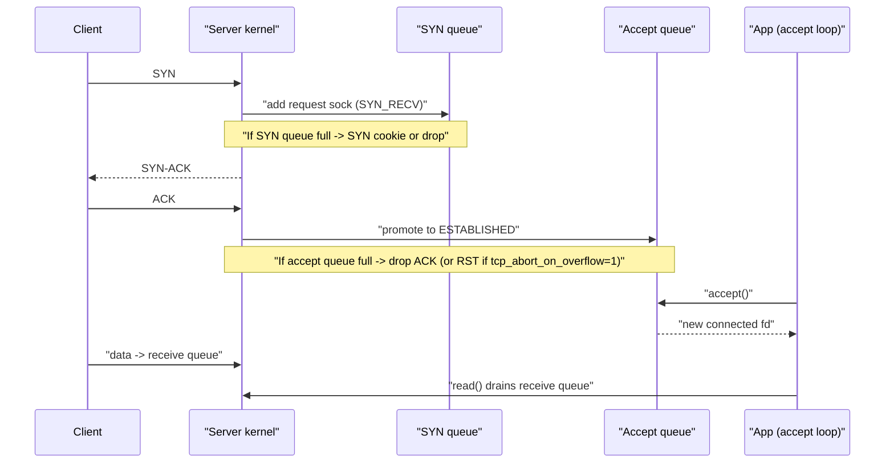
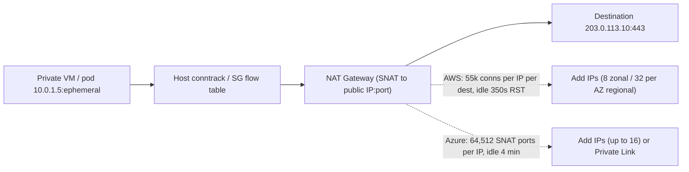
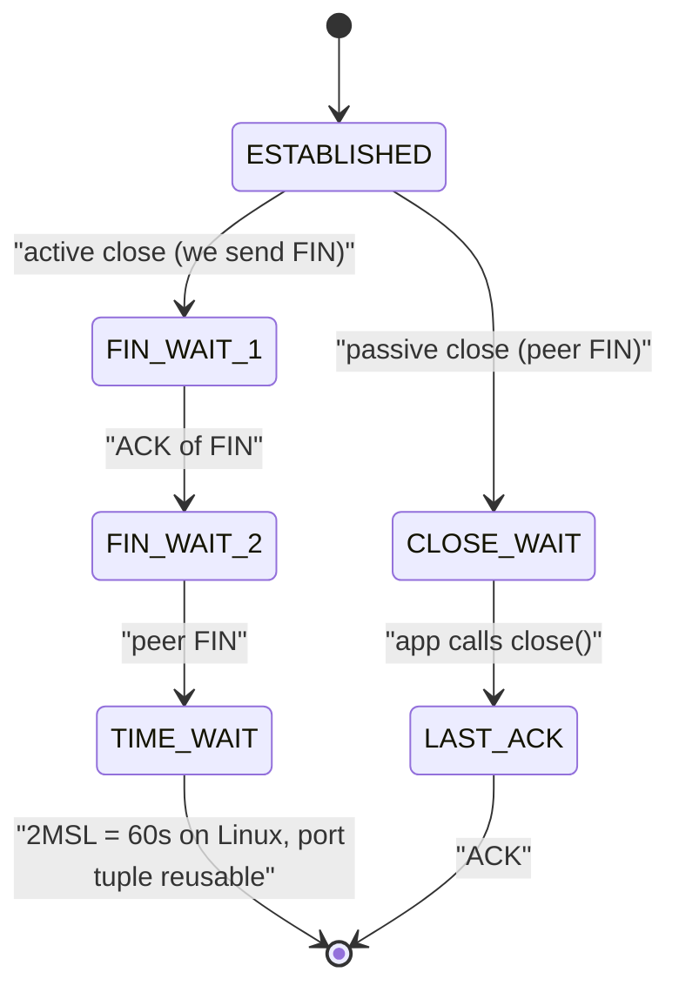

# A7 Socket Management
> Last verified: 2026-10 · Audience: senior/staff DevOps, SRE, AI eng, NetEng, DevSecOps, architects

## TL;DR
- A **listening socket** has two kernel queues: the **SYN queue** (half-open, `SYN_RECV`, capped by `tcp_max_syn_backlog`) and the **accept queue** (fully established, waiting for `accept()`, capped by `min(backlog, net.core.somaxconn)`; somaxconn default **4096 since Linux 5.4**, 128 before).
- Accept-queue overflow is an **application slowness** signal (`ListenOverflows`), SYN-queue overflow is a **flood/burst** signal; **SYN cookies** (`tcp_syncookies=1`, default) make the SYN queue stateless under pressure.
- Every connected socket has a **receive queue** and a **send queue**; `send()` returning only means "copied into kernel buffer", not "delivered". Buffer size ≈ **BDP** decides throughput on long-RTT links.
- A connection is a **4-tuple** (5 with protocol). Clients run out of **ephemeral ports** per destination (Linux default `32768–60999` = 28,232 ports) because the active closer holds **TIME_WAIT for 60 s**; fix with **pooling/keep-alive**, more source IPs, `tcp_tw_reuse`, never `tcp_tw_recycle` (removed in 4.12).
- The same arithmetic shows up in the cloud as **SNAT port exhaustion**: AWS NAT Gateway **55,000 concurrent connections per IP per unique destination**, Azure NAT Gateway **64,512 SNAT ports per public IP** (~50k connections per IP to the same destination), Azure LB default allocation as low as 32 ports per VM.
- Every stateful middlebox has an **idle timeout**: AWS ALB **60 s**, NLB/NAT GW **350 s**, Azure LB / NAT GW / App Gateway frontend **4 min**. Silent drops cause "random" resets; set **keepalives below the smallest timeout in the path** and app idle timeout **above** the LB's.
- I/O models: `select`/`poll` O(n) → **epoll/kqueue** readiness O(ready) → **IOCP/io_uring** completion-based. epoll solved **C10K**; **C10M** needs kernel bypass (DPDK/AF_XDP) or io_uring + SO_REUSEPORT + per-core sharding.
- Server patterns: **listener → acceptor → reader → parser → decoder → handler**; scale accept with **SO_REUSEPORT** (one listener per worker, kernel hashes 4-tuple) or **EPOLLEXCLUSIVE** to avoid thundering herd.

## A7.1 Sockets, Connections and Kernel Queues
- **How it works:**
  - `socket()` returns an fd; `bind()` attaches local IP:port; `listen(fd, backlog)` turns it into a **listening socket**; each `accept()` returns a **new connected socket** (same local port, unique 4-tuple). A listener never carries data.
  - Server-side "connection" exists in the kernel **before** the app calls `accept()`; the 3-way handshake is completed entirely by the kernel.
  - **Kernel lookup tables** (Linux): **ehash** (established + TIME_WAIT + request socks, keyed by 4-tuple), **lhash** (listeners, keyed by port), **bhash** (bound ports). Size of ehash is set at boot (`dmesg | grep "TCP established hash"`). Incoming segment → hash 4-tuple → ehash hit, else lhash.
  - Per-connection kernel memory: `struct tcp_sock` ≈ 2 KB plus buffered data; a `SYN_RECV` request sock ≈ **304 bytes** (kernel docs). Global TCP memory pressure is governed by `net.ipv4.tcp_mem` (pages: min/pressure/max). fd limits: `ulimit -n`, `fs.nr_open`, `fs.file-max`.
  - With netfilter, every flow also costs a **conntrack** entry (`nf_conntrack_max`; `nf_conntrack_tcp_timeout_established` default 432,000 s = 5 days). "`nf_conntrack: table full, dropping packet`" is a classic Kubernetes node / NAT box failure.

### SYN queue vs accept queue
| | SYN queue (incomplete) | Accept queue (complete) |
|---|---|---|
| State | `SYN_RECV` request sock | `ESTABLISHED`, not yet `accept()`ed |
| Limit | `net.ipv4.tcp_max_syn_backlog` (ignored when syncookies active) | `min(listen backlog, net.core.somaxconn)` — silently capped |
| Fills because | SYN flood, huge burst, lost final ACKs | **App not calling `accept()` fast enough** (blocked event loop, GC, too few workers) |
| On overflow | Drop SYN or send **SYN cookie** | Default: drop final ACK, server retransmits SYN-ACK (`tcp_synack_retries=5` ≈ 31 s+); with `tcp_abort_on_overflow=1` send RST. New SYNs are also dropped while accept queue is full |
| Counters | `TcpExtTCPReqQFullDoCookies`, `TcpExtSyncookiesSent`, `TcpExtTCPReqQFullDrop` | `TcpExtListenOverflows`, `TcpExtListenDrops` |
| Visibility | `ss -tan state syn-recv` | `ss -lnt`: for LISTEN rows **Recv-Q = current accept-queue length, Send-Q = effective backlog** |

- **SYN cookies** (RFC 4987): server encodes MSS index + coarse time + keyed hash of the 4-tuple into its **ISN**, keeps no state; on the final ACK it validates `ack-1` and rebuilds the connection. Cost: only 8 MSS values, and window scaling / SACK are lost **unless TCP timestamps are on** (options encoded in TSval). `tcp_syncookies=1` = only on overflow (default), `2` = always.
- **Backlog sizing:** backlog is a **burst absorber**, not a throughput knob. Raising it hides a slow acceptor and adds queueing latency. Many runtimes pass a large backlog (NGINX `listen ... backlog=`, default 511 on Linux) but are capped by somaxconn. In K8s, `net.core.somaxconn` is a namespaced "safe" sysctl settable via `securityContext.sysctls`.

### Receive vs send queue
- **Receive queue** (`Recv-Q` on ESTABLISHED rows): bytes ACKed by kernel but not yet `read()` by app. Persistently non-zero → app is slow; when it fills the advertised window shrinks → **zero window** to the peer.
- **Send queue** (`Send-Q`): bytes written by app not yet ACKed by peer (in flight + unsent). Persistently non-zero → network/peer slow, cwnd-limited or peer zero window.
- Sizes: `tcp_rmem` default `4K 131072 <max>` (max 128 KB–32 MB depending on RAM, commonly ~6 MB), `tcp_wmem` default `4K 16K <max>` (64 KB–4 MB) (min/default/max, auto-tuned); `net.core.rmem_max/wmem_max` cap `setsockopt` values. Detail in [H6.7](../H-full-stack-troubleshooting/) (H6.7 TCP Socket Buffers).

### Ephemeral ports and TIME_WAIT (client side)
- Outbound connection uniqueness = **(src IP, src port, dst IP, dst port, proto)**. Only src port varies for one client IP → one dst IP:port, so ceiling = size of `ip_local_port_range` (default **32768–60999 = 28,232**).
- The **active closer** enters **TIME_WAIT for 2×MSL = 60 s** on Linux (hard-coded `TCP_TIMEWAIT_LEN`). Purpose: absorb delayed duplicates and re-send last ACK if FIN is retransmitted. 28,232 / 60 s ≈ **~470 new connections/s sustained** per destination tuple before `EADDRNOTAVAIL` / `connect: Cannot assign requested address`.
- Mitigations in order: **(1)** connection reuse (HTTP keep-alive, HTTP/2 multiplexing, DB pools); **(2)** let the server close (TIME_WAIT moves to the server, which has no port-per-flow constraint); **(3)** widen `ip_local_port_range` (reserve ports via `ip_local_reserved_ports`); **(4)** add source IPs / destinations (`IP_BIND_ADDRESS_NO_PORT` to defer port choice); **(5)** `net.ipv4.tcp_tw_reuse` (default **2 = loopback only** on current kernels; `1` enables for all outgoing, needs timestamps).
- **Anti-patterns:** `tcp_tw_recycle` (broke clients behind NAT due to per-host timestamp checks; **removed in Linux 4.12**, AWS NAT GW troubleshooting still lists it as a cause of failed connections); `SO_LINGER{on,0}` to RST every close (data loss risk); lowering `tcp_fin_timeout` thinking it shortens TIME_WAIT (it governs **FIN_WAIT_2** orphans).
- Server side: TIME_WAIT sockets are cheap (minisocks), `tcp_max_tw_buckets` caps them — don't lower it.

### Cloud tie-in: connection tracking and idle timeouts
- Every stateful hop (security group conntrack, NAT, L4 LB, L7 proxy) keeps a flow entry and **evicts idle flows**. Eviction is usually **silent**; the next packet gets dropped or an RST, producing "connection reset by peer" / HTTP 502 after a quiet period.
- **Rule:** client/server **TCP keepalive interval < smallest idle timeout in the path**; **backend app idle (keep-alive) timeout > LB idle timeout** (otherwise LB reuses a connection the backend just closed → ALB 502, App Gateway 502).
- Linux default `tcp_keepalive_time` = **7200 s** — longer than every cloud idle timeout, so set it explicitly (e.g. 60–240 s) or use app-level pings.

| Hop | Default idle timeout | Configurable | On expiry |
|---|---|---|---|
| AWS ALB | **60 s** | 1–4000 s; plus HTTP client keepalive duration default 3600 s (60–604,800) | Closes; HTTP/2 PING does **not** reset timer |
| AWS NLB (TCP listener) | **350 s** | 60–6000 s (`tcp.idle_timeout.seconds`); TLS listener fixed 350 s | Flow dropped; keep EC2 ENI conntrack timeout ≥ NLB value |
| AWS NAT Gateway | **350 s** | No | Sends **RST** to inside host on next packet (`IdleTimeoutCount`) |
| AWS GWLB | 350 s | TCP configurable (unverified range) | Flow dropped |
| EC2 ENI conntrack (tracked flows) | 432,000 s (Nitro ≤v5); **350 s on Nitro v6** (since mid-2025) | 60–432,000 s per ENI | `conntrack_allowance_exceeded` drops |
| Azure Load Balancer (Standard) | **4 min** | LB/inbound NAT rules 4–100 min; outbound rules 4–120 min | Silent drop unless **TCP Reset on idle** enabled (bidirectional RST) |
| Azure NAT Gateway | **4 min** TCP; UDP 4 min fixed | TCP 4–120 min (MS advises keeping 4 to avoid SNAT exhaustion) | RST only when traffic hits a dead flow (unidirectional) |
| Azure Application Gateway v1/v2 | Frontend TCP idle **4 min** | 4–30 min (on the public IP); HTTP/1.1 keep-alive 120 s, HTTP/2 180 s fixed; backend **request timeout 20 s** default | Closes |

- **Interview angles:**
  - "Connections hang during a traffic spike but CPU is low" → check `ss -lnt` Recv-Q vs Send-Q and `nstat -az TcpExtListenOverflows`; accept queue full = acceptor stalled; raise somaxconn/backlog **and** fix the acceptor.
  - "What's the difference between backlog and max connections?" → backlog bounds **not-yet-accepted** connections only; accepted connections are bounded by fds, memory, conntrack.
  - "Long-lived idle DB connections die after ~5 minutes through NAT/NLB" → 350 s idle timeout; enable keepalives < 350 s or pool with max-idle-time < timeout.
  - "Why might SYN cookies hurt performance?" → loss of window scale/SACK without timestamps; seeing `SyncookiesSent` in normal operation means the SYN queue/backlog is undersized.
  - Pitfall: tuning `somaxconn` on the host but not in the **pod network namespace** — it's per-netns.

## A7.2 Sending and Receiving Data
- **How it works:**
  - `send()/write()` copies bytes into the **send buffer** and returns; TCP segments, retransmits and paces from there. Blocks (or `EAGAIN` if non-blocking) only when the send buffer is full. **Success ≠ peer received**; durable acknowledgement must be application-level.
  - `recv()/read()` copies from the **receive buffer**; returns **any** amount ≥1 byte (TCP is a byte stream, **no message boundaries**) — must loop and frame (length prefix, delimiter, HTTP Content-Length/chunked). Return `0` = peer FIN (EOF).
  - NIC → DMA into ring buffer → IRQ/NAPI softirq → GRO → IP/TCP → socket receive queue → wake waiter. Offloads: **TSO/GSO** (send big, segment late), **GRO/LRO** (coalesce on receive), **RSS** spreads flows across RX queues/CPUs.
  - **Flow control:** advertised receive window derives from free receive buffer; **zero window** stalls the sender (persist timer probes). **Congestion control** (CUBIC default, BBR option) limits cwnd. Throughput ≤ `min(rwnd, cwnd) / RTT`.
  - **BDP sizing:** buffer ≥ bandwidth × RTT. 10 Gbps × 100 ms = **125 MB** — far above the default `tcp_rmem` max (commonly ~6 MB, at most 32 MB), so cross-region bulk transfers are buffer-bound. Setting `SO_RCVBUF` explicitly **disables autotuning**, and the kernel **doubles** the value you set (bookkeeping overhead).
  - **Small writes:** **Nagle** (coalesce while data unACKed) + peer **delayed ACK** (up to ~40 ms on Linux) = classic 40 ms latency on write-write-read patterns → `TCP_NODELAY` for RPC/interactive; `TCP_CORK`/`MSG_MORE` or `writev()` to batch headers+body; `tcp_autocorking=1` default.
  - **Zero-copy:** `sendfile()`/`splice()` (file → socket without user copy, used by NGINX/Kafka), `MSG_ZEROCOPY` (completion notified via error queue, worth it > ~10 KB), **kTLS** lets sendfile work with TLS; io_uring `SEND_ZC`.
  - `tcp_notsent_lowat` limits unsent bytes in the send queue → lower latency for HTTP/2 prioritization.
- **Trade-offs / when to use:**
  - Bigger buffers = more throughput on high-BDP paths but more memory per connection (× 1M connections) and **bufferbloat** latency.
  - `TCP_NODELAY` for request/response; batching for bulk.
- **Interview angles:**
  - "send() succeeded but the data never arrived — how?" → it was only in the local send buffer when the peer/host died; need app ACKs/idempotent retries.
  - "Why is throughput to another region 10× lower than in-region?" → RTT × fixed window; raise `tcp_rmem/wmem` max, consider BBR, parallel streams.
  - Follow-up: `ss -tin` shows `cwnd`, `rtt`, `rcv_space`, `send` rate, `retrans` per socket.

## A7.3 Socket Programming Patterns (listener, acceptor, reader, parser, decoder)
- **How it works (pipeline):** **Listener** (bind/listen, owns queues) → **Acceptor** (calls `accept()`, hands connection to a worker) → **Reader** (reads bytes into a user buffer) → **Parser** (finds protocol frame boundaries: HTTP/1.1 headers, HTTP/2 frames, length-prefixed RPC) → **Decoder** (TLS decrypt, decompress, deserialize JSON/protobuf) → **Handler/business logic** → reverse path for write. Each stage can be on different threads; the expensive ones are usually TLS + decode.

| Pattern | How | Examples | Trade-off |
|---|---|---|---|
| Thread/process per connection | Acceptor spawns/assigns a blocking worker | Apache prefork, **PostgreSQL** (process per conn) | Simple; memory + context-switch cost caps at ~thousands → needs a pooler (PgBouncer) |
| Single-threaded event loop | One thread: accept + epoll + parse + handle | Node.js, Redis (I/O threads optional) | No locks; one slow handler blocks everything (accept queue fills) |
| Acceptor + worker event loops | 1 acceptor thread distributes to N loops | Netty boss/worker, memcached | Acceptor can bottleneck; uneven load |
| N listeners via **SO_REUSEPORT** | Each worker has its own listening socket on the same port; kernel hashes 4-tuple to a socket | NGINX `listen ... reuseport`, Envoy, HAProxy | Best accept scalability, per-core queues; hash ignores load, and pre-5.14 kernels dropped queued conns when a listener closed (`tcp_migrate_req` fixes) |
| Shared listener + **EPOLLEXCLUSIVE** | All workers epoll one listener, kernel wakes one | NGINX default (no `accept_mutex` needed) | Avoids thundering herd; less balanced than reuseport |

- **SO_REUSEPORT** (Linux 3.9+): multiple sockets bind identical addr:port if same effective UID (anti-hijack). Distribution customisable with `SO_ATTACH_REUSEPORT_CBPF/EBPF`; `SO_INCOMING_CPU` pairs listener with RX queue CPU. Also enables **zero-downtime reloads** (new process binds alongside old). Not the same as **SO_REUSEADDR** (lets you rebind while old connections are in TIME_WAIT).
- **Interview angles:**
  - "Design a server for 1M concurrent websocket connections" → epoll/io_uring event loops per core, SO_REUSEPORT, non-blocking sockets, small buffers per idle conn, raise fd limits/`somaxconn`/conntrack or untrack, offload TLS, app-level heartbeats < LB idle timeout, spread across multiple IPs/LB nodes for port limits.
  - "Where does backpressure come from?" → handler slow → reader stops reading → receive buffer fills → zero window → sender's send buffer fills → sender's `write()` blocks/EAGAIN. Don't buffer unboundedly in user space.
  - Pitfall: parsing assuming one `read()` = one message; partial frames and coalesced frames must both be handled.

## A7.4 Asynchronous IO: select, epoll, IOCP, kqueue, io_uring
| API | OS | Model | Cost | Notes |
|---|---|---|---|---|
| `select` | POSIX | Readiness | O(n) per call, fd_set copied each call | `FD_SETSIZE` = **1024** limit |
| `poll` | POSIX | Readiness | O(n) | No fd limit, still scans all |
| **epoll** | Linux (2.6) | Readiness | O(ready) on wait; register once via `epoll_ctl` | Level-triggered default; **EPOLLET** edge-triggered needs non-blocking fds and read until `EAGAIN`; **EPOLLONESHOT**; **EPOLLEXCLUSIVE** (4.5); ~160 B per watch, `max_user_watches` |
| **kqueue** | FreeBSD/macOS | Readiness (+ timers, signals, file vnode events) | O(ready), batch changes+wait in one call | Richer filter set than epoll |
| **IOCP** | Windows | **Completion** | Thread pool dequeues completed ops | Submit overlapped I/O with buffer; OS fills it |
| **io_uring** | Linux **5.1+** (2019) | **Completion** | Shared-memory **SQ/CQ rings**, batch many SQEs per `io_uring_enter`, or zero syscalls with **SQPOLL** | Works for files *and* sockets; multishot accept/recv, registered files/buffers, provided buffer rings, `SEND_ZC` |

- **Readiness vs completion:** epoll says "fd is readable, now call `read()`" (2 syscalls per op, buffer allocated at read time). io_uring/IOCP say "here is a buffer, tell me when the read finished" (buffer pinned up front, ops can complete **out of order**; correlate via `user_data`).
- **Why io_uring:** epoll cannot do async **regular-file** I/O (files are always "ready"; libuv/Node use a thread pool), Linux AIO only worked for O_DIRECT. io_uring unifies disk + network, cuts syscalls (matters post-Spectre/Meltdown mitigations).
- **io_uring security posture (as of 2026):** large share of kernel exploits (Google reported 60% of its 2022 kernel bug-bounty submissions targeted io_uring) → disabled on ChromeOS/Android apps/Google prod; `kernel.io_uring_disabled` sysctl (Linux 6.6: 0 allow, 1 CAP_SYS_ADMIN only, 2 off); **Docker's default seccomp profile blocks io_uring syscalls**, and containerd RuntimeDefault does too on platforms like GKE Autopilot. Expect io_uring apps to fall back to epoll in containers.
- **C10K → C10M:** **C10K** (Dan Kegel, 1999) = 10k concurrent connections; solved by event-driven readiness APIs (epoll/kqueue) instead of thread-per-connection. **C10M** (Robert Graham, 2013) = 10M connections; the kernel itself becomes the bottleneck → **kernel bypass** (DPDK, AF_XDP, user-space TCP stacks like Seastar/F-Stack), per-core sharding, no shared locks, huge pages; today also io_uring + SO_REUSEPORT + NIC multi-queue.
- **Trade-offs / when to use:** epoll is the mature default (NGINX, Envoy, Go netpoller, Netty, libuv); io_uring for storage-heavy or syscall-bound servers where you control the kernel and seccomp; kernel bypass only for specialised packet-processing (LBs, trading, NFV) — you lose kernel tooling (tcpdump, iptables, ss).
- **Interview angles:**
  - "Why is epoll faster than select?" → interest list kept in-kernel (no copy per call), ready list returned directly (no O(n) scan), no 1024 limit.
  - "Edge vs level triggered?" → ET fires on change only; must drain to EAGAIN or you hang; LT keeps firing (safer, more wakeups).
  - "Does Go/Node use threads per connection?" → no: goroutines/callbacks multiplexed on an epoll/kqueue/IOCP netpoller; Node pushes file I/O and DNS `getaddrinfo` to the libuv thread pool (default 4 threads).
  - "Would you adopt io_uring in Kubernetes?" → only if seccomp allows it, kernel ≥ 6.x, and benchmarks justify the attack-surface trade-off.

## Diagrams





- Many `CLOSE_WAIT` sockets = **application bug** (never calls `close()`); many `TIME_WAIT` = normal for the active closer, a problem only on clients short on ports.

## Cloud mapping: AWS vs Azure
| Capability | AWS | Azure | Role it plays | Key differences | Alternatives |
|---|---|---|---|---|---|
| L4 load balancer (connection-tracking) | **Network Load Balancer** | **Azure Load Balancer (Standard)** | Pass-through TCP/UDP, flow hashing, long-lived conns | NLB idle 350 s (60–6000), no RST config; Azure LB idle 4 min (4–100), optional **TCP Reset on idle**; NLB per-target 55k conns when client IP preservation off | Envoy/HAProxy on VMs, Cloudflare Spectrum, K8s Service + kube-proxy/IPVS/eBPF (Cilium) |
| L7 load balancer / reverse proxy | **Application Load Balancer** | **Application Gateway v2** (+ WAF) | Terminates client TCP/TLS, pools backend conns | ALB idle 60 s (1–4000), client keepalive 3600 s; App GW frontend idle 4 min (4–30), backend request timeout 20 s | NGINX/Envoy ingress, Cloudflare, Azure Front Door / CloudFront at edge |
| Managed outbound NAT (SNAT) | **NAT Gateway** (zonal or **regional** mode, Nov 2025) | **Azure NAT Gateway** (Standard zonal / **StandardV2** zone-redundant) | Many private sources → few public IPs | AWS: 55k per IP per unique dest, up to 8 IPs zonal / 32 per AZ regional, idle 350 s fixed, 5→100 Gbps; Azure: 64,512 ports/IP, ≤16 IPs, ~50k conns/IP per dest, 2M active conns, idle 4–120 min, 50 Gbps (Std) / 100 Gbps (V2) | NAT instance/NVA, egress proxy, IPv6 (no SNAT), Private Link |
| LB-based outbound SNAT | n/a (NLB/ALB don't do VM egress) | **LB outbound rules** (64,000 ports per frontend IP) | Egress via LB frontend IPs | Default allocation 1,024 → 32 ports/VM by pool size — avoid in prod; manual `allocatedOutboundPorts` | Azure NAT Gateway (takes precedence) |
| Private access to PaaS without SNAT | **PrivateLink / Gateway endpoints** (S3, DynamoDB) | **Private Endpoint / Private Link** | Removes NAT hop and port usage | AWS gateway endpoints free for S3/DynamoDB; Azure recommends Private Link over service endpoints | Service endpoints (Azure), VPC peering |
| Host flow tracking limits | **EC2 ENI connection tracking** (`conntrack_allowance_*` via ENA ethtool) | NSG flow state / VM flow limits (unverified exact numbers) | Stateful SG enforcement per flow | AWS untracked flows possible (all-open SG rules), Nitro v6 default 350 s | Stateless NACLs |
| Metrics for exhaustion | NAT GW `ErrorPortAllocation`, `IdleTimeoutCount`, `ActiveConnectionCount`; NLB `PortAllocationErrorCount` | LB `SNAT Connection Count` (failed), `Used SNAT Ports`; NAT GW SNAT connection count | Detect port/flow exhaustion | Both: alert on failed allocations, not just bandwidth | Flow logs, VPC/VNet flow logs |

- **NLB vs Azure LB:** both are pass-through L4 with per-flow state. NLB keeps client IP by default for instance/IP targets; Azure LB is "floating" pass-through and is **regional** with zone-redundant frontends. Azure LB silently drops idle flows unless TCP reset is enabled — the main Azure gotcha.
- **ALB vs App Gateway:** both proxy, so client and backend TCP connections are separate and each has its own timeout. 502s after idle periods = backend keep-alive shorter than LB idle timeout. ALB doesn't count HTTP/2 PINGs as activity.
- **AWS NAT GW:** zonal resource (one per AZ for HA) unless created in **regional availability mode** (Nov 2025: single ID across AZs, no public subnet, up to 32 IPs per AZ, no private NAT). Limit is **per destination tuple**, so 55k to one API endpoint is the real ceiling — add secondary IPs (default EIP quota 2/NAT GW, raisable) or split subnets across NAT GWs. Port range used: 1024–65535.
- **Azure NAT GW:** ports are **dynamically shared** across all VMs in attached subnets (no per-VM pre-allocation, unlike LB outbound). Port reuse hold-down to the same destination: FIN **65 s**, RST **16 s**, half-open **30 s**. Raising idle timeout increases exhaustion risk. **StandardV2** is zone-redundant and supports IPv6/NAT64; Standard can't be upgraded in place.
- **Azure default outbound access:** new VNets created after **31 Mar 2026** use **private subnets by default** — VMs need explicit egress (NAT GW, public IP, or LB outbound rules). App Service instances get a small pre-allocated SNAT budget (128 ports per instance, unverified for 2026) → connection pooling is mandatory.
- **SNAT math interview line:** "Ports are scarce **per destination**, not globally. 100 VMs behind one Azure LB IP with default allocation get 512 ports each; at 60–65 s reuse hold-down that's ~8 new conns/s per VM to the same API. Fix with pooling, NAT Gateway, more IPs, or Private Link."
- **Alternatives:** IPv6 egress (no SNAT; Egress-only IGW on AWS, NAT64 on Azure StandardV2/AWS NAT GW), egress proxies (Squid/Envoy) that pool connections, Cloudflare/edge for inbound, Kubernetes eBPF dataplanes (Cilium) to reduce conntrack load.

## Hands-on (optional)
```bash
# Listener queues: Recv-Q = accept queue depth, Send-Q = effective backlog
ss -lnt '( sport = :443 )'
# Overflow / SYN cookie counters (absolute values)
nstat -az TcpExtListenOverflows TcpExtListenDrops TcpExtSyncookiesSent TcpExtTCPReqQFullDoCookies
# Relevant knobs
sysctl net.core.somaxconn net.ipv4.tcp_max_syn_backlog net.ipv4.tcp_syncookies \
       net.ipv4.ip_local_port_range net.ipv4.tcp_tw_reuse net.ipv4.tcp_keepalive_time
# Ephemeral port pressure toward one destination
ss -tan state time-wait dst 203.0.113.10 | wc -l
# Per-socket TCP internals (cwnd, rtt, buffers)
ss -tinm dst 203.0.113.10
# EC2: conntrack allowance (ENA driver)
ethtool -S eth0 | grep -E 'conntrack_allowance_(exceeded|available)'
# Netfilter conntrack usage
sysctl net.netfilter.nf_conntrack_count net.netfilter.nf_conntrack_max
```

```hcl
# AWS ALB idle timeout (keep backend keep-alive > this)
resource "aws_lb" "web" {
  name               = "web"
  load_balancer_type = "application"
  subnets            = var.public_subnets
  idle_timeout       = 60
}

# Azure LB outbound rule: explicit SNAT ports + TCP reset on idle
resource "azurerm_lb_outbound_rule" "egress" {
  name                     = "egress"
  loadbalancer_id          = azurerm_lb.lb.id
  backend_address_pool_id  = azurerm_lb_backend_address_pool.pool.id
  protocol                 = "Tcp"
  allocated_outbound_ports = 8000   # e.g. 2 frontend IPs * 64000 / 16 VMs
  idle_timeout_in_minutes  = 4
  enable_tcp_reset         = true
  frontend_ip_configuration {
    name = "egress-ip"
  }
}

# Azure NAT Gateway: keep idle timeout at default 4 to limit SNAT hoarding
resource "azurerm_nat_gateway" "nat" {
  name                    = "natgw"
  location                = var.location
  resource_group_name     = var.rg
  sku_name                = "Standard"
  idle_timeout_in_minutes = 4
}
```

## Cross-links
- [F4.9 Sockets, Connections and Kernel Queues](../F-network-engineering/) (F4.9) — same topic from the TCP angle; F4.6 NAT, F4.7 TCP connection states
- [H6.7 TCP Socket Buffers](../H-full-stack-troubleshooting/) (H6.7), H6.5 data-center load balancers, H6.6 reverse proxies
- L4 vs L7 LBs: [C2.26](../C-large-scale-architecture/) (C2.26), [D1.3–D1.5](../D-system-design/) (D1.3), [F6.9](../F-network-engineering/) (F6.9)
- Managed NAT gateways: [G1.11–G1.14](../G-cloud-network-architecture/) (G1.11 Managed NAT gateway, G1.14 Regional NAT gateway)
- Processes/threads and context switching: [A5 Process Management](./A5-process-management.md)
- Page cache / file I/O paths that io_uring also covers: [A6 Storage Management](./A6-storage-management.md)

## Sources
- https://man7.org/linux/man-pages/man2/listen.2.html
- https://docs.kernel.org/networking/ip-sysctl.html
- https://man7.org/linux/man-pages/man7/socket.7.html
- https://man7.org/linux/man-pages/man7/epoll.7.html
- https://man7.org/linux/man-pages/man7/io_uring.7.html
- https://www.rfc-editor.org/rfc/rfc4987
- https://docs.aws.amazon.com/vpc/latest/userguide/nat-gateway-basics.html
- https://docs.aws.amazon.com/vpc/latest/userguide/nat-gateway-troubleshooting.html
- https://docs.aws.amazon.com/vpc/latest/userguide/nat-gateways-regional.html
- https://docs.aws.amazon.com/elasticloadbalancing/latest/network/update-idle-timeout.html
- https://docs.aws.amazon.com/elasticloadbalancing/latest/network/load-balancer-troubleshooting.html
- https://docs.aws.amazon.com/elasticloadbalancing/latest/application/edit-load-balancer-attributes.html
- https://aws.amazon.com/blogs/networking-and-content-delivery/best-practices-for-tcp-connection-management-on-ec2/
- https://learn.microsoft.com/en-us/azure/load-balancer/load-balancer-tcp-reset
- https://learn.microsoft.com/en-us/azure/load-balancer/load-balancer-outbound-connections
- https://learn.microsoft.com/en-us/azure/nat-gateway/nat-gateway-resource
- https://learn.microsoft.com/en-us/azure/application-gateway/application-gateway-faq
- https://github.com/moby/moby/issues/47532
