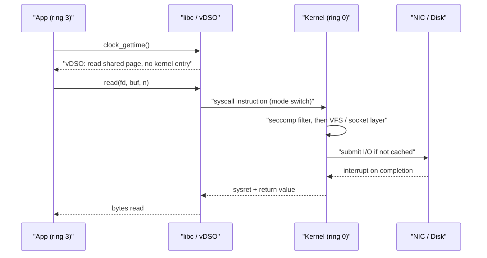
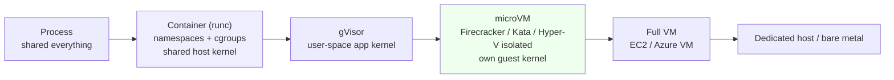
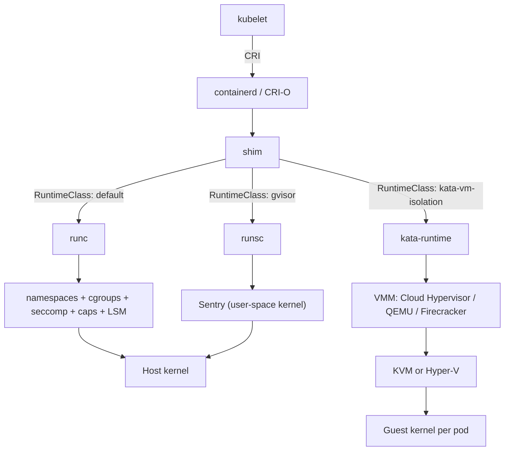

# A8 More OS Concepts
> Last verified: 2026-10 · Audience: senior/staff DevOps, SRE, AI eng, NetEng, DevSecOps, architects

## TL;DR
- **Build chain:** source → compiler (front end → IR → optimizer → back end) → object files → **linker** → ELF executable. **Static linking** gives one self-contained binary (good for `scratch`/distroless images). **Dynamic linking** shares `.so` files and gets security patches from the OS, but a container image then has to ship the right libc.
- **musl vs glibc:** Alpine uses musl, which gives small images but differs from glibc in DNS resolver behaviour (no TCP fallback before musl 1.2.4), malloc performance, `manylinux` wheels and NSS. Go `CGO_ENABLED=0` binaries and Rust `*-musl` targets are the usual static choices.
- **User to kernel mode:** a syscall is a **mode switch** (ring 3 → ring 0 through the `syscall` instruction), not a context switch. It costs roughly 100 ns or more, and Spectre/Meltdown mitigations such as KPTI add to that. Four ways to cut the cost: **vDSO** (`clock_gettime` with no kernel entry), batching (`io_uring`, `sendmmsg`), kernel bypass (DPDK), or moving logic into the kernel (**eBPF**).
- **Virtualization:** a type 1 hypervisor runs on bare metal (ESXi, Hyper-V, Xen, KVM in practice). A type 2 hypervisor runs on a host OS (VirtualBox, Workstation). Modern hypervisors are **hardware assisted**: VT-x/AMD-V for the CPU, EPT/NPT for memory, IOMMU plus SR-IOV for I/O. **AWS Nitro** is a minimal KVM-based hypervisor with I/O offloaded to Nitro Cards. **Azure** runs Hyper-V, and **Azure Boost** offloads storage and networking (MANA NIC, FPGA).
- **Container = a normal process** with **namespaces** (what it can *see*), **cgroups** (what it can *use*), and **capabilities + seccomp + LSM** (what it can *do*), on an overlay rootfs. All containers share the host kernel, so a kernel bug can be a container escape.
- **Isolation spectrum:** process → container (runc) → userspace kernel (**gVisor**) → **microVM** (Firecracker, Cloud Hypervisor, Kata) → full VM → dedicated host or bare metal. For multi-tenant or untrusted code (LLM-generated code, customer plugins), use a VM boundary.
- **Cloud mapping:** Lambda and Fargate (ECS/EKS) give each function environment or each task/pod its **own kernel, as a VM boundary**. Firecracker is the published Lambda technology. On Azure, ACI is Hyper-V isolated, ACA dynamic sessions are Hyper-V isolated, and AKS **Pod Sandboxing** runs Kata on Hyper-V with Cloud Hypervisor. Plain EKS/AKS nodes use runc with a shared kernel.
- **Pitfalls to name:** CPU throttling from the CFS quota (`cpu.max`), OOMKilled from `memory.max`, JVM/Node not reading cgroup v2 limits on old versions, `privileged: true` turning off all of the above, and runc escapes (CVE-2019-5736, CVE-2024-21626 "Leaky Vessels").

## A8.1 Compilers and Linkers
- **How it works:**
  - **Compiler pipeline:** preprocess → parse/AST → **IR** (LLVM IR, GCC GIMPLE) → optimization passes (inlining, loop unrolling, vectorization) → codegen for the target ISA (x86-64, arm64) → assembler → **object file** (`.o`, ELF relocatable).
  - **AOT vs JIT:** C, C++, Go and Rust compile ahead of time. JVM, .NET and V8 JIT-compile hot code at runtime, so they have a warm-up phase that matters for cold starts. Mitigations: GraalVM native-image, .NET NativeAOT, Lambda **SnapStart** (snapshots the initialized microVM).
  - **Linker (`ld`, `gold`, `lld`, `mold`):** resolves symbols, applies relocations and lays out sections (`.text`, `.data`, `.bss`, `.rodata`). **LTO** (link-time optimization) optimizes across object files.
  - **Static linking:** library code (`.a`) is copied into the binary. No runtime loader work, one file, works `FROM scratch`.
  - **Dynamic linking:** the binary records `DT_NEEDED` libraries, and at exec time the kernel maps the **interpreter** `ld-linux-x86-64.so.2`, which maps the `.so` files and resolves symbols through the **PLT/GOT**. Binding is lazy by default. `-z now` plus **full RELRO** makes the GOT read-only, which is a hardening measure.
  - **PIE + ASLR:** position-independent executables are randomized at load time. Distros build PIE by default.
  - Tooling: `ldd` (do not run it on untrusted binaries), `readelf -d`, `objdump`, `nm`, `file`, `LD_PRELOAD` (interposition, used by profilers and also by malware), `LD_LIBRARY_PATH`.
- **glibc vs musl:**

| Aspect | glibc (Debian, Ubuntu, RHEL, Amazon Linux, Azure Linux) | musl (Alpine) |
|---|---|---|
| Static linking | Discouraged: NSS (`getaddrinfo`, `getpwnam`) still `dlopen`s modules, and you get link warnings | First-class, small static binaries |
| DNS | Full `resolv.conf` options, TCP fallback | TCP fallback only since **1.2.4 (2023)**. Older versions break on truncated (>512 B) answers, e.g. large k8s SRV/TXT responses |
| malloc | ptmalloc, tuned for threads | Slower under multithreaded contention. People swap in jemalloc or mimalloc |
| Python wheels | `manylinux` | `musllinux`. Many packages compile from source, so builds are slow and big |
| Image size | debian-slim around 30 MB compressed (approx.) | alpine around 3–4 MB (approx.) |

- **Container image strategies:**
  - **`scratch`:** an empty filesystem. Only a static binary fits. You add CA certs (`/etc/ssl/certs`), `/etc/passwd` for non-root and tzdata yourself.
  - **Distroless** (`gcr.io/distroless/static`, `/base` (glibc), `/cc`, `/java`, `/python3`): no shell or package manager, but includes CA certs, a nonroot user and tzdata. Debug with `:debug` tags or `kubectl debug` ephemeral containers.
  - **Chainguard/Wolfi**, **Azure Linux distroless**, **Amazon Linux minimal**: hardened minimal glibc bases that are rebuilt often to keep CVE counts low.
  - The **multi-stage build** pattern compiles in a fat builder stage and copies only the artifact (see Hands-on).
- **Trade-offs / when to use:**
  - Static: easier deploys, a smaller attack surface (no shell) and reproducibility. **But** you must rebuild to patch a vulnerable library (e.g. OpenSSL/zlib vendored in), SBOM scanners may miss statically linked components, and the binaries are bigger.
  - Dynamic: shared pages across processes (lower RSS on dense hosts) and OS-level patching. **But** "works on my machine" libc mismatches (`GLIBC_2.34 not found`) and a larger image.
  - Choose **glibc distroless** for anything with cgo, Python/Node native modules or heavy DNS use. Choose **musl/scratch** for pure Go/Rust CLIs and sidecars.
- **Interview angles:**
  - "Why does my Alpine pod fail DNS intermittently?" → musl before 1.2.4 had no TCP fallback, and its search/ndots handling differs. Also k8s `ndots:5` amplification. Fix: newer Alpine, a glibc base, or a lower `ndots` in `dnsConfig`. Cross-link [F5 DNS](../F-network-engineering/) and [H3](../H-full-stack-troubleshooting/).
  - "GLIBC_2.xx not found" → the binary was built on a newer glibc than the runtime has. glibc is backward compatible but not forward compatible. Build on the oldest target or in the same base image.
  - "Smallest secure image?" → multi-stage build, a static binary on distroless/static, nonroot UID 65532, read-only rootfs, image signing (cosign/Notation) and an SBOM.
  - Cross-compiling for **Graviton/Cobalt (arm64)**: `docker buildx --platform linux/amd64,linux/arm64`, plus `GOARCH` or QEMU emulation (slow) or native arm runners.
  - Pitfall: `CGO_ENABLED=1` (the default when a C toolchain is present) silently produces a dynamically linked Go binary, which then fails on `scratch` with "no such file or directory" because the ELF interpreter is missing.

## A8.2 Kernel vs User Mode switching
- **How it works:**
  - The CPU runs in privilege levels: x86 **ring 0** (kernel) and **ring 3** (user), arm64 EL0/EL1 (EL2 is the hypervisor). User code cannot touch page tables, I/O ports or other processes' memory.
  - Ways into the kernel: **syscall** (`syscall` instruction on x86-64, `svc` on arm64), **exceptions** (page fault, divide by zero) and **hardware interrupts** (NIC, timer).
  - **Mode switch vs context switch:** a syscall saves user registers and switches to the kernel stack, but stays in the *same* process (mode switch). A context switch changes the *task* (scheduler, possibly the address space via CR3, TLB effects) and is much more expensive.
  - **Approximate costs** (order of magnitude, vary by CPU and kernel): bare syscall about 50–200 ns. With **KPTI** (the Meltdown mitigation, separate kernel/user page tables) plus Spectre mitigations it can be several times more on affected CPUs. Thread context switch about 1–5 µs including cache/TLB pollution. VM exit about 1 µs or more.
  - **vDSO:** the kernel maps a small shared object into every process. On x86-64 it exports `__vdso_clock_gettime`, `__vdso_gettimeofday`, `__vdso_time` and `__vdso_getcpu`, so these are memory reads with **no kernel entry**. Pitfall: if the clocksource is not TSC-based (e.g. `xen` on old Xen-based EC2 instances), the vDSO falls back to a real syscall and time-heavy apps slow down. Nitro uses `kvm-clock`/TSC.
  - **Reducing crossings:** buffered I/O, batching (`writev`, `sendmmsg`, `recvmmsg`), `io_uring` (shared submission/completion rings, can be syscall-free with SQPOLL), `sendfile`/`splice` zero-copy, `epoll` instead of `select` (cross-link [A7.4](./) Async IO).
  - **Kernel bypass:** DPDK and SPDK poll NICs/NVMe from user space through VFIO. Used by NFV, trading and storage appliances. Azure Boost MANA supports DPDK.
  - **eBPF:** the reverse idea, where you run verified, sandboxed programs *inside* the kernel. The verifier proves termination and memory safety, then the program is JIT-compiled to native code. Hooks: kprobes/uprobes, tracepoints, **XDP** (before skb allocation, the fastest drop/LB path), tc, cgroup, socket, **LSM** (BPF-LSM). Data is shared through **maps** and ring buffers.
  - Users of eBPF: Cilium (CNI and kube-proxy replacement, Azure CNI powered by Cilium), Falco/Tetragon (runtime security), Pixie/Parca (observability), bpftrace, Katran (L4 LB).
- **Trade-offs / when to use:**
  - `strace` uses **ptrace**, which stops the tracee on every syscall: 10–100x slowdowns, so avoid it in production. Prefer `perf trace`, `bpftrace` or `strace -c` briefly.
  - eBPF needs `CAP_BPF`/`CAP_SYS_ADMIN`, a recent kernel (BTF/CO-RE for portability) and verifier limits (1M instructions). It is powerful, but also an attack surface: unprivileged BPF is disabled by default on most distros.
  - Kernel bypass gives µs latency and Mpps throughput, but you lose the kernel TCP stack, iptables and tooling, and it burns dedicated polling cores.
- **Interview angles:**
  - "Why is a syscall expensive?" → privilege transition, register save/restore, mitigations (KPTI CR3 switch, IBRS/retpoline, buffer clearing), and cache/TLB pollution. It is *not* a full context switch.
  - "High `sys` CPU%?" → look for many tiny reads/writes (no buffering), lock contention (futex), page faults, or a non-vDSO `gettimeofday`. Tools: `perf top`, `strace -c -f -p`, `/proc/<pid>/status` (`voluntary_ctxt_switches`).
  - "How does Cilium beat kube-proxy/iptables?" → eBPF hash-map lookups are O(1) versus linear iptables chains, and it can do socket-level LB (connect-time translation) that skips per-packet NAT. Cross-link [F6](../F-network-engineering/).
  - Follow-up: gVisor exists *because* the syscall boundary is the container attack surface (about 300+ syscalls into a shared kernel).

## A8.3 Virtualization and Containerization (cgroups vs namespaces)
### Virtualization
- **How it works:**
  - **Popek–Goldberg:** a machine is virtualizable with trap-and-emulate if every sensitive instruction traps. Classic x86 did not meet this, which led to **binary translation** (VMware) and **paravirtualization** (Xen PV, with a guest that knows it is virtualized), then **hardware assist** (Intel VT-x / AMD-V, 2005–06). Those added VMX root/non-root modes, so the guest kernel runs in ring 0 non-root and sensitive operations cause **VM exits**.
  - **Memory:** **EPT/NPT** (second-level address translation) removed shadow page tables. A TLB miss can cost up to 24 memory references with 4-level paging in both guest and host, which is why **huge pages** matter more in VMs.
  - **I/O:** emulated devices are slow. **virtio** is a paravirtual queue interface. **SR-IOV** splits a NIC/NVMe into virtual functions that are passed straight to the VM. The **IOMMU** (VT-d/AMD-Vi) makes that DMA safe. AWS calls this ENA/EBS NVMe; Azure calls it **Accelerated Networking** (VF, Mellanox/MANA).
  - **Type 1 (bare metal):** VMware ESXi, Microsoft **Hyper-V** (the Windows "root partition" is itself a VM-like partition above the hypervisor), Xen, and **KVM** (a Linux kernel module that turns Linux into the hypervisor, usually counted as type 1).
  - **Type 2 (hosted):** VirtualBox, VMware Workstation/Fusion, Parallels. They run as apps on a host OS and are for dev/test.
  - **VMM vs hypervisor:** with KVM, the user-space VMM (QEMU, **Firecracker**, **Cloud Hypervisor**, crosvm) emulates devices, and KVM handles CPU and memory virtualization.
- **AWS Nitro vs Azure Hyper-V/Boost:**

| Aspect | AWS Nitro System | Azure (Hyper-V + Azure Boost) |
|---|---|---|
| Hypervisor | **Nitro Hypervisor**, minimal and KVM-based: no network stack, no general file system, no shell. It partitions CPU and memory and assigns SR-IOV VFs | Hyper-V with a hardened host OS. Boost moves host work off the host CPU |
| I/O offload | **Nitro Cards** (VPC/ENA, EBS NVMe, instance store NVMe), with encryption done in hardware on the card | **Azure Boost**: MANA NIC (up to 200 Gbps), FPGA storage offload (remote up to 14 GBps / 750K IOPS, local up to 36 GBps / 6.6M IOPS), NVMe interface |
| Root of trust | Nitro Controller (hardware RoT) plus **Nitro Security Chip** (gates firmware writes, holds the main board in reset until verified) | **Cerberus** HW RoT (NIST 800-193), attestation, Rust for new code, SELinux on the Boost SoC |
| Bare metal | `.metal` instances: the hypervisor is optional because the cards still provide I/O | Not a general bare-metal SKU line. Dedicated Hosts give single-tenant hardware but are still virtualized |
| Updates | Live update of the hypervisor with no reboot | Memory-preserving updates and live migration |
| Operator access | Designed with no operator shell/SSH access to hosts | Host access is restricted. Confidential VMs/containers are used for in-use protection |

- **Confidential computing:** AMD **SEV-SNP** and Intel **TDX** encrypt VM memory against the host. AWS: SEV-SNP on select EC2 types plus **Nitro Enclaves** (an isolated vCPU/memory carve-out reachable only over vsock). Azure: **Confidential VMs** (DCasv5/ECasv5 SEV-SNP, DCesv5 TDX) and **confidential containers on ACI**.
- **Trade-offs:** VMs give a strong boundary (a separate kernel, and the hypervisor has a small attack surface) but slower boot (seconds or more) and a per-VM kernel memory cost. Nested virtualization (needed to run Kata inside cloud VMs) is supported on many Azure sizes (Dv3/Dsv3 and later). On AWS, Kata/Firecracker has traditionally required `.metal` instances (check the current EC2 docs for any nested-virt support; unverified).

### Containers: namespaces + cgroups + security
- **Namespaces (isolation of the *view*):** `man 7 namespaces` lists 8 types.

| Namespace | Flag | Isolates |
|---|---|---|
| Mount | `CLONE_NEWNS` | Mount table (container rootfs) |
| UTS | `CLONE_NEWUTS` | Hostname, NIS domain |
| IPC | `CLONE_NEWIPC` | SysV IPC, POSIX message queues |
| PID | `CLONE_NEWPID` | PID numbering (the container's PID 1 must reap zombies and handle SIGTERM, hence `tini`/`--init`) |
| Network | `CLONE_NEWNET` | Interfaces, routes, iptables, ports (veth pairs to a bridge/CNI). In k8s, all containers in a pod share one netns held by the **pause** container |
| User | `CLONE_NEWUSER` | UID/GID mapping: root in the container is an unprivileged UID on the host. Can be created unprivileged since Linux 3.8. k8s `hostUsers: false` (beta, on by default since v1.33) |
| Cgroup | `CLONE_NEWCGROUP` (4.6) | Cgroup root view |
| Time | `CLONE_NEWTIME` (5.6) | Boot/monotonic clock offsets (used for checkpoint/restore) |

- **cgroups (limits on *use*):**
  - **v2** is a single unified hierarchy (`/sys/fs/cgroup`, `stat -fc %T` returns `cgroup2fs`). Controllers: `cpu`, `cpuset`, `memory`, `io`, `pids`, `hugetlb`, `rdma`, `misc`. It also provides **PSI** pressure metrics.
  - k8s requires kernel 5.8+ for v2 and the **systemd** cgroup driver. **cgroup v1 is deprecated since k8s v1.35**: kubelet refuses to start on v1 nodes unless `failCgroupV1: false`.
  - **CPU:** `requests` map to `cpu.weight` (proportional share under contention). `limits` map to `cpu.max` (CFS quota/period, default period 100 ms). A 500m limit means 50 ms per 100 ms, so multithreaded apps burn the quota early and get **throttled** (tail latency). Watch `nr_throttled` in `cpu.stat`. Many teams set CPU requests but no CPU limits for latency-sensitive services.
  - **Memory:** `memory.max` is a hard limit, and exceeding it triggers the cgroup **OOM killer** (k8s `OOMKilled`, exit 137). `memory.high` throttles and reclaims first. Page cache counts toward the limit.
  - **pids.max** stops fork bombs.
  - Runtimes must be cgroup-aware: JDK 15+/11.0.16+ and Node 20.3+ read v2 limits. Older ones size heaps from host RAM and get OOMKilled.
- **What it can *do*:**
  - **Capabilities:** root is split into about 40 caps. Docker's default keeps 14 (e.g. `CHOWN`, `DAC_OVERRIDE`, `NET_BIND_SERVICE`, `NET_RAW`, `SETUID`, `SETGID`, `KILL`, `SYS_CHROOT`, `MKNOD`, `AUDIT_WRITE`...). Best practice is `drop: ["ALL"]` and add back only what is needed. `CAP_SYS_ADMIN` is "the new root".
  - **seccomp-bpf:** a syscall allowlist. Docker's default profile is deny-by-default with an allowlist, blocking about 44 of 300+ syscalls (`mount`, `unshare`, `setns`, `ptrace`, `kexec_load`, `reboot`...). In Kubernetes the default is **Unconfined** unless you set `seccompProfile: RuntimeDefault` or enable kubelet `seccompDefault: true` (the feature is GA since 1.27). Pod Security Standards "restricted" requires it.
  - **LSM:** AppArmor (Ubuntu/AKS) and SELinux (RHEL/Bottlerocket/OpenShift) for MAC labels on files and processes.
  - Other controls: `no_new_privs` (`allowPrivilegeEscalation: false`), read-only rootfs, non-root UID, masked `/proc` paths.
  - **`privileged: true`** gives all caps, no seccomp, all devices and writable `/sys`. It is effectively host root.
- **Stack:** `kubelet` → CRI → **containerd**/CRI-O → shim → **OCI runtime** (`runc`, `crun`, `runsc` (gVisor), `kata-runtime`) → namespaces + cgroups + rootfs (**overlayfs** lower layers read-only, upper layer writable). Kubernetes **RuntimeClass** picks the runtime per pod.
- **Windows containers:** process isolation (shared kernel, host and container versions must match) vs **Hyper-V isolation** (`--isolation=hyperv`, a utility VM with its own kernel). This is the ancestor of ACI's isolation.

### Sandboxes and microVMs
| Tech | Mechanism | Boot / overhead | Used by | Trade-off |
|---|---|---|---|---|
| runc | Namespaces + cgroups, shared kernel | ms, ~0 | Default Docker/containerd, EKS/AKS EC2/VM nodes | Kernel is a shared attack surface |
| **gVisor** (`runsc`) | User-space "application kernel" (**Sentry**, Go) intercepts syscalls. **Gofer** mediates FS access. Platforms: systrap/KVM/ptrace | ms, some MB | Google Cloud Run (gen1), GKE Sandbox | Syscall-heavy and I/O-heavy workloads get slower, and some syscalls are unimplemented |
| **Firecracker** | KVM + minimal Rust VMM. Only 5 devices (virtio-net, virtio-block, virtio-vsock, serial, minimal keyboard controller). **jailer** adds a cgroup/seccomp/chroot second line of defense | <125 ms boot, <5 MiB overhead, up to 150 microVMs/s/host | **AWS Lambda** (15T+ invocations/month), Fargate (per AWS's 2018 launch), Fly.io, many AI code sandboxes | No PCI passthrough/GPU, Linux guests only |
| **Kata Containers** | OCI runtime that starts a lightweight VM per pod (QEMU / Cloud Hypervisor / Firecracker VMM) | ~100s of ms (approx.), plus a guest kernel per pod | **AKS Pod Sandboxing** (`runtimeClassName: kata-vm-isolation`, Hyper-V + Cloud Hypervisor, Azure Linux only) | Pod VM memory is fixed (defaults to 512Mi without a limit). Fractional CPU rounds up to whole vCPUs. No hostNetwork. Lower IOPS |
| Full VM | Hypervisor with a full guest OS | Seconds to minutes | EC2, Azure VMs, EKS/AKS nodes | Strongest general boundary, heaviest |

- **Trade-offs / when to use:**
  - **Trusted, single-tenant microservices:** runc plus hardening (PSS restricted, seccomp RuntimeDefault, drop ALL caps, non-root, read-only rootfs).
  - **Multi-tenant SaaS running customer code, CI runners, LLM-generated code execution:** use a VM boundary (Firecracker/Kata/ACA dynamic sessions/Lambda) and also network-egress controls.
  - **Hard multi-tenancy:** separate clusters or accounts/subscriptions. Even AWS docs say "the safest way to isolate an application is always to run it in a separate cluster".
- **Interview angles:**
  - "Container vs VM?" → a container is a process using kernel features that share one kernel. A VM virtualizes hardware and runs its own kernel. Then describe the **spectrum** and where gVisor and microVMs sit.
  - "cgroups vs namespaces in one line?" → **namespaces limit what you can see; cgroups limit how much you can use.** Seccomp, capabilities and LSMs limit what you can do.
  - "Why does Lambda use Firecracker instead of containers?" → multi-tenant untrusted code needs a hardware-virtualization boundary, but it also needs container-like density and startup. Firecracker gives <125 ms boot and <5 MiB overhead.
  - "Pod keeps getting OOMKilled but `top` shows free memory?" → it hit the cgroup `memory.max`, not host memory. Check `kubectl describe` (exit 137), `memory.events`, page cache, and whether the runtime reads cgroup v2 limits.
  - "Latency spikes with low average CPU?" → CFS throttling. Check `cpu.stat nr_throttled`, then remove the CPU limit or raise it, or use static CPU manager pinning for guaranteed QoS pods.
  - Escape classics: CVE-2019-5736 (overwriting the runc binary through `/proc/self/exe`), CVE-2024-21626 (leaked fd giving a host cwd). Mounting `docker.sock` is equivalent to host root. Also hostPath `/` mounts and `CAP_SYS_ADMIN` with cgroup v1 `release_agent`.
  - Follow-up "is Fargate a container or a VM?" → you give it containers, and each ECS task / EKS pod gets its own kernel and ENI. The isolation unit is a VM. So no DaemonSets, no privileged, no hostNetwork, no GPUs on EKS Fargate.

## Diagrams






## Cloud mapping: AWS vs Azure
| Capability | AWS | Azure | Role it plays | Key differences | Alternatives |
|---|---|---|---|---|---|
| Functions (FaaS) | **Lambda** (Firecracker microVM per execution environment) | **Azure Functions**: Flex Consumption (Linux, new default), Premium, Dedicated, on Container Apps. Legacy Consumption | Event-driven code without servers | Lambda max 15 min (Durable Functions up to 1 yr). Functions Flex timeout is unbounded by default, but HTTP responses are capped at 230 s by the LB. Linux Consumption retires 2028-09-30 | Cloudflare Workers (V8 isolates, not VMs), Cloud Run functions |
| Single serverless container / task | **ECS on Fargate** (`RunTask`) | **Azure Container Instances** (container group = pod, Hyper-V isolated) | Run a container without nodes | Fargate task: own kernel and ENI. ACI: only x64, no privileged, needs a NAT GW for outbound when VNet-injected, 15 GB image cap | Cloud Run jobs, Fly Machines |
| Serverless app / microservice platform | **ECS + Fargate** (with ALB, Service Connect). App Runner for simple web apps (check current availability; unverified) | **Azure Container Apps** (K8s + KEDA + Envoy + Dapr under the hood, no K8s API) | Revisions, autoscale (to zero), ingress | ACA scales to zero natively through KEDA. ECS services have a minimum of 0 tasks but no built-in request-driven wake-up | Cloud Run, Knative |
| Managed Kubernetes | **EKS** (Auto Mode, managed node groups, Karpenter) | **AKS** (Standard / **Automatic**) | Full K8s API | EKS control plane billed per hour. AKS has a Free tier plus Standard/Premium uptime SLA tiers | GKE, self-managed k8s, OpenShift (ROSA / ARO) |
| Serverless K8s pods (VM boundary per pod) | **EKS on Fargate** (Fargate profiles; no DaemonSets, privileged, GPU or EBS) | **AKS virtual nodes on ACI** | Burst pods without node management | Both are Linux-focused and use IP-mode LB targets | GKE Autopilot |
| VM-sandboxed pods on your nodes | No managed Kata option. Self-manage Kata/Firecracker on `.metal`, or use Fargate | **AKS Pod Sandboxing** (Kata, `kata-vm-isolation`, Azure Linux, Gen2 nested-virt VM sizes) | Untrusted or multi-tenant pods in a shared cluster | AKS needs nested virtualization. Defender for Containers does not assess Kata pods | GKE Sandbox (gVisor) |
| Untrusted / LLM code execution | Lambda, **Bedrock AgentCore Code Interpreter** | **ACA dynamic sessions** (Hyper-V isolated, pre-warmed session pools, ms allocation; code interpreter or custom container) | Sandbox AI-generated code | ACA sessions are billed per pool. Both need egress controls | E2B / Firecracker sandboxes, Claude code execution tool, Gemini code execution |
| Hypervisor platform | **Nitro** (Nitro Hypervisor + Cards + Security Chip) | **Hyper-V + Azure Boost** (MANA, FPGA storage, Cerberus) | Isolation and performance of every VM | Nitro gives `.metal` without losing EBS/VPC. Boost is per VM family | — |
| Confidential compute | Nitro Enclaves, SEV-SNP instances | Confidential VMs (SEV-SNP/TDX), confidential containers on ACI | Protect data in use from the host | Enclaves: no network, vsock only. Azure CVMs run the full OS | GCP Confidential VMs |
| Container OS | **Bottlerocket**, AL2023 | **Azure Linux** (CBL-Mariner), Ubuntu | Minimal immutable node OS | Pod Sandboxing requires Azure Linux | Flatcar, Talos |

- **Lambda:** each execution environment is a Firecracker microVM. Lifecycle is Init (10 s cap on-demand) → Invoke → Shutdown. Environments are frozen and thawed between invokes, so globals and `/tmp` (512 MB–10 GB) persist, and they are recycled every few hours. **SnapStart** restores a memory snapshot of the microVM. **Lambda Managed Instances** runs on customer-owned EC2 with concurrent invocations, which is a different lifecycle.
- **Fargate (ECS/EKS):** per-task/per-pod kernel, CPU, memory and ENI. No SSH or host. Platform versions are kernel plus runtime, patched through task retirement. Fargate Spot is ECS only.
- **ACI:** "as isolated as a VM" (hypervisor-level). Container groups share network, storage and lifecycle. NGroups for multi-instance with rolling upgrades. **Standby pools** for faster start. Spot up to about 70% off. Confidential SKU.
- **ACA:** the environment is the boundary (VNet, Log Analytics). Workload profiles: Consumption or Dedicated, including GPU. Dynamic sessions for Hyper-V-isolated untrusted code.
- **EKS vs AKS sandboxing gap:** Azure has a first-party Kata option on shared nodes. AWS's answer is "use Fargate (VM per pod) or separate node groups/accounts".
- **Shared gotchas:** neither ACI nor Fargate allows privileged containers. Both bill per second on vCPU/GB. Image size and pull time dominate cold start, which is why small static images (A8.1) matter. Lazy-loading options: SOCI (AWS), artifact streaming (AKS/ACR).

## Hands-on (optional)
Multi-stage build: compile a static Go binary, then ship it on distroless (nonroot).
```dockerfile
# syntax=docker/dockerfile:1
FROM golang:1.23 AS build
WORKDIR /src
COPY go.mod go.sum ./
RUN --mount=type=cache,target=/go/pkg/mod go mod download
COPY . .
# CGO off => fully static, no libc / ELF interpreter needed
RUN CGO_ENABLED=0 GOOS=linux go build -trimpath -ldflags="-s -w" -o /out/app ./cmd/app

# distroless/static: CA certs, tzdata, /etc/passwd with nonroot (65532); no shell
FROM gcr.io/distroless/static-debian12:nonroot
COPY --from=build /out/app /app
USER nonroot:nonroot
ENTRYPOINT ["/app"]
```

Inspect linking, namespaces, cgroups and syscalls.
```bash
file ./app; ldd ./app || echo "static"             # 'not a dynamic executable' => static
readelf -d /usr/bin/curl | grep NEEDED            # dynamic deps
ls -l /proc/self/ns                               # namespaces of this shell
stat -fc %T /sys/fs/cgroup                        # cgroup2fs => v2
cat /sys/fs/cgroup/$(cut -d: -f3 /proc/self/cgroup)/cpu.max   # "max 100000" or "50000 100000"
grep -E 'nr_throttled|throttled_usec' /sys/fs/cgroup/cpu.stat
sudo unshare --pid --fork --mount-proc --net --uts bash -c 'hostname box; ps aux; ip link'
docker run --rm --cap-drop ALL --security-opt no-new-privileges --read-only alpine id
grep -E 'Cap(Eff|Bnd)|Seccomp' /proc/self/status  # caps bitmap, seccomp mode (2=filter)
strace -c -f -- curl -s https://example.com >/dev/null   # syscall histogram (dev only)
```

## Cross-links
- [A7 Sockets and Async IO](./) (A7.1, A7.4: epoll/io_uring and syscall batching)
- [A9 Bonus](./) (A9.1 Google TCP/IP stack, A9.2 ByteDance reboot)
- [F5 DNS](../F-network-engineering/) (F5.1) and [H3 DNS troubleshooting](../H-full-stack-troubleshooting/) (musl/ndots issues)
- [F6 Latency / L4-L7](../F-network-engineering/) (F6.8, F6.9: eBPF/XDP load balancing)
- [C4 Security](../C-large-scale-architecture/) (C4.12, C4.13: isolation and firewalls)
- [L Data privacy and AI security](../L-data-privacy-ai-security/) (sandboxing LLM-generated code)
- [K AI infra](../K-ai-infra-llm/) (GPU passthrough and SR-IOV for inference nodes)

## Sources
- https://man7.org/linux/man-pages/man7/namespaces.7.html
- https://man7.org/linux/man-pages/man7/vdso.7.html
- https://kubernetes.io/docs/concepts/architecture/cgroups/
- https://kubernetes.io/docs/tutorials/security/seccomp/
- https://docs.docker.com/engine/security/seccomp/
- https://docs.docker.com/build/building/multi-stage/
- https://firecracker-microvm.github.io/
- https://gvisor.dev/docs/
- https://docs.aws.amazon.com/whitepapers/latest/security-design-of-aws-nitro-system/the-components-of-the-nitro-system.html
- https://docs.aws.amazon.com/lambda/latest/dg/lambda-runtime-environment.html
- https://docs.aws.amazon.com/AmazonECS/latest/developerguide/AWS_Fargate.html
- https://docs.aws.amazon.com/eks/latest/userguide/fargate.html
- https://learn.microsoft.com/en-us/azure/azure-boost/overview
- https://learn.microsoft.com/en-us/azure/container-instances/container-instances-overview
- https://learn.microsoft.com/en-us/azure/container-apps/compare-options
- https://learn.microsoft.com/en-us/azure/container-apps/sessions
- https://learn.microsoft.com/en-us/azure/aks/use-pod-sandboxing
- https://learn.microsoft.com/en-us/azure/azure-functions/functions-scale
- https://learn.microsoft.com/en-us/virtualization/windowscontainers/manage-containers/hyperv-container
- https://www.openwall.com/lists/musl/2023/05/02/1 (musl 1.2.4 release: DNS TCP fallback)
