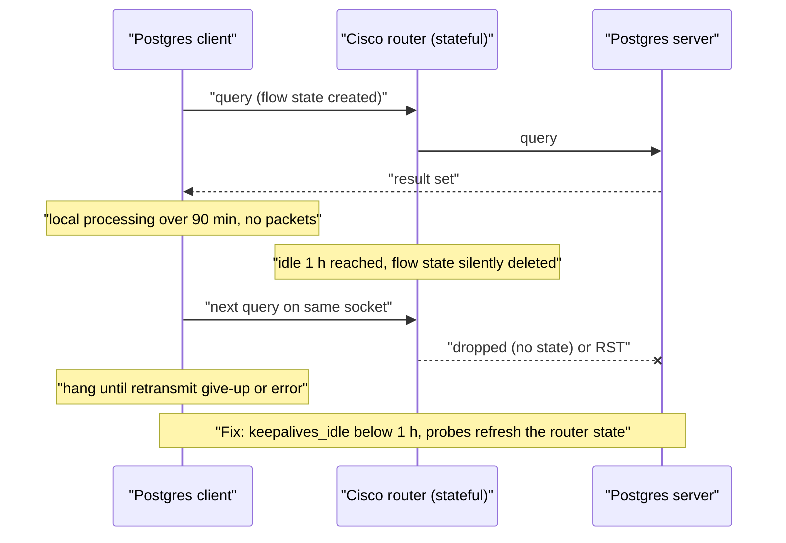
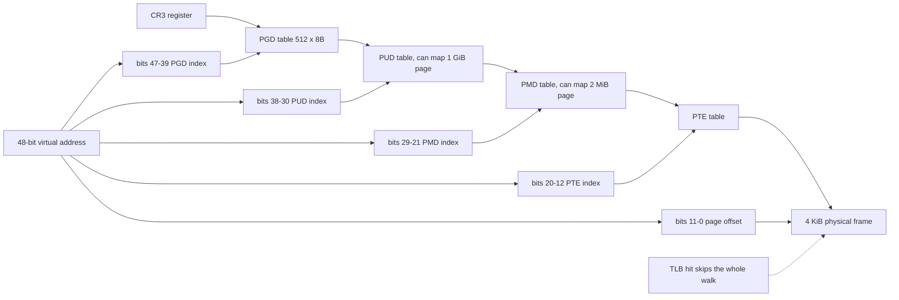
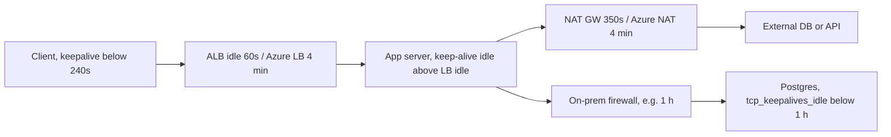

# A9 Bonus
> Last verified: 2026-10 · Audience: senior/staff DevOps, SRE, AI eng, NetEng, DevSecOps, architects

## TL;DR
- **Google's 40% TCP speedup (Linux 6.8, released Mar 2024)** didn't come from a new algorithm. Coco Li (Google), with Eric Dumazet, **reordered the fields in `tcp_sock`, `net_device` and `netns_ipv4`** so the fast-path variables share fewer **64-byte cache lines**. Throughput gains reached about **44% on AMD EPYC** with 1k–30k flows. Intel gains were small (about 1–5%).
- **ByteDance "faster kexec reboot" (Jul 2022 RFC):** the time from `machine_kexec` to `start_kernel` dropped from **more than 500 ms to about 15 ms**. It did this by skipping the copy, the SHA-256 check of segments and decompression (uncompressed bzImage, reuse of crashkernel memory). Maintainer Eric Biederman **pushed back** (wasted memory, data-safety risk), and the series **did not land as posted**.
- **Timeouts are a layered budget.** Each hop's **idle timeout** has to match its neighbours. The **upstream server's keep-alive idle must exceed the LB's idle timeout**, otherwise you get random 502/RSTs. **TCP keepalive must fire before the shortest middlebox idle timer.** Per-call timeouts must be smaller than the caller's deadline (**deadline propagation**).
- **Postgres + Cisco router incident:** a client ran queries, then crunched data locally for **more than 90 min** with no packets on the wire. The router's **idle timeout (default 1 h)** silently removed the flow state, and the next use of the connection failed or hung. Fix: **TCP keepalives below the middlebox idle timer** (`keepalives_idle` / `tcp_keepalives_idle`), plus `tcp_user_timeout`.
- **Linux keepalive defaults are useless for middleboxes.** The first probe goes out after **7200 s** (2 h), then 9 probes × 75 s, so death is detected after about 2 h 11 min. AWS NAT GW/NLB/GWLB idle out at **350 s**, and Azure LB/NAT GW/Firewall at **4 min**.
- **Page tables:** x86-64 uses a **4-level walk (48-bit VA = 256 TiB)** or **5-level (57-bit = 128 PiB)**. Each level is a 4 KiB table of **512 × 8-byte entries**. A TLB miss costs up to 4–5 memory references (up to **24** under nested virtualization). Page-table memory is about **0.2% of mapped memory per process**, which explodes with large shared memory across many processes (Postgres) unless you use **huge pages**.

## A9.1 How Google Improved Linux TCP/IP Stack by 40%
- **How it works:**
  - **Source:** patch series *"Analyze and Reorganize core Networking Structs to optimize cacheline consumption"* by **Coco Li (Google)**, suggested and reviewed by **Eric Dumazet**. Merged via net-next (Dec 2023) and shipped in **Linux 6.8 (March 2024)**.
  - **Fast path defined as:** one-way TCP data transfer in `TCP_ESTABLISHED`. Every field touched per packet was classified as tx / rx / tx+rx, read-mostly or read-write.
  - **Analysis (kernel 6.5), from `Documentation/networking/net_cachelines/`:**

    | Struct | Size | Fast-path cache lines before → after |
    |---|---|---|
    | `tcp_sock` | 2,664 B (42 lines) | 12 → **8** |
    | `net_device` | 2,240 B (39 lines) | 12 → **4** |
    | `netns_ipv4` (sysctls) | 768 B (12 lines) | 4 → **2** |
    | `inet_sock`, `inet_connection_sock` | — | no gain (embedded `sock` dominates) |
  - **Mechanism:** hot fields are grouped next to each other into **cache-line groups** (`__cacheline_group_begin/end` in `include/linux/cache.h`). **Build-time assertions** (`CACHELINE_ASSERT_GROUP_MEMBER/SIZE`) make the build fail if a future patch moves a hot field out of its group. That is regression protection.
  - **Results** (neper `tcp_rr`, 1k–30k flows, kernel 6.5-rc1): **AMD** (100 Gb/s NIC, 256 MB L3) improved about **35–44%** on IPv4 and IPv6, with a peak of **44.47%**. **Intel** (200 Gb/s NIC, 105 MB L3) improved about **1–5%**, with one config slightly negative.
- **Why it matters:** with thousands of sockets the working set doesn't fit in L1/L2. Every extra 64 B line per packet is a cache miss of about 100 ns from DRAM, or a cross-CCD/NUMA transfer on AMD. Fewer lines per packet means fewer misses and more requests/s **with zero API change**.
- **Trade-offs / when to use:**
  - Layout tuning is microarchitecture-dependent (AMD's chiplet L3 benefited most). Always benchmark on your target CPU.
  - It makes structs harder to change. The assertions turn that into explicit review friction, which is deliberate.
  - Same idea in user space: **group hot fields together, separate fields written by different threads** (avoid **false sharing**), and pad to 64 B or `alignas(64)`.
- **Interview angles:**
  - "How would you speed up a hot path without changing the algorithm?" → data layout: cache-line packing, struct-of-arrays, avoid false sharing. Measure with `perf stat -e cache-misses`, `perf c2c`, `pahole`.
  - "Free performance from a kernel upgrade?" → yes. 6.8+ gives the TCP layout win. Other examples: BIG TCP (6.3 for IPv4), io_uring zero-copy rx. Mention that distro/AMI kernel versions matter (AL2023 / Ubuntu 24.04 ship 6.x).
  - Pitfall: claiming a flat "40% for everyone". The gain is **many concurrent flows, small RPCs, AMD**. Single bulk streams barely move.

## A9.2 How TikTok's ByteDance improved Linux reboot
- **How it works:**
  - **kexec** loads a new kernel from the running kernel and jumps to it. This **skips firmware/BIOS/POST and the bootloader**, which on large servers is often minutes (memory training, NIC/RAID option ROMs). It is used for fast patching and for **kdump** (the crash kernel lives in the reserved `crashkernel=` region).
  - ByteDance (Albert Huang, *"[PATCH 0/4] faster kexec reboot"*, kexec list, **25 Jul 2022**) measured **more than 500 ms** between `machine_kexec` and `start_kernel`, spent on **memory copies, purgatory SHA-256 verification and kernel decompression**. Patches:
    1. **Reuse the crash-kernel reserved memory** for normal kexec, so the image is loaded in place with no relocation copy.
    2. `CONFIG_KEXEC_PURGATORY_SKIP_SIG`: skip the purgatory **hash** check of the segments.
    3. **Uncompressed kernel** support on x86: no decompression. Phoronix reported this alone saved about **150 ms**, at the cost of image size going from **8.5 MB to 53 MB** (per Phoronix).
    4. **Avoid the memory copy** when the kernel is uncompressed.
  - Result: **about 15 ms** from `machine_kexec` to `start_kernel`, measured with `rdtsc` timestamps stored in `boot_params`. The motivation was fleet-scale hot upgrades and time-sensitive restarts. The author compared it with lightweight VMs that boot in 100–200 ms.
- **Community outcome:** **Eric W. Biederman** (kexec maintainer) objected. Permanently reserving MBs of RAM "simply because you might reboot using kexec" is the wrong trade-off. Skipping the SHA-256 check "could very easily eat your data". The option was misnamed (it is a hash, not a signature). In the real world, **driver shutdown/re-init dominates** reboot time. He saw no help for the general case. The series **was not merged as posted** (verified as of 2026 that it did not land in this form).
- **Related, current:** **KHO (Kexec HandOver)** was upstreamed by Amazon/Google in 2025, Linux 6.16 (unverified exact version). It lets the old kernel hand preserved memory/state to the new kernel, so VMs can stay alive across a host kernel update ("live update"). Ongoing work adds deferred `struct page` init support to KHO (kexec list, Dec 2025–Jan 2026).
- **Trade-offs / when to use:**
  - kexec skips firmware, so **firmware/microcode/BIOS updates and hardware resets don't happen**. Some devices (GPUs, certain NICs) don't re-init cleanly without a real reset.
  - Large-memory boxes also lose seconds in **`struct page` init**. Mitigations: `CONFIG_DEFERRED_STRUCT_PAGE_INIT`, which initialises memory in parallel per node after boot, and smaller memmap via HVO/huge pages.
  - Secure Boot / lockdown: `kexec_file_load` requires signed images. Skipping verification weakens integrity.
- **Interview angles:**
  - "How do you cut node patch/reboot time across a 100k-server fleet?" → kexec / `systemctl kexec` (skips POST), deferred memory init, parallel driver probe, live patching (kpatch/livepatch) where possible. Drain with a PDB, cordon, and roll in waves.
  - Follow-up: "Why not always kexec?" → firmware never reloads, hardware state can be dirty, and kdump needs its reserved memory.
  - Cloud angle: you don't get kexec-level control of the hypervisor. Providers do the equivalent internally (live migration, Nitro/Azure host updates with VM-preserving memory).

## A9.3 On Timeouts
### Taxonomy
| Timeout | Who sets it | Protects against | Typical / default |
|---|---|---|---|
| **DNS resolve** | client resolver | dead resolver | glibc 5 s × attempts |
| **Connect** (TCP handshake) | client | dead/unroutable host, SYN drop | Linux: `tcp_syn_retries=6` → gives up after about **131 s**. Set app value to **1–3 s** |
| **TLS handshake** | client/server | slow or stuck handshake | 5–10 s |
| **Write / send** | client & server | peer not reading (rwnd = 0) | `SO_SNDTIMEO`, `TCP_USER_TIMEOUT` |
| **Read / response / first-byte** | client | slow server | per-endpoint, from p99.9 |
| **Header read / request read** | server | **slowloris** | nginx `client_header_timeout` 60 s |
| **Idle** (connection with no bytes) | server, LB, NAT, firewall | resource leaks, conntrack/SNAT exhaustion | ALB 60 s, NLB/NAT GW 350 s, Azure 4 min |
| **HTTP keep-alive** (pooled conn reuse) | client pool & server | stale pooled connections | nginx `keepalive_timeout` 75 s, ALB client keepalive 3600 s |
| **TCP keepalive** | kernel, per socket | half-open peers, middlebox state expiry | Linux 7200 s + 9 × 75 s |
| **Retransmit give-up** | kernel | peer gone mid-transfer | `tcp_retries2=15` → about **924.6 s** (15+ min) |
| **Overall deadline** | caller | everything above, end to end | propagated (gRPC `grpc-timeout`) |
| **DB-side** | DB server | runaway queries, idle transactions holding locks | Postgres `statement_timeout`, `idle_in_transaction_session_timeout`, `idle_session_timeout` (PG14+), `lock_timeout` |

- **How it works / rules of thumb:**
  - **Connect timeout ≠ request timeout.** Connect should be short (a few RTTs + SYN retransmit at 1 s). Read timeouts come from the dependency's **p99/p99.9 latency** plus headroom.
  - **Idle-timeout ordering for a proxied chain:** `client idle < LB idle < backend keep-alive idle`. If the backend closes first, the LB can send a request on a connection that is already closing. AWS documents this as an ALB **HTTP 502**. Example: Node.js `server.keepAliveTimeout` default is 5 s, behind an ALB at 60 s, which gives a classic 502 storm. Set it to 65 s (and `headersTimeout` above it).
  - **Keepalive below the shortest middlebox timer:** AWS recommends probes start at **≤ 240 s** (beats 350 s). Azure: < 4 min.
  - **Silent drop vs RST.** Most middleboxes **silently drop** expired state. The client then retransmits into a black hole until `tcp_retries2` gives up after about 15 min, or `TCP_USER_TIMEOUT` fires. AWS NAT GW sends an **RST** on the next packet. Azure LB sends bidirectional RSTs **only if "TCP reset on idle" is enabled**. Azure NAT GW sends a unidirectional RST when traffic hits a dead flow.
  - **`TCP_USER_TIMEOUT`** (RFC 5482) caps how long sent data can stay un-ACKed. It is the only fast way to detect a dead peer **while data is in flight**, because keepalive only helps an idle connection.
  - **Timeout budget / deadline propagation:** if the edge has 2 s, each hop subtracts elapsed time and passes on the remainder. Never give a downstream call more than the caller has left. Retries must fit inside the budget: retries × per-try timeout + backoff ≤ deadline.
  - **Retries multiply load:** 3 retries per layer × 3 layers gives 27× amplification. Use **retry budgets** (for example 10% of requests), jittered exponential backoff, retry only idempotent calls, and **circuit breakers**.
- **Trade-offs / when to use:**
  - Too short: false failures, retry storms, and work wasted on requests that would have succeeded. Too long: threads/conns held, queueing, cascading failure ("slow is worse than down").
  - Long idle timeouts on NAT/LB mean **SNAT port and conntrack exhaustion**. Azure explicitly recommends keeping NAT GW at the 4-min default. AWS moved Nitro v6 conntrack from 5 days to 350 s for this reason.
  - Infrastructure keepalive (TCP) vs **application keepalive** (HTTP/2 PING, gRPC keepalive, WebSocket ping). A proxy terminates TCP, so TCP keepalives refresh only the first hop. **ALB does not treat HTTP/2 PING as activity.**
- **Interview angles:**
  - "Intermittent 502s behind an LB?" → backend keep-alive timeout shorter than the LB idle timeout. Fix the ordering, then check `HTTPCode_ELB_502` vs target 5xx.
  - "Long-running DB/batch connections die after about 5 min / 4 min / 1 h?" → middlebox idle timer (NAT GW 350 s, Azure 4 min, firewall 1 h). Use keepalive below it.
  - "How do you choose timeouts?" → from SLO and dependency latency percentiles, as a budget top-down, with deadlines propagated and retries inside the budget. Expose the values in config and alert on timeout rates.
  - Pitfall: default HTTP clients with **no timeout at all** (several language stdlibs default to infinite read timeouts), which leads to hung threads and pool exhaustion.

## A9.4 Postgres failure caused by a Cisco router (TCP issue)
- **What happened:**
  - Client → (Cisco router/firewall) → Postgres. The client ran its queries, then **processed the results locally for more than 90 minutes**, so no bytes flowed in either direction.
  - The router tracks each TCP flow and expires it after its **TCP idle timeout, which defaults to 1 hour** ("tcp idle-time"; on Cisco ASA the equivalent is `timeout conn 1:00:00`). The flow was removed **silently**: neither endpoint got a FIN or RST.
  - Both endpoints still thought the connection was **ESTABLISHED (half-open from the network's point of view)**. When the client sent its next query, the router dropped it (no state) or reset it. The client saw a hang until retransmits gave up (about 15 min with `tcp_retries2`) or got `server closed the connection unexpectedly` / `could not receive data from server`. The server kept an orphan backend that held a slot, and possibly locks if a transaction was open.
- **Root cause:** **mismatch between the application's idle pattern and the middlebox's state timeout**. Linux TCP keepalive (if enabled at all) would only send its first probe after **2 h**, which is later than the 1 h timer.
- **Fix options:**
  - **Client (libpq):** `keepalives=1` (the default), `keepalives_idle=60`, `keepalives_interval=10`, `keepalives_count=5`, and `tcp_user_timeout=…`. Pools (JDBC `tcpKeepAlive=true`, pgbouncer `tcp_keepalive`/`tcp_keepidle`) have equivalents.
  - **Server:** `tcp_keepalives_idle` / `_interval` / `_count` (0 = OS default) and `tcp_user_timeout`. **`client_connection_check_interval` (PG14+)** polls the socket during long queries, so the server notices a dead client before the query finishes. AWS RDS documents defaults of `tcp_keepalives_idle=300`, `interval=30`, `count=2`.
  - **App design:** don't hold a DB connection while doing 90 min of local work. Release it to the pool and re-acquire it, validating on borrow.
  - **Network:** raise the idle timer for the DB port class, or exempt it. Less preferred, because it shifts the cost to state-table size.
- **Interview angles:**
  - Generalises to **every stateful middlebox**: NAT, firewall, LB, conntrack, kube-proxy IPVS. The k8s IPVS default TCP idle is 900 s (15 min) (unverified exact default per version).
  - "Why didn't TCP itself notice?" → TCP has no traffic on an idle connection, so nothing to time out. Keepalive is off by default per socket and set to 2 h when on.
  - Tie to cloud: the same bug shows up as "connections drop after 350 s" (AWS NAT GW/NLB) or "after 4 min" (Azure LB/NAT/Firewall).



## A9.5 Page Tables
- **How it works:**
  - A virtual address is split into indices. On **x86-64 4-level** paging: 9+9+9+9 bits of index plus a **12-bit offset** gives **48-bit VA, 256 TiB** (64 TiB physical per kernel docs). Linux names the levels **PGD → PUD → PMD → PTE**. **5-level** (LA57, adds **P4D**) gives **57-bit VA, 128 PiB VA, 4 PiB PA**. On Linux, user space stays below 47 bits unless an mmap hint asks for more, because some JITs keep tags in high pointer bits.
  - Each table is one **4 KiB page holding 512 × 8-byte entries**. A PTE holds the frame number plus **present, R/W, U/S, accessed, dirty, NX** bits. `CR3` points at the top level and is switched on context switch (see A5.2).
  - **TLB** caches translations. A miss triggers a **hardware page walk** of 4 (or 5) dependent memory loads. Paging-structure caches and L1/L2 soften the cost. Under virtualization, the **2-D walk (guest PT × EPT/NPT)** costs up to **24 references** for 4-level/4-level.
  - **Huge pages:** a PMD entry maps **2 MiB** and a PUD entry maps **1 GiB**. One TLB entry then covers 512× or 262,144× more memory, and the walk is one or two levels shorter. Linux offers **THP** (transparent; `always`/`madvise`/`never`) and **hugetlbfs** (pre-reserved).
  - **PCID/ASID** tag TLB entries so a context switch doesn't flush everything. **KPTI** (Meltdown mitigation) keeps separate user and kernel page tables and relies on PCID to stay affordable.
  - Page tables are built **lazily**: pages fault in on first touch. **fork() copies page tables, not data** (COW). Copying the page tables is the real cost of fork() for a large-RSS process (A5.4).
- **Cost of page tables (interview gold):**
  - Overhead is about **8 B per 4 KiB page, roughly 0.2%** of mapped memory, **per process**. Shared memory is mapped by each process separately. Example: Postgres with **64 GB `shared_buffers` and 1,000 backends** could need up to 64 GB × 0.2% × 1,000 ≈ **125 GB of PTEs** if every backend touches everything. Fix: `huge_pages=on` (2 MiB, so 512× fewer entries), and connection pooling (pgbouncer) to cut backend count. Check `PageTables:` in `/proc/meminfo`.
  - Page-table pages are kernel memory that can't be swapped. They count toward cgroup memory in recent kernels.
- **Trade-offs / when to use:**
  - Huge pages: fewer TLB misses and smaller page tables, but **internal fragmentation**, THP **compaction/khugepaged latency spikes**, and slower fork/COW on 2 MiB granules. Many DBs (Redis, MongoDB historically, Oracle) say **disable THP and use explicit hugetlbfs** where supported. Postgres supports explicit huge pages.
  - 5-level paging adds one more walk level for every process, even when the 128 PiB isn't needed.
- **Interview angles:**
  - "High sys CPU / `dTLB-load-misses` on a big in-memory service?" → huge pages, NUMA locality, fewer processes sharing big mappings.
  - "Why are VMs slower on memory-heavy workloads?" → 2-D page walks. Use huge pages on both host and guest (EC2/Azure hosts back VMs with large pages).
  - "What does `VIRT` vs `RES` mean?" → page tables exist only for touched pages. See A3.5.



## Diagrams
Layered idle-timeout alignment for a typical cloud path. Every keepalive must fire before the smallest timer on the path.



## Cloud mapping: AWS vs Azure
Timeout defaults of stateful network components (A9.3 / A9.4):

| Capability | AWS | Azure | Role it plays | Key differences | Alternatives |
|---|---|---|---|---|---|
| L7 LB idle | **ALB** idle **60 s** (1–4000 s); client keep-alive duration **3600 s** (60 s–7 days) | **Application Gateway** frontend TCP idle **4 min** (4–30 min); backend **request timeout 20 s** default | Closes idle client/target connections | ALB has one idle timer for both sides; App GW splits frontend idle from backend request timeout | Envoy/nginx, Cloudflare (100 s origin timeout, unverified for 2026 plans) |
| L4 LB idle | **NLB** TCP idle **350 s** (60–6000 s); TLS listener fixed 350 s | **Azure LB (Standard)** **4 min** default (4–100 min; outbound rules 4–120) | Flow-state expiry | NLB silently closes; Azure LB **silently drops unless "TCP reset on idle" is enabled** (bidirectional RST) | k8s kube-proxy/IPVS, MetalLB |
| Outbound NAT idle | **NAT Gateway** **350 s** fixed; sends **RST** to later packets | **NAT Gateway** TCP **4 min** default (4–120 min), UDP 4 min fixed; RST on traffic to a dead flow | SNAT state; idle flows hold ports | Azure: FIN hold-down 65 s, RST 16 s; 64,512 ports/IP. AWS: 55k conns per IP per destination | NAT instance, egress proxy |
| Inline appliance LB | **GWLB** **350 s** default (60–6000 s, only with 5-tuple stickiness) | **Gateway Load Balancer** (Azure) | Steers to firewall NVAs | AWS made it configurable in Sep 2024 | — |
| Managed firewall | AWS Network Firewall (stateful, unverified default idle 350 s) | **Azure Firewall** TCP idle **4 min**, raise to 15 min via support | Stateful inspection | Azure value is not self-service | Palo Alto/Fortinet NVAs |
| Host conntrack | EC2 SG conntrack `TcpEstablishedTimeout`: **5 days** (Nitro ≤ v5) → **350 s on Nitro v6** (Jun 2025); 60–432,000 s per ENI | NSG flow state (not user-tunable, unverified) | Stateful SG tracking | AWS exposes `conntrack_allowance_exceeded` metrics | — |
| Managed Postgres keepalive | RDS/Aurora PG: `tcp_keepalives_idle=300`, `interval=30`, `count=2` | Azure DB for PostgreSQL Flexible: server params of the same name (defaults unverified) | Dead-peer detection | Both support PG14+ `client_connection_check_interval` | pgbouncer keepalive |

- **AWS** standardises on **350 s** (NLB, NAT GW, GWLB, Nitro v6 conntrack). Its guidance is **keepalive ≤ 240 s** and to make the ENI conntrack timeout ≥ the NLB idle timeout if you raise it. Otherwise the ENI silently drops state first.
- **Azure** standardises on **4 min** (LB, NAT GW, App GW frontend, Firewall). Its distinctive feature is **TCP Reset on idle** on Standard LB, so apps fail fast instead of black-holing. Basic LB is retired.
- **Gotcha:** raising idle timers delays failure detection and consumes **SNAT ports/conntrack entries**. Prefer keepalives (TCP or app-level) and fix the backend ordering.

## Hands-on (optional)
```bash
# Linux keepalive defaults (7200/75/9) and retransmit give-up
sysctl net.ipv4.tcp_keepalive_time net.ipv4.tcp_keepalive_intvl net.ipv4.tcp_keepalive_probes net.ipv4.tcp_retries2
# Make probes start before a 350 s / 4 min middlebox timer (only affects sockets with SO_KEEPALIVE)
sudo sysctl -w net.ipv4.tcp_keepalive_time=120 net.ipv4.tcp_keepalive_intvl=15 net.ipv4.tcp_keepalive_probes=4
# See keepalive timers per socket
ss -tno state established '( dport = :5432 )'
# libpq client keepalives + user timeout (ms)
psql "host=db port=5432 dbname=app keepalives=1 keepalives_idle=60 keepalives_interval=10 keepalives_count=5 tcp_user_timeout=30000" -c "select 1"
# Server-side dead-client detection during long queries (PG14+)
psql -c "ALTER SYSTEM SET client_connection_check_interval = '10s'"
# Page-table memory and huge pages
grep -E 'PageTables|HugePages_|Hugepagesize' /proc/meminfo
cat /sys/kernel/mm/transparent_hugepage/enabled
# Fast reboot via kexec (skips firmware/POST)
sudo systemctl kexec
```

```hcl
# Align NLB idle timeout with keepalives; ALB idle below backend keep-alive
resource "aws_lb_listener" "tcp" {
  load_balancer_arn     = aws_lb.nlb.arn
  port                  = 5432
  protocol              = "TCP"
  tcp_idle_timeout_seconds = 600 # AWS provider >= 5.7x (unverified exact version)
  default_action {
    type             = "forward"
    target_group_arn = aws_lb_target_group.pg.arn
  }
}

resource "azurerm_lb_rule" "pg" {
  name                           = "pg"
  loadbalancer_id                = azurerm_lb.this.id
  protocol                       = "Tcp"
  frontend_port                  = 5432
  backend_port                   = 5432
  frontend_ip_configuration_name = "fe"
  idle_timeout_in_minutes        = 10
  tcp_reset_enabled              = true # azurerm v4 name (v3: enable_tcp_reset)
}
```

## Cross-links
- [A5 Process Management](./A5-process-management.md) (A5.2 context switch / TLB flush, A5.4 fork + COW)
- `./` (A3.3 Virtual memory, A3.5 memory usage), `./` (A4.2 cache lines), `./` (A7.1 socket kernel queues, A8.3 virtualization)
- `../F-network-engineering/` (TCP, keepalive, F4.9 sockets), `../H-full-stack-troubleshooting/` (H6.5–H6.7 LB/proxy/socket troubleshooting)
- `../G-cloud-network-architecture/` (G1.7–G1.8 firewalls, NAT, ELB), `../C-large-scale-architecture/` (C2.26 L4 vs L7 LB), `../B-database-engineering/` (connection pooling)
- `../J-sre/` (retry budgets, deadlines, cascading failure)

## Sources
- https://kernel.googlesource.com/pub/scm/linux/kernel/git/netdev/net-next/+/14006f1d8fa24a2320781ad503ca1cba92e940d2 (Coco Li net_cachelines analysis commit)
- https://lwn.net/Articles/951321 (cache-line reorganization patch series, test results)
- https://phoronix.com/news/Linux-6.8-Networking
- https://lists.infradead.org/pipermail/kexec/2022-July/025487.html (ByteDance "faster kexec reboot" cover letter)
- https://lists.infradead.org/pipermail/kexec/2022-July/025504.html (Eric Biederman review)
- https://www.phoronix.com/news/Bytedance-Faster-Kexec-Reboot
- https://medium.com/@hnasr/a-postgres-failure-caused-by-a-cisco-router-3d285f739a4e
- https://docs.aws.amazon.com/AmazonRDS/latest/UserGuide/Appendix.PostgreSQL.CommonDBATasks.DeadConnectionHandling.html
- https://www.postgresql.org/docs/current/runtime-config-connection.html
- https://www.kernel.org/doc/Documentation/networking/ip-sysctl.rst (tcp_keepalive_*, tcp_retries2, tcp_syn_retries)
- https://docs.kernel.org/arch/x86/x86_64/5level-paging.html
- https://docs.aws.amazon.com/elasticloadbalancing/latest/application/edit-load-balancer-attributes.html
- https://docs.aws.amazon.com/elasticloadbalancing/latest/network/update-idle-timeout.html
- https://aws.amazon.com/blogs/networking-and-content-delivery/introducing-configurable-tcp-idle-timeout-for-gateway-load-balancer/
- https://aws.amazon.com/blogs/networking-and-content-delivery/best-practices-for-tcp-connection-management-on-ec2/
- https://docs.aws.amazon.com/vpc/latest/userguide/nat-gateway-troubleshooting.html
- https://learn.microsoft.com/en-us/azure/load-balancer/load-balancer-tcp-reset
- https://learn.microsoft.com/en-us/azure/nat-gateway/nat-gateway-resource
- https://learn.microsoft.com/en-us/azure/application-gateway/application-gateway-faq
- https://learn.microsoft.com/en-us/azure/firewall/tcp-session-behavior
