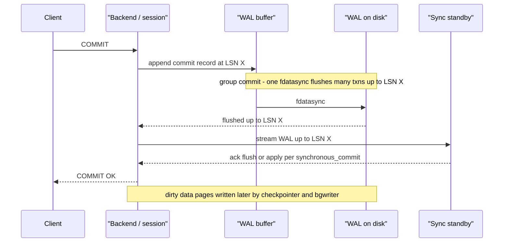
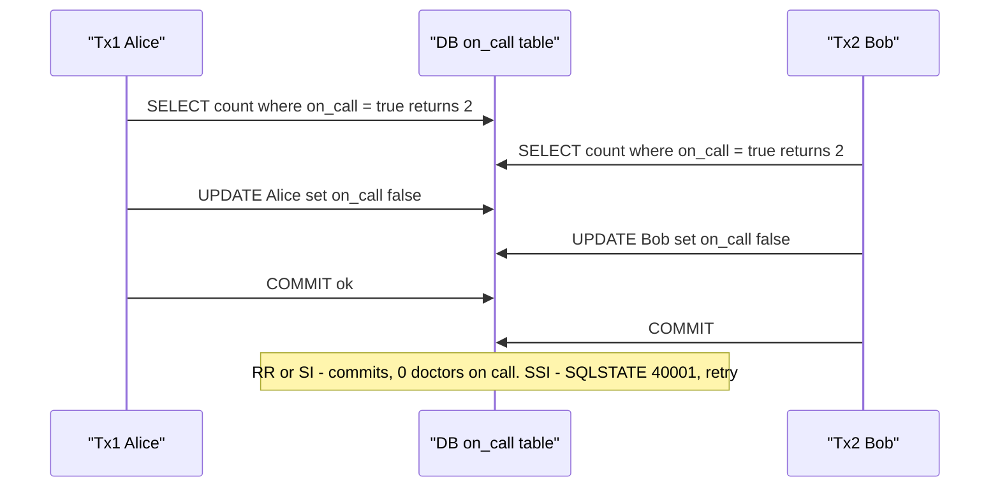
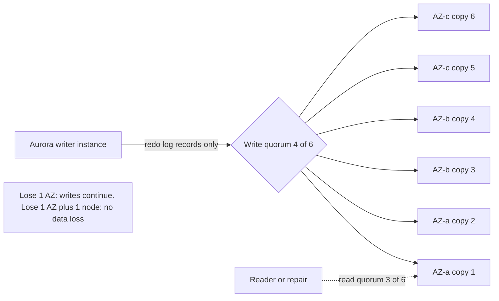
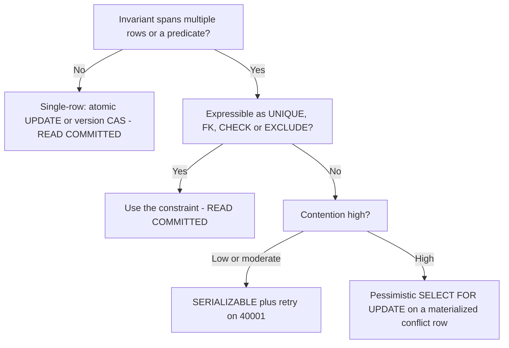

# B1 ACID
> Last verified: 2026-10 · Audience: senior/staff DevOps, SRE, AI eng, NetEng, DevSecOps, architects

## TL;DR
- A **transaction** is a unit of work with **all-or-nothing** effects. **ACID** = Atomicity (undo/abort), Consistency (invariants hold, mostly the app's job), Isolation (concurrency control), Durability (WAL + fsync, or a replicated quorum).
- **Know the defaults:** PostgreSQL = **READ COMMITTED**. MySQL/InnoDB = **REPEATABLE READ**. Azure SQL Database = **READ COMMITTED with RCSI ON** (row versioning). Spanner = **SERIALIZABLE** (external consistency). DynamoDB single-item reads = read-committed, eventual by default.
- **The same level name means different things in different engines.** PG RR is **snapshot isolation**: no phantoms, lost updates abort with `40001`, **write skew still possible**. InnoDB RR gives snapshot reads plus **next-key locks** on locking reads, and **does not detect lost updates** on read-modify-write.
- **PG SERIALIZABLE = SSI** (Serializable Snapshot Isolation, predicate "SIREAD" locks, no extra blocking, aborts on dangerous rw-dependency cycles). **InnoDB SERIALIZABLE** = RR plus implicit `FOR SHARE` on plain SELECTs (locking, so deadlocks are possible). Both require **retry loops**.
- **Durability = "commit record is on stable storage before the ACK."** The knobs: PG `synchronous_commit` (`off` can lose up to 3× `wal_writer_delay` = 600 ms of commits, but never corrupts the DB); InnoDB `innodb_flush_log_at_trx_commit` (1 = ACID default, 2 survives a mysqld crash but not an OS crash, 0 is ~1 s of loss); `sync_binlog=1`. **Group commit** spreads one fsync over many commits.
- **ACID "C" ≠ CAP "C".** ACID C means the declared invariants are preserved. CAP C means linearizability across replicas. **Eventual consistency** means replicas converge if writes stop, and nothing more. Session guarantees (read-your-writes, monotonic reads) fill the gap between the two.
- **Cloud:** Aurora counts a write durable when **4 of 6** storage copies across **3 AZs** acknowledge it (3/6 for read/repair). Azure SQL Hyperscale relies on a **log service plus page servers** over Azure Storage (LRS/ZRS/GZRS). PG Flexible Server zone-redundant HA uses **synchronous** replication (RPO 0, RTO < 120 s). DynamoDB offers eventual or strong reads (strong costs 2×) and transactions of up to 100 items. Cosmos DB has **5 levels** (Session is the common default, Strong reads cost 2× RU). Aurora DSQL (**GA 27 May 2025**) and DynamoDB MRSC (**GA 30 Jun 2025**) offer multi-Region strong consistency.

---

## B1.1 What is a Transaction?
- **How it works:**
  - `BEGIN … COMMIT | ROLLBACK`. Both PG and MySQL default to **autocommit**, so every bare statement is its own transaction.
  - **Read-only vs read-write.** Read-only transactions can skip some work: PG SSI drops predicate locks for read-only txns, and `SERIALIZABLE READ ONLY DEFERRABLE` never aborts.
  - **Savepoints** give partial rollback inside a transaction.
  - **Error semantics differ:**
    - PG: any error puts the whole transaction into the "current transaction is aborted" state. Only `ROLLBACK` or `ROLLBACK TO SAVEPOINT` gets you out.
    - InnoDB: most errors roll back only the failed **statement**. A deadlock or lock-wait timeout (when `innodb_rollback_on_timeout` is on) rolls back the whole txn.
  - **Long transactions are an ops problem:**
    - PG: they pin the **xmin horizon**, so VACUUM can't remove dead tuples. Result: bloat, and eventual **XID wraparound** risk (32-bit XIDs, about 2 billion). Use `idle_in_transaction_session_timeout` and `statement_timeout`.
    - InnoDB: the **history list length** (undo purge lag) grows and reads slow down.
- **Trade-offs / when to use:**
  - Make transactions short and do no network calls or user think-time inside them.
  - Batch large writes into chunks so you don't hold locks or bloat undo/WAL.
  - Cross-service atomicity is **not** a DB transaction. Use 2PC/XA, sagas, or the outbox pattern (see B9/D).
- **Interview angles:**
  - "Why does my PG table bloat?" → Look for a long-running or idle-in-transaction session or an abandoned replication slot holding back xmin. Check `pg_stat_activity` and `pg_replication_slots`.
  - "Why not wrap the HTTP call in the transaction?" → It holds locks and connections for network latency. A retry after a timeout then runs into an unknown commit state.
  - Pitfall: ORMs that open a transaction per request and leave it **idle in transaction**.

## B1.2 Atomicity
- **How it works:**
  - **InnoDB:** changes go to pages in place. The before-images live in **undo logs** (rollback segments). Rollback applies undo. The same undo provides MVCC old versions.
  - **PostgreSQL:** there is no undo log. Every UPDATE writes a **new tuple version**. Commit or abort status lives in `pg_xact` (CLOG). Aborted tuples are simply invisible and VACUUM reclaims them later, so rollback is O(1).
  - **Crash recovery (ARIES-style):** analysis, then **redo** of all logged changes since the last checkpoint, then **undo** of loser transactions (InnoDB). PG only needs redo, because visibility comes from the commit status.
  - **Torn-page protection:** a partial 8 KB/16 KB page write after power loss breaks atomicity at the page level.
    - PG uses `full_page_writes=on` (default): it logs a full page image on the first change after each checkpoint.
    - InnoDB uses the **doublewrite buffer** (`innodb_doublewrite=ON`). MySQL 8.4 raised `innodb_doublewrite_pages` to 128.
- **Trade-offs / when to use:**
  - Undo-based engines (InnoDB, Oracle) are cheap on update but rollback is expensive, and long-running reads grow undo.
  - Append-version engines (PG) roll back for free but pay in VACUUM and bloat.
  - Turning off torn-page protection is only safe when the storage guarantees atomic page writes (e.g., some ZFS setups or atomic-write NVMe).
- **Interview angles:**
  - "How is a multi-row UPDATE atomic if the server crashes halfway?" → Nothing is visible until the commit record is durable. Recovery replays the log and then rolls back, or ignores, uncommitted work.
  - **Distributed atomicity** has a blocking failure mode: 2PC blocks if the coordinator dies after PREPARE (in-doubt transactions; in PG, check `pg_prepared_xacts`). MySQL coordinates the binlog and InnoDB commit with an **internal XA 2PC** so both agree after a crash.
  - DynamoDB `TransactWriteItems` is atomic but `BatchWriteItem` is **not**, because partial success is possible.

## B1.3 Isolation (dirty, non-repeatable and phantom reads, lost updates, isolation levels)
### Anomalies
| Anomaly | Definition | Classic example |
|---|---|---|
| **Dirty read** | Read another txn's uncommitted write | Reporting a balance that later rolls back |
| **Dirty write** | Overwrite another txn's uncommitted write | Prevented by every real engine via write locks |
| **Non-repeatable (fuzzy) read** | The same row read twice gives different values | Price changes between two SELECTs |
| **Phantom read** | The same **predicate** query returns a different set of rows | `COUNT(*) WHERE status='open'` changes |
| **Lost update** | Two read-modify-write cycles race and one overwrite is lost | Two `balance = balance_read + 10` writes |
| **Read skew** | You see parts of the DB at different points in time | Transfer seen half-done across two accounts |
| **Write skew** | Two txns read an overlapping set, write **disjoint** rows, and together break an invariant | Two doctors both go off call |

### Levels vs anomalies: what the standard says vs what engines actually do
| Level | Dirty read | Non-repeatable | Phantom | Lost update | Write skew |
|---|---|---|---|---|---|
| SQL **READ UNCOMMITTED** | possible (**PG treats it as RC**, InnoDB really allows it) | possible | possible | possible | possible |
| **READ COMMITTED** (PG default, Azure SQL with RCSI) | no | possible (new snapshot per statement) | possible | possible | possible |
| **PG REPEATABLE READ** (= snapshot isolation) | no | no | **no** (stricter than the standard) | **no**: second updater gets `40001` | **possible** |
| **InnoDB REPEATABLE READ** (MySQL default) | no | no for consistent reads | no for snapshot reads. Locking reads use **next-key/gap locks** | **possible** (no first-updater-wins check) | possible |
| **PG SERIALIZABLE** (SSI) | no | no | no | no | **no** (abort with `40001`) |
| **InnoDB SERIALIZABLE** | no | no | no | no (S locks, so deadlocks instead) | no |

- **How it works:**
  - **MVCC:** readers see a snapshot, so readers and writers don't block each other. Writers still take row locks against other writers.
  - **PG:** RC takes a snapshot **per statement**. RR/SERIALIZABLE take one **per transaction**, at the first statement.
  - **InnoDB:** RR builds the read view at the **first consistent read**. RC builds a new read view per statement and **disables gap locking**, except for FK and duplicate-key checks.
  - **InnoDB "current read" vs "snapshot read":** `UPDATE`, `DELETE` and `SELECT … FOR UPDATE` read the **latest committed** row, not your snapshot. Mixing the two in one RR transaction gives surprising results, and the MySQL docs explicitly warn against it.
  - **Fixes for lost update:**
    - An atomic `UPDATE t SET n = n + 1`.
    - `SELECT … FOR UPDATE` (pessimistic).
    - A version column with compare-and-set (optimistic).
    - PG RR or SERIALIZABLE.
- **Trade-offs / when to use:**
  - RC gives the best concurrency and fits most OLTP when combined with atomic updates and constraints.
  - Many MySQL shops switch to **READ COMMITTED** to avoid gap-lock deadlocks on concurrent inserts. That requires `binlog_format=ROW`.
  - Use SERIALIZABLE where you have invariants spanning rows (bookings, ledgers, quotas) and can afford retries.
- **Interview angles:**
  - "Does REPEATABLE READ prevent phantoms?" → The standard says no. PG says yes (snapshot). InnoDB says yes for snapshot reads and uses next-key locks for locking reads. Then name the anomaly RR still allows: **write skew**.
  - "Default isolation in PG vs MySQL?" → RC vs RR. A trap when migrating MySQL to PG (or to Aurora PG): code may have relied on RR's snapshot stability.
  - **Isolation ≠ locking.** MVCC, OCC (DSQL, Spanner RR) and 2PL all implement isolation. See [B7 Concurrency control](../B-database-engineering/B7-concurrency-control.md).

## B1.4 Consistency
- **How it works:**
  - ACID **C** means a transaction moves the DB from one valid state to another. "Valid" is defined by **declared constraints**: PK/UNIQUE, FK, CHECK, NOT NULL, PG **EXCLUSION** constraints, triggers, and deferred constraints (`DEFERRABLE INITIALLY DEFERRED`, checked at commit).
  - The DB only guarantees C for invariants it **knows about**. Business rules expressed only in app code depend on Isolation, so weak isolation plus app-level checks lets them break (write skew).
  - **Distinct meanings of "consistency":**
    - ACID consistency: integrity invariants.
    - CAP / linearizability: every read sees the latest write.
    - Replica consistency: eventual, causal, session.
    - Read-after-write in caches.
- **Trade-offs / when to use:**
  - Push invariants into the DB wherever possible. A UNIQUE index beats "SELECT then INSERT". An exclusion constraint (`tstzrange &&`) beats app-side overlap checks for bookings.
  - FKs cost write latency and lock parent rows. Sharded or distributed DBs often drop them (DSQL limits FKs; Vitess and Citus restrict them), so the invariant moves to the app.
- **Interview angles:**
  - "ACID C vs CAP C?" → ACID C is application invariants inside one database. CAP C is single-copy recency (linearizability) across replicas. They are unrelated. Many people say A, I and D are DB properties and C is the app's property.
  - Follow-up: "How do you guarantee no double-booking?" → A unique or exclusion constraint, or SERIALIZABLE plus retry, or a materialized conflict row locked with `FOR UPDATE`.

## B1.5 Durability (WAL, fsync)
- **How it works:**
  - **Write-ahead rule:** the log record describing a change must reach stable storage **before** the dirty data page does, and the **commit record** must be flushed before the client gets its ACK. Data pages are flushed lazily by checkpoints and the background writer, which turns random I/O into sequential log appends.
  - **The log in each engine:**
    - PG: **WAL** (16 MB segments by default) in `pg_wal/`.
    - InnoDB: **redo log** (`innodb_redo_log_capacity`, 8.0.30+) plus **undo**, with the **binlog** layered above for replication and PITR.
    - SQL Server: the transaction log (LDF). In Hyperscale, the log service plays this role.
  - **fsync semantics:**
    - `write()` only reaches the OS page cache. `fsync()`/`fdatasync()` forces it to the device and **through the device write cache**, using FUA or cache flush.
    - `O_DIRECT` bypasses the page cache but is **not** durability by itself.
    - Consumer SSDs without power-loss protection can lie about flushes. Cloud block storage (EBS, Azure Managed Disks) honors flushes.
  - **PG knobs:**
    - `fsync=on` (never turn it off in production).
    - `wal_sync_method` defaults to `fdatasync` on Linux.
    - `synchronous_commit`, from most to least durable:
      - `remote_apply`: the sync standby has **applied** the change, so read-your-writes works on the standby.
      - `on` (default): flushed locally and on the sync standby.
      - `remote_write`: on the standby's OS, survives a PG crash on the standby but not an OS crash.
      - `local`: flushed locally only.
      - `off`: up to **3 × `wal_writer_delay` (200 ms) = 600 ms** of acknowledged commits can be lost after a crash, but the DB stays **consistent** (unlike `fsync=off`).
    - `synchronous_commit` can be set **per transaction**, so you can relax it for low-value writes like click logs.
    - **fsyncgate (2018):** Linux could drop dirty pages after an fsync EIO, and a retried fsync falsely "succeeded". Since PG 12 the default `data_sync_retry=off` makes PG **PANIC** and recover from WAL instead.
  - **InnoDB knobs:**
    - `innodb_flush_log_at_trx_commit`:
      - `1` (default): write and flush on every commit. This is ACID.
      - `2`: write on commit, flush about every 1 s (`innodb_flush_log_at_timeout`). Survives a mysqld crash, not an OS or power crash.
      - `0`: write and flush about every 1 s. Can lose about 1 s even on a mysqld crash.
    - `sync_binlog=1` (default since 5.7.7) is required with 1 for a crash-safe binlog and replica.
    - MySQL 8.4 changed the Linux default `innodb_flush_method` to **O_DIRECT** (if supported).
  - **Group commit:**
    - Concurrent committers queue up and **one fsync covers many commit records**. Throughput scales with concurrency, not fsync IOPS.
    - PG: implicit. `commit_delay` (µs, default 0) plus `commit_siblings` (default 5) add a deliberate wait to grow the group.
    - MySQL: **binlog group commit** has three stages (flush, sync, commit). `binlog_group_commit_sync_delay` defaults to 0.
  - **Replicated durability:** "durable" can mean an fsync on N machines or AZs. Sync standby (`synchronous_standby_names`, e.g. `ANY 1 (s1,s2)`), MySQL semi-sync, Aurora 4/6 quorum. See [B8 Replication](../B-database-engineering/B8-database-replication.md).
- **Trade-offs / when to use:**
  - Commit latency is roughly fsync latency, plus the replica RTT when synchronous. Local NVMe with PLP is about tens of µs. Network block storage is roughly sub-ms to low-ms (unverified, varies by volume type). Cross-AZ sync replication adds about 1–2 ms.
  - Relaxing durability (`synchronous_commit=off`, `flush_log_at_trx_commit=2`) buys about 2–10× more small-txn throughput (workload-dependent, unverified). Accept it only with an explicit RPO.
  - `full_page_writes` and doublewrite cost WAL volume and write amplification. Keep them on.
- **Interview angles:**
  - "What happens between COMMIT and the OK?" → WAL insert, then WAL flush (group commit), then optionally waiting for the sync standby, then the ACK. Data pages are flushed later by checkpoint.
  - "`fsync=off` vs `synchronous_commit=off`?" → The first risks **corruption**. The second risks only **losing recent commits**.
  - "Checkpoint tuning?" → Longer `checkpoint_timeout` and larger `max_wal_size` mean fewer full-page images and less I/O, but **longer crash recovery** (RTO).
  - **Durability ≠ backup.** A dropped table is durably dropped. You need PITR (base backup plus WAL archive).



## B1.6 Phantom Reads
- **How it works:**
  - A phantom is a **row that matches a predicate but did not exist** when you first ran the query (an insert, or an update that moves a row into the range).
  - Row locks can't stop phantoms because the row doesn't exist yet to be locked.
  - **Prevention mechanisms:**
    - **MVCC snapshot** (PG RR, InnoDB consistent reads): new rows are invisible to your snapshot.
    - **Next-key locks** (InnoDB RR or SERIALIZABLE locking reads): a record lock plus a lock on the **gap before it**, which blocks inserts into the scanned range.
    - **Predicate / SIREAD locks** (PG SSI): no blocking. They detect the conflict and abort.
    - **Index-range locks** (SQL Server SERIALIZABLE key-range locks).
  - InnoDB with a unique index and an equality search locks only that record, with no gap lock. Range scans or non-unique indexes lock gaps. Without a usable index, the whole scanned range is effectively locked.
- **Trade-offs / when to use:**
  - Gap locks prevent phantoms but cause **insert deadlocks** and convoy effects on hot ranges, e.g. an auto-increment tail or `INSERT … ON DUPLICATE KEY` patterns.
  - Snapshot-based prevention covers reads only. A **phantom write skew** can still happen, e.g. "no booking exists for room 5 at 10:00" checked in two txns that both insert.
- **Interview angles:**
  - "`SELECT … FOR UPDATE` on an empty result: does it protect me?" → In PG RR or RC, no: there is no row to lock. In InnoDB RR, yes, a gap lock is taken. The portable fix is a unique or exclusion constraint, SERIALIZABLE, or a pre-existing "slot" row to lock (**materializing the conflict**).
  - Diagnose InnoDB gap-lock waits with `performance_schema.data_locks` (`LOCK_MODE` like `X,GAP`).

## B1.7 Serializable vs Repeatable Read
- **How it works:**
  - **Serializable** means the outcome equals **some** serial order. **Strict serializable / external consistency** (Spanner, DSQL claims strong) adds real-time order.
  - **PG RR = Snapshot Isolation:** first-updater-wins on the **same row** (`could not serialize access due to concurrent update`, `40001`). It does **not** track reads, so write skew passes.
  - **PG SERIALIZABLE = SSI:**
    - Takes SIREAD (predicate) locks on what you read and tracks **rw-antidependencies**.
    - It aborts when it finds a **"dangerous structure"**: a pivot txn with an incoming **and** an outgoing rw-edge between concurrent txns.
    - It never blocks beyond RR but can give **false positives**. Lock granularity escalates under memory pressure (`max_pred_locks_per_transaction`, default 64).
    - Error: `could not serialize access due to read/write dependencies among transactions` (`40001`).
    - Long reports: use `SERIALIZABLE READ ONLY DEFERRABLE`, which waits for a safe snapshot and then never aborts.
  - **InnoDB SERIALIZABLE:** RR with plain SELECTs turned into `SELECT … FOR SHARE` when autocommit is off. It is pessimistic **2PL**, so you get blocking and deadlocks (error 1213) instead of SSI-style aborts. With autocommit on, each SELECT is its own read-only txn and doesn't block.
  - **Write skew example** (on-call doctors, invariant ≥ 1 on call). Under RR both txns commit. Under SSI one gets `40001`.


- **Trade-offs / when to use:**

| | PG REPEATABLE READ (SI) | PG SERIALIZABLE (SSI) | InnoDB SERIALIZABLE (2PL) |
|---|---|---|---|
| Blocking | writer vs writer only | same as RR | readers block writers |
| Failure mode | `40001` on same-row update | `40001` on dangerous rw-cycle, incl. false positives | deadlock 1213 / lock-wait timeout |
| Write skew | allowed | prevented | prevented |
| Cost | low | CPU/memory for SIREAD tracking, more retries | lock contention, lower throughput |

  - Choose SERIALIZABLE when correctness depends on multi-row predicates and you would otherwise need hand-placed `FOR UPDATE` or materialized conflicts. The txns must be **idempotent and retryable**, so wrap them in a retry loop with backoff and jitter.
  - With SSI, **every** transaction touching the data should run SERIALIZABLE. Mixing in RR txns loses the guarantee for them.
- **Interview angles:**
  - "Why is SI not serializable?" → Write skew, plus the read-only anomaly.
  - "Why does Postgres need retries at RR?" → First-updater-wins aborts.
  - "Why might Oracle SERIALIZABLE surprise you?" → It is really SI.
  - "Distributed SQL defaults?" → Spanner: serializable or external consistency by default, and now offers **repeatable read (SI)** as an option. CockroachDB: serializable by default. Aurora DSQL: **snapshot isolation** with OCC. Conflicts surface at commit as `40001` (OC000 = data conflict, OC001 = schema conflict). `SELECT … FOR UPDATE` is adjudicated optimistically, not locked.

## B1.8 Eventual Consistency
- **How it works:**
  - The guarantee: if writes stop, all replicas **converge** to the same value. There is **no bound** on when, and no ordering promise.
  - Arises from async replication (MySQL/PG async replicas, Aurora replicas, Cosmos and DynamoDB secondaries, caches, CDC pipelines, search indexes).
  - **Conflict handling for multi-writer setups:** last-writer-wins (timestamps, clock-skew risk), version vectors, CRDTs, app merges.
  - **Spectrum** (strongest to weakest): **linearizable → sequential → causal → session guarantees** (read-your-writes, monotonic reads, monotonic writes, writes-follow-reads) **→ consistent prefix → eventual**.
  - **PACELC:** if there is a Partition, choose A or C. **Else** choose Latency or Consistency. Strong cross-region consistency costs about an RTT per write. Cosmos Strong costs about **2 × RTT** between the farthest regions plus 10 ms at p99.
  - **Quorums:** with R + W > N, read and write sets overlap. Overlap alone is not linearizable without read repair or versioning.
- **Trade-offs / when to use:**
  - Eventual fits counters, likes, feeds, recommendations, search, analytics, and cache fills.
  - Strong is needed for money movement, inventory decrements, uniqueness, auth/permissions changes, and idempotency keys.
  - **Read-after-write over replicas** has several fixes:
    - Route a user's reads to the primary for N seconds after they write.
    - Pass an LSN or session token and wait until the replica has replayed it (`pg_last_wal_replay_lsn()`, Cosmos session token).
    - Use `synchronous_commit=remote_apply`.
  - Async-replica side effects also break things: idempotency checks on a lagging replica let duplicates through.
- **Interview angles:**
  - "User updates their profile, refreshes, sees the old value. Why and how do you fix it?" → Replica or cache lag. Use read-your-writes via session stickiness or token, or read from the primary.
  - "Is DynamoDB eventually consistent?" → Reads default to eventual. `ConsistentRead=true` gives strong on the table/LSI at 2× RCU. GSIs and Streams are **always eventual**. A write that returned 200 is durable.
  - Pitfall: treating CDC, outbox consumers, or GSIs as transactional. DynamoDB stream records from one transaction can appear at different times and interleave with others.
  - Data caveat: the original **Dynamo paper** (leaderless, sloppy quorum, vector clocks) ≠ managed **DynamoDB** today (leader-per-partition, Multi-Paxos replication across 3 AZs). See C6.32/C6.33 in [C6 Technology stack](../C-large-scale-architecture/C6-technology-stack.md).

---

## Diagrams
Aurora storage quorum (one 10 GB protection group / segment, replicated 6 ways):



Isolation level decision flow:



## Cloud mapping: AWS vs Azure
| Capability | AWS | Azure | Role it plays | Key differences | Alternatives |
|---|---|---|---|---|---|
| Durable shared-storage relational DB | **Aurora** (MySQL/PG): 6 copies across 3 AZs, write quorum 4/6, read 3/6, 10 GB protection groups, up to 256 TiB | **Azure SQL Database Hyperscale**: log service, page servers (each about 128 GB) with replicas, Azure Storage LRS/ZRS/RA-GZRS, up to 128 TB | Commit is durable once the log is hardened in distributed storage. Compute is stateless-ish | Aurora ships redo to storage nodes that materialize pages. Hyperscale has a separate log service feeding page servers. Hyperscale is T-SQL only, Aurora is MySQL/PG. Both give near-instant snapshot backups | Spanner, CockroachDB, AlloyDB (GCP) |
| Synchronous standby for community PG/MySQL | **RDS Multi-AZ** (instance: sync storage replication to a non-readable standby. DB cluster: 2 readable standbys, commit acknowledged by ≥ 1 standby) | **Azure Database for PostgreSQL / MySQL Flexible Server zone-redundant HA**: synchronous, RPO 0, RTO usually < 120 s, 99.99% SLA, standby not readable | Zero-RPO protection against loss of an AZ | Azure states write/commit latency rises from sync replication. Same-zone HA is an option where zones are unavailable. RDS Multi-AZ DB cluster fails over faster (about 35 s typical, unverified) | Patroni or CloudNativePG on Kubernetes with `synchronous_standby_names` |
| KV/document read consistency | **DynamoDB**: eventual (default) or strong (`ConsistentRead`, 2× RCU, table/LSI only). Transactions: ≤ 100 items, ≤ 4 MB, 2× capacity, same Region and account | **Cosmos DB**: Strong / Bounded staleness / Session / Consistent prefix / Eventual. Strong and Bounded reads use 2 replicas, so 2× RU. Transactional batch is limited to a single logical partition | Per-request consistency vs cost | DynamoDB: 2 levels per request. Cosmos: account default plus per-request **downgrade** only. Cosmos Strong is not allowed with multi-region writes | Cassandra/ScyllaDB tunable `CL` (ONE / QUORUM / LOCAL_QUORUM), Redis |
| Multi-region strong consistency | **Aurora DSQL** (GA 2025-05-27): active-active, SI + OCC, 99.999% multi-Region. Limits: 3,000 rows / 10 MiB / 5 min per txn. **DynamoDB global tables MRSC** (GA 2025-06-30): RPO 0 | **Cosmos DB Strong** with a single write region and multiple read regions: RPO 0, dynamic quorum. No PostgreSQL-compatible Azure equivalent of DSQL | Zero-RPO multi-region writes or reads | DSQL is SQL/PG-wire with OCC, so apps need retry logic for `40001`. Cosmos Strong adds about 2× inter-region RTT to writes and is blocked by default for regions > 8,000 km apart | **Google Spanner** (TrueTime, external consistency), CockroachDB, YugabyteDB |
| Async cross-region DR | Aurora Global Database (async storage replication, typically sub-second lag), DynamoDB global tables MREC (about 1 s) | SQL active geo-replication / failover groups, Hyperscale geo-replica, Cosmos multi-region (RPO < 15 min for weak levels) | Non-zero RPO, low write latency | All async, so RPO > 0 and you must design for lost writes | Kafka/Debezium CDC to another region |
| Default isolation of managed engines | RDS/Aurora PG: **RC**. RDS/Aurora MySQL: **RR** | Azure SQL DB: **RC + RCSI ON**. Flexible PG: RC. Flexible MySQL: RR | Behaviour your app inherits | RCSI = statement-level snapshot via row versions in tempdb / PVS (persistent version store) | Spanner: SERIALIZABLE by default |

- **Aurora:**
  - Only **redo log records** cross the network. Storage nodes apply them and gossip to repair gaps.
  - The 4/6 quorum means a write is in **at least 2 AZs**.
  - It tolerates losing **an entire AZ** for writes and **an AZ plus one node** without data loss.
  - Readers share the volume, so replica lag is typically **< 100 ms** (unverified figure, commonly quoted by AWS). Failover to a replica involves no data copy.
- **Azure SQL Hyperscale:**
  - Durability lives in the **log service** (landing zone plus long-term log in Azure Storage), not in the compute node.
  - HA replicas (0–4) and up to 30 named replicas read from the same storage.
  - Storage redundancy (LRS/ZRS/GRS/GZRS) is chosen at creation and fixed for life. Choose **ZRS** for zone durability.
- **Azure PG Flexible zone-redundant HA:**
  - Primary and standby sit in different AZs. WAL is synchronously replicated, giving RPO 0.
  - Expect higher commit latency. Reads are unaffected.
  - The standby is **not** a read replica; use separate (async) read replicas for that.
- **DynamoDB vs Cosmos DB:**
  - A 200 response from DynamoDB means the write is durable, and single-item ops are read-committed.
  - Transactions are **serializable vs single-item ops** but only **read-committed vs Query/Scan/BatchGet**. They are **not** atomic across Regions in global tables.
  - Use `ClientRequestToken` for idempotency (10-minute window).
  - Cosmos writes go to a local majority (3 of 4 replicas) for every level except Strong, which requires a **global majority**.
  - **Session** is the practical default: read-your-writes per session token, scoped per partition.
  - Bounded staleness minimums: K = 10 ops / T = 5 s in a single region, and **100,000 ops / 300 s** in multi-region.
  - Session tokens are **partition-bound**. A re-created client falls back to eventual reads until it writes again.
- **DSQL vs Cosmos vs Spanner:**
  - Pick **DSQL** for SQL with multi-Region active-active on AWS when you can live with SI, OCC retries and txn limits.
  - Pick **Cosmos DB** for global NoSQL with tunable consistency on Azure.
  - Pick **Spanner** as the canonical externally consistent SQL (GCP), now with optional RR.
  - Azure has no first-party DSQL or Spanner equivalent as of 2026-10. The closest options are Cosmos DB Strong (NoSQL) or Azure Cosmos DB for PostgreSQL (Citus, single-region scale-out with async geo-replicas).

## Hands-on (optional)
Inspect durability and isolation settings on throwaway PG and MySQL containers.

```yaml
# docker-compose.yml
services:
  pg:
    image: postgres:18
    environment: { POSTGRES_PASSWORD: pw }
    ports: ["5432:5432"]
  mysql:
    image: mysql:8.4
    environment: { MYSQL_ROOT_PASSWORD: pw }
    ports: ["3306:3306"]
```

```bash
docker compose up -d && sleep 15
# PostgreSQL: isolation default + durability knobs
docker compose exec -T pg psql -U postgres -c "SHOW default_transaction_isolation;"
docker compose exec -T pg psql -U postgres -c "SELECT name, setting FROM pg_settings WHERE name IN ('fsync','synchronous_commit','wal_sync_method','full_page_writes','commit_delay','commit_siblings','wal_writer_delay');"
# Relax durability for ONE transaction only (safe: no corruption, may lose this txn on crash)
docker compose exec -T pg psql -U postgres -c "BEGIN; SET LOCAL synchronous_commit = off; SELECT 1; COMMIT;"
# MySQL: isolation + flush knobs
docker compose exec -T mysql mysql -uroot -ppw -e "SELECT @@transaction_isolation, @@innodb_flush_log_at_trx_commit, @@sync_binlog, @@innodb_doublewrite, @@innodb_flush_method;"
# Benchmark the cost of durability: compare TPS with synchronous_commit on vs off
docker compose exec -T pg pgbench -U postgres -i -s 10 postgres
docker compose exec -T pg pgbench -U postgres -c 16 -T 30 postgres
docker compose exec -T pg psql -U postgres -c "ALTER SYSTEM SET synchronous_commit = off;" -c "SELECT pg_reload_conf();"
docker compose exec -T pg pgbench -U postgres -c 16 -T 30 postgres
```

- Write-skew demo: open two `psql` sessions and run `BEGIN ISOLATION LEVEL REPEATABLE READ;` in both, then follow the doctors sequence above. Both commit. Repeat with `SERIALIZABLE` and the second `COMMIT` fails with `40001`.

## Cross-links
- [B2 Database internals](../B-database-engineering/B2-database-internals.md): pages, heap/index storage, WAL internals
- [B7 Concurrency control](../B-database-engineering/B7-concurrency-control.md): locks, 2PL, OCC, deadlocks (overlap: C1.20–C1.24)
- [B8 Database replication](../B-database-engineering/B8-database-replication.md): sync/async, semi-sync, replica lag (overlap: C2.10, C2.11)
- [B6 Database sharding](../B-database-engineering/B6-database-sharding.md): cross-shard transactions
- [B9 Database system design](../B-database-engineering/B9-database-system-design.md): 2PC, sagas, outbox
- [C1 Performance](../C-large-scale-architecture/C1-performance.md): locking/concurrency C1.20–C1.24
- [C3 Reliability](../C-large-scale-architecture/C3-reliability.md): RPO/RTO, DR and standby (C3.24–C3.26)
- [C6 Technology stack](../C-large-scale-architecture/C6-technology-stack.md): Dynamo paper vs DynamoDB (C6.32, C6.33)
- [D1 System design basics](../D-system-design/D1-system-design-basics.md): CAP/PACELC, DR (D1.23, D1.24)

## Sources
- https://www.postgresql.org/docs/current/transaction-iso.html
- https://www.postgresql.org/docs/current/runtime-config-wal.html
- https://dev.mysql.com/doc/refman/8.4/en/innodb-transaction-isolation-levels.html
- https://dev.mysql.com/doc/refman/8.4/en/innodb-parameters.html
- https://lefred.be/content/mysql-8-4-lts-new-production-ready-defaults-for-innodb/
- https://docs.aws.amazon.com/AmazonRDS/latest/AuroraUserGuide/Aurora.Overview.StorageReliability.html
- https://aws.amazon.com/blogs/database/amazon-aurora-under-the-hood-quorum-and-correlated-failure/
- https://docs.aws.amazon.com/amazondynamodb/latest/developerguide/HowItWorks.ReadConsistency.html
- https://docs.aws.amazon.com/amazondynamodb/latest/developerguide/transaction-apis.html
- https://aws.amazon.com/about-aws/whats-new/2025/06/amazon-dynamo-db-global-tables-multi-region-strong-consistency-generally-available/
- https://aws.amazon.com/about-aws/whats-new/2025/05/amazon-aurora-dsql-generally-available
- https://docs.aws.amazon.com/aurora-dsql/latest/userguide/working-with-concurrency-control.html
- https://docs.aws.amazon.com/aurora-dsql/latest/userguide/CHAP_quotas.html
- https://learn.microsoft.com/en-us/azure/cosmos-db/consistency-levels
- https://learn.microsoft.com/en-us/azure/azure-sql/database/service-tier-hyperscale
- https://learn.microsoft.com/en-us/azure/azure-sql/database/hyperscale-architecture
- https://learn.microsoft.com/en-us/azure/postgresql/high-availability/concepts-high-availability
- https://learn.microsoft.com/en-us/sql/t-sql/statements/set-transaction-isolation-level-transact-sql
- https://docs.cloud.google.com/spanner/docs/isolation-levels
