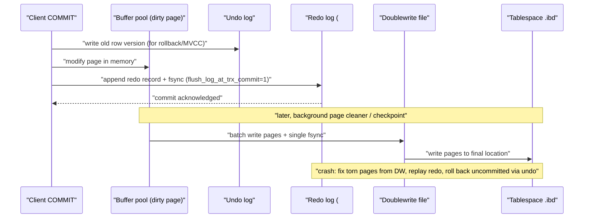
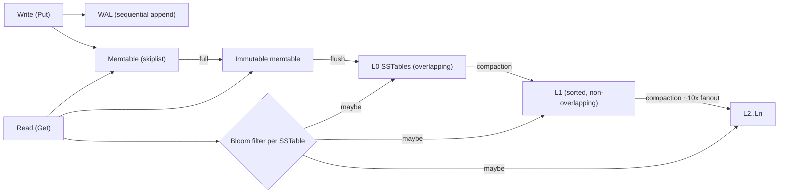
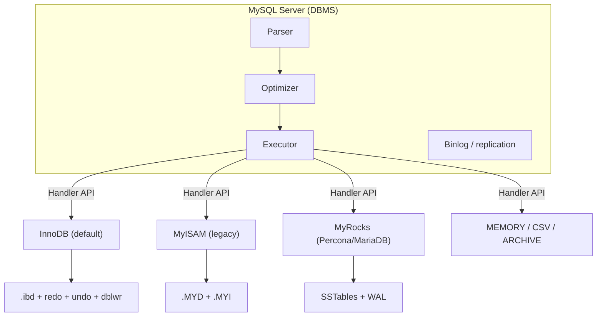

# B10 Database Engines
> Last verified: 2026-10 · Audience: senior/staff DevOps, SRE, AI eng, NetEng, DevSecOps, architects

> Data caveat: B10–B14 were reconstructed from a third-party listing (Udemy hides these sections; course updated Sept 2026), so a lecture may be missing here.

## TL;DR
- **DBMS ≠ storage engine.** The DBMS does parsing, planning, auth, replication, and connections. The **storage engine** handles how bytes reach disk: on-disk layout, indexes, locking, transactions, crash recovery. MySQL/MariaDB let you plug in an engine per table. Postgres has one built-in heap engine plus the Table Access Method API.
- **Two families:** **B-tree / update-in-place** (InnoDB, MyISAM, Aria, BerkeleyDB, SQLite) is read-optimized. **LSM-tree / append-then-compact** (LevelDB, RocksDB, Pebble) is write-optimized. Frame the choice as a trade between **read, write, and space amplification**.
- **InnoDB is the answer for MySQL.** It gives ACID, row locks, MVCC through undo logs, a clustered PK, a redo log (WAL), and a doublewrite buffer. **MyISAM** has table locks, no transactions, and no crash safety, so it is legacy only. RDS, Aurora, and Azure Flexible Server effectively require InnoDB.
- **XtraDB** was Percona's improved InnoDB fork. MariaDB dropped it in 10.2 because upstream InnoDB had caught up. It now ships only inside Percona Server, with no standalone releases.
- **SQLite** is an embedded library: one file, no server. **WAL mode** lets readers run alongside a writer, but there is still **one writer at a time**. It is now an edge and serverless database: Cloudflare D1/Durable Objects, Turso/libSQL, LiteFS, and Litestream.
- **RocksDB** is Facebook's 2012 fork of LevelDB and the default embedded KV engine for distributed systems: MyRocks, TiKV, Kafka Streams state stores, and formerly CockroachDB (now **Pebble**, written in Go). Know the compaction styles: leveled (default), universal/tiered, and FIFO.
- **Switching engines** means `ALTER TABLE … ENGINE=InnoDB`. It does a full table copy and rebuild, so use gh-ost or pt-osc in production and check FKs, FULLTEXT, and disk headroom first.

## B10.1 What is a Database Engine?
- **How it works:**
  - Layering: the client connects to the **SQL layer** (parser → optimizer → executor, plus connection handling and auth). The SQL layer calls the **storage engine API** (handler interface: `read_row`, `write_row`, `index_read`…). The engine then works with the **OS and filesystem**.
  - What the engine decides: **on-disk structure** (B+tree pages, heap, or LSM SSTables), **index types**, **lock granularity** (table, page, or row), **transactions/MVCC**, **crash recovery** (WAL/redo, undo), **compression**, and **caching** (buffer pool, key cache, block cache).
  - MySQL: the engine is chosen **per table** (`ENGINE=`). `SHOW ENGINES` lists support (`YES/NO/DEFAULT`). The default has been InnoDB since **5.5**. Since **8.0**, the data dictionary lives in InnoDB. Before that, `mysql.*` system tables were MyISAM.
  - Embedded engines (SQLite, BerkeleyDB, LevelDB, RocksDB) are **libraries linked into the process**. There is no network or server, so the application is the DBMS.
  - Postgres has a single heap engine. The **Table Access Method** API (PG12+) allows alternatives such as columnar AMs (citus columnar, orioledb (unverified status)).
- **Trade-offs / when to use:**
  - B-tree engines: predictable point and range reads, with writes amplified by random page I/O.
  - LSM engines: sequential writes and good compression, but reads may touch several levels (Bloom filters soften this) and compaction adds background I/O.
  - **RUM conjecture:** you can minimize at most two of Read, Update (write), and Memory/space overhead.
- **Interview angles:**
  - "Storage engine vs database?" → The engine is the persistence and concurrency layer. The DBMS adds SQL, optimizer, replication, security, and the protocol. Example: MySQL server + InnoDB, or CockroachDB SQL + Pebble.
  - "Why would a distributed DB embed RocksDB?" → It reuses a battle-tested local KV store (WAL, compaction, snapshots), so the team only builds Raft and SQL on top. TiKV and Kafka Streams are examples.
  - Pitfall: mixing transactional and non-transactional engines in one transaction. A rollback can't undo the MyISAM changes (warning 1196).

## B10.2 MyISAM
- **How it works:**
  - Files: `.MYD` (data) and `.MYI` (indexes). In 8.0, metadata moved to `.sdi` (no `.frm`).
  - The **heap file is separate from the indexes**. Indexes point to row offsets, so the table is not clustered.
  - **Table-level locking.** Readers take shared locks and writers take exclusive locks. **`concurrent_insert`** allows appends at the end of the file while reads run, as long as there are no holes.
  - **No transactions, no FKs, no crash recovery.** A crash can leave tables "marked as crashed", which you fix with `REPAIR TABLE` or `myisamchk`.
  - Only **index blocks** are cached (`key_buffer_size`). Data relies on the OS page cache.
  - It stores an exact row count, so `SELECT COUNT(*) FROM t` with no WHERE is O(1). InnoDB must scan an index for this.
  - Compressed read-only tables via `myisampack`. FULLTEXT and spatial indexes historically (InnoDB has both since 5.6/5.7).
- **Trade-offs / when to use:**
  - Small footprint, simple, and fast for read-only or read-mostly tables or bulk loads. It is terrible under mixed read/write concurrency because of lock convoys.
  - In 2026 there is essentially no new use case. **RDS:** MyISAM breaks PITR and snapshot reliability. **Aurora and Azure Flexible:** not supported at all.
- **Interview angles:**
  - "Why did MySQL move off MyISAM?" → Table locks, no ACID, and corruption on crash. InnoDB caught up on read speed and added FULLTEXT.
  - "Fast COUNT(*) on MyISAM but slow on InnoDB — why?" → MVCC means each transaction may see a different count, so InnoDB has to count visible rows.

## B10.3 InnoDB
- **How it works:**
  - **Clustered index:** the table *is* a B+tree ordered by the **primary key**. Leaf pages hold the full rows. The default page size is **16 KB**. With no PK, InnoDB uses the first `UNIQUE NOT NULL` column, otherwise a hidden 6-byte `DB_ROW_ID`. MySQL **8.0.30+** can add a **GIPK** (`my_row_id`), which Azure Flexible enables by default.
  - **Secondary indexes store the PK value**, not a row pointer. A secondary lookup is therefore index → PK → clustered B+tree (a "double lookup"), unless the index is covering. A wide PK makes every secondary index bigger. Random UUID PKs cause page splits, so prefer monotonic keys or UUIDv7.
  - **MVCC:** each row has hidden `DB_TRX_ID` (6 B) and `DB_ROLL_PTR` (7 B) fields that point into **undo logs**. Consistent reads rebuild old versions from the undo chain. **Purge** threads delete old versions. Long transactions → growing **history list length** → slow reads and undo bloat (a classic SRE alert).
  - **Locking:** row locks plus **gap and next-key locks**. The default isolation is **REPEATABLE READ**, which uses next-key locks to prevent phantoms for locking reads. Deadlocks are detected automatically, and InnoDB rolls back the smaller transaction.
  - **Redo log (WAL):** changes are logged before dirty pages are flushed. `innodb_flush_log_at_trx_commit=1` (default) fsyncs on every commit for full durability. `2` or `0` trade up to about 1 s of commits for throughput. Since **8.0.30**, size is set by **`innodb_redo_log_capacity`**, held in `#innodb_redo` as **32 files** and resizable at runtime. It replaces `innodb_log_file_size`/`innodb_log_files_in_group`, which are removed in RDS 8.4 parameter groups.
  - **Doublewrite buffer:** pages are written first to `#ib_<pagesize>_N.dblwr` (separate files since **8.0.20**) in one sequential chunk with one fsync, then to their real location. This protects against **torn/partial page writes**, which redo alone can't fix because redo needs an intact page. Modes: `ON` (default), `OFF`, `DETECT_ONLY`, `DETECT_AND_RECOVER`. Only disable it on storage with atomic 16 KB writes. Aurora has no doublewrite because its storage layer applies redo itself.
  - **Buffer pool:** LRU with a midpoint insertion (old/new sublists), so one large scan doesn't evict the hot set. The default is 128 MB. Production rule of thumb is about 50–75% of RAM. `innodb_dedicated_server` sizes it automatically (default ON in RDS 8.4). Buffer pool dump/load warms the cache after a restart.
  - **8.4 default changes:** `innodb_change_buffering=none` and `innodb_adaptive_hash_index=OFF` (unverified exact list; check the "What's new in 8.4" page).
- **Trade-offs / when to use:**
  - The default for any OLTP on MySQL or MariaDB.
  - Costs: write amplification (redo + doublewrite + page), secondary index bloat with a wide PK, and undo growth under long transactions.
  - For write-heavy, space-sensitive workloads, consider MyRocks.
- **Interview angles:**
  - "Redo vs undo?" → **Redo** = roll *forward* after a crash (durability). **Undo** = roll *back* aborted transactions and serve old MVCC versions (atomicity/isolation).
  - "Why doublewrite if you have redo?" → Redo records are physiological deltas that assume a consistent base page. A torn 16 KB write on a 4 KB-sector disk corrupts that base page.
  - "Why are UUIDv4 PKs slow?" → Random inserts into the clustered B+tree cause page splits, low fill factor, and buffer pool misses.
  - Cross-link: B+tree mechanics are in B4, and isolation and locking are in B7.



## B10.4 XtraDB
- **How it works:**
  - Percona's fork of InnoDB, created around 2008. It is a **drop-in replacement** that keeps the InnoDB file format.
  - It added better instrumentation, tunable flushing, scalability patches for multi-core systems, faster crash recovery, and buffer pool dump/restore. Most of these features were later upstreamed into MySQL InnoDB.
  - **Status (verified 2026):** Percona says XtraDB "will not have further binary releases" and is distributed as part of **Percona Server for MySQL**, which still carries Percona's InnoDB enhancements.
  - **MariaDB used XtraDB as its "InnoDB" through 10.1.** From **10.2**, upstream InnoDB is the default because "InnoDB has caught up" and porting XtraDB was too costly. XtraDB was then removed entirely (10.3, unverified exact version).
- **Trade-offs / when to use:**
  - Don't choose "XtraDB" as an engine today. Choose **Percona Server** (InnoDB + Percona patches + MyRocks + audit/thread pool) when you want an open-source MySQL with enterprise-like features.
  - Don't confuse it with **Percona XtraDB Cluster** (Galera-based synchronous multi-primary clustering) or **XtraBackup** (hot physical backup for InnoDB). Both are still active products.
- **Interview angles:**
  - "Is XtraDB still a thing?" → Effectively merged and obsolete: its features are upstream, MariaDB uses InnoDB, and it lives on only inside Percona Server.

## B10.5 SQLite
- **How it works:**
  - An **embedded, serverless, single-file** ACID SQL database linked as a C library.
  - It uses a B-tree per table/index (tables are clustered on `rowid` or are `WITHOUT ROWID`) and **dynamic typing** (use `STRICT` tables to enforce types).
  - Journal modes:
    - **Rollback journal** (default `DELETE`): writers block readers.
    - **WAL mode** (`PRAGMA journal_mode=WAL`): writers append to `db-wal`, and readers keep a snapshot "end mark". **Readers don't block writers and writers don't block readers**, but there is **only one writer at a time**. A second writer gets `SQLITE_BUSY`, so set `busy_timeout`.
  - Auto-**checkpoint** runs at about **1000 pages** (~4 MB WAL) via `wal_autocheckpoint`. Uses `-wal` and `-shm` files (wal-index in shared memory). Common pragma pairing: `synchronous=NORMAL` in WAL mode, which is durable against app crashes but may lose the last commits on power loss.
  - Limits: **WAL doesn't work on network filesystems** (needs shared memory). Reads are about 1–2% slower. Very large transactions perform poorly. You can't change `page_size` in WAL mode.
  - `BEGIN CONCURRENT` and `wal2` exist only on SQLite **branches**, not mainline (unverified as of 2026).
- **Edge / serverless ecosystem (2026):**
  - **Cloudflare D1:** managed SQLite on Durable Objects. Each DB is **single-threaded** and processes one query at a time, so throughput ≈ 1/query latency. Paid plan: up to **10 GB per DB**, **50,000 DBs/account**, 1,000 queries per Worker invocation, 30 s query limit, 2 MB row limit. Global **read replication** (Sessions API for sequential consistency). Time Travel PITR. **Durable Objects with SQLite storage** is the per-entity variant.
  - **Turso / libSQL:** libSQL is an open-contribution **fork** of SQLite with server mode (`sqld`), replication, and embedded replicas. Turso is now prioritizing a **Rust rewrite** ("Limbo" → "Turso Database", beta) with async I/O (io_uring), vector search, and **MVCC `BEGIN CONCURRENT`** to remove the single-writer limit.
  - **LiteFS (Fly.io):** a FUSE filesystem that intercepts SQLite transactions and replicates them from one primary (lease via Consul or static) to replicas. Writes must be forwarded to the primary. **LiteFS Cloud was sunset on 15 Oct 2024**, while LiteFS itself remains open source.
  - **Litestream:** streams the WAL to S3/Azure Blob/GCS for continuous backup and restore. It is DR, not replication.
- **Trade-offs / when to use:**
  - Good fits: mobile and desktop apps, embedded and IoT, test fixtures, read-heavy sites with modest writes, per-tenant DBs (a DB per user or tenant), and edge read replicas.
  - Bad fits: high-concurrency writes, multi-host shared access over NFS/SMB, or anything that needs fine-grained users and roles.
- **Interview angles:**
  - "Can SQLite be your production DB?" → Yes for read-heavy, single-node, or per-tenant workloads in WAL mode with `busy_timeout`. Writes serialize, so batch them in transactions.
  - "Why is D1 throughput capped per DB?" → It is single-threaded per DB, so scale by **sharding into many DBs** (per tenant) rather than one big DB.
  - Pitfall: SQLite files on EFS or Azure Files corrupt or lock badly. WAL requires local disk.

## B10.6 Aria
- **How it works:**
  - The **MariaDB** engine designed as a **crash-safe MyISAM replacement**.
  - With `TRANSACTIONAL=1` and `ROW_FORMAT=PAGE` (the default format), changes are logged and synced at statement end, so tables recover after a crash. **Despite the option name, there is no real multi-statement transaction support.**
  - Table-level locking (MyISAM heritage). Caches both data and index pages (`aria_pagecache_buffer_size`). Adds up to 6 bytes of overhead per row/key for transaction IDs. `TRANSACTIONAL=1` doesn't work with partitioned tables.
  - MariaDB uses Aria for **system tables** and **internal on-disk temporary tables** (faster `GROUP BY`/`DISTINCT` than MyISAM).
- **Trade-offs / when to use:**
  - Choose it over MyISAM for read-mostly, non-transactional MariaDB tables that must survive crashes. Use InnoDB for OLTP.
- **Interview angles:**
  - "Aria vs MyISAM?" → Aria is crash-safe and caches data pages. Neither has ACID transactions or row locks.

## B10.7 BerkeleyDB
- **How it works:**
  - An embedded KV library from Sleepycat (1990s, from UC Berkeley's BSD 4.4 dbm work). It offers B-tree, hash, queue, and recno access methods, and supports ACID transactions with WAL, page-level locking, and replication (HA).
  - Oracle acquired Sleepycat in 2006. In 2013 (BDB 6.0) the license moved to **AGPLv3**, which caused distros and projects to migrate away (e.g. to LMDB).
  - MySQL once had a **BDB storage engine** (the first transactional MySQL engine), removed in **5.1**.
  - Historically used by OpenLDAP (replaced by **LMDB**), Subversion, Postfix maps, RPM db (moved to SQLite in RPM 4.16), and Bitcoin wallet.dat (Bitcoin Core moved wallets to SQLite descriptor wallets).
- **Trade-offs / when to use:**
  - Legacy. For new embedded KV, choose **LMDB** (mmap B+tree, read-optimized, single writer), **RocksDB** (write-heavy), or SQLite (when you want SQL).
- **Interview angles:**
  - Good history answer for "the original embedded transactional KV store". The license change is a supply-chain and licensing governance example.

## B10.8 LevelDB
- **How it works:**
  - Google, 2011 (Jeff Dean and Sanjay Ghemawat). An embedded **LSM-tree** KV store with ordered byte keys.
  - Write path: write to the **WAL**, insert into the **memtable** (skiplist), flush to immutable **SSTables** in **L0**, then run **leveled compaction** into L1…Ln, where each level is about 10× the previous. Snappy compression and per-SSTable **Bloom filters**.
  - **Single process** (file lock). Only one compaction thread, no column families, and no built-in transactions beyond atomic `WriteBatch`.
  - Used by Chrome IndexedDB, Bitcoin Core chainstate, and early Ethereum clients (later moved to Pebble).
- **Trade-offs / when to use:**
  - Simple and small. The single-threaded compaction becomes a write stall bottleneck at server scale, which is the reason RocksDB exists.
- **Interview angles:**
  - "Walk me through an LSM write and read" → Write: WAL → memtable → flush → SSTables → compaction. Read: memtable → immutable memtable → L0 (all files) → L1+ (one file per level, Bloom filter first).

## B10.9 RocksDB
- **How it works:**
  - Facebook's **2012 fork of LevelDB**, optimized for flash and many cores.
  - Features: multi-threaded compaction, **column families**, transactions (pessimistic and optimistic), snapshots, merge operators, prefix Bloom filters, block cache, rate limiter, **BlobDB** (key-value separation for large values), checkpoints, and TTL.
  - **Compaction styles:**
    - **Leveled (default):** lowest **space** amplification, higher write amplification (about fanout × levels). Good default for read and space efficiency.
    - **Universal (tiered):** lowest **write** amplification, with higher space amplification (transient up to ~2× during major compactions) and higher read amplification. Good for write-heavy ingest.
    - **FIFO:** drops the oldest files and is near-zero write amplification. Fits cache or TTL data such as metrics and logs.
  - Classic incident: **write stalls** when L0 file count or pending compaction bytes cross thresholds. Tune `max_background_jobs`, `level0_slowdown_writes_trigger`, and `level0_stop_writes_trigger`.
- **Who uses it:**
  - **MyRocks:** the RocksDB engine for MySQL, shipped in Percona Server and MariaDB. Facebook migrated its UDB (user DB) from InnoDB and saw roughly **50% storage savings** vs compressed InnoDB plus lower write amplification (unverified exact figure).
  - **TiKV** (TiDB storage): RocksDB, with Raft log + KV CFs and the Titan blob plugin.
  - **Kafka Streams:** the default persistent **state store** (one RocksDB per task partition, backed by changelog topics).
  - **CockroachDB:** used RocksDB until **Pebble**, its Go RocksDB-compatible rewrite, became the **default in v20.2** (Nov 2020). The motivation was avoiding cgo cost and owning the roadmap.
  - Also Flink (RocksDB state backend), YugabyteDB DocDB (a RocksDB fork), Ceph BlueStore metadata, and Apache Kvrocks.
- **Trade-offs / when to use:**
  - Write-heavy, large datasets on SSD, compression-sensitive, or embedded state for stream processors and distributed DBs.
  - Costs: tuning complexity (hundreds of options), unpredictable compaction I/O spikes, and slower range scans than a B+tree under some workloads.
- **Interview angles:**
  - "When MyRocks over InnoDB?" → Write-heavy, storage-cost-bound, flash-endurance-sensitive workloads. The trade-off is fewer features (e.g. gap-lock-based isolation limits; RR semantics differ) and a smaller operator talent pool.
  - "Why does Kafka Streams restore take forever?" → A RocksDB state store rebuilds from the changelog topic. Use standby replicas and keep the state dir on a persistent volume.



## B10.10 Popular Database Engines

| Engine | Structure | Txn / ACID | Concurrency | Crash safety | Typical home | 2026 status |
|---|---|---|---|---|---|---|
| **InnoDB** | Clustered B+tree, 16 KB pages | Full ACID | Row locks + MVCC (undo) | Redo + doublewrite | MySQL, MariaDB, Percona | Default everywhere |
| **MyISAM** | Heap + separate B-tree indexes | None | Table locks | None (repair) | Legacy MySQL | Legacy; unsupported in Aurora/Azure Flexible |
| **XtraDB** | InnoDB fork | Full ACID | Row + MVCC | As InnoDB | Percona Server | No standalone releases; dropped by MariaDB 10.2 |
| **Aria** | B-tree, PAGE rows | Crash-safe, no real txn | Table locks | Log-based recovery | MariaDB system/temp tables | Active (MariaDB) |
| **SQLite** | B-tree, single file | Full ACID | Many readers, **one writer** (WAL) | Rollback journal or WAL | Embedded, mobile, edge (D1, Turso) | Very active |
| **BerkeleyDB** | B-tree/hash/queue | ACID | Page locks | WAL | Legacy embedded | AGPL; mostly replaced by LMDB/SQLite |
| **LMDB** | mmap copy-on-write B+tree | ACID | Many readers, one writer | No WAL needed (COW) | OpenLDAP, embedded | Active |
| **LevelDB** | LSM | Atomic batches only | Single process | WAL | Chrome IndexedDB, Bitcoin chainstate | Maintenance |
| **RocksDB** | LSM, column families | Txns available | Multi-threaded | WAL | MyRocks, TiKV, Kafka Streams, Flink | Very active |
| **Pebble** | LSM (Go, RocksDB-compatible) | Batches | Multi-threaded | WAL | CockroachDB | Active |
| **WiredTiger** | B-tree + optional LSM, doc-level | ACID (snapshot) | Document-level, MVCC | Journal + checkpoints | MongoDB (default since 3.2) | Active |
| **Postgres heap** | Heap + B-tree indexes, MVCC in-tuple | ACID | Row-level, MVCC (VACUUM) | WAL + full-page writes | PostgreSQL | Default |

- **Interview angles:**
  - Postgres solves InnoDB's torn-page problem with **full_page_writes** (FPI in WAL after a checkpoint) instead of a doublewrite buffer.
  - Postgres keeps old row versions in the heap and needs VACUUM. InnoDB keeps them in undo and purges them.
  - When asked "B-tree or LSM?": choose by read/write ratio, space cost, and tail latency tolerance (compaction spikes vs page-split / random-I/O cost).

## B10.11 Switching Database Engines with MySQL
- **How it works:**
  - Check the engine with `SHOW TABLE STATUS` or `information_schema.TABLES.ENGINE`. Change it with `ALTER TABLE t ENGINE=InnoDB;`.
  - This is a **full table rebuild** (ALGORITHM=COPY across engines). It needs about 2× disk space, and writes are blocked for the duration on large tables.
  - Set the default with `default_storage_engine` (and `default_tmp_storage_engine`). Prevent new legacy tables with `disabled_storage_engines="MyISAM,MEMORY,ARCHIVE,BLACKHOLE,FEDERATED"`.
  - Pre-flight checklist:
    - FULLTEXT and spatial indexes (supported by InnoDB 5.6/5.7+, but the parser and stopword behavior differ).
    - Row size limits: InnoDB's ~8 KB in-page limit with 16 KB pages, so use the `DYNAMIC` row format.
    - Composite `AUTO_INCREMENT` on a secondary column (MyISAM-only feature).
    - `COUNT(*)` performance.
    - FKs and lock behavior changes.
    - InnoDB tables are typically 1.5–3× larger on disk.
- **Production approach:**
  - Use **gh-ost** (binlog-based, triggerless) or **pt-online-schema-change** (trigger-based) to copy online with throttling.
  - Alternatively, convert on a **replica** and then fail over.
  - On RDS, use a **Blue/Green deployment** or a read replica.
- **Cloud constraints:**
  - **Aurora MySQL accepts only InnoDB.** MyISAM tables are converted during migration (needs extra space) or should be converted beforehand.
  - **RDS for MySQL** supports PITR and snapshot restore only for InnoDB.
  - **Azure Database for MySQL Flexible Server** supports only **InnoDB and MEMORY**. MyISAM, BLACKHOLE, ARCHIVE, and FEDERATED are unsupported.
- **Interview angles:**
  - "Migrate a 2 TB MyISAM table to InnoDB with no downtime" → gh-ost with throttling on replica lag, verify checksums (pt-table-checksum), cut over in a low-traffic window, and keep a rollback path.
  - Pitfall: running a blocking `ALTER` on the primary, which hits a metadata lock pileup and stalls all queries.

```bash
# Find non-InnoDB tables, then convert one online with gh-ost
mysql -e "SELECT table_schema, table_name, engine FROM information_schema.tables WHERE engine <> 'InnoDB' AND table_schema NOT IN ('mysql','sys','performance_schema','information_schema');"
gh-ost --host=replica1 --database=app --table=events --alter="ENGINE=InnoDB" \
  --max-lag-millis=1500 --chunk-size=1000 --allow-on-master=false --execute
```

## Diagrams


## Cloud mapping: AWS vs Azure

| Capability | AWS | Azure | Role it plays | Key differences | Alternatives |
|---|---|---|---|---|---|
| Managed MySQL engine | RDS for MySQL | Azure Database for MySQL – Flexible Server | Managed MySQL server | RDS: InnoDB full support, MyISAM tolerated without PITR guarantees. Azure: only InnoDB and MEMORY | Self-managed Percona Server on EKS/AKS (Percona Operator) |
| Cloud-native MySQL | Aurora MySQL | (no direct equivalent; nearest: Flexible Server Business Critical) | Log-structured shared storage under the InnoDB SQL layer | Aurora: InnoDB-only, redo shipped to 6-way/3-AZ storage, no doublewrite | TiDB Cloud (TiKV/RocksDB), PlanetScale (Vitess + InnoDB) |
| Embedded/edge SQLite | (none first-party; Lambda + EFS is an anti-pattern for SQLite WAL) | (none first-party) | SQLite at the edge | — | **Cloudflare D1 / Durable Objects SQLite**, Turso, LiteFS, Litestream to S3/Blob |
| Proprietary NoSQL engines | DynamoDB | Cosmos DB | Managed KV/document, engine not exposed | DynamoDB: partitioned B-tree storage nodes + Multi-Paxos replication (engine internals undisclosed). Cosmos: Bw-tree-based, latch-free index (per Microsoft research) | Cassandra/ScyllaDB, MongoDB Atlas (WiredTiger) |
| LSM-backed distributed SQL | Aurora DSQL (engine internals not public) | Cosmos DB for PostgreSQL (Citus; Postgres heap) | Scale-out SQL | Different engines; DSQL is PG-compatible serverless | CockroachDB (Pebble), YugabyteDB (DocDB/RocksDB), TiDB (TiKV) |

- **RDS for MySQL:** PITR and snapshot restore need a recoverable engine, so they are supported only for InnoDB. MyISAM in user schemas "can result in lost or corrupt data". The `mysql` system schema may still contain MyISAM. On 8.4, `innodb_redo_log_capacity` and `innodb_dedicated_server` are managed defaults.
- **Aurora MySQL:** InnoDB only. Storage ships redo to a distributed volume (6 copies across 3 AZs), so there are no checkpoint or doublewrite flushes from the writer. Convert MyISAM before physical migration to avoid extra space and time.
- **Azure Flexible Server:** InnoDB and MEMORY only. Max single file is 8 TB. GIPK is on by default, so tables without a PK get a hidden `my_row_id`, which matters for data-in replication.
- **Cloudflare D1:** SQLite per DB, single-threaded per DB. Scale out by having many DBs (up to 50k per account) rather than one large one.
- **DynamoDB / Cosmos DB:** you never choose an engine. Interview framing: "the engine is abstracted, and you tune partition keys and capacity instead."
- **Alternatives:** Kafka Streams and Flink state uses RocksDB. Databricks and Spark use file formats rather than engines (see M1).

## Cross-links
- [B2 Database Internals](./B2-database-internals.md) for pages, heap vs index-organized tables, and row vs column stores
- [B3 Database Indexing](./B3-database-indexing.md) and [B4 B-tree vs B+tree](./B4-btree-vs-bplustree.md) for clustered vs secondary indexes
- [B1 ACID](./B1-acid.md) for atomicity, durability, WAL, and redo/undo
- [B7 Concurrency Control](./B7-concurrency-control.md) for row vs table locks, MVCC, and isolation
- [B8 Database Replication](./B8-database-replication.md) for binlog, LiteFS, and D1 read replicas
- [C6 Technology Stack](../C-large-scale-architecture/C6-technology-stack.md) for picking a database
- [M4 Kafka at Scale](../M-data-platforms/M4-kafka-at-scale.md) and [M5 Stream Processing](../M-data-platforms/M5-stream-processing.md) for RocksDB state stores
- [M1 Lakehouse Table Formats](../M-data-platforms/M1-lakehouse-table-formats.md) for file formats vs engines

## Sources
- https://dev.mysql.com/doc/refman/8.4/en/storage-engines.html
- https://dev.mysql.com/doc/refman/8.4/en/innodb-doublewrite-buffer.html
- https://dev.mysql.com/doc/refman/8.4/en/innodb-redo-log.html
- https://docs.percona.com/percona-server/8.0/percona-xtradb.html
- https://mariadb.com/kb/en/why-does-mariadb-102-use-innodb-instead-of-xtradb/
- https://mariadb.com/docs/server/server-usage/storage-engines/aria/aria-storage-engine
- https://www.sqlite.org/wal.html
- https://developers.cloudflare.com/d1/platform/limits/
- https://github.com/facebook/rocksdb/wiki/Compaction
- https://www.cockroachlabs.com/blog/pebble-rocksdb-kv-store
- https://community.fly.io/t/sunsetting-litefs-cloud/20829
- https://docs.aws.amazon.com/AmazonRDS/latest/UserGuide/MySQL.Concepts.FeatureSupport.html
- https://docs.aws.amazon.com/AmazonRDS/latest/AuroraUserGuide/AuroraMySQL.Migrating.ExtMySQL.Prechecks.html
- https://learn.microsoft.com/en-us/azure/mysql/flexible-server/concepts-limitations
