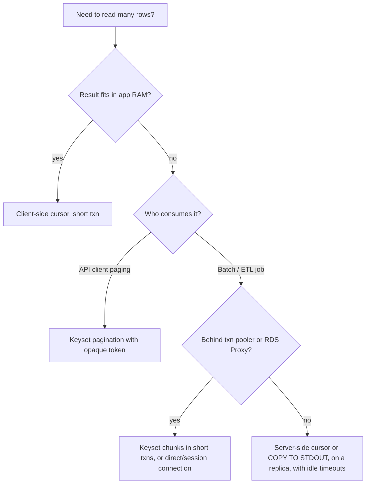

# B11 Database Cursors
> Last verified: 2026-10 · Audience: senior/staff DevOps, SRE, AI eng, NetEng, DevSecOps, architects

> Data caveat: B10–B14 came from a third-party listing of the course (Udemy hides the last sections, and the course was updated in Sep 2026), so lecture titles may not match exactly.

## TL;DR
- A **cursor** is a handle to a result set that lets you fetch rows **incrementally** instead of all at once. "Client-side" and "server-side" refer to **where the result set is buffered**: in the driver's memory or in the DB backend.
- **Client-side (the default)** in most drivers (psycopg2/3 `Cursor`, pgJDBC with fetchSize=0, MySQL Connector/J, `mysql_store_result`): one round trip, the server is **stateless after sending**, but the whole result has to fit in app RAM. A 10 M-row `SELECT *` means an OOM-killed pod.
- **Server-side**: Postgres `DECLARE … CURSOR` + `FETCH n`, psycopg named cursors (`itersize` default **2000**), pgJDBC `setFetchSize(n)` with **autocommit off**, MySQL `useCursorFetch=true`. App memory stays bounded, but you pay **one round trip per batch** and hold **server state** (portal, snapshot, possibly a temp file).
- An open cursor lives inside an **open transaction**, so it **holds a snapshot / xmin horizon**. That blocks **VACUUM** from removing dead tuples (bloat) and keeps the connection checked out. `WITH HOLD` outlives the transaction by **materializing the entire result at COMMIT**, which costs temp space and session state.
- **Poolers:** PgBouncer **transaction mode never supports `WITH HOLD` cursors**. Plain cursors work only inside one transaction. **RDS Proxy pins** a session on `DECLARE` cursor (PG), on SQL Server cursors, and on MySQL prepared statements. Azure Flexible Server's built-in PgBouncer defaults to `pool_mode=transaction`.
- **Streaming ≠ server cursor:** MySQL `mysql_use_result` / Connector/J `setFetchSize(Integer.MIN_VALUE)` and libpq single-row/chunked mode stream one query's result over the socket. Memory stays low, but the connection is busy until the result is drained, and with MySQL `use_result` the tables being read stay blocked for updates.
- **API pagination should use keyset ("cursor-based") pagination**, i.e. an opaque token that encodes the last sort key. It is stateless and pooler-friendly. **Never** hold a DB cursor open across HTTP requests. DynamoDB `LastEvaluatedKey` and Cosmos DB continuation tokens are the NoSQL versions of the same idea.

## B11.1 What are Database Cursors?
- **How it works:**
  - SQL is set-oriented. A cursor adds **row-at-a-time / batch-at-a-time** access with a current position: `DECLARE` → `OPEN` (implicit in PG) → `FETCH` (`NEXT`, `FORWARD n`, `PRIOR`, `ABSOLUTE n` if scrollable) → `CLOSE`.
  - **Postgres:** `DECLARE name [BINARY] [ASENSITIVE|INSENSITIVE] [[NO] SCROLL] CURSOR [{WITH|WITHOUT} HOLD] FOR query`.
    - Without `WITH HOLD`, a cursor must be declared **inside a transaction block**. Outside one you get an error, and it is destroyed at COMMIT/ROLLBACK.
    - **All PG cursors are insensitive**: they see the snapshot taken at DECLARE, never later changes.
    - PG allows backward fetch in "simple enough" plans even without `SCROLL`. Use `NO SCROLL` to be explicit. `SCROLL` may cost performance, and a backward re-fetch can **re-execute volatile functions**.
    - `FOR UPDATE/SHARE` cursors can't be `WITH HOLD` or scroll backward. `UPDATE … WHERE CURRENT OF cur` gives positioned updates.
  - **Protocol-level portals:** the PG extended query protocol (Bind/Execute with a max-rows limit) is a cursor without SQL text. pgJDBC `setFetchSize` uses it. All of these show up in **`pg_cursors`** (`name, statement, is_holdable, is_binary, is_scrollable, creation_time`).
  - **MySQL** server-side cursors exist only in **stored programs** (and the C API prepared-statement cursor). They are **asensitive, read-only, non-scrollable**.
  - **SQL Server** has 3 implementations (T-SQL, API server cursors, client cursors) and 4 types: **forward-only ("firehose")**, **STATIC** (snapshot in tempdb, read-only), **KEYSET** (membership fixed, keyset in tempdb), and **DYNAMIC** (sees all committed changes). With no cursor requested you get a **default result set** that is streamed.
- **Trade-offs / when to use:**
  - Use a cursor for ETL/export/backfill over large tables, batch jobs with bounded memory, and procedural row logic in stored procs (usually a smell: prefer set-based SQL).
  - Avoid cursors in OLTP request paths and in anything that holds the cursor across user think time.
- **Interview angles:**
  - "What *is* a cursor?" → A named, positioned iterator over a query result. The key design axis is **where the rows are buffered** (client vs server) and **how long the server must keep state**.
  - A common pitfall is answering "cursors are slow, use set operations". That is true for row-by-row *processing* in T-SQL/PLpgSQL. It doesn't apply to *fetching* a large result in batches, where a cursor is the right tool.

## B11.2 Server Side vs Client Side Database Cursors

| Aspect | Client-side cursor | Server-side cursor |
|---|---|---|
| Where rows live | Fully buffered in driver/app memory | In DB backend (portal; spills to temp file if materialized) |
| Round trips | 1 (query + full result) | 1 per `FETCH n` batch (+ DECLARE/CLOSE) |
| App memory | O(result size) | O(batch size) |
| Server state after send | **None**, so it scales well and is pooler-friendly | Portal + snapshot + locks until CLOSE/COMMIT |
| Time-to-first-row | After the whole result arrives (for buffered drivers) | After the first batch |
| `rowcount`/random access | Known immediately, free scrolling | Unknown until exhausted; scroll costs extra |
| Transaction requirement | None | Must be in a txn (unless `WITH HOLD`) |
| Pooler compatibility | Fine with transaction pooling | Only within one txn; `WITH HOLD` breaks; RDS Proxy pins |
| Defaults | psycopg2/3 `Cursor`, pgJDBC (fetchSize 0), Connector/J, `mysql_store_result` | psycopg named cursor, pgJDBC fetchSize>0, `useCursorFetch=true` |

- **Third category, "streaming result" (no cursor):** the server pushes the whole result down the socket and the client consumes it incrementally. This includes MySQL `mysql_use_result`, Connector/J `TYPE_FORWARD_ONLY + CONCUR_READ_ONLY + setFetchSize(Integer.MIN_VALUE)`, libpq `PQsetSingleRowMode` and `PQsetChunkedRowsMode` (added in libpq 17), and psycopg3 `Cursor.stream()`.
  - App memory stays low with no extra round trips, but **flow control is only TCP backpressure**. The connection can't run another statement until the result is drained, and an error can arrive **after you've already processed rows**.
- **Interview angles:**
  - "Client vs server cursor?" → Frame it as **memory vs round trips vs server state**. Client-side moves the cost to app RAM and network burst. Server-side moves it to DB state, latency × number of batches, and transaction duration.
  - Follow-up: "What does a 'client-side cursor' iterate over?" → An in-memory array. Calling `fetchone()` on a client cursor saves **no** memory, because the whole result is already in RAM. Engineers often get this wrong.

## B11.3 Querying with Client Side Cursor
- **How it works:**
  - The driver sends the query, the server executes it and streams **all** rows, and the driver materializes them into a list before `execute()` returns. Later `fetchone()/fetchmany()` calls are local memory reads.
  - psycopg3 docs: client cursors are "very scalable because, after a query result has been transmitted to the client, the server doesn't keep any state".
  - MySQL `mysql_store_result()` reads the whole set into client memory, which enables `mysql_num_rows()`, `mysql_data_seek()` and issuing other queries right away.
  - Connector/J: "By default, ResultSets are completely retrieved and stored in memory", which is the most efficient path given the MySQL protocol.
- **Trade-offs:**
  - Best for **small and medium results** and web requests with `LIMIT`. The transaction can commit immediately, so locks and snapshots are released fast and the connection goes back to the pool quickly.
  - Failure mode: `SELECT * FROM events` with 50 M rows means multi-GB heap, a GC storm and an OOMKilled container. The DB also burns network egress and CPU serializing rows you might discard.
  - Wire format matters. Text rows plus driver object overhead (Python objects run 5–10× the raw bytes) multiply memory use.
- **Interview angles:**
  - "Our worker OOMs on a nightly export." → It's buffering the full result client-side. Switch to a server-side cursor or streaming, or chunk with keyset `WHERE id > :last ORDER BY id LIMIT 10000`.
  - Pitfall: `LIMIT/OFFSET` chunking gets O(n²) slower as OFFSET grows. Use keyset chunking instead (B11.5).

## B11.4 Querying with Server Side Cursor
- **How it works (Postgres):**
  - `BEGIN; DECLARE c NO SCROLL CURSOR FOR SELECT …; FETCH FORWARD 2000 FROM c; … CLOSE c; COMMIT;`
  - The planner optimizes cursor queries for fast-start using **`cursor_tuple_fraction`** (default **0.1**, meaning it assumes ~10% of rows will be fetched). This can pick a nested-loop/index plan that is slow if you actually read everything. Set it to 1.0 for full exports.
  - **psycopg2:** `conn.cursor(name="x")` creates a named cursor. `itersize` defaults to **2000** rows/round trip (~100 KB for typical rows). Named cursors can't be used in autocommit mode. `withhold=True` → `WITH HOLD`; `rollback()` closes it, and you must `close()` it explicitly or it leaks server resources. `scrollable` enables backward moves.
  - **psycopg3:** `ServerCursor` via `conn.cursor(name=...)`. It costs more than a client cursor for small queries because of the extra commands.
  - **pgJDBC** requires all four: (1) V3 protocol, (2) **autocommit off** (the backend closes cursors at txn end), (3) `TYPE_FORWARD_ONLY`, (4) a single statement with no `;` batch. Then `setFetchSize(50)`. A fetch size of 0 reverts to buffering all rows. Spring/Hibernate users often forget step 2.
  - **MySQL Connector/J:** `useCursorFetch=true` + `setFetchSize(100)` uses a server-side cursor via server prepared statements. The server materializes the result into an **internal temporary table** (unverified for 8.4 specifics). The alternative is `Integer.MIN_VALUE` row streaming.
- **WITH HOLD semantics:**
  - The cursor survives COMMIT. **At COMMIT the entire remaining result is materialized** into memory or a temp file (each volatile function runs exactly once). A large holdable cursor therefore turns COMMIT into a full query execution plus temp I/O.
  - The rows then live as **session state** until `CLOSE` or disconnect. Incompatible with `FOR UPDATE/SHARE`.
- **Snapshot / VACUUM impact:**
  - A non-holdable cursor keeps its transaction open. An open transaction's snapshot holds back the **xmin horizon**, so VACUUM can't remove tuples that died after it. That means bloat on hot tables, more index bloat, and wraparound pressure if it lasts long enough.
  - PG docs, `idle_in_transaction_session_timeout`: "an open transaction prevents vacuuming away recently-dead tuples… remaining idle for a long time can contribute to table bloat."
  - Guardrails: `idle_in_transaction_session_timeout` (default 0 = off), `transaction_timeout` (PG 17+, default 0), `statement_timeout`. Monitor `pg_stat_activity.backend_xmin`, `state='idle in transaction'`, `xact_start`, and `pg_cursors`.
  - On replicas with `hot_standby_feedback=on`, a long cursor on the **standby** bloats the **primary**. With it off, you instead get "canceling statement due to conflict with recovery" (see [B8](./B8-database-replication.md)).
- **Interview angles:**
  - "Export 500 M rows from Postgres without OOM?" → Named/server cursor with a 5–20 k fetch size, `cursor_tuple_fraction=1`, run on a **replica**, set `idle_in_transaction_session_timeout`. Or use `COPY (SELECT …) TO STDOUT`, which streams without cursor round trips and is usually fastest. Or keyset-chunk with short transactions so VACUUM isn't held back.
  - "Why does disk usage grow while the nightly job runs?" → A long cursor transaction pins xmin, so autovacuum can't clean. Also `WITH HOLD` materialization and temp files (`temp_files`/`temp_bytes` in `pg_stat_database`).

## B11.5 Pros and Cons of Server vs Client Side Cursors

### Summary
| | Client-side | Server-side |
|---|---|---|
| **Pros** | Simple; 1 RTT; server stateless; txn short; pooler/proxy friendly; `rowcount` known; free scrolling | Bounded app memory; fast first row; can stop early (only fetched batches cost network); positioned updates |
| **Cons** | App OOM on big results; network burst; all rows paid for even if unused | N × RTT (painful cross-region: 10 k batches × 80 ms = 13 min); long txn → xmin held, bloat, locks; connection tied up; `WITH HOLD` materialization; breaks transaction pooling; RDS Proxy pins |

### Connection poolers and proxies
- **PgBouncer transaction pooling:** a server connection is assigned only for the duration of a transaction. A plain `DECLARE`/`FETCH` inside one `BEGIN…COMMIT` works, but the server connection is held for the whole iteration, so slow consumers exhaust the pool. **`WITH HOLD` cursors: "Never" supported** in transaction mode. Use **session pooling** or a direct connection for those jobs.
  - Protocol-level prepared statements need `max_prepared_statements > 0` (PgBouncer ≥1.21). SQL-level `PREPARE` is still unsupported.
- **Azure Database for PostgreSQL Flexible Server built-in PgBouncer** (v1.25.2 as of 2026-10): port **6432**, `pgbouncer.pool_mode` default **transaction**, `max_prepared_statements` default 0, not available on Burstable. The same cursor rules apply, so send `WITH HOLD` and long exports to port 5432.
- **RDS Proxy:** multiplexes at transaction boundaries but **pins** the client to one DB connection for the rest of the session on:
  - **PG:** "Declaring cursors", `SET`, `PREPARE/EXECUTE`, temp tables, `LISTEN`, session advisory locks.
  - **SQL Server:** "Creating temporary tables, transactions, cursors, or prepared statements", MARS.
  - **MySQL:** prepared statements (text or binary). This covers Connector/J `useCursorFetch`, which uses server prepared statements.
  - **All engines:** any statement over 16 KB of text.
  - Watch `DatabaseConnectionsCurrentlySessionPinned` in CloudWatch. A pinned session is effectively 1:1, so proxy benefit is lost.

### MySQL streaming (`mysql_use_result`)
- Allocates only the current row plus a buffer (≤ `max_allowed_packet`), with no temp table on the client.
- **Must fetch until NULL.** Otherwise you get "Commands out of sync" on the next query. `mysql_num_rows`, `data_seek` and other queries don't work until the result is drained.
- **"Ties up the server and prevents other threads from updating any tables from which the data is being fetched"**, so don't do slow per-row work in the consumer loop.
- If the consumer stalls, the server thread blocks on `net_write_timeout` (default 60 s) and the connection is then killed.

### Keyset ("cursor-based") pagination for APIs vs DB cursors
- **DB cursor for API paging = anti-pattern.** It needs sticky connections and long transactions, and it breaks with poolers, load-balanced app replicas, autoscaling and failover.
- **OFFSET/LIMIT:** the server reads and discards `offset` rows, so page 10 000 is slow. Rows also shift when inserts or deletes happen between requests.
- **Keyset/seek:** `WHERE (created_at, id) < (:c, :i) ORDER BY created_at DESC, id DESC LIMIT 50`, backed by a composite index on the same columns.
  - O(log n + page) per page. Stable under concurrent inserts. Stateless, so any app instance or pooled connection can serve the next page.
  - Return `next_cursor = base64(json{created_at,id})`, optionally signed or encrypted so clients can't tamper with it or learn internals.
  - Cons: no "jump to page N" and no exact total without a separate `COUNT`. The sort key must be **unique** (add a PK tiebreaker). Each page sees a different snapshot, which is not the consistency a DB cursor gives.
- **Interview angles:**
  - "Design pagination for a feed API" → keyset with an opaque cursor token, `limit` capped (e.g. 100), tiebreaker on the PK, index matching the ORDER BY. Mention that "cursor pagination" in GraphQL (Relay) and Stripe/Slack APIs is this pattern, not DB cursors.
  - "Need a consistent snapshot over many pages?" → An export job, not paging. Use `pg_export_snapshot()` + `SET TRANSACTION SNAPSHOT` for parallel dumps, or an async export to object storage.

## Diagrams
```mermaid
sequenceDiagram
    participant App
    participant Pool as "PgBouncer (transaction mode)"
    participant PG as "Postgres backend"
    Note over App,PG: Client-side cursor
    App->>Pool: SELECT * FROM t
    Pool->>PG: SELECT * FROM t
    PG-->>App: ALL rows (buffered in app RAM)
    Note over PG: server stateless, conn returned to pool
    Note over App,PG: Server-side cursor
    App->>Pool: BEGIN; DECLARE c CURSOR FOR SELECT ...
    Pool->>PG: pins server conn for txn
    loop until no rows
        App->>PG: FETCH 2000 FROM c
        PG-->>App: batch of 2000 rows
    end
    Note over PG: snapshot held, xmin horizon pinned, VACUUM blocked
    App->>PG: CLOSE c; COMMIT
    Note over Pool: conn released. WITH HOLD would break here
```



## Cloud mapping: AWS vs Azure
| Capability | AWS | Azure | Role it plays | Key differences | Alternatives |
|---|---|---|---|---|---|
| Managed connection pooler | RDS Proxy | Built-in PgBouncer on Azure Database for PostgreSQL Flexible Server | Multiplex many app conns onto few DB conns | RDS Proxy: separate managed fleet, IAM/Secrets Manager auth, **pins** on DECLARE cursor/SET/PREPARE. Azure: PgBouncer 1.25.x on the same VM, port 6432, transaction mode, no `WITH HOLD`, not on Burstable | Self-hosted PgBouncer / PgCat / Odyssey on K8s; Supavisor |
| NoSQL paging token | DynamoDB `LastEvaluatedKey` → `ExclusiveStartKey` | Cosmos DB continuation token (`x-ms-continuation`) | Stateless resume point, the keyset analogue | Dynamo: ≤1 MB page, `Limit` applied **before** `FilterExpression`, so pages can be empty with a non-null key. Cosmos: pages bounded by `MaxItemCount`, RU throttling, time and size; may be empty; tokens don't expire on the same SDK version; size cap via `ResponseContinuationTokenLimitInKb`; not supported for `GROUP BY` or `DISTINCT` without `ORDER BY` | Cassandra paging state; MongoDB range queries on `_id` |
| Relational cursor engines | RDS/Aurora PostgreSQL & MySQL, RDS SQL Server | Azure DB for PostgreSQL/MySQL Flexible Server, Azure SQL DB/MI | Host server-side cursors | SQL Server/Azure SQL STATIC/KEYSET cursors use **tempdb**. Aurora/RDS PG long cursors hold xmin like vanilla PG | — |

- **RDS Proxy:** best for Lambda/serverless connection storms. Cursor-heavy or `SET`-heavy apps get pinned, so monitor `DatabaseConnectionsCurrentlySessionPinned` and move session setup into the proxy **initialization query**. Route ETL jobs to the instance or reader endpoint directly.
- **Azure PgBouncer:** it is a potential SPOF and single-threaded. It restarts on HA failover and connections must be re-established. For multithreaded pooling, run PgCat on VMs or AKS.
- **DynamoDB vs Cosmos:** both return an opaque/key token instead of keeping server state, so neither has a "server-side cursor". Always loop until the token is absent, because "Count < Limit" does not mean the end.
- **Alternatives:** Kafka/CDC (Debezium) instead of giant cursor exports; Spark JDBC with `partitionColumn` + `fetchsize` for parallel extracts; Databricks Lakehouse Federation.

## Hands-on (optional)
```bash
# Server-side cursor in one transaction (works through PgBouncer txn mode, holds xmin while open)
psql "$PGURL" <<'EOF'
BEGIN;
SET LOCAL cursor_tuple_fraction = 1.0;
DECLARE c NO SCROLL CURSOR FOR SELECT id, payload FROM events ORDER BY id;
FETCH FORWARD 5 FROM c;
SELECT name, is_holdable, is_scrollable FROM pg_cursors;
CLOSE c;
COMMIT;
EOF

# Find sessions holding back VACUUM (long txns / open cursors)
psql "$PGURL" -c "SELECT pid, state, now()-xact_start AS age, backend_xmin FROM pg_stat_activity WHERE backend_xmin IS NOT NULL ORDER BY xact_start LIMIT 10;"

# Guardrail: kill idle-in-transaction sessions after 5 min for the app role
psql "$PGURL" -c "ALTER ROLE app SET idle_in_transaction_session_timeout = '5min';"

# Streaming export without cursor round trips
psql "$PGURL" -c "\copy (SELECT * FROM events) TO STDOUT WITH (FORMAT csv)" | gzip > events.csv.gz

# DynamoDB manual paging (keyset analogue)
aws dynamodb query --table-name Movies --key-condition-expression "#y = :y" \
  --expression-attribute-names '{"#y":"year"}' --expression-attribute-values '{":y":{"N":"1993"}}' \
  --no-paginate --limit 25   # response LastEvaluatedKey -> next call's --exclusive-start-key
```

## Cross-links
- [B1 ACID](./B1-acid.md): transactions and isolation that cursors live inside
- [B2 Database internals](./B2-database-internals.md): pages, MVCC tuples, VACUUM
- [B3 Database indexing](./B3-database-indexing.md): composite indexes for keyset pagination
- [B7 Concurrency control](./B7-concurrency-control.md): snapshots, locks held by `FOR UPDATE` cursors
- [B8 Database replication](./B8-database-replication.md): `hot_standby_feedback`, running exports on replicas
- [B12 Database security](./B12-database-security.md): statement size limits
- [C1 Performance](../C-large-scale-architecture/C1-performance.md): latency × round trips
- [D2 Reusable parts of system design](../D-system-design/D2-reusable-parts-of-system-design.md): API pagination design
- [M6 Orchestration and ETL](../M-data-platforms/M6-orchestration-etl.md): bulk extract patterns

## Sources
- https://www.postgresql.org/docs/current/sql-declare.html
- https://www.postgresql.org/docs/current/view-pg-cursors.html
- https://www.postgresql.org/docs/current/runtime-config-client.html
- https://www.postgresql.org/docs/current/libpq-single-row-mode.html
- https://jdbc.postgresql.org/documentation/query/
- https://www.psycopg.org/docs/usage.html
- https://www.psycopg.org/psycopg3/docs/advanced/cursors.html
- https://www.pgbouncer.org/features.html
- https://dev.mysql.com/doc/c-api/8.0/en/mysql-use-result.html
- https://dev.mysql.com/doc/connector-j/en/connector-j-reference-implementation-notes.html
- https://dev.mysql.com/doc/refman/8.4/en/cursors.html
- https://learn.microsoft.com/en-us/sql/relational-databases/cursors
- https://docs.aws.amazon.com/AmazonRDS/latest/UserGuide/rds-proxy-pinning.html
- https://learn.microsoft.com/en-us/azure/postgresql/flexible-server/concepts-pgbouncer
- https://docs.aws.amazon.com/amazondynamodb/latest/developerguide/Query.Pagination.html
- https://learn.microsoft.com/en-us/azure/cosmos-db/nosql/query/pagination
