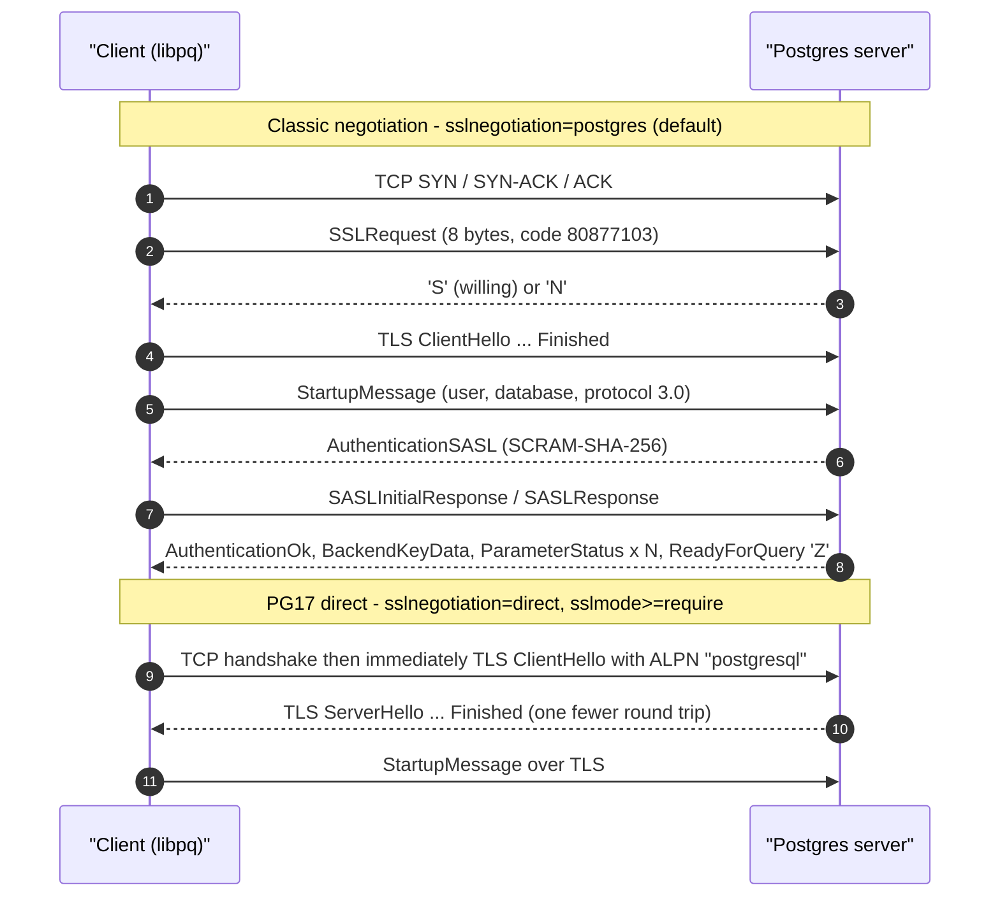
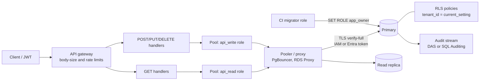

# B12 Database Security
> Last verified: 2026-10 · Audience: senior/staff DevOps, SRE, AI eng, NetEng, DevSecOps, architects

> **Data caveat:** B10–B14 come from a third-party listing (Udemy hides the course's last sections, and the course was updated Sept 2026). The B12 lecture list may be incomplete.

## TL;DR
- **TLS only protects you if the client verifies the server.** libpq's default `sslmode=prefer` falls back to plaintext and checks nothing, so it gives no protection against MITM. In production use `sslmode=verify-full` (CA chain plus hostname). Enforce TLS on the server with `hostssl` rules in `pg_hba.conf`, or `rds.force_ssl=1` on RDS, or `require_secure_transport=ON` on MySQL and Azure.
- **Postgres 17 adds direct TLS** (`sslnegotiation=direct`, ALPN `postgresql`). The client skips the 8-byte `SSLRequest`/`S` round trip and starts TLS straight away. It is only allowed with `sslmode=require` or stricter. Not every middlebox supports it yet; RDS Proxy, for example, does not.
- **Statement size limits.** Postgres caps a query string or a single field at **~1 GB** (`MaxAllocSize`) and Bind at **65,535 parameters**. MySQL's limit is `max_allowed_packet` (server default **64 MB**, client **16 MB**, max **1 GB**). MongoDB caps a BSON document at **16 MB** and a wire message at **48 MB**. Hitting these limits usually means the design is wrong.
- **Wire protocols are readable in Wireshark once you remove TLS** (or load a key log). Postgres v3 messages are a 1-byte type plus an Int32 length. The simple protocol sends `Q`. The extended protocol sends `P/B/D/E/S`, and that is where parameterization actually happens. MongoDB sends nearly everything as **OP_MSG (opcode 2013)**; the legacy opcodes were removed in 5.1.
- **REST + DB:** use one least-privilege DB role per operation class (read, write, migrate, admin). Use **parameterized queries** and **pooled connections** (PgBouncer, RDS Proxy, or Azure's built-in PgBouncer). Use **row-level security** for multi-tenant isolation. Set statement and idle timeouts. Never let the API connect as the owner or superuser.
- **Cloud:** move from passwords to **short-lived tokens** (RDS IAM auth tokens last 15 min; Entra tokens last up to 1 h for users and up to 24 h for managed identities). Rotate secrets (Secrets Manager rotates natively; with Key Vault you build it from an Event Grid event plus a Function). Audit with a stream the DBA can't tamper with (Database Activity Streams on AWS; SQL Auditing plus Defender for SQL on Azure).

---

## B12.1 How to Secure Your Postgres Database by Enabling TLS/SSL
### Server side
- **How it works:**
  - Set `ssl = on` in `postgresql.conf`. The server needs `server.crt` and `server.key` (by default in `$PGDATA`). The key must be `0600` and owned by postgres, or `0640` and owned by root. Otherwise the server refuses to start.
  - It's one port. Plaintext and TLS share 5432, and the client asks for TLS inside the Postgres protocol (`SSLRequest`).
  - `ssl_min_protocol_version` defaults to **TLSv1.2** (since PG14). Set `TLSv1.3` where every client supports it.
  - PG18 adds `ssl_tls13_ciphers` and `ssl_groups`. AWS exposes the hybrid post-quantum groups `X25519MLKEM768` and `SecP256r1MLKEM768` for RDS PG18. ML-KEM groups need TLS 1.3.
  - SSL files are re-read on `pg_ctl reload`. A broken new config is logged and the old one stays in use. A passphrase-protected key blocks reload unless `ssl_passphrase_command_supports_reload=on`.
- **`pg_hba.conf` is where you enforce TLS.** Rules are first-match, top-down.
  - `hostssl` matches only TLS connections. `hostnossl` matches only plaintext connections. `host` matches either. `hostgssenc` matches only GSSAPI-encrypted connections.
  - A typical policy is `hostnossl all all 0.0.0.0/0 reject` at the top, followed by `hostssl ... scram-sha-256`.
  - **Client certs (mTLS):**
    - `clientcert=verify-ca` checks that the client cert chains to `ssl_ca_file`.
    - `clientcert=verify-full` also requires the cert CN to match the DB user, or a `pg_ident.conf` mapping.
    - The `cert` auth method *is* certificate authentication, with no password, and implies `verify-full`.
    - Use `ssl_crl_file`/`ssl_crl_dir` for revocation.
- **Password auth over TLS:**
  - Use `scram-sha-256`, which has been the default `password_encryption` since PG14.
  - MD5 passwords are **deprecated in PG18** (the server warns).
  - SCRAM supports **channel binding** (`channel_binding=require` on the client). This ties the auth exchange to the TLS session, so a MITM holding its own cert can't relay the login.
  - PG18 also adds an `oauth` auth method that validates bearer tokens through a validator module.

### Client side (libpq `sslmode`)
| sslmode | Encrypts | Verifies CA | Verifies hostname | Falls back to plaintext |
|---|---|---|---|---|
| disable | no | – | – | – |
| allow | maybe | no | no | yes (tries plain first) |
| **prefer** (default) | maybe | no | no | **yes** |
| require | yes | no* | no | no |
| verify-ca | yes | yes | no | no |
| **verify-full** | yes | yes | **yes** | no |

\*With `require`, the client still verifies the CA if a root cert file is present (legacy behaviour).

- `sslrootcert=system` uses the OS trust store **and forces `verify-full`**; any weaker `sslmode` is an error. This is handy with public CAs.
- `sslcertmode=disable|allow|require` controls whether the client sends a certificate. `allow` is the default.
- **GSSAPI encryption wins over TLS** when it is available (`gssencmode=prefer`). Set `gssencmode=disable` to guarantee TLS.

### Postgres 17 direct TLS (verified)
- `sslnegotiation=postgres` is the default: the client sends `SSLRequest`, waits for `S`/`N`, and then starts TLS. With `sslnegotiation=direct` the client sends a TLS ClientHello immediately, with ALPN `postgresql`.
- Direct mode saves **1 RTT** per connection and lets generic TLS tooling sit in front of Postgres: SNI routing, TLS-terminating L4 proxies, HAProxy/Envoy `ssl_preread`.
- libpq allows `direct` **only with `sslmode=require` or stricter**, so a direct handshake can never silently fall back to plaintext auth.
- Both client and server must be v17 or later. **RDS Proxy does not support direct SSL negotiation** and speaks only protocol 3.0.
- PG18 adds **protocol 3.2**, which enlarges the cancel key from 4 bytes to variable length (up to 256 bytes) in `BackendKeyData`/`CancelRequest`. Clients still default to 3.0 unless asked (`max_protocol_version`).

- **Trade-offs / when to use:**
  - TLS costs a handshake (1-RTT with TLS 1.3) plus a little per-record CPU. That is negligible with pooling and significant without it, so pool (B12.5).
  - Client certs give strong machine identity, but you have to issue, rotate and revoke them. Many managed services don't support them: **Azure PG Flexible Server does not support client-cert mTLS**.
  - `verify-full` breaks if you connect via an IP address, a CNAME, or a private-endpoint name that isn't in the cert SAN. Fix DNS or the SANs; don't downgrade to `require`.
- **Interview angles:**
  - "Is `sslmode=require` secure?" Say: it encrypts but doesn't authenticate the server, so an active MITM wins. Use `verify-full` and pin the **root CA** (never the intermediate or leaf; Azure explicitly calls intermediate pinning unsupported because it rotates ICAs unannounced).
  - "How do you enforce TLS server-side?" Say: `hostssl`-only rules plus a `hostnossl ... reject` rule. On RDS that is what `rds.force_ssl=1` effectively does; you'll get `no pg_hba.conf entry ... SSL off`.
  - "How do you check that clients really use TLS?" Join `pg_stat_ssl` with `pg_stat_activity`, use the `sslinfo` extension's `ssl_is_used()`, and use `log_connections`.
  - **Pitfall:** TLS between app and pooler but plaintext between pooler and DB. Encrypt both hops.
  - **Pitfall:** a forgotten `host all all 0.0.0.0/0 trust` line.
  - TLS details (handshake, PKI, OCSP) are in [H4](../H-full-stack-troubleshooting/H4-transport-layer-security.md) and [I2](../I-dns-tls-acceleration-gaps/I2-tls-and-certificates.md).

## B12.2 What is the Largest SQL Statement that You can Send to Your Database
- **How it works:**
  - **Postgres:**
    - A query string, protocol message, or single field value is limited by `MaxAllocSize`, which is **1 GB − 1 byte**. It is not configurable.
    - Bind carries an Int16 parameter count, so there are **at most 65,535 bind parameters** per statement. Bulk inserts with `VALUES ($1..$n)` hit this limit first.
    - Deeply nested expressions hit `max_stack_depth` (default 2 MB), which raises "stack depth limit exceeded".
    - Long `IN (...)` lists also blow up planning time.
  - **MySQL:**
    - A "packet" is one SQL statement, one row sent to the client, or one binlog event.
    - `max_allowed_packet` defaults to **64 MB** on the server (8.0/8.4) and **16 MB** in the `mysql` client. The hard max is **1 GB**.
    - Going over raises `ER_NET_PACKET_TOO_LARGE` and **the connection is closed**.
    - Raise it on **both** sides. The protocol frames payloads in 3-byte-length chunks of **16 MB − 1**, and larger payloads are split.
  - **MongoDB:** a BSON document is at most **16 MB**. A wire message (`maxMessageSizeBytes`) is at most **48 MB**. Drivers split bulk writes into batches below these limits (up to `maxWriteBatchSize`, which is 100,000 ops).
  - **Managed and proxy layers often impose lower limits:**
    - **RDS Proxy pins the session to one DB connection for any statement over 16 KB**, which loses multiplexing.
    - The **RDS Data API response limit is 1 MiB**.
    - Azure SQL audit records truncate statement text at 4,000 characters.
- **Trade-offs / when to use:**
  - Huge statements cost parse and plan memory per backend, block a connection for a long time, bloat logs and audits, and make the DB easy to DoS.
  - Prefer `COPY` / `LOAD DATA` / `bulkWrite`, batches of 500–5,000 rows, or staging tables. Store large blobs in object storage and keep a pointer in the DB.
- **Interview angles:**
  - "Why does a security course cover statement size?" Say: it is an **availability and DoS control**. A REST endpoint that passes a user-supplied list straight into an `IN` clause, or accepts a 500 MB JSON body, can exhaust DB memory. Enforce limits at the edge: request body size at the LB/API gateway, maximum page and batch sizes in the API, and `statement_timeout`.
  - **Follow-up:** "Bulk insert of 1 M rows from an API?" Say: stream it into `COPY FROM STDIN` or batch it inside a transaction. Don't build one giant statement. Watch the 65,535-parameter limit.

## B12.3 Deep Look into Postgres Wire Protocol with Wireshark
- **How it works (protocol v3, TCP 5432):**
  - **Framing:**
    - Every message after startup is a **1-byte type**, then an **Int32 length** (the length includes itself), then the payload.
    - Startup-phase messages (`StartupMessage`, `SSLRequest`, `GSSENCRequest`, `CancelRequest`) have **no type byte**. They are identified by magic "version" codes. `SSLRequest` is 8 bytes: length 8 plus code `80877103`.
  - **Startup:** `SSLRequest` → `S`/`N` → TLS → `StartupMessage` (user, database, `application_name`, protocol 3.0 or 3.2). Then auth runs as `R` messages: `AuthenticationSASL` → SASLContinue → SASLFinal → `AuthenticationOk`. The server then sends `K` BackendKeyData (PID plus the secret cancel key), several `S` ParameterStatus messages (`server_version`, `client_encoding`, `TimeZone`, `is_superuser`, `in_hot_standby`...), and finally `Z` ReadyForQuery with a txn status of `I` (idle), `T` (in a transaction) or `E` (failed transaction).
  - **Simple query:** `Q` "SELECT ..." → `T` RowDescription → N × `D` DataRow → `C` CommandComplete ("SELECT 3") → `Z`. A single string may contain several statements, and they run in an implicit transaction. This is why simple-protocol string-building enables stacked-query injection.
  - **Extended query:** `P` Parse (SQL with `$1` placeholders) → `B` Bind (parameter values, text or binary formats) → `D` Describe → `E` Execute (with a row limit, which is how server-side portals and cursors work; see [B11](B11-database-cursors.md)) → `S` Sync. The server answers `1` ParseComplete, `2` BindComplete, `T`, `D`..., `C`, `Z`. **SQL text and data travel in separate messages**, and that separation is real protection against injection. Pipelining means sending many P/B/E messages before one Sync.
  - **Cancel:** the client opens a *new* TCP connection, sends `CancelRequest` (PID plus the key), and the server sends no reply. Some proxies don't support this; **RDS Proxy can't forward CancelRequest**, so Ctrl-C in psql doesn't work through it.
  - Other messages: `E` ErrorResponse (fields such as SQLSTATE `C`, message `M`), `N` Notice, `A` NotificationResponse (LISTEN/NOTIFY), `X` Terminate.
- **Wireshark / tshark:**
  - The display filter is `pgsql`. Useful fields: `pgsql.type`, `pgsql.query`, `pgsql.authtype`. For a non-standard port use *Decode As → PGSQL*.
  - With TLS on you see only `SSLRequest` and then TLS records. To decrypt, give Wireshark a **TLS key log** (`SSLKEYLOGFILE`-style). Recent libpq has a `sslkeylogfile` connection parameter (PG18, unverified). Otherwise capture on a lab instance with `sslmode=disable`, or capture on the server's loopback behind a TLS-terminating proxy.
  - With direct TLS (PG17) there isn't even an `SSLRequest`. The ClientHello carries ALPN `postgresql`.
- **Trade-offs / when to use:** packet-level debugging is useful for driver bugs, auth-method mismatches (MD5 vs SCRAM), pooler incompatibilities (named prepared statements under transaction pooling), latency analysis (count round trips per query), and spotting plaintext credentials (`AuthenticationCleartextPassword` = `R` with code 3).
- **Interview angles:**
  - "What does a plaintext capture leak?" Say: everything except a SCRAM password. That includes query text, result rows, usernames and database names. MD5 auth leaks a replayable-per-salt hash, and `password` auth sends the cleartext password.
  - "Why are prepared statements faster *and* safer?" Say: Parse happens once and Bind/Execute repeats, and parameters are never parsed as SQL.
  - Packet-analysis technique in general is covered in [F8 Wireshark](../F-network-engineering/F8-analyzing-protocols-with-wireshark.md).

## B12.4 Deep Look Into MongoDB Wire Protocol with Wireshark
- **How it works (TCP 27017, little-endian):**
  - **MsgHeader** (16 bytes): `messageLength`, `requestID`, `responseTo` (correlates a reply to its request), `opCode`.
  - **OP_MSG = 2013**. It is used for all commands and replies since MongoDB 3.6.
    - `flagBits` bit 0 is `checksumPresent`: a CRC-32C trailer. Drivers skip it over TLS.
    - Bit 1 is `moreToCome`, used for fire-and-forget or streamed replies (`w:0` writes, exhaust cursors).
    - Bit 16 is `exhaustAllowed`, used by streaming `hello` for topology monitoring.
    - Unknown bits 0–15 must cause an error. Bits 16–31 may be ignored.
  - **OP_MSG sections:**
    - **Kind 0, body:** exactly one BSON doc, the command, e.g. `{insert: "users", $db: "app", lsid: ..., $clusterTime: ...}`.
    - **Kind 1, document sequence:** an identifier such as `documents`, followed by back-to-back BSON docs. This lets bulk inserts avoid one giant array inside the 16 MB body.
  - **OP_COMPRESSED = 2012** wraps another opcode. `compressorId` is 1 for snappy, 2 for zlib, 3 for zstd.
  - **Legacy opcodes:** OP_QUERY (2004), OP_INSERT, OP_UPDATE, OP_DELETE, OP_GET_MORE, OP_KILL_CURSORS and OP_REPLY (1) were **deprecated in 5.0 and removed in 5.1**. The one exception is OP_QUERY for the initial `hello`/`isMaster` handshake.
  - **Auth:** SCRAM-SHA-256 runs as `saslStart`/`saslContinue` commands inside OP_MSG. x.509 and AWS IAM (`MONGODB-AWS`) auth are also available, and Atlas also supports OIDC (Workforce/Workload identity).
- **Wireshark:**
  - The display filter is `mongo`. Fields include `mongo.opcode == 2013` and `mongo.msg.sections.section.kind`. The BSON body is decoded into a tree, so you can see the command name, `$db`, filter documents, and the `cursor.firstBatch` of replies.
  - Over TLS you need a key log, or a lab instance without TLS.
- **Trade-offs / when to use:**
  - A single opcode keeps drivers simple and makes the protocol extensible: new commands need no new opcodes.
  - The BSON overhead (field names repeated in every doc) shows up in pcap byte counts. Compression helps on cross-AZ and cross-region links.
- **Interview angles:**
  - "Postgres vs Mongo on the wire?" Say: Postgres has a typed message per phase (Parse/Bind/DataRow...) and streams rows. Mongo is RPC-ish: command-doc request → reply doc, with a cursor `id` plus `getMore` commands for paging.
  - "Mongo injection?" Say: there's no SQL text, but **operator injection** exists. If an API passes user JSON straight into a filter, `{"password": {"$ne": null}}` becomes possible. Validate types and strip keys that start with `$`. The Mongo equivalent of "parameterize" is to build filters from typed values and never from user-supplied documents.

## B12.5 Best Practices Working with REST & Databases
- **How it works / practices:**
  - **Separate pools per privilege level.** For example, a `reader` pool pointing at replicas and a `writer` pool pointing at the primary. GET handlers physically can't write. This also enables read scaling ([B8](B8-database-replication.md)).
  - **Connection pooling is mandatory.**
    - Postgres uses one process per connection, which costs roughly a few MB to 10+ MB each. Thousands of idle connections hurt.
    - **App-side pools:** HikariCP, pgx, SQLAlchemy. Size them as cores × 2 plus spindles as a starting point. Don't size them to match request concurrency.
    - **External poolers** are for serverless and high fan-out. Options include PgBouncer (transaction mode), **RDS Proxy**, or Azure PG Flexible's **built-in PgBouncer**: port **6432**, `pool_mode=transaction` default, `max_client_conn` 5000, `default_pool_size` 50, not available on Burstable.
    - **Transaction pooling breaks session state:** session `SET`, advisory locks, `LISTEN`, temp tables, and SQL-level `PREPARE`. Use `SET LOCAL`, and use protocol-level prepared statements with PgBouncer ≥1.21 `max_prepared_statements`.
  - **Parameterize every query.** Use the driver's placeholders (`$1`/`?`) so the extended protocol carries values separately (B12.3). Identifiers (table and column names, `ORDER BY` columns) can't be parameterized, so whitelist them.
  - **Timeouts are security controls:**
    - `statement_timeout` per role (e.g. 5 s for the API role).
    - `idle_in_transaction_session_timeout` (stops a crashed request holding locks).
    - `lock_timeout`.
    - Client-side query and connect timeouts below the HTTP timeout.
  - **Bound result sets.** Mandatory limits, plus keyset pagination (`WHERE id > $last ORDER BY id LIMIT $n`) instead of large `OFFSET`s. Reject unbounded `?limit=`. Return a cursor token, not raw offsets.
  - **Map errors.** Don't return raw DB errors (they leak schema and SQLSTATE). Log them with a correlation ID. Translate unique violations (`23505`) to 409, serialization failures (`40001`) to retry or 409, and timeouts (`57014`) to 503/504.
  - **Idempotency and transactions.** Use idempotency keys for POST (a unique constraint plus `INSERT ... ON CONFLICT`). Keep transactions short and never hold one across network calls to other services. See [B7](B7-concurrency-control.md) for isolation.
  - **Secrets.** No DB passwords in code or images. Use IAM/Entra tokens, or a secrets manager with rotation (cloud mapping below and [L6](../L-data-privacy-ai-security/L6-secrets-supply-chain.md)).
  - **Network.** Keep the DB on private subnets or a private endpoint with SG/NSG allowing only the app tier ([G7](../G-cloud-network-architecture/G7-service-endpoints-private-link.md)). There should be no public IP.
- **Trade-offs / when to use:**
  - ORMs reduce injection risk but hide N+1 queries and over-fetching. Query builders with explicit SQL are easier to review.
  - Auto-generated REST over the DB (PostgREST, Supabase, Data API builder, RDS Data API) is fast to build. It *requires* RLS and grants to be correct, because the DB becomes the authorization layer.
- **Interview angles:**
  - "Lambda/Functions with 10k concurrent invocations → Postgres?" Say: put a pooler or proxy in front (RDS Proxy, or PgBouncer on Azure), cap concurrency, or use the HTTP Data API so there are no persistent connections.
  - **Anti-patterns:** opening a connection per request without a pool; one superuser connection string shared by every microservice; `SELECT *` exposed through JSON; string-concatenated filters from query params.

## B12.6 Database Permissions and Best Practices for Building REST API
- **How it works (Postgres model):**
  - **Roles** = users plus groups. `LOGIN` roles are for apps. `NOLOGIN` group roles hold privileges.
  - Privileges are granted at database (`CONNECT`), schema (`USAGE`, `CREATE`), object (`SELECT/INSERT/UPDATE/DELETE/TRUNCATE/REFERENCES/TRIGGER`) and column level (`GRANT SELECT (id,name) ON users`).
  - A typical layout:
    - `app_owner` (NOLOGIN) owns the schema and objects and is used only by migrations.
    - `app_rw` (NOLOGIN) has DML on the tables.
    - `app_ro` (NOLOGIN) has SELECT.
    - `api_read` (LOGIN, IN ROLE `app_ro`) and `api_write` (LOGIN, IN ROLE `app_rw`).
    - A `migrator` (LOGIN) can `SET ROLE app_owner`.
  - **The API never connects as the owner or superuser.** An owner bypasses RLS and can `DROP`.
  - **Defaults to harden:**
    - **PG15+ no longer grants `CREATE` on `public` to PUBLIC.** On older versions, `REVOKE CREATE ON SCHEMA public FROM PUBLIC`.
    - `REVOKE ALL ON DATABASE app FROM PUBLIC`.
    - Use `ALTER DEFAULT PRIVILEGES FOR ROLE app_owner IN SCHEMA app GRANT SELECT ON TABLES TO app_ro` so that new tables inherit grants.
  - **Predefined roles:** `pg_read_all_data` and `pg_write_all_data` (PG14), `pg_maintain` (PG17), `pg_monitor`, `pg_signal_backend`. Prefer these over superuser for ops. On RDS the master user is `rds_superuser`, not a true superuser. On Azure it's `azure_pg_admin`.
  - **Row-Level Security (RLS):**
    - Turn it on with `ALTER TABLE t ENABLE ROW LEVEL SECURITY`. **With no policies, everything is denied.**
    - `USING` filters the rows you can see, update or delete. `WITH CHECK` validates new rows on INSERT and UPDATE.
    - Permissive policies are OR'ed. `AS RESTRICTIVE` policies are AND'ed.
    - Superusers and `BYPASSRLS` roles always bypass RLS. **The table owner bypasses it unless you run `FORCE ROW LEVEL SECURITY`.**
    - Multi-tenant pattern: in each request's transaction, run `SET LOCAL app.tenant_id = '…'`, with a policy like `USING (tenant_id = current_setting('app.tenant_id')::uuid)`. `SET LOCAL` is safe with transaction pooling; a session-level `SET` leaks across pooled clients.
    - Index `tenant_id`.
  - **SECURITY DEFINER functions** are a narrow privileged API, e.g. `transfer_funds()`. Always `SET search_path = pg_catalog, app` on them, or a hijacked `search_path` lets an attacker escalate. `REVOKE EXECUTE ... FROM PUBLIC` and then grant to specific roles.
  - **MySQL equivalents:**
    - `GRANT ... ON db.* TO 'api'@'10.0.%'`. Accounts are host-scoped.
    - Roles since 8.0.
    - Views or `DEFINER` routines stand in for RLS, since MySQL has no native RLS.
    - `caching_sha2_password` is the default auth plugin in 8.x.
  - **MongoDB equivalents:** built-in `read`/`readWrite` roles per database, custom roles with privilege actions per collection, and `authorization: enabled` (which is off by default in self-managed mongod).
- **Trade-offs / when to use:**
  - DB-level authorization (RLS) is defence in depth. It holds even if an API bug omits a `WHERE tenant_id = ...`. It costs predicate overhead, complicates debugging, and needs pool-safe context propagation.
  - App-level authorization alone is simpler, but one missed filter becomes a cross-tenant data leak.
  - Per-end-user DB roles (one role per human) give perfect auditing but break pooling, because pools are keyed per user. The usual compromise is a few service roles plus an `application_name` or `SET LOCAL app.user_id` for audit attribution.
- **Interview angles:**
  - "Design permissions for a multi-tenant SaaS REST API." Say:
    - Separate owner, migrator, `api_rw` and `api_ro` roles.
    - RLS on every tenant table with FORCE.
    - Tenant ID set by `SET LOCAL` from the verified JWT claim, never from a request parameter.
    - Read pool on replicas.
    - `statement_timeout` per role.
    - pgaudit or Activity Streams for privileged roles.
  - **Follow-up:** "How do you test it?" Say: CI tests that connect as `api_rw` and assert that cross-tenant SELECTs return 0 rows and that INSERTs with a foreign `tenant_id` fail the `WITH CHECK`.
  - **Pitfalls:**
    - Granting to PUBLIC.
    - Views run with the view owner's rights and bypass RLS unless they are `security_invoker = true` (PG15+).
    - Foreign-key checks bypass RLS.
    - Forgetting `GRANT USAGE ON SEQUENCE` for inserts.
    - Leaking the tenant setting across pooled sessions.

---

## Diagrams





---

## Cloud mapping: AWS vs Azure

| Capability | AWS | Azure | Role it plays | Key differences | Alternatives |
|---|---|---|---|---|---|
| Token-based DB auth | **RDS/Aurora IAM DB authentication** (SigV4 token, 15 min) | **Microsoft Entra authentication** (Azure SQL DB/MI, PG Flexible, MySQL Flexible) | Replace static DB passwords with short-lived identity tokens | AWS token: 15-min lifetime, only checked at connect time, ~1 KB+. Entra: JWT, user tokens ≤1 h, managed-identity tokens ≤24 h. Entra supports groups and MFA. Entra-only mode can disable passwords | Kerberos/AD; Vault database secrets engine (dynamic creds); Cloud SQL IAM auth |
| Enforce TLS server-side | `rds.force_ssl` (PG; **default 1 on RDS PG15+**), `require_secure_transport` (RDS/Aurora MySQL) in a parameter group | PG/MySQL Flexible: `require_secure_transport` (**ON by default**); Azure SQL: always encrypted, **Minimum TLS version** (1.2+; 1.0/1.1 retired 31 Aug 2025) | Reject plaintext connections | Changing an RDS parameter group may need a reboot; Azure `require_secure_transport` is dynamic. **Azure PG does not support client-cert mTLS or BYO server cert**; self-managed or RDS PG can use `ssl_ca_file` patterns (RDS has no client-cert auth either, unverified) | Self-managed `hostssl` / `clientcert=verify-full` |
| Server CA trust | RDS CA bundles (`rds-ca-rsa2048-g1`, `rds-ca-rsa4096-g1`, `rds-ca-ecc384-g1`) | DigiCert Global Root G2 + Microsoft RSA Root CA 2017 (ICA rotation 2026) | Clients verify the server for `verify-full` | Trust **roots** only; Azure warns ICAs rotate unannounced | `sslrootcert=system` with public CAs |
| Secret storage + rotation | **Secrets Manager**: native rotation (Lambda rotation functions; single-user vs alternating-users); **RDS-managed master password** rotates every **7 days** by default with no Lambda | **Key Vault** secrets: no native DB-password rotation. Build it with an Event Grid `SecretNearExpiry` event (30 days before expiry) plus an Azure Function (dual-credential pattern). Native autorotation exists for **keys** | Central secret custody and rotation | AWS has a turnkey RDS integration. Azure steers you to **managed identity + Entra** to remove the secret altogether | HashiCorp Vault dynamic DB creds; External Secrets Operator on K8s |
| Connection pooling / proxy | **RDS Proxy** (pooling + multiplexing, IAM end-to-end, faster failover; secrets from Secrets Manager; >16 KB statement pins; no PG direct SSL, no CancelRequest) | **Built-in PgBouncer** on PG Flexible (port 6432, Entra-aware, restarts on HA failover); Azure SQL: client-side pooling only (gateway Proxy vs **Redirect** policy is routing, not pooling) | Absorb connection storms (serverless, microservices) | RDS Proxy is a separate regional, multi-AZ managed fleet billed per vCPU/ACU. Azure PgBouncer runs on the DB VM (free, single-threaded, not on Burstable) | Self-hosted PgBouncer/PgCat/Odyssey on K8s; ProxySQL for MySQL |
| HTTP SQL access | **RDS Data API** (Aurora PG/MySQL, writer only, creds via a Secrets Manager ARN, IAM `rds-data:*`, 1 MiB response limit) | **Data API builder** (open-source REST/GraphQL/MCP over Azure SQL, PG, MySQL, Cosmos DB; you host it, e.g. Container Apps) | Use the DB without persistent connections (Lambda/edge) | AWS is a managed endpoint exposing raw SQL. DAB is a self-hosted engine with an entity/permission config | PostgREST, Hasura, Supabase; Cloudflare Hyperdrive (pooling + caching for Workers) |
| Activity monitoring / audit | **Database Activity Streams** (Aurora PG/MySQL, RDS Oracle/SQL Server → Kinesis, KMS-encrypted, outside DBA control; **sync mode only on Aurora PG**); pgaudit / MySQL audit plugin → CloudWatch Logs; **GuardDuty RDS Protection** (login anomalies) | **Azure SQL Auditing** (→ Storage append blobs (immutable option), Log Analytics, Event Hubs); **Microsoft Defender for SQL** / Defender for open-source relational DBs (threat detection: SQL injection, anomalous logins); pgaudit on PG Flexible | Compliance trail and threat detection | DAS is tamper-resistant from DBAs (separation of duties) and free apart from Kinesis. Azure auditing can drop events under extreme load; Entra failed logins appear in Entra logs, not in the SQL audit | Imperva / IBM Guardium (consume DAS), Datadog DBM, Splunk/Sentinel SIEM |
| Network isolation | Private subnets + SGs; PrivateLink for Data API | Private Endpoint / VNet integration; Azure SQL "Public network access = Disable" | No public DB endpoint | See [G7](../G-cloud-network-architecture/G7-service-endpoints-private-link.md) | Cloudflare Tunnel / Zero Trust for admin access |

- **RDS IAM auth:**
  - Policy grants `rds-db:connect` on `arn:aws:rds-db:<region>:<acct>:dbuser:<DbiResourceId|cluster-ResourceId>/<dbuser>`.
  - PG: `GRANT rds_iam TO app_user`. **Once a user has `rds_iam`, it can no longer log in with a password**, and that includes the master user.
  - MySQL: `CREATE USER ... IDENTIFIED WITH AWSAuthenticationPlugin AS 'RDS'`.
  - TLS is required. The token is generated client-side with `aws rds generate-db-auth-token`; this is a local signing operation, so **CloudTrail doesn't log it**.
  - Budget **300–1000 MiB of extra DB memory**.
  - You can't sign tokens for a custom Route 53 name.
  - `aws:SourceIp`/`SourceVpc` condition keys aren't supported.
  - The old "~200 new connections/s" guidance is gone from current docs, but you should still pool.
- **Entra auth:**
  - PG/MySQL tokens use the resource `https://ossrdbms-aad.database.windows.net`. Azure SQL uses `https://database.windows.net/`.
  - Enabling Entra on PG Flexible installs `pgaadauth` and **restarts the server**.
  - Roles are matched on the Entra object ID, so a recreated user with the same name won't match.
  - A deleted user can keep connecting until the token expires (≤60 min) unless you also drop the role.
  - Auth modes are PG-only, Entra-only, or both.
- **Choosing a pooler:**
  - RDS Proxy's pinning rules matter. Session-state statements, statements over 16 KB, and some prepared-statement usage pin the client to one DB connection and kill multiplexing. Watch `DatabaseConnectionsCurrentlySessionPinned`.
  - Azure's built-in PgBouncer is a single point of failure on the DB VM, but it is restarted on the new primary after failover.
- **Gotchas:**
  - Azure's TLS doc writes `sslmode=verify-all`. The real libpq value is **`verify-full`**.
  - RDS for PG ≤14 defaults to `rds.force_ssl=0`, so check legacy fleets.
  - Data API runs only against writer instances and isn't supported on T classes.
  - DAS needs a KMS key, and you mustn't add extra Kinesis encryption.
  - Stop DAS before an Aurora PG major-version upgrade.

---

## Hands-on (optional)

```bash
# 1) Lab CA + server cert with SAN, then enable TLS on a self-managed Postgres
openssl req -x509 -newkey rsa:2048 -nodes -days 365 -subj "/CN=lab-ca" -keyout ca.key -out ca.crt
openssl req -newkey rsa:2048 -nodes -subj "/CN=db.lab.internal" -keyout server.key -out server.csr
openssl x509 -req -in server.csr -CA ca.crt -CAkey ca.key -CAcreateserial -days 90 \
  -extfile <(printf "subjectAltName=DNS:db.lab.internal") -out server.crt
sudo install -o postgres -m 0600 server.key "$PGDATA/server.key"
sudo install -o postgres -m 0644 server.crt ca.crt "$PGDATA/"

cat >> "$PGDATA/postgresql.conf" <<'EOF'
ssl = on
ssl_cert_file = 'server.crt'
ssl_key_file = 'server.key'
ssl_ca_file = 'ca.crt'
ssl_min_protocol_version = 'TLSv1.3'
EOF

# pg_hba is first-match: reject plaintext, require SCRAM over TLS, mTLS for the ops role
cat > "$PGDATA/pg_hba.conf" <<'EOF'
local    all  postgres                 peer
hostnossl all all        0.0.0.0/0     reject
hostssl  all  ops_admin  10.0.0.0/8    cert clientcert=verify-full
hostssl  app  api_rw,api_ro 10.0.0.0/8 scram-sha-256
EOF
sudo -u postgres pg_ctl reload -D "$PGDATA"

# 2) Client: full verification + PG17 direct TLS + channel binding
psql "host=db.lab.internal dbname=app user=api_ro sslmode=verify-full sslrootcert=ca.crt sslnegotiation=direct channel_binding=require" \
  -c "SELECT ssl, version, cipher FROM pg_stat_ssl WHERE pid = pg_backend_pid();"

# 3) Capture the wire protocol (lab only, plaintext) and list message types
sudo tcpdump -i lo -w pg.pcap 'tcp port 5432' &
PGSSLMODE=disable psql -h 127.0.0.1 -U api_ro app -c "SELECT 1"
tshark -r pg.pcap -Y pgsql -T fields -e frame.number -e pgsql.type -e pgsql.query

# 4) MongoDB OP_MSG
tshark -r mongo.pcap -Y 'mongo.opcode == 2013' -T fields -e mongo.request_id -e mongo.response_to
```

```hcl
# Enforce TLS on both clouds
resource "aws_db_parameter_group" "pg17" {
  name   = "pg17-secure"
  family = "postgres17"
  parameter {
    name  = "rds.force_ssl"
    value = "1"
  }
  parameter {
    name  = "ssl_min_protocol_version"
    value = "TLSv1.3"
  }
}

resource "aws_db_instance" "app" {
  # ...
  parameter_group_name                = aws_db_parameter_group.pg17.name
  iam_database_authentication_enabled = true
  manage_master_user_password         = true # Secrets Manager, 7-day rotation
}

resource "azurerm_postgresql_flexible_server_configuration" "tls" {
  name      = "require_secure_transport"
  server_id = azurerm_postgresql_flexible_server.app.id
  value     = "on"
}

resource "azurerm_postgresql_flexible_server_configuration" "pgbouncer" {
  name      = "pgbouncer.enabled"
  server_id = azurerm_postgresql_flexible_server.app.id
  value     = "true"
}
```

---

## Cross-links
- [B7 Concurrency Control](B7-concurrency-control.md): transaction isolation and locking behind API idempotency.
- [B8 Database Replication](B8-database-replication.md): read pools on replicas.
- [B11 Database Cursors](B11-database-cursors.md): Execute row limits and portals in the extended protocol.
- [B13 Homomorphic Encryption](B13-homomorphic-encryption.md): encryption *in use* vs in transit and at rest.
- [C4 Security](../C-large-scale-architecture/C4-security.md): TLS and firewall overlap (C4.5–C4.13).
- [H4 Transport Layer Security](../H-full-stack-troubleshooting/H4-transport-layer-security.md) and [I2 TLS and Certificates](../I-dns-tls-acceleration-gaps/I2-tls-and-certificates.md): handshake and PKI details.
- [F8 Analyzing Protocols with Wireshark](../F-network-engineering/F8-analyzing-protocols-with-wireshark.md): capture technique.
- [L2 Encryption & Key Management](../L-data-privacy-ai-security/L2-encryption-key-management.md), [L6 Secrets & Supply Chain](../L-data-privacy-ai-security/L6-secrets-supply-chain.md), [L7 Zero Trust & Workload Identity](../L-data-privacy-ai-security/L7-zero-trust-workload-identity.md).
- [G7 Service Endpoints & Private Link](../G-cloud-network-architecture/G7-service-endpoints-private-link.md): private DB endpoints.

## Sources
- https://www.postgresql.org/docs/current/libpq-connect.html (sslmode, sslnegotiation, sslrootcert=system, sslcertmode)
- https://www.postgresql.org/docs/current/ssl-tcp.html
- https://www.postgresql.org/docs/current/protocol-flow.html
- https://www.postgresql.org/docs/current/protocol-overview.html (protocol 3.2 / PG18)
- https://www.postgresql.org/docs/current/ddl-rowsecurity.html
- https://www.postgresql.org/docs/17/release-17.html
- https://dev.mysql.com/doc/refman/8.4/en/packet-too-large.html
- https://www.mongodb.com/docs/manual/reference/mongodb-wire-protocol/
- https://docs.aws.amazon.com/AmazonRDS/latest/UserGuide/PostgreSQL.Concepts.General.SSL.html
- https://docs.aws.amazon.com/AmazonRDS/latest/UserGuide/UsingWithRDS.IAMDBAuth.html
- https://docs.aws.amazon.com/AmazonRDS/latest/UserGuide/rds-proxy.html
- https://docs.aws.amazon.com/AmazonRDS/latest/UserGuide/rds-secrets-manager.html
- https://docs.aws.amazon.com/AmazonRDS/latest/AuroraUserGuide/DBActivityStreams.html
- https://docs.aws.amazon.com/AmazonRDS/latest/AuroraUserGuide/data-api.html and data-api.limitations.html
- https://learn.microsoft.com/en-us/azure/postgresql/security/security-tls
- https://learn.microsoft.com/en-us/azure/postgresql/security/security-entra-concepts
- https://learn.microsoft.com/en-us/azure/postgresql/connectivity/concepts-pgbouncer
- https://learn.microsoft.com/en-us/azure/mysql/security/security-tls-how-to-connect
- https://learn.microsoft.com/en-us/azure/azure-sql/database/connectivity-settings
- https://learn.microsoft.com/en-us/azure/azure-sql/database/auditing-overview
- https://learn.microsoft.com/en-us/azure/key-vault/secrets/tutorial-rotation-dual
- https://learn.microsoft.com/en-us/azure/data-api-builder/overview
