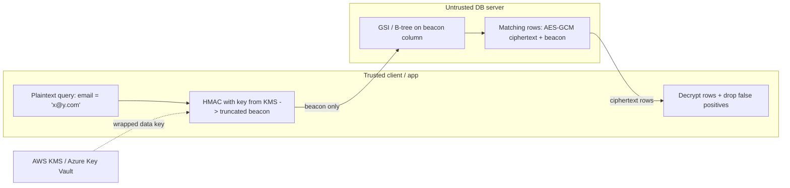
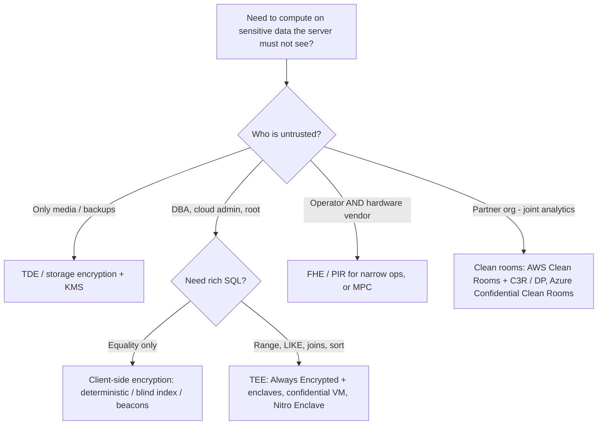
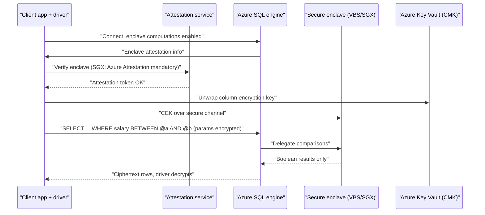

# B13 Homomorphic Encryption: Performing Database Queries on Encrypted Data
> Last verified: 2026-10 · Audience: senior/staff DevOps, SRE, AI eng, NetEng, DevSecOps, architects

> **Source caveat:** B10–B14 came from a third-party listing (Udemy hides the last sections; course updated Sept 2026), so a lecture may be missing. These notes cover the listed IDs and add current (2026) production context.

## TL;DR
- Data has three states: **at rest** (disk/KMS, solved), **in transit** (TLS, solved), **in use** (memory/CPU, *hard*). B13 is about the third one.
- A database needs to **see plaintext** to index, compare, sort, join, aggregate and run `LIKE`. Encrypting columns with a standard randomized cipher (AES-GCM) breaks all of that. Every workaround **leaks something** or **costs a lot of performance**.
- **Homomorphic encryption (HE)** lets a server compute on ciphertext. **PHE** supports one operation (RSA multiply, Paillier add). **SHE/leveled HE** supports bounded-depth circuits. **FHE** supports any circuit through **bootstrapping**. The main schemes are **BFV/BGV** (exact integers), **CKKS** (approximate reals, used for ML) and **TFHE/FHEW** (bits or small ints, programmable bootstrapping).
- **Property-preserving encryption** (deterministic, order-preserving/revealing, searchable/blind index) is fast and indexable, but it leaks **equality, frequency or order**. Inference attacks on these schemes are well published (Naveed et al. 2015).
- **Is FHE ready?** For narrow, high-value workloads, yes. Apple runs **BFV-based PIR/PNNS** in production (Live Caller ID Lookup, Enhanced Visual Search, Mail, website filtering). It is **not** ready for general SQL: expect **10^3–10^6×** compute overhead and **10–1000×** ciphertext expansion, and comparisons and sorting are especially costly.
- **Pragmatic "encryption in use" today** means **confidential computing (TEEs)**: AWS Nitro Enclaves or AMD SEV-SNP on EC2, Azure confidential VMs (SEV-SNP/TDX), and Azure SQL **Always Encrypted with secure enclaves**. It can also mean **client-side encryption with searchable tokens**, such as the AWS Database Encryption SDK beacons or MongoDB Queryable Encryption.
- For multi-party analytics: **AWS Clean Rooms** (analysis rules + differential privacy + **C3R** client-side crypto) vs **Azure Confidential Clean Rooms** (TEE-based Spark SQL on confidential ACI + CCF governance; **limited preview** as of 2026).
- The senior answer always starts with a **threat model**: who are you hiding data from (the DBA, the cloud operator, a partner, a stolen backup)? That choice decides between TDE, CSFLE, TEE and HE.

## B13.1 What is Encryption?
- **How it works:**
  - **Symmetric** (one shared key): **AES-128/256**, usually in an **AEAD** mode (**AES-GCM**, ChaCha20-Poly1305) that gives confidentiality plus integrity. It is fast, often GB/s per core with **AES-NI**. Its weakness is key distribution.
  - **Asymmetric** (public/private key pair): **RSA** (2048/3072+), **ECC** (P-256, X25519/Ed25519). It is slow, so in practice it is used to **exchange or wrap keys and to sign**, not to encrypt bulk data.
  - **Hybrid / envelope encryption:** a random **data key (DEK)** encrypts the data, and a **key-encryption key (KEK)** held in KMS/HSM wraps the DEK. AWS KMS `GenerateDataKey` and Azure Key Vault wrap/unwrap work this way. TLS 1.3 follows the same pattern: ECDHE agrees a session key, then AES-GCM encrypts the traffic.
  - **Hashing ≠ encryption:** SHA-256 is one-way. **HMAC** is a keyed hash and is the basis of blind indexes and beacons (B13.4).
  - **Post-quantum:** NIST FIPS 203 (**ML-KEM**) and 204 (**ML-DSA**) were finalized in Aug 2024. Note that lattice problems (**LWE/RLWE**) underpin both PQC and modern FHE.
- **Three data states:**

| State | Threat | Typical control | AWS | Azure |
|---|---|---|---|---|
| At rest | stolen disk/backup/snapshot | **TDE**, volume/storage encryption | EBS/S3/RDS encryption with KMS | SSE + Key Vault CMK, SQL TDE |
| In transit | sniffing, MITM | TLS 1.2/1.3, mTLS, IPsec/MACsec | ACM, ELB TLS, VPN | App Gateway/Front Door TLS, VPN Gateway |
| **In use** | root/DBA/hypervisor/cloud operator, memory dumps | **TEE**, client-side encryption, **HE**, MPC | Nitro Enclaves, SEV-SNP, DB Encryption SDK | Confidential VMs, Always Encrypted (+ enclaves) |

- **Trade-offs / when to use:**
  - **TDE / at-rest** protects only against media theft. The DB engine, the DBA and any SQL-injection attacker all see plaintext.
  - **Column/field-level (client-side) encryption** protects against the DBA, the cloud operator and dumps, but you lose server-side query functionality (B13.2).
- **Interview angles:**
  - If asked "is our data encrypted?", answer by state and by **who holds the key**. "Encrypted at rest with a provider-managed key" does **not** protect against a malicious insider with DB access.
  - Pitfall: confusing encoding (base64) or hashing with encryption, and using **AES-ECB** or a nonce-reusing GCM.
  - Follow-up: "Where do keys live?" Answer: KMS/HSM, envelope encryption, rotation, separation of duties. See [L2 Encryption & key management](../L-data-privacy-ai-security/L2-encryption-key-management.md).

## B13.2 Why Can't we always Encrypt?
- **How it works:** A standard (semantically secure, **randomized**) cipher makes `Enc(x) ≠ Enc(x)` on every call. The ciphertext bears no relationship to the plaintext, so the engine cannot do any of the following:
  - **Index:** a B-tree orders keys by value, and random ciphertext gives you no order and no equality. See [B3 Indexing](B3-database-indexing.md) and [B4 B-tree vs B+tree](B4-btree-vs-bplustree.md).
  - **Search / filter:** `WHERE ssn = ?` needs equality, `WHERE age > 30` needs order, and `LIKE 'Jo%'` needs substrings.
  - **Sort / GROUP BY / DISTINCT:** these need order or equality.
  - **JOIN:** equi-joins need equality across tables, and hash and merge joins need hashing or order.
  - **Aggregate:** `SUM`, `AVG` and `MAX` need arithmetic and order on values.
  - **Constraints:** `UNIQUE`, PK/FK and `CHECK` need equality or value inspection.
  - **Other engine features:** statistics and the cost-based optimizer (histograms), compression (ciphertext is incompressible) and full-text search all break too.
- **Options and what they cost:**

| Approach | Server can do | Leaks | Cost |
|---|---|---|---|
| Randomized (AES-GCM, AE randomized) | nothing; fetch + decrypt client-side | length, access pattern | full scans client-side |
| **Deterministic** (AES-SIV, AE deterministic) | `=`, equi-join, GROUP BY, index | **equality + frequency** | cheap |
| **Order-preserving/revealing** (OPE/ORE) | `<`, `>`, range, sort, index | **order** (and with OPE ≈ approximate value) | cheap |
| **Blind index / beacon** (truncated HMAC) | equality via extra column | frequency (tunable via truncation) | false positives |
| **Structured / searchable encryption** (SSE, MongoDB QE) | equality, range, (prefix/substring preview) | access/search pattern, volume | 2–3×+ storage, metadata |
| **TEE** (enclave decrypts inside) | almost full SQL | order via indexes, side channels | moderate, trust in HW vendor |
| **FHE** | arbitrary computation | ~nothing (beyond size/timing) | 10^3–10^6× compute |

- **Practical reasons you don't encrypt everything:**
  - **Key management is the hard part.** Lost key = lost data. Rotation means re-encrypting.
  - **Apps break:** ORMs, reporting/BI, ETL, CDC/replication consumers, search indexes.
  - **Operability:** support engineers can't debug encrypted data. MongoDB QE even **redacts slow logs/profiler** output.
  - **Performance:** per-row crypto, lost index usage, client-side filtering of over-fetched results.
- **Trade-offs / when to use:** Encrypt the **few high-risk fields** (SSN, PAN, health data, secrets) at the field level. Use TDE plus access control for the rest. **Tokenization** (a vault mapping token→value) is a common alternative for PCI scope reduction.
- **Interview angles:**
  - If asked "why not just encrypt every column?", explain that you lose indexes, joins, sort and aggregates. Then pick per-column: deterministic for join keys, randomized for display-only fields, and a TEE or FHE when you need computation.
  - Pitfall: **server-side encryption functions** (e.g. Postgres `pgcrypto` `pgp_sym_encrypt('x', 'key')`) send the **key to the server**, where it can appear in `pg_stat_statements` and logs. That design does not protect against the DBA.
  - Pitfall: deterministic encryption on **low-cardinality** columns (gender, boolean, state) is effectively plaintext once you apply frequency analysis.

## B13.3 What is Homomorphic Encryption
- **How it works:** A scheme is homomorphic for an operation `⊕` if `Dec(Enc(a) ⊗ Enc(b)) = a ⊕ b`. The server computes on ciphertext and never holds the secret key. The client decrypts the result.
- **Taxonomy:**

| Class | Supports | Examples | Notes |
|---|---|---|---|
| **PHE** (partially) | one op, unlimited times | **RSA** (×, textbook only), **ElGamal** (×), **Paillier** (+) | Paillier is used for encrypted sums/voting and in Google **Private Join and Compute** (with commutative encryption) |
| **SHE** (somewhat) | + and × for limited depth | early lattice schemes | noise grows; stops working beyond depth |
| **Leveled HE** | circuits up to a pre-set multiplicative depth L | BFV/BGV/CKKS without bootstrapping | most practical deployments (incl. Apple PIR) |
| **FHE** (fully) | arbitrary circuits | Gentry 2009 (first construction) + **bootstrapping** | bootstrapping = homomorphically evaluating decryption to reset noise; it is the expensive step |

- **Lattice basics (enough for an interview):**
  - Security rests on **(Ring-)LWE**, which is believed **quantum-resistant**.
  - Every ciphertext carries **noise**. Addition grows noise a little and multiplication grows it a lot. When noise passes a threshold, decryption fails, so the scheme must use **modulus switching / rescaling**, **relinearization** and eventually **bootstrapping**.
  - Parameters: ring dimension **N** (e.g. 2^12–2^16) and ciphertext modulus **q**. Larger N gives more security, more depth and more **SIMD slots** (batching N or N/2 values per ciphertext), but slower operations.
- **Main schemes:**

| Scheme | Data | Strength | Use |
|---|---|---|---|
| **BFV** | exact integers mod t | SIMD batching, exact | PIR, counting, private set ops (Apple uses BFV) |
| **BGV** | exact integers mod t | similar to BFV, different noise mgmt | same as BFV |
| **CKKS** | **approximate** real/complex numbers | rescaling, cheap fixed-point arithmetic | **ML inference**, statistics, similarity search |
| **TFHE / FHEW (CGGI / DM)** | bits / small integers | **fast bootstrapping** per gate (ms on CPU, sub-ms on GPU per Zama), **programmable bootstrapping** = evaluate a lookup table during bootstrap | comparisons, branching, non-linear functions; Zama's stack |

- **Ops that are cheap vs expensive in FHE:**
  - Cheap: add, multiply-by-plaintext.
  - Moderate: ciphertext × ciphertext.
  - **Expensive:** comparison (`<`), `max`, sort, division, branching. In BFV/CKKS these need polynomial approximation. In TFHE they need bootstrapped LUTs.
  - **Data-dependent control flow is impossible.** The server must evaluate *both* branches or a whole circuit, so a "WHERE" turns into "compute a 0/1 mask for every row".
- **Libraries:**
  - **Microsoft SEAL** (C++, MIT): BFV/BGV/CKKS, **no bootstrapping**. As of 2026 the latest release is 4.x (repo indicates 4.5, unverified exact date). The README notes that encrypted comparison, sorting and regex are "in most cases not feasible".
  - **OpenFHE** (successor to PALISADE, Duality-backed, BSD-2): BFV, BGV, CKKS (with bootstrapping), DM/FHEW, CGGI/TFHE, scheme switching, threshold/multiparty FHE.
  - **Zama**: **TFHE-rs** (Rust, GPU), **Concrete** (Python→FHE compiler), **Concrete ML** (scikit-learn/torch-like API), **fhEVM** (confidential smart contracts).
  - **Apple swift-homomorphic-encryption** (BFV, PIR/PNNS).
  - **Google**: **HEIR** (MLIR-based FHE compiler, Apache-2.0) plus the earlier FHE transpiler.
  - Others: Lattigo (Go, Tune Insight), HElib (IBM, BGV/CKKS).
- **Trade-offs / when to use:** Use HE when the **server must not be trusted at all**, including the hardware vendor, the computation is **shallow / arithmetic** (sums, dot products, lookups, linear models), and you can tolerate latency and bandwidth costs. Avoid it for OLTP and ad-hoc SQL.
- **Interview angles:**
  - "PHE vs FHE?" PHE handles one op (e.g. Paillier sums: a server can add encrypted salaries). FHE handles arbitrary circuits through bootstrapping.
  - "Why is CKKS approximate?" It encodes reals with scaling and treats the noise as part of the precision loss. That is fine for ML and wrong for money and exact equality.
  - Who holds the key? With **single-key FHE** only the client can decrypt. For multi-party settings use **threshold/multi-key FHE** (OpenFHE) or MPC.
  - FHE hides *data*, not *function* or *access pattern*, unless the circuit touches all data, which is why PIR is O(n) server work.
  - Pitfall: claiming "FHE lets you run arbitrary SQL on encrypted Postgres today". It does not, at any practical scale.

## B13.4 Searching The Encrypted Database
- **How it works (the main techniques):**
  - **Deterministic encryption / blind index:** store `HMAC(k, value)` (or AES-SIV ciphertext) next to the randomized ciphertext. Query by computing the same token client-side. Supports equality, equi-join, GROUP BY and a normal B-tree index.
  - **AWS Database Encryption SDK beacons** (the renamed DynamoDB Encryption Client):
    - **Standard beacon** = **truncated HMAC**. Truncation forces **collisions (false positives)** to blunt frequency analysis, and the SDK filters out the false positives after decryption.
    - **Compound beacons** combine fields and literal prefixes for richer queries. **Partitioned beacons** spread hot values across partitions, at the cost of one query per partition.
    - Beacons only map **new writes**, so design them for new tables.
    - AWS guidance: shorter beacons and more partitions give more security; longer beacons and fewer partitions give more performance. Don't beacon **correlated fields** (City + ZIP) or duplicate fields (mobile/preferred phone).
  - **Order-preserving / order-revealing encryption (OPE/ORE):** enables range queries and sort with a standard index, but leaks order. OPE also leaks roughly half the plaintext bits, and dense columns (ages, dates) can be **fully recovered** by sorting attacks.
  - **CryptDB-style onions (2011):** layers of RND → DET → OPE, peeled back on demand. Naveed/Kamara/Wright (CCS 2015) recovered >80% of values in medical DB columns from DET/OPE columns using auxiliary data.
  - **Searchable symmetric encryption (SSE)** / **structured encryption:** encrypted index structures that reveal only the **search pattern** (same query repeated) and **access pattern** (which records match).
    - **MongoDB Queryable Encryption** is an implementation of this. It shipped GA in 7.0 with **equality**, added **range** in 8.0, and added **prefix/suffix/substring** in **public preview in 8.2**. In 9.0 docs these types and the `$encStr*` operators are listed, but their GA status was not confirmed.
    - QE works on **replica sets and sharded clusters only**, on **new collections only**, and not on `_id`. It keeps **metadata collections** that need compaction, and it **redacts** encrypted ops from slow logs and the profiler. It does not defend against an attacker who has both DB snapshots and query transcripts.
  - **MongoDB CSFLE** (older): deterministic (equality) or random (none), client-side, with keys in KMS (AWS KMS, Azure Key Vault, GCP KMS, KMIP, local).
  - **Azure SQL / SQL Server Always Encrypted:** client driver encrypts (AEAD_AES_256_CBC_HMAC_SHA_256).
    - **Column master key** (Key Vault / cert store) wraps a **column encryption key**.
    - **Deterministic** columns allow `=` and joins only. **Randomized** columns allow nothing server-side unless you add an enclave.
  - **Always Encrypted with secure enclaves:** the driver ships keys over an attested channel into an enclave inside the DB engine process. The enclave supports comparison, BETWEEN, IN, **LIKE**, DISTINCT, **joins**, **ORDER BY**, **GROUP BY** (Azure SQL DB and SQL Server 2022; SQL Server 2019 allows only nested-loop joins and no ORDER BY or GROUP BY).
    - These operations require **randomized** encryption on enclave-enabled columns.
    - Nonclustered indexes are sorted by plaintext inside the enclave, which **leaks order** to a DBA scanning the index.
    - Other limits: no clustered index or PK/FK on those columns, ADR strongly recommended, char columns need a BIN2/UTF-8 collation.
  - **FHE / PIR search:** the server evaluates a match over **all** rows, which hides the access pattern too. Apple's **PIR** (keyword lookup) and **PNNS** (encrypted embedding similarity, "Wally") work this way, with an **OHTTP relay** and **differential privacy** (ε=0.8, δ=10⁻⁶ for Enhanced Visual Search) to hide who is asking.
- **Leakage hierarchy (least → most):** FHE/PIR (size) < SSE (search + access pattern) < truncated beacons (bucketed frequency) < DET (exact equality + frequency) < ORE < OPE (order + approximate value) < plaintext.
- **Trade-offs / when to use:**
  - **Exact-match lookups on high-cardinality IDs** (email, SSN, account no.): blind index, beacon or DET. This is cheap and well understood.
  - **Range queries on sensitive values:** MongoDB QE range or an AE enclave. Avoid raw OPE.
  - **Rich SQL with a DBA-proof guarantee:** Always Encrypted with enclaves, or the whole DB in a confidential VM.
  - **Untrusted operator *and* untrusted hardware vendor:** FHE/PIR, but only for narrow queries.
- **Interview angles:**
  - "Design search over encrypted PII in DynamoDB." Use client-side encryption (AWS Database Encryption SDK) with KMS-wrapped keys, a **standard beacon** on `email` sized for the expected cardinality, a **GSI on the beacon attribute**, and filter false positives client-side. Note that the per-attribute choices are `ENCRYPT_AND_SIGN`, `SIGN_ONLY` and `DO_NOTHING`.
  - "Why not hash the SSN without a key?" Unkeyed hashes of a small domain (10^9 SSNs) can be brute-forced in seconds. Always use a **keyed** HMAC with the key in KMS/HSM.
  - Follow-up on access-pattern leakage: an attacker watching which rows each query returns can link queries over time. ORAM/PIR fix this, at large cost.
  - Pitfall: building a **unique** index on randomized ciphertext (meaningless), or expecting MongoDB QE unique indexes to guarantee uniqueness (they can't).



## B13.5 Is Homomorphic Encryption Ready?
- **How it works (state of play, 2026):**
  - **Production, narrow:** **Apple** has used BFV with post-quantum 128-bit security parameters in production since iOS 18 (2024) for Live Caller ID Lookup, Enhanced Visual Search (Photos), Mail business logos/info and website-filter checks. Server work is cut by **sharding** the database and **8-bit quantized embeddings**.
  - **Google** open-sourced **Private Join and Compute** (2019; PSI with commutative encryption plus Paillier sums) for ad-conversion measurement. It is building **HEIR** (MLIR FHE compiler, publicized 2026) for private inference use cases such as recommendations, fraud detection and hotword recognition.
  - Others: Microsoft's **Password Monitor** in Edge uses HE (unverified detail). Zama's **fhEVM** targets blockchain confidential contracts. Duality, Enveil and Tune Insight sell finance and health analytics.
  - **Hardware acceleration:** GPU backends (TFHE-rs CUDA; Zama reports sub-ms bootstrapping on H100) and DARPA **DPRIVE** ASIC programs (Intel, Duality and others; status unverified) aim to close the gap by 100–1000×.
  - **Standards:** HomomorphicEncryption.org security standard (parameter tables). ISO/IEC 18033-6 covers PHE. FHE standardization (ISO/IEC 28033) is in progress (unverified status).
- **Performance (orders of magnitude; depends heavily on parameters and hardware):**

| Metric | Plaintext | FHE (CPU) |
|---|---|---|
| Single add/mul | ns | µs–ms (BFV/CKKS, amortized across thousands of SIMD slots) |
| Bootstrapping | n/a | CKKS: ~seconds-ish per ciphertext; TFHE: ~10 ms per gate/LUT on CPU, <1 ms on high-end GPU |
| Overall slowdown | 1× | **~10^3–10^6×** (amortized SIMD helps; comparisons hurt) |
| Ciphertext size | 4–8 B per int | **KBs–MBs per ciphertext** (expansion 10–1000×, less with batching) |
| Keys | 32 B AES | evaluation/relinearization/rotation/bootstrapping keys = **MBs–GBs** |

- **Trade-offs / when to use:**
  - **Ready:** PIR / private lookup, encrypted aggregate statistics, private set intersection, small-model inference (logistic regression, small CNN, embeddings similarity), and "privacy-preserving telemetry". In all of these the circuit is shallow and the server is fully untrusted.
  - **Not ready:** general OLTP/OLAP SQL, joins on large tables, sorting, string processing, LLM-scale inference (still impractical as of 2026, though research and demos exist).
  - **Engineering costs:** parameter selection is expert work, there are **no data-dependent branches**, debugging is opaque, ciphertext bloats network and storage, and IND-CPA alone is not enough. CKKS has known **key-recovery attacks when decryptions are shared** (Li–Micciancio 2021), so never return raw CKKS decryptions to the server.
- **Interview angles:**
  - If asked "would you use FHE for our encrypted DB?", say: probably not for the main store. Use **client-side field encryption plus a TEE** (Always Encrypted enclaves or a confidential VM) for rich queries. Reserve FHE/PIR for a specific privacy-critical **lookup or aggregate** path where you can't trust the operator or the chip vendor.
  - "TEE vs FHE?" A **TEE** runs near-native (single-digit to low tens of % overhead) but trusts AMD/Intel/AWS silicon and firmware, and side channels have been demonstrated (SGX Foreshadow/Plundervolt, SEV attacks). **FHE** trusts only math, at a cost of 10^3–10^6×. **MPC** spreads trust across parties at a network-heavy cost. **Differential privacy** protects the *output* but does not hide the computation.
  - Name-drop with substance: Apple uses BFV with PIR/PNNS plus OHTTP and DP. Microsoft SEAL has no bootstrapping. OpenFHE covers all major schemes. Zama owns TFHE.





## Cloud mapping: AWS vs Azure

| Capability | AWS | Azure | Role it plays | Key differences | Alternatives |
|---|---|---|---|---|---|
| Isolated enclave carved from a VM | **Nitro Enclaves** | (closest) **Confidential VM** / **Intel SGX DCsv3** app enclaves; **Confidential containers on ACI** | Run sensitive code where parent/root can't read memory | Nitro: hypervisor-based isolation, no network/storage, vsock only, ≤4 enclaves/instance, no extra charge. Azure SGX: CPU-enforced app enclaves (code must be partitioned) | Fortanix, Anjuna, Edgeless Constellation, GCP Confidential Space |
| Confidential VM (memory encryption + attestation, lift-and-shift) | EC2 **AMD SEV-SNP** (m6a/c6a/r6a subset) + **NitroTPM** | **Confidential VMs**: DCasv5/ECasv5, DCasv6/ECasv6 (**SEV-SNP**), DCesv6/ECesv6 (**Intel TDX**), **NCCadsH100v5** (confidential GPU) | Protect entire VM from hypervisor/host operator | AWS SEV-SNP: shared tenancy only in us-east-2/eu-west-1, **+10% hourly fee** (no fee on Dedicated Hosts), can't combine with Nitro Enclaves. Azure: confidential OS disk encryption bound to vTPM, Azure Attestation gates boot; no live migration, ASR, or Accelerated Networking | GCP Confidential VMs (SEV/SNP/TDX), on-prem Kata CoCo |
| Attestation-gated key release | **KMS** `Recipient` param + `kms:RecipientAttestation:ImageSha384` / `:PCR` conditions (Decrypt, GenerateDataKey, GenerateRandom, DeriveSharedSecret) | **Azure Attestation** + **Key Vault / Managed HSM Secure Key Release** | Only release keys to measured, attested code | AWS: response encrypted to the enclave's public key. Azure: policy-based release to attested CVM/enclave | HashiCorp Vault with custom attestation plugin |
| DB "encryption in use" with rich queries | No native enclave DB. **RDS for SQL Server** supports client-side Always Encrypted (no enclaves) (unverified detail) | **Azure SQL DB Always Encrypted with secure enclaves** (VBS, or SGX on DC-series until **SGX end of support 31 Oct 2027**); SQL Server 2019+/2022 on VMs | DBA-proof comparisons, LIKE, joins, sort inside DB | Azure VBS enclaves in Azure SQL DB: **no attestation**, protects against in-VM attackers, not host. SGX: Azure Attestation mandatory | Run Postgres/MySQL inside a confidential VM; CipherStash, Baffle proxies |
| Client-side field encryption + searchable tokens | **AWS Database Encryption SDK** (formerly DynamoDB Encryption Client): beacons, KMS / hierarchical keyring | **Always Encrypted** (SQL DB, **Cosmos DB** client-side, deterministic/randomized) + Key Vault | App encrypts before write; server never sees plaintext | AWS: beacon = truncated HMAC, tunable leakage, DynamoDB-focused. Azure: driver-transparent, DET = equality only | **MongoDB Queryable Encryption / CSFLE** (Atlas on AWS/Azure), Google Tink, pgcrypto (server-side, weaker) |
| Multi-party data collaboration | **AWS Clean Rooms**: analysis rules (aggregation/list/custom), **C3R** (client-side AES-GCM sealed + HMAC fingerprint columns for JOIN), **differential privacy**, Clean Rooms ML, PySpark, Entity Resolution | **Azure Confidential Clean Rooms**: TEE-based **confidential Spark SQL** on C-ACI virtual nodes in AKS, **CCF** governance & audit, allowedFields, min-row pre/post filters; **limited preview** (2026) | Joint analytics without exposing raw rows | AWS: policy/crypto controls (not TEE-based), GA, reads S3/Athena/Snowflake in place. Azure: hardware attestation verifiable by every party, all collaborators approve queries | Snowflake Data Clean Rooms, Databricks Clean Rooms, LiveRamp/Habu, Google Ads Data Hub |
| FHE / HE libraries & services | No managed FHE service. Run OpenFHE/TFHE-rs/SEAL on EC2 (GPU P5/G6) | No managed FHE service. **Microsoft SEAL** (MSR) on Azure VMs/GPUs | Compute on ciphertext | Both are DIY. Pick by scheme: CKKS for ML, BFV for PIR, TFHE for comparisons | Zama, Duality, Apple swift-HE, Google HEIR |
| At rest / in transit baseline | KMS, EBS/S3/RDS encryption, ACM | Key Vault/Managed HSM, SSE, TDE, App Gateway/Front Door TLS | Baseline before "in use" | See L2 | Cloudflare, HashiCorp Vault |

- **Nitro Enclaves:**
  - Supported on most Nitro-based Intel, AMD and Graviton types (not the smallest sizes or most metal sizes), with a Linux enclave OS. Works in all commercial and GovCloud regions, but **not on Outposts, Local Zones or Wavelength**. **Hibernation is unsupported**.
  - Built with `nitro-cli` from a Docker image into an **EIF**. The attestation doc carries **PCR0–PCR8** measurements, which KMS key policies pin.
  - Typical uses: PII tokenization, private keys/wallets, ACM for Nitro Enclaves (TLS keys never touch the parent).
- **Azure confidential VMs:**
  - The trust boundary is the **whole VM**. Code changes aren't needed, which makes them good for lift-and-shift databases.
  - **SEV-SNP vs TDX:** both use hardware memory encryption and integrity, with different vendor roots of trust.
  - **Confidential OS disk encryption** is optional (PMK or CMK) and **can't be changed after deploy**. From 30 Mar 2026, encrypted OS disks cost more.
  - Azure Backup support is in preview. Auto key rotation is unsupported (offline rotation only).
- **Always Encrypted enclave choice:**
  - **VBS** works on any non-DC Azure SQL DB and is the future path. It **doesn't protect against host admins** and has no attestation in Azure SQL DB.
  - **SGX** (DC-series) protects against the host OS too, but it is **end of support 31 Oct 2027**, after which Azure auto-migrates the database to VBS.
  - Interview gotcha: geo-replicas and restore targets must also support enclaves, and bacpac export requires dropping enclave indexes first.
- **Clean rooms:**
  - **AWS Clean Rooms** protects mainly through **query restrictions + DP**. C3R adds cryptographic protection but supports only JOIN/SELECT (sometimes GROUP BY on fingerprint columns), not WHERE or SUM, and still leaks row counts, column names and length bounds.
  - **Azure Confidential Clean Rooms** protects through **TEE + attestation + CCF ledger**. It is stronger against the operator but currently preview-only, and the docs say not to use it for regulated personal data in preview.
- **Alternatives:**
  - **GCP** Confidential VMs/GKE/Confidential Space (canonical third option for TEEs).
  - **Kubernetes** Confidential Containers (CNCF CoCo, Kata + SEV-SNP/TDX).
  - **Databricks Clean Rooms** and **Snowflake Data Clean Rooms** for analytics.
  - **NVIDIA H100/Blackwell confidential computing** for **confidential AI inference** (Azure NCCadsH100v5). See [K4 LLM serving](../K-ai-infra-llm/K4-llm-serving-inference.md).

## Hands-on (optional)
```bash
# Nitro Enclaves: build an enclave image from a Docker image and run it (Amazon Linux 2023 parent)
sudo dnf install -y aws-nitro-enclaves-cli aws-nitro-enclaves-cli-devel
sudo systemctl enable --now nitro-enclaves-allocator.service   # reserves vCPU/memory per /etc/nitro_enclaves/allocator.yaml
nitro-cli build-enclave --docker-uri my-tokenizer:latest --output-file tokenizer.eif   # prints PCR0/1/2 -> pin in KMS key policy
nitro-cli run-enclave --eif-path tokenizer.eif --cpu-count 2 --memory 2048 --enclave-cid 16
nitro-cli describe-enclaves

# Why server-side crypto is weak vs a DBA: the key travels in the SQL text
psql -c "SELECT pgp_sym_decrypt(ssn_enc, 'my-secret-key') FROM customers LIMIT 1;"   # key visible in logs/pg_stat_statements
```

```hcl
# AWS: EC2 parent with Nitro Enclaves enabled
resource "aws_instance" "enclave_parent" {
  ami           = var.al2023_ami
  instance_type = "m6i.xlarge"            # .large sizes are not supported
  enclave_options {
    enabled = true
  }
}

# AWS: SEV-SNP confidential instance (supported m6a/c6a/r6a sizes, supported regions)
resource "aws_instance" "snp" {
  ami           = var.al2023_uefi_ami
  instance_type = "m6a.xlarge"
  cpu_options {
    amd_sev_snp = "enabled"
  }
}

# Azure: confidential VM (AMD SEV-SNP) with confidential OS disk encryption
resource "azurerm_linux_virtual_machine" "cvm" {
  name                  = "cvm-db01"
  resource_group_name   = var.rg
  location              = var.location
  size                  = "Standard_DC4as_v5"
  admin_username        = "azureuser"
  network_interface_ids = [var.nic_id]
  secure_boot_enabled   = true
  vtpm_enabled          = true
  admin_ssh_key {
    username   = "azureuser"
    public_key = var.ssh_pub
  }
  os_disk {
    caching                  = "ReadWrite"
    storage_account_type     = "Premium_LRS"
    security_encryption_type = "DiskWithVMGuestState"   # or VMGuestStateOnly
  }
  source_image_reference {
    publisher = "Canonical"
    offer     = "0001-com-ubuntu-confidential-vm-jammy"
    sku       = "22_04-lts-cvm"
    version   = "latest"
  }
}
```

## Cross-links
- [B12 Database security](B12-database-security.md): auth, TLS to the DB, permissions
- [B3 Database indexing](B3-database-indexing.md) and [B4 B-tree vs B+tree](B4-btree-vs-bplustree.md): why ciphertext breaks indexes
- [B10 Database engines](B10-database-engines.md)
- [L2 Encryption & key management](../L-data-privacy-ai-security/L2-encryption-key-management.md): KMS/Key Vault, envelope encryption, rotation
- [L1 Data classification & PII](../L-data-privacy-ai-security/L1-data-classification-pii.md): which fields deserve field-level encryption
- [L3 Residency & compliance](../L-data-privacy-ai-security/L3-residency-compliance.md)
- [L7 Zero trust & workload identity](../L-data-privacy-ai-security/L7-zero-trust-workload-identity.md): attestation as identity
- [C4 Security](../C-large-scale-architecture/C4-security.md) and [I2 TLS & certificates](../I-dns-tls-acceleration-gaps/I2-tls-and-certificates.md): in-transit encryption
- [K2 Embeddings & vector DBs](../K-ai-infra-llm/K2-embeddings-vector-databases.md): private nearest-neighbor search (Apple PNNS)
- [M7 Data warehouses](../M-data-platforms/M7-data-warehouses.md): clean rooms in Snowflake/Databricks

## Sources
- https://learn.microsoft.com/en-us/sql/relational-databases/security/encryption/always-encrypted-enclaves
- https://learn.microsoft.com/en-us/azure/confidential-computing/confidential-vm-overview
- https://learn.microsoft.com/en-us/azure/confidential-computing/confidential-clean-rooms
- https://docs.aws.amazon.com/enclaves/latest/user/nitro-enclave.html
- https://docs.aws.amazon.com/AWSEC2/latest/UserGuide/sev-snp.html
- https://docs.aws.amazon.com/kms/latest/developerguide/conditions-nitro-enclaves.html
- https://docs.aws.amazon.com/database-encryption-sdk/latest/devguide/searchable-encryption.html
- https://docs.aws.amazon.com/clean-rooms/latest/userguide/what-is.html
- https://docs.aws.amazon.com/clean-rooms/latest/userguide/crypto-computing.html
- https://www.mongodb.com/docs/manual/core/queryable-encryption/
- https://www.mongodb.com/docs/manual/core/queryable-encryption/reference/limitations/
- https://www.mongodb.com/docs/manual/core/queryable-encryption/reference/supported-operations/
- https://machinelearning.apple.com/research/homomorphic-encryption
- https://swift.org/blog/announcing-swift-homomorphic-encryption/
- https://github.com/microsoft/SEAL
- https://openfhe-development.readthedocs.io/en/latest/
- https://www.zama.ai/post/zama-product-releases-january-2025
- https://www.helpnetsecurity.com/2026/08/18/google-heir-open-source-compiler-toolchain/
- https://www.schneier.com/blog/archives/2019/07/google_releases_1.html (Google Private Join and Compute)
