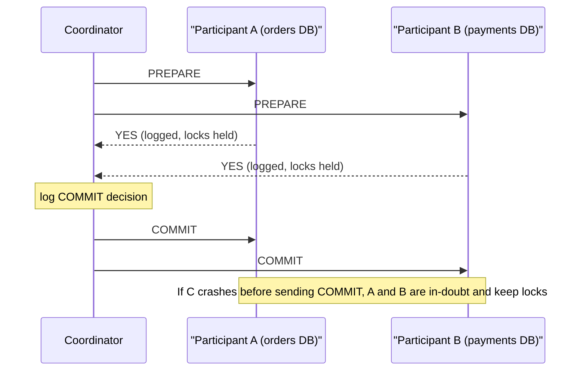
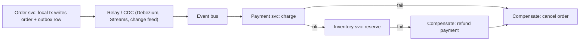

# B14 Database Discussions
> Last verified: 2026-10 · Audience: senior/staff DevOps, SRE, AI eng, NetEng, DevSecOps, architects

> Data caveat: B10–B14 came from a third-party listing (Udemy hides the last sections; the course was updated Sept 2026), so this section may be missing a lecture.

## TL;DR
- **`COUNT(*)` is O(rows) in MVCC engines.** PostgreSQL and InnoDB keep no stored row count, because each transaction can see a different number of rows. For "about how many" use **`pg_class.reltuples`**, `EXPLAIN` estimates, or a **counter table**. Don't run an exact count on every page load.
- **Distributed transactions:** 2PC/XA gives atomicity, but it **blocks** if the coordinator dies after PREPARE. Microservices use **sagas** (compensating actions) plus the **transactional outbox** instead. Spanner avoids blocking by running 2PC over Paxos groups and orders commits with **TrueTime commit-wait**.
- **Uber 2016 (Postgres → MySQL):** write amplification on secondary indexes, verbose physical WAL replication, a 9.2 replica-corruption bug, replica MVCC conflicts, painful major upgrades, and process-per-connection. Critics pointed to **HOT updates**, pgbouncer, and later logical replication (PG10+). Most of the points held for *their* workload, an update-heavy table with many indexes.
- **Write amplification happens at three layers:** the app (ORMs rewriting whole rows), the DB (WAL, full-page writes, index maintenance, MVCC versions, LSM compaction) and the SSD (FTL garbage collection). These multiply. Aurora and Hyperscale cut DB-level amplification by shipping only the log to storage.
- **NULLs are almost free in storage.** PostgreSQL stores a per-row null bitmap only when the row has a NULL, and a NULL takes no data bytes. **Partial indexes** (`WHERE col IS NOT NULL`) keep indexes small. Know the 3-valued-logic traps (`NOT IN` with a NULL returns nothing).
- **QUIC for databases** removes TCP head-of-line blocking and enables multiplexing and 0-RTT. But DB traffic runs inside data centers on long-lived, low-loss connections, the bottleneck is the server, and 0-RTT is **replayable**, so it is unsafe for writes. It stays niche. HTTP/WebSocket "serverless drivers" are the real-world answer for edge clients.
- **Optimistic vs pessimistic:** use pessimistic (`SELECT … FOR UPDATE`) under high contention or short critical sections. Use optimistic (version column, ETag, conditional write, SSI or OCC with retry) when contention is low or a user has long "think time". Aurora DSQL is OCC-only, so the app **must retry**.

## B14.1 SELECT COUNT(*) can impact your Backend Application performance
- **How it works:**
  - **PostgreSQL MVCC:** row visibility depends on the snapshot (xmin/xmax), so there is no global count. `COUNT(*)` has to scan the heap (parallel seq scan helps), or use an **index-only scan** that still checks the **visibility map**. If many pages are not all-visible (recent writes, vacuum lag), it falls back to heap fetches.
  - **InnoDB:** scans the **smallest secondary index**, or the clustered index if there is none. It keeps no internal count "because concurrent transactions might see different numbers of rows". `COUNT(1)` and `COUNT(*)` are identical. MyISAM stores an exact count, which is why old benchmarks mislead.
  - `COUNT(col)` skips NULLs and is a different query from `COUNT(*)`.
  - **Estimates:**
    - PG `pg_class.reltuples`, maintained by VACUUM/ANALYZE/autovacuum. Since PG14, **`-1`** means "never analyzed".
    - `pg_stat_user_tables.n_live_tup`.
    - The `rows=` value in `EXPLAIN` output, for filtered counts.
    - MySQL `information_schema.TABLES.TABLE_ROWS`, which is a rough estimate.
    - DynamoDB `DescribeTable.ItemCount`, updated about every 6 hours.
  - **Counter tables:** trigger- or app-maintained `counts(table, n)`. A single counter row becomes a **hot row**, with lock contention and MVCC churn. Fix it with **sharded counters** (N rows, SUM on read), or async aggregation through a queue or CDC.
- **Trade-offs / when to use:**
  - Exact counts are needed for billing and invariants. UI counts ("10,000+ results") should be estimates.
  - For pagination, fetch `LIMIT n+1` to answer "has next page?" and use **keyset pagination** instead of `OFFSET` plus a total count.
  - For approximate distinct counts use HyperLogLog (Redis `PFCOUNT`, `approx_count_distinct` in warehouses).
- **Interview angles:**
  - "Why is `SELECT COUNT(*)` slow on a 500M-row Postgres table?" → MVCC visibility forces a scan. Options: estimate, an index-only scan with a well-vacuumed table, a materialized/counter table, or caching.
  - Pitfall: a dashboard that polls `COUNT(*)` every few seconds holds snapshots, raises I/O and blocks vacuum cleanup. Protect with `statement_timeout`.
  - Follow-up: "Is the counter-table trigger correct under concurrency?" → yes, transactional, but it serializes writers. Shard it.

## B14.2 How does the Database Store Data On Disk?
- **How it works:** recap, full depth in [B2 Database Internals](./B2-database-internals.md) and [B4 B-tree vs B+tree](./B4-btree-vs-bplustree.md).
  - Fixed **pages**: PG 8 KB, InnoDB 16 KB default.
  - **PG page:** 24 B header, then 4 B line pointers growing forward and tuples growing backward from the end.
  - **PG heap tuple header:** 23 B (xmin, xmax, cid, ctid, infomask, t_hoff), then the optional null bitmap, then MAXALIGN-padded data.
  - **PG** is a **heap plus separate indexes** that point to the ctid (physical location). **InnoDB** is **index-organized**: rows live in the clustered PK B+tree, and secondary indexes store the PK, so a secondary lookup costs two B+tree descents.
  - Large values are moved off-row (**TOAST** in PG once a row is over ~2 KB; off-page overflow in InnoDB DYNAMIC format).
  - **LSM engines** (RocksDB, Cassandra, MyRocks) use an append-only memtable, then SSTables, then compaction. See [B10 Database Engines](./B10-database-engines.md).
  - **Row vs column store:** OLTP vs analytics. See [M7 Data Warehouses](../M-data-platforms/M7-data-warehouses.md).
- **Trade-offs:**
  - A heap makes updates cheap but needs vacuum, and every index points to a physical location, which drives Uber's complaint (B14.5).
  - A clustered index gives fast PK range scans, but random UUIDv4 PKs cause page splits. Prefer UUIDv7 or other time-ordered keys.
- **Interview angles:** "Why can't Postgres update in place?" → MVCC writes a new tuple version, and the old one is reclaimed by VACUUM. InnoDB updates in place and keeps old versions in **undo logs**.

## B14.3 Is QUIC a Good Protocol for Databases?
- **How it works:** QUIC ([RFC 9000](https://www.rfc-editor.org/rfc/rfc9000)) runs over UDP with **mandatory TLS 1.3** (RFC 9001).
  - Independent **streams**, so one lost packet doesn't stall the other streams. This removes TCP head-of-line blocking.
  - **1-RTT / 0-RTT** handshakes.
  - **Connection migration** via connection IDs, so a session survives an IP change.
  - User-space congestion control.
- **Pros for DB protocols:**
  - Many logical queries over one connection could replace big client-side pools.
  - Faster reconnect for mobile/edge clients.
  - Encryption is built in.
- **Cons:**
  - DB traffic is mostly intra-VPC with low loss and long-lived pooled connections, so TCP HOL rarely hurts.
  - **0-RTT data is replayable**. Never allow it for non-idempotent statements.
  - Higher CPU cost (user-space crypto, weaker NIC offload than TCP's TSO/LRO).
  - UDP is often blocked or rate-limited by corporate firewalls and middleboxes.
  - Every driver and proxy (pgbouncer, RDS Proxy) would need rewriting.
  - Session state (transactions, temp tables, `SET`) is per-connection in the PG and MySQL protocols. Multiplexing doesn't fix a backend that is a **process per connection**.
- **Reality (2026):**
  - No mainstream OLTP engine ships QUIC as a supported wire protocol. Third-party Postgres-over-QUIC experiments report large concurrency wins but are research-grade (unverified).
  - What exists instead:
    - libpq **pipeline mode** (PG14+)
    - **gRPC/HTTP/2** APIs (Spanner, Aurora DSQL/Data API-style HTTP endpoints)
    - **HTTP/WebSocket serverless drivers** for edge runtimes
- **Interview angles:**
  - "Would you run your DB protocol on QUIC?" → Only for high-latency, lossy, mobile or edge clients. Server-side, fix connection scaling with a pooler or proxy first.
  - Cross-link transport details: [F3 UDP](../F-network-engineering/F3-user-datagram-protocol.md), [F4 TCP](../F-network-engineering/F4-transmission-control-protocol.md), [F5 Protocols](../F-network-engineering/F5-popular-networking-protocols.md), [I3 Acceleration](../I-dns-tls-acceleration-gaps/I3-acceleration.md).

## B14.4 What is a Distributed Transaction?
A transaction that touches ≥2 independent resource managers (shards, databases, a DB plus a queue) and must commit atomically. See ACID in [B1](./B1-acid.md) and sharding in [B6](./B6-database-sharding.md).

### Two-phase commit (2PC) and XA
- **Phase 1, PREPARE:**
  - Each participant durably logs its changes, keeps its **locks**, and votes yes or no.
  - A "yes" vote is a promise: the participant can no longer abort on its own.
- **Phase 2, COMMIT/ABORT:** the coordinator logs the decision, then tells every participant.
- **Coordinator failure after PREPARE:** participants are **in-doubt**. They cannot commit or abort alone and hold locks until the coordinator recovers. That makes 2PC a **blocking protocol**.
  - Operators may force "heuristic" commit/rollback, which risks inconsistency.
  - **3PC** is non-blocking only under synchrony assumptions, so it is rarely used.
  - The practical fix is to **replicate the coordinator** (Paxos/Raft), as Spanner and CockroachDB do.
- **XA** is the X/Open standard interface between a transaction manager (JTA, MSDTC) and resource managers.
  - MySQL: `XA START/END/PREPARE/COMMIT`.
  - PostgreSQL: `PREPARE TRANSACTION` / `COMMIT PREPARED`. It is off by default (`max_prepared_transactions=0`). Orphaned prepared transactions **block VACUUM and risk XID wraparound**, so monitor `pg_prepared_xacts`.
- **Costs:**
  - ≥2 round trips plus synchronous log writes on every participant.
  - Locks are held across the network.
  - Availability is the product of all participants' availability.

### Spanner TrueTime
- Spanner uses 2PC across Paxos groups, so each participant is itself a replicated group.
- **TrueTime** returns an interval `[earliest, latest]`. The coordinator picks a commit timestamp, then **commit-waits** until that timestamp is surely in the past everywhere. The result is **external consistency** (strict serializability).
- Uncertainty (ε) is small and mostly overlaps with the Paxos round trip.
- CockroachDB and YugabyteDB approximate this with **hybrid logical clocks** plus uncertainty-interval restarts.

### Sagas and the outbox
- **Saga** (Garcia-Molina and Salem, 1987): a sequence of local transactions T1..Tn with compensations C1..Cn.
  - **Orchestration:** a central workflow engine runs the steps. **Choreography:** services react to each other's events.
  - Sagas give **no isolation** (other readers see intermediate state). Use semantic locks ("PENDING" status), commutative updates, and reread-and-verify.
  - Compensations must be **idempotent** and retryable. Some steps (sending an email, a pivot transaction) can't be undone, so order them last.
- **Transactional outbox:**
  - Solves the **dual-write** problem (write the DB, then publish to Kafka, then crash in between).
  - Write the business row **and** an `outbox` row in **one local transaction**.
  - A relay (polling or **CDC**, e.g. Debezium from the WAL/binlog) publishes the outbox rows.
  - Delivery is at-least-once, so consumers dedupe (inbox table or idempotency key). See [M4 Kafka](../M-data-platforms/M4-kafka-at-scale.md).

### Comparison
| Approach | Atomicity | Isolation | Failure mode | Use when |
|---|---|---|---|---|
| 2PC / XA | Yes | Yes (locks held) | Blocks on coordinator loss | Few RMs, same trust domain, low latency |
| Distributed SQL (Spanner, CockroachDB, DSQL) | Yes | Serializable or snapshot | Higher commit latency; OCC aborts | Global strong consistency needed |
| Saga + outbox | Eventual, via compensation | None | Visible intermediate states | Microservices, DB-per-service, long-running |

- **Interview angles:**
  - "Coordinator dies mid-2PC?" → in-doubt participants hold locks. Recovery reads the coordinator log. Prevent it with a replicated coordinator.
  - "Kafka plus DB atomically?" → outbox plus CDC, not 2PC. Kafka transactions only cover Kafka-to-Kafka.
  - Pitfall: calling a saga "ACID". It is ACD without I.

## B14.5 Why Uber Moved from Postgres to MySQL
- **Uber's reasons** (Evan Klitzke, July 26 2016, on **PG 9.2**):
  1. **Write amplification:** an update creates a new tuple at a new ctid, so **every** secondary index needs a new entry, even if the indexed columns didn't change.
  2. **Replication amplification:** physical WAL streaming is byte-level and verbose. That saturated cross-datacenter bandwidth.
  3. **Data corruption:** a 9.2 bug misapplied WAL on replicas after a timeline switch, producing duplicate rows.
  4. **Replica MVCC:** long queries on hot standbys either delay WAL apply (lag) or get cancelled (`max_standby_streaming_delay`).
  5. **Upgrades:** physical replication can't cross major versions. `pg_upgrade` took hours and replicas had to be rebuilt.
  6. **Process per connection:** "a few hundred" active connections, vs MySQL's thread-per-connection.
  - Why InnoDB fit: secondary indexes point to the **PK**, so only changed indexes are touched. Logical (binlog) replication. Update in place plus undo.
  - Uber ran its **Schemaless** sharding layer (later **Docstore**) on MySQL, so the RDBMS was effectively a key-value backend.
- **Critiques** (Markus Winand, Robert Haas, the PG community):
  - The post doesn't mention **HOT** (heap-only tuples). An update that touches no indexed column and fits on the same page writes **no** index entries. Lower `fillfactor` makes HOT more likely.
  - Physical replication is a feature: byte-identical replicas and simpler correctness. **Logical replication** became native in **PG10** (2017).
  - Pooling (pgbouncer) solves connection counts.
  - `pg_upgrade --link` is fast.
  - **MySQL has its own costs:** a double B+tree descent for secondary lookups, purge/undo growth from long transactions, and replication edge cases.
- **What changed since:**
  - PG13 B-tree deduplication and PG14 **bottom-up index deletion** reduce index bloat from version churn.
  - PG16 logical decoding on standbys. PG17 failover slot sync plus `pg_createsubscriber`.
  - PG18 async I/O.
  - Undo-based storage engines (e.g. OrioleDB) are in development (status unverified).
- **Interview angles:**
  - "Was Uber right?" → right for an update-heavy, many-index, key-value-style workload with limited PG expertise in 2016. It is not a general verdict.
  - Show you know HOT, `fillfactor`, `hot_standby_feedback` trade-offs (bloat on the primary), and poolers.
  - Related: [B8 Replication](./B8-database-replication.md), [B3 Indexing](./B3-database-indexing.md).

## B14.6 Can NULLs Improve your Database Queries Performance?
- **How it works:**
  - **PG:** the null bitmap exists **only if the row has ≥1 NULL** (`HEAP_HASNULL`), at 1 bit per column. A NULL takes **zero data bytes**.
  - Adding a nullable column with no default is metadata-only. Since PG11, a constant default is too ("fast default").
  - **InnoDB COMPACT/DYNAMIC** rows carry a NULL bit vector, and NULL columns take no data space.
  - Narrower rows mean more rows per page, so fewer I/Os and better cache hit rates.
- **Indexes:**
  - PG B-trees **do** index NULLs, so `IS NULL` can use an index.
  - Oracle B-trees skip entries whose key columns are all NULL. This difference shows up in interviews.
  - **Partial indexes** (`CREATE INDEX … WHERE deleted_at IS NULL` or `WHERE col IS NOT NULL`) shrink a sparse column's index dramatically. MySQL lacks partial indexes; use functional or generated columns instead.
  - Unique constraints treat NULLs as distinct unless you specify PG15+ **`NULLS NOT DISTINCT`**.
  - SQL Server uses `SPARSE` columns and filtered indexes.
- **Trade-offs:**
  - Sentinel values (`''`, `0`, `1970-01-01`) waste space, skew planner statistics, and inflate indexes.
  - NULLs bring **three-valued logic**: `x NOT IN (subquery with NULL)` returns no rows (use `NOT EXISTS`), `COUNT(col)` skips NULLs, and `=` never matches NULL.
- **Interview angles:**
  - "Soft deletes on a 1B-row table?" → partial index `WHERE deleted_at IS NULL` on hot query columns.
  - Pitfall: claiming that NULL "takes the full column width". It doesn't in PG or InnoDB, though fixed-width CHAR in some engines differs.

## B14.7 Write Amplification Explained in Backend Apps, Database Systems and SSDs
**Write amplification (WA)** = bytes physically written ÷ bytes logically changed. It compounds across layers, so total WA ≈ app × DB × SSD.

| Layer | Sources | Mitigations |
|---|---|---|
| App | ORM `UPDATE` of all columns (defeats HOT and touches indexes), read-modify-write of big JSON blobs, per-row commits, chatty dual writes | Update only changed columns, batch, group commits, split hot columns out of wide rows |
| DB (B-tree/heap) | WAL plus the data page; PG **full_page_writes** (whole 8 KB image on the first change after each checkpoint); every index; MVCC new versions plus VACUUM; InnoDB **doublewrite buffer** + redo + undo + **binlog** | `wal_compression` (lz4/zstd), longer `checkpoint_timeout` (default 5 min) and `max_wal_size` (default 1 GB) so fewer FPIs, `fillfactor`/HOT, fewer indexes |
| DB (LSM) | **Compaction** rewrites data repeatedly. Leveled compaction WA is often 10–30x; tiered is lower WA but higher space and read amplification (the RUM trade-off) | Tune compaction style, bigger memtables, key-value separation (BlobDB/WiscKey) |
| SSD | NAND erases in **blocks** (MBs) but writes **pages** (KBs). The FTL relocates live pages during GC. WAF rises as the drive fills | Over-provisioning, TRIM/discard, sequential writes, ZNS/FDP SSDs; watch endurance (DWPD/TBW) |

- **Cloud angle:** **Aurora** ships only **redo log records** to a distributed storage layer (6 copies across 3 AZs, 4/6 write quorum). It has no full-page writes, doublewrite or checkpoint flushes from the compute node. **Azure SQL Hyperscale** splits a log service from page servers in a similar way.
- **Interview angles:**
  - "WAL volume spiked right after a checkpoint?" → full-page images. Spread out checkpoints and enable `wal_compression`.
  - "Why do SSDs wear faster under random small writes?" → FTL garbage collection. Sequential, log-structured writes help.
  - Cross-link: [A6 Storage management](../A-operating-systems/A6-storage-management.md), [B10 Engines](./B10-database-engines.md).

## B14.8 Optimistic vs Pessimistic Concurrency Control
Full theory in [B7 Concurrency Control](./B7-concurrency-control.md); locks also in [C1 Performance](../C-large-scale-architecture/C1-performance.md) (C1.20–C1.24).
- **Pessimistic:**
  - Acquire locks before you act: `SELECT … FOR UPDATE`, `FOR SHARE`, or advisory locks.
  - Costs: blocking, **deadlocks** (detected, one victim aborted), and lock waits (InnoDB `innodb_lock_wait_timeout` default 50 s; PG `lock_timeout` default off).
  - `NOWAIT` fails fast. `SKIP LOCKED` builds work queues.
- **Optimistic:**
  - Read without locks, then validate at write or commit time:
    - **version/updated_at column**: `UPDATE … WHERE id=? AND version=?`, and 0 rows affected means a conflict
    - HTTP **ETag / If-Match** returning 412
    - DynamoDB **condition expressions**
    - Cosmos DB **`_etag`** with If-Match
  - Engine-level OCC:
    - PG **SERIALIZABLE (SSI)** fails with SQLSTATE `40001`, and the app retries.
    - **Aurora DSQL** is OCC-only with strong snapshot isolation. Conflicts fail at COMMIT with `OC000`; schema conflicts with `OC001`.
    - DSQL limits: **3,000 mutated rows**, **10 MiB** written and **5 min** per transaction.
    - In DSQL, `SELECT … FOR UPDATE` adds the read rows to the conflict check, which prevents write skew.

| | Pessimistic | Optimistic |
|---|---|---|
| Best for | High contention, short transactions, expensive retries | Low contention, read-heavy, long user think time, distributed or HTTP |
| Failure mode | Blocking, deadlocks, lock convoys | Abort-and-retry storms under contention |
| Throughput under contention | Degrades gracefully (queueing) | Can collapse (wasted work) |

- **Interview angles:**
  - "Two users edit the same document form" → optimistic with a version or ETag, and surface the conflict to the user.
  - "Ticket or seat inventory flash sale" → pessimistic row lock, an atomic `UPDATE … SET n=n-1 WHERE n>0`, or a queue.
  - Retries need **exponential backoff with jitter**, and the whole transaction must be idempotent and re-executable.
  - Pitfall: OCC on a hot row (a global counter), which ends up as livelock.

## Diagrams




## Cloud mapping: AWS vs Azure
| Capability | AWS | Azure | Role it plays | Key differences | Alternatives |
|---|---|---|---|---|---|
| Multi-item NoSQL transaction | DynamoDB `TransactWriteItems` / `TransactGetItems` | Cosmos DB **transactional batch** | ACID across items | DDB: ≤100 items, ≤4 MB, **multiple tables** in one account and Region, 2x WCU. Cosmos: ≤100 ops, ≤2 MB, **single logical partition key**, 5 s max | MongoDB multi-doc txns, Spanner |
| Saga orchestration | **Step Functions** (Standard: ≤1 yr, exactly-once; Express: ≤5 min, at-least-once); Lambda durable functions (Dec 2025) | **Durable Functions** (code orchestrator, event-sourced replay); **Logic Apps** (low-code) | Run steps and compensations, retries, state | Step Functions is declarative ASL billed per state transition; Durable Functions is code-first replay that needs deterministic orchestrator code | Temporal, Camunda, Kafka choreography |
| Outbox relay / CDC | DynamoDB Streams, DMS, MSK Connect + Debezium, EventBridge Pipes | Cosmos DB change feed, Event Hubs (Kafka API) + Debezium | Publish committed changes exactly once to consumers (at-least-once) | DDB Streams keeps 24 h; Cosmos change feed is a persisted log per container | Confluent, Debezium Server |
| Distributed SQL / global txns | **Aurora DSQL** (OCC, snapshot isolation, multi-Region active-active) | Azure Database for PostgreSQL elastic clusters / Cosmos DB for PostgreSQL (Citus, 2PC across nodes) | Cross-shard ACID | DSQL: 3k rows, 10 MiB, 5 min per txn, no pessimistic locking. Citus: classic PG locking, single Region | Spanner, CockroachDB, YugabyteDB |
| Cross-database 2PC | RDS for SQL Server MSDTC; XA on RDS MySQL/PG | Azure SQL **elastic transactions** (.NET); SQL MI T-SQL distributed txns + managed **DTC** | Classic XA/MSDTC atomicity | Azure SQL DB has no MSDTC, only built-in elastic txns; MI supports DTC to external RMs | App-level sagas |
| Optimistic concurrency primitive | DynamoDB `ConditionExpression` (version attribute) | Cosmos DB `_etag` + `If-Match` | Lost-update prevention without locks | Both are per-item; DDB conditions also work inside transactions | Redis `WATCH`/`MULTI` |
| Log-is-the-database storage (cuts WA) | Aurora storage (6 copies / 3 AZs, redo-only writes) | Azure SQL Hyperscale (log service + page servers) | Fewer write and network bytes, fast replicas | Aurora quorum 4/6 write, 3/6 read; Hyperscale up to 128 TB (verify current limit) | Neon (PG), AlloyDB |

- **DynamoDB transactions** are ACID only **within the Region** where they're invoked. Global-table replicas can observe partial transactions. Streams and GSIs receive transaction changes non-atomically. Transactions can't target indexes, and one item can't appear twice in a transaction. Supply a `ClientRequestToken` (10-minute idempotency window).
- **Cosmos DB batch** = one partition key. Model aggregates so everything that must change atomically shares a key, or fall back to a saga.
- **Step Functions vs Durable Functions:** pick Standard for non-idempotent, auditable steps (payments). Express is for high-volume idempotent work. Durable Functions orchestrators must be deterministic, so no `DateTime.Now` or random calls outside activities. Logic Apps suits integration-heavy, connector-driven sagas.
- **Aurora DSQL** forces OCC thinking: keep transactions small, retry on `OC000` with jitter, and avoid hot keys. Read-only transactions skip validation.

## Hands-on (optional)
```bash
# Fast estimate vs exact count (PostgreSQL)
psql -c "SELECT reltuples::bigint AS est FROM pg_class WHERE oid = 'public.orders'::regclass;"
psql -c "SELECT n_live_tup, n_dead_tup, last_autovacuum FROM pg_stat_user_tables WHERE relname='orders';"
psql -c "EXPLAIN (ANALYZE, BUFFERS) SELECT count(*) FROM orders;"   # look for Index Only Scan + Heap Fetches

# Check HOT ratio (write amplification) and orphaned 2PC transactions
psql -c "SELECT relname, n_tup_upd, n_tup_hot_upd FROM pg_stat_user_tables ORDER BY n_tup_upd DESC LIMIT 5;"
psql -c "SELECT gid, prepared, owner FROM pg_prepared_xacts;"

# WAL volume generated by a workload (bytes between two LSNs)
psql -c "SELECT pg_current_wal_lsn();"   # run before/after, then pg_wal_lsn_diff()
```

## Cross-links
- [B1 ACID](./B1-acid.md) · [B2 Database Internals](./B2-database-internals.md) · [B3 Indexing](./B3-database-indexing.md) · [B4 B-tree vs B+tree](./B4-btree-vs-bplustree.md)
- [B6 Sharding](./B6-database-sharding.md) · [B7 Concurrency Control](./B7-concurrency-control.md) · [B8 Replication](./B8-database-replication.md) · [B10 Engines](./B10-database-engines.md)
- [C1 Performance (locking C1.20–C1.24)](../C-large-scale-architecture/C1-performance.md) · [C6 Technology stack (Dynamo)](../C-large-scale-architecture/C6-technology-stack.md)
- [A6 Storage management](../A-operating-systems/A6-storage-management.md) · [F4 TCP](../F-network-engineering/F4-transmission-control-protocol.md) · [F3 UDP](../F-network-engineering/F3-user-datagram-protocol.md) · [M4 Kafka](../M-data-platforms/M4-kafka-at-scale.md)

## Sources
- https://www.uber.com/blog/postgres-to-mysql-migration/
- https://lwn.net/Articles/696085/ · https://www.enterprisedb.com/blog/ubers-move-away-postgresql
- https://www.postgresql.org/docs/current/storage-page-layout.html
- https://www.postgresql.org/docs/current/storage-hot.html
- https://www.postgresql.org/docs/current/runtime-config-wal.html
- https://www.postgresql.org/docs/current/indexes-index-only-scans.html
- https://www.postgresql.org/docs/current/sql-prepare-transaction.html
- https://wiki.postgresql.org/wiki/Count_estimate
- https://dev.mysql.com/doc/refman/8.4/en/aggregate-functions.html
- https://docs.aws.amazon.com/amazondynamodb/latest/developerguide/transaction-apis.html
- https://learn.microsoft.com/azure/cosmos-db/transactional-batch
- https://docs.aws.amazon.com/aurora-dsql/latest/userguide/CHAP_quotas.html
- https://aws.amazon.com/blogs/database/concurrency-control-in-amazon-aurora-dsql/
- https://docs.aws.amazon.com/step-functions/latest/dg/choosing-workflow-type.html
- https://aws.amazon.com/about-aws/whats-new/2025/12/lambda-durable-multi-step-applications-ai-workflows/
- https://docs.aws.amazon.com/prescriptive-guidance/latest/cloud-design-patterns/saga-orchestration.html
- https://docs.aws.amazon.com/prescriptive-guidance/latest/cloud-design-patterns/transactional-outbox.html
- https://learn.microsoft.com/azure/architecture/patterns/saga
- https://learn.microsoft.com/azure/azure-sql/database/elastic-transactions-overview
- https://docs.cloud.google.com/spanner/docs/true-time-external-consistency
- https://www.rfc-editor.org/rfc/rfc9000
