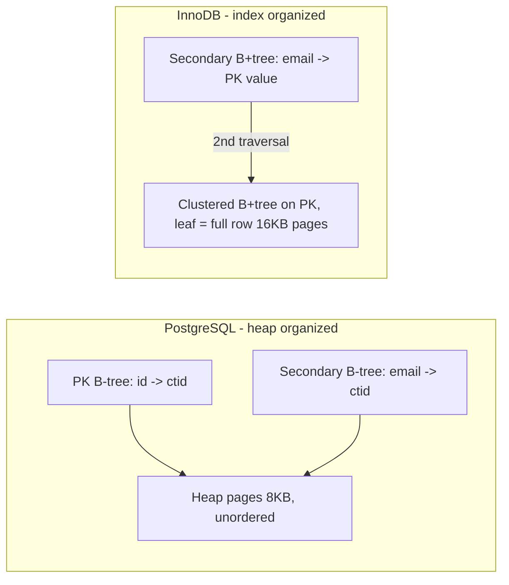
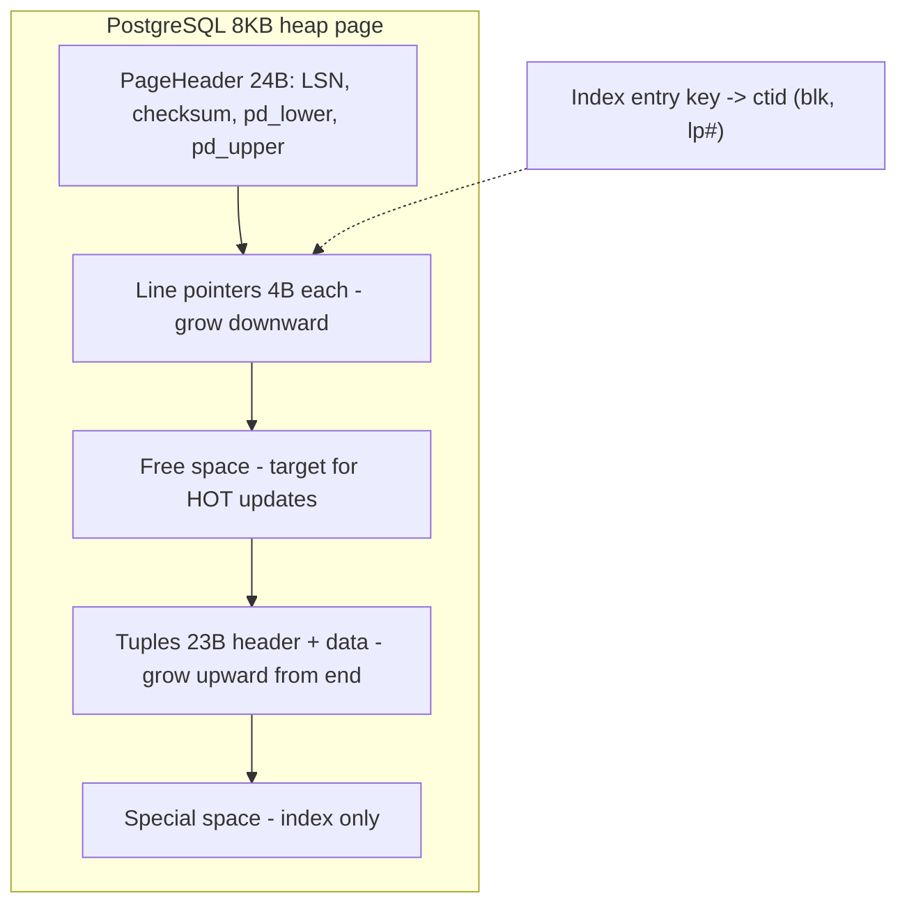
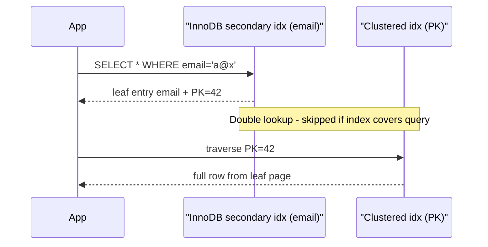
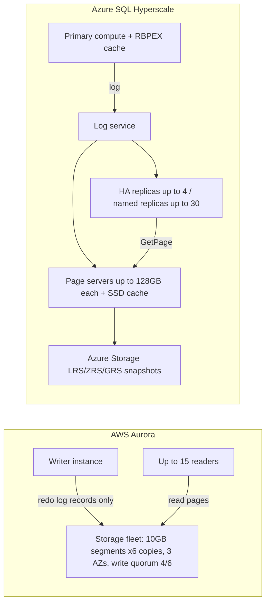

# B2 Understanding Database Internals
> Last verified: 2026-10 · Audience: senior/staff DevOps, SRE, AI eng, NetEng, DevSecOps, architects

## TL;DR
- A database reads and writes **whole pages**, not rows: **8 KB in PostgreSQL and SQL Server, 16 KB by default in InnoDB**. Every cost model (I/O, buffer pool hit ratio, WAL volume, index fan-out) is counted in pages.
- **Heap table** (Postgres, SQL Server without a clustered index): rows sit in no particular order, and every index points to a physical **tuple ID**, `ctid = (block, line-pointer)`. **Clustered or index-organized table** (InnoDB, SQL Server clustered index, Oracle IOT): the table *is* the primary-key B+tree, and its leaf pages hold the full rows.
- In InnoDB, **secondary indexes store the PK value, not a row pointer**. A secondary lookup therefore walks two B+trees (secondary, then clustered). Long PKs make every secondary index bigger, and random PKs (UUIDv4) cause page splits.
- In Postgres, **an UPDATE writes a new tuple version** (MVCC) with a new ctid, so every index needs a new entry. The exception is a **HOT** update: no indexed column changed and the page has free space. That is where `fillfactor` matters.
- **Row stores suit OLTP** (point reads and writes of whole rows). **Column stores suit OLAP** (scan a few columns of billions of rows). They win through column pruning, **about 10x compression** (same-type values), **zone-map or segment elimination**, and **vectorized (batch) execution**, which Microsoft documents as about 2–4x on its own.
- Parquet is the open on-disk columnar format: file → **row groups** → **column chunks** → **pages**, with a footer of min/max stats. Redshift (1 MB blocks), Snowflake micro-partitions, BigQuery Capacitor, Fabric Warehouse (Delta/Parquet) and SQL Server columnstore (rowgroups of 1,048,576 rows) all apply the same idea.
- In the cloud, **compute/storage separation** works at the page or log level. **Aurora** ships only redo log records to a 6-copy, 3-AZ storage fleet (write quorum 4/6) and holds up to 128 or 256 TiB. **Azure SQL Hyperscale** puts **page servers** (≤128 GB each) behind a log service and holds up to 128 TB. Both let you add replicas without copying data.

## B2.1 How tables and indexes are stored on disk
- **How it works (PostgreSQL, heap-organized):**
  - Each table or index is a **relation** made of files in `$PGDATA/base/<db_oid>/<relfilenode>`. Files split into **1 GB segments** (`.1`, `.2`, …). The extra forks are `_fsm` (free space map), `_vm` (visibility map) and `_init` (unlogged tables).
  - A table is a **heap**: an unordered set of 8 KB pages. A new row goes wherever the FSM finds room.
  - **Tuple ID = `ctid`** = (block number, line-pointer index), stored in 6 bytes. It stays valid across in-page compaction because indexes point at the **line pointer** (4 B), not at the byte offset.
  - Each tuple carries a **23 B header**: `xmin`, `xmax`, `cmin/cmax`, `t_ctid` (points to the newer version), infomask and a null bitmap. Visibility is checked against that header, which is the MVCC part. See [B7](./B7-concurrency-control.md).
  - **All indexes are secondary.** The PK is just a unique B-tree whose entries are `(key → ctid)`. Any index lookup that needs non-indexed columns does a **heap fetch**.
  - `CLUSTER` reorders the heap **once** and does not maintain that order afterwards, so Postgres has no real clustered table. Use **BRIN** for naturally ordered data such as append-only timestamps.
  - **TOAST:** when a row exceeds about **2 KB** (`TOAST_TUPLE_THRESHOLD`), wide values are compressed (pglz or lz4) and/or moved out of line into a TOAST table in about 2 KB chunks. An 18-byte pointer stays in the row. A single field can be at most **1 GB**. Strategies are PLAIN, EXTENDED (default), EXTERNAL and MAIN.
  - **Index-only scan** works only if the index covers all columns *and* the **visibility map** marks the page all-visible. Otherwise Postgres still fetches the heap. VACUUM sets VM bits. `INCLUDE` columns make covering indexes. See [B3](./B3-database-indexing.md).
- **How it works (InnoDB, index-organized):**
  - The table *is* the **clustered index**, a B+tree on the PK whose leaf pages hold the full row plus the hidden `DB_TRX_ID` (6 B) and `DB_ROLL_PTR` (7 B) columns. Old versions live in **undo logs**, not in the table.
  - **How the clustered key is chosen:** the PRIMARY KEY; otherwise the first UNIQUE index with all columns NOT NULL; otherwise a hidden **`GEN_CLUST_INDEX`** on a 6-byte monotonically increasing row ID. **Always define a PK.**
  - Tablespaces default to file-per-table `.ibd`. Pages are grouped into **extents** of 1 MB (64 × 16 KB pages).
  - Large BLOB, TEXT and VARCHAR values go off-page (DYNAMIC row format). A row must fit in roughly half a page in-row.
- **How it works (SQL Server):**
  - A table is either a **heap** (rows located by an 8-byte **RID** = file:page:slot; updates that outgrow the page leave **forwarded records**) or a **clustered index** (B+tree; nonclustered indexes carry the clustering key, plus a 4-byte **uniquifier** if the key is non-unique).
  - Pages are 8 KB. An **extent** is 8 pages (64 KB). A row can be at most **8,060 B** in-row.
- **Oracle:** heap by default, with ROWID pointers. **IOT** (index-organized table) is the clustered variant.
- **Write path, common to all of them:** modify the page in the **buffer pool** → append to **WAL/redo** (durable on commit, see [B1.5](./B1-acid.md#b15-durability-wal-fsync)) → a checkpoint or background writer flushes dirty pages later.



- **Trade-offs / when to use:**

| Aspect | Heap + ctid/RID (PG, SQL Server heap) | Clustered / IOT (InnoDB, SQL Server CI) |
|---|---|---|
| PK point lookup | index traversal + 1 heap page | one traversal (row in leaf) |
| Secondary lookup | index → heap (1 hop) | secondary → **PK traversal** (extra 3–4 page reads, usually cached) |
| PK range scan | random heap I/O unless correlated | sequential leaf pages, which is excellent |
| Update of non-key column | PG: new tuple version, all indexes touched unless HOT | in-place plus undo, secondary indexes untouched |
| Row moves (page split) | indexes would need repointing (PG avoids moves) | secondaries unaffected because they hold the PK |
| Insert with random key | heap appends anywhere, cheap | **page splits**, fragmentation, larger buffer pool footprint |
| Secondary index size | small pointer (6–8 B) | grows with **PK width** |

- **Interview angles:**
  - "Why did Uber move from Postgres to MySQL (2016)?" → **write amplification**. Every non-HOT update in PG adds entries to *every* index and WAL-logs them, while InnoDB secondaries point to the PK and stay unchanged when non-key columns change. Mention the counterweights: HOT, `fillfactor`, and fewer indexes.
  - "Bloat?" → PG dead tuples stay in the heap until **VACUUM**. InnoDB keeps old versions in undo, and the purge thread cleans them up. A long-running transaction blocks cleanup in both.
  - "Where does MVCC live?" → PG keeps it in-heap (tuple versions). InnoDB, Oracle and SQL Server RCSI keep it out-of-line (undo or the tempdb version store).
  - Pitfall: in SQL Server, a heap with heavy updates collects forwarded records, so add a clustered index. In InnoDB, a table without a PK uses the hidden row ID, which is a global mutex hotspot in older versions and leaves you no usable key.

## B2.2 Row-Based vs Column-Based Databases
- **How it works:**
  - **Row store (NSM):** all columns of a row are contiguous in a page. One I/O fetches a whole record. Best for `SELECT * WHERE id=?`, INSERT and UPDATE. Examples: Postgres, MySQL/InnoDB, SQL Server rowstore, Oracle.
  - **Column store (DSM):** each column is stored contiguously, and rows are reassembled by position, which is called **late materialization**. A query reads only the referenced columns. With 100 columns and 5 queried, it reads about 5% of the bytes (the Redshift docs example).
  - **Compression:** values from the same domain sit side by side, so engines use **dictionary, RLE, delta, bit-packing, frame-of-reference**, then a general codec (ZSTD, LZ4, Snappy). Typical ratio is **about 10x** (Microsoft columnstore docs). Some operators run on compressed data directly.
  - **Zone maps / segment elimination:** min/max metadata per block or segment lets the engine skip data. Redshift uses **1 MB blocks** with zone maps, SQL Server columnstore uses segment metadata, Parquet uses row-group stats, and Snowflake uses micro-partition pruning. Sorting or clustering the data (Redshift sort keys, ordered CCI, Delta Z-order or liquid clustering) is what makes pruning effective.
  - **Vectorized (batch) execution:** operators process batches of about 1K–2K values per call, which uses SIMD, keeps data in cache, and avoids per-row virtual calls (the Volcano model). SQL Server **batch mode** documents about **2–4x** on its own. Other examples: DuckDB, ClickHouse, Databricks **Photon**, Snowflake, BigQuery.
  - **Writes are expensive:** compressed segments are immutable, so engines buffer writes in a **delta store** and merge later. SQL Server deltastore rowgroups compress at **1,048,576 rows**, and bulk loads under 102,400 rows land in the deltastore. Redshift and Snowflake rewrite whole blocks or micro-partitions. Delta and Iceberg use copy-on-write or merge-on-read with deletion vectors.
  - **Parquet layout:** file → **row groups** (the spec recommends 512 MB–1 GB) → **column chunks** → **pages** (the spec recommends 8 KB, though writers such as parquet-mr default to about 1 MB). The **footer** holds the schema and min/max stats. A row-group-in-columns design is a **hybrid (PAX)** layout. ORC is similar, with stripes. Table formats (Delta, Iceberg, Hudi) add a transaction log on top. See [M1](../M-data-platforms/M1-lakehouse-table-formats.md).
- **Trade-offs / when to use:**

| | Row store | Column store |
|---|---|---|
| Workload | OLTP: point reads, short transactions, high concurrency | OLAP: scans, aggregates, star schemas |
| Read 1 row, all columns | 1 page | N column reads (one per column/segment) |
| Aggregate 1 column over 1B rows | reads every byte of every row | reads 1 column, compressed and pruned |
| Single-row INSERT/UPDATE | cheap, in place | expensive (delta store, rewrite, tombstone) |
| Compression | modest (page/row, TOAST) | high (about 10x) |
| Indexing | B+trees essential | mostly zone maps/sort keys, few or no B-trees |

- **HTAP / middle ground:** SQL Server **nonclustered columnstore on a rowstore table** (real-time operational analytics), Aurora MySQL **parallel query**, GCP AlloyDB columnar engine, PG extensions (Citus columnar). In the managed-service world the usual pattern is **zero-ETL replication** (Aurora → Redshift zero-ETL, Azure SQL / Cosmos / PG → **Fabric Mirroring**).
- **Interview angles:**
  - "Why not run analytics on the primary OLTP DB?" → full scans evict the buffer pool, hold MVCC snapshots (bloat/undo), and compete for CPU and I/O. Offload to a read replica (still row-format) or to a columnar warehouse or lakehouse through CDC or zero-ETL.
  - "Why is `SELECT *` bad on Redshift, Snowflake or BigQuery?" → it defeats column pruning, and BigQuery on-demand billing charges by bytes scanned per column.
  - "Why do small files hurt?" → tiny Parquet files or row groups mean poor compression, too much metadata, and less parallelism per file. Compact them (OPTIMIZE, bin-packing).
  - Follow-up: a column store's "index" is the **sort order plus zone maps**. Choosing sort, distribution or partition keys is the physical design work.

## B2.3 Primary Key vs Secondary Key
- **How it works:**
  - The **primary key** is the logical unique, NOT NULL identity of a row. Physically it is the **clustered index** in InnoDB and in SQL Server (by default), and **just another unique B-tree** pointing to ctid in Postgres.
  - A **secondary key or index** is any other index, unique or not.
    - **InnoDB:** the leaf entry is `(secondary cols, PK cols)`. A lookup goes secondary B+tree → PK value → **clustered B+tree traversal** (the "double lookup" or "bookmark lookup"). It is avoided when the secondary index covers the query, and PK columns are implicitly part of every secondary index, so `INDEX(email)` covers `SELECT id, email`.
    - **Postgres:** the leaf entry is `(key, ctid)`. Lookup is index → heap page, plus a visibility check unless an index-only scan applies.
    - **SQL Server:** a nonclustered index on a clustered table gives **key lookup** into the CI. On a heap it gives **RID lookup**. Fix with `INCLUDE` columns.
- **PK choice drives physical behaviour (InnoDB and SQL Server CI):**
  - **Auto-increment / sequential (BIGINT, UUIDv7, ULID):** appends to the right-most leaf, so pages are about **15/16 full** (InnoDB leaves 1/16 free). It gives good cache locality, but the last page can become a hot spot under extreme concurrent insert.
  - **Random UUIDv4:** inserts land anywhere, causing page splits, pages only **½ to 15/16 full**, a larger working set and more I/O. In InnoDB it also widens every secondary index (16 B binary, or 36 B if stored as CHAR). PostgreSQL 18 ships a native `uuidv7()`.
  - **Wide composite natural keys** get copied into every secondary index (InnoDB docs: "advantageous to have a short primary key").
- **Trade-offs / when to use:**
  - Use a **surrogate BIGINT or UUIDv7 PK** plus a **UNIQUE secondary** on the natural key. Use UUIDs when IDs are generated client-side or across shards (see [B6](./B6-database-sharding.md)).
  - In InnoDB, put the most common range-scan dimension *first* in a composite PK (e.g. `(tenant_id, id)`) so a tenant's rows are physically contiguous.
  - Covering indexes trade write amplification and storage for avoiding the second lookup.
- **Interview angles:**
  - "Same query, why is it slower on MySQL via the secondary index than via the PK?" → double traversal. Make the index covering or query by PK.
  - "Can a Postgres index survive a row update without changing?" → only on HOT updates. Otherwise the new tuple gets a new ctid and every index gets a new entry.
  - "Does a PK guarantee physical order?" → in InnoDB and SQL Server CI, logically yes (leaf linked list), though pages may be fragmented on disk. In Postgres, no.
  - Pitfall: indexing low-selectivity columns. A secondary lookup returning more than a few % of rows usually loses to a scan (see [B3.3](./B3-database-indexing.md)).

## B2.4 Database Pages
- **How it works:**
  - A **page (block)** is the unit of I/O, caching, locking granularity (for latches) and WAL/redo references.
  - **PostgreSQL:** **8 KB**, fixed at compile time (`--with-blocksize`, 1–32 KB), one size per cluster. Layout:
    - **24 B header** (`pd_lsn`, checksum, flags, `pd_lower`, `pd_upper`, `pd_special`, version, `pd_prune_xid`)
    - **line-pointer array** of 4 B each, growing down
    - free space
    - **tuples**, growing up from the end
    - **special space** at the end (used by indexes, e.g. B-tree sibling links)
  - **InnoDB:** **16 KB default**. `innodb_page_size` can be 4, 8, 16, 32 or 64 KB, set at initialization and never changeable. Pages carry a FIL header and trailer (checksum, LSN) and a page directory of slots for binary search. `innodb_fill_factor` applies to sorted index builds, and the merge threshold defaults to 50%.
  - **SQL Server:** **8 KB** pages (96 B header, slot array at the end), 64 KB extents.
  - **Analytic engines use much bigger blocks:** Redshift 1 MB, Parquet row groups of hundreds of MB, Snowflake micro-partitions of 50–500 MB uncompressed.
- **Page lifecycle:** read into the **buffer pool** (PG `shared_buffers` plus the OS page cache, a "double buffering" effect; InnoDB `innodb_buffer_pool_size`, typically 50–75% of RAM, often with O_DIRECT) → modify → mark dirty → WAL first → **checkpoint** flushes it.
- **Torn-page protection:** a 16 KB or 8 KB page is bigger than the 4 KB atomic sector or FS block, so a crash can half-write it.
  - **PG `full_page_writes`** logs the whole page image on the first change after each checkpoint.
  - **InnoDB doublewrite buffer** writes pages to a doublewrite area first.
  - **Aurora** avoids both because storage applies redo log records itself.
  - See [A6](../A-operating-systems/A6-storage-management.md).
- **Fill factor and free space:**
  - PG table `fillfactor` defaults to **100** (range 10–100). B-tree indexes default to 90.
  - Lowering the table fillfactor (e.g. 70–90) on update-heavy tables leaves room for **HOT** updates, which avoid new index entries and allow in-page pruning without VACUUM. Track `n_tup_hot_upd` in `pg_stat_all_tables`.
- **Page splits** (B+tree): a full leaf splits into two half-full pages, and the parent gets a new separator key, which can cascade up the tree. Splits cost latency, WAL volume and space. See [B4](./B4-btree-vs-bplustree.md).
- **Trade-offs:**
  - **Bigger pages** give higher B-tree fan-out (fewer levels) and better sequential scans, but more read amplification for point lookups, more buffer pool waste on random access, and more lock or latch contention per page.
  - **Smaller pages** have the opposite trade-offs. They also suit compressed tables in InnoDB (`KEY_BLOCK_SIZE`).
  - OLTP stays at 8–16 KB. OLAP moves to MB-scale blocks.
- **Interview angles:**
  - "Estimate B-tree depth" → 8 KB page, about 16 B per entry, gives fan-out of about 400–500. Three levels reach about 100M keys and four levels about 50B, so a lookup is about 3–4 page reads with the root and inner pages cached.
  - "Why does `SELECT count(*)` on a large PG table take so long?" → it must scan the heap pages (or an index-only scan with the VM) because there is no stored row count under MVCC.
  - "Aurora and Postgres page size?" → Aurora PG is still 8 KB pages at the engine level, but the network ships only log records. Hyperscale page servers serve 8 KB pages over the network, backed by RBPEX SSD caches.



## Diagrams





## Cloud mapping: AWS vs Azure

| Capability | AWS | Azure | Role it plays | Key differences | Alternatives |
|---|---|---|---|---|---|
| Managed row-store OLTP (Postgres/MySQL) | RDS for PostgreSQL / MySQL | Azure Database for PostgreSQL – Flexible Server / Azure Database for MySQL – Flexible Server | Classic engine on block storage (EBS / managed disks); heap (PG) or clustered (InnoDB) | Both run a primary plus standby with a synchronous replica (RDS Multi-AZ; Azure zone-redundant HA). Storage is per instance, so replicas copy the data | Self-managed on K8s (CloudNativePG, Percona operators), GCP Cloud SQL |
| Cloud-native, storage-disaggregated OLTP | **Aurora** (MySQL/PG compatible) | **Azure SQL Database Hyperscale** (SQL Server engine) | Shared log-structured storage; add readers without copying data | Aurora: 6 copies in 3 AZs, 10 GB segments, max **128 TiB, or 256 TiB** on newer versions, 15 replicas. Hyperscale: page servers ≤128 GB each, log service, **128 TB**, 4 HA plus 30 named replicas, snapshot backups | AlloyDB (GCP), Neon (PG, page servers + safekeepers), Aurora DSQL / CockroachDB / Spanner for distributed SQL |
| Scale-out Postgres | Aurora Limitless Database (shard groups) | Azure DB for PostgreSQL **elastic clusters** (Citus) / Azure Cosmos DB for PostgreSQL (legacy) | Horizontal sharding of the row store | Different shard routers; both are PG-compatible | Citus self-managed, Yugabyte |
| Columnar data warehouse (OLAP) | **Amazon Redshift** (RA3 / Serverless, managed storage) | **Microsoft Fabric Data Warehouse** (Delta Parquet in OneLake); **Azure Synapse dedicated SQL pool** is legacy, with Fabric the recommended path | MPP column store, 1 MB blocks / Parquet, zone maps, vectorized engine | Redshift uses proprietary block storage with sort and dist keys. Fabric Warehouse stores open Delta files with no-knobs autonomous workload management. Synapse uses CCI with 60 distributions | **Snowflake**, **Databricks SQL** (Photon over Delta), **BigQuery** |
| Serverless SQL over open files (Parquet) | Athena, Redshift Spectrum | Fabric SQL analytics endpoint / Synapse serverless SQL pool | Query Parquet/Delta/Iceberg in object storage | Athena bills per TB scanned. Fabric bills by capacity units | Databricks SQL, Trino/Starburst, DuckDB |
| OLTP → OLAP without ETL | Aurora / RDS **zero-ETL integration** to Redshift | **Fabric Mirroring** (Azure SQL, PG, Cosmos DB, Snowflake → OneLake) | Near-real-time CDC into the columnar store | Zero-ETL targets Redshift. Mirroring lands open Delta in OneLake | Debezium + Kafka, Databricks Lakeflow Connect |
| HTAP in one engine | Aurora MySQL parallel query | Azure SQL nonclustered columnstore index | Analytics directly on OLTP data | NCCI is a true columnar copy. Parallel query pushes scans down to Aurora storage | AlloyDB columnar engine |

- **RDS vs Aurora:** RDS PG/MySQL keeps the stock storage engine (8 KB heap pages or 16 KB InnoDB pages, full_page_writes or doublewrite) on EBS, and Multi-AZ uses synchronous block replication to a standby. **Aurora** removes checkpoints, the doublewrite buffer and full-page writes from the engine because storage nodes apply redo. Reader lag is typically tens of ms because readers share the volume. Choose **I/O-Optimized** when I/O is ≥25% of the bill.
- **Hyperscale vs Aurora:** both decouple compute from storage, but Hyperscale exposes a **page-server tier** (pages served over the network, with an RBPEX SSD cache at both compute and page servers). Aurora's storage is a quorum-replicated log-applying fleet. Hyperscale backups are **storage snapshots**, so restore time does not depend on size. Its storage redundancy (LRS/ZRS/GZRS) is chosen at creation and fixed for life.
- **Redshift vs Fabric Warehouse vs Synapse:** Redshift and Synapse dedicated pools are provisioned or serverless MPP engines with proprietary columnar storage. Fabric Warehouse is SaaS over **open Delta/Parquet**, so the same files can be read by Spark or Power BI Direct Lake. As of 2026 Microsoft points Synapse dedicated SQL pool users to Fabric through the **Fabric Migration Assistant**.
- **Azure SQL Database (non-Hyperscale)** is SQL Server with 8 KB pages and clustered or heap tables. Columnstore indexes are available in General Purpose and Business Critical tiers too.
- **Alternatives:** Snowflake (micro-partitions, cross-cloud), Databricks SQL (Photon, Delta, Unity Catalog), BigQuery (Capacitor, slot or bytes-scanned billing). For OLTP on Kubernetes, use CloudNativePG.

## Hands-on (optional)
```bash
# Postgres: see ctid change after UPDATE, page header, HOT stats
docker run -d --name pg -e POSTGRES_PASSWORD=pw postgres:18
docker exec -it pg psql -U postgres -c "CREATE TABLE t(id int primary key, v text) WITH (fillfactor=80); INSERT INTO t SELECT g, 'x' FROM generate_series(1,1000) g;"
docker exec -it pg psql -U postgres -c "SELECT ctid,* FROM t WHERE id=1; UPDATE t SET v='y' WHERE id=1; SELECT ctid,* FROM t WHERE id=1;"
docker exec -it pg psql -U postgres -c "SELECT n_tup_upd, n_tup_hot_upd FROM pg_stat_user_tables WHERE relname='t';"
docker exec -it pg psql -U postgres -c "SELECT pg_relation_filepath('t'), current_setting('block_size');"
docker exec -it pg psql -U postgres -c "CREATE EXTENSION pageinspect; SELECT * FROM page_header(get_raw_page('t',0));"

# MySQL: page size and secondary-index double lookup in EXPLAIN
docker run -d --name my -e MYSQL_ROOT_PASSWORD=pw mysql:8.4
docker exec -it my mysql -uroot -ppw -e "SELECT @@innodb_page_size, @@innodb_fill_factor;"
```

## Cross-links
- [B1.5 Durability (WAL, fsync)](./B1-acid.md#b15-durability-wal-fsync)
- [B3 Database Indexing](./B3-database-indexing.md) (index-only scans, covering, planner)
- [B4 B-tree vs B+tree](./B4-btree-vs-bplustree.md) (fan-out, page splits)
- [B7 Concurrency Control](./B7-concurrency-control.md) (MVCC, locks)
- [B8 Database Replication](./B8-database-replication.md) (Aurora and Hyperscale replicas)
- [B10 Database Engines](./B10-database-engines.md) (InnoDB vs MyISAM vs RocksDB/LSM)
- [A6 Storage Management](../A-operating-systems/A6-storage-management.md) (page cache, fsync, O_DIRECT)
- [M1 Lakehouse table formats](../M-data-platforms/M1-lakehouse-table-formats.md) · [M7 Data warehouses](../M-data-platforms/M7-data-warehouses.md)
- [C1 Performance](../C-large-scale-architecture/C1-performance.md)

## Sources
- https://www.postgresql.org/docs/current/storage-page-layout.html
- https://www.postgresql.org/docs/current/storage-toast.html
- https://www.postgresql.org/docs/current/storage-hot.html
- https://www.postgresql.org/docs/current/indexes-index-only-scans.html
- https://www.postgresql.org/docs/current/sql-createtable.html
- https://dev.mysql.com/doc/refman/8.4/en/innodb-index-types.html
- https://dev.mysql.com/doc/refman/8.4/en/innodb-physical-structure.html
- https://learn.microsoft.com/en-us/sql/relational-databases/indexes/columnstore-indexes-overview
- https://learn.microsoft.com/en-us/azure/azure-sql/database/hyperscale-architecture
- https://learn.microsoft.com/en-us/fabric/data-warehouse/data-warehousing
- https://learn.microsoft.com/en-us/fabric/data-warehouse/migration-synapse-dedicated-sql-pool-warehouse
- https://docs.aws.amazon.com/AmazonRDS/latest/AuroraUserGuide/Aurora.Overview.html
- https://docs.aws.amazon.com/AmazonRDS/latest/AuroraUserGuide/Aurora.Overview.StorageReliability.html
- https://docs.aws.amazon.com/AmazonRDS/latest/AuroraUserGuide/CHAP_Limits.html
- https://aws.amazon.com/blogs/database/amazon-aurora-under-the-hood-reducing-costs-using-quorum-sets/
- https://docs.aws.amazon.com/redshift/latest/dg/c_columnar_storage_disk_mem_mgmnt.html
- https://parquet.apache.org/docs/file-format/configurations/
