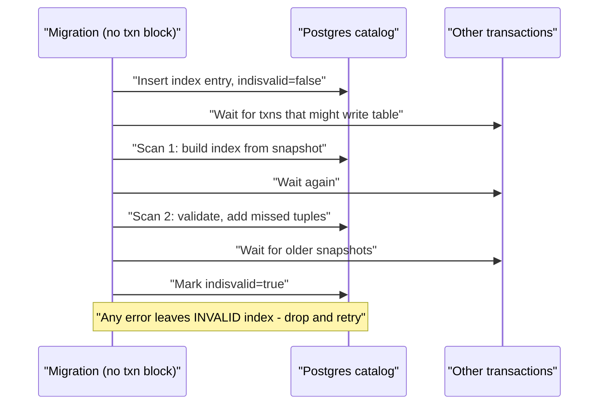
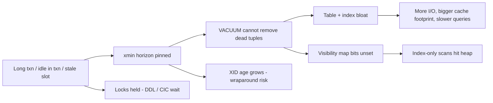
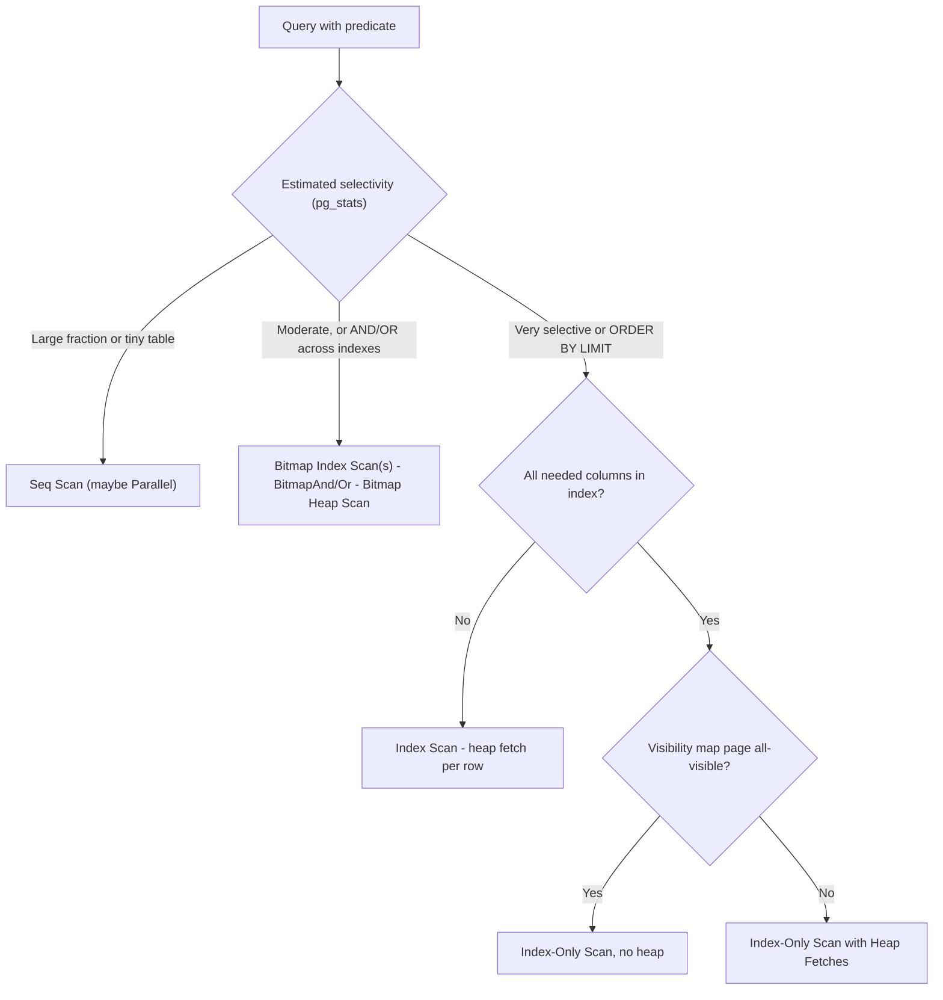

# B3 Database Indexing
> Last verified: 2026-10 · Audience: senior/staff DevOps, SRE, AI eng, NetEng, DevSecOps, architects

## TL;DR
- An index is a **second, sorted data structure** (usually a **B+tree**) that trades write cost, storage and memory for faster reads. Every extra index slows `INSERT`/`UPDATE`, takes buffer-cache space and needs maintenance (bloat, vacuum, stats).
- The **cost-based optimizer** decides whether to use an index. It relies on **statistics** (row counts, distinct values, most-common values, histograms, physical **correlation**) and cost settings such as `random_page_cost`. Plans go wrong when the **estimated rows** do not match the **actual rows**. Always read the plan with `EXPLAIN (ANALYZE, BUFFERS)`.
- Postgres scan types depend on how many rows match. **Index Scan** fits few rows, or `ORDER BY … LIMIT`. **Bitmap Heap Scan** fits a medium number of rows and can combine indexes with BitmapAnd/BitmapOr. **Seq Scan** fits a large share of the table. **Index-Only Scan** fits when every column the query needs is in the index and the **visibility map** marks the heap pages all-visible.
- Order columns in a composite index **Equality → Sort → Range**. Only a leftmost prefix is usable (PG 18 adds **skip scan**, and MySQL has had it since 8.0.13). Use `INCLUDE` for **non-key payload columns** to get covering indexes without widening the key.
- On a live system, build indexes with `CREATE INDEX CONCURRENTLY`. It does two heap scans, waits for older transactions, cannot run inside a transaction block, and leaves an **INVALID** index if it fails.
- **Random UUIDv4 keys** spread inserts across the whole B+tree. This causes page splits, cache misses, WAL full-page-image amplification and fragmentation, and it hurts most on clustered PKs (InnoDB, SQL Server). Use **UUIDv7/ULID** (time-ordered) or `bigint` identity instead. Postgres 18 ships a native `uuidv7()`.
- **Long-running or idle-in-transaction sessions** hold back the **xmin horizon**. VACUUM then cannot remove dead tuples, so tables and indexes bloat, index-only scans fall back to the heap, and the XID-wraparound risk grows. Mitigate with timeouts and monitoring.
- For **billion-row tables**, avoid full scans entirely. Use time-based **partitioning**, **BRIN** or **partial** indexes, rollups, keyset pagination, batched backfills, and finally sharding or columnar stores.

## B3.1 Getting Started with Indexing
- **How it works:**
  - The default index is a **B+tree**. Internal pages hold separator keys, and **leaf pages** hold `(key → row pointer)`. Postgres row pointers are TIDs `(block, offset)`. In InnoDB secondary indexes, the pointer is the **primary key value**. Depth is usually 3–4 levels even at 10^9 rows, because fan-out is in the hundreds. See [B4](./B4-btree-vs-bplustree.md).
  - Postgres index types:
    - **B-tree:** `= < > BETWEEN`, prefix `LIKE 'abc%'` with `C` collation or `text_pattern_ops`, sorting.
    - **Hash:** `=` only.
    - **GIN:** arrays, JSONB, full-text.
    - **GiST/SP-GiST:** geo, ranges, kNN.
    - **BRIN:** block-range min/max summaries for huge append-ordered tables.
    - **bloom** (contrib).
  - Other variants: **partial index** (`WHERE status='active'`), **expression index** (`lower(email)`), **unique index**, `NULLS NOT DISTINCT` (PG 15+).
  - Postgres stores the table as an **unordered heap**, and all indexes are secondary. InnoDB and SQL Server use a **clustered** PK (see [B3.13](#b313-clustered-index-design)).
- **Trade-offs / when to use:**
  - Each index adds write amplification on every INSERT and on any UPDATE that touches an indexed column. In Postgres, an update to any indexed column also prevents **HOT** (heap-only tuple) updates.
  - Index columns used in WHERE/JOIN/ORDER BY that are **selective**. A boolean column with 50/50 values is a poor candidate unless you use a partial index on the rare value.
  - Postgres does **not** auto-index foreign keys. A missing FK index means slow `DELETE` on the parent table, because each delete scans the child table.
- **Interview angles:**
  - "Why not index every column?" → write cost, memory pressure, planner choice overhead, vacuum work, lost HOT updates.
  - "Index on `lower(email)` is not used" → the query must use the identical expression. Also check collation and implicit casts (e.g., `varchar` vs `int` mismatch).
  - `LIKE '%abc'` cannot use a B-tree. Use `pg_trgm` with GIN.
  - Find unused indexes with `pg_stat_user_indexes.idx_scan = 0`. Check replicas too before dropping, because the counters are per node.

## B3.2 Understanding the SQL Query Planner and Optimizer with Explain
- **How it works:**
  - `EXPLAIN` shows the **estimated** plan. `EXPLAIN ANALYZE` **executes** the query and adds actual time, rows and loops. Wrap DML in `BEGIN … ROLLBACK`.
  - In PG 18, `EXPLAIN ANALYZE` includes `BUFFERS` output by default, and PG 18 also reports "Index Searches" (relevant to skip scan).
  - PG 19 adds an `IO` option for async I/O stats. PG 19 was still in beta as of the 2026-09-14 release notes; GA status is (unverified).
- **Reading a node:**

  | Field | Meaning | What to look for |
  |---|---|---|
  | `cost=0.43..8.45` | startup..total, in arbitrary units (seq page = 1.0) | high startup → blocking sort/hash |
  | `rows=` (estimate) vs `actual rows=` | cardinality estimate vs reality | **10×+ mismatch = stats problem**, the root cause of most bad plans |
  | `loops=N` | node executed N times (nested loop inner) | actual time and rows are **per loop**, so multiply by loops |
  | `Rows Removed by Filter` | rows fetched then discarded | big number → missing or wrong index |
  | `Buffers: shared hit/read/dirtied` | 8 KB pages from cache vs disk | `read` high → cold cache / I/O bound |
  | `Heap Fetches` (Index Only Scan) | heap visits due to VM bits not set | high → vacuum lagging |
  | `Recheck Cond`, `lossy=` | bitmap went lossy (work_mem) | raise `work_mem` or narrow predicate |
  | `Sort Method: external merge Disk:` | sort spilled | raise `work_mem` for that session |

  - Read the tree **inside-out and bottom-up**. The most-indented nodes run first, and costs are cumulative.
  - Join types:
    - **Nested Loop:** small outer side plus an indexed inner side.
    - **Hash Join:** large, unsorted inputs, equality only.
    - **Merge Join:** both inputs already sorted.
- **Tooling:**
  - **`pg_stat_statements`** finds the top queries by total time.
  - **`auto_explain`** (`log_min_duration`) captures plans in production.
  - MySQL: `EXPLAIN FORMAT=TREE`, `EXPLAIN ANALYZE` (8.0.18+), and the `type` column (`const`, `ref`, `range`, `index` = full index scan, `ALL` = full table scan). `Extra: Using index` means covering, and `Using filesort` means the sort is not served by an index.
- **Interview angles:**
  - "Query is slow in prod, fast in staging" → different statistics, data distribution, cache state or parameters. Generic vs custom prepared plans: Postgres switches to a generic plan after 5 executions if it is not costlier, and you can control this with `plan_cache_mode`.
  - Never run `EXPLAIN ANALYZE` of a destructive statement outside a rolled-back transaction.

## B3.3 Bitmap Index Scan vs Index Scan vs Table Scan
- **How it works:**
  - **Seq Scan:** reads every heap page sequentially. This is cheap per page (`seq_page_cost=1.0`) and benefits from read-ahead. It is chosen when a large fraction of rows match or the table is tiny.
  - **Index Scan:** walks the B+tree and fetches the heap tuple for each match **in index order**. Each fetch is potentially a random I/O (`random_page_cost=4.0` by default; set about 1.1 on SSD/NVMe). It is ideal for very selective lookups or `ORDER BY idx_col LIMIT n`.
  - **Bitmap Index Scan → Bitmap Heap Scan:** first collects all matching TIDs into an in-memory **bitmap** sorted by page. It then reads heap pages **in physical order**, each page once. If the bitmap exceeds `work_mem`, it degrades to **lossy** (page-level) entries and must **recheck** the condition. Output is not in index order.
- **When the planner picks each:**

  | Fraction of rows matched (rough, depends on correlation) | Typical choice |
  |---|---|
  | very few (<~1%) or LIMIT + ORDER BY index | Index Scan |
  | moderate (~1–20%) or multiple indexes ORed/ANDed | Bitmap scan |
  | large (>~20%) / small table | Seq Scan |

- **Trade-offs:**
  - High **correlation** (heap order matches index order, e.g., append-only `created_at`) makes plain index scans cheap even for larger ranges.
  - Parallel Seq Scans can beat index plans on analytics queries.
- **Interview angles:**
  - "Why did Postgres ignore my index?" → low selectivity, stale stats, type or collation mismatch, function wrapped around the column, `random_page_cost` too high for SSD, or the table is small.
  - Do not fix this with `enable_seqscan=off` in production. Use it only as a diagnostic.

## B3.4 Key vs Non-Key Column Database Indexing
- **How it works:**
  - **Key columns** are part of the B+tree ordering. They are used for search, range and sort, and stored at all levels.
  - **Non-key (included) columns** are stored only in **leaf** entries as payload. Supported in Postgres 11+ `INCLUDE`, SQL Server `INCLUDE`, and Azure SQL. MySQL InnoDB has no `INCLUDE`, but secondary indexes implicitly carry the PK columns.
  - In Postgres, INCLUDE works with **B-tree, GiST and SP-GiST** only. Included columns cannot be expressions and need no operator class. Uniqueness applies to key columns only, e.g., `UNIQUE (x) INCLUDE (y)` enforces unique `x`.
  - B-tree **suffix truncation** keeps upper levels small because non-key columns never appear in internal pages.
- **Trade-offs:**
  - Covering indexes avoid heap lookups but duplicate data and grow the index.
  - Wide INCLUDE columns bloat the index and **disable B-tree deduplication** in Postgres.
  - Do not put frequently updated columns in INCLUDE, because every update must also update the index and HOT updates are lost.
- **Interview angles:**
  - "Composite `(a,b)` vs `(a) INCLUDE (b)`?" → use composite if you filter or sort by `b`. Use INCLUDE if `b` is only selected, or when you want uniqueness on `a` alone.

## B3.5 Index Scan vs Index Only Scan
- **How it works:**
  - An **Index-Only Scan** answers a query from the index alone when every referenced column is in the index (key or INCLUDE).
  - Because of MVCC, Postgres indexes do **not** store visibility info. The executor checks the **visibility map (VM)**. If the heap page is **all-visible**, it skips the heap. Otherwise it fetches the heap tuple, counted as `Heap Fetches: N`.
  - The VM is about 4 orders of magnitude smaller than the heap. It is set by **VACUUM** and by `COPY … FREEZE`. PG 19 lets ordinary scans also set VM bits.
  - B-tree always supports index-only scans. GiST/SP-GiST support them for some operator classes, and **GIN never does**.
  - Expression index caveat: for `SELECT f(x)` with an index on `f(x)`, the planner will not choose an index-only scan unless `x` is also included: `(f(x)) INCLUDE (x)`.
- **Trade-offs:** index-only scans are great on read-mostly or append-mostly tables. On heavily updated tables, VM bits are constantly cleared, so tune **autovacuum** aggressively (lower `autovacuum_vacuum_scale_factor`, and `autovacuum_vacuum_insert_scale_factor` for insert-only tables, PG 13+).
- **Interview angles:**
  - "Plan says Index Only Scan but it's slow" → check `Heap Fetches`. Vacuum is lagging, or a long transaction is pinning the xmin horizon (see [B3.12](#b312-the-cost-of-long-running-transactions)).
  - InnoDB "covering index" (`Using index`) has no VM concept. Visibility is resolved through undo and page-level max trx id.

## B3.6 Combining Database Indexes for Better Performance
- **How it works:**
  - **Composite index** `(a, b, c)` is usable for predicates on a leftmost prefix: `a`, `a,b`, `a,b,c`, and for `ORDER BY a,b`.
  - **ESR rule**: **Equality** columns first, then **Sort** columns, then **Range** columns. Example: `WHERE tenant_id=? AND created_at > ? ORDER BY created_at` → `(tenant_id, created_at)`.
  - **Skip scan** (PG 18, MySQL 8.0.13+) can use `(a,b)` for `WHERE b=?` when `a` has **few distinct values**. It generates internal `a = each value` probes, which PG 18 shows as "Index Searches".
  - **Separate single-column indexes** can be combined via **BitmapAnd/BitmapOr** in Postgres, or **index merge** (`intersect`/`union`) in MySQL. This is flexible but usually slower than a fitting composite index, and the output is unordered.
- **Trade-offs:**
  - Composite indexes are faster and can serve ORDER BY and covering, but they are tied to specific query shapes.
  - Single-column indexes with bitmap combining suit ad-hoc filter UIs.
  - Multi-tenant SaaS: put `tenant_id` first in almost every index (see [B6](./B6-database-sharding.md)).
- **Interview angles:**
  - "Index `(a,b)` exists; does `WHERE b=?` use it?" → normally no, or only as a full index scan. PG 18 and MySQL can skip-scan if `a` has low cardinality.
  - Redundant indexes: `(a)` is redundant when `(a,b)` exists, unless `(a)` is unique or much smaller and hot.
  - `OR` across different columns → BitmapOr, or rewrite as `UNION ALL`.

## B3.7 How Database Optimizers Decide to Use Indexes
- **How it works:**
  - Total cost = I/O pages × page cost + tuples × CPU costs. Postgres defaults:
    - `seq_page_cost=1.0`, `random_page_cost=4.0`
    - `cpu_tuple_cost=0.01`, `cpu_index_tuple_cost=0.005`, `cpu_operator_cost=0.0025`
    - `effective_cache_size=4GB`, which is a hint, not an allocation.
  - **Selectivity** comes from `pg_statistic`/`pg_stats`:
    - `null_frac`, `n_distinct`
    - **MCV list** (`most_common_vals/freqs`)
    - equi-depth **histogram_bounds**
    - **correlation** (−1..1, physical vs logical order).
  - `default_statistics_target=100` sets MCV and histogram sizes. Raise it per column with `ALTER TABLE … ALTER COLUMN … SET STATISTICS 1000`.
  - **Independence assumption:** the planner multiplies selectivities of predicates across columns. Correlated columns (city + zip) produce under-estimates. Fix with **extended statistics**: `CREATE STATISTICS … (dependencies, ndistinct, mcv)` (PG 10+, mcv PG 12+).
  - **ANALYZE** runs automatically via autovacuum: 50 rows + 10% of the table by default (`autovacuum_analyze_scale_factor=0.1`). On huge tables 10% is too rare, so set per-table scale factors.
  - Since PG 18, `pg_upgrade` carries over planner statistics. Before PG 18, run `vacuumdb --analyze-in-stages` after upgrade. (Exact scope of carried-over stats: unverified.)
  - MySQL: cost model tables `mysql.server_cost` and `mysql.engine_cost`, **histograms** via `ANALYZE TABLE … UPDATE HISTOGRAM` (8.0+), and index dives vs `eq_range_index_dive_limit`.
- **Trade-offs:**
  - Hints are not in core Postgres. Use `pg_hint_plan`, or Aurora PostgreSQL **Query Plan Management (apg_plan_mgmt)**. On Azure SQL / SQL Server, use **Query Store forced plans**.
  - PG 19 "plan advice" was listed in its beta material. Treat it as new and (unverified) until GA.
- **Interview angles:**
  - "Plan flipped overnight" → stats refreshed, a data-skew threshold was crossed, or a parameter-sensitive generic plan.
  - Fix: refresh or extend stats. As a last resort, pin the plan with QPM or Query Store.
  - Prepared statements with skewed values: `plan_cache_mode=force_custom_plan`.

## B3.8 Create Index Concurrently: Avoid Blocking Production Database Writes
- **How it works:**
  - Plain `CREATE INDEX` takes a **SHARE lock**. Reads continue, but **all writes block** for the whole build.
  - `CREATE INDEX CONCURRENTLY` (CIC) takes **SHARE UPDATE EXCLUSIVE**, so reads and writes continue. This lock is self-conflicting, so only one CIC/VACUUM/ANALYZE at a time per table.
  - Phases:
    1. Register the index in the catalog as invalid.
    2. Wait for transactions that could see the old schema.
    3. **First heap scan** builds the index.
    4. Wait again.
    5. **Second scan** (validation) adds tuples changed meanwhile.
    6. Wait for older snapshots, then mark **VALID**.
  - Track progress in `pg_stat_progress_create_index`.
- **Caveats:**
  - **Cannot run inside a transaction block.** Many migration tools wrap DDL in a transaction, so disable that for this migration.
  - On failure (deadlock, unique violation, cancel) the index is left **INVALID**. It still costs write overhead but is not used for queries. Fix with `DROP INDEX CONCURRENTLY` and retry, or use `REINDEX INDEX CONCURRENTLY` (PG 12+).
  - Waits on **every long-running transaction**, including ones on other tables, because it waits on snapshots. One idle-in-transaction session can stall it for hours.
  - **Partitioned tables are not supported.** Create `ON ONLY parent` (invalid), then CIC each partition, then `ALTER INDEX parent_idx ATTACH PARTITION`.
  - To add a unique constraint online: CIC the unique index, then `ALTER TABLE … ADD CONSTRAINT … UNIQUE USING INDEX` (a quick metadata change).
  - Set `lock_timeout` on any DDL to avoid lock-queue pile-ups behind an `ACCESS EXCLUSIVE` request.
- **Other engines:**
  - **MySQL InnoDB** online DDL: `ALGORITHM=INPLACE, LOCK=NONE` for secondary indexes. It still takes a brief metadata lock at start and end, and long transactions block it. **gh-ost** or **pt-online-schema-change** are the alternatives.
  - **SQL Server/Azure SQL:** `ONLINE=ON` (Enterprise / Azure) and `RESUMABLE=ON`.
- **Interview angles:**
  - "Zero-downtime index rollout plan" → CIC with no transaction, `lock_timeout`, run off-peak, watch replication lag (the build generates lots of WAL), then verify `indisvalid`.



## B3.9 Bloom Filters
- **How it works:**
  - A bit array of `m` bits with `k` hash functions. A lookup that returns "no" is definitive. A "maybe" can be a **false positive**, and there are **no false negatives**. Standard Bloom filters cannot delete; counting or cuckoo variants can.
  - False-positive rate is about `(1 − e^(−kn/m))^k`. The optimal `k = (m/n)·ln2`. Roughly **9.6 bits/key → 1% FPR**, and each additional ~4.8 bits/key cuts FPR another 10×.
- **In databases:**
  - **LSM engines (RocksDB, Cassandra, HBase, ScyllaDB):** each SSTable has a Bloom filter so point reads skip SSTables that do not contain the key. This turns read amplification from O(#SSTables) into about 1 disk read.
    - **RocksDB:** filter policy is configured with `bits_per_key`, commonly 10 → ~1% FPR. **Ribbon filters** save about 30% memory at the same FPR. Whole-key vs prefix Bloom matters (`prefix_extractor`).
    - **Cassandra:** `bloom_filter_fp_chance` per table (0.01 typical default; 0.1 historically for LCS (unverified for current versions)). Filters live **off-heap**, and memory scales with partitions per node.
    - Bloom filters do **not** help range scans.
  - **Postgres:** `contrib/bloom` index (signature over many columns, `=` only, lossy, rechecks the heap). BRIN `bloom_ops` (PG 14+) suits equality on non-correlated columns in huge tables. Hash joins also use Bloom-like filters in some engines.
  - **Other uses:** Parquet/ORC row-group Bloom filters, Spark/Delta data-skipping, CDN/cache "seen before" checks (see [M1](../M-data-platforms/M1-lakehouse-table-formats.md)).
- **Interview angles:**
  - "Why are LSM reads still fast?" → memtable, then Bloom filter per SSTable, then block index, then a single block read.
  - Tuning FPR is a memory vs I/O trade-off.
  - Deleted keys in LSM trees create tombstones, and Bloom filters cannot remove them.

## B3.10 Working with Billion-Row Table
- **Strategy ladder (cheapest first):**
  1. **Don't query it all.** Use pre-aggregated rollups or materialized views, caches, and approximate counts (`pg_class.reltuples`, HyperLogLog) instead of `COUNT(*)`.
  2. **Index for the access pattern.** Use composite or covering indexes and **partial indexes** on hot subsets. **BRIN** on append-ordered timestamps takes KB–MB instead of tens of GB for a B-tree.
  3. **Partition** by range (time) or hash. You get partition pruning, cheap retention with `DROP`/`DETACH PARTITION CONCURRENTLY` instead of mass `DELETE`, smaller per-partition indexes, and per-partition vacuum (see [B5](./B5-database-partitioning.md)).
  4. **Shard** across nodes (Citus, Vitess, application-level) when one node's write or storage limit is reached (see [B6](./B6-database-sharding.md)).
  5. **Columnar / OLAP** for scans and aggregations: Redshift, Synapse/Fabric, ClickHouse, Databricks (see [M7](../M-data-platforms/M7-data-warehouses.md)).
- **Operational rules:**
  - Use **keyset pagination** (`WHERE id > last ORDER BY id LIMIT n`), never deep `OFFSET`.
  - Backfill in **batches** (e.g., 5–10k rows per transaction) with throttling. Watch replication lag and WAL volume.
  - Lower autovacuum scale factors per table (e.g., `0.01` or a fixed threshold). On huge tables, 20% dead tuples (the default `autovacuum_vacuum_scale_factor=0.2`) means hundreds of millions of rows.
  - `int4` PK overflows at about 2.1B rows. Use `bigint` from day one, since the migration is painful.
  - A B-tree on `bigint` is roughly 20–30 GB per billion rows (unverified, depends on fillfactor and dedup). It must fit in RAM for random lookups to be fast.
- **Interview angles:**
  - "Design a table for 1B+ events" → time-partitioned by day or month, BRIN or B-tree on `(tenant, ts)`, retention via dropping partitions, rollups for dashboards, and a warehouse for ad-hoc queries.

## B3.11 How UUIDs in B+Tree Indexes affect performance
- **How it works:**
  - **UUIDv4** is 122 random bits, so each insert lands on a random leaf page:
    - The working set becomes the **entire index**, causing cache misses once it exceeds RAM.
    - Page splits happen everywhere, leaving pages about half full (fragmentation).
    - Each first touch of a page after a checkpoint writes a **full-page image** to WAL, which amplifies WAL and replication volume.
  - **UUIDv7** (RFC 9562, May 2024) is a 48-bit Unix-ms timestamp + version + random/sub-ms bits. Inserts are append-mostly at the **right edge**, so behavior is close to `bigint` identity.
  - **ULID** has the same idea (48-bit ms + 80 random bits, 26-char Crockford base32), but it is not an RFC UUID version. Store it as `uuid`/16 bytes, not text.
  - **Postgres 18:** `uuidv7([shift interval])`, `uuidv4()` (alias of `gen_random_uuid()`), `uuid_extract_timestamp()` (v1/v7), `uuid_extract_version()`. v7 values are monotonic within a backend thanks to sub-ms precision.
  - **InnoDB / SQL Server:** the PK is the **clustered** index, so a random PK fragments the **table itself**. Every secondary index also stores the 16-byte PK.
    - MySQL: use `BINARY(16)` with `UUID_TO_BIN(u, 1)`, whose swap flag reorders v1 time fields.
    - SQL Server: `NEWSEQUENTIALID()` produces sequential values, but `uniqueidentifier` sort order is unusual (it compares the last bytes first).
- **Trade-offs:**

  | Key | Size | Locality | Leaks info | Distributed generation |
  |---|---|---|---|---|
  | `bigint` identity | 8 B | excellent | count/rate | needs central sequence |
  | UUIDv4 | 16 B | poor | none | yes |
  | UUIDv7 / ULID | 16 B | good | **creation time** | yes |
  | text UUID | 36+ B | poor | – | yes (anti-pattern) |

- **Interview angles:**
  - "Why did insert throughput collapse as the table grew?" → random UUID PK whose index outgrew the buffer pool.
  - v7 leaks timestamps, so expose a separate random public ID if creation time is sensitive.
  - Right-edge **hot page contention** is possible at extreme concurrency. Hash partitioning and sharded keys mitigate it, and in a distributed DB (Spanner, DynamoDB) sequential keys create hotspots. Pick to suit the engine.

## B3.12 The Cost of Long running Transactions
- **How it works:**
  - With MVCC, dead row versions can be removed only when no snapshot can see them. The oldest snapshot defines the **xmin horizon**. One old transaction, idle-in-transaction session, unconsumed **replication slot**, `hot_standby_feedback=on` replica query, or forgotten **prepared transaction** holds the horizon back.
  - Consequences:
    - VACUUM runs but removes nothing, so **table and index bloat** grows.
    - VM bits are not set, so **index-only scans degrade**.
    - Dead tuples are scanned repeatedly, and HOT chains lengthen.
    - Frozen XIDs age toward **wraparound**: about 2^31 XIDs, with `autovacuum_freeze_max_age=200M` triggering anti-wraparound vacuum.
    - Long transactions hold locks that queue DDL. **CIC waits** on them.
  - **InnoDB:** the purge thread cannot remove undo, so **history list length** grows, undo tablespace grows, and readers walk long version chains.
  - Diagnose in Postgres with `pg_stat_activity` (`backend_xmin`, `xact_start`, `state='idle in transaction'`), `pg_replication_slots`, `pg_prepared_xacts`. In MySQL, use `SHOW ENGINE INNODB STATUS` (History list length).
- **Mitigations:**
  - `idle_in_transaction_session_timeout`, `statement_timeout`, and `transaction_timeout` (PG 17+).
  - Alert on xmin age and slot lag. Set `max_slot_wal_keep_size`.
  - Keep transactions short, and never hold a transaction open across user think-time or HTTP calls.
  - `old_snapshot_threshold` was **removed in PG 17**.
  - Remove bloat online with `pg_repack`, or with PG 19's native `REPACK CONCURRENTLY`, which replaces `VACUUM FULL`/`CLUSTER` naming (PG 19 GA (unverified)).



- **Interview angles:**
  - "DB slowly gets slower over days, VACUUM 'succeeds'" → look for a pinned xmin from an orphaned session, logical replication slot, or replica feedback.
  - Analytics on the primary is the classic cause. Move it to a replica with `hot_standby_feedback` understood, or to a warehouse. See [B7](./B7-concurrency-control.md) and [B8](./B8-database-replication.md).

## B3.13 Clustered Index Design
- **How it works:**
  - A **clustered index** stores the table rows in index-key order in the leaf pages (index-organized table). There is one per table.
  - **InnoDB:** the PK is the clustered index. With no PK, InnoDB uses the first `UNIQUE NOT NULL` index, else a hidden 6-byte `GEN_CLUST_INDEX` row ID. Secondary indexes store the PK, so a lookup does **two B+tree traversals**.
  - **SQL Server/Azure SQL:** clustered rowstore or **clustered columnstore**. Nonclustered indexes point via the clustering key, or a RID for heaps.
  - **Postgres:** no clustered indexes. `CLUSTER` reorders once and is not maintained. It needs an `ACCESS EXCLUSIVE` lock, so use `pg_repack` or PG 19 `REPACK CONCURRENTLY`. Use **`fillfactor`** under 100 to leave room for HOT updates, and **BRIN** for natural order.
- **Design rules (the SQL Server mnemonic, applies to InnoDB):** the clustering key should be **Narrow, Unique, Static, Ever-increasing**.
  - Narrow, because it is copied into every secondary index.
  - Unique, otherwise SQL Server adds a 4-byte uniquifier.
  - Static, because updating the key moves the row and touches every index.
  - Ever-increasing, to avoid page splits (see [B3.11](#b311-how-uuids-in-bplustree-indexes-affect-performance)).
  - **Exception:** cluster on the dominant **range-access** key, e.g., `(tenant_id, created_at, id)` to co-locate a tenant's rows, when range reads dominate and you accept insert spread.
- **Trade-offs:** range scans and PK lookups are fast because the data is in the leaf. Secondary lookups cost more, wide or random keys hurt everything, and MySQL tables with no PK are a replication (row-based) and performance hazard.
- **Interview angles:**
  - "Postgres vs MySQL for a random-key workload" → InnoDB suffers more, since the table itself fragments. Postgres heap inserts stay append-like, and only the index fragments.
  - "Natural vs surrogate key" → use a surrogate `bigint` or UUIDv7 clustered PK, and enforce the natural key with a unique secondary index.

## Diagrams



## Cloud mapping: AWS vs Azure

| Capability | AWS | Azure | Role it plays | Key differences | Alternatives |
|---|---|---|---|---|---|
| Query load / wait analysis | **CloudWatch Database Insights** (absorbed **RDS Performance Insights**) | **Query Performance Insight** (Azure SQL DB, Azure DB for PostgreSQL/MySQL flexible) on top of **Query Store** | Top SQL by DB load / wait events / CPU | AWS: DB-load (AAS) by wait/SQL/host, Standard vs Advanced mode, fleet view. Azure: per-DB UI over Query Store data | pg_stat_statements + Grafana, Datadog DBM |
| Query history & plan capture | Performance Insights/Database Insights SQL stats; `auto_explain` via parameter group | **Query Store** (SQL DB, on by default; PG flexible `pg_qs.query_capture_mode`) | Persist query runtime stats and plans over time | Query Store is a first-class in-DB plan history; AWS relies on extensions + Insights | pg_stat_statements, auto_explain |
| Plan stability / forcing | **Aurora PostgreSQL Query Plan Management** (`apg_plan_mgmt`) | **Query Store forced plans**; Azure SQL automatic tuning **FORCE_LAST_GOOD_PLAN** (on by default) | Prevent plan regressions | Azure auto-reverts regressed plans; Aurora QPM is approval-based baselines | pg_hint_plan (both clouds) |
| Index recommendations | Database Insights / Performance Insights analysis + **DevOps Guru for RDS** proactive insights (no native auto-create) (unverified for current feature set) | **Azure SQL automatic tuning CREATE_INDEX / DROP_INDEX** (auto-applies + validates + reverts); **Index tuning** in Azure DB for PostgreSQL flexible (recommendations) | Suggest/create missing indexes, drop unused/duplicate | Azure SQL can apply automatically and roll back if it regresses; AWS gives advice, humans apply | HypoPG, Dexter, pganalyze |
| Online index builds | RDS/Aurora: native `CREATE INDEX CONCURRENTLY`; MySQL online DDL | Same engines on flexible server; Azure SQL `ONLINE=ON, RESUMABLE=ON` | Non-blocking index creation | Resumable online index is SQL Server/Azure SQL specific | gh-ost, pt-osc |
| Bloat / vacuum visibility | CloudWatch metrics (`MaximumUsedTransactionIDs`), Database Insights | Azure Monitor metrics, autovacuum metrics (PG flexible) | Catch xmin pinning, wraparound | Similar; both expose wraparound metrics | pg_repack (supported on both) |

- **Database Insights vs Performance Insights:** AWS folded Performance Insights into **CloudWatch Database Insights** (Standard = free tier, Advanced = 15-month retention, fleet monitoring, execution plans for some engines). AWS announced an end-of-life for the standalone Performance Insights console and paid retention tiers, with migration to Database Insights Advanced. The exact date, reported as 2026, is (unverified).
- **Azure SQL automatic tuning:** `FORCE_LAST_GOOD_PLAN` is enabled by default. `CREATE_INDEX`/`DROP_INDEX` are opt-in at server or DB level. Changes are validated against Query Store metrics and reverted automatically on regression.
- **Azure Database for PostgreSQL flexible server:** Query Store and Query Performance Insight plus **index tuning** (recommend create/drop based on Query Store workload). Recommendations only; you apply them, ideally with CIC. Azure DB for PostgreSQL/MySQL **Single Server is retired**, so use Flexible Server.
- **Gotchas:**
  - Managed services block superuser, so `pg_repack` and `pg_hint_plan` must be on the supported-extension list (they are on RDS/Aurora and Azure flexible).
  - Aurora's shared storage changes I/O cost. Many teams lower `random_page_cost` on Aurora and RDS gp3/io2 for SSD.
- **Alternatives:** pganalyze / Datadog DBM for cross-cloud index advice. For LSM-style Bloom-filter-backed stores: DynamoDB / Cosmos DB (fully managed, no index tuning beyond GSIs/indexing policy), Cassandra (Amazon Keyspaces / Azure Managed Instance for Apache Cassandra).

## Hands-on (optional)
```bash
# Throwaway Postgres 18
docker run -d --name pg -e POSTGRES_PASSWORD=pw -p 5432:5432 postgres:18
export PGPASSWORD=pw; P="psql -h localhost -U postgres -c"
$P "CREATE TABLE ev (id uuid DEFAULT uuidv7() PRIMARY KEY, tenant int, ts timestamptz DEFAULT now(), v int);"
$P "INSERT INTO ev(tenant,v) SELECT (random()*100)::int, g FROM generate_series(1,2000000) g;"
$P "CREATE INDEX CONCURRENTLY ev_tenant_ts ON ev (tenant, ts) INCLUDE (v);"
$P "VACUUM (ANALYZE) ev;"   # sets visibility map → index-only scans
$P "EXPLAIN (ANALYZE, BUFFERS) SELECT ts, v FROM ev WHERE tenant = 7 ORDER BY ts DESC LIMIT 20;"
$P "EXPLAIN (ANALYZE) SELECT count(*) FROM ev WHERE ts > now() - interval '1 hour';"
# Find invalid indexes left by failed CIC
$P "SELECT indexrelid::regclass FROM pg_index WHERE NOT indisvalid;"
# Who is pinning the xmin horizon?
$P "SELECT pid, state, xact_start, age(backend_xmin) FROM pg_stat_activity WHERE backend_xmin IS NOT NULL ORDER BY age(backend_xmin) DESC LIMIT 5;"
# Statistics the planner uses
$P "SELECT attname, n_distinct, correlation FROM pg_stats WHERE tablename='ev';"
```

## Cross-links
- [B2 Database internals (pages, heap, WAL)](./B2-database-internals.md)
- [B4 B-tree vs B+tree](./B4-btree-vs-bplustree.md)
- [B5 Partitioning](./B5-database-partitioning.md) · [B6 Sharding](./B6-database-sharding.md)
- [B7 Concurrency control / MVCC](./B7-concurrency-control.md) · [B8 Replication](./B8-database-replication.md)
- [B10 Database engines (InnoDB vs LSM)](./B10-database-engines.md)
- [C1 Performance](../C-large-scale-architecture/C1-performance.md)
- [M1 Lakehouse table formats (data skipping, Bloom filters)](../M-data-platforms/M1-lakehouse-table-formats.md) · [M7 Data warehouses](../M-data-platforms/M7-data-warehouses.md)
- [J2 Monitoring and alerting](../J-sre/J2-monitoring-and-alerting.md)

## Sources
- https://www.postgresql.org/docs/current/functions-uuid.html (PG 18 `uuidv7()`, `uuidv4()`, extraction functions)
- https://www.postgresql.org/docs/current/sql-createindex.html (CONCURRENTLY, INCLUDE, NULLS NOT DISTINCT)
- https://www.postgresql.org/docs/current/indexes-index-only-scans.html (visibility map, covering indexes)
- https://www.postgresql.org/docs/release/19/ (REPACK, EXPLAIN IO, VM set by scans, autovacuum scoring; beta notes as of 2026-09-14)
- https://www.postgresql.org/about/news/postgresql-18-beta-1-released-3070/ (skip scan, EXPLAIN improvements)
- https://www.postgresql.org/about/news/postgresql-19-beta-1-released-3313/
- https://www.rfc-editor.org/rfc/rfc9562 (UUIDv7)
