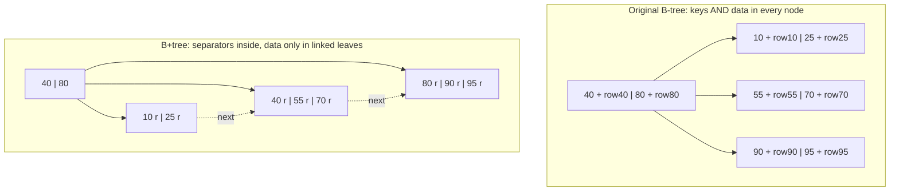
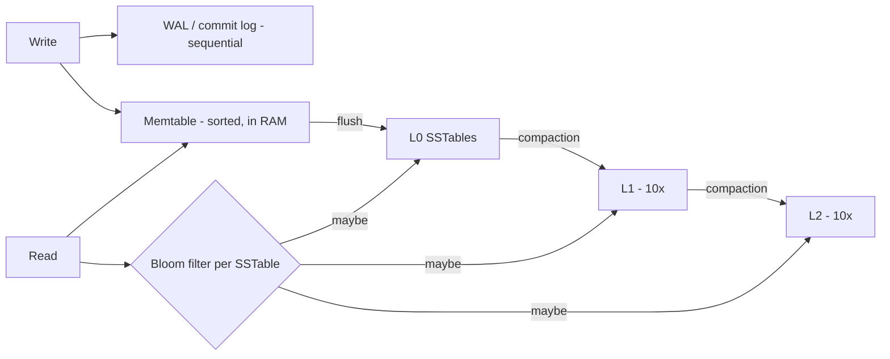

# B4 B-Tree vs B+Tree in Production Database Systems
> Last verified: 2026-10 · Audience: senior/staff DevOps, SRE, AI eng, NetEng, DevSecOps, architects

## TL;DR
- A **full table scan** costs O(N) pages: at 1B rows × 100 B ≈ 100 GB, even at 1–2 GB/s sequential read it takes about a minute and wipes out the buffer pool. An index lookup reads about **3–4 pages**, and usually only the leaf misses the cache.
- The **original B-tree** (Bayer & McCreight, 1970–72) stores keys **and values/row pointers in every node**. It is balanced and shallow, but values in internal nodes reduce fanout, and range scans have to walk up and down the tree.
- The **B+tree** stores data **only in leaves**. Internal nodes hold only separator keys, so fanout is high (~1,000+ per 16 KB page). Leaves form a **linked list**, so a range scan becomes "seek once, then read sequentially". Every mainstream RDBMS uses B+trees: InnoDB, PostgreSQL nbtree, SQL Server/Azure SQL rowstore, Oracle.
- **Height math:** fanout ~1,200 and ~100–150 rows per leaf give **3 levels ≈ 200M rows and 4 levels ≈ 200B+ rows**. The root and level 1 are always cached, so a point read costs about **1–2 physical I/Os**.
- **Production concerns:** page splits and fill factor (InnoDB leaves 1/16 free, PG btree fillfactor = 90), key width and randomness (UUIDv4 causes random splits and bloat), WAL/torn-page protection, latch concurrency (B-link/Lehman-Yao right-links), and keeping internal nodes in RAM.
- **MySQL InnoDB = clustered.** The PK B+tree leaf *is* the row. Secondary leaves store the **full PK**, so a secondary lookup traverses two trees and a wide PK bloats every secondary index.
- **Postgres = heap + indexes.** Every index (including the PK) stores a 6-byte **ctid**. A secondary lookup is 1 traversal plus 1 heap fetch, but any non-HOT UPDATE writes a **new entry in every index** (the write amplification Uber cited in 2016).
- **B+tree vs LSM:** B+tree has low read and space amplification but random in-place writes. LSM (RocksDB, Cassandra, Bigtable) has cheap sequential writes but pays read amplification (bloom filters help) and compaction write amplification (~10–30×). Correction: **DynamoDB is not LSM.** Its storage nodes use a B-tree plus replication log (USENIX ATC'22).

## B4.1 Full Table Scans
- **How it works:**
  - Without a usable index, the engine reads **every page** of the table: PG `Seq Scan`, MySQL `type=ALL`, SQL Server `Table/Clustered Index Scan`. Cost is O(N) pages, and the predicate is evaluated on every row.
  - **I/O is sequential**, so per page it is cheap: OS/engine read-ahead applies, PG uses a **ring buffer** for big seq scans so it doesn't evict the whole `shared_buffers`, and `synchronize_seqscans` lets concurrent scans share the I/O.
  - Rough math: 1B rows × 100 B ≈ **100 GB**. At ~1 GB/s that is ~100 s single-threaded. Parallel seq scan (PG) or parallel read threads (InnoDB `innodb_parallel_read_threads`, used for `COUNT(*)`/`CHECK TABLE`) divide that wall time, not the I/O volume.
  - An index point lookup is **log_fanout(N)** page reads, about 3–4 pages, so microseconds to ~1 ms.
- **Trade-offs / when to use:**
  - A full scan is **the right plan** when selectivity is low: once a query returns more than ~5–20% of rows, random heap/clustered lookups per row cost more than one sequential pass. The planner uses `random_page_cost` (default 4.0) vs `seq_page_cost` (default 1.0) in PG. On SSD, lowering `random_page_cost` to ~1.1 is common.
  - Small tables that fit in a few pages are always scanned.
  - Analytics should use columnar formats (see [M7 Data warehouses](../M-data-platforms/M7-data-warehouses.md)) rather than row-store full scans.
- **Interview angles:**
  - "Query got slow after data grew" → look at `EXPLAIN (ANALYZE, BUFFERS)` for `Seq Scan` with `Rows Removed by Filter` ≫ rows returned. Fix with an index matching the predicate and sort order, or fix a non-sargable predicate (function on column, implicit cast, leading `%LIKE`).
  - Pitfall: stale statistics make the planner pick a seq scan, or the reverse. Run `ANALYZE`.
  - Pitfall: `SELECT COUNT(*)` on InnoDB/PG is a full scan of the smallest index, not O(1), because of MVCC.

## B4.2 Original B-Tree
- **How it works:**
  - Bayer & McCreight (1970 tech report, 1972 Acta Informatica). It is a balanced multiway search tree of **order m**. Every node except the root holds between ⌈m/2⌉−1 and m−1 keys, **all leaves are at the same depth**, and a node with k keys has k+1 children.
  - **Every node stores (key, value-or-row-pointer) pairs.** A search can stop at an internal node when the key matches.
  - Insert goes into a leaf. An overflow **splits** the node and pushes the median up, so the tree **grows at the root**, which keeps it balanced. Delete borrows from or merges with siblings.
  - Node size = disk page, so each level costs one I/O.



- **Trade-offs / when to use:** good for point lookups on uniform-cost storage. Today it is mostly a textbook artifact, since nearly all on-disk engines use a B+tree variant ("B-tree" in docs almost always means B+tree).
- **Interview angles:** "Is a Postgres/MySQL 'B-tree' index really a B-tree?" → No. Both are B+trees: PG nbtree is Lehman-Yao B-link, and InnoDB says "B-tree" in its docs but has the B+tree layout. The SQL Server docs say "B+ tree" explicitly.

## B4.3 How the Original B-Tree Helps Performance
- **How it works:**
  - It replaces O(N) scans and O(log₂N) binary-tree hops with **O(log_m N) page reads**. Because m is in the hundreds, height stays at 3–5 even for billions of keys.
  - **Balanced:** worst-case lookup cost is bounded, which matters for p99, unlike an unbalanced BST.
  - **Page-sized nodes** match the block device and buffer pool. One node is one I/O, and hot upper levels stay cached.
  - A lookup that hits a key in an upper node returns early without reaching a leaf.
  - Sorted keys support ordered iteration and `ORDER BY`/`MIN`/`MAX` without a sort.
- **Trade-offs / when to use:** binary search inside a page is cheap CPU, and the dominant cost is page fetches. That is why "minimise tree height" is the design goal.
- **Interview angles:**
  - "Why not a binary tree or hash?" → A binary tree is ~30 levels for 1B keys, so 30 random I/Os. A hash index gives O(1) equality but no ranges or ordering (see [B3 Database indexing](B3-database-indexing.md)).

## B4.4 Original B-Tree Limitations
- **How it works / why it hurts:**
  - **Lower fanout.** Internal nodes carry values or whole rows, so fewer keys fit per page. Fewer keys per page means a taller tree and more I/Os, and less of the tree fits in RAM.
  - **Range scans are expensive.** `WHERE k BETWEEN a AND b` needs an in-order traversal that keeps **going back up to parents**. Each hop can be a random I/O, and the nodes are scattered on disk.
  - **Uneven lookup cost.** Some keys resolve at the root and others at a leaf, so latency is less predictable.
  - **Caching is wasteful.** Caching the upper levels also caches their row payloads, so the buffer pool holds data instead of routing keys.
  - **Concurrency and deletes are harder,** because deleting from an internal node needs predecessor/successor swaps.
- **Interview angles:** the one-liner is "B-tree mixes navigation and data. B+tree separates them, which raises fanout, gives uniform depth, and turns range scans into sequential leaf walks."

## B4.5 B+Tree
- **How it works:**
  - **Internal nodes hold only separator keys plus child pointers.** Separators can be truncated copies: PG12+ applies **suffix truncation** to pivot tuples.
  - **All records (or record pointers) live in leaves.** Every lookup goes root to leaf, so depth is uniform.
  - **Leaves are linked.** InnoDB and SQL Server use a doubly linked list per level. PG nbtree uses **right-links plus left-links** (Lehman & Yao B-link tree), which also let concurrent readers survive a split without holding parent latches.
  - Range scan = one descent to the first key, then follow sibling pointers. PG supports backward scans, so `ORDER BY … DESC` uses the same index.
  - **Fanout and height math** (InnoDB, 16 KB page, BIGINT PK):
    - Internal entry ≈ 8 B key + ~4–6 B child page no. + ~5 B record header ≈ **13–20 B**, so **~800–1,200 children per page**.
    - Leaf at 15/16 full with ~100 B rows ≈ **~150 rows per leaf**.
    - Height 2 ≈ 1,200 × 150 ≈ 180K rows. **Height 3 ≈ 1,200² × 150 ≈ 216M rows. Height 4 ≈ 260B rows.**
    - The upper 2 levels for a 200M-row table are about 1,200 pages ≈ 19 MB, so always cached. A point read then costs **1 physical I/O** (the leaf).
  - PG: >99% of nbtree pages are leaves (PG docs), and the metapage records the root and level.

| Height | Max rows (fanout 1,200, 150 rows/leaf) | Internal pages to cache |
|---|---|---|
| 2 | ~180 K | 1 |
| 3 | ~216 M | ~1.2 K (≈19 MB) |
| 4 | ~260 B | ~1.4 M (≈23 GB) |

- **Trade-offs / when to use:**
  - The default for OLTP: mixed reads/writes with point plus range queries.
  - Writes are **in-place, random page writes** plus WAL/redo, which brings write amplification from full-page images, the doublewrite buffer, and page splits.
- **Interview angles:**
  - "How many I/Os to find 1 row in a 1B-row table?" → Height ≈ 4. Root and level 1 are cached, so 1–2 reads, plus the heap or clustered fetch for a secondary index.
  - "Why do range scans on an index sometimes lose to a seq scan?" → The *index* leaves are sequential, but the **row fetches** they trigger are random. PG answers this with a **Bitmap Heap Scan**, which sorts the TIDs by block first.

## B4.6 B+Tree DBMS Considerations
### Page size and node layout
- Default page sizes: InnoDB **16 KB** (`innodb_page_size` 4/8/16/32/64 KB, set only at init). PG **8 KB** (compile-time). SQL Server/Azure SQL **8 KB**.
- Bigger pages give more fanout but more read/write amplification per change and larger WAL full-page images.
- Pages use a **slot array/line pointers**. The item order inside a page is logical, so inserts don't shift rows physically.

### Page splits, merges, fill factor
- **Split:** when a full leaf receives an insert, about half its items move to a new page and a downlink is inserted into the parent. Splits can cascade. A **root split** adds a level, which is the only way the tree gets taller.
- **Monotonic keys** (identity/sequence, UUIDv7, timestamps) append at the rightmost leaf. Engines do a "fastpath" or unbalanced split, so pages stay ~full: InnoDB fills sequential pages to **15/16**.
- **Random keys** (UUIDv4, hashes) split pages all over the tree, leaving pages **50–94% full** (InnoDB docs). The results are larger indexes, a cold buffer pool, and more WAL.
- **Fill factor:**
  - **PG btree default 90** (range 10–100). It applies to initial builds and right-edge extension. Use 100 only for static tables. **PG heap fillfactor defaults to 100**; lower it to around 70–90 on update-heavy tables to enable **HOT** updates.
  - **InnoDB** reserves 1/16 of each page. `innodb_fill_factor` (default 100, which still leaves 1/16 free) applies only to **sorted index builds**.
  - **SQL Server** `FILL FACTOR` default 0/100. It applies at build/rebuild only.
- **Merge:** InnoDB `MERGE_THRESHOLD` defaults to **50%**. A page below that tries to merge with a neighbour. PG never merges half-empty pages. It only deletes **fully empty** pages (via VACUUM) and relies on **deduplication** (PG13+, default on) and **bottom-up deletion** (PG14+) to avoid "version-churn" splits.
- Bloat and fragmentation fixes: PG `REINDEX CONCURRENTLY`/`pg_repack`. MySQL `OPTIMIZE TABLE` (rebuild). SQL Server `ALTER INDEX … REBUILD/REORGANIZE`.

### Durability and concurrency
- **Torn pages:** a 16 KB/8 KB page write is not atomic on a 4 KB device.
  - InnoDB uses the **doublewrite buffer**.
  - PG uses **full_page_writes**: the first change after a checkpoint logs the whole page. That is a big source of WAL volume, and random-key splits make it worse.
  - SQL Server uses page checksums/torn-page detection.
- **Latching:** latch crabbing (couple parent and child latches top-down), or B-link trees, where readers follow the right-link if a concurrent split moved their key (PG). Latch-free variant: the **Bw-tree** (SQL Server In-Memory OLTP indexes, Cosmos DB). Locking theory lives in [B7 Concurrency control](B7-concurrency-control.md).
- **Buffer pool:** size it so all internal pages plus the hot leaves fit (InnoDB `innodb_buffer_pool_size`, PG `shared_buffers` plus OS cache).

### Key design
- **Narrow, monotonic, immutable** keys give the best fanout, fewest splits, and no cascades.
- Composite-index column order follows the leftmost-prefix rule. PG18 adds **B-tree skip scan**, which can use an index when leading columns aren't constrained.
- Covering/`INCLUDE` indexes avoid row fetches (PG index-only scans also need the **visibility map** all-visible bit). They inflate the index, and PG disables deduplication on INCLUDE indexes.
- MySQL 8.4 changed defaults: **adaptive hash index OFF** and **change buffering `none`**. Older tuning guides assume both are on.

- **Interview angles:**
  - "UUID primary key, writes slowed down as the table grew" → random inserts split pages across the whole tree, so the working set exceeds RAM, plus WAL/FPI blowup. Fix: UUIDv7/ULID or a BIGINT identity with the UUID as a secondary unique column.
  - "Why lower fillfactor?" → Leave room for in-place updates (HOT in PG) and future inserts. The cost is a larger index and table on disk.
  - Partitioning keeps each B+tree shallow and makes rebuilds and retention cheaper (see [B5 Database partitioning](B5-database-partitioning.md)).

## B4.7 B+Tree Storage Cost in MySQL vs Postgres
- **How it works:**
  - **InnoDB, clustered index organized table:**
    - The PK B+tree leaf contains the **whole row**. With no PK, InnoDB uses the first UNIQUE NOT NULL index, otherwise a hidden **6-byte `GEN_CLUST_INDEX` row ID**.
    - **Secondary index leaf = indexed columns + full PK columns.** A secondary lookup is a traversal of the secondary tree, then a traversal of the clustered tree by PK (a "double lookup", ~2× the pages).
    - **A wide PK is copied into every secondary index.** InnoDB docs: "short primary keys are advantageous".
    - A row that moves because of a page split **doesn't touch the secondaries**, since they hold a logical pointer. Updating a non-indexed column touches only the clustered leaf. Changing the PK rewrites the row and every secondary entry.
    - PK range scans are truly sequential, because rows are physically ordered by PK.
  - **PostgreSQL, heap plus separate indexes:**
    - The table is an unordered **heap**. **Every index, including the PK, is a secondary index** whose leaf tuples hold key + **ctid (6 B: block no. + line pointer)**. Each index tuple has an 8 B header (6 B TID + 2 B info) and a 4 B line pointer, plus alignment.
    - A lookup is a traversal plus **one direct heap fetch**. No second tree.
    - **MVCC writes a new tuple version on UPDATE, with a new ctid.** Unless the update is **HOT** (no indexed column changed **and** free space on the same page), **every index** gets a new entry. With 10 indexes, one UPDATE means one heap write plus 10 index inserts, plus WAL for each. Dead entries wait for VACUUM.
    - Rows aren't ordered by PK. `CLUSTER` reorders once and is not maintained.

| Aspect | MySQL InnoDB (clustered) | PostgreSQL (heap) |
|---|---|---|
| Where the row lives | PK B+tree leaf | Heap pages, unordered |
| Secondary leaf pointer | Full PK (8 B BIGINT, 16 B BINARY UUID, 36+ B CHAR UUID, composite = sum) | ctid, 6 B fixed |
| Secondary lookup cost | 2 tree traversals | 1 traversal + 1 heap page (random) |
| PK lookup / PK range | 1 traversal, rows inline, sequential | Index traversal + heap fetches (random unless correlated) |
| UPDATE non-indexed col | Clustered leaf in place (+undo log) | New tuple version. HOT avoids index writes only if it fits on the same page |
| UPDATE indexed col | Clustered + affected secondaries only | New entry in **all** indexes (non-HOT) |
| Row relocation | Secondaries unaffected (logical pointer) | Any new version changes the ctid |
| Old versions | Undo log (purge) | In heap + index (VACUUM) |
| Index-only scan | Secondary covers its cols + PK for free | Needs the visibility-map all-visible bit |

- **Worked cost example:** 1B rows, 5 secondary indexes, PK = BINARY(16) UUID. InnoDB stores 16 B per secondary entry vs PG's 6 B ctid, so ≈ 10 B × 5 × 1B ≈ **50 GB extra** in MySQL. With a BIGINT PK (8 B) the two are roughly a wash. PG's cost shows up instead as **write amplification and bloat** on update-heavy tables.
- **Trade-offs / when to use:**
  - InnoDB is a good fit for PK-centric access, PK range scans, and many indexes on update-heavy rows.
  - PG is a good fit for many secondary-index reads (single traversal), append-mostly data, and narrow tables. Tune heap fillfactor for HOT, and watch `pg_stat_user_tables.n_tup_hot_upd` vs `n_tup_upd`.
  - SQL Server/Azure SQL can do both: a clustered table makes the row locator the clustering key, and a heap makes it an **8-byte RID** (file:page:slot).
- **Interview angles:**
  - "Uber moved from Postgres to MySQL in 2016. Why?" → Write amplification from ctid-based indexes on updates, replication of physical WAL, and bloat. Counter-points: HOT, PG13+ deduplication, and PG14+ bottom-up deletion reduced the gap since then.
  - "Choosing a PK in MySQL" → Short and monotonic, because it is stored in every secondary index and decides the physical order. A random UUID PK is a double penalty.
  - Follow-up: "Does PG need a PK for storage?" → No, the heap works without one (needed for logical replication UPDATE/DELETE via REPLICA IDENTITY). InnoDB always has a clustered key.

## B+Tree vs LSM-Tree (cross-cutting, see B10 / B14.7)
- **LSM write path:**
  1. The write goes to the WAL/commit log and to an in-memory **memtable** (a sorted skiplist).
  2. When the memtable is full, it is flushed to an immutable sorted **SSTable**.
  3. Background **compaction** merges SSTables, applying updates and tombstones.
- **LSM read path:** memtable, then L0, then L1…Ln. **Bloom filters** skip SSTables that can't contain the key, and block indexes locate data inside an SSTable.



| Amplification | B+tree (InnoDB/PG) | LSM leveled (RocksDB default) | LSM size-tiered/universal (Cassandra STCS) |
|---|---|---|---|
| **Write** (disk bytes / user bytes) | Whole page rewritten per small change + WAL/FPI. Random I/O | ~10–30× (each level rewrite, multiplier 10). Sequential I/O | Lower than leveled |
| **Read** (pages per point read) | ~1–2 physical (height 3–4, upper cached) | 1 per level/L0 file, cut by bloom filters. Range scans merge all levels | Higher (many overlapping SSTables) |
| **Space** (disk / logical) | ~1.1–1.5× (fill factor, fragmentation, bloat) | ~1.1× | Up to ~2× during compaction |

- **When to use:**
  - LSM suits write-heavy ingestion: time series, event logs, counters, wide-column and KV stores. It handles high insert rates on SSD with less write wear per I/O pattern and compresses well.
  - B+tree suits read-heavy OLTP with predictable read latency, range scans, and complex transactions. It has no compaction debt and no compaction-induced p99 spikes.
- **Engines:**
  - LSM: RocksDB (MyRocks, TiKV, CockroachDB's Pebble, Kafka Streams state), Cassandra, ScyllaDB, HBase/Bigtable, LevelDB.
  - B+tree: InnoDB, PG, SQL Server, Oracle, WiredTiger (B-tree by default).
- **Interview angles:**
  - "Design a metrics/IoT ingest store" → LSM plus TTL compaction.
  - "Why do LSM reads have tail-latency spikes?" → Compaction I/O contention and L0 file buildup (write stalls). Tombstone-heavy partitions also hurt (Cassandra).
  - Deeper engine comparison: [B10 Database engines](B10-database-engines.md) and [B14 Database discussions](B14-database-discussions.md) (B14.7).

## Cloud mapping: AWS vs Azure
| Capability | AWS | Azure | Role it plays | Key differences | Alternatives |
|---|---|---|---|---|---|
| Managed B+tree RDBMS | RDS MySQL/PostgreSQL, Aurora MySQL/PostgreSQL | Azure Database for MySQL/PostgreSQL Flexible Server, Azure SQL Database/MI | OLTP with B+tree indexes | Aurora keeps the InnoDB/PG B+tree but replaces page flushing with **log-shipping to distributed storage** ("the log is the database"). Azure SQL Hyperscale similarly uses page servers fed by the log | Self-managed PG/MySQL on Kubernetes (CloudNativePG, Percona operators) |
| Managed LSM wide-column | Amazon Keyspaces (Cassandra-compatible) | Azure Managed Instance for Apache Cassandra | Write-heavy wide-column | Azure MI runs real Cassandra (LSM, you tune compaction). Keyspaces is serverless with an **unpublished storage engine (unverified whether LSM)** | Self-managed Cassandra/ScyllaDB. GCP Bigtable (SSTables on Colossus, LSM) |
| Managed KV/document NoSQL | DynamoDB | Cosmos DB | Serverless KV/document | **DynamoDB storage nodes use a B-tree + replication log** (ATC'22 paper), not LSM. **Cosmos DB** indexes with a latch-free **Bw-tree over a log-structured store** (hybrid) | MongoDB Atlas (WiredTiger B-tree) |
| Embedded LSM state | MSK/Kinesis consumers with RocksDB state | Event Hubs consumers with RocksDB state | Stream-processor local state | Same engine (RocksDB). Tuning is on you | Kafka Streams, Flink (RocksDB backend) |

- Only Bigtable (GCP) publicly documents LSM/SSTable internals among the big managed stores. Don't claim "DynamoDB = LSM" in an interview.
- Aurora and Hyperscale show that the **index structure (B+tree) and the storage durability model (log-structured, distributed) are independent choices**.

## Hands-on (optional)
```bash
# PostgreSQL: tree height (level) and root of a btree index via pageinspect
psql -c "CREATE EXTENSION IF NOT EXISTS pageinspect;"
psql -c "SELECT root, level, fastroot, fastlevel FROM bt_metap('orders_pkey');"
# HOT vs non-HOT updates (write amplification signal)
psql -c "SELECT relname, n_tup_upd, n_tup_hot_upd FROM pg_stat_user_tables ORDER BY n_tup_upd DESC LIMIT 5;"
# Lower heap fillfactor to make HOT more likely (affects new pages; rewrite to apply fully)
psql -c "ALTER TABLE orders SET (fillfactor = 85);"

# MySQL InnoDB: index size and leaf-page counts per index
mysql -e "SELECT index_name, stat_name, stat_value FROM mysql.innodb_index_stats WHERE table_name='orders' AND stat_name IN ('size','n_leaf_pages');"
mysql -e "SELECT @@innodb_page_size, @@innodb_fill_factor, @@innodb_adaptive_hash_index;"
```

## Cross-links
- [B2 Database internals](B2-database-internals.md): pages, heap, row vs column storage
- [B3 Database indexing](B3-database-indexing.md): index types, composite and covering indexes, EXPLAIN
- [B5 Database partitioning](B5-database-partitioning.md): keeping trees small
- [B7 Concurrency control](B7-concurrency-control.md): latches vs locks, MVCC
- [B10 Database engines](B10-database-engines.md): InnoDB vs MyRocks vs others, LSM engines
- [B14 Database discussions](B14-database-discussions.md) (B14.7)
- [A6 Storage management](../A-operating-systems/A6-storage-management.md): block I/O, page cache, sequential vs random
- [C1 Performance](../C-large-scale-architecture/C1-performance.md)

## Sources
- https://dev.mysql.com/doc/refman/8.4/en/innodb-index-types.html
- https://dev.mysql.com/doc/refman/8.4/en/innodb-physical-structure.html
- https://dev.mysql.com/doc/refman/8.4/en/innodb-change-buffer.html
- https://dev.mysql.com/doc/refman/8.4/en/mysql-nutshell.html
- https://www.postgresql.org/docs/current/btree.html
- https://www.postgresql.org/docs/current/sql-createindex.html
- https://www.postgresql.org/docs/current/storage-page-layout.html
- https://www.postgresql.org/docs/current/storage-hot.html
- https://www.postgresql.org/docs/current/indexes-index-only-scans.html
- https://learn.microsoft.com/en-us/sql/relational-databases/sql-server-index-design-guide
- https://github.com/facebook/rocksdb/wiki/RocksDB-Tuning-Guide
- https://cassandra.apache.org/doc/latest/cassandra/architecture/storage-engine.html
- https://docs.cloud.google.com/bigtable/docs/overview
- https://www.usenix.org/conference/atc22/presentation/vig
- https://www.microsoft.com/en-us/research/publication/bw-tree-latch-free-b-tree-log-structured-flash-storage/
