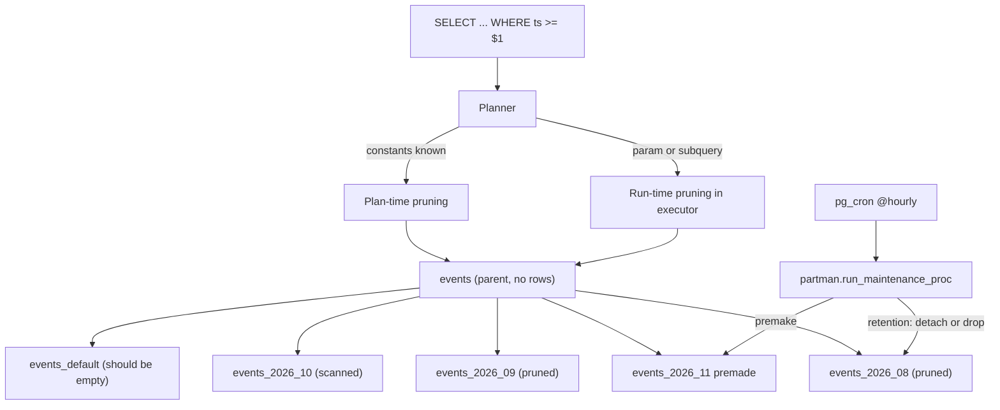
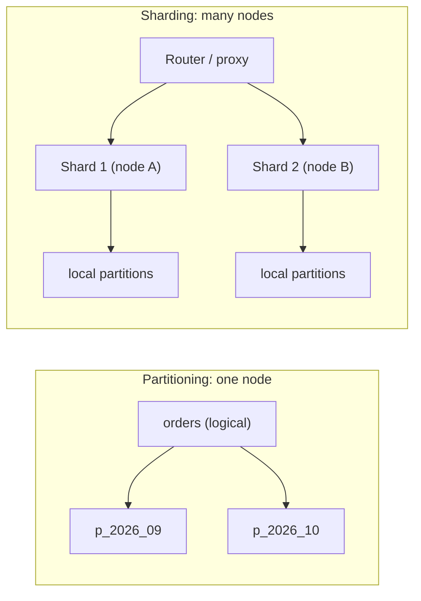

# B5 Database Partitioning
> Last verified: 2026-10 · Audience: senior/staff DevOps, SRE, AI eng, NetEng, DevSecOps, architects

## TL;DR
- **Partitioning** splits one logical table into smaller physical pieces **inside one database instance**. **Sharding** spreads those pieces across **many instances/hosts**. Partitioning is about manageability and pruning. Sharding is about scaling writes, storage and compute beyond one box.
- **Horizontal** partitioning splits rows (range/list/hash/composite). **Vertical** partitioning splits columns (hot vs cold or wide columns). Postgres TOAST and columnar stores are built-in forms of vertical partitioning.
- The biggest win is **partition pruning**: the planner skips partitions that cannot match. Postgres prunes at **plan time** (constants) and at **execution time** (bind params, subqueries, nested-loop params). No partition key in the `WHERE` clause means no pruning, and the query is usually slower than on an unpartitioned table.
- The second-biggest win is **cheap retention**: `DROP`/`DETACH PARTITION` (or `TRUNCATE PARTITION`, `SWITCH OUT`) is a metadata operation. It avoids a multi-hour `DELETE`, WAL/binlog bloat and VACUUM debt.
- **Main costs:**
  - **No global unique index.** Postgres, MySQL and SQL Server require every PK/unique key to include the partition key.
  - MySQL partitioned tables cannot have **foreign keys**.
  - Cross-partition queries fan out.
  - Planning overhead grows with partition count.
  - You need to automate partition creation (**pg_partman + pg_cron**).
- Pick the partition key from the **dominant filter and retention dimension**, which is usually time. For a distributed store (DynamoDB, Cosmos DB, Synapse, Redshift), pick it from **cardinality and even load** instead.
- **Managed NoSQL:**
  - **DynamoDB** hashes the partition key. Each partition is capped at 3,000 RCU / 1,000 WCU. **Adaptive capacity** and split-for-heat absorb skew.
  - **Cosmos DB** has 20 GB / 10k RU/s **logical** partitions on top of 50 GB / 10k RU/s **physical** partitions. **Hierarchical partition keys** (up to 3 levels) get you past the 20 GB cap.
- **Analytics:** you "partition" by **distribution keys** (Synapse 60 distributions, Redshift DISTKEY/SORTKEY) plus time partitions. BigQuery and Databricks increasingly favour **clustering / liquid clustering** over fine-grained partitions.

## B5.1 What is Partitioning?
- **How it works:**
  - One **logical table** (the parent) is backed by N physical **partitions**, each a separate heap/B-tree. A **partition key** plus a **routing rule** maps each row to exactly one partition.
  - **Postgres declarative partitioning** arrived in PG10. PG11 added hash partitions, default partitions, PKs/unique indexes on parents and run-time pruning. PG12 added FKs that reference partitioned tables. PG14 added `DETACH ... CONCURRENTLY`.
  - In Postgres the parent stores no rows. Partitions are ordinary tables that can carry their own storage params or tablespace.
  - **MySQL/InnoDB** partitioning is native. Each partition is its own `.ibd` file. The cap is 8,192 partitions including subpartitions.
  - **SQL Server / Azure SQL** use a **partition function** (boundaries, `RANGE LEFT|RIGHT`) plus a **partition scheme** (maps partitions to filegroups). The cap is 15,000 partitions.
  - Inserts and updates are routed automatically. An `UPDATE` that changes the key moves the row between partitions (Postgres ≥11), which internally is a delete plus an insert.
- **Trade-offs / when to use:**
  - Use it for large, **append-heavy, time-ordered** tables: events, logs, IoT, audit, ledger history. Also use it where **bulk retention** or **tiering** matters.
  - Do not use it as a generic performance fix for OLTP point lookups that don't include the partition key.
- **Interview angles:**
  - "When would you partition?" → Say "when the table is too big to maintain (VACUUM, index rebuild, backup), queries naturally filter on one key, or we need to drop old data cheaply." Don't say "when it's slow".
  - Rule of thumb: partitioning starts to pay off when the table outgrows memory. Postgres docs' heuristic is when the table is larger than the server's RAM.

## B5.2 Vertical vs Horizontal Partitioning
| | Horizontal | Vertical |
|---|---|---|
| Splits | Rows (same schema per partition) | Columns (different schemas, joined by PK) |
| Typical key | Time, tenant, region, hash(id) | Access frequency / column size |
| Goal | Pruning, retention, parallel maintenance | Smaller hot rows → more rows per page and cache |
| Cost | Fan-out queries, unique-key limits | Joins to reassemble a row, two writes per logical update |
| Built-in examples | PG/MySQL `PARTITION BY` | PG **TOAST** (values >~2 KB moved off-row), InnoDB off-page BLOB/TEXT, columnar stores (Redshift, Synapse CCI, Parquet) |

- **How it works:**
  - **Vertical partitioning:** split `users(id, email, pw_hash, bio_text, avatar_blob, prefs_json)` into `users_core` (hot, narrow) and `users_profile` (cold, wide), both keyed 1:1 by `id`.
  - **Horizontal partitioning:** `orders` becomes `orders_2026_09`, `orders_2026_10`, and so on.
- **Trade-offs / when to use:**
  - Use vertical partitioning when a few wide or rarely read columns bloat every page. It is also a security pattern: put PII in a separate table or schema with tighter grants and its own encryption. See [B12](B12-database-security.md).
  - Microservice decomposition (one service owns a set of columns or entities) is vertical partitioning taken to the database-per-service level.
- **Interview angles:**
  - "Is vertical partitioning the same as normalization?" → No. Normalization removes redundancy. Vertical partitioning splits by **access pattern** and keeps a 1:1 relationship.
  - "Column store = ?" → It is extreme vertical partitioning. Each column is stored separately, which is why `SELECT *` is expensive and aggregates on one column are cheap.

## B5.3 Partitioning Types
### Range
- Contiguous, non-overlapping ranges. Postgres bounds are `FROM` inclusive and `TO` exclusive. MySQL uses `VALUES LESS THAN`, with `MAXVALUE` as the catch-all.
- This is the default for time series and the only type that gives natural **retention** (drop the oldest partition).
- Risk: the newest partition is a **hot spot** for writes. That is fine on one node but a problem when partitions map to nodes (see sharding).
### List
- Explicit value sets, e.g. `region IN ('eu','uk')`. Good for tenant tiers, regions and status.
- Use a **DEFAULT** partition (PG11+) for values you haven't listed. Pitfall: attaching a new partition scans DEFAULT under an `ACCESS EXCLUSIVE` lock. Keep DEFAULT empty or tiny, or add a matching `CHECK` constraint first.
### Hash
- Postgres uses `MODULUS m REMAINDER r`. MySQL uses `HASH(expr)` (integer expressions), `KEY(cols)` (internal hash over any non-BLOB/TEXT type) and `LINEAR HASH/KEY` (powers-of-two algorithm, cheaper add/drop but more skew).
- Spreads load evenly but cannot be pruned by ranges, has no time-based retention, and changing the modulus means rewriting the data.
### Composite / subpartitioning
- Postgres lets any partition be partitioned again with any method, e.g. range by month then hash by `tenant_id`.
- MySQL only allows a **RANGE or LIST** parent with **HASH or KEY** subpartitions.
- The docs warn that subpartitioning multiplies partition counts quickly.
### Engine specifics worth knowing
- **MySQL:**
  - The partition expression must resolve to an integer. The exceptions are `RANGE/LIST COLUMNS` (dates and strings directly) and `KEY`.
  - Pruning is optimized for `YEAR()`, `TO_DAYS()` and `TO_SECONDS()`.
  - Never change `sql_mode` after creating partitioned tables, because it can make them inaccessible.
- **Postgres:**
  - The key can be an expression. However, a **PK/unique** constraint cannot include expressions and must include every partition-key column.
  - **PG 19** adds `ALTER TABLE ... MERGE PARTITIONS / SPLIT PARTITION` (committed Dec 2025 after the PG17 revert). It holds `ACCESS EXCLUSIVE` on the parent, so it is not for hot, large tables. Release status as of 2026-10 is (unverified).
- **SQL Server:**
  - `RANGE RIGHT` is recommended for date boundaries.
  - NULLs go to the leftmost partition.
  - Azure SQL Database allows only the `PRIMARY` filegroup, so you get no per-filegroup tiering.
- **Interview angles:**
  - "Range or hash?" → Range when queries and retention follow time. Hash when the goal is even spread and access is by exact key.
  - For hash, state the resize cost and link to consistent hashing in [B6](B6-database-sharding.md).

## B5.4 The Difference Between Partitioning and Sharding
| | Partitioning | Sharding |
|---|---|---|
| Location | One DB instance/node | Many instances/nodes |
| Transparency | Fully transparent to SQL; one planner | App, proxy or router must find the shard (Vitess, Citus, Aurora Limitless, DynamoDB/Cosmos internally) |
| Transactions | Local ACID across partitions | Cross-shard needs 2PC/sagas or is disallowed |
| Scales | Manageability, pruning | Write throughput, storage, CPU |
| Failure domain | Single | Per shard (blast-radius isolation) |
- **How it works:**
  - Sharding is usually horizontal partitioning plus distribution. Each shard may itself be partitioned locally, for example a Citus distributed table where each shard is time-partitioned.
  - The terms are blurred in NoSQL docs. DynamoDB and Cosmos DB "partitions" are really managed **shards** spread across servers. Cosmos docs explicitly say partition key = shard key.
- **Trade-offs:** sharding brings rebalancing, hot shards, cross-shard joins and operational load. Exhaust vertical scaling, read replicas and partitioning first.
- **Interview angles:**
  - Classic follow-up: "Partition first or shard first?" → Partition first. It is cheap and reversible. Shard only when one primary can't sustain the write rate or storage.
  - Full treatment: [B6 Database Sharding](B6-database-sharding.md), [C2 Scalability (C2.18–C2.20)](../C-large-scale-architecture/C2-scalability.md), [D1 (D1.22)](../D-system-design/D1-system-design-basics.md).

## B5.5 Partition pruning
- **How it works (Postgres, `enable_partition_pruning = on` by default):**
  - **Plan-time pruning** uses constants and stable values that are known at planning. Pruned partitions **don't appear** in `EXPLAIN`.
  - **Execution-time (run-time) pruning** handles values only known at run time:
    - prepared-statement params under a **generic plan**;
    - subquery results (`WHERE ts > (SELECT ...)`);
    - nested-loop inner params.
    It shows as `Subplans Removed: N` or `(never executed)` in `EXPLAIN ANALYZE`. It can prune repeatedly as parameter values change.
  - Pruning works from the partition **bounds**, not from indexes. Legacy inheritance used **constraint exclusion** (`CHECK` constraints, plan-time only, slower). That remains the mechanism for inheritance setups.
  - **Partitionwise join/aggregate** (`enable_partitionwise_join` / `enable_partitionwise_aggregate`) is **off by default** because it raises planning CPU and memory. Turn it on for identically partitioned fact tables.
- **Other engines:**
  - **MySQL** prunes on `=`, `IN`, `BETWEEN` and ranges over the key. It shows the `partitions` column in `EXPLAIN`. Explicit selection `SELECT ... FROM t PARTITION (p3)` is also possible.
  - **SQL Server** calls it **partition elimination**. Check `$PARTITION` and the "Actual Partition Count" in the plan.
- **Pitfalls that defeat pruning:**
  - Wrapping the key in a function, e.g. `WHERE date(ts) = ...` on a `ts` range key.
  - Implicit casts, or comparing `timestamptz` to `timestamp` in a way that makes the expression non-immutable.
  - `OR` across columns.
  - ORMs sending the key as text.
  - A missing key predicate.
- **Interview angles:**
  - "Query got slower after partitioning?" → Most likely the queries don't filter on the key. Each partition then gets its own index probe, so N partitions mean N seeks. SQL Server docs say outright that partitioning **rarely helps OLTP**.
  - "Prepared statements and pruning?" → A custom plan prunes at plan time. A generic plan relies on run-time pruning, and plan-time locking of all partitions can still hurt with thousands of partitions.

## B5.6 The Advantages of Partitioning
- **Query speed via pruning.** Smaller indexes per partition mean shallower B-trees, and the hot partition's index stays in cache.
- **Bulk load and retention as metadata operations:**
  - Postgres: `DETACH`, `DROP TABLE`, `ATTACH`.
  - MySQL: `DROP` / `TRUNCATE PARTITION`, `EXCHANGE PARTITION`.
  - SQL Server: `SWITCH`, `TRUNCATE ... WITH (PARTITIONS (n))`.
  - All of these avoid VACUUM bloat and the replication lag from huge DELETEs.
- **Maintenance per partition:** VACUUM/ANALYZE, `REINDEX`, compression and backups can run per partition. Frozen old partitions stop generating autovacuum wraparound work.
- **Storage tiering:** older partitions go on cheaper tablespaces or filegroups, or get detached and archived (e.g. to S3/ADLS as Parquet).
- **Concurrency:** SQL Server can escalate locks to the partition with `LOCK_ESCALATION = AUTO` instead of to the whole table.
- **Interview angles:** lead with **retention and manageability**, then pruning. Senior interviewers expect you to know that the performance win is conditional.

## B5.7 The Disadvantages of Partitioning
- **No global unique or PK constraint** unless it includes the partition key. Workarounds:
  - a separate lookup table with the unique column;
  - UUIDv7/ULID or sequence-generated IDs that are unique by construction;
  - application-level checks.
  - SQL Server nonaligned unique indexes exist, but they break fast `SWITCH`.
- **Foreign keys:**
  - MySQL: none, in either direction.
  - Postgres: FKs to partitioned tables are allowed (PG12+), but the referenced unique key must include the partition key.
- **Planning overhead.** Postgres docs say the planner handles "up to a few thousand" partitions reasonably if pruning removes most of them. OLTP should use fewer partitions than DW. SQL Server warns against "many hundreds or thousands".
- **Cross-partition queries** without the key fan out. `ORDER BY ... LIMIT` and `MIN`/`MAX` on non-key columns touch every partition.
- **DDL and locking:**
  - `ATTACH` scans to validate unless a matching `CHECK` constraint exists.
  - `DETACH` takes `ACCESS EXCLUSIVE` unless you use `CONCURRENTLY`. That variant is not allowed in a transaction block or when a DEFAULT partition exists, and an interrupted run needs `DETACH ... FINALIZE`.
  - An index on the parent cascades to every partition. On a hot table, use `CREATE INDEX ON ONLY parent`, then `CREATE INDEX CONCURRENTLY` per partition, then `ALTER INDEX ... ATTACH PARTITION`.
- **Key changes are expensive.** Changing the partition key or the hash modulus means a full rewrite.
- **Operational toil:** you need future partitions pre-created. A missing partition with no DEFAULT makes inserts **fail**, which has caused real midnight-on-the-1st outages.
- **Interview angles:**
  - "How do you enforce a unique email on a partitioned users table?" → A separate non-partitioned `user_emails(email PK, user_id)` table written in the same transaction, or don't partition that table at all.

## B5.8 How to Automate Partitioning
- **pg_partman (v5.x):**
  - Supports native declarative partitioning only; trigger-based partitioning was removed in v5. Requires PG ≥14.
  - `partman.create_parent(p_parent_table, p_control, p_type => 'range'|'list', p_interval => '1 day', p_premake => N)` registers the table and pre-creates N future partitions.
  - `partman.run_maintenance_proc()` creates future partitions and applies **retention**. It runs from the `pg_partman_bgw` background worker or from **pg_cron**, e.g. `cron.schedule('@hourly', $$CALL partman.run_maintenance_proc()$$)`.
  - Retention settings in `partman.part_config`:
    - `retention = '3 months'`;
    - `retention_keep_table = true` detaches the partition instead of dropping it, which is useful for archive-then-drop;
    - `infinite_time_partitions = true` keeps creating partitions even when no new data arrives.
  - Template tables let it propagate properties the parent can't hold, such as unique indexes that don't include the key.
- **pg_cron:** needs `shared_preload_libraries` (a restart on RDS/Aurora/Azure Flexible Server). Jobs run in the database configured by `cron.database_name`.
- **Managed availability:** pg_partman and pg_cron are on RDS/Aurora PostgreSQL (pg_partman from 12.5+) and on Azure Database for PostgreSQL Flexible Server, which needs an allow-list via `azure.extensions`.
- **MySQL:** has no built-in automation. Options:
  - an `EVENT` (event scheduler) or an external cron/Lambda/Azure Function running `ALTER TABLE ... REORGANIZE PARTITION pMAX INTO (p_new, pMAX)` and `DROP PARTITION`;
  - Percona `pt-archiver` for row-level archival.
- **SQL Server / Azure SQL:** a "sliding window" with `SPLIT RANGE` (add the boundary while the target partition is still empty, so the split is metadata-only), `SWITCH OUT` to a staging table, then `MERGE RANGE`. Schedule it with Agent jobs, or Elastic Jobs / Automation on Azure SQL DB.
- **Retention playbook:**
  1. Detach (concurrently).
  2. Export to object storage (Parquet) if needed.
  3. Drop.
  4. Alert if the newest premade partition is less than X days ahead.
- **Interview angles:** "How do you make sure you never miss a partition?" → Premake buffer, a monitoring query on the partition bounds, a DEFAULT partition as a safety net with an alert when it is non-empty, and idempotent maintenance.

## Diagrams




## Cloud mapping: AWS vs Azure
| Capability | AWS | Azure | Role it plays | Key differences | Alternatives |
|---|---|---|---|---|---|
| Relational declarative partitioning | RDS/Aurora PostgreSQL & MySQL (native partitioning, pg_partman, pg_cron) | Azure Database for PostgreSQL Flexible Server / MySQL Flexible Server; Azure SQL DB / MI (partition function + scheme) | In-instance partitioning plus automated retention | Azure SQL DB has only the PRIMARY filegroup (no tiering) and a 15k partition cap; extensions need allow-listing on Azure PG | Self-managed PG on K8s (CloudNativePG), Citus |
| Scale-out of a relational DB (sharding, not partitioning) | Aurora PostgreSQL Limitless Database | Azure Cosmos DB for PostgreSQL (Citus), Azure SQL elastic database tools | Distributes partitions across nodes | Covered in B6 | Vitess/PlanetScale, CockroachDB, Spanner (GCP) |
| Managed NoSQL partitioning | DynamoDB partition key (+ sort key) | Cosmos DB partition key (logical) → physical partitions; hierarchical PK | Hash-distributes items, caps per-partition throughput | DynamoDB: 3,000 RCU / 1,000 WCU per partition, adaptive capacity, split-for-heat. Cosmos: 20 GB & 10k RU/s per logical partition, 50 GB / 10k RU/s per physical partition, PK immutable | Cassandra/ScyllaDB, MongoDB Atlas sharding |
| MPP warehouse distribution | Redshift DISTSTYLE AUTO/EVEN/KEY/ALL + SORTKEY (compound/interleaved/AUTO) | Synapse dedicated SQL pool: 60 distributions HASH/ROUND_ROBIN/REPLICATE + table partitions; Fabric Warehouse is the successor | Co-locates joins, avoids data movement, enables zone-map/segment elimination | Redshift has **no table partitioning** (only Spectrum external partitions); Synapse supports both distributions and partitions | BigQuery partition + cluster, Snowflake micro-partitions + clustering keys, Databricks liquid clustering |
| Lake partitioning | S3 + Glue/Athena Hive partitions, partition projection; Iceberg (S3 Tables) | ADLS Gen2 + Synapse serverless / Fabric OneLake (Delta) | Prunes files by path or metadata | Iceberg hidden partitioning avoids Hive-style path coupling | Databricks Delta liquid clustering, BigQuery |

- **DynamoDB:**
  - An internal hash of the partition key picks the partition. Items with the same PK form an **item collection** sorted by sort key.
  - Each partition is capped at **3,000 RCU / 1,000 WCU**, regardless of table capacity.
  - **Burst capacity** retains up to 300 s of unused capacity.
  - **Adaptive capacity** is instant and free. It boosts hot partitions up to the table total and **isolates hot items** into their own partitions. Split-for-heat is done by sort-key range. It **won't split** an item collection if the table has an **LSI**, and LSIs also impose a 10 GB item-collection limit.
  - Design for high-cardinality keys. Use **write sharding** (a `#n` suffix) for hot keys such as "today's date". Avoid monotonic keys.
  - Managed DynamoDB is not the masterless Dynamo-paper design. See C6.32/C6.33.
- **Cosmos DB:**
  - Logical partitions (the same PK value) are the **transaction scope**: stored procedures and transactional batch work within one logical partition only.
  - Physical partitions split automatically at 50 GB or with RU growth. A split can take **4–6 h** and never splits a logical partition.
  - Provisioned RU/s are divided **evenly** across physical partitions, so skew wastes RU and causes 429s.
  - **Hierarchical partition keys** (up to 3 levels, `MultiHash`, NoSQL API only, set at container creation):
    - A key prefix can exceed 20 GB and 10k RU/s.
    - Prefix queries are routed to only the relevant partitions. Querying a middle level alone means a full fan-out.
    - Use item `id` as the last level to guarantee scale.
  - The partition key is **immutable**, both per item and per container. Migrating means a container copy job or the change feed.
  - Cross-partition queries cost an extra ~2–3 RU per physical partition.
  - **Global secondary indexes** (auto-synced containers with a different PK) address multi-pattern access.
- **Synapse vs Redshift:**
  - Both pick a distribution/hash key for **join co-location** and an even spread. Avoid date columns as the distribution key, because "today" lands on one distribution.
  - Synapse rows always live in 60 distributions, so table partitions multiply the segment count. Columnstore wants about 1M rows per distribution per partition, i.e. roughly 60M rows per partition, so **over-partitioning hurts**.
  - Redshift relies on sort keys plus **zone maps** for block skipping instead of partitions.
  - Microsoft now steers new warehouse work to **Fabric Data Warehouse**.
- **BigQuery and Databricks as alternatives:**
  - BigQuery partitions by time-unit column, ingestion time or integer range, on **one column** only. Use `require_partition_filter` to force pruning and cost control.
  - Google advises **clustering instead** when partitions would be smaller than ~10 GB. The per-table partition limit is 10,000 (unverified, check current quotas).
  - Databricks **liquid clustering** replaces partitioning and Z-ORDER:
    - up to 4 keys, changeable without rewriting the data;
    - `CLUSTER BY AUTO` on DBR 15.4 LTS+ for UC managed tables;
    - incremental `OPTIMIZE`.
  - Databricks guidance is to avoid partitioning tables under ~1 TB.

## Hands-on (optional)
```bash
# Postgres: monthly range partitions, retention via concurrent detach, prove pruning
psql -c "CREATE TABLE events (id bigint, ts timestamptz NOT NULL, payload jsonb, PRIMARY KEY (id, ts)) PARTITION BY RANGE (ts);"
psql -c "CREATE TABLE events_2026_10 PARTITION OF events FOR VALUES FROM ('2026-10-01') TO ('2026-11-01');"
psql -c "CREATE TABLE events_default PARTITION OF events DEFAULT;"   # safety net; alert if non-empty
psql -c "EXPLAIN SELECT * FROM events WHERE ts >= '2026-10-05';"      # only events_2026_10 appears
# DETACH CONCURRENTLY is not allowed while a DEFAULT partition exists, and not inside a transaction block
psql -c "ALTER TABLE events DETACH PARTITION events_2026_07;"
psql -c "DROP TABLE events_2026_07;"

# pg_partman + pg_cron (pg_cron must be in shared_preload_libraries)
psql -c "CREATE SCHEMA partman; CREATE EXTENSION pg_partman SCHEMA partman; CREATE EXTENSION pg_cron;"
psql -c "SELECT partman.create_parent(p_parent_table => 'public.events', p_control => 'ts', p_interval => '1 month', p_premake => 3);"
psql -c "UPDATE partman.part_config SET retention = '12 months', retention_keep_table = false WHERE parent_table = 'public.events';"
psql -c "SELECT cron.schedule('partman-maint', '@hourly', \$\$CALL partman.run_maintenance_proc()\$\$);"
```

```hcl
# Cosmos DB container with a hierarchical partition key (TenantId > UserId > id)
resource "azurerm_cosmosdb_sql_container" "events" {
  name                  = "events"
  resource_group_name   = var.rg
  account_name          = var.cosmos_account
  database_name         = var.cosmos_db
  partition_key_paths   = ["/TenantId", "/UserId", "/id"]
  partition_key_kind    = "MultiHash"
  partition_key_version = 2
}

# DynamoDB: high-cardinality PK + sort key for range queries within an item collection
resource "aws_dynamodb_table" "events" {
  name         = "events"
  billing_mode = "PAY_PER_REQUEST"
  hash_key     = "pk"   # e.g. TENANT#123#SHARD#7 (write-sharded)
  range_key    = "sk"   # e.g. TS#2026-10-08T12:00:00Z
  attribute {
    name = "pk"
    type = "S"
  }
  attribute {
    name = "sk"
    type = "S"
  }
}
```

## Cross-links
- [B3 Database Indexing](B3-database-indexing.md): local vs global indexes, index-per-partition cost
- [B6 Database Sharding](B6-database-sharding.md): consistent hashing (B6.2), rebalancing, routing
- [B7 Concurrency Control](B7-concurrency-control.md): lock levels taken by ATTACH/DETACH
- [B9 Database System Design](B9-database-system-design.md)
- [C2 Scalability (C2.18–C2.20)](../C-large-scale-architecture/C2-scalability.md)
- [C6 Technology Stack (C6.32/C6.33 Dynamo vs DynamoDB)](../C-large-scale-architecture/C6-technology-stack.md)
- [D1 System Design Basics (D1.22)](../D-system-design/D1-system-design-basics.md)
- [M1 Lakehouse Table Formats](../M-data-platforms/M1-lakehouse-table-formats.md), [M3 Databricks Platform](../M-data-platforms/M3-databricks-platform.md), [M7 Data Warehouses](../M-data-platforms/M7-data-warehouses.md)

## Sources
- https://www.postgresql.org/docs/current/ddl-partitioning.html
- https://dev.mysql.com/doc/refman/8.4/en/partitioning-types.html
- https://dev.mysql.com/doc/refman/8.4/en/partitioning-limitations.html
- https://learn.microsoft.com/en-us/sql/relational-databases/partitions/partitioned-tables-and-indexes
- https://github.com/pgpartman/pg_partman
- https://docs.aws.amazon.com/AmazonRDS/latest/UserGuide/PostgreSQL_Partitions.html
- https://docs.aws.amazon.com/amazondynamodb/latest/developerguide/bp-partition-key-design.html
- https://docs.aws.amazon.com/amazondynamodb/latest/developerguide/burst-adaptive-capacity.html
- https://docs.aws.amazon.com/amazondynamodb/latest/developerguide/HowItWorks.Partitions.html
- https://learn.microsoft.com/en-us/azure/cosmos-db/partitioning-overview
- https://learn.microsoft.com/en-us/azure/cosmos-db/hierarchical-partition-keys
- https://learn.microsoft.com/en-us/azure/synapse-analytics/sql-data-warehouse/sql-data-warehouse-tables-distribute
- https://docs.aws.amazon.com/redshift/latest/dg/c_choosing_dist_sort.html
- https://docs.cloud.google.com/bigquery/docs/partitioned-tables
- https://docs.databricks.com/aws/en/delta/clustering
- https://www.depesz.com/?p=4407 (PG19 MERGE/SPLIT PARTITIONS commit)
