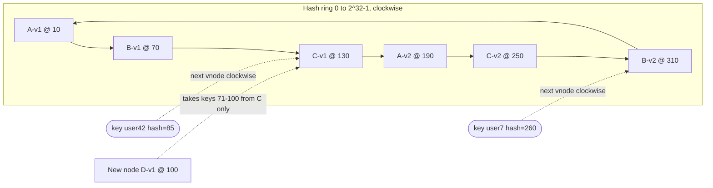
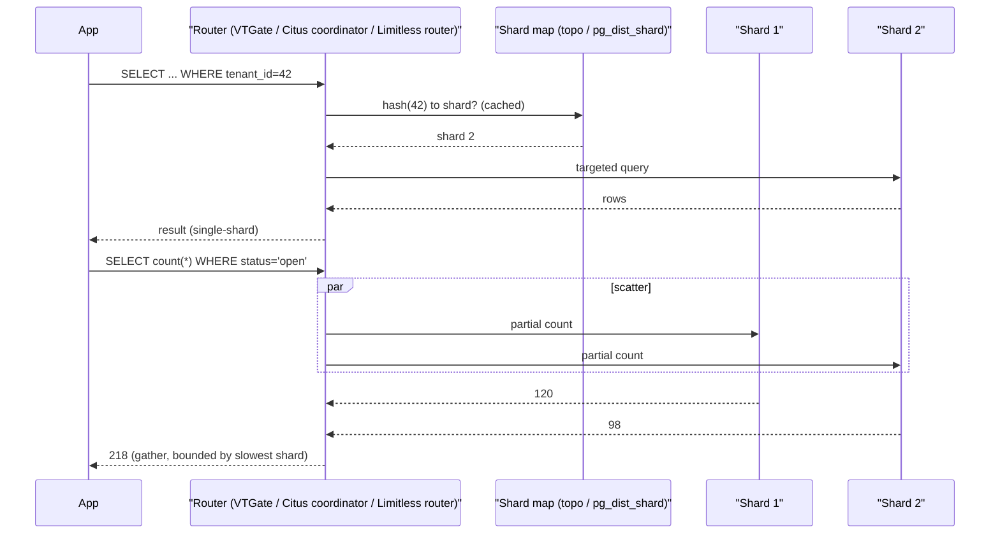
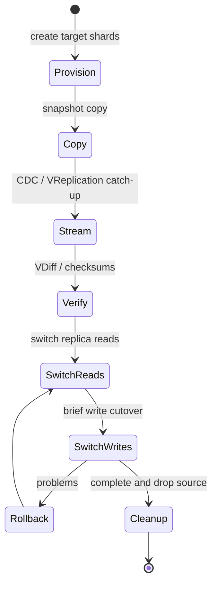

# B6 Database Sharding
> Last verified: 2026-10 · Audience: senior/staff DevOps, SRE, AI eng, NetEng, DevSecOps, architects

## TL;DR
- **Sharding** splits one logical dataset across **many independent database servers**. Each server (a shard) owns a subset of rows chosen by a **shard key**. It scales **writes, storage and working set**, which read replicas cannot do.
- The **shard key is the most important decision you make**. It needs high cardinality, an even spread of load, values that **never change**, and it must appear in most queries. Most transactions should touch exactly one key value (tenant_id, user_id).
- Know the three placement strategies: **hash**, which spreads load well but makes range scans scatter; **range**, which keeps scans cheap but creates hot spots on monotonic keys; and **directory/lookup**, which is the most flexible but needs a highly available metadata store. Production systems mostly use **hash into many logical shards** (or vshards), then a mapping from logical shards to physical nodes.
- **Consistent hashing with virtual nodes** means adding or removing a node moves only about **1/N of the keys**. Plain `hash % N` remaps almost everything.
- The real costs are **cross-shard queries** (scatter-gather and tail latency), **cross-shard transactions** (2PC or sagas), **global uniqueness and IDs**, **resharding**, **hot keys** and much higher operational overhead.
- **Shard last.** First use vertical scaling, query and index tuning, caching, read replicas, then native partitioning (B5) and functional or vertical splits. Shard when write throughput, storage or failure blast radius goes past what one primary can handle.
- Prefer **managed routing layers** over hand-built ones. Options are **Vitess/PlanetScale** (MySQL; PlanetScale **Neki** for Postgres, in preview), **Citus** (Azure Database for PostgreSQL **elastic clusters**), **Aurora PostgreSQL Limitless Database**, and NewSQL systems that **shard automatically** (CockroachDB, Spanner, Aurora DSQL). Key-value stores such as **DynamoDB** and **Cosmos DB** partition automatically by partition key.
- Status in 2026: **Azure Cosmos DB for PostgreSQL** is on a retirement path, is not recommended for new projects and retires **2029-03-31**. Use **Azure Database for PostgreSQL elastic clusters** instead. **Aurora PostgreSQL Limitless** has been **GA since 2024-10-31**.

## B6.1 What is Database Sharding?
- **How it works:**
  - Data is split by rows (horizontally) across **N separate database instances**. Each instance has the same schema and its own CPU, RAM, disk, WAL and replicas. This is **shared-nothing**.
  - The **shard key** (Citus calls it the *distribution column*, Vitess a *primary vindex*, DynamoDB and Cosmos DB a *partition key*) goes through a **sharding function** to get a **shard ID**, and **routing metadata** maps that ID to a **physical node**.
  - **Placement strategies:**

| Strategy | Mapping | Strengths | Weaknesses | Used by |
|---|---|---|---|---|
| **Hash** | `shard = H(key) mod buckets` or hash ranges | Even spread, no hot tail on monotonic IDs | Range scans hit every shard; resharding moves data | Citus (hash ranges in `pg_dist_shard`), Aurora Limitless (hash only), DynamoDB, Cosmos DB, Vitess `xxhash`/`hash` vindex |
| **Range** | Contiguous key ranges map to shards | Cheap range scans and ordered reads; easy splits | **Hot spot on the newest range** with timestamps or auto-increment IDs | CockroachDB (ranges, 512 MiB default max), Spanner (splits), HBase, MongoDB ranged |
| **Directory / lookup** | Lookup table maps key (or tenant) to shard | Any placement; move a single tenant; isolate a VIP tenant | Lookup service is a SPOF and adds latency, so cache it | Azure SQL Elastic Database **shard map manager**, Vitess **lookup vindex**, custom tenant catalogs |
| **Geo / entity** | Region or tenant attribute | Data residency, locality | Uneven sizes | Cosmos DB HPK, CockroachDB `REGIONAL BY ROW` |

  - **Logical vs physical shards:** create many more logical shards than nodes (Citus default `citus.shard_count` = 32; Vitess keyspace-ID ranges such as `-80`/`80-`). Rebalancing then **moves whole shards** instead of rehashing rows.
  - Every shard is normally **replicated**, either primary plus replicas or Raft/Paxos groups. Sharding provides scale and replication provides availability. The two are **orthogonal** (see [B8 Replication](./B8-database-replication.md)).
- **Trade-offs / when to use:** this is the only way past the write and storage ceiling of a single primary. You pay for it with distributed-systems complexity.
- **Interview angles:**
  - If asked "sharding vs replication" → replication copies **all** data to scale reads and add HA. Sharding splits data to scale **writes and storage**. Real systems do both.
  - If asked "how do you pick a shard key" → use the entity that most transactions are scoped to (tenant, user, account). It should be high-cardinality and immutable, and its load should be even. Validate it against the **top 10 queries by frequency and cost**.
  - Pitfall: sharding on `created_at`, auto-increment IDs, `country` or `status`. These are monotonic or low-cardinality, so they create hot shards.

### Shard key selection checklist
- **Cardinality** must be much larger than the shard count, with headroom for 10x growth.
- **Uniform frequency.** Watch for Zipf-distributed tenants or celebrity users.
- **Immutable.** Aurora Limitless forbids `UPDATE` of shard keys. Vitess primary vindex columns cannot be updated. Cosmos DB partition key values are immutable. Moving a row means delete plus insert, which is **not atomic across partitions**.
- **Query alignment.** Most `WHERE` clauses and joins should include the key. **Colocate** related tables on the same key: Citus colocation, Aurora Limitless *collocated tables*, Spanner *interleaving*, Vitess sharing a keyspace ID.
- Small, rarely-written dimension tables become **reference tables** with a full copy on every shard (Citus, Aurora Limitless, Vitess reference tables).
- If no single key fits, use a **composite or synthetic key** (`tenant#bucket`), Cosmos DB **hierarchical partition keys** (up to 3 levels), or a **secondary index or lookup** keyed differently (Vitess lookup vindex, DynamoDB GSI, Cosmos DB global secondary index, GA status unverified).

## B6.2 Consistent Hashing
> Overlap: also covered at the system-design level in D1.21. See [D1 System design basics](../D-system-design/D1-system-design-basics.md) (D1.21).

- **How it works:**
  - Hash both **nodes** and **keys** onto the same ring (for example, 0 to 2^32 - 1 or 2^64 - 1). A key belongs to the **first node clockwise** from its hash.
  - When a node is added or removed, only keys between it and its predecessor move. That is about **K/N keys**, compared with roughly **all keys** for `hash(key) % N` when N changes.
  - **Virtual nodes (vnodes):** each physical node owns many tokens on the ring (Cassandra uses `num_tokens`, default 16 in 4.x and 256 in older versions, unverified). This smooths load variance, lets bigger machines take more vnodes (weighting), and spreads a failed node's load across **many** peers instead of only its single successor.
  - **Replication on the ring:** store a key on the next RF distinct physical nodes clockwise (the *preference list*, from the Dynamo paper).
  - Variants:
    - **Rendezvous / HRW hashing:** pick the node with the highest `H(key, node)`. No ring needed.
    - **Jump consistent hash:** O(1) memory, but only for numbered buckets you add and remove at the end.
    - **Maglev hashing:** used in L4 load balancers.
  - Many SQL sharding systems instead use **fixed hash-range buckets plus a directory**. Citus `shardminvalue`/`shardmaxvalue` and Vitess keyspace-ID ranges are examples. This gives the same "move a bucket, not every key" property with explicit metadata.



- **Trade-offs / when to use:**
  - Good for caches (memcached client libraries), Dynamo-style KV stores and request routing to stateful workers.
  - Weak at range queries. Without vnodes the ring is unbalanced. It also needs cluster membership agreement (gossip or a coordinator).
- **Interview angles:**
  - "Why not modulo?" → changing N from 4 to 5 remaps about 80% of keys, which causes a cache stampede or a mass data move. Consistent hashing remaps about 1/N.
  - "Why vnodes?" → load balance, heterogeneous hardware, and spreading recovery traffic across many peers.
  - Data caveat: the **original Dynamo paper** used masterless gossip and consistent hashing. **Managed DynamoDB today** uses its own partition metadata and a request router with Multi-Paxos-replicated partitions. Do not describe DynamoDB as a gossip ring (see C6.32/C6.33).

## B6.3 Horizontal partitioning vs Sharding
> Overlap: see [B5 Database Partitioning](./B5-database-partitioning.md) and C2.18 to C2.20 in [C2 Scalability](../C-large-scale-architecture/C2-scalability.md).

| | Horizontal partitioning (e.g. PG declarative partitioning) | Sharding |
|---|---|---|
| Where | **One** DB instance, many child tables | **Many** DB instances (or nodes) |
| Scales | Pruning, maintenance (drop old partitions), index size | Writes, storage, memory, connections |
| Transactions | Local ACID, single WAL | Cross-shard needs 2PC or sagas |
| Routing | Planner does partition pruning | Router, proxy, client library or app |
| Failure domain | One | N (smaller blast radius per shard) |

- **Vertical partitioning** splits columns, or splits by feature or service ("functional sharding": users DB vs orders DB). It is often the step **before** row sharding.
- The two are commonly combined: shard by `tenant_id`, then range-partition each shard by month. Citus supports distributed tables that are also PG-partitioned.
- **Interview angles:** "Partitioning is sharding inside one box; sharding is partitioning across boxes." Partitioning does **not** raise the write ceiling of one primary's WAL, CPU and IOPS.

## B6.4 Writing to a Shard
- **How it works (write path):**
  1. The client sends `INSERT ... (tenant_id=42, ...)` to the **router**: Vitess **VTGate**, Citus coordinator or any node, Aurora Limitless **router**, a smart client library, or app code.
  2. The router extracts the shard key and computes the hash or looks up the directory to get the shard (Vitess computes a keyspace ID from the primary vindex).
  3. It forwards the write to the **primary of that shard**, and the shard's own replication takes over from there.
  4. Secondary lookup structures are updated too: Vitess lookup vindex rows (*consistent lookup* avoids 2PC by ordering the writes), DynamoDB GSIs (async), Cosmos DB GSI (eventually consistent).
- **Global IDs:** auto-increment does not work across shards. Options:
  - Vitess **sequences** (an unsharded single-row table)
  - **Snowflake-style** 64-bit IDs (time + worker + sequence)
  - **UUIDv7** (time-ordered, which helps B-tree locality on range-sharded systems, but avoid it as the *leading* key on range-sharded stores)
  - **UUIDv4 or bit-reversed sequences** (Spanner's guidance against hotspots)
- **Global uniqueness** on a non-shard-key column needs a lookup table or unique secondary index. Otherwise uniqueness is only per shard.
- **Multi-shard writes:**
  - **2PC** (Citus uses 2PC for multi-node transactions; Vitess has an optional `TWOPC` mode; Azure SQL **elastic transactions** for .NET).
  - **Sagas or outbox** for business workflows.
  - **Aurora Limitless** routers manage distributed transactions and support `READ COMMITTED`/`REPEATABLE READ` but **not `SERIALIZABLE`**.
  - **Cosmos DB** transactions (stored procedures, transactional batch) are limited to **one logical partition**.
- **Hot write key mitigation:**
  - **Write sharding / salting** (`key#0..#N`, then fan-in on reads). This is DynamoDB's documented pattern.
  - Buffer and aggregate (counters in Redis, flushed periodically).
  - Use a key with more entropy.
- **Interview angles:**
  - "How do you transfer money between users on different shards?" → 2PC if the system supports it. Otherwise use a saga with an idempotent debit/credit, an outbox and reconciliation. Better still, choose a key so that most transfers are intra-shard.
  - Pitfall: in-app routing with a hard-coded shard list. Resharding then needs a code deploy.

## B6.5 Reading from a Shard
- **How it works:**
  - **Single-shard (targeted) query:** the predicate contains the shard key, so the router sends it to one shard. Latency is the same as an unsharded DB. This is the goal for OLTP.
  - **Scatter-gather (fan-out):** there is no shard key in the predicate, so the router sends the query to all shards and merges, sorts, re-aggregates and applies LIMIT. Each fan-out pays the **slowest shard's p99** (tail at scale). Cosmos DB charges about **2 to 3 extra RU per physical partition** for queries without the partition key.
  - **Distributed joins:**
    - Colocated joins on the shard key run locally.
    - Joins against reference tables run locally.
    - Otherwise the system has to repartition or broadcast, which Citus can do and which costs a lot.
  - **Aggregations:** push-down partial aggregates (`SUM`/`COUNT` per shard, combined at the router). `AVG` becomes `SUM`/`COUNT`. Distinct counts need HLL or repartitioning.
  - **Pagination:** global `ORDER BY ... LIMIT k OFFSET o` forces each shard to return `o + k` rows, so use **keyset/cursor pagination** (B11).
  - **Read replicas per shard** scale reads further. Vitess routes `@replica`/`@rdonly`. Watch replica lag.
- Analytics across all shards belong in a **warehouse or lakehouse** via CDC (see [M7 Data warehouses](../M-data-platforms/M7-data-warehouses.md)), not in OLTP scatter queries.



- **Interview angles:**
  - "A query got slow after sharding" → it is probably scatter-gather. Add the shard key to the query, add a secondary lookup or GSI, denormalize, or move it to OLAP.
  - Routing metadata is cached at routers and must be invalidated when shards move. Vitess uses a topo server (etcd/ZooKeeper/Consul). CockroachDB uses meta1/meta2 range addressing.

## B6.6 Advantages of Database Sharding
- **Write and storage scale-out** past the single-primary limit. A big Aurora cluster tops out at one writer and **256 TiB** (raised from 128 TiB in July 2025 for supported versions). Aurora Limitless spreads writes across many shard writers.
- **Smaller working set per node:** indexes fit in RAM, vacuum and backups run faster, and restores are per shard.
- **Smaller blast radius:** one shard failing affects about 1/N of users. Also allows tenant isolation and noisy-neighbour control (move a big tenant onto its own shard).
- **Data residency and locality:** place EU tenants on EU shards (see [L3 Residency and compliance](../L-data-privacy-ai-security/L3-residency-compliance.md)).
- **Cost:** you can use commodity nodes instead of the largest SKU, and scale incrementally.
- **Parallelism:** real-time analytics run in parallel across shards. This is the Citus "real-time analytics" model.

## B6.7 Disadvantages of Database Sharding
- **Cross-shard queries and joins:** scatter-gather, tail latency, and limited SQL in some routers (unsupported features in Vitess, Aurora Limitless SQL and extension limits).
- **Cross-shard transactions:** 2PC adds latency and blocks on coordinator failure. Sagas add app complexity. Weaker isolation is common (Limitless has no SERIALIZABLE). Foreign keys only work within colocated data.
- **Hot shards and hot keys:** celebrity tenants, monotonic keys, uneven tenant sizes. Hashing does **not** fix a single hot key.
- **Resharding is hard:** online data movement, dual writes or a CDC backfill, cutover, verification (Vitess VDiff), rollback.
- **Operational load multiplies by N:** schema migrations across shards (Vitess online DDL, Azure SQL **elastic jobs**), N backups, N monitoring targets, consistent point-in-time restore across shards.
- **Global constraints:** uniqueness, sequences and secondary indexes have to be rebuilt as distributed features.
- **The shard key is close to permanent:** changing it is effectively a migration. Cosmos DB needs a new container plus a copy job. Limitless requires dropping and recreating the table.
- **Interview angles:** name the *top three*: cross-shard transactions/joins, resharding, and hot spots. Then give a mitigation for each.

### Resharding / rebalancing techniques
- **Pre-split into many logical shards** and move whole shards. Citus and Azure elastic clusters use the online **shard rebalancer**, which does not block running workloads. CockroachDB rebalances ranges automatically.
- **Split hot or large shards:**
  - **Aurora Limitless** `rds_aurora.limitless_split_shard()`. This can also be **system-initiated** via `rds_aurora.limitless_enable_auto_scale`. Finalizing causes **brief downtime**. Only one split can run at a time, and **merging shards isn't supported**.
  - **Spanner** load-based splitting.
  - **CockroachDB** splits at **512 MiB** and merges below **128 MiB** by default, plus load-based splits.
  - **Cosmos DB / DynamoDB** split physical partitions automatically, with no app impact.
- **Online resharding (Vitess `Reshard`):** create target shards, VReplication copies and streams changes, **VDiff** verifies, `SwitchTraffic` moves replica/rdonly first and then primary, `ReverseTraffic` is the rollback, and `Complete` finishes it. Reads and writes are not blocked.
- **DIY pattern:** double-write or CDC (Debezium) to the new layout, backfill, verify, flip the router mapping, then keep the old layout for rollback.



### Hot keys
- **Detect:** per-shard QPS/CPU skew, DynamoDB **CloudWatch Contributor Insights**, Cosmos DB normalized RU consumption per partition key range, Vitess/Citus per-shard stats.
- **Mitigate:**
  - Cache hot reads ([C1 Performance](../C-large-scale-architecture/C1-performance.md)).
  - Salt or suffix hot write keys.
  - Isolate a VIP tenant onto a dedicated shard (directory sharding makes this easy).
  - Use Cosmos DB **hierarchical partition keys** to get past the **20 GB per logical partition** limit.
  - Rely on DynamoDB **adaptive capacity**, which isolates hot items until a single item hits the **3,000 RCU / 1,000 WCU per partition** ceiling.
- Per-partition ceilings to quote:
  - **DynamoDB:** 3,000 RCU and 1,000 WCU per partition. Burst capacity keeps up to **300 s** of unused capacity.
  - **Cosmos DB:** **10,000 RU/s** and **50 GB** per physical partition, **20 GB** per logical partition.

## B6.8 When Should you consider Sharding your Database?
- **Exhaust these first, roughly in this order:**
  1. **Query, index and schema tuning.** Fix N+1 queries, missing indexes and bloat (B3, B9).
  2. **Vertical scaling.** Use bigger instances and faster storage (io2/Aurora I/O-Optimized, Azure Premium SSD v2 / Hyperscale).
  3. **Connection pooling** (PgBouncer, RDS Proxy) and **caching** (ElastiCache / Azure Managed Redis).
  4. **Read replicas** for read-heavy load ([B8](./B8-database-replication.md)).
  5. **Native partitioning** for large tables and retention ([B5](./B5-database-partitioning.md)).
  6. **Functional or vertical splits.** Separate DBs per bounded context or microservice, and move analytics to a warehouse.
  7. **Archive cold data.**
- **Shard (or adopt a distributed SQL/NoSQL system) when:**
  - **Write throughput** saturates one primary (WAL/IOPS/CPU) even after tuning.
  - The **dataset or working set** exceeds what one node handles well (vacuum, backup/restore RTO, index rebuilds).
  - A **multi-tenant SaaS** needs tenant isolation or placement.
  - **Residency** requires data to stay in specific regions.
  - The **blast radius** or maintenance windows of one giant DB are unacceptable.
- **Decision heuristics:**
  - If the data model has a natural tenant or entity key → shard (Citus/Vitess/Limitless) or use a KV store keyed by it.
  - If you need global ACID and SQL with less key discipline → use NewSQL (Spanner, CockroachDB, Aurora DSQL) and accept higher write latency for consensus.
  - If access is purely key-value → DynamoDB or Cosmos DB for NoSQL, which partition automatically.
- **Interview angles:**
  - Lead with "I'd defer sharding." Give numbers: estimate QPS, write rate, data growth and the 3-year size. Then show the *trigger metric* that would justify sharding.
  - Say you'd **design for shardability early**: put `tenant_id` on every table, avoid cross-tenant joins, and use non-sequential global IDs. Later sharding is then mechanical.

## Cloud mapping: AWS vs Azure

| Capability | AWS | Azure | Role it plays | Key differences | Alternatives |
|---|---|---|---|---|---|
| Managed sharded PostgreSQL | **Aurora PostgreSQL Limitless Database** (GA 2024-10-31) | **Azure Database for PostgreSQL elastic clusters** (Citus). *Azure Cosmos DB for PostgreSQL* is legacy and retires 2029-03-31 | Transparent hash sharding behind a SQL router or coordinator | Limitless: serverless ACUs, routers plus shards, hash-only, no SERIALIZABLE, many features unsupported. Elastic clusters: open-source Citus, row- or schema-based sharding, up to 20 nodes (more via support), PG 17/18, no scale-in | Citus self-managed on K8s, PlanetScale **Neki** (preview), CockroachDB, Spanner (PG dialect) |
| Sharding of MySQL / SQL Server | No managed MySQL sharding (DIY on RDS/Aurora MySQL, or **Vitess/PlanetScale**) | **Azure SQL Elastic Database tools**: client library, shard map manager, split-merge, elastic query (preview), elastic transactions, elastic jobs | App-level directory sharding with a routing library | Azure SQL gives directory-based shard maps (list/range) and .NET elastic transactions. AWS leaves it to Vitess or the app | Vitess on K8s, PlanetScale, TiDB |
| Auto-partitioned KV / document | **DynamoDB** | **Cosmos DB for NoSQL** | Hash partitioning by partition key, automatic splits | DynamoDB: 3,000 RCU / 1,000 WCU per partition, adaptive capacity, GSIs. Cosmos: 10k RU/s and 50 GB per physical partition, 20 GB per logical, HPK, 99.999% multi-region SLA | Cassandra/ScyllaDB, MongoDB Atlas sharding |
| Distributed SQL (automatic range sharding) | **Aurora DSQL** | No direct first-party equivalent (Cosmos DB for NoSQL or elastic clusters depending on the model) | Consensus-replicated ranges, no shard key management | DSQL: serverless, PG-compatible subset. CockroachDB/Spanner are the canonical alternatives | **CockroachDB**, **Google Spanner**, YugabyteDB |
| Scale-up before sharding | Aurora (single writer, up to 256 TiB), RDS, RDS Proxy, read replicas | Azure SQL **Hyperscale**, PG Flexible Server, read replicas, PgBouncer | Defers sharding | Hyperscale: up to 128 TB and named replicas. Aurora: up to 15 replicas | Caching layers: ElastiCache, Azure Managed Redis |

- **Aurora PostgreSQL Limitless Database:**
  - **Architecture:** a **DB shard group** of **routers** and **shards**, which are not visible in your account. You connect to the cluster endpoint (DB `postgres_limitless`). Route 53 spreads connections across routers, and the AWS JDBC **Limitless Connection Plugin** adds load-aware client-side balancing.
  - **Table types:** sharded, collocated, reference and standard. Standard tables all live on one system-chosen shard, capped by that shard's 128 TiB.
  - **Capacity:** max **16 to 6,144 ACUs** (higher via AWS). The ACU setting decides the initial number of routers and shards, and changing max ACU later does **not** change those counts. Scale out with `split_shard` / `add_router`.
  - **Quotas:** 1 shard group per cluster, **5 per Region**.
  - **Requirements:** **Aurora I/O-Optimized** only, `16.x-limitless` engine versions, Performance Insights (at least 31 days) and Enhanced Monitoring, logs exported to CloudWatch.
  - **Not supported:** Global Database, RDS Proxy, Blue/Green, read replicas, AWS Backup, zero-ETL, Secrets Manager integration, Babelfish, cloning.
  - **Regions:** all except Asia Pacific (Taipei), including GovCloud.
- **Azure Database for PostgreSQL elastic clusters:** managed Citus on Flexible Server nodes.
  - **Sharding models:** row-based (`create_distributed_table`) and **schema-based** (one schema per tenant, routed directly).
  - **Ports:** DML on any node via load-balanced **port 7432** (8432 with PgBouncer). DDL goes to the coordinator on **5432**.
  - **Scaling:** online rebalancing, but **scale-in is not supported**, nor are major version upgrades or storage autoscale. One read replica.
  - **Successor:** this is Microsoft's stated successor to **Cosmos DB for PostgreSQL**.
- **Azure SQL Elastic Database tools:** the closest thing to a managed **directory-sharding** toolkit.
  - The **shard map manager** DB stores list or range mappings.
  - **Data-dependent routing** in the client library opens the right connection.
  - **Split-merge** moves shardlets.
  - **Elastic query** (still preview) handles cross-DB queries, **elastic transactions** handle cross-DB ACID in .NET, and **elastic jobs** fan out schema changes.
  - Pair it with **elastic pools** to share DTU/vCore across many shard DBs.
- **DynamoDB vs Cosmos DB:**
  - **Same idea:** both hash the partition key onto internal partitions and split them automatically.
  - **Throughput model:** DynamoDB uses RCU/WCU (provisioned or on-demand) per table. Cosmos uses RU/s per container or database, divided **evenly** across physical partitions, so skew wastes capacity.
  - **Transactions:** DynamoDB `TransactWriteItems` can span partitions and tables (up to 100 items). Cosmos multi-item transactions are limited to **one logical partition**.
  - **Fixing a bad key:** Cosmos has **hierarchical partition keys** and **global secondary indexes** (re-keyed copies of a container). DynamoDB has **GSIs**.
- **Alternatives:**
  - **Vitess** (CNCF graduated; VTGate router, vindexes, VReplication resharding) and **PlanetScale** (managed Vitess, plus **Neki** sharded Postgres in platform preview as of Sept 2026).
  - **CockroachDB:** range sharding, Raft with RF 3 by default, automatic splits and rebalancing.
  - **Spanner:** splits, TrueTime external consistency, interleaving. Use it when you'd rather not own a shard key.
  - Self-managed **Citus or Vitess on Kubernetes** via operators.

## Hands-on (optional)
```bash
# Citus (docker): distribute a table by tenant_id and check shard placement
docker run -d --name citus -p 5432:5432 -e POSTGRES_PASSWORD=pw citusdata/citus:latest
psql -h localhost -U postgres -c "CREATE TABLE orders(tenant_id bigint, id bigint, total numeric, PRIMARY KEY (tenant_id,id));"
psql -h localhost -U postgres -c "SELECT create_distributed_table('orders','tenant_id');"
psql -h localhost -U postgres -c "SELECT shardid, shardminvalue, shardmaxvalue FROM pg_dist_shard WHERE logicalrelid='orders'::regclass LIMIT 4;"
psql -h localhost -U postgres -c "SELECT citus_rebalance_start();"   # online rebalance after adding workers

# Aurora Limitless: inspect topology and split a shard (async job)
psql -h "$LIMITLESS_ENDPOINT" -U postgres -d postgres_limitless -c "SELECT * FROM rds_aurora.limitless_subclusters;"
psql -h "$LIMITLESS_ENDPOINT" -U postgres -d postgres_limitless -c "SELECT rds_aurora.limitless_split_shard('3');"
aws rds describe-db-shard-groups --db-shard-group-identifier my-shard-group
```

```hcl
# Aurora PostgreSQL Limitless: cluster + shard group (engine version must be a *-limitless build)
resource "aws_rds_cluster" "limitless" {
  cluster_identifier                  = "orders-limitless"
  engine                              = "aurora-postgresql"
  engine_version                      = "16.6-limitless"
  storage_type                        = "aurora-iopt1"          # I/O-Optimized required
  cluster_scalability_type            = "limitless"
  master_username                     = "postgres"
  manage_master_user_password         = false
  master_password                     = var.db_password
  performance_insights_enabled        = true
  performance_insights_retention_period = 31
  monitoring_interval                 = 60
  monitoring_role_arn                 = var.em_role_arn
  enabled_cloudwatch_logs_exports     = ["postgresql"]
}

resource "aws_rds_shard_group" "this" {
  db_shard_group_identifier = "orders-shards"
  db_cluster_identifier     = aws_rds_cluster.limitless.id
  max_acu                   = 768
  compute_redundancy        = 1
}
```

## Cross-links
- [B5 Database Partitioning](./B5-database-partitioning.md)
- [B1 ACID](./B1-acid.md) (distributed transactions and isolation)
- [B7 Concurrency Control](./B7-concurrency-control.md)
- [B8 Database Replication](./B8-database-replication.md)
- [B9 Database System Design](./B9-database-system-design.md)
- [B11 Database Cursors](./B11-database-cursors.md) (keyset pagination across shards)
- [C2 Scalability](../C-large-scale-architecture/C2-scalability.md) (C2.18 to C2.20 partitioning/sharding)
- [C6 Technology Stack](../C-large-scale-architecture/C6-technology-stack.md) (C6.32/C6.33 Dynamo-style design caveat)
- [D1 System Design Basics](../D-system-design/D1-system-design-basics.md) (D1.21 consistent hashing, D1.22 sharding)
- [C1 Performance](../C-large-scale-architecture/C1-performance.md) (caching for hot keys)
- [J5 Capacity Planning](../J-sre/J5-capacity-planning-load-testing.md)
- [M4 Kafka at Scale](../M-data-platforms/M4-kafka-at-scale.md) (CDC for resharding/backfill)

## Sources
- https://docs.aws.amazon.com/AmazonRDS/latest/AuroraUserGuide/limitless.html
- https://docs.aws.amazon.com/AmazonRDS/latest/AuroraUserGuide/limitless-architecture.html
- https://docs.aws.amazon.com/AmazonRDS/latest/AuroraUserGuide/limitless-reqs-limits.html
- https://docs.aws.amazon.com/AmazonRDS/latest/AuroraUserGuide/limitless-shard.html
- https://docs.aws.amazon.com/AmazonRDS/latest/AuroraUserGuide/limitless-shard-split.html
- https://aws.amazon.com/blogs/aws/amazon-aurora-postgresql-limitless-database-is-now-generally-available/
- https://aws.amazon.com/about-aws/whats-new/2025/07/amazon-aurora-postgresql-database-clusters-256-tib-storage-volume/
- https://docs.aws.amazon.com/amazondynamodb/latest/developerguide/bp-partition-key-design.html
- https://docs.aws.amazon.com/amazondynamodb/latest/developerguide/burst-adaptive-capacity.html
- https://learn.microsoft.com/en-us/azure/cosmos-db/postgresql/introduction
- https://learn.microsoft.com/en-us/azure/postgresql/elastic-clusters/concepts-elastic-clusters
- https://learn.microsoft.com/en-us/azure/postgresql/elastic-clusters/concepts-elastic-clusters-limitations
- https://learn.microsoft.com/en-us/azure/cosmos-db/partitioning
- https://learn.microsoft.com/en-us/azure/azure-sql/database/elastic-scale-introduction
- https://vitess.io/docs/reference/features/vindexes/
- https://vitess.io/docs/user-guides/configuration-advanced/resharding/
- https://docs.citusdata.com/en/stable/sharding/data_modeling.html
- https://docs.cockroachlabs.com/docs/stable/architecture/distribution-layer
- https://docs.cockroachlabs.com/docs/stable/configure-replication-zones
- https://docs.cloud.google.com/spanner/docs/schema-and-data-model
- https://planetscale.com/docs/neki
