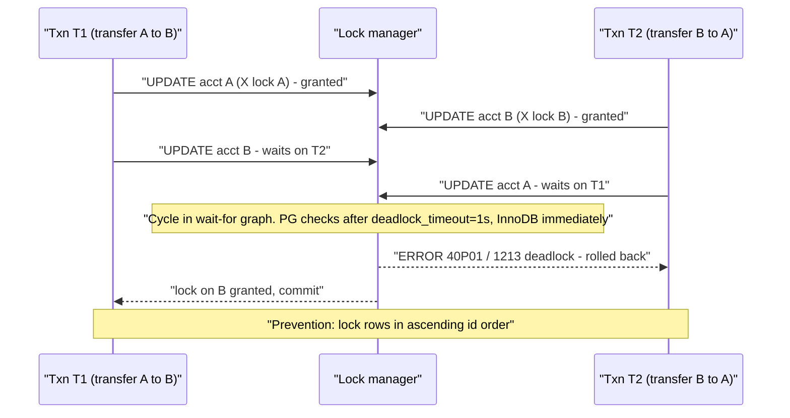
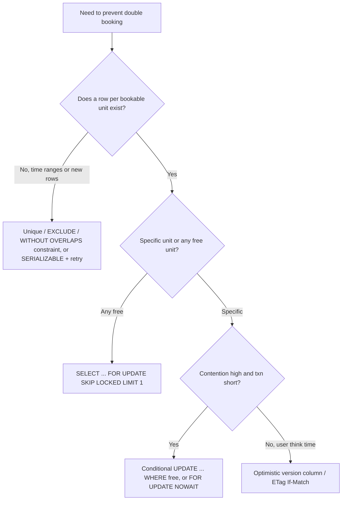
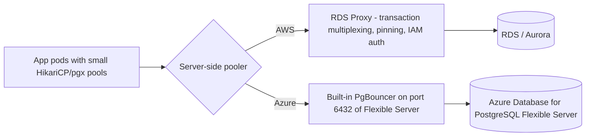

# B7 Concurrency Control
> Last verified: 2026-10 · Audience: senior/staff DevOps, SRE, AI eng, NetEng, DevSecOps, architects

## TL;DR
- **Pessimistic vs optimistic.** Pessimistic control locks before acting: **S/X locks**, `SELECT … FOR UPDATE`. Optimistic control acts, then validates at write time using a version column, ETag or conditional write, and retries on conflict. Choose by **contention level** and **cost of a retry**.
- **S locks are compatible with S locks. X locks conflict with everything.** Real engines add **intention locks** (IS/IX), **row-level modes** (Postgres has 4: `FOR KEY SHARE` < `FOR SHARE` < `FOR NO KEY UPDATE` < `FOR UPDATE`) and InnoDB **gap/next-key locks**. In MVCC engines, plain reads take **no row locks** at all.
- **Deadlocks cannot be fully avoided, so plan for them.** Engines detect them and kill a victim: Postgres checks after `deadlock_timeout` = **1s** (SQLSTATE `40P01`), and InnoDB detects them immediately (`innodb_deadlock_detect=ON`, fallback `innodb_lock_wait_timeout` = **50s**). Prevent them with **consistent lock ordering**, short transactions and the strongest lock taken up front. **Always retry** aborted transactions.
- **2PL** has a growing phase then a shrinking phase, which guarantees **conflict serializability**. **Strict 2PL** holds X locks until commit or abort, which prevents cascading aborts. **Rigorous/SS2PL** holds all locks until commit, and this is what real lock-based DBs do. 2PL does **not** prevent deadlocks.
- **Double booking is a race between check and insert.** The fixes, roughly from best to most situational:
  - a **DB constraint**: unique or **exclusion constraint** (PG 18 adds `WITHOUT OVERLAPS`)
  - an **atomic conditional UPDATE**: `… WHERE booked_by IS NULL` and check the affected row count
  - `SELECT … FOR UPDATE` on a row that already exists
  - an **optimistic version column**
  - `SKIP LOCKED` to hand out items like a queue, which avoids contention
  - `SERIALIZABLE` (SSI) with retry on `40001`
- **OFFSET is O(offset + limit).** The DB still produces and throws away every skipped row, and pages drift when rows are inserted. **Keyset/seek pagination** (`WHERE (ts,id) < ($1,$2) ORDER BY ts DESC, id DESC LIMIT n`) is O(log n + limit) on a composite index.
- **Keep connection pools small.** HikariCP's rule of thumb is `connections = (cores × 2) + effective_spindles`. PgBouncer **transaction mode** breaks **session state**: `SET`, session advisory locks, `LISTEN`, `WITH HOLD` cursors and SQL `PREPARE`. Protocol-level prepared statements work if `max_prepared_statements > 0`. **RDS Proxy pins** sessions on similar triggers.
- **Cloud equivalents:**
  - Pooling: RDS Proxy (managed, separate endpoint, IAM auth, faster failover) ↔ **built-in PgBouncer** on Azure Database for PostgreSQL Flexible Server (port 6432, not on Burstable).
  - Optimistic writes: DynamoDB `ConditionExpression` ↔ Cosmos DB `_etag` + `If-Match` (HTTP **412**).
  - Distributed locks: DynamoDB lock table ↔ **Blob lease** (15–60 s or infinite). Any lease-based lock needs **fencing tokens** for correctness.

## B7.1 Shared vs Exclusive Locks
- **How it works:**
  - **Shared (S)** is a read lock. Many holders are allowed, and it blocks writers. **Exclusive (X)** is a write lock. Only one holder is allowed, and it blocks everyone else who wants a lock. Under MVCC, plain `SELECT` takes no row lock in PG or InnoDB (consistent read).
  - Compatibility matrix (Gray's multi-granularity locking):

    | Held \ Requested | IS | IX | S | SIX | X |
    |---|---|---|---|---|---|
    | IS | ✔ | ✔ | ✔ | ✔ | ✘ |
    | IX | ✔ | ✔ | ✘ | ✘ | ✘ |
    | S | ✔ | ✘ | ✔ | ✘ | ✘ |
    | SIX | ✔ | ✘ | ✘ | ✘ | ✘ |
    | X | ✘ | ✘ | ✘ | ✘ | ✘ |
  - **Intention locks** (IS/IX) go on the table so that a table-level lock request does not have to scan every row lock. InnoDB `SELECT … FOR SHARE` takes IS on the table and S on the rows. `FOR UPDATE`/DML takes IX on the table and X on the rows.
  - **Postgres row-lock modes**, with their conflict table:

    | Requested \ Held | KEY SHARE | SHARE | NO KEY UPDATE | UPDATE |
    |---|---|---|---|---|
    | `FOR KEY SHARE` | | | | X |
    | `FOR SHARE` | | | X | X |
    | `FOR NO KEY UPDATE` | | X | X | X |
    | `FOR UPDATE` | X | X | X | X |
    - An `UPDATE` that doesn't change a key column takes **`FOR NO KEY UPDATE`**. FK checks take **`FOR KEY SHARE`** on the parent row. That is why child inserts don't block normal updates of the parent.
    - Row locks are stored **in the tuple header (xmax)**, not in shared memory, so the number of row locks is unlimited. `max_locks_per_transaction` (default **64**) limits **objects** (tables and indexes), not rows.
  - **Postgres table locks:** there are 8 modes, from `ACCESS SHARE` (SELECT) up to `ACCESS EXCLUSIVE` (DDL such as `ALTER TABLE`, `DROP`, `VACUUM FULL`). `ACCESS EXCLUSIVE` conflicts even with plain SELECT.
  - **InnoDB extras** under REPEATABLE READ: **record**, **gap** and **next-key** (record + gap before it) locks. These prevent phantoms for locking reads and ranges. **Insert-intention** gap locks let concurrent inserts into the same gap proceed when their positions differ.
  - **SQL Server:** S/U/X/IS/IX/SIX plus key-range locks. The **U (update) lock** exists to avoid the classic S→X conversion deadlock. **Lock escalation** to table level happens at about **5,000 locks** on one object.
- **Trade-offs / when to use:**
  - Finer granularity (row level) means more concurrency but more lock-manager overhead. Escalation trades concurrency for memory.
  - Readers blocking writers is a 2PL-only concern. MVCC removes read/write blocking, but **write/write** conflicts still serialize on X locks.
- **Interview angles:**
  - "Why does my ALTER TABLE take the site down?" → It needs `ACCESS EXCLUSIVE` and **queues behind** a long SELECT. Every new query then queues behind the ALTER. This is the **lock-queue pile-up**. Fix: `SET lock_timeout='3s'` and retry, then do DDL in small steps (see [B3.8](./B3-database-indexing.md#b38-create-index-concurrently-avoid-blocking-production-database-writes)).
  - "S→X upgrade deadlock": two sessions both hold S and both request X. Use `FOR UPDATE` (or a U lock in SQL Server) up front.
  - Know the diagnostic views:
    - Postgres: `pg_locks` joined with `pg_stat_activity`, and `pg_blocking_pids(pid)`
    - MySQL: `performance_schema.data_locks` / `data_lock_waits`, and `sys.innodb_lock_waits`
    - SQL Server: `sys.dm_tran_locks`

## B7.2 Dead Locks
- **How it works:**
  - **Coffman conditions:** mutual exclusion, hold-and-wait, no preemption, **circular wait**. Breaking any one prevents deadlock. In practice, break **circular wait** through ordering.
  - Detection works by finding a cycle in the **wait-for graph**. The victim's transaction is rolled back, and the application must retry.
  - **PostgreSQL:**
    - Waits **`deadlock_timeout` (default 1s)** before running the expensive deadlock check. The doc's advice is to set it above your typical transaction time.
    - The victim gets `ERROR: deadlock detected` (**SQLSTATE 40P01**).
    - `log_lock_waits` logs any wait longer than `deadlock_timeout`. It is **off by default up to PG 18, and PG 19 flips it to on**.
    - Use `lock_timeout` to fail fast instead of waiting.
  - **MySQL InnoDB:**
    - **`innodb_deadlock_detect=ON`** by default and detects deadlocks immediately. It rolls back the **smaller** transaction (rows inserted, updated or deleted).
    - If the wait-for list goes past **200 transactions** or **1,000,000 locks**, the checking transaction itself is rolled back ("TOO DEEP OR LONG SEARCH").
    - On very high-concurrency hot rows, detection itself can become a bottleneck. You can turn it **OFF** and rely on **`innodb_lock_wait_timeout` (default 50s)**, usually lowered.
    - Look at `SHOW ENGINE INNODB STATUS` → LATEST DETECTED DEADLOCK. `innodb_print_all_deadlocks=ON` logs every deadlock.
  - **SQL Server:** a lock monitor thread checks every **5s** by default and more often once deadlocks are found. The victim gets error **1205**, and `DEADLOCK_PRIORITY` influences the choice. Use the system_health XE session for deadlock graphs.
- **Prevention (what to say):**
  1. **Lock in a global order**, e.g. always lock `account_id` ascending in a transfer (`SELECT … WHERE id IN (a,b) ORDER BY id FOR UPDATE`).
  2. Take the **strongest lock first**. Don't read with S and then upgrade to X.
  3. Keep transactions **short**: no network calls or user think time inside a transaction. Set `idle_in_transaction_session_timeout`.
  4. Use **indexes** so UPDATE/DELETE lock fewer rows. In InnoDB, an unindexed predicate locks every row it scans.
  5. Batch large updates in **deterministic key order**.
  6. Use **timeouts** (`lock_timeout`) and **retry with jitter**. Retrying is mandatory, because detection only picks a loser.
- **Trade-offs:** detection is cheap when deadlocks are rare. Timeouts alone can't tell a deadlock from a long wait. Wound-wait and wait-die are prevention schemes based on timestamps, used in distributed DBs such as Spanner (wound-wait).
- **Interview angles:**
  - "Two transfers deadlock" → explain the cycle, then order by account id. Mention that a single `UPDATE … SET balance = CASE …` statement also works.
  - "Deadlocks rose after we added an FK/index/trigger" → hidden locks: FK `KEY SHARE` locks, InnoDB gap locks on unique checks, triggers touching other tables.
  - Pitfall: treating `40P01`/`1213`/`40001` as fatal errors instead of **retryable** ones.

## B7.3 Two-phase Locking
- **How it works:**
  - **Basic 2PL** has a **growing phase**, where locks are only acquired, and then a **shrinking phase**, where locks are only released. This guarantees **conflict serializability**.
  - **Strict 2PL (S2PL)** holds **X locks until commit/abort**. This gives recoverable schedules with **no cascading aborts**, because nobody reads uncommitted writes.
  - **Strong strict / rigorous 2PL (SS2PL)** holds **all** locks (S and X) until the transaction ends. Commit order then equals serialization order. This is what lock-based engines implement, and it is the standard reference point for "serializable" in lock-based systems.
  - 2PL alone **does not prevent deadlocks** (it can cause them), and it does not prevent **phantoms** unless you add predicate, range or next-key locks.
  - **Different from two-phase commit (2PC)**, which is an atomic-commit protocol across nodes. Interviewers test this confusion.
- **Who uses what:**

  | Engine | Approach |
  |---|---|
  | PostgreSQL | MVCC + row/table locks. `SERIALIZABLE` = **SSI** (Serializable Snapshot Isolation, non-blocking SIREAD predicate locks, aborts with `40001`) |
  | MySQL InnoDB | MVCC for consistent reads. Locking reads/DML use S2PL with next-key locks. `SERIALIZABLE` turns plain SELECTs into `FOR SHARE` |
  | SQL Server | Lock-based 2PL by default (READ COMMITTED with locks). `READ_COMMITTED_SNAPSHOT` / `SNAPSHOT` add MVCC. **Azure SQL Database enables RCSI by default** |
  | Spanner / CockroachDB | Spanner: 2PL + wound-wait for RW transactions, TrueTime for external consistency. Cockroach: MVCC + serializable with timestamp ordering |
- **Trade-offs:** 2PL is simple and correct, but readers block writers and throughput falls under contention. OCC/SSI does better at low conflict rates and wastes work at high ones.
- **Interview angles:**
  - "Is 2PL enough for serializable?" → Only with predicate/range locks against phantoms, and you need S2PL for recoverability.
  - "2PL vs 2PC?" → Concurrency control inside one DB vs atomic commit across participants. A distributed DB may use both, as Spanner does.

## B7.4 Solving the Double Booking Problem
- **The bug (TOCTOU):**
  1. T1: `SELECT … WHERE seat=7 AND booked=false` → free.
  2. T2: the same read → free.
  3. Both `UPDATE`/`INSERT` → double booking.
  - Under **READ COMMITTED** (the PG and SQL Server default) and **REPEATABLE READ/snapshot**, this **write skew** is not prevented when the conflict is "insert a new row" (nothing exists to lock). It *is* prevented for an update of the same row: PG RR aborts with a serialization failure, and PG READ COMMITTED re-checks the WHERE clause after waiting.
- **Fix 1: pessimistic row lock on an existing row.**
  - `BEGIN; SELECT … FROM seats WHERE id=7 FOR UPDATE; -- check; UPDATE …; COMMIT;`
  - The second transaction **blocks** until the first commits. In PG READ COMMITTED it then **re-reads the latest row version**, sees the seat is booked, and aborts or chooses another seat.
  - Add `NOWAIT` to error out immediately, or `lock_timeout` to cap the wait.
  - **Only works if the row exists.** You can't lock a row that hasn't been inserted yet. For "no overlapping reservation", use a constraint (Fix 3), lock a **parent row** (the room or event row), or use `SERIALIZABLE`.
- **Fix 2: atomic conditional UPDATE (often the best answer).**
  - `UPDATE seats SET user_id=$u WHERE id=7 AND user_id IS NULL;` → **rowcount 1 = success, 0 = taken**.
  - One statement, no read-then-write gap, and the row lock is held only for that statement.
- **Fix 3: let the database enforce the invariant (strongest).**
  - Discrete slots: a **unique constraint** on `(event_id, seat_no)` or `(room_id, night)`. The loser gets a **unique violation** (PG `23505`, MySQL `1062`), which you map to "already booked".
  - Time ranges: a PG **exclusion constraint**: `EXCLUDE USING gist (room_id WITH =, during WITH &&)` (needs `btree_gist`).
  - **PG 18** adds temporal keys: `PRIMARY KEY (room_id, during WITHOUT OVERLAPS)`, backed by GiST, with the same semantics and simpler syntax.
  - Constraints work no matter which code path writes, and they also cover inserts of new rows.
- **Fix 4: `SERIALIZABLE`.** PG SSI detects the rw-dependency cycle and aborts one transaction with `40001`. This is correct for arbitrary invariants, but you must **retry** every transaction, and the abort rate rises under contention.
- **Trade-offs / when to use:**
  - **Hot inventory** (concert on-sale): row locks serialize every buyer on a few rows. Use **SKIP LOCKED** ([B7.5](#b75-double-booking-problem-part-2-alternative-solution)), pre-split inventory into rows, or a **queue/reservation-hold** pattern with TTL (e.g. Ticketmaster-style 10-minute holds).
  - **Low contention**: an optimistic version column or a conditional UPDATE is cheapest.
- **Interview angles:**
  - Always say **"enforce the invariant in the DB with a constraint, then handle the violation"**. Application-level checks alone are a red flag.
  - Follow-up "what about sharded/multi-region?" → the constraint only holds within one shard. Route all bookings for one resource to the same shard or partition key (see [B6](./B6-database-sharding.md)), or use a conditional write per item (DynamoDB/Cosmos).
  - Pitfall: `SELECT … FOR UPDATE` **outside a transaction** (autocommit) releases the lock immediately, so it does nothing.

## B7.5 Double Booking Problem Part 2 (alternative solution)
### Optimistic concurrency (version column / CAS)
- **How it works:**
  - Read `(…, version)`, then write `UPDATE t SET …, version=version+1 WHERE id=$id AND version=$v`. **0 rows updated** means a conflict, so re-read and retry or report it to the user.
  - No locks are held during user think time, so this is ideal for **web forms and long edits** and for HTTP APIs that use `ETag`/`If-Match` → **412 Precondition Failed**.
  - ORMs: JPA `@Version`, Hibernate, Django (`F()`/select_for_update), EF Core `[ConcurrencyCheck]`/`rowversion`.
  - Variants: `xmin` in Postgres (system column, changes on every update), SQL Server `rowversion`, `updated_at` (weaker because of clock resolution).
- **Trade-offs:** no blocking and no deadlocks, but **retries waste work under high contention** (livelock risk). It catches **lost updates** on one row but **not** write skew across rows.
### `SKIP LOCKED` (work-queue style allocation)
- **How it works:**
  - `SELECT id FROM seats WHERE event=$e AND status='free' ORDER BY id LIMIT 1 FOR UPDATE SKIP LOCKED;` then `UPDATE … SET status='held'`.
  - Concurrent buyers each get a **different** free seat instead of queueing on the same row.
  - Supported in PG 9.5+, MySQL 8.0+, Oracle, and SQL Server via `READPAST`.
  - PG docs: skipping rows "provides an inconsistent view of the data, so this is not suitable for general purpose work" but suits **queue-like tables**. Also, `NOWAIT`/`SKIP LOCKED` apply only to **row** locks. The table-level `ROW SHARE` lock is still taken normally.
- **Use for:** "give me *any* available seat or room", job queues (Postgres-as-a-queue, e.g. graphile-worker, Solid Queue, river), and outbox relays. **Not** for "this specific seat", where you need `FOR UPDATE`/`NOWAIT` or a constraint.
### Other alternatives
- **Advisory locks:** `pg_advisory_xact_lock(hashtext('room:42'))` serializes a logical resource that has no row yet. Prefer the **xact** variant, because **session advisory locks break under PgBouncer transaction mode** and **pin RDS Proxy** connections.
- **Reservation hold with expiry:** insert a `hold` row with `expires_at` (protected by a unique or exclusion constraint), then confirm or let a job reap expired holds. This decouples payment latency from lock duration.
- **Comparison:**

  | Approach | Blocks? | Handles "row doesn't exist yet" | Contention behaviour | Typical use |
  |---|---|---|---|---|
  | `FOR UPDATE` | Yes | No (lock a parent row) | Serializes | Specific seat or account |
  | Conditional UPDATE | Briefly | No | Good | Claim a slot |
  | Unique/exclusion constraint | Briefly on the index | **Yes** | Good, loser errors | Slots, time ranges |
  | Version column (OCC) | No | No | Retries explode | Low-contention edits, APIs |
  | `SKIP LOCKED` | No | No | Excellent | "Any free" item, queues |
  | `SERIALIZABLE` (SSI) | No (PG) | **Yes** | Aborts rise | Complex invariants |
- **Interview angles:**
  - "Optimistic or pessimistic?" → Optimistic when conflicts are rare and the critical section spans user think time. Pessimistic when conflicts are frequent and the transaction is short. Name the retry policy (bounded, with jitter, idempotency key).
  - DynamoDB/Cosmos have no `FOR UPDATE`, so you use conditional writes or ETags (see the cloud mapping below).

## B7.6 SQL Pagination With Offset is Very Slow
- **How it works:**
  - `ORDER BY created_at DESC LIMIT 20 OFFSET 100000` makes the engine **produce and discard 100,000 rows** (index walk plus heap fetches), so cost grows linearly with page depth.
  - Rows skipped by OFFSET in a `FOR UPDATE` query **still get locked** (PG docs).
  - Correctness problems: rows inserted or deleted between requests cause **duplicates or skipped items**, and the result is non-deterministic without a total order (a tie-breaker column).
- **Keyset / seek pagination:**
  - `WHERE (created_at, id) < ($last_ts, $last_id) ORDER BY created_at DESC, id DESC LIMIT 20` with an index on `(created_at, id)`.
  - Postgres supports **row-value comparison** directly. In MySQL, the row constructor is index-friendly only in recent versions, so you may need to expand it to `ts < ? OR (ts = ? AND id < ?)` (verify with EXPLAIN).
  - Cost is O(log n + page) at any depth, and results stay stable under inserts.
  - API shape: an **opaque cursor token** (base64 of last key + filter hash). Used by Stripe, GitHub GraphQL and Slack, and it matches DynamoDB `LastEvaluatedKey` and Cosmos `continuation` tokens.
- **Trade-offs:** keyset can't **jump to page N**. It needs a unique, deterministic sort key, and sorting by arbitrary user-chosen columns needs matching indexes. Options for "page N" UIs: cap the depth (e.g. 100 pages), use **deferred join** (`… JOIN (SELECT id … LIMIT … OFFSET …)` with a covering index), or use search engines with `search_after`.
- **Server-side cursors** (`DECLARE … CURSOR`) hold a snapshot and resources per client, and they are incompatible with PgBouncer transaction mode unless used inside one transaction. See [B11](./B11-database-cursors.md).
- **Interview angles:**
  - "Page 5,000 of results takes 3 s" → OFFSET scan. Switch to keyset and verify with `EXPLAIN (ANALYZE, BUFFERS)` that rows removed and buffers are small.
  - `COUNT(*)` for "total pages" is often the real cost. Show an estimate (`pg_class.reltuples`) or "more results available".
  - Cross-link: billion-row tables ([B3.10](./B3-database-indexing.md#b310-working-with-billion-row-table)).

## B7.7 Database Connection Pooling
- **Why:**
  - **Postgres** forks a **process per connection** (several MB of RSS plus catalog caches), and setting up TLS + auth costs milliseconds.
  - Thousands of idle connections waste RAM, and **lots of active connections** cause contention (LWLocks, CPU context switches, snapshot cost). Throughput **peaks at a small number of active connections, then falls**.
  - **MySQL** uses threads, which are cheaper, but has the same contention curve.
- **Client-side pools (HikariCP, pgx, SQLAlchemy, ADO.NET):**
  - HikariCP's starting formula: **`connections = (core_count × 2) + effective_spindle_count`**. For example, 4 cores + 1 disk → about **10**. Advice: "a small pool, saturated with threads waiting for connections".
  - Oracle demo: cutting the pool from 2048 to 96 connections took response time from ~100 ms to ~2 ms.
  - **Pool-locking (deadlock) formula** for code that holds several connections per thread: `pool = Tn × (Cm − 1) + 1`.
  - HikariCP defaults: `maximumPoolSize=10`, `connectionTimeout=30s`, `maxLifetime=30min`. Set `maxLifetime` **below** any LB, proxy or DB idle cutoff.
  - **Fleet math:** total = pods × pool size per pod. 200 pods × 10 = 2,000 connections, which exceeds `max_connections`. This is why you put a **server-side pooler** in front.
- **PgBouncer (server-side, single-threaded, event-driven):**

  | Mode | Server connection is returned… | Breaks |
  |---|---|---|
  | `session` (default) | when the client disconnects | nothing. Only limits concurrency |
  | `transaction` | at COMMIT/ROLLBACK | **SET/RESET** (use `SET LOCAL`), **LISTEN**, `WITH HOLD` cursors, SQL-level **PREPARE/DEALLOCATE**, `ON COMMIT PRESERVE/DELETE ROWS` temp tables, **LOAD**, **session advisory locks** |
  | `statement` | after each statement | multi-statement transactions are forbidden |
  - Protocol-level prepared statements in transaction mode are supported via **`max_prepared_statements`** (added in 1.21, default **200** in current releases, latest version **1.26** as of 2026-09).
  - Upstream defaults: `default_pool_size=20` per user/db pair, `max_client_conn=100`.
  - `server_reset_query` (`DISCARD ALL`) isn't used in transaction mode.
  - Because it is single-threaded, run **multiple instances** (`so_reuseport`) or use multithreaded poolers (**PgCat**, **Supavisor**, **Odyssey**) at very high connection rates.
- **RDS Proxy (AWS managed):**
  - Multiplexes at the **transaction** level.
  - **Pinning** keeps a client on one DB connection until it disconnects. Triggers:
    - PG: `SET`, `PREPARE/EXECUTE/DEALLOCATE`, temp tables/sequences/views, `DECLARE CURSOR`, `LISTEN`, `nextval/setval`, **session** `pg_advisory_lock` (the xact variants are fine), `DISCARD ALL`, `LOAD`
    - MySQL: `SET` user variables, `GET_LOCK`, `LOCK TABLES`, prepared statements, temp tables
    - All engines: any statement **> 16 KB**
  - Monitor `DatabaseConnectionsCurrentlySessionPinned`. Use an **initialization query** instead of per-session `SET`. MySQL also has **session pinning filters**.
  - Defaults: `IdleClientTimeout` **1,800 s**, `ConnectionBorrowTimeout` **120 s**, `MaxIdleConnectionsPercent` = 50% of `MaxConnectionsPercent`. Client connections have a hard **24 h max life**. AWS advises **≥30% headroom** in `MaxConnectionsPercent`.
- **Interview angles:**
  - "Lambda/serverless storms the DB" → RDS Proxy (or the Aurora Data API), plus small per-function pools, plus reserved concurrency.
  - "App broke after enabling PgBouncer transaction mode" → session state leaking between clients: a `search_path`/`SET` leak, `prepared statement "S_1" does not exist`, advisory locks released by the wrong client. Fix with `SET LOCAL`, xact-scoped locks, protocol-level prepares + `max_prepared_statements`, or session mode for that workload.
  - "Do I still need an app pool with RDS Proxy/PgBouncer?" → Yes, a small one, to avoid TLS/auth setup per request. Keep client `maxLifetime` under the proxy limits.
  - Pitfall: pool size > DB cores × small factor makes p99 **worse**. Size from measurement (Little's Law: concurrency = throughput × latency). See [J5](../J-sre/J5-capacity-planning-load-testing.md).

## Diagrams






## Cloud mapping: AWS vs Azure
| Capability | AWS | Azure | Role it plays | Key differences | Alternatives |
|---|---|---|---|---|---|
| Server-side connection pooling | **RDS Proxy** (MySQL, PG, MariaDB, SQL Server; RDS & Aurora) | **Built-in PgBouncer** on Azure DB for PostgreSQL Flexible Server. MySQL Flexible has none built in (self-host ProxySQL) | Multiplex many client connections onto few DB connections | RDS Proxy is a separate managed fleet with its own endpoint, IAM/Secrets Manager auth, and failover in seconds (keeps client connections). Billed per vCPU/ACU of the target. PgBouncer runs **on the DB VM**, port **6432**, no extra charge, transaction mode by default, **not on Burstable** | Self-managed PgBouncer/PgCat/Supavisor on EKS/AKS, ProxySQL, Aurora Data API |
| Optimistic concurrency (NoSQL) | DynamoDB **ConditionExpression** (`attribute_not_exists`, `version = :v`) → `ConditionalCheckFailedException` | Cosmos DB **`_etag` + `If-Match`** → HTTP **412** | Lost-update and double-booking prevention without locks | Both are per item. DynamoDB `TransactWriteItems` handles ≤100 items, ≤4 MB, any tables in one Region/account, at 2× WCU. Cosmos **transactional batch** handles ≤100 ops, ≤2 MB, 5 s, **same logical partition key only** | MongoDB `findOneAndUpdate` with a version, Spanner RW txns |
| Multi-region write conflicts | DynamoDB global tables: **last-writer-wins** (MREC), so conditional/version checks are **not global**. MRSC mode exists for strong consistency (verify feature limits) | Cosmos multi-region writes: **LWW on `_ts`** by default, or a custom merge stored procedure / conflict feed | What happens when two regions accept conflicting writes | Neither gives cross-region OCC by default. Route a resource's writes to a home region | CockroachDB/Spanner (serializable multi-region) |
| Distributed lock / leader election | **DynamoDB lock table** (AWS DynamoDB Lock Client: conditional put, `leaseDuration`, heartbeat, record version number) | **Blob Storage lease**: 15–60 s or infinite, acquire/renew/change/release/break; wrong lease → 409/412 | Mutual exclusion across instances, singleton jobs | Blob lease is server-enforced on *blob writes* only. Both are **leases**: they expire, so a paused holder can act after expiry. Add **fencing tokens** | ElastiCache/MemoryDB ↔ Azure Cache for Redis / **Azure Managed Redis** (`SET NX PX`), etcd/ZooKeeper, **Kubernetes Lease** objects, Postgres advisory locks |
| Relational row locking | RDS/Aurora PG & MySQL (same engine semantics). Aurora MySQL writer-only locks | Azure DB for PG/MySQL Flexible, **Azure SQL DB (RCSI on by default)** | `FOR UPDATE`, deadlock detection | Engine behaviour is identical. Parameters (`deadlock_timeout`, `innodb_lock_wait_timeout`, `log_lock_waits`) are set via **parameter groups** (AWS) vs **server parameters** (Azure) | Cloud SQL, self-managed |

- **RDS Proxy:**
  - Lives in your VPC, can enforce TLS, and supports IAM DB auth end to end.
  - Reduces failover time by pointing at the new writer without DNS TTL waits.
  - Reserves some connections for monitoring.
  - Compare the **`DatabaseConnectionsBorrowLatency`** and `DatabaseConnectionsCurrentlySessionPinned` metrics.
- **Azure built-in PgBouncer:**
  - Version **1.25.2** (Oct 2026).
  - Enable with `pgbouncer.enabled=true` (no restart).
  - Defaults: `pool_mode=transaction`, `default_pool_size=50`, `max_client_conn=5000`, `max_prepared_statements=0` (raise it for protocol-level prepares).
  - On zone-redundant HA failover it restarts on the new primary with the same connection string, but **existing connections drop**.
  - It is a **single point of failure** and single-threaded. For scale or full control, Microsoft suggests PgBouncer/PgCat on VMs behind a load balancer.
  - The older **Single Server** (retired March 2025) had no built-in pooler.
- **DynamoDB vs Cosmos OCC:**
  - DynamoDB has **no ETag**. You model a `version` attribute (`@DynamoDBVersionAttribute`, or the Enhanced Client `@DynamoDbVersionAttribute`).
  - Failed conditional writes still consume WCU. `ReturnValuesOnConditionCheckFailure=ALL_OLD` returns the current item without a separate read.
  - Cosmos `_etag` is automatic and server-generated. Stored procedures implicitly check ETags of touched items.
- **Distributed lock caveats (Redlock):**
  - Single-instance Redis lock: `SET key rand NX PX ttl`, released by compare-and-delete (Lua, or **`DELEX key IFEQ val` in Redis 8.4+**).
  - **Redlock** (N=5 independent masters, majority, validity = TTL − elapsed − drift) depends on bounded clock drift and on processes not pausing. Redis TTL uses the **wall clock**, not a monotonic one.
  - **Kleppmann:** a GC pause longer than the TTL lets two holders act, and Redlock has **no fencing tokens**. Use Redis locks for **efficiency** (avoid duplicate work). For **correctness**, use a consensus store (etcd/ZooKeeper; etcd's lease + revision gives a fencing token) **and** have the protected resource reject stale tokens.
  - Redis replica failover can lose a lock, because replication is async.
- **Retirements:** Azure Cache for Redis Basic/Standard/Premium is being retired in favour of **Azure Managed Redis** (retirement dates announced for 2027–2028, verify for your tier).

## Hands-on (optional)
```bash
# Reproduce a Postgres deadlock locally (two psql sessions)
docker run -d --name pg -e POSTGRES_PASSWORD=pw -p 5432:5432 postgres:18
psql "postgresql://postgres:pw@localhost/postgres" -c "CREATE TABLE acct(id int primary key, bal int); INSERT INTO acct VALUES (1,100),(2,100);"
# Session A: BEGIN; UPDATE acct SET bal=bal-10 WHERE id=1;   then later: UPDATE acct SET bal=bal+10 WHERE id=2;
# Session B: BEGIN; UPDATE acct SET bal=bal-10 WHERE id=2;   then later: UPDATE acct SET bal=bal+10 WHERE id=1;  -> ERROR 40P01 after ~1s

# Who blocks whom right now
psql "postgresql://postgres:pw@localhost/postgres" -c "SELECT pid, pg_blocking_pids(pid) AS blocked_by, wait_event_type, state, left(query,60) FROM pg_stat_activity WHERE cardinality(pg_blocking_pids(pid))>0;"

# Exclusion constraint against overlapping bookings
psql "postgresql://postgres:pw@localhost/postgres" -c "CREATE EXTENSION IF NOT EXISTS btree_gist; CREATE TABLE booking(room int, during tstzrange, EXCLUDE USING gist (room WITH =, during WITH &&));"

# MySQL: last deadlock
mysql -e "SHOW ENGINE INNODB STATUS\G" | sed -n '/LATEST DETECTED DEADLOCK/,/TRANSACTIONS/p'

# PgBouncer admin console: pool saturation (cl_waiting > 0 means clients are queueing)
psql "host=127.0.0.1 port=6432 dbname=pgbouncer user=stats" -c "SHOW POOLS;"
```

```hcl
# RDS Proxy target group tuning (Terraform)
resource "aws_db_proxy_default_target_group" "this" {
  db_proxy_name = aws_db_proxy.this.name
  connection_pool_config {
    max_connections_percent      = 80
    max_idle_connections_percent = 40
    connection_borrow_timeout    = 30
    init_query                   = "SET statement_timeout = '15s'"
  }
}
```

## Cross-links
- [B1 ACID](./B1-acid.md): isolation levels, read phenomena, write skew
- [B2 Database Internals](./B2-database-internals.md): MVCC, tuple headers, WAL
- [B3 Database Indexing](./B3-database-indexing.md): long-running transactions ([B3.12](./B3-database-indexing.md#b312-the-cost-of-long-running-transactions)), billion-row tables
- [B6 Database Sharding](./B6-database-sharding.md): constraints don't span shards
- [B8 Database Replication](./B8-database-replication.md): async replicas and lock loss, LWW
- [B11 Database Cursors](./B11-database-cursors.md): server-side cursors vs keyset
- [C1 Performance](../C-large-scale-architecture/C1-performance.md): locking and concurrency overlap (C1.20–C1.24)
- [C2 Scalability](../C-large-scale-architecture/C2-scalability.md), [D2 Reusable parts of system design](../D-system-design/D2-reusable-parts-of-system-design.md)
- [J5 Capacity planning](../J-sre/J5-capacity-planning-load-testing.md): Little's Law for pool sizing

## Sources
- https://www.postgresql.org/docs/current/explicit-locking.html
- https://www.postgresql.org/docs/current/runtime-config-locks.html
- https://www.postgresql.org/docs/current/sql-select.html
- https://dev.mysql.com/doc/refman/8.4/en/innodb-deadlock-detection.html
- https://www.pgbouncer.org/features.html
- https://www.pgbouncer.org/config.html
- https://github.com/brettwooldridge/HikariCP/wiki/About-Pool-Sizing
- https://learn.microsoft.com/en-us/azure/postgresql/flexible-server/concepts-pgbouncer
- https://docs.aws.amazon.com/AmazonRDS/latest/UserGuide/rds-proxy-pinning.html
- https://docs.aws.amazon.com/AmazonRDS/latest/UserGuide/rds-proxy-connections.html
- https://docs.aws.amazon.com/amazondynamodb/latest/developerguide/DynamoDBMapper.OptimisticLocking.html
- https://docs.aws.amazon.com/amazondynamodb/latest/developerguide/transaction-apis.html
- https://aws.amazon.com/blogs/database/building-distributed-locks-with-the-dynamodb-lock-client/
- https://learn.microsoft.com/en-us/azure/cosmos-db/database-transactions-optimistic-concurrency
- https://learn.microsoft.com/en-us/azure/cosmos-db/transactional-batch
- https://learn.microsoft.com/en-us/rest/api/storageservices/lease-blob
- https://redis.io/docs/latest/develop/clients/patterns/distributed-locks/
- https://martin.kleppmann.com/2016/02/08/how-to-do-distributed-locking.html
