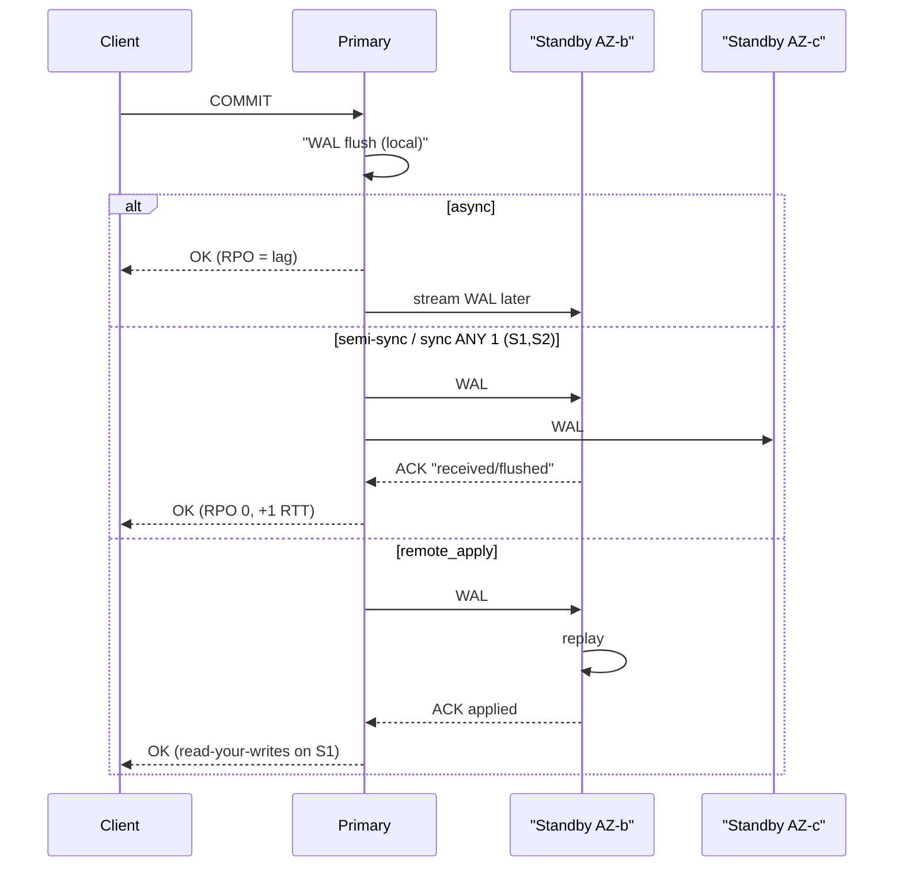
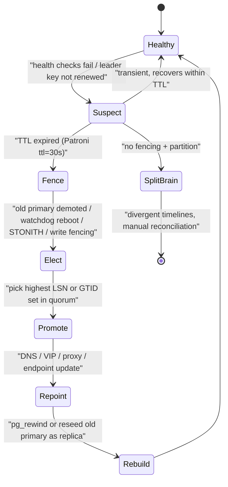
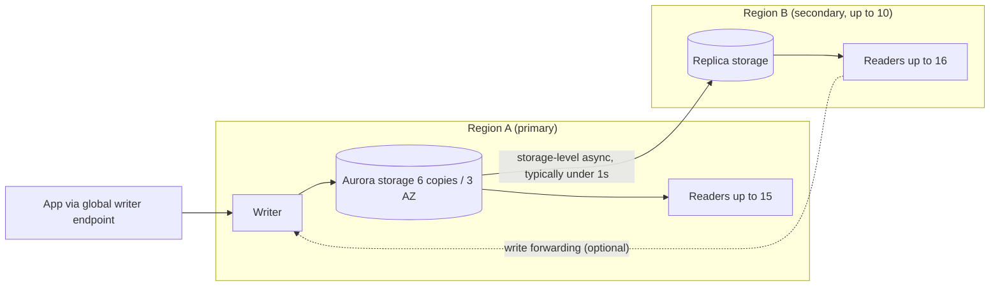

# B8 Database Replication
> Last verified: 2026-10 · Audience: senior/staff DevOps, SRE, AI eng, NetEng, DevSecOps, architects

## TL;DR
- Replication copies the **change log** to other nodes: the **WAL** in Postgres, the **binlog** in MySQL, the **transaction log** in SQL Server, or a storage-layer redo log in Aurora. You get **HA** (failover), **read scale-out** and **DR**. It is **not a backup**: a `DROP TABLE` or a bad `UPDATE` replicates within milliseconds. You still need PITR.
- **Single-leader** (primary/standby) is the default for OLTP. **Physical** (byte/block-level WAL streaming) gives exact replicas of the whole cluster, same major version only. **Logical** (row changes decoded from the log) works across versions and schemas, can replicate selected tables, and supports CDC and zero-downtime upgrades.
- The commit mode decides **RPO**. **Async** means RPO > 0 with the lowest latency. **Semi-sync** waits for ≥1 replica to *receive* the change (MySQL `AFTER_SYNC`; RDS Multi-AZ DB cluster). **Sync** waits for a replica to flush, or with `remote_apply`, to apply. **Quorum commit** (`ANY k (…)`) keeps RPO at 0 while tolerating slow nodes.
- **Replication lag** breaks **read-your-writes** and **monotonic reads**. Fixes: read from the primary after a write (sticky window), wait for the LSN/GTID before reading, session tokens (Cosmos DB), or a sync `remote_apply` standby.
- **Failover** is the hard part. You need detection, **leader election through a consensus store** (etcd/Consul/ZooKeeper in Patroni; the control plane in managed services), and **fencing** (STONITH, watchdog, write fencing, DNS/endpoint flip). Without fencing you get **split-brain**: two primaries accepting writes and diverging timelines.
- **Multi-master/multi-region writes** need **conflict handling**. Options: **LWW** by timestamp (DynamoDB MREC, Cosmos DB default), **custom merge** (Cosmos DB stored procedure), **CRDTs**, **certification** (MySQL Group Replication, Galera), or skipping conflicts entirely with **consensus/strong consistency** (DynamoDB MRSC, Aurora DSQL, Spanner). The best design avoids conflicts: route each key to a **home region**.
- Typical managed numbers:
  - **RDS Multi-AZ instance:** sync, standby not readable, failover 60–120 s.
  - **RDS Multi-AZ DB cluster:** semi-sync, 2 readable standbys, failover under 35 s.
  - **Aurora:** 6 copies across 3 AZs, failover usually under 30 s.
  - **Aurora Global Database:** lag usually under 1 s, up to 10 secondary Regions, switchover RPO 0.
  - **Azure SQL failover group:** RTO under 60 s, RPO ≥ 0.
  - **Azure PG/MySQL zone-redundant HA:** RPO 0, failover 60–120 s.
  - **DynamoDB MRSC:** RPO 0. MREC: RPO is roughly the replication delay.
  - **Cosmos DB multi-write:** RPO under 15 min, with no Strong consistency.

## B8.1 Master/Standby Replication
(Also called primary/replica, leader/follower, or single-leader. Modern docs avoid "master/slave"; MySQL 8.4 uses `SOURCE`/`REPLICA` syntax.)

### How it works
- **Single writer.** All writes go to the primary. The primary appends to its log, then ships the log to standbys, which **replay** it. Read-only standbys are **hot standbys** (PG `hot_standby=on`). Non-readable ones are **warm** standbys (RDS Multi-AZ instance, Azure PG/MySQL HA standby). For hot/warm/cold DR tiers see [C3.24–C3.26](../C-large-scale-architecture/C3-reliability.md).
- **PostgreSQL physical streaming:**
  - A `walsender` on the primary streams WAL records to a `walreceiver` on the standby. The **startup process** replays them. It can fall back to `restore_command` (WAL archive) to catch up.
  - The standby is **byte-identical**: the whole cluster, same major version and architecture. You cannot replicate one table, and you cannot write on the standby.
  - **Replication slots** make the primary keep WAL until each standby confirms it. An abandoned slot can **fill the primary's disk**. Defaults: `max_slot_wal_keep_size = -1` (unlimited), and PG 18 adds `idle_replication_slot_timeout` (default 0, meaning off). Azure PG switches the server to **read-only** at 95% storage.
  - **Query conflicts on hot standby:** replay may need to remove rows that a standby query still reads. Replay waits up to `max_standby_streaming_delay` (default **30 s**) and then cancels the query. `hot_standby_feedback=on` stops the cancels but causes **bloat on the primary**.
  - `wal_sender_timeout` default **60 s**.
- **PostgreSQL logical replication:**
  - Uses `CREATE PUBLICATION` and `CREATE SUBSCRIPTION`. The publisher decodes WAL (`wal_level=logical`) into row changes, and the subscriber applies them as normal DML.
  - Per-table, cross-major-version, and the subscriber is **writable**. Use it for **zero-downtime major upgrades**, consolidation, and CDC (Debezium/Kafka, see [M4](../M-data-platforms/M4-kafka-at-scale.md)).
  - Not replicated: **DDL**, **sequences** (sequence sync is newer; verify per version), and large objects. Tables need a **replica identity** (PK).
  - **Failover slots:** PG 17 adds `sync_replication_slots` on the standby and `synchronized_standby_slots` on the primary, so logical subscribers survive a physical failover. On ≤ 16 you need the `pg_failover_slots` extension (Azure documents this).
- **MySQL binlog replication:**
  - The source writes the **binary log**. Use `binlog_format=ROW`, which is the default; statement-based replication is unsafe for non-deterministic statements.
  - On the replica, the **receiver (I/O) thread** writes a **relay log**, and the **applier (SQL) threads** apply it. Applying is multi-threaded by default in 8.x (`replica_parallel_workers`).
  - **GTID** = `source_uuid:transaction_id`. MySQL 8.4 adds tagged GTIDs: `uuid:tag:n`.
    - With `gtid_mode=ON` and `enforce_gtid_consistency=ON`, `CHANGE REPLICATION SOURCE TO SOURCE_AUTO_POSITION=1` lets a replica find its position after failover without file/offset arithmetic.
    - A GTID that was already applied is **auto-skipped**, so re-applying is idempotent.
    - `gtid_executed` minus the source's set equals the missing transactions. Use this for **errant-transaction detection**: a replica that holds GTIDs the source never had has had local writes.
  - Azure MySQL Flexible HA **requires GTID**. Azure MySQL read replicas use binlog **file/position**-based replication.
- **SQL Server / Azure SQL:** **Always On availability groups** stream the transaction log. Active geo-replication uses AGs underneath and is **async**.
- **Aurora is different.** Replicas share one **distributed storage volume**: 6 copies across 3 AZs, written synchronously by the storage layer. Replicas get redo/cache-invalidation records instead of replaying a full copy. As a result, lag is usually **under 100 ms** (AWS's figure, unverified for current versions), adding a replica needs **no data copy**, and you can have up to **15 replicas**.

### Failover, split-brain, fencing
- **Steps:**
  1. **Detect.** Use health checks with several probes so you do not fail over on a network blip.
  2. **Elect.** Pick the **most up-to-date** candidate by highest LSN/GTID set, or by priority. Aurora uses promotion tiers 0–15, then the largest instance.
  3. **Promote.** PG: `pg_promote()` / `pg_ctl promote`, which creates a new **timeline**. MySQL: `STOP REPLICA; RESET REPLICA ALL`, then turn off `read_only`/`super_read_only`.
  4. **Repoint** clients through DNS/VIP/proxy.
  5. **Rebuild** the old primary as a replica. Use `pg_rewind` for PG.
- **Split-brain** happens when the old primary is still alive (network partition, GC pause, hung VM) while a new one is promoted. Both accept writes, and the timelines diverge. Fixes:
  - **Consensus lease.** Patroni keeps a leader key in **etcd/Consul/ZooKeeper/K8s** with a TTL. A primary that cannot renew its key **demotes itself**. Defaults: `ttl=30`, `loop_wait=10`, `retry_timeout=10`; the rule is `loop_wait + 2×retry_timeout ≤ ttl`.
  - **Watchdog.** Patroni can arm Linux `/dev/watchdog`, so if Patroni hangs while it is leader, the node **reboots** before the TTL expires. This is self-fencing.
  - **STONITH** ("shoot the other node in the head"): Pacemaker/Corosync power-fences the old node through IPMI or the cloud API.
  - **Witness / odd quorum:** 3 etcd nodes across 3 AZs; DynamoDB MRSC / Aurora DSQL use a **witness Region**.
  - **Write fencing at the storage layer:** Aurora Global Database managed failover tries to block writes on the old primary's storage. AWS calls this **best effort**, so split-brain is still possible. Lower client DNS TTL (about 5 s) and use the **global writer endpoint**.
  - **Epoch/term numbers or fencing tokens** on writes, so a stale leader's writes get rejected.
- **Patroni loss bounds:**
  - Async: worst-case loss is `maximum_lag_on_failover` (default 1 MiB of WAL; check your version) plus whatever was written in the last `ttl` seconds.
  - `synchronous_mode: on` never promotes a node that might lack acknowledged commits.
  - `synchronous_mode_strict` blocks writes when no sync standby exists, choosing durability over availability.
  - `synchronous_mode: quorum` uses PG `ANY k`.
  - `failsafe_mode` (default false) keeps the primary up when the DCS is down but all members can still see each other.
- **Client side:**
  - Use libpq multi-host `host=a,b,c target_session_attrs=read-write`, the MySQL Router / ProxySQL, **RDS Proxy** (AWS says it cuts Aurora failover time by up to 66% by bypassing DNS caching), or the Azure MySQL HA **SLB** (from Oct 2025, no DNS flip needed).
  - Always use the **FQDN** and never IPs, and keep the JVM DNS TTL low.

### Trade-offs / when to use
- Physical: whole-cluster HA/DR, simplest setup, lowest overhead. Logical: upgrades, partial replication, fan-in/fan-out, CDC. Logical costs more CPU and has DDL/sequence gaps.
- Readable standbys scale **reads only**. To scale writes you need sharding ([B6](./B6-database-sharding.md)).
- A hot standby running analytics can cancel or delay replay. Use a separate replica for BI and keep the HA standby clean.

### Interview angles
- "Design HA Postgres on VMs" → Patroni + 3-node etcd across 3 AZs + HAProxy/PgBouncer pointed at the Patroni REST health endpoints (`/primary`, `/replica`) + one sync standby (quorum) + one async DR replica + WAL archive to object storage (pgBackRest/WAL-G) for PITR. Name the fencing mechanism.
- "Standby disk filling on the primary?" → an inactive replication slot. Check `pg_replication_slots` (`active`, `wal_status`), set `max_slot_wal_keep_size`, and alert on lag in bytes.
- "Why GTID?" → position-independent failover, errant-transaction detection, idempotent re-apply. Pitfall: non-transactional statements break GTID consistency.
- "Replicas are lagging; what do you check?" → a single-threaded apply bottleneck, long transactions or DDL on the primary, replica I/O/CPU saturation, network, hot-standby query conflicts, missing PKs (MySQL row apply does full scans).
- Anti-pattern: DIY failover via cron + VIP with no quorum. That is a split-brain generator.

## B8.2 Multi-master Replication
### How it works
- More than one node accepts writes, and changes flow both ways. Any two concurrent writes to the same key can **conflict**. Conflicts include **update/update**, **insert/insert on a unique key**, **delete/update**, and **constraint violations across rows** (two regions each sell the last item), which no per-row rule can fix.
- **Conflict-handling strategies:**

| Strategy | How | Gotchas | Where |
|---|---|---|---|
| **Avoidance (home region / sticky ownership)** | Each key/tenant is written in exactly one region; failover moves ownership | Needs routing layer; ownership move must be fenced | Most "active-active" SaaS designs |
| **LWW (last-writer-wins)** | Highest timestamp wins per item | **Silent lost updates**; clock skew picks wrong winner; deletes need tombstones | DynamoDB MREC (internal timestamp), Cosmos DB default (`_ts`, or custom numeric path in the NoSQL API; **delete always wins**), Cassandra |
| **Custom merge** | App code merges the versions | Must be deterministic and commutative | Cosmos DB custom policy (merge stored proc; failures go to the **conflicts feed**; set only at container creation) |
| **CRDTs** | Data types whose merge is commutative, associative and idempotent (G-Counter, PN-Counter, OR-Set, LWW-Register, RGA for text) | Limited semantics; metadata growth; can't enforce invariants like `balance ≥ 0` | Redis Enterprise Active-Active (unverified), Riak, Automerge/Yjs |
| **Version vectors / siblings** | Detect concurrency, return all siblings to client | Client must resolve | Original Dynamo paper, Riak (see C6.32/C6.33, note managed DynamoDB is different) |
| **Certification (optimistic, group-wide)** | Txn write-set broadcast via group comm (Paxos); first to certify wins, the other aborts | Abort rate under hot rows; large txns | MySQL **Group Replication / InnoDB Cluster** (multi-primary mode), Galera / Percona XtraDB Cluster |
| **Consensus (no conflicts by construction)** | Every write commits through a Paxos/Raft quorum across regions | Cross-region RTT on every write | DynamoDB **MRSC**, Aurora **DSQL**, Spanner, CockroachDB/YugabyteDB |

- **Postgres:**
  - Core logical replication can be **bidirectional**. PG 16 added `origin = none` to stop loops. There is **no built-in resolution**: `insert_exists`, `update_exists` and `multiple_unique_conflicts` **stop apply** with an error, and `update_missing`/`delete_missing` are skipped.
  - PG 18 logs the conflict type and counts conflicts in `pg_stat_subscription_stats`. Turn on `track_commit_timestamp` for origin/timestamp detail.
  - To recover: `ALTER SUBSCRIPTION … SKIP (LSN …)` or `disable_on_error`.
  - Products that add resolution: EDB PGD (BDR), and **pgactive** on RDS.
- **DynamoDB Global Tables (version 2019.11.21):**
  - **MREC** is the default. Replication is async, typically **≤ 1 s**, and conflicts are resolved by LWW per item. A strongly consistent read is only strong for writes made **in the same Region**. Transactions are atomic **only in the Region they ran in**, so other Regions can see partial transactions. Monitor the `ReplicationLatency` metric. **RPO = replication delay.**
  - **MRSC** has been GA since **2025-06-30**:
    - Writes replicate **synchronously to ≥1 other Region** before they are acknowledged, and strongly consistent reads anywhere return the latest version. **RPO 0.**
    - Needs **exactly 3 Regions**: 3 replicas, or 2 replicas plus a **witness**. The table must be empty when converted. You cannot add or remove a single replica later.
    - Not supported: **transactions**, **TTL**, **LSIs**.
    - A concurrent write to the same item in another Region fails with `ReplicatedWriteConflictException`, and the client retries.
    - The consistency mode is fixed at creation.
  - SLA is **99.999%** for global tables versus 99.99% for a single Region.
- **Cosmos DB multi-region writes:**
  - Every region accepts writes, and conflicts are resolved by LWW or a custom policy.
  - **Strong consistency is not allowed** with multiple write regions. Bounded staleness in multi-write is an anti-pattern according to Microsoft.
  - RPO **< 15 min** for Session/Consistent Prefix/Eventual.
  - SLA is 99.999% for multi-region accounts (verify against the current SLA page).

### Trade-offs / when to use
- Use multi-master for **write latency locality** (users on several continents), **regional autonomy**, and **near-zero RTO** for writes. Each Region is pre-warmed and already writable.
- Costs: conflict semantics leak into the application, global invariants (uniqueness, counters, inventory) get hard, debugging gets hard, and **auto-increment keys collide**. Use UUIDv7/ULID, or MySQL `auto_increment_increment`/`auto_increment_offset`.
- Rule of thumb: use single-leader with fast failover unless write latency or regional autonomy is a hard requirement. If you need multi-region writes **and** correctness, choose a consensus-based store (MRSC/DSQL/Spanner) and accept roughly one cross-region RTT per write.

### Interview angles
- "Two users update the same profile in us-east and eu-west at once under DynamoDB MREC" → LWW per item. The whole item from the later writer wins, so field-level merges are lost. Mitigations: home-region routing for the user, or splitting fields into separate items, or MRSC, or conditional writes with a version attribute. **Caveat:** under MREC, conditions are evaluated only against the **local** replica.
- "Why is LWW dangerous?" → clock skew, plus a write that is acknowledged and then **silently discarded**. That is not durability in the ACID sense.
- "When do CRDTs fit?" → counters, sets, collaborative text, shopping carts (add-wins OR-Set). They do not fit bank balances with non-negative invariants. Those need coordination (escrow or reservations).
- "Galera / Group Replication multi-primary?" → certification-based. A hot row produces deadlock/abort errors on commit, so the client must retry. Most teams run **single-primary mode** anyway.

## B8.3 Synchronous vs Asynchronous Replication
### How it works

| Mode | Commit returns when… | RPO on primary loss | Latency cost | Availability risk |
|---|---|---|---|---|
| **Async** | Local WAL/binlog flushed | Lag at failure time (ms–minutes) | None | None (primary never waits) |
| **Semi-sync** (MySQL) | ≥ `rpl_semi_sync_source_wait_for_replica_count` (default 1) replicas wrote+flushed to **relay log** | ~0, but falls back to **async** after `rpl_semi_sync_source_timeout` (default **10 s**) | ≥1 RTT | Low, fallback silently weakens RPO |
| **Sync, `remote_write`** (PG) | Standby wrote WAL to OS (not fsync) | 0 unless primary + standby OS crash together | 1 RTT | Writes stall if sync standby gone |
| **Sync, `on`** (PG default when sync names set) | Standby **flushed** WAL to disk | 0 | 1 RTT + standby fsync | Same |
| **Sync, `remote_apply`** (PG) | Standby **replayed** WAL (visible to queries) | 0 + **read-your-writes on standby** | Highest | Same |
| **Quorum** | Any *k* of *n* acknowledged | 0 (if promotion picks a node in the quorum) | RTT to *k*-th fastest | Tolerates *n−k* slow/dead |

- **PostgreSQL syntax:** `synchronous_standby_names = 'FIRST 1 (s1, s2)'` is priority-based. `'ANY 2 (s1, s2, s3)'` is **quorum commit**. The legacy form `'s1, s2'` means `FIRST 1`. `synchronous_commit` can be set **per transaction**: use `SET LOCAL synchronous_commit = off` for unimportant logging writes and `remote_apply` for critical ones.
- **MySQL `AFTER_SYNC`** ("lossless semi-sync", the default wait point) waits for the replica ACK **before** the storage-engine commit, so no other session sees the data until a replica holds it. `AFTER_COMMIT` makes the data visible before the ACK. After a crash and failover, other clients may then have read data that is lost ("phantom read after failover").
- In MySQL 8.4 the plugins are `rpl_semi_sync_source` and `rpl_semi_sync_replica`. The `master`/`slave` names are deprecated.
- **Managed services:**
  - **RDS Multi-AZ DB instance:** synchronous **storage/block-level** replication to a passive standby.
  - **RDS Multi-AZ DB cluster:** engine-native **semi-sync**, an ACK from 1 of 2 readers. **Flow control** throttles the writer as lag approaches its target: MySQL `rpl_semi_sync_master_target_apply_lag` (default 120 s); PG `flow_control.target_standby_apply_lag`.
  - **Aurora:** quorum writes to storage (4 of 6 copies; reads need 3 of 6, from the Aurora paper). Reader instances are async.
  - **Azure PG HA:** sync streaming to the standby. A separate **WAL replica server in a third AZ** keeps **quorum commit** going when the standby is down.
  - **Azure MySQL HA:** commits are acknowledged after the log is flushed to **ZRS**, a sync storage layer that adds about 5–10% write latency. The standby replays binlogs from that storage.
  - **Cosmos DB:** always writes to a local majority (3 of 4 replicas). Strong consistency uses a **global majority** with *dynamic quorum*. Write latency is about 2× the RTT to the farthest region plus 10 ms at p99, and Strong is blocked by default above 8,000 km.
  - **Azure SQL geo-replication:** async. Call `sp_wait_for_database_copy_sync` after a critical commit to wait until the change is hardened on the geo-secondary.

### Trade-offs / when to use
- **In-region (AZ to AZ, about 1–2 ms RTT):** sync or semi-sync is cheap, so use it for HA with RPO 0.
- **Cross-region (30–150 ms RTT):** usually async. If RPO 0 is required, use **quorum across 3 Regions** (MRSC/DSQL pattern) or an app-level `wait_for_sync` on critical transactions only.
- **Sync with a single standby** halves availability: if the standby dies, writes block. Use ≥2 candidates with `ANY 1` or `FIRST 1`, or let Patroni drop to async (non-strict).
- **Bounded-loss middle ground:** `rds.global_db_rpo` on Aurora PostgreSQL Global Database (20 s minimum) **blocks commits** when every secondary is past the RPO target. This is RPO enforcement by backpressure. AWS advises against it with only 2 Regions, because after a failover it can stall writes.

### Interview angles
- "Semi-sync guarantees zero data loss?" → no. It falls back to async after the timeout (10 s default). And with `AFTER_COMMIT`, readers can see data that was never replicated. Monitor `Rpl_semi_sync_source_status`.
- "PG sync replication but a replica read still misses my write?" → `on` waits for **flush**, not **replay**. Use `remote_apply`, or read from the primary.
- "Quorum math" → with `ANY k` of *n*, promote only a node with the **highest LSN among a majority**. Patroni quorum mode tracks voters for this.
- Latency budget: a sync commit costs at least network RTT plus the remote fsync. Group commit amortizes it. The cost shows up in p99, not p50.

## B8.4 Pros and Cons of Replication
### Pros
- **HA:** automatic failover cuts RTO from hours (restore from backup) to seconds or minutes.
- **Read scale-out:** reporting, search indexing, geo-local reads. Aurora: 15 replicas. RDS: 15 read replicas per source. Azure PG: 5 (plus cascading, up to 30 total). Azure MySQL: 10.
- **DR:** cross-region replicas and global databases give RPO in seconds instead of hours (geo-restore).
- **Zero-downtime operations:** major upgrades through logical replication or blue/green, rolling maintenance (standby first, then failover), and migrations (Azure SQL geo-replication, DMS).
- **Isolation:** analytics on a replica protects OLTP latency.

### Cons / failure modes
- **Replication lag → stale reads.** You lose **read-your-writes**, **monotonic reads** and **consistent prefix**. See [B1.8 Eventual Consistency](./B1-acid.md#b18-eventual-consistency).
  - **Fixes:**
    - Read from the primary for N seconds after the user writes (a sticky "recently wrote" cookie).
    - Carry the **commit LSN/GTID** in the session and wait until the replica has replayed it (`pg_last_wal_replay_lsn() >= X`; MySQL `WAIT_FOR_EXECUTED_GTID_SET`).
    - Cosmos **session tokens**.
    - Pin a user to one replica for monotonic reads.
    - Use sync `remote_apply`.
- **Write amplification and cost:** every replica costs compute and storage, and cross-AZ/cross-Region transfer is billed.
- **Operational risk:**
  - Split-brain, errant transactions, broken replication after DDL or non-deterministic statements (MySQL cascading FK deletes break HA on Azure MySQL, bug 102586).
  - Slot-driven disk exhaustion.
  - Failover thundering herd from connection storms.
  - Config drift: parameter groups, secrets, alarms and IAM are **not** inherited on Aurora Global Database failover.
- **Errors replicate too.** Logical corruption and human error propagate immediately. Keep PITR, delayed replicas (PG `recovery_min_apply_delay`, MySQL `SOURCE_DELAY`), and immutable backups.
- **Consistency vs latency vs availability (PACELC).** Sync gives RPO 0 but you pay latency and give up availability when replicas are down. Async gives speed, but you risk losing data on failover.

### Typical RPO/RTO cheat sheet

| Setup | RPO | RTO (typical) |
|---|---|---|
| Backups + PITR only (single AZ) | 5 min (log backup interval; Azure SQL log backups 5–10 min) | Minutes–hours |
| RDS Multi-AZ DB instance | 0 | 60–120 s |
| RDS Multi-AZ DB cluster | ~0 (semi-sync) | < 35 s |
| Aurora (with replica) | 0 (shared storage) | < 60 s, often < 30 s; no replica → < 10 min |
| Aurora Global Database switchover / failover | 0 / seconds (lag, typically < 1 s) | < 30 s on recent versions / minutes |
| RDS cross-Region read replica promote | Lag (seconds+) | Minutes (manual) |
| Azure SQL zone-redundant HA | 0 | < 30 s |
| Azure SQL failover group / geo-replication | ≥ 0 (async lag) | < 60 s (customer-managed); MS-managed grace ≥ 1 h |
| Azure PG / MySQL Flexible zone-redundant HA | 0 | 60–120 s |
| Azure PG/MySQL cross-region read replica promote | Lag (seconds–minutes) | Minutes |
| DynamoDB Global Tables MREC / MRSC | Replication delay (≈ ≤1 s) / 0 | App-driven traffic shift (seconds) |
| Cosmos DB multi-region (session) / single-write strong | < 15 min / 0 | Service-managed failover |

### Interview angles
- "Users don't see their comment after posting" → replica lag plus round-robin reads. Fix with LSN-aware routing or primary-read stickiness, and measure lag in bytes and seconds.
- "Replication is our backup" → wrong. Name PITR, retention, delayed replica and immutable copies.
- Tie RPO/RTO to business tiers ([D1.23](../D-system-design/D1-system-design-basics.md#d123-disaster-recovery-rpo-vs-rto), [D1.24](../D-system-design/D1-system-design-basics.md#d124-different-disaster-recovery-options)), then pick the cheapest topology that meets them. Test it with failover game days ([J7](../J-sre/J7-chaos-engineering.md)).

## Diagrams







## Cloud mapping: AWS vs Azure

| Capability | AWS | Azure | Role it plays | Key differences | Alternatives |
|---|---|---|---|---|---|
| In-region HA, passive standby | RDS **Multi-AZ DB instance** (sync block-level, standby not readable, 60–120 s) | Azure PG/MySQL Flexible **zone-redundant HA** (PG: sync streaming + WAL quorum server; MySQL: ZRS log storage; 60–120 s; standby not readable); Azure SQL **zone-redundant** (built-in replicas, < 30 s) | AZ-failure protection, RPO 0 | Azure MySQL ZR-HA only at create time; Burstable tier unsupported on both Azure engines | Patroni on VMs/K8s, CloudNativePG |
| In-region HA with readable standbys | RDS **Multi-AZ DB cluster** (writer + 2 readable standbys, semi-sync, < 35 s; local-NVMe classes such as r6gd/m6gd) | Azure SQL **Business Critical / Premium** (AG replicas, `ApplicationIntent=ReadOnly`); Hyperscale HA replicas | HA + read scale with fast failover | No exact Azure PG/MySQL equivalent: standby isn't readable, so add read replicas | MySQL InnoDB Cluster |
| Shared-storage cluster | **Aurora** (6 copies/3 AZ, ≤15 replicas, failover < 30–60 s) | Azure SQL **Hyperscale** (log service + page servers, named/HA replicas) | Compute/storage separation, fast replica add | Aurora is MySQL/PG-compatible; Hyperscale is SQL Server engine | AlloyDB (GCP), Neon |
| Read replicas (async) | RDS read replicas (15/source, cross-Region; ≥5 cross-Region not guaranteed) | Azure PG read replicas (5 + cascading to 30, **virtual endpoints**); Azure MySQL (10, binlog) | Read scale, DR by promotion | Azure PG virtual endpoints keep a stable writer/reader name across promote/switchover | — |
| Cross-region DR, single writer | **Aurora Global Database** (≤10 secondaries, < 1 s lag, switchover RPO 0, managed failover, global writer endpoint, write forwarding) | Azure SQL **failover groups** (listener `<fog>.database.windows.net` / `.secondary.`, DNS TTL 30 s) / **active geo-replication** (≤4 readable geo-secondaries, chaining) | Regional DR, geo-local reads | FOG = group of DBs + stable endpoint; geo-rep = per-DB, endpoint changes; Microsoft-managed FOG failover ≥1 h grace, all FOGs in region (Microsoft recommends customer-managed) | Cross-region RDS replica; Kafka CDC |
| Multi-region **writes**, eventual | DynamoDB Global Tables **MREC** (LWW, ≤1 s) | Cosmos DB **multi-region writes** (LWW `_ts` / custom merge sproc, conflicts feed) | Active-active, local write latency | Cosmos has 5 consistency levels + session tokens; DynamoDB txns only regional under MREC | Cassandra/Astra, Redis Active-Active |
| Multi-region **strong** consistency | DynamoDB **MRSC** (3 Regions or 2 + witness, RPO 0; no txns/TTL/LSI); **Aurora DSQL** (2 active + witness Region, SQL) | Cosmos DB **Strong** with **single** write region (global majority, dynamic quorum; RPO 0); no Azure distributed-SQL equivalent of DSQL (Cosmos DB for PostgreSQL / Citus is sharding, not geo-strong) | Zero-RPO multi-region | Cosmos forbids Strong + multi-write; MRSC allows writes in all 3 Regions | Spanner (GCP), CockroachDB, YugabyteDB |
| Failover routing / pooling | RDS Proxy, Aurora cluster/reader/global endpoints, Route 53 | FOG listeners, Azure MySQL HA SLB, PG virtual endpoints, Traffic Manager/Front Door | Hide topology change from clients | Both rely on DNS by default, so keep client TTL low | PgBouncer, ProxySQL, HAProxy + Patroni |

- **RDS Multi-AZ instance vs Multi-AZ DB cluster (exam favourite):** the instance has 1 hidden standby with storage-level sync. The cluster has 2 **readable** standbys across 3 AZs with engine-native semi-sync, a reader endpoint, faster failover and lower commit latency (local NVMe plus EBS). Cluster failover time depends on replica lag: for MySQL, **both** readers must apply first; for PG, the **least-lagged** reader applies and is promoted. RDS calls the cluster's members "readers"; this note also calls them "standbys".
- **Aurora Global Database:**
  - **Switchover**, formerly "managed planned failover", syncs first, so **RPO 0**. It takes under 30 s on Aurora MySQL 3.09+ and recent PG minors.
  - **Failover** (`--allow-data-loss`) does not wait for sync, so RPO equals lag. Aurora takes a snapshot of the old volume (`rds:unplanned-global-failover-…`) so you can recover the lost tail.
  - Secondaries get up to 16 readers. Aurora Auto Scaling is not supported on secondaries.
- **Azure SQL:**
  - Failover groups **cannot** have a secondary in the same region. Multiple secondaries per FOG (up to 4) are **preview** as of 2026.
  - "Failover" (planned) = no data loss. "Forced failover" = possible loss.
  - A **license-free standby replica** is available for DR-only geo-secondaries.
  - Secondaries created by a FOG do **not** inherit zone redundancy (except in Hyperscale).
- **Azure PostgreSQL Flexible:** the HA standby is not readable, and there is only 1 standby. WAL recovery runs at about 40 MB/s (up to 200 MB/s on larger SKUs), which bounds failover time under heavy write load. PG 17+ preserves logical slots with `sync_replication_slots` plus `hot_standby_feedback`. SLA is about 99.99% zone-redundant versus 99.95% zonal.
- **DynamoDB vs Cosmos DB:**
  - DynamoDB chooses consistency **per table at creation** (MREC or MRSC). Cosmos chooses an **account default** that can be relaxed per request.
  - Cosmos multi-write is always eventual-family across regions, and conflicts are visible through the conflicts feed. DynamoDB MRSC rejects concurrent cross-Region item writes (`ReplicatedWriteConflictException`) instead of merging them.
  - DynamoDB Streams are always on for MREC and are what drives replication. MRSC doesn't use Streams.
- **Alternatives:** Patroni or **CloudNativePG** on Kubernetes (the operator manages failover, using the K8s API as the DCS); Kafka/Debezium CDC for heterogeneous replication; Spanner (GCP) as the canonical global-strong SQL.

## Hands-on (optional)
```bash
# Postgres: who is primary, lag in bytes/seconds, slot health
psql -h primary -c "select application_name, state, sync_state, pg_wal_lsn_diff(pg_current_wal_lsn(), replay_lsn) as lag_bytes, replay_lag from pg_stat_replication;"
psql -h primary -c "select slot_name, active, wal_status, pg_size_pretty(pg_wal_lsn_diff(pg_current_wal_lsn(), restart_lsn)) as retained from pg_replication_slots;"
psql -h replica -c "select pg_is_in_recovery(), now() - pg_last_xact_replay_timestamp() as replay_delay;"

# Quorum commit: any 1 of 2 standbys must flush before COMMIT returns
psql -h primary -c "ALTER SYSTEM SET synchronous_standby_names = 'ANY 1 (s1, s2)';" -c "SELECT pg_reload_conf();"

# MySQL: GTID state and semi-sync status
mysql -h source -e "SELECT @@gtid_mode, @@global.gtid_executed\G; SHOW STATUS LIKE 'Rpl_semi_sync_source_status';"
mysql -h replica -e "SHOW REPLICA STATUS\G" | grep -E 'Seconds_Behind_Source|Retrieved_Gtid_Set|Executed_Gtid_Set'

# Patroni: topology and a controlled switchover
patronictl -c /etc/patroni.yml list
patronictl -c /etc/patroni.yml switchover --leader pg1 --candidate pg2 --force

# AWS: Aurora Global Database planned switchover (RPO 0) vs DR failover
aws rds switchover-global-cluster --global-cluster-identifier gdb --target-db-cluster-identifier arn:aws:rds:eu-west-1:111122223333:cluster:gdb-eu
aws rds failover-global-cluster --global-cluster-identifier gdb --target-db-cluster-identifier arn:aws:rds:eu-west-1:111122223333:cluster:gdb-eu --allow-data-loss
```

```hcl
# Azure SQL failover group with customer-managed failover (recommended)
resource "azurerm_mssql_failover_group" "fog" {
  name      = "app-fog"            # becomes app-fog.database.windows.net
  server_id = azurerm_mssql_server.primary.id
  databases = [azurerm_mssql_database.app.id]

  partner_server {
    id = azurerm_mssql_server.secondary.id   # must be a different region
  }

  read_write_endpoint_failover_policy {
    mode = "Manual"
  }
}

# AWS: RDS Multi-AZ instance + cross-Region read replica for DR
resource "aws_db_instance" "primary" {
  identifier              = "app-pg"
  engine                  = "postgres"
  instance_class          = "db.r6g.large"
  allocated_storage       = 100
  multi_az                = true
  backup_retention_period = 7   # required for read replicas
  username                = "app"
  manage_master_user_password = true
  skip_final_snapshot     = true
}
# The cross-Region replica uses a second provider and replicate_source_db = aws_db_instance.primary.arn
```

## Cross-links
- [C2.10 Database replication](../C-large-scale-architecture/C2-scalability.md#c210-database-replication) · [C2.11 Database replication types](../C-large-scale-architecture/C2-scalability.md#c211-database-replication-types)
- [C3.24 Hot standby](../C-large-scale-architecture/C3-reliability.md#c324-database-recovery-with-hot-standby) · [C3.25 Warm standby](../C-large-scale-architecture/C3-reliability.md#c325-database-recovery-with-warm-standby) · [C3.26 Cold backups](../C-large-scale-architecture/C3-reliability.md#c326-database-recovery-with-cold-backups)
- [D1.23 RPO vs RTO](../D-system-design/D1-system-design-basics.md#d123-disaster-recovery-rpo-vs-rto) · [D1.24 DR options](../D-system-design/D1-system-design-basics.md#d124-different-disaster-recovery-options)
- [B1 ACID (durability/WAL, eventual consistency)](./B1-acid.md) · [B2 Database internals](./B2-database-internals.md) · [B6 Sharding](./B6-database-sharding.md) · [B7 Concurrency control](./B7-concurrency-control.md) · [B9 Database system design](./B9-database-system-design.md)
- Dynamo model (leaderless, version vectors): [C6 Technology stack](../C-large-scale-architecture/C6-technology-stack.md) (C6.32, C6.33)
- [J1 SLOs/error budgets](../J-sre/J1-slis-slos-error-budgets.md) · [J7 Chaos engineering](../J-sre/J7-chaos-engineering.md) · [M4 Kafka at scale (CDC)](../M-data-platforms/M4-kafka-at-scale.md)

## Sources
- https://www.postgresql.org/docs/current/runtime-config-replication.html
- https://www.postgresql.org/docs/current/logical-replication-conflicts.html
- https://dev.mysql.com/doc/refman/8.4/en/replication-semisync.html
- https://dev.mysql.com/doc/refman/8.4/en/replication-gtids-concepts.html
- https://patroni.readthedocs.io/en/latest/dynamic_configuration.html
- https://patroni.readthedocs.io/en/latest/replication_modes.html
- https://docs.aws.amazon.com/AmazonRDS/latest/UserGuide/multi-az-db-clusters-concepts.html
- https://docs.aws.amazon.com/AmazonRDS/latest/UserGuide/multi-az-db-clusters-concepts-failover.html
- https://docs.aws.amazon.com/AmazonRDS/latest/UserGuide/Concepts.MultiAZ.Failover.html
- https://docs.aws.amazon.com/AmazonRDS/latest/UserGuide/CHAP_Limits.html
- https://docs.aws.amazon.com/AmazonRDS/latest/AuroraUserGuide/Concepts.AuroraHighAvailability.html
- https://docs.aws.amazon.com/AmazonRDS/latest/AuroraUserGuide/aurora-global-database.html
- https://docs.aws.amazon.com/AmazonRDS/latest/AuroraUserGuide/aurora-global-database-disaster-recovery.html
- https://aws.amazon.com/about-aws/whats-new/2025/05/amazon-aurora-global-database-support-10-secondary-region-clusters/
- https://docs.aws.amazon.com/amazondynamodb/latest/developerguide/V2globaltables_HowItWorks.html
- https://aws.amazon.com/about-aws/whats-new/2025/06/amazon-dynamo-db-global-tables-multi-region-strong-consistency-generally-available/
- https://aws.amazon.com/blogs/aws/amazon-aurora-dsql-is-now-generally-available
- https://learn.microsoft.com/en-us/azure/azure-sql/database/failover-group-sql-db
- https://learn.microsoft.com/en-us/azure/azure-sql/database/active-geo-replication-overview
- https://learn.microsoft.com/en-us/azure/azure-sql/database/business-continuity-high-availability-disaster-recover-hadr-overview
- https://learn.microsoft.com/en-us/azure/postgresql/high-availability/concepts-high-availability
- https://learn.microsoft.com/en-us/azure/postgresql/read-replica/concepts-read-replicas
- https://learn.microsoft.com/en-us/azure/mysql/flexible-server/concepts-high-availability
- https://learn.microsoft.com/en-us/azure/mysql/flexible-server/concepts-read-replicas
- https://learn.microsoft.com/en-us/azure/cosmos-db/conflict-resolution-policies
- https://learn.microsoft.com/en-us/azure/cosmos-db/consistency-levels
