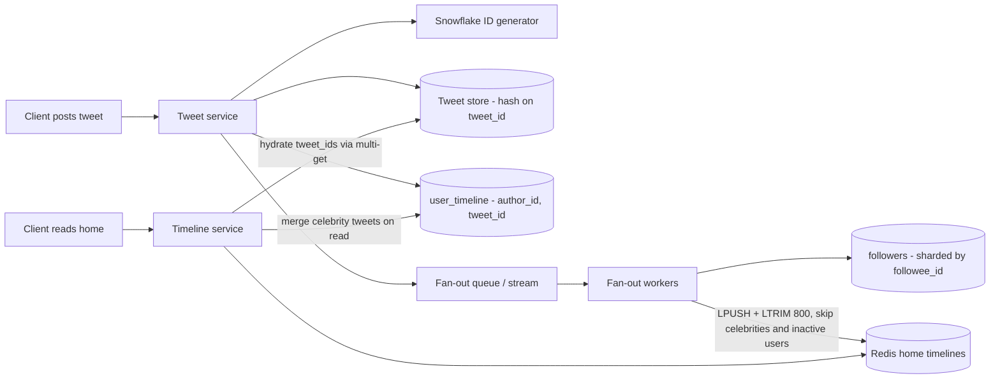
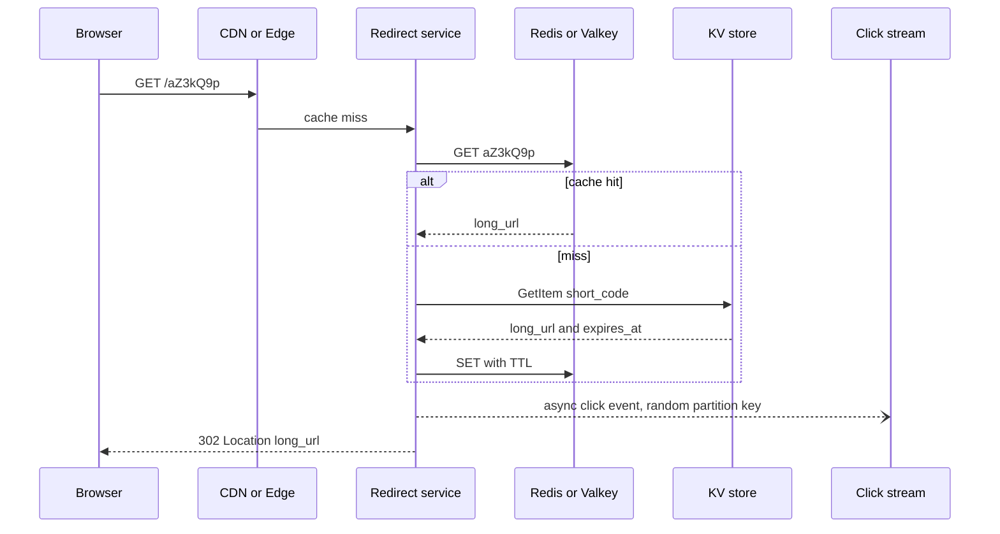

# B9 Database System Design
> Last verified: 2026-10 · Audience: senior/staff DevOps, SRE, AI eng, NetEng, DevSecOps, architects

## TL;DR
- **Start from access patterns, not entities.** List the hot queries (home timeline, redirect lookup) with their QPS. Then choose keys, indexes and shard keys so each hot query reads **one partition with one key lookup or one range scan**.
- **Twitter:** the hard part is the **home timeline**, not storing tweets. Use **hybrid fan-out**: **fan-out-on-write** into a Redis list of tweet IDs, capped at about 800 entries per user. Accounts with huge follower counts use **fan-out-on-read** instead, and their tweets are merged in when the timeline is read. Keep the **follow graph in both directions**, sharded by the owning user.
- **IDs:** use **Snowflake-style 64-bit, k-sorted IDs**: 41-bit millisecond timestamp, 10-bit worker ID, 12-bit sequence. Machines need no coordination, the ID sorts by time, and it fits in a `BIGINT`. You can page by `tweet_id < cursor` and skip a `created_at` index.
- **URL shortener:** a single-key lookup with roughly 100:1 reads to writes, so a **KV store plus cache** fits. Choosing how to **generate keys** is the real design decision:
  - hash plus collision check
  - counter plus base62
  - a pre-generated key service (KGS)
  - Know the **birthday-bound** maths and the **enumeration** risk.
- **301 vs 302:** a 301 is heuristically cacheable by browsers, so you lose clicks and cannot change the destination. A 302 or 307 sends every click to your service, which is what analytics needs. Never write click analytics in the redirect path. **Emit them to a stream** (Kinesis or Event Hubs) instead.
- **Hot keys are the failure mode in both designs:**
  - In Twitter, a celebrity's fan-out and their followers index.
  - In a shortener, a viral link.
  - Fixes: caching, write sharding (key suffixes), random partition keys for event streams, and skipping fan-out for celebrities.
- **Cloud defaults:**
  - KV path: **DynamoDB** or **Cosmos DB for NoSQL**.
  - Relational: **Aurora** or **Azure SQL Hyperscale**.
  - Cache: **ElastiCache (Valkey)** or **Azure Managed Redis**. Azure Cache for Redis is being retired.
  - Click stream: **Kinesis Data Streams** or **Event Hubs**.

## B9.1 Twitter System Design Database Design
> The full end-to-end design (API, search, media, ranking) is in [D3 System design of modern applications](../D-system-design/D3-system-design-of-modern-applications.md) (D3.3). This section covers only the data layer.

### Capacity estimation (classic interview numbers, state them as assumptions)
| Quantity | Assumption / math | Result |
|---|---|---|
| DAU | 300M | n/a |
| Tweets written | 500M/day ÷ 86,400 | **~6k/s avg**, ~15–20k/s peak (×3). Twitter reported a record of about 143k/s in 2013 (unverified) |
| Timeline reads | 300M × ~10 views/day = 3B/day | **~35k/s avg**, ~100k/s peak. **Reads outnumber writes by about 100:1** |
| Fan-out writes | 500M tweets × ~200 avg followers | **~100B timeline inserts/day ≈ 1.2M/s**. This is why fan-out is the bottleneck |
| Tweet storage | ~300 B text + metadata ≈ 1 KB/row × 500M | **~0.5 TB/day ≈ 180 TB/yr** before replication. Media is separate and goes to blob storage plus a CDN |
| Timeline cache RAM | 800 entries × ~20 B (tweet_id 8 B + author_id 8 B + flags 4 B) ≈ 16 KB/user × 300M | **~5 TB** before ×3 replication. Cache only **active** users |
- Twitter's "Timelines at Scale" talk (Krikorian, 2012) reported these figures:
  - The home timeline was a **Redis list capped at 800 entries**, replicated **×3**.
  - The traffic was about **300k QPS of timeline reads** against about **5k tweets/s**.
  - Fan-out produced about **30B Redis timeline updates per day**.

### Schema (logical) and shard keys
| Table / store | Primary key | Shard key | Secondary access | Notes |
|---|---|---|---|---|
| `users` | `user_id BIGINT` (Snowflake) | `user_id` | unique `handle` → a separate lookup table `handles(handle PK → user_id)` | A global unique index on a sharded table is costly. Use a **separate KV table keyed by handle** and write it with a conditional insert. |
| `tweets` | `tweet_id BIGINT` | `tweet_id` (hash) | none | Content store. Lookups are point gets or multi-gets by ID. **Hash on tweet_id** spreads load evenly, including celebrity tweets. |
| `user_timeline` (author index) | `(author_id, tweet_id DESC)` | `author_id` | n/a | Serves "tweets by @x" and the **read-side merge for celebrities**. Use a range scan with `tweet_id < cursor LIMIT 20`. |
| `following` | `(follower_id, followee_id)` | `follower_id` | n/a | "Who do I follow?" Used at read time for the celebrity merge. |
| `followers` | `(followee_id, follower_id)` | `followee_id` | n/a | "Who follows X?" The fan-out worker iterates this. A celebrity row is **huge, so page through it**. |
| `home_timeline` (cache) | Redis key `tl:{user_id}` → LIST of tweet_ids | Redis cluster slot from the key | n/a | `LPUSH` + `LTRIM 0 799`. The cache can be rebuilt from `following` plus `user_timeline`. |
| `engagement counters` | `(tweet_id)` → likes, retweets, replies | `tweet_id` | n/a | Use **sharded counters** or an async aggregation stream. Don't run `UPDATE tweets SET likes=likes+1` on a hot row. |
- **Store each follow edge twice, once per direction.** Each direction is sharded by the user who reads it, and this is the approach FlockDB took. Write both edges through an **outbox or async job** and make the job **idempotent**. If one edge is missing for a moment, that is acceptable, because a social graph does not need ACID across shards.
- **Don't shard tweets by `created_at` (temporal sharding).** All writes land on the newest shard and recent reads pile onto it too. Twitter's early Gizzard/T-bird history moved away from temporal sharding (unverified details).
- **If you shard tweets by `author_id`**, an author's tweets live together, so the user timeline is a single-shard query. The cost is that a celebrity becomes a hot shard. The common answer is two structures: a **content store keyed by `tweet_id`** and an **author index keyed by `author_id`**.
- **Indexes:** on the author index, use a **composite `(author_id, tweet_id)` key** and nothing on `created_at`. The Snowflake ID already encodes time. Covering indexes are in [B3](B3-database-indexing.md).

### Fan-out on write vs read (and hybrid)
| | Fan-out-on-write (push) | Fan-out-on-read (pull) | Hybrid (what Twitter did) |
|---|---|---|---|
| Write cost | O(followers) cache inserts per tweet | O(1) | Push for normal users, nothing for celebrities |
| Read cost | O(1) for one `LRANGE` | O(following) queries, then a k-way merge | `LRANGE` + merge of the **few celebrities you follow** |
| Latency | Read is fast. A tweet appears after **seconds**, and a celebrity tweet could take minutes under pure push | Read is slow and has a heavy tail | Fast reads with bounded write cost |
| Waste | Pushes to inactive users | No waste | Skip fan-out to users **inactive for more than N days**. Rebuild their cache on login (lazy pull) |
- **The celebrity problem.** A 100M-follower account means 100M Redis writes per tweet. Under pure push, that delays delivery for minutes and swamps the fan-out queue.
  - **Fix:** set a follower threshold, for example **>10k–100k followers**, above which an account is **not fanned out**. Read paths then merge in `user_timeline` for the celebrities that user follows.
  - Cache each celebrity's recent tweets themselves, because they are read hot.
- **Fan-out pipeline:** the tweet write commits, then an event goes to a queue or stream such as Kafka. A worker then:
  1. Pages through `followers`.
  2. Pipelines `LPUSH` and `LTRIM` to Redis.
  3. Batches the work per Redis shard.
- **Idempotency:** push tweet_ids, never the full payload. Redis lists allow duplicates, so dedupe on read or use a ZSET scored by tweet_id. A deletion is a lazy filter applied when the tweet is hydrated.
- **Hydration:** after `LRANGE`, run a multi-get of tweet_ids against the tweet cache (memcache/Redis), then the tweet store. Then multi-get the authors.

### ID generation (Snowflake and alternatives)
- **Snowflake layout (64-bit):**
  - 1 unused sign bit
  - **41 bits ms timestamp** since a custom epoch, which covers about **69 years**. Twitter's epoch is 1288834974657 ms, which is 2010-11-04.
  - **10 bits machine**, often split 5 for the datacenter and 5 for the worker, for **1,024 workers**
  - **12 bits sequence**, for **4,096 IDs per ms per worker**, or about 4M/s
- **Design goals (Twitter, 2010):**
  - **Uncoordinated** across datacenters
  - At least 10k IDs/s per process
  - Roughly **k-sorted** to within about 1 s
  - Fits in 64 bits, which ruled out 128-bit UUIDs
- **Clock risks:**
  - If the clock **moves backwards** (NTP step), the generator must **refuse to issue IDs** or wait until the clock passes the last timestamp.
  - Worker IDs must be unique. Lease them from ZooKeeper or etcd, or derive them from a pod ordinal.
  - If the sequence overflows within one ms, spin until the next ms.
- **Why it matters for the DB:**
  - New rows append at the right edge of a B-tree, so **inserts stay cheap and avoid random page splits**, unlike UUIDv4. See [B4](B4-btree-vs-bplustree.md).
  - IDs are **sortable without a timestamp column**, and cursor pagination works by ID.
  - Downside: the right-edge append concentrates writes on the newest page. On **range-sharded** stores this becomes a hotspot, so **hash-shard on the ID**.
- **Alternatives:**
  - **UUIDv7** (RFC 9562): 128-bit, starts with a 48-bit Unix ms timestamp, needs no worker registry, but takes twice the storage.
  - **ULID**: also time-ordered and 128-bit.
  - **Instagram's in-Postgres IDs**: 41 bits time + 13 bits logical shard + 10 bits sequence, generated by a PL/pgSQL function. The shard is encoded **in the ID**, so routing needs no lookup.
  - **Ticket server** (Flickr): MySQL `auto_increment` with offset and increment settings on two servers. Simple, but a central dependency.
  - **DB auto-increment per shard**: not globally unique and leaks volume.
- **Interview angles:**
  - If asked "why not auto-increment?", give three reasons: it **doesn't work across shards**, it is a single point of failure and write bottleneck, and it **leaks business volume**.
  - If asked "why not UUIDv4?", say it is **128-bit with random insert order**. That causes B-tree page splits, a poor buffer-pool hit rate, and no time ordering.
  - If asked "can two tweets have the same ID?", say no when worker IDs are unique and the clock is monotonic. Then cover the cases where that breaks: clock rollback, and a reused worker ID after a pod reschedule.

### Interview angles / pitfalls
- **Start with:** "reads ≫ writes, so I precompute timelines on write, with bounded fan-out."
- **Expected follow-ups:**
  - celebrities
  - inactive users
  - deletes and blocks, handled as filters at read time
  - edits, by keeping tweet_id stable and versioning the content
  - ranking, where the timeline holds candidates and a ranker reorders them
  - cache loss: rebuild with a pull, protected by a stampede lock
- **The cache is not the source of truth.** If you lose the Redis home timeline, the system must **degrade to fan-out-on-read** and must not fail outright. Caching patterns are in [C1 Performance](../C-large-scale-architecture/C1-performance.md) and [D1](../D-system-design/D1-system-design-basics.md) (D1.14/D1.15).
- **Read your own write:** after posting, inject the user's own tweet into their timeline on the client, or read it from the primary. Replica lag is covered in [B8](B8-database-replication.md).
- **Pitfall:** "JOIN follows with tweets ORDER BY created_at" across shards. That is a scatter-gather query with a global sort, and it does not scale.
- **Pitfall:** storing the follower list as a single document or array. It breaks DynamoDB's 400 KB item limit and Cosmos DB's 2 MB item limit (unverified), and causes write contention.

## B9.2 Building a Short URL System Database Backend
> The full design (API, rate limiting, abuse) is in [D3](../D-system-design/D3-system-design-of-modern-applications.md) (D3.10). This section covers keys, storage and caching.

### Capacity estimation
| Quantity | Assumption / math | Result |
|---|---|---|
| New URLs | 100M/day ÷ 86,400 | **~1.2k writes/s** |
| Redirects | 100:1 read:write | **~120k reads/s avg**, about 3× at peak |
| Retention | 10 years × 365 × 100M | **~365B URLs** |
| Key space (base62) | 62^6 = 56.8B · **62^7 = 3.52T** · 62^8 = 218T | **7 chars** covers 10 years with room to spare |
| Storage | ~500 B/row (long URL ~200 B, metadata, index overhead) × 365B | **~180 TB** before replication. That is a **sharded** KV store, not one RDBMS node |
| Cache | Hot set ≈ 20% of the day's distinct links (80/20 rule) | Tens to hundreds of GB of RAM. A **~1 TB** upper bound if you do the naive "20% of all daily reads × 500 B" |
| Click events | 120k/s × ~200 B | **~24 MB/s** into the stream, so about 24+ Kinesis shards or Event Hubs TUs at 1 MB/s each, plus headroom |

### Schema, keys, indexes, sharding
- **`urls`**:
  - `short_code` (PK, `VARCHAR(8)`)
  - `long_url` (TEXT; cap it at about 2–8 KB)
  - `owner_id`
  - `created_at`
  - `expires_at`
  - `is_custom`
  - `status` (active, disabled, or malware-flagged)
- **The redirect is a single PK lookup**, so it needs no joins and no transactions. That makes it **ideal for DynamoDB or Cosmos DB**, or for Postgres hash-sharded on `short_code`.
- **Secondary access:**
  - **"My links"** → GSI or index on `(owner_id, created_at DESC)`.
  - **Optional dedupe** → `(owner_id, sha256(long_url))` with a unique constraint. Scope it **per owner**, because a global dedupe leaks other users' links and breaks per-user analytics.
- **Shard key = `short_code` (hashed).** Random codes are already uniform. **Counter-based codes under range partitioning create a hot shard at the newest range**, so hash them.
- **Expiry:**
  - DynamoDB **TTL deletes "within a few days"** of expiry and **does not consume WCU**. **Always check `expires_at` on read** anyway.
  - Cosmos DB has per-item `ttl`.
  - In an RDBMS, use **partition-by-month plus `DROP PARTITION`** instead of mass `DELETE`. See [B5](B5-database-partitioning.md).

### Key-generation strategies
| Strategy | How | Pros | Cons / gotchas |
|---|---|---|---|
| **Hash + truncate** | `base62(md5/sha256(long_url + salt))[:7]`. Insert with a **conditional put** (`attribute_not_exists(short_code)`). On collision, re-salt and retry | No coordination. The same URL can map to the same code (dedupe) | **Collisions are certain at scale.** The birthday bound for 62^7 gives a 50% chance of some collision after about **1.18·√N ≈ 2.2M** URLs. Every write therefore needs a conditional write, and retries grow as the space fills |
| **Counter + base62** | A global sequence, base62-encoded. Avoid a single counter by having each app node **lease a range** (e.g. 1M IDs) from ZooKeeper, etcd, or a DB row | **Zero collisions**, O(1) generation, short codes | **Enumerable and predictable**: attackers can scrape private links, and it leaks volume. Mitigate with a **bijective scramble** (Feistel / format-preserving permutation, Sqids). Leased blocks lost in a crash leave gaps, which is fine. A Snowflake ID is 64-bit, giving 11 base62 chars, which is **too long** |
| **Pre-generated Key Generation Service (KGS)** | Offline, generate random unique 7-char keys into an `unused_keys` table. App servers **claim batches** into memory atomically (`DELETE ... RETURNING`, `SELECT ... FOR UPDATE SKIP LOCKED`, or a DynamoDB conditional delete). Keys move to `used` | Fast writes, no collisions at write time, non-sequential | One more stateful service, so it must be HA. Keys held in memory are **lost on a crash**, which is acceptable. Watch double allocation under concurrency. Pre-generating 68B keys × 7 B ≈ 0.5 TB is fine |
| **Custom alias** | The user supplies the code. Use a conditional insert. Check a reserved-words and profanity list | Product feature | Must share the namespace with generated codes. Reserve a prefix or length rule so the two never collide |
- **Interview answer:** use **counter-range or KGS with a scramble** by default. Mention hash+collision when the interviewer wants "no extra service" or "the same URL gives the same code".

### Read path, caching, redirects
- **Lookup order:**
  1. CDN or edge (optional, for the hottest links)
  2. **Redis/Valkey, cache-aside** with LRU or LFU eviction and a TTL
  3. KV store
- **Bloom filter / negative cache:** this protects the database from **random-code enumeration** scans, where every miss would otherwise go to the DB. Also rate-limit lookups per IP.
- **Viral link:** a single hot key runs into the **per-partition limit** of 3,000 RCU on DynamoDB or 10k RU/s on Cosmos DB, and the Redis shard holding it gets hot too.
  - **Fixes:** DAX, an in-process local cache with a short TTL, and request coalescing (singleflight).
- **Redirect status codes (RFC 9110):**

| Code | Meaning | Method preserved | Heuristically cacheable | Shortener impact |
|---|---|---|---|---|
| **301** | Permanent | No (POST→GET allowed) | **Yes** | Browsers and proxies cache it, so **later clicks never reach you**: analytics are lost and the target can't be edited or disabled. It also has the lowest server load |
| **302** | Temporary (Found) | No | No (only with explicit Cache-Control) | **Every click hits the service**, so analytics are accurate and destinations can change. This is the usual choice |
| **307** | Temporary | **Yes** | No | Strict temporary redirect. Rarely needed for GET |
| **308** | Permanent | **Yes** | Yes | Permanent redirect that keeps the method |
- **Middle ground:** a 301 with `Cache-Control: private, max-age=<short>`, or a 302 cached at **your own CDN** with click logs taken from the CDN.
- **Policy:** links that are disabled for abuse need a short TTL everywhere.

### Click analytics
- **Never write click analytics synchronously** in the redirect path. A synchronous write adds latency, and a DB hiccup would break redirects. Instead:
  1. Fire-and-forget an event with `{short_code, ts, ip-hash, UA, referrer, geo}` to **Kinesis Data Streams, Event Hubs, or Kafka**.
  2. A stream processor (Flink / Managed Service for Apache Flink / Azure Stream Analytics) **pre-aggregates** per code and per minute.
  3. Results go to an OLAP store (ClickHouse, Druid, Redshift, Azure Data Explorer) and a counters table.
- **Partition key for clicks:**
  - Keying by `short_code` sends a viral link to **one shard**, which is capped at 1 MB/s or 1,000 records/s.
  - Clicks don't need ordering, so use a **random or high-cardinality partition key** and aggregate downstream.
  - Use a two-stage aggregation: partial counts first, then a merge.
- **Privacy:** hash or truncate IPs, set retention limits, and honour Do-Not-Track and consent. See [L1](../L-data-privacy-ai-security/L1-data-classification-pii.md).
- **Interview angles:**
  - If asked "how do you count clicks exactly once?", say the stream gives **at-least-once** delivery. Dedupe on an event ID within a window, or accept approximate counts. Exactly-once is covered in [M5](../M-data-platforms/M5-stream-processing.md).
  - If asked "SQL or NoSQL?", say the access pattern is PK-only and needs no joins, so KV. Keep users and billing in a relational DB.
  - **Pitfall:** `UPDATE urls SET clicks = clicks + 1` on every redirect makes a hot row and a write amplifier.

## Diagrams




## Cloud mapping: AWS vs Azure
| Capability | AWS | Azure | Role it plays | Key differences | Alternatives |
|---|---|---|---|---|---|
| KV / wide-column store (tweets, urls, edges) | **DynamoDB** (on-demand or provisioned, GSIs, TTL, Global Tables) | **Cosmos DB for NoSQL** (RU/s, TTL, multi-region writes, global secondary indexes) | Point lookups by key, range on sort key | DynamoDB: **3,000 RCU / 1,000 WCU per partition**, 400 KB item, 20 GSIs, 5 LSIs. Cosmos DB: **20 GB per logical partition**, 10k RU/s per physical partition (50 GB), **hierarchical partition keys** up to 3 levels, 5 consistency levels | Cassandra/ScyllaDB, Bigtable (GCP), Twitter's own Manhattan |
| Relational (users, billing, ownership) | **Aurora PostgreSQL/MySQL**. **Aurora PostgreSQL Limitless** for hash-sharded tables | **Azure SQL Database Hyperscale** (up to 128 TB, 0–4 HA replicas, up to 30 named replicas). **Azure Database for PostgreSQL Elastic Clusters** (Citus) | Strong consistency, unique constraints, transactions | Limitless shards by **hash on a shard key, and the PK must include it**. It also offers reference tables and collocation. **Cosmos DB for PostgreSQL is on a retirement path** and new deployments are blocked, so use Elastic Clusters | Citus self-managed, Vitess, CockroachDB, Spanner |
| Cache (timelines, redirect hot set) | **ElastiCache for Valkey** (or Redis OSS / Memcached). Serverless or node-based. Optional **durability** on node-based Valkey | **Azure Managed Redis**: Memory/Balanced/Compute/Flash Optimized, Redis Enterprise based, **active geo-replication** | Home-timeline lists, cache-aside URL lookups | **Azure Cache for Redis retires**: the Enterprise tiers on **2027-03-31** and Basic/Standard/Premium on **2028-09-30**. New designs should use Azure Managed Redis. Valkey is the Linux Foundation fork of Redis | DAX (DynamoDB-only read-through cache), Cosmos DB integrated cache, Momento, Memcached |
| Click-event stream | **Kinesis Data Streams** (provisioned: 1 MB/s or 1,000 rec/s in and 2 MB/s out per shard; or on-demand) | **Event Hubs** (Standard: 1 MB/s or 1,000 ev/s in and 2 MB/s out per TU, max 32 partitions, 7-day retention. Premium/Dedicated for more) | Durable, partitioned click log decoupled from redirects | Kinesis scales by **shards**, with retention from 24 h up to 365 days. Event Hubs scales by **TU/PU/CU**, its partition count is fixed on Standard, and it has a **Kafka-protocol endpoint** | Amazon MSK, Confluent Kafka, Kinesis Data Firehose / Event Hubs Capture to S3/ADLS |
| Stream aggregation and OLAP | Managed Service for Apache Flink → Redshift / ClickHouse | Stream Analytics or Fabric Real-Time Intelligence → Azure Data Explorer | Per-link click counts and dashboards | Both support Flink. ADX/Eventhouse ingests directly from Event Hubs | Databricks Structured Streaming, ClickHouse Cloud, Druid |
| Edge redirect / cache | CloudFront (+ CloudFront Functions / KeyValueStore) | Azure Front Door (rules engine) | Serve the hottest redirects at the edge | Edge redirects make analytics depend on **CDN logs** | Cloudflare Workers + Workers KV |
- **DynamoDB vs Cosmos DB on the KV path:**
  - Both are hash-partitioned and both throttle hot keys.
  - DynamoDB **adaptive capacity** isolates a hot item onto its own partition, but a single key still caps at **3,000 RCU and 1,000 WCU**.
  - Cosmos DB divides provisioned RU/s **evenly across physical partitions**, so a skewed key wastes throughput.
  - A cross-partition query on Cosmos DB costs about **2–3 RU extra per physical partition**.
  - Neither lets you change the partition key in place. You must migrate to a new table or container.
- **GSI hot-partition trap (Twitter on DynamoDB):** model `followers` as a GSI that inverts `following`. A celebrity's followers then all land on one GSI partition key. When a GSI throttles, it **back-pressures writes to the base table**.
  - **Fix:** **write sharding**, i.e. add a `#0..#N` suffix to the partition key and scatter-read it. Or keep a separate edge table you control.
- **Global:**
  - **DynamoDB Global Tables** offer **MREC** (eventual, last-writer-wins) or **MRSC** (multi-Region strong consistency).
  - **Cosmos DB** offers multi-region writes with conflict-resolution policies.
  - For a URL shortener, write in one region and read everywhere. Code uniqueness with eventual multi-writer replication needs **region-prefixed key ranges**.

## Hands-on (optional)
```bash
# URL shortener: collision-safe insert (fails if code already taken)
aws dynamodb put-item --table-name urls \
  --item '{"short_code":{"S":"aZ3kQ9p"},"long_url":{"S":"https://example.com/x"},"expires_at":{"N":"1924992000"}}' \
  --condition-expression "attribute_not_exists(short_code)"

# Twitter-style home timeline: push tweet id and cap at 800 entries (pipelined)
redis-cli -c LPUSH tl:42 1850000000000000001
redis-cli -c LTRIM tl:42 0 799
redis-cli -c LRANGE tl:42 0 19   # first page of 20 tweet ids
```

```hcl
resource "aws_dynamodb_table" "urls" {
  name         = "urls"
  billing_mode = "PAY_PER_REQUEST"
  hash_key     = "short_code"

  attribute {
    name = "short_code"
    type = "S"
  }
  attribute {
    name = "owner_id"
    type = "S"
  }
  attribute {
    name = "created_at"
    type = "N"
  }

  global_secondary_index {
    name            = "by_owner"
    hash_key        = "owner_id"
    range_key       = "created_at"
    projection_type = "KEYS_ONLY"
  }

  ttl {
    attribute_name = "expires_at"
    enabled        = true
  }

  point_in_time_recovery {
    enabled = true
  }
}
```

## Cross-links
- [B3 Database indexing](B3-database-indexing.md): composite and covering indexes for `(author_id, tweet_id)`
- [B4 B-tree vs B+tree](B4-btree-vs-bplustree.md): why monotonic IDs insert cheaply
- [B5 Database partitioning](B5-database-partitioning.md) and [B6 Database sharding](B6-database-sharding.md): shard-key choice, hot shards, consistent hashing (B6.2)
- [B7 Concurrency control](B7-concurrency-control.md): `SKIP LOCKED` for KGS batch claims
- [B8 Database replication](B8-database-replication.md): read replicas and read-your-writes
- [C1 Performance](../C-large-scale-architecture/C1-performance.md) (C1.26–C1.30 caching) and [C2 Scalability](../C-large-scale-architecture/C2-scalability.md) (C2.16, C2.18–C2.20)
- [C6 Technology stack](../C-large-scale-architecture/C6-technology-stack.md) (C6.32/C6.33 Dynamo paper. Managed DynamoDB differs from the paper's design)
- [D1 System design basics](../D-system-design/D1-system-design-basics.md) (D1.14/D1.15 caching, D1.21 consistent hashing) and [D2 Reusable parts](../D-system-design/D2-reusable-parts-of-system-design.md)
- [D3 System design of modern applications](../D-system-design/D3-system-design-of-modern-applications.md): D3.3 Twitter and D3.10 URL shortener full designs
- [M4 Kafka at scale](../M-data-platforms/M4-kafka-at-scale.md), [M5 Stream processing](../M-data-platforms/M5-stream-processing.md), [M7 Data warehouses](../M-data-platforms/M7-data-warehouses.md): click analytics pipeline
- [J5 Capacity planning and load testing](../J-sre/J5-capacity-planning-load-testing.md): estimation method

## Sources
- https://docs.aws.amazon.com/amazondynamodb/latest/developerguide/bp-partition-key-design.html
- https://docs.aws.amazon.com/amazondynamodb/latest/developerguide/ServiceQuotas.html
- https://docs.aws.amazon.com/amazondynamodb/latest/developerguide/howitworks-ttl.html
- https://docs.aws.amazon.com/AmazonRDS/latest/AuroraUserGuide/limitless-architecture.html
- https://docs.aws.amazon.com/AmazonElastiCache/latest/dg/WhatIs.html
- https://docs.aws.amazon.com/streams/latest/dev/service-sizes-and-limits.html
- https://learn.microsoft.com/en-us/azure/cosmos-db/partitioning-overview
- https://learn.microsoft.com/en-us/azure/azure-sql/database/service-tier-hyperscale
- https://learn.microsoft.com/en-us/azure/cosmos-db/postgresql/product-updates
- https://learn.microsoft.com/en-us/azure/redis/overview
- https://learn.microsoft.com/en-us/azure/azure-cache-for-redis/retirement-faq
- https://learn.microsoft.com/en-us/azure/event-hubs/event-hubs-quotas
- https://www.rfc-editor.org/rfc/rfc9110#name-redirection-3xx
- https://github.com/twitter-archive/snowflake/tree/snowflake-2010
- https://highscalability.com/the-architecture-twitter-uses-to-deal-with-150m-active-users/ (summary of Krikorian's "Timelines at Scale" talk)
