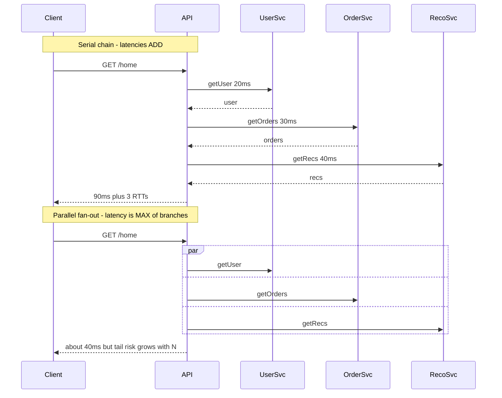
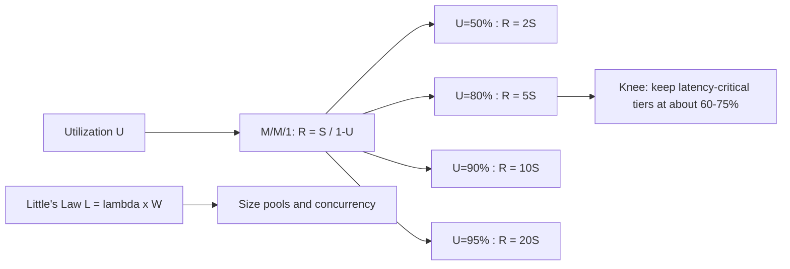
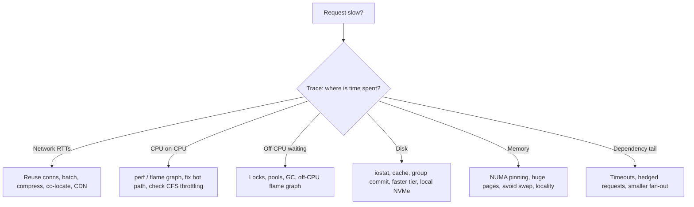

# C1 Performance
> Last verified: 2026-10 · Audience: senior/staff DevOps, SRE, AI eng, NetEng, DevSecOps, architects

## TL;DR
- **Performance has three numbers:** **latency** (time for one request), **throughput** (requests or bytes per unit time) and **utilization** (fraction of time a resource is busy). They are linked by **Little's Law** `L = λ·W`. Interviewers want to hear that you can trade one against another and know which one the SLO is written on.
- **Report latency as percentiles from histograms** (p50, p90, p99, p99.9), never as averages. Never average percentiles across hosts. Also track the latency of failed requests separately, so fast errors do not flatter the numbers.
- **Fan-out amplifies the tail:** if each leaf has a 1% chance of being slow, a request that touches 100 leaves is slow `1 − 0.99^100 ≈ 63%` of the time. Mitigate with hedged or tied requests, timeouts, partial results and smaller fan-out (Dean & Barroso, *The Tail at Scale*).
- **Queueing sets the operating point:** in an M/M/1 queue, response time is `R = S / (1 − U)`. That is 2× the service time at 50% utilization, 5× at 80% and 10× at 90%. Run latency-sensitive tiers at about **60–75% utilization**, because the knee arrives quickly after that.
- **Serial latency adds up and parallel latency is the max of the branches.** Cut the number of round trips first: remove sequential hops, parallelize independent calls, batch, and move the work closer to the data.
- **Know the latency hierarchy by order of magnitude:** CPU cache is ns, DRAM is ~100 ns, NVMe is tens of µs, an in-AZ network round trip is ~100s of µs, a cross-region round trip is tens to hundreds of ms. The fix depends on which layer dominates.
- **Measure before you tune:** use the USE method for resources, RED or golden signals for services, `perf` and flame graphs for CPU, off-CPU analysis for waiting, and distributed tracing (OpenTelemetry) to find serial hops.
- **Cloud levers:** placement groups (AWS cluster PG, Azure proximity placement group), enhanced or accelerated networking, local NVMe instance store or temp disk for scratch data, provisioned-IOPS disks (io2 Block Express, Ultra Disk or Premium SSD v2), and right-sizing or keeping NUMA affinity on large instances.

## C1.1 What is performance
- **How it works:**
  - **Performance** is how fast and how much work a system does for a given resource budget, measured against the expectations of a **workload**. A workload is the request mix, the arrival pattern and the data size.
  - **Latency or response time** is the time from request to response. It equals **service time** (actual work) plus **wait time** (queueing, contention, coordination).
  - **Throughput** is completed work per unit time (RPS, TPS, MB/s, tokens/s). **Bandwidth** is the *capacity* of a link or device, and throughput is what you actually achieve.
  - **Utilization** is the busy time divided by the observation interval. **Saturation** is work that is queued because the resource is fully busy (for example run-queue length, disk `aqu-sz`, TCP backlog).
  - Two distinct problems: a **performance problem** means the system is slow for a single user or request even at low load. A **scalability problem** means it is fast for one user but degrades as load grows. C1 covers the first. See C2 for the second.
- **Trade-offs / when to use:**
  - Latency and throughput often conflict. **Batching**, larger buffers and Nagle's algorithm raise throughput but add latency per item. LLM serving shows the same trade-off: larger batches raise tokens/s but also raise time-to-first-token.
  - **Efficiency** (work per $ or per watt) is the third axis and is usually what FinOps or capacity teams optimize.
- **Interview angles:**
  - If asked "is the system fast?", answer that it depends on the **percentile, the load level and the workload mix**. Ask for the SLO, for example "p99 < 200 ms at 5k RPS".
  - Pitfall: quoting peak throughput measured at 100% utilization. Latency at that point is unbounded.

## C1.2 How do performance problems look like
- **How it works:** typical symptoms seen in production:
  - **Latency rises with load.** This is queueing at a saturated resource (CPU, connection pool, thread pool, lock, disk).
  - **Throughput plateaus** while utilization of some resource sits at 100%. That resource is the bottleneck. If nothing is at 100%, suspect a lock or serialization point (see C1.18–C1.24 in part 2).
  - **The tail diverges from the median:** p50 is flat but p99 or p99.9 spikes. Causes include GC pauses, noisy neighbours, CPU throttling (cgroup CFS quota), compaction, cache misses, retries and TCP retransmits (a 200 ms+ minimum RTO).
  - **Latency is high even at low load.** This is a serial-path problem: too many round trips, N+1 queries, chatty RPCs, cold caches, DNS or TLS on every call.
  - **Degradation over time:** memory leaks lead to GC thrash, which leads to swap. Fragmentation, growing table or index size, and log or file-handle exhaustion also cause it.
  - **Retrograde throughput:** adding load *reduces* completed work because of thrashing, lock convoys or coherence costs (Universal Scalability Law, part 2).
- **Trade-offs / when to use:** a "slow" report usually comes from one of three layers: client or network (H5), service (CPU, locks, GC) or dependency (DB, cache, downstream). Use tracing to split them before you tune anything.
- **Interview angles:**
  - If asked "the API got slow, what do you do?", walk through it in order. Scope it (which endpoint, which percentile, since when, which deploy). Compare golden signals. Use **USE** per resource. Read traces for the critical path. Profile the hot path.
  - Mention **coordinated omission**: closed-loop load generators that wait for responses under-report the tail. Use open-loop, constant-arrival-rate tools.

## C1.3 Performance principles
- **How it works:** core principles:
  - **Measure first** and optimize the **critical path** only. Amdahl's law says speeding up a component that accounts for 5% of the time gives at most 5% total gain.
  - **Do less work:** avoid, cache, precompute, filter early, and choose the right data structure or algorithm.
  - **Do fewer round trips:** batch, pipeline, co-locate, denormalize for reads.
  - **Do work in parallel** when it is independent. Do it **asynchronously** when the user does not need the result now (queues, write-behind).
  - **Move data less:** compression, projection (select only the columns you need), pushing compute down to the data (predicate pushdown, stored procedures, edge compute).
  - **Keep resources below the knee:** headroom, admission control, back-pressure, load shedding.
  - **Reduce variance**, not just the mean. Bound queues, set timeouts, isolate noisy work (bulkheads), and avoid long GC pauses and synchronous logging.
- **Trade-offs / when to use:** each optimization costs complexity, consistency (caches) or cost (over-provisioning). State which one you accept.
- **Interview angles:**
  - Known pitfalls: premature micro-optimization, tuning without a baseline, and benchmarking on a laptop or with a warm cache only.
  - Good senior phrasing: "Set a **latency budget** per hop. For example, a 200 ms p99 end to end becomes 20 ms at the edge, 40 ms for the API and 80 ms for the DB, plus margin. Then enforce it with timeouts and deadlines that propagate down the call chain."

## C1.4 System performance objectives
- **How it works:**
  - **Objectives are stated on user-visible SLIs:** a latency percentile at a load level ("p99 ≤ 300 ms at 10k RPS"), throughput ("process 1M events/min with lag < 30 s") and availability. SLO mechanics are covered in J1.
  - **Typical objective set:**
    - Minimize **latency** at the target percentile.
    - Maximize **throughput** at the latency SLO, which is the real "capacity".
    - Bound **utilization** to keep headroom.
    - Meet **cost or efficiency** targets.
  - **Little's Law** `L = λ × W` (mean items in system = arrival rate × mean time in system). It holds for any stable system and is distribution-free.
    - Example: 2,000 RPS × 50 ms = **100 concurrent requests in flight**. Size thread pools, DB connection pools and `max_connections` from this, plus burst headroom.
    - It works in reverse: a pool of 20 DB connections with a 10 ms query time caps throughput at 20 / 0.01 = **2,000 QPS**.
  - **Queueing knee:**
    - M/M/1 gives `R = S/(1−U)` and mean queue length `U/(1−U)`.
    - With S = 10 ms: U = 50% gives 20 ms, 80% gives 50 ms, 90% gives 100 ms, 95% gives 200 ms.
    - Tail percentiles blow up earlier than the mean.
    - With multiple servers (M/M/c) you can run hotter. A pool of 32 cores tolerates around 80–85% before the knee, while a single disk or a single-threaded event loop tolerates far less.
- **Trade-offs / when to use:**
  - Target utilization: about 60–70% for single-queue or latency-critical resources, about 75–85% for wide multi-server pools.
  - Batch tiers can run near 100% because only throughput matters.
  - Autoscaling targets (for example 60% CPU) are a direct application of this rule.
- **Interview angles:**
  - If asked "why not run at 95% CPU to save money?", answer: queueing theory. Latency is roughly 20× service time at 95%, any burst causes timeouts, and timeouts cause retry storms.
  - If asked to size a connection pool, use Little's Law with the p99 hold time, not the mean, then cap it to protect the DB.

## C1.5 Performance measurement metrics
- **How it works:**
  - **Percentiles:**
    - **p50** is the median, the "typical" request.
    - **p99** means 1 in 100 requests is slower. A page that makes 100 calls hits it on almost every page view.
    - **p99.9** matters for high-fan-out services and for the heaviest users, who often generate the most revenue.
  - **Record histograms, not raw averages.** Examples: Prometheus histograms or native histograms, HdrHistogram, OTel exponential histograms, CloudWatch percentile statistics (they need raw, non-summarized data points or `SampleCount=1` statistic sets).
    - Percentiles **cannot be averaged** across instances or time windows. Merge the histograms and then compute.
    - Google SRE recommends bucketing request counts with **exponentially distributed bucket boundaries**.
  - **Tail latency amplification:**
    - P(request is slow) = `1 − (1 − p)^N` for fan-out N.
    - With p = 1% per leaf: N = 10 gives 9.6%, N = 100 gives 63%, N = 1000 gives ~100%.
    - Overall latency is the **max** of the parallel leaves, so the system's p50 is approximately a leaf's p99 when N ≈ 100.
  - **Metric families:**
    - **USE** (Utilization, Saturation, Errors) for every *resource*.
    - **RED** (Rate, Errors, Duration) for every *service*.
    - **Four golden signals** (latency, traffic, errors, saturation).
    - Also: Apdex, time-to-first-byte (TTFB), and LLM-specific **TTFT / TPOT** (see K4).
  - **Throughput metrics:** RPS, TPS, IOPS (with the I/O size), MB/s, and pps for network. IOPS without a block size is meaningless.
- **Trade-offs / when to use:**
  - Averages hide bimodal distributions. Max is noisy. Trimmed mean (CloudWatch `TM99`) is a useful compromise for alarms.
  - High-resolution metrics (1 s in CloudWatch) cost more but catch micro-bursts.
- **Interview angles:**
  - If asked "average latency is 100 ms, is that fine?", answer: unknown. Google SRE's example is a 100 ms average where 1% of requests take 5 s.
  - Follow-up on mitigating the tail:
    - **Hedged requests**: send a second request after the p95 time has elapsed, which costs a few percent of extra load.
    - **Tied requests**: the duplicate cancels its sibling once one starts.
    - Micro-partitioning, selective replication of hot shards, putting slow replicas on probation, and good-enough partial results.

## C1.6 Serial request latency
- **How it works:**
  - **Serial chain:** total = Σ(hop latencies) + Σ(network RTTs). **Parallel fan-out:** total ≈ max(branch latencies) + coordination overhead.
  - A single HTTPS call from a cold client pays DNS (1 RTT or more), TCP (1 RTT), TLS 1.3 (1 RTT, or 0-RTT on resumption), then the request (1 RTT) plus server time. On a 50 ms RTT link that is about **200 ms before any work happens** (details in H5.3 and F6.4).
  - The **N+1 query pattern** turns one page into N sequential DB round trips. 100 × 1 ms in-AZ RTT is 100 ms, against a few ms for a single `IN (...)` or JOIN.
  - Microservice call depth: 5 sequential services at 20 ms each is 100 ms, and their p99s **compound**. The tail of a chain is roughly the sum of the tails, not the max.
- **Trade-offs / when to use:**
  - Parallelizing independent calls reduces latency but raises peak load and fan-out tail risk.
  - Aggregation layers (BFF, GraphQL, API composition) cut client round trips but can hide server-side N+1 problems.
- **Interview angles:**
  - If asked to "cut latency on this request path", draw the critical path from a trace. Remove or merge sequential hops, parallelize independent ones, cache or precompute the rest, then propagate deadlines down the chain.
  - Pitfall: retries inside every layer multiply. Three layers × 3 attempts each gives 27 backend calls. Retry at one layer only, with budgets.

## C1.7 Network transfer latency
- **How it works:** the components, covered in depth in [H5.1](../H-full-stack-troubleshooting/H5-network-performance-deep-dive.md#h51-what-is-network-latency-propagation-transmission-processing-queuing-protocol-delay):
  - **Propagation:** distance ÷ ~200,000 km/s in fibre, which is about **5 µs per km** one way, or about **1 ms RTT per 100 km**. New York to London is ~5,600 km, so the physical minimum RTT is ~56 ms and real paths are ~70 ms.
  - **Transmission (serialization):** size ÷ bandwidth. 1 MB on 1 Gbps is 8 ms. On 10 Gbps it is 0.8 ms.
  - **Processing and queuing:** router, NIC and kernel stack costs, and bufferbloat under load.
  - **Protocol delay:** handshakes, TCP slow start (initcwnd of 10 segments ≈ 14.6 KB in the first RTT), ACK clocking, loss recovery.
  - The **bandwidth-delay product (BDP)** bounds a single flow: throughput ≤ window ÷ RTT. A 64 KB window over 100 ms RTT gives about 5 Mbps. Window scaling and autotuning matter on long-fat networks.
  - In-cloud references (order of magnitude): same placement group or rack ~25–100 µs RTT, same AZ ~100–500 µs, cross-AZ ~0.5–2 ms, cross-region tens to hundreds of ms.
- **Trade-offs / when to use:** latency is dominated by round trips for small payloads and by bandwidth for large ones. Calculate which regime you are in before optimizing.
- **Interview angles:**
  - If asked "why is our cross-region replication slow despite a 10 Gbps link?", answer that BDP limits each TCP window. Fix it with window tuning, parallel streams, BBR, or by replicating less data.
  - Remember that **cross-AZ traffic costs money** on AWS (and Azure inter-zone is billed by data transfer, unverified for current rates). This is a performance-and-cost trade-off. See [G4](../G-cloud-network-architecture/G4-network-performance-and-optimization.md).

## C1.8 Minimizing network transfer latency
- **How it works:**
  - **Connection reuse:**
    - HTTP keep-alive, HTTP/2 multiplexing, client connection pools, gRPC channels and DB connection pools (PgBouncer, RDS Proxy) avoid repeated TCP and TLS handshakes.
    - Use TLS session resumption or 0-RTT, with replay caveats for non-idempotent requests.
    - HTTP/3 or QUIC removes TCP head-of-line blocking (F6.7) and combines the transport and TLS handshakes.
  - **Fewer round trips:** batch APIs, pipelining (Redis pipelines, `MGET`), GraphQL or BFF aggregation, server push replaced by preload hints (`103 Early Hints`).
  - **Less data:**
    - Compression: gzip, **Brotli** for static text, **zstd** for internal RPC and logs. It trades CPU for bytes and wins when bandwidth or RTT-dominated transfers are large.
    - Binary encodings: Protobuf or Avro instead of JSON.
    - Field projection and pagination; delta sync.
  - **Move closer to the user or data:** CDN and edge (C6.15, I3), regional replicas, anycast, and co-locating chatty services in the same AZ or placement group.
  - **Kernel and NIC:**
    - Enhanced networking (ENA, SR-IOV) or Azure Accelerated Networking.
    - TCP tuning: BBR, `tcp_slow_start_after_idle=0`, a larger initcwnd for CDN-style traffic. Disable Nagle (`TCP_NODELAY`) for request/response protocols (F6.2, F6.3).
    - Busy-polling or kernel bypass (DPDK, AF_XDP) for extreme low-latency needs.
- **Trade-offs / when to use:**
  - Compression costs CPU and adds latency on fast links for small payloads. Skip it below about 1 KB or on already-compressed data.
  - Long-lived connections complicate L4 load balancing because the load sticks to one backend. Use L7 load balancing or connection max-age.
  - Same-AZ pinning reduces resilience.
- **Interview angles:**
  - If asked "p99 jumped after moving to a service mesh", suspect added sidecar hops (about 2 per call), mTLS handshakes on a cold pool and connection churn. Check pool reuse and keep-alive settings.
  - Pitfall: a new TCP connection per request through a NAT gateway, which leads to port exhaustion and SYN retries at 1 s and 3 s.

## C1.9 Memory access latency
- **How it works:** see [A3](../A-operating-systems/A3-memory-management.md) and [A4.2](../A-operating-systems/A4-inside-the-cpu.md#a42-instruction-life-cycle-l1l2l3-lookups-64-byte-cache-lines).
  - **Hierarchy (approximate):**

    | Level | Latency |
    |---|---|
    | Register | ~0.3 ns |
    | L1 | ~1 ns, ~4 cycles |
    | L2 | ~3–5 ns |
    | L3 (LLC) | ~10–40 ns |
    | Local DRAM | ~80–100 ns |
    | **Remote NUMA node DRAM** | ~1.3–2× local |
    | CXL-attached memory | ~170–250 ns (unverified) |

  - Data moves in **64-byte cache lines**. Sequential access benefits from hardware prefetchers. Random pointer chasing pays full DRAM latency on every hop.
  - **TLB misses:** a page walk costs up to 4–5 memory accesses. Huge pages (2 MB or 1 GB) increase TLB reach.
  - **Page faults:** a minor fault costs about µs. A major fault (from disk or swap) costs from about 100 µs on NVMe to ms on HDD or EBS. Swap means a latency cliff.
  - **GC pauses** in managed runtimes are effectively memory latency at the application layer.
- **Trade-offs / when to use:** memory bandwidth (tens of GB/s per socket channel group) can bottleneck before latency does in analytics and LLM inference. LLM decode is memory-bandwidth-bound (see K4).
- **Interview angles:**
  - If asked "why is the 96-vCPU instance slower per request than the 16-vCPU one?", answer: cross-NUMA access, cache contention from noisy co-tenants, or lock contention. Check `numastat` and `perf stat` for LLC-miss counts.
  - False sharing (two threads writing to the same cache line) is a classic hidden slowdown. It is covered with coherence in C1.25.

## C1.10 Minimizing memory access latency
- **How it works:**
  - **Locality:** use contiguous arrays or structs-of-arrays instead of linked structures. Use columnar layouts for scans. Choose data structures that fit in L2 or L3 for hot paths.
  - **NUMA awareness:**
    - Pin processes or threads with `numactl --cpunodebind=N --membind=N` or `taskset`, and rely on first-touch allocation.
    - Use the Kubernetes Topology Manager (`single-numa-node` policy) together with the CPU Manager `static` policy for Guaranteed pods.
    - Consider whether automatic NUMA balancing (`kernel.numa_balancing`) helps or hurts your workload.
    - On large DB hosts, interleave or bind memory per instance.
  - **Huge pages:** explicit HugeTLB pages for DBs and JVMs (`-XX:+UseLargePages`). Be careful with **Transparent Huge Pages**: many DBs (Redis, MongoDB, older Oracle) recommend `never` or `madvise` because compaction causes latency spikes.
  - **Avoid swapping:** size memory for the working set, set `vm.swappiness` low, and use cgroup memory limits with headroom so the OOM killer does not take out the process.
  - **Allocation:** reuse buffers and pools, use arena allocators (jemalloc, tcmalloc), and reduce GC pressure (fewer short-lived objects). Choose a low-pause GC (ZGC or Shenandoah for the JVM) when the tail matters.
  - **Keep the hot set in RAM:** DB buffer pool sizing (`innodb_buffer_pool_size` ≈ 70–80% of RAM on dedicated hosts, PostgreSQL `shared_buffers` ~25% plus the OS cache), and in-process caches (C1.27).
- **Trade-offs / when to use:**
  - NUMA pinning improves the tail but reduces scheduler flexibility, and can strand capacity on one node.
  - Huge pages cost memory (internal fragmentation) and some boot-time reservation.
- **Interview angles:**
  - If asked "how would you cut p99 on a Redis or DB host?", answer: disable THP, pin to one NUMA node, avoid swap, isolate the CPUs that handle IRQs, and check for fork-on-snapshot copy-on-write spikes (Redis `BGSAVE`).

## C1.11 Disk access latency
- **How it works:** see [A6.3](../A-operating-systems/A6-storage-management.md#a63-what-really-happens-in-a-file-io-page-cache-lba-vs-pba-block-mapping) and [H5.4](../H-full-stack-troubleshooting/H5-network-performance-deep-dive.md#h54-server-processing-delays-disk-io).
  - **Media (approximate):**

    | Media | Latency |
    |---|---|
    | HDD random I/O | ~5–10 ms (seek plus rotation; 7,200 rpm gives ~4.2 ms average rotational delay) |
    | SATA SSD | ~100 µs |
    | Local NVMe | ~10–100 µs |
    | Network block storage | ~0.2–1+ ms |

  - **Cloud block storage (verified 2026-10):**
    - **AWS EBS gp3:** up to 64 TiB, 80,000 IOPS and 2,000 MiB/s; baseline 3,000 IOPS and 125 MiB/s. Max IOPS needs a Nitro instance.
    - **AWS io2 Block Express:** up to 256,000 IOPS, 4,000 MiB/s, designed for **< 500 µs average** latency at 16 KiB, with 99.999% durability.
    - **Azure Ultra Disk:** up to 400,000 IOPS and 10,000 MB/s, sub-millisecond.
    - **Azure Premium SSD v2:** up to 80,000 IOPS and 2,000 MB/s, sub-ms; baseline 3,000 IOPS and 125 MB/s.
    - **Azure Premium SSD v1:** single-digit ms, 99.9% of the time.
  - **Local instance store or temp NVMe** is the lowest latency option but **ephemeral**: data is lost on stop, hibernate or terminate on AWS, and on deallocation or host move on Azure temp or NVMe disks.
  - **Write path:** a write to the page cache costs about µs. `fsync` or `O_DSYNC` costs the full device latency, plus replication when the volume is network-replicated. A DB commit latency is roughly the WAL fsync latency.
  - Limits stack up: **instance-level EBS or VM disk throughput caps** often bind before the volume caps do.
- **Trade-offs / when to use:**
  - Local NVMe gives the best latency but needs app-level replication (Cassandra, Kafka with RF=3, Aerospike).
  - Network disks give durability, snapshots and detach/reattach, at the cost of higher and more variable latency.
- **Interview angles:**
  - If asked "DB p99 commit latency is 20 ms on gp3", check for throttling: IOPS or throughput at the cap (`VolumeQueueLength`, `VolumeIOPSExceededCheck`-style metrics) or the instance EBS bandwidth limit. Fixes: io2, larger I/O sizes, group commit.

## C1.12 Minimizing disk access latency
- **How it works:**
  - **Avoid the disk:** use the page cache or buffer pool and caching layers. Read-ahead for sequential reads. Keep indexes in RAM.
  - **Sequential beats random:** LSM-trees and append-only logs (Kafka, WAL) turn random writes into sequential ones. Batch small writes with **group commit** (Postgres `commit_delay`, Kafka `linger.ms`).
  - **Async I/O and parallelism:** `io_uring` and `libaio` raise queue depth. NVMe needs QD > 1 to reach its rated IOPS, and Little's Law ties QD, IOPS and latency together (`QD = IOPS × latency`).
  - **Right I/O size and alignment:** 4 KiB-aligned I/O. Larger I/O for throughput. Check the volume's "I/O size to reach max IOPS" (16 KiB for io2).
  - **Choose the tier:** local NVMe for scratch, cache, temp tables and shuffle. Provisioned IOPS (io2, Ultra, Premium SSD v2) for latency-sensitive DBs. Stripe volumes (RAID 0, LVM) only when a single volume cap binds.
  - **Scheduler and filesystem:** use the `none` or `mq-deadline` I/O scheduler for NVMe. Use the `noatime` mount option. Use XFS or ext4 with correct alignment.
  - **Durability knobs, used deliberately:** relaxed fsync settings (`innodb_flush_log_at_trx_commit=2`, `synchronous_commit=off`) trade durability for latency.
- **Trade-offs / when to use:** async or relaxed fsync risks data loss on crash. Local NVMe risks data loss on host failure. Caching adds staleness.
- **Interview angles:**
  - If asked to "make writes faster without losing data", answer with group commit, a WAL on a faster device, batching at the app, and quorum replication instead of fsync-per-write in some designs.
  - Mention measuring with `fio` at a realistic block size and queue depth, and `iostat -x` (`r_await`, `w_await`, `aqu-sz`, `%util`). On NVMe, `%util` is misleading because devices serve requests in parallel.

## C1.13 CPU processing latency
- **How it works:** see [A4](../A-operating-systems/A4-inside-the-cpu.md).
  - **CPU time per request** = instructions × CPI ÷ clock. Driven by algorithmic cost, serialization/deserialization (JSON parsing is often the top cost), crypto (TLS, mostly AES-NI-accelerated), compression, regex and logging.
  - **Wait components that look like CPU latency:**
    - **Run-queue wait:** runnable but not scheduled. Check load > cores, `vmstat r`, PSI `cpu.pressure`.
    - **Context switches:** ~1–5 µs direct cost plus cache pollution.
    - **CFS throttling:** a container with a CPU limit is throttled within a 100 ms period, causing tens of ms of pause even at low average CPU. Watch `nr_throttled` and `throttled_usec`.
    - **Steal time** (`%st`) on virtualized hosts. **Burstable-instance credit exhaustion** (T-family, B-series).
    - **Frequency scaling and turbo**, and SMT siblings sharing execution units.
  - **Syscall cost:** ~100 ns–1 µs, more with Spectre/Meltdown mitigations. Mode switches add up with small reads and writes.
  - **IO-bound vs CPU-bound** distinction: see [A4.4](../A-operating-systems/A4-inside-the-cpu.md#a44-cpu-wait-times-io-bound-vs-cpu-bound-workloads).
- **Trade-offs / when to use:** more cores help throughput but not single-request latency unless the work is parallelized. Higher clock speeds and newer generations (Graviton 4, Intel or AMD current gen) help single-request latency.
- **Interview angles:**
  - If asked "CPU is at 40% but latency is spiky in Kubernetes", answer: **CFS quota throttling**. Remove CPU limits for latency-sensitive pods (keep requests), raise limits, or use the static CPU manager.
  - If asked how to separate on-CPU from off-CPU time, answer: CPU flame graphs for on-CPU, off-CPU flame graphs or `offcputime` (BCC) for blocked time.

## C1.14 Minimizing CPU processing latency
- **How it works:**
  - **Profile, then fix:**
    - `perf top`; `perf record -F 99 -a -g -- sleep 30` then `perf script | stackcollapse-perf.pl | flamegraph.pl`.
    - In a **flame graph**, the x-axis is alphabetical and *not time*. Width is the share of samples. Look for wide plateaus.
    - Also: differential flame graphs for regressions, eBPF tools (`profile`, `runqlat`, `offcputime`), `perf stat` for IPC, cache misses and branch misses.
    - **Continuous profiling** in prod: Pyroscope or Grafana, Parca, Datadog, CodeGuru Profiler, App Insights Profiler.
  - **Algorithmic or work reduction:** better complexity, avoid repeated work (memoize), cheaper serialization (Protobuf, FlatBuffers, simdjson), avoid regex on hot paths, sample debug logs, async logging.
  - **Concurrency model:**
    - Async or event-loop I/O (epoll, io_uring) frees threads from waiting.
    - Size thread pools with Little's Law, for example threads ≈ cores × (1 + wait/compute).
    - Avoid blocking calls on event loops (Node, Netty).
  - **Scheduling and isolation:**
    - Pin latency-critical threads. Use `isolcpus` or `nohz_full` for extreme cases.
    - IRQ affinity and RSS/RPS to spread NIC interrupts.
    - Avoid noisy neighbours (dedicated hosts or instances).
    - Disable SMT for some HPC or low-latency trading workloads.
  - **Runtime:** JIT warm-up (pre-warm before taking traffic), GC tuning, and compiled or vectorized code (SIMD). Use specialized hardware: GPUs for ML, Nitro or SmartNIC offload for encryption and networking, QAT for compression or crypto.
  - **Right instance:** compute-optimized (C-family or F-series) with higher clock speeds. Avoid burstable instances for steady latency-sensitive load. Arm (Graviton or Cobalt) often has better price-performance (verify per workload).
- **Trade-offs / when to use:**
  - Pinning and isolation waste idle capacity.
  - Removing CPU limits risks noisy-neighbour effects inside the node, so keep requests accurate.
  - Continuous profilers add about 1–5% overhead typically. Azure documents 5–15% while the .NET Profiler is actively collecting.
- **Interview angles:**
  - If asked "how do you find what is burning CPU in prod?", answer: continuous profiler or `perf` plus a flame graph. Compare against a baseline with a differential flame graph tied to the deploy.
  - Pitfall: profiling only on-CPU time when the problem is lock wait or I/O. Cover off-CPU too.

## C1.15 Some common latency costs
- **How it works:** order-of-magnitude reference. It derives from Jeff Dean's and Peter Norvig's "numbers everyone should know", refreshed for roughly 2024–2026 hardware and cloud. Treat every value as **±2–3×**; values are not verified per SKU.

| Operation | Approx. latency | Notes |
|---|---|---|
| L1 cache reference | ~1 ns | ~4 cycles |
| Branch mispredict | ~3–5 ns | pipeline flush (~15–20 cycles) |
| L2 cache reference | ~4 ns | |
| L3 / LLC reference | ~10–40 ns | larger on many-core sockets |
| Uncontended mutex lock/unlock | ~15–25 ns | contended means µs, involving the kernel and futex |
| Main memory (local DRAM) | ~80–100 ns | remote NUMA ~1.5–2× |
| System call (trivial) | ~0.1–1 µs | depends on mitigations |
| Context switch | ~1–5 µs | plus cache-warm-up cost |
| Compress 1 KB (zstd/Snappy, fast level) | ~1–3 µs | |
| Send 1 KB over a 10 Gbps NIC (serialization) | ~1 µs | wire time only |
| Read 1 MB sequentially from RAM | ~10–50 µs | at ~20–100 GB/s |
| Random 4 KiB read, local NVMe | ~10–100 µs | |
| Same-AZ or same-datacenter RTT | ~0.1–0.5 ms | placement group ~tens of µs |
| EBS io2 Block Express / Ultra Disk I/O | < 0.5–1 ms | AWS: io2 BX < 500 µs average at 16 KiB |
| Read 1 MB sequentially from NVMe | ~0.2–0.5 ms | at ~2–7 GB/s |
| Cross-AZ RTT | ~0.5–2 ms | |
| Redis or Memcached GET, same AZ | ~0.2–1 ms | network-dominated |
| HDD seek | ~4–10 ms | |
| Read 1 MB sequentially from HDD | ~5–10 ms | at ~100–200 MB/s |
| TLS 1.3 full handshake | 1 RTT + ~1 ms CPU | 0-RTT on resumption |
| US East–West coast RTT | ~60–70 ms | |
| Transatlantic RTT (NY–London) | ~70–80 ms | physical floor ~56 ms |
| US–Asia or Europe–Australia RTT | ~150–250+ ms | |
| TCP retransmit timeout (min RTO, Linux) | 200 ms | first SYN retry 1 s |

- **Trade-offs / when to use:** use the table for **back-of-envelope** checks in design interviews. Examples:
  - "1M random DB reads/s from HDD is impossible on one box. At ~100 IOPS per spindle it needs about 10k spindles, or an in-memory cache."
  - "A 3-region synchronous quorum write costs at least about 1 cross-region RTT."
- **Interview angles:**
  - Typical prompt: "estimate the latency of this request path". Add up RTTs plus service times using the table, then identify the dominant term. Usually it is network round trips or one slow dependency, rarely CPU.
  - Relative ratios matter more than absolutes: memory is ~100× L1, NVMe is ~1000× DRAM, cross-region is ~1000× in-AZ.
  - More comparisons: [H5.7](../H-full-stack-troubleshooting/H5-network-performance-deep-dive.md#h57-system-and-network-latency-comparison).

<!-- PART2-IDS-GO-HERE -->

## Diagrams







## Cloud mapping: AWS vs Azure

| Capability | AWS | Azure | Role it plays | Key differences | Alternatives |
|---|---|---|---|---|---|
| Metrics and percentiles | CloudWatch metrics (pNN, TM, high-res 1 s) | Azure Monitor Metrics / Log Analytics (KQL `percentile()`) | SLI and latency percentiles, alarms | CW needs raw points for percentiles; Azure computes percentiles in KQL over request logs | Prometheus/Grafana, Datadog |
| APM and distributed tracing | X-Ray + CloudWatch Application Signals (OTel-based) | Application Insights (Azure Monitor OTel Distro) | Find serial hops and the critical path | X-Ray SDKs/daemon entered **maintenance mode 2026-02-25**, so use ADOT/OTel + CW agent | OpenTelemetry + Jaeger/Tempo, Honeycomb |
| Continuous code profiling | Amazon CodeGuru Profiler (JVM, Python 3.6+) | Application Insights Profiler for .NET (+ Java profiler preview) + Code Optimizations | Hot-path CPU and heap analysis in prod | CodeGuru: JVM/Python only. Azure: mainly .NET, AI recommendations via Code Optimizations/Copilot | Pyroscope/Grafana, Parca, Datadog Profiler, `perf` + flame graphs |
| Low-latency placement | EC2 **cluster placement group** (single AZ) | **Proximity placement group** (single datacenter) | Minimize inter-node RTT | AWS cluster PG: up to 10 Gbps single flow (vs 5 Gbps outside). Azure PPG: colocation constraint pinned at first deploy, `intent` (VM sizes + zone) | Single-AZ K8s node pool, topology-aware routing |
| Fast networking | ENA / EFA (HPC/ML, OS-bypass) | Accelerated Networking (SR-IOV) / InfiniBand on HPC/ND | Lower jitter and per-packet CPU | EFA gives OS-bypass for MPI/NCCL; Azure uses IB on H/ND series | DPDK, AF_XDP |
| Lowest-latency block storage | io2 Block Express (< 500 µs avg, 256k IOPS) | Ultra Disk (400k IOPS) / Premium SSD v2 (80k IOPS, sub-ms) | DB WAL/data volumes | Azure Ultra and Premium v2: no host caching, data disks only. io2 BX: 99.999% durability | Local NVMe + app replication |
| Local NVMe | Instance store (i4i/i7ie, `d` variants) | Temp disk / local NVMe (Lsv3, `d` sizes) | Scratch, cache, shuffle, replicated stores | Ephemeral on both: lost on stop or deallocate | Cassandra/Kafka with RF ≥ 3 |

- **CloudWatch:**
  - Percentiles work on many AWS-service metrics (ALB, API Gateway, Lambda, RDS) and on custom metrics published as raw values.
  - High-resolution custom metrics are 1 s and are retained for 3 h at that resolution.
  - Use **trimmed mean** (`TM(0%:99%)`) for alarms that should ignore outliers.
- **AWS tracing direction:** OpenTelemetry is now the primary instrumentation path. **Application Signals** gives SLOs and service maps on top of OTel. The CloudWatch agent (≥ 1.300025.0) or the OTel Collector replaces the X-Ray daemon.
- **CodeGuru Profiler:**
  - AWS docs still describe it as an active service (checked 2026-10). Whether AWS has announced a new-customer or end-of-support change is **unverified**, so check the console or AWS announcements before recommending it for new builds.
  - It does not cover .NET, Go or Node. For those, use an OTel-compatible continuous profiler.
- **Azure Application Insights Profiler for .NET:**
  - Triggers: sampling about once an hour for 2 minutes per the triggers section (the cost section says 30 s traces); CPU above 80%; memory above 80%.
  - 5–15% CPU and memory overhead *while collecting*. Data retained 15 days at no extra storage cost.
  - Feeds **Code Optimizations**, which gives AI-generated, code-level fix suggestions (fixes can require GitHub Copilot).
  - Java profiler is in preview. An Azure Monitor **OpenTelemetry Profiler for .NET** is in preview.
- **Placement gotchas:**
  - AWS cluster PGs cannot span AZs. Launch all instances in one request with the same instance type, or capacity errors are likely. Pair with an On-Demand Capacity Reservation.
  - Azure PPGs can fall out of alignment after maintenance (check `az ppg show --include-colocation-status`). They cannot span zones.
  - Both trade **resilience for latency**: put the latency-critical tier in a PG or PPG and the DR copy in another AZ.
  - AWS also offers **precision time placement groups**, which provide a PTP hardware clock and µs-accurate time for ordering and timestamps in distributed databases.
- **Alternatives:**
  - Kubernetes topology-aware routing or traffic distribution `PreferClose` to keep calls in-zone.
  - Cloudflare or CDN edge for user RTT (I3).
  - Grafana Pyroscope for language-agnostic profiling.

## Hands-on (optional)

```bash
# Break down HTTP request latency (DNS, connect, TLS, TTFB, total)
curl -o /dev/null -s -w 'dns=%{time_namelookup} tcp=%{time_connect} tls=%{time_appconnect} ttfb=%{time_starttransfer} total=%{time_total}\n' https://example.com

# CPU flame graph (needs FlameGraph scripts on PATH)
sudo perf record -F 99 -a -g -- sleep 30
sudo perf script | stackcollapse-perf.pl | flamegraph.pl > cpu.svg

# Hardware counters: IPC, cache and branch misses for a PID
sudo perf stat -e cycles,instructions,cache-misses,branch-misses -p "$PID" -- sleep 10

# NUMA layout, per-node allocations, and pinning a process to node 0
numactl --hardware; numastat -p "$PID"
numactl --cpunodebind=0 --membind=0 ./server

# Disk latency at realistic block size and queue depth
fio --name=randread --filename=/data/fio.test --size=4G --rw=randread --bs=4k \
    --iodepth=32 --ioengine=io_uring --direct=1 --runtime=60 --time_based --group_reporting
iostat -x 1   # r_await / w_await / aqu-sz

# Container CPU throttling (cgroup v2)
cat /sys/fs/cgroup/cpu.stat   # nr_throttled, throttled_usec

# Pressure stall information (how long tasks waited on CPU, memory or IO)
cat /proc/pressure/cpu /proc/pressure/memory /proc/pressure/io
```

```hcl
# Low-latency placement on both clouds (minimal)
resource "aws_placement_group" "lowlat" {
  name     = "lowlat-cluster"
  strategy = "cluster"
}

resource "azurerm_proximity_placement_group" "lowlat" {
  name                = "lowlat-ppg"
  location            = azurerm_resource_group.rg.location
  resource_group_name = azurerm_resource_group.rg.name
  allowed_vm_sizes    = ["Standard_D16ds_v5"] # "intent"
  zone                = "1"
}
```

## Cross-links
- [H5 Network performance deep dive](../H-full-stack-troubleshooting/H5-network-performance-deep-dive.md): latency components, MTR, handshake costs, latency comparison table
- [F6 Network performance](../F-network-engineering/F6-network-performance.md): Nagle, delayed ACK, connection setup cost, TFO, HOL blocking, L4 vs L7
- [A3 Memory management](../A-operating-systems/A3-memory-management.md): virtual memory, page faults, DMA
- [A4 Inside the CPU](../A-operating-systems/A4-inside-the-cpu.md): caches, cache lines, pipelining, SMT, IO-bound vs CPU-bound
- [A6 Storage management](../A-operating-systems/A6-storage-management.md): page cache, file I/O path
- [G4 Network performance and optimization](../G-cloud-network-architecture/G4-network-performance-and-optimization.md): cloud network throughput, MTU, accelerated networking
- [C2 Scalability](../C-large-scale-architecture/C2-scalability.md): throughput under load, scaling out
- [J1 SLIs, SLOs, error budgets](../J-sre/J1-slis-slos-error-budgets.md) and [J5 Capacity planning and load testing](../J-sre/J5-capacity-planning-load-testing.md)
- [K4 LLM serving and inference](../K-ai-infra-llm/K4-llm-serving-inference.md): TTFT/TPOT, batching vs latency
- Caching (C1.27–C1.30, C6.18–C6.21, D1.14): see [Caching for performance](#c127-caching-for-performance) (part 2)

## Sources
- https://sre.google/sre-book/monitoring-distributed-systems/
- https://research.google/pubs/the-tail-at-scale/
- https://docs.aws.amazon.com/AmazonCloudWatch/latest/monitoring/cloudwatch_concepts.html
- https://docs.aws.amazon.com/xray/latest/devguide/xray-sdk-migration.html
- https://docs.aws.amazon.com/codeguru/latest/profiler-ug/what-is-codeguru-profiler.html
- https://docs.aws.amazon.com/AWSEC2/latest/UserGuide/placement-strategies.html
- https://docs.aws.amazon.com/AWSEC2/latest/UserGuide/InstanceStorage.html
- https://docs.aws.amazon.com/ebs/latest/userguide/ebs-volume-types.html
- https://learn.microsoft.com/en-us/azure/azure-monitor/optimization-insights/code-optimizations-profiler-overview
- https://learn.microsoft.com/en-us/azure/virtual-machines/co-location
- https://learn.microsoft.com/en-us/azure/virtual-machines/disks-types
- https://www.brendangregg.com/flamegraphs.html
