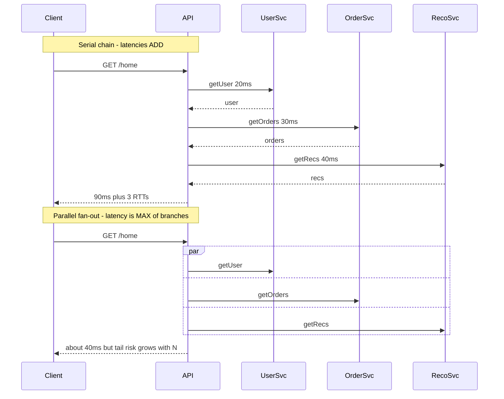
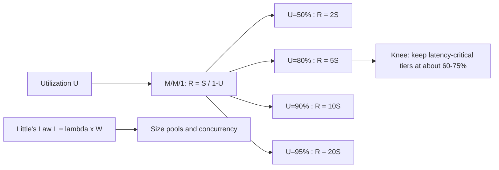
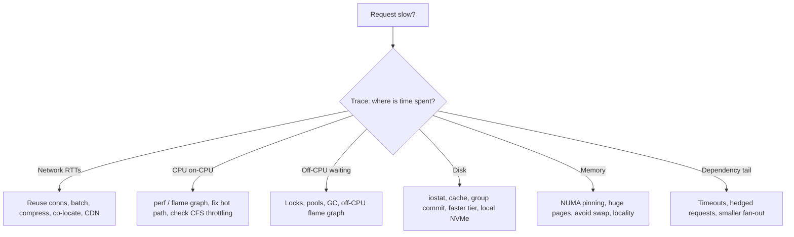
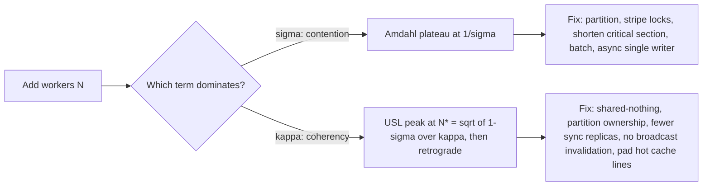
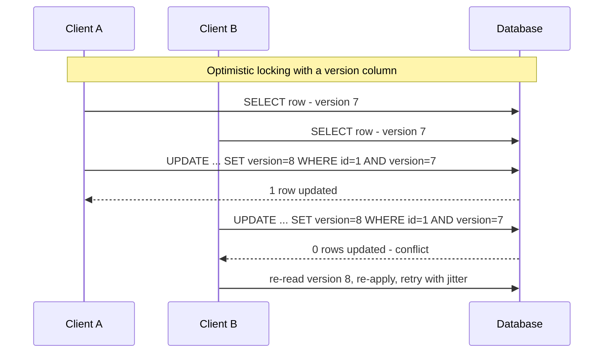
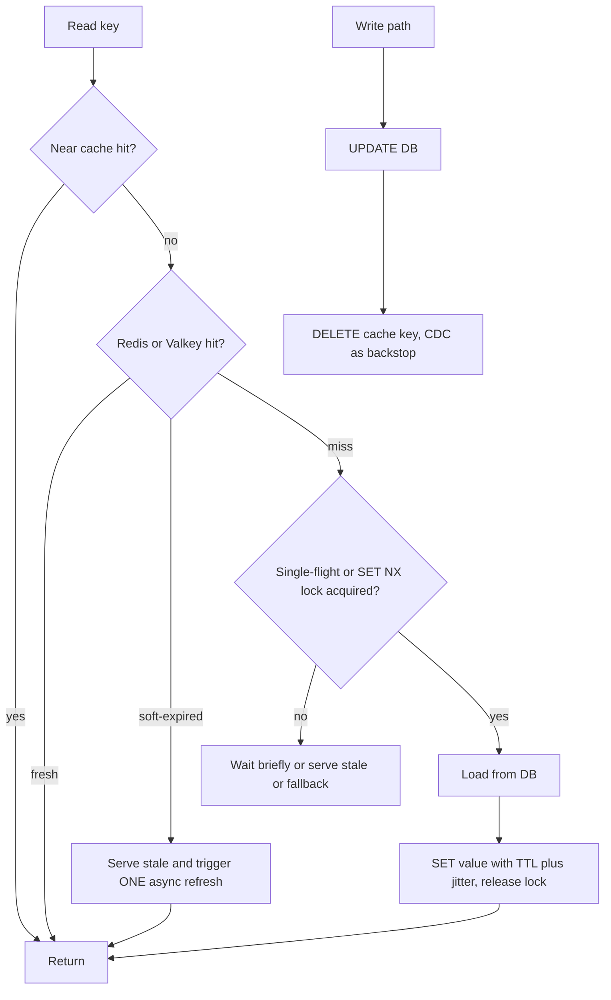

# C1 Performance
> Last verified: 2026-10 · Audience: senior/staff DevOps, SRE, AI eng, NetEng, DevSecOps, architects

## TL;DR
- **Performance has three numbers:** **latency** (time for one request), **throughput** (requests or bytes per unit time) and **utilization** (fraction of time a resource is busy). They are linked by **Little's Law** `L = λ·W`. Interviewers want to hear that you can trade one against another and know which one the SLO is written on.
- **Report latency as percentiles from histograms** (p50, p90, p99, p99.9), never as averages. Never average percentiles across hosts. Also track the latency of failed requests separately, so fast errors do not flatter the numbers.
- **Fan-out amplifies the tail:** if each leaf has a 1% chance of being slow, a request that touches 100 leaves is slow `1 − 0.99^100 ≈ 63%` of the time. Mitigate with hedged or tied requests, timeouts, partial results and smaller fan-out (Dean & Barroso, *The Tail at Scale*).
- **Queueing sets the operating point:** in an M/M/1 queue, response time is `R = S / (1 − U)`. That is 2× the service time at 50% utilization, 5× at 80% and 10× at 90%. Run latency-sensitive tiers at about **60–75% utilization**, because the knee arrives quickly after that.
- **Serial latency adds up and parallel latency is the max of the branches.** Cut the number of round trips first: remove sequential hops, parallelize independent calls, batch, and move the work closer to the data.
- **Know the latency hierarchy by order of magnitude:** CPU cache is ns, DRAM is ~100 ns, NVMe is tens of µs, an in-AZ network round trip is ~100s of µs, a cross-region round trip is tens to hundreds of ms. The fix depends on which layer dominates.
- **Measure before you tune:** use the USE method for resources, RED or golden signals for services, `perf` and flame graphs for CPU, off-CPU analysis for waiting, and distributed tracing (OpenTelemetry) to find serial hops.
- **Serialization caps scale-out:** Amdahl `S = 1/((1−p) + p/N)`, so a 5% serial part caps speedup at 20×. Gunther's USL adds a coherency term κ that makes throughput **fall** past `N* = √((1−σ)/κ)`. If adding nodes lowers throughput, look for crosstalk and coordination.
- **Contention fixes in order:** don't share → partition or stripe → shorten critical sections → batch or coalesce → MVCC or optimistic → queue to a single writer. Choose **optimistic locking** (version, ETag, conditional write, CAS) when conflicts are rare and **pessimistic** (`SELECT … FOR UPDATE`) when they are frequent or a retry is expensive. Know ABA and fencing tokens.
- **Caching:** cache-aside + TTL with jitter + delete-after-write is the default. Write-through for read-after-write freshness, write-behind only if losing writes is acceptable. Static assets use fingerprinted URLs with `max-age=31536000, immutable`. Be ready for **stampedes, hot keys, cold caches and invalidation races**: single-flight, stale-while-revalidate, near caches, key replication, cache warming.
- **Cloud levers:** placement groups (AWS cluster PG, Azure proximity placement group), enhanced or accelerated networking, local NVMe instance store or temp disk for scratch data, provisioned-IOPS disks (io2 Block Express, Ultra Disk or Premium SSD v2), and right-sizing or keeping NUMA affinity on large instances.

## C1.1 What is performance
- **How it works:**
  - **Performance** is how fast and how much work a system does for a given resource budget, measured against the expectations of a **workload**. A workload is the request mix, the arrival pattern and the data size.
  - **Latency or response time** is the time from request to response. It equals **service time** (actual work) plus **wait time** (queueing, contention, coordination).
  - **Throughput** is completed work per unit time (RPS, TPS, MB/s, tokens/s). **Bandwidth** is the *capacity* of a link or device, and throughput is what you actually achieve.
  - **Utilization** is the busy time divided by the observation interval. **Saturation** is work that is queued because the resource is fully busy (for example run-queue length, disk `aqu-sz`, TCP backlog).
  - Two distinct problems: a **performance problem** means the system is slow for a single user or request even at low load. A **scalability problem** means it is fast for one user but degrades as load grows. C1 covers the first. See C2 for the second.
- **Trade-offs / when to use:**
  - Latency and throughput often conflict. **Batching**, larger buffers and Nagle's algorithm raise throughput but add latency per item. LLM serving shows the same trade-off: larger batches raise tokens/s but also raise time-to-first-token.
  - **Efficiency** (work per $ or per watt) is the third axis and is usually what FinOps or capacity teams optimize.
- **Interview angles:**
  - If asked "is the system fast?", answer that it depends on the **percentile, the load level and the workload mix**. Ask for the SLO, for example "p99 < 200 ms at 5k RPS".
  - Pitfall: quoting peak throughput measured at 100% utilization. Latency at that point is unbounded.

## C1.2 How do performance problems look like
- **How it works:** typical symptoms seen in production:
  - **Latency rises with load.** This is queueing at a saturated resource (CPU, connection pool, thread pool, lock, disk).
  - **Throughput plateaus** while utilization of some resource sits at 100%. That resource is the bottleneck. If nothing is at 100%, suspect a lock or serialization point (see C1.18–C1.24 in part 2).
  - **The tail diverges from the median:** p50 is flat but p99 or p99.9 spikes. Causes include GC pauses, noisy neighbours, CPU throttling (cgroup CFS quota), compaction, cache misses, retries and TCP retransmits (a 200 ms+ minimum RTO).
  - **Latency is high even at low load.** This is a serial-path problem: too many round trips, N+1 queries, chatty RPCs, cold caches, DNS or TLS on every call.
  - **Degradation over time:** memory leaks lead to GC thrash, which leads to swap. Fragmentation, growing table or index size, and log or file-handle exhaustion also cause it.
  - **Retrograde throughput:** adding load *reduces* completed work because of thrashing, lock convoys or coherence costs (Universal Scalability Law, part 2).
- **Trade-offs / when to use:** a "slow" report usually comes from one of three layers: client or network (H5), service (CPU, locks, GC) or dependency (DB, cache, downstream). Use tracing to split them before you tune anything.
- **Interview angles:**
  - If asked "the API got slow, what do you do?", walk through it in order. Scope it (which endpoint, which percentile, since when, which deploy). Compare golden signals. Use **USE** per resource. Read traces for the critical path. Profile the hot path.
  - Mention **coordinated omission**: closed-loop load generators that wait for responses under-report the tail. Use open-loop, constant-arrival-rate tools.

## C1.3 Performance principles
- **How it works:** core principles:
  - **Measure first** and optimize the **critical path** only. Amdahl's law says speeding up a component that accounts for 5% of the time gives at most 5% total gain.
  - **Do less work:** avoid, cache, precompute, filter early, and choose the right data structure or algorithm.
  - **Do fewer round trips:** batch, pipeline, co-locate, denormalize for reads.
  - **Do work in parallel** when it is independent. Do it **asynchronously** when the user does not need the result now (queues, write-behind).
  - **Move data less:** compression, projection (select only the columns you need), pushing compute down to the data (predicate pushdown, stored procedures, edge compute).
  - **Keep resources below the knee:** headroom, admission control, back-pressure, load shedding.
  - **Reduce variance**, not just the mean. Bound queues, set timeouts, isolate noisy work (bulkheads), and avoid long GC pauses and synchronous logging.
- **Trade-offs / when to use:** each optimization costs complexity, consistency (caches) or cost (over-provisioning). State which one you accept.
- **Interview angles:**
  - Known pitfalls: premature micro-optimization, tuning without a baseline, and benchmarking on a laptop or with a warm cache only.
  - Good senior phrasing: "Set a **latency budget** per hop. For example, a 200 ms p99 end to end becomes 20 ms at the edge, 40 ms for the API and 80 ms for the DB, plus margin. Then enforce it with timeouts and deadlines that propagate down the call chain."

## C1.4 System performance objectives
- **How it works:**
  - **Objectives are stated on user-visible SLIs:** a latency percentile at a load level ("p99 ≤ 300 ms at 10k RPS"), throughput ("process 1M events/min with lag < 30 s") and availability. SLO mechanics are covered in J1.
  - **Typical objective set:**
    - Minimize **latency** at the target percentile.
    - Maximize **throughput** at the latency SLO, which is the real "capacity".
    - Bound **utilization** to keep headroom.
    - Meet **cost or efficiency** targets.
  - **Little's Law** `L = λ × W` (mean items in system = arrival rate × mean time in system). It holds for any stable system and is distribution-free.
    - Example: 2,000 RPS × 50 ms = **100 concurrent requests in flight**. Size thread pools, DB connection pools and `max_connections` from this, plus burst headroom.
    - It works in reverse: a pool of 20 DB connections with a 10 ms query time caps throughput at 20 / 0.01 = **2,000 QPS**.
  - **Queueing knee:**
    - M/M/1 gives `R = S/(1−U)` and mean queue length `U/(1−U)`.
    - With S = 10 ms: U = 50% gives 20 ms, 80% gives 50 ms, 90% gives 100 ms, 95% gives 200 ms.
    - Tail percentiles blow up earlier than the mean.
    - With multiple servers (M/M/c) you can run hotter. A pool of 32 cores tolerates around 80–85% before the knee, while a single disk or a single-threaded event loop tolerates far less.
- **Trade-offs / when to use:**
  - Target utilization: about 60–70% for single-queue or latency-critical resources, about 75–85% for wide multi-server pools.
  - Batch tiers can run near 100% because only throughput matters.
  - Autoscaling targets (for example 60% CPU) are a direct application of this rule.
- **Interview angles:**
  - If asked "why not run at 95% CPU to save money?", answer: queueing theory. Latency is roughly 20× service time at 95%, any burst causes timeouts, and timeouts cause retry storms.
  - If asked to size a connection pool, use Little's Law with the p99 hold time, not the mean, then cap it to protect the DB.

## C1.5 Performance measurement metrics
- **How it works:**
  - **Percentiles:**
    - **p50** is the median, the "typical" request.
    - **p99** means 1 in 100 requests is slower. A page that makes 100 calls hits it on almost every page view.
    - **p99.9** matters for high-fan-out services and for the heaviest users, who often generate the most revenue.
  - **Record histograms, not raw averages.** Examples: Prometheus histograms or native histograms, HdrHistogram, OTel exponential histograms, CloudWatch percentile statistics (they need raw, non-summarized data points or `SampleCount=1` statistic sets).
    - Percentiles **cannot be averaged** across instances or time windows. Merge the histograms and then compute.
    - Google SRE recommends bucketing request counts with **exponentially distributed bucket boundaries**.
  - **Tail latency amplification:**
    - P(request is slow) = `1 − (1 − p)^N` for fan-out N.
    - With p = 1% per leaf: N = 10 gives 9.6%, N = 100 gives 63%, N = 1000 gives ~100%.
    - Overall latency is the **max** of the parallel leaves, so the system's p50 is approximately a leaf's p99 when N ≈ 100.
  - **Metric families:**
    - **USE** (Utilization, Saturation, Errors) for every *resource*.
    - **RED** (Rate, Errors, Duration) for every *service*.
    - **Four golden signals** (latency, traffic, errors, saturation).
    - Also: Apdex, time-to-first-byte (TTFB), and LLM-specific **TTFT / TPOT** (see K4).
  - **Throughput metrics:** RPS, TPS, IOPS (with the I/O size), MB/s, and pps for network. IOPS without a block size is meaningless.
- **Trade-offs / when to use:**
  - Averages hide bimodal distributions. Max is noisy. Trimmed mean (CloudWatch `TM99`) is a useful compromise for alarms.
  - High-resolution metrics (1 s in CloudWatch) cost more but catch micro-bursts.
- **Interview angles:**
  - If asked "average latency is 100 ms, is that fine?", answer: unknown. Google SRE's example is a 100 ms average where 1% of requests take 5 s.
  - Follow-up on mitigating the tail:
    - **Hedged requests**: send a second request after the p95 time has elapsed, which costs a few percent of extra load.
    - **Tied requests**: the duplicate cancels its sibling once one starts.
    - Micro-partitioning, selective replication of hot shards, putting slow replicas on probation, and good-enough partial results.

## C1.6 Serial request latency
- **How it works:**
  - **Serial chain:** total = Σ(hop latencies) + Σ(network RTTs). **Parallel fan-out:** total ≈ max(branch latencies) + coordination overhead.
  - A single HTTPS call from a cold client pays DNS (1 RTT or more), TCP (1 RTT), TLS 1.3 (1 RTT, or 0-RTT on resumption), then the request (1 RTT) plus server time. On a 50 ms RTT link that is about **200 ms before any work happens** (details in H5.3 and F6.4).
  - The **N+1 query pattern** turns one page into N sequential DB round trips. 100 × 1 ms in-AZ RTT is 100 ms, against a few ms for a single `IN (...)` or JOIN.
  - Microservice call depth: 5 sequential services at 20 ms each is 100 ms, and their p99s **compound**. The tail of a chain is roughly the sum of the tails, not the max.
- **Trade-offs / when to use:**
  - Parallelizing independent calls reduces latency but raises peak load and fan-out tail risk.
  - Aggregation layers (BFF, GraphQL, API composition) cut client round trips but can hide server-side N+1 problems.
- **Interview angles:**
  - If asked to "cut latency on this request path", draw the critical path from a trace. Remove or merge sequential hops, parallelize independent ones, cache or precompute the rest, then propagate deadlines down the chain.
  - Pitfall: retries inside every layer multiply. Three layers × 3 attempts each gives 27 backend calls. Retry at one layer only, with budgets.

## C1.7 Network transfer latency
- **How it works:** the components, covered in depth in [H5.1](../H-full-stack-troubleshooting/H5-network-performance-deep-dive.md#h51-what-is-network-latency-propagation-transmission-processing-queuing-protocol-delay):
  - **Propagation:** distance ÷ ~200,000 km/s in fibre, which is about **5 µs per km** one way, or about **1 ms RTT per 100 km**. New York to London is ~5,600 km, so the physical minimum RTT is ~56 ms and real paths are ~70 ms.
  - **Transmission (serialization):** size ÷ bandwidth. 1 MB on 1 Gbps is 8 ms. On 10 Gbps it is 0.8 ms.
  - **Processing and queuing:** router, NIC and kernel stack costs, and bufferbloat under load.
  - **Protocol delay:** handshakes, TCP slow start (initcwnd of 10 segments ≈ 14.6 KB in the first RTT), ACK clocking, loss recovery.
  - The **bandwidth-delay product (BDP)** bounds a single flow: throughput ≤ window ÷ RTT. A 64 KB window over 100 ms RTT gives about 5 Mbps. Window scaling and autotuning matter on long-fat networks.
  - In-cloud references (order of magnitude): same placement group or rack ~25–100 µs RTT, same AZ ~100–500 µs, cross-AZ ~0.5–2 ms, cross-region tens to hundreds of ms.
- **Trade-offs / when to use:** latency is dominated by round trips for small payloads and by bandwidth for large ones. Calculate which regime you are in before optimizing.
- **Interview angles:**
  - If asked "why is our cross-region replication slow despite a 10 Gbps link?", answer that BDP limits each TCP window. Fix it with window tuning, parallel streams, BBR, or by replicating less data.
  - Remember that **cross-AZ traffic costs money** on AWS (and Azure inter-zone is billed by data transfer, unverified for current rates). This is a performance-and-cost trade-off. See [G4](../G-cloud-network-architecture/G4-network-performance-and-optimization.md).

## C1.8 Minimizing network transfer latency
- **How it works:**
  - **Connection reuse:**
    - HTTP keep-alive, HTTP/2 multiplexing, client connection pools, gRPC channels and DB connection pools (PgBouncer, RDS Proxy) avoid repeated TCP and TLS handshakes.
    - Use TLS session resumption or 0-RTT, with replay caveats for non-idempotent requests.
    - HTTP/3 or QUIC removes TCP head-of-line blocking (F6.7) and combines the transport and TLS handshakes.
  - **Fewer round trips:** batch APIs, pipelining (Redis pipelines, `MGET`), GraphQL or BFF aggregation, server push replaced by preload hints (`103 Early Hints`).
  - **Less data:**
    - Compression: gzip, **Brotli** for static text, **zstd** for internal RPC and logs. It trades CPU for bytes and wins when bandwidth or RTT-dominated transfers are large.
    - Binary encodings: Protobuf or Avro instead of JSON.
    - Field projection and pagination; delta sync.
  - **Move closer to the user or data:** CDN and edge (C6.15, I3), regional replicas, anycast, and co-locating chatty services in the same AZ or placement group.
  - **Kernel and NIC:**
    - Enhanced networking (ENA, SR-IOV) or Azure Accelerated Networking.
    - TCP tuning: BBR, `tcp_slow_start_after_idle=0`, a larger initcwnd for CDN-style traffic. Disable Nagle (`TCP_NODELAY`) for request/response protocols (F6.2, F6.3).
    - Busy-polling or kernel bypass (DPDK, AF_XDP) for extreme low-latency needs.
- **Trade-offs / when to use:**
  - Compression costs CPU and adds latency on fast links for small payloads. Skip it below about 1 KB or on already-compressed data.
  - Long-lived connections complicate L4 load balancing because the load sticks to one backend. Use L7 load balancing or connection max-age.
  - Same-AZ pinning reduces resilience.
- **Interview angles:**
  - If asked "p99 jumped after moving to a service mesh", suspect added sidecar hops (about 2 per call), mTLS handshakes on a cold pool and connection churn. Check pool reuse and keep-alive settings.
  - Pitfall: a new TCP connection per request through a NAT gateway, which leads to port exhaustion and SYN retries at 1 s and 3 s.

## C1.9 Memory access latency
- **How it works:** see [A3](../A-operating-systems/A3-memory-management.md) and [A4.2](../A-operating-systems/A4-inside-the-cpu.md#a42-instruction-life-cycle-l1l2l3-lookups-64-byte-cache-lines).
  - **Hierarchy (approximate):**

    | Level | Latency |
    |---|---|
    | Register | ~0.3 ns |
    | L1 | ~1 ns, ~4 cycles |
    | L2 | ~3–5 ns |
    | L3 (LLC) | ~10–40 ns |
    | Local DRAM | ~80–100 ns |
    | **Remote NUMA node DRAM** | ~1.3–2× local |
    | CXL-attached memory | ~170–250 ns (unverified) |

  - Data moves in **64-byte cache lines**. Sequential access benefits from hardware prefetchers. Random pointer chasing pays full DRAM latency on every hop.
  - **TLB misses:** a page walk costs up to 4–5 memory accesses. Huge pages (2 MB or 1 GB) increase TLB reach.
  - **Page faults:** a minor fault costs about µs. A major fault (from disk or swap) costs from about 100 µs on NVMe to ms on HDD or EBS. Swap means a latency cliff.
  - **GC pauses** in managed runtimes are effectively memory latency at the application layer.
- **Trade-offs / when to use:** memory bandwidth (tens of GB/s per socket channel group) can bottleneck before latency does in analytics and LLM inference. LLM decode is memory-bandwidth-bound (see K4).
- **Interview angles:**
  - If asked "why is the 96-vCPU instance slower per request than the 16-vCPU one?", answer: cross-NUMA access, cache contention from noisy co-tenants, or lock contention. Check `numastat` and `perf stat` for LLC-miss counts.
  - False sharing (two threads writing to the same cache line) is a classic hidden slowdown. It is covered with coherence in C1.25.

## C1.10 Minimizing memory access latency
- **How it works:**
  - **Locality:** use contiguous arrays or structs-of-arrays instead of linked structures. Use columnar layouts for scans. Choose data structures that fit in L2 or L3 for hot paths.
  - **NUMA awareness:**
    - Pin processes or threads with `numactl --cpunodebind=N --membind=N` or `taskset`, and rely on first-touch allocation.
    - Use the Kubernetes Topology Manager (`single-numa-node` policy) together with the CPU Manager `static` policy for Guaranteed pods.
    - Consider whether automatic NUMA balancing (`kernel.numa_balancing`) helps or hurts your workload.
    - On large DB hosts, interleave or bind memory per instance.
  - **Huge pages:** explicit HugeTLB pages for DBs and JVMs (`-XX:+UseLargePages`). Be careful with **Transparent Huge Pages**: many DBs (Redis, MongoDB, older Oracle) recommend `never` or `madvise` because compaction causes latency spikes.
  - **Avoid swapping:** size memory for the working set, set `vm.swappiness` low, and use cgroup memory limits with headroom so the OOM killer does not take out the process.
  - **Allocation:** reuse buffers and pools, use arena allocators (jemalloc, tcmalloc), and reduce GC pressure (fewer short-lived objects). Choose a low-pause GC (ZGC or Shenandoah for the JVM) when the tail matters.
  - **Keep the hot set in RAM:** DB buffer pool sizing (`innodb_buffer_pool_size` ≈ 70–80% of RAM on dedicated hosts, PostgreSQL `shared_buffers` ~25% plus the OS cache), and in-process caches (C1.27).
- **Trade-offs / when to use:**
  - NUMA pinning improves the tail but reduces scheduler flexibility, and can strand capacity on one node.
  - Huge pages cost memory (internal fragmentation) and some boot-time reservation.
- **Interview angles:**
  - If asked "how would you cut p99 on a Redis or DB host?", answer: disable THP, pin to one NUMA node, avoid swap, isolate the CPUs that handle IRQs, and check for fork-on-snapshot copy-on-write spikes (Redis `BGSAVE`).

## C1.11 Disk access latency
- **How it works:** see [A6.3](../A-operating-systems/A6-storage-management.md#a63-what-really-happens-in-a-file-io-page-cache-lba-vs-pba-block-mapping) and [H5.4](../H-full-stack-troubleshooting/H5-network-performance-deep-dive.md#h54-server-processing-delays-disk-io).
  - **Media (approximate):**

    | Media | Latency |
    |---|---|
    | HDD random I/O | ~5–10 ms (seek plus rotation; 7,200 rpm gives ~4.2 ms average rotational delay) |
    | SATA SSD | ~100 µs |
    | Local NVMe | ~10–100 µs |
    | Network block storage | ~0.2–1+ ms |

  - **Cloud block storage (verified 2026-10):**
    - **AWS EBS gp3:** up to 64 TiB, 80,000 IOPS and 2,000 MiB/s; baseline 3,000 IOPS and 125 MiB/s. Max IOPS needs a Nitro instance.
    - **AWS io2 Block Express:** up to 256,000 IOPS, 4,000 MiB/s, designed for **< 500 µs average** latency at 16 KiB, with 99.999% durability.
    - **Azure Ultra Disk:** up to 400,000 IOPS and 10,000 MB/s, sub-millisecond.
    - **Azure Premium SSD v2:** up to 80,000 IOPS and 2,000 MB/s, sub-ms; baseline 3,000 IOPS and 125 MB/s.
    - **Azure Premium SSD v1:** single-digit ms, 99.9% of the time.
  - **Local instance store or temp NVMe** is the lowest latency option but **ephemeral**: data is lost on stop, hibernate or terminate on AWS, and on deallocation or host move on Azure temp or NVMe disks.
  - **Write path:** a write to the page cache costs about µs. `fsync` or `O_DSYNC` costs the full device latency, plus replication when the volume is network-replicated. A DB commit latency is roughly the WAL fsync latency.
  - Limits stack up: **instance-level EBS or VM disk throughput caps** often bind before the volume caps do.
- **Trade-offs / when to use:**
  - Local NVMe gives the best latency but needs app-level replication (Cassandra, Kafka with RF=3, Aerospike).
  - Network disks give durability, snapshots and detach/reattach, at the cost of higher and more variable latency.
- **Interview angles:**
  - If asked "DB p99 commit latency is 20 ms on gp3", check for throttling: IOPS or throughput at the cap (`VolumeQueueLength`, `VolumeIOPSExceededCheck`-style metrics) or the instance EBS bandwidth limit. Fixes: io2, larger I/O sizes, group commit.

## C1.12 Minimizing disk access latency
- **How it works:**
  - **Avoid the disk:** use the page cache or buffer pool and caching layers. Read-ahead for sequential reads. Keep indexes in RAM.
  - **Sequential beats random:** LSM-trees and append-only logs (Kafka, WAL) turn random writes into sequential ones. Batch small writes with **group commit** (Postgres `commit_delay`, Kafka `linger.ms`).
  - **Async I/O and parallelism:** `io_uring` and `libaio` raise queue depth. NVMe needs QD > 1 to reach its rated IOPS, and Little's Law ties QD, IOPS and latency together (`QD = IOPS × latency`).
  - **Right I/O size and alignment:** 4 KiB-aligned I/O. Larger I/O for throughput. Check the volume's "I/O size to reach max IOPS" (16 KiB for io2).
  - **Choose the tier:** local NVMe for scratch, cache, temp tables and shuffle. Provisioned IOPS (io2, Ultra, Premium SSD v2) for latency-sensitive DBs. Stripe volumes (RAID 0, LVM) only when a single volume cap binds.
  - **Scheduler and filesystem:** use the `none` or `mq-deadline` I/O scheduler for NVMe. Use the `noatime` mount option. Use XFS or ext4 with correct alignment.
  - **Durability knobs, used deliberately:** relaxed fsync settings (`innodb_flush_log_at_trx_commit=2`, `synchronous_commit=off`) trade durability for latency.
- **Trade-offs / when to use:** async or relaxed fsync risks data loss on crash. Local NVMe risks data loss on host failure. Caching adds staleness.
- **Interview angles:**
  - If asked to "make writes faster without losing data", answer with group commit, a WAL on a faster device, batching at the app, and quorum replication instead of fsync-per-write in some designs.
  - Mention measuring with `fio` at a realistic block size and queue depth, and `iostat -x` (`r_await`, `w_await`, `aqu-sz`, `%util`). On NVMe, `%util` is misleading because devices serve requests in parallel.

## C1.13 CPU processing latency
- **How it works:** see [A4](../A-operating-systems/A4-inside-the-cpu.md).
  - **CPU time per request** = instructions × CPI ÷ clock. Driven by algorithmic cost, serialization/deserialization (JSON parsing is often the top cost), crypto (TLS, mostly AES-NI-accelerated), compression, regex and logging.
  - **Wait components that look like CPU latency:**
    - **Run-queue wait:** runnable but not scheduled. Check load > cores, `vmstat r`, PSI `cpu.pressure`.
    - **Context switches:** ~1–5 µs direct cost plus cache pollution.
    - **CFS throttling:** a container with a CPU limit is throttled within a 100 ms period, causing tens of ms of pause even at low average CPU. Watch `nr_throttled` and `throttled_usec`.
    - **Steal time** (`%st`) on virtualized hosts. **Burstable-instance credit exhaustion** (T-family, B-series).
    - **Frequency scaling and turbo**, and SMT siblings sharing execution units.
  - **Syscall cost:** ~100 ns–1 µs, more with Spectre/Meltdown mitigations. Mode switches add up with small reads and writes.
  - **IO-bound vs CPU-bound** distinction: see [A4.4](../A-operating-systems/A4-inside-the-cpu.md#a44-cpu-wait-times-io-bound-vs-cpu-bound-workloads).
- **Trade-offs / when to use:** more cores help throughput but not single-request latency unless the work is parallelized. Higher clock speeds and newer generations (Graviton 4, Intel or AMD current gen) help single-request latency.
- **Interview angles:**
  - If asked "CPU is at 40% but latency is spiky in Kubernetes", answer: **CFS quota throttling**. Remove CPU limits for latency-sensitive pods (keep requests), raise limits, or use the static CPU manager.
  - If asked how to separate on-CPU from off-CPU time, answer: CPU flame graphs for on-CPU, off-CPU flame graphs or `offcputime` (BCC) for blocked time.

## C1.14 Minimizing CPU processing latency
- **How it works:**
  - **Profile, then fix:**
    - `perf top`; `perf record -F 99 -a -g -- sleep 30` then `perf script | stackcollapse-perf.pl | flamegraph.pl`.
    - In a **flame graph**, the x-axis is alphabetical and *not time*. Width is the share of samples. Look for wide plateaus.
    - Also: differential flame graphs for regressions, eBPF tools (`profile`, `runqlat`, `offcputime`), `perf stat` for IPC, cache misses and branch misses.
    - **Continuous profiling** in prod: Pyroscope or Grafana, Parca, Datadog, CodeGuru Profiler, App Insights Profiler.
  - **Algorithmic or work reduction:** better complexity, avoid repeated work (memoize), cheaper serialization (Protobuf, FlatBuffers, simdjson), avoid regex on hot paths, sample debug logs, async logging.
  - **Concurrency model:**
    - Async or event-loop I/O (epoll, io_uring) frees threads from waiting.
    - Size thread pools with Little's Law, for example threads ≈ cores × (1 + wait/compute).
    - Avoid blocking calls on event loops (Node, Netty).
  - **Scheduling and isolation:**
    - Pin latency-critical threads. Use `isolcpus` or `nohz_full` for extreme cases.
    - IRQ affinity and RSS/RPS to spread NIC interrupts.
    - Avoid noisy neighbours (dedicated hosts or instances).
    - Disable SMT for some HPC or low-latency trading workloads.
  - **Runtime:** JIT warm-up (pre-warm before taking traffic), GC tuning, and compiled or vectorized code (SIMD). Use specialized hardware: GPUs for ML, Nitro or SmartNIC offload for encryption and networking, QAT for compression or crypto.
  - **Right instance:** compute-optimized (C-family or F-series) with higher clock speeds. Avoid burstable instances for steady latency-sensitive load. Arm (Graviton or Cobalt) often has better price-performance (verify per workload).
- **Trade-offs / when to use:**
  - Pinning and isolation waste idle capacity.
  - Removing CPU limits risks noisy-neighbour effects inside the node, so keep requests accurate.
  - Continuous profilers add about 1–5% overhead typically. Azure documents 5–15% while the .NET Profiler is actively collecting.
- **Interview angles:**
  - If asked "how do you find what is burning CPU in prod?", answer: continuous profiler or `perf` plus a flame graph. Compare against a baseline with a differential flame graph tied to the deploy.
  - Pitfall: profiling only on-CPU time when the problem is lock wait or I/O. Cover off-CPU too.

## C1.15 Some common latency costs
- **How it works:** order-of-magnitude reference. It derives from Jeff Dean's and Peter Norvig's "numbers everyone should know", refreshed for roughly 2024–2026 hardware and cloud. Treat every value as **±2–3×**; values are not verified per SKU.

| Operation | Approx. latency | Notes |
|---|---|---|
| L1 cache reference | ~1 ns | ~4 cycles |
| Branch mispredict | ~3–5 ns | pipeline flush (~15–20 cycles) |
| L2 cache reference | ~4 ns | |
| L3 / LLC reference | ~10–40 ns | larger on many-core sockets |
| Uncontended mutex lock/unlock | ~15–25 ns | contended means µs, involving the kernel and futex |
| Main memory (local DRAM) | ~80–100 ns | remote NUMA ~1.5–2× |
| System call (trivial) | ~0.1–1 µs | depends on mitigations |
| Context switch | ~1–5 µs | plus cache-warm-up cost |
| Compress 1 KB (zstd/Snappy, fast level) | ~1–3 µs | |
| Send 1 KB over a 10 Gbps NIC (serialization) | ~1 µs | wire time only |
| Read 1 MB sequentially from RAM | ~10–50 µs | at ~20–100 GB/s |
| Random 4 KiB read, local NVMe | ~10–100 µs | |
| Same-AZ or same-datacenter RTT | ~0.1–0.5 ms | placement group ~tens of µs |
| EBS io2 Block Express / Ultra Disk I/O | < 0.5–1 ms | AWS: io2 BX < 500 µs average at 16 KiB |
| Read 1 MB sequentially from NVMe | ~0.2–0.5 ms | at ~2–7 GB/s |
| Cross-AZ RTT | ~0.5–2 ms | |
| Redis or Memcached GET, same AZ | ~0.2–1 ms | network-dominated |
| HDD seek | ~4–10 ms | |
| Read 1 MB sequentially from HDD | ~5–10 ms | at ~100–200 MB/s |
| TLS 1.3 full handshake | 1 RTT + ~1 ms CPU | 0-RTT on resumption |
| US East–West coast RTT | ~60–70 ms | |
| Transatlantic RTT (NY–London) | ~70–80 ms | physical floor ~56 ms |
| US–Asia or Europe–Australia RTT | ~150–250+ ms | |
| TCP retransmit timeout (min RTO, Linux) | 200 ms | first SYN retry 1 s |

- **Trade-offs / when to use:** use the table for **back-of-envelope** checks in design interviews. Examples:
  - "1M random DB reads/s from HDD is impossible on one box. At ~100 IOPS per spindle it needs about 10k spindles, or an in-memory cache."
  - "A 3-region synchronous quorum write costs at least about 1 cross-region RTT."
- **Interview angles:**
  - Typical prompt: "estimate the latency of this request path". Add up RTTs plus service times using the table, then identify the dominant term. Usually it is network round trips or one slow dependency, rarely CPU.
  - Relative ratios matter more than absolutes: memory is ~100× L1, NVMe is ~1000× DRAM, cross-region is ~1000× in-AZ.
  - More comparisons: [H5.7](../H-full-stack-troubleshooting/H5-network-performance-deep-dive.md#h57-system-and-network-latency-comparison).

## C1.16 Amdahl's law for concurrent tasks
- **How it works:**
  - **Formula:** with `p` = parallelizable fraction of the work and `N` = workers, speedup `S(N) = 1 / ((1 − p) + p/N)`. The upper bound as N → ∞ is `1 / (1 − p)`.
  - **Worked example, p = 0.95 (5% serial):**

    | N | Speedup | Efficiency S/N |
    |---|---|---|
    | 2 | 1.90× | 95% |
    | 8 | 5.9× | 74% |
    | 16 | 9.1× | 57% |
    | 64 | 15.4× | 24% |
    | ∞ | **20×** cap | → 0 |

  - The serial part includes anything run under one lock or by one thread: a global mutex, a single-writer DB row, a leader/coordinator, a single partition, result merge or sort, and synchronous logging.
  - The same law applies to **optimizing one component**: speeding up a fraction `f` by factor `k` gives `1 / ((1 − f) + f/k)`. Making a 30% component 10× faster gives only **1.37×** overall.
  - **Gustafson's law** is the counterpoint. If the problem grows with N (weak scaling, as in big-data or ML training), scaled speedup is `S = N − s(N − 1)` with serial fraction `s`, which is close to linear. Amdahl assumes a fixed problem size (strong scaling).
- **Trade-offs / when to use:**
  - Use Amdahl to decide whether to **add cores or nodes** or to **remove serialization**. Past roughly `N ≈ 1/(1−p)`, more hardware is mostly wasted money.
  - Amdahl assumes zero coordination cost, so it is an optimistic bound. Real systems are worse. See the USL in C1.17.
- **Interview angles:**
  - If asked "we doubled the pods and throughput rose only 10%", answer: find the serial fraction. Common causes are a hot DB row, a global lock, a single Kafka partition or consumer, a leader, or a downstream rate limit. Measure per-stage utilization and lock wait.
  - If asked "how far can this scale?", estimate `p` from two load-test points and compute `1/(1−p)`.
  - Pitfall: quoting Amdahl for a throughput-oriented, embarrassingly parallel service (stateless web tier). There the serial part is in shared dependencies, not in the request.

## C1.17 Gunther's universal scalability law
- **How it works:**
  - **USL (Neil Gunther):** relative capacity `C(N) = N / (1 + σ(N − 1) + κN(N − 1))`, where throughput `X(N) = λ·C(N)` and λ is single-unit throughput.
    - **σ (contention, serialization):** queueing for a shared resource. This is the Amdahl term. On its own it gives diminishing returns that plateau at `1/σ`.
    - **κ (coherency, crosstalk):** the cost of keeping N units consistent with each other: cache-line ping-pong, distributed locks, cache invalidation broadcasts, consensus or gossip, all-to-all chatter. It grows as **N²**, so throughput **goes down** after a peak. This is **retrograde scaling**.
  - **Peak concurrency:** `N* = √((1 − σ) / κ)`.
  - **Worked example, σ = 0.05, κ = 0.001:** N* = √950 ≈ **31**. C(31) ≈ 9.0×. C(64) ≈ 7.8×, so adding more than doubles the nodes **lowers** throughput.
  - Special cases: σ = κ = 0 is linear scaling. κ = 0 is Amdahl. κ > 0 always has a maximum.
  - **Fitting:** load-test at 5–8 concurrency levels, normalize by the N = 1 throughput, then fit σ and κ with nonlinear regression (Gunther's spreadsheet method, or the R `usl` package). Then extrapolate capacity.
- **Trade-offs / when to use:**
  - The fix depends on which term is large. **High σ:** remove serialization (shard locks, partition, async). **High κ:** reduce cross-node coordination (shared-nothing, partition affinity, fewer replicas in the sync path, avoid broadcast invalidation, smaller consensus groups).
  - USL works for threads in a process, nodes in a cluster, and DB connections alike. That is why a DB connection pool that is larger than about `cores × 2–4` usually *lowers* throughput.
- **Interview angles:**
  - If asked "why did throughput drop when we added nodes?", answer: retrograde scaling (κ). Examples are Cassandra or Elasticsearch clusters with a lot of cross-node coordination, a JVM with false sharing, a Postgres with too many active connections (lock manager and ProcArray contention), and a distributed lock service under contention.
  - Know the difference from Amdahl: Amdahl gives a **plateau**, USL gives a **peak and decline**.
  - Follow-up: "how do you find N* before production?" Run a load test with stepped concurrency, fit the USL, set autoscaling max and pool sizes below N*.

## C1.18 Shared resource contention
- **How it works:**
  - **Contention** happens when more than one request needs the same resource at the same time, so all but one wait. Waiting time is pure latency with no work done. It is the σ term.
  - **Resources that become contended:**
    - **Hardware:** CPU cores (run queue), memory bandwidth, LLC, disk queue, NIC queues, IOPS and throughput caps.
    - **Software:** mutexes, DB row and table locks, latches and buffer-pool pages, connection pools, thread pools, a single-threaded event loop (Redis, Node), a GIL, log appenders, sequence or ID generators, a hot partition key.
    - **Distributed:** a single leader, a hot shard, a global rate limiter or counter, a ZooKeeper or etcd lock.
  - **Symptoms:** throughput plateaus with **no resource at 100% utilization**. High off-CPU time. Rising lock wait (`pg_locks`, `performance_schema` wait events, `SHOW ENGINE INNODB STATUS`). Pool wait time. Context-switch storms (`vmstat cs`). Futex time in `perf`.
  - **Lock convoys:** a lock holder is descheduled or slow, a queue forms, every waiter then pays a context switch, and throughput collapses below single-thread speed.
  - **Priority inversion:** a low-priority holder blocks a high-priority waiter. The classic example is Mars Pathfinder. The fix is priority inheritance.
- **Trade-offs / when to use:** some contention is the price of correctness (one account balance has to be serialized). The design question is how to make the critical section **small, short and rare**.
- **Interview angles:**
  - If asked "CPU is 30%, latency is high, throughput is flat", answer: contention, not capacity. Check lock waits, pool waits, off-CPU flame graphs, and the hottest DB rows.
  - Know Little's Law applied to a lock: if a critical section takes 1 ms, that lock tops out at **1,000 acquisitions per second** no matter how many cores you add.

## C1.19 Minimizing shared resource contention
- **How it works:** the toolbox, from least to most invasive:
  - **Don't share:** per-thread or per-core data (thread-local buffers, per-CPU counters), shared-nothing architecture, one process per core (the Seastar / ScyllaDB approach), actor model, ownership by partition.
  - **Partition or shard the resource:** N independent pieces, each with its own lock. Examples: Java's `ConcurrentHashMap` lock striping, sharded counters (sum on read), a hash-partitioned DB (B5, B6), Kafka partitions, sharded rate-limit buckets.
  - **Shorten the critical section:** compute outside the lock and only publish inside it. Never do I/O or an RPC while holding a lock.
  - **Lower the acquisition rate:** batch (group commit, amortize one lock over many items), coalesce (single-flight), cache read-mostly data.
  - **Replicate read-mostly data:** read replicas, copy-on-write snapshots, **RCU** (Linux read-copy-update: lock-free readers, writers swap a pointer).
  - **Use less exclusive modes:** reader-writer locks (help only if reads are long and dominate), MVCC so readers do not block writers (Postgres, InnoDB), optimistic concurrency (C1.22).
  - **Go asynchronous:** put the contended write behind a queue with a single writer (LMAX Disruptor style, event sourcing). That turns contention into ordered, batched, sequential work.
  - **Scale the resource:** bigger pool, more IOPS, more partitions. This only works if the resource is actually saturated and not just locked.
- **Trade-offs / when to use:**
  - Partitioning adds cross-partition operations (multi-key transactions, global aggregates) and hot-partition risk.
  - Per-core state wastes memory and makes global reads more expensive.
  - Queues add latency and failure modes, but make throughput predictable.
- **Interview angles:**
  - Classic prompt: "design a like counter for a viral post". Answer: sharded counter (`post:123:likes:{0..N}` with `INCRBY` on a random shard, sum on read or periodic rollup), or buffer increments in memory and flush in batches. Do not run `UPDATE posts SET likes = likes + 1` per click on one row.
  - "Ticket booking / inventory": partition the stock into buckets, or reserve with a conditional decrement, then confirm asynchronously.

## C1.20 Minimizing locking related contention
- **How it works:**
  - **Lock granularity:** DB lock → table → page → row. Coarse locks are simple but serialize more. Fine-grained locks give more concurrency but more overhead and more deadlock risk. Avoid **lock escalation** (SQL Server escalates at ~5,000 locks per statement by default) by batching large updates.
  - **Lock duration:** keep transactions short. Do not hold a DB transaction open across user think-time or an external HTTP call. Use `lock_timeout` and `statement_timeout` (Postgres) or `innodb_lock_wait_timeout` (MySQL, 50 s default) so waiters fail fast.
  - **Lock mode:** shared vs exclusive (B7.1), `SELECT … FOR SHARE` vs `FOR UPDATE`. `FOR UPDATE SKIP LOCKED` turns a table into a contention-free work queue. `NOWAIT` fails immediately instead of waiting.
  - **Isolation level:** higher isolation (Serializable) means more locking or more aborts. Read Committed with MVCC is the common default (Postgres, Oracle, SQL Server RCSI). InnoDB defaults to Repeatable Read with gap and next-key locks, which can surprise people with extra blocking.
  - **In-process:** spin briefly then park (adaptive mutexes, futex). Prefer `ReentrantReadWriteLock`/`StampedLock` only if reads dominate. Use `LongAdder`-style striped counters instead of one `AtomicLong` under heavy contention. Use lock-free queues.
  - **Distributed locks:** Redis `SET key val NX PX ttl`, etcd or ZooKeeper leases, DynamoDB conditional writes. These always need a **lease/TTL** and a **fencing token** (monotonic number checked by the storage), because a paused holder can wake up after its lease expired.
- **Trade-offs / when to use:** fewer locks generally means more retries, more complex code, or weaker consistency. Choose based on the conflict rate: low conflict favours optimistic, high conflict favours pessimistic or queueing.
- **Interview angles:**
  - If asked about Redlock: mention Martin Kleppmann's critique (no fencing, timing assumptions). For correctness-critical locks use a consensus store (etcd, ZooKeeper) plus fencing tokens. Redis locks are fine for efficiency-only locks, such as preventing duplicate work.
  - Details of S/X locks and 2PL: [B7.1](../B-database-engineering/B7-concurrency-control.md#b71-shared-vs-exclusive-locks), [B7.3](../B-database-engineering/B7-concurrency-control.md#b73-two-phase-locking).

## C1.21 Pessimistic Locking
- **How it works:**
  - Assume a conflict will happen, so **lock before reading-to-modify**. Others block until commit or rollback.
  - SQL: `BEGIN; SELECT … FROM seats WHERE id = 42 FOR UPDATE; UPDATE …; COMMIT;`. Variants: `FOR UPDATE NOWAIT`, `FOR UPDATE SKIP LOCKED`, `FOR NO KEY UPDATE` (Postgres, weaker, does not block FK checks).
  - Application level: mutexes, semaphores, `synchronized`, distributed locks with leases.
  - Underpinned by **two-phase locking** for serializability (B7.3).
- **Trade-offs / when to use:**
  - **Use when** conflicts are frequent (hot rows, inventory, seat booking), when a retry is expensive (long computation, external side effects) or when the action cannot be undone.
  - **Costs:** blocking, lower concurrency, deadlock risk, locks held across a slow client, and connection pinning (a pool connection is held for the whole transaction).
- **Interview angles:**
  - "Double booking" answer: `SELECT … FOR UPDATE` on the seat row, or a unique constraint plus insert. See [B7.4](../B-database-engineering/B7-concurrency-control.md#b74-solving-the-double-booking-problem).
  - Pitfall: pessimistic locking over HTTP ("lock the record while the user edits it"). Use a short **lease** with expiry or switch to optimistic locking.

## C1.22 Optimistic Locking
- **How it works:**
  - Assume conflicts are rare. **Read without locking, then validate at write time** and retry if someone else changed the data.
  - **Version column:** `UPDATE t SET …, version = version + 1 WHERE id = ? AND version = ?`. If 0 rows are updated, there was a conflict, so re-read and retry or report it. JPA `@Version` and EF Core concurrency tokens implement this.
  - **HTTP:** `ETag` + `If-Match` on `PUT`/`PATCH`. A mismatch returns **412 Precondition Failed**. A server can require it with **428 Precondition Required**.
  - **Cloud DBs:** DynamoDB `ConditionExpression` (`attribute_not_exists`, `version = :v`) returns `ConditionalCheckFailedException`. Cosmos DB uses the `_etag` with an `IfMatchEtag` request option and returns HTTP 412. S3 supports conditional writes (`If-None-Match: *`, and `If-Match` on ETag).
  - **Kubernetes:** `metadata.resourceVersion`. Updates with a stale version get **409 Conflict**, which is why controllers re-get and retry.
  - **MVCC with Serializable Snapshot Isolation** (Postgres SSI) is optimistic at engine level: transactions abort with a serialization failure (SQLSTATE `40001`) and must be retried.
- **Trade-offs / when to use:**
  - **Use when** reads far outnumber writes, conflicts are rare, and transactions span user think-time or are stateless across requests (REST, mobile sync).
  - **Under high contention** it degrades into **retry storms** (livelock). The abort rate rises with conflict probability and wasted work grows. Switch to pessimistic locking, queueing or partitioning.
- **Interview angles:**
  - If asked "pessimistic or optimistic?", answer with the **conflict rate and the retry cost**. Low conflict and cheap retry means optimistic. High conflict or an expensive or irreversible action means pessimistic.
  - Always mention **bounded retries with jitter** and making the retried operation idempotent.

## C1.23 Compare and swap mechanism
- **How it works:**
  - **CAS(addr, expected, new)** is one atomic CPU instruction: write `new` only if the current value equals `expected`, and return success or failure. x86 uses `LOCK CMPXCHG`. ARMv8.1 has `CAS` (LSE atomics); earlier ARM uses LL/SC (`LDXR`/`STXR`).
  - It is the building block of **lock-free** structures: atomic counters, Treiber stacks, Michael–Scott queues, `java.util.concurrent` atomics, C++ `std::atomic::compare_exchange_*`, Go `sync/atomic`.
  - Typical loop: read the old value, compute the new one, CAS. On failure, reload and retry.
  - **Progress guarantees:** lock-free means at least one thread always makes progress. Wait-free means every thread finishes in bounded steps. Obstruction-free is the weakest.
  - **ABA problem:** a thread reads A, another changes A → B → A, and the first thread's CAS succeeds although the state changed (for example a freed and reused node in a lock-free stack). Fixes: **tagged pointers / version counter** (double-width CAS, `AtomicStampedReference`), hazard pointers, epoch-based reclamation, or garbage-collected runtimes (which avoid most of it).
  - **Distributed CAS:** the same idea at a higher level. Optimistic version checks (C1.22), etcd transactions (`If(mod_revision == x) Then(put)`), Redis `WATCH/MULTI/EXEC` or Lua scripts, Memcached `cas` with a token, DynamoDB conditional writes.
- **Trade-offs / when to use:**
  - CAS is very fast when uncontended (tens of ns). Under heavy contention every core fights for the same **cache line**, so retries and coherence traffic dominate (κ in USL). Then a striped counter or a lock can actually be faster.
  - Lock-free code is hard to get right (memory ordering, ABA, reclamation). Use library structures instead of writing your own.
- **Interview angles:**
  - If asked "what is ABA and how do you fix it?", give the stack example and the version-tag fix.
  - If asked "is lock-free always faster?", answer no. It avoids blocking and convoys and is immune to a descheduled holder, but contended CAS loops burn CPU and cache bandwidth.

## C1.24 Deadlocks
- **How it works:** fully covered in [B7.2 Dead Locks](../B-database-engineering/B7-concurrency-control.md#b72-dead-locks). Key points:
  - **Coffman conditions** (all four needed): mutual exclusion, hold-and-wait, no preemption, circular wait. Break any one to prevent deadlock.
  - **Prevention:** a **global lock ordering** (always lock rows by ascending ID), acquire all locks up front, use `try_lock` with timeout and back-off.
  - **Detection:** DBs build a wait-for graph and abort a victim. Postgres checks after `deadlock_timeout` (1 s default) and returns SQLSTATE `40P01`. InnoDB detects immediately and rolls back the smaller transaction (`innodb_deadlock_detect`, error 1213).
  - **Distributed:** usually avoided with lease timeouts rather than global detection.
  - Related hazards: **livelock** (everyone retries in lockstep, fixed with randomized back-off) and **starvation**.
- **Trade-offs / when to use:** timeouts are simple but cause false aborts. Ordering is cheap but hard to enforce across teams and ORMs.
- **Interview angles:** if asked "the DB reports deadlocks during a nightly batch", answer: sort the keys in every batch update, make transactions smaller, add the missing index (a full scan locks more rows), and retry `40P01` or 1213 with jitter.

## C1.25 Coherence related delays
- **How it works:** this is the κ term of USL. CPU caches and lines are in [A4.2](../A-operating-systems/A4-inside-the-cpu.md#a42-instruction-life-cycle-l1l2l3-lookups-64-byte-cache-lines).
  - **Hardware cache coherency:** cores keep private L1/L2 caches coherent with a protocol such as **MESI** (Modified, Exclusive, Shared, Invalid), or MESIF (Intel) and MOESI (AMD). Writing to a line that other cores hold invalidates their copies, and the next read on those cores is a miss that costs tens to over 100 ns, more across sockets or NUMA nodes.
  - **True sharing:** many cores write the same variable (a global counter, a lock word, a CAS target). The line bounces between cores ("cache-line ping-pong").
  - **False sharing:** independent variables happen to sit in the **same 64-byte line**, so cores writing different fields still invalidate each other. Fix with padding or alignment (`alignas(64)`, Java `@Contended`, per-thread structures). Detect it with `perf c2c`.
  - **Memory barriers and fences** (needed for correct lock-free code) stall the pipeline and drain store buffers.
  - **Distributed analogues:** cache invalidation fan-out to N nodes, replica sync, consensus round trips, gossip, session replication across a web farm, distributed-cache consistency, cross-shard transactions (2PC). Each grows with the number of participants.
- **Trade-offs / when to use:** strong consistency costs coherence work. Partition ownership (one writer per piece of data) removes most of it. Accepting bounded staleness (eventual consistency, TTL caches) trades correctness for less coherence traffic.
- **Interview angles:**
  - If asked "the 2-socket box scales worse than two 1-socket boxes", answer: cross-socket coherency and NUMA. Pin per socket or run one instance per NUMA node.
  - If asked to design a high-throughput metrics counter, mention false sharing and per-core counters with padding.

## C1.26 System architecture for performance
- **How it works:** the design-level levers, which combine C1.1–C1.25:
  - **Shorten the critical path:** remove synchronous hops, parallelize independent work, push non-critical work to **async queues** (C2.14, C2.15). Apply **CQRS**: build read models shaped for queries.
  - **Put data close to compute and users:** caches at each tier (browser, CDN, gateway, app, distributed cache, DB buffer pool), read replicas, edge compute, regional deployments.
  - **Precompute:** materialized views, denormalized read tables, search indexes, feed fan-out on write, pre-rendered pages (SSG/ISR).
  - **Partition and isolate:** shard hot data, use bulkheads (separate pools per dependency), separate read and write paths, separate latency-critical traffic from batch.
  - **Control load:** admission control, rate limiting, back-pressure, load shedding, timeouts with deadline propagation, circuit breakers.
  - **Use efficient protocols and formats:** connection reuse, HTTP/2 or HTTP/3, gRPC + Protobuf, compression, pagination.
  - **Choose the right store:** in-memory KV for hot reads, columnar for analytics, search engine for text, time-series DB for metrics.
- **Trade-offs / when to use:** every layer of cache or replica adds staleness and failure modes. Async adds eventual consistency and harder debugging. Precompute costs storage and write amplification.
- **Interview angles:**
  - In a design interview, state **latency budgets per tier** and show **where each cache sits** and what its hit ratio and TTL are.
  - Mention the read/write ratio early. A 100:1 read-heavy system calls for caching and replicas. A write-heavy one calls for partitioning, append-only logs and batching.

## C1.27 Caching for performance
- **How it works:**
  - **Effective latency** = `h·T_cache + (1 − h)·(T_cache + T_origin)`. Example: 1 ms cache, 20 ms DB. A 90% hit ratio gives ~3 ms, 99% gives ~1.2 ms. Going from 90% to 99% hit ratio cuts **origin load 10×**, which matters more than the latency gain.
  - **Where caches live:** browser → CDN/edge → API gateway or reverse proxy (Nginx, Varnish) → in-process (Caffeine, Guava, `MemoryCache`) → distributed (Redis/Valkey, Memcached) → DB buffer pool or result cache → OS page cache.
  - **Read patterns:**
    - **Cache-aside (lazy loading):** the app reads the cache, and on a miss reads the DB and populates the cache. Most common. It survives a cache outage (it degrades to DB reads), but the first read is slow and data can go stale.
    - **Read-through:** the cache library or service loads from the store on a miss (DAX, Cosmos DB integrated cache, NCache, Caffeine `LoadingCache`). Simpler app code.
  - **Write patterns:**
    - **Write-through:** write to the cache and the store synchronously. Reads after the write are fresh. The write pays both latencies and the cache fills with data that may never be read, so add a TTL. DAX is write-through.
    - **Write-around:** write only to the DB and let reads fill the cache. Good for bulk loads.
    - **Write-behind (write-back):** write to the cache, then flush to the store asynchronously in batches. Lowest write latency and absorbs write bursts, but **data is lost if the cache dies** before the flush, and ordering and consistency get complex.
    - **Invalidate on write** (cache-aside): update the DB, **then delete** the cache key. Deleting is safer than setting, because two concurrent writers setting values can leave the older value in the cache.
  - **Eviction:** LRU, LFU (Redis `allkeys-lfu`), TTL-based, W-TinyLFU (Caffeine). Redis/Valkey `maxmemory-policy` defaults to `noeviction` in OSS. Managed services often default differently (ElastiCache defaults to `volatile-lru`, unverified for current parameter groups), so set it explicitly to an `allkeys-*` policy for a pure cache.
- **Trade-offs / when to use:**
  - **In-process cache:** ~ns–µs access and no network, but duplicated per instance and inconsistent between instances. Good for small, hot, read-only reference data with a short TTL.
  - **Distributed cache:** ~0.2–1 ms, shared and consistent across instances, but one more network hop and one more dependency.
  - **Two-level (near cache + distributed):** best latency, but invalidation needs pub/sub (Redis client-side caching with `CLIENT TRACKING`).
  - Do not cache when the hit ratio would be low, data is highly personalized and rarely re-read, or strict consistency is needed.
- **Interview angles:**
  - If asked "which caching strategy?", answer with the read/write ratio and staleness tolerance. Cache-aside + TTL + delete-on-write is the safe default. Write-through when read-after-write freshness matters. Write-behind only when losing a few seconds of writes is acceptable (counters, analytics).
  - Always state the **TTL, the expected hit ratio, the eviction policy and what happens if the cache is down**.
  - See also [C2.16 Caching for scalability](../C-large-scale-architecture/C2-scalability.md#c216-caching-for-scalability), [D1.15 Redis and Memcached caching strategies](../D-system-design/D1-system-design-basics.md#d115-redis-and-memcached-caching-strategies), [C6.20 Redis](../C-large-scale-architecture/C6-technology-stack.md#c620-redis-cache--its-architecture).

## C1.28 HTTP Caching of static data
- **How it works:** standard is **RFC 9111** (obsoletes RFC 7234). Header mechanics are in [H6.4](../H-full-stack-troubleshooting/H6-web-application-architecture.md#h64-browser-caching-cache-control-policies-etag-proxy-and-cdn-revalidation). Key points:
  - **Freshness:** `Cache-Control: max-age=N` for all caches, `s-maxage=N` for shared caches (CDN, proxy) only, which overrides `max-age` and `Expires` there. `Expires` is legacy, and `max-age` wins if both are present.
  - **Heuristic freshness:** with no explicit expiry but a `Last-Modified` header, caches may use ~**10%** of the time since last modification. This is a common source of "why is this cached?" surprises.
  - **Directive semantics:**
    - `no-cache` means you **may store, but must revalidate** before every reuse.
    - `no-store` means do not store at all.
    - `private` means only the browser may store it, not a CDN.
    - `must-revalidate` means you may not serve it stale after expiry.
    - `immutable` (RFC 8246) means do not revalidate even on reload.
    - `stale-while-revalidate` and `stale-if-error` are defined in RFC 5861.
  - **Validators:** `ETag` with `If-None-Match`, and `Last-Modified` with `If-Modified-Since`. A match returns **304 Not Modified** with no body. That saves bandwidth but still costs one RTT.
  - **Cache key and `Vary`:** `Vary: Accept-Encoding` is fine. `Vary: Cookie` or `User-Agent` fragments the cache and the hit ratio collapses.
  - **Best practice for static assets:** use **fingerprinted filenames** (`app.3f9a1c.js`) with `Cache-Control: public, max-age=31536000, immutable`. HTML entry points get `no-cache` or a short `max-age` plus an ETag. Deploy new assets by changing the URL instead of purging.
- **Trade-offs / when to use:**
  - A long TTL gives the best hit ratio and lowest latency but makes rollbacks and fixes dependent on URL versioning or purges.
  - Purges are eventually consistent across edge POPs (seconds to minutes) and may cost money.
- **Interview angles:**
  - If asked "how do you deploy a new JS bundle without stale clients?", answer: content-hash filenames + `immutable`, short-TTL HTML, and no purge needed.
  - If asked "difference between `no-cache` and `no-store`?", that is a classic trick question. `no-cache` still stores and revalidates.
  - If asked about the CDN cache key: include only the query strings, headers and cookies that change the response (CloudFront cache policy, Front Door query string behaviour).

## C1.29 Caching of dynamic data
- **How it works:**
  - **What to cache:** DB query results, computed objects (rendered fragments, aggregates), API responses from slow or rate-limited dependencies, sessions, auth tokens or JWKS, feature flags, LLM responses (exact or semantic caching, see [K7](../K-ai-infra-llm/K7-ai-gateways-caching-cost.md)).
  - **Key design:** a namespaced, versioned key (`v3:user:{id}:profile`) that covers every input affecting the output (tenant, locale, permissions). Bumping the version prefix gives you a cheap mass invalidation.
  - **TTL choice:** set it from business staleness tolerance. Add **jitter** (±10–20%) so keys written together do not expire together.
  - **Micro-caching at the edge or proxy:** cache dynamic, non-personalized responses for 1–10 s. At 10k RPS a 1 s TTL cuts origin traffic to ~1 request/s per key per POP. Combine with `stale-while-revalidate`.
  - **Personalized pages:** cache the shared shell and fragments, fetch the personalized part separately (edge-side includes, client-side composition), or key by a coarse segment instead of a user.
  - **Change-driven invalidation:** emit events from the DB with **CDC** (Debezium, DynamoDB Streams, Cosmos DB change feed) and invalidate or refresh keys. This beats TTL-only freshness and avoids dual-write bugs in application code.
  - **Negative caching:** cache "not found" results briefly. That stops repeated misses for nonexistent keys and blunts enumeration attacks. DAX caches negative results by default.
- **Trade-offs / when to use:**
  - Each layer adds staleness. Read-your-writes needs either write-through, a version check, or bypassing the cache for the writer (session stickiness or a short "recently wrote" flag).
  - Caching authorized data risks **cross-user leaks**: the key must include identity or the authorization scope. CDNs must not cache responses that carry `Set-Cookie` or `Authorization` unless that is explicit.
- **Interview angles:**
  - If asked "how do you cache a user's timeline?", describe precomputed per-user lists in Redis (fan-out on write) with a capped size, plus on-read merge for celebrity accounts.
  - If asked "how do you keep cache and DB consistent?", answer: delete-after-write plus TTL as a safety net, CDC-driven invalidation for cross-service writers, and versioned keys. Admit that perfect consistency between cache and DB is not possible without coordination.

## C1.30 Caching related challenges
- **How it works:** the failure modes and how to handle them:
  - **Cache stampede / thundering herd / dog-piling:** a hot key expires and thousands of concurrent misses hit the DB at once.
    - **Request coalescing (single-flight):** only one in-flight load per key per process. Others wait for its result. CDNs do this as request collapsing. CloudFront collapses simultaneous requests for the same object at a POP. Front Door's equivalent behaviour is (unverified).
    - **Distributed lock on refill:** `SET lock:key token NX PX 5000`. The winner reloads and others serve stale data or briefly wait.
    - **Stale-while-revalidate / soft TTL:** keep a logical expiry inside the value and a longer hard TTL. Serve stale data while one worker refreshes.
    - **Probabilistic early expiration (XFetch):** each reader refreshes early with a probability that rises as expiry approaches, so refreshes spread out.
    - **TTL jitter** and **refresh-ahead** for known-hot keys.
  - **Cold cache after a restart, failover or deploy:** the hit ratio drops to 0 and the DB melts. Fix with **cache warming** (replay the top-N keys), a persistent or replicated cache, gradual traffic shifting, and DB admission control.
  - **Cache penetration:** requests for keys that never exist always miss (bugs or attacks). Use negative caching with a short TTL or a **Bloom filter** in front.
  - **Cache avalanche:** many keys expire at once, or the whole cache tier fails. Use jitter, multi-AZ replicas, a circuit breaker to the DB and a fallback to stale or degraded responses.
  - **Hot keys:** one key gets a large share of traffic and saturates one shard (Redis is single-threaded per shard for command execution).
    - **Detect:** `redis-cli --hotkeys` (needs an LFU policy), `valkey-cli --hotkeys`, ElastiCache or Azure per-shard CPU and network metrics, client-side sampling.
    - **Fix:** a local in-process near cache with a 1–5 s TTL, replicate the key to N copies (`key#0..key#7`) and read a random one, read from replicas, split large values.
  - **Big keys:** multi-MB values or huge collections block the event loop, cause network spikes and slow replication. Detect with `--bigkeys` or `--memkeys`. Split them, compress them, use `UNLINK` instead of `DEL`.
  - **Consistency races:**
    - Set-after-read race: reader A misses and reads the old row, writer B updates the DB and deletes the key, then A writes the old value into the cache. Mitigate with a short TTL, **delayed double delete**, versioned values compared on write (CAS with `WATCH` or a Lua script), or lease tokens (Facebook memcache leases).
    - Dual-write failures (DB committed, cache delete failed). Retry via an outbox or CDC.
  - **Memory pressure and eviction storms:** the working set exceeds memory and the hit ratio collapses. Monitor evictions, hit ratio, memory fragmentation, and `used_memory` vs `maxmemory`. Watch Redis fork copy-on-write during `BGSAVE` (C1.10).
  - **Security:** cache poisoning through unkeyed headers (web cache poisoning), caching personalized data in a shared cache, web cache deception (`/account.php/x.css`). Key and scope carefully.
- **Trade-offs / when to use:** each mitigation adds complexity. Coalescing plus jittered TTL plus stale-while-revalidate covers most real stampedes. Use locks and probabilistic refresh only for the truly hot keys.
- **Interview angles:**
  - Prompt: "a celebrity post melts the cache shard". Answer: hot-key detection, local near cache, key replication across shards, read replicas, request coalescing.
  - Prompt: "after a Redis failover the DB went down". Answer: cold-cache stampede. Use warm replicas (Multi-AZ with replication), cache warming, coalescing, DB connection limits and load shedding.
  - Know the famous quote: "there are only two hard things in computer science: cache invalidation and naming things" (Phil Karlton). Then give concrete strategies rather than stopping there.

## Diagrams













## Cloud mapping: AWS vs Azure

| Capability | AWS | Azure | Role it plays | Key differences | Alternatives |
|---|---|---|---|---|---|
| Metrics and percentiles | CloudWatch metrics (pNN, TM, high-res 1 s) | Azure Monitor Metrics / Log Analytics (KQL `percentile()`) | SLI and latency percentiles, alarms | CW needs raw points for percentiles; Azure computes percentiles in KQL over request logs | Prometheus/Grafana, Datadog |
| APM and distributed tracing | X-Ray + CloudWatch Application Signals (OTel-based) | Application Insights (Azure Monitor OTel Distro) | Find serial hops and the critical path | X-Ray SDKs/daemon entered **maintenance mode 2026-02-25**, so use ADOT/OTel + CW agent | OpenTelemetry + Jaeger/Tempo, Honeycomb |
| Continuous code profiling | Amazon CodeGuru Profiler (JVM, Python 3.6+) | Application Insights Profiler for .NET (+ Java profiler preview) + Code Optimizations | Hot-path CPU and heap analysis in prod | CodeGuru: JVM/Python only. Azure: mainly .NET, AI recommendations via Code Optimizations/Copilot | Pyroscope/Grafana, Parca, Datadog Profiler, `perf` + flame graphs |
| Low-latency placement | EC2 **cluster placement group** (single AZ) | **Proximity placement group** (single datacenter) | Minimize inter-node RTT | AWS cluster PG: up to 10 Gbps single flow (vs 5 Gbps outside). Azure PPG: colocation constraint pinned at first deploy, `intent` (VM sizes + zone) | Single-AZ K8s node pool, topology-aware routing |
| Fast networking | ENA / EFA (HPC/ML, OS-bypass) | Accelerated Networking (SR-IOV) / InfiniBand on HPC/ND | Lower jitter and per-packet CPU | EFA gives OS-bypass for MPI/NCCL; Azure uses IB on H/ND series | DPDK, AF_XDP |
| Lowest-latency block storage | io2 Block Express (< 500 µs avg, 256k IOPS) | Ultra Disk (400k IOPS) / Premium SSD v2 (80k IOPS, sub-ms) | DB WAL/data volumes | Azure Ultra and Premium v2: no host caching, data disks only. io2 BX: 99.999% durability | Local NVMe + app replication |
| Local NVMe | Instance store (i4i/i7ie, `d` variants) | Temp disk / local NVMe (Lsv3, `d` sizes) | Scratch, cache, shuffle, replicated stores | Ephemeral on both: lost on stop or deallocate | Cassandra/Kafka with RF ≥ 3 |
| Managed in-memory cache | **ElastiCache** (Valkey, Redis OSS, Memcached; Serverless or node-based) / MemoryDB (durable) | **Azure Managed Redis** (Redis Enterprise based); Azure Cache for Redis is retiring | Cache-aside, sessions, rate limits, locks, leaderboards | ElastiCache Valkey is 20–33% cheaper than Redis OSS. AMR is clustered and zone-redundant by default, has active geo-replication and modules | Self-run Valkey/Redis on K8s, Memcached, Redis Cloud, Cloudflare Workers KV |
| CDN / edge HTTP cache | **CloudFront** (cache policies, Origin Shield, tag invalidation) | **Azure Front Door** Standard/Premium (CDN + global L7 LB + WAF) | Static assets, micro-caching, origin offload | CloudFront honours ETag and Last-Modified. Front Door revalidates **only with Last-Modified, no ETag**, and defaults to a random 1–3 day TTL when Cache-Control is missing | Cloudflare, Akamai, Fastly |
| DB-integrated cache | **DAX** for DynamoDB (write-through + read-through, item and query caches) | **Cosmos DB integrated cache** (via dedicated gateway, read-through + write-through) | Microsecond to low-ms reads, cost offload for hot reads | DAX default TTL 5 min per cache, VPC cluster, needs DAX client. Cosmos cache hits cost **0 RU**, per-request `MaxIntegratedCacheStaleness` (default 5 min), session or eventual consistency only | ElastiCache/AMR with cache-aside, app near cache |
| Optimistic concurrency primitives | DynamoDB `ConditionExpression`, S3 conditional writes, RDS/Aurora `FOR UPDATE` / version columns | Cosmos DB `_etag` + `IfMatchEtag` (412), Blob `If-Match`, Azure SQL rowversion | CAS-style conflict detection | Semantically the same: compare a version on write and fail with a conflict | etcd txn, Redis `WATCH`, K8s `resourceVersion` |

- **CloudWatch:**
  - Percentiles work on many AWS-service metrics (ALB, API Gateway, Lambda, RDS) and on custom metrics published as raw values.
  - High-resolution custom metrics are 1 s and are retained for 3 h at that resolution.
  - Use **trimmed mean** (`TM(0%:99%)`) for alarms that should ignore outliers.
- **AWS tracing direction:** OpenTelemetry is now the primary instrumentation path. **Application Signals** gives SLOs and service maps on top of OTel. The CloudWatch agent (≥ 1.300025.0) or the OTel Collector replaces the X-Ray daemon.
- **CodeGuru Profiler:**
  - AWS docs still describe it as an active service (checked 2026-10). Whether AWS has announced a new-customer or end-of-support change is **unverified**, so check the console or AWS announcements before recommending it for new builds.
  - It does not cover .NET, Go or Node. For those, use an OTel-compatible continuous profiler.
- **Azure Application Insights Profiler for .NET:**
  - Triggers: sampling about once an hour for 2 minutes per the triggers section (the cost section says 30 s traces); CPU above 80%; memory above 80%.
  - 5–15% CPU and memory overhead *while collecting*. Data retained 15 days at no extra storage cost.
  - Feeds **Code Optimizations**, which gives AI-generated, code-level fix suggestions (fixes can require GitHub Copilot).
  - Java profiler is in preview. An Azure Monitor **OpenTelemetry Profiler for .NET** is in preview.
- **Placement gotchas:**
  - AWS cluster PGs cannot span AZs. Launch all instances in one request with the same instance type, or capacity errors are likely. Pair with an On-Demand Capacity Reservation.
  - Azure PPGs can fall out of alignment after maintenance (check `az ppg show --include-colocation-status`). They cannot span zones.
  - Both trade **resilience for latency**: put the latency-critical tier in a PG or PPG and the DR copy in another AZ.
  - AWS also offers **precision time placement groups**, which provide a PTP hardware clock and µs-accurate time for ordering and timestamps in distributed databases.
- **ElastiCache (verified 2026-10):**
  - Engines: **Valkey**, Redis OSS and Memcached. AWS prices Valkey (the Linux Foundation fork created after the 2024 Redis licence change) lowest, so it is the usual default for new clusters.
  - **Serverless** (Valkey 7.2+, Memcached 1.6.22+, Redis OSS 7.1) scales memory, compute and network automatically. Valkey Serverless is **33% cheaper** with a **100 MB** minimum metered storage, against 1 GB for the other engines. Node-based Valkey is **20% cheaper** than Redis OSS.
  - Serverless public endpoints (Valkey 9.0+) require IAM auth and TLS 1.3.
  - Node-based Valkey can enable **durability** (Multi-AZ transaction log). For a cache that must not lose data, compare with **MemoryDB**.
  - AWS caching-strategy guidance: lazy loading plus write-through plus TTL.
- **Azure Managed Redis (AMR):**
  - Built on **Redis Enterprise**, Redis 7.4.x.
  - Tiers: **Memory Optimized** (8:1 memory to vCPU), **Balanced** (4:1), **Compute Optimized** (2:1) and **Flash Optimized** (RAM plus NVMe, 250 GB–4.5 TB).
  - Zone-redundant by default, clustered by default (non-clustered up to 25 GB). Active geo-replication (not on Flash, not on B0/B1). Entra ID auth. Modules: JSON, Search including vector search, Bloom, TimeSeries.
  - **Retirement:** Azure Cache for Redis **Enterprise/Enterprise Flash retires 2027-03-31**. **Basic/Standard/Premium retire 2028-09-30** and are disabled from 2028-10-01. New designs should use AMR.
  - Clients must be cluster-aware because AMR is clustered, and cross-slot multi-key commands need hash tags.
- **CloudFront vs Front Door caching:**
  - **CloudFront TTL** is clamped by the cache policy's min/default/max TTL. `s-maxage` overrides `max-age` for the edge. With no cache policy the default TTL is 24 h.
  - **CloudFront warning:** with min TTL > 0, CloudFront caches even `no-cache`/`no-store`/`private` responses for the min TTL. Keep min TTL = 0 for dynamic behaviours.
  - CloudFront supports `stale-while-revalidate` and `stale-if-error`, capped by max TTL.
  - **CloudFront invalidation:** the first **1,000 paths per month are free**, per account. A wildcard or a cache tag counts as one path. Viewer `Cache-Control` request headers are ignored.
  - **Front Door** honours `s-maxage` > `max-age` > `Expires`, never caches `private`/`no-cache`/`no-store` even when a rule overrides, caches only GET, and strips `Set-Cookie` from cacheable responses.
  - Front Door caching is configured per route or rule set ("Honor origin", "Override always", "Override if origin missing"). Query string modes: ignore, use, include or exclude specified parameters. It fetches large files in 8 MB chunks.
  - **Front Door (classic) retires 2027-03-31**, so migrate to Standard or Premium.
- **DAX vs Cosmos DB integrated cache:**
  - **DAX** is a VPC cluster. Use 3+ nodes across AZs for HA. Inter-node replication is eventually consistent, usually under 1 s.
  - DAX **strongly consistent and transactional reads pass through uncached**.
  - DAX query-cache entries are **not invalidated by item writes**; they stay until the TTL expires.
  - Writes made directly to DynamoDB, bypassing DAX, leave DAX stale until the TTL expires.
  - DAX returns `ThrottlingException` when a node is CPU-saturated.
  - **Cosmos DB integrated cache** is per dedicated-gateway node, so caches on different nodes are independent. Item and query caches share one LRU.
  - Cosmos only serves session or eventual reads from the cache; stronger consistency bypasses it.
  - The main goal of the Cosmos cache is **RU cost reduction** for repeated reads, not latency.
  - Clients must use gateway mode with the dedicated-gateway connection string.
- **Alternatives:**
  - Kubernetes topology-aware routing or traffic distribution `PreferClose` to keep calls in-zone.
  - Cloudflare or CDN edge for user RTT (I3).
  - Grafana Pyroscope for language-agnostic profiling.
  - Caching: self-managed Valkey or Redis on Kubernetes (operator plus anti-affinity), Memcached for simple multi-threaded volatile caches, Cloudflare (Cache Rules, Tiered Cache, Workers KV) or Fastly as CDN, and for LLM workloads semantic caching at an AI gateway (K7).

## Hands-on (optional)

```bash
# Break down HTTP request latency (DNS, connect, TLS, TTFB, total)
curl -o /dev/null -s -w 'dns=%{time_namelookup} tcp=%{time_connect} tls=%{time_appconnect} ttfb=%{time_starttransfer} total=%{time_total}\n' https://example.com

# CPU flame graph (needs FlameGraph scripts on PATH)
sudo perf record -F 99 -a -g -- sleep 30
sudo perf script | stackcollapse-perf.pl | flamegraph.pl > cpu.svg

# Hardware counters: IPC, cache and branch misses for a PID
sudo perf stat -e cycles,instructions,cache-misses,branch-misses -p "$PID" -- sleep 10

# NUMA layout, per-node allocations, and pinning a process to node 0
numactl --hardware; numastat -p "$PID"
numactl --cpunodebind=0 --membind=0 ./server

# Disk latency at realistic block size and queue depth
fio --name=randread --filename=/data/fio.test --size=4G --rw=randread --bs=4k \
    --iodepth=32 --ioengine=io_uring --direct=1 --runtime=60 --time_based --group_reporting
iostat -x 1   # r_await / w_await / aqu-sz

# Container CPU throttling (cgroup v2)
cat /sys/fs/cgroup/cpu.stat   # nr_throttled, throttled_usec

# Pressure stall information (how long tasks waited on CPU, memory or IO)
cat /proc/pressure/cpu /proc/pressure/memory /proc/pressure/io
```

```hcl
# Low-latency placement on both clouds (minimal)
resource "aws_placement_group" "lowlat" {
  name     = "lowlat-cluster"
  strategy = "cluster"
}

resource "azurerm_proximity_placement_group" "lowlat" {
  name                = "lowlat-ppg"
  location            = azurerm_resource_group.rg.location
  resource_group_name = azurerm_resource_group.rg.name
  allowed_vm_sizes    = ["Standard_D16ds_v5"] # "intent"
  zone                = "1"
}
```

```bash
# --- Contention and locking ---
# Lock waits in Postgres: who blocks whom
psql -c "SELECT pid, pg_blocking_pids(pid) AS blocked_by, wait_event_type, wait_event, left(query,60) FROM pg_stat_activity WHERE cardinality(pg_blocking_pids(pid)) > 0;"
# Optimistic update: 0 rows updated means a conflict, so re-read and retry
psql -c "UPDATE accounts SET balance = balance - 10, version = version + 1 WHERE id = 1 AND version = 7;"
# Futex and lock contention, false sharing (cache-line contention) on Linux
sudo perf trace -s -e futex -p "$PID" -- sleep 10
sudo perf c2c record -a -- sleep 10 && sudo perf c2c report --stdio | head -50

# --- Redis / Valkey cache operations ---
# Stampede guard: only one caller gets the refill lock (5 s lease)
redis-cli SET lock:product:42 "$(uuidgen)" NX PX 5000
# Cache-aside write with a jittered TTL (300 s +/- 30 s)
redis-cli SET v3:product:42 "$JSON" EX $((270 + RANDOM % 61))
# Hot and big key detection (hotkeys needs an LFU maxmemory-policy)
redis-cli CONFIG GET maxmemory-policy
redis-cli --hotkeys; redis-cli --bigkeys
redis-cli INFO stats | grep -E 'keyspace_hits|keyspace_misses|evicted_keys'

# --- HTTP caching checks ---
curl -sI https://example.com/app.3f9a1c.js | grep -iE 'cache-control|etag|age|x-cache'
# Conditional revalidation: expect 304 Not Modified
ETAG=$(curl -sI https://example.com/ | awk -F': ' 'tolower($1)=="etag"{print $2}' | tr -d '\r')
curl -s -o /dev/null -w '%{http_code}\n' -H "If-None-Match: $ETAG" https://example.com/
# CloudFront invalidation and Front Door purge
aws cloudfront create-invalidation --distribution-id "$DIST_ID" --paths "/index.html" "/static/*"
az afd endpoint purge -g "$RG" --profile-name "$AFD" --endpoint-name "$EP" --content-paths "/index.html" "/static/*"
```

```hcl
# Valkey serverless cache on AWS (minimal)
resource "aws_elasticache_serverless_cache" "cache" {
  name                 = "app-cache"
  engine               = "valkey"
  major_engine_version = "8"
  subnet_ids           = var.private_subnet_ids
  security_group_ids   = [aws_security_group.cache.id]
  cache_usage_limits {
    data_storage {
      maximum = 10
      unit    = "GB"
    }
  }
}

# Azure Managed Redis (resource added in azurerm 4.x; exact version and arguments unverified)
resource "azurerm_managed_redis" "cache" {
  name                = "app-amr"
  resource_group_name = azurerm_resource_group.rg.name
  location            = azurerm_resource_group.rg.location
  sku_name            = "Balanced_B5"
  default_database {
    eviction_policy = "AllKeysLRU"
  }
}
```

## Cross-links
- [H5 Network performance deep dive](../H-full-stack-troubleshooting/H5-network-performance-deep-dive.md): latency components, MTR, handshake costs, latency comparison table
- [F6 Network performance](../F-network-engineering/F6-network-performance.md): Nagle, delayed ACK, connection setup cost, TFO, HOL blocking, L4 vs L7
- [A3 Memory management](../A-operating-systems/A3-memory-management.md): virtual memory, page faults, DMA
- [A4 Inside the CPU](../A-operating-systems/A4-inside-the-cpu.md): caches, cache lines, pipelining, SMT, IO-bound vs CPU-bound
- [A6 Storage management](../A-operating-systems/A6-storage-management.md): page cache, file I/O path
- [G4 Network performance and optimization](../G-cloud-network-architecture/G4-network-performance-and-optimization.md): cloud network throughput, MTU, accelerated networking
- [C2 Scalability](../C-large-scale-architecture/C2-scalability.md): throughput under load, scaling out
- [J1 SLIs, SLOs, error budgets](../J-sre/J1-slis-slos-error-budgets.md) and [J5 Capacity planning and load testing](../J-sre/J5-capacity-planning-load-testing.md)
- [K4 LLM serving and inference](../K-ai-infra-llm/K4-llm-serving-inference.md): TTFT/TPOT, batching vs latency
- Caching in this file: [C1.27 Caching for performance](#c127-caching-for-performance), [C1.30 Caching related challenges](#c130-caching-related-challenges)
- [B7 Concurrency control](../B-database-engineering/B7-concurrency-control.md): [shared vs exclusive locks](../B-database-engineering/B7-concurrency-control.md#b71-shared-vs-exclusive-locks), [deadlocks](../B-database-engineering/B7-concurrency-control.md#b72-dead-locks), [two-phase locking](../B-database-engineering/B7-concurrency-control.md#b73-two-phase-locking), [double booking](../B-database-engineering/B7-concurrency-control.md#b74-solving-the-double-booking-problem), [connection pooling](../B-database-engineering/B7-concurrency-control.md#b77-database-connection-pooling)
- [B5 Database partitioning](../B-database-engineering/B5-database-partitioning.md) and [B6 Database sharding](../B-database-engineering/B6-database-sharding.md): partitioning to remove contention
- [A4 Inside the CPU](../A-operating-systems/A4-inside-the-cpu.md#a42-instruction-life-cycle-l1l2l3-lookups-64-byte-cache-lines): cache lines, coherency, false sharing
- [H6.4 Browser caching](../H-full-stack-troubleshooting/H6-web-application-architecture.md#h64-browser-caching-cache-control-policies-etag-proxy-and-cdn-revalidation) and [H6.12 CDN](../H-full-stack-troubleshooting/H6-web-application-architecture.md#h612-content-delivery-network-cdn-edge-servers-ip-anycast-bgp)
- [C2.16 Caching for scalability](../C-large-scale-architecture/C2-scalability.md#c216-caching-for-scalability), [C2.14 Asynchronous services](../C-large-scale-architecture/C2-scalability.md#c214-asynchronous-services)
- [C6.18 Memcached](../C-large-scale-architecture/C6-technology-stack.md#c618-memcached), [C6.20 Redis](../C-large-scale-architecture/C6-technology-stack.md#c620-redis-cache--its-architecture), [C6.15 Cloud CDN](../C-large-scale-architecture/C6-technology-stack.md#c615-cloud-cdn-), [C6.21 Cloud caching solutions](../C-large-scale-architecture/C6-technology-stack.md#c621-cloud-caching-solutions-)
- [D1.14 Caching](../D-system-design/D1-system-design-basics.md#d114-caching-where-to-cache-gateway-cdn-cache-cluster-ttl) and [D1.15 Redis and Memcached caching strategies](../D-system-design/D1-system-design-basics.md#d115-redis-and-memcached-caching-strategies)
- [I3 Acceleration](../I-dns-tls-acceleration-gaps/I3-acceleration.md): CDN and edge acceleration
- [K7 AI gateways, caching and cost](../K-ai-infra-llm/K7-ai-gateways-caching-cost.md): semantic and prompt caching

## Sources
- https://sre.google/sre-book/monitoring-distributed-systems/
- https://research.google/pubs/the-tail-at-scale/
- https://docs.aws.amazon.com/AmazonCloudWatch/latest/monitoring/cloudwatch_concepts.html
- https://docs.aws.amazon.com/xray/latest/devguide/xray-sdk-migration.html
- https://docs.aws.amazon.com/codeguru/latest/profiler-ug/what-is-codeguru-profiler.html
- https://docs.aws.amazon.com/AWSEC2/latest/UserGuide/placement-strategies.html
- https://docs.aws.amazon.com/AWSEC2/latest/UserGuide/InstanceStorage.html
- https://docs.aws.amazon.com/ebs/latest/userguide/ebs-volume-types.html
- https://learn.microsoft.com/en-us/azure/azure-monitor/optimization-insights/code-optimizations-profiler-overview
- https://learn.microsoft.com/en-us/azure/virtual-machines/co-location
- https://learn.microsoft.com/en-us/azure/virtual-machines/disks-types
- https://www.brendangregg.com/flamegraphs.html
- https://docs.aws.amazon.com/AmazonElastiCache/latest/dg/WhatIs.html
- https://docs.aws.amazon.com/AmazonElastiCache/latest/dg/Strategies.html
- https://aws.amazon.com/elasticache/pricing/
- https://docs.aws.amazon.com/amazondynamodb/latest/developerguide/DAX.concepts.html
- https://docs.aws.amazon.com/amazondynamodb/latest/developerguide/DAX.consistency.html
- https://docs.aws.amazon.com/AmazonCloudFront/latest/DeveloperGuide/Expiration.html
- https://docs.aws.amazon.com/AmazonCloudFront/latest/DeveloperGuide/PayingForInvalidation.html
- https://learn.microsoft.com/en-us/azure/redis/overview
- https://learn.microsoft.com/en-us/azure/azure-cache-for-redis/retirement-faq
- https://learn.microsoft.com/en-us/azure/frontdoor/front-door-caching
- https://learn.microsoft.com/en-us/azure/cosmos-db/integrated-cache
- https://learn.microsoft.com/en-us/azure/architecture/patterns/cache-aside
- https://www.rfc-editor.org/rfc/rfc9111.html
