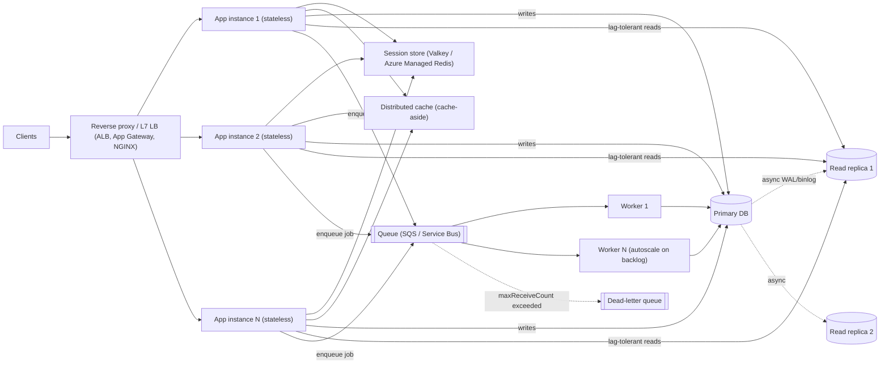
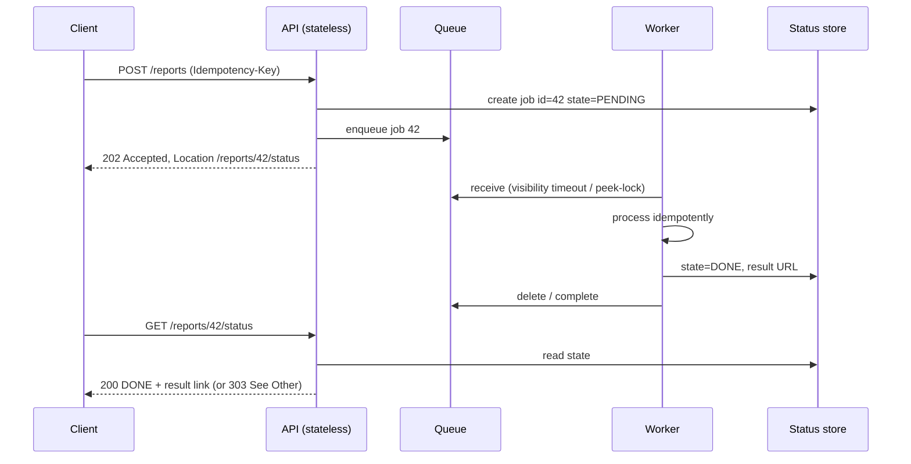
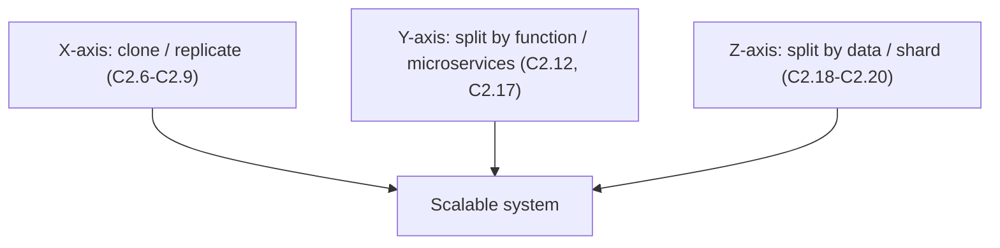
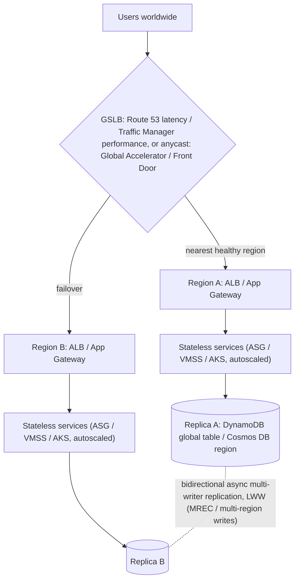
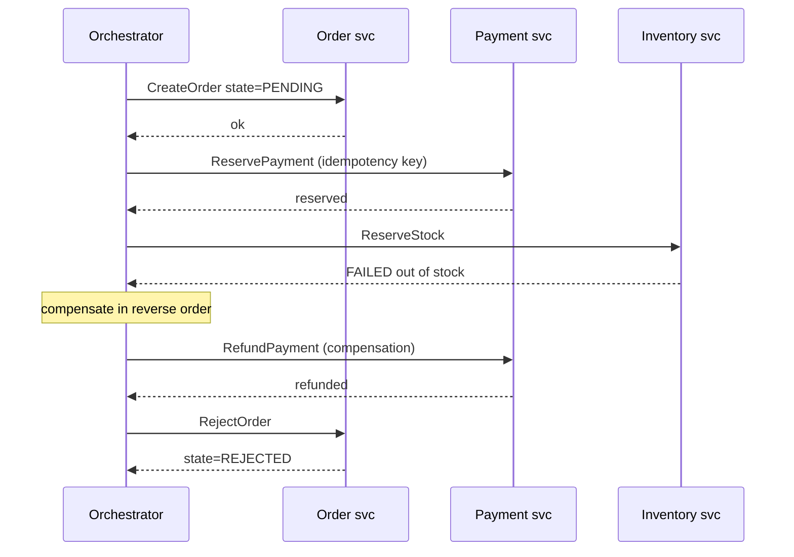
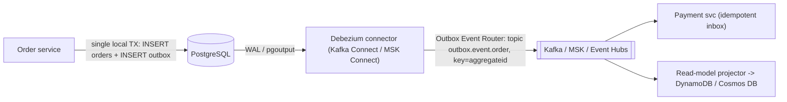

# C2 Scalability
> Last verified: 2026-10 · Audience: senior/staff DevOps, SRE, AI eng, NetEng, DevSecOps, architects

## TL;DR
- **Performance** = how fast one request is served (latency at low load). **Scalability** = how well throughput holds up as load grows when you add resources. A system can be fast but not scalable, or slow but scalable.
- **Scale up (vertical)** is simple but hits a ceiling and is a single point of failure. **Scale out (horizontal)** has no hard ceiling but needs **stateless** app tiers, load balancing and partitioned data.
- The four levers are **statelessness/replication**, **partitioning** (functional/vertical and data/horizontal), **async processing** (queues), and **caching**. Name them, then explain which bottleneck each one removes.
- **Session state** decides whether you can scale out. **Sticky sessions** are a crutch: they cause uneven load and lose sessions when an instance dies. Move session state into a store such as **ElastiCache (Valkey)** or **Azure Managed Redis**, or into a signed token such as a JWT.
- **Read replicas** scale reads only. They are async, so expect **replica lag** and **read-your-writes** anomalies. Writes scale only by **partitioning/sharding** (or by moving writes into a queue).
- Split by business capability (**microservices = vertical/functional partitioning**) so each part scales, deploys and fails on its own. The price is distributed transactions and network hops.
- API style: **REST/JSON** at the edge, **gRPC** (HTTP/2 + protobuf, streaming, deadlines) for internal east-west traffic, **SOAP** only for legacy or WS-* contracts. On AWS use API Gateway **REST API** for the full feature set (caching, WAF, API keys, usage plans) and **HTTP API** when cost and latency matter more. On Azure use **APIM**.
- Know the queue limits: **SQS** messages up to **1 MiB**, retention **4 d default / 14 d max**, visibility timeout **30 s default / 12 h max**. **Service Bus** gives FIFO via sessions, duplicate detection, DLQ and transactions. **Storage Queues** messages are **64 KB** but the queue can grow huge.
- **Routing to shards** happens in one of three places: a smart client (hash ring or slot map), a router proxy (Vitess, Citus, Aurora Limitless) or a directory service. Queries without the shard key scatter-gather to every shard.
- **Discovery**: client-side discovery (registry + client LB, or a mesh) vs server-side discovery (VIP or LB). AWS **Cloud Map** has **no direct Azure equivalent**; on Azure use Container Apps, AKS CoreDNS/Istio, Private DNS or Consul.
- **GSLB comes in three families**:
  - **DNS**: Route 53 latency/geo/geoproximity ↔ Traffic Manager performance/geographic. Failover is bounded by TTL.
  - **Anycast L4**: Global Accelerator ↔ cross-region Load Balancer.
  - **Anycast L7 edge**: CloudFront ↔ Front Door.
- **Autoscaling**: use **target tracking** first, then add predictive scaling (scale-out only on both clouds; AWS needs ≥ 24 h of history, Azure VMSS ≥ 7 days and CPU only). In Kubernetes use HPA/KEDA for pods and **Karpenter** / **AKS NAP** for nodes.
- **Microservices trade ACID for autonomy.** Cross-service consistency uses **sagas** (choreography vs orchestration with Step Functions or Durable Functions) plus the **transactional outbox + CDC (Debezium)** and **idempotent consumers**. Avoid 2PC.
- For extreme write scale, put **Kafka (MSK / Event Hubs Kafka endpoint)** on the ingest path and partitioned **NoSQL** (DynamoDB / Cosmos DB) as read models. Choose partition keys so you get no hot partitions.

## C2.1 Performance vs Scalability
- **How it works:**
  - **Performance problem**: the system is slow for a single user. Fix it with profiling, algorithms, indexes and caching (see [C1 Performance](C1-performance.md)).
  - **Scalability problem**: the system is fast for one user but slow under load. Throughput flattens or latency curves upward as concurrency rises because of contention for a shared resource such as locks, a DB connection pool, a single writer or a coordinator.
  - **Amdahl's law**: speed-up ≤ 1 / (s + (1−s)/N), where s is the serial fraction. With 5% serial work, speed-up caps at 20× no matter how many nodes you add.
  - **Universal Scalability Law (Gunther)**: adds a **coherency/crosstalk** term (β·N(N−1)). Past a certain point, adding nodes *lowers* throughput.
  - **Little's law**: L = λ·W (concurrency = arrival rate × latency). Use it to size pools, threads and instance counts.
- **Trade-offs / when to use:**
  - Optimise performance first when p50 is bad at low load. Optimise scalability when latency degrades as RPS grows.
  - Scalability work, such as distribution, async and partitioning, usually *adds* per-request latency through network hops and serialisation.
- **Interview angles:**
  - If asked "fast vs scalable?", say: "Performance is the latency of one unit of work. Scalability is how capacity grows when you add resources while latency stays within the SLO." Then sketch a throughput-vs-load curve with a knee.
  - Follow-up "how do you find the bottleneck?": load test (see [J5](../J-sre/J5-capacity-planning-load-testing.md)), apply **USE** (utilisation, saturation, errors) to every resource, find the first resource to saturate, and remove serialisation points.
  - Pitfall: claiming "add servers" fixes everything. A shared DB or a global lock is the serial fraction.

## C2.2 Vertical & Horizontal scalability
- **How it works:**
  - **Vertical (scale up)**: bigger instance with more vCPU, RAM, IOPS or network. Example: RDS `db.r7g.16xlarge`. Usually needs a restart or failover. Hard ceiling at the largest SKU.
  - **Horizontal (scale out)**: more identical instances behind a load balancer, such as ASG/VMSS or a K8s HPA. Needs stateless nodes, discovery and load balancing.
  - **Diagonal**: scale up until the price/performance knee, then scale out.
- **Trade-offs / when to use:**

| | Vertical | Horizontal |
|---|---|---|
| Complexity | Low, no code change | High: state, LB, data partitioning |
| Ceiling | Largest SKU | Practically none (until shared deps saturate) |
| Availability | SPOF unless paired with HA | N+1 redundancy built in |
| Cost curve | Super-linear at top SKUs | ~Linear, granular, elastic |
| Good for | Primary RDBMS, legacy monoliths, in-memory DBs | Web/app tiers, stateless workers, caches, NoSQL |

- **Interview angles:**
  - Say: "Scale the **stateless tiers horizontally** and the **stateful primary DB vertically first**, then add read replicas, then shard."
  - Follow-up on autoscaling: horizontal scaling is what makes elasticity possible (see C2.30). Vertical autoscaling of pods (K8s VPA) usually needs a pod restart unless in-place resize is used.
  - Pitfall: scaling out an app tier while it holds local state such as an in-memory session, local file uploads or a local cache that must stay consistent.

## C2.3 Reverse proxy
- **How it works:**
  - A server-side intermediary that terminates client connections and forwards them to backends. Clients see only the proxy's address. A forward proxy is the opposite: it acts on behalf of clients.
  - Functions:
    - TLS termination and offload
    - L7 routing by host or path
    - Load balancing and health checks
    - Compression
    - Response caching
    - Rate limiting, WAF and auth offload
    - Connection pooling and keep-alive to backends
    - Request buffering, which shields slow clients from app workers
    - Header injection: `X-Forwarded-For`, `X-Forwarded-Proto`, `Forwarded` (RFC 7239)
  - Examples: NGINX, Envoy, HAProxy, Traefik, Caddy. Managed equivalents: AWS **ALB** and **CloudFront**; Azure **Application Gateway** and **Front Door**; **Cloudflare**.
- **Trade-offs / when to use:**
  - It is the single entry point that makes horizontal scale invisible to clients. It is also a potential SPOF and bottleneck, so run it in HA pairs or use a managed service.
  - Adds one hop of latency. Terminating TLS means re-encryption is needed for end-to-end/zero-trust designs (see [C4](C4-security.md)).
- **Interview angles:**
  - "Reverse proxy vs load balancer vs API gateway?" A load balancer is a reverse proxy focused on distribution. An API gateway is a reverse proxy plus API concerns: authN/Z, quotas, keys, transformation, versioning. L4 vs L7 detail is in [C2.26](#c226-layer-7-load-balancers) and [D1](../D-system-design/D1-system-design-basics.md).
  - Gotcha: the app must trust `X-Forwarded-*` only from the proxy, otherwise IP spoofing bypasses rate limits and allow-lists.

## C2.4 Scalability principles
- **How it works:** the canonical principles to name in an interview:
  1. **Statelessness**: no request depends on node-local memory, so any instance can serve any request.
  2. **Replication/cloning**: N identical copies behind a load balancer (the X-axis of the **AKF Scale Cube**).
  3. **Functional partitioning**: split by service or capability (Y-axis, microservices).
  4. **Data partitioning/sharding**: split by key, such as customer or tenant (Z-axis).
  5. **Asynchrony**: decouple with queues and events, absorb bursts, retry later.
  6. **Caching**: avoid repeating work at every layer (client, CDN, gateway, app, DB).
  7. **Avoid shared mutable state and global locks**. Prefer idempotent, commutative operations.
  8. **Design for failure and back-pressure**: timeouts, bulkheads, load-shedding (see [C3 Reliability](C3-reliability.md)).
- **Trade-offs / when to use:**
  - Each principle trades consistency or simplicity for capacity. CAP/PACELC applies as soon as you replicate or partition data.
- **Interview angles:**
  - Draw the **AKF cube** (X = clone, Y = split by function, Z = split by data) and map each axis to a concrete component in your design.
  - Follow-up "what limits scale-out?": shared databases, chatty synchronous calls (fan-out latency adds up), hot keys/partitions, and coordination such as leader election or distributed locks.

## C2.5 Modularity for scalability
- **How it works:**
  - **Loosely coupled, highly cohesive modules** with explicit interfaces. Each module owns its data and can be scaled, deployed or rewritten on its own.
  - The usual progression is a **modular monolith**: in-process modules with enforced boundaries and separate schemas, deployed as one unit. Modules are later extracted into services when a module has a different scaling profile, release cadence or team.
  - Boundaries come from **DDD bounded contexts** and **Conway's law**: the system mirrors the structure of the team.
- **Trade-offs / when to use:**
  - Modularity lets you scale only the hot path, for example image processing, without scaling checkout. Without module boundaries you have to scale everything together.
  - Splitting too early adds network calls, distributed transactions and ops overhead. A well-structured monolith scales a long way with horizontal clones.
- **Interview angles:**
  - Say: "Modularise first, distribute second. Extract a module only when its scaling or availability requirements differ."
  - Pitfall: a **distributed monolith**, where services share a DB or must deploy in lockstep. You get every cost of microservices and none of the benefits.

## C2.6 Replication
- **How it works:**
  - Run **multiple copies** of a component. Stateless copies are trivial. Stateful copies need a replication protocol.
  - Purposes: **capacity** (spread load), **availability** (survive node or AZ loss) and **latency** (geo-proximity).
  - Two families:
    - **Stateless service replication** (app tier): just clone it.
    - **Data replication** (DB, cache, sessions): primary-replica, multi-primary or leaderless; **sync** or **async**.
- **Trade-offs / when to use:**
  - Replicating code is cheap. Replicating state forces a choice between consistency, latency and availability.
  - N replicas only add capacity if the load balancer spreads load evenly and a shared dependency does not cap throughput.
- **Interview angles:**
  - "Replication for scale vs for HA?" Read replicas add read capacity but are async and lag. Standby replicas (RDS Multi-AZ standby) are sync, serve **no** reads, and exist only for failover. Details are in [B8](../B-database-engineering/B8-database-replication.md).

## C2.7 Stateful replication in web applications
- **How it works:**
  - The app keeps **session state in instance memory** (HTTP session, cart, auth context). Replicating this tier requires one of two approaches:
    - **Sticky sessions (session affinity)**: the load balancer pins a client to one instance via a cookie.
      - AWS **ALB** offers a duration-based `AWSALB` cookie (1 s–7 d, default 1 d) or an application-based cookie.
      - Azure **Application Gateway** uses cookie-based affinity (`ApplicationGatewayAffinity`).
      - NGINX uses `ip_hash`, `hash $cookie_x` or `sticky`.
    - **Session replication between nodes**: Tomcat/JBoss clustering, multicast or all-to-all copies. Memory and network cost is O(N²), so it does not scale past a handful of nodes.
- **Trade-offs / when to use:**
  - Stickiness is cheap and requires no code change, but:
    - (a) load becomes **uneven**: hot users and long sessions pile up, and the ALB's sticky routing overrides least-outstanding-requests.
    - (b) if an instance dies, its sessions are lost and users are logged out or lose their carts.
    - (c) scale-in and deploys must drain for the session TTL.
    - (d) NAT'd clients defeat IP-hash.
  - Acceptable for legacy apps, WebSocket or long-lived connections, or local caches warmed per user.
- **Interview angles:**
  - If asked "how do you scale a stateful web app?", say: "Stickiness is a short-term fix. The real fix is to externalise the session to a store (C2.8) and make the instances disposable."
  - Follow-up: with stickiness, when the pinned target becomes unhealthy the ALB re-routes to a healthy target and the session state is gone.

## C2.8 Stateless replication in web applications
- **How it works:**
  - The web or app tier keeps **no client state between requests**. State lives in one of three places:
    - **Client**: signed or encrypted cookie, or a **JWT**. Keep it small, since cookies are sent on every request and headers are limited to roughly 4–8 KB per cookie.
    - **Shared session store**: Redis/Valkey (ElastiCache, Azure Managed Redis), DynamoDB/Cosmos DB, or SQL. The key is the session ID from a cookie. Set a TTL equal to the idle timeout.
    - **DB**: for durable carts and user profiles.
  - Any instance serves any request. The load balancer can use round-robin or least-outstanding-requests freely. Instances can autoscale, be replaced or be killed (cattle, not pets).
- **Trade-offs / when to use:**
  - The session store becomes a critical shared dependency. Run it **multi-AZ with replicas** and add ~sub-ms network lookups per request.
  - A **JWT** removes the lookup, but revocation is hard: use a short TTL, refresh tokens and a deny-list. Token size grows with claims.
  - Sizing: sessions are small and hot, so an in-memory store fits. Persistence is usually optional because losing a session means a re-login.
- **Interview angles:**
  - Default answer: "Stateless app tier + Redis/Valkey session store with TTL, multi-AZ replica, behind an L7 LB with no stickiness."
  - Follow-up "the Redis cluster is a SPOF?": cluster mode with replicas and automatic failover, client retries, and graceful degradation (treat the user as anonymous rather than return a 500).
  - Pitfall: storing uploaded files on local disk. Use S3/Blob plus pre-signed URLs.

## C2.9 Stateless replication of services
- **How it works:**
  - Apply the same rule to backend services and workers. Idempotent request handlers keep no in-memory affinity. Config comes from the environment or a config service. Caches are either shared or treated as disposable (a cold start is fine).
  - Service discovery and client-side or mesh load balancing distribute calls (C2.23). Scale replicas on CPU, RPS, queue depth or custom metrics (HPA/KEDA, ASG target tracking, VMSS autoscale).
  - **12-factor** rules apply: processes are stateless and share nothing, backing services are attached resources, processes are disposable (fast start, graceful SIGTERM).
- **Trade-offs / when to use:**
  - Some services are inherently stateful: stream processors, leaders, WebSocket hubs. Partition them (Kafka consumer groups, K8s StatefulSets with stable identity) instead of cloning them blindly.
  - Retries plus statelessness require **idempotency keys**, otherwise retried POSTs double-charge.
- **Interview angles:**
  - "How do you make a worker horizontally scalable?" Use the competing-consumers pattern on a queue with idempotent handlers, visibility timeout > p99 processing time, a DLQ after N attempts, and autoscaling on backlog per worker.

## C2.10 Database replication
- **How it works:**
  - A **primary** (leader) takes writes and ships changes (WAL/binlog/redo, physical or logical) to **replicas** (followers).
  - The app sends writes to the primary and reads to replicas, via a separate reader endpoint or a proxy: Aurora reader endpoint, Azure SQL `ApplicationIntent=ReadOnly`, PgBouncer/ProxySQL.
  - Scales **reads**, offloads reporting/BI, and gives DR (promote a replica).
- **Trade-offs / when to use:**
  - Async replicas mean **replication lag**, which breaks **read-your-writes** and **monotonic reads**. Mitigations:
    - read from the primary for N seconds after a write;
    - pin the session to the primary;
    - wait for the replica to reach the write's LSN/GTID;
    - route only lag-tolerant queries to replicas.
  - Writes don't scale, and every replica must replay all writes. A write-heavy load can make replicas fall behind indefinitely. Azure PG docs warn lag can range from seconds to hours under heavy writes.
- **Interview angles:**
  - If asked "the DB is overloaded", ask first whether it is read-heavy or write-heavy:
    - Read-heavy: cache, then read replicas.
    - Write-heavy: batch or queue writes, scale up, then shard (C2.18).
  - Keep the depth for [B8 Database replication](../B-database-engineering/B8-database-replication.md).

## C2.11 Database replication types
- **How it works:** short version, with full depth in [B8](../B-database-engineering/B8-database-replication.md):

| Type | Writes | Consistency | Examples |
|---|---|---|---|
| **Primary-replica (single leader), async** | 1 node | Eventual on replicas, possible data loss on failover | RDS read replicas, Azure PG read replicas, MySQL async |
| **Primary-replica, sync / semi-sync** | 1 node | No acknowledged-write loss, higher write latency | RDS Multi-AZ standby, PG `synchronous_commit`, Azure SQL Business Critical (Always On) |
| **Shared-storage replicas** | 1 node | Lag usually < 100 ms (Aurora) | Aurora replicas (≤15), Azure SQL Hyperscale HA (0–4) and named replicas (≤30) |
| **Multi-primary (multi-leader)** | Many | Conflicts need resolution (LWW, CRDTs) | MySQL Group Replication multi-primary, Cosmos DB multi-region writes, DynamoDB global tables |
| **Leaderless (quorum)** | Any | Tunable W+R>N | Cassandra, original Dynamo design (see C6.32) |

  - **Physical** replication ships byte-level WAL/redo: same engine and version, whole cluster. **Logical** replication ships row changes: selective tables, cross-version, CDC.
- **Trade-offs / when to use:**
  - Sync means durability at the cost of write latency, which spans AZs or regions. Async means speed at the cost of RPO > 0.
- **Interview angles:**
  - "Multi-AZ vs read replica on RDS?" Multi-AZ instance = synchronous standby for HA that can't be read. Read replica = async, readable, can be promoted, cross-region possible.
  - Note the **Multi-AZ DB cluster** variant (1 writer + 2 readable standbys), which is different again (see B8).

## C2.12 Need for specialized services
- **How it works:**
  - As a system grows, generic components become bottlenecks. Extract **specialised services** that are tuned for one job:
    - search: OpenSearch / Azure AI Search
    - media transcoding
    - notifications
    - auth/identity
    - payments
    - recommendation/ML inference
    - reporting
  - Each one gets the **right datastore** (polyglot persistence) and the **right scaling dimension**: CPU, GPU, memory or I/O.
  - They are exposed over a network API (REST, gRPC, messaging) behind a stable contract.
- **Trade-offs / when to use:**
  - Pros: independent scaling and hardware (GPU nodes only for inference), team ownership, fault isolation (bulkhead).
  - Cons: network latency, partial failures, contract versioning, distributed data consistency.
  - Extract one when its scale or availability profile differs sharply from the core, or when it is a commodity you can buy (managed search, managed identity).
- **Interview angles:**
  - Example: "Image resizing burns CPU in the web tier. Move it to a worker service fed by a queue, and scale on queue depth."
  - Follow-up: protect callers with timeouts, circuit breakers and fallbacks so a slow specialised service doesn't exhaust the caller's threads.

## C2.13 Specialized services: SOAP/REST
- **How it works:**

| | **SOAP** | **REST** | **gRPC** | **GraphQL** |
|---|---|---|---|---|
| Transport | Usually HTTP POST, also JMS/SMTP | HTTP/1.1 or 2 | **HTTP/2** (HTTP/3 emerging) | HTTP POST (usually) |
| Payload | XML envelope | JSON (any media type) | **Protobuf** binary | JSON |
| Contract | **WSDL** (strict) | OpenAPI (optional) | `.proto` IDL, codegen | Schema SDL |
| Semantics | Operations (RPC) | Resources + HTTP verbs, status codes | RPC: **unary, server-streaming, client-streaming, bidi** | Client-shaped queries |
| Caching | Hard (POST) | **HTTP caching** (GET, ETag, Cache-Control) | No HTTP caching | Hard (POST), persisted queries |
| Extras | WS-Security, WS-ReliableMessaging, WS-AtomicTransaction | Simple, ubiquitous | **Deadlines**, cancellation, metadata, flow control | Avoids over/under-fetching |
| Best for | Legacy enterprise/B2B, banking, telecom | Public APIs, browsers, edge | Internal east-west, low-latency, streaming, polyglot | BFF, mobile aggregation |

- **Trade-offs / when to use:**
  - REST + JSON: universal, cacheable, debuggable. Verbose, with no streaming beyond SSE/WebSocket.
  - gRPC: smaller payloads, multiplexed long-lived connections. It needs **L7, HTTP/2-aware load balancing**: an L4 LB pins all RPCs on a connection to one backend. Browsers need gRPC-Web.
  - SOAP: strong contracts and WS-* security, but heavyweight. Keep it for integration, or put a facade in front (APIM can expose SOAP as pass-through or SOAP-to-REST).
- **Interview angles:**
  - "Why not gRPC everywhere?" Browser support, HTTP caching and debuggability. Use REST at the edge and gRPC inside. Also mention **idempotency** (PUT/DELETE are idempotent, POST is not) and **versioning** (URI/header in REST; additive field numbers in protobuf).
  - Gotcha: gRPC behind a classic L4 NLB means uneven load. Use ALB (gRPC target groups), Envoy/Istio, or client-side LB.
  - Gotcha: Azure APIM pass-through gRPC is supported only on the classic managed gateway (preview, for instances created from Jan 2026) and the self-hosted gateway, **not v2 tiers** (as of 2026-06).

## C2.14 Asynchronous services
- **How it works:**
  - The caller doesn't block for the result. Patterns:
    - **Fire-and-forget** via a queue (SQS, Service Bus, Storage Queues, RabbitMQ).
    - **Async request-reply**: return `202 Accepted` with a `Location` status URL, then the client polls or receives a webhook/WebSocket/SSE callback.
    - **Pub/sub events** (SNS, EventBridge, Event Grid, Kafka, Event Hubs) so multiple consumers react on their own.
  - Messages carry commands ("do X") or events ("X happened"). Consumers ack/delete after success. On failure the message becomes visible again: SQS visibility timeout; Service Bus peek-lock with a 30 s default lock that can be renewed.
- **Trade-offs / when to use:**
  - Pros: temporal decoupling (the consumer can be down), resilience, natural retry, and fan-out with pub/sub.
  - Cons: eventual consistency, harder tracing (propagate correlation IDs and W3C traceparent), **at-least-once delivery** so handlers must be idempotent, possible reordering, and poison messages (DLQ).
- **Interview angles:**
  - "Queue vs topic vs stream?" A queue is point-to-point with competing consumers and the message is deleted on ack. A topic is fan-out to subscriptions. A stream (Kafka, Kinesis, Event Hubs) is a retained, replayable, partition-ordered log where consumers track offsets (see C2.38 and [M4](../M-data-platforms/M4-kafka-at-scale.md)).
  - "Exactly-once?" In practice it means at-least-once delivery plus idempotent or deduplicated processing. Service Bus duplicate detection and SQS FIFO deduplication (5-minute window) only cover the send side.

## C2.15 Asynchronous processing & scalability
- **How it works:**
  - **Queue-based load levelling**: the queue absorbs bursts. Workers drain it at a sustainable rate, so the DB sees a smooth load instead of spikes.
  - **Competing consumers**: add workers to increase throughput. **Autoscale on backlog**, for example SQS `ApproximateNumberOfMessagesVisible` / workers, KEDA scalers, or Service Bus active message count.
  - **Batching**: SQS supports 10 messages per Send/Receive/Delete batch. Storage Queues allow batched receive of up to 32. Service Bus supports prefetch and batch send.
  - **Long polling** (SQS `WaitTimeSeconds` up to 20 s) cuts empty receives and cost.
  - Key limits (2026):
    - **SQS**:
      - message ≤ **1 MiB** (larger payloads via the S3 extended client, up to 2 GB)
      - retention 60 s–**14 d** (default **4 d**)
      - visibility timeout default **30 s**, max **12 h**
      - delay ≤ 15 min
    - **SQS FIFO**: 300 TPS per API action without batching (3,000 msg/s with batches of 10). **High-throughput mode** reaches up to 70,000 TPS in the largest regions. Parallelism comes from distinct **MessageGroupIds**.
    - **Service Bus**:
      - message 256 KB (Standard), 100 MB (Premium)
      - queue 1–80 GB
      - FIFO via **sessions**
      - duplicate detection, auto-DLQ, transactions, AMQP 1.0
      - 5,000 concurrent clients
    - **Storage Queues**:
      - message **64 KB** (48 KB Base64)
      - queue up to the storage account capacity (PiB scale)
      - lease 30 s default, 7 d max
      - no ordering guarantee, no automatic DLQ (check `DequeueCount` yourself)
- **Trade-offs / when to use:**
  - Use async for anything slow, bursty, retriable or not needed for the response: emails, transcoding, ML inference batches, ledger postings, webhooks.
  - Don't use it when the user needs the result synchronously and quickly, or when strict global ordering is required (that needs a partitioned log and a careful key choice).
  - Watch **queue age**, not just depth, as the SLI. Growing age means the consumers are under-scaled or poisoned.
- **Interview angles:**
  - Visibility timeout too short means duplicate processing. Too long means slow retry after a crash. Set it to ~6× p99 handler time (AWS guidance for Lambda is ≥ 6× function timeout) and extend it for long jobs.
  - A DLQ with maxReceiveCount 3–5, plus alarms and redrive tooling, is non-negotiable.
  - Back-pressure: if a downstream system is rate-limited, cap worker concurrency (Lambda reserved concurrency, KEDA maxReplicaCount) rather than letting autoscaling DDoS your own DB.

## C2.16 Caching for scalability
- **How it works:**
  - For scale, caching **reduces load on shared bottlenecks**, usually the DB, so the same backend serves more users. This is different from caching for latency (see [C1 caching](C1-performance.md#c127-caching-for-performance)).
  - Layers:
    - browser/HTTP `Cache-Control`
    - **CDN** (static and cacheable API responses)
    - API gateway response cache (API Gateway REST API stage cache; APIM built-in cache, 10 MB–5 GB by tier, or an external Redis)
    - **distributed cache** (Redis/Valkey/Memcached)
    - in-process cache
    - DB buffer pool
  - Patterns: **cache-aside** (most common), read-through, write-through, write-behind. Eviction with LRU/LFU plus TTL.
- **Trade-offs / when to use:**
  - The hit ratio drives the gain. At 90% hits the DB sees 10% of reads, so ~10× read headroom.
  - Risks:
    - **staleness** and invalidation
    - **thundering herd / cache stampede** on expiry: mitigate with request coalescing (single-flight), jittered TTLs, early probabilistic refresh, or serve-stale-while-revalidate
    - **hot keys**: replicate the key, add a local L1 cache, or shard the key
    - **cold-start** after a cache flush, which can take the DB down
  - Don't treat the cache as the source of truth unless it is a durable store (ElastiCache Valkey with durability, or Azure Managed Redis persistence).
- **Interview angles:**
  - "What if the cache dies?" The DB must survive a cold cache, or you need warmup and rate-limited misses. Otherwise the cache is a hidden hard dependency that adds risk instead of capacity.
  - Overlap: [C1.26–C1.30](C1-performance.md), [C6 caching](C6-technology-stack.md), [D1.14/D1.15](../D-system-design/D1-system-design-basics.md), [H6.4](../H-full-stack-troubleshooting/H6-web-application-architecture.md).

## C2.17 Vertical partitioning with micro-services
- **How it works:**
  - **Vertical/functional partitioning** (AKF Y-axis) splits the application by business capability (users, catalog, orders, payments). Each service owns **its own data** (**database-per-service**) and is scaled, deployed and failed independently.
  - Data access across boundaries goes through APIs or events, never shared tables. Joins are replaced by API composition, CQRS read models or replicated reference data.
  - Applies to data too: **vertical DB partitioning** splits columns (hot vs cold or BLOB columns into separate tables) or tables (different DBs per domain).
- **Trade-offs / when to use:**
  - Pros: scale the hot service only, choose the right DB per service, smaller blast radius, team autonomy.
  - Cons: no cross-service ACID, so you need **sagas** and outbox (C2.34–C2.35). Also more network calls, harder debugging, and data duplication.
  - Functional partitioning has a ceiling: one service's data can still outgrow a node. Then shard within the service (Z-axis, C2.18).
- **Interview angles:**
  - "How do you split a monolith?" **Strangler fig**: put a façade/proxy in front, extract one bounded context at a time, and use CDC/outbox to sync data during the transition.
  - Pitfall: splitting services but keeping a shared database. That is coupling at the data layer, and the shared DB stays the bottleneck.

## C2.18 Database partitioning
- **How it works:** short version; depth is in [B5 Partitioning](../B-database-engineering/B5-database-partitioning.md) and [B6 Sharding](../B-database-engineering/B6-database-sharding.md).
  - **Horizontal partitioning**: split rows by key. **Within one node** (PG declarative partitioning, SQL Server partition functions) this aids pruning, maintenance and archival. **Across nodes** it is **sharding**, which scales writes and storage.
  - **Vertical partitioning**: split columns or tables (see C2.17).
  - **Functional partitioning**: separate DBs per domain.
  - Strategies:
    - **Range** (dates, IDs): simple range scans, but hot tail partitions.
    - **Hash** (or **consistent hash**, see B6.2/D1.21): even spread, but range queries scatter.
    - **List/directory** (lookup table key → shard): flexible, but the directory is a dependency.
    - **Geo/tenant** based.
  - Managed sharding options:
    - Aurora PostgreSQL **Limitless Database**: sharded and reference tables, routers, DB shard groups.
    - Azure Database for PostgreSQL **elastic clusters** (managed Citus, row- or schema-based sharding, online rebalancing).
    - Azure SQL **elastic database tools** (shard map manager).
    - DynamoDB/Cosmos DB, which partition automatically by partition key.
- **Trade-offs / when to use:**
  - Partition only when vertical scaling, caching and read replicas are exhausted, or when write throughput or data size demands it. Sharding is hard to undo.
  - Costs: cross-shard queries, joins and transactions; resharding/rebalancing; hot shards; operational multiplication (N backups, N upgrades).
- **Interview angles:**
  - Routing (app-level, proxy, or directory) is covered in [C2.20](#c220-routing-with-database-partitioning).
  - "Partitioning vs sharding?" Partitioning is the general split; sharding is horizontal partitioning across separate servers.

## C2.19 Database partitioning selection
- **How it works:** choosing the **partition (shard) key** is the decision that matters most.
  - **High cardinality**: many distinct values so data spreads.
  - **Even access distribution**: avoid **hot partitions**, such as celebrity users or "today" in a date-range key.
  - **Query alignment**: most queries should hit **one partition** (include the key in the WHERE clause). Avoid scatter-gather.
  - **Transaction locality**: entities updated together should share a key, e.g. `tenant_id` for SaaS so a tenant's data and transactions stay on one shard.
  - **Growth**: hash keys rebalance easily. Monotonic keys (timestamps, auto-increment) create write hotspots on the last range.
- **Trade-offs / when to use:**

| Key choice | Good for | Risk |
|---|---|---|
| `tenant_id` / `customer_id` | Multi-tenant SaaS, per-tenant isolation | Whale tenants, so you need tenant-level splitting or dedicated shards |
| `user_id` hash | Social/consumer apps | Cross-user queries (feeds) scatter, so use fan-out on write or denormalise |
| Time range | Logs, metrics, time series, TTL drops | Hot newest partition, so use a composite of time + hash bucket |
| Geo/region | Data residency, latency | Uneven regional load |
| Composite / synthetic (key + random suffix 0..N) | Write-hot keys (DynamoDB write sharding) | Reads must fan out to N suffixes |

- **Interview angles:**
  - Always justify the key against the **top 3 access patterns** and say what happens with the hottest entity.
  - Follow-up "you picked wrong — now what?" Plan the migration up front with dual-write or CDC into new shards, backfill, verify, then cut over reads before writes. Consistent hashing or virtual shards (many logical shards mapped to fewer physical nodes) make rebalancing cheaper.
  - Pitfall: using an auto-increment ID with range sharding, because all inserts hit the last shard.

## C2.20 Routing with database partitioning
- **How it works:** after you shard, every query has to reach the shard that owns its key. There are four routing styles:

| Style | How | Examples | Trade-off |
|---|---|---|---|
| **Client/app-level (smart client)** | A library hashes the key and holds the shard map or token ring | Cassandra token-aware drivers; Redis Cluster clients (16,384 hash slots, `MOVED`/`ASK` redirects); Azure SQL elastic database client library (shard map manager); Cosmos DB SDK **direct mode** (caches the partition map) | No extra hop. But the map must be distributed and refreshed, and logic is duplicated per language |
| **Proxy/router tier** | A stateless router parses the query and forwards it to the right shard, or does scatter-gather | **Vitess VTGate**, ProxySQL (query rules), PgCat, **Citus coordinator** (Azure PG elastic clusters), **Aurora Limitless routers**, MongoDB `mongos`, Cosmos DB **gateway mode** | Transparent to the app. Adds one hop, and the router tier must scale and stay HA |
| **Directory/lookup service** | Key → shard mapping stored in a table or KV, cached by clients | Tenant catalog DB, DynamoDB lookup table, ZooKeeper/etcd | Most flexible: you can move a single tenant. The directory becomes a critical dependency, so cache it heavily |
| **Managed, transparent** | The service hashes the partition key internally | DynamoDB, Cosmos DB, Spanner | No routing code, but you are bound by per-partition limits (C2.38) |

  - **Single-shard queries** must include the shard key. Queries without the key **scatter-gather** to all N shards, so tail latency becomes the max of N latencies.
  - **Cross-shard writes** need 2PC (Vitess and Citus support it at a cost) or a saga (C2.35). Design the key so that transactions stay local.
  - **Resharding** works like this: add shards, then **dual-write** or use CDC to copy data, backfill, verify, flip the map, and drain the old shard. With **virtual shards** (many logical shards → few physical nodes, e.g. Vitess keyspace ranges or Citus shard count 32+), moving data means changing the mapping instead of rehashing every row.
- **Trade-offs / when to use:**
  - Use a proxy when you have many languages or legacy apps. Use a smart client when you need the lowest latency or are on a NoSQL engine. Use a directory for multi-tenant SaaS with whale tenants.
  - Shard-map staleness is a real failure mode: a client writes to the old shard during a move. Fix it with versioned maps, fencing, or a redirect response (Redis-style `MOVED`).
- **Interview angles:**
  - If asked "how does the app know which DB to hit?", name the three options (client hash ring, router proxy, directory) and pick one with a reason.
  - Follow-up "what about queries without the key?" Answer: a global secondary index (DynamoDB GSI, a Cosmos DB secondary container fed by the change feed), a search index, or a CQRS read model. Avoid fan-out queries in the hot path.
  - Depth is in [B6 Sharding](../B-database-engineering/B6-database-sharding.md) and [D1.22](../D-system-design/D1-system-design-basics.md).

## C2.21 Methods for horizontal scalability
- **How it works:** the toolkit for adding nodes, roughly in the order you reach for it:
  1. **Clone stateless tiers** behind a load balancer (AKF X-axis): ALB/NLB, App Gateway, Azure LB, NGINX/Envoy.
  2. **Distribute load across instances**: server-side LB, **client-side LB** (gRPC `round_robin`, Envoy sidecar), or **DNS** (C2.27).
  3. **Externalise state**: sessions, caches and files move to shared stores (C2.8).
  4. **Read replicas and caches** for read-heavy data (C2.10, C2.16).
  5. **Functional split** into services (Y-axis, C2.17/C2.33).
  6. **Shard data** (Z-axis, C2.18–C2.20).
  7. **Async and queues** to level load and scale workers independently (C2.15).
  8. **Multi-region active-active** with GSLB and global data replication (C2.28–C2.29).
  9. **Elasticity**: autoscale every tier (C2.30).
- **Trade-offs / when to use:** each step adds coordination cost. Stop at the step that meets the SLO with headroom (target about 2× peak, or N+1 per AZ).
- **Interview angles:**
  - Walk the design from 1k to 1M to 100M users and say which step you add at each stage and why (the classic "scaling to millions" answer).
  - Pitfall: autoscaling the app tier while the DB connection count explodes. Each new instance opens a pool. Use **RDS Proxy**, PgBouncer, or Azure PG's built-in PgBouncer, and cap the instance count.

## C2.22 Load balancing multiple instances
- **How it works:**
  - **Algorithms:**
    - round-robin (ALB default) and weighted round-robin
    - **least outstanding requests** (ALB LOR) and least connections
    - **power-of-two-choices** (random pick of 2, take the less loaded one; Envoy `LEAST_REQUEST`)
    - **hash-based**: 5-tuple (Azure LB default, NLB flow hash), source-IP affinity, consistent hashing / **Maglev** / ring-hash for cache affinity
    - EWMA latency-aware
    - ALB **weighted random with automatic target weights** (anomaly mitigation)
  - **Health checks**: active probes (HTTP path or TCP) and passive outlier detection (Envoy ejects hosts that return 5xx).
    - ALB defaults: interval 30 s, timeout 5 s, healthy threshold 5, unhealthy threshold 2.
    - Use a **shallow** liveness check, and a **readiness** check that confirms critical dependencies without cascading failures.
  - **Connection draining**: ALB/NLB deregistration delay defaults to **300 s**; Azure App Gateway calls it connection draining. Also use **slow start** (ALB 30–900 s) so cold instances aren't flooded.
  - **Cross-zone**: always on for ALB, **off by default for NLB** (inter-AZ data charges apply when enabled). Azure Standard LB is zone-redundant through its frontend.
- **Trade-offs / when to use:**
  - Round-robin assumes requests cost the same. Use LOR or P2C when request cost varies.
  - Hashing gives affinity (cache locality, gRPC streams), but reshuffles keys when the pool changes. Consistent hashing or Maglev limits the churn.
  - Long-lived connections (WebSocket, gRPC, HTTP/2) defeat per-connection L4 balancing. Balance per request at L7, or have clients reconnect periodically (gRPC `MAX_CONNECTION_AGE`).
- **Interview angles:**
  - "One instance at 100% CPU while others idle?" Causes: sticky sessions, L4 + long-lived HTTP/2 connections, a hash hot key, or a slow-start gap. Fix with L7 per-request LB, LOR, and connection max-age.
  - Health-check pitfall: a deep check that hits the DB marks **all** instances unhealthy during a DB blip. Note that ALB **fails open** and routes to all targets when every target is unhealthy.

## C2.23 Discovery service and load balancing
- **How it works:** instances are ephemeral, so callers need a **registry** of healthy endpoints (name → [IP:port]) that is updated on scale or failure.
  - **Registration**: either **self-registration** (the instance calls Consul/Eureka on start and heartbeats) or **third-party registration** (the platform registers it: K8s EndpointSlices, ECS → Cloud Map, ASG → target group).
  - **Client-side discovery**: the client queries the registry and load balances itself. Examples: Eureka + Ribbon/Spring Cloud LoadBalancer, gRPC xDS, Consul + client library, Cloud Map `DiscoverInstances` API. One fewer hop and smarter LB, but every language needs the logic.
  - **Server-side discovery**: the client calls a stable name or VIP and a router or LB resolves it. Examples: K8s **Service** (ClusterIP + kube-proxy iptables/IPVS or eBPF/Cilium), ALB/NLB, ECS **Service Connect** (Envoy), **VPC Lattice**, Azure Container Apps' built-in Envoy. Clients stay simple; the LB adds a hop and must be HA.
  - **Service mesh** (Istio, Linkerd, Consul Connect; **Istio-based add-on for AKS**; ECS Service Connect) gives client-side LB via sidecar or ambient proxies, with mTLS, retries and outlier detection. The app sees it as server-side.
  - **DNS-based discovery**: Cloud Map private DNS namespaces (A/SRV records, Route 53 health checks), K8s CoreDNS `svc.ns.svc.cluster.local`, Consul DNS (`.service.consul`). Simple, but DNS **TTL and caching** delay failover.
- **AWS vs Azure:**
  - AWS **Cloud Map** is a managed registry. It has HTTP namespaces (API-only `DiscoverInstances`), private DNS namespaces (VPC) and public DNS namespaces, and returns only healthy instances. ECS Service Connect and App Mesh are built on it. App Mesh is being discontinued (2026-09-30, unverified); migrate to Service Connect or VPC Lattice.
  - **Azure has no direct Cloud Map equivalent.** Use platform discovery instead:
    - **Container Apps**: call `http://<app-name>` inside the environment through the built-in Envoy, or use Dapr service invocation.
    - **AKS**: CoreDNS + Services, optionally with the Istio add-on.
    - **Service Fabric** Naming Service.
    - **Azure Private DNS** zones with VM/VMSS records you maintain yourself.
    - Self-managed **HashiCorp Consul**, which also works on AWS and on-prem.
- **Trade-offs / when to use:** use platform-native discovery (K8s Service, Container Apps, Service Connect) by default. Use Consul or Cloud Map for mixed VM + container + multi-platform estates.
- **Interview angles:**
  - "Client-side vs server-side discovery?" Client-side means fewer hops and smarter balancing at the cost of a fat client. Server-side means thin clients and central policy at the cost of an extra hop and an HA LB. A mesh gives you client-side behaviour with server-side ergonomics.
  - Gotcha: JVM/OS DNS caching (`networkaddress.cache.ttl`) keeps sending traffic to dead IPs after a scale-in.

## C2.24 Load balancer discovery
- **How it works:** this covers two directions.
  - **How clients find the LB**: through DNS. ALB IPs **change** as it scales, so always use the DNS name or a Route 53 **alias** record and never hard-code ALB IPs. NLB gives one **static IP or EIP per AZ** (allow-listable). **Global Accelerator** gives 2 static anycast IPs. Azure LB, App Gateway and Front Door expose a static public IP or FQDN.
  - **How the LB finds backends**:
    - Static registration, or **ASG/VMSS integration** (the group attaches instances to the target group or backend pool automatically).
    - ECS service ↔ target group.
    - K8s controllers:
      - **AWS Load Balancer Controller** reconciles Ingress or Gateway API to ALB/NLB with `ip` targets, i.e. pod IPs.
      - **Application Gateway for Containers** (ALB Controller, Gateway API) replaces the older **AGIC**.
    - Self-managed proxies use DNS SRV, Consul templates, or the Envoy **xDS** API (EDS = endpoint discovery).
  - **LB high availability**: managed LBs are multi-AZ by design. Self-managed pairs use **VRRP/keepalived** floating VIPs (active-passive) or **ECMP + BGP anycast** (active-active, as at Google Maglev or Cloudflare Unimog). In the cloud you can't use VRRP gratuitous ARP; use the provider LB in front of the appliances, or **Gateway Load Balancer** (AWS GENEVE 6081 / Azure Gateway LB VXLAN).
- **Interview angles:**
  - "Who load-balances the load balancer?" DNS (multiple A records or an alias), anycast + ECMP, or the cloud provider's distributed data plane.
  - Pitfall: hard-coding ALB IPs in firewalls. Put NLB (static) in front of ALB (ALB-type target group) or use Global Accelerator.

## C2.25 HLB vs SLB (hardware vs software load balancers)
- **How it works:**

| | **Hardware LB (HLB)** | **Software LB (SLB)** |
|---|---|---|
| Examples | F5 BIG-IP, Citrix/**NetScaler** ADC, A10 Thunder (ASIC/FPGA-accelerated appliances) | HAProxy, NGINX, Envoy, Traefik, LVS/IPVS, Katran (XDP/eBPF), cloud LBs (ALB/NLB/Azure LB are SDN-based software) |
| Throughput | Very high per box, SSL offload ASICs | Scales out horizontally; per-node limits but N nodes |
| Scaling | Vertical: buy a bigger box, licence tiers | Horizontal, elastic, autoscaled |
| Cost model | CapEx plus support contracts | OpEx / per-hour + LCU/capacity units, or free OSS |
| Agility | Slow change control, vendor CLI | IaC/GitOps, API-driven, per-team instances |
| Features | Mature L4–L7, iRules, GSLB (F5 DNS/GTM), WAF | Comparable; programmability via Lua/Wasm/xDS |
| HA | Active-standby pairs | N-way active, anycast, provider-managed |

- **Trade-offs / when to use:**
  - HLB still fits on-prem data centres, regulated or legacy estates, and very high TLS rates with HSM integration. F5 and NetScaler also ship as **virtual editions** in the AWS and Azure marketplaces, typically inserted behind Gateway Load Balancer or an Azure LB sandwich.
  - SLB is the default in cloud and Kubernetes because it is elastic, cheap, per-app and automatable.
- **Interview angles:**
  - "Are cloud LBs hardware?" No. They are distributed software data planes on commodity hosts (e.g. AWS Hyperplane under NLB/NAT GW/PrivateLink, Azure's SDN host agents). You get elasticity, not a box.
  - Migration angle: when lifting F5 iRules to the cloud, map them to ALB listener rules, App Gateway rewrite rules, Front Door rules engine, or Envoy filters. Some logic will need code.

## C2.26 Layer-7 load balancers
- **How it works:** an L7 LB terminates TCP and TLS and parses HTTP/1.1, HTTP/2 or gRPC. It then routes on **host, path, headers, query, method or cookies**, and can rewrite, redirect, return fixed responses, authenticate (ALB OIDC/Cognito), apply WAF, and do per-request LB on multiplexed connections.
  - L4 (NLB, Azure LB) forwards packets or flows by 5-tuple. It is faster, protocol-agnostic and preserves the client IP, but has no content awareness.
  - Cloud L7: **ALB** (regional, HTTP/1.1/2, gRPC, WebSocket, Lambda targets, mTLS verify). **Application Gateway v2** (regional, WAF_v2, autoscale 0–125 instances, rewrite, mTLS). **Application Gateway for Containers** (K8s Gateway API). Global L7: **CloudFront** and **Azure Front Door**.
- **Trade-offs / when to use:** L7 for HTTP microservices, canary or header routing, gRPC and WAF. L4 for non-HTTP traffic, extreme PPS, static IPs, client IP pass-through, or TLS pass-through to the backend.
- **Interview angles:** this is covered fully in [F6 Network performance](../F-network-engineering/F6-network-performance.md) (F6.8–F6.9), [H6](../H-full-stack-troubleshooting/H6-web-application-architecture.md) (H6.5–H6.6) and [D1.3–D1.5](../D-system-design/D1-system-design-basics.md). The one-liner: "L7 costs a TLS termination and HTTP parsing per hop, and buys you content routing and per-request balancing."

## C2.27 DNS as load balancer
- **How it works:**
  - Return **multiple A/AAAA records** (round-robin) or a **policy-chosen** record per query: weighted, latency, geo, failover. Resolvers and clients cache the answer for the **TTL**.
  - Route 53 **multivalue answer** returns up to **8 healthy** records at random. Traffic Manager **MultiValue** returns all healthy external IPv4/IPv6 endpoints, up to a configurable maximum.
  - Health checks remove dead endpoints from answers. Route 53 checks run every 30 s by default (10 s "fast"), with a default failure threshold of 3.
- **Limitations:**
  - **Caching and TTL**: failover takes TTL plus resolver behaviour. Some clients and resolvers ignore low TTLs, and JVMs cache. Use 30–60 s TTLs for failover records.
  - **Granularity is the resolver, not the client**: the decision is based on the recursive resolver's IP. **EDNS Client Subnet (ECS)** improves this; Route 53 uses ECS when the resolver sends it. Public resolvers like 8.8.8.8 can skew geo or latency routing.
  - **No load awareness**: DNS doesn't see backend load. Weighted distribution skews when there are few resolvers (Traffic Manager docs warn about this).
  - Clients pick an address (Happy Eyeballs, first record), so the distribution is not guaranteed.
- **Trade-offs / when to use:** DNS LB is cheap, global and protocol-agnostic, so it suits **coarse** region-level steering and active-passive DR. It is not good for fine-grained or fast failover; put a real LB behind each DNS answer.
- **Interview angles:**
  - "Why not DNS round-robin straight to servers?" Slow failover, uneven load, and no health or draining. Use DNS → regional LB → instances.
  - See [H3 DNS](../H-full-stack-troubleshooting/H3-domain-name-system.md) and [I1](../I-dns-tls-acceleration-gaps/I1-dns.md) for resolver mechanics.

## C2.28 Global server load balancing
- **How it works:** GSLB steers users to the best **region or site** by health, proximity, latency, geography or weight. There are three implementation families:
  1. **DNS-based GSLB**: **Route 53** routing policies (simple, failover, geolocation, **geoproximity** with bias, **latency**, **IP-based** CIDR mapping, multivalue, weighted; combine them with traffic-flow policies or nested records). **Azure Traffic Manager** (priority, weighted, **performance** using an internet latency table, **geographic**, multivalue, **subnet**; nested profiles combine methods). F5 DNS/GTM. Cloudflare LB.
  2. **Anycast L4 (static IPs)**:
     - **AWS Global Accelerator**:
       - **2 static anycast IPv4** addresses (4 with dual-stack), with BYOIP supported.
       - TCP/UDP onto the AWS backbone.
       - Endpoints are ALB, NLB, EC2 or EIP. Steer with **traffic dials** per region and **endpoint weights**; source-IP **client affinity** is optional.
       - Failover takes seconds and doesn't depend on DNS TTL. A **custom routing** accelerator maps users to specific EC2 targets (gaming, VoIP).
     - **Azure cross-region (Global tier) Load Balancer**:
       - A static anycast public IP advertised from participating regions, with **geo-proximity** routing to regional *Standard* LBs.
       - Health is checked every **5 s**. Client IP is preserved (L4 pass-through).
       - It is **public frontend only**; internal or private LBs can't be backends, and outbound rules aren't supported.
  3. **Anycast L7 edge**: **CloudFront** (origin groups for failover, with Route 53 in front for multi-region active-active) and **Azure Front Door** Standard/Premium. Front Door does **latency** routing by default with a 0 ms latency sensitivity, plus priority (1–5), weighted (1–1000, default 50) and session affinity. It handles WAF, caching and split-TCP at the edge. **Front Door (classic) retires 2027-03-31.**
- **Equivalence map:**

| Need | AWS | Azure |
|---|---|---|
| DNS-based GSLB (any protocol) | Route 53 latency / geolocation / geoproximity / failover / weighted | Traffic Manager performance / geographic / priority / weighted / subnet |
| Static anycast L4, client IP preserved | Global Accelerator (standard) | Cross-region (Global tier) Load Balancer |
| Global L7 + WAF + CDN | CloudFront (+ AWS WAF, origin failover) | Front Door Standard/Premium |

- **Trade-offs / when to use:** DNS GSLB is cheap and works for anything, but failover is TTL-bound. Anycast L4 gives fast failover, static IPs and better TCP over the backbone. Anycast L7 adds caching, WAF and TLS at the edge, but HTTP(S) only. Use Global Accelerator rather than Azure cross-region LB when you need UDP plus traffic dials, or private/BYOIP flexibility.
- **Interview angles:**
  - "Route 53 latency vs geolocation vs geoproximity?" Latency picks the region with the lowest measured latency. Geolocation maps a user's country or continent to a record (data residency; add a *default* record or users get no answer). Geoproximity uses resource location with a **bias** to grow or shrink a region's catchment.
  - "Traffic Manager vs Front Door?" TM is DNS only: any protocol, and the client connects directly to the region. FD is an HTTP reverse proxy at the edge that terminates TLS, applies WAF, caches, and fails over instantly without DNS TTL.
  - Pitfall: geo routing without a fallback. Traffic Manager returns **NODATA** for unmapped regions, and recommends nested profiles with a "World" fallback.

## C2.29 Global data replication
- **How it works:** short version; depth is in [B8](../B-database-engineering/B8-database-replication.md).
  - **Single-writer, global read replicas**:
    - **Aurora Global Database**: 1 primary region plus up to **10** read-only secondaries. Storage-level replication is typically **< 1 s**. Each secondary can have up to 16 readers. **Switchover** (planned, no data loss) vs **failover** (unplanned, RPO about the lag). The **global writer endpoint** follows the primary. **Write forwarding** lets secondaries forward writes.
    - **Azure SQL active geo-replication**: up to **4** readable geo-secondaries per DB, async with transactionally consistent replicas. Forced vs no-data-loss failover. `sp_wait_for_database_copy_sync` protects critical commits. **Failover groups** add stable read-write/read-only listener endpoints and group failover.
  - **Multi-writer (active-active)**:
    - **DynamoDB global tables** (v2019.11.21):
      - **MREC** (default) replicates async, typically ≤ 1 s, with **last-writer-wins** per item.
      - **MRSC** gives strong consistency with RPO 0. It needs exactly **3 regions** (3 replicas, or 2 replicas plus a witness). It has no transactions, TTL or LSIs, and writes can fail with `ReplicatedWriteConflictException`.
      - SLA is **99.999%**. MREC transactions are atomic only within their source region.
    - **Cosmos DB multi-region writes**: 5 consistency levels (Strong, Bounded staleness, **Session** (most used), Consistent prefix, Eventual). **Strong is not allowed with multi-region writes.** Conflicts are resolved by LWW (default on `_ts`) or a custom procedure / conflict feed. Multi-region RPO is < 15 min for weaker levels; strong with a single write region gives RPO 0.
- **Trade-offs / when to use:**
  - Single-writer keeps SQL semantics and is simple, but remote writes pay cross-region RTT (or forwarding), and failover needs a promotion.
  - Multi-writer gives local writes everywhere, at the cost of conflicts, LWW data loss on concurrent updates, and no cross-region ACID. Design for **home-region ownership** (route a user's writes to their home region) to avoid conflicts.
  - Physics: a sync cross-region commit costs at least 1 RTT (≈ 60–80 ms US-EU). Cosmos strong across regions costs about **2×RTT + 10 ms p99** on writes.
- **Interview angles:**
  - "Active-active across regions — how?" Global LB (C2.28), stateless app, data that is either partitioned by home region or multi-writer with CRDT/LWW-safe operations, idempotent writes, and a stated RPO/RTO.
  - Watch replication lag: the `ReplicationLatency` metric (DynamoDB MREC), Aurora `AuroraGlobalDBReplicationLag`, Azure SQL `replication_lag_sec`.

## C2.30 Auto scaling instances
- **How it works:**
  - **EC2 Auto Scaling policies:**
    - **Target tracking** (recommended): keep a metric at a target, e.g. CPU 50% or `ALBRequestCountPerTarget`. It scales out fast and in slowly.
    - **Step scaling**: CloudWatch alarm bands → add or remove N.
    - **Simple scaling** (legacy, uses cooldown).
    - **Scheduled** actions.
    - **Predictive scaling**:
      - Needs at least **24 h** of data and analyses up to **14 days**.
      - Produces an hourly forecast for the next **48 h**, refreshed every **6 h**.
      - Starts in **forecast-only** mode. In *forecast and scale* mode it scales **out only**.
      - `SchedulingBufferTime` pre-launches instances, and `MaxCapacityBreachBehavior` can raise max.
    - When several policies apply, the **highest desired capacity wins**. Set the **default instance warmup**. Also available: warm pools and instance refresh.
  - **Azure VMSS autoscale** (Azure Monitor autoscale settings): metric rules (threshold, time window, cooldown, default 5 min) with scale-out/in pairs, schedule-based profiles, and **flapping protection**. **Predictive autoscale** for VMSS:
    - Supports *Percentage CPU (Average)* **only**.
    - Needs at least **7 days** of history and uses a 15-day rolling window.
    - Scales **out only**, with a **5–60 min** pre-launch.
    - Has a forecast-only mode, and requires a standard CPU rule to be configured first.
  - **Kubernetes:**
    - **HPA**: pods on CPU, memory or custom/external metrics. Default sync is 15 s, tolerance 10%, scale-down stabilisation 300 s.
    - **VPA**: right-sizes requests.
    - **KEDA** (CNCF graduated): event-driven, can scale to zero on queue lag, Kafka lag, Prometheus or cron. It is an **AKS add-on** and runs on EKS via Helm.
  - **Node autoscaling:**
    - **Cluster Autoscaler** scales node groups or pools.
    - **Karpenter** provisions right-sized nodes just in time from pending pods: NodePools, consolidation, Spot. On EKS it is self-managed or part of **EKS Auto Mode**.
    - **AKS Node Auto-Provisioning (NAP)** is Karpenter-based (`NodePool` + `AKSNodeClass`). It is preconfigured in **AKS Automatic**. Limits: no Windows, no IPv6 clusters, no stopping the cluster.
  - **Serverless/PaaS**: Lambda concurrency, ECS Service Auto Scaling, App Service autoscale or automatic scaling, Container Apps KEDA-based rules (scale to zero).
- **Trade-offs / when to use:**
  - Reactive scaling lags by about boot time plus metric delay (minutes for VMs). Cover the lag with predictive or scheduled scaling, warm pools, smaller images and faster boot.
  - Scale on the **right signal**: CPU for compute-bound work, RPS per target or concurrency for I/O-bound web, **queue backlog per worker** for consumers (C2.15).
  - Protect dependencies by capping max replicas. Otherwise autoscaling turns a DB slowdown into a connection storm.
- **Interview angles:**
  - "Target tracking vs step scaling?" Target tracking is self-tuning PID-like control and the default choice. Step scaling gives explicit control over big bursts.
  - "Why do we flap?" The scale-in threshold is too close to scale-out, or there is no cooldown or stabilisation. Keep a hysteresis gap (e.g. out > 70%, in < 40%). Azure flapping protection estimates the post-scale metric.
  - "Karpenter vs Cluster Autoscaler?" CA scales predefined node groups. Karpenter picks instance types per pending pod, bin-packs and consolidates, and is faster and cheaper on heterogeneous workloads.

## C2.31 Micro-Services Motivation
- **How it works:** the monolith pain points that motivate microservices:
  - one deployable, so every release is coupled and slow
  - you can only scale the whole app
  - one tech stack
  - one failure domain (a memory leak takes down everything)
  - large teams stepping on each other (Conway)
  - long build and test cycles
- **What microservices buy:** independent deploy, scale and fail per **bounded context**; team autonomy ("two-pizza teams", "you build it, you run it"); polyglot persistence; smaller blast radius.
- **Trade-offs / when to use:**
  - Costs: network latency and partial failure, distributed transactions (C2.34), observability (tracing is mandatory), contract versioning, platform overhead (CI/CD, mesh, discovery), and data duplication.
  - Rule of thumb: adopt microservices when **organisational scale** (many teams) or a **divergent scaling profile** demands it, not because of tech fashion. A modular monolith (C2.5) is a valid end state.
- **Interview angles:**
  - Be ready to argue *against* microservices for a 5-engineer startup.
  - Name the counter-trend: teams consolidating chatty services back into larger ones, e.g. the widely cited Prime Video monitoring case moving from serverless steps to a monolith for cost.

## C2.32 Service Oriented Architecture
- **How it works:** the enterprise integration style of the 2000s.
  - Coarse-grained, reusable **business services** exposed through **SOAP/WSDL** and WS-* standards.
  - Integrated through a central **Enterprise Service Bus (ESB)** that handles routing, transformation, orchestration (BPEL) and protocol mediation.
  - Governance happens through a service registry (UDDI) and canonical data models.
  - Services often **share a database**.
- **Trade-offs / when to use:** SOA achieves reuse and integration of heterogeneous systems, but the ESB becomes a **smart pipe**: a bottleneck, a SPOF, and a central team that blocks change. Shared canonical schemas couple everyone.
- **Interview angles:** cloud-era equivalents of ESB functions are API Management, Logic Apps / Step Functions, EventBridge / Event Grid, and Service Bus / SQS + SNS. Use them as **dumb pipes** and keep the logic in services.

## C2.33 Micro-Services Architecture Style
- **How it works:** **"smart endpoints, dumb pipes"**. Small services around **bounded contexts**, each with its own data (database-per-service), deployed independently, communicating over lightweight protocols (REST/gRPC/events), with decentralised governance.

| | **SOA** | **Microservices** |
|---|---|---|
| Granularity | Coarse, enterprise-wide reuse | Fine, one bounded context per service |
| Communication | ESB (smart pipe), SOAP/WS-* | Dumb pipes: HTTP/gRPC, message brokers |
| Data | Often shared DB / canonical model | **Database-per-service**, no shared tables |
| Governance | Centralised | Decentralised, team-owned, contract-tested |
| Deployment | Often coupled releases | Independent CI/CD per service, containers |
| Scope | Enterprise integration | Application architecture |

- **Supporting patterns:**
  - API gateway / BFF
  - service discovery (C2.23)
  - circuit breaker, bulkhead, retry with jitter
  - **saga** and **outbox** (C2.35, C2.37)
  - CQRS
  - strangler fig
  - consumer-driven contracts (Pact)
  - distributed tracing (OpenTelemetry)
  - sidecar / service mesh
- **Interview angles:**
  - "How small is micro?" Small enough that one team owns it and can rewrite it in weeks. Boundaries come from the domain, not lines of code.
  - Anti-patterns:
    - shared DB
    - synchronous call chains 5+ deep, where availability multiplies (0.999^5 ≈ 0.995)
    - "entity services" (a CRUD service per table)
    - lockstep deploys (the distributed monolith)

## C2.34 Transactions in Micro-Services
- **How it works:** with database-per-service, one business operation (order → payment → inventory) spans several DBs, so local ACID no longer covers it.
  - **2PC / XA** (prepare + commit via a coordinator) gives atomicity, but it is **blocking**: locks are held across network calls, the coordinator is a SPOF, and it is unavailable during partitions. Most cloud-native stores and brokers (DynamoDB, Cosmos DB, SQS, Kafka across systems) don't take part in XA.
  - Alternatives:
    - **Sagas** (C2.35): a sequence of local transactions plus compensations, giving eventual consistency.
    - **Outbox/CDC** for atomic "write + publish" (C2.37).
    - **Redesign boundaries** so the invariant lives in one service.
    - **Reservation / TCC** (Try-Confirm-Cancel): reserve, then confirm.
  - What a single store still gives you transactionally:
    - DynamoDB `TransactWriteItems`: up to **100 items** in one region; not cross-region-atomic on MREC global tables.
    - Cosmos DB **transactional batch**: within a single logical partition key.
    - Service Bus **transactions** within a namespace (receive + send atomically).
    - Kafka **transactions** (read-process-write exactly-once inside Kafka).
- **Trade-offs / when to use:** sagas give up **isolation** (the "I" in ACID; this is ACD). Concurrent sagas can see intermediate state, so add countermeasures (C2.35). Keep 2PC for a few tightly coupled, same-datacentre, XA-capable resources, if anywhere.
- **Interview angles:**
  - "Why not 2PC?" It is blocking, couples availability (everyone must be up), hurts latency, and needs heterogeneous-store support. CAP says you choose availability with partition tolerance, so you need sagas.
  - Always mention **idempotency keys** and **at-least-once** delivery as preconditions.

## C2.35 Compensating Transactions: SAGA Pattern
- **How it works:** a saga is a sequence of **local transactions**. Each one commits in its own service and triggers the next. On failure, run **compensating transactions** in reverse order. A compensation is a semantic undo (refund, release stock, cancel booking), not a rollback.
  - Step types:
    - **Compensable**: can be undone.
    - **Pivot**: the point of no return.
    - **Retryable**: steps after the pivot. They must be idempotent and eventually succeed.
  - **Choreography**: each service reacts to events and emits new ones, with no coordinator. Good for 2–4 steps. Downsides: the flow is implicit and hard to trace, there is a risk of cyclic dependencies, and integration testing is hard.
  - **Orchestration**: a central orchestrator (a state machine) sends commands and tracks state and compensations. Good for complex flows, gives explicit visibility, avoids cycles. The orchestrator is extra infrastructure and a potential single point of failure, so use a durable managed engine.
  - **Isolation anomalies** are lost updates, dirty reads and fuzzy reads. Countermeasures:
    - **semantic lock** (e.g. state `PENDING_APPROVAL`)
    - **commutative updates**
    - **pessimistic view** (reorder steps)
    - **reread value**
    - **version file**
    - risk-based choice
- **Orchestration engines:**

| | AWS | Azure | OSS |
|---|---|---|---|
| Visual/DSL workflows | **Step Functions**: Standard (≤ **1 year**, **exactly-once**, history 90 d, billed per state transition); Express (≤ **5 min**, at-least-once async / at-most-once sync, billed per execution and duration) | **Logic Apps** (Consumption / Standard), 1,400+ connectors | Camunda / Zeebe, Argo Workflows |
| Code-first durable execution | **Lambda durable functions** (checkpoint/replay, up to 1 year; JS/TS, Python, Java) | **Durable Functions** (orchestrator, activity and entity functions; .NET, JS/TS, Python, PowerShell, Java). Backend: **Durable Task Scheduler** is recommended (others: Azure Storage, MSSQL, Netherite) | **Temporal**, Restate, Dapr Workflow |

- **Interview angles:**
  - Draw the order saga: `CreateOrder(PENDING)` → `ReservePayment` → `ReserveInventory` → `ApproveOrder`. If inventory fails: `RefundPayment` → `RejectOrder`.
  - Compensations can fail too. Make them idempotent and retryable, with DLQ and alerting for manual repair.
  - Step Functions Standard vs Express: use Standard for non-idempotent, long-running, payment-style sagas. Express is for high-volume, short, idempotent work.
  - Durable Functions orchestrators must be **deterministic**: no `DateTime.Now`, random values or direct I/O in orchestrator code, because the history is replayed.

## C2.36 Micro-services communication model
- **How it works:**

| Style | Mechanism | Coupling | Use for |
|---|---|---|---|
| **Sync request/response** | REST/JSON, **gRPC** (HTTP/2, protobuf, deadlines, streaming), GraphQL | Temporal coupling: caller and callee must both be up; latency adds along the chain | Queries needing an immediate answer, user-facing reads |
| **Async messaging (commands)** | Queue: SQS, Service Bus, RabbitMQ | Decoupled in time; one consumer | Work dispatch, load levelling |
| **Async events (pub/sub)** | SNS/EventBridge, Event Grid, Service Bus topics | Producer unaware of consumers | Notifications, fan-out, integration |
| **Event streaming** | Kafka/MSK, Kinesis, Event Hubs | Replayable log, ordered per partition | High-volume event pipelines, CDC, event sourcing |
| **Async request-reply** | 202 + status, or reply queue with correlation ID | Mixed | Long-running ops (see C2.14 diagram) |

  - Sync resilience kit:
    - **timeouts** (always set; gRPC deadlines propagate)
    - **retries with exponential backoff + jitter**, only for idempotent calls, with a retry budget
    - **circuit breaker**
    - **bulkhead** (separate pools)
    - fallbacks
    - hedged requests for tail latency
  - Async kit:
    - idempotent consumers (an inbox / dedup table)
    - DLQ
    - ordering keys (Kafka key, SQS FIFO `MessageGroupId`, Service Bus sessions)
    - schema registry and versioned events (Glue Schema Registry, Azure Schema Registry in Event Hubs, Confluent SR)
    - correlation IDs and W3C `traceparent`
- **Trade-offs / when to use:**
  - Sync is simple and immediately consistent, but availability multiplies along the chain and retries amplify load (retry storms).
  - Async gives resilience and elasticity, but eventual consistency, harder debugging and duplicate handling.
  - Default to **async between bounded contexts** and **sync within a request path only when the user is waiting**.
- **Interview angles:**
  - "Service A calls B calls C calls D — p99?" Latencies add up and tail latency compounds with fan-out. Use parallel calls, caching, async, or data replication (CQRS read models) to remove calls.
  - "Events vs commands?" A command says "do X" to one owner and can be rejected. An event says "X happened", is immutable, and goes to 0..N subscribers. Don't publish commands disguised as events.

## C2.37 Event driven transactions
- **How it works:**
  - **Dual-write problem**: `db.commit(); broker.publish()` is not atomic. A crash between the two calls means a lost event; publishing before the commit means a phantom event.
  - **Transactional outbox**: in the **same local transaction**, write the business row **and** an `outbox` row (id, aggregate type, aggregate id, type, payload). A relay then publishes the outbox rows.
    - **Polling publisher**: `SELECT … ORDER BY id`, send, mark or delete. Simple, but adds latency and load.
    - **Log-tailing CDC** (preferred): read the WAL or binlog.
      - **Debezium** (Kafka Connect source connectors for PostgreSQL `pgoutput`, MySQL binlog, SQL Server CDC, MongoDB change streams, Oracle, etc.).
      - Debezium's **Outbox Event Router SMT** routes each row to topic `outbox.event.<aggregatetype>` with **aggregateid as the Kafka key**, so ordering is per aggregate.
      - Treat the outbox as a queue: insert only, delete after capture.
  - **Native CDC/change feeds** that can replace an outbox table:
    - **DynamoDB Streams**: 24 h retention, ordered per item. Or Kinesis Data Streams for DynamoDB.
    - **Cosmos DB change feed**, with the change feed processor and Functions trigger.
    - Azure SQL / SQL Server **CDC** and change tracking.
    - Aurora/RDS binlog or logical replication → Debezium on **MSK Connect**, or **AWS DMS** CDC.
    - Event Hubs / Kafka Connect on Azure.
  - **Consumers** must be **idempotent**: an **inbox** table of processed message IDs written in the same transaction as the side effect, or naturally idempotent upserts with version checks.
  - **Event sourcing**: the event log *is* the source of truth and state is a projection. This removes dual writes, but adds replay, snapshotting and schema-evolution complexity. It usually pairs with **CQRS**.
- **Trade-offs / when to use:**
  - The outbox gives atomicity and ordering per aggregate, at the cost of an extra table, a relay, and at-least-once duplicates.
  - CDC has low latency and no polling. It does need logical replication slots: on PG, an unconsumed slot retains WAL and can fill the disk (Azure PG goes read-only at 95% storage). Monitor slot lag.
  - **Listen to yourself** (the service consumes its own event to update state) is an alternative but adds latency to read-your-writes.
- **Interview angles:**
  - If asked "how do you reliably publish an event after saving an order?", the answer is outbox + CDC (Debezium) or a native change feed, plus idempotent consumers. Never "publish in a try/catch after commit".
  - "Exactly-once end-to-end?" At-least-once plus idempotent sinks. Kafka EOS (idempotent producer + transactions) covers only Kafka→Kafka.

## C2.38 Extreme scalability with NoSQL and Kafka
- **How it works:**
  - **NoSQL key-value/document stores** scale writes linearly by **partitioning on a key**, with no joins or cross-partition transactions:
    - **DynamoDB**: each partition gives about **3,000 RCU / 1,000 WCU** and holds ~10 GB. Adaptive capacity and split-for-heat absorb skew. On-demand mode scales automatically.
    - **Cosmos DB**: a physical partition gives up to **10,000 RU/s** and **50 GB**. A logical partition caps at **20 GB**, so choose a high-cardinality key or hierarchical partition keys.
    - Cassandra / ScyllaDB: leaderless, with tunable quorum.
  - **Kafka**: a distributed, partitioned, replicated **commit log**.
    - Throughput scales with **partitions**. Ordering is guaranteed only within a partition.
    - **Consumer groups** parallelise up to one consumer per partition.
    - Durability comes from `replication.factor=3`, `min.insync.replicas=2`, `acks=all`.
    - Retention is time- or size-based, or **log compaction** (latest value per key).
    - **Kafka 4.0 (2025) removed ZooKeeper**, so clusters run KRaft only. **Tiered storage** offloads old segments to object storage.
  - **The combined pattern**: the write path appends events to Kafka, which absorbs bursts at very high MB/s. Stream processors (Flink, Kafka Streams, Spark) materialise **NoSQL read models** (CQRS), search indexes and caches. Replay the log to rebuild views. This is the backbone of the LinkedIn, Uber and Netflix-style architectures.
  - **Managed Kafka**:
    - **Amazon MSK**:
      - Provisioned with **Standard** or **Express** brokers. Express brokers give up to ~3× throughput per broker (e.g. ~500 MBps write on m7g.16xlarge), unlimited pay-as-you-go storage, 20× faster scaling, no maintenance windows, and 3-AZ only.
      - Also **MSK Serverless** and **MSK Connect** (for Debezium).
    - **Azure Event Hubs**:
      - **Kafka protocol endpoint** on port **9093** (SASL_SSL) for Standard, Premium and Dedicated tiers (not Basic). Mapping: namespace = cluster, event hub = topic.
      - Scale with TUs (Standard, auto-inflate), PUs (Premium) or CUs (Dedicated).
      - Kafka transactions and Kafka Streams are in **preview** (Premium/Dedicated). Compression is gzip only on Premium/Dedicated.
      - For full Kafka semantics use **Confluent Cloud on Azure** or HDInsight Kafka.
- **Trade-offs / when to use:**
  - You give up joins, ad-hoc queries and multi-entity ACID. You must model by **access pattern** (single-table design, denormalisation) and choose keys carefully because hot partitions are the #1 failure.
  - Kafka is operationally heavy when self-managed and is not a work queue: no per-message ack/DLQ semantics (KIP-932 "Queues for Kafka" is emerging; not on MSK Express yet). Use SQS or Service Bus for job queues.
  - Partition count is hard to reduce. Increasing it **re-maps keys**, which breaks per-key ordering during the transition.
- **Interview angles:**
  - "Design for 1M writes/s" → Kafka ingestion partitioned by entity key → stream processing → DynamoDB/Cosmos/Cassandra keyed by the access pattern, with Redis for hot reads and an idempotent upsert sink.
  - "Kafka vs Event Hubs vs Kinesis?" All are partitioned logs. Event Hubs speaks the Kafka protocol but is not a full Kafka. Kinesis uses shards (1 MB/s or 1,000 rec/s in per shard). MSK is real Apache Kafka.
  - Depth: [M4 Kafka at scale](../M-data-platforms/M4-kafka-at-scale.md), [M5 Stream processing](../M-data-platforms/M5-stream-processing.md), [C6 Dynamo (C6.32/C6.33)](C6-technology-stack.md). Note that managed DynamoDB is *not* the leaderless Dynamo-paper design.

## Diagrams

Stateless, horizontally scaled web tier with externalised sessions, async workers and read replicas:



Async request-reply (202 Accepted) for long-running work:



AKF scale cube mapping:



Multi-region active-active stack: GSLB → regional L7 LB → stateless services → globally replicated data (C2.27–C2.29):



Orchestrated saga with compensation (C2.35), using Step Functions Standard or Durable Functions:



Transactional outbox with CDC (C2.37):



## Cloud mapping: AWS vs Azure

| Capability | AWS | Azure | Role it plays | Key differences | Alternatives |
|---|---|---|---|---|---|
| Session store / distributed cache | **ElastiCache** (Valkey, Redis OSS, Memcached; Serverless or node-based) | **Azure Managed Redis** (Redis Enterprise based). Azure Cache for Redis is being retired | Externalised session state (C2.8), cache-aside (C2.16) | AMR is clustered by default, zone-redundant by default, has active geo-replication and modules. ElastiCache offers Serverless auto-scaling, Valkey pricing, and Global Datastore for cross-region | Self-managed Valkey/Redis on K8s, DynamoDB/Cosmos DB as session store, Cloudflare Workers KV, JWT (no store) |
| Session affinity (if you must) | **ALB** sticky sessions (`AWSALB` duration cookie 1 s–7 d, or app cookie) | **Application Gateway** cookie-based affinity; Front Door session affinity | Pins client to instance (C2.7) | Both break on target failure. Stickiness overrides ALB least-outstanding-requests | NGINX/HAProxy/Envoy hash-based affinity |
| Point-to-point queue | **SQS** Standard / FIFO | **Service Bus queues** (rich) / **Storage Queues** (simple, huge) | Async processing, load levelling (C2.14–C2.15) | SQS: 1 MiB, 14 d max retention, nearly unlimited Standard TPS. SB: 256 KB/100 MB, sessions (FIFO), duplicate detection, transactions, AMQP. Storage Queues: 64 KB, PiB-scale capacity, no DLQ | RabbitMQ, Kafka/Confluent (stream), Amazon MQ |
| Pub/sub fan-out | SNS, EventBridge | Service Bus topics, Event Grid | Event-driven decoupling | EventBridge/Event Grid offer content filtering and push delivery | Kafka, Cloudflare Queues |
| API front door / API styles | **API Gateway**: REST API (full features) vs HTTP API (cheaper, leaner); ALB for gRPC | **API Management** (Consumption, classic, v2 tiers) | Edge for REST/SOAP/gRPC/GraphQL (C2.13) | REST API has caching, WAF, API keys, usage plans, private endpoints, request validation. HTTP API adds JWT authorizers and auto-deploy but lacks those. APIM: WSDL import / SOAP-to-REST on all gateways; gRPC pass-through only on classic (preview) and self-hosted, not v2; built-in cache 10 MB–5 GB | Kong, Envoy Gateway, Apigee, Cloudflare API Shield |
| Read replicas (RDBMS) | **RDS read replicas** (up to 15 per primary, async, cross-Region, promotable); **Aurora Replicas** (up to 15, shared storage, typically < 100 ms lag, reader endpoint, failover targets); Aurora Global Database | **Azure SQL** read scale-out (`ApplicationIntent=ReadOnly`; Premium/BC built-in replica; Hyperscale 0–4 HA + up to 30 named replicas), active geo-replication; **Azure DB for PostgreSQL flexible** read replicas (5 per primary, cascading to 30, virtual endpoints) | Read scaling, reporting offload, DR (C2.10–C2.11) | RDS replicas need manual creation (no autoscaling); Aurora supports replica Auto Scaling. Azure SQL BC/Premium read replica comes at no extra cost. Azure PG replicas: no Burstable tier, no HA/backups on replica | ProxySQL/PgBouncer read routing, Citus, Vitess |
| Sharding (write scale) | Aurora PostgreSQL **Limitless Database**; DynamoDB partitions | Azure DB for PostgreSQL **elastic clusters** (Citus); Azure SQL elastic database tools; Cosmos DB partitions | Horizontal data partitioning (C2.18–C2.19) | Limitless: transparent routers + shard groups. Elastic clusters: row- or schema-based sharding, online rebalance | Vitess, CockroachDB, YugabyteDB, Spanner (GCP) |
| Service registry / discovery | **Cloud Map** (HTTP / private DNS / public DNS namespaces); ECS **Service Connect**; **VPC Lattice** | **No direct equivalent**: Container Apps built-in discovery (Envoy, `http://<app>`), AKS CoreDNS + Istio add-on, Service Fabric Naming, Azure Private DNS | Name → healthy endpoints (C2.23) | Cloud Map is a standalone managed registry (API + DNS, Route 53 health checks). Azure discovery is platform-scoped. App Mesh is discontinued 2026-09-30 (unverified) | HashiCorp Consul, Eureka, K8s Services, Dapr |
| Regional L7 LB | **ALB** | **Application Gateway v2**; App Gateway for Containers | Host/path/header routing, per-request LB, WAF (C2.26) | ALB scales transparently (IPs change). AppGW v2 autoscale 0–125 instances, needs a dedicated subnet | NGINX, Envoy, HAProxy, Traefik |
| Regional L4 LB | **NLB** (static IP per AZ, cross-zone off by default) | **Azure Load Balancer Standard** (5-tuple hash, zone-redundant frontend) | Flow-level LB, client IP preservation (C2.22) | NLB supports TLS listeners and security groups. Azure LB is pure pass-through with no TLS termination | LVS/IPVS, Katran, MetalLB |
| Appliance insertion (HW/virtual ADC) | **Gateway Load Balancer** (GENEVE 6081) | **Gateway Load Balancer** (VXLAN) | Transparent insertion of F5/NetScaler/NGFW fleets (C2.25) | Both chain to the provider LB; AWS uses GWLB endpoints (PrivateLink) | F5 BIG-IP VE, NetScaler VPX |
| DNS GSLB | **Route 53** (latency, geolocation, geoproximity, IP-based, failover, weighted, multivalue ≤ 8) | **Traffic Manager** (performance, geographic, priority, weighted, multivalue, subnet; nested profiles) | Region steering by DNS (C2.27–C2.28) | Both are TTL-bound and see the resolver IP (ECS helps). TM geographic returns NODATA for unmapped regions | Cloudflare LB, NS1, F5 DNS |
| Anycast L4 global entry | **Global Accelerator** (2 static anycast IPs, traffic dials, weights, TCP/UDP) | **Cross-region (Global tier) Load Balancer** (anycast IP, geo-proximity to regional Standard LBs) | Static IPs, fast non-DNS failover | GA supports BYOIP, custom routing, ALB/NLB/EC2/EIP endpoints. Azure Global LB is public only, regional public Standard LBs as backends, 5 s health | Cloudflare Spectrum |
| Anycast L7 global edge | **CloudFront** (+ AWS WAF, origin failover) | **Front Door** Standard/Premium (classic retires 2027-03-31) | Global HTTP LB + CDN + WAF | FD has latency/priority/weighted origin routing across regions natively. CloudFront origin groups are failover-only, so pair with Route 53 for active-active | Cloudflare, Akamai, Fastly |
| Global relational | **Aurora Global Database** (1 writer + ≤ 10 secondary regions, < 1 s lag, write forwarding) | **Azure SQL** active geo-replication (≤ 4 geo-secondaries) / **failover groups** | Global reads, regional DR (C2.29) | Aurora replicates at the storage layer. Azure SQL ships the log via Always On AG; failover groups add stable listeners | CockroachDB, Spanner (GCP), YugabyteDB |
| Global NoSQL multi-writer | **DynamoDB global tables** (MREC LWW / MRSC strong, 3 regions) | **Cosmos DB** multi-region writes (5 consistency levels, LWW/custom) | Active-active data | DynamoDB MRSC gives RPO 0 but no transactions or TTL. Cosmos forbids Strong with multi-write | Cassandra/ScyllaDB multi-DC |
| VM autoscaling | **EC2 Auto Scaling** (target tracking, step, scheduled, **predictive**, warm pools) | **VMSS autoscale** (metric rules, schedules, **predictive** CPU-only) | Elastic instance count (C2.30) | AWS predictive: 24 h min, 48 h forecast, any load metric. Azure predictive: 7 d min, CPU only, 5–60 min pre-launch | — |
| K8s autoscaling | EKS: HPA, KEDA, **Karpenter** / EKS Auto Mode, Cluster Autoscaler | AKS: HPA, **KEDA add-on**, **Node Auto-Provisioning** (Karpenter) / AKS Automatic, Cluster Autoscaler | Pod and node elasticity | NAP: no Windows / IPv6 | Cluster Autoscaler |
| Saga orchestration | **Step Functions** (Standard ≤ 1 yr exactly-once; Express ≤ 5 min); **Lambda durable functions** | **Durable Functions** (Durable Task Scheduler backend); **Logic Apps** | Orchestrated sagas (C2.35) | Step Functions has an ASL DSL and 220+ service integrations. Durable Functions is code-first with deterministic replay | Temporal, Camunda, Dapr Workflow |
| CDC / change feed | DynamoDB Streams (24 h), **DMS** CDC, Debezium on **MSK Connect** | Cosmos DB **change feed**, Azure SQL CDC, Debezium on Kafka Connect / Event Hubs | Outbox relay, read models (C2.37) | Native feeds remove the outbox table for NoSQL | Debezium, Confluent connectors |
| Event streaming | **MSK** (Standard / **Express** brokers, Serverless), Kinesis Data Streams | **Event Hubs** (Kafka endpoint :9093 on Standard/Premium/Dedicated) | High-throughput partitioned log (C2.38) | MSK is real Apache Kafka. Event Hubs is Kafka-protocol compatible, with transactions and Streams in preview | Confluent Cloud, Redpanda, self-managed Kafka (KRaft) |

- **Session stores:**
  - **ElastiCache** runs Valkey, Redis OSS and Memcached. Use **Serverless** for hands-off capacity, or node-based clusters with cluster mode for horizontal shards.
  - **Valkey** is the default and the lower-cost engine choice on AWS since the Redis licence change. Node-based Valkey can enable **durability** (Multi-AZ transaction log).
  - **Azure Managed Redis** (Redis 7.4.x, Redis Enterprise stack) has tiers Memory Optimized 8:1, Balanced 4:1, Compute Optimized 2:1 and Flash Optimized. It is clustered by default; a non-clustered option exists up to 25 GB. HA places primary and replica shards on ≥ 2 nodes, zone-redundant where supported.
  - **Retirements**: Azure Cache for Redis **Enterprise/Enterprise Flash retires 2027-03-31**. **Basic/Standard/Premium retire 2028-09-30**. Migrate to AMR, and expect client changes for cluster-aware connections and cross-slot commands.
- **Queues:**
  - Choose **Service Bus** for ordering (sessions), dedup, transactions, DLQ, pub/sub migration and AMQP.
  - Choose **Storage Queues** when you need more than 80 GB of backlog, a server-side transaction log, or the cheapest simple queue.
  - On AWS, **SQS Standard** gives at-least-once delivery, best-effort ordering and nearly unlimited throughput. **SQS FIFO** gives exactly-once *send* deduplication (5-min window) and per-group ordering.
  - Gotcha: Service Bus Standard queues are 1–5 GB; with partitioning they become 16 partitions, so 5 GB × 16 = 80 GB.
- **API styles:**
  - API Gateway **REST API** is the only AWS choice for edge-optimised or private endpoints, WAF, caching, API keys/usage plans, canary or request validation.
  - **HTTP API** for simple, cheap Lambda/HTTP proxies with JWT authorizers.
  - For gRPC on AWS use **ALB** (gRPC protocol version on target groups) or a mesh.
  - **APIM** v2 tiers lack multi-region deployment and the self-hosted gateway (Premium classic has both). APIM is a regional resource unless you use Premium multi-region.
- **Read replicas:**
  - RDS "Read replicas per primary" default quota is **15**. For Oracle, AWS recommends ≤ 5 to limit lag.
  - RDS PG replicas cannot be made writable. MySQL/MariaDB replicas can.
  - In Azure SQL **Premium/Business Critical** only one read-only replica is reachable via read scale-out. **Hyperscale** load-balances across HA replicas.
  - On **Azure PG**, watch WAL accumulation from replication slots. At 95% storage or less than 5 GiB free the primary goes **read-only**.
- **Discovery:**
  - Cloud Map works for ECS, EKS (via the Cloud Map MCS controller) and EC2/Lambda with the `DiscoverInstances` API, and costs extra per registered instance and per lookup.
  - On Azure, pick the discovery that comes with the compute platform. For hybrid or multi-cloud estates, **Consul** is the usual neutral registry and mesh.
- **GSLB choice:**
  - Pick DNS (Route 53 / Traffic Manager) for any protocol and lowest cost.
  - Pick anycast L4 (Global Accelerator / cross-region LB) for static IPs, UDP or fast failover.
  - Pick anycast L7 (CloudFront / Front Door) for HTTP with WAF and cache.
  - Common layering on AWS is Route 53 → regional ALB, or Global Accelerator → ALB. On Azure it is Front Door → App Gateway / Container Apps, or Traffic Manager → regional endpoints.
- **Global data:**
  - Aurora Global and Azure SQL geo-replication are **single-writer**: plan for write latency to the primary region and for promotion runbooks. Use Azure SQL failover groups or the Aurora global writer endpoint so connection strings survive failover.
  - DynamoDB global tables and Cosmos DB multi-write are **multi-writer**, so design conflict-tolerant writes.
- **Autoscaling:** both clouds' predictive modes scale out only, so keep a reactive policy for scale-in and surprise spikes. On AWS several policies combine as max(desired). Azure requires a standard CPU rule to exist before predictive can be enabled.
- **Orchestration:**
  - Step Functions **Standard** fits non-idempotent sagas (payments). **Express** fits high-volume idempotent steps.
  - **Durable Functions** recommends **Durable Task Scheduler** as the backend (as of 2026).
  - **Lambda durable functions** brings code-first durable execution to AWS (JS/TS, Python, Java; up to 1 year).
- **Kafka:** MSK Express brokers run only across 3 AZs, on Kafka 3.6/3.8/3.9/4.2, and don't fully support the Kafka Streams API yet. Event Hubs scales by TU/PU/CU rather than by brokers. Event Hubs has one stable endpoint, so there are no per-broker firewall rules.

## Hands-on

Stateless app tier behind NGINX with an externalised Valkey session store (Docker Compose):

```yaml
# docker-compose.yml  -> docker compose up --scale app=3
services:
  valkey:
    image: valkey/valkey:8
    command: ["valkey-server", "--save", "", "--appendonly", "no"]
  app:
    image: ghcr.io/example/stateless-web:latest   # any app reading SESSION_STORE_URL
    environment:
      SESSION_STORE_URL: redis://valkey:6379/0
      SESSION_TTL_SECONDS: "1800"
    depends_on: [valkey]
  proxy:
    image: nginx:1.27
    ports: ["8080:80"]
    volumes: ["./nginx.conf:/etc/nginx/conf.d/default.conf:ro"]
    depends_on: [app]
```

```bash
# nginx.conf (no stickiness: least_conn across replicas resolved via Docker DNS)
cat > nginx.conf <<'EOF'
resolver 127.0.0.11 valid=10s;
upstream app_pool { least_conn; server app:8080 resolve; keepalive 32; }
server {
  listen 80;
  location / {
    proxy_pass http://app_pool;
    proxy_http_version 1.1;
    proxy_set_header Connection "";
    proxy_set_header Host $host;
    proxy_set_header X-Forwarded-For $proxy_add_x_forwarded_for;
    proxy_set_header X-Forwarded-Proto $scheme;
  }
}
EOF
# Note: 'resolve' on upstream servers requires nginx >= 1.27.3 (open-source); otherwise drop it.
```

SQS work queue with DLQ and long polling (AWS CLI):

```bash
DLQ_URL=$(aws sqs create-queue --queue-name jobs-dlq \
  --attributes MessageRetentionPeriod=1209600 --query QueueUrl --output text)
DLQ_ARN=$(aws sqs get-queue-attributes --queue-url "$DLQ_URL" \
  --attribute-names QueueArn --query Attributes.QueueArn --output text)
aws sqs create-queue --queue-name jobs --attributes "{
  \"VisibilityTimeout\":\"180\",
  \"ReceiveMessageWaitTimeSeconds\":\"20\",
  \"RedrivePolicy\":\"{\\\"deadLetterTargetArn\\\":\\\"$DLQ_ARN\\\",\\\"maxReceiveCount\\\":\\\"5\\\"}\"
}"
```

RDS read replica + ElastiCache Valkey session store (Terraform):

```hcl
resource "aws_db_instance" "replica" {
  identifier             = "app-pg-replica-1"
  replicate_source_db    = aws_db_instance.primary.identifier # async read replica
  instance_class         = "db.r7g.large"
  publicly_accessible    = false
  skip_final_snapshot    = true
}

resource "aws_elasticache_replication_group" "sessions" {
  replication_group_id       = "app-sessions"
  description                = "Valkey session store"
  engine                     = "valkey"
  node_type                  = "cache.r7g.large"
  num_node_groups            = 2   # shards (cluster mode)
  replicas_per_node_group    = 1
  automatic_failover_enabled = true
  multi_az_enabled           = true
  transit_encryption_enabled = true
  subnet_group_name          = aws_elasticache_subnet_group.app.name
}
```

```bash
# Check replica lag on RDS/Azure PG replica
psql -h replica.example.internal -U app -c "SELECT now() - pg_last_xact_replay_timestamp() AS replica_lag;"
```

ASG target tracking + predictive scaling (forecast-only first) and Route 53 latency-based GSLB (Terraform):

```hcl
resource "aws_autoscaling_policy" "cpu_target" {
  name                   = "cpu-50"
  autoscaling_group_name = aws_autoscaling_group.web.name
  policy_type            = "TargetTrackingScaling"
  target_tracking_configuration {
    predefined_metric_specification { predefined_metric_type = "ASGAverageCPUUtilization" }
    target_value = 50
  }
}

resource "aws_autoscaling_policy" "predictive" {
  name                   = "predictive-cpu"
  autoscaling_group_name = aws_autoscaling_group.web.name
  policy_type            = "PredictiveScaling"
  predictive_scaling_configuration {
    mode                   = "ForecastOnly"   # switch to ForecastAndScale after reviewing forecasts
    scheduling_buffer_time = 300              # pre-launch 5 min early
    metric_specification {
      target_value = 50
      predefined_metric_pair_specification { predefined_metric_type = "ASGCPUUtilization" }
    }
  }
}

# One latency record per region; Route 53 answers with the lowest-latency healthy region
resource "aws_route53_record" "api_use1" {
  zone_id        = aws_route53_zone.main.zone_id
  name           = "api.example.com"
  type           = "A"
  set_identifier = "us-east-1"
  latency_routing_policy { region = "us-east-1" }
  alias {
    name                   = aws_lb.use1.dns_name
    zone_id                = aws_lb.use1.zone_id
    evaluate_target_health = true
  }
}
```

Observe DNS load balancing and GSLB answers:

```bash
# Round-robin / multivalue: run repeatedly and watch the order and TTL change
for i in 1 2 3; do dig +noall +answer api.example.com A; done
# Latency/geo answers depend on the resolver (and ECS); compare resolvers
dig +short api.example.com @1.1.1.1
dig +short api.example.com @8.8.8.8 +subnet=203.0.113.0/24
# Azure Traffic Manager: inspect profile routing method and DNS TTL
az network traffic-manager profile show -g rg-global -n tm-api \
  --query "{method:trafficRoutingMethod, ttl:dnsConfig.ttl}" -o table
```

Transactional outbox → Debezium → Kafka, running locally (Docker Compose + bash):

```yaml
# compose.outbox.yml -> docker compose -f compose.outbox.yml up -d
services:
  postgres:
    image: postgres:16
    command: ["postgres", "-c", "wal_level=logical"]
    environment: { POSTGRES_PASSWORD: pg, POSTGRES_DB: orders }
  kafka:
    image: apache/kafka:3.9.0
    environment:
      KAFKA_NODE_ID: 1
      KAFKA_PROCESS_ROLES: broker,controller
      KAFKA_LISTENERS: PLAINTEXT://:9092,CONTROLLER://:9093
      KAFKA_ADVERTISED_LISTENERS: PLAINTEXT://kafka:9092
      KAFKA_CONTROLLER_LISTENER_NAMES: CONTROLLER
      KAFKA_LISTENER_SECURITY_PROTOCOL_MAP: CONTROLLER:PLAINTEXT,PLAINTEXT:PLAINTEXT
      KAFKA_CONTROLLER_QUORUM_VOTERS: 1@kafka:9093
      KAFKA_OFFSETS_TOPIC_REPLICATION_FACTOR: 1
  connect:
    image: quay.io/debezium/connect:3.0
    ports: ["8083:8083"]
    environment:
      BOOTSTRAP_SERVERS: kafka:9092
      GROUP_ID: "1"
      CONFIG_STORAGE_TOPIC: connect_configs
      OFFSET_STORAGE_TOPIC: connect_offsets
      STATUS_STORAGE_TOPIC: connect_status
    depends_on: [postgres, kafka]
```

```bash
# 1) Outbox table (business row + outbox row are written in ONE transaction by the app)
docker compose -f compose.outbox.yml exec postgres psql -U postgres -d orders -c \
 "CREATE TABLE outbox (id uuid PRIMARY KEY, aggregatetype text, aggregateid text, type text, payload jsonb);"
# 2) Register Debezium Postgres connector with the Outbox Event Router SMT
curl -s -X POST localhost:8083/connectors -H 'Content-Type: application/json' -d '{
  "name": "orders-outbox",
  "config": {
    "connector.class": "io.debezium.connector.postgresql.PostgresConnector",
    "plugin.name": "pgoutput",
    "database.hostname": "postgres", "database.port": "5432",
    "database.user": "postgres", "database.password": "pg", "database.dbname": "orders",
    "topic.prefix": "orders",
    "table.include.list": "public.outbox",
    "transforms": "outbox",
    "transforms.outbox.type": "io.debezium.transforms.outbox.EventRouter"
  }}'
# 3) Insert an event -> appears on topic outbox.event.order keyed by aggregateid
docker compose -f compose.outbox.yml exec postgres psql -U postgres -d orders -c \
 "INSERT INTO outbox VALUES (gen_random_uuid(),'order','42','OrderCreated','{\"total\":99}');"
docker compose -f compose.outbox.yml exec kafka /opt/kafka/bin/kafka-console-consumer.sh \
  --bootstrap-server kafka:9092 --topic outbox.event.order --from-beginning --max-messages 1
```

## Cross-links
- [C1 Performance: caching (C1.26–C1.30)](C1-performance.md#c127-caching-for-performance) and latency (C1.6–C1.15)
- [C3 Reliability: DR & standby (C3.24–C3.26)](C3-reliability.md)
- [C4 Security: TLS termination at proxies](C4-security.md)
- [C6 Technology stack: caching, CDN, Dynamo (C6.32/C6.33)](C6-technology-stack.md)
- [B5 Database partitioning](../B-database-engineering/B5-database-partitioning.md) · [B6 Database sharding (consistent hashing B6.2)](../B-database-engineering/B6-database-sharding.md) · [B8 Database replication](../B-database-engineering/B8-database-replication.md) · [B7 Concurrency control](../B-database-engineering/B7-concurrency-control.md)
- [D1 System design basics: LB (D1.3–D1.5), caching (D1.14–D1.15), consistent hashing (D1.21), partitioning (D1.22)](../D-system-design/D1-system-design-basics.md)
- [H6 Web application architecture: reverse proxies, L4/L7 (H6.4–H6.6)](../H-full-stack-troubleshooting/H6-web-application-architecture.md)
- [J5 Capacity planning & load testing](../J-sre/J5-capacity-planning-load-testing.md)
- [M4 Kafka at scale](../M-data-platforms/M4-kafka-at-scale.md)
- [G14 Service-to-service networking](../G-cloud-network-architecture/G14-service-to-service-networking.md)
- L4 vs L7 load balancing (C2.22–C2.26): [F6 Network performance (F6.8–F6.9)](../F-network-engineering/F6-network-performance.md) · [H6 Web application architecture (H6.5–H6.6)](../H-full-stack-troubleshooting/H6-web-application-architecture.md) · [D1 (D1.3–D1.5)](../D-system-design/D1-system-design-basics.md)
- DNS-based LB and GSLB (C2.27–C2.28): [H3 Domain Name System](../H-full-stack-troubleshooting/H3-domain-name-system.md) · [I1 DNS](../I-dns-tls-acceleration-gaps/I1-dns.md) · [G3 Network DNS and DHCP](../G-cloud-network-architecture/G3-network-dns-and-dhcp.md) · [I3 Acceleration (anycast, edge)](../I-dns-tls-acceleration-gaps/I3-acceleration.md) · [G13 Managed global WAN](../G-cloud-network-architecture/G13-managed-global-wan.md)
- Global data replication (C2.29): [B8 Database replication](../B-database-engineering/B8-database-replication.md) · [C3 Reliability: DR (C3.24–C3.26)](C3-reliability.md) · [D1.23/D1.24](../D-system-design/D1-system-design-basics.md)
- Autoscaling (C2.30): [J5 Capacity planning & load testing](../J-sre/J5-capacity-planning-load-testing.md) · [C5 Deployment](C5-deployment.md)
- Microservices, sagas, events (C2.31–C2.38): [D2 Reusable parts of system design](../D-system-design/D2-reusable-parts-of-system-design.md) · [B1 ACID](../B-database-engineering/B1-acid.md) · [B7 Concurrency control](../B-database-engineering/B7-concurrency-control.md) · [M4 Kafka at scale](../M-data-platforms/M4-kafka-at-scale.md) · [M5 Stream processing](../M-data-platforms/M5-stream-processing.md) · [M6 Orchestration & ETL](../M-data-platforms/M6-orchestration-etl.md) · [J3 Observability (tracing)](../J-sre/J3-observability.md) · [L7 Zero trust & workload identity (mTLS mesh)](../L-data-privacy-ai-security/L7-zero-trust-workload-identity.md)

## Sources
- https://docs.aws.amazon.com/AWSSimpleQueueService/latest/SQSDeveloperGuide/quotas-messages.html
- https://learn.microsoft.com/en-us/azure/service-bus-messaging/service-bus-azure-and-service-bus-queues-compared-contrasted
- https://learn.microsoft.com/en-us/azure/redis/overview
- https://learn.microsoft.com/en-us/azure/azure-cache-for-redis/retirement-faq
- https://docs.aws.amazon.com/AmazonElastiCache/latest/dg/WhatIs.html
- https://docs.aws.amazon.com/elasticloadbalancing/latest/application/sticky-sessions.html
- https://docs.aws.amazon.com/apigateway/latest/developerguide/http-api-vs-rest.html
- https://learn.microsoft.com/en-us/azure/api-management/api-management-features
- https://learn.microsoft.com/en-us/azure/api-management/api-management-gateways-overview
- https://grpc.io/docs/what-is-grpc/core-concepts/
- https://docs.aws.amazon.com/AmazonRDS/latest/UserGuide/USER_ReadRepl.html
- https://docs.aws.amazon.com/AmazonRDS/latest/UserGuide/USER_ReadRepl.Overview.Differences.html
- https://docs.aws.amazon.com/AmazonRDS/latest/UserGuide/CHAP_Limits.html
- https://docs.aws.amazon.com/AmazonRDS/latest/AuroraUserGuide/Aurora.Replication.html
- https://docs.aws.amazon.com/AmazonRDS/latest/AuroraUserGuide/limitless.html
- https://learn.microsoft.com/en-us/azure/azure-sql/database/read-scale-out
- https://learn.microsoft.com/en-us/azure/azure-sql/database/service-tier-hyperscale-replicas
- https://learn.microsoft.com/en-us/azure/postgresql/read-replica/concepts-read-replicas
- https://learn.microsoft.com/en-us/azure/postgresql/elastic-clusters/concepts-elastic-clusters
- https://docs.aws.amazon.com/cloud-map/latest/dg/what-is-cloud-map.html
- https://learn.microsoft.com/en-us/azure/container-apps/connect-apps
- https://docs.aws.amazon.com/Route53/latest/DeveloperGuide/routing-policy.html
- https://learn.microsoft.com/en-us/azure/traffic-manager/traffic-manager-routing-methods
- https://docs.aws.amazon.com/global-accelerator/latest/dg/what-is-global-accelerator.html
- https://learn.microsoft.com/en-us/azure/load-balancer/cross-region-overview
- https://learn.microsoft.com/en-us/azure/frontdoor/routing-methods
- https://docs.aws.amazon.com/AmazonRDS/latest/AuroraUserGuide/aurora-global-database.html
- https://docs.aws.amazon.com/amazondynamodb/latest/developerguide/V2globaltables_HowItWorks.html
- https://learn.microsoft.com/en-us/azure/cosmos-db/consistency-levels
- https://learn.microsoft.com/en-us/azure/azure-sql/database/active-geo-replication-overview
- https://docs.aws.amazon.com/autoscaling/ec2/userguide/predictive-scaling-policy-overview.html
- https://learn.microsoft.com/en-us/azure/azure-monitor/autoscale/autoscale-predictive
- https://learn.microsoft.com/en-us/azure/aks/node-auto-provisioning
- https://learn.microsoft.com/en-us/azure/architecture/patterns/saga
- https://docs.aws.amazon.com/step-functions/latest/dg/choosing-workflow-type.html
- https://docs.aws.amazon.com/lambda/latest/dg/durable-functions.html
- https://learn.microsoft.com/en-us/azure/azure-functions/durable/durable-functions-overview
- https://docs.aws.amazon.com/prescriptive-guidance/latest/cloud-design-patterns/transactional-outbox.html
- https://debezium.io/documentation/reference/stable/transformations/outbox-event-router.html
- https://docs.aws.amazon.com/msk/latest/developerguide/msk-broker-types-express.html
- https://learn.microsoft.com/en-us/azure/event-hubs/azure-event-hubs-apache-kafka-overview
