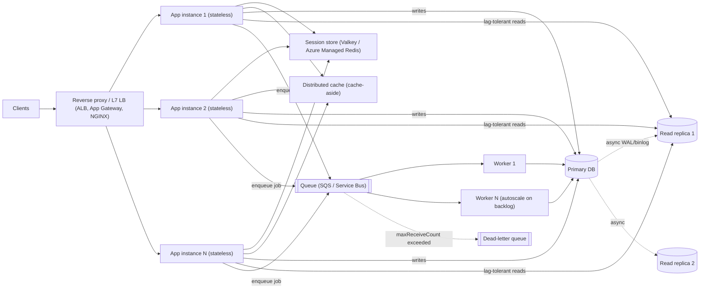
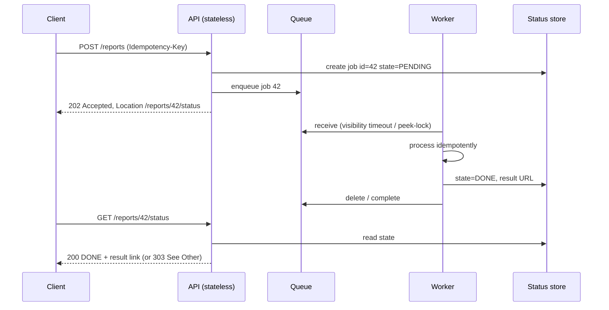
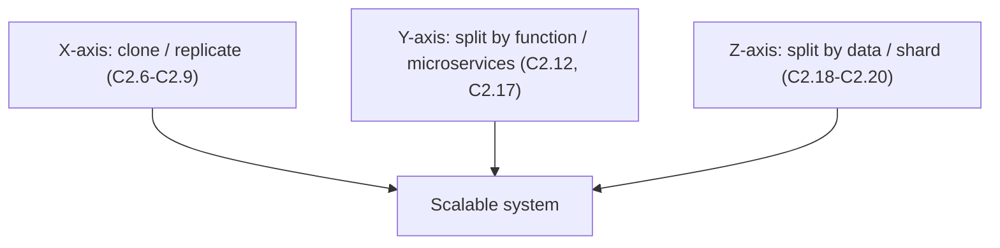

# C2 Scalability
> Last verified: 2026-10 · Audience: senior/staff DevOps, SRE, AI eng, NetEng, DevSecOps, architects

## TL;DR
- **Performance** = how fast one request is served (latency at low load). **Scalability** = how well throughput holds up as load grows when you add resources. A system can be fast but not scalable, or slow but scalable.
- **Scale up (vertical)** is simple but hits a ceiling and is a single point of failure. **Scale out (horizontal)** has no hard ceiling but needs **stateless** app tiers, load balancing and partitioned data.
- The four levers are **statelessness/replication**, **partitioning** (functional/vertical and data/horizontal), **async processing** (queues), and **caching**. Name them, then explain which bottleneck each one removes.
- **Session state** decides whether you can scale out. **Sticky sessions** are a crutch: they cause uneven load and lose sessions when an instance dies. Move session state into a store such as **ElastiCache (Valkey)** or **Azure Managed Redis**, or into a signed token such as a JWT.
- **Read replicas** scale reads only. They are async, so expect **replica lag** and **read-your-writes** anomalies. Writes scale only by **partitioning/sharding** (or by moving writes into a queue).
- Split by business capability (**microservices = vertical/functional partitioning**) so each part scales, deploys and fails on its own. The price is distributed transactions and network hops.
- API style: **REST/JSON** at the edge, **gRPC** (HTTP/2 + protobuf, streaming, deadlines) for internal east-west traffic, **SOAP** only for legacy or WS-* contracts. On AWS use API Gateway **REST API** for the full feature set (caching, WAF, API keys, usage plans) and **HTTP API** when cost and latency matter more. On Azure use **APIM**.
- Know the queue limits: **SQS** messages up to **1 MiB**, retention **4 d default / 14 d max**, visibility timeout **30 s default / 12 h max**. **Service Bus** gives FIFO via sessions, duplicate detection, DLQ and transactions. **Storage Queues** messages are **64 KB** but the queue can grow huge.

## C2.1 Performance vs Scalability
- **How it works:**
  - **Performance problem**: the system is slow for a single user. Fix it with profiling, algorithms, indexes and caching (see [C1 Performance](C1-performance.md)).
  - **Scalability problem**: the system is fast for one user but slow under load. Throughput flattens or latency curves upward as concurrency rises because of contention for a shared resource such as locks, a DB connection pool, a single writer or a coordinator.
  - **Amdahl's law**: speed-up ≤ 1 / (s + (1−s)/N), where s is the serial fraction. With 5% serial work, speed-up caps at 20× no matter how many nodes you add.
  - **Universal Scalability Law (Gunther)**: adds a **coherency/crosstalk** term (β·N(N−1)). Past a certain point, adding nodes *lowers* throughput.
  - **Little's law**: L = λ·W (concurrency = arrival rate × latency). Use it to size pools, threads and instance counts.
- **Trade-offs / when to use:**
  - Optimise performance first when p50 is bad at low load. Optimise scalability when latency degrades as RPS grows.
  - Scalability work, such as distribution, async and partitioning, usually *adds* per-request latency through network hops and serialisation.
- **Interview angles:**
  - If asked "fast vs scalable?", say: "Performance is the latency of one unit of work. Scalability is how capacity grows when you add resources while latency stays within the SLO." Then sketch a throughput-vs-load curve with a knee.
  - Follow-up "how do you find the bottleneck?": load test (see [J5](../J-sre/J5-capacity-planning-load-testing.md)), apply **USE** (utilisation, saturation, errors) to every resource, find the first resource to saturate, and remove serialisation points.
  - Pitfall: claiming "add servers" fixes everything. A shared DB or a global lock is the serial fraction.

## C2.2 Vertical & Horizontal scalability
- **How it works:**
  - **Vertical (scale up)**: bigger instance with more vCPU, RAM, IOPS or network. Example: RDS `db.r7g.16xlarge`. Usually needs a restart or failover. Hard ceiling at the largest SKU.
  - **Horizontal (scale out)**: more identical instances behind a load balancer, such as ASG/VMSS or a K8s HPA. Needs stateless nodes, discovery and load balancing.
  - **Diagonal**: scale up until the price/performance knee, then scale out.
- **Trade-offs / when to use:**

| | Vertical | Horizontal |
|---|---|---|
| Complexity | Low, no code change | High: state, LB, data partitioning |
| Ceiling | Largest SKU | Practically none (until shared deps saturate) |
| Availability | SPOF unless paired with HA | N+1 redundancy built in |
| Cost curve | Super-linear at top SKUs | ~Linear, granular, elastic |
| Good for | Primary RDBMS, legacy monoliths, in-memory DBs | Web/app tiers, stateless workers, caches, NoSQL |

- **Interview angles:**
  - Say: "Scale the **stateless tiers horizontally** and the **stateful primary DB vertically first**, then add read replicas, then shard."
  - Follow-up on autoscaling: horizontal scaling is what makes elasticity possible (see C2.30). Vertical autoscaling of pods (K8s VPA) usually needs a pod restart unless in-place resize is used.
  - Pitfall: scaling out an app tier while it holds local state such as an in-memory session, local file uploads or a local cache that must stay consistent.

## C2.3 Reverse proxy
- **How it works:**
  - A server-side intermediary that terminates client connections and forwards them to backends. Clients see only the proxy's address. A forward proxy is the opposite: it acts on behalf of clients.
  - Functions:
    - TLS termination and offload
    - L7 routing by host or path
    - Load balancing and health checks
    - Compression
    - Response caching
    - Rate limiting, WAF and auth offload
    - Connection pooling and keep-alive to backends
    - Request buffering, which shields slow clients from app workers
    - Header injection: `X-Forwarded-For`, `X-Forwarded-Proto`, `Forwarded` (RFC 7239)
  - Examples: NGINX, Envoy, HAProxy, Traefik, Caddy. Managed equivalents: AWS **ALB** and **CloudFront**; Azure **Application Gateway** and **Front Door**; **Cloudflare**.
- **Trade-offs / when to use:**
  - It is the single entry point that makes horizontal scale invisible to clients. It is also a potential SPOF and bottleneck, so run it in HA pairs or use a managed service.
  - Adds one hop of latency. Terminating TLS means re-encryption is needed for end-to-end/zero-trust designs (see [C4](C4-security.md)).
- **Interview angles:**
  - "Reverse proxy vs load balancer vs API gateway?" A load balancer is a reverse proxy focused on distribution. An API gateway is a reverse proxy plus API concerns: authN/Z, quotas, keys, transformation, versioning. L4 vs L7 detail is in [C2.26](#c226-layer-7-load-balancers) and [D1](../D-system-design/D1-system-design-basics.md).
  - Gotcha: the app must trust `X-Forwarded-*` only from the proxy, otherwise IP spoofing bypasses rate limits and allow-lists.

## C2.4 Scalability principles
- **How it works:** the canonical principles to name in an interview:
  1. **Statelessness**: no request depends on node-local memory, so any instance can serve any request.
  2. **Replication/cloning**: N identical copies behind a load balancer (the X-axis of the **AKF Scale Cube**).
  3. **Functional partitioning**: split by service or capability (Y-axis, microservices).
  4. **Data partitioning/sharding**: split by key, such as customer or tenant (Z-axis).
  5. **Asynchrony**: decouple with queues and events, absorb bursts, retry later.
  6. **Caching**: avoid repeating work at every layer (client, CDN, gateway, app, DB).
  7. **Avoid shared mutable state and global locks**. Prefer idempotent, commutative operations.
  8. **Design for failure and back-pressure**: timeouts, bulkheads, load-shedding (see [C3 Reliability](C3-reliability.md)).
- **Trade-offs / when to use:**
  - Each principle trades consistency or simplicity for capacity. CAP/PACELC applies as soon as you replicate or partition data.
- **Interview angles:**
  - Draw the **AKF cube** (X = clone, Y = split by function, Z = split by data) and map each axis to a concrete component in your design.
  - Follow-up "what limits scale-out?": shared databases, chatty synchronous calls (fan-out latency adds up), hot keys/partitions, and coordination such as leader election or distributed locks.

## C2.5 Modularity for scalability
- **How it works:**
  - **Loosely coupled, highly cohesive modules** with explicit interfaces. Each module owns its data and can be scaled, deployed or rewritten on its own.
  - The usual progression is a **modular monolith**: in-process modules with enforced boundaries and separate schemas, deployed as one unit. Modules are later extracted into services when a module has a different scaling profile, release cadence or team.
  - Boundaries come from **DDD bounded contexts** and **Conway's law**: the system mirrors the structure of the team.
- **Trade-offs / when to use:**
  - Modularity lets you scale only the hot path, for example image processing, without scaling checkout. Without module boundaries you have to scale everything together.
  - Splitting too early adds network calls, distributed transactions and ops overhead. A well-structured monolith scales a long way with horizontal clones.
- **Interview angles:**
  - Say: "Modularise first, distribute second. Extract a module only when its scaling or availability requirements differ."
  - Pitfall: a **distributed monolith**, where services share a DB or must deploy in lockstep. You get every cost of microservices and none of the benefits.

## C2.6 Replication
- **How it works:**
  - Run **multiple copies** of a component. Stateless copies are trivial. Stateful copies need a replication protocol.
  - Purposes: **capacity** (spread load), **availability** (survive node or AZ loss) and **latency** (geo-proximity).
  - Two families:
    - **Stateless service replication** (app tier): just clone it.
    - **Data replication** (DB, cache, sessions): primary-replica, multi-primary or leaderless; **sync** or **async**.
- **Trade-offs / when to use:**
  - Replicating code is cheap. Replicating state forces a choice between consistency, latency and availability.
  - N replicas only add capacity if the load balancer spreads load evenly and a shared dependency does not cap throughput.
- **Interview angles:**
  - "Replication for scale vs for HA?" Read replicas add read capacity but are async and lag. Standby replicas (RDS Multi-AZ standby) are sync, serve **no** reads, and exist only for failover. Details are in [B8](../B-database-engineering/B8-database-replication.md).

## C2.7 Stateful replication in web applications
- **How it works:**
  - The app keeps **session state in instance memory** (HTTP session, cart, auth context). Replicating this tier requires one of two approaches:
    - **Sticky sessions (session affinity)**: the load balancer pins a client to one instance via a cookie.
      - AWS **ALB** offers a duration-based `AWSALB` cookie (1 s–7 d, default 1 d) or an application-based cookie.
      - Azure **Application Gateway** uses cookie-based affinity (`ApplicationGatewayAffinity`).
      - NGINX uses `ip_hash`, `hash $cookie_x` or `sticky`.
    - **Session replication between nodes**: Tomcat/JBoss clustering, multicast or all-to-all copies. Memory and network cost is O(N²), so it does not scale past a handful of nodes.
- **Trade-offs / when to use:**
  - Stickiness is cheap and requires no code change, but:
    - (a) load becomes **uneven**: hot users and long sessions pile up, and the ALB's sticky routing overrides least-outstanding-requests.
    - (b) if an instance dies, its sessions are lost and users are logged out or lose their carts.
    - (c) scale-in and deploys must drain for the session TTL.
    - (d) NAT'd clients defeat IP-hash.
  - Acceptable for legacy apps, WebSocket or long-lived connections, or local caches warmed per user.
- **Interview angles:**
  - If asked "how do you scale a stateful web app?", say: "Stickiness is a short-term fix. The real fix is to externalise the session to a store (C2.8) and make the instances disposable."
  - Follow-up: with stickiness, when the pinned target becomes unhealthy the ALB re-routes to a healthy target and the session state is gone.

## C2.8 Stateless replication in web applications
- **How it works:**
  - The web or app tier keeps **no client state between requests**. State lives in one of three places:
    - **Client**: signed or encrypted cookie, or a **JWT**. Keep it small, since cookies are sent on every request and headers are limited to roughly 4–8 KB per cookie.
    - **Shared session store**: Redis/Valkey (ElastiCache, Azure Managed Redis), DynamoDB/Cosmos DB, or SQL. The key is the session ID from a cookie. Set a TTL equal to the idle timeout.
    - **DB**: for durable carts and user profiles.
  - Any instance serves any request. The load balancer can use round-robin or least-outstanding-requests freely. Instances can autoscale, be replaced or be killed (cattle, not pets).
- **Trade-offs / when to use:**
  - The session store becomes a critical shared dependency. Run it **multi-AZ with replicas** and add ~sub-ms network lookups per request.
  - A **JWT** removes the lookup, but revocation is hard: use a short TTL, refresh tokens and a deny-list. Token size grows with claims.
  - Sizing: sessions are small and hot, so an in-memory store fits. Persistence is usually optional because losing a session means a re-login.
- **Interview angles:**
  - Default answer: "Stateless app tier + Redis/Valkey session store with TTL, multi-AZ replica, behind an L7 LB with no stickiness."
  - Follow-up "the Redis cluster is a SPOF?": cluster mode with replicas and automatic failover, client retries, and graceful degradation (treat the user as anonymous rather than return a 500).
  - Pitfall: storing uploaded files on local disk. Use S3/Blob plus pre-signed URLs.

## C2.9 Stateless replication of services
- **How it works:**
  - Apply the same rule to backend services and workers. Idempotent request handlers keep no in-memory affinity. Config comes from the environment or a config service. Caches are either shared or treated as disposable (a cold start is fine).
  - Service discovery and client-side or mesh load balancing distribute calls (C2.23). Scale replicas on CPU, RPS, queue depth or custom metrics (HPA/KEDA, ASG target tracking, VMSS autoscale).
  - **12-factor** rules apply: processes are stateless and share nothing, backing services are attached resources, processes are disposable (fast start, graceful SIGTERM).
- **Trade-offs / when to use:**
  - Some services are inherently stateful: stream processors, leaders, WebSocket hubs. Partition them (Kafka consumer groups, K8s StatefulSets with stable identity) instead of cloning them blindly.
  - Retries plus statelessness require **idempotency keys**, otherwise retried POSTs double-charge.
- **Interview angles:**
  - "How do you make a worker horizontally scalable?" Use the competing-consumers pattern on a queue with idempotent handlers, visibility timeout > p99 processing time, a DLQ after N attempts, and autoscaling on backlog per worker.

## C2.10 Database replication
- **How it works:**
  - A **primary** (leader) takes writes and ships changes (WAL/binlog/redo, physical or logical) to **replicas** (followers).
  - The app sends writes to the primary and reads to replicas, via a separate reader endpoint or a proxy: Aurora reader endpoint, Azure SQL `ApplicationIntent=ReadOnly`, PgBouncer/ProxySQL.
  - Scales **reads**, offloads reporting/BI, and gives DR (promote a replica).
- **Trade-offs / when to use:**
  - Async replicas mean **replication lag**, which breaks **read-your-writes** and **monotonic reads**. Mitigations:
    - read from the primary for N seconds after a write;
    - pin the session to the primary;
    - wait for the replica to reach the write's LSN/GTID;
    - route only lag-tolerant queries to replicas.
  - Writes don't scale, and every replica must replay all writes. A write-heavy load can make replicas fall behind indefinitely. Azure PG docs warn lag can range from seconds to hours under heavy writes.
- **Interview angles:**
  - If asked "the DB is overloaded", ask first whether it is read-heavy or write-heavy:
    - Read-heavy: cache, then read replicas.
    - Write-heavy: batch or queue writes, scale up, then shard (C2.18).
  - Keep the depth for [B8 Database replication](../B-database-engineering/B8-database-replication.md).

## C2.11 Database replication types
- **How it works:** short version, with full depth in [B8](../B-database-engineering/B8-database-replication.md):

| Type | Writes | Consistency | Examples |
|---|---|---|---|
| **Primary-replica (single leader), async** | 1 node | Eventual on replicas, possible data loss on failover | RDS read replicas, Azure PG read replicas, MySQL async |
| **Primary-replica, sync / semi-sync** | 1 node | No acknowledged-write loss, higher write latency | RDS Multi-AZ standby, PG `synchronous_commit`, Azure SQL Business Critical (Always On) |
| **Shared-storage replicas** | 1 node | Lag usually < 100 ms (Aurora) | Aurora replicas (≤15), Azure SQL Hyperscale HA (0–4) and named replicas (≤30) |
| **Multi-primary (multi-leader)** | Many | Conflicts need resolution (LWW, CRDTs) | MySQL Group Replication multi-primary, Cosmos DB multi-region writes, DynamoDB global tables |
| **Leaderless (quorum)** | Any | Tunable W+R>N | Cassandra, original Dynamo design (see C6.32) |

  - **Physical** replication ships byte-level WAL/redo: same engine and version, whole cluster. **Logical** replication ships row changes: selective tables, cross-version, CDC.
- **Trade-offs / when to use:**
  - Sync means durability at the cost of write latency, which spans AZs or regions. Async means speed at the cost of RPO > 0.
- **Interview angles:**
  - "Multi-AZ vs read replica on RDS?" Multi-AZ instance = synchronous standby for HA that can't be read. Read replica = async, readable, can be promoted, cross-region possible.
  - Note the **Multi-AZ DB cluster** variant (1 writer + 2 readable standbys), which is different again (see B8).

## C2.12 Need for specialized services
- **How it works:**
  - As a system grows, generic components become bottlenecks. Extract **specialised services** that are tuned for one job:
    - search: OpenSearch / Azure AI Search
    - media transcoding
    - notifications
    - auth/identity
    - payments
    - recommendation/ML inference
    - reporting
  - Each one gets the **right datastore** (polyglot persistence) and the **right scaling dimension**: CPU, GPU, memory or I/O.
  - They are exposed over a network API (REST, gRPC, messaging) behind a stable contract.
- **Trade-offs / when to use:**
  - Pros: independent scaling and hardware (GPU nodes only for inference), team ownership, fault isolation (bulkhead).
  - Cons: network latency, partial failures, contract versioning, distributed data consistency.
  - Extract one when its scale or availability profile differs sharply from the core, or when it is a commodity you can buy (managed search, managed identity).
- **Interview angles:**
  - Example: "Image resizing burns CPU in the web tier. Move it to a worker service fed by a queue, and scale on queue depth."
  - Follow-up: protect callers with timeouts, circuit breakers and fallbacks so a slow specialised service doesn't exhaust the caller's threads.

## C2.13 Specialized services: SOAP/REST
- **How it works:**

| | **SOAP** | **REST** | **gRPC** | **GraphQL** |
|---|---|---|---|---|
| Transport | Usually HTTP POST, also JMS/SMTP | HTTP/1.1 or 2 | **HTTP/2** (HTTP/3 emerging) | HTTP POST (usually) |
| Payload | XML envelope | JSON (any media type) | **Protobuf** binary | JSON |
| Contract | **WSDL** (strict) | OpenAPI (optional) | `.proto` IDL, codegen | Schema SDL |
| Semantics | Operations (RPC) | Resources + HTTP verbs, status codes | RPC: **unary, server-streaming, client-streaming, bidi** | Client-shaped queries |
| Caching | Hard (POST) | **HTTP caching** (GET, ETag, Cache-Control) | No HTTP caching | Hard (POST), persisted queries |
| Extras | WS-Security, WS-ReliableMessaging, WS-AtomicTransaction | Simple, ubiquitous | **Deadlines**, cancellation, metadata, flow control | Avoids over/under-fetching |
| Best for | Legacy enterprise/B2B, banking, telecom | Public APIs, browsers, edge | Internal east-west, low-latency, streaming, polyglot | BFF, mobile aggregation |

- **Trade-offs / when to use:**
  - REST + JSON: universal, cacheable, debuggable. Verbose, with no streaming beyond SSE/WebSocket.
  - gRPC: smaller payloads, multiplexed long-lived connections. It needs **L7, HTTP/2-aware load balancing**: an L4 LB pins all RPCs on a connection to one backend. Browsers need gRPC-Web.
  - SOAP: strong contracts and WS-* security, but heavyweight. Keep it for integration, or put a facade in front (APIM can expose SOAP as pass-through or SOAP-to-REST).
- **Interview angles:**
  - "Why not gRPC everywhere?" Browser support, HTTP caching and debuggability. Use REST at the edge and gRPC inside. Also mention **idempotency** (PUT/DELETE are idempotent, POST is not) and **versioning** (URI/header in REST; additive field numbers in protobuf).
  - Gotcha: gRPC behind a classic L4 NLB means uneven load. Use ALB (gRPC target groups), Envoy/Istio, or client-side LB.
  - Gotcha: Azure APIM pass-through gRPC is supported only on the classic managed gateway (preview, for instances created from Jan 2026) and the self-hosted gateway, **not v2 tiers** (as of 2026-06).

## C2.14 Asynchronous services
- **How it works:**
  - The caller doesn't block for the result. Patterns:
    - **Fire-and-forget** via a queue (SQS, Service Bus, Storage Queues, RabbitMQ).
    - **Async request-reply**: return `202 Accepted` with a `Location` status URL, then the client polls or receives a webhook/WebSocket/SSE callback.
    - **Pub/sub events** (SNS, EventBridge, Event Grid, Kafka, Event Hubs) so multiple consumers react on their own.
  - Messages carry commands ("do X") or events ("X happened"). Consumers ack/delete after success. On failure the message becomes visible again: SQS visibility timeout; Service Bus peek-lock with a 30 s default lock that can be renewed.
- **Trade-offs / when to use:**
  - Pros: temporal decoupling (the consumer can be down), resilience, natural retry, and fan-out with pub/sub.
  - Cons: eventual consistency, harder tracing (propagate correlation IDs and W3C traceparent), **at-least-once delivery** so handlers must be idempotent, possible reordering, and poison messages (DLQ).
- **Interview angles:**
  - "Queue vs topic vs stream?" A queue is point-to-point with competing consumers and the message is deleted on ack. A topic is fan-out to subscriptions. A stream (Kafka, Kinesis, Event Hubs) is a retained, replayable, partition-ordered log where consumers track offsets (see C2.38 and [M4](../M-data-platforms/M4-kafka-at-scale.md)).
  - "Exactly-once?" In practice it means at-least-once delivery plus idempotent or deduplicated processing. Service Bus duplicate detection and SQS FIFO deduplication (5-minute window) only cover the send side.

## C2.15 Asynchronous processing & scalability
- **How it works:**
  - **Queue-based load levelling**: the queue absorbs bursts. Workers drain it at a sustainable rate, so the DB sees a smooth load instead of spikes.
  - **Competing consumers**: add workers to increase throughput. **Autoscale on backlog**, for example SQS `ApproximateNumberOfMessagesVisible` / workers, KEDA scalers, or Service Bus active message count.
  - **Batching**: SQS supports 10 messages per Send/Receive/Delete batch. Storage Queues allow batched receive of up to 32. Service Bus supports prefetch and batch send.
  - **Long polling** (SQS `WaitTimeSeconds` up to 20 s) cuts empty receives and cost.
  - Key limits (2026):
    - **SQS**:
      - message ≤ **1 MiB** (larger payloads via the S3 extended client, up to 2 GB)
      - retention 60 s–**14 d** (default **4 d**)
      - visibility timeout default **30 s**, max **12 h**
      - delay ≤ 15 min
    - **SQS FIFO**: 300 TPS per API action without batching (3,000 msg/s with batches of 10). **High-throughput mode** reaches up to 70,000 TPS in the largest regions. Parallelism comes from distinct **MessageGroupIds**.
    - **Service Bus**:
      - message 256 KB (Standard), 100 MB (Premium)
      - queue 1–80 GB
      - FIFO via **sessions**
      - duplicate detection, auto-DLQ, transactions, AMQP 1.0
      - 5,000 concurrent clients
    - **Storage Queues**:
      - message **64 KB** (48 KB Base64)
      - queue up to the storage account capacity (PiB scale)
      - lease 30 s default, 7 d max
      - no ordering guarantee, no automatic DLQ (check `DequeueCount` yourself)
- **Trade-offs / when to use:**
  - Use async for anything slow, bursty, retriable or not needed for the response: emails, transcoding, ML inference batches, ledger postings, webhooks.
  - Don't use it when the user needs the result synchronously and quickly, or when strict global ordering is required (that needs a partitioned log and a careful key choice).
  - Watch **queue age**, not just depth, as the SLI. Growing age means the consumers are under-scaled or poisoned.
- **Interview angles:**
  - Visibility timeout too short means duplicate processing. Too long means slow retry after a crash. Set it to ~6× p99 handler time (AWS guidance for Lambda is ≥ 6× function timeout) and extend it for long jobs.
  - A DLQ with maxReceiveCount 3–5, plus alarms and redrive tooling, is non-negotiable.
  - Back-pressure: if a downstream system is rate-limited, cap worker concurrency (Lambda reserved concurrency, KEDA maxReplicaCount) rather than letting autoscaling DDoS your own DB.

## C2.16 Caching for scalability
- **How it works:**
  - For scale, caching **reduces load on shared bottlenecks**, usually the DB, so the same backend serves more users. This is different from caching for latency (see [C1 caching](C1-performance.md#c127-caching-for-performance)).
  - Layers:
    - browser/HTTP `Cache-Control`
    - **CDN** (static and cacheable API responses)
    - API gateway response cache (API Gateway REST API stage cache; APIM built-in cache, 10 MB–5 GB by tier, or an external Redis)
    - **distributed cache** (Redis/Valkey/Memcached)
    - in-process cache
    - DB buffer pool
  - Patterns: **cache-aside** (most common), read-through, write-through, write-behind. Eviction with LRU/LFU plus TTL.
- **Trade-offs / when to use:**
  - The hit ratio drives the gain. At 90% hits the DB sees 10% of reads, so ~10× read headroom.
  - Risks:
    - **staleness** and invalidation
    - **thundering herd / cache stampede** on expiry: mitigate with request coalescing (single-flight), jittered TTLs, early probabilistic refresh, or serve-stale-while-revalidate
    - **hot keys**: replicate the key, add a local L1 cache, or shard the key
    - **cold-start** after a cache flush, which can take the DB down
  - Don't treat the cache as the source of truth unless it is a durable store (ElastiCache Valkey with durability, or Azure Managed Redis persistence).
- **Interview angles:**
  - "What if the cache dies?" The DB must survive a cold cache, or you need warmup and rate-limited misses. Otherwise the cache is a hidden hard dependency that adds risk instead of capacity.
  - Overlap: [C1.26–C1.30](C1-performance.md), [C6 caching](C6-technology-stack.md), [D1.14/D1.15](../D-system-design/D1-system-design-basics.md), [H6.4](../H-full-stack-troubleshooting/H6-web-application-architecture.md).

## C2.17 Vertical partitioning with micro-services
- **How it works:**
  - **Vertical/functional partitioning** (AKF Y-axis) splits the application by business capability (users, catalog, orders, payments). Each service owns **its own data** (**database-per-service**) and is scaled, deployed and failed independently.
  - Data access across boundaries goes through APIs or events, never shared tables. Joins are replaced by API composition, CQRS read models or replicated reference data.
  - Applies to data too: **vertical DB partitioning** splits columns (hot vs cold or BLOB columns into separate tables) or tables (different DBs per domain).
- **Trade-offs / when to use:**
  - Pros: scale the hot service only, choose the right DB per service, smaller blast radius, team autonomy.
  - Cons: no cross-service ACID, so you need **sagas** and outbox (C2.34–C2.35). Also more network calls, harder debugging, and data duplication.
  - Functional partitioning has a ceiling: one service's data can still outgrow a node. Then shard within the service (Z-axis, C2.18).
- **Interview angles:**
  - "How do you split a monolith?" **Strangler fig**: put a façade/proxy in front, extract one bounded context at a time, and use CDC/outbox to sync data during the transition.
  - Pitfall: splitting services but keeping a shared database. That is coupling at the data layer, and the shared DB stays the bottleneck.

## C2.18 Database partitioning
- **How it works:** short version; depth is in [B5 Partitioning](../B-database-engineering/B5-database-partitioning.md) and [B6 Sharding](../B-database-engineering/B6-database-sharding.md).
  - **Horizontal partitioning**: split rows by key. **Within one node** (PG declarative partitioning, SQL Server partition functions) this aids pruning, maintenance and archival. **Across nodes** it is **sharding**, which scales writes and storage.
  - **Vertical partitioning**: split columns or tables (see C2.17).
  - **Functional partitioning**: separate DBs per domain.
  - Strategies:
    - **Range** (dates, IDs): simple range scans, but hot tail partitions.
    - **Hash** (or **consistent hash**, see B6.2/D1.21): even spread, but range queries scatter.
    - **List/directory** (lookup table key → shard): flexible, but the directory is a dependency.
    - **Geo/tenant** based.
  - Managed sharding options:
    - Aurora PostgreSQL **Limitless Database**: sharded and reference tables, routers, DB shard groups.
    - Azure Database for PostgreSQL **elastic clusters** (managed Citus, row- or schema-based sharding, online rebalancing).
    - Azure SQL **elastic database tools** (shard map manager).
    - DynamoDB/Cosmos DB, which partition automatically by partition key.
- **Trade-offs / when to use:**
  - Partition only when vertical scaling, caching and read replicas are exhausted, or when write throughput or data size demands it. Sharding is hard to undo.
  - Costs: cross-shard queries, joins and transactions; resharding/rebalancing; hot shards; operational multiplication (N backups, N upgrades).
- **Interview angles:**
  - Routing (app-level, proxy, or directory) is covered in [C2.20](#c220-routing-with-database-partitioning).
  - "Partitioning vs sharding?" Partitioning is the general split; sharding is horizontal partitioning across separate servers.

## C2.19 Database partitioning selection
- **How it works:** choosing the **partition (shard) key** is the decision that matters most.
  - **High cardinality**: many distinct values so data spreads.
  - **Even access distribution**: avoid **hot partitions**, such as celebrity users or "today" in a date-range key.
  - **Query alignment**: most queries should hit **one partition** (include the key in the WHERE clause). Avoid scatter-gather.
  - **Transaction locality**: entities updated together should share a key, e.g. `tenant_id` for SaaS so a tenant's data and transactions stay on one shard.
  - **Growth**: hash keys rebalance easily. Monotonic keys (timestamps, auto-increment) create write hotspots on the last range.
- **Trade-offs / when to use:**

| Key choice | Good for | Risk |
|---|---|---|
| `tenant_id` / `customer_id` | Multi-tenant SaaS, per-tenant isolation | Whale tenants, so you need tenant-level splitting or dedicated shards |
| `user_id` hash | Social/consumer apps | Cross-user queries (feeds) scatter, so use fan-out on write or denormalise |
| Time range | Logs, metrics, time series, TTL drops | Hot newest partition, so use a composite of time + hash bucket |
| Geo/region | Data residency, latency | Uneven regional load |
| Composite / synthetic (key + random suffix 0..N) | Write-hot keys (DynamoDB write sharding) | Reads must fan out to N suffixes |

- **Interview angles:**
  - Always justify the key against the **top 3 access patterns** and say what happens with the hottest entity.
  - Follow-up "you picked wrong — now what?" Plan the migration up front with dual-write or CDC into new shards, backfill, verify, then cut over reads before writes. Consistent hashing or virtual shards (many logical shards mapped to fewer physical nodes) make rebalancing cheaper.
  - Pitfall: using an auto-increment ID with range sharding, because all inserts hit the last shard.

<!-- PART2-IDS-GO-HERE -->

## Diagrams

Stateless, horizontally scaled web tier with externalised sessions, async workers and read replicas:



Async request-reply (202 Accepted) for long-running work:



AKF scale cube mapping:



## Cloud mapping: AWS vs Azure

| Capability | AWS | Azure | Role it plays | Key differences | Alternatives |
|---|---|---|---|---|---|
| Session store / distributed cache | **ElastiCache** (Valkey, Redis OSS, Memcached; Serverless or node-based) | **Azure Managed Redis** (Redis Enterprise based). Azure Cache for Redis is being retired | Externalised session state (C2.8), cache-aside (C2.16) | AMR is clustered by default, zone-redundant by default, has active geo-replication and modules. ElastiCache offers Serverless auto-scaling, Valkey pricing, and Global Datastore for cross-region | Self-managed Valkey/Redis on K8s, DynamoDB/Cosmos DB as session store, Cloudflare Workers KV, JWT (no store) |
| Session affinity (if you must) | **ALB** sticky sessions (`AWSALB` duration cookie 1 s–7 d, or app cookie) | **Application Gateway** cookie-based affinity; Front Door session affinity | Pins client to instance (C2.7) | Both break on target failure. Stickiness overrides ALB least-outstanding-requests | NGINX/HAProxy/Envoy hash-based affinity |
| Point-to-point queue | **SQS** Standard / FIFO | **Service Bus queues** (rich) / **Storage Queues** (simple, huge) | Async processing, load levelling (C2.14–C2.15) | SQS: 1 MiB, 14 d max retention, nearly unlimited Standard TPS. SB: 256 KB/100 MB, sessions (FIFO), duplicate detection, transactions, AMQP. Storage Queues: 64 KB, PiB-scale capacity, no DLQ | RabbitMQ, Kafka/Confluent (stream), Amazon MQ |
| Pub/sub fan-out | SNS, EventBridge | Service Bus topics, Event Grid | Event-driven decoupling | EventBridge/Event Grid offer content filtering and push delivery | Kafka, Cloudflare Queues |
| API front door / API styles | **API Gateway**: REST API (full features) vs HTTP API (cheaper, leaner); ALB for gRPC | **API Management** (Consumption, classic, v2 tiers) | Edge for REST/SOAP/gRPC/GraphQL (C2.13) | REST API has caching, WAF, API keys, usage plans, private endpoints, request validation. HTTP API adds JWT authorizers and auto-deploy but lacks those. APIM: WSDL import / SOAP-to-REST on all gateways; gRPC pass-through only on classic (preview) and self-hosted, not v2; built-in cache 10 MB–5 GB | Kong, Envoy Gateway, Apigee, Cloudflare API Shield |
| Read replicas (RDBMS) | **RDS read replicas** (up to 15 per primary, async, cross-Region, promotable); **Aurora Replicas** (up to 15, shared storage, typically < 100 ms lag, reader endpoint, failover targets); Aurora Global Database | **Azure SQL** read scale-out (`ApplicationIntent=ReadOnly`; Premium/BC built-in replica; Hyperscale 0–4 HA + up to 30 named replicas), active geo-replication; **Azure DB for PostgreSQL flexible** read replicas (5 per primary, cascading to 30, virtual endpoints) | Read scaling, reporting offload, DR (C2.10–C2.11) | RDS replicas need manual creation (no autoscaling); Aurora supports replica Auto Scaling. Azure SQL BC/Premium read replica comes at no extra cost. Azure PG replicas: no Burstable tier, no HA/backups on replica | ProxySQL/PgBouncer read routing, Citus, Vitess |
| Sharding (write scale) | Aurora PostgreSQL **Limitless Database**; DynamoDB partitions | Azure DB for PostgreSQL **elastic clusters** (Citus); Azure SQL elastic database tools; Cosmos DB partitions | Horizontal data partitioning (C2.18–C2.19) | Limitless: transparent routers + shard groups. Elastic clusters: row- or schema-based sharding, online rebalance | Vitess, CockroachDB, YugabyteDB, Spanner (GCP) |

- **Session stores:**
  - **ElastiCache** runs Valkey, Redis OSS and Memcached. Use **Serverless** for hands-off capacity, or node-based clusters with cluster mode for horizontal shards.
  - **Valkey** is the default and the lower-cost engine choice on AWS since the Redis licence change. Node-based Valkey can enable **durability** (Multi-AZ transaction log).
  - **Azure Managed Redis** (Redis 7.4.x, Redis Enterprise stack) has tiers Memory Optimized 8:1, Balanced 4:1, Compute Optimized 2:1 and Flash Optimized. It is clustered by default; a non-clustered option exists up to 25 GB. HA places primary and replica shards on ≥ 2 nodes, zone-redundant where supported.
  - **Retirements**: Azure Cache for Redis **Enterprise/Enterprise Flash retires 2027-03-31**. **Basic/Standard/Premium retire 2028-09-30**. Migrate to AMR, and expect client changes for cluster-aware connections and cross-slot commands.
- **Queues:**
  - Choose **Service Bus** for ordering (sessions), dedup, transactions, DLQ, pub/sub migration and AMQP.
  - Choose **Storage Queues** when you need more than 80 GB of backlog, a server-side transaction log, or the cheapest simple queue.
  - On AWS, **SQS Standard** gives at-least-once delivery, best-effort ordering and nearly unlimited throughput. **SQS FIFO** gives exactly-once *send* deduplication (5-min window) and per-group ordering.
  - Gotcha: Service Bus Standard queues are 1–5 GB; with partitioning they become 16 partitions, so 5 GB × 16 = 80 GB.
- **API styles:**
  - API Gateway **REST API** is the only AWS choice for edge-optimised or private endpoints, WAF, caching, API keys/usage plans, canary or request validation.
  - **HTTP API** for simple, cheap Lambda/HTTP proxies with JWT authorizers.
  - For gRPC on AWS use **ALB** (gRPC protocol version on target groups) or a mesh.
  - **APIM** v2 tiers lack multi-region deployment and the self-hosted gateway (Premium classic has both). APIM is a regional resource unless you use Premium multi-region.
- **Read replicas:**
  - RDS "Read replicas per primary" default quota is **15**. For Oracle, AWS recommends ≤ 5 to limit lag.
  - RDS PG replicas cannot be made writable. MySQL/MariaDB replicas can.
  - In Azure SQL **Premium/Business Critical** only one read-only replica is reachable via read scale-out. **Hyperscale** load-balances across HA replicas.
  - On **Azure PG**, watch WAL accumulation from replication slots. At 95% storage or less than 5 GiB free the primary goes **read-only**.

## Hands-on

Stateless app tier behind NGINX with an externalised Valkey session store (Docker Compose):

```yaml
# docker-compose.yml  -> docker compose up --scale app=3
services:
  valkey:
    image: valkey/valkey:8
    command: ["valkey-server", "--save", "", "--appendonly", "no"]
  app:
    image: ghcr.io/example/stateless-web:latest   # any app reading SESSION_STORE_URL
    environment:
      SESSION_STORE_URL: redis://valkey:6379/0
      SESSION_TTL_SECONDS: "1800"
    depends_on: [valkey]
  proxy:
    image: nginx:1.27
    ports: ["8080:80"]
    volumes: ["./nginx.conf:/etc/nginx/conf.d/default.conf:ro"]
    depends_on: [app]
```

```bash
# nginx.conf (no stickiness: least_conn across replicas resolved via Docker DNS)
cat > nginx.conf <<'EOF'
resolver 127.0.0.11 valid=10s;
upstream app_pool { least_conn; server app:8080 resolve; keepalive 32; }
server {
  listen 80;
  location / {
    proxy_pass http://app_pool;
    proxy_http_version 1.1;
    proxy_set_header Connection "";
    proxy_set_header Host $host;
    proxy_set_header X-Forwarded-For $proxy_add_x_forwarded_for;
    proxy_set_header X-Forwarded-Proto $scheme;
  }
}
EOF
# Note: 'resolve' on upstream servers requires nginx >= 1.27.3 (open-source); otherwise drop it.
```

SQS work queue with DLQ and long polling (AWS CLI):

```bash
DLQ_URL=$(aws sqs create-queue --queue-name jobs-dlq \
  --attributes MessageRetentionPeriod=1209600 --query QueueUrl --output text)
DLQ_ARN=$(aws sqs get-queue-attributes --queue-url "$DLQ_URL" \
  --attribute-names QueueArn --query Attributes.QueueArn --output text)
aws sqs create-queue --queue-name jobs --attributes "{
  \"VisibilityTimeout\":\"180\",
  \"ReceiveMessageWaitTimeSeconds\":\"20\",
  \"RedrivePolicy\":\"{\\\"deadLetterTargetArn\\\":\\\"$DLQ_ARN\\\",\\\"maxReceiveCount\\\":\\\"5\\\"}\"
}"
```

RDS read replica + ElastiCache Valkey session store (Terraform):

```hcl
resource "aws_db_instance" "replica" {
  identifier             = "app-pg-replica-1"
  replicate_source_db    = aws_db_instance.primary.identifier # async read replica
  instance_class         = "db.r7g.large"
  publicly_accessible    = false
  skip_final_snapshot    = true
}

resource "aws_elasticache_replication_group" "sessions" {
  replication_group_id       = "app-sessions"
  description                = "Valkey session store"
  engine                     = "valkey"
  node_type                  = "cache.r7g.large"
  num_node_groups            = 2   # shards (cluster mode)
  replicas_per_node_group    = 1
  automatic_failover_enabled = true
  multi_az_enabled           = true
  transit_encryption_enabled = true
  subnet_group_name          = aws_elasticache_subnet_group.app.name
}
```

```bash
# Check replica lag on RDS/Azure PG replica
psql -h replica.example.internal -U app -c "SELECT now() - pg_last_xact_replay_timestamp() AS replica_lag;"
```

## Cross-links
- [C1 Performance: caching (C1.26–C1.30)](C1-performance.md#c127-caching-for-performance) and latency (C1.6–C1.15)
- [C3 Reliability: DR & standby (C3.24–C3.26)](C3-reliability.md)
- [C4 Security: TLS termination at proxies](C4-security.md)
- [C6 Technology stack: caching, CDN, Dynamo (C6.32/C6.33)](C6-technology-stack.md)
- [B5 Database partitioning](../B-database-engineering/B5-database-partitioning.md) · [B6 Database sharding (consistent hashing B6.2)](../B-database-engineering/B6-database-sharding.md) · [B8 Database replication](../B-database-engineering/B8-database-replication.md) · [B7 Concurrency control](../B-database-engineering/B7-concurrency-control.md)
- [D1 System design basics: LB (D1.3–D1.5), caching (D1.14–D1.15), consistent hashing (D1.21), partitioning (D1.22)](../D-system-design/D1-system-design-basics.md)
- [H6 Web application architecture: reverse proxies, L4/L7 (H6.4–H6.6)](../H-full-stack-troubleshooting/H6-web-application-architecture.md)
- [J5 Capacity planning & load testing](../J-sre/J5-capacity-planning-load-testing.md)
- [M4 Kafka at scale](../M-data-platforms/M4-kafka-at-scale.md)
- [G14 Service-to-service networking](../G-cloud-network-architecture/G14-service-to-service-networking.md)

## Sources
- https://docs.aws.amazon.com/AWSSimpleQueueService/latest/SQSDeveloperGuide/quotas-messages.html
- https://learn.microsoft.com/en-us/azure/service-bus-messaging/service-bus-azure-and-service-bus-queues-compared-contrasted
- https://learn.microsoft.com/en-us/azure/redis/overview
- https://learn.microsoft.com/en-us/azure/azure-cache-for-redis/retirement-faq
- https://docs.aws.amazon.com/AmazonElastiCache/latest/dg/WhatIs.html
- https://docs.aws.amazon.com/elasticloadbalancing/latest/application/sticky-sessions.html
- https://docs.aws.amazon.com/apigateway/latest/developerguide/http-api-vs-rest.html
- https://learn.microsoft.com/en-us/azure/api-management/api-management-features
- https://learn.microsoft.com/en-us/azure/api-management/api-management-gateways-overview
- https://grpc.io/docs/what-is-grpc/core-concepts/
- https://docs.aws.amazon.com/AmazonRDS/latest/UserGuide/USER_ReadRepl.html
- https://docs.aws.amazon.com/AmazonRDS/latest/UserGuide/USER_ReadRepl.Overview.Differences.html
- https://docs.aws.amazon.com/AmazonRDS/latest/UserGuide/CHAP_Limits.html
- https://docs.aws.amazon.com/AmazonRDS/latest/AuroraUserGuide/Aurora.Replication.html
- https://docs.aws.amazon.com/AmazonRDS/latest/AuroraUserGuide/limitless.html
- https://learn.microsoft.com/en-us/azure/azure-sql/database/read-scale-out
- https://learn.microsoft.com/en-us/azure/azure-sql/database/service-tier-hyperscale-replicas
- https://learn.microsoft.com/en-us/azure/postgresql/read-replica/concepts-read-replicas
- https://learn.microsoft.com/en-us/azure/postgresql/elastic-clusters/concepts-elastic-clusters
