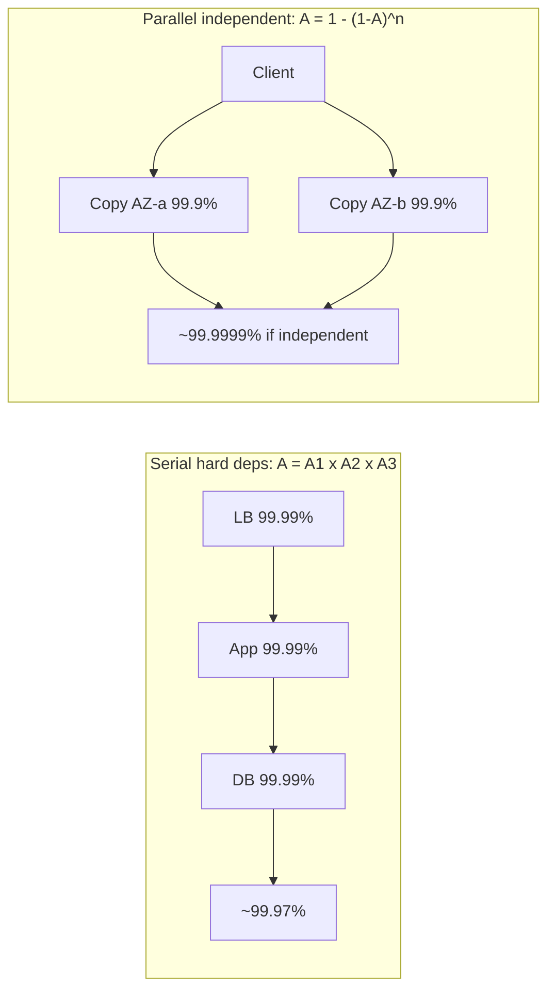
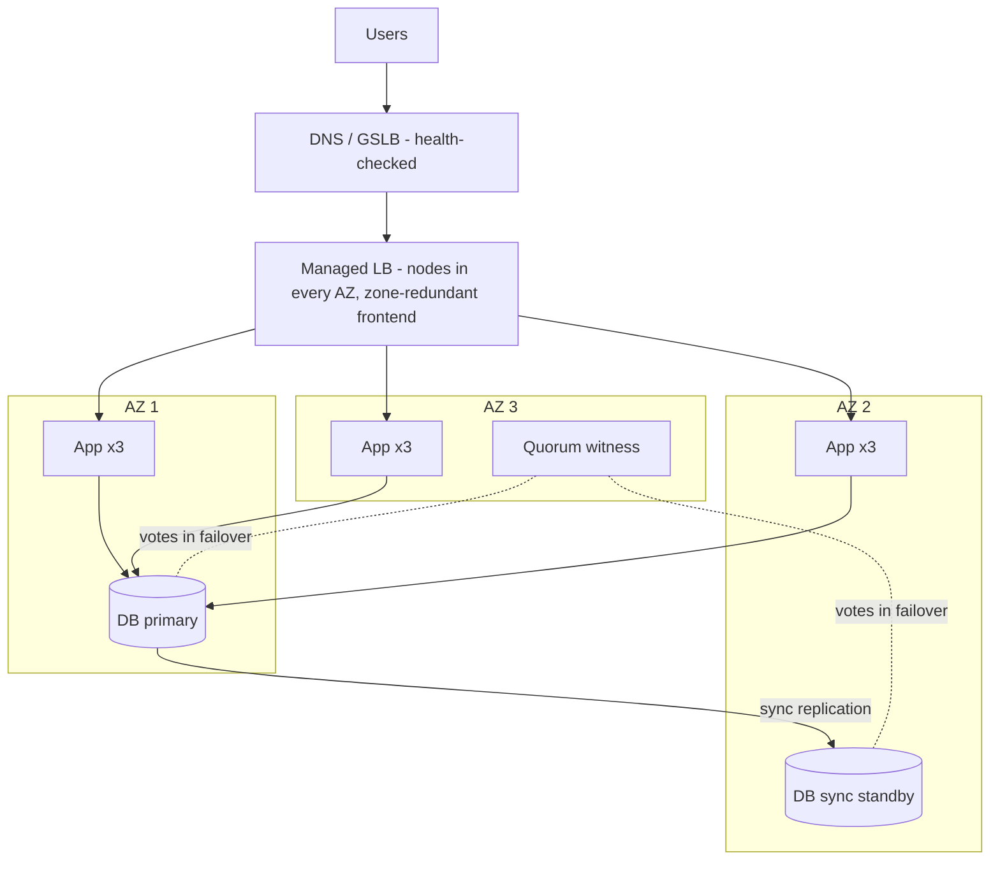
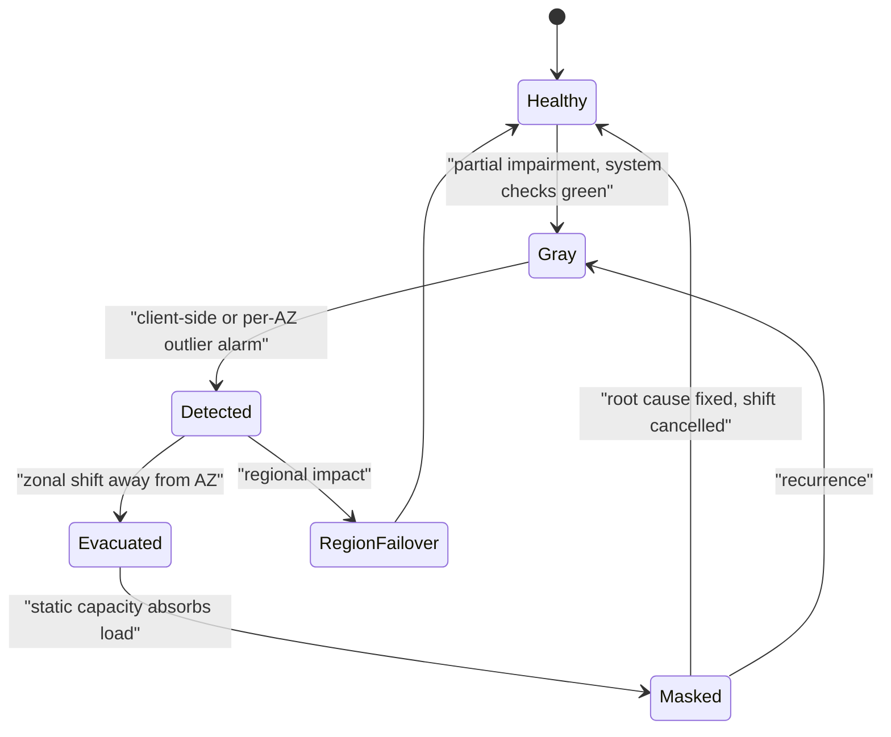
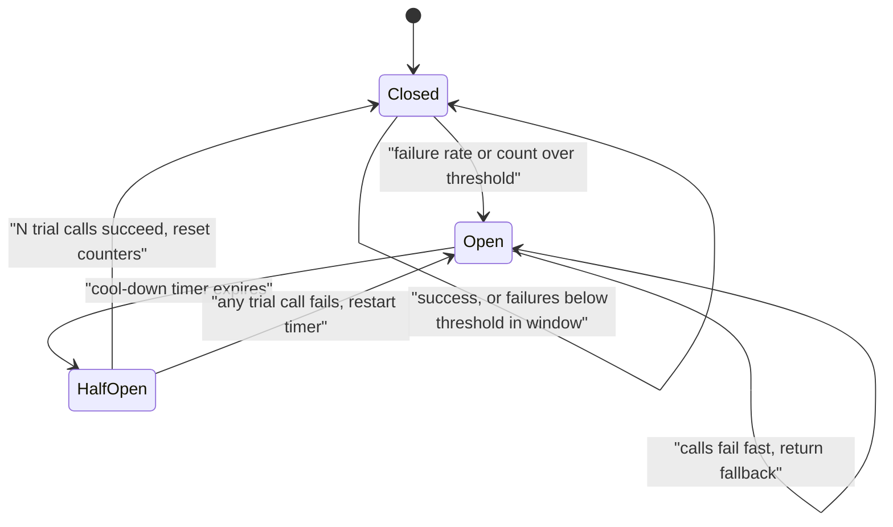
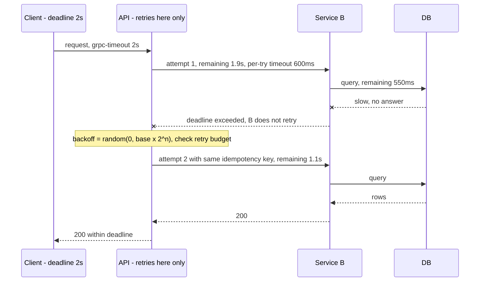
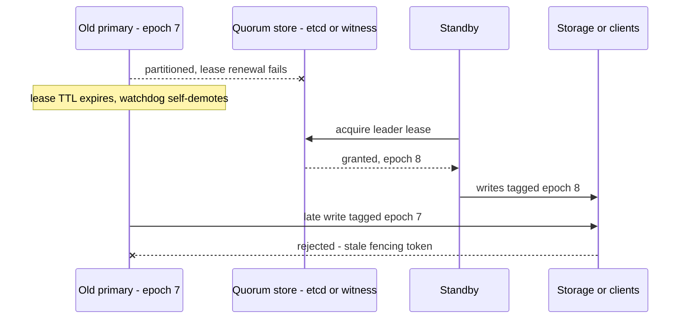
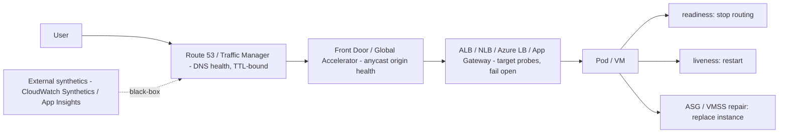

# C3 Reliability
> Last verified: 2026-10 · Audience: senior/staff DevOps, SRE, AI eng, NetEng, DevSecOps, architects

## TL;DR
- **Failures are normal at scale**: with 10,000 servers and a 3-year MTBF per server, you lose roughly 9 servers a day. Design for **partial failure**, not "up or down". The worst failures are **gray failures**, where the system's own health checks say green and clients see errors.
- **Reliability ≠ availability**. Reliability means doing the right thing without failure over a period (MTBF, correctness). Availability means being usable when needed: `A = MTBF / (MTBF + MTTR)`. **Cutting MTTR is usually cheaper than raising MTBF.**
- **The availability math is expected in interviews.** Serial (hard) dependencies multiply: `A = ∏Ai`. Parallel (redundant, independent) copies combine as `A = 1 − ∏(1−Ai)`. Two independent 99.9% copies give 99.9999%. **Correlated failures break the independence assumption**, which is why you need AZs and regions.
- **Redundancy vocabulary**: active-active vs active-passive (hot, warm or cold), **N+1 / N+M / 2N / 2N+1**. Stateless tiers are easy (put an LB in front and add instances). **Stateful tiers are hard**: replication, consensus, fencing, split-brain.
- **Remove SPOFs layer by layer**: instance → LB → DB → network → power → datacenter → AZ → region → control plane → humans and config. The LB itself must be redundant (VRRP/VIP, ECMP+anycast, or a managed multi-AZ LB).
- **Fault models** set what "tolerant" means: crash-stop < crash-recovery < omission < timing/performance (fail-slow) < **Byzantine**. Crash-tolerant consensus needs **2f+1** nodes. BFT needs **3f+1**.
- **Cloud model**: AWS AZs are independent DC groups up to about 100 km apart. **Azure** splits services into **zone-redundant, zonal and nonzonal**, has **paired vs nonpaired regions** (most new regions are nonpaired), and still has availability sets. SLAs reward multi-AZ: **EC2 99.5% per instance vs 99.99% across 2+ AZs**, and **Azure VM 99.9% single (Premium SSD) vs 99.95% availability set vs 99.99% across zones**.
- **Static stability** means pre-provisioning capacity so recovery needs no control-plane calls. Combine it with **cells** (D2.16), **ARC zonal shift/autoshift** (AWS), and **Chaos Studio zone-down drills / Resiliency in Azure** to prove it works.
- **Detection**: liveness probes restart, readiness probes stop routing, startup probes protect slow boots. Keep liveness shallow, and keep deep checks host-local. Every managed prober **fails open** when everything is unhealthy (ALB/NLB, Front Door, Route 53, Traffic Manager). Add **external synthetics** (CloudWatch Synthetics / App Insights Standard tests) and a dead man's switch. Inside clusters, use heartbeats/gossip (SWIM), leases + Raft (etcd 100 ms heartbeat / 1 s election) and adaptive **φ-accrual** detectors.
- **Failover**: in-region automatic failover with quorum + **fencing tokens** + witness (no split brain). Cross-region: automate the steps, let a human trigger, and use **data-plane controls** (ARC routing controls / Region switch, Front Door, Traffic Manager). Hot (RPO 0, seconds) → warm (RPO s–min, RTO min) → cold backups (RPO ≈ 5 min PITR, RTO hours; the only ransomware defense). Test regularly and avoid bimodal fallbacks.
- **Overload toolkit, in order**: timeouts (p99.9-based, budgets, deadline propagation) → retries (single layer, **exponential backoff + full jitter**, retry budget/token bucket, idempotency keys) → **circuit breaker** (closed/open/half-open) → **fail fast, admission control, priority load shedding, bulkheads**. Retry amplification of 3⁵ = 243× is the classic interview number.

## C3.1 Failures in large scale distributed systems
- **How it works:**
  - At scale, rare events become constant. With N components, each having per-period failure probability p, P(at least one fails) = `1 − (1−p)^N`. At p = 0.1% and N = 1,000 you get about 63%.
  - **Failure sources** (roughly ordered by how often they cause real outages): **changes** (deploys and config pushes cause most incidents), capacity/overload, dependency failures, network (partitions, packet loss, BGP), hardware (disk, NIC, memory ECC, PSU), software bugs (leaks, deadlocks, leap seconds, certificate expiry), operator error, and facility problems (power, cooling).
  - **The 8 fallacies of distributed computing** (Deutsch/Gosling): the network is reliable · latency is zero · bandwidth is infinite · the network is secure · topology doesn't change · there is one administrator · transport cost is zero · the network is homogeneous. Each one maps to a failure class: timeouts and retries, partitions, MTU/black holes, egress cost, version skew.
  - **Distributed-system failure properties**: you **cannot distinguish a slow node from a dead node** (FLP impossibility, asynchronous model). Messages can be lost, duplicated, reordered or delayed. Clocks drift. Failures are **partial and nondeterministic**.
  - **Cascading failure**: overload on one node → its traffic shifts to the others → they overload too. This is amplified by retries (retry storms), cache stampedes and thundering herds after recovery. See C3.29–C3.32.
  - **Metastable failure**: a trigger such as a load spike pushes the system into a bad state that keeps itself going (retries, queue growth, GC) even after the trigger is gone. Only shedding load gets you out.
- **Trade-offs / when to use:** more components bring more capacity and more redundancy, but also more failure surface and more coordination. Keep the dependency count on the critical path low (Azure WAF RE:03 says to minimize strong dependencies).
- **Interview angles:**
  - If asked "how do you design for failure?", say: assume every call can fail, hang or succeed twice → use timeouts, retries with backoff and jitter, idempotency keys, bulkheads, circuit breakers, graceful degradation and blast-radius limits (cells, AZs).
  - **Follow-up: "what causes most outages?"** Change: deploys, config and feature flags. That is why progressive delivery, bake time and automatic rollback are reliability features (see C5).
  - **Pitfall:** treating "the network is reliable" as true inside one VPC or VNet. Cross-AZ links, NAT/SNAT port exhaustion and conntrack tables all fail.

## C3.2 Partial system failures
- **How it works:**
  - **Partial failure** means some components, requests, shards, AZs or clients fail while the rest work. This is the normal state of a large system: some fraction of hosts is always unhealthy.
  - Types:
    - **fail-stop/crash**: clean, easy to detect
    - **fail-slow / limping**: degraded disk, a NIC dropping 1% of packets, CPU throttling
    - **partitions**: A can reach B, B cannot reach C, asymmetric routes
    - **data-dependent**: a poison message or "query of death" that crashes every replica it touches
    - **client-specific**: one tenant, one AZ pair, one route
  - **Gray failure** (Microsoft Research 2017, used by the AWS multi-AZ whitepaper) is defined by **differential observability**: the system's failure detector sees it as healthy while some consumers see it as unhealthy.
    - AWS example: a network impairment between AZ1 and AZ2 drops a percentage of DB connections from AZ1. EC2 status checks, the ASG, NLB health checks, Route 53 health checks and RDS all report healthy, yet the workload is failing.
    - Failures move between quadrants: **gray → detected → masked → gray** again until the root cause is fixed.
  - **Gray-failure options** (AWS): (1) wait it out, (2) **evacuate the AZ** (zonal shift), (3) fail over to another region. AZ evacuation has a lower RTO and RPO 0 for synchronously replicated in-region data, because cross-region replication in AWS services is asynchronous.
- **Trade-offs / when to use:**
  - **Deep health checks** catch more partial failures but can cause **fleet-wide false positives**: when a shared dependency blips, every host fails its check. Use shallow liveness checks plus deep readiness checks, and **fail open** when every target is unhealthy. ALB and NLB do this automatically, and ARC zonal shift has no effect while an LB is failing open.
  - **Outlier detection** compares a node or AZ against its peers, for example "AZ1 error rate 5× the others". It catches gray failures that absolute thresholds miss.
- **Interview angles:**
  - If asked "health checks are green but users see errors", say **gray failure** → measure from the client side (synthetic canaries, client-observed per-AZ error and latency), use outlier detection per AZ, then evacuate the AZ.
  - **Follow-up: poison pill / query of death.** Use shuffle sharding and cells to limit how many hosts one bad request can kill, and quarantine the offending request key.
  - **Pitfall:** averaging. The AWS example: one app's latency goes from 50 to 70 ms (+40%) but the system-wide average stays under the 60 ms alarm. Alarm on percentiles and on per-consumer or per-AZ dimensions.

## C3.3 Reliability
- **How it works:**
  - **Reliability** is the probability that the system performs its intended function correctly, without failure, for a given period under stated conditions. Classic model: `R(t) = e^(−λt)` with constant failure rate λ = 1/MTBF.
  - Metrics:
    - **MTBF/MTTF**: mean time between failures / to failure
    - **MTTR**: mean time to repair/recover
    - **MTTD**: mean time to detect
    - **MTTA**: mean time to acknowledge
    - Change failure rate (DORA)
  - Azure WAF definition: a reliable workload is **resilient** (absorbs failures and keeps an acceptable service level) and **recoverable** (gets back within its RTO/RPO).
  - **A system can be available but unreliable**: it is up but returns wrong or stale data or loses writes. **It can be reliable but unavailable**: it is correct whenever it is up but is often down for maintenance.
  - **Durability** (data not lost, e.g. S3's 11 nines design target) is separate from availability.
- **Trade-offs / when to use:**
  - Each extra nine costs roughly 10× more (SRE book "Embracing Risk"). 100% is the wrong target: users can't tell 99.99% from 99.999% through their ISP and device, and chasing it freezes feature velocity.
  - Set the target with **SLOs and error budgets** ([J1](../J-sre/J1-slis-slos-error-budgets.md)).
- **Interview angles:**
  - If asked "reliability vs availability", say: availability is a *measure* (uptime or successful requests). Reliability is the broader *property*, covering correctness, durability and consistency over time. AWS defines **resiliency** as the ability to recover from disruptions and mitigate them.
  - **Follow-up: improve MTBF or MTTR?** At scale, MTTR: automated detection, rollback and failover. You cannot stop hardware from failing.

## C3.4 Availability
- **How it works:**
  - **Time-based**: `A = uptime / total time`. **Request-based (aggregate)**: `A = successful requests / valid requests`. Google uses request success rate over rolling windows because global services are rarely fully up or fully down. AWS: measure in 1- or 5-minute buckets and average them for the month. A bucket with no requests counts as 100%.
  - **Estimate from MTBF and MTTR**: `A = MTBF/(MTBF+MTTR)`. AWS example: MTBF 150 days with MTTR 1 h gives 99.97%.
  - **Nines table** (downtime budget):

| Availability | Per year | Per 30-day month | Per week | Typical use (AWS WA examples) |
|---|---|---|---|---|
| 99% | 3d 15h 36m | 7h 12m | 1h 41m | Batch / ETL |
| 99.5% | 1d 19h 48m | 3h 36m | 50m | EC2 single-instance SLA level |
| 99.9% | 8h 45m 57s | 43m 12s | 10m 05s | Internal tools |
| 99.95% | 4h 22m 48s | 21m 36s | 5m 02s | E-commerce, POS |
| 99.99% | 52m 36s | 4m 19s | 1m 00s | Video delivery, broadcast |
| 99.999% | 5m 16s | 25.9s | 6.0s | ATM, telecom |
| 99.9999% | 31.6s | 2.6s | 0.6s | Rarely realistic end-to-end |

  - **Serial (hard dependency) composition**: `A = A1 × A2 × … × An`. AWS: three 99.99% systems in series give **99.97%**. Rule of thumb: add the *unavailabilities* (0.01% + 0.01% + 0.01%).
  - **Parallel (redundant, independent) composition**: `A = 1 − ∏(1 − Ai)`. Two 99.9% copies give 1 − 0.001² = **99.9999%**. AWS shortcut: if every value is all nines, add the nine counts.
  - **k-of-n** (N+1 capacity) uses the binomial sum: `A = Σ_{i=k..n} C(n,i)·A^i·(1−A)^(n−i)`. Example: 3 of 4 instances needed at 99% each gives ≈ 99.94%, not 99.999999%. Capacity redundancy is weaker than full redundancy.
  - **Soft dependencies** (failure is compensated by a cache, fallback or degraded mode) do not multiply into your availability.
- **Trade-offs / when to use:**
  - **The independence assumption is the trap.** Two VMs on the same rack, in the same AZ, with the same deploy or the same config share fate. Real composite availability is closer to the **availability of the shared component** (LB, DNS, IAM, deploy pipeline).
  - **Scheduled maintenance counts** as downtime from the user's point of view. AWS advises against excluding it.
  - **The SLA is a billing contract (service credits), not an engineering design target.** Design to an SLO above the SLA and an internal target above the SLO.
- **Interview angles:**
  - **Worked example**: LB 99.99% → app tier (3 instances at 99.9%, need 1) ≈ 99.99999% → single DB 99.95% → composite ≈ 99.99% × ~100% × 99.95% ≈ **99.94%**. The DB is the bottleneck, so make it Multi-AZ: 99.95% → ~99.99%+.
  - If asked "can you build 99.99% on a 99.9% dependency?", answer: only if it's a soft dependency, or you run redundant independent copies (multi-AZ or multi-provider), or you cache and serve stale data.
  - **Pitfall:** quoting "five nines" without saying where it's measured: server-side vs client-side, per request vs per minute, and whether partial outages count.

## C3.5 High Availability
- **How it works:**
  - **HA** means designing to minimize downtime from component failures, usually 99.9% or better. It needs **(1) redundancy, (2) failure detection, (3) automatic failover/recovery**, and no SPOF on the critical path.
  - **HA vs DR**: HA handles in-region, component- or AZ-level failures automatically with RTO of seconds to minutes and RPO ≈ 0 (synchronous replication). **DR** handles region loss, corruption or ransomware with RTO of minutes to hours and RPO > 0 (asynchronous replication or backup). See C3.24–C3.26 and [D1.23 DR](../D-system-design/D1-system-design-basics.md#d123-disaster-recovery-rpo-vs-rto).
  - Building blocks: an LB with health checks, autoscaling/self-healing groups (ASG, VMSS), replicated data stores (RDS Multi-AZ, Azure SQL zone-redundant), quorum systems (etcd, ZooKeeper, Raft), and DNS/anycast failover.
  - **Graceful degradation** is part of HA: serve read-only, stale cache or reduced features instead of a hard failure. In the Azure FMA example, the recommendation engine goes down but checkout still works.
- **Trade-offs / when to use:**
  - HA costs money (idle or over-provisioned capacity, cross-AZ data transfer: AWS charges inter-AZ, Azure doesn't) and complexity (failover bugs). Many outages *are* failover bugs.
  - Within one region, synchronous replication across AZs is affordable: about **<2 ms RTT** between zones on Azure, "single-digit ms" on AWS.
- **Interview angles:**
  - If asked "design X for HA", walk the stack: DNS → edge/CDN → LB (multi-AZ) → stateless app (≥ 2 per AZ, N/(N−1) over-provisioned) → cache (replicated) → DB (sync standby in another AZ) → queue (replicated) → observability and runbooks.
  - **Follow-up: active-passive failover time.** Detection (3 × 10 s health checks = 30 s) + promotion + DNS TTL / client reconnect. RDS Multi-AZ instance failover is typically 60–120 s (verify per engine).

## C3.6 Fault Tolerance
- **How it works:**
  - **Fault → error → failure** chain (Avižienis/Laprie): a **fault** (bug, bit flip, dead disk) can cause an **error** (wrong internal state), which can cause a **failure** (deviation visible to users). **Fault tolerance** stops faults from becoming failures.
  - Azure WAF: *failures* are unexpected events that need specific design for that class of failure. *Errors* are expected and handled inline, for example by input validation.
  - **FT vs HA**: fault tolerance means **zero interruption**. Redundancy is active and masks the fault, as in RAID-1, lockstep CPUs, a 2N power path, or a quorum write that succeeds with one replica down. HA means **brief interruption** during failover. FT costs more (2N or more, plus synchronous coordination).
  - Techniques:
    - **masking redundancy**: replication, voting, TMR
    - **error detection and correction**: checksums, ECC, erasure coding
    - **retries** (time redundancy)
    - **checkpoint/restart**
    - **idempotency**
    - **process pairs**
    - **supervision trees** (Erlang "let it crash")
- **Trade-offs / when to use:** use FT for the data plane of critical paths (storage, payment, control loops) and HA for most web tiers. Fault tolerance in one layer can hide faults until they pile up (latent faults). Monitor redundancy loss, e.g. "running on 1 of 2 PSUs".
- **Interview angles:**
  - If asked "HA vs fault tolerance", say: HA accepts short downtime during failover, while FT masks the fault with no visible interruption. Give the examples Multi-AZ RDS failover (HA) vs a 3-replica quorum write in Aurora, DynamoDB or Cosmos DB (FT for a single replica loss).
  - **Pitfall:** "we have 2 replicas so we're fault tolerant". Not if the failover is manual, untested, or both replicas share a dependency.

## C3.7 Fault tolerant design
- **How it works:** principles drawn from the AWS WA reliability pillar and Azure WAF RE:03–RE:05:
  - **Failure mode analysis (FMA)**: decompose into flows → list dependencies (strong vs weak) → evaluate failure modes per component (region outage, AZ outage, service outage, DDoS, misconfiguration, operator error, maintenance, overload) → estimate likelihood and blast radius → plan mitigations → plan detection. Analyze **reads and writes separately**.
  - **Isolation / bulkheads**: separate pools per dependency or tenant. **Cells** and **shuffle sharding** limit blast radius ([D2.16](../D-system-design/D2-reusable-parts-of-system-design.md#d216-cell-based-architecture)).
  - **Static stability**: no control-plane calls on the recovery path (C3.15).
  - **Timeouts everywhere, bounded retries with jitter, circuit breakers, load shedding** (C3.29–C3.32).
  - **Idempotent APIs** so retries are safe. Use **constant work** patterns, where the system does the same work in steady state and in failure, so failure doesn't create a load spike.
  - **Loose coupling** through queues, so a consumer outage turns into backlog instead of errors.
  - **Graceful degradation / fallbacks** for weak dependencies. Prefer **fail-open vs fail-closed** depending on security impact: authz should fail closed, a recommendation widget can fail open.
  - **Avoid bimodal behavior**: fallback paths that are rarely used are rarely tested, so the fallback becomes the outage.
- **Trade-offs / when to use:** every mechanism adds code, cost and new failure modes. Prioritize by severity × likelihood, as in the Azure FMA table. Don't build mitigations beyond redundancy for very unlikely events such as multi-region outages unless the business requires it.
- **Interview angles:**
  - If asked "walk me through making service X fault tolerant", do an FMA table out loud: component, failure mode, likelihood, effect, mitigation, detection.
  - **Follow-up: strong vs weak dependency.** A strong dependency's availability caps yours (multiply). A weak one should be wrapped in a timeout, breaker and fallback.

## C3.8 Redundancy
- **How it works:**
  - Azure definition: redundancy means maintaining multiple identical copies of a component so that no single one is a SPOF. **Replication** is redundancy for data. **Backup** is a point-in-time copy for restoring after loss or corruption.
  - **Replication ≠ backup**: a deletion or corruption replicates everywhere. You need both.
  - **Physical scopes** and their risks (Azure): disk/server → hardware failure. Rack → ToR switch. Datacenter → cooling or power. AZ → city-scale event. Region → widespread disaster. Redundancy only protects against risks *below* the scope it spans. Matching tiers:
    - **local** (LRS: 3 copies in one DC)
    - **zone** (ZRS)
    - **geo** (GRS/GZRS, asynchronous to the paired region)
  - Redundancy needs consistent configuration (IaC), distribution of work (LB or leader), health monitoring, and **over-provisioning**. Azure's formula: provision `peak × N/(N−1)` across N zones and round up.
    - 3 zones at peak 6 → 9 instances
    - 4 zones at peak 10 → 14 instances
- **Trade-offs / when to use:** cost and the latency of wider spread vs the blast radius covered. Synchronous replication across distance adds latency to writes. Asynchronous replication gives RPO > 0.
- **Interview angles:**
  - If asked "how many instances for zone failure tolerance?", use **N/(N−1)**: 3 AZs means 1.5× peak, 2 AZs means 2× peak. That is why 3 AZs is cheaper than 2 for the same tolerance.
  - **Pitfall:** redundancy without diversity. Identical software brings correlated bugs, such as a leap-second bug or the same bad config pushed to every replica.

## C3.9 Types of redundancy
- **How it works:**

| Type | Meaning | Failover | Cost | Example |
|---|---|---|---|---|
| **Active-active** | All copies serve live traffic | None (LB stops routing to the failed copy) | High utilization, capacity must absorb the loss | Stateless web tier across 3 AZs; Cosmos DB multi-region writes |
| **Active-passive (hot standby)** | Standby running, data synchronized, no traffic | Seconds–minutes, automatic | ~2× for that tier | RDS Multi-AZ instance, SQL AG sync secondary |
| **Warm standby** | Standby running scaled-down, async data | Minutes, scale-up needed | Medium | DR region with minimal fleet |
| **Cold standby / pilot light** | Infra defined or data only, compute off | Minutes–hours | Low | Backup and restore, pilot light DR |
| **N+1** | N needed + 1 spare | Absorb 1 failure | +1/N | 4 nodes for a load needing 3 |
| **N+M** | N needed + M spares | Absorb M failures | +M/N | Large fleets, e.g. N+2 during maintenance |
| **2N** | Fully mirrored independent system | Whole path redundant | 2× | Dual power feeds A/B, Uptime Tier IV |
| **2N+1** | Mirrored + one spare | Survives a failure during maintenance | >2× | Critical facilities |

  - Other dimensions:
    - **Spatial** vs **temporal** redundancy (retries)
    - **information** redundancy (parity, ECC, erasure coding: a 6+3 Reed-Solomon code tolerates 3 losses at 1.5× storage vs 3× for replication)
    - **design diversity** (N-version programming, multi-vendor)
    - **geographic** redundancy (multi-AZ / multi-region)
  - **Uptime Institute tiers**:
    - Tier II: redundant components
    - Tier III: **concurrently maintainable**, N+1
    - Tier IV: **fault tolerant**, 2N
- **Trade-offs / when to use:**
  - Active-active gives the best RTO and utilization, but you must handle **concurrent writes and conflicts** for state, and every copy must be able to take the failed copy's share.
  - Active-passive is simpler for state, but the passive side is untested capacity ("is the standby actually working?"). Do regular failover drills.
- **Interview angles:**
  - If asked "N+1 vs 2N", say: N+1 covers one component failure. 2N covers a whole-path failure, such as an entire power or network side. Concurrent maintainability needs at least N+1 *while* maintenance is running, otherwise maintenance plus one failure takes you down.
  - **Follow-up: "active-active across regions for a SQL DB?"** Usually no. Prefer single-writer with region-local reads, or partition writes by home region. Multi-master needs conflict resolution (last-writer-wins, CRDTs).

## C3.10 Single point of failures
- **How it works:**
  - A **SPOF** is any component whose failure alone stops the service. Find SPOFs by tracing each critical flow and asking "if this disappears, does the flow fail?" (Azure FMA).
  - **Commonly missed SPOFs**:
    - the LB or NAT gateway (AWS NAT GW is zonal, so you need one per AZ)
    - a single DB primary without automatic failover
    - DNS provider, CA/OCSP, certificate expiry
    - identity provider (Entra ID / IAM / IdP)
    - secrets store (Key Vault, Secrets Manager) at startup
    - **control planes** (deploying or scaling during an incident)
    - CI/CD pipeline, config service, feature-flag service
    - a single Direct Connect/ExpressRoute circuit or a single router
    - a shared Redis
    - license servers
    - a single on-call person or tribal knowledge
    - **global config** (one bad push hits every region)
    - time sync (NTP)
    - a cron leader with no failover
  - Azure LB doc example: a zone-redundant LB with every backend VM in zone 1 still has a SPOF (the zone).
- **Trade-offs / when to use:** you can't remove every SPOF (the business, the cloud provider). Make residual SPOFs very reliable and fast to recover, and document them as accepted risks.
- **Interview angles:**
  - If asked "find the SPOFs in this diagram", check LB, DB, cache, queue, NAT/egress, DNS, auth, secrets, deploy and config path, monitoring (who alerts if monitoring is down? → external monitoring, C3.18), and people.
  - **Pitfall:** hidden shared dependencies in "redundant" designs, e.g. two app clusters reading the same config bucket or the same KMS key.

## C3.11 Stateless component redundancy
- **How it works:**
  - Stateless components (web/API servers, workers that pull from queues) keep no unique data, so any instance can serve any request. Redundancy = **N identical instances + an LB/queue + health checks + autoscaling or self-healing** (ASG, VMSS, K8s Deployment with replicas ≥ 2–3).
  - **Push state out**: sessions go to Redis or DynamoDB or into a signed cookie/JWT, files go to object storage, caches are disposable. **Sticky sessions** create soft state, and losing a node loses its sessions.
  - Spread instances across AZs (K8s `topologySpreadConstraints` on `topology.kubernetes.io/zone`, ASG AZ rebalancing, VMSS `zones` with zone balance). Use a **PodDisruptionBudget** so voluntary disruptions keep a minimum running.
  - Immutable images and IaC keep instances identical. Configuration drift is a hidden form of state.
- **Trade-offs / when to use:** cheap and horizontally scalable. Watch cold-start and scale-out latency (so pre-provision for static stability) and connection draining on scale-in (deregistration delay, default 300 s on ALB/NLB target groups).
- **Interview angles:**
  - If asked "how do you make the web tier HA?", say: ≥ 2 instances per AZ across ≥ 2 (better 3) AZs, sized N/(N−1), stateless sessions, LB health checks, self-healing group, rolling or blue-green deploys.
  - **Follow-up: "is a queue worker stateless?"** Yes, if work items are idempotent and use visibility timeouts or acks. In-flight work is redelivered when a worker dies.

## C3.12 Stateful component redundancy
- **How it works:**
  - Stateful components (databases, caches holding the only copy, brokers, consensus stores) need **replication**, and replication forces choices:
    - **Sync vs async**: synchronous gives RPO 0 and adds latency. Async gives RPO > 0 and low latency. Semi-sync is a middle ground (MySQL).
    - **Topology**: single-leader (primary/standby), multi-leader, leaderless quorum (Dynamo-style, `W + R > N`).
    - **Failover**: who decides the primary is dead? Use **consensus/quorum** (Raft, Paxos, etcd, ZooKeeper, Patroni with a DCS, SQL AG with WSFC quorum) so that only one primary exists.
  - **Split brain**: both nodes think they are primary, often after a partition, and accept divergent writes. Prevent it with:
    - a **quorum/majority** (odd nodes, or a witness/tiebreaker in a third AZ)
    - **fencing** (STONITH, fencing tokens/epochs, revoking storage access)
    - **leases**
  - **Quorum sizing**: tolerating f crash failures needs **2f+1** voters. 3 nodes tolerate 1, 5 tolerate 2. A 2-node cluster can't form a majority after one failure, so add a witness. Placement: 3 voters across 3 AZs.
  - Managed examples:
    - RDS Multi-AZ instance: synchronous standby, no reads
    - RDS Multi-AZ DB cluster: 2 readable standbys
    - Aurora: 6 copies across 3 AZs, write quorum 4/6, read quorum 3/6
    - Azure SQL zone-redundant
    - Azure Cache for Redis zone-redundant
  - Full detail in [B8 Replication](../B-database-engineering/B8-database-replication.md) and [C2.10](./C2-scalability.md#c210-database-replication).
- **Trade-offs / when to use:** CAP/PACELC. In a partition, choose consistency (reject writes on the minority side) or availability (accept and reconcile later). Under normal operation, trade latency against consistency.
- **Interview angles:**
  - If asked "how do you avoid split brain?", say: majority quorum + fencing tokens checked by the storage layer + witness in a third failure domain. Never let "can't reach the primary" alone trigger promotion.
  - **Follow-up: why not 2 or 4 nodes?** Even counts add cost without adding tolerance. 4 nodes still tolerate only 1 failure.
  - **Pitfall:** async replica promotion loses the last few seconds of writes (RPO > 0). Say so explicitly and reconcile, or use synchronous commit in-region.

## C3.13 Load balancer redundancy
- **How it works:** the LB is on every request's path, so it must not be a SPOF. Patterns:
  - **Active-passive VIP with VRRP** (keepalived, RFC 5798): two LBs share a floating IP. The backup takes over after missing about 3 advertisements (default 1 s interval → ~3 s), using gratuitous ARP. It is L2-bound, so it doesn't work as-is in cloud VPCs. There you'd use secondary-IP moves or route-table updates via API, which is slower and depends on the control plane.
  - **Active-active with ECMP + BGP anycast**: several LB nodes announce the same VIP. Routers hash flows across them, and a failed node withdraws its route. **Consistent hashing / Maglev** keeps flows stable when membership changes. Used by Google Maglev, Cloudflare, and Azure LB / global LB.
  - **DNS-level**: multiple LB IPs in DNS plus health-checked DNS failover (Route 53, Traffic Manager). Slower, because TTL and client caching delay the change.
  - **Managed cloud LBs are already redundant**:
    - **ALB** needs ≥ 2 AZs and has nodes in each enabled AZ, one DNS IP per AZ. **NLB** has one static IP/EIP per AZ.
    - **Azure Standard LB zone-redundant frontend** serves from multiple zones on one IP, and a zone failure only resets in-flight flows. Microsoft recommends zone-redundant for all workloads.
    - **Basic LB is retired (2025-09-30)**.
  - **Cross-zone load balancing**: ALB is on by default (can be disabled per target group). NLB/GWLB are off by default. With cross-zone off, an AZ with few healthy targets gets an equal share and gets overloaded.
- **Trade-offs / when to use:** VRRP is simple on-prem but is active-passive and L2-scoped. ECMP/anycast scales out but needs BGP and flow-consistent hashing. For L4 vs L7 details see [C2.26](./C2-scalability.md#c226-layer-7-load-balancers) and [D1.3](../D-system-design/D1-system-design-basics.md).
- **Interview angles:**
  - If asked "who load-balances the load balancer?", answer DNS (multiple A records / GSLB) → anycast/ECMP routers → LB fleet → backends. Each layer is redundant on its own.
  - **Follow-up: health-check failure modes.** All targets unhealthy leads to **fail-open** (ALB/NLB route to all). A deep health check tied to a shared DB can drain the whole fleet.

## C3.14 Datacentre infrastructure as SPOF
- **How it works:**
  - A single datacenter shares fate through:
    - **power**: utility feed, ATS, UPS, generators, fuel contracts
    - **cooling**: CRAC/chillers. Heat events have caused real cloud outages
    - **network**: ToR → spine; carrier fiber laterals, where one backhoe cut can take out "diverse" paths in the same conduit
    - **fire suppression**
    - **building access**
    - **natural hazards**: flood, quake, storms
    - **human/operational error**: maintenance mistakes
  - Inside a DC, redundancy is designed in (2N power A/B feeds, N+1 cooling, dual ToR/MLAG). But the **building is still a single shared-fate domain**.
  - Above the DC there are logical SPOFs too: **regional control planes** and **global services**. Several AWS global services keep their control plane in a single region (e.g. IAM, Route 53, CloudFront control planes in us-east-1), while their data planes are globally distributed. Recovery plans should rely only on data planes.
- **Trade-offs / when to use:** a single DC with redundant internals reaches roughly Tier III/IV *facility* availability but no protection against site-level events. Accept that only for non-critical or latency-bound workloads (e.g. HPC/training clusters in one placement group, with checkpointing to durable storage).
- **Interview angles:**
  - If asked "why isn't one Tier IV datacenter enough?", say: correlated site risks (fire, flood, utility outages, operator error, bad network change) bypass internal redundancy. You need **independent failure domains**, i.e. AZs.
  - **Pitfall:** proximity placement groups / cluster placement groups put everything in one DC to cut latency, and that recreates the SPOF.

## C3.15 Creating datacenter redundancy
- **How it works:**
  - **Availability zones**: separate DC groups within a region with independent power, cooling and networking, close enough for synchronous replication.
    - **AWS**: AZs "up to 60 miles (~100 km)" apart, single-digit-ms latency, separate substations, deploys staggered across AZs, each AZ reaches the internet through 2 transit centers. Over 100 AZs globally. New regions launch with ≥ 3 AZs.
    - **Azure**: zones usually within 100 km, **< ~2 ms RTT target**, 3 zones in most AZ-enabled regions (East US 2 has a 4th zone in preview). **No charge for inter-zone data transfer** (AWS does charge).
  - **Logical vs physical zone mapping**: AWS AZ *names* (us-east-1a) map per account, so use **AZ IDs** (use1-az1) to align across accounts. Azure logical zones 1/2/3 map per subscription, so check with `az account list-locations` / Check Zone Peers API.
  - **Multi-region**: protects against region-wide failure and regional control-plane failure. Cross-region replication is **asynchronous** (RPO > 0). Multi-region costs much more and must be failover-tested.
  - **Static stability** (AWS): systems keep running unchanged when a dependency fails. Pre-provision capacity in the surviving AZs instead of relying on the control plane to launch instances during an AZ event. Control planes are statistically more likely to fail than data planes. Running EC2 instances, S3 objects and EBS volumes have no control-plane dependency.
  - **Cell-based architecture**: replicate the whole stack into independent cells (often zonal), routing by a thin layer. Blast radius = 1 cell. See [D2.16](../D-system-design/D2-reusable-parts-of-system-design.md#d216-cell-based-architecture).
  - **AZ evacuation**: shift traffic away from an impaired AZ, e.g. **ARC zonal shift** (AWS). Azure options are in the cloud mapping below.
- **Trade-offs / when to use:**
  - Multi-AZ should be the **default for production** (both providers say so). Multi-region is for mission-critical work, regulatory needs, or region-level RTO.
  - Data-residency-bound workloads that can't leave the region: multi-AZ plus backups is the main tool.
- **Interview angles:**
  - If asked "multi-AZ or multi-region?", say: multi-AZ covers most failures with RPO 0 and low cost. Multi-region covers region and control-plane failure, at the price of async RPO, more cost and complexity, and failovers that need practice. Decide from RTO/RPO and business impact.
  - **Follow-up: why 3 AZs?** Quorum (2 of 3 survives one AZ) and lower over-provisioning (1.5× vs 2×).

## C3.16 Fault models
- **How it works:**

| Model | Behavior | Detectable? | Tolerating f faults needs |
|---|---|---|---|
| **Fail-stop** | Halts, and others can reliably detect it | Yes (assumed perfect detector) | f+1 replicas (primary-backup) |
| **Crash-stop** | Halts permanently, no reliable detection (async network) | Only by timeout | 2f+1 for consensus (Paxos/Raft) |
| **Crash-recovery** | Crashes, restarts with durable state (WAL), may miss messages | Timeout | 2f+1 + stable storage |
| **Omission** (send/receive) | Drops some messages, otherwise correct | Hard | Retries, acks, sequence numbers |
| **Timing / performance (fail-slow)** | Correct output but too late | Timeouts / latency SLOs | Hedged requests, timeouts, outlier ejection |
| **Byzantine (arbitrary)** | Any behavior incl. corrupt, inconsistent or malicious messages | Very hard | **3f+1** (PBFT); f+1 matching replies |
| **Gray failure** (practical) | Partial, **differential observability** | Only from consumers' vantage | Client-side detection + evacuation |

  - **Network models**: synchronous (bounded delay), **asynchronous** (unbounded delay; FLP says no deterministic consensus is guaranteed even with one crash), and **partially synchronous** (eventually bounded, which is what Raft and Paxos assume for liveness).
  - **Byzantine in practice**: bit flips/silent data corruption (use end-to-end checksums), buggy nodes sending contradictory data, blockchains, aerospace. Most datacenter systems assume **crash-recovery + omission** and add checksums to guard against corruption.
- **Trade-offs / when to use:** stronger fault models mean more replicas, more messages and more latency (BFT is O(n²) messages). Pick the weakest model that matches your real threats: crash-recovery for internal services, Byzantine-ish defenses (signatures, checksums, validation) at trust boundaries.
- **Interview angles:**
  - If asked "why does Raft need 3 nodes and PBFT 4?", explain: crash faults need a majority that overlaps (2f+1). Byzantine faults need overlap of at least f+1 *honest* nodes, so 3f+1.
  - **Follow-up: "how does a node know another is dead?"** It can't know for certain, only suspect via timeouts (failure detectors, phi-accrual). That is why fencing and epochs matter.
  - **Pitfall:** designing only for crash-stop. Real incidents are mostly fail-slow and gray: a disk at 10% speed or a 1% packet loss.

## C3.17 Health checks
- **How it works:**
  - A **health check** is a periodic probe (TCP connect, HTTP GET/HEAD, gRPC `grpc.health.v1.Health/Check`, or exec) whose result drives an action: remove the target from rotation, restart it, replace it, or fail DNS over.
  - **Kubernetes has three probe types**, and each one does something different:

| Probe | Question it answers | Action on failure | Typical check |
|---|---|---|---|
| **startupProbe** | "Has the app finished booting?" | Restart the container. Liveness and readiness are held off until it passes | Same as liveness, with a high `failureThreshold` (e.g. 30 × 10 s = 5 min budget) |
| **livenessProbe** | "Is the process stuck (deadlock, wedged event loop)?" | **Restart** the container | **Shallow**: in-process only, never checks dependencies |
| **readinessProbe** | "Should this pod get traffic *now*?" | **Remove from Service endpoints**. No restart | May be **deeper**: warm caches, connection pool, critical local deps. Fail it during graceful shutdown |

  - **K8s defaults**: `periodSeconds 10`, `timeoutSeconds 1`, `failureThreshold 3`, `successThreshold 1`, `initialDelaySeconds 0`. Mechanisms: `httpGet` (200–399 counts as success), `tcpSocket`, `exec`, `grpc`.
  - **Shallow vs deep**:
    - **Shallow** (process up, port open, `/healthz` returns 200 from memory). Cheap, few false positives, but misses dependency or gray failures.
    - **Deep** (exercises DB, cache, downstream). Catches more, but a shared-dependency blip **fails the whole fleet at once**. Builders' Library advice: deep checks should only fail for problems *local to the host* (disk full, bad config, dead local process). Shared-dependency problems should go to alarms, not to the "remove from LB" decision.
  - **Managed probe defaults** (verify per SKU before quoting):

| Prober | Interval | Timeout | Unhealthy / healthy threshold | Success | All-unhealthy behavior |
|---|---|---|---|---|---|
| **ALB** target group | 30 s (5–300) | 5 s (2–120) | 2 / 5 | `200` (configurable 200–499; gRPC default code 12) | **Fail open**: routes to all targets |
| **NLB** target group | 30 s | 6 s HTTP, 10 s TCP/HTTPS | 2 / 5 | 200–399 | Removes that AZ's IP from DNS when the AZ has no healthy targets. Fails open if *all* AZs are unhealthy. Distributed probers reach **consensus**, so targets see more probes than the interval implies |
| **Azure Load Balancer** (Standard) | 5 s in portal, **15 s** via ARM/CLI (min 5) | HTTP 30 s; TCP = interval | Threshold applies to timeouts. HTTP 200 / non-200 flip state immediately | HTTP 200 only | No new flows. **Established TCP flows continue** (Basic, now retired, killed them). Probes come from **168.63.129.16** (`AzureLoadBalancer` tag) |
| **Azure App Gateway** default probe | 30 s | 30 s | 3 | 200–399 (custom: status and body match) | Backend marked unhealthy → **502**. `MinServers` can force N servers to count as healthy (dangerous) |
| **Azure Front Door** | configurable (doc's volume estimate assumes 30 s); **HEAD** by default on new profiles | — | `SampleSize` / `SuccessfulSamplesRequired` | **200 only** | Round-robin across all origins (fail open). Every edge POP probes, so probe volume ≈ POPs × 2/min at 30 s |
| **Route 53** health check | **30 s standard, 10 s fast** (extra cost) | TCP connect 4 s + 2 s to first byte (HTTP) | Failure threshold (default 3) | 2xx/3xx. Optional string match in the **first 5,120 bytes** | Healthy if **>18% of global checkers** say healthy. If all records are unhealthy, Route 53 treats all as healthy |
| **Traffic Manager** | **30 s normal, 10 s fast** | 10 s (5–10); 9 s when interval is 10 s | Tolerated failures **0–9, default 3** | 200 by default, up to 8 custom ranges | "All Degraded" → returns all endpoints anyway (best effort) |

  - **Route 53 vs Traffic Manager**: both are **DNS-level** health-checked routing (failover/priority, weighted, latency/performance, geo, multivalue). The real differences:
    - Route 53 adds **calculated health checks** (up to 255 children with AND/OR/N-of-M logic), **CloudWatch-alarm-based checks** (health from metrics, which also works for private endpoints), and string matching. Route 53 HTTPS checks **don't validate certificates**.
    - Traffic Manager has **nested profiles** (needed for per-endpoint monitor settings), custom headers (up to 8), and status-code ranges. It **can't probe private IPs** (forced to "Always serve").
    - **Failover time** for both ≈ interval × threshold + DNS TTL + client resolver caching. TM default: 30 s × (3+1) + 30 s TTL ≈ 2.5 min.
- **Trade-offs / when to use:**
  - Liveness should be **very conservative** (high `failureThreshold`). An over-eager liveness probe under load restarts healthy-but-busy pods, which increases load on the rest, so they restart too: a **restart cascade**.
  - **Health-check priority**: health requests must bypass the request queue and load shedding. Otherwise an overloaded host fails its check and dumps load onto peers (Builders' Library).
  - **Hysteresis**: slow to mark healthy (ALB needs 5 successes) and faster to mark unhealthy (2 failures) prevents flapping. Azure LB adds extra wait for fluctuating probes.
  - Use the **same port and path as real traffic** where possible. A probe on a sidecar port can be green while the app is dead.
- **Interview angles:**
  - If asked "liveness vs readiness", say: liveness → restart, so make it shallow and never include dependencies. Readiness → stop routing, can be deeper. Startup → protects slow boots from liveness kills.
  - **Follow-up: "should /health check the database?"** Not for liveness. For LB readiness only if the failure is host-local (e.g. this host's connection pool is broken). Otherwise you get a fleet-wide drain, which the LB's **fail-open** behavior is there to rescue you from.
  - **Pitfall:** NSG or firewall rules blocking the prober (Azure 168.63.129.16, Traffic Manager/Front Door service tags, Route 53 checker ranges) mark everything down. With TM or Route 53 everything then fails *open*, which **silently disables failover**.

## C3.18 External monitoring service
- **How it works:**
  - **Black-box monitoring from outside your failure domain**: it tests what users see (DNS → TLS → LB → app) from many locations. It catches what internal metrics miss: DNS/cert expiry, CDN/edge issues, BGP or ISP problems, full-region outages where your own monitoring is also down. Google SRE calls this **black-box vs white-box** monitoring: black-box is symptom-oriented, white-box is cause-oriented.
  - **Synthetic types**: ping/heartbeat (HTTP 200 + latency), API multi-step (login → create → read → delete), browser/UI flow (headless browser), TLS cert expiry checks, broken-link and visual-diff checks.
  - **AWS CloudWatch Synthetics canaries**:
    - scripts in Node.js, Python or Java, running as Lambda functions in your account
    - **Playwright, Puppeteer or Selenium** for browser flows
    - schedule as often as **1/min** (cron or rate)
    - can run **inside a VPC** for private endpoints
    - multilocation canaries, screenshots and HAR files, X-Ray traces
    - integrated with **Application Signals** SLOs
  - **Azure Application Insights availability tests**:
    - **Standard tests** (single request; verb, headers, body; **TLS validity + proactive cert-lifetime check**)
    - up to **100 tests per resource**, **5–16 locations** (≥ 5 recommended)
    - default frequency 5 min per location, which with 5 locations averages one test per minute
    - optional retries (failure only after 3 consecutive failed attempts; about 80% of failures disappear on retry)
    - alert threshold recommendation: **locations − 2** (e.g. 3 of 5)
    - **URL ping tests are deprecated. Retirement was extended from 2026-09-30 to 2028-09-30.** `TrackAvailability()` custom tests are archived classic guidance. Multi-step web tests are long retired (Visual Studio load test deprecation).
    - private endpoints: no in-VNet agents, so alert on an internal signal instead, or use a custom header to authenticate probes through the firewall
  - **Route 53 health checks / Traffic Manager probes** double as cheap external uptime monitors with CloudWatch / Azure Monitor alarms.
  - **Who watches the watcher?** Use a **dead man's switch**: Prometheus's always-firing `Watchdog` alert → Alertmanager → an external heartbeat service that pages when the heartbeat *stops*. Host the monitoring stack in a different region/account or with a different provider from production.
- **Trade-offs / when to use:**
  - Synthetics give consistent, low-volume coverage: they catch outages at 3 a.m. with zero traffic, and they verify a deploy before users arrive. But they test only scripted paths and can be flaky (need retries and N-of-M location logic).
  - **RUM** (real-user monitoring: CloudWatch RUM, App Insights browser SDK) covers the long tail of real paths and devices but needs traffic. **Use both.**
  - Probing from the same cloud and region as the app shares fate with it. Third-party vantage points (Datadog, Checkly, Catchpoint, Cloudflare health checks) add **provider diversity**.
- **Interview angles:**
  - If asked "how do you know you're down if your monitoring is in the same region?", answer: external synthetics from multiple providers/regions + a dead man's switch + status signals from the cloud provider (AWS Health, Azure Service Health/Resource Health).
  - **Follow-up: alert on one failed location?** No. Require N-of-M locations (Route 53's 18%, App Insights locations − 2) to filter vantage-point network noise.
  - **Pitfall:** synthetic traffic polluting business metrics and SLOs. Tag it with a header or user agent, and decide whether it counts toward the SLI.

## C3.19 Internal cluster monitoring
- **How it works:** cluster members watch each other so the cluster can reassign work, elect a leader and keep membership up to date:
  - **Heartbeats**: periodic "I'm alive" messages. All-to-all is O(n²) and only fine for small clusters. Centralized (members → master/coordinator) is simple, but the coordinator must be HA.
  - **Gossip / SWIM** (Serf/Consul memberlist, Cassandra, Redis Cluster bus): each node pings a random peer. On timeout it asks **k other nodes to probe indirectly** (avoids false positives from one bad link), then marks the node *suspect* before *dead*, and spreads that by gossip. Per-node load is O(1) and dissemination takes O(log n) rounds. **Lifeguard** (HashiCorp) adds local-health awareness so a slow detector doesn't accuse healthy peers.
  - **Leader election / leases**: a consensus store (etcd, ZooKeeper, Consul) grants a **lease with a TTL**. The leader must renew it, otherwise others take over.
    - **K8s**: controller-manager/scheduler use `Lease` objects. Node heartbeats are `Lease` objects in `kube-node-lease`, renewed about every 10 s, plus `NodeStatus` updates.
    - Node controller marks a node `Unknown` after **`node-monitor-grace-period`** (40 s historically; raised to 50 s in recent releases, unverified). Pods are then evicted via `NoExecute` taints with a default **`tolerationSeconds: 300`**. So a dead node's pods are only rescheduled after about 5–6 minutes unless you tune this.
  - **Raft (etcd)**: the leader sends heartbeats (etcd `--heartbeat-interval` **100 ms**). A follower that hears nothing for the **randomized election timeout** (etcd `--election-timeout` **1000 ms**; Raft paper uses 150–300 ms) becomes a candidate. A majority vote with a higher **term** wins. Rule of thumb: election timeout ≥ 10× RTT, and heartbeat interval ≈ RTT.
  - **ZooKeeper**: sessions with timeouts and **ephemeral znodes** that disappear when the session dies. Used for liveness and locks (classic Kafka, HBase, Solr). Kafka has since moved to **KRaft** (ZooKeeper removed in 4.0).
  - **Redis Sentinel**: `down-after-milliseconds` gives **SDOWN** (subjective). A **quorum** of sentinels agreeing gives **ODOWN** (objective). A majority of sentinels must then authorize the failover.
- **Trade-offs / when to use:** shorter timeouts mean faster detection but more false suspicions, which means more elections, churn and lost leadership under GC pauses or CPU starvation. Gossip scales to thousands of nodes but converges eventually and its membership view can be briefly inconsistent. Consensus-backed membership is strongly consistent but limited to small voter sets (3–7).
- **Interview angles:**
  - If asked "how does Kubernetes know a node died and how long until pods move?", answer: kubelet Lease renewals stop → after the grace period the node goes `NotReady/Unknown` → taint → pods evicted after `tolerationSeconds` (300 s default) → ReplicaSet recreates them. StatefulSet pods on an unreachable node are **not** force-deleted automatically (to avoid two pods with the same identity), so a human or the non-graceful node shutdown taint is needed.
  - **Follow-up: why randomized election timeouts?** To avoid split votes where several candidates start at the same time.
  - **Pitfall:** etcd on slow disks. Slow fsync (WAL) leads to missed heartbeats, then leader churn, then API server instability. Put etcd on SSDs and watch `etcd_disk_wal_fsync_duration_seconds` p99 (keep it under ~10 ms).

## C3.20 Fault detection in a system
- **How it works:**
  - **Failure detectors** (Chandra & Toueg) are judged on **completeness** (every crashed node is eventually suspected) and **accuracy** (healthy nodes aren't suspected). In an async network you can't have perfect versions of both. Tune the trade-off with timeouts, or use **adaptive detectors**.
  - **Fixed timeout**: "no heartbeat for T means dead". Simple, but with one T for every network condition it is either slow or noisy.
  - **Phi (φ) accrual failure detector** (Hayashibara et al. 2004; Cassandra, Akka):
    - Instead of a binary answer it outputs a continuous **suspicion level**: `φ(t) = −log10(P_later(t − t_last))`, where `P_later` comes from the observed distribution (mean and variance) of past heartbeat inter-arrival times.
    - φ = 1 means about a 10% chance the suspicion is wrong, φ = 2 about 1%, φ = 3 about 0.1%. The scale adapts automatically to the actual network jitter.
    - Cassandra `phi_convict_threshold` default **8**; raise it to 10–12 on noisy cloud networks. Akka's default threshold is 8.0 plus `acceptable-heartbeat-pause`.
  - **Detection signals beyond heartbeats**:
    - **Passive/in-band**: real request errors and latency. Envoy **outlier detection** ejects a host after `consecutive_5xx` (default 5), with `base_ejection_time` 30 s × number of ejections and `max_ejection_percent` 10%.
    - **Peer comparison / outlier analysis**: per-AZ or per-host error rate vs the fleet median. This catches **gray failure** (C3.2).
    - **Resource saturation**: disk, FDs, conntrack, thread pools.
    - **SLO burn-rate alerts** (multiwindow) for user-visible symptoms ([J1](../J-sre/J1-slis-slos-error-budgets.md)).
    - **Consensus among detectors**: Route 53 (>18% of checkers), NLB distributed probers, Sentinel quorum, SWIM indirect probes. This avoids one observer's partition becoming the "truth".
  - **Detection time budget**: `MTTD ≈ interval × threshold (+ evaluation period)`. Example: 10 s × 3 = 30 s before failover even starts.
- **Trade-offs / when to use:** faster detection lowers MTTR but raises false positives, and a false positive can **cause** an outage (a needless failover, a restart cascade, split brain). In general: detect quickly, then **act** cautiously and reversibly.
- **Interview angles:**
  - If asked "how would you detect a slow (not dead) node?", say: in-band latency outlier detection (p99 vs peers), adaptive (φ) detectors, hedged requests to mask it, and eject with a cap (max ejection %) so the detector itself can't drain the fleet.
  - **Follow-up: "what's wrong with a 1 s heartbeat timeout?"** GC pauses, VM steal time and noisy-neighbor networks cause false suspicions → churn. Use φ-accrual or suspicion states (SWIM), and require leases plus fencing before acting.

## C3.21 Stateless component recovery
- **How it works:** **don't repair, replace**. An unhealthy instance is terminated and a fresh one is launched from an immutable image/template, and the LB or queue routes around it in the meantime.
  - **AWS ASG**: the health check type is `EC2` by default (status checks only). Set **`ELB`** (or EBS / VPC Lattice / custom `SetInstanceHealth`) so app-level failures trigger replacement. The **health check grace period** is 300 s by default from the console and 0 from the API/CLI. Instance **refresh** and **warm pools** (pre-initialized stopped/hibernated instances) shorten recovery. ASG **AZ rebalancing** relaunches capacity in the surviving AZs.
  - **Azure VMSS**: **automatic instance repairs** (needs the Application Health extension or an LB probe) with **grace period default 30 min, minimum 10 min**. Repair actions are **replace (default), restart or reimage**. Repairs are suspended if too many instances are unhealthy at once (unverified exact threshold).
  - **K8s**: kubelet restarts containers (`restartPolicy`, with **CrashLoopBackOff** exponential backoff capped at 5 min). The ReplicaSet recreates deleted or evicted pods. Cluster Autoscaler / Karpenter replace nodes. **PDBs** keep voluntary disruption bounded.
  - **Queue workers**: in-flight messages reappear after the **visibility timeout** (SQS) or **lock duration** (Service Bus, default 1 min). Consumers must be idempotent. Poison messages go to a **DLQ** after maxReceiveCount / MaxDeliveryCount (Service Bus default 10).
- **Trade-offs / when to use:** replacement is cheap and erases drift, but **boot time is MTTR**: AMI + config + JIT warmup + cache warm. Pre-bake images and pre-provision headroom (static stability) instead of counting on a scale-out during an AZ event, when the control plane may be degraded and capacity contested.
- **Interview angles:**
  - If asked "an instance is unhealthy, what happens?", walk through it: LB health check fails (2 × 30 s) → stops routing → ASG/VMSS marks unhealthy → terminate → launch → pass the grace period and health checks → back in rotation. Total ≈ 1–5 min, so N/(N−1) headroom must cover the gap.
  - **Pitfall:** a grace period that is too short means an endless replace loop on slow boots. One that is too long means broken instances keep serving. Use a K8s-style startup probe equivalent: ALB `HealthyThresholdCount`, ASG lifecycle hooks.

## C3.22 Stateful Failovers
- **How it works:** a failover is **detect → decide (single authority) → fence the old primary → promote the replica → redirect clients → reconcile**.
  - **Decide**: only a quorum/consensus authority promotes (Patroni + etcd/Consul DCS; SQL Server AG + WSFC quorum with file-share/cloud witness; MySQL Group Replication; Redis Sentinel majority; the RDS/Azure SQL control plane).
    - **Patroni defaults**: `ttl` 30 s, `loop_wait` 10 s, `retry_timeout` 10 s. A leader that can't renew its DCS key within the TTL **demotes itself**.
  - **Fence** (STONITH, "Shoot The Other Node In The Head") so the old primary can't keep accepting writes:
    - power or IPMI kill
    - revoke storage access (SCSI-3 persistent reservations, EBS detach)
    - **watchdog** self-fencing (Patroni + Linux softdog: a primary that loses its lease reboots itself)
    - **fencing tokens/epochs**: a monotonically increasing number issued with each lease. The storage layer rejects writes carrying an old token (Kleppmann's lock example). Raft terms and Kafka leader epochs and controller epochs are the same idea.
  - **Redirect clients** in one of these ways:
    - DNS CNAME flip (RDS endpoint; respect TTL, and JVMs cache DNS: `networkaddress.cache.ttl`)
    - floating VIP / secondary IP move
    - proxy layer (RDS Proxy, PgBouncer + HAProxy with Patroni REST checks, ProxySQL)
    - smart drivers with a multi-host list (`target_session_attrs=read-write`, the AWS Advanced JDBC Wrapper)
  - **Split brain** means two writers. Causes: a partition plus "can't reach the primary ⇒ promote" logic, a 2-node cluster with no witness, or a manual promotion while the old primary is still alive. Consequences: divergent data, lost writes when you reconcile. **Prevention: majority quorum + witness in a third failure domain + fencing + leases shorter than the takeover delay.**
  - **Typical managed failover times** (verify per engine):
    - **RDS Multi-AZ instance**: 60–120 s (DNS flip)
    - **RDS Multi-AZ DB cluster** (2 readable standbys): typically under 35 s
    - **Aurora**: replica promotion typically about 30 s, faster with RDS Proxy or smart drivers
    - **Azure SQL** Business Critical / zone-redundant: seconds (Always On-based)
    - **Azure SQL failover groups**: customer-managed or Microsoft-managed policy, where Microsoft-managed waits a **grace period ≥ 1 h**
- **Trade-offs / when to use:**
  - **Automatic in-region failover** with sync replicas: yes, since RPO = 0 and quorum is cheap with 3 AZs.
  - **Automatic cross-region failover** with async replicas: usually **no**, or only with human approval. It loses data (RPO > 0), risks flapping, and false positives are expensive. AWS and Azure both lean toward "automate the steps, let a human pull the trigger" for regional failover.
- **Interview angles:**
  - If asked "how do you prevent split brain?", give the trio **quorum + fencing token + witness**, then explain why "the primary is unreachable" is not proof that it's dead (fault models, C3.16).
  - **Follow-up: "after failover the old primary comes back, now what?"** It must rejoin as a replica. Use `pg_rewind` / reseed, and discard or reconcile its unreplicated tail. Never let it auto-resume as primary.
  - **Pitfall:** clients that cache the connection or the DNS answer keep writing to the old (fenced or read-only) primary. Test client reconnect behavior, not just server promotion.

## C3.23 Load Balancer high availability
- **How it works:** (redundancy patterns are covered in C3.13; this is about *operating* LB HA)
  - **Self-managed**: an LB pair with **keepalived/VRRP** (VIP failover ≈ 3 × advert interval + gratuitous ARP), conntrack sync (`conntrackd`) so established flows survive, and config sync. Or an **ECMP + BGP** LB fleet with health-driven route withdrawal (ExaBGP/BIRD) and consistent hashing so flows survive membership changes.
  - **Managed AWS**:
    - ALB/NLB nodes in every enabled AZ. The DNS name returns per-AZ IPs, and Route 53 alias records with **Evaluate Target Health** drop an LB or AZ whose targets are all unhealthy.
    - NLB removes an AZ's IP from DNS when that AZ has no healthy targets.
    - **Target group health thresholds** (DNS failover / unhealthy-state routing by minimum healthy count or %) let you fail an AZ out *before* it is completely empty.
    - **Global Accelerator** (anycast, health-checked endpoint groups across regions) avoids DNS TTL delays.
  - **Managed Azure**:
    - Standard LB **zone-redundant frontend** (one IP across zones).
    - **Cross-region (global) LB** for anycast across regional LBs.
    - **App Gateway v2** autoscaling + zone redundancy.
    - **Front Door** (global anycast L7 with origin failover) and **Traffic Manager** (DNS).
  - **Layered failover**: client → DNS/GSLB → anycast edge → regional LB → AZ → target. Each layer detects failure at its own level and runs on its own timescale.
- **Trade-offs / when to use:**
  - **DNS failover** is cheap and universal, but TTL and resolver caching (and misbehaving clients) make it take minutes.
  - **Anycast** (Global Accelerator, Front Door, Azure cross-region LB, Cloudflare) fails over in seconds, but costs more and ties you to that provider's edge.
  - **Cross-zone LB on** balances evenly, but it lets an impaired AZ's targets receive traffic from every AZ, and it complicates zonal shift.
- **Interview angles:**
  - If asked "your LB's AZ fails, what happens?", answer: the ALB/NLB node in that AZ is gone, DNS health removes its IP, and clients retry other IPs. Managed LBs hide this from you, but long-lived connections to that node break, so clients must reconnect with jitter.
  - **Pitfall:** pinning clients to LB IPs (hard-coded or allowlisted) bypasses this whole mechanism. Use NLB EIPs, Global Accelerator, or an Azure static frontend IP if a fixed IP is required.

## C3.24 Database recovery with hot standby
- **How it works:** a standby that is **running, continuously synchronized and ready to promote** (full DR taxonomy and RPO/RTO definitions: [D1.23](../D-system-design/D1-system-design-basics.md#d123-disaster-recovery-rpo-vs-rto) / [D1.24](../D-system-design/D1-system-design-basics.md#d124-different-disaster-recovery-options)).
  - **In-region, synchronous replication: RPO 0, RTO seconds to ~2 min.** Examples: RDS Multi-AZ, Aurora replicas (shared storage, 6 copies), Azure SQL Business Critical / zone-redundant, PostgreSQL synchronous_commit with a sync standby, SQL AG synchronous-commit replicas.
  - **Cross-region, asynchronous: RPO seconds, RTO minutes.**
    - **Aurora Global Database**: typical replication lag under 1 s. Managed **switchover** (planned, RPO 0) vs **failover** (unplanned, accepts lag). Write forwarding is available.
    - **Azure SQL failover groups / geo-replication** (one read-write listener endpoint plus a read-only one).
    - **Cosmos DB** multi-region: with single-write regions, service-managed failover. With multi-region writes, RPO ≈ 0 for most consistency levels.
  - **"Hot" can also mean readable**: Postgres `hot_standby=on` serves reads. RDS Multi-AZ *instance* standby does **not** serve reads, while a Multi-AZ *DB cluster* does.
- **Trade-offs / when to use:** this is the most expensive option (a full second copy plus sync latency on every commit). It is mandatory for tier-0 OLTP. A readable standby offsets some of the cost. Remember that **replication isn't backup**: a hot standby faithfully replicates `DROP TABLE` and ransomware encryption.
- **Interview angles:**
  - If asked "RPO 0 across regions?", answer: only with synchronous cross-region commits (latency penalty of tens of ms per write) or consensus spanning regions (Spanner, CockroachDB, Cosmos DB strong consistency with constraints). Otherwise accept RPO in seconds.
  - **Follow-up:** "what limits the standby's usefulness?" Replication lag (watch `ReplicaLag` / `replay_lag`), long-running queries on the standby conflicting with replay, and whether the standby has the same instance size (an undersized standby causes a performance cliff after failover).

## C3.25 Database recovery with warm standby
- **How it works:** the standby replica is **running but scaled down** (smaller instance, fewer replicas, or a minimal app tier beside it), with async replication or log shipping. Recovery = promote + **scale up** + redirect.
  - Typical: **RPO seconds to minutes, RTO minutes to tens of minutes**. Examples: cross-region read replica (RDS/Azure Database for PostgreSQL/MySQL), log shipping / `pg_basebackup` + WAL archive replay, Azure SQL geo-secondary on a lower tier (allowed, but it must be scaled before or after failover; it can't keep up if undersized).
  - AWS's 4 DR strategies (backup & restore → **pilot light** → **warm standby** → multi-site active/active): pilot light keeps only the data live (DB replica, AMIs) and compute *off*. Warm standby runs a functional but scaled-down full stack that **can take traffic right away** at reduced capacity.
- **Trade-offs / when to use:** much cheaper than hot standby. The risks are **scale-up during a regional event** (capacity and quota limits, a control-plane dependency → not statically stable), replication lag, and an untested promotion path. Pre-reserve capacity (On-Demand Capacity Reservations, Azure capacity reservations) for the DR region if RTO matters.
- **Interview angles:**
  - If asked "warm vs pilot light", say: warm standby can serve production traffic immediately at reduced capacity. Pilot light has to start or deploy compute first.
  - **Pitfall:** the DR region's quotas, AMIs/images, secrets, KMS keys (multi-Region keys), IAM and DNS haven't been maintained. Use **ARC readiness checks** / Azure Resiliency drills to catch the drift (readiness check isn't for the critical path).

## C3.26 Database recovery with cold backups
- **How it works:** no running standby. Recovery = **provision new instance + restore snapshot + replay logs to the target time**.
  - **RPO = time since the last backup / log shipment. RTO = provisioning + restore + replay** (hours for multi-TB).
  - Managed PITR:
    - **RDS**: automated backups up to 35 days, transaction logs uploaded about every **5 min**, so PITR RPO ≈ 5 min. Restores always create a **new instance**.
    - **Azure SQL**: PITR 1–35 days, default 7, plus LTR up to 10 years.
    - **Azure Database for PostgreSQL Flexible**: 7–35 days.
  - **3-2-1(-1-0) rule**: 3 copies, 2 media, 1 off-site, **1 immutable/air-gapped**, **0 errors on restore tests**.
    - **AWS Backup Vault Lock** (compliance mode = WORM), **logically air-gapped vaults**, cross-account and cross-region copy.
    - **Azure Backup immutable vaults** (lockable), soft delete (14 days default, extendable), multi-user authorization (Resource Guard), cross-region restore.
- **Trade-offs / when to use:** the cheapest option, and the **only defense against logical corruption, bad migrations and ransomware** (replicas copy the damage). Every tier needs backups even if it also has hot standby. RTO is long and nondeterministic: restore throughput, index rebuilds and cache warm-up all add time.
- **Interview angles:**
  - If asked "how do you know backups work?", answer: **automated restore tests** on a schedule (AWS Backup restore testing, scripted restores in CI), measured restore time vs RTO, and checksums plus app-level validation queries.
  - **Follow-up: "someone ran a bad DELETE 2 hours ago."** Use PITR to a new instance at T−1 min and copy back the affected rows (or cut over). Don't roll back the whole primary unless you can afford losing 2 hours of every other write.

## C3.27 High Availability in large scale systems
- **How it works:** at scale HA is about **limiting blast radius and correlated failure**, not just adding replicas:
  - **Cells / stamps** (D2.16): full independent stack copies, each serving a slice of customers. A bad deploy, poison request or overload hits 1 cell. A thin, simple routing layer is the remaining shared component.
  - **Shuffle sharding**: each customer gets a random combination of k of n workers. With 8 workers and 2 per customer there are C(8,2) = 28 combinations, so a poison customer that kills its 2 workers affects only customers sharing *both* workers (1/28). At n = 100, k = 5 the overlap is negligible (Route 53 uses this for name servers).
  - **Control plane vs data plane separation**: data planes are simpler and more available. Recovery must use **only data-plane operations** (static stability). Example: Route 53 health-check-driven DNS answers and ARC routing control state changes are data plane, while editing records is control plane (us-east-1).
  - **Constant work**: e.g. pushing the full config every N seconds instead of deltas, so load doesn't spike in failure modes (Builders' Library).
  - **Multi-region active-active**: each region serves its home users, with data partitioned by home region or multi-writer (DynamoDB global tables, Cosmos DB multi-write) with conflict resolution. Each region needs headroom for its failover share.
  - **Progressive deployment by fault domain**: one box → one AZ → one region → wave rollouts with bake time and automatic rollback ([C5](./C5-deployment.md)). Config gets the same treatment as code.
  - **Dependency hygiene**: no synchronous cross-region calls on the request path, no hard dependency on global singletons, caches with **serve-stale**, client-side load balancing with outlier ejection.
- **Trade-offs / when to use:** cells and multi-region multiply operational cost (more deploy targets, migrations and dashboards) and need a cell router and tenant-placement logic. Use them when one failure domain's blast radius is unacceptable (large multi-tenant SaaS, critical infrastructure).
- **Interview angles:**
  - If asked "design for 99.99% at global scale", go through: multi-AZ cells per region, ≥ 2 regions with pre-provisioned failover capacity, data-plane failover (anycast/Front Door/Global Accelerator or ARC routing controls), async data with explicit RPO, progressive rollout, load shedding and per-tenant quotas, and regular regional evacuation tests.
  - **Pitfall:** "we're multi-region" while auth, CI/CD, secrets, DNS changes or a single global DB live in one region.

## C3.28 Failover best practices
- **How it works / checklist:**
  - **Test regularly in production-like conditions**: game days, AZ evacuation drills (ARC zonal autoshift practice runs, Chaos Studio Zone Down / AZ Down drills), regional switchovers, restore tests. **An untested failover is a hypothesis.** ([J7](../J-sre/J7-chaos-engineering.md))
  - **Avoid bimodal behavior**: the system should run the same way in normal and failure mode. A fallback path that only runs during disasters is untested code, and Builders' Library "Avoiding fallback in distributed systems" argues for removing such fallbacks or exercising them continuously. Active-active (or regular switchovers) keeps the "failover" path hot.
  - **Static stability**: failover capacity **pre-provisioned** in the surviving AZ/region. No scale-out, AMI copy or quota increase on the recovery path.
  - **Use data-plane failover controls**: Route 53 health checks, **ARC routing controls** (a 5-Region cluster with a data-plane API; use the CLI/API against the cluster endpoints, not the console) or **ARC Region switch** plans. Azure: Front Door origin priority/weights and Traffic Manager priority. Avoid "edit DNS records via API during an outage".
  - **Safety rules / interlocks**: ARC safety rules (e.g. "at least one region On", gating rules) prevent fail-to-nothing. Add hysteresis and a minimum dwell time so failover doesn't flap.
  - **Decide who triggers**: automate in-region failover. For cross-region failover, automate the procedure but keep a **human decision** (or tightly bounded automation), because async RPO and false positives are costly.
  - **Low DNS TTLs (30–60 s) set in advance** (lowering TTL during an incident is too late), and verify that clients and connection pools honor them.
  - **Plan failback** as carefully as failover: re-replicate, re-sync, and choose when to fail back (or don't, and run "pendulum" style where every region alternately takes the primary role).
  - **Runbooks and observability per region**: dashboards that still work when the primary region is down, plus pre-staged credentials (break-glass).
- **Trade-offs / when to use:** frequent switchovers build confidence but cost effort and carry risk each time. Start with AZ drills (cheap, RPO 0), then regional switchovers quarterly for tier-0 workloads.
- **Interview angles:**
  - If asked "how do you make sure failover works when you need it?", answer: run it routinely (switchovers as normal operations), keep standby capacity active or pre-scaled, monitor standby health and readiness continuously, and use data-plane controls with safety rules.
  - **Pitfall:** failover triggered by a health check that **depends on the thing being failed over**, or a regional failover that needs the failed region's control plane to complete.

## C3.29 Timeouts
- **How it works:**
  - **Every remote call needs a timeout.** Default library timeouts are often infinite or very long. Distinguish:
    - **connect timeout**: short, about RTT × a few, e.g. 100 ms–1 s in-region
    - **request/read timeout**
    - **idle timeout** on LBs/NATs
    - **overall deadline**
  - **Choosing a value** (Builders' Library): take downstream latency at a percentile matching an acceptable false-timeout rate, e.g. **p99.9 → about 0.1% spurious timeouts**, plus padding. Revisit as latency changes.
  - **Timeout budgets**: the caller's deadline must be ≥ the sum of sequential downstream timeouts + retries. **Inner timeouts < outer timeouts**, otherwise the outer layer gives up while inner work continues (wasted work and orphaned retries).
  - **Deadline propagation**: pass the *remaining* time downstream so callees abandon doomed work. gRPC deadlines travel in the `grpc-timeout` header, and Go `context.WithDeadline` / Envoy `x-envoy-expected-rq-timeout-ms` do the same. Servers should drop requests whose deadline has already passed (cheap rejection, C3.32).
  - **Infrastructure idle timeouts** that cause silent connection drops:
    - **ALB idle timeout 60 s** (configurable)
    - **AWS NAT Gateway 350 s** idle
    - **Azure LB / NAT Gateway TCP idle timeout 4 min** default (configurable)
    - **App Gateway** backend request timeout 20 s default (unverified)
    - **Front Door** origin response timeout 60 s default (unverified)
    - **API Gateway** REST integration timeout 29 s by default (raisable for Regional/private APIs, unverified)
    - Keep app keep-alive **shorter** than the LB idle timeout on the server side, or longer on the client side with TCP keepalives, to avoid races where the LB closes a connection the client is about to reuse.
- **Trade-offs / when to use:** too long and threads, connections and memory pile up behind a slow dependency (cascading failure). Too short and you get false failures, plus retry amplification on a merely slow service. For slow-but-valuable operations, go async (202 + polling or a queue) instead of stretching timeouts.
- **Interview angles:**
  - If asked "how do you set a timeout?", answer: measure the downstream latency distribution, pick p99.9 + margin, fit it inside the end-to-end budget, propagate deadlines, and alarm on the timeout rate.
  - **Follow-up: "what's a 504 vs 502 at the LB?"** 504: the target didn't answer within the LB's timeout. 502: the target answered badly, reset the connection, or the keep-alive race described above. See [H6](../H-full-stack-troubleshooting/H6-web-application-architecture.md).
  - **Pitfall:** a client timeout *shorter* than the server's work with no cancellation means the server keeps doing work nobody will read, which is the start of metastable overload.

## C3.30 Retries
- **How it works:**
  - **Retry only what is likely transient *and* safe**:
    - connection errors, 502/503/504, 429 (honor `Retry-After`), throttling codes
    - **not** 4xx validation or auth errors
    - and only idempotent operations, or non-idempotent ones carrying an **idempotency key**
  - **Exponential backoff + full jitter**: `sleep = random(0, min(cap, base × 2^attempt))`. Jitter de-synchronizes clients (thundering herd). AWS's analysis found full jitter gives the least total work and fastest completion compared with no jitter or "equal jitter".
  - **AWS SDK standard retry mode** (default; updated cross-SDK behavior in 2026, opt-in via `AWS_NEW_RETRIES_2026=true` until it becomes the default):
    - **3 max attempts** (DynamoDB 4)
    - base delay **50 ms transient / 1,000 ms throttling**, cap **20 s**, full jitter
    - a **retry quota token bucket**: 500 tokens, 14 per transient retry, 5 per throttling retry, +1 per first-try success. Retries stop when it's empty (fail fast)
    - **Adaptive** mode adds a client-side rate limiter and is only for single-resource, throttling-heavy clients
  - **Retry budgets**: cap retries as a ratio of normal traffic (Envoy `retry_budget` default **20%** of active requests, min 3 concurrent; Finagle-style 10–20%) instead of per-request counts alone. The token bucket above is the same idea.
  - **Retry amplification**: retrying at every layer multiplies load. 3 attempts at each of 5 layers = 3⁵ = **243×** load at the bottom. **Retry at one layer** (usually the one nearest the user or the one with the most context), and have the others fail fast.
  - **Idempotency keys**: the client generates a unique key per logical operation (e.g. `Idempotency-Key` header; Stripe pattern; IETF httpapi draft). The server stores key → result with a TTL, returns the saved result for duplicates, and rejects the same key with a different payload. The check-and-insert must be atomic (unique constraint or conditional write).
  - **Hedged requests** (The Tail at Scale): send a second copy after the p95 latency and take the first answer. This cuts tail latency for idempotent reads at a few % extra load. Cancel the loser.
- **Trade-offs / when to use:** retries turn transient failures into success, but under real overload they **are** the overload (**retry storm** → metastable failure). Retries also add latency (budget them inside the deadline). Prefer retries with budgets + circuit breaker + backoff. For async work, rely on the queue's redelivery + DLQ instead of in-process loops.
- **Interview angles:**
  - If asked "the downstream is failing, why did our retries make it worse?", explain amplification across layers, synchronized retries without jitter, retries on non-transient errors, and no budget. Fix with single-layer retries, jitter, a token bucket or retry budget, and a circuit breaker.
  - **Follow-up: "how do you make POST /payments retry-safe?"** Idempotency key + dedup store + atomic state transitions. The response is replayed for duplicates. Downstream calls also get derived keys.
  - **Pitfall:** retrying on a timeout when the first attempt actually succeeded produces duplicate side effects. That is exactly why idempotency must exist before retries.

## C3.31 Circuit Breaker
- **How it works:** a proxy around a dependency that tracks recent failures and **stops calling it** when it is likely failing (pattern from Nygard's *Release It!*, documented in the Azure Architecture Center):
  - **Closed**: calls pass through. Failures are counted in a **time-based/rolling window** (e.g. ≥ 50% failures over ≥ 20 calls in 10 s, or N consecutive failures).
  - **Open**: calls **fail immediately** (exception, cached or default response) for a cool-down period, which can grow on repeated trips.
  - **Half-Open**: a **limited number** of trial calls go through. If they succeed, go to Closed and reset counters. If one fails, go back to Open and restart the timer. This protects a recovering service from a flood.
  - Count **timeouts and 5xx/429**, not 4xx client errors. Scope breakers **per dependency and per endpoint/shard/host**, since one global breaker over a sharded store blocks the healthy shards (Azure "resource differentiation"). Honor server hints (`Retry-After`, 503) for **accelerated tripping**. Emit state-change events and metrics, and provide a manual force-open/close.
  - **Implementations**:
    - **Resilience4j** (Java). **Hystrix** has been in maintenance since 2018.
    - **Polly** (.NET; `Microsoft.Extensions.Http.Resilience` standard pipeline)
    - **Envoy/Istio**: Envoy's "circuit breaking" is really **concurrency limits** per upstream cluster (`max_connections`, `max_pending_requests`, `max_requests` default 1024 each, `max_retries` default 3). Envoy's **outlier detection** (consecutive 5xx ejection) is the per-host breaker. Istio configures both via `DestinationRule` `connectionPool` + `outlierDetection`.
    - **Azure API Management** backend **circuit breaker** rules (trip on status codes/rate, honor `Retry-After`).
    - **AWS**: no managed generic breaker. Use App Mesh / Envoy (App Mesh is being discontinued 2026-09-30, migrate to ECS Service Connect / VPC Lattice, unverified), or put it in code.
- **Trade-offs / when to use:** it fails fast, frees threads and gives the dependency room to recover. But with **too few instances or low traffic** the statistics are noisy. An open breaker on a **hard** dependency is still an outage, so the breaker needs a meaningful fallback (stale cache, degraded feature, queue for later). Don't use one for local in-memory calls, or where infrastructure (LB/mesh outlier ejection) already does the job.
- **Interview angles:**
  - If asked "retry vs circuit breaker", say: retry assumes the fault is transient. The breaker assumes it is persistent and stops trying. Combine them: retries *inside* a closed breaker, and retry logic must stop when the breaker is open.
  - **Follow-up: "client-side breakers across 500 instances?"** Each instance trips on its own and takes its own time to notice. Consider a mesh/proxy-level breaker for a consistent view, and add jitter to the half-open probes so 500 instances don't all probe at once.
  - **Pitfall:** a breaker wrapped around a call with a 30 s timeout still blocks threads for 30 s per call before tripping. Timeouts come first.

## C3.32 Fail Fast and Shed Load
- **How it works:**
  - **Fail fast**: reject early when success is impossible or unlikely: validate inputs first, check the deadline before starting work, use an open breaker, skip work when a dependency's pool is exhausted, and return 429/503 right away instead of queueing for a long time.
  - **Load shedding**: when over capacity, deliberately reject *some* requests so the rest stay within latency SLOs. This protects **goodput** (successful, on-time responses) rather than raw throughput. Without shedding, throughput past saturation falls toward 0 goodput as every request times out.
  - **Make rejection cheap**: shed at the earliest layer (edge/LB/proxy → server front → app). Rejecting costs a small fraction of serving.
  - **Admission control signals**: in-flight concurrency (Little's law: `L = λ × W`), queue length or queue time, CPU, and **adaptive concurrency limits** (TCP-like AIMD / gradient: Netflix concurrency-limits, Envoy adaptive concurrency filter). Bound every queue. Consider **LIFO / adaptive LIFO + CoDel** under overload (Facebook): serve fresh requests whose clients are still waiting, and drop stale ones.
  - **Priority shedding / criticality**: tag requests (critical > default > sheddable > batch). Shed lowest first, and **never shed health checks** (or the LB pulls the node and makes overload worse). Prefer finishing in-progress work over starting new work. **Kubernetes API Priority and Fairness** (priority levels + fair queuing per flow) is a concrete built-in example.
  - **Bulkheads**: isolate resource pools (thread pools, connection pools, semaphores, separate node pools or cells) per dependency or tenant so one slow dependency or noisy tenant can't exhaust everything. **Rate limiting / quotas** per tenant (token bucket) are front-door bulkheads.
  - **Graceful degradation / brownout**: turn off expensive optional features (recommendations, search suggestions, high-res images) before shedding core requests.
  - **Managed controls**:
    - **API Gateway** throttling (account-level default 10,000 rps steady, 5,000 burst per Region; usage plans per key) vs **APIM** `rate-limit-by-key` / `quota-by-key`
    - **AWS WAF rate-based rules** vs **Front Door / App Gateway WAF rate limiting**
    - SQS/Service Bus as load-leveling buffers ("queue-based load leveling")
- **Trade-offs / when to use:** shedding means intentionally failing some users, which is still better than failing all of them. Shedding thresholds need load testing to tune ([J5](../J-sre/J5-capacity-planning-load-testing.md)). Rejected clients must back off (429 + `Retry-After`), or shedding just turns into a retry storm. Autoscaling is **not** a substitute: it is minutes slow, and shedding covers the gap.
- **Interview angles:**
  - If asked "traffic spikes 5× and autoscaling takes 5 minutes, what protects you?", say: edge rate limits → per-tenant quotas → admission control / concurrency limits with priority shedding → bounded queues and deadline checks → degraded mode, with clients using jittered backoff and retry budgets.
  - **Follow-up: 429 vs 503?** 429 means *you* (this client or tenant) are over your limit. 503 means *the service* is overloaded or unavailable. Both should carry `Retry-After`.
  - **Pitfall:** an unbounded queue in front of a slow service. Latency grows without limit, every queued request times out at the client, and the server keeps doing dead work: a **metastable failure** that persists after the spike ends.

## Diagrams

**Serial vs parallel availability**


**Multi-AZ HA with redundant LB, stateless and stateful tiers**


**Gray failure lifecycle and AZ evacuation**


**Circuit breaker states (C3.31)**


**Timeout budget, deadline propagation and single-layer retry (C3.29, C3.30)**


**Stateful failover with quorum and fencing (C3.22)**


**Health check layers and their actions (C3.17)**


## Cloud mapping: AWS vs Azure

| Capability | AWS | Azure | Role it plays | Key differences | Alternatives |
|---|---|---|---|---|---|
| In-region failure domains | **Availability Zones** (≥ 3 per new region; AZ IDs) | **Availability zones** (3 in most AZ regions; logical↔physical mapping per subscription) | DC-level isolation with sync-replication latency | Azure services are **zone-redundant / zonal / nonzonal**. AWS charges inter-AZ transfer, Azure doesn't | GCP zones; on-prem: multiple DCs in a metro |
| Rack/host-level spread (no AZ) | Spread **placement groups** (max 7 instances per AZ per group) | **Availability sets** (up to 3 fault domains, up to 20 update domains; default 5 UDs) | Avoid shared rack/power/host and staggered maintenance | Availability sets are single-DC, can't combine with zones. Microsoft steers new designs to zones / VMSS Flex | K8s pod anti-affinity |
| Region-pair DR | No pairs, choose any region | **Region pairs** (sequential updates, recovery prioritization, GRS target). Many newer regions are **nonpaired** (e.g. Italy North, Poland Central, Spain Central, Mexico Central, NZ North) | Cross-region DR target | Pairing ≠ automatic DR. Microsoft-managed GRS failover only happens in catastrophes, so use customer-managed failover | Multi-cloud DR |
| Compute SLA | **EC2: 99.5% instance-level; 99.99% region-level** with ≥ 2 AZs | **VM: 99.9% single instance (Premium SSD/Ultra); 99.95% availability set; 99.99% across ≥ 2 zones** (verify current SLA doc) | Contractual credit floor | Azure single-VM SLA depends on disk type (Std SSD/HDD lower) | — |
| Managed LB redundancy | ALB (≥ 2 AZs), NLB (per-AZ IPs), cross-zone defaults differ | Standard LB **zone-redundant frontend**; Gateway LB; global LB (anycast); App Gateway v2 zone-redundant | Remove LB SPOF | Azure keeps one IP across zones. AWS ALB DNS returns per-AZ IPs | Cloudflare LB, NGINX/HAProxy + keepalived |
| Static stability | Builders' Library guidance; pre-provisioned ASG capacity | WAF "over-provision N/(N−1)" guidance | Recover without the control plane | Same concept, different terminology | K8s over-provisioned node pools |
| AZ evacuation | **ARC zonal shift** (manual, 1 min–72 h, extendable) and **zonal autoshift** (AWS-initiated) for ALB, NLB, EC2 ASG, EKS | No direct customer "zonal shift" API (unverified as of 2026-10). Zone-redundant services fail over automatically. For zonal resources you reroute yourself (LB health probes, App Gateway/Front Door origin disable, scale out in healthy zones) | Drain an impaired AZ fast | AWS has a first-class shift API. Azure is platform-managed for zone-redundant services and customer-managed for zonal ones | Istio/Envoy locality failover; DNS weight changes |
| Resilience assessment | **AWS Resilience Hub** (RTO/RPO policies, assessments vs WA, runs FIS experiments) | **Resiliency in Azure** (formerly Business Continuity Center): Infrastructure Resiliency Manager (preview) with goals/recommendations, **AZ Down Drills**, Recovery Orchestration Plan; Advisor reliability recommendations / reliability workbook (unverified current name) | Posture vs objectives | Resilience Hub is app-centric (RTO/RPO policy per app). Azure's tool is estate-centric (zone resilience + BCDR + ransomware) | Gremlin, Steadybit |
| Fault injection | **AWS FIS** (AZ power interruption scenario, etc.) | **Azure Chaos Studio**: Workspaces/Scenarios (public preview) incl. **Compute Zone Down**, Zone Down, DNS outage, Entra ID outage; Experiments (classic) | Prove failover works | Chaos Studio Workspaces discover resources and suggest scenarios | Chaos Mesh, LitmusChaos ([J7](../J-sre/J7-chaos-engineering.md)) |
| Blast-radius isolation | Cells, shuffle sharding (Builders' Library) | Deployment stamps pattern | Limit correlated failure | Naming differs: cell vs stamp | — |

- **AWS AZ model**: an AZ is one or more discrete DCs with redundant power and networking, up to ~100 km from other AZs in the region, with no shared generators or cooling and separate substations. Deploys are staggered per AZ. Services are **zonal** (EC2, EBS, NAT GW, subnets) or **regional** (S3, DynamoDB, SQS, Lambda: AWS spreads them across AZs) or **global** (IAM, Route 53, CloudFront: data plane global, control plane in us-east-1).
- **Azure zone support types**:
  - **Zone-redundant**: Microsoft replicates across zones and fails over automatically, e.g. ZRS storage, zone-redundant SQL/LB/App Gateway.
  - **Zonal**: pinned to one zone you choose. You build multi-zone and handle failover, e.g. VMs, managed disks LRS.
  - **Nonzonal/regional**: Azure may place it in any zone, so it can go down with any zone.
  - A zonal VM can't be moved to another zone; you redeploy. Moving regional → zonal requires a stop.
- **Azure zone-down guidance** (service reliability guides):
  - Microsoft **does not notify you automatically**. Use **Resource Health / Service Health alerts**.
  - Zone-redundant LB: no downtime, but in-flight TCP/UDP flows in the failed zone are reset, so clients must retry.
  - Zonal VMs stay down until the zone recovers. ZRS disks can be force-detached and attached to a VM in a healthy zone.
  - Test with Chaos Studio **Compute Zone Down**.
- **Paired vs nonpaired regions**: pairs give sequential platform updates, recovery prioritization in geography-wide outages, and same-geography data residency (exceptions such as Brazil South → South Central US are asymmetric). Many newer regions are **nonpaired, AZ-first**. Most services (Site Recovery, Cosmos DB, SQL geo-replication) work between any regions. GRS needs a pair.
- **SLA math gotcha**: an SLA only applies if you meet its conditions (e.g. ≥ 2 instances across AZs, and for Azure LB ≥ 2 healthy backend VMs). A composite SLA multiplies (serial). Credits are capped and never cover business loss.
- **ARC zonal shift details**:
  - Supported resources must be opted in and **pre-scaled**. A shift **has no effect if the ALB/NLB is failing open**.
  - With multiple LBs sharing targets, a shift on a cross-zone LB drops target capacity for all of them.
  - **Zonal autoshift** lets AWS shift you when it detects AZ impairment. It is paired with periodic **practice runs** (whether practice runs are still mandatory: unverified).
  - Terraform: `enable_zonal_shift` on `aws_lb`.

### Detection, failover and overload controls (C3.17–C3.32)

| Capability | AWS | Azure | Role it plays | Key differences | Alternatives |
|---|---|---|---|---|---|
| L4/L7 target health | ALB/NLB target-group health checks (+ target group health thresholds for DNS failover) | Azure LB health probes; App Gateway default/custom probes | Stop routing to bad targets | ALB/NLB fail open. Azure Standard LB keeps established flows when all probes are down. App GW returns 502. Azure LB HTTP probe only accepts 200 | Envoy active + passive (outlier) health checks; K8s readiness |
| DNS health failover | **Route 53 health checks** (endpoint, calculated, CloudWatch-alarm) + failover/weighted/latency records | **Traffic Manager** (priority/weighted/performance/geo/multivalue/subnet; nested profiles) | Region- or endpoint-level failover via DNS | Route 53 can health-check via CloudWatch alarms (private resources) and has calculated checks. TM can't probe private IPs. Both are TTL-bound | Cloudflare LB, NS1, Akamai GTM |
| Anycast/global L7 failover | **Global Accelerator** (L4 anycast), **CloudFront origin failover** (origin groups, on 5xx/timeouts) | **Front Door Std/Premium** (origin priority/weights + probes); **cross-region LB** (L4 anycast) | Seconds-level failover without DNS TTL | Front Door is L7 with WAF and probes from every POP. CloudFront origin failover is per-request, triggered by errors rather than probes. **Front Door classic retires 2027-03-31** | Cloudflare (anycast), Fastly |
| Multi-region failover control plane | **ARC routing controls** (5-Region cluster data plane, safety rules) and **ARC Region switch** (orchestrated multi-account recovery plans); ARC readiness checks (not for the critical path) | **Front Door / Traffic Manager** endpoint enable/disable/priority as the switch; **Azure Site Recovery recovery plans** for VMs; Azure SQL failover groups / Cosmos DB failover for data | Reliable, pre-tested traffic switch and orchestration | AWS has a dedicated, highly available switch service with interlocks. Azure composes it from the global routers + per-service failover. No 1:1 ARC equivalent (unverified as of 2026-10) | Runbook automation (SSM Automation / Azure Automation), Terraform flips |
| External synthetics | **CloudWatch Synthetics** canaries (Lambda; Node.js/Python/Java; Playwright/Puppeteer/Selenium; ≥ 1/min; VPC-capable) | **App Insights Standard availability tests** (≤ 100/resource, 5–16 locations, TLS lifetime check; URL ping retiring 2028-09-30) | Black-box, user-path monitoring | Synthetics runs arbitrary scripts (multi-step, browser) and can test private endpoints. Standard tests are single-request and public-only | Datadog/Checkly/Catchpoint synthetics; Grafana k6 |
| Self-healing compute | **ASG** health checks (EC2/ELB/custom), instance refresh, warm pools | **VMSS automatic instance repairs** (replace/restart/reimage; grace ≥ 10 min, default 30 min) | Replace unhealthy stateless nodes | ASG needs `health_check_type = ELB` for app-level health. VMSS needs the App Health extension or an LB probe | K8s ReplicaSets, Karpenter/Cluster Autoscaler |
| DB standby (hot/warm) | RDS Multi-AZ (instance / DB cluster), Aurora replicas, **Aurora Global Database**, cross-region read replicas | Azure SQL zone-redundant / Business Critical, **failover groups**, geo-replication; PG/MySQL Flexible HA + read replicas; Cosmos DB multi-region | RPO/RTO tiers (C3.24–25) | Azure failover groups give stable listener endpoints. Aurora Global DB supports switchover (RPO 0) vs failover | Patroni, CloudNativePG, Vitess, CockroachDB |
| Backups (cold) | AWS Backup (Vault Lock, logically air-gapped vaults, restore testing), RDS PITR | Azure Backup (immutable vaults, soft delete, MUA), SQL PITR/LTR | Ransomware/corruption recovery | Both offer WORM vaults. AWS has built-in automated restore testing | Veeam, Commvault, Rubrik |
| Throttling / load shedding at the edge | API Gateway throttling + usage plans; AWS WAF rate-based rules | APIM `rate-limit-by-key` / `quota-by-key`; Front Door / App GW WAF rate limiting | Admission control before the app | APIM policies are per key/expression. API Gateway has account- and stage/method-level limits | Envoy/Istio rate limit, Kong, Cloudflare rate limiting |
| Circuit breaking / outlier ejection | In code (SDK retry quota), Envoy-based meshes (App Mesh discontinued 2026-09-30, unverified; ECS Service Connect / VPC Lattice) | **APIM backend circuit breaker**; Polly / `Microsoft.Extensions.Http.Resilience`; Istio-based AKS add-on | Stop calling failing dependencies | Azure has a managed gateway-level breaker (APIM). AWS relies on mesh or in-code | Resilience4j, Envoy/Istio `outlierDetection` |
| Fault injection (brief; see J7) | **AWS FIS** (scenario library incl. AZ power interruption, cross-Region connectivity; stop conditions on CloudWatch alarms) | **Azure Chaos Studio** (service-direct + agent-based faults; Workspaces/Scenarios preview incl. Zone Down) | Validate detection and failover | FIS integrates with Resilience Hub and ARC practice runs. Chaos Studio integrates with Resiliency in Azure drills | Gremlin, Chaos Mesh, LitmusChaos |

- **Route 53 vs Traffic Manager failover time**: R53 ≈ 10–30 s interval × threshold (default 3) + TTL. TM ≈ 30 s × (tolerated failures + 1) + TTL (default ≈ 2.5 min). Both fail *open* when all endpoints are unhealthy, so a blocked prober silently disables failover. Alarm on the endpoint monitor status itself.
- **ARC routing control**: a cluster is **5 regional data-plane endpoints**. Change states with `route53-recovery-cluster update-routing-control-state(s)` against *any* healthy cluster endpoint (retry across endpoints). The routing control state feeds a Route 53 "routing control health check" on failover records, so the flip is a **data-plane** action that doesn't depend on Route 53's us-east-1 control plane. Clusters are billed hourly (non-trivial cost), so share one cluster across many apps. **Region switch** adds orchestrated plans (Aurora Global DB switchover, ASG scaling, routing-control or Route 53 steps, custom Lambdas) across accounts.
- **Azure equivalent approach**: Front Door origin priority (health-probe driven, automatic) or Traffic Manager priority routing. For a manual "big red switch", disable the primary origin/endpoint (that's a control-plane ARM call, so pre-test it and have a second path, e.g. TM in front of Front Door or the reverse; Microsoft documents a "Front Door + Traffic Manager / Application Gateway" pattern for global routing redundancy).
- **Synthetics gotchas**: CloudWatch canaries are Lambda in *your* account and Region, so they share fate with that Region; run them from at least one other Region. App Insights probes come from shared IPs (`ApplicationInsightsAvailability` service tag), so authenticate them with the `X-Customer-InstanceId` header rather than IP allowlists.

## Hands-on (optional)
```bash
# AWS: map account-specific AZ names to stable AZ IDs (use IDs across accounts)
aws ec2 describe-availability-zones --region us-east-1 \
  --query 'AvailabilityZones[].[ZoneName,ZoneId,State]' --output table

# Azure: logical->physical zone mapping for this subscription
az account list-locations \
  --query "[?name=='eastus2'].availabilityZoneMappings" -o json

# AWS ARC: evacuate one AZ for an ALB (pre-scale first!), expires automatically
aws arc-zonal-shift start-zonal-shift \
  --resource-identifier arn:aws:elasticloadbalancing:us-east-1:111122223333:loadbalancer/app/web/abc123 \
  --away-from use1-az1 --expires-in 2h --comment "gray failure AZ1 - INC-1234"
aws arc-zonal-shift list-zonal-shifts --status ACTIVE

# Quick availability math: serial and parallel
awk 'BEGIN{a=0.9999; printf "serial x3: %.6f\n", a*a*a; b=0.999; printf "parallel x2: %.8f\n", 1-(1-b)^2}'
```

```hcl
# Azure: zone-balanced VMSS (Flexible) behind a zone-redundant Standard LB
resource "azurerm_public_ip" "lb" {
  name                = "pip-web"
  location            = var.location
  resource_group_name = var.rg
  allocation_method   = "Static"
  sku                 = "Standard"
  zones               = ["1", "2", "3"] # zone-redundant frontend
}

resource "azurerm_orchestrated_virtual_machine_scale_set" "web" {
  name                        = "vmss-web"
  location                    = var.location
  resource_group_name         = var.rg
  platform_fault_domain_count = 1
  zones                       = ["1", "2", "3"]
  zone_balance                = true
  sku_name                    = "Standard_D2s_v5"
  instances                   = 9 # peak 6 x 3/2 => survives one zone loss
  # os_profile, source_image_reference, network_interface ... omitted
}

# AWS: ALB with zonal shift enabled, ASG spread over 3 AZs
resource "aws_lb" "web" {
  name               = "web"
  load_balancer_type = "application"
  subnets            = var.public_subnet_ids # one per AZ, >= 2 required
  enable_zonal_shift = true
}

resource "aws_autoscaling_group" "web" {
  name                = "web"
  min_size            = 9
  max_size            = 18
  desired_capacity    = 9
  vpc_zone_identifier = var.private_subnet_ids # 3 AZs
  target_group_arns   = [var.tg_arn]
  health_check_type   = "ELB"
  launch_template {
    id      = var.lt_id
    version = "$Latest"
  }
}
```

```bash
# Retry with exponential backoff + full jitter, a per-try timeout and an overall deadline (C3.29/C3.30)
url=https://api.example.com/orders; key=$(uuidgen)   # idempotency key reused across attempts
base_ms=100; cap_ms=5000; max_attempts=4; deadline=$(( $(date +%s) + 10 ))
for attempt in $(seq 0 $((max_attempts-1))); do
  code=$(curl -s -o /dev/null -w '%{http_code}' --connect-timeout 1 --max-time 2 \
         -X POST -H "Idempotency-Key: $key" "$url")
  case "$code" in
    2??) echo "ok ($code)"; exit 0;;
    408|429|5??|000) ;;                                # retryable: timeout, throttled, server error, conn failure
    *) echo "non-retryable $code"; exit 1;;
  esac
  exp=$(( base_ms * (1 << attempt) )); (( exp > cap_ms )) && exp=$cap_ms
  sleep_ms=$(( RANDOM * exp / 32767 ))                 # full jitter: random(0, exp)
  (( $(date +%s) + sleep_ms/1000 + 2 > deadline )) && { echo "deadline would be exceeded"; exit 1; }
  echo "attempt $attempt got $code, sleeping ${sleep_ms}ms"; sleep "$(awk "BEGIN{print $sleep_ms/1000}")"
done; exit 1

# Route 53: 10 s fast health check with string match, 3 failures
aws route53 create-health-check --caller-reference "hc-$(date +%s)" --health-check-config \
  'Type=HTTPS_STR_MATCH,FullyQualifiedDomainName=app.example.com,ResourcePath=/healthz,SearchString=ok,RequestInterval=10,FailureThreshold=3'

# ARC routing control: flip primary Off via the cluster DATA PLANE (try another endpoint if one fails)
aws route53-recovery-cluster update-routing-control-state \
  --routing-control-arn arn:aws:route53-recovery-control::111122223333:controlpanel/abc/routingcontrol/def \
  --routing-control-state Off --region us-west-2 \
  --endpoint-url https://host-xxxx.us-west-2.example.route53-recovery-cluster.amazonaws.com/v1

# Azure Traffic Manager: priority failover with fast probing
az network traffic-manager profile create -g rg -n tm-app --routing-method Priority \
  --unique-dns-name tm-app-demo --ttl 30 --protocol HTTPS --port 443 --path /healthz \
  --interval 10 --timeout 5 --max-failures 2

# Azure: watch endpoint monitor status (Degraded on ALL endpoints = failover silently disabled)
az network traffic-manager endpoint list -g rg --profile-name tm-app \
  --query "[].{name:name,priority:priority,status:endpointMonitorStatus}" -o table

# Kubernetes: how long until pods leave a dead node? (default tolerationSeconds 300)
kubectl get pod mypod -o jsonpath='{.spec.tolerations}' | tr ',' '\n' | grep -A1 unreachable
```

```hcl
# Route 53 failover pair: primary evaluates a health check, secondary is the DR region
resource "aws_route53_health_check" "primary" {
  fqdn              = "primary.app.example.com"
  type              = "HTTPS"
  resource_path     = "/healthz"
  request_interval  = 10
  failure_threshold = 3
}

resource "aws_route53_record" "primary" {
  zone_id         = var.zone_id
  name            = "app.example.com"
  type            = "CNAME"
  ttl             = 30
  records         = ["primary.app.example.com"]
  set_identifier  = "primary"
  health_check_id = aws_route53_health_check.primary.id
  failover_routing_policy { type = "PRIMARY" }
}

resource "aws_route53_record" "secondary" {
  zone_id        = var.zone_id
  name           = "app.example.com"
  type           = "CNAME"
  ttl            = 30
  records        = ["dr.app.example.com"]
  set_identifier = "secondary"
  failover_routing_policy { type = "SECONDARY" }
}

# Azure: VMSS automatic instance repairs (Uniform VMSS shown)
resource "azurerm_linux_virtual_machine_scale_set" "web" {
  name                = "vmss-web"
  resource_group_name = var.rg
  location            = var.location
  sku                 = "Standard_D2s_v5"
  instances           = 9
  zones               = ["1", "2", "3"]
  health_probe_id     = var.lb_probe_id # or use the Application Health extension
  automatic_instance_repair {
    enabled      = true
    grace_period = "PT30M" # min PT10M
  }
  # admin_username, source_image_reference, os_disk, network_interface ... omitted
}
```

## Cross-links
- [C2.10 Database replication](./C2-scalability.md#c210-database-replication) · [C2.11 Replication types](./C2-scalability.md#c211-database-replication-types) · [B8 Database replication](../B-database-engineering/B8-database-replication.md)
- [C2.26 Layer-7 load balancers](./C2-scalability.md#c226-layer-7-load-balancers) · [D1 System design basics (D1.3–D1.5 LBs)](../D-system-design/D1-system-design-basics.md) · [F6 Network performance (F6.8 proxies)](../F-network-engineering/F6-network-performance.md)
- [D2.16 Cell Based Architecture](../D-system-design/D2-reusable-parts-of-system-design.md#d216-cell-based-architecture)
- [D1.23 DR: RPO vs RTO](../D-system-design/D1-system-design-basics.md#d123-disaster-recovery-rpo-vs-rto) · [D1.24 DR options](../D-system-design/D1-system-design-basics.md#d124-different-disaster-recovery-options)
- [C5 Deployment](./C5-deployment.md) (change is the #1 outage cause)
- [J1 SLIs/SLOs/error budgets](../J-sre/J1-slis-slos-error-budgets.md) · [J2 Monitoring & alerting](../J-sre/J2-monitoring-and-alerting.md) · [J4 Incident response](../J-sre/J4-incident-response-postmortems.md) · [J7 Chaos engineering](../J-sre/J7-chaos-engineering.md)
- [B7 Concurrency control](../B-database-engineering/B7-concurrency-control.md) (fencing, locking) · [G1 Virtual network fundamentals](../G-cloud-network-architecture/G1-virtual-network-fundamentals.md)
- Health checks / DNS failover: [I1 DNS](../I-dns-tls-acceleration-gaps/I1-dns.md) · [H3 DNS](../H-full-stack-troubleshooting/H3-domain-name-system.md) · [I3 Acceleration (anycast, Global Accelerator, Front Door)](../I-dns-tls-acceleration-gaps/I3-acceleration.md) · [H6 Web application architecture (502/504, LB timeouts)](../H-full-stack-troubleshooting/H6-web-application-architecture.md)
- Monitoring & detection: [J2 Monitoring & alerting](../J-sre/J2-monitoring-and-alerting.md) (synthetics, burn rate, dead man's switch) · [J3 Observability](../J-sre/J3-observability.md)
- Cluster consensus & leader election: [B8 Database replication](../B-database-engineering/B8-database-replication.md) · [M4 Kafka at scale](../M-data-platforms/M4-kafka-at-scale.md) (KRaft) · [C6 Technology stack](./C6-technology-stack.md) (Dynamo-style gossip, C6.32–C6.33)
- DR tiers: [D1.23 RPO vs RTO](../D-system-design/D1-system-design-basics.md#d123-disaster-recovery-rpo-vs-rto) · [D1.24 DR options](../D-system-design/D1-system-design-basics.md#d124-different-disaster-recovery-options) · [L2 Encryption & key management](../L-data-privacy-ai-security/L2-encryption-key-management.md) (multi-Region keys for DR)
- Overload: [J5 Capacity planning & load testing](../J-sre/J5-capacity-planning-load-testing.md) · [C1 Performance](./C1-performance.md) (queueing, latency) · [C2 Scalability](./C2-scalability.md) · [K7 AI gateways](../K-ai-infra-llm/K7-ai-gateways-caching-cost.md) (LLM 429s, retries, fallbacks)
- Fault injection: [J7 Chaos engineering](../J-sre/J7-chaos-engineering.md) (AWS FIS vs Azure Chaos Studio in depth)

## Sources
- https://docs.aws.amazon.com/wellarchitected/latest/reliability-pillar/availability.html
- https://docs.aws.amazon.com/whitepapers/latest/aws-fault-isolation-boundaries/availability-zones.html
- https://docs.aws.amazon.com/whitepapers/latest/aws-fault-isolation-boundaries/static-stability.html
- https://docs.aws.amazon.com/whitepapers/latest/advanced-multi-az-resilience-patterns/gray-failures.html
- https://docs.aws.amazon.com/r53recovery/latest/dg/arc-zonal-shift.html
- https://docs.aws.amazon.com/r53recovery/latest/dg/arc-zonal-shift.resource-types.html
- https://docs.aws.amazon.com/resilience-hub/latest/userguide/what-is.html
- https://aws.amazon.com/compute/sla/
- https://learn.microsoft.com/en-us/azure/reliability/overview
- https://learn.microsoft.com/en-us/azure/reliability/availability-zones-overview
- https://learn.microsoft.com/en-us/azure/reliability/regions-paired
- https://learn.microsoft.com/en-us/azure/reliability/concept-redundancy-replication-backup
- https://learn.microsoft.com/en-us/azure/reliability/reliability-virtual-machines
- https://learn.microsoft.com/en-us/azure/reliability/reliability-load-balancer
- https://learn.microsoft.com/en-us/azure/well-architected/reliability/failure-mode-analysis
- https://learn.microsoft.com/en-us/azure/chaos-studio/chaos-studio-scenarios
- https://learn.microsoft.com/en-us/azure/resiliency/
- https://sre.google/sre-book/embracing-risk/
- https://kubernetes.io/docs/concepts/configuration/liveness-readiness-startup-probes/
- https://docs.aws.amazon.com/elasticloadbalancing/latest/application/target-group-health-checks.html
- https://docs.aws.amazon.com/elasticloadbalancing/latest/network/target-group-health-checks.html
- https://docs.aws.amazon.com/Route53/latest/DeveloperGuide/dns-failover-determining-health-of-endpoints.html
- https://learn.microsoft.com/en-us/azure/traffic-manager/traffic-manager-monitoring
- https://learn.microsoft.com/en-us/azure/load-balancer/load-balancer-custom-probe-overview
- https://learn.microsoft.com/en-us/azure/application-gateway/application-gateway-probe-overview
- https://learn.microsoft.com/en-us/azure/frontdoor/health-probes
- https://docs.aws.amazon.com/AmazonCloudWatch/latest/monitoring/CloudWatch_Synthetics_Canaries.html
- https://learn.microsoft.com/en-us/azure/azure-monitor/app/availability
- https://docs.aws.amazon.com/r53recovery/latest/dg/what-is-route53-recovery.html
- https://docs.aws.amazon.com/r53recovery/latest/dg/routing-control.html
- https://docs.aws.amazon.com/sdkref/latest/guide/feature-retry-behavior.html
- https://builder.aws.com/content/3EumjoZascWd1oZiEgL8ORlv3qE/timeouts-retries-and-backoff-with-jitter (Builders' Library)
- https://builder.aws.com/content/3Eun1EEyX6p2e3VYNyRLSJzLuMV/using-load-shedding-to-avoid-overload (Builders' Library)
- https://learn.microsoft.com/en-us/azure/architecture/patterns/circuit-breaker
