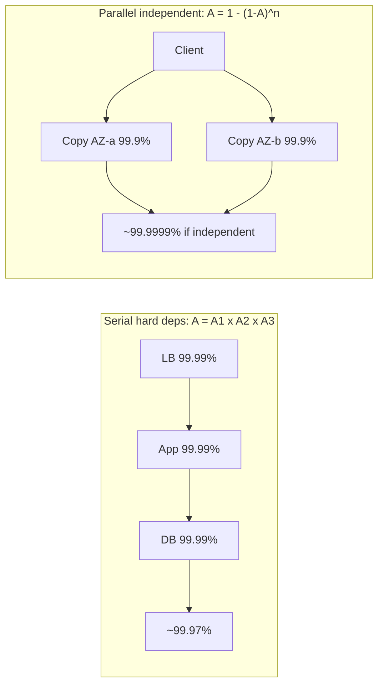
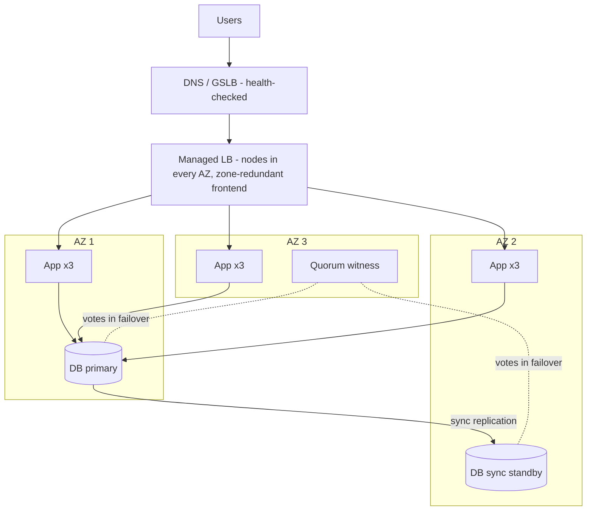
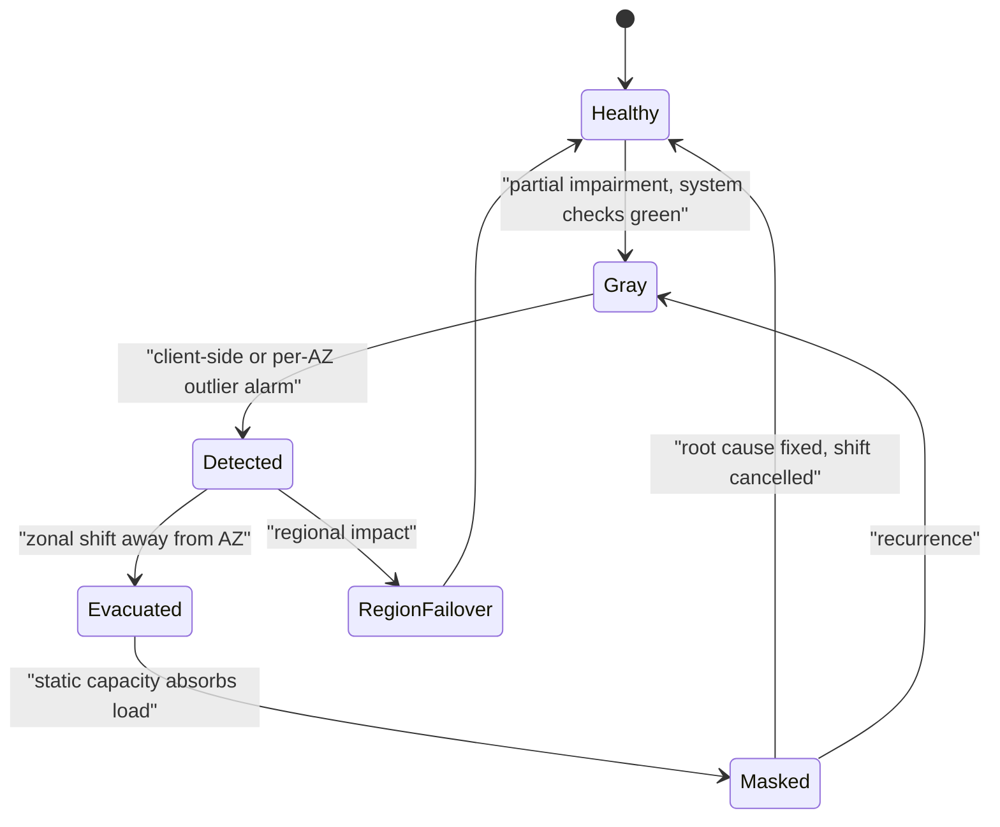

# C3 Reliability
> Last verified: 2026-10 · Audience: senior/staff DevOps, SRE, AI eng, NetEng, DevSecOps, architects

## TL;DR
- **Failures are normal at scale**: with 10,000 servers and a 3-year MTBF per server, you lose roughly 9 servers a day. Design for **partial failure**, not "up or down". The worst failures are **gray failures**, where the system's own health checks say green and clients see errors.
- **Reliability ≠ availability**. Reliability means doing the right thing without failure over a period (MTBF, correctness). Availability means being usable when needed: `A = MTBF / (MTBF + MTTR)`. **Cutting MTTR is usually cheaper than raising MTBF.**
- **The availability math is expected in interviews.** Serial (hard) dependencies multiply: `A = ∏Ai`. Parallel (redundant, independent) copies combine as `A = 1 − ∏(1−Ai)`. Two independent 99.9% copies give 99.9999%. **Correlated failures break the independence assumption**, which is why you need AZs and regions.
- **Redundancy vocabulary**: active-active vs active-passive (hot, warm or cold), **N+1 / N+M / 2N / 2N+1**. Stateless tiers are easy (put an LB in front and add instances). **Stateful tiers are hard**: replication, consensus, fencing, split-brain.
- **Remove SPOFs layer by layer**: instance → LB → DB → network → power → datacenter → AZ → region → control plane → humans and config. The LB itself must be redundant (VRRP/VIP, ECMP+anycast, or a managed multi-AZ LB).
- **Fault models** set what "tolerant" means: crash-stop < crash-recovery < omission < timing/performance (fail-slow) < **Byzantine**. Crash-tolerant consensus needs **2f+1** nodes. BFT needs **3f+1**.
- **Cloud model**: AWS AZs are independent DC groups up to about 100 km apart. **Azure** splits services into **zone-redundant, zonal and nonzonal**, has **paired vs nonpaired regions** (most new regions are nonpaired), and still has availability sets. SLAs reward multi-AZ: **EC2 99.5% per instance vs 99.99% across 2+ AZs**, and **Azure VM 99.9% single (Premium SSD) vs 99.95% availability set vs 99.99% across zones**.
- **Static stability** means pre-provisioning capacity so recovery needs no control-plane calls. Combine it with **cells** (D2.16), **ARC zonal shift/autoshift** (AWS), and **Chaos Studio zone-down drills / Resiliency in Azure** to prove it works.

## C3.1 Failures in large scale distributed systems
- **How it works:**
  - At scale, rare events become constant. With N components, each having per-period failure probability p, P(at least one fails) = `1 − (1−p)^N`. At p = 0.1% and N = 1,000 you get about 63%.
  - **Failure sources** (roughly ordered by how often they cause real outages): **changes** (deploys and config pushes cause most incidents), capacity/overload, dependency failures, network (partitions, packet loss, BGP), hardware (disk, NIC, memory ECC, PSU), software bugs (leaks, deadlocks, leap seconds, certificate expiry), operator error, and facility problems (power, cooling).
  - **The 8 fallacies of distributed computing** (Deutsch/Gosling): the network is reliable · latency is zero · bandwidth is infinite · the network is secure · topology doesn't change · there is one administrator · transport cost is zero · the network is homogeneous. Each one maps to a failure class: timeouts and retries, partitions, MTU/black holes, egress cost, version skew.
  - **Distributed-system failure properties**: you **cannot distinguish a slow node from a dead node** (FLP impossibility, asynchronous model). Messages can be lost, duplicated, reordered or delayed. Clocks drift. Failures are **partial and nondeterministic**.
  - **Cascading failure**: overload on one node → its traffic shifts to the others → they overload too. This is amplified by retries (retry storms), cache stampedes and thundering herds after recovery. See C3.29–C3.32.
  - **Metastable failure**: a trigger such as a load spike pushes the system into a bad state that keeps itself going (retries, queue growth, GC) even after the trigger is gone. Only shedding load gets you out.
- **Trade-offs / when to use:** more components bring more capacity and more redundancy, but also more failure surface and more coordination. Keep the dependency count on the critical path low (Azure WAF RE:03 says to minimize strong dependencies).
- **Interview angles:**
  - If asked "how do you design for failure?", say: assume every call can fail, hang or succeed twice → use timeouts, retries with backoff and jitter, idempotency keys, bulkheads, circuit breakers, graceful degradation and blast-radius limits (cells, AZs).
  - **Follow-up: "what causes most outages?"** Change: deploys, config and feature flags. That is why progressive delivery, bake time and automatic rollback are reliability features (see C5).
  - **Pitfall:** treating "the network is reliable" as true inside one VPC or VNet. Cross-AZ links, NAT/SNAT port exhaustion and conntrack tables all fail.

## C3.2 Partial system failures
- **How it works:**
  - **Partial failure** means some components, requests, shards, AZs or clients fail while the rest work. This is the normal state of a large system: some fraction of hosts is always unhealthy.
  - Types:
    - **fail-stop/crash**: clean, easy to detect
    - **fail-slow / limping**: degraded disk, a NIC dropping 1% of packets, CPU throttling
    - **partitions**: A can reach B, B cannot reach C, asymmetric routes
    - **data-dependent**: a poison message or "query of death" that crashes every replica it touches
    - **client-specific**: one tenant, one AZ pair, one route
  - **Gray failure** (Microsoft Research 2017, used by the AWS multi-AZ whitepaper) is defined by **differential observability**: the system's failure detector sees it as healthy while some consumers see it as unhealthy.
    - AWS example: a network impairment between AZ1 and AZ2 drops a percentage of DB connections from AZ1. EC2 status checks, the ASG, NLB health checks, Route 53 health checks and RDS all report healthy, yet the workload is failing.
    - Failures move between quadrants: **gray → detected → masked → gray** again until the root cause is fixed.
  - **Gray-failure options** (AWS): (1) wait it out, (2) **evacuate the AZ** (zonal shift), (3) fail over to another region. AZ evacuation has a lower RTO and RPO 0 for synchronously replicated in-region data, because cross-region replication in AWS services is asynchronous.
- **Trade-offs / when to use:**
  - **Deep health checks** catch more partial failures but can cause **fleet-wide false positives**: when a shared dependency blips, every host fails its check. Use shallow liveness checks plus deep readiness checks, and **fail open** when every target is unhealthy. ALB and NLB do this automatically, and ARC zonal shift has no effect while an LB is failing open.
  - **Outlier detection** compares a node or AZ against its peers, for example "AZ1 error rate 5× the others". It catches gray failures that absolute thresholds miss.
- **Interview angles:**
  - If asked "health checks are green but users see errors", say **gray failure** → measure from the client side (synthetic canaries, client-observed per-AZ error and latency), use outlier detection per AZ, then evacuate the AZ.
  - **Follow-up: poison pill / query of death.** Use shuffle sharding and cells to limit how many hosts one bad request can kill, and quarantine the offending request key.
  - **Pitfall:** averaging. The AWS example: one app's latency goes from 50 to 70 ms (+40%) but the system-wide average stays under the 60 ms alarm. Alarm on percentiles and on per-consumer or per-AZ dimensions.

## C3.3 Reliability
- **How it works:**
  - **Reliability** is the probability that the system performs its intended function correctly, without failure, for a given period under stated conditions. Classic model: `R(t) = e^(−λt)` with constant failure rate λ = 1/MTBF.
  - Metrics:
    - **MTBF/MTTF**: mean time between failures / to failure
    - **MTTR**: mean time to repair/recover
    - **MTTD**: mean time to detect
    - **MTTA**: mean time to acknowledge
    - Change failure rate (DORA)
  - Azure WAF definition: a reliable workload is **resilient** (absorbs failures and keeps an acceptable service level) and **recoverable** (gets back within its RTO/RPO).
  - **A system can be available but unreliable**: it is up but returns wrong or stale data or loses writes. **It can be reliable but unavailable**: it is correct whenever it is up but is often down for maintenance.
  - **Durability** (data not lost, e.g. S3's 11 nines design target) is separate from availability.
- **Trade-offs / when to use:**
  - Each extra nine costs roughly 10× more (SRE book "Embracing Risk"). 100% is the wrong target: users can't tell 99.99% from 99.999% through their ISP and device, and chasing it freezes feature velocity.
  - Set the target with **SLOs and error budgets** ([J1](../J-sre/J1-slis-slos-error-budgets.md)).
- **Interview angles:**
  - If asked "reliability vs availability", say: availability is a *measure* (uptime or successful requests). Reliability is the broader *property*, covering correctness, durability and consistency over time. AWS defines **resiliency** as the ability to recover from disruptions and mitigate them.
  - **Follow-up: improve MTBF or MTTR?** At scale, MTTR: automated detection, rollback and failover. You cannot stop hardware from failing.

## C3.4 Availability
- **How it works:**
  - **Time-based**: `A = uptime / total time`. **Request-based (aggregate)**: `A = successful requests / valid requests`. Google uses request success rate over rolling windows because global services are rarely fully up or fully down. AWS: measure in 1- or 5-minute buckets and average them for the month. A bucket with no requests counts as 100%.
  - **Estimate from MTBF and MTTR**: `A = MTBF/(MTBF+MTTR)`. AWS example: MTBF 150 days with MTTR 1 h gives 99.97%.
  - **Nines table** (downtime budget):

| Availability | Per year | Per 30-day month | Per week | Typical use (AWS WA examples) |
|---|---|---|---|---|
| 99% | 3d 15h 36m | 7h 12m | 1h 41m | Batch / ETL |
| 99.5% | 1d 19h 48m | 3h 36m | 50m | EC2 single-instance SLA level |
| 99.9% | 8h 45m 57s | 43m 12s | 10m 05s | Internal tools |
| 99.95% | 4h 22m 48s | 21m 36s | 5m 02s | E-commerce, POS |
| 99.99% | 52m 36s | 4m 19s | 1m 00s | Video delivery, broadcast |
| 99.999% | 5m 16s | 25.9s | 6.0s | ATM, telecom |
| 99.9999% | 31.6s | 2.6s | 0.6s | Rarely realistic end-to-end |

  - **Serial (hard dependency) composition**: `A = A1 × A2 × … × An`. AWS: three 99.99% systems in series give **99.97%**. Rule of thumb: add the *unavailabilities* (0.01% + 0.01% + 0.01%).
  - **Parallel (redundant, independent) composition**: `A = 1 − ∏(1 − Ai)`. Two 99.9% copies give 1 − 0.001² = **99.9999%**. AWS shortcut: if every value is all nines, add the nine counts.
  - **k-of-n** (N+1 capacity) uses the binomial sum: `A = Σ_{i=k..n} C(n,i)·A^i·(1−A)^(n−i)`. Example: 3 of 4 instances needed at 99% each gives ≈ 99.94%, not 99.999999%. Capacity redundancy is weaker than full redundancy.
  - **Soft dependencies** (failure is compensated by a cache, fallback or degraded mode) do not multiply into your availability.
- **Trade-offs / when to use:**
  - **The independence assumption is the trap.** Two VMs on the same rack, in the same AZ, with the same deploy or the same config share fate. Real composite availability is closer to the **availability of the shared component** (LB, DNS, IAM, deploy pipeline).
  - **Scheduled maintenance counts** as downtime from the user's point of view. AWS advises against excluding it.
  - **The SLA is a billing contract (service credits), not an engineering design target.** Design to an SLO above the SLA and an internal target above the SLO.
- **Interview angles:**
  - **Worked example**: LB 99.99% → app tier (3 instances at 99.9%, need 1) ≈ 99.99999% → single DB 99.95% → composite ≈ 99.99% × ~100% × 99.95% ≈ **99.94%**. The DB is the bottleneck, so make it Multi-AZ: 99.95% → ~99.99%+.
  - If asked "can you build 99.99% on a 99.9% dependency?", answer: only if it's a soft dependency, or you run redundant independent copies (multi-AZ or multi-provider), or you cache and serve stale data.
  - **Pitfall:** quoting "five nines" without saying where it's measured: server-side vs client-side, per request vs per minute, and whether partial outages count.

## C3.5 High Availability
- **How it works:**
  - **HA** means designing to minimize downtime from component failures, usually 99.9% or better. It needs **(1) redundancy, (2) failure detection, (3) automatic failover/recovery**, and no SPOF on the critical path.
  - **HA vs DR**: HA handles in-region, component- or AZ-level failures automatically with RTO of seconds to minutes and RPO ≈ 0 (synchronous replication). **DR** handles region loss, corruption or ransomware with RTO of minutes to hours and RPO > 0 (asynchronous replication or backup). See C3.24–C3.26 and [D1.23 DR](../D-system-design/D1-system-design-basics.md#d123-disaster-recovery-rpo-vs-rto).
  - Building blocks: an LB with health checks, autoscaling/self-healing groups (ASG, VMSS), replicated data stores (RDS Multi-AZ, Azure SQL zone-redundant), quorum systems (etcd, ZooKeeper, Raft), and DNS/anycast failover.
  - **Graceful degradation** is part of HA: serve read-only, stale cache or reduced features instead of a hard failure. In the Azure FMA example, the recommendation engine goes down but checkout still works.
- **Trade-offs / when to use:**
  - HA costs money (idle or over-provisioned capacity, cross-AZ data transfer: AWS charges inter-AZ, Azure doesn't) and complexity (failover bugs). Many outages *are* failover bugs.
  - Within one region, synchronous replication across AZs is affordable: about **<2 ms RTT** between zones on Azure, "single-digit ms" on AWS.
- **Interview angles:**
  - If asked "design X for HA", walk the stack: DNS → edge/CDN → LB (multi-AZ) → stateless app (≥ 2 per AZ, N/(N−1) over-provisioned) → cache (replicated) → DB (sync standby in another AZ) → queue (replicated) → observability and runbooks.
  - **Follow-up: active-passive failover time.** Detection (3 × 10 s health checks = 30 s) + promotion + DNS TTL / client reconnect. RDS Multi-AZ instance failover is typically 60–120 s (verify per engine).

## C3.6 Fault Tolerance
- **How it works:**
  - **Fault → error → failure** chain (Avižienis/Laprie): a **fault** (bug, bit flip, dead disk) can cause an **error** (wrong internal state), which can cause a **failure** (deviation visible to users). **Fault tolerance** stops faults from becoming failures.
  - Azure WAF: *failures* are unexpected events that need specific design for that class of failure. *Errors* are expected and handled inline, for example by input validation.
  - **FT vs HA**: fault tolerance means **zero interruption**. Redundancy is active and masks the fault, as in RAID-1, lockstep CPUs, a 2N power path, or a quorum write that succeeds with one replica down. HA means **brief interruption** during failover. FT costs more (2N or more, plus synchronous coordination).
  - Techniques:
    - **masking redundancy**: replication, voting, TMR
    - **error detection and correction**: checksums, ECC, erasure coding
    - **retries** (time redundancy)
    - **checkpoint/restart**
    - **idempotency**
    - **process pairs**
    - **supervision trees** (Erlang "let it crash")
- **Trade-offs / when to use:** use FT for the data plane of critical paths (storage, payment, control loops) and HA for most web tiers. Fault tolerance in one layer can hide faults until they pile up (latent faults). Monitor redundancy loss, e.g. "running on 1 of 2 PSUs".
- **Interview angles:**
  - If asked "HA vs fault tolerance", say: HA accepts short downtime during failover, while FT masks the fault with no visible interruption. Give the examples Multi-AZ RDS failover (HA) vs a 3-replica quorum write in Aurora, DynamoDB or Cosmos DB (FT for a single replica loss).
  - **Pitfall:** "we have 2 replicas so we're fault tolerant". Not if the failover is manual, untested, or both replicas share a dependency.

## C3.7 Fault tolerant design
- **How it works:** principles drawn from the AWS WA reliability pillar and Azure WAF RE:03–RE:05:
  - **Failure mode analysis (FMA)**: decompose into flows → list dependencies (strong vs weak) → evaluate failure modes per component (region outage, AZ outage, service outage, DDoS, misconfiguration, operator error, maintenance, overload) → estimate likelihood and blast radius → plan mitigations → plan detection. Analyze **reads and writes separately**.
  - **Isolation / bulkheads**: separate pools per dependency or tenant. **Cells** and **shuffle sharding** limit blast radius ([D2.16](../D-system-design/D2-reusable-parts-of-system-design.md#d216-cell-based-architecture)).
  - **Static stability**: no control-plane calls on the recovery path (C3.15).
  - **Timeouts everywhere, bounded retries with jitter, circuit breakers, load shedding** (C3.29–C3.32).
  - **Idempotent APIs** so retries are safe. Use **constant work** patterns, where the system does the same work in steady state and in failure, so failure doesn't create a load spike.
  - **Loose coupling** through queues, so a consumer outage turns into backlog instead of errors.
  - **Graceful degradation / fallbacks** for weak dependencies. Prefer **fail-open vs fail-closed** depending on security impact: authz should fail closed, a recommendation widget can fail open.
  - **Avoid bimodal behavior**: fallback paths that are rarely used are rarely tested, so the fallback becomes the outage.
- **Trade-offs / when to use:** every mechanism adds code, cost and new failure modes. Prioritize by severity × likelihood, as in the Azure FMA table. Don't build mitigations beyond redundancy for very unlikely events such as multi-region outages unless the business requires it.
- **Interview angles:**
  - If asked "walk me through making service X fault tolerant", do an FMA table out loud: component, failure mode, likelihood, effect, mitigation, detection.
  - **Follow-up: strong vs weak dependency.** A strong dependency's availability caps yours (multiply). A weak one should be wrapped in a timeout, breaker and fallback.

## C3.8 Redundancy
- **How it works:**
  - Azure definition: redundancy means maintaining multiple identical copies of a component so that no single one is a SPOF. **Replication** is redundancy for data. **Backup** is a point-in-time copy for restoring after loss or corruption.
  - **Replication ≠ backup**: a deletion or corruption replicates everywhere. You need both.
  - **Physical scopes** and their risks (Azure): disk/server → hardware failure. Rack → ToR switch. Datacenter → cooling or power. AZ → city-scale event. Region → widespread disaster. Redundancy only protects against risks *below* the scope it spans. Matching tiers:
    - **local** (LRS: 3 copies in one DC)
    - **zone** (ZRS)
    - **geo** (GRS/GZRS, asynchronous to the paired region)
  - Redundancy needs consistent configuration (IaC), distribution of work (LB or leader), health monitoring, and **over-provisioning**. Azure's formula: provision `peak × N/(N−1)` across N zones and round up.
    - 3 zones at peak 6 → 9 instances
    - 4 zones at peak 10 → 14 instances
- **Trade-offs / when to use:** cost and the latency of wider spread vs the blast radius covered. Synchronous replication across distance adds latency to writes. Asynchronous replication gives RPO > 0.
- **Interview angles:**
  - If asked "how many instances for zone failure tolerance?", use **N/(N−1)**: 3 AZs means 1.5× peak, 2 AZs means 2× peak. That is why 3 AZs is cheaper than 2 for the same tolerance.
  - **Pitfall:** redundancy without diversity. Identical software brings correlated bugs, such as a leap-second bug or the same bad config pushed to every replica.

## C3.9 Types of redundancy
- **How it works:**

| Type | Meaning | Failover | Cost | Example |
|---|---|---|---|---|
| **Active-active** | All copies serve live traffic | None (LB stops routing to the failed copy) | High utilization, capacity must absorb the loss | Stateless web tier across 3 AZs; Cosmos DB multi-region writes |
| **Active-passive (hot standby)** | Standby running, data synchronized, no traffic | Seconds–minutes, automatic | ~2× for that tier | RDS Multi-AZ instance, SQL AG sync secondary |
| **Warm standby** | Standby running scaled-down, async data | Minutes, scale-up needed | Medium | DR region with minimal fleet |
| **Cold standby / pilot light** | Infra defined or data only, compute off | Minutes–hours | Low | Backup and restore, pilot light DR |
| **N+1** | N needed + 1 spare | Absorb 1 failure | +1/N | 4 nodes for a load needing 3 |
| **N+M** | N needed + M spares | Absorb M failures | +M/N | Large fleets, e.g. N+2 during maintenance |
| **2N** | Fully mirrored independent system | Whole path redundant | 2× | Dual power feeds A/B, Uptime Tier IV |
| **2N+1** | Mirrored + one spare | Survives a failure during maintenance | >2× | Critical facilities |

  - Other dimensions:
    - **Spatial** vs **temporal** redundancy (retries)
    - **information** redundancy (parity, ECC, erasure coding: a 6+3 Reed-Solomon code tolerates 3 losses at 1.5× storage vs 3× for replication)
    - **design diversity** (N-version programming, multi-vendor)
    - **geographic** redundancy (multi-AZ / multi-region)
  - **Uptime Institute tiers**:
    - Tier II: redundant components
    - Tier III: **concurrently maintainable**, N+1
    - Tier IV: **fault tolerant**, 2N
- **Trade-offs / when to use:**
  - Active-active gives the best RTO and utilization, but you must handle **concurrent writes and conflicts** for state, and every copy must be able to take the failed copy's share.
  - Active-passive is simpler for state, but the passive side is untested capacity ("is the standby actually working?"). Do regular failover drills.
- **Interview angles:**
  - If asked "N+1 vs 2N", say: N+1 covers one component failure. 2N covers a whole-path failure, such as an entire power or network side. Concurrent maintainability needs at least N+1 *while* maintenance is running, otherwise maintenance plus one failure takes you down.
  - **Follow-up: "active-active across regions for a SQL DB?"** Usually no. Prefer single-writer with region-local reads, or partition writes by home region. Multi-master needs conflict resolution (last-writer-wins, CRDTs).

## C3.10 Single point of failures
- **How it works:**
  - A **SPOF** is any component whose failure alone stops the service. Find SPOFs by tracing each critical flow and asking "if this disappears, does the flow fail?" (Azure FMA).
  - **Commonly missed SPOFs**:
    - the LB or NAT gateway (AWS NAT GW is zonal, so you need one per AZ)
    - a single DB primary without automatic failover
    - DNS provider, CA/OCSP, certificate expiry
    - identity provider (Entra ID / IAM / IdP)
    - secrets store (Key Vault, Secrets Manager) at startup
    - **control planes** (deploying or scaling during an incident)
    - CI/CD pipeline, config service, feature-flag service
    - a single Direct Connect/ExpressRoute circuit or a single router
    - a shared Redis
    - license servers
    - a single on-call person or tribal knowledge
    - **global config** (one bad push hits every region)
    - time sync (NTP)
    - a cron leader with no failover
  - Azure LB doc example: a zone-redundant LB with every backend VM in zone 1 still has a SPOF (the zone).
- **Trade-offs / when to use:** you can't remove every SPOF (the business, the cloud provider). Make residual SPOFs very reliable and fast to recover, and document them as accepted risks.
- **Interview angles:**
  - If asked "find the SPOFs in this diagram", check LB, DB, cache, queue, NAT/egress, DNS, auth, secrets, deploy and config path, monitoring (who alerts if monitoring is down? → external monitoring, C3.18), and people.
  - **Pitfall:** hidden shared dependencies in "redundant" designs, e.g. two app clusters reading the same config bucket or the same KMS key.

## C3.11 Stateless component redundancy
- **How it works:**
  - Stateless components (web/API servers, workers that pull from queues) keep no unique data, so any instance can serve any request. Redundancy = **N identical instances + an LB/queue + health checks + autoscaling or self-healing** (ASG, VMSS, K8s Deployment with replicas ≥ 2–3).
  - **Push state out**: sessions go to Redis or DynamoDB or into a signed cookie/JWT, files go to object storage, caches are disposable. **Sticky sessions** create soft state, and losing a node loses its sessions.
  - Spread instances across AZs (K8s `topologySpreadConstraints` on `topology.kubernetes.io/zone`, ASG AZ rebalancing, VMSS `zones` with zone balance). Use a **PodDisruptionBudget** so voluntary disruptions keep a minimum running.
  - Immutable images and IaC keep instances identical. Configuration drift is a hidden form of state.
- **Trade-offs / when to use:** cheap and horizontally scalable. Watch cold-start and scale-out latency (so pre-provision for static stability) and connection draining on scale-in (deregistration delay, default 300 s on ALB/NLB target groups).
- **Interview angles:**
  - If asked "how do you make the web tier HA?", say: ≥ 2 instances per AZ across ≥ 2 (better 3) AZs, sized N/(N−1), stateless sessions, LB health checks, self-healing group, rolling or blue-green deploys.
  - **Follow-up: "is a queue worker stateless?"** Yes, if work items are idempotent and use visibility timeouts or acks. In-flight work is redelivered when a worker dies.

## C3.12 Stateful component redundancy
- **How it works:**
  - Stateful components (databases, caches holding the only copy, brokers, consensus stores) need **replication**, and replication forces choices:
    - **Sync vs async**: synchronous gives RPO 0 and adds latency. Async gives RPO > 0 and low latency. Semi-sync is a middle ground (MySQL).
    - **Topology**: single-leader (primary/standby), multi-leader, leaderless quorum (Dynamo-style, `W + R > N`).
    - **Failover**: who decides the primary is dead? Use **consensus/quorum** (Raft, Paxos, etcd, ZooKeeper, Patroni with a DCS, SQL AG with WSFC quorum) so that only one primary exists.
  - **Split brain**: both nodes think they are primary, often after a partition, and accept divergent writes. Prevent it with:
    - a **quorum/majority** (odd nodes, or a witness/tiebreaker in a third AZ)
    - **fencing** (STONITH, fencing tokens/epochs, revoking storage access)
    - **leases**
  - **Quorum sizing**: tolerating f crash failures needs **2f+1** voters. 3 nodes tolerate 1, 5 tolerate 2. A 2-node cluster can't form a majority after one failure, so add a witness. Placement: 3 voters across 3 AZs.
  - Managed examples:
    - RDS Multi-AZ instance: synchronous standby, no reads
    - RDS Multi-AZ DB cluster: 2 readable standbys
    - Aurora: 6 copies across 3 AZs, write quorum 4/6, read quorum 3/6
    - Azure SQL zone-redundant
    - Azure Cache for Redis zone-redundant
  - Full detail in [B8 Replication](../B-database-engineering/B8-database-replication.md) and [C2.10](./C2-scalability.md#c210-database-replication).
- **Trade-offs / when to use:** CAP/PACELC. In a partition, choose consistency (reject writes on the minority side) or availability (accept and reconcile later). Under normal operation, trade latency against consistency.
- **Interview angles:**
  - If asked "how do you avoid split brain?", say: majority quorum + fencing tokens checked by the storage layer + witness in a third failure domain. Never let "can't reach the primary" alone trigger promotion.
  - **Follow-up: why not 2 or 4 nodes?** Even counts add cost without adding tolerance. 4 nodes still tolerate only 1 failure.
  - **Pitfall:** async replica promotion loses the last few seconds of writes (RPO > 0). Say so explicitly and reconcile, or use synchronous commit in-region.

## C3.13 Load balancer redundancy
- **How it works:** the LB is on every request's path, so it must not be a SPOF. Patterns:
  - **Active-passive VIP with VRRP** (keepalived, RFC 5798): two LBs share a floating IP. The backup takes over after missing about 3 advertisements (default 1 s interval → ~3 s), using gratuitous ARP. It is L2-bound, so it doesn't work as-is in cloud VPCs. There you'd use secondary-IP moves or route-table updates via API, which is slower and depends on the control plane.
  - **Active-active with ECMP + BGP anycast**: several LB nodes announce the same VIP. Routers hash flows across them, and a failed node withdraws its route. **Consistent hashing / Maglev** keeps flows stable when membership changes. Used by Google Maglev, Cloudflare, and Azure LB / global LB.
  - **DNS-level**: multiple LB IPs in DNS plus health-checked DNS failover (Route 53, Traffic Manager). Slower, because TTL and client caching delay the change.
  - **Managed cloud LBs are already redundant**:
    - **ALB** needs ≥ 2 AZs and has nodes in each enabled AZ, one DNS IP per AZ. **NLB** has one static IP/EIP per AZ.
    - **Azure Standard LB zone-redundant frontend** serves from multiple zones on one IP, and a zone failure only resets in-flight flows. Microsoft recommends zone-redundant for all workloads.
    - **Basic LB is retired (2025-09-30)**.
  - **Cross-zone load balancing**: ALB is on by default (can be disabled per target group). NLB/GWLB are off by default. With cross-zone off, an AZ with few healthy targets gets an equal share and gets overloaded.
- **Trade-offs / when to use:** VRRP is simple on-prem but is active-passive and L2-scoped. ECMP/anycast scales out but needs BGP and flow-consistent hashing. For L4 vs L7 details see [C2.26](./C2-scalability.md#c226-layer-7-load-balancers) and [D1.3](../D-system-design/D1-system-design-basics.md).
- **Interview angles:**
  - If asked "who load-balances the load balancer?", answer DNS (multiple A records / GSLB) → anycast/ECMP routers → LB fleet → backends. Each layer is redundant on its own.
  - **Follow-up: health-check failure modes.** All targets unhealthy leads to **fail-open** (ALB/NLB route to all). A deep health check tied to a shared DB can drain the whole fleet.

## C3.14 Datacentre infrastructure as SPOF
- **How it works:**
  - A single datacenter shares fate through:
    - **power**: utility feed, ATS, UPS, generators, fuel contracts
    - **cooling**: CRAC/chillers. Heat events have caused real cloud outages
    - **network**: ToR → spine; carrier fiber laterals, where one backhoe cut can take out "diverse" paths in the same conduit
    - **fire suppression**
    - **building access**
    - **natural hazards**: flood, quake, storms
    - **human/operational error**: maintenance mistakes
  - Inside a DC, redundancy is designed in (2N power A/B feeds, N+1 cooling, dual ToR/MLAG). But the **building is still a single shared-fate domain**.
  - Above the DC there are logical SPOFs too: **regional control planes** and **global services**. Several AWS global services keep their control plane in a single region (e.g. IAM, Route 53, CloudFront control planes in us-east-1), while their data planes are globally distributed. Recovery plans should rely only on data planes.
- **Trade-offs / when to use:** a single DC with redundant internals reaches roughly Tier III/IV *facility* availability but no protection against site-level events. Accept that only for non-critical or latency-bound workloads (e.g. HPC/training clusters in one placement group, with checkpointing to durable storage).
- **Interview angles:**
  - If asked "why isn't one Tier IV datacenter enough?", say: correlated site risks (fire, flood, utility outages, operator error, bad network change) bypass internal redundancy. You need **independent failure domains**, i.e. AZs.
  - **Pitfall:** proximity placement groups / cluster placement groups put everything in one DC to cut latency, and that recreates the SPOF.

## C3.15 Creating datacenter redundancy
- **How it works:**
  - **Availability zones**: separate DC groups within a region with independent power, cooling and networking, close enough for synchronous replication.
    - **AWS**: AZs "up to 60 miles (~100 km)" apart, single-digit-ms latency, separate substations, deploys staggered across AZs, each AZ reaches the internet through 2 transit centers. Over 100 AZs globally. New regions launch with ≥ 3 AZs.
    - **Azure**: zones usually within 100 km, **< ~2 ms RTT target**, 3 zones in most AZ-enabled regions (East US 2 has a 4th zone in preview). **No charge for inter-zone data transfer** (AWS does charge).
  - **Logical vs physical zone mapping**: AWS AZ *names* (us-east-1a) map per account, so use **AZ IDs** (use1-az1) to align across accounts. Azure logical zones 1/2/3 map per subscription, so check with `az account list-locations` / Check Zone Peers API.
  - **Multi-region**: protects against region-wide failure and regional control-plane failure. Cross-region replication is **asynchronous** (RPO > 0). Multi-region costs much more and must be failover-tested.
  - **Static stability** (AWS): systems keep running unchanged when a dependency fails. Pre-provision capacity in the surviving AZs instead of relying on the control plane to launch instances during an AZ event. Control planes are statistically more likely to fail than data planes. Running EC2 instances, S3 objects and EBS volumes have no control-plane dependency.
  - **Cell-based architecture**: replicate the whole stack into independent cells (often zonal), routing by a thin layer. Blast radius = 1 cell. See [D2.16](../D-system-design/D2-reusable-parts-of-system-design.md#d216-cell-based-architecture).
  - **AZ evacuation**: shift traffic away from an impaired AZ, e.g. **ARC zonal shift** (AWS). Azure options are in the cloud mapping below.
- **Trade-offs / when to use:**
  - Multi-AZ should be the **default for production** (both providers say so). Multi-region is for mission-critical work, regulatory needs, or region-level RTO.
  - Data-residency-bound workloads that can't leave the region: multi-AZ plus backups is the main tool.
- **Interview angles:**
  - If asked "multi-AZ or multi-region?", say: multi-AZ covers most failures with RPO 0 and low cost. Multi-region covers region and control-plane failure, at the price of async RPO, more cost and complexity, and failovers that need practice. Decide from RTO/RPO and business impact.
  - **Follow-up: why 3 AZs?** Quorum (2 of 3 survives one AZ) and lower over-provisioning (1.5× vs 2×).

## C3.16 Fault models
- **How it works:**

| Model | Behavior | Detectable? | Tolerating f faults needs |
|---|---|---|---|
| **Fail-stop** | Halts, and others can reliably detect it | Yes (assumed perfect detector) | f+1 replicas (primary-backup) |
| **Crash-stop** | Halts permanently, no reliable detection (async network) | Only by timeout | 2f+1 for consensus (Paxos/Raft) |
| **Crash-recovery** | Crashes, restarts with durable state (WAL), may miss messages | Timeout | 2f+1 + stable storage |
| **Omission** (send/receive) | Drops some messages, otherwise correct | Hard | Retries, acks, sequence numbers |
| **Timing / performance (fail-slow)** | Correct output but too late | Timeouts / latency SLOs | Hedged requests, timeouts, outlier ejection |
| **Byzantine (arbitrary)** | Any behavior incl. corrupt, inconsistent or malicious messages | Very hard | **3f+1** (PBFT); f+1 matching replies |
| **Gray failure** (practical) | Partial, **differential observability** | Only from consumers' vantage | Client-side detection + evacuation |

  - **Network models**: synchronous (bounded delay), **asynchronous** (unbounded delay; FLP says no deterministic consensus is guaranteed even with one crash), and **partially synchronous** (eventually bounded, which is what Raft and Paxos assume for liveness).
  - **Byzantine in practice**: bit flips/silent data corruption (use end-to-end checksums), buggy nodes sending contradictory data, blockchains, aerospace. Most datacenter systems assume **crash-recovery + omission** and add checksums to guard against corruption.
- **Trade-offs / when to use:** stronger fault models mean more replicas, more messages and more latency (BFT is O(n²) messages). Pick the weakest model that matches your real threats: crash-recovery for internal services, Byzantine-ish defenses (signatures, checksums, validation) at trust boundaries.
- **Interview angles:**
  - If asked "why does Raft need 3 nodes and PBFT 4?", explain: crash faults need a majority that overlaps (2f+1). Byzantine faults need overlap of at least f+1 *honest* nodes, so 3f+1.
  - **Follow-up: "how does a node know another is dead?"** It can't know for certain, only suspect via timeouts (failure detectors, phi-accrual). That is why fencing and epochs matter.
  - **Pitfall:** designing only for crash-stop. Real incidents are mostly fail-slow and gray: a disk at 10% speed or a 1% packet loss.

<!-- PART2-IDS-GO-HERE -->

## Diagrams

**Serial vs parallel availability**


**Multi-AZ HA with redundant LB, stateless and stateful tiers**


**Gray failure lifecycle and AZ evacuation**


## Cloud mapping: AWS vs Azure

| Capability | AWS | Azure | Role it plays | Key differences | Alternatives |
|---|---|---|---|---|---|
| In-region failure domains | **Availability Zones** (≥ 3 per new region; AZ IDs) | **Availability zones** (3 in most AZ regions; logical↔physical mapping per subscription) | DC-level isolation with sync-replication latency | Azure services are **zone-redundant / zonal / nonzonal**. AWS charges inter-AZ transfer, Azure doesn't | GCP zones; on-prem: multiple DCs in a metro |
| Rack/host-level spread (no AZ) | Spread **placement groups** (max 7 instances per AZ per group) | **Availability sets** (up to 3 fault domains, up to 20 update domains; default 5 UDs) | Avoid shared rack/power/host and staggered maintenance | Availability sets are single-DC, can't combine with zones. Microsoft steers new designs to zones / VMSS Flex | K8s pod anti-affinity |
| Region-pair DR | No pairs, choose any region | **Region pairs** (sequential updates, recovery prioritization, GRS target). Many newer regions are **nonpaired** (e.g. Italy North, Poland Central, Spain Central, Mexico Central, NZ North) | Cross-region DR target | Pairing ≠ automatic DR. Microsoft-managed GRS failover only happens in catastrophes, so use customer-managed failover | Multi-cloud DR |
| Compute SLA | **EC2: 99.5% instance-level; 99.99% region-level** with ≥ 2 AZs | **VM: 99.9% single instance (Premium SSD/Ultra); 99.95% availability set; 99.99% across ≥ 2 zones** (verify current SLA doc) | Contractual credit floor | Azure single-VM SLA depends on disk type (Std SSD/HDD lower) | — |
| Managed LB redundancy | ALB (≥ 2 AZs), NLB (per-AZ IPs), cross-zone defaults differ | Standard LB **zone-redundant frontend**; Gateway LB; global LB (anycast); App Gateway v2 zone-redundant | Remove LB SPOF | Azure keeps one IP across zones. AWS ALB DNS returns per-AZ IPs | Cloudflare LB, NGINX/HAProxy + keepalived |
| Static stability | Builders' Library guidance; pre-provisioned ASG capacity | WAF "over-provision N/(N−1)" guidance | Recover without the control plane | Same concept, different terminology | K8s over-provisioned node pools |
| AZ evacuation | **ARC zonal shift** (manual, 1 min–72 h, extendable) and **zonal autoshift** (AWS-initiated) for ALB, NLB, EC2 ASG, EKS | No direct customer "zonal shift" API (unverified as of 2026-10). Zone-redundant services fail over automatically. For zonal resources you reroute yourself (LB health probes, App Gateway/Front Door origin disable, scale out in healthy zones) | Drain an impaired AZ fast | AWS has a first-class shift API. Azure is platform-managed for zone-redundant services and customer-managed for zonal ones | Istio/Envoy locality failover; DNS weight changes |
| Resilience assessment | **AWS Resilience Hub** (RTO/RPO policies, assessments vs WA, runs FIS experiments) | **Resiliency in Azure** (formerly Business Continuity Center): Infrastructure Resiliency Manager (preview) with goals/recommendations, **AZ Down Drills**, Recovery Orchestration Plan; Advisor reliability recommendations / reliability workbook (unverified current name) | Posture vs objectives | Resilience Hub is app-centric (RTO/RPO policy per app). Azure's tool is estate-centric (zone resilience + BCDR + ransomware) | Gremlin, Steadybit |
| Fault injection | **AWS FIS** (AZ power interruption scenario, etc.) | **Azure Chaos Studio**: Workspaces/Scenarios (public preview) incl. **Compute Zone Down**, Zone Down, DNS outage, Entra ID outage; Experiments (classic) | Prove failover works | Chaos Studio Workspaces discover resources and suggest scenarios | Chaos Mesh, LitmusChaos ([J7](../J-sre/J7-chaos-engineering.md)) |
| Blast-radius isolation | Cells, shuffle sharding (Builders' Library) | Deployment stamps pattern | Limit correlated failure | Naming differs: cell vs stamp | — |

- **AWS AZ model**: an AZ is one or more discrete DCs with redundant power and networking, up to ~100 km from other AZs in the region, with no shared generators or cooling and separate substations. Deploys are staggered per AZ. Services are **zonal** (EC2, EBS, NAT GW, subnets) or **regional** (S3, DynamoDB, SQS, Lambda: AWS spreads them across AZs) or **global** (IAM, Route 53, CloudFront: data plane global, control plane in us-east-1).
- **Azure zone support types**:
  - **Zone-redundant**: Microsoft replicates across zones and fails over automatically, e.g. ZRS storage, zone-redundant SQL/LB/App Gateway.
  - **Zonal**: pinned to one zone you choose. You build multi-zone and handle failover, e.g. VMs, managed disks LRS.
  - **Nonzonal/regional**: Azure may place it in any zone, so it can go down with any zone.
  - A zonal VM can't be moved to another zone; you redeploy. Moving regional → zonal requires a stop.
- **Azure zone-down guidance** (service reliability guides):
  - Microsoft **does not notify you automatically**. Use **Resource Health / Service Health alerts**.
  - Zone-redundant LB: no downtime, but in-flight TCP/UDP flows in the failed zone are reset, so clients must retry.
  - Zonal VMs stay down until the zone recovers. ZRS disks can be force-detached and attached to a VM in a healthy zone.
  - Test with Chaos Studio **Compute Zone Down**.
- **Paired vs nonpaired regions**: pairs give sequential platform updates, recovery prioritization in geography-wide outages, and same-geography data residency (exceptions such as Brazil South → South Central US are asymmetric). Many newer regions are **nonpaired, AZ-first**. Most services (Site Recovery, Cosmos DB, SQL geo-replication) work between any regions. GRS needs a pair.
- **SLA math gotcha**: an SLA only applies if you meet its conditions (e.g. ≥ 2 instances across AZs, and for Azure LB ≥ 2 healthy backend VMs). A composite SLA multiplies (serial). Credits are capped and never cover business loss.
- **ARC zonal shift details**:
  - Supported resources must be opted in and **pre-scaled**. A shift **has no effect if the ALB/NLB is failing open**.
  - With multiple LBs sharing targets, a shift on a cross-zone LB drops target capacity for all of them.
  - **Zonal autoshift** lets AWS shift you when it detects AZ impairment. It is paired with periodic **practice runs** (whether practice runs are still mandatory: unverified).
  - Terraform: `enable_zonal_shift` on `aws_lb`.

## Hands-on (optional)
```bash
# AWS: map account-specific AZ names to stable AZ IDs (use IDs across accounts)
aws ec2 describe-availability-zones --region us-east-1 \
  --query 'AvailabilityZones[].[ZoneName,ZoneId,State]' --output table

# Azure: logical->physical zone mapping for this subscription
az account list-locations \
  --query "[?name=='eastus2'].availabilityZoneMappings" -o json

# AWS ARC: evacuate one AZ for an ALB (pre-scale first!), expires automatically
aws arc-zonal-shift start-zonal-shift \
  --resource-identifier arn:aws:elasticloadbalancing:us-east-1:111122223333:loadbalancer/app/web/abc123 \
  --away-from use1-az1 --expires-in 2h --comment "gray failure AZ1 - INC-1234"
aws arc-zonal-shift list-zonal-shifts --status ACTIVE

# Quick availability math: serial and parallel
awk 'BEGIN{a=0.9999; printf "serial x3: %.6f\n", a*a*a; b=0.999; printf "parallel x2: %.8f\n", 1-(1-b)^2}'
```

```hcl
# Azure: zone-balanced VMSS (Flexible) behind a zone-redundant Standard LB
resource "azurerm_public_ip" "lb" {
  name                = "pip-web"
  location            = var.location
  resource_group_name = var.rg
  allocation_method   = "Static"
  sku                 = "Standard"
  zones               = ["1", "2", "3"] # zone-redundant frontend
}

resource "azurerm_orchestrated_virtual_machine_scale_set" "web" {
  name                        = "vmss-web"
  location                    = var.location
  resource_group_name         = var.rg
  platform_fault_domain_count = 1
  zones                       = ["1", "2", "3"]
  zone_balance                = true
  sku_name                    = "Standard_D2s_v5"
  instances                   = 9 # peak 6 x 3/2 => survives one zone loss
  # os_profile, source_image_reference, network_interface ... omitted
}

# AWS: ALB with zonal shift enabled, ASG spread over 3 AZs
resource "aws_lb" "web" {
  name               = "web"
  load_balancer_type = "application"
  subnets            = var.public_subnet_ids # one per AZ, >= 2 required
  enable_zonal_shift = true
}

resource "aws_autoscaling_group" "web" {
  name                = "web"
  min_size            = 9
  max_size            = 18
  desired_capacity    = 9
  vpc_zone_identifier = var.private_subnet_ids # 3 AZs
  target_group_arns   = [var.tg_arn]
  health_check_type   = "ELB"
  launch_template {
    id      = var.lt_id
    version = "$Latest"
  }
}
```

## Cross-links
- [C2.10 Database replication](./C2-scalability.md#c210-database-replication) · [C2.11 Replication types](./C2-scalability.md#c211-database-replication-types) · [B8 Database replication](../B-database-engineering/B8-database-replication.md)
- [C2.26 Layer-7 load balancers](./C2-scalability.md#c226-layer-7-load-balancers) · [D1 System design basics (D1.3–D1.5 LBs)](../D-system-design/D1-system-design-basics.md) · [F6 Network performance (F6.8 proxies)](../F-network-engineering/F6-network-performance.md)
- [D2.16 Cell Based Architecture](../D-system-design/D2-reusable-parts-of-system-design.md#d216-cell-based-architecture)
- [D1.23 DR: RPO vs RTO](../D-system-design/D1-system-design-basics.md#d123-disaster-recovery-rpo-vs-rto) · [D1.24 DR options](../D-system-design/D1-system-design-basics.md#d124-different-disaster-recovery-options)
- [C5 Deployment](./C5-deployment.md) (change is the #1 outage cause)
- [J1 SLIs/SLOs/error budgets](../J-sre/J1-slis-slos-error-budgets.md) · [J2 Monitoring & alerting](../J-sre/J2-monitoring-and-alerting.md) · [J4 Incident response](../J-sre/J4-incident-response-postmortems.md) · [J7 Chaos engineering](../J-sre/J7-chaos-engineering.md)
- [B7 Concurrency control](../B-database-engineering/B7-concurrency-control.md) (fencing, locking) · [G1 Virtual network fundamentals](../G-cloud-network-architecture/G1-virtual-network-fundamentals.md)

## Sources
- https://docs.aws.amazon.com/wellarchitected/latest/reliability-pillar/availability.html
- https://docs.aws.amazon.com/whitepapers/latest/aws-fault-isolation-boundaries/availability-zones.html
- https://docs.aws.amazon.com/whitepapers/latest/aws-fault-isolation-boundaries/static-stability.html
- https://docs.aws.amazon.com/whitepapers/latest/advanced-multi-az-resilience-patterns/gray-failures.html
- https://docs.aws.amazon.com/r53recovery/latest/dg/arc-zonal-shift.html
- https://docs.aws.amazon.com/r53recovery/latest/dg/arc-zonal-shift.resource-types.html
- https://docs.aws.amazon.com/resilience-hub/latest/userguide/what-is.html
- https://aws.amazon.com/compute/sla/
- https://learn.microsoft.com/en-us/azure/reliability/overview
- https://learn.microsoft.com/en-us/azure/reliability/availability-zones-overview
- https://learn.microsoft.com/en-us/azure/reliability/regions-paired
- https://learn.microsoft.com/en-us/azure/reliability/concept-redundancy-replication-backup
- https://learn.microsoft.com/en-us/azure/reliability/reliability-virtual-machines
- https://learn.microsoft.com/en-us/azure/reliability/reliability-load-balancer
- https://learn.microsoft.com/en-us/azure/well-architected/reliability/failure-mode-analysis
- https://learn.microsoft.com/en-us/azure/chaos-studio/chaos-studio-scenarios
- https://learn.microsoft.com/en-us/azure/resiliency/
- https://sre.google/sre-book/embracing-risk/
