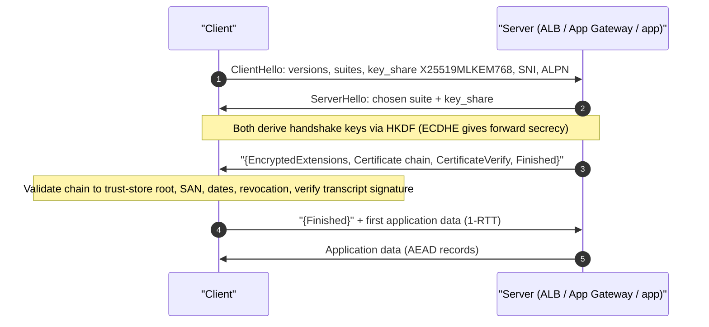
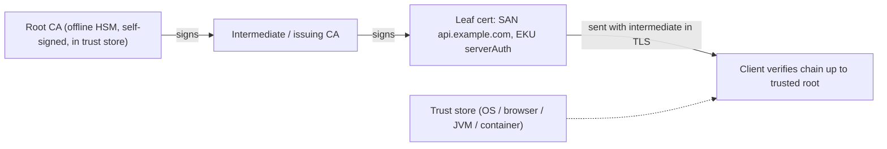
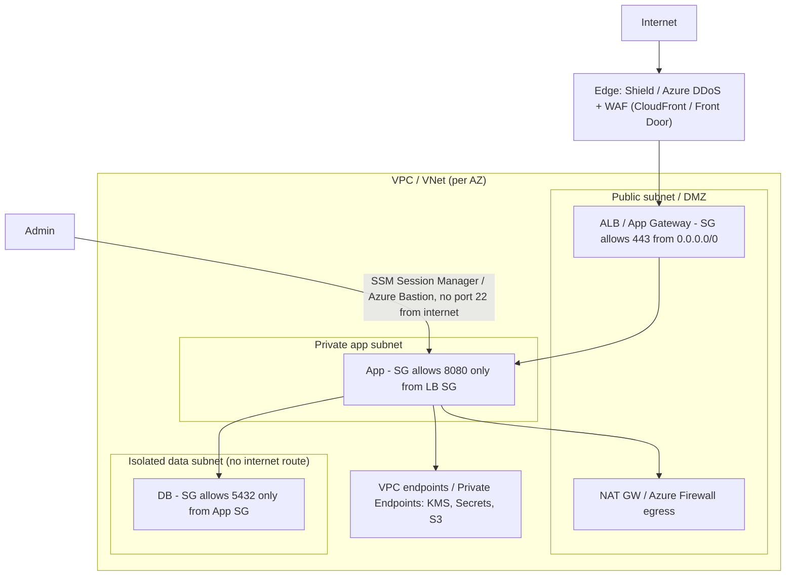
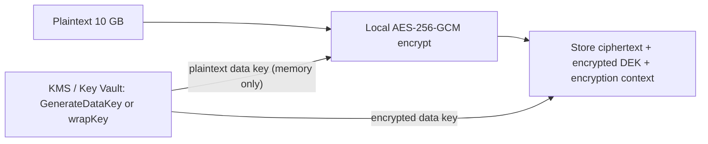

# C4 Security
> Last verified: 2026-10 · Audience: senior/staff DevOps, SRE, AI eng, NetEng, DevSecOps, architects

## TL;DR
- Frame every security answer with **CIA + authenticity + non-repudiation**, then name the **control per property**: encryption → confidentiality, MAC/hash → integrity, signatures/certs → authenticity and non-repudiation, redundancy/DDoS protection → availability.
- **Hybrid crypto is the norm**: asymmetric (ECDHE/RSA/ML-KEM) to agree on or wrap a key, symmetric **AEAD** (AES-256-GCM, ChaCha20-Poly1305) for bulk data. Same idea as KMS **envelope encryption**.
- **Hash ≠ MAC ≠ signature ≠ password hash.** SHA-256 gives integrity against accidents only. HMAC adds a shared secret. Signatures add public verifiability and non-repudiation. Passwords need a **slow, salted, memory-hard** KDF (Argon2id > scrypt > bcrypt > PBKDF2-FIPS).
- **PKI**: a cert binds a public key to a name and is signed by a CA. Clients build a **chain** up to a trust-store root, then check validity dates, SAN/hostname, EKU, revocation and (public web) CT. Root keys stay offline; intermediates do the issuing.
- **TLS 1.3**: 1-RTT handshake, ECDHE-only (forward secrecy), AEAD-only, encrypted certificate. **Hybrid PQ key exchange `X25519MLKEM768`** is now deployed, for example on AWS KMS/ACM/Secrets Manager endpoints since Apr 2025. PQC standards: **FIPS 203 ML-KEM, 204 ML-DSA, 205 SLH-DSA** (Aug 2024).
- **Network security means defence in depth**: edge (DDoS/WAF), then public subnet/DMZ (LB, bastion-less access), then private app subnets, then isolated data subnets. Use stateful SG/NSG with **least-privilege port rules** and **reference SGs instead of CIDRs**.
- **AuthN ("who are you") comes before AuthZ ("what may you do")**. Credentials only travel over TLS. Servers store verifiers, never secrets. **Stateful sessions** (opaque session ID in an `HttpOnly; Secure; SameSite` cookie, server-side store) give instant revocation in exchange for a shared session store.
- Cloud anchors: **KMS ↔ Key Vault / Managed HSM**, **CloudHSM ↔ Azure Cloud HSM**, **Private CA ↔ (no first-party; Key Vault + DigiCert/GlobalSign or AD CS)**, **WAF+Shield ↔ Azure WAF+DDoS Protection**, **Cognito ↔ Entra External ID** (Azure AD B2C stopped selling to new customers on 1 May 2025), **Secrets Manager ↔ Key Vault secrets**.

## C4.1 Security objectives
- **How it works:**
  - **Confidentiality**: only authorized parties can read the data. Controls: encryption in transit and at rest, access control, tokenization.
  - **Integrity**: data has not been altered undetected. Controls: MAC/HMAC, AEAD tags, signatures, checksums (accidental changes only), immutable logs.
  - **Availability**: the service is usable when needed. Controls: redundancy, DDoS mitigation, rate limiting, backups (see [C3 Reliability](./C3-reliability.md)).
  - Extended set: **Authenticity** (origin is who it claims to be), **Non-repudiation** (the signer cannot later deny the act; needs an **asymmetric signature** plus trusted timestamps and logs), **Accountability/auditability** (CloudTrail / Azure Activity Log), **Privacy**.
  - Threat-modelling lenses: **STRIDE** maps each threat to a property. Spoofing→authenticity, Tampering→integrity, Repudiation→non-repudiation, Information disclosure→confidentiality, DoS→availability, Elevation of privilege→authorization.
- **Trade-offs / when to use:**
  - The properties pull against each other. Strong encryption with lost keys destroys availability. Aggressive lockout protects confidentiality but enables DoS. Fail-closed vs fail-open is an availability-vs-security decision.
  - **HMAC cannot give non-repudiation**: both parties hold the same key, so either could have produced the tag. Only signatures can.
- **Interview angles:**
  - If asked "secure this system" → walk the CIA list for each data flow and trust boundary (STRIDE per boundary), then name the controls. Don't start with tools.
  - Pitfall: saying "we hash it for confidentiality". Hashing is not encryption, and low-entropy inputs (phone numbers, SSNs) are brute-forceable.
  - Principles to name-drop: **least privilege, defence in depth, secure by default, fail securely, separation of duties, zero trust** (→ [L7](../L-data-privacy-ai-security/L7-zero-trust-workload-identity.md)).

## C4.2 Symmetric key encryption
- **How it works:**
  - The same key encrypts and decrypts. It is fast (AES-NI gives GB/s per core), which makes it the choice for bulk data.
  - **AES** is a 128-bit block cipher with 128/192/256-bit keys (FIPS 197). The **mode** matters more than the key size:
    - **ECB**: never use it. Identical blocks give identical ciphertext (the "ECB penguin").
    - **CBC**: needs an unpredictable IV and padding. It is malleable and open to padding-oracle attacks, so it must be paired with a MAC (encrypt-then-MAC).
    - **CTR**: a stream mode that is parallelizable. It provides no integrity.
    - **GCM**: CTR plus a GHASH authentication tag, making it an **AEAD** (Authenticated Encryption with Associated Data). It uses a 96-bit nonce and a 128-bit tag, and the AAD is authenticated but not encrypted.
  - **GCM's catastrophic pitfall is nonce reuse under the same key**. It leaks the XOR of the plaintexts and lets an attacker forge tags. With random 96-bit nonces, NIST SP 800-38D caps a single key at about **2^32 invocations**. Rotate keys, or use **AES-GCM-SIV** or XChaCha20-Poly1305 (192-bit nonce) when nonce management is hard.
  - **ChaCha20-Poly1305** (RFC 8439) is the AEAD of choice on CPUs without AES hardware (mobile). It is one of TLS 1.3's suites.
  - **AWS KMS `SYMMETRIC_DEFAULT` = AES-256-GCM** (SM4 in China Regions). A direct `Encrypt` call takes at most **4,096 bytes**. Anything larger uses **envelope encryption**: `GenerateDataKey` returns a plaintext data key plus a copy wrapped by the KMS key, you encrypt locally, store the wrapped key next to the ciphertext, and discard the plaintext key.
  - **Quantum**: Grover's algorithm roughly halves effective key strength, so **AES-256 is still considered quantum-resistant** (about 128-bit effective). This is AWS's and Microsoft's stated position.
- **Trade-offs / when to use:**
  - Its weakness is **key distribution**: n parties need n(n−1)/2 pairwise keys. That is why it pairs with asymmetric crypto or a KMS.
  - Use symmetric crypto for data at rest (disk/DB/object TDE), the TLS record layer, and token encryption (JWE `A256GCM`).
- **Interview angles:**
  - If asked "AES-CBC or GCM?" → GCM (or ChaCha20-Poly1305), because AEAD gives integrity for free. Mention nonce uniqueness and the 2^32 random-nonce limit.
  - If asked "how does KMS encrypt a 10 GB file?" → it doesn't. Describe envelope encryption with data keys, caching data keys via the AWS Encryption SDK to save calls and cost, and including the **encryption context** as AAD so it is bound to the ciphertext and logged in CloudTrail.
  - Pitfall: hard-coded keys, keys in the same DB as the data, or rolling your own mode. Use libsodium, Tink, or the AWS Encryption SDK.

## C4.3 Public key encryption
- **How it works:**
  - A key pair: the **public key encrypts or verifies** and the **private key decrypts or signs**. It solves key distribution, but it is around 1000× slower than symmetric crypto and the message size is limited.
  - **RSA**: security rests on factoring.
    - Size: **2048-bit minimum** (≈112-bit security); **3072-bit ≈ 128-bit**.
    - Encryption padding: **OAEP**. PKCS#1 v1.5 encryption is open to Bleichenbacher/ROBOT attacks.
    - Signature padding: **PSS** preferred.
    - Plaintext limit: KMS `RSA_2048` + OAEP-SHA-256 encrypts at most **190 bytes**, from the formula `k/8 − 2·h/8 − 2`.
  - **ECC**: security rests on the elliptic-curve discrete log problem. Much smaller keys: **P-256 ≈ 128-bit security ≈ RSA-3072**. Common choices:
    - **X25519** for key agreement and **Ed25519** for signatures. Both are fast and resist misuse.
    - **ECDSA** P-256/P-384 for FIPS/CNSA. A **nonce reuse leaks the private key** (the PS3 hack), so use RFC 6979 deterministic nonces.
  - **Diffie-Hellman / ECDHE**: two parties derive a shared secret without ever sending it. Using *ephemeral* keys gives **forward secrecy**, so a later private-key theft cannot decrypt recorded traffic.
  - **Post-quantum cryptography** (Shor's algorithm breaks RSA, ECC and DH). NIST published these on **13 Aug 2024**:
    - **FIPS 203 ML-KEM** (Kyber; 512/768/1024): a KEM, which replaces key exchange.
    - **FIPS 204 ML-DSA** (Dilithium; 44/65/87): signatures.
    - **FIPS 205 SLH-DSA** (SPHINCS+): hash-based signatures, a conservative backup.
    - Coming next: FN-DSA (Falcon, FIPS 206) and HQC as a backup KEM (both **unverified status as of 2026-10**).
    - **NIST IR 8547** (still an *initial public draft*) proposes deprecating 112-bit RSA/ECC **after 2030** and disallowing all quantum-vulnerable public-key algorithms **after 2035** (dates **unverified against the final**).
  - **Harvest-now-decrypt-later** is why key exchange is migrating first: deployed hybrid **X25519MLKEM768** in TLS 1.3 (Chrome, Cloudflare, AWS endpoints). Signatures migrate later because they protect only live sessions.
  - Cloud PQC status:
    - **AWS KMS** offers **ML-DSA-44/65/87** keys (`ML_DSA_SHAKE_256`).
    - **AWS Private CA** issues **ML-DSA** certificates.
    - **Azure Key Vault/Managed HSM**: no ML-DSA/ML-KEM keys documented as of 2026-10. Microsoft points to AES-256 oct-HSM as "quantum-resistant".
- **Trade-offs / when to use:**
  - RSA is the broadest compatibility choice. ECC is smaller and faster (choose it for TLS and mobile). PQC keys and signatures are much larger: an ML-DSA-65 signature is about 3.3 KB versus 64 B for Ed25519, which hurts certificate chains and handshake size.
  - Hybrid mode (classical + PQ) hedges against immature PQ algorithms and keeps compliance.
- **Interview angles:**
  - If asked "why not encrypt everything with RSA?" → it is slow, size-limited and has no forward secrecy. Use it, or better ECDHE, to establish a symmetric key.
  - If asked "how do you prepare for quantum?" → crypto inventory and **crypto-agility**, hybrid KEM in TLS first (HNDL risk), then signing (code signing, long-lived roots). AES-256 and SHA-384 stay.
  - Pitfall: "ECC is less secure because the keys are shorter". Wrong: security per bit is much higher.

## C4.4 Secure network protocol
- **How it works:**
  - A secure protocol layers on confidentiality, integrity and peer authentication, plus replay protection. It needs a **handshake** that authenticates and agrees on keys, then a **record/data layer** that uses AEAD with sequence numbers.
  - The protocol you pick depends on the layer:

| Layer | Protocol | Typical use |
|---|---|---|
| L2 | MACsec (802.1AE) | DC links, Direct Connect / ExpressRoute Direct MACsec |
| L3 | IPsec (IKEv2 + ESP) | Site-to-site VPN (→ [G10](../G-cloud-network-architecture/G10-site-to-site-vpn.md)) |
| L3/L4 | WireGuard | Mesh/client VPN, Tailscale |
| L4+ | TLS 1.2/1.3, DTLS, QUIC (TLS 1.3 inside) | HTTPS, gRPC, mTLS, HTTP/3 |
| L7 | SSH, S/MIME, JOSE/JWS | Admin access, mail, tokens |

- **Trade-offs / when to use:** IPsec protects all traffic between networks but is complex to operate (NAT-T, IKE). TLS works per connection and is application-aware. Service mesh mTLS gives workload identity (→ [G14](../G-cloud-network-architecture/G14-service-to-service-networking.md)).
- **Interview angles:** If asked "the VPN is encrypted, do we still need TLS inside?" → yes. Use **end-to-end TLS/mTLS** under zero trust, because a VPN only protects the tunnel segment and trusts everything inside it.

## C4.5 SSL and TLS
- **How it works:**
  - **SSL 2.0/3.0 are dead** (POODLE; RFC 7568). **TLS 1.0/1.1 are deprecated** (RFC 8996, 2021). Accept only **TLS 1.2 and 1.3**. Azure retired TLS 1.0/1.1 platform-wide in 2025, and AWS endpoints require ≥1.2.
  - **TLS 1.3** (RFC 8446) changes:
    - Removes RSA key transport, static DH, CBC, RC4, SHA-1 and compression.
    - Has only 5 cipher suites, for example `TLS_AES_128_GCM_SHA256`, `TLS_AES_256_GCM_SHA384` and `TLS_CHACHA20_POLY1305_SHA256`.
    - Handshake is 1-RTT, with optional **0-RTT** (replayable, so only for idempotent requests).
    - Encrypts the certificate. SNI stays in clear text unless ECH is used.
  - In TLS 1.2, require **ECDHE + AEAD** suites (for example `ECDHE-ECDSA-AES128-GCM-SHA256`).
  - Termination options (→ [D2](../D-system-design/D2-reusable-parts-of-system-design.md)):
    - **Edge termination**: at the LB/CDN, then plaintext or re-encrypted to the backend.
    - **Passthrough**: an L4 LB, so TLS ends at the pod.
    - **mTLS**: the client presents a cert too.
- **Trade-offs / when to use:** terminating at the ALB/App Gateway enables WAF and L7 routing but breaks end-to-end encryption, so re-encrypt to the backend for compliance (PCI, HIPAA).
- **Interview angles:**
  - Full TLS internals, record layer, session resumption and ALPN are covered in [F5](../F-network-engineering/F5-popular-networking-protocols.md), [H4](../H-full-stack-troubleshooting/H4-transport-layer-security.md) and [I2](../I-dns-tls-acceleration-gaps/I2-tls-and-certificates.md). Here, just state the version policy and termination choice.
  - Pitfall: calling it "SSL" in a design doc is harmless, but **enabling** SSLv3/TLS 1.0 for an "old client" is a red flag. Use separate endpoints or listeners with distinct security policies instead (ELB `ELBSecurityPolicy-TLS13-1-2-2021-06`; App Gateway predefined policies).

## C4.6 Hashing
- **How it works:**
  - A cryptographic hash maps any input to a fixed-size digest. Three properties: **preimage resistance**, **second-preimage resistance** and **collision resistance** (birthday bound 2^(n/2)).
  - Algorithms:
    - **MD5 and SHA-1 are broken for collisions** (SHAttered 2017). SHA-1 is gone from WebPKI.
    - **SHA-2** (SHA-256/384/512) is the default.
    - **SHA-3/Keccak** (FIPS 202, sponge construction, includes SHAKE128/256 XOFs) is an alternative design. ML-DSA uses SHAKE.
    - **BLAKE2/BLAKE3** are fast non-FIPS options.
  - **Length-extension**: SHA-256(secret‖msg) is forgeable. That is why **HMAC** exists, and also why SHA-3 or SHA-512/256 are immune.
  - **HMAC** (RFC 2104) = `H((K⊕opad) ‖ H((K⊕ipad) ‖ m))`. It is a keyed MAC for integrity plus authenticity between parties who share a key. Uses: webhooks (Stripe/GitHub `X-Hub-Signature-256`), AWS **SigV4**, JWT `HS256`. KMS offers HMAC_224 to HMAC_512 keys (`GenerateMac`/`VerifyMac`).
  - **Compare tags in constant time** to avoid timing attacks.
  - **Password hashing** uses a deliberately slow, **salted** (unique per user, ≥16 B), memory-hard function. Parameters from the OWASP Password Storage Cheat Sheet:

| Algorithm | Minimum params (OWASP) | Notes |
|---|---|---|
| **Argon2id** (RFC 9106) | m=19 MiB, t=2, p=1 | First choice. Memory-hard, so it resists GPUs/ASICs |
| **scrypt** | N=2^17 (128 MiB), r=8, p=1 | When Argon2id is unavailable |
| **bcrypt** | cost ≥10 | Legacy. **72-byte input limit**, so pre-hash with HMAC-SHA-384 + pepper and base64 |
| **PBKDF2** | HMAC-SHA-256: 600,000 iterations; HMAC-SHA-512: 220,000 | When **FIPS-140** compliance is required |

  - **Pepper**: a secret shared across all passwords and stored **outside the DB** (KMS/HSM/Key Vault). It defeats offline cracking of a dumped DB.
- **Trade-offs / when to use:**
  - Fast hashes are right for integrity, dedup and content addressing (Git, S3 checksums, Merkle trees, ETags). They are **wrong** for passwords.
  - Slow KDFs cost CPU and RAM at login, which makes login an auth DoS vector. Rate-limit it and size the parameters to about 50–250 ms.
- **Interview angles:**
  - If asked "how do you store passwords?" → Argon2id with a per-user salt and parameters stored in the PHC string, a pepper in the KMS, rehash on login when parameters change, plus a breached-password check (HIBP k-anonymity). Follow **NIST SP 800-63B-4 (final, Jul 2025)**: no forced periodic rotation and no composition rules, length matters more.
  - Follow-up "what about salts?" → salts defeat rainbow tables and make identical passwords hash differently. They are not secret.
  - Pitfall: "SHA-256 with a salt is fine". It is not: GPUs compute billions per second.

## C4.7 Digital signatures
- **How it works:**
  - `sig = Sign(privKey, H(msg))`, and `Verify(pubKey, msg, sig)` checks it. Signatures provide **integrity + authenticity + non-repudiation** and are **publicly verifiable**.
  - Algorithms: RSA-PSS, ECDSA (P-256/384), **Ed25519** (deterministic and fast), and PQ **ML-DSA** (FIPS 204), with SLH-DSA (FIPS 205) for long-lived roots and firmware.
  - Uses:
    - X.509 certs and the TLS `CertificateVerify` message.
    - JWT `RS256`/`ES256`/`EdDSA`.
    - Code and container signing (**Sigstore/cosign**, AWS Signer, Notation with Azure Trusted Signing). See [L6](../L-data-privacy-ai-security/L6-secrets-supply-chain.md).
    - Git commits, DNSSEC, and S3 presigned URLs (SigV4 is technically an HMAC, not a signature).
  - KMS/Key Vault `Sign`/`Verify` keep the private key inside the HSM. The service sees only a digest, and an audit trail records every signing operation.
- **Trade-offs / when to use:**
  - Signature vs HMAC: signatures let **many verifiers** check without being able to forge, so use them for JWTs consumed by many services (JWKS). HMAC is faster but every verifier can also mint tokens.
  - Signing does **not** encrypt. Signed JWT payloads are readable base64.
- **Interview angles:**
  - If asked "how do microservices validate tokens without calling the IdP?" → asymmetric JWT signatures, a cached **JWKS** endpoint, and key rotation via `kid`.
  - Pitfalls:
    - `alg: none` and RS256→HS256 algorithm confusion. Pin the allowed algorithms.
    - ECDSA nonce reuse.
    - Signing without timestamps or transparency logs weakens non-repudiation.

## C4.8 Digital certificates
- **How it works:**
  - An **X.509 v3** cert (RFC 5280) holds: subject, **SAN** (browsers ignore CN), public key, issuer, serial, validity, **Key Usage/EKU** (serverAuth, clientAuth, codeSigning), **Basic Constraints** (CA:TRUE/FALSE, pathLen), **Name Constraints**, AIA (issuer URL, OCSP), CRL DP, and **SCTs**. The issuer's signature covers all of it.
  - Validation levels: **DV, OV, EV**. Browsers no longer show EV UI.
  - Issuance: you generate a key pair and a **CSR**. The CA validates control (**ACME** HTTP-01/DNS-01/TLS-ALPN-01 for Let's Encrypt, RFC 8555) and signs.
  - **Lifetimes are shrinking.** CA/B Forum ballot SC-081 (2025) cuts the maximum public TLS cert lifetime from 398 days to **200 days (Mar 2026), 100 days (Mar 2027), 47 days (Mar 2029)**. Status as of 2026-10: the 200-day step is in effect (**verify with your CA**). This makes **automated renewal mandatory**.
  - **Revocation**: CRL and OCSP, plus OCSP stapling. Let's Encrypt ended OCSP in 2025 in favour of CRLs. Browsers mostly use pushed CRL sets (CRLite, CRLSets). Short-lived certs are the real fix.
  - **Certificate Transparency** (RFC 6962): public append-only logs. Chrome and Safari require SCTs. Monitor crt.sh for mis-issuance against your domains.
  - Formats: PEM (base64), DER (binary), PKCS#12/PFX (cert + key, password-protected; Key Vault stores it as `application/x-pkcs12`).
- **Trade-offs / when to use:**
  - **Public CA** (ACM public certs, Let's Encrypt, DigiCert) for internet-facing names.
  - **Private CA** for mTLS, internal services, IoT and service mesh. It needs its own trust distribution.
  - Wildcards are convenient, but a single key compromise exposes every subdomain.
- **Interview angles:**
  - If asked "a cert expired in prod, how do you prevent that?" → ACME/ACM/Key Vault auto-renew, expiry alarms (ACM `DaysToExpiry` metric via EventBridge, Key Vault `CertificateNearExpiry` Event Grid event), and an inventory. Name the 47-day trajectory.
  - Pitfall: ACM public cert private keys **cannot be exported** (only to integrated services, or newer exportable public certs, **unverified pricing**). An EC2 or on-prem web server needs another source.

## C4.9 Chain of trust
- **How it works:**
  - The chain runs **leaf → intermediate CA(s) → root CA**. The root is self-signed and pre-installed in a **trust store** (OS, browser such as Mozilla NSS or Chrome Root Store, JVM `cacerts`, container `ca-certificates`).
  - Validation runs at each link: signature, validity window, Basic Constraints CA:TRUE, pathLen, Name Constraints, EKU, and revocation. Then hostname vs SAN on the leaf.
  - The **server must send leaf + intermediates** (not the root). A missing intermediate gives "works in Chrome (AIA fetching), fails in curl/Java/Go".
  - **Root keys stay offline** in an HSM, with key ceremonies. Intermediates issue certs and can be revoked or rotated without replacing roots everywhere.
  - Cross-signing extends trust to old devices (Let's Encrypt ISRG Root X1 was cross-signed by IdenTrust until 2024).
  - **Private PKI**: AWS Private CA builds root/subordinate hierarchies and enforces pathLen, Name Constraints and NotAfter ≤ issuer. CAs are **regional** and cannot be copied between Regions. Azure has no first-party managed private CA (see Cloud mapping).
- **Trade-offs / when to use:**
  - A deeper hierarchy gives better blast-radius isolation (a sub-CA per environment or BU) but larger handshakes and more to rotate.
  - Pinning (HPKP is dead) → pin to an internal CA or SPKI only for mobile apps and internal mTLS, with backup pins.
- **Interview angles:**
  - If asked to debug "certificate verify failed" → `openssl s_client -showcerts`, check for a missing intermediate, an expired intermediate, a wrong trust store in the container image, SAN mismatch, or clock skew. Full playbook: [H4](../H-full-stack-troubleshooting/H4-transport-layer-security.md).
  - Mention the trust anchor's **expiry** too. Root rotations (for example the Let's Encrypt chain changes) break old devices.

## C4.10 TLS/SSL handshake
- **How it works (TLS 1.3, 1-RTT):**
  - **ClientHello**: supported versions, cipher suites, `key_share` (X25519 and/or X25519MLKEM768), SNI, ALPN.
  - **ServerHello**: chosen suite plus its key share. Both sides derive handshake keys via HKDF.
  - The server then sends {EncryptedExtensions, **Certificate**, **CertificateVerify** (a signature over the transcript), Finished}, all encrypted.
  - The client verifies the chain and signature and sends Finished. Application data flows.
  - **TLS 1.2** takes 2-RTT, and with RSA key exchange it has no forward secrecy.
  - **Resumption**: PSK/session tickets. **0-RTT** early data is replayable.
  - **mTLS**: the server sends a CertificateRequest and the client responds with Certificate + CertificateVerify.
- **Trade-offs:**
  - Handshake cost is about 1 RTT plus asymmetric crypto, which is why to use **keep-alive, connection pooling and resumption**.
  - Hybrid PQ adds about 1.1–1.6 KB, but AWS reports negligible impact with connection reuse.
- **Interview angles:** Byte-level detail, Wireshark traces and QUIC differences live in [F5](../F-network-engineering/F5-popular-networking-protocols.md), [H4](../H-full-stack-troubleshooting/H4-transport-layer-security.md) and [I2](../I-dns-tls-acceleration-gaps/I2-tls-and-certificates.md). In a design interview, just say "1-RTT, ECDHE for forward secrecy, server proves key ownership with CertificateVerify, chain validated to a trusted root". See the sequence diagram below.

## C4.11 Secure network channel
- **How it works:** a secure channel = **authenticated key exchange** + **AEAD record protection** + **sequence numbers/nonces** (replay and reordering protection) + **key rotation/rekeying**. Examples: TLS, SSH, IPsec ESP and WireGuard all follow this shape.
- **Trade-offs / when to use:**
  - **Server-only auth** (typical web) leaves the client to authenticate at L7 with a password or token.
  - **Mutual auth** (mTLS, IPsec with certs) is right for service-to-service and B2B APIs.
  - Private connectivity (PrivateLink/Private Endpoint, → [G7](../G-cloud-network-architecture/G7-service-endpoints-private-link.md)) removes internet exposure but **is not encryption**. Keep TLS on top.
- **Interview angles:**
  - If asked "is traffic inside a VPC safe?" → AWS Nitro encrypts traffic between supported instance types, and Azure encrypts traffic between datacenters at the MACsec layer. Still, **compliance and zero trust expect TLS end-to-end**, and the platform guarantee is instance-type and path specific.
  - Pitfall: TLS with `verify=False` / `InsecureSkipVerify` gives encryption **without authentication**, which is a MITM-able channel.

## C4.12 Firewalls
- **How it works:**
  - **Packet filter (stateless)**: per-packet 5-tuple rules, so return traffic needs explicit rules (ephemeral ports **1024–65535**). Examples: AWS **NACLs** (ordered rules, explicit deny) and router ACLs.
  - **Stateful**: tracks connections (conntrack), so return traffic is allowed automatically. Examples: AWS **Security Groups** (allow-only, no deny), Azure **NSGs** (priority 100–4096, allow and deny, plus default rules), iptables/nftables.
  - **NGFW / L7**: app-ID, TLS inspection, IDS/IPS, FQDN filtering. Examples: **AWS Network Firewall** (Suricata rules), **Azure Firewall** (Standard/Premium; Premium adds TLS inspection and IDPS), Palo Alto, Fortinet.
  - **WAF**: an L7 HTTP filter against OWASP Top 10 attacks (SQLi, XSS), plus rate limiting and bot control. **AWS WAF** attaches to CloudFront, ALB, API Gateway, AppSync, Cognito and App Runner. **Azure WAF** attaches to App Gateway, App Gateway for Containers, Front Door and CDN (preview).
  - **Host firewall**: iptables/nftables, Windows Firewall, eBPF/Cilium policies, Kubernetes **NetworkPolicy** (→ [G1](../G-cloud-network-architecture/G1-virtual-network-fundamentals.md), [H2](../H-full-stack-troubleshooting/H2-troubleshooting-your-network.md)).
- **Trade-offs / when to use:**
  - Stateless filters are cheap and coarse, good for subnet-level deny lists.
  - Stateful filters are the default per workload.
  - NGFWs bring central egress control, TLS inspection and FQDN allow-lists, but they are a throughput and latency chokepoint, cost money, and usually need a hub (→ [G8](../G-cloud-network-architecture/G8-transit-hub.md)).
- **Interview angles:**
  - If asked "SG vs NACL?" → SG is stateful and attached to the ENI, allow-only, and all rules are evaluated. NACL is stateless at the subnet level, numbered rules are evaluated in order, it supports deny, and it needs ephemeral-port return rules.
  - Azure equivalents: NSG (stateful, subnet or NIC level, with **Application Security Groups** for tag-like grouping) and Azure Firewall/Firewall Manager.
  - Pitfall: a NACL that forgets ephemeral return ports gives a "connects then hangs" symptom.

## C4.13 Network security (subnets, DMZ, port rules)
- **How it works:**
  - **Segmentation by tier**:
    - **Public subnet/DMZ**: only the LB, NAT GW, and maybe a reverse proxy. Route 0.0.0.0/0 → IGW.
    - **Private app subnet**: egress via NAT GW or a firewall.
    - **Isolated data subnet**: no internet route, reached through VPC endpoints / Private Endpoints only.
  - Classic **DMZ (perimeter network)**: a screened subnet between two firewalls. In the cloud this becomes an LB/WAF in public subnets with workloads behind it. Azure's version is a hub VNet with Azure Firewall plus spokes (→ [G1](../G-cloud-network-architecture/G1-virtual-network-fundamentals.md), [G8](../G-cloud-network-architecture/G8-transit-hub.md)).
  - **Port rules (least privilege)**:
    - The LB SG allows 443 from 0.0.0.0/0 (80 only to redirect).
    - The app SG allows the app port **only from the LB SG ID**.
    - The DB SG allows 5432/3306 **only from the app SG**.
    - **No 22/3389 from the internet**. Use **SSM Session Manager / EC2 Instance Connect Endpoint** or **Azure Bastion** / JIT VM access.
  - **Egress control**: allow-list FQDNs through a firewall, block IMDS misuse (IMDSv2 with hop limit 1), and use VPC endpoints to keep S3/KMS traffic private.
  - **Microsegmentation**: Kubernetes NetworkPolicy, SG-per-service, Azure ASGs. Flow logs (VPC Flow Logs / VNet flow logs, since NSG flow logs are being retired) feed detection (→ [G5](../G-cloud-network-architecture/G5-traffic-monitoring-troubleshooting.md)).
- **Trade-offs / when to use:**
  - Flat networks are simple but have a large blast radius.
  - Microsegmentation means many rules to manage. Codify them in Terraform and use SG references or tags instead of IP lists.
  - The network perimeter alone is insufficient, so add identity-aware access (zero trust).
- **Interview angles:**
  - If asked to "draw a secure 3-tier VPC" → 3 subnet tiers × 2–3 AZs, SG chaining, NACL as a coarse guard, WAF + Shield at the edge, endpoints for AWS APIs, no public IPs on instances, bastion-less admin.
  - Pitfall: opening `0.0.0.0/0:22` "temporarily" (a top cause of compromise), or allowing the DB SG from the VPC CIDR instead of the app SG.

## C4.14 Authentication and authorization
- **How it works:**
  - **Authentication (AuthN)** proves identity using factors: something you **know** (password), **have** (TOTP, FIDO2 key, device cert) or **are** (biometric).
  - **MFA** combines two or more factor categories. **Phishing-resistant MFA = FIDO2/WebAuthn passkeys, smart cards/PIV**. SMS and TOTP are phishable, and NIST 800-63B-4 restricts SMS.
  - **Authorization (AuthZ)** decides what an authenticated principal may do:
    - **ACL**: a list on the resource.
    - **RBAC**: roles (→ C4.20).
    - **ABAC**: attributes/tags, for example AWS IAM `aws:PrincipalTag`.
    - **ReBAC**: relationships, as in Google Zanzibar/OpenFGA.
    - **Policy-as-code**: OPA/Rego, Cedar (Amazon Verified Permissions).
  - Protocols: **OIDC** = AuthN layered on **OAuth 2.0**, which is delegated AuthZ (→ C4.23+). **SAML 2.0** is the enterprise SSO standard.
  - Status codes: **401 Unauthorized** really means *unauthenticated*. **403 Forbidden** means authenticated but not authorized.
- **Trade-offs / when to use:** centralize AuthN in an IdP (Cognito, Entra ID, Okta) and enforce AuthZ **close to the resource**, at the API gateway for coarse checks and in the service for fine-grained checks.
- **Interview angles:**
  - If asked about the difference → "AuthN establishes identity, AuthZ evaluates permissions for that identity on a resource. AuthN usually happens once per session, AuthZ on every request."
  - Pitfall: **IDOR/BOLA** (OWASP API #1) means checking that the user is logged in but not that *this* user owns object 123.

## C4.15 Credentials transfer
- **How it works:**
  - **Only over TLS.** Use HSTS (`Strict-Transport-Security: max-age=63072000; includeSubDomains; preload`) to stop SSL-stripping.
  - **Password login**: POST the body over TLS, never in a URL or query string (it leaks into logs, history and Referer). The server hashes it on receipt.
  - **HTTP Basic** is base64, not encryption, so use it only over TLS (and avoid it).
  - **API keys / bearer tokens** go in the `Authorization: Bearer` header. **Avoid custom headers in logs**, and redact them in the LB/WAF/APM.
  - **Request signing**: **AWS SigV4** (HMAC over a canonical request plus a timestamp, with a 5-min replay window). The secret never travels.
  - **Challenge-response / zero-knowledge-style**: SCRAM-SHA-256 (PostgreSQL default since PG 14), **SRP** (Cognito `USER_SRP_AUTH`), and the WebAuthn challenge signed by the authenticator's private key.
  - **mTLS / certificate-bound tokens**: RFC 8705 and **DPoP** (RFC 9449) bind a token to a key, so a stolen token alone cannot be replayed.
  - **Machine credentials**: prefer **short-lived, federated** credentials (IAM roles via STS, IRSA/EKS Pod Identity, Azure Managed Identity, workload identity federation) over long-lived keys. See [L7](../L-data-privacy-ai-security/L7-zero-trust-workload-identity.md).
- **Trade-offs / when to use:** bearer tokens are simple and stateless, but anyone holding one can use it, so keep them short-lived and scoped. Sender-constrained tokens and signing are more complex and remove replay risk.
- **Interview angles:**
  - If asked "how do services authenticate to AWS without keys?" → instance profile or IRSA → STS `AssumeRoleWithWebIdentity` → temporary credentials (default role session 1 h, max 12 h).
  - Pitfalls: secrets in env vars that get dumped to logs, secrets in Git, credentials in query strings.

## C4.16 Credentials verification
- **How it works:**
  - **Passwords**:
    - Look up the user, then `Argon2id.verify(stored_hash, input)` in **constant time**.
    - Return a **generic error** ("invalid username or password") to prevent user enumeration, and run a dummy hash for unknown users to equalize timing.
    - **Throttle** per account and per IP, with exponential backoff. Plain lockout lets an attacker lock out your users (DoS).
    - Detect **credential stuffing** and **password spraying** (Cognito Plus "compromised credentials", Entra ID Protection).
  - **Tokens**: verify the signature against the JWKS (pinned algs), `exp`/`nbf` with ≤60 s clock skew, `iss`, `aud`, and scopes. Opaque tokens use **introspection** (RFC 7662).
  - **TOTP** (RFC 6238): 30 s step, ±1 window, prevent reuse.
  - **WebAuthn**: verify the signature over challenge + origin + RP ID. The origin binding is what makes it phishing-resistant.
  - **Certificates (mTLS)**: chain to the private CA, check revocation, then map subject/SAN to an identity.
  - **API keys**: store only a **hash** of the key (like a password, but a fast hash suffices for high-entropy random keys), with a visible prefix for lookup and leak scanning (for example `sk_live_…` and GitHub secret scanning).
- **Trade-offs:**
  - Stricter verification (tight skew, every claim checked) means more operational friction (NTP).
  - Introspection gives revocation in exchange for a network hop per request. Cache results for a few seconds.
- **Interview angles:** If asked "design a login endpoint" → TLS, a rate limiter (→ [C2](./C2-scalability.md)), generic errors, an Argon2id verify, MFA step-up, a breached-password check, audit log, then issue a session (C4.17) or tokens (C4.18).

## C4.17 Stateful authentication
- **How it works:**
  - After login the server creates a **session record** {session_id, user_id, roles, created, last_seen, MFA level, device} in a **server-side store**: in memory, **Redis/ElastiCache/Azure Managed Redis**, DynamoDB/Cosmos DB with TTL, or SQL.
  - The client receives only an **opaque random session ID** (≥128 bits from a CSPRNG) in a cookie: `Set-Cookie: sid=…; HttpOnly; Secure; SameSite=Lax; Path=/; Max-Age=…`. Prefer the `__Host-` prefix, which forces Secure, Path=/ and no Domain.
  - Each request looks up the session: valid → attach identity, expired or revoked → 401.
  - **Lifecycle**:
    - **Regenerate the ID on login and on privilege change** (prevents session fixation).
    - Idle timeout (for example 15–30 min) plus an absolute timeout (for example 8–12 h). OWASP suggests 2–5 min idle for high-value apps.
    - Delete server-side on logout.
    - Bind loosely to device or IP signals for anomaly detection.
  - **Scaling**:
    - Sticky sessions (ALB/App Gateway cookie affinity) are simple, but you lose sessions on node failure and get uneven load.
    - A **shared session store** is preferred because it lets the app tier stay stateless (→ [C2 Scalability](./C2-scalability.md)).
  - **CSRF**: cookie-based sessions are *automatically sent by the browser*, so they need SameSite plus anti-CSRF tokens (→ C4.34).
- **Trade-offs / when to use:**

| | Stateful session (opaque ID) | Stateless token (JWT, → C4.18) |
|---|---|---|
| Revocation | **Instant** (delete row) | Hard: wait for `exp`, or keep a denylist (which makes it stateful again) |
| Per-request cost | Store lookup (~sub-ms on Redis) | Signature verify, no I/O |
| Size on the wire | ~32–64 B cookie | 0.5–2+ KB header |
| Cross-domain/APIs/mobile | Awkward (cookies) | Natural |
| Data exposure | Nothing in the client | Claims readable (base64) |

  - Choose sessions for first-party web apps, banking and admin consoles where you need instant logout or kill. The **BFF pattern** keeps OAuth tokens server-side and gives the browser only a session cookie.
- **Interview angles:**
  - If asked "how do you log out a user everywhere?" → with sessions, delete every session for the user_id (keep a secondary index user→sessions). With JWTs, use short TTL + refresh-token revocation + a denylist on `jti`.
  - If asked "what if Redis dies?" → sessions are lost and users have to log in again. Mitigate with replication / Multi-AZ, persistence, or a fall back to re-auth. Session data is security state, so encrypt it in transit (TLS to Redis) and require AUTH/IAM auth.
  - Pitfalls: storing the session in `localStorage` (readable via XSS), not rotating the ID on login, long-lived "remember me" without a separate, revocable token.

<!-- PART2-IDS-GO-HERE -->

## Diagrams







```mermaid
sequenceDiagram
    participant B as "Browser"
    participant A as "App (stateless tier)"
    participant R as "Session store (Redis)"
    participant D as "User DB"
    B->>A: POST /login over TLS (username, password)
    A->>D: Fetch Argon2id hash + salt
    A->>A: Constant-time verify, rate limit, MFA
    A->>R: SET sess:RANDOM128 {uid, roles, mfa} EX 1800
    A->>B: "Set-Cookie: __Host-sid=RANDOM128; HttpOnly; Secure; SameSite=Lax"
    B->>A: GET /orders + cookie
    A->>R: GET sess:RANDOM128
    R-->>A: session or nil
    A-->>B: 200 or 401
    B->>A: POST /logout
    A->>R: DEL sess:RANDOM128 (instant revocation)
```



## Cloud mapping: AWS vs Azure

| Capability | AWS | Azure | Role it plays | Key differences | Alternatives |
|---|---|---|---|---|---|
| Managed key service (multi-tenant HSM-backed) | **AWS KMS** | **Azure Key Vault** (Standard / Premium) | Root keys and KEKs for envelope encryption, sign/verify, HMAC; CMK for platform services | KMS: FIPS 140-3 L3 HSMs for all keys; AES-256-GCM symmetric default; RSA/ECC/HMAC/**ML-DSA**; 4 KB direct-encrypt limit; multi-Region keys. Key Vault: Standard = software keys (FIPS 140-2 L1), Premium = HSM keys (new keys on FIPS 140-3 L3 platform); RSA/EC; **AES oct-HSM in vaults is preview**; also stores secrets and certs | GCP Cloud KMS, HashiCorp Vault Transit, Thales CipherTrust |
| Single-tenant managed HSM, PaaS-integrated | KMS **custom key store** (backed by CloudHSM) or **External Key Store (XKS)** | **Azure Key Vault Managed HSM** | Dedicated HSM for high-value keys that still integrates with platform CMK | Managed HSM: single-tenant, FIPS 140-3 L3 (Marvell LiquidSecurity), local RBAC, security domain, AES keys GA, Secure Key Release; EKM (external key mgmt) **preview**. AWS reaches this tier through KMS + CloudHSM key store; XKS keeps keys outside AWS | Fortanix DSM, Thales |
| Customer-administered HSM cluster (IaaS, PKCS#11) | **AWS CloudHSM** (hsm2m.medium; FIPS and non-FIPS cluster modes) | **Azure Cloud HSM** (3-node cluster, FIPS 140-3 L3); replaces **Azure Dedicated HSM** | Full control of HSM users and keys: PKCS#11/JCE/CNG, TLS offload, TDE, AD CS CA keys, code signing | Azure Cloud HSM is **IaaS-only** and does not integrate with PaaS CMK (use Managed HSM for that). AWS CloudHSM can back KMS custom key stores. Payment workloads: AWS Payment Cryptography vs Azure Payment HSM | On-prem Luna/nShield |
| Private CA / internal PKI | **AWS Private CA** (+ ACM private certs) | **No first-party managed private CA**. Options: Key Vault certificates with self-signed or **integrated DigiCert / GlobalSign** issuers, AD CS on VMs (keys in Cloud HSM), or partner CA | Issue internal TLS, mTLS, IoT and code-signing certs | AWS Private CA: regional, root + subordinate hierarchies, RSA/ECDSA/**ML-DSA**, general-purpose vs short-lived-cert modes, monthly per-CA + per-cert pricing; integrates with EKS (cert-manager aws-privateca-issuer). Key Vault manages lifecycle and auto-renew but the CA is external | HashiCorp Vault PKI, cert-manager, smallstep, Let's Encrypt (public), GCP CAS |
| Public TLS certs | **ACM** (free for integrated services) | App Service managed certs, Front Door managed certs, Key Vault + DigiCert/GlobalSign | Edge/public TLS with auto-renew | ACM keys mostly non-exportable; Front Door/App Gateway pull certs from Key Vault | Let's Encrypt, Cloudflare |
| L7 web app firewall | **AWS WAF** (CloudFront, ALB, API GW, AppSync, Cognito, App Runner) | **Azure WAF** (Application Gateway, App Gateway for Containers, Front Door, CDN preview) | OWASP rules, rate limits, bot control, geo/IP filtering | AWS: web ACL/protection pack with WCU capacity (1,500 default), managed rule groups, pay per ACL + rule + request. Azure: DRS/CRS managed rule sets; regional (AGW) vs global (Front Door) policy | Cloudflare WAF, Akamai, F5 |
| DDoS protection | **Shield Standard** (free, L3/4, automatic) / **Shield Advanced** (subscription + 1-yr commitment, SRT, cost protection, WAF fees included for protected resources, L7 auto-mitigation) | **DDoS infrastructure protection** (free) / **DDoS Network Protection** (per 100 IPs; rapid response, cost protection, WAF discount) / **DDoS IP Protection** (per IP, no DRR/cost protection) | Volumetric and protocol attack mitigation | Shield Advanced covers CloudFront, Route 53, Global Accelerator, ELB, EIP; billed per org payer. Azure tiers protect public IPs in VNets; NAT GW public IPs not supported | Cloudflare Magic Transit/Spectrum, Akamai Prolexic |
| Network firewalls | Security Groups (stateful), NACLs (stateless), **AWS Network Firewall** | NSGs + ASGs (stateful), **Azure Firewall** (Basic/Standard/Premium) | L3–L7 filtering, egress control, IDPS | AWS has two native layers (SG + NACL); Azure has one NSG layer with allow/deny + priority. Azure Firewall Premium includes TLS inspection + IDPS | Palo Alto VM-Series, Fortinet, Cilium |
| Customer identity (CIAM) | **Amazon Cognito user pools** (Lite / **Essentials default** / Plus) | **Microsoft Entra External ID** (external tenant; first 50k MAU free). **Azure AD B2C: no sales to new customers since 1 May 2025**; supported until at least May 2030 | Sign-up/sign-in, social/SAML/OIDC federation, MFA, OAuth2/OIDC tokens | Cognito Plus = compromised-credential and risk detection; Essentials = passkeys, email MFA, access-token customization. External ID = no custom policies (IEF), MSAL, native auth, custom auth extensions | Auth0/Okta CIAM, Keycloak, Firebase Auth/Identity Platform |
| Secrets store | **AWS Secrets Manager** (64 KB value, 100 versions, built-in Lambda rotation, cross-Region replication; GetSecretValue 10k TPS) | **Key Vault secrets** (25 KB value, versioned, soft-delete/purge protection; rotation via Event Grid near-expiry + Function) | DB creds, API keys, connection strings | Secrets Manager has native managed rotation (RDS etc.), per-secret pricing. Key Vault charges per operation and combines keys, secrets and certs in one vault (separate vaults per app/env) | SSM Parameter Store SecureString, HashiCorp Vault, External Secrets Operator |

- **KMS vs Key Vault**:
  - KMS is **regional**, with keys addressed by ARN, access through **key policies + IAM + grants**, and every call in **CloudTrail**.
  - Key Vault is a **regional resource with a global DNS name**, with access through **Azure RBAC** (recommended; access policies are legacy). **Soft-delete is mandatory**, and **purge protection** is required for most CMK scenarios (Storage, SQL TDE).
  - Both do envelope encryption for platform services ("SSE-KMS" ↔ "customer-managed keys").
  - **Gotcha**: deleting or disabling a CMK makes the data unreadable. KMS enforces a 7–30-day deletion wait, and Key Vault has a soft-delete retention of 7–90 days.
- **HSM tiers, from least to most control**:
  - AWS: KMS → KMS custom key store (CloudHSM) / XKS → CloudHSM.
  - Azure: Key Vault Standard → Key Vault Premium → **Managed HSM** → **Cloud HSM**.
  - Azure **Dedicated HSM** is being retired in favour of Cloud HSM (exact retirement date **unverified**).
  - Note the asymmetry: Azure Managed HSM is *single-tenant yet PaaS-integrated*, while AWS reaches that tier by composing KMS with CloudHSM.
- **Private CA**: AWS has a first-party managed CA. Azure does not. The usual Azure answer is "Key Vault manages cert lifecycle, with DigiCert/GlobalSign as integrated issuers for public or OV certs, and AD CS or Vault PKI (keys in Cloud HSM/Managed HSM) for private hierarchies".
- **WAF/DDoS**: AWS bundles WAF costs for resources covered by Shield Advanced (up to 1,500 WCUs, 50 billion requests/month). Azure gives a WAF *discount* with Network Protection. Both providers' free tiers handle L3/L4 only, so L7 floods need WAF rate rules.
- **CIAM**: if someone proposes **Azure AD B2C** for a new project, flag it. It has been end-of-sale since 1 May 2025, so new builds go on **Entra External ID**. Cognito's default plan for new pools is Essentials, and risk-based features need Plus.
- **Secrets**: Secrets Manager has native rotation with Lambda templates for RDS, Redshift and DocumentDB, and RDS can manage the master password itself. Key Vault rotation is event-driven (`SecretNearExpiry` → Function). Both should be fetched at runtime via workload identity (IRSA/Pod Identity ↔ Managed Identity) and the Secrets Store CSI driver in Kubernetes (→ [L6](../L-data-privacy-ai-security/L6-secrets-supply-chain.md)).
- **PQC readiness (2026-10)**:
  - AWS has ML-KEM hybrid TLS on KMS/ACM/Secrets Manager endpoints, ML-DSA keys in KMS, and ML-DSA certs in Private CA.
  - Azure: no ML-DSA/ML-KEM key types are documented in Key Vault/Managed HSM (verify before claiming).

## Hands-on (optional)

```bash
# 1. Inspect a chain and negotiated TLS params
openssl s_client -connect example.com:443 -servername example.com -showcerts </dev/null 2>/dev/null \
  | openssl x509 -noout -subject -issuer -dates -ext subjectAltName
curl -sv --tlsv1.3 https://example.com -o /dev/null 2>&1 | grep -E "SSL connection|ALPN|subject|issuer"

# 2. Symmetric AEAD vs hash vs HMAC
head -c 32 /dev/urandom > k.bin
echo -n "msg" | openssl dgst -sha256                                # hash: integrity only
echo -n "msg" | openssl dgst -sha256 -hmac "$(xxd -p -c64 k.bin)"   # HMAC: keyed integrity + authenticity

# 3. Ed25519 sign / verify
openssl genpkey -algorithm ed25519 -out priv.pem && openssl pkey -in priv.pem -pubout -out pub.pem
echo -n "release-1.2.3" > m.txt
openssl pkeyutl -sign -inkey priv.pem -rawin -in m.txt -out m.sig
openssl pkeyutl -verify -pubin -inkey pub.pem -rawin -in m.txt -sigfile m.sig

# 4. Envelope encryption with KMS
aws kms generate-data-key --key-id alias/app --key-spec AES_256 \
  --encryption-context app=orders --query '{p:Plaintext,c:CiphertextBlob}'

# 5. Argon2id password hash (argon2 CLI; -id, t=2, m=2^15 KiB=32 MiB, p=1)
echo -n "correct horse" | argon2 "$(head -c16 /dev/urandom | base64)" -id -t 2 -k 32768 -p 1 -e
```

```hcl
# SG chaining: DB reachable only from app SG; no SSH from the internet
resource "aws_security_group" "app" { name = "app" vpc_id = var.vpc_id }
resource "aws_security_group" "db"  { name = "db"  vpc_id = var.vpc_id }

resource "aws_vpc_security_group_ingress_rule" "db_from_app" {
  security_group_id            = aws_security_group.db.id
  referenced_security_group_id = aws_security_group.app.id
  ip_protocol = "tcp"
  from_port   = 5432
  to_port     = 5432
}

resource "aws_kms_key" "data" {
  description             = "orders CMK"
  enable_key_rotation     = true   # automatic yearly rotation (period configurable 90-2560 days)
  deletion_window_in_days = 30
}
```

## Cross-links
- TLS deep-dives: [F5 Popular networking protocols](../F-network-engineering/F5-popular-networking-protocols.md), [H4 Transport Layer Security](../H-full-stack-troubleshooting/H4-transport-layer-security.md), [I2 TLS and certificates](../I-dns-tls-acceleration-gaps/I2-tls-and-certificates.md), [D2 Reusable parts (D2.11, D2.12, D2.13)](../D-system-design/D2-reusable-parts-of-system-design.md)
- Firewalls/segmentation: [G1 Virtual network fundamentals (G1.7, G1.8)](../G-cloud-network-architecture/G1-virtual-network-fundamentals.md), [H2 Troubleshooting your network (H2.7)](../H-full-stack-troubleshooting/H2-troubleshooting-your-network.md), [G7 Service endpoints / Private Link](../G-cloud-network-architecture/G7-service-endpoints-private-link.md), [G8 Transit hub](../G-cloud-network-architecture/G8-transit-hub.md), [G5 Traffic monitoring](../G-cloud-network-architecture/G5-traffic-monitoring-troubleshooting.md)
- Keys, secrets and identity: [L2 Encryption & key management](../L-data-privacy-ai-security/L2-encryption-key-management.md), [L6 Secrets & supply chain](../L-data-privacy-ai-security/L6-secrets-supply-chain.md), [L7 Zero trust & workload identity](../L-data-privacy-ai-security/L7-zero-trust-workload-identity.md), [B12 Database security](../B-database-engineering/B12-database-security.md), [B13 Homomorphic encryption](../B-database-engineering/B13-homomorphic-encryption.md)
- Sessions and scaling: [C2 Scalability](./C2-scalability.md), [C3 Reliability](./C3-reliability.md), [G10 Site-to-site VPN](../G-cloud-network-architecture/G10-site-to-site-vpn.md), [G14 Service-to-service networking](../G-cloud-network-architecture/G14-service-to-service-networking.md)

## Sources
- https://csrc.nist.gov/pubs/fips/203/final (FIPS 203 ML-KEM, Aug 13 2024; companions FIPS 204/205)
- https://csrc.nist.gov/pubs/ir/8547/ipd (NIST IR 8547 PQC transition, initial public draft)
- https://csrc.nist.gov/pubs/sp/800/63/b/4/final (SP 800-63B-4, final Jul 2025)
- https://cheatsheetseries.owasp.org/cheatsheets/Password_Storage_Cheat_Sheet.html
- https://docs.aws.amazon.com/kms/latest/developerguide/overview.html
- https://docs.aws.amazon.com/kms/latest/developerguide/symm-asymm-choose-key-spec.html
- https://docs.aws.amazon.com/cloudhsm/latest/userguide/introduction.html
- https://docs.aws.amazon.com/privateca/latest/userguide/PcaWelcome.html
- https://docs.aws.amazon.com/waf/latest/developerguide/ddos-advanced-summary.html
- https://docs.aws.amazon.com/cognito/latest/developerguide/cognito-sign-in-feature-plans.html
- https://docs.aws.amazon.com/secretsmanager/latest/userguide/reference_limits.html
- https://aws.amazon.com/blogs/security/ml-kem-post-quantum-tls-now-supported-in-aws-kms-acm-and-secrets-manager/
- https://learn.microsoft.com/en-us/azure/key-vault/keys/about-keys
- https://learn.microsoft.com/en-us/azure/key-vault/managed-hsm/overview
- https://learn.microsoft.com/en-us/azure/cloud-hsm/overview
- https://learn.microsoft.com/en-us/azure/key-vault/certificates/how-to-integrate-certificate-authority
- https://learn.microsoft.com/en-us/azure/key-vault/secrets/about-secrets
- https://learn.microsoft.com/en-us/azure/web-application-firewall/overview
- https://learn.microsoft.com/en-us/azure/ddos-protection/ddos-protection-sku-comparison
- https://learn.microsoft.com/en-us/azure/active-directory-b2c/overview
- https://learn.microsoft.com/en-us/entra/external-id/customers/faq-customers
- https://www.rfc-editor.org/rfc/rfc8446 (TLS 1.3), https://www.rfc-editor.org/rfc/rfc5280 (X.509 profile)
