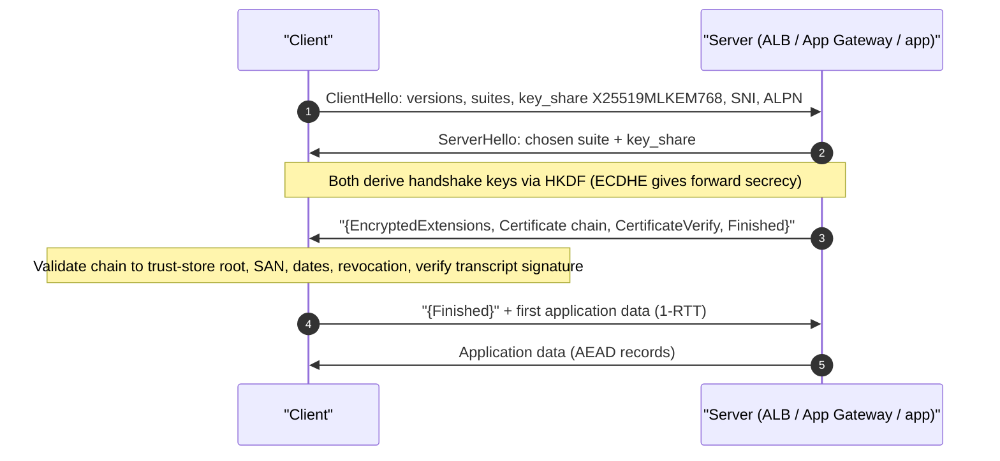
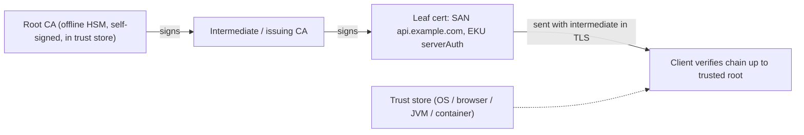
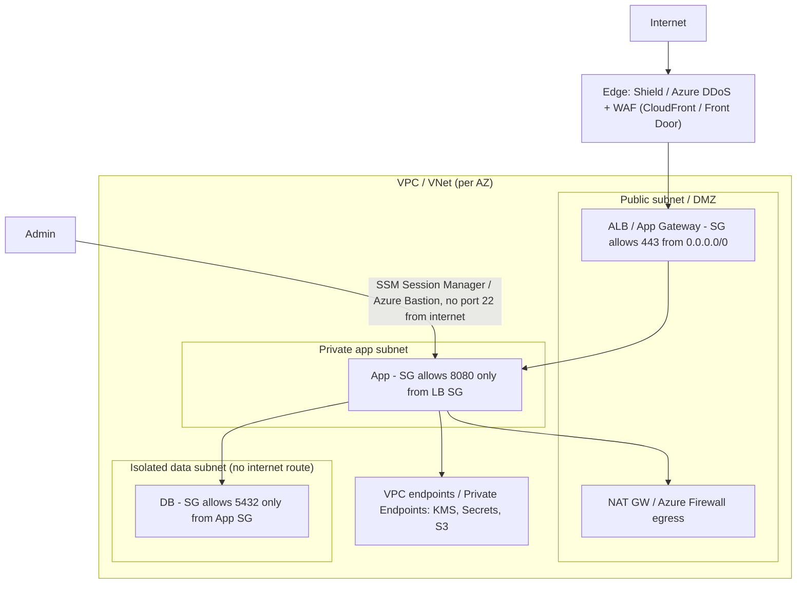
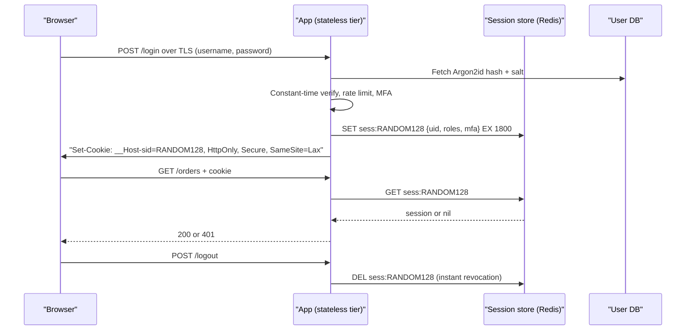
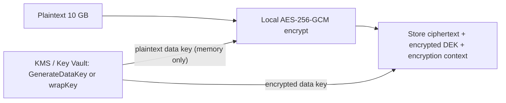
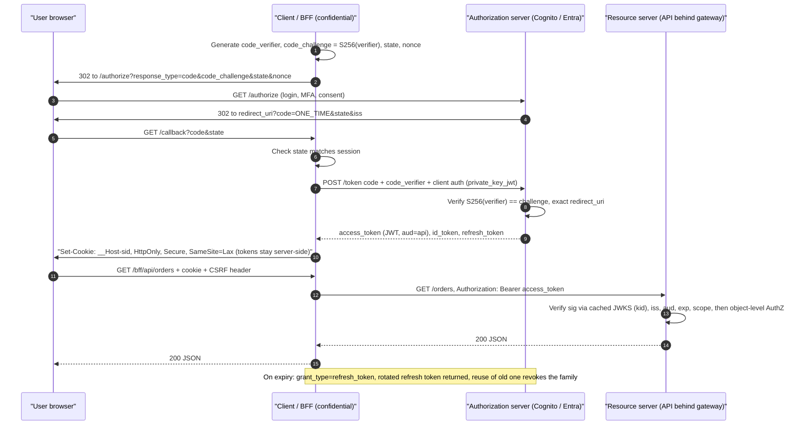
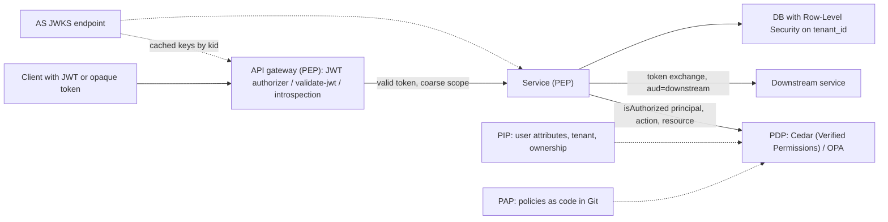

# C4 Security
> Last verified: 2026-10 · Audience: senior/staff DevOps, SRE, AI eng, NetEng, DevSecOps, architects

## TL;DR
- Frame every security answer with **CIA + authenticity + non-repudiation**, then name the **control per property**: encryption → confidentiality, MAC/hash → integrity, signatures/certs → authenticity and non-repudiation, redundancy/DDoS protection → availability.
- **Hybrid crypto is the norm**: asymmetric (ECDHE/RSA/ML-KEM) to agree on or wrap a key, symmetric **AEAD** (AES-256-GCM, ChaCha20-Poly1305) for bulk data. Same idea as KMS **envelope encryption**.
- **Hash ≠ MAC ≠ signature ≠ password hash.** SHA-256 gives integrity against accidents only. HMAC adds a shared secret. Signatures add public verifiability and non-repudiation. Passwords need a **slow, salted, memory-hard** KDF (Argon2id > scrypt > bcrypt > PBKDF2-FIPS).
- **PKI**: a cert binds a public key to a name and is signed by a CA. Clients build a **chain** up to a trust-store root, then check validity dates, SAN/hostname, EKU, revocation and (public web) CT. Root keys stay offline; intermediates do the issuing.
- **TLS 1.3**: 1-RTT handshake, ECDHE-only (forward secrecy), AEAD-only, encrypted certificate. **Hybrid PQ key exchange `X25519MLKEM768`** is now deployed, for example on AWS KMS/ACM/Secrets Manager endpoints since Apr 2025. PQC standards: **FIPS 203 ML-KEM, 204 ML-DSA, 205 SLH-DSA** (Aug 2024).
- **Network security means defence in depth**: edge (DDoS/WAF), then public subnet/DMZ (LB, bastion-less access), then private app subnets, then isolated data subnets. Use stateful SG/NSG with **least-privilege port rules** and **reference SGs instead of CIDRs**.
- **AuthN ("who are you") comes before AuthZ ("what may you do")**. Credentials only travel over TLS. Servers store verifiers, never secrets. **Stateful sessions** (opaque session ID in an `HttpOnly; Secure; SameSite` cookie, server-side store) give instant revocation in exchange for a shared session store.
- **Stateless auth = short-lived signed JWT access tokens + rotated, revocable refresh tokens**. Validate `alg` (allow-list), `kid` from the issuer's JWKS only, `iss`, `aud`, `exp`, `typ`, scopes. Revocation needs state somewhere (refresh store, denylist, introspection, CAE).
- **OAuth 2.0 is delegated AuthZ, OIDC adds AuthN (ID token)**. Use **auth code + PKCE** for users, **client credentials** for machines, **device code** for TVs/CLIs. **Password and implicit grants are out** (RFC 9700 "MUST NOT"; removed in OAuth 2.1, still an IETF draft as of 2026-10). SAML vs OIDC: XML assertion SSO for enterprise vs JSON/JWT for modern apps and APIs.
- **AuthZ**: RBAC for coarse capability, ABAC/ReBAC for tenant and object level, enforced at gateway + service + DB (RLS). BOLA/Broken Access Control is #1 (OWASP Top 10:2025 A01). **Browser token storage → BFF + `__Host-` HttpOnly SameSite cookie + strict CSP + CSRF token/Fetch Metadata**. SQLi → parameterized queries; XSS → contextual encoding + nonce CSP; CSRF → tokens + SameSite. WAFs are virtual patches.
- Cloud anchors: **KMS ↔ Key Vault / Managed HSM**, **CloudHSM ↔ Azure Cloud HSM**, **Private CA ↔ (no first-party; Key Vault + DigiCert/GlobalSign or AD CS)**, **WAF+Shield ↔ Azure WAF+DDoS Protection**, **Cognito ↔ Entra External ID** (Azure AD B2C stopped selling to new customers on 1 May 2025), **Secrets Manager ↔ Key Vault secrets**.

## C4.1 Security objectives
- **How it works:**
  - **Confidentiality**: only authorized parties can read the data. Controls: encryption in transit and at rest, access control, tokenization.
  - **Integrity**: data has not been altered undetected. Controls: MAC/HMAC, AEAD tags, signatures, checksums (accidental changes only), immutable logs.
  - **Availability**: the service is usable when needed. Controls: redundancy, DDoS mitigation, rate limiting, backups (see [C3 Reliability](./C3-reliability.md)).
  - Extended set: **Authenticity** (origin is who it claims to be), **Non-repudiation** (the signer cannot later deny the act; needs an **asymmetric signature** plus trusted timestamps and logs), **Accountability/auditability** (CloudTrail / Azure Activity Log), **Privacy**.
  - Threat-modelling lenses: **STRIDE** maps each threat to a property. Spoofing→authenticity, Tampering→integrity, Repudiation→non-repudiation, Information disclosure→confidentiality, DoS→availability, Elevation of privilege→authorization.
- **Trade-offs / when to use:**
  - The properties pull against each other. Strong encryption with lost keys destroys availability. Aggressive lockout protects confidentiality but enables DoS. Fail-closed vs fail-open is an availability-vs-security decision.
  - **HMAC cannot give non-repudiation**: both parties hold the same key, so either could have produced the tag. Only signatures can.
- **Interview angles:**
  - If asked "secure this system" → walk the CIA list for each data flow and trust boundary (STRIDE per boundary), then name the controls. Don't start with tools.
  - Pitfall: saying "we hash it for confidentiality". Hashing is not encryption, and low-entropy inputs (phone numbers, SSNs) are brute-forceable.
  - Principles to name-drop: **least privilege, defence in depth, secure by default, fail securely, separation of duties, zero trust** (→ [L7](../L-data-privacy-ai-security/L7-zero-trust-workload-identity.md)).

## C4.2 Symmetric key encryption
- **How it works:**
  - The same key encrypts and decrypts. It is fast (AES-NI gives GB/s per core), which makes it the choice for bulk data.
  - **AES** is a 128-bit block cipher with 128/192/256-bit keys (FIPS 197). The **mode** matters more than the key size:
    - **ECB**: never use it. Identical blocks give identical ciphertext (the "ECB penguin").
    - **CBC**: needs an unpredictable IV and padding. It is malleable and open to padding-oracle attacks, so it must be paired with a MAC (encrypt-then-MAC).
    - **CTR**: a stream mode that is parallelizable. It provides no integrity.
    - **GCM**: CTR plus a GHASH authentication tag, making it an **AEAD** (Authenticated Encryption with Associated Data). It uses a 96-bit nonce and a 128-bit tag, and the AAD is authenticated but not encrypted.
  - **GCM's catastrophic pitfall is nonce reuse under the same key**. It leaks the XOR of the plaintexts and lets an attacker forge tags. With random 96-bit nonces, NIST SP 800-38D caps a single key at about **2^32 invocations**. Rotate keys, or use **AES-GCM-SIV** or XChaCha20-Poly1305 (192-bit nonce) when nonce management is hard.
  - **ChaCha20-Poly1305** (RFC 8439) is the AEAD of choice on CPUs without AES hardware (mobile). It is one of TLS 1.3's suites.
  - **AWS KMS `SYMMETRIC_DEFAULT` = AES-256-GCM** (SM4 in China Regions). A direct `Encrypt` call takes at most **4,096 bytes**. Anything larger uses **envelope encryption**: `GenerateDataKey` returns a plaintext data key plus a copy wrapped by the KMS key, you encrypt locally, store the wrapped key next to the ciphertext, and discard the plaintext key.
  - **Quantum**: Grover's algorithm roughly halves effective key strength, so **AES-256 is still considered quantum-resistant** (about 128-bit effective). This is AWS's and Microsoft's stated position.
- **Trade-offs / when to use:**
  - Its weakness is **key distribution**: n parties need n(n−1)/2 pairwise keys. That is why it pairs with asymmetric crypto or a KMS.
  - Use symmetric crypto for data at rest (disk/DB/object TDE), the TLS record layer, and token encryption (JWE `A256GCM`).
- **Interview angles:**
  - If asked "AES-CBC or GCM?" → GCM (or ChaCha20-Poly1305), because AEAD gives integrity for free. Mention nonce uniqueness and the 2^32 random-nonce limit.
  - If asked "how does KMS encrypt a 10 GB file?" → it doesn't. Describe envelope encryption with data keys, caching data keys via the AWS Encryption SDK to save calls and cost, and including the **encryption context** as AAD so it is bound to the ciphertext and logged in CloudTrail.
  - Pitfall: hard-coded keys, keys in the same DB as the data, or rolling your own mode. Use libsodium, Tink, or the AWS Encryption SDK.

## C4.3 Public key encryption
- **How it works:**
  - A key pair: the **public key encrypts or verifies** and the **private key decrypts or signs**. It solves key distribution, but it is around 1000× slower than symmetric crypto and the message size is limited.
  - **RSA**: security rests on factoring.
    - Size: **2048-bit minimum** (≈112-bit security); **3072-bit ≈ 128-bit**.
    - Encryption padding: **OAEP**. PKCS#1 v1.5 encryption is open to Bleichenbacher/ROBOT attacks.
    - Signature padding: **PSS** preferred.
    - Plaintext limit: KMS `RSA_2048` + OAEP-SHA-256 encrypts at most **190 bytes**, from the formula `k/8 − 2·h/8 − 2`.
  - **ECC**: security rests on the elliptic-curve discrete log problem. Much smaller keys: **P-256 ≈ 128-bit security ≈ RSA-3072**. Common choices:
    - **X25519** for key agreement and **Ed25519** for signatures. Both are fast and resist misuse.
    - **ECDSA** P-256/P-384 for FIPS/CNSA. A **nonce reuse leaks the private key** (the PS3 hack), so use RFC 6979 deterministic nonces.
  - **Diffie-Hellman / ECDHE**: two parties derive a shared secret without ever sending it. Using *ephemeral* keys gives **forward secrecy**, so a later private-key theft cannot decrypt recorded traffic.
  - **Post-quantum cryptography** (Shor's algorithm breaks RSA, ECC and DH). NIST published these on **13 Aug 2024**:
    - **FIPS 203 ML-KEM** (Kyber; 512/768/1024): a KEM, which replaces key exchange.
    - **FIPS 204 ML-DSA** (Dilithium; 44/65/87): signatures.
    - **FIPS 205 SLH-DSA** (SPHINCS+): hash-based signatures, a conservative backup.
    - Coming next: FN-DSA (Falcon, FIPS 206) and HQC as a backup KEM (both **unverified status as of 2026-10**).
    - **NIST IR 8547** (still an *initial public draft*) proposes deprecating 112-bit RSA/ECC **after 2030** and disallowing all quantum-vulnerable public-key algorithms **after 2035** (dates **unverified against the final**).
  - **Harvest-now-decrypt-later** is why key exchange is migrating first: deployed hybrid **X25519MLKEM768** in TLS 1.3 (Chrome, Cloudflare, AWS endpoints). Signatures migrate later because they protect only live sessions.
  - Cloud PQC status:
    - **AWS KMS** offers **ML-DSA-44/65/87** keys (`ML_DSA_SHAKE_256`).
    - **AWS Private CA** issues **ML-DSA** certificates.
    - **Azure Key Vault/Managed HSM**: no ML-DSA/ML-KEM keys documented as of 2026-10. Microsoft points to AES-256 oct-HSM as "quantum-resistant".
- **Trade-offs / when to use:**
  - RSA is the broadest compatibility choice. ECC is smaller and faster (choose it for TLS and mobile). PQC keys and signatures are much larger: an ML-DSA-65 signature is about 3.3 KB versus 64 B for Ed25519, which hurts certificate chains and handshake size.
  - Hybrid mode (classical + PQ) hedges against immature PQ algorithms and keeps compliance.
- **Interview angles:**
  - If asked "why not encrypt everything with RSA?" → it is slow, size-limited and has no forward secrecy. Use it, or better ECDHE, to establish a symmetric key.
  - If asked "how do you prepare for quantum?" → crypto inventory and **crypto-agility**, hybrid KEM in TLS first (HNDL risk), then signing (code signing, long-lived roots). AES-256 and SHA-384 stay.
  - Pitfall: "ECC is less secure because the keys are shorter". Wrong: security per bit is much higher.

## C4.4 Secure network protocol
- **How it works:**
  - A secure protocol layers on confidentiality, integrity and peer authentication, plus replay protection. It needs a **handshake** that authenticates and agrees on keys, then a **record/data layer** that uses AEAD with sequence numbers.
  - The protocol you pick depends on the layer:

| Layer | Protocol | Typical use |
|---|---|---|
| L2 | MACsec (802.1AE) | DC links, Direct Connect / ExpressRoute Direct MACsec |
| L3 | IPsec (IKEv2 + ESP) | Site-to-site VPN (→ [G10](../G-cloud-network-architecture/G10-site-to-site-vpn.md)) |
| L3/L4 | WireGuard | Mesh/client VPN, Tailscale |
| L4+ | TLS 1.2/1.3, DTLS, QUIC (TLS 1.3 inside) | HTTPS, gRPC, mTLS, HTTP/3 |
| L7 | SSH, S/MIME, JOSE/JWS | Admin access, mail, tokens |

- **Trade-offs / when to use:** IPsec protects all traffic between networks but is complex to operate (NAT-T, IKE). TLS works per connection and is application-aware. Service mesh mTLS gives workload identity (→ [G14](../G-cloud-network-architecture/G14-service-to-service-networking.md)).
- **Interview angles:** If asked "the VPN is encrypted, do we still need TLS inside?" → yes. Use **end-to-end TLS/mTLS** under zero trust, because a VPN only protects the tunnel segment and trusts everything inside it.

## C4.5 SSL and TLS
- **How it works:**
  - **SSL 2.0/3.0 are dead** (POODLE; RFC 7568). **TLS 1.0/1.1 are deprecated** (RFC 8996, 2021). Accept only **TLS 1.2 and 1.3**. Azure retired TLS 1.0/1.1 platform-wide in 2025, and AWS endpoints require ≥1.2.
  - **TLS 1.3** (RFC 8446) changes:
    - Removes RSA key transport, static DH, CBC, RC4, SHA-1 and compression.
    - Has only 5 cipher suites, for example `TLS_AES_128_GCM_SHA256`, `TLS_AES_256_GCM_SHA384` and `TLS_CHACHA20_POLY1305_SHA256`.
    - Handshake is 1-RTT, with optional **0-RTT** (replayable, so only for idempotent requests).
    - Encrypts the certificate. SNI stays in clear text unless ECH is used.
  - In TLS 1.2, require **ECDHE + AEAD** suites (for example `ECDHE-ECDSA-AES128-GCM-SHA256`).
  - Termination options (→ [D2](../D-system-design/D2-reusable-parts-of-system-design.md)):
    - **Edge termination**: at the LB/CDN, then plaintext or re-encrypted to the backend.
    - **Passthrough**: an L4 LB, so TLS ends at the pod.
    - **mTLS**: the client presents a cert too.
- **Trade-offs / when to use:** terminating at the ALB/App Gateway enables WAF and L7 routing but breaks end-to-end encryption, so re-encrypt to the backend for compliance (PCI, HIPAA).
- **Interview angles:**
  - Full TLS internals, record layer, session resumption and ALPN are covered in [F5](../F-network-engineering/F5-popular-networking-protocols.md), [H4](../H-full-stack-troubleshooting/H4-transport-layer-security.md) and [I2](../I-dns-tls-acceleration-gaps/I2-tls-and-certificates.md). Here, just state the version policy and termination choice.
  - Pitfall: calling it "SSL" in a design doc is harmless, but **enabling** SSLv3/TLS 1.0 for an "old client" is a red flag. Use separate endpoints or listeners with distinct security policies instead (ELB `ELBSecurityPolicy-TLS13-1-2-2021-06`; App Gateway predefined policies).

## C4.6 Hashing
- **How it works:**
  - A cryptographic hash maps any input to a fixed-size digest. Three properties: **preimage resistance**, **second-preimage resistance** and **collision resistance** (birthday bound 2^(n/2)).
  - Algorithms:
    - **MD5 and SHA-1 are broken for collisions** (SHAttered 2017). SHA-1 is gone from WebPKI.
    - **SHA-2** (SHA-256/384/512) is the default.
    - **SHA-3/Keccak** (FIPS 202, sponge construction, includes SHAKE128/256 XOFs) is an alternative design. ML-DSA uses SHAKE.
    - **BLAKE2/BLAKE3** are fast non-FIPS options.
  - **Length-extension**: SHA-256(secret‖msg) is forgeable. That is why **HMAC** exists, and also why SHA-3 or SHA-512/256 are immune.
  - **HMAC** (RFC 2104) = `H((K⊕opad) ‖ H((K⊕ipad) ‖ m))`. It is a keyed MAC for integrity plus authenticity between parties who share a key. Uses: webhooks (Stripe/GitHub `X-Hub-Signature-256`), AWS **SigV4**, JWT `HS256`. KMS offers HMAC_224 to HMAC_512 keys (`GenerateMac`/`VerifyMac`).
  - **Compare tags in constant time** to avoid timing attacks.
  - **Password hashing** uses a deliberately slow, **salted** (unique per user, ≥16 B), memory-hard function. Parameters from the OWASP Password Storage Cheat Sheet:

| Algorithm | Minimum params (OWASP) | Notes |
|---|---|---|
| **Argon2id** (RFC 9106) | m=19 MiB, t=2, p=1 | First choice. Memory-hard, so it resists GPUs/ASICs |
| **scrypt** | N=2^17 (128 MiB), r=8, p=1 | When Argon2id is unavailable |
| **bcrypt** | cost ≥10 | Legacy. **72-byte input limit**, so pre-hash with HMAC-SHA-384 + pepper and base64 |
| **PBKDF2** | HMAC-SHA-256: 600,000 iterations; HMAC-SHA-512: 220,000 | When **FIPS-140** compliance is required |

  - **Pepper**: a secret shared across all passwords and stored **outside the DB** (KMS/HSM/Key Vault). It defeats offline cracking of a dumped DB.
- **Trade-offs / when to use:**
  - Fast hashes are right for integrity, dedup and content addressing (Git, S3 checksums, Merkle trees, ETags). They are **wrong** for passwords.
  - Slow KDFs cost CPU and RAM at login, which makes login an auth DoS vector. Rate-limit it and size the parameters to about 50–250 ms.
- **Interview angles:**
  - If asked "how do you store passwords?" → Argon2id with a per-user salt and parameters stored in the PHC string, a pepper in the KMS, rehash on login when parameters change, plus a breached-password check (HIBP k-anonymity). Follow **NIST SP 800-63B-4 (final, Jul 2025)**: no forced periodic rotation and no composition rules, length matters more.
  - Follow-up "what about salts?" → salts defeat rainbow tables and make identical passwords hash differently. They are not secret.
  - Pitfall: "SHA-256 with a salt is fine". It is not: GPUs compute billions per second.

## C4.7 Digital signatures
- **How it works:**
  - `sig = Sign(privKey, H(msg))`, and `Verify(pubKey, msg, sig)` checks it. Signatures provide **integrity + authenticity + non-repudiation** and are **publicly verifiable**.
  - Algorithms: RSA-PSS, ECDSA (P-256/384), **Ed25519** (deterministic and fast), and PQ **ML-DSA** (FIPS 204), with SLH-DSA (FIPS 205) for long-lived roots and firmware.
  - Uses:
    - X.509 certs and the TLS `CertificateVerify` message.
    - JWT `RS256`/`ES256`/`EdDSA`.
    - Code and container signing (**Sigstore/cosign**, AWS Signer, Notation with Azure Trusted Signing). See [L6](../L-data-privacy-ai-security/L6-secrets-supply-chain.md).
    - Git commits, DNSSEC, and S3 presigned URLs (SigV4 is technically an HMAC, not a signature).
  - KMS/Key Vault `Sign`/`Verify` keep the private key inside the HSM. The service sees only a digest, and an audit trail records every signing operation.
- **Trade-offs / when to use:**
  - Signature vs HMAC: signatures let **many verifiers** check without being able to forge, so use them for JWTs consumed by many services (JWKS). HMAC is faster but every verifier can also mint tokens.
  - Signing does **not** encrypt. Signed JWT payloads are readable base64.
- **Interview angles:**
  - If asked "how do microservices validate tokens without calling the IdP?" → asymmetric JWT signatures, a cached **JWKS** endpoint, and key rotation via `kid`.
  - Pitfalls:
    - `alg: none` and RS256→HS256 algorithm confusion. Pin the allowed algorithms.
    - ECDSA nonce reuse.
    - Signing without timestamps or transparency logs weakens non-repudiation.

## C4.8 Digital certificates
- **How it works:**
  - An **X.509 v3** cert (RFC 5280) holds: subject, **SAN** (browsers ignore CN), public key, issuer, serial, validity, **Key Usage/EKU** (serverAuth, clientAuth, codeSigning), **Basic Constraints** (CA:TRUE/FALSE, pathLen), **Name Constraints**, AIA (issuer URL, OCSP), CRL DP, and **SCTs**. The issuer's signature covers all of it.
  - Validation levels: **DV, OV, EV**. Browsers no longer show EV UI.
  - Issuance: you generate a key pair and a **CSR**. The CA validates control (**ACME** HTTP-01/DNS-01/TLS-ALPN-01 for Let's Encrypt, RFC 8555) and signs.
  - **Lifetimes are shrinking.** CA/B Forum ballot SC-081 (2025) cuts the maximum public TLS cert lifetime from 398 days to **200 days (Mar 2026), 100 days (Mar 2027), 47 days (Mar 2029)**. Status as of 2026-10: the 200-day step is in effect (**verify with your CA**). This makes **automated renewal mandatory**.
  - **Revocation**: CRL and OCSP, plus OCSP stapling. Let's Encrypt ended OCSP in 2025 in favour of CRLs. Browsers mostly use pushed CRL sets (CRLite, CRLSets). Short-lived certs are the real fix.
  - **Certificate Transparency** (RFC 6962): public append-only logs. Chrome and Safari require SCTs. Monitor crt.sh for mis-issuance against your domains.
  - Formats: PEM (base64), DER (binary), PKCS#12/PFX (cert + key, password-protected; Key Vault stores it as `application/x-pkcs12`).
- **Trade-offs / when to use:**
  - **Public CA** (ACM public certs, Let's Encrypt, DigiCert) for internet-facing names.
  - **Private CA** for mTLS, internal services, IoT and service mesh. It needs its own trust distribution.
  - Wildcards are convenient, but a single key compromise exposes every subdomain.
- **Interview angles:**
  - If asked "a cert expired in prod, how do you prevent that?" → ACME/ACM/Key Vault auto-renew, expiry alarms (ACM `DaysToExpiry` metric via EventBridge, Key Vault `CertificateNearExpiry` Event Grid event), and an inventory. Name the 47-day trajectory.
  - Pitfall: ACM public cert private keys **cannot be exported** (only to integrated services, or newer exportable public certs, **unverified pricing**). An EC2 or on-prem web server needs another source.

## C4.9 Chain of trust
- **How it works:**
  - The chain runs **leaf → intermediate CA(s) → root CA**. The root is self-signed and pre-installed in a **trust store** (OS, browser such as Mozilla NSS or Chrome Root Store, JVM `cacerts`, container `ca-certificates`).
  - Validation runs at each link: signature, validity window, Basic Constraints CA:TRUE, pathLen, Name Constraints, EKU, and revocation. Then hostname vs SAN on the leaf.
  - The **server must send leaf + intermediates** (not the root). A missing intermediate gives "works in Chrome (AIA fetching), fails in curl/Java/Go".
  - **Root keys stay offline** in an HSM, with key ceremonies. Intermediates issue certs and can be revoked or rotated without replacing roots everywhere.
  - Cross-signing extends trust to old devices (Let's Encrypt ISRG Root X1 was cross-signed by IdenTrust until 2024).
  - **Private PKI**: AWS Private CA builds root/subordinate hierarchies and enforces pathLen, Name Constraints and NotAfter ≤ issuer. CAs are **regional** and cannot be copied between Regions. Azure has no first-party managed private CA (see Cloud mapping).
- **Trade-offs / when to use:**
  - A deeper hierarchy gives better blast-radius isolation (a sub-CA per environment or BU) but larger handshakes and more to rotate.
  - Pinning (HPKP is dead) → pin to an internal CA or SPKI only for mobile apps and internal mTLS, with backup pins.
- **Interview angles:**
  - If asked to debug "certificate verify failed" → `openssl s_client -showcerts`, check for a missing intermediate, an expired intermediate, a wrong trust store in the container image, SAN mismatch, or clock skew. Full playbook: [H4](../H-full-stack-troubleshooting/H4-transport-layer-security.md).
  - Mention the trust anchor's **expiry** too. Root rotations (for example the Let's Encrypt chain changes) break old devices.

## C4.10 TLS/SSL handshake
- **How it works (TLS 1.3, 1-RTT):**
  - **ClientHello**: supported versions, cipher suites, `key_share` (X25519 and/or X25519MLKEM768), SNI, ALPN.
  - **ServerHello**: chosen suite plus its key share. Both sides derive handshake keys via HKDF.
  - The server then sends {EncryptedExtensions, **Certificate**, **CertificateVerify** (a signature over the transcript), Finished}, all encrypted.
  - The client verifies the chain and signature and sends Finished. Application data flows.
  - **TLS 1.2** takes 2-RTT, and with RSA key exchange it has no forward secrecy.
  - **Resumption**: PSK/session tickets. **0-RTT** early data is replayable.
  - **mTLS**: the server sends a CertificateRequest and the client responds with Certificate + CertificateVerify.
- **Trade-offs:**
  - Handshake cost is about 1 RTT plus asymmetric crypto, which is why to use **keep-alive, connection pooling and resumption**.
  - Hybrid PQ adds about 1.1–1.6 KB, but AWS reports negligible impact with connection reuse.
- **Interview angles:** Byte-level detail, Wireshark traces and QUIC differences live in [F5](../F-network-engineering/F5-popular-networking-protocols.md), [H4](../H-full-stack-troubleshooting/H4-transport-layer-security.md) and [I2](../I-dns-tls-acceleration-gaps/I2-tls-and-certificates.md). In a design interview, just say "1-RTT, ECDHE for forward secrecy, server proves key ownership with CertificateVerify, chain validated to a trusted root". See the sequence diagram below.

## C4.11 Secure network channel
- **How it works:** a secure channel = **authenticated key exchange** + **AEAD record protection** + **sequence numbers/nonces** (replay and reordering protection) + **key rotation/rekeying**. Examples: TLS, SSH, IPsec ESP and WireGuard all follow this shape.
- **Trade-offs / when to use:**
  - **Server-only auth** (typical web) leaves the client to authenticate at L7 with a password or token.
  - **Mutual auth** (mTLS, IPsec with certs) is right for service-to-service and B2B APIs.
  - Private connectivity (PrivateLink/Private Endpoint, → [G7](../G-cloud-network-architecture/G7-service-endpoints-private-link.md)) removes internet exposure but **is not encryption**. Keep TLS on top.
- **Interview angles:**
  - If asked "is traffic inside a VPC safe?" → AWS Nitro encrypts traffic between supported instance types, and Azure encrypts traffic between datacenters at the MACsec layer. Still, **compliance and zero trust expect TLS end-to-end**, and the platform guarantee is instance-type and path specific.
  - Pitfall: TLS with `verify=False` / `InsecureSkipVerify` gives encryption **without authentication**, which is a MITM-able channel.

## C4.12 Firewalls
- **How it works:**
  - **Packet filter (stateless)**: per-packet 5-tuple rules, so return traffic needs explicit rules (ephemeral ports **1024–65535**). Examples: AWS **NACLs** (ordered rules, explicit deny) and router ACLs.
  - **Stateful**: tracks connections (conntrack), so return traffic is allowed automatically. Examples: AWS **Security Groups** (allow-only, no deny), Azure **NSGs** (priority 100–4096, allow and deny, plus default rules), iptables/nftables.
  - **NGFW / L7**: app-ID, TLS inspection, IDS/IPS, FQDN filtering. Examples: **AWS Network Firewall** (Suricata rules), **Azure Firewall** (Standard/Premium; Premium adds TLS inspection and IDPS), Palo Alto, Fortinet.
  - **WAF**: an L7 HTTP filter against OWASP Top 10 attacks (SQLi, XSS), plus rate limiting and bot control. **AWS WAF** attaches to CloudFront, ALB, API Gateway, AppSync, Cognito and App Runner. **Azure WAF** attaches to App Gateway, App Gateway for Containers, Front Door and CDN (preview).
  - **Host firewall**: iptables/nftables, Windows Firewall, eBPF/Cilium policies, Kubernetes **NetworkPolicy** (→ [G1](../G-cloud-network-architecture/G1-virtual-network-fundamentals.md), [H2](../H-full-stack-troubleshooting/H2-troubleshooting-your-network.md)).
- **Trade-offs / when to use:**
  - Stateless filters are cheap and coarse, good for subnet-level deny lists.
  - Stateful filters are the default per workload.
  - NGFWs bring central egress control, TLS inspection and FQDN allow-lists, but they are a throughput and latency chokepoint, cost money, and usually need a hub (→ [G8](../G-cloud-network-architecture/G8-transit-hub.md)).
- **Interview angles:**
  - If asked "SG vs NACL?" → SG is stateful and attached to the ENI, allow-only, and all rules are evaluated. NACL is stateless at the subnet level, numbered rules are evaluated in order, it supports deny, and it needs ephemeral-port return rules.
  - Azure equivalents: NSG (stateful, subnet or NIC level, with **Application Security Groups** for tag-like grouping) and Azure Firewall/Firewall Manager.
  - Pitfall: a NACL that forgets ephemeral return ports gives a "connects then hangs" symptom.

## C4.13 Network security (subnets, DMZ, port rules)
- **How it works:**
  - **Segmentation by tier**:
    - **Public subnet/DMZ**: only the LB, NAT GW, and maybe a reverse proxy. Route 0.0.0.0/0 → IGW.
    - **Private app subnet**: egress via NAT GW or a firewall.
    - **Isolated data subnet**: no internet route, reached through VPC endpoints / Private Endpoints only.
  - Classic **DMZ (perimeter network)**: a screened subnet between two firewalls. In the cloud this becomes an LB/WAF in public subnets with workloads behind it. Azure's version is a hub VNet with Azure Firewall plus spokes (→ [G1](../G-cloud-network-architecture/G1-virtual-network-fundamentals.md), [G8](../G-cloud-network-architecture/G8-transit-hub.md)).
  - **Port rules (least privilege)**:
    - The LB SG allows 443 from 0.0.0.0/0 (80 only to redirect).
    - The app SG allows the app port **only from the LB SG ID**.
    - The DB SG allows 5432/3306 **only from the app SG**.
    - **No 22/3389 from the internet**. Use **SSM Session Manager / EC2 Instance Connect Endpoint** or **Azure Bastion** / JIT VM access.
  - **Egress control**: allow-list FQDNs through a firewall, block IMDS misuse (IMDSv2 with hop limit 1), and use VPC endpoints to keep S3/KMS traffic private.
  - **Microsegmentation**: Kubernetes NetworkPolicy, SG-per-service, Azure ASGs. Flow logs (VPC Flow Logs / VNet flow logs, since NSG flow logs are being retired) feed detection (→ [G5](../G-cloud-network-architecture/G5-traffic-monitoring-troubleshooting.md)).
- **Trade-offs / when to use:**
  - Flat networks are simple but have a large blast radius.
  - Microsegmentation means many rules to manage. Codify them in Terraform and use SG references or tags instead of IP lists.
  - The network perimeter alone is insufficient, so add identity-aware access (zero trust).
- **Interview angles:**
  - If asked to "draw a secure 3-tier VPC" → 3 subnet tiers × 2–3 AZs, SG chaining, NACL as a coarse guard, WAF + Shield at the edge, endpoints for AWS APIs, no public IPs on instances, bastion-less admin.
  - Pitfall: opening `0.0.0.0/0:22` "temporarily" (a top cause of compromise), or allowing the DB SG from the VPC CIDR instead of the app SG.

## C4.14 Authentication and authorization
- **How it works:**
  - **Authentication (AuthN)** proves identity using factors: something you **know** (password), **have** (TOTP, FIDO2 key, device cert) or **are** (biometric).
  - **MFA** combines two or more factor categories. **Phishing-resistant MFA = FIDO2/WebAuthn passkeys, smart cards/PIV**. SMS and TOTP are phishable, and NIST 800-63B-4 restricts SMS.
  - **Authorization (AuthZ)** decides what an authenticated principal may do:
    - **ACL**: a list on the resource.
    - **RBAC**: roles (→ C4.20).
    - **ABAC**: attributes/tags, for example AWS IAM `aws:PrincipalTag`.
    - **ReBAC**: relationships, as in Google Zanzibar/OpenFGA.
    - **Policy-as-code**: OPA/Rego, Cedar (Amazon Verified Permissions).
  - Protocols: **OIDC** = AuthN layered on **OAuth 2.0**, which is delegated AuthZ (→ C4.23+). **SAML 2.0** is the enterprise SSO standard.
  - Status codes: **401 Unauthorized** really means *unauthenticated*. **403 Forbidden** means authenticated but not authorized.
- **Trade-offs / when to use:** centralize AuthN in an IdP (Cognito, Entra ID, Okta) and enforce AuthZ **close to the resource**, at the API gateway for coarse checks and in the service for fine-grained checks.
- **Interview angles:**
  - If asked about the difference → "AuthN establishes identity, AuthZ evaluates permissions for that identity on a resource. AuthN usually happens once per session, AuthZ on every request."
  - Pitfall: **IDOR/BOLA** (OWASP API #1) means checking that the user is logged in but not that *this* user owns object 123.

## C4.15 Credentials transfer
- **How it works:**
  - **Only over TLS.** Use HSTS (`Strict-Transport-Security: max-age=63072000; includeSubDomains; preload`) to stop SSL-stripping.
  - **Password login**: POST the body over TLS, never in a URL or query string (it leaks into logs, history and Referer). The server hashes it on receipt.
  - **HTTP Basic** is base64, not encryption, so use it only over TLS (and avoid it).
  - **API keys / bearer tokens** go in the `Authorization: Bearer` header. **Avoid custom headers in logs**, and redact them in the LB/WAF/APM.
  - **Request signing**: **AWS SigV4** (HMAC over a canonical request plus a timestamp, with a 5-min replay window). The secret never travels.
  - **Challenge-response / zero-knowledge-style**: SCRAM-SHA-256 (PostgreSQL default since PG 14), **SRP** (Cognito `USER_SRP_AUTH`), and the WebAuthn challenge signed by the authenticator's private key.
  - **mTLS / certificate-bound tokens**: RFC 8705 and **DPoP** (RFC 9449) bind a token to a key, so a stolen token alone cannot be replayed.
  - **Machine credentials**: prefer **short-lived, federated** credentials (IAM roles via STS, IRSA/EKS Pod Identity, Azure Managed Identity, workload identity federation) over long-lived keys. See [L7](../L-data-privacy-ai-security/L7-zero-trust-workload-identity.md).
- **Trade-offs / when to use:** bearer tokens are simple and stateless, but anyone holding one can use it, so keep them short-lived and scoped. Sender-constrained tokens and signing are more complex and remove replay risk.
- **Interview angles:**
  - If asked "how do services authenticate to AWS without keys?" → instance profile or IRSA → STS `AssumeRoleWithWebIdentity` → temporary credentials (default role session 1 h, max 12 h).
  - Pitfalls: secrets in env vars that get dumped to logs, secrets in Git, credentials in query strings.

## C4.16 Credentials verification
- **How it works:**
  - **Passwords**:
    - Look up the user, then `Argon2id.verify(stored_hash, input)` in **constant time**.
    - Return a **generic error** ("invalid username or password") to prevent user enumeration, and run a dummy hash for unknown users to equalize timing.
    - **Throttle** per account and per IP, with exponential backoff. Plain lockout lets an attacker lock out your users (DoS).
    - Detect **credential stuffing** and **password spraying** (Cognito Plus "compromised credentials", Entra ID Protection).
  - **Tokens**: verify the signature against the JWKS (pinned algs), `exp`/`nbf` with ≤60 s clock skew, `iss`, `aud`, and scopes. Opaque tokens use **introspection** (RFC 7662).
  - **TOTP** (RFC 6238): 30 s step, ±1 window, prevent reuse.
  - **WebAuthn**: verify the signature over challenge + origin + RP ID. The origin binding is what makes it phishing-resistant.
  - **Certificates (mTLS)**: chain to the private CA, check revocation, then map subject/SAN to an identity.
  - **API keys**: store only a **hash** of the key (like a password, but a fast hash suffices for high-entropy random keys), with a visible prefix for lookup and leak scanning (for example `sk_live_…` and GitHub secret scanning).
- **Trade-offs:**
  - Stricter verification (tight skew, every claim checked) means more operational friction (NTP).
  - Introspection gives revocation in exchange for a network hop per request. Cache results for a few seconds.
- **Interview angles:** If asked "design a login endpoint" → TLS, a rate limiter (→ [C2](./C2-scalability.md)), generic errors, an Argon2id verify, MFA step-up, a breached-password check, audit log, then issue a session (C4.17) or tokens (C4.18).

## C4.17 Stateful authentication
- **How it works:**
  - After login the server creates a **session record** {session_id, user_id, roles, created, last_seen, MFA level, device} in a **server-side store**: in memory, **Redis/ElastiCache/Azure Managed Redis**, DynamoDB/Cosmos DB with TTL, or SQL.
  - The client receives only an **opaque random session ID** (≥128 bits from a CSPRNG) in a cookie: `Set-Cookie: sid=…; HttpOnly; Secure; SameSite=Lax; Path=/; Max-Age=…`. Prefer the `__Host-` prefix, which forces Secure, Path=/ and no Domain.
  - Each request looks up the session: valid → attach identity, expired or revoked → 401.
  - **Lifecycle**:
    - **Regenerate the ID on login and on privilege change** (prevents session fixation).
    - Idle timeout (for example 15–30 min) plus an absolute timeout (for example 8–12 h). OWASP suggests 2–5 min idle for high-value apps.
    - Delete server-side on logout.
    - Bind loosely to device or IP signals for anomaly detection.
  - **Scaling**:
    - Sticky sessions (ALB/App Gateway cookie affinity) are simple, but you lose sessions on node failure and get uneven load.
    - A **shared session store** is preferred because it lets the app tier stay stateless (→ [C2 Scalability](./C2-scalability.md)).
  - **CSRF**: cookie-based sessions are *automatically sent by the browser*, so they need SameSite plus anti-CSRF tokens (→ C4.34).
- **Trade-offs / when to use:**

| | Stateful session (opaque ID) | Stateless token (JWT, → C4.18) |
|---|---|---|
| Revocation | **Instant** (delete row) | Hard: wait for `exp`, or keep a denylist (which makes it stateful again) |
| Per-request cost | Store lookup (~sub-ms on Redis) | Signature verify, no I/O |
| Size on the wire | ~32–64 B cookie | 0.5–2+ KB header |
| Cross-domain/APIs/mobile | Awkward (cookies) | Natural |
| Data exposure | Nothing in the client | Claims readable (base64) |

  - Choose sessions for first-party web apps, banking and admin consoles where you need instant logout or kill. The **BFF pattern** keeps OAuth tokens server-side and gives the browser only a session cookie.
- **Interview angles:**
  - If asked "how do you log out a user everywhere?" → with sessions, delete every session for the user_id (keep a secondary index user→sessions). With JWTs, use short TTL + refresh-token revocation + a denylist on `jti`.
  - If asked "what if Redis dies?" → sessions are lost and users have to log in again. Mitigate with replication / Multi-AZ, persistence, or a fall back to re-auth. Session data is security state, so encrypt it in transit (TLS to Redis) and require AUTH/IAM auth.
  - Pitfalls: storing the session in `localStorage` (readable via XSS), not rotating the ID on login, long-lived "remember me" without a separate, revocable token.

## C4.18 Stateless authentication
- **How it works:**
  - The server issues a **self-contained, signed token** (usually a **JWT**, → C4.28) holding identity and claims (`sub`, `iss`, `aud`, `exp`, `scope`, roles). Any instance verifies it **locally** with the issuer's public key (JWKS), so there is no session-store lookup.
  - Pattern: **short-lived access token** (5–60 min; Cognito default 1 h, configurable 5 min–1 day; Entra default 60–90 min randomized) + **long-lived refresh token** (Cognito default 30 days, range 60 min–10 years; Entra 90 days, **24 h for SPAs**) that is stored and revocable at the authorization server.
  - The "stateless" part is only the **resource server** side. Revocation needs some state: refresh-token store, `jti` denylist, `tokens_valid_after` per user, or introspection.
  - **HMAC-signed (HS256)** tokens mean every verifier can mint tokens. Use **asymmetric (RS256/ES256/EdDSA)** whenever more than one service verifies.
- **Trade-offs / when to use:**
  - Wins: horizontal scale with no shared store, cross-domain and mobile friendly, works across microservices and gateways, cheap per-request check (~tens of µs for ES256/RS256 verify).
  - Costs: **no instant revocation** (a token is valid until `exp`), bigger requests (0.5–2+ KB, can hit header-size limits such as 8 KB on many proxies), claims are readable, and **stale authorization** (roles changed but the token still says admin until expiry).
  - Mitigations: keep access-token TTL ≤15 min for sensitive APIs, rotate refresh tokens, sender-constrain tokens (DPoP/mTLS), push **revocation events** (Entra **Continuous Access Evaluation** gives near-real-time revocation for CAE-aware resources).
- **Interview angles:**
  - If asked "JWT or sessions?" → "Sessions (C4.17) for a first-party web app with instant logout; JWT access tokens for APIs and service-to-service. Often both: BFF holds tokens, browser holds a session cookie (C4.29)."
  - If asked "how do you revoke a JWT?" → short TTL + revoke the refresh token + denylist `jti` (in Redis with TTL = remaining lifetime) for emergencies, or switch high-risk APIs to opaque tokens + introspection.
  - Pitfall: putting PII or secrets in the payload (it is only base64url), or using JWTs as long-lived sessions stored in `localStorage`.

## C4.19 Single Sign-On
- **How it works:**
  - The user authenticates **once at an Identity Provider (IdP)**. Each application (**Service Provider / Relying Party**) trusts signed assertions from the IdP instead of holding passwords. The IdP keeps its own session cookie, so later apps get a silent redirect.
  - **SAML 2.0** (2005, XML): SP-initiated flow = SP sends `AuthnRequest` (HTTP-Redirect binding) → IdP authenticates → browser POSTs a **signed XML `<Assertion>`** to the SP's **ACS URL** (HTTP-POST binding). Trust is configured through **metadata XML** (entity ID, certs, endpoints). IdP-initiated SSO exists but has no request to bind to, so it is more open to injection.
  - **OIDC** (2014, JSON/REST on OAuth 2.0): authorization code flow (+PKCE) returns an **ID token (JWT)** plus access token. Discovery via `/.well-known/openid-configuration`, keys via `jwks_uri`, replay protection with `nonce`, user info via `/userinfo`.
  - **Provisioning is separate from SSO**: **SCIM 2.0** (RFC 7643/7644) creates and deprovisions accounts. JIT provisioning creates them on first login but never removes them.
  - **Logout** is the hard part: SAML SLO and OIDC front-channel/back-channel logout are unreliable. Rely on short app sessions plus back-channel logout where supported.

| | SAML 2.0 | OIDC |
|---|---|---|
| Format | XML assertion, XML-DSig | JSON, JWT (JWS) |
| Transport | Browser redirect + POST | Redirects + back-channel token call |
| Best for | Enterprise/legacy SaaS, workforce | Modern web, SPAs, mobile, APIs |
| API access | No (identity only) | Yes, comes with OAuth access tokens |
| Known attack class | **XML Signature Wrapping**, XML parser bugs, comment injection | `alg` confusion, missing `aud`/`nonce`/`iss` checks, mix-up attacks |

- **Trade-offs / when to use:** SSO gives one MFA point, central offboarding and audit, but the **IdP becomes a critical dependency and a crown-jewel target** (Okta 2023 support-system breach, Storm-0558 signing-key theft 2023). Plan IdP outage behaviour (break-glass accounts, cached sessions).
- **Interview angles:**
  - If asked "SAML or OIDC for a new app?" → OIDC, unless an enterprise customer's IdP only speaks SAML. Most IdPs (Entra ID, Okta, IAM Identity Center, Cognito as SP) support both. Cognito federates **inbound** SAML/OIDC IdPs but issues OIDC tokens to your app.
  - Follow-up "SSO vs federation?" → SSO = one login for many apps; federation = trust across **organizational/domain boundaries** (B2B SAML, Entra B2B, AWS IAM SAML/OIDC providers). SSO is often built on federation.
  - Pitfall: validating only the signature of the SAML *Response* but reading an unsigned *Assertion* (signature wrapping). Use a maintained library, require signed assertions, check `Audience`, `Recipient`, `NotOnOrAfter`, `InResponseTo`.

## C4.20 Role based access control model
- **How it works:**
  - **Users → Roles → Permissions** (permission = action on resource type). Users get permissions only through roles. Defined by **NIST RBAC (ANSI INCITS 359-2004)** with four levels: **Core** (user-role-permission + sessions), **Hierarchical** (senior roles inherit junior ones), **Constrained / SoD** (static separation: cannot hold Approver and Requester; dynamic: cannot activate both in one session), **Symmetric** (review permissions per role).
  - **Groups vs roles**: groups are collections of users; roles are collections of permissions. IdPs usually map group → role (Entra app roles / groups claim, Cognito groups → `cognito:groups` claim).
  - **Scope** matters as much as role: Azure RBAC = **security principal + role definition + scope** (management group / subscription / RG / resource), inherited downwards; deny assignments override. Kubernetes = Role/ClusterRole + RoleBinding/ClusterRoleBinding (namespace vs cluster scope).
  - **ABAC** (NIST SP 800-162) decides on attributes of subject, resource, action and environment (dept, tag, time, IP). **ReBAC** (Zanzibar, OpenFGA, SpiceDB) decides on relationship graphs ("user is editor of folder that contains doc").
- **Trade-offs / when to use:**

| Model | Strength | Weakness | Fits |
|---|---|---|---|
| RBAC | Simple, auditable ("who has Admin?"), maps to org charts | **Role explosion** when permissions vary per tenant/project/region; coarse | Internal tools, admin consoles, cloud control planes |
| ABAC | Fine-grained, few policies, dynamic (tags) | Harder to audit "who can access X?"; depends on attribute hygiene | Multi-tenant SaaS, data lakes (tag-based), AWS session tags |
| ReBAC | Natural for sharing/ownership, hierarchical docs | Needs a graph store and consistency (Zanzibar "zookies") | Google Docs-style sharing, GitHub orgs/repos |

- **Interview angles:**
  - If asked "how do you avoid role explosion?" → RBAC for coarse capability + ABAC conditions for the tenant/project dimension (AWS `aws:PrincipalTag/project = aws:ResourceTag/project`; Azure ABAC conditions on Storage blobs/queues), or move per-object sharing into ReBAC.
  - Name **least privilege**, SoD, **just-in-time elevation** (Entra PIM, AWS IAM Identity Center temporary elevated access), and periodic **access reviews**.
  - Pitfall: checking role names in code (`if user.role == "admin"`) everywhere. Check **permissions** and centralize the decision (PDP).

## C4.21 Role based access example
- **Example (multi-tenant SaaS "orders" app):**

| Role | orders:read | orders:create | orders:refund | users:manage | billing:view |
|---|---|---|---|---|---|
| Viewer | ✔ | | | | |
| Clerk (inherits Viewer) | ✔ | ✔ | | | |
| Manager (inherits Clerk) | ✔ | ✔ | ✔ (≤ $500) | | ✔ |
| TenantAdmin | ✔ | ✔ | ✔ | ✔ | ✔ |

  - Each role assignment is **scoped to a tenant**: `(user=alice, role=Manager, scope=tenant:42)`. The ≤ $500 refund limit is an **ABAC condition** on the resource attribute `amount`.
  - Enforcement points: **API gateway** checks token validity and coarse scope (`orders.write`), the **service** checks permission + tenant match + ownership (BOLA defence), the **DB** enforces tenant isolation as a backstop (PostgreSQL **Row-Level Security** on `tenant_id`, → [B12](../B-database-engineering/B12-database-security.md)).
  - Cedar policy (Amazon Verified Permissions) equivalent in words: `permit(principal in Role::"Manager", action == Action::"refund", resource) when { resource.tenant == principal.tenant && resource.amount <= 500 };`
  - Cloud-native analogues: AWS IAM (policies attached to roles, `Allow`/`Deny`, explicit deny wins, plus SCPs/RCPs and permission boundaries as guardrails); Azure built-ins **Owner / Contributor / Reader / User Access Administrator** + data-plane roles (Storage Blob Data Reader, Key Vault Secrets User).
- **Interview angles:**
  - If asked "where do you put roles: in the token or in a DB?" → small, stable coarse roles in the token (`groups`, `roles`, `scp`); fine-grained or frequently changing permissions are looked up at decision time (PDP with cache) so a revoked permission takes effect without waiting for `exp`.
  - Pitfall: token bloat. Entra emits a **groups overage claim** when a user is in more than 200 groups (JWT), forcing a Graph lookup. Prefer app roles.

## C4.22 Authorization
- **How it works:**
  - The decision is `isAllowed(principal, action, resource, context)`. Architecture from XACML / zero trust: **PEP** (policy enforcement point: gateway, sidecar, middleware) → **PDP** (policy decision point: OPA, Cedar/Verified Permissions, custom) → **PIP** (attribute sources) → **PAP** (policy admin, policy as code in Git).
  - Layers: **coarse** at the edge (gateway: is the token valid, does it have scope `orders.write`?), **fine-grained** in the service (does this user own order 123 in tenant 42?), **data** layer backstop (RLS, IAM on S3 prefixes, DynamoDB `dynamodb:LeadingKeys` condition).
  - **OAuth scopes ≠ permissions**: a scope is what the **user delegated to the client**; the API must still check what the **user** may do. Effective access = scope ∩ user permission.
  - Policy engines: **OPA/Rego** (CNCF graduated; Gatekeeper for Kubernetes admission), **Cedar** (open source, formally analyzable; Amazon Verified Permissions runs Cedar 4.x and offers `IsAuthorized`, `IsAuthorizedWithToken` taking Cognito/OIDC tokens, `BatchIsAuthorized`), **OpenFGA/SpiceDB** (ReBAC).
  - **Default deny**, explicit deny overrides allow (AWS IAM evaluation logic; Azure deny assignments).
- **Trade-offs / when to use:** externalized PDP gives central audit and consistent policy across services but adds a network hop (cache decisions, or run the engine as a local library/sidecar). Embedded checks are fastest but drift between services.
- **Interview angles:**
  - If asked "the #1 API vulnerability?" → **Broken Object Level Authorization** (OWASP API Security Top 10 2023 API1) and **Broken Access Control** (OWASP Top 10:2025 A01). Fix = check ownership/tenant on every object access, use unguessable IDs only as defence in depth.
  - Also mention **BFLA** (function-level: a regular user calling `/admin/*`) and **mass assignment** (client sets `isAdmin=true`).
  - Confused deputy in cloud: use `aws:SourceArn`/`aws:SourceAccount` conditions and **ExternalId** for cross-account roles.

## C4.23 OAuth2 token grant
- **How it works:**
  - **OAuth 2.0 (RFC 6749)** is **delegated authorization**: the **resource owner** lets a **client** call a **resource server** on its behalf, using an **access token** issued by the **authorization server (AS)**. It is not an authentication protocol; OIDC adds that.
  - Client types: **confidential** (can keep a secret: server-side apps, BFF) vs **public** (SPA, mobile, CLI: cannot). Client auth at the token endpoint: `client_secret_basic`, `private_key_jwt` (RFC 7523, preferred), mTLS (RFC 8705).

| Grant | Use | Status (2026-10) |
|---|---|---|
| **Authorization code + PKCE** | Any user-facing app (web, SPA, mobile, CLI with loopback) | **The default**. PKCE required for all clients in OAuth 2.1 |
| **Client credentials** | Machine-to-machine, no user | Current. Prefer `private_key_jwt`/mTLS or workload identity federation over shared secrets |
| **Device authorization (RFC 8628)** | Input-constrained devices (TV, CLI on headless box) | Current. Abused for **device-code phishing** (Storm-2372, 2025); block it with Entra Conditional Access "authentication flows" where unused |
| **Refresh token** | Get new access tokens | Current. Rotation or sender-constraint required for public clients (RFC 9700) |
| **Token exchange (RFC 8693)** / **JWT bearer (RFC 7523)** | On-behalf-of chains, federation | Current (Entra "OBO" flow is a variant) |
| **Implicit** | Old SPAs | **Removed in OAuth 2.1**, SHOULD NOT use (RFC 9700) |
| **Resource owner password credentials** | Legacy first-party | **MUST NOT be used** (RFC 9700, Jan 2025); **removed in OAuth 2.1** |

  - **OAuth 2.1** = consolidation of 2.0 + BCPs: PKCE mandatory, exact redirect-URI matching, no implicit, no password grant, no bearer tokens in query strings, refresh tokens sender-constrained or one-time-use for public clients. Status: **IETF draft-ietf-oauth-v2-1-16 (3 Sep 2026), still an Internet-Draft**, IESG submission targeted Dec 2026. In practice **RFC 9700 (OAuth 2.0 Security BCP, BCP 240, Jan 2025)** is the normative reference today.
  - Hardening extensions: **PAR** (RFC 9126, push authorization request to the AS back-channel), **RAR** (RFC 9396, structured `authorization_details`), **JAR** (RFC 9101, signed request objects), **`iss` in authorization response** (RFC 9207, mix-up defence), **DPoP** (RFC 9449), **FAPI 2.0** profile for open banking.
- **Interview angles:**
  - If asked "which grant for X?" → user present → auth code + PKCE; no user → client credentials; no browser/keyboard → device code; service calling service on behalf of a user → token exchange.
  - Pitfall: using OAuth access tokens as proof of login in the client ("we got a token so the user is Alice"). Use the **OIDC ID token** for the client's AuthN.

## C4.24 OAuth2 token grant: Code Flow
- **How it works (authorization code + PKCE, RFC 7636):**
  1. Client generates `code_verifier` (43–128 chars, high entropy) and `code_challenge = BASE64URL(SHA256(verifier))`, plus `state` (CSRF) and, for OIDC, `nonce`.
  2. Browser redirected to `/authorize?response_type=code&client_id&redirect_uri&scope=openid orders.read&state&code_challenge&code_challenge_method=S256`.
  3. User authenticates (MFA, consent) at the AS.
  4. AS redirects back with a **short-lived, one-time `code`** (typically ≤60 s–10 min) + `state` (+ `iss`).
  5. Client POSTs to `/token` with `code`, `redirect_uri`, `code_verifier` (+ client auth if confidential). AS checks `SHA256(verifier) == challenge`.
  6. AS returns `access_token`, `id_token`, `refresh_token`, `expires_in`, `token_type` (`Bearer` or `DPoP`).
  - Why it is safe: tokens never travel through the browser URL; the code alone is useless without the verifier, defeating **code interception** (malicious app on custom URI scheme) and **code injection**. `plain` challenge method only if S256 is impossible.
  - **Exact redirect-URI matching** (no wildcards; localhost port flexibility only for native apps, RFC 8252). Open redirectors on the client are a token-theft path.
- **Trade-offs / when to use:** extra round trip and complexity vs implicit, but it is the only recommended interactive flow. For SPAs, prefer running it in a **BFF** (confidential client) rather than in the browser (C4.29).
- **Interview angles:**
  - If asked "what does PKCE protect against and does a confidential client need it?" → interception/injection of the code; RFC 9700 recommends PKCE for confidential clients too, OAuth 2.1 requires it.
  - If asked "what is `state` for vs `nonce`?" → `state` binds the response to the browser session (CSRF on the redirect endpoint); `nonce` binds the ID token to the request (replay). PKCE also provides CSRF protection if the AS enforces it.
  - See the sequence diagram below.

## C4.25 OAuth2 token grant: Password Flow
- **How it works:** the client collects the user's username + password and POSTs `grant_type=password` to `/token`, receiving tokens directly.
- **Why it is deprecated:**
  - The client sees the raw credentials (defeats the point of delegation, trains users to type passwords into any app).
  - **Incompatible with MFA, passkeys, federation and Conditional Access** (Entra ROPC does not work with MFA-required users or federated accounts; Microsoft documents ROPC as not recommended).
  - **RFC 9700: "MUST NOT be used"**; **OAuth 2.1 drops it**.
- **What to use instead:** auth code + PKCE with the IdP's hosted/managed login page (Cognito managed login, Entra), or the IdP's **native/embedded APIs** designed for it: Cognito `USER_SRP_AUTH` / `USER_AUTH` choice-based (passkeys) flows, Entra External ID **native authentication**. For tests/CI: client credentials or test-only users, not ROPC.
- **Interview angles:** If asked "our mobile app wants a native login screen, can we use the password grant?" → no; use the IdP's native auth SDK or auth code + PKCE in a system browser (ASWebAuthenticationSession / Custom Tabs, RFC 8252). Embedded WebViews are also discouraged (credential capture, no SSO).

## C4.26 OAuth2 in a system
- **How it works (roles in a real deployment):**
  - **Authorization server / IdP**: Cognito user pool, Entra ID / External ID, Okta, Keycloak. Publishes discovery + JWKS, issues tokens, hosts login/MFA, stores refresh tokens and consent.
  - **Clients**: BFF/web app (confidential), mobile (public), partner backends (client credentials).
  - **API gateway as PEP**: validates JWT (`iss`, `aud`, `exp`, signature, scopes) before traffic reaches services (API Gateway JWT authorizer, APIM `validate-jwt`, Envoy `jwt_authn`, Kong).
  - **Resource servers (microservices)**: re-validate (zero trust; don't trust "the gateway checked it") and do fine-grained AuthZ.
  - **Validation styles**:
    - **Local JWT validation**: cache JWKS, verify signature + claims. No AS call. Revocation lag = token TTL.
    - **Introspection (RFC 7662)**: `POST /introspect` with an opaque token returns `{active, sub, scope, exp, client_id}`. Real-time revocation, costs a hop; cache for seconds.
    - **Phantom token** pattern: clients hold opaque tokens; the gateway introspects and forwards a JWT internally. Privacy at the edge, cheap validation inside.
  - **Service-to-service**: client credentials or **token exchange** (RFC 8693) to mint a down-scoped token with a new `aud` for the downstream service (don't forward the user's broad token everywhere). Or workload identity + mTLS from the mesh (→ [L7](../L-data-privacy-ai-security/L7-zero-trust-workload-identity.md), [G14](../G-cloud-network-architecture/G14-service-to-service-networking.md)).
  - **Key rotation**: AS publishes new key in JWKS **before** signing with it; verifiers refetch on unknown `kid` (rate limited). AWS API Gateway caches JWKS up to **2 h** best-effort; APIM refreshes `openid-config` every **1 h** and at most once per **5 min** on unknown `kid`. Keep old keys published for ≥ max cache + max token TTL.
- **Trade-offs:** gateway-only validation is simple but creates a soft interior; per-service validation everywhere costs library maintenance (use a shared middleware or sidecar).
- **Interview angles:**
  - If asked "draw OAuth in a microservices system" → client → AS (auth code + PKCE) → gateway validates JWT → service validates + Cedar/OPA check → downstream via token exchange; JWKS cached; refresh tokens rotated; audit to SIEM.
  - Pitfall: one `aud` for all APIs (any token works on any service). Use per-API audiences/resource indicators (RFC 8707).

## C4.27 OAuth2 token types
- **How it works:**

| Token | Audience | Purpose | Typical lifetime | Format |
|---|---|---|---|---|
| **Access token** | Resource server (API) | Authorize API calls | 5–60 min | JWT (RFC 9068 profile, `typ: at+jwt`) or opaque |
| **Refresh token** | Authorization server only | Get new access tokens without re-login | Hours to 90 days; sliding or absolute | Opaque (Entra: encrypted, unreadable) |
| **ID token** (OIDC) | The client | Prove who logged in (`sub`, `auth_time`, `amr`, `acr`, `nonce`) | ~1 h | Always JWT |
| Authorization code | Token endpoint | One-time exchange | Seconds to 10 min | Opaque |

  - **Never send an ID token to an API** as an access token (wrong audience, no scopes). AWS docs explicitly warn that a JWT authorizer cannot tell ID from access tokens unless you require scopes/audience.
  - **Opaque vs JWT access tokens**: opaque = reference token, needs introspection, revocable, hides claims; JWT = self-contained, fast, unrevocable before `exp`, claims visible to the client.
  - **Bearer vs sender-constrained**: a bearer token works for whoever holds it. **DPoP (RFC 9449)**: client signs a per-request proof JWT (`htm`, `htu`, `iat`, `jti`, `ath`) with its private key; the token carries `cnf.jkt` (key thumbprint) so a stolen token is useless without the key. **mTLS-bound tokens (RFC 8705)** carry `cnf.x5t#S256`.
  - **Refresh-token rotation**: every refresh returns a new refresh token and invalidates the old one; **reuse detection** of an old token revokes the whole family (theft signal). Cognito supports rotation with a **≤60 s grace period** and the rotated token keeps the **original absolute expiry**; Entra issues a new refresh token on each use but **does not revoke the old one**, so clients must discard it.
- **Interview angles:**
  - If asked "why short access + long refresh?" → limit the replay window of the token sent to many APIs, while the refresh token goes only to the AS over TLS where it can be revoked, rotated and bound to the client.
  - Follow-up "logout everywhere?" → revoke refresh tokens (Cognito `AdminUserGlobalSignOut`, Entra "revoke sessions"), accept access-token lag or add CAE/denylist.

## C4.28 JSON Web Tokens
- **How it works:**
  - **JWS compact form**: `base64url(header).base64url(payload).base64url(signature)`. Header `{"alg":"RS256","kid":"2026-10-a","typ":"at+jwt"}`. Payload = registered claims **`iss`, `sub`, `aud`, `exp`, `nbf`, `iat`, `jti`** (RFC 7519) + custom claims. **JWE** (RFC 7516) encrypts the payload (5 parts) when claims are confidential.
  - Spec family: **JWS 7515, JWE 7516, JWK 7517, JWA 7518, JWT 7519**, JWT BCP **RFC 8725**.
  - **Validation checklist** (order matters): parse → **allow-list `alg`** per key (never trust the header) → select key by `kid` **from the issuer's JWKS only** → verify signature → check `iss` exact match → `aud` contains me → `exp`/`nbf` with ≤60 s skew → `typ` matches expected token type → scopes/roles → optional `jti` replay/denylist.
  - **Known attacks (RFC 8725)**:
    - **`alg: none`**: unsigned token accepted by naive libraries.
    - **Algorithm confusion RS256→HS256**: attacker signs with HMAC using the **public key** as the secret.
    - **`kid` injection**: `kid` used in a file path or SQL lookup (`../../dev/null`, SQLi). Treat it as untrusted input.
    - **`jku`/`x5u`/embedded `jwk` header**: verifier fetches attacker-controlled keys (SSRF + forged tokens). Ignore them; pin the JWKS URL from config/discovery.
    - **Cross-JWT confusion**: an ID token or a token for another API accepted as an access token. Fix with `aud` + explicit `typ`.
    - Weak HS256 secrets brute-forced offline (hashcat). Use ≥256-bit random keys or asymmetric.
  - **JWKS rotation**: publish next key → wait for caches → start signing with it → keep the old key until all tokens signed with it expire → remove. Unknown `kid` triggers one rate-limited refetch.
- **Trade-offs:** RS256 = widest support, bigger signature (256 B for RSA-2048); ES256/EdDSA = smaller and faster to sign. Gateway support varies: **AWS HTTP API JWT authorizer supports only RSA-based algorithms**; APIM `validate-jwt` supports **RS256, RS512, PS256, ES256** (asymmetric) and HMAC keys.
- **Interview angles:**
  - If asked "is a JWT encrypted?" → no, JWS is signed only; anyone can decode it. Use JWE or keep sensitive data out.
  - If asked "how do you invalidate a JWT before expiry?" → you can't purely statelessly; see C4.18.
  - Pitfall: decoding with `jwt.decode(token, verify=False)` "just to read the user id" and then trusting it.

## C4.29 Token storage
- **How it works (browser):**

| Location | XSS can steal? | CSRF risk? | Notes |
|---|---|---|---|
| `localStorage` / `sessionStorage` | **Yes** (any injected script reads it) | No | Common in SPA tutorials, discouraged for refresh tokens |
| JS memory (closure, Web Worker) | Harder, but XSS can still call APIs as the user | No | Lost on reload → silent refresh needed; 3rd-party cookie blocking breaks iframe-based silent renew |
| **`HttpOnly; Secure; SameSite` cookie** | **No read access**, but XSS can still *use* it from the page | **Yes** → need SameSite + CSRF token | Same-site API needed (or CORS with credentials) |
| **BFF session cookie (tokens server-side)** | Tokens never in the browser | Mitigated with SameSite + CSRF token/custom header | **Recommended** for sensitive apps |

  - **BFF pattern**: a small server-side component acts as the **confidential OAuth client**, runs auth code + PKCE, stores access/refresh tokens server-side (encrypted, keyed by session), and gives the browser only a `__Host-` session cookie. The SPA calls `/bff/api/*`; the BFF attaches the access token and proxies. The IETF **"OAuth 2.0 for Browser-Based Applications"** guidance (now published as **BCP, RFC 10017, Aug 2026**, *verify number*) ranks **BFF > token-mediating backend > pure browser client** and strongly recommends BFF for business/sensitive apps.
  - **Mobile/native**: OS secure storage (iOS Keychain, Android Keystore-backed EncryptedSharedPreferences), never plain prefs/files. **Servers/CLIs**: secret stores (Secrets Manager / Key Vault), OS keyring; never in Git or logs.
  - **Cookie hygiene**: `__Host-` prefix, `HttpOnly`, `Secure`, `SameSite=Lax` (or `Strict` for admin), short `Max-Age`, no `Domain` attribute (prevents sibling-subdomain access).
- **Interview angles:**
  - If asked "localStorage or cookie?" → "Neither stores tokens well if XSS exists, because XSS owns the session either way. HttpOnly cookies stop **exfiltration** (attacker can't take the token off-device), so the stolen-token blast radius shrinks to the lifetime of the page. Best: BFF + HttpOnly cookie + strict CSP + CSRF defence."
  - Pitfall: storing refresh tokens in `localStorage` with a 90-day lifetime. If a browser must hold one, require rotation + reuse detection + DPoP (non-extractable WebCrypto key).

## C4.30 Securing data at rest
- **How it works (layers, outer to inner):**
  - **Physical/volume**: EBS / Azure managed disks encrypted by default with platform keys (AWS: account-level "EBS encryption by default" setting; Azure SSE always on). Add **encryption at host** (Azure) or Nitro-based encryption for temp/cache disks.
  - **Storage service**: **S3 SSE-S3 default since Jan 2023**, SSE-KMS (with S3 Bucket Keys to cut KMS calls ~99%), DSSE-KMS (dual layer); Azure Storage SSE with Microsoft-managed or **customer-managed keys** in Key Vault/Managed HSM, plus infrastructure (double) encryption.
  - **Database**: TDE (SQL Server/Azure SQL TDE on by default, Oracle), RDS/Aurora storage encryption via KMS (must be enabled at creation; encrypting an existing instance = snapshot copy + restore), Cosmos DB/DynamoDB always encrypted.
  - **Application/field-level**: encrypt sensitive columns (PAN, SSN) in the app with envelope encryption (→ C4.2), **AWS Database Encryption SDK** (searchable encryption via beacons), Always Encrypted (Azure SQL, with secure enclaves), CloudFront field-level encryption. **Tokenization** for PCI scope reduction.
  - **Keys**: CMKs in KMS/Key Vault with rotation, separation of duties (key admins ≠ data admins), key policy/RBAC least privilege, CloudTrail/Key Vault logs. Full treatment: [L2](../L-data-privacy-ai-security/L2-encryption-key-management.md) and D2.10 in [D2](../D-system-design/D2-reusable-parts-of-system-design.md).
- **Trade-offs:** disk/service encryption protects against **stolen media and provider-side access** only; anyone with valid IAM read access sees plaintext. App-level encryption protects against DB admins and SQLi dumps but breaks indexing, sorting and range queries (deterministic encryption leaks equality; see [B13](../B-database-engineering/B13-homomorphic-encryption.md)).
- **Interview angles:**
  - If asked "is encryption at rest enough?" → no: it is a compliance checkbox against physical theft. Real protection = least-privilege access + CMK with key policy that limits *who can decrypt* (so data access requires both IAM and `kms:Decrypt`) + field-level encryption for crown jewels + backups encrypted with a separate key/account (ransomware).
  - Also mention **crypto-shredding**: delete the per-tenant/per-user key to make data unrecoverable (GDPR erasure across backups).

## C4.31 Securing a Software System
- **How it works (defence in depth, outermost to innermost):**
  - **Edge**: DDoS protection, WAF managed rules + rate limiting + bot control, TLS 1.2+/HSTS, geo/IP reputation.
  - **Network**: segmentation, private subnets, private endpoints, egress filtering (C4.12–C4.13).
  - **Identity**: SSO + phishing-resistant MFA, OAuth/OIDC, short-lived workload credentials, least privilege, JIT admin.
  - **Application**: input validation, parameterized queries, output encoding, CSP, CSRF defence, secure headers, authorization on every object, secure session handling, safe deserialization, SSRF protection (IMDSv2, egress allow-lists).
  - **Data**: encryption at rest and in transit, classification, tokenization, backups (immutable, cross-account).
  - **Supply chain / SDLC**: threat modelling (STRIDE), SAST/DAST/SCA, SBOM, signed artifacts (Sigstore), dependency pinning, secret scanning, IaC scanning (→ [L6](../L-data-privacy-ai-security/L6-secrets-supply-chain.md)).
  - **Detect and respond**: centralized logs (CloudTrail, VPC Flow Logs, Entra sign-in logs), GuardDuty / Defender for Cloud, Security Hub / Sentinel, alerting and runbooks (→ [J4](../J-sre/J4-incident-response-postmortems.md)).
  - **OWASP Top 10:2025**: A01 Broken Access Control, A02 Security Misconfiguration, A03 **Software Supply Chain Failures** (new), A04 Cryptographic Failures, A05 Injection, A06 Insecure Design, A07 Authentication Failures, A08 Software or Data Integrity Failures, A09 Security Logging and Alerting Failures, A10 **Mishandling of Exceptional Conditions** (new). Note SSRF was folded into A01.
- **Trade-offs:** every layer adds latency, cost and false positives (WAF tuning, CSP breakage). Prioritize by threat model and blast radius, not by tool list. Assume breach: design so that one layer failing is not game over.
- **Interview angles:**
  - If asked "how would you secure this design?" → walk the request path from client to data store and name one control per hop + the identity of every caller + what you log. Close with "and we test it": pen tests, chaos/security game days, dependency scanning in CI.
  - Pitfall: relying on the WAF as the fix for injection or XSS (it is a virtual patch; it is bypassable and limited by inspection size, e.g. AWS WAF body inspection **8 KB on ALB/AppSync**, default 16 KB, up to 64 KB on CloudFront/API Gateway/Cognito).

## C4.32 SQL Injection
- **How it works:** untrusted input concatenated into a SQL string changes the query's structure. `"... WHERE name = '" + input + "'"` with `' OR '1'='1' --` returns all rows; `'; DROP TABLE users; --` if stacked queries are allowed. Variants: **in-band** (UNION-based, error-based), **blind** (boolean/time-based with `pg_sleep`, `SLEEP()`), **out-of-band** (DNS exfiltration), **second-order** (stored input later used unsafely). Same class: NoSQL injection (`{"$ne": null}`), LDAP, OS command, ORM HQL, and `kid` injection in JWTs.
- **Defences (in priority order, OWASP):**
  1. **Parameterized queries / prepared statements** (bind variables). The driver sends structure and data separately, so data can never become code.
  2. Safe ORM APIs (no raw string interpolation into `.raw()`/`text()`), or stored procedures that themselves don't build dynamic SQL.
  3. **Allow-list validation** for things that can't be parameterized: table/column names, `ORDER BY` direction.
  4. Escaping only as last resort (fragile, DB-specific).
  - Defence in depth: **least-privilege DB user** (no DDL, no `FILE`, no superuser; read-only replicas for reporting), separate creds per service, generic error messages, WAF SQLi rules (AWS `AWSManagedRulesSQLiRuleSet`, Azure DRS SQLI rule group), DB activity monitoring, RLS for tenant isolation.
- **Interview angles:**
  - If asked "does escaping or a WAF fix SQLi?" → no; parameterization is the fix, WAF is a virtual patch for legacy code while you fix it.
  - Follow-up "can prepared statements still be vulnerable?" → yes if you concatenate into the statement before preparing it, or interpolate identifiers. Demonstrate with `psql -c` only in labs.

## C4.33 Cross Site Scripting
- **How it works:** attacker-controlled data is rendered as **executable script in the victim's browser** in the site's origin, so it can read the DOM, call APIs with the user's cookies, steal non-HttpOnly tokens, and keylog. Types:
  - **Stored** (persisted comment/profile renders to everyone), **Reflected** (payload in URL echoed back), **DOM-based** (client JS writes `location.hash` into `innerHTML`), plus **mutation XSS** through sanitizer/parser differences.
- **Defences:**
  - **Context-aware output encoding** (HTML body, attribute, JS, URL, CSS contexts differ). Modern frameworks (React, Angular, Vue) auto-escape; the danger is escape hatches: `dangerouslySetInnerHTML`, `v-html`, `bypassSecurityTrust*`, `innerHTML`, `eval`, `javascript:` URLs.
  - **Sanitize** user HTML with a maintained sanitizer (DOMPurify) when rich text is required.
  - **Content Security Policy** as the second layer. Strict CSP: `Content-Security-Policy: script-src 'nonce-{random-per-response}' 'strict-dynamic'; object-src 'none'; base-uri 'none'; frame-ancestors 'none'; report-to csp`. Allow-list CSPs (`script-src cdn.example.com`) are routinely bypassed via JSONP/gadgets on allowed hosts. Roll out with `Content-Security-Policy-Report-Only` first.
  - **Trusted Types** (`require-trusted-types-for 'script'`) to kill DOM XSS sinks (Chromium-based browsers; broader support in progress, unverified).
  - **HttpOnly** cookies limit damage (no token theft), not XSS itself. Other headers: `X-Content-Type-Options: nosniff`; `X-XSS-Protection` is obsolete, set to `0` or omit.
- **Interview angles:**
  - If asked "how does XSS relate to token storage?" → XSS defeats every client-side storage choice for *use* of the session; HttpOnly/BFF only stop *exfiltration*. Prevent XSS first.
  - Pitfall: input filtering/blacklisting `<script>` (bypassed by ``, SVG, encoding tricks). Encode on output, by context.
  - Where to set CSP in cloud: CloudFront **response headers policy**, Azure Front Door rules engine / App Gateway rewrite rules, or the app.

## C4.34 Cross Site Request Forgery
- **How it works:** the browser **automatically attaches cookies** to requests to a site, even when the request is triggered by another site. An attacker page auto-submits `<form action="https://bank.example/transfer" method="POST">`; the user's session cookie rides along and the server executes the transfer. The attacker cannot read the response (Same-Origin Policy), but the side effect happens. Only matters for **ambient credentials** (cookies, HTTP Basic, client certs, Kerberos); APIs that require `Authorization: Bearer` from JS are not CSRF-able (but are XSS-exposed).
- **Defences (OWASP):**
  - **Synchronizer token** (per-session random token in the form/header, checked server-side) for stateful apps.
  - **Signed double-submit cookie** (HMAC of session ID + random value) for stateless apps. The naive unsigned double-submit is bypassable via cookie injection from a subdomain.
  - **SameSite cookies**: `Strict` (never sent cross-site), `Lax` (sent only on top-level safe-method navigations, i.e. GET links), `None` (requires `Secure`). Chromium defaults unset cookies to **Lax** (with a short "Lax+POST" exception for ~2 min after set); not all browsers apply the default, so **set it explicitly**. SameSite is **site**-based (eTLD+1), so a compromised or user-content sibling subdomain is "same-site". Treat SameSite as defence in depth, not the sole control.
  - **Fetch Metadata**: reject state-changing requests with `Sec-Fetch-Site: cross-site` (resource isolation policy). Fall back to `Origin`/`Referer` verification.
  - **Custom header requirement** (`X-Requested-With`, or JSON with `Content-Type: application/json`) forces a CORS preflight, which a cross-origin attacker can't pass unless CORS is misconfigured (`Access-Control-Allow-Origin` reflecting any origin with `Allow-Credentials: true` is a classic hole).
  - **Never change state on GET.** Re-authenticate or step-up MFA for critical actions (password change, payouts).
  - OAuth-specific CSRF: the `state` parameter and PKCE on the redirect endpoint (C4.24).
- **Interview angles:**
  - If asked "JWT in a header: do I need CSRF protection?" → not for that API, because the browser doesn't attach it automatically. If you moved the JWT into a cookie (or use a BFF cookie), yes.
  - If asked "is SameSite=Lax enough?" → mostly against classic POST CSRF, but not against same-site attackers, GET-based state changes, or login CSRF edge cases; keep a token or Fetch Metadata check.
  - Pitfall: CORS ≠ CSRF protection. CORS controls who can **read** responses; simple cross-site form POSTs never trigger a preflight.

## Diagrams















## Cloud mapping: AWS vs Azure

| Capability | AWS | Azure | Role it plays | Key differences | Alternatives |
|---|---|---|---|---|---|
| Managed key service (multi-tenant HSM-backed) | **AWS KMS** | **Azure Key Vault** (Standard / Premium) | Root keys and KEKs for envelope encryption, sign/verify, HMAC; CMK for platform services | KMS: FIPS 140-3 L3 HSMs for all keys; AES-256-GCM symmetric default; RSA/ECC/HMAC/**ML-DSA**; 4 KB direct-encrypt limit; multi-Region keys. Key Vault: Standard = software keys (FIPS 140-2 L1), Premium = HSM keys (new keys on FIPS 140-3 L3 platform); RSA/EC; **AES oct-HSM in vaults is preview**; also stores secrets and certs | GCP Cloud KMS, HashiCorp Vault Transit, Thales CipherTrust |
| Single-tenant managed HSM, PaaS-integrated | KMS **custom key store** (backed by CloudHSM) or **External Key Store (XKS)** | **Azure Key Vault Managed HSM** | Dedicated HSM for high-value keys that still integrates with platform CMK | Managed HSM: single-tenant, FIPS 140-3 L3 (Marvell LiquidSecurity), local RBAC, security domain, AES keys GA, Secure Key Release; EKM (external key mgmt) **preview**. AWS reaches this tier through KMS + CloudHSM key store; XKS keeps keys outside AWS | Fortanix DSM, Thales |
| Customer-administered HSM cluster (IaaS, PKCS#11) | **AWS CloudHSM** (hsm2m.medium; FIPS and non-FIPS cluster modes) | **Azure Cloud HSM** (3-node cluster, FIPS 140-3 L3); replaces **Azure Dedicated HSM** | Full control of HSM users and keys: PKCS#11/JCE/CNG, TLS offload, TDE, AD CS CA keys, code signing | Azure Cloud HSM is **IaaS-only** and does not integrate with PaaS CMK (use Managed HSM for that). AWS CloudHSM can back KMS custom key stores. Payment workloads: AWS Payment Cryptography vs Azure Payment HSM | On-prem Luna/nShield |
| Private CA / internal PKI | **AWS Private CA** (+ ACM private certs) | **No first-party managed private CA**. Options: Key Vault certificates with self-signed or **integrated DigiCert / GlobalSign** issuers, AD CS on VMs (keys in Cloud HSM), or partner CA | Issue internal TLS, mTLS, IoT and code-signing certs | AWS Private CA: regional, root + subordinate hierarchies, RSA/ECDSA/**ML-DSA**, general-purpose vs short-lived-cert modes, monthly per-CA + per-cert pricing; integrates with EKS (cert-manager aws-privateca-issuer). Key Vault manages lifecycle and auto-renew but the CA is external | HashiCorp Vault PKI, cert-manager, smallstep, Let's Encrypt (public), GCP CAS |
| Public TLS certs | **ACM** (free for integrated services) | App Service managed certs, Front Door managed certs, Key Vault + DigiCert/GlobalSign | Edge/public TLS with auto-renew | ACM keys mostly non-exportable; Front Door/App Gateway pull certs from Key Vault | Let's Encrypt, Cloudflare |
| L7 web app firewall | **AWS WAF** (CloudFront, ALB, API GW, AppSync, Cognito, App Runner) | **Azure WAF** (Application Gateway, App Gateway for Containers, Front Door, CDN preview) | OWASP rules, rate limits, bot control, geo/IP filtering | AWS: web ACL/protection pack with WCU capacity (1,500 default), managed rule groups, pay per ACL + rule + request. Azure: DRS/CRS managed rule sets; regional (AGW) vs global (Front Door) policy | Cloudflare WAF, Akamai, F5 |
| DDoS protection | **Shield Standard** (free, L3/4, automatic) / **Shield Advanced** (subscription + 1-yr commitment, SRT, cost protection, WAF fees included for protected resources, L7 auto-mitigation) | **DDoS infrastructure protection** (free) / **DDoS Network Protection** (per 100 IPs; rapid response, cost protection, WAF discount) / **DDoS IP Protection** (per IP, no DRR/cost protection) | Volumetric and protocol attack mitigation | Shield Advanced covers CloudFront, Route 53, Global Accelerator, ELB, EIP; billed per org payer. Azure tiers protect public IPs in VNets; NAT GW public IPs not supported | Cloudflare Magic Transit/Spectrum, Akamai Prolexic |
| Network firewalls | Security Groups (stateful), NACLs (stateless), **AWS Network Firewall** | NSGs + ASGs (stateful), **Azure Firewall** (Basic/Standard/Premium) | L3–L7 filtering, egress control, IDPS | AWS has two native layers (SG + NACL); Azure has one NSG layer with allow/deny + priority. Azure Firewall Premium includes TLS inspection + IDPS | Palo Alto VM-Series, Fortinet, Cilium |
| Customer identity (CIAM) | **Amazon Cognito user pools** (Lite / **Essentials default** / Plus) | **Microsoft Entra External ID** (external tenant; first 50k MAU free). **Azure AD B2C: no sales to new customers since 1 May 2025**; supported until at least May 2030 | Sign-up/sign-in, social/SAML/OIDC federation, MFA, OAuth2/OIDC tokens | Cognito Plus = compromised-credential and risk detection; Essentials = passkeys, email MFA, access-token customization. External ID = no custom policies (IEF), MSAL, native auth, custom auth extensions | Auth0/Okta CIAM, Keycloak, Firebase Auth/Identity Platform |
| Secrets store | **AWS Secrets Manager** (64 KB value, 100 versions, built-in Lambda rotation, cross-Region replication; GetSecretValue 10k TPS) | **Key Vault secrets** (25 KB value, versioned, soft-delete/purge protection; rotation via Event Grid near-expiry + Function) | DB creds, API keys, connection strings | Secrets Manager has native managed rotation (RDS etc.), per-secret pricing. Key Vault charges per operation and combines keys, secrets and certs in one vault (separate vaults per app/env) | SSM Parameter Store SecureString, HashiCorp Vault, External Secrets Operator |
| Workforce SSO / IdP | **AWS IAM Identity Center** (SAML 2.0 to apps and accounts, SCIM from external IdP) | **Microsoft Entra ID** (SAML, OIDC, WS-Fed; Conditional Access, PIM) | Employee SSO, MFA, provisioning, JIT elevation | Identity Center is usually a *consumer* of Entra/Okta via SAML + SCIM for AWS access; Entra is a full IdP with risk-based Conditional Access and CAE | Okta, Ping, Keycloak, Google Workspace |
| Gateway token validation | **API Gateway HTTP API JWT authorizer** (RSA algs only, JWKS cached ≤2 h, checks `kid`, `iss`, `aud`/`client_id`, `exp`, `nbf`, `iat`, route scopes); REST API: **Cognito authorizer** or **Lambda authorizer** | **APIM `validate-jwt`** (all tiers; `openid-config` refresh 1 h, ≤ once/5 min on unknown `kid`; RS256/RS512/PS256/ES256 + HMAC; `required-claims`; default clock skew 0 s) and **`validate-azure-ad-token`** for Entra | Reject invalid tokens at the edge, pass claims to backend | AWS authorizer is declarative and fixed; APIM policies are XML pipelines that can also branch on claims, decrypt JWE, call introspection via `send-request` | Envoy `jwt_authn`, Kong, Cloudflare API Shield JWT validation |
| Fine-grained app authorization (PDP) | **Amazon Verified Permissions** (Cedar 4.x; `IsAuthorized`, `IsAuthorizedWithToken`, batch; Cognito/OIDC identity sources; pay per request) | **No direct equivalent**. Options: Entra **app roles / groups** in tokens + code; **Azure ABAC** role-assignment conditions only for *Azure* data planes (Blob/Queue) | Externalized policy decisions for your own app | AVP is a managed PDP for *your* app's resources; Azure ABAC only governs Azure resources, not app objects | OPA/Styra, Cedar self-hosted, OpenFGA, SpiceDB, Permit.io |
| WAF managed rules (injection/XSS) | **AWS Managed Rules**: Core rule set `AWSManagedRulesCommonRuleSet` (**700 WCU**), Known bad inputs (200 WCU), SQL database, Admin protection (100 WCU), Bot Control, ATP/ACFP, Anti-DDoS | **Azure WAF Default Rule Set DRS 2.2** (OWASP CRS 3.3.4 based, App Gateway; anomaly scoring, block at score ≥5, PL1 default, PL2 optional) + Bot Manager 1.1 | OWASP Top 10 signatures, virtual patching | AWS: rules evaluated per rule group with labels; body inspection 8 KB (ALB/AppSync) or 16–64 KB (CloudFront/API GW). Azure: CRS-style **anomaly scoring** (Critical=5) rather than per-rule block; PL3/PL4 unsupported | Cloudflare WAF managed rules, Fastly Next-Gen WAF, ModSecurity/Coraza + CRS 4 |
| Data at rest encryption | S3 SSE-S3 (default) / SSE-KMS / DSSE-KMS, EBS default encryption, RDS KMS, AWS Database Encryption SDK | Storage SSE (MMK/CMK), infrastructure double encryption, encryption at host, Azure SQL TDE + Always Encrypted | Protect media and enforce key-based access | Both integrate CMK from KMS/Key Vault; Azure SQL TDE is on by default; RDS encryption must be chosen at creation | Client-side encryption, Vault Transit, Tink |

- **KMS vs Key Vault**:
  - KMS is **regional**, with keys addressed by ARN, access through **key policies + IAM + grants**, and every call in **CloudTrail**.
  - Key Vault is a **regional resource with a global DNS name**, with access through **Azure RBAC** (recommended; access policies are legacy). **Soft-delete is mandatory**, and **purge protection** is required for most CMK scenarios (Storage, SQL TDE).
  - Both do envelope encryption for platform services ("SSE-KMS" ↔ "customer-managed keys").
  - **Gotcha**: deleting or disabling a CMK makes the data unreadable. KMS enforces a 7–30-day deletion wait, and Key Vault has a soft-delete retention of 7–90 days.
- **HSM tiers, from least to most control**:
  - AWS: KMS → KMS custom key store (CloudHSM) / XKS → CloudHSM.
  - Azure: Key Vault Standard → Key Vault Premium → **Managed HSM** → **Cloud HSM**.
  - Azure **Dedicated HSM** is being retired in favour of Cloud HSM (exact retirement date **unverified**).
  - Note the asymmetry: Azure Managed HSM is *single-tenant yet PaaS-integrated*, while AWS reaches that tier by composing KMS with CloudHSM.
- **Private CA**: AWS has a first-party managed CA. Azure does not. The usual Azure answer is "Key Vault manages cert lifecycle, with DigiCert/GlobalSign as integrated issuers for public or OV certs, and AD CS or Vault PKI (keys in Cloud HSM/Managed HSM) for private hierarchies".
- **WAF/DDoS**: AWS bundles WAF costs for resources covered by Shield Advanced (up to 1,500 WCUs, 50 billion requests/month). Azure gives a WAF *discount* with Network Protection. Both providers' free tiers handle L3/L4 only, so L7 floods need WAF rate rules.
- **CIAM**: if someone proposes **Azure AD B2C** for a new project, flag it. It has been end-of-sale since 1 May 2025, so new builds go on **Entra External ID**. Cognito's default plan for new pools is Essentials, and risk-based features need Plus.
- **Secrets**: Secrets Manager has native rotation with Lambda templates for RDS, Redshift and DocumentDB, and RDS can manage the master password itself. Key Vault rotation is event-driven (`SecretNearExpiry` → Function). Both should be fetched at runtime via workload identity (IRSA/Pod Identity ↔ Managed Identity) and the Secrets Store CSI driver in Kubernetes (→ [L6](../L-data-privacy-ai-security/L6-secrets-supply-chain.md)).
- **PQC readiness (2026-10)**:
  - AWS has ML-KEM hybrid TLS on KMS/ACM/Secrets Manager endpoints, ML-DSA keys in KMS, and ML-DSA certs in Private CA.
  - Azure: no ML-DSA/ML-KEM key types are documented in Key Vault/Managed HSM (verify before claiming).
- **Cognito vs Entra ID / External ID (tokens)**:
  - Cognito: access/ID token default **1 h** (5 min–1 day), refresh default **30 days** (60 min–10 years). **Refresh-token rotation** is opt-in per app client (`GetTokensFromRefreshToken`, grace ≤60 s, rotated tokens keep the original expiry; incompatible with `REFRESH_TOKEN_AUTH`). Revoke with `RevokeToken`, `GlobalSignOut`, `AdminUserGlobalSignOut`. Groups surface as `cognito:groups`; customize claims with the pre-token-generation Lambda (access-token customization needs Essentials/Plus).
  - Entra: refresh token **90 days** (24 h for SPA redirect URIs), new refresh token on every use but **old one not revoked**; revocation on password reset/admin revoke; **CAE** for near-real-time revocation; app roles + `roles` claim; groups overage beyond 200 groups. **Workforce = Entra ID tenant; customers = External ID external tenant** (B2C end-of-sale May 2025).
- **Gateway JWT validation**: the AWS HTTP API authorizer can't distinguish ID from access tokens, so **require scopes** on routes or restrict `aud`. For opaque tokens or non-RSA algorithms on AWS, use a **Lambda authorizer** (cache its result with a TTL). APIM default `clock-skew` is **0 s**, so set ~30–60 s to avoid spurious 401s.
- **Verified Permissions vs Azure**: AVP is a managed Cedar PDP with schema validation and policy templates (good for multi-tenant SaaS per-tenant policies). Azure has no managed app-level PDP; Azure RBAC/ABAC controls *Azure resources*, so for app objects use Entra app roles + an embedded engine (OPA, Cedar library, OpenFGA).
- **WAF managed rules**: start both in count/detection mode, tune exclusions, then block. AWS bills per web ACL + rule + request and caps capacity by WCU (1,500 default per web ACL). Azure WAF on Front Door uses its own DRS versions (check the Front Door doc; *unverified* that it matches App Gateway's 2.2).

## Hands-on (optional)

```bash
# 1. Inspect a chain and negotiated TLS params
openssl s_client -connect example.com:443 -servername example.com -showcerts </dev/null 2>/dev/null \
  | openssl x509 -noout -subject -issuer -dates -ext subjectAltName
curl -sv --tlsv1.3 https://example.com -o /dev/null 2>&1 | grep -E "SSL connection|ALPN|subject|issuer"

# 2. Symmetric AEAD vs hash vs HMAC
head -c 32 /dev/urandom > k.bin
echo -n "msg" | openssl dgst -sha256                                # hash: integrity only
echo -n "msg" | openssl dgst -sha256 -hmac "$(xxd -p -c64 k.bin)"   # HMAC: keyed integrity + authenticity

# 3. Ed25519 sign / verify
openssl genpkey -algorithm ed25519 -out priv.pem && openssl pkey -in priv.pem -pubout -out pub.pem
echo -n "release-1.2.3" > m.txt
openssl pkeyutl -sign -inkey priv.pem -rawin -in m.txt -out m.sig
openssl pkeyutl -verify -pubin -inkey pub.pem -rawin -in m.txt -sigfile m.sig

# 4. Envelope encryption with KMS
aws kms generate-data-key --key-id alias/app --key-spec AES_256 \
  --encryption-context app=orders --query '{p:Plaintext,c:CiphertextBlob}'

# 5. Argon2id password hash (argon2 CLI; -id, t=2, m=2^15 KiB=32 MiB, p=1)
echo -n "correct horse" | argon2 "$(head -c16 /dev/urandom | base64)" -id -t 2 -k 32768 -p 1 -e
```

```hcl
# SG chaining: DB reachable only from app SG; no SSH from the internet
resource "aws_security_group" "app" { name = "app" vpc_id = var.vpc_id }
resource "aws_security_group" "db"  { name = "db"  vpc_id = var.vpc_id }

resource "aws_vpc_security_group_ingress_rule" "db_from_app" {
  security_group_id            = aws_security_group.db.id
  referenced_security_group_id = aws_security_group.app.id
  ip_protocol = "tcp"
  from_port   = 5432
  to_port     = 5432
}

resource "aws_kms_key" "data" {
  description             = "orders CMK"
  enable_key_rotation     = true   # automatic yearly rotation (period configurable 90-2560 days)
  deletion_window_in_days = 30
}
```

```bash
# 6. Decode (NOT verify) a JWT header and payload: shows that JWS is only base64url, not encrypted
TOKEN="eyJhbGciOi..."   # paste a token
b64d() { local s="${1//-/+}"; s="${s//_//}"; while (( ${#s} % 4 )); do s+="="; done; echo "$s" | base64 -d; }
b64d "$(cut -d. -f1 <<<"$TOKEN")" | jq .    # alg, kid, typ
b64d "$(cut -d. -f2 <<<"$TOKEN")" | jq .    # iss, aud, exp, scope

# 7. Fetch discovery + JWKS (what gateways cache by kid)
curl -s https://login.microsoftonline.com/common/v2.0/.well-known/openid-configuration | jq -r .jwks_uri
curl -s "https://cognito-idp.us-east-1.amazonaws.com/${POOL_ID}/.well-known/jwks.json" | jq '.keys[] | {kid, alg, kty}'

# 8. PKCE pair (S256)
VERIFIER=$(head -c 32 /dev/urandom | base64 | tr '+/' '-_' | tr -d '=')
CHALLENGE=$(printf '%s' "$VERIFIER" | openssl dgst -sha256 -binary | base64 | tr '+/' '-_' | tr -d '=')
echo "code_challenge=$CHALLENGE&code_challenge_method=S256"

# 9. Client credentials grant (M2M) against a Cognito domain
curl -s -u "$CLIENT_ID:$CLIENT_SECRET" -d "grant_type=client_credentials&scope=orders/read" \
  "https://auth.example.com/oauth2/token" | jq .

# 10. Check security headers (CSP, HSTS, cookie flags)
curl -sI https://app.example.com | grep -iE "content-security-policy|strict-transport|set-cookie|x-content-type"

# 11. psql :'var' quotes the value as a literal, so the payload stays data (apps should use driver bind parameters)
psql "$DB_URL" -v name="O'Brien' OR '1'='1" <<<"SELECT id FROM users WHERE name = :'name';"
```

```hcl
# HTTP API JWT authorizer (Cognito issuer) + route requiring a scope (so ID tokens are rejected)
resource "aws_apigatewayv2_authorizer" "jwt" {
  api_id           = aws_apigatewayv2_api.api.id
  authorizer_type  = "JWT"
  name             = "cognito-jwt"
  identity_sources = ["$request.header.Authorization"]
  jwt_configuration {
    issuer   = "https://cognito-idp.${var.region}.amazonaws.com/${aws_cognito_user_pool.pool.id}"
    audience = [aws_cognito_user_pool_client.bff.id]
  }
}

resource "aws_apigatewayv2_route" "orders" {
  api_id               = aws_apigatewayv2_api.api.id
  route_key            = "GET /orders"
  authorization_type   = "JWT"
  authorizer_id        = aws_apigatewayv2_authorizer.jwt.id
  authorization_scopes = ["orders/read"]
  target               = "integrations/${aws_apigatewayv2_integration.orders.id}"
}

# Strict CSP + HSTS at the edge
resource "aws_cloudfront_response_headers_policy" "sec" {
  name = "strict-security-headers"
  security_headers_config {
    content_security_policy {
      # static baseline; nonce-based strict CSP must be emitted by the app per response
      content_security_policy = "script-src 'self'; object-src 'none'; base-uri 'none'; frame-ancestors 'none'"
      override                = true
    }
    strict_transport_security {
      access_control_max_age_sec = 63072000
      include_subdomains         = true
      preload                    = true
      override                   = true
    }
    content_type_options { override = true }
  }
}
```

## Cross-links
- TLS deep-dives: [F5 Popular networking protocols](../F-network-engineering/F5-popular-networking-protocols.md), [H4 Transport Layer Security](../H-full-stack-troubleshooting/H4-transport-layer-security.md), [I2 TLS and certificates](../I-dns-tls-acceleration-gaps/I2-tls-and-certificates.md), [D2 Reusable parts (D2.11, D2.12, D2.13)](../D-system-design/D2-reusable-parts-of-system-design.md)
- Firewalls/segmentation: [G1 Virtual network fundamentals (G1.7, G1.8)](../G-cloud-network-architecture/G1-virtual-network-fundamentals.md), [H2 Troubleshooting your network (H2.7)](../H-full-stack-troubleshooting/H2-troubleshooting-your-network.md), [G7 Service endpoints / Private Link](../G-cloud-network-architecture/G7-service-endpoints-private-link.md), [G8 Transit hub](../G-cloud-network-architecture/G8-transit-hub.md), [G5 Traffic monitoring](../G-cloud-network-architecture/G5-traffic-monitoring-troubleshooting.md)
- Keys, secrets and identity: [L2 Encryption & key management](../L-data-privacy-ai-security/L2-encryption-key-management.md), [L6 Secrets & supply chain](../L-data-privacy-ai-security/L6-secrets-supply-chain.md), [L7 Zero trust & workload identity](../L-data-privacy-ai-security/L7-zero-trust-workload-identity.md), [B12 Database security](../B-database-engineering/B12-database-security.md), [B13 Homomorphic encryption](../B-database-engineering/B13-homomorphic-encryption.md)
- Sessions and scaling: [C2 Scalability](./C2-scalability.md), [C3 Reliability](./C3-reliability.md), [G10 Site-to-site VPN](../G-cloud-network-architecture/G10-site-to-site-vpn.md), [G14 Service-to-service networking](../G-cloud-network-architecture/G14-service-to-service-networking.md)
- AuthN/AuthZ and tokens: [L7 Zero trust & workload identity](../L-data-privacy-ai-security/L7-zero-trust-workload-identity.md), [K8 Agents, tool use, MCP (OAuth for MCP servers)](../K-ai-infra-llm/K8-agents-tool-use-mcp.md), [K7 AI gateways](../K-ai-infra-llm/K7-ai-gateways-caching-cost.md), [H6 Web application architecture](../H-full-stack-troubleshooting/H6-web-application-architecture.md)
- Data at rest: [D2 Reusable parts (D2.10)](../D-system-design/D2-reusable-parts-of-system-design.md), [L2 Encryption & key management](../L-data-privacy-ai-security/L2-encryption-key-management.md), [L1 Data classification & PII](../L-data-privacy-ai-security/L1-data-classification-pii.md), [B12 Database security (RLS, SQLi)](../B-database-engineering/B12-database-security.md)
- Defence in depth / app security: [L4 AI security threats (prompt injection as the new injection class)](../L-data-privacy-ai-security/L4-ai-security-threats.md), [L6 Secrets & supply chain](../L-data-privacy-ai-security/L6-secrets-supply-chain.md), [J4 Incident response](../J-sre/J4-incident-response-postmortems.md), [C2 Scalability (rate limiting)](./C2-scalability.md)

## Sources
- https://csrc.nist.gov/pubs/fips/203/final (FIPS 203 ML-KEM, Aug 13 2024; companions FIPS 204/205)
- https://csrc.nist.gov/pubs/ir/8547/ipd (NIST IR 8547 PQC transition, initial public draft)
- https://csrc.nist.gov/pubs/sp/800/63/b/4/final (SP 800-63B-4, final Jul 2025)
- https://cheatsheetseries.owasp.org/cheatsheets/Password_Storage_Cheat_Sheet.html
- https://docs.aws.amazon.com/kms/latest/developerguide/overview.html
- https://docs.aws.amazon.com/kms/latest/developerguide/symm-asymm-choose-key-spec.html
- https://docs.aws.amazon.com/cloudhsm/latest/userguide/introduction.html
- https://docs.aws.amazon.com/privateca/latest/userguide/PcaWelcome.html
- https://docs.aws.amazon.com/waf/latest/developerguide/ddos-advanced-summary.html
- https://docs.aws.amazon.com/cognito/latest/developerguide/cognito-sign-in-feature-plans.html
- https://docs.aws.amazon.com/secretsmanager/latest/userguide/reference_limits.html
- https://aws.amazon.com/blogs/security/ml-kem-post-quantum-tls-now-supported-in-aws-kms-acm-and-secrets-manager/
- https://learn.microsoft.com/en-us/azure/key-vault/keys/about-keys
- https://learn.microsoft.com/en-us/azure/key-vault/managed-hsm/overview
- https://learn.microsoft.com/en-us/azure/cloud-hsm/overview
- https://learn.microsoft.com/en-us/azure/key-vault/certificates/how-to-integrate-certificate-authority
- https://learn.microsoft.com/en-us/azure/key-vault/secrets/about-secrets
- https://learn.microsoft.com/en-us/azure/web-application-firewall/overview
- https://learn.microsoft.com/en-us/azure/ddos-protection/ddos-protection-sku-comparison
- https://learn.microsoft.com/en-us/azure/active-directory-b2c/overview
- https://learn.microsoft.com/en-us/entra/external-id/customers/faq-customers
- https://www.rfc-editor.org/rfc/rfc8446 (TLS 1.3), https://www.rfc-editor.org/rfc/rfc5280 (X.509 profile)
- https://www.rfc-editor.org/rfc/rfc9700 (OAuth 2.0 Security BCP: password grant MUST NOT, PKCE, refresh rotation/sender-constraint)
- https://datatracker.ietf.org/doc/draft-ietf-oauth-v2-1/ (OAuth 2.1, draft-16, 3 Sep 2026, still I-D)
- https://datatracker.ietf.org/doc/draft-ietf-oauth-browser-based-apps/ (Browser-based apps BCP; BFF recommended; reported as RFC 10017, Aug 2026)
- https://www.rfc-editor.org/rfc/rfc8725 (JWT BCP), RFC 7519/7515/7517 (JWT/JWS/JWK), RFC 7636 (PKCE), RFC 7662 (introspection), RFC 8628 (device grant), RFC 8693 (token exchange), RFC 9068 (JWT access tokens), RFC 9449 (DPoP)
- https://docs.aws.amazon.com/apigateway/latest/developerguide/http-api-jwt-authorizer.html
- https://learn.microsoft.com/en-us/azure/api-management/validate-jwt-policy
- https://docs.aws.amazon.com/verifiedpermissions/latest/userguide/what-is-avp.html
- https://docs.aws.amazon.com/cognito/latest/developerguide/amazon-cognito-user-pools-using-the-refresh-token.html
- https://learn.microsoft.com/en-us/entra/identity-platform/refresh-tokens
- https://learn.microsoft.com/en-us/azure/role-based-access-control/conditions-overview
- https://docs.aws.amazon.com/waf/latest/developerguide/aws-managed-rule-groups-baseline.html
- https://learn.microsoft.com/en-us/azure/web-application-firewall/ag/application-gateway-crs-rulegroups-rules
- https://cheatsheetseries.owasp.org/cheatsheets/Cross-Site_Request_Forgery_Prevention_Cheat_Sheet.html
- https://cheatsheetseries.owasp.org/cheatsheets/Content_Security_Policy_Cheat_Sheet.html
- https://top10.owasp.org/2025 (OWASP Top 10:2025)
