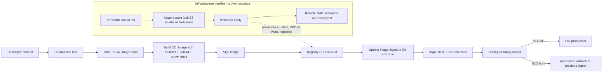
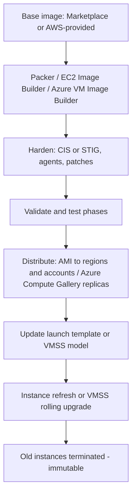

# C5 Deployment
> Last verified: 2026-10 · Audience: senior/staff DevOps, SRE, AI eng, NetEng, DevSecOps, architects

## TL;DR
- Deployment at scale is a **risk-management** problem: many components × many environments × many regions. Answer with **automation, immutability, small batches, progressive rollout, fast rollback** and **observability gates**.
- Separate **infrastructure deployment** (networks, clusters, DBs — slow-changing, stateful, via IaC) from **application deployment** (images/artifacts — fast-changing, via CI/CD or GitOps). Different cadences, different blast radius, often different pipelines and owners.
- **Immutable infrastructure**: never patch in place; build a versioned artifact (**golden AMI / Azure Compute Gallery image / OCI image**), test it, roll it out, roll back by redeploying the previous version. Kills configuration drift and snowflake servers.
- **VMs vs containers**: VMs isolate with a hypervisor and separate kernel (strong boundary, GB images, slow boot). Containers isolate with **namespaces + cgroups** on a shared kernel (MB images, fast start, weaker boundary). Sandboxed runtimes (Firecracker, gVisor, Kata, Hyper-V containers) sit between them.
- **Provisioning ≠ configuration**: Terraform/OpenTofu/CloudFormation/Bicep *create resources* (declarative, state). Ansible/Chef/Puppet/cloud-init *configure what's inside* (idempotent tasks). With immutability, configuration moves to **image build time** (Packer/Image Builder/Dockerfile).
- **Terraform state** is the crown jewel: use remote backends with locking. S3 backend: **`use_lockfile = true`** (S3-native, GA in Terraform 1.11; **DynamoDB locking is deprecated**). azurerm backend: **blob lease** locking natively. Encrypt it; it contains secrets.
- **Cloud containers (as of 2026-10)**: AWS = ECS (on EC2 or Fargate), **ECS Express Mode**, EKS, Lambda container images; **App Runner is closed to new customers** (AWS recommends ECS Express Mode). Azure = Container Apps, ACI, AKS (Standard/Automatic), App Service, Functions.
- **Native IaC**: CloudFormation/CDK (AWS) vs ARM/Bicep + deployment stacks (Azure); **Terraform/OpenTofu** is the cross-cloud common denominator. **GitOps** (Argo CD/Flux) = Git as desired state + in-cluster pull-based reconciliation.

## C5.1 Large scale deployment challenges
- **How it works / what's hard:**
  - **Scale of change:** hundreds of services, thousands of hosts, multiple regions; a single bad config can take everything down (most large outages are change-induced — config pushes, cert expiries, bad binaries).
  - **Heterogeneity:** different runtimes/OS versions/dependency sets → "works on my machine", **configuration drift**, snowflake servers.
  - **Dependencies and ordering:** schema migrations before code, producers before consumers, API version skew between N and N-1 during rollout.
  - **Availability during deploy:** zero-downtime needs N+1 capacity, connection draining, readiness checks, backwards-compatible data changes (**expand → migrate → contract**).
  - **Blast radius:** need cells/shards, region-by-region waves, canaries, bake times, automated rollback (AWS-style "one-box → one-AZ → one-region → rest").
  - **Speed vs safety:** DORA metrics — deployment frequency, lead time for changes, change failure rate, time to restore (plus rework rate in newer DORA reports).
  - **Secrets, compliance, audit:** who deployed what, where, signed by whom (SBOM, provenance, signing).
- **Trade-offs / when to use:**
  - Small frequent deploys reduce per-change risk but need strong automation; big-bang releases concentrate risk.
  - Global config systems are a single point of failure — stage config like code.
- **Interview angles:**
  - "How do you deploy safely to 10k hosts?" → immutable artifact, staged waves with health/SLO gates, bake time, automated rollback, feature flags to decouple deploy from release.
  - Pitfall: deploying all regions simultaneously; rollback that requires a forward DB migration to undo.
  - Follow-up: DB migrations — must be backwards compatible across at least one version (N and N+1 run side by side).

## C5.2 Application deployment
- **How it works:**
  - Build once → produce a **versioned, immutable artifact** (OCI image by digest, JAR, zip, AMI) → promote the *same* artifact through dev → staging → prod; only config differs per environment (12-factor: config in env).
  - Pipeline: commit → build → unit test → SAST/SCA → image build + **SBOM + signing** → push to registry → deploy to staging → integration/e2e → progressive prod rollout → verify → done/rollback.
  - Strategies (rolling, canary, blue/green, recreate, A/B) are detailed in C5.26–C5.30 (Part 2 of this file).
  - **Deploy ≠ release:** feature flags let code ship dark and be enabled per cohort.
- **Trade-offs / when to use:**
  - Pin images by **digest** (`@sha256:…`) in prod, not mutable tags like `latest`.
  - Push-based CD (pipeline calls the API) vs pull-based GitOps (agent reconciles from Git) — see C5.5.
- **Interview angles:**
  - "Rebuild per environment?" → No; rebuild = different artifact = untested artifact. Promote by digest.
  - "How do you roll back?" → redeploy previous digest/revision; keep N previous versions; DB changes must be compatible.

## C5.3 Infrastructure deployment
- **How it works:**
  - **Infrastructure as Code (IaC):** declarative definitions (Terraform/OpenTofu HCL, CloudFormation/CDK, Bicep/ARM, Pulumi) versioned in Git, reviewed via PR, applied via pipeline with `plan` output as the review artifact.
  - Layered stacks by change rate and blast radius: **landing zone / accounts / subscriptions → network (VPC/VNet, transit) → shared platform (clusters, DBs, KMS/Key Vault) → app-specific resources**. Separate state files per layer/env.
  - Policy as code gates: OPA/Conftest, Sentinel, Checkov/tfsec/Trivy, AWS SCPs/Config rules, Azure Policy.
  - **Drift detection:** scheduled `terraform plan -detailed-exitcode` (exit 2 = changes), CloudFormation drift detection, Azure deployment stacks deny settings to block out-of-band changes.
- **Trade-offs / when to use:**
  - Monolithic state = slow plans + huge blast radius; too many tiny states = dependency wiring pain (use outputs/remote state data sources or parameter stores).
  - Stateful resources (DBs, buckets) need `prevent_destroy` / deletion protection / resource locks.
- **Interview angles:**
  - "App vs infra deployment differences?" → infra: slower cadence, stateful, destructive changes possible (`-/+ replace`), human-reviewed plans; app: frequent, stateless artifacts, progressive delivery.
  - Pitfall: ClickOps fixes during incidents → drift → next apply reverts the fix. Codify or `import` afterwards.

## C5.4 System operations
- **How it works:**
  - Day-2 ops: patching, scaling, backups, cert rotation, secret rotation, capacity, incident response, observability, cost.
  - **Patch strategy with immutability:** rebuild golden image on a schedule / on CVE → roll instances (ASG **instance refresh**, VMSS rolling upgrade / automatic OS image upgrade, node-pool upgrades on EKS/AKS).
  - Mutable alternative: SSM Patch Manager / Azure Update Manager for long-lived VMs.
  - Remote access without SSH keys/bastions: **AWS Systems Manager Session Manager**, **Azure Bastion** / Entra ID login.
  - Runbooks → automation (SSM Automation, Azure Automation runbooks); toil reduction (see J6).
- **Trade-offs / when to use:**
  - Pets (hand-fed, long-lived) vs **cattle** (identical, replaceable): cattle scale; pets only where unavoidable (legacy, licensed appliances).
- **Interview angles:**
  - "How do you patch 5,000 VMs?" → bake new image, rolling replace with health checks and max-unavailable %, not SSH loops.
  - Mention observability gates (SLO burn-rate) during ops changes, not just app deploys.

## C5.5 Modern deployment solutions
- **How it works:**
  - **Immutable infrastructure + golden images:** Packer / EC2 Image Builder / Azure VM Image Builder for VMs; Dockerfiles/BuildKit for containers.
  - **Containers + orchestrators:** Kubernetes (EKS/AKS), ECS, Container Apps — declarative desired state, self-healing, rolling updates.
  - **Serverless:** Lambda/Functions; deploy = upload code/image + shift alias/slot traffic.
  - **GitOps (intro):** Git is the single source of truth for desired state; an in-cluster agent (**Argo CD**, **Flux**) *pulls* and continuously reconciles; drift is detected/auto-healed; rollback = `git revert`. OpenGitOps principles: declarative, versioned & immutable, pulled automatically, continuously reconciled.
  - Managed GitOps: **AKS GitOps extension (Flux v2)**; on AWS, typically self-managed Argo CD/Flux on EKS (an EKS managed Argo CD capability exists as of 2025-26 — (unverified) naming/GA status).
  - **Progressive delivery:** Argo Rollouts / Flagger, CodeDeploy (ECS/Lambda blue-green & canary), Container Apps revisions with traffic splitting, App Service deployment slots.
- **Trade-offs / when to use:**
  - GitOps pull model: no cluster credentials in CI (security win), natural audit trail; but secrets need SOPS/Sealed Secrets/External Secrets, and multi-cluster fan-out needs ApplicationSets/Kustomize overlays.
  - Push CD is simpler for non-Kubernetes targets (VMs, serverless).
- **Interview angles:**
  - "Why GitOps?" → auditability, drift correction, declarative rollback, least-privilege (cluster pulls).
  - Pitfall: GitOps + manual `kubectl edit` → reverted by the reconciler (feature, not bug).

## C5.6 Component deployment
- **How it works:**
  - A system = many **components** (services, workers, DBs, caches, queues, configs) each with own artifact, version, lifecycle and dependencies.
  - Deploy independently (microservices) with **contract compatibility**: API versioning, consumer-driven contract tests, tolerant readers, schema registries for events.
  - Ordering: infra deps first → data migrations (expand) → backends → frontends → cleanup (contract).
  - Health semantics: **liveness** (restart me), **readiness** (send me traffic), **startup** probes; LB health checks; connection draining (ALB deregistration delay default 300 s).
- **Trade-offs / when to use:**
  - Independent deploys raise velocity but create version-skew matrices; a coordinated "release train" is simpler but slower.
- **Interview angles:**
  - "Two services must change together" → make the change backward compatible in two steps instead of coupling deploys (otherwise you have a distributed monolith).

## C5.7 Component deployment automation
- **How it works:**
  - CI/CD tools: GitHub Actions, GitLab CI, Jenkins, Azure Pipelines, AWS CodePipeline/CodeBuild/CodeDeploy, Argo CD/Flux.
  - **Pipeline identity:** use OIDC federation (GitHub → AWS IAM role via `AssumeRoleWithWebIdentity`; GitHub → Entra **workload identity federation**) — no long-lived keys.
  - Stages: build → test → scan → sign → publish → deploy (per env) → verify → promote. Manual approvals for prod where required (environments/protection rules).
  - Automated rollback triggers: CloudWatch alarms in CodeDeploy, Argo Rollouts analysis templates (Prometheus queries), Container Apps/App Service health.
  - Configuration management for mutable fleets: Ansible (agentless, SSH/WinRM, push), Chef/Puppet (agent, pull), SSM State Manager, Azure Machine Configuration.
- **Trade-offs / when to use:**
  - Templates/reusable workflows standardize pipelines across hundreds of repos (platform engineering "golden paths").
- **Interview angles:**
  - "Secure your pipeline" → OIDC short-lived creds, least-privilege deploy roles per env, pinned action SHAs, signed artifacts (cosign/Notation), SLSA provenance, branch protection. Cross-link L6.

## C5.8 Deployment with Virtual Machines
- **How it works:**
  - Unit of deployment = **VM image** (AMI / Azure managed image / Compute Gallery image version) + **launch template / VMSS model** + bootstrap (cloud-init/user data, Custom Script Extension).
  - Fleets: **EC2 Auto Scaling groups** (launch templates, instance refresh, warm pools) ↔ **Azure Virtual Machine Scale Sets** (Flexible/Uniform orchestration, rolling upgrade policy).
  - **Golden image pipeline (immutable):**
    - **Packer** (HashiCorp): HCL2 templates; builders (`amazon-ebs`, `azure-arm`, etc.), provisioners (shell, Ansible), post-processors; multi-cloud from one template; HCP Packer registry for image metadata/channels and revocation.
    - **EC2 Image Builder**: managed pipelines; **recipes** (base image + components), **components** = AWSTOE YAML/JSON documents with build/validate/test phases; outputs **AMIs and container images (ECR)**; distribution across Regions/accounts/Organizations with KMS encryption and launch-template updates; Inspector vulnerability scanning; STIG hardening components; schedules; **no charge for the service** (pay for EC2/EBS/S3/Inspector used).
    - **Azure VM Image Builder (AIB)**: managed service **built on HashiCorp Packer**; image template resource (immutable — rebuild to change) with source (Marketplace/custom/gallery), customizers (Shell, PowerShell, File, WindowsUpdate, WindowsRestart), distribute targets (**Azure Compute Gallery**, managed image, VHD); creates a staging RG `IT_<rg>_<template>_<guid>`; build VM default Standard_D1_v2 (Gen1) / Standard_D2ds_v4 (Gen2); can join an existing VNet via Private Link (no public IP); you pay only for compute/storage/network used. TrustedLaunch/ConfidentialVM images are not supported as source (the `*Supported` variants are).
  - Bake vs fry: **bake** everything into the image (fast boot, immutable) vs **fry** at boot with user data/config mgmt (flexible, slower, drift-prone). Common hybrid: bake OS + runtime + agents; inject env config/secrets at boot.
- **Trade-offs / when to use:**
  - VMs when you need full OS control, kernel modules, licensed software, Windows workloads, strong isolation, GPUs with custom drivers, or lift-and-shift.
  - Cost: slower boot (tens of seconds to minutes) → over-provisioning or warm pools.
- **Interview angles:**
  - "EC2 Image Builder vs Packer?" → Image Builder: AWS-native managed pipelines, tests, Inspector, cross-account distribution, no tool infra; Packer: multi-cloud single template, runs anywhere (CI runner), richer plugin ecosystem. AIB is literally Packer as a managed Azure service.
  - Image lifecycle: version images, deprecate/deregister old ones (Image Builder lifecycle policies; Compute Gallery `excludeFromLatest`, end-of-life dates); restrict to approved images (AWS **Allowed AMIs** / Organizations policies; Azure Policy).

## C5.9 Isolation through virtual machines
- **How it works:**
  - Hypervisor (Type 1: Nitro/KVM-based, Hyper-V, ESXi; Type 2: VirtualBox) presents virtual hardware; each guest runs its **own kernel** → kernel exploits in one guest don't directly reach others.
  - Hardware assists: VT-x/AMD-V, EPT/NPT for memory, SR-IOV for NICs (ENA / Accelerated Networking).
  - **AWS Nitro**: offloads networking/storage/management to Nitro cards; minimal hypervisor; no operator access to customer memory. **Azure**: Hyper-V-based host, Trusted Launch (Secure Boot + vTPM), **Confidential VMs** (AMD SEV-SNP / Intel TDX) encrypt memory from the host.
  - Dedicated tenancy options: EC2 Dedicated Instances/Hosts ↔ Azure Dedicated Host / isolated VM sizes.
  - **MicroVMs**: Firecracker (Lambda, Fargate-style isolation) — VM-grade isolation with ~125 ms boot and small footprint; Kata Containers (AKS **Pod Sandboxing**), gVisor (user-space kernel).
- **Trade-offs / when to use:**
  - Strong isolation for multi-tenant/untrusted code at the cost of density, boot time, and per-VM OS overhead.
- **Interview angles:**
  - "Run untrusted customer code?" → never plain shared-kernel containers; use microVMs (Firecracker/Kata), gVisor, or per-tenant VMs; plus seccomp/AppArmor, no privileged, network policies.
  - Deep dive on namespaces/cgroups vs hypervisors: [A8.3](../A-operating-systems/A8-more-os-concepts.md#a83-virtualization-and-containerization-cgroups-vs-namespaces).

| Aspect | VM | Container | MicroVM / sandbox |
|---|---|---|---|
| Boundary | Hypervisor, separate kernel | Namespaces + cgroups, shared kernel | Lightweight hypervisor or user-space kernel |
| Image size | GBs | MBs | MBs |
| Start time | 10s of s – minutes | ms – seconds | ~100s of ms |
| Density | Low | High | Medium–high |
| Examples | EC2, Azure VMs | Docker, containerd on EKS/AKS nodes | Firecracker (Lambda/Fargate), Kata (AKS Pod Sandboxing), ACI (Hyper-V isolated) |

## C5.10 Deployment with Containers
- **How it works:**
  - Package app + userland deps into an **OCI image**; run on any host with a container runtime (containerd/CRI-O via runc); orchestrator schedules replicas.
  - Linux primitives: **namespaces** (pid, net, mnt, uts, ipc, user, cgroup, time) for visibility; **cgroups v2** for CPU/memory/IO limits; **capabilities**, **seccomp**, AppArmor/SELinux for privilege reduction; overlay filesystem for layers.
  - Registries: ECR ↔ ACR (geo-replication on Premium), Docker Hub (pull rate limits for unauthenticated users), GHCR. Use pull-through caches/mirrors.
- **Trade-offs / when to use:**
  - Pros: fast start, density, dev/prod parity, immutable artifacts, great fit for microservices and CI.
  - Cons: shared kernel, ephemeral filesystem (state goes to volumes/managed services), image sprawl/CVE debt, orchestration complexity.
- **Interview angles:**
  - "Containers vs VMs?" → isolation vs efficiency trade-off; in cloud you usually run containers *on* VMs (nodes) or on microVMs (Fargate/ACI).
  - Pitfall: running as root, no resource limits (noisy neighbour / OOM kill cascades), `latest` tags.

## C5.11 Docker containers
- **How it works:**
  - **Image = ordered stack of read-only layers** + config JSON, referenced by a **manifest**; multi-arch images use an **image index** (manifest list). Content-addressed by SHA-256 digest; identical layers shared and cached.
  - Container = image layers + thin **writable layer** (copy-on-write). Storage: `overlay2` historically; **containerd image store is the default for fresh installs of Docker Engine 29.0+** (upgraded hosts keep overlay2 until switched).
  - Each `RUN`/`COPY`/`ADD` creates a layer; **cache invalidation** cascades from the first changed instruction → order Dockerfile from least- to most-frequently changing (deps manifest → install → source copy).
  - **Multi-stage builds:** multiple `FROM ... AS name`; `COPY --from=build` only the artifacts; `docker build --target <stage>`; final image can be `distroless`/`scratch`/`alpine`/chiseled → smaller and fewer CVEs. **BuildKit** builds only stages the target depends on (legacy builder builds all preceding stages) and runs independent stages in parallel.
  - **BuildKit** (default builder since Docker Engine 23): parallel DAG execution, `RUN --mount=type=cache` (package caches), `--mount=type=secret` (secrets never land in layers), `--mount=type=ssh`, remote cache export/import (`--cache-to/--cache-from type=registry|gha`), multi-platform builds via `docker buildx build --platform linux/amd64,linux/arm64`.
  - **Supply chain:** BuildKit attaches **provenance attestations (`mode=min`) by default**; SBOM via `docker buildx build --sbom=true` or `--attest type=sbom` → **SPDX JSON** (in-toto predicate) generated by the BuildKit **Syft** scanner; attestations stored as separate manifests in the image index (inspect without pulling layers). Opt out with `BUILDX_NO_DEFAULT_ATTESTATIONS`. Scan with Docker Scout/Trivy/Grype, ECR (Inspector) scanning, Defender for Containers; sign with cosign/Notation.
  - Runtime hardening: `USER` non-root, read-only rootfs, drop caps, `HEALTHCHECK` (ignored by Kubernetes — use probes), exec-form `ENTRYPOINT` so PID 1 gets SIGTERM (or `--init`/tini).
- **Trade-offs / when to use:**
  - Alpine (musl) is small but can break glibc-linked binaries/DNS behaviour; distroless has no shell (harder debugging → use ephemeral debug containers).
  - `.dockerignore` matters: smaller build context, no secrets/`.git` leaking into layers.
- **Interview angles:**
  - "Why is my image 2 GB?" → build toolchain in final stage, no multi-stage, layer bloat from `apt-get` without cleanup in same `RUN`, large context.
  - "Deleting a secret in a later layer removes it?" → **No**, it stays in the earlier layer; use `--mount=type=secret`.
  - "Image vs container?" → image is immutable template; container is a running instance with a writable layer + namespaces/cgroups.

## C5.12 Infrastructure requirements
- **How it works (what a deployment platform needs):**
  - **Compute:** VMs/node pools/serverless capacity; quotas (vCPU per family per region — both clouds), headroom for surge during rolling updates (`maxSurge`).
  - **Network:** VPC/VNet, subnets sized for pod IPs (AWS VPC CNI and Azure CNI consume VNet IPs; Azure CNI Overlay / prefix delegation mitigate), LBs, DNS, egress (NAT GW), private endpoints to registries/state stores.
  - **Artifact storage:** container registry (ECR/ACR) with replication close to compute, image scanning, immutability (ECR tag immutability).
  - **State & secrets:** IaC state backend, Secrets Manager/Parameter Store ↔ Key Vault/App Configuration, KMS/Key Vault keys.
  - **Identity:** CI/CD federated identities, workload identity (EKS Pod Identity/IRSA ↔ AKS Workload Identity).
  - **Observability:** logs, metrics, traces, deploy markers; alarms for automated rollback.
  - **Environments:** dev/stage/prod separated by **accounts (AWS Organizations)** ↔ **subscriptions (management groups)** for blast-radius and billing isolation.
- **Trade-offs / when to use:**
  - Shared multi-tenant platform (cheaper, platform team) vs per-team stacks (autonomy, cost duplication).
- **Interview angles:**
  - Classic failure: rollout stalls because of subnet IP exhaustion or vCPU quota — check quotas and IP planning *before* scaling events.

## C5.13 Provisioning and configuration
- **How it works:**
  - **Provisioning** = create/modify/destroy cloud resources (Terraform/OpenTofu, CloudFormation/CDK, Bicep/ARM, Pulumi, Crossplane). **Configuration** = set up software/OS inside resources (Ansible, Chef, Puppet, Salt, cloud-init, DSC/Machine Configuration).
  - **Terraform core loop:** `init` (providers, backend) → `plan` (diff desired vs **state** vs real world, refresh) → `apply` (dependency graph, parallelism default **10**) → state updated. `import` blocks, `moved`/`removed` blocks for refactors, `-target` only for emergencies.
  - **State:** JSON mapping config ↔ real resource IDs + attributes; **contains secrets in plaintext** → encrypt at rest, restrict access, never commit to Git.
  - **Remote backends & locking:**
    - **S3 backend:** `use_lockfile = true` → S3-native lock object `<key>.tflock` via conditional writes; **GA in Terraform 1.11**, which also **deprecated the DynamoDB arguments** (`dynamodb_table`, to be removed in a future minor version). Both can be set together during migration. Lock IAM: `s3:GetObject/PutObject/DeleteObject` on the `.tflock` path. Enable bucket versioning (state recovery), SSE-KMS (`encrypt`, `kms_key_id`), block public access.
    - **azurerm backend:** Blob Storage with native **blob lease** locking and consistency checking; prefer Entra ID auth (`use_azuread_auth = true`, OIDC/managed identity) over access keys/SAS. Enable blob versioning/soft delete.
    - HCP Terraform / Terraform Enterprise: remote runs, state, policy (Sentinel/OPA), run tasks.
  - **OpenTofu:** Linux Foundation fork created after HashiCorp moved Terraform to **BSL 1.1** (Aug 2023, Terraform 1.6+); MPL-2.0; largely drop-in for 1.5.x-era configs; adds **client-side state & plan encryption** (since 1.7; key providers PBKDF2, AWS KMS, GCP KMS, Azure Key Vault, OpenBao, external), provider-defined functions, `for_each` on providers, S3 native locking (1.10 (unverified)). Divergence grows over versions — pin one tool per repo. (HashiCorp is part of IBM since early 2025.)
  - **Ansible:** agentless (SSH/WinRM), push, YAML playbooks, idempotent modules, inventory (static/dynamic from cloud APIs); AWX/Automation Platform for scheduling/RBAC.
  - **Drift:** Terraform detects drift only on plan/refresh; config mgmt agents (Puppet/Chef) continuously enforce; immutability sidesteps runtime config drift entirely.
- **Trade-offs / when to use:**

| | Terraform/OpenTofu | Ansible |
|---|---|---|
| Primary job | Provision cloud resources | Configure OS/apps, orchestrate procedures |
| Model | Declarative + state file | Procedural-ish tasks, idempotent modules, no state |
| Drift detection | `plan` vs state/real world | Re-run playbook (check mode `--check --diff`) |
| Deletes | Removing from code destroys resource | Removing a task does nothing; must write `state: absent` |
| Best with immutability | Yes (launch new image versions) | Inside Packer/Image Builder at bake time |

- **Interview angles:**
  - "Two engineers run apply at once?" → backend lock; if a lock is stale after a crashed run, `terraform force-unlock <ID>` only after confirming no run is active.
  - "State got corrupted/deleted?" → restore prior S3/Blob version; `terraform state pull/push` with care; `import` blocks to re-adopt.
  - "Secrets in state?" → unavoidable for many resources; encrypt backend, restrict IAM/RBAC, use ephemeral resources/write-only attributes (Terraform 1.10/1.11+) where supported, or OpenTofu state encryption.
  - Pitfall: one state for all envs; using workspaces as the only env separation for prod (shared backend credentials = shared blast radius).

## C5.14 Deployment with containers on Cloud †
- **How it works (AWS):**
  - **Amazon ECS**: AWS-native orchestrator; task definitions, services, capacity providers. Launch types: **EC2** (you manage nodes), **Fargate** (serverless, per-task isolation boundary, no shared kernel/CPU/memory/ENI between tasks), **ECS Managed Instances** (AWS-managed EC2). Deploy controllers: rolling (with circuit breaker auto-rollback), native **blue/green** (ECS built-in since 2025), CodeDeploy, external.
  - **ECS Express Mode**: one call with image + task execution role + infrastructure role → Fargate service, ALB (**shared across Express services** with same networking) with TLS, autoscaling, logs, URL; no extra charge. AWS's recommended successor path for App Runner.
  - **AWS App Runner**: **closed to new customers** (existing customers continue, no new features planned); migrate via blue/green with Route 53 weighted records to ECS Express Mode.
  - **Amazon EKS**: managed Kubernetes control plane; managed node groups, Karpenter, Fargate profiles, **EKS Auto Mode** (AWS manages nodes, Karpenter-based scaling, LB/storage controllers).
  - **Lambda container images** (up to 10 GB) for event-driven functions.
- **How it works (Azure):**
  - **Azure Container Apps (ACA)**: serverless containers on managed Kubernetes with KEDA, Dapr, Envoy; **revisions** with traffic splitting, scale-to-zero, jobs (scheduled/event); no direct Kubernetes API. Consumption + dedicated workload profiles (incl. GPU).
  - **Azure Container Instances (ACI)**: single container group (pod) of **Hyper-V isolated** containers on demand; no built-in scaling/LB/certs; building block (AKS virtual nodes).
  - **AKS**: managed Kubernetes, **Standard** or **Automatic** (Azure manages nodes, scaling, security defaults, upgrades).
  - **App Service (Web App for Containers)**: web apps/APIs, deployment slots with swap, easy auth, Linux/Windows containers.
  - **Azure Functions** (container images; Functions on ACA), **Azure Red Hat OpenShift**. (Azure Spring Apps is retiring — (unverified) exact date; check if asked.)
- **Trade-offs / when to use:**
  - Need full Kubernetes API/ecosystem (operators, CRDs, service mesh) → EKS/AKS. Want "just run my container behind HTTPS with autoscale" → ECS Express Mode/Fargate ↔ Container Apps / App Service. Batch/one-off → ECS RunTask/Fargate, AWS Batch ↔ ACI, ACA jobs, Azure Batch.
  - Serverless containers trade control (no daemonsets, limited host access, privileged mode) for zero node ops.
- **Interview angles:**
  - "Fargate vs EKS?" → ops burden vs flexibility; Fargate per-task pricing (vCPU/GB-sec), no node patching; EKS for portability and K8s-native tooling.
  - "What replaced App Runner?" → ECS Express Mode (AWS-recommended), as of 2026.
  - Pitfall: ACI expected to autoscale like ACA — it doesn't.

## C5.15 Deployment with a cloud provider stack †
- **How it works:**
  - **AWS CloudFormation**: declarative YAML/JSON **stacks**; change sets (preview), drift detection, rollback on failure, StackSets (multi-account/region via Organizations), Hooks (pre-provision policy), nested stacks. Quotas: **500 resources per template**, template body **51,200 bytes inline / 1 MB via S3**, 200 parameters, 200 outputs, 2,000 stacks per account/region (soft).
  - **AWS CDK**: TypeScript/Python/Java/C#/Go constructs (L1/L2/L3) → synthesizes CloudFormation; `cdk diff`, `cdk deploy`, CDK Pipelines; inherits CFN limits and rollback semantics.
  - **Azure ARM templates (JSON) / Bicep**: Bicep transpiles to ARM JSON; no state file (ARM is the state, idempotent PUTs); `what-if` preview; modes **Incremental** (default) vs **Complete**; template spec registry; ARM limits: **4 MB template, 800 resources, 256 parameters, 512 variables, 64 outputs**.
  - **Azure deployment stacks** (`Microsoft.Resources/deploymentStacks`): manage a set of resources as a unit at RG/subscription/management-group scope; `actionOnUnmanage` = `detachAll` (default behaviour) / `deleteResources` / `deleteAll`; **deny settings** `none` / `denyDelete` / `denyWriteAndDelete` (control plane only; ≤5 excluded principals, ≤200 excluded actions). Recommended successor for Azure Blueprints (retired) (unverified exact date).
  - **Terraform/OpenTofu as the common layer** across AWS + Azure + SaaS (Cloudflare, Datadog, GitHub); AWS Cloud Control provider (`awscc`) and **AzAPI** provider give day-0 coverage of new resource types.
- **Trade-offs / when to use:**

| | CloudFormation / CDK | ARM / Bicep | Terraform / OpenTofu |
|---|---|---|---|
| State | Managed by service (stack) | None — ARM queries live resources | State file in backend you manage |
| Preview | Change sets / `cdk diff` | `what-if` | `plan` |
| Rollback | Automatic stack rollback | No auto-rollback (redeploy previous) | None — fix forward / re-apply previous |
| Multi-cloud | No | No | Yes |
| New-service coverage | Day 0 for most | Day 0 (API versions) | Provider lag (mitigated by awscc/AzAPI) |
| Grouped lifecycle/protection | Stacks, termination protection, stack policies | Deployment stacks + deny settings, resource locks | `prevent_destroy`, state per stack |

- **Interview angles:**
  - "Multi-cloud org — which IaC?" → Terraform/OpenTofu for uniform workflow/modules/policy; native tools where day-0 features or managed state/rollback matter; don't mix tools on the same resources.
  - "Bicep has no state — pro or con?" → no state corruption/locking issues, but deletions require Complete mode or deployment stacks.
  - Pitfall: CloudFormation stack stuck in `UPDATE_ROLLBACK_FAILED` → `continue-update-rollback` with resources to skip; manual changes cause drift that breaks updates.

<!-- PART2-IDS-GO-HERE -->

## Diagrams




## Cloud mapping: AWS vs Azure
| Capability | AWS | Azure | Role it plays | Key differences | Alternatives |
|---|---|---|---|---|---|
| Golden VM image pipeline | EC2 Image Builder | Azure VM Image Builder | Build, test, distribute hardened VM images | EIB: AWSTOE components, test stage, Inspector, AMI + container output; AIB: Packer-based, customizers, outputs to Compute Gallery/managed image/VHD | Packer (+ HCP Packer) |
| Image registry for VMs | AMIs (+ sharing via Organizations/RAM) | Azure Compute Gallery | Versioned image distribution | Gallery has replica counts per region, image versions, community/shared galleries | HCP Packer metadata registry |
| VM fleets | EC2 Auto Scaling groups + launch templates | Virtual Machine Scale Sets | Immutable fleet rollout | ASG instance refresh / warm pools vs VMSS rolling upgrade / automatic OS image upgrade | Kubernetes node pools |
| Container registry | Amazon ECR | Azure Container Registry | Store/scan/replicate OCI images and artifacts | ECR replication rules, tag immutability, Inspector scanning; ACR geo-replication (Premium), tasks, Defender scanning | GHCR, Docker Hub, Harbor |
| Managed Kubernetes | Amazon EKS (incl. Auto Mode) | AKS (Standard / Automatic) | Full K8s API | EKS charges per-cluster control plane fee; AKS Free tier control plane, paid Standard/Premium tier for SLA | GKE, self-managed K8s, OpenShift (ARO / ROSA) |
| Native orchestrator / serverless containers | ECS on Fargate, ECS Express Mode | Azure Container Apps | Run containers without node mgmt | ACA = K8s+KEDA+Dapr with scale-to-zero and revisions; Fargate no scale-to-zero by default per service, ECS Express adds ALB/URL | Cloud Run (GCP), Knative |
| Single-container on demand | ECS RunTask on Fargate | Azure Container Instances | Short-lived/batch containers | ACI is Hyper-V isolated container group, no scaling/LB | AWS Batch / Azure Batch |
| PaaS web app from image | App Runner (closed to new customers) → ECS Express Mode; Elastic Beanstalk | App Service (Web App for Containers) | Opinionated HTTP hosting | App Service slots + swap; Express Mode creates visible resources in your account | Heroku, Fly.io, Cloudflare Containers |
| Serverless functions (image) | Lambda container images (≤10 GB) | Azure Functions (containers / on ACA) | Event-driven | Lambda Firecracker microVMs; Functions Flex Consumption / Premium plans | Cloudflare Workers |
| Native IaC | CloudFormation, CDK | ARM templates, Bicep, deployment stacks | Provider-native provisioning | CFN stores stack state + auto-rollback; ARM is stateless, `what-if`, Incremental/Complete | Terraform/OpenTofu, Pulumi, Crossplane |
| Terraform remote state | S3 backend (`use_lockfile`) | azurerm backend (blob lease) | Shared state + locking | S3 lock = conditional-write `.tflock` object (DynamoDB deprecated); azurerm = native lease | HCP Terraform, GCS backend, OpenTofu encrypted state |
| CI/CD | CodePipeline / CodeBuild / CodeDeploy | Azure Pipelines (Azure DevOps), GitHub Actions | Build and deploy automation | CodeDeploy blue/green for ECS/Lambda/EC2; Azure DevOps environments/approvals | GitHub Actions, GitLab CI, Jenkins |
| GitOps | Argo CD/Flux on EKS (self-managed or EKS capability) | AKS GitOps extension (Flux v2) | Pull-based reconciliation | Azure offers Flux as a managed cluster extension | Argo CD, Flux, Rancher Fleet |
| Config mgmt / ops | Systems Manager (State Manager, Patch Manager, Session Manager) | Azure Update Manager, Machine Configuration, Automation, Bastion | Day-2 ops on VMs | SSM agent-based on EC2/hybrid; Azure Arc extends to hybrid | Ansible, Chef, Puppet |
| Org-level env isolation | AWS Organizations accounts + SCPs | Management groups + subscriptions + Azure Policy | Blast-radius and governance boundaries | SCPs are deny guardrails; Azure Policy can deny/audit/modify/deployIfNotExists | — |

- **EC2 Image Builder vs Azure VM Image Builder:** both free as services (pay for build compute/storage). EIB has a first-class **test stage** that blocks distribution if tests fail, Inspector scanning, STIG components, cross-account/Org distribution, and also builds **container images**. AIB is **Packer under the hood**, VMs only, image template resource is immutable (recreate to edit), staging RG `IT_*` in your subscription, regional availability list but can distribute anywhere.
- **Container platforms:** AWS splits ECS (native, simpler, tight IAM integration) and EKS (K8s). Azure's sweet spot is **Container Apps** for microservices without K8s ops. App Runner's closure (2026) pushes simple-web workloads to **ECS Express Mode**; Azure App Service remains the equivalent PaaS.
- **IaC state models:** CloudFormation = service-held state, automatic rollback; ARM/Bicep = **stateless**, idempotent, no auto-rollback; Terraform = self-managed state, multi-cloud. Deployment stacks bring CFN-like "managed set + delete unmanaged + protect" semantics to Azure.
- **Locking gotchas:** S3 locking needs bucket versioning recommended and IAM on the `.tflock` key; Azure lease locks can be left stuck by killed runs → `terraform force-unlock` or break the blob lease (`az storage blob lease break`).
- **Alternatives:** Kubernetes everywhere (portability), Cloudflare Workers/Containers for edge apps, Pulumi (general-purpose languages, multi-cloud), Crossplane (K8s-native control plane for cloud resources).

## Hands-on (optional)
Multi-stage Dockerfile with BuildKit cache and secret mounts, non-root, distroless:
```dockerfile
# syntax=docker/dockerfile:1
FROM golang:1.25 AS build
WORKDIR /src
COPY go.mod go.sum ./
RUN --mount=type=cache,target=/go/pkg/mod go mod download
COPY . .
RUN --mount=type=cache,target=/root/.cache/go-build \
    --mount=type=secret,id=netrc,target=/root/.netrc \
    CGO_ENABLED=0 go build -trimpath -ldflags="-s -w" -o /out/app ./cmd/app

FROM gcr.io/distroless/static-debian12:nonroot
COPY --from=build /out/app /app
USER nonroot:nonroot
EXPOSE 8080
ENTRYPOINT ["/app"]
```

Build multi-arch with SBOM + max provenance, push, and inspect:
```bash
docker buildx create --use --name ci-builder
docker buildx build \
  --platform linux/amd64,linux/arm64 \
  --secret id=netrc,src="$HOME/.netrc" \
  --sbom=true --provenance=mode=max \
  --cache-from type=registry,ref=123456789012.dkr.ecr.eu-west-1.amazonaws.com/app:cache \
  --cache-to   type=registry,ref=123456789012.dkr.ecr.eu-west-1.amazonaws.com/app:cache,mode=max \
  -t 123456789012.dkr.ecr.eu-west-1.amazonaws.com/app:1.4.2 --push .
docker buildx imagetools inspect 123456789012.dkr.ecr.eu-west-1.amazonaws.com/app:1.4.2 \
  --format '{{ json .SBOM }}' | head -c 400
docker history --no-trunc myapp:dev   # see per-layer size
```

Terraform S3 backend (native locking) and azurerm backend (Entra ID auth, blob lease):
```hcl
# AWS — Terraform >= 1.11
terraform {
  required_version = ">= 1.11"
  backend "s3" {
    bucket       = "acme-tfstate-prod"
    key          = "network/eu-west-1/terraform.tfstate"
    region       = "eu-west-1"
    encrypt      = true
    kms_key_id   = "alias/tfstate"
    use_lockfile = true          # S3-native lock (<key>.tflock); DynamoDB locking is deprecated
    # dynamodb_table = "tf-locks" # keep only temporarily while migrating older clients
  }
}
```
```hcl
# Azure — locking via blob lease is automatic
terraform {
  backend "azurerm" {
    use_oidc             = true   # e.g. GitHub Actions workload identity federation
    use_azuread_auth     = true   # data-plane auth with Entra ID instead of account keys
    tenant_id            = "00000000-0000-0000-0000-000000000000"
    client_id            = "00000000-0000-0000-0000-000000000000"
    storage_account_name = "acmetfstateprod"
    container_name       = "tfstate"
    key                  = "network/westeurope.tfstate"
  }
}
```

Drift check in CI + stale-lock handling:
```bash
terraform init -input=false
terraform plan -input=false -lock-timeout=5m -detailed-exitcode -out=tfplan
case $? in
  0) echo "no drift" ;;
  2) echo "DRIFT/changes detected"; terraform show -no-color tfplan | head -50 ;;
  *) echo "plan failed"; exit 1 ;;
esac
# Only after confirming no other run is active:
# terraform force-unlock <LOCK_ID>
# Azure stuck lease:
# az storage blob lease break --account-name acmetfstateprod -c tfstate -b network/westeurope.tfstate --auth-mode login
```

Golden-image roll on AWS (new AMI in launch template → instance refresh):
```bash
aws ec2 create-launch-template-version --launch-template-name web \
  --source-version '$Latest' --launch-template-data '{"ImageId":"ami-0abc123example"}'
aws autoscaling start-instance-refresh --auto-scaling-group-name web-asg \
  --preferences '{"MinHealthyPercentage":90,"InstanceWarmup":120,"AutoRollback":true}'
```

## Cross-links
- [A8.3 Virtualization and containerization (namespaces, cgroups, hypervisors)](../A-operating-systems/A8-more-os-concepts.md#a83-virtualization-and-containerization-cgroups-vs-namespaces)
- [C3 Reliability](../C-large-scale-architecture/C3-reliability.md) — HA, failover, DR during deployments
- [C4 Security](../C-large-scale-architecture/C4-security.md) — hardening, firewalls, TLS
- [C2 Scalability](../C-large-scale-architecture/C2-scalability.md) — horizontal scaling, LBs
- [C6 Technology stack](../C-large-scale-architecture/C6-technology-stack.md)
- [J6 Toil and release engineering](../J-sre/J6-toil-release-engineering.md)
- [J1 SLIs, SLOs, error budgets](../J-sre/J1-slis-slos-error-budgets.md) — SLO-gated rollouts
- [J4 Incident response and postmortems](../J-sre/J4-incident-response-postmortems.md) — change-induced incidents
- [L6 Secrets and supply chain](../L-data-privacy-ai-security/L6-secrets-supply-chain.md) — SBOM, signing, SLSA, OIDC CI creds
- [L7 Zero trust and workload identity](../L-data-privacy-ai-security/L7-zero-trust-workload-identity.md)
- [D2 Reusable parts of system design](../D-system-design/D2-reusable-parts-of-system-design.md)
- [G1 Virtual network fundamentals](../G-cloud-network-architecture/G1-virtual-network-fundamentals.md) — subnet/IP planning for clusters

## Sources
- https://developer.hashicorp.com/terraform/language/backend/s3
- https://developer.hashicorp.com/terraform/language/backend/azurerm
- https://github.com/hashicorp/terraform/blob/v1.11/CHANGELOG.md
- https://opentofu.org/docs/language/state/encryption/
- https://docs.docker.com/build/building/multi-stage/
- https://docs.docker.com/build/metadata/attestations/
- https://docs.docker.com/build/metadata/attestations/sbom/
- https://docs.docker.com/engine/storage/containerd/
- https://docs.aws.amazon.com/imagebuilder/latest/userguide/what-is-image-builder.html
- https://learn.microsoft.com/en-us/azure/virtual-machines/image-builder-overview
- https://docs.aws.amazon.com/apprunner/latest/dg/what-is-apprunner.html
- https://docs.aws.amazon.com/apprunner/latest/dg/apprunner-availability-change.html
- https://docs.aws.amazon.com/AmazonECS/latest/developerguide/express-service-overview.html
- https://learn.microsoft.com/en-us/azure/container-apps/compare-options
- https://docs.aws.amazon.com/AWSCloudFormation/latest/UserGuide/cloudformation-limits.html
- https://learn.microsoft.com/en-us/azure/azure-resource-manager/templates/best-practices
- https://learn.microsoft.com/en-us/azure/azure-resource-manager/bicep/deployment-stacks
