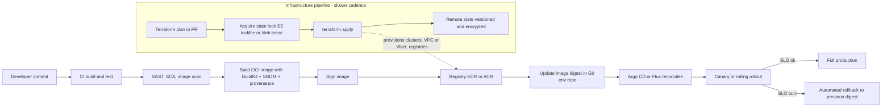
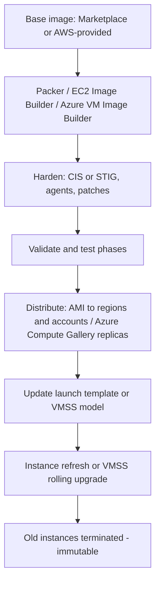
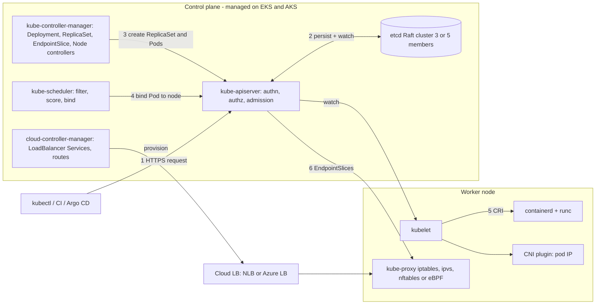

# C5 Deployment
> Last verified: 2026-10 · Audience: senior/staff DevOps, SRE, AI eng, NetEng, DevSecOps, architects

## TL;DR
- Deployment at scale is a **risk-management** problem: many components × many environments × many regions. Answer with **automation, immutability, small batches, progressive rollout, fast rollback** and **observability gates**.
- Separate **infrastructure deployment** (networks, clusters, DBs — slow-changing, stateful, via IaC) from **application deployment** (images/artifacts — fast-changing, via CI/CD or GitOps). Different cadences, different blast radius, often different pipelines and owners.
- **Immutable infrastructure**: never patch in place; build a versioned artifact (**golden AMI / Azure Compute Gallery image / OCI image**), test it, roll it out, roll back by redeploying the previous version. Kills configuration drift and snowflake servers.
- **VMs vs containers**: VMs isolate with a hypervisor and separate kernel (strong boundary, GB images, slow boot). Containers isolate with **namespaces + cgroups** on a shared kernel (MB images, fast start, weaker boundary). Sandboxed runtimes (Firecracker, gVisor, Kata, Hyper-V containers) sit between them.
- **Provisioning ≠ configuration**: Terraform/OpenTofu/CloudFormation/Bicep *create resources* (declarative, state). Ansible/Chef/Puppet/cloud-init *configure what's inside* (idempotent tasks). With immutability, configuration moves to **image build time** (Packer/Image Builder/Dockerfile).
- **Terraform state** is the crown jewel: use remote backends with locking. S3 backend: **`use_lockfile = true`** (S3-native, GA in Terraform 1.11; **DynamoDB locking is deprecated**). azurerm backend: **blob lease** locking natively. Encrypt it; it contains secrets.
- **Cloud containers (as of 2026-10)**: AWS = ECS (on EC2 or Fargate), **ECS Express Mode**, EKS, Lambda container images; **App Runner is closed to new customers** (AWS recommends ECS Express Mode). Azure = Container Apps, ACI, AKS (Standard/Automatic), App Service, Functions.
- **Native IaC**: CloudFormation/CDK (AWS) vs ARM/Bicep + deployment stacks (Azure); **Terraform/OpenTofu** is the cross-cloud common denominator. **GitOps** (Argo CD/Flux) = Git as desired state + in-cluster pull-based reconciliation.
- **Kubernetes = API server + etcd + controllers reconciling desired state** (latest minor v1.37 as of 2026-10). Know the pod-creation path, Service types (ClusterIP/headless/NodePort/LoadBalancer), CoreDNS names, kube-proxy modes (iptables default, nftables future default), HPA/VPA/**in-place pod resize (GA v1.35)**, Cluster Autoscaler vs **Karpenter** (basis of EKS Auto Mode and AKS NAP).
- **North-south routing: Gateway API is the successor to the frozen Ingress API; ingress-nginx was retired in March 2026** (no more security patches) — migrate with Ingress2Gateway.
- **Deployment strategies:** recreate (downtime, no overlap) → rolling (`maxSurge`/`maxUnavailable` 25 %/25 %) → blue/green (2× capacity, instant rollback) → canary (weighted traffic + metric gates, Argo Rollouts/Flagger) → A/B (segment targeting for product experiments). Every overlap strategy requires N/N-1 compatible schemas.
- **Cloud:** EKS $0.10/cluster-h standard (14 months) / $0.60 extended (+12 months), 7-day control-plane rollback; AKS Free/Standard/Premium(LTS), SLA 99.95 % with AZs; **EKS Auto Mode ↔ AKS Automatic**; ECS native blue/green + canary/linear ↔ Container Apps revisions and App Service slots.

## C5.1 Large scale deployment challenges
- **How it works / what's hard:**
  - **Scale of change:** hundreds of services, thousands of hosts, multiple regions; a single bad config can take everything down (most large outages are change-induced — config pushes, cert expiries, bad binaries).
  - **Heterogeneity:** different runtimes/OS versions/dependency sets → "works on my machine", **configuration drift**, snowflake servers.
  - **Dependencies and ordering:** schema migrations before code, producers before consumers, API version skew between N and N-1 during rollout.
  - **Availability during deploy:** zero-downtime needs N+1 capacity, connection draining, readiness checks, backwards-compatible data changes (**expand → migrate → contract**).
  - **Blast radius:** need cells/shards, region-by-region waves, canaries, bake times, automated rollback (AWS-style "one-box → one-AZ → one-region → rest").
  - **Speed vs safety:** DORA metrics — deployment frequency, lead time for changes, change failure rate, time to restore (plus rework rate in newer DORA reports).
  - **Secrets, compliance, audit:** who deployed what, where, signed by whom (SBOM, provenance, signing).
- **Trade-offs / when to use:**
  - Small frequent deploys reduce per-change risk but need strong automation; big-bang releases concentrate risk.
  - Global config systems are a single point of failure — stage config like code.
- **Interview angles:**
  - "How do you deploy safely to 10k hosts?" → immutable artifact, staged waves with health/SLO gates, bake time, automated rollback, feature flags to decouple deploy from release.
  - Pitfall: deploying all regions simultaneously; rollback that requires a forward DB migration to undo.
  - Follow-up: DB migrations — must be backwards compatible across at least one version (N and N+1 run side by side).

## C5.2 Application deployment
- **How it works:**
  - Build once → produce a **versioned, immutable artifact** (OCI image by digest, JAR, zip, AMI) → promote the *same* artifact through dev → staging → prod; only config differs per environment (12-factor: config in env).
  - Pipeline: commit → build → unit test → SAST/SCA → image build + **SBOM + signing** → push to registry → deploy to staging → integration/e2e → progressive prod rollout → verify → done/rollback.
  - Strategies (rolling, canary, blue/green, recreate, A/B) are detailed in C5.26–C5.30 (Part 2 of this file).
  - **Deploy ≠ release:** feature flags let code ship dark and be enabled per cohort.
- **Trade-offs / when to use:**
  - Pin images by **digest** (`@sha256:…`) in prod, not mutable tags like `latest`.
  - Push-based CD (pipeline calls the API) vs pull-based GitOps (agent reconciles from Git) — see C5.5.
- **Interview angles:**
  - "Rebuild per environment?" → No; rebuild = different artifact = untested artifact. Promote by digest.
  - "How do you roll back?" → redeploy previous digest/revision; keep N previous versions; DB changes must be compatible.

## C5.3 Infrastructure deployment
- **How it works:**
  - **Infrastructure as Code (IaC):** declarative definitions (Terraform/OpenTofu HCL, CloudFormation/CDK, Bicep/ARM, Pulumi) versioned in Git, reviewed via PR, applied via pipeline with `plan` output as the review artifact.
  - Layered stacks by change rate and blast radius: **landing zone / accounts / subscriptions → network (VPC/VNet, transit) → shared platform (clusters, DBs, KMS/Key Vault) → app-specific resources**. Separate state files per layer/env.
  - Policy as code gates: OPA/Conftest, Sentinel, Checkov/tfsec/Trivy, AWS SCPs/Config rules, Azure Policy.
  - **Drift detection:** scheduled `terraform plan -detailed-exitcode` (exit 2 = changes), CloudFormation drift detection, Azure deployment stacks deny settings to block out-of-band changes.
- **Trade-offs / when to use:**
  - Monolithic state = slow plans + huge blast radius; too many tiny states = dependency wiring pain (use outputs/remote state data sources or parameter stores).
  - Stateful resources (DBs, buckets) need `prevent_destroy` / deletion protection / resource locks.
- **Interview angles:**
  - "App vs infra deployment differences?" → infra: slower cadence, stateful, destructive changes possible (`-/+ replace`), human-reviewed plans; app: frequent, stateless artifacts, progressive delivery.
  - Pitfall: ClickOps fixes during incidents → drift → next apply reverts the fix. Codify or `import` afterwards.

## C5.4 System operations
- **How it works:**
  - Day-2 ops: patching, scaling, backups, cert rotation, secret rotation, capacity, incident response, observability, cost.
  - **Patch strategy with immutability:** rebuild golden image on a schedule / on CVE → roll instances (ASG **instance refresh**, VMSS rolling upgrade / automatic OS image upgrade, node-pool upgrades on EKS/AKS).
  - Mutable alternative: SSM Patch Manager / Azure Update Manager for long-lived VMs.
  - Remote access without SSH keys/bastions: **AWS Systems Manager Session Manager**, **Azure Bastion** / Entra ID login.
  - Runbooks → automation (SSM Automation, Azure Automation runbooks); toil reduction (see J6).
- **Trade-offs / when to use:**
  - Pets (hand-fed, long-lived) vs **cattle** (identical, replaceable): cattle scale; pets only where unavoidable (legacy, licensed appliances).
- **Interview angles:**
  - "How do you patch 5,000 VMs?" → bake new image, rolling replace with health checks and max-unavailable %, not SSH loops.
  - Mention observability gates (SLO burn-rate) during ops changes, not just app deploys.

## C5.5 Modern deployment solutions
- **How it works:**
  - **Immutable infrastructure + golden images:** Packer / EC2 Image Builder / Azure VM Image Builder for VMs; Dockerfiles/BuildKit for containers.
  - **Containers + orchestrators:** Kubernetes (EKS/AKS), ECS, Container Apps — declarative desired state, self-healing, rolling updates.
  - **Serverless:** Lambda/Functions; deploy = upload code/image + shift alias/slot traffic.
  - **GitOps (intro):** Git is the single source of truth for desired state; an in-cluster agent (**Argo CD**, **Flux**) *pulls* and continuously reconciles; drift is detected/auto-healed; rollback = `git revert`. OpenGitOps principles: declarative, versioned & immutable, pulled automatically, continuously reconciled.
  - Managed GitOps: **AKS GitOps extension (Flux v2)**; on AWS, typically self-managed Argo CD/Flux on EKS (an EKS managed Argo CD capability exists as of 2025-26 — (unverified) naming/GA status).
  - **Progressive delivery:** Argo Rollouts / Flagger, CodeDeploy (ECS/Lambda blue-green & canary), Container Apps revisions with traffic splitting, App Service deployment slots.
- **Trade-offs / when to use:**
  - GitOps pull model: no cluster credentials in CI (security win), natural audit trail; but secrets need SOPS/Sealed Secrets/External Secrets, and multi-cluster fan-out needs ApplicationSets/Kustomize overlays.
  - Push CD is simpler for non-Kubernetes targets (VMs, serverless).
- **Interview angles:**
  - "Why GitOps?" → auditability, drift correction, declarative rollback, least-privilege (cluster pulls).
  - Pitfall: GitOps + manual `kubectl edit` → reverted by the reconciler (feature, not bug).

## C5.6 Component deployment
- **How it works:**
  - A system = many **components** (services, workers, DBs, caches, queues, configs) each with own artifact, version, lifecycle and dependencies.
  - Deploy independently (microservices) with **contract compatibility**: API versioning, consumer-driven contract tests, tolerant readers, schema registries for events.
  - Ordering: infra deps first → data migrations (expand) → backends → frontends → cleanup (contract).
  - Health semantics: **liveness** (restart me), **readiness** (send me traffic), **startup** probes; LB health checks; connection draining (ALB deregistration delay default 300 s).
- **Trade-offs / when to use:**
  - Independent deploys raise velocity but create version-skew matrices; a coordinated "release train" is simpler but slower.
- **Interview angles:**
  - "Two services must change together" → make the change backward compatible in two steps instead of coupling deploys (otherwise you have a distributed monolith).

## C5.7 Component deployment automation
- **How it works:**
  - CI/CD tools: GitHub Actions, GitLab CI, Jenkins, Azure Pipelines, AWS CodePipeline/CodeBuild/CodeDeploy, Argo CD/Flux.
  - **Pipeline identity:** use OIDC federation (GitHub → AWS IAM role via `AssumeRoleWithWebIdentity`; GitHub → Entra **workload identity federation**) — no long-lived keys.
  - Stages: build → test → scan → sign → publish → deploy (per env) → verify → promote. Manual approvals for prod where required (environments/protection rules).
  - Automated rollback triggers: CloudWatch alarms in CodeDeploy, Argo Rollouts analysis templates (Prometheus queries), Container Apps/App Service health.
  - Configuration management for mutable fleets: Ansible (agentless, SSH/WinRM, push), Chef/Puppet (agent, pull), SSM State Manager, Azure Machine Configuration.
- **Trade-offs / when to use:**
  - Templates/reusable workflows standardize pipelines across hundreds of repos (platform engineering "golden paths").
- **Interview angles:**
  - "Secure your pipeline" → OIDC short-lived creds, least-privilege deploy roles per env, pinned action SHAs, signed artifacts (cosign/Notation), SLSA provenance, branch protection. Cross-link L6.

## C5.8 Deployment with Virtual Machines
- **How it works:**
  - Unit of deployment = **VM image** (AMI / Azure managed image / Compute Gallery image version) + **launch template / VMSS model** + bootstrap (cloud-init/user data, Custom Script Extension).
  - Fleets: **EC2 Auto Scaling groups** (launch templates, instance refresh, warm pools) ↔ **Azure Virtual Machine Scale Sets** (Flexible/Uniform orchestration, rolling upgrade policy).
  - **Golden image pipeline (immutable):**
    - **Packer** (HashiCorp): HCL2 templates; builders (`amazon-ebs`, `azure-arm`, etc.), provisioners (shell, Ansible), post-processors; multi-cloud from one template; HCP Packer registry for image metadata/channels and revocation.
    - **EC2 Image Builder**: managed pipelines; **recipes** (base image + components), **components** = AWSTOE YAML/JSON documents with build/validate/test phases; outputs **AMIs and container images (ECR)**; distribution across Regions/accounts/Organizations with KMS encryption and launch-template updates; Inspector vulnerability scanning; STIG hardening components; schedules; **no charge for the service** (pay for EC2/EBS/S3/Inspector used).
    - **Azure VM Image Builder (AIB)**: managed service **built on HashiCorp Packer**; image template resource (immutable — rebuild to change) with source (Marketplace/custom/gallery), customizers (Shell, PowerShell, File, WindowsUpdate, WindowsRestart), distribute targets (**Azure Compute Gallery**, managed image, VHD); creates a staging RG `IT_<rg>_<template>_<guid>`; build VM default Standard_D1_v2 (Gen1) / Standard_D2ds_v4 (Gen2); can join an existing VNet via Private Link (no public IP); you pay only for compute/storage/network used. TrustedLaunch/ConfidentialVM images are not supported as source (the `*Supported` variants are).
  - Bake vs fry: **bake** everything into the image (fast boot, immutable) vs **fry** at boot with user data/config mgmt (flexible, slower, drift-prone). Common hybrid: bake OS + runtime + agents; inject env config/secrets at boot.
- **Trade-offs / when to use:**
  - VMs when you need full OS control, kernel modules, licensed software, Windows workloads, strong isolation, GPUs with custom drivers, or lift-and-shift.
  - Cost: slower boot (tens of seconds to minutes) → over-provisioning or warm pools.
- **Interview angles:**
  - "EC2 Image Builder vs Packer?" → Image Builder: AWS-native managed pipelines, tests, Inspector, cross-account distribution, no tool infra; Packer: multi-cloud single template, runs anywhere (CI runner), richer plugin ecosystem. AIB is literally Packer as a managed Azure service.
  - Image lifecycle: version images, deprecate/deregister old ones (Image Builder lifecycle policies; Compute Gallery `excludeFromLatest`, end-of-life dates); restrict to approved images (AWS **Allowed AMIs** / Organizations policies; Azure Policy).

## C5.9 Isolation through virtual machines
- **How it works:**
  - Hypervisor (Type 1: Nitro/KVM-based, Hyper-V, ESXi; Type 2: VirtualBox) presents virtual hardware; each guest runs its **own kernel** → kernel exploits in one guest don't directly reach others.
  - Hardware assists: VT-x/AMD-V, EPT/NPT for memory, SR-IOV for NICs (ENA / Accelerated Networking).
  - **AWS Nitro**: offloads networking/storage/management to Nitro cards; minimal hypervisor; no operator access to customer memory. **Azure**: Hyper-V-based host, Trusted Launch (Secure Boot + vTPM), **Confidential VMs** (AMD SEV-SNP / Intel TDX) encrypt memory from the host.
  - Dedicated tenancy options: EC2 Dedicated Instances/Hosts ↔ Azure Dedicated Host / isolated VM sizes.
  - **MicroVMs**: Firecracker (Lambda, Fargate-style isolation) — VM-grade isolation with ~125 ms boot and small footprint; Kata Containers (AKS **Pod Sandboxing**), gVisor (user-space kernel).
- **Trade-offs / when to use:**
  - Strong isolation for multi-tenant/untrusted code at the cost of density, boot time, and per-VM OS overhead.
- **Interview angles:**
  - "Run untrusted customer code?" → never plain shared-kernel containers; use microVMs (Firecracker/Kata), gVisor, or per-tenant VMs; plus seccomp/AppArmor, no privileged, network policies.
  - Deep dive on namespaces/cgroups vs hypervisors: [A8.3](../A-operating-systems/A8-more-os-concepts.md#a83-virtualization-and-containerization-cgroups-vs-namespaces).

| Aspect | VM | Container | MicroVM / sandbox |
|---|---|---|---|
| Boundary | Hypervisor, separate kernel | Namespaces + cgroups, shared kernel | Lightweight hypervisor or user-space kernel |
| Image size | GBs | MBs | MBs |
| Start time | 10s of s – minutes | ms – seconds | ~100s of ms |
| Density | Low | High | Medium–high |
| Examples | EC2, Azure VMs | Docker, containerd on EKS/AKS nodes | Firecracker (Lambda/Fargate), Kata (AKS Pod Sandboxing), ACI (Hyper-V isolated) |

## C5.10 Deployment with Containers
- **How it works:**
  - Package app + userland deps into an **OCI image**; run on any host with a container runtime (containerd/CRI-O via runc); orchestrator schedules replicas.
  - Linux primitives: **namespaces** (pid, net, mnt, uts, ipc, user, cgroup, time) for visibility; **cgroups v2** for CPU/memory/IO limits; **capabilities**, **seccomp**, AppArmor/SELinux for privilege reduction; overlay filesystem for layers.
  - Registries: ECR ↔ ACR (geo-replication on Premium), Docker Hub (pull rate limits for unauthenticated users), GHCR. Use pull-through caches/mirrors.
- **Trade-offs / when to use:**
  - Pros: fast start, density, dev/prod parity, immutable artifacts, great fit for microservices and CI.
  - Cons: shared kernel, ephemeral filesystem (state goes to volumes/managed services), image sprawl/CVE debt, orchestration complexity.
- **Interview angles:**
  - "Containers vs VMs?" → isolation vs efficiency trade-off; in cloud you usually run containers *on* VMs (nodes) or on microVMs (Fargate/ACI).
  - Pitfall: running as root, no resource limits (noisy neighbour / OOM kill cascades), `latest` tags.

## C5.11 Docker containers
- **How it works:**
  - **Image = ordered stack of read-only layers** + config JSON, referenced by a **manifest**; multi-arch images use an **image index** (manifest list). Content-addressed by SHA-256 digest; identical layers shared and cached.
  - Container = image layers + thin **writable layer** (copy-on-write). Storage: `overlay2` historically; **containerd image store is the default for fresh installs of Docker Engine 29.0+** (upgraded hosts keep overlay2 until switched).
  - Each `RUN`/`COPY`/`ADD` creates a layer; **cache invalidation** cascades from the first changed instruction → order Dockerfile from least- to most-frequently changing (deps manifest → install → source copy).
  - **Multi-stage builds:** multiple `FROM ... AS name`; `COPY --from=build` only the artifacts; `docker build --target <stage>`; final image can be `distroless`/`scratch`/`alpine`/chiseled → smaller and fewer CVEs. **BuildKit** builds only stages the target depends on (legacy builder builds all preceding stages) and runs independent stages in parallel.
  - **BuildKit** (default builder since Docker Engine 23): parallel DAG execution, `RUN --mount=type=cache` (package caches), `--mount=type=secret` (secrets never land in layers), `--mount=type=ssh`, remote cache export/import (`--cache-to/--cache-from type=registry|gha`), multi-platform builds via `docker buildx build --platform linux/amd64,linux/arm64`.
  - **Supply chain:** BuildKit attaches **provenance attestations (`mode=min`) by default**; SBOM via `docker buildx build --sbom=true` or `--attest type=sbom` → **SPDX JSON** (in-toto predicate) generated by the BuildKit **Syft** scanner; attestations stored as separate manifests in the image index (inspect without pulling layers). Opt out with `BUILDX_NO_DEFAULT_ATTESTATIONS`. Scan with Docker Scout/Trivy/Grype, ECR (Inspector) scanning, Defender for Containers; sign with cosign/Notation.
  - Runtime hardening: `USER` non-root, read-only rootfs, drop caps, `HEALTHCHECK` (ignored by Kubernetes — use probes), exec-form `ENTRYPOINT` so PID 1 gets SIGTERM (or `--init`/tini).
- **Trade-offs / when to use:**
  - Alpine (musl) is small but can break glibc-linked binaries/DNS behaviour; distroless has no shell (harder debugging → use ephemeral debug containers).
  - `.dockerignore` matters: smaller build context, no secrets/`.git` leaking into layers.
- **Interview angles:**
  - "Why is my image 2 GB?" → build toolchain in final stage, no multi-stage, layer bloat from `apt-get` without cleanup in same `RUN`, large context.
  - "Deleting a secret in a later layer removes it?" → **No**, it stays in the earlier layer; use `--mount=type=secret`.
  - "Image vs container?" → image is immutable template; container is a running instance with a writable layer + namespaces/cgroups.

## C5.12 Infrastructure requirements
- **How it works (what a deployment platform needs):**
  - **Compute:** VMs/node pools/serverless capacity; quotas (vCPU per family per region — both clouds), headroom for surge during rolling updates (`maxSurge`).
  - **Network:** VPC/VNet, subnets sized for pod IPs (AWS VPC CNI and Azure CNI consume VNet IPs; Azure CNI Overlay / prefix delegation mitigate), LBs, DNS, egress (NAT GW), private endpoints to registries/state stores.
  - **Artifact storage:** container registry (ECR/ACR) with replication close to compute, image scanning, immutability (ECR tag immutability).
  - **State & secrets:** IaC state backend, Secrets Manager/Parameter Store ↔ Key Vault/App Configuration, KMS/Key Vault keys.
  - **Identity:** CI/CD federated identities, workload identity (EKS Pod Identity/IRSA ↔ AKS Workload Identity).
  - **Observability:** logs, metrics, traces, deploy markers; alarms for automated rollback.
  - **Environments:** dev/stage/prod separated by **accounts (AWS Organizations)** ↔ **subscriptions (management groups)** for blast-radius and billing isolation.
- **Trade-offs / when to use:**
  - Shared multi-tenant platform (cheaper, platform team) vs per-team stacks (autonomy, cost duplication).
- **Interview angles:**
  - Classic failure: rollout stalls because of subnet IP exhaustion or vCPU quota — check quotas and IP planning *before* scaling events.

## C5.13 Provisioning and configuration
- **How it works:**
  - **Provisioning** = create/modify/destroy cloud resources (Terraform/OpenTofu, CloudFormation/CDK, Bicep/ARM, Pulumi, Crossplane). **Configuration** = set up software/OS inside resources (Ansible, Chef, Puppet, Salt, cloud-init, DSC/Machine Configuration).
  - **Terraform core loop:** `init` (providers, backend) → `plan` (diff desired vs **state** vs real world, refresh) → `apply` (dependency graph, parallelism default **10**) → state updated. `import` blocks, `moved`/`removed` blocks for refactors, `-target` only for emergencies.
  - **State:** JSON mapping config ↔ real resource IDs + attributes; **contains secrets in plaintext** → encrypt at rest, restrict access, never commit to Git.
  - **Remote backends & locking:**
    - **S3 backend:** `use_lockfile = true` → S3-native lock object `<key>.tflock` via conditional writes; **GA in Terraform 1.11**, which also **deprecated the DynamoDB arguments** (`dynamodb_table`, to be removed in a future minor version). Both can be set together during migration. Lock IAM: `s3:GetObject/PutObject/DeleteObject` on the `.tflock` path. Enable bucket versioning (state recovery), SSE-KMS (`encrypt`, `kms_key_id`), block public access.
    - **azurerm backend:** Blob Storage with native **blob lease** locking and consistency checking; prefer Entra ID auth (`use_azuread_auth = true`, OIDC/managed identity) over access keys/SAS. Enable blob versioning/soft delete.
    - HCP Terraform / Terraform Enterprise: remote runs, state, policy (Sentinel/OPA), run tasks.
  - **OpenTofu:** Linux Foundation fork created after HashiCorp moved Terraform to **BSL 1.1** (Aug 2023, Terraform 1.6+); MPL-2.0; largely drop-in for 1.5.x-era configs; adds **client-side state & plan encryption** (since 1.7; key providers PBKDF2, AWS KMS, GCP KMS, Azure Key Vault, OpenBao, external), provider-defined functions, `for_each` on providers, S3 native locking (1.10 (unverified)). Divergence grows over versions — pin one tool per repo. (HashiCorp is part of IBM since early 2025.)
  - **Ansible:** agentless (SSH/WinRM), push, YAML playbooks, idempotent modules, inventory (static/dynamic from cloud APIs); AWX/Automation Platform for scheduling/RBAC.
  - **Drift:** Terraform detects drift only on plan/refresh; config mgmt agents (Puppet/Chef) continuously enforce; immutability sidesteps runtime config drift entirely.
- **Trade-offs / when to use:**

| | Terraform/OpenTofu | Ansible |
|---|---|---|
| Primary job | Provision cloud resources | Configure OS/apps, orchestrate procedures |
| Model | Declarative + state file | Procedural-ish tasks, idempotent modules, no state |
| Drift detection | `plan` vs state/real world | Re-run playbook (check mode `--check --diff`) |
| Deletes | Removing from code destroys resource | Removing a task does nothing; must write `state: absent` |
| Best with immutability | Yes (launch new image versions) | Inside Packer/Image Builder at bake time |

- **Interview angles:**
  - "Two engineers run apply at once?" → backend lock; if a lock is stale after a crashed run, `terraform force-unlock <ID>` only after confirming no run is active.
  - "State got corrupted/deleted?" → restore prior S3/Blob version; `terraform state pull/push` with care; `import` blocks to re-adopt.
  - "Secrets in state?" → unavoidable for many resources; encrypt backend, restrict IAM/RBAC, use ephemeral resources/write-only attributes (Terraform 1.10/1.11+) where supported, or OpenTofu state encryption.
  - Pitfall: one state for all envs; using workspaces as the only env separation for prod (shared backend credentials = shared blast radius).

## C5.14 Deployment with containers on Cloud †
- **How it works (AWS):**
  - **Amazon ECS**: AWS-native orchestrator; task definitions, services, capacity providers. Launch types: **EC2** (you manage nodes), **Fargate** (serverless, per-task isolation boundary, no shared kernel/CPU/memory/ENI between tasks), **ECS Managed Instances** (AWS-managed EC2). Deploy controllers: rolling (with circuit breaker auto-rollback), native **blue/green** (ECS built-in since 2025), CodeDeploy, external.
  - **ECS Express Mode**: one call with image + task execution role + infrastructure role → Fargate service, ALB (**shared across Express services** with same networking) with TLS, autoscaling, logs, URL; no extra charge. AWS's recommended successor path for App Runner.
  - **AWS App Runner**: **closed to new customers** (existing customers continue, no new features planned); migrate via blue/green with Route 53 weighted records to ECS Express Mode.
  - **Amazon EKS**: managed Kubernetes control plane; managed node groups, Karpenter, Fargate profiles, **EKS Auto Mode** (AWS manages nodes, Karpenter-based scaling, LB/storage controllers).
  - **Lambda container images** (up to 10 GB) for event-driven functions.
- **How it works (Azure):**
  - **Azure Container Apps (ACA)**: serverless containers on managed Kubernetes with KEDA, Dapr, Envoy; **revisions** with traffic splitting, scale-to-zero, jobs (scheduled/event); no direct Kubernetes API. Consumption + dedicated workload profiles (incl. GPU).
  - **Azure Container Instances (ACI)**: single container group (pod) of **Hyper-V isolated** containers on demand; no built-in scaling/LB/certs; building block (AKS virtual nodes).
  - **AKS**: managed Kubernetes, **Standard** or **Automatic** (Azure manages nodes, scaling, security defaults, upgrades).
  - **App Service (Web App for Containers)**: web apps/APIs, deployment slots with swap, easy auth, Linux/Windows containers.
  - **Azure Functions** (container images; Functions on ACA), **Azure Red Hat OpenShift**. (Azure Spring Apps is retiring — (unverified) exact date; check if asked.)
- **Trade-offs / when to use:**
  - Need full Kubernetes API/ecosystem (operators, CRDs, service mesh) → EKS/AKS. Want "just run my container behind HTTPS with autoscale" → ECS Express Mode/Fargate ↔ Container Apps / App Service. Batch/one-off → ECS RunTask/Fargate, AWS Batch ↔ ACI, ACA jobs, Azure Batch.
  - Serverless containers trade control (no daemonsets, limited host access, privileged mode) for zero node ops.
- **Interview angles:**
  - "Fargate vs EKS?" → ops burden vs flexibility; Fargate per-task pricing (vCPU/GB-sec), no node patching; EKS for portability and K8s-native tooling.
  - "What replaced App Runner?" → ECS Express Mode (AWS-recommended), as of 2026.
  - Pitfall: ACI expected to autoscale like ACA — it doesn't.

## C5.15 Deployment with a cloud provider stack †
- **How it works:**
  - **AWS CloudFormation**: declarative YAML/JSON **stacks**; change sets (preview), drift detection, rollback on failure, StackSets (multi-account/region via Organizations), Hooks (pre-provision policy), nested stacks. Quotas: **500 resources per template**, template body **51,200 bytes inline / 1 MB via S3**, 200 parameters, 200 outputs, 2,000 stacks per account/region (soft).
  - **AWS CDK**: TypeScript/Python/Java/C#/Go constructs (L1/L2/L3) → synthesizes CloudFormation; `cdk diff`, `cdk deploy`, CDK Pipelines; inherits CFN limits and rollback semantics.
  - **Azure ARM templates (JSON) / Bicep**: Bicep transpiles to ARM JSON; no state file (ARM is the state, idempotent PUTs); `what-if` preview; modes **Incremental** (default) vs **Complete**; template spec registry; ARM limits: **4 MB template, 800 resources, 256 parameters, 512 variables, 64 outputs**.
  - **Azure deployment stacks** (`Microsoft.Resources/deploymentStacks`): manage a set of resources as a unit at RG/subscription/management-group scope; `actionOnUnmanage` = `detachAll` (default behaviour) / `deleteResources` / `deleteAll`; **deny settings** `none` / `denyDelete` / `denyWriteAndDelete` (control plane only; ≤5 excluded principals, ≤200 excluded actions). Recommended successor for Azure Blueprints (retired) (unverified exact date).
  - **Terraform/OpenTofu as the common layer** across AWS + Azure + SaaS (Cloudflare, Datadog, GitHub); AWS Cloud Control provider (`awscc`) and **AzAPI** provider give day-0 coverage of new resource types.
- **Trade-offs / when to use:**

| | CloudFormation / CDK | ARM / Bicep | Terraform / OpenTofu |
|---|---|---|---|
| State | Managed by service (stack) | None — ARM queries live resources | State file in backend you manage |
| Preview | Change sets / `cdk diff` | `what-if` | `plan` |
| Rollback | Automatic stack rollback | No auto-rollback (redeploy previous) | None — fix forward / re-apply previous |
| Multi-cloud | No | No | Yes |
| New-service coverage | Day 0 for most | Day 0 (API versions) | Provider lag (mitigated by awscc/AzAPI) |
| Grouped lifecycle/protection | Stacks, termination protection, stack policies | Deployment stacks + deny settings, resource locks | `prevent_destroy`, state per stack |

- **Interview angles:**
  - "Multi-cloud org — which IaC?" → Terraform/OpenTofu for uniform workflow/modules/policy; native tools where day-0 features or managed state/rollback matter; don't mix tools on the same resources.
  - "Bicep has no state — pro or con?" → no state corruption/locking issues, but deletions require Complete mode or deployment stacks.
  - Pitfall: CloudFormation stack stuck in `UPDATE_ROLLBACK_FAILED` → `continue-update-rollback` with resources to skip; manual changes cause drift that breaks updates.

## C5.16 Kubernetes lifecycle management
- **How it works:**
  - **Declarative desired state:** you `apply` objects (spec) to the API server; **controllers** run **reconciliation loops**: watch → diff `spec` vs `status`/observed world → act → repeat. Level-triggered (re-converges after missed events), not edge-triggered.
  - **Ownership chain:** Deployment → ReplicaSet → Pods (via `ownerReferences`); **garbage collector** cascades deletes (`--cascade=background|foreground|orphan`). **Finalizers** block deletion until cleanup is done (common cause of "stuck Terminating" namespaces/PVCs).
  - **Pod lifecycle phases:** `Pending` → `Running` → `Succeeded`/`Failed` (`Unknown` if node lost). Container states: Waiting/Running/Terminated. `restartPolicy`: Always (Deployments), OnFailure/Never (Jobs).
  - **Probes:** `startupProbe` (gates the others; slow starters), `livenessProbe` (fail → kubelet restarts container), `readinessProbe` (fail → removed from EndpointSlices, no restart). **Native sidecars** = init containers with `restartPolicy: Always` (GA in v1.33): start before and stop after main containers.
  - **Termination:** Pod marked terminating → removed from endpoints (asynchronously) **and** `preStop` hook + `SIGTERM` in parallel → wait `terminationGracePeriodSeconds` (default **30 s**) → `SIGKILL`. Add a short `preStop` sleep so LBs/kube-proxy stop routing before the process exits.
  - **Self-healing:** ReplicaSet recreates deleted pods; node lost → node-lifecycle controller taints `node.kubernetes.io/unreachable`; pods get default `tolerationSeconds: 300` before eviction (≈5 min of "ghost" pods — tune for faster failover).
  - **Operators** = CRD + custom controller encoding day-2 ops (backups, failover, upgrades) for stateful systems (e.g. CloudNativePG, Strimzi, Prometheus Operator).
- **Trade-offs / when to use:**
  - Reconciliation means manual changes get reverted (by controllers or GitOps); fix the source of truth.
  - Operators add power but also another control plane to upgrade/secure.
- **Interview angles:**
  - "What happens on `kubectl apply` of a Deployment?" → authn/authz/admission → etcd persist → deployment controller creates ReplicaSet → RS controller creates Pods → scheduler binds → kubelet pulls/starts via CRI → readiness → EndpointSlice → kube-proxy/CNI programs dataplane.
  - Pitfall: liveness probe that checks downstream dependencies → cascading restarts during a DB blip. Liveness = "process is wedged" only.
  - Pitfall: 502s during rollout → missing `preStop` delay / readiness, or app ignoring SIGTERM (shell-form ENTRYPOINT).

## C5.17 Kubernetes naming and addressing
- **How it works:**
  - **Every Pod gets its own IP** (flat network, no NAT between pods) — implemented by the **CNI** (AWS VPC CNI: pod IPs from VPC subnets; Azure CNI / **Azure CNI Overlay**; Cilium, Calico). Pod IPs are ephemeral → never address pods directly.
  - **Service** = stable virtual IP + DNS name in front of a label-selected set of pods; endpoints tracked in **EndpointSlices** (default ≤100 endpoints per slice; the legacy `Endpoints` API is deprecated since v1.33).
  - **Service types:**

| Type | What you get | Typical use |
|---|---|---|
| `ClusterIP` (default) | Virtual IP reachable only inside the cluster | East-west service calls |
| Headless (`clusterIP: None`) | No VIP; DNS returns **pod IPs** directly (A/AAAA per ready pod) | StatefulSets, client-side LB, gRPC, DB peers |
| `NodePort` | ClusterIP + port on every node (default range **30000–32767**) | Behind an external LB, bare metal |
| `LoadBalancer` | NodePort + cloud LB provisioned by cloud controller (AWS LB Controller → NLB; AKS → Azure Load Balancer) | L4 north-south |
| `ExternalName` | DNS CNAME to an external name, no proxying | Aliasing external DBs/SaaS |

  - **DNS (CoreDNS):** `<svc>.<ns>.svc.cluster.local` → ClusterIP; SRV records `_<port>._<proto>.<svc>.<ns>.svc.cluster.local`; StatefulSet pods get stable names `<pod>-<ordinal>.<headless-svc>.<ns>.svc.cluster.local`.
  - Pod `resolv.conf` defaults to `ndots:5` + search domains → external names like `api.example.com` trigger several NXDOMAIN lookups first. Use FQDNs with a trailing dot, lower `ndots`, or NodeLocal DNSCache (AKS Automatic **LocalDNS** preconfigured; EKS Auto Mode includes local DNS).
  - **Labels/selectors** are the glue (Service → Pods, Deployment → RS → Pods); **namespaces** scope names, RBAC, quotas, network policies.
- **Trade-offs / when to use:**
  - ClusterIP + kube-proxy gives L4 connection-level balancing; long-lived HTTP/2 or gRPC connections stick to one pod → use headless + client-side LB or a mesh/L7 proxy.
  - `LoadBalancer` per service = one cloud LB each (cost, quota) → consolidate with Ingress/Gateway.
- **Interview angles:**
  - "Why not use DNS round robin to pods?" → client DNS caching/TTL ignorance; VIPs avoid that (this is the exact reason the K8s docs give).
  - "DNS latency spikes in pods" → ndots:5 amplification, conntrack races on UDP DNS, CoreDNS scaling (cluster-proportional autoscaler).
  - Cross-link DNS deep dives: [H3](../H-full-stack-troubleshooting/H3-domain-name-system.md), [G3](../G-cloud-network-architecture/G3-network-dns-and-dhcp.md).

## C5.18 Kubernetes scaling with multiple instances
- **How it works:**
  - **Manual:** `kubectl scale deploy/x --replicas=N`.
  - **HPA (`autoscaling/v2`):** controller loop (default every **15 s**) computes `desired = ceil(current × currentMetric / targetMetric)`; ignores changes within **10 % tolerance**; metrics: Resource (CPU/memory via metrics-server, utilization is **% of requests**), Pods, Object, External (queue depth via adapters). `behavior` field: scale-down **stabilization window default 300 s**, scale-up policies (e.g. 100 % or 4 pods per 15 s). Requires resource **requests** set.
  - **VPA (add-on, CRDs):** recommender + updater + admission webhook; `updateMode`: `Off` (recommend only), `Initial`, `Recreate`, `InPlaceOrRecreate` (uses in-place resize, falls back to eviction); `Auto` is deprecated. Don't combine VPA and HPA on the **same CPU/memory metric**.
  - **In-place Pod resize — GA in v1.35** (`InPlacePodVerticalScaling` locked on): change `spec.containers[*].resources` via the **`resize` subresource** (`kubectl patch pod … --subresource resize`); per-resource `resizePolicy` (`NotRequired` vs `RestartContainer`); status conditions `PodResizePending` (`Infeasible`/`Deferred`) and `PodResizeInProgress`; **QoS class cannot change**. Scheduler preemption for deferred resizes is alpha in v1.37.
  - **KEDA** (CNCF graduated): event-driven scaling incl. **scale to zero** (SQS, Service Bus, Kafka lag, Prometheus, cron). Built into Azure Container Apps; AKS add-on.
  - **Node autoscaling:**

| | Cluster Autoscaler (CA) | Karpenter |
|---|---|---|
| Model | Scales pre-defined node groups (ASG/VMSS) up/down | Provisions individual nodes directly from pending pod requirements (no node groups) |
| Instance choice | Fixed per node group | Picks from a wide set of instance types/Spot/On-Demand per `NodePool` + `NodeClass` |
| Speed | Slower (ASG round-trip, one group at a time) | Faster, bin-packs, **consolidation** replaces underused nodes |
| Disruption | Scale-down of empty/underused nodes | Consolidation, drift, `expireAfter`, disruption budgets |
| Where | Any cloud; AKS cluster autoscaler | Karpenter v1 API; **EKS Auto Mode** and **AKS Node Auto-Provisioning (NAP)** are Karpenter-based |

- **Trade-offs / when to use:**
  - HPA scales out stateless services; VPA/in-place resize right-sizes (especially singletons, JVMs, batch); KEDA for queue consumers and bursty async work.
  - Autoscaling chain latency = metric scrape + HPA loop + pod scheduling + **node provisioning + image pull** → minutes. Keep headroom (overprovisioning pause pods with low PriorityClass) for spiky traffic.
- **Interview angles:**
  - "HPA not scaling" → no requests set, metrics-server missing, `maxReplicas` hit, pods Pending (no nodes), stabilization window.
  - "HPA on CPU for an I/O-bound service?" → wrong signal; use RPS/latency/queue depth (custom/external metrics, KEDA).
  - "CA vs Karpenter?" → see table; Karpenter's consolidation cuts cost but increases churn → protect with PDBs and `karpenter.sh/do-not-disrupt`.

## C5.19 Kubernetes load balancing
- **How it works:**
  - **East-west (Service VIP):** **kube-proxy** on each node watches Services/EndpointSlices and programs the kernel:

| Mode | Mechanism | Notes (as of v1.37) |
|---|---|---|
| `iptables` | DNAT rule chains per Service/endpoint, random selection | **Default**; O(n) rule updates hurt at tens of thousands of endpoints |
| `ipvs` | Kernel L4 load balancer, hash tables, many algorithms (rr, lc, sh…) | Better scale historically; reported deprecated upstream in favour of nftables (unverified exact version) |
| `nftables` | nftables sets/maps, incremental updates | GA; the docs say it **will become the default in a future release** — pin `--proxy-mode` explicitly |
| eBPF (no kube-proxy) | Cilium kube-proxy replacement | Used by Azure CNI powered by Cilium (AKS Automatic default) |

  - Balancing is per **connection** (L4), not per request. `sessionAffinity: ClientIP` optional.
  - **Traffic policies:** `externalTrafficPolicy: Local` preserves client source IP and avoids a second hop but can imbalance load (only nodes with local pods receive traffic, LB health check port tells cloud LB which nodes). `internalTrafficPolicy: Local` for node-local agents. **`trafficDistribution`**: `PreferClose` (GA v1.33), `PreferSameZone` / `PreferSameNode` (newer; verify state on your version) — reduces cross-AZ cost/latency.
  - **North-south L7:** **Ingress** (API is **frozen**; controller-specific annotations) vs **Gateway API** (`GatewayClass` → `Gateway` → `HTTPRoute`/`GRPCRoute`, plus TLS/TCP/UDP routes): role-oriented (infra provider / cluster operator / app dev), cross-namespace attachment via `allowedRoutes` + `ReferenceGrant`, **native weighted backends and header matching** (canary/A-B without annotations). Core kinds are GA (`gateway.networking.k8s.io/v1`).
  - **ingress-nginx (kubernetes/ingress-nginx) is retired:** best-effort maintenance ended **March 2026**; no more releases, bug fixes or **security patches**; existing installs keep running. Migrate to Gateway API (tool: **Ingress2Gateway 1.0**) or another controller (F5 NGINX Ingress, Traefik, HAProxy, Envoy Gateway, Istio, Cilium, cloud controllers). AKS Automatic defaults to **Gateway API via the application routing add-on from AKS 1.36** (managed NGINX before that).
  - **Cloud integration:** AWS Load Balancer Controller → ALB for Ingress/Gateway, NLB for `LoadBalancer` Services; **IP target mode** sends straight to pod IPs (skips NodePort hop). AKS → Azure Load Balancer for Services; **Application Gateway for Containers** (Gateway API/Ingress) for L7.
- **Trade-offs / when to use:**
  - Service mesh (Istio ambient, Linkerd, Cilium) adds per-request L7 LB, retries, mTLS, outlier detection — at the cost of complexity/latency.
- **Interview angles:**
  - "One pod gets all gRPC traffic" → L4 connection balancing + HTTP/2 multiplexing; fix with L7 proxy/mesh or client-side LB over a headless Service.
  - "Why lose client IP?" → SNAT through NodePort hop; use `externalTrafficPolicy: Local`, proxy protocol, or IP target mode.
  - "Ingress vs Gateway API?" → Gateway API is the successor: typed, portable routing features, separation of duties; Ingress is frozen and the most-used controller is retired.
  - L4 vs L7 LB theory: cross-link [C2 Scalability](../C-large-scale-architecture/C2-scalability.md), [D1](../D-system-design/D1-system-design-basics.md), [H6](../H-full-stack-troubleshooting/H6-web-application-architecture.md).

## C5.20 Kubernetes high availability
- **How it works:**
  - **Control plane HA:** ≥3 API server replicas behind an LB (stateless), **etcd** with Raft quorum (3 nodes tolerate 1 failure, 5 tolerate 2; even counts add no tolerance), scheduler and controller-manager **active/passive via Lease-based leader election**. Spread across 3 AZs. Managed: EKS runs control plane across AZs (99.95 % API SLA); AKS Standard/Premium SLA **99.95 % with AZs / 99.9 % without** (Free = no financial SLA); AKS control plane is auto-zonal in AZ regions.
  - **Data plane is your job:** node pools spread over AZs; ≥2–3 replicas per workload; **`topologySpreadConstraints`** (`topologyKey: topology.kubernetes.io/zone`, `maxSkew`, `whenUnsatisfiable: DoNotSchedule|ScheduleAnyway`); pod **anti-affinity** for host spread.
  - **PodDisruptionBudgets** limit *voluntary* disruptions (drain, Karpenter consolidation, node upgrades) via the Eviction API: `minAvailable` or `maxUnavailable`; `unhealthyPodEvictionPolicy: AlwaysAllow` lets drains evict already-broken pods. PDBs do **not** protect against node crashes (involuntary).
  - **PriorityClass + preemption** keeps critical pods scheduled under pressure; resource requests/limits + QoS (Guaranteed/Burstable/BestEffort) decide eviction order under node pressure.
  - Stateful HA: StatefulSet + PVs are **zonal** (EBS, Azure Disk LRS) → a pod can't reschedule into another AZ with its volume; use replication at the app layer (DB replicas per AZ) or zone-redundant storage (Azure ZRS disks, EFS/Azure Files).
  - **Multi-cluster** for region-level HA/blast radius: global LB (Route 53 / Front Door / Traffic Manager / Cloudflare), GitOps fan-out, cell architecture.
- **Trade-offs / when to use:**
  - `DoNotSchedule` spread can leave pods Pending during an AZ outage; `ScheduleAnyway` keeps capacity but may skew.
  - PDB `maxUnavailable: 0` / `minAvailable: 100%` **blocks node drains and cluster upgrades forever** (EKS Auto Mode then forces after 21-day node lifetime).
- **Interview angles:**
  - "etcd with 4 nodes?" → quorum 3, still tolerates only 1 failure; worse write latency than 3. Use odd numbers.
  - "API server down — do apps go down?" → no: running pods, kube-proxy rules and CNI keep working; you lose scheduling, scaling, self-healing and deploys.
  - "Design for AZ failure" → 3 AZs, spread constraints, N+1 capacity per AZ (or fast autoscaling), PDBs, zone-aware storage, `trafficDistribution`/topology-aware routing, AWS ARC zonal shift (EKS supported).
  - Deep reliability patterns: [C3 Reliability](../C-large-scale-architecture/C3-reliability.md).

## C5.21 Kubernetes rolling upgrades
- **Two meanings — know both:**
- **Application rolling upgrade (Deployment `RollingUpdate`):** see C5.26 for `maxSurge`/`maxUnavailable` mechanics.
- **Cluster upgrade (control plane + nodes):**
  - Order: **control plane first, one minor version at a time** (no skipping on EKS/AKS) → add-ons (CoreDNS, kube-proxy, CNI, CSI) → node pools.
  - **Version skew policy:** API servers within 1 minor of each other; **kubelet may be up to 3 minors older** than the API server (never newer); kubectl ±1.
  - **Release cadence:** ~3 minors/year; upstream patches the latest **3 minors** (~14 months each). As of 2026-10: v1.37 latest; 1.34 EOL 2026-10-27.
  - **Node upgrade strategies:** in-place rolling by surge (cordon → drain respecting PDBs → replace); AKS `maxSurge` (default 10 % (unverified current default)), `drainTimeout`, `nodeSoakDuration`, `undrainableNodeBehavior`; EKS managed node groups `maxUnavailable` (count or %); **blue/green node pools** (create new pool, taint/drain old, delete) for safer rollback; Karpenter **drift** replaces nodes when AMI/NodeClass changes.
  - **EKS:** standard support **14 months** ($0.10/cluster-h), extended support **+12 months** ($0.60/cluster-h; enabled by default; auto-upgraded at end); **in-place control plane upgrades can be rolled back to the previous minor within 7 days**; Upgrade Insights flags deprecated API usage.
  - **AKS:** auto-upgrade channels (`none`, `patch`, `stable` = N-1 minor, `rapid`, `node-image`) + node OS channels (`NodeImage`, `SecurityPatch`, `Unmanaged`, `None`); **planned maintenance windows**; upgrades **stop automatically on detected deprecated API usage**; **Premium tier = LTS** (2 years per version).
- **Trade-offs / when to use:**
  - In-place surge = cheap, slower rollback; blue/green node pools = double capacity briefly, instant fallback.
- **Interview angles:**
  - "Upgrade from 1.31 to 1.35 on EKS?" → four sequential control-plane upgrades (1.32, 1.33, 1.34, 1.35); nodes can lag ≤3 minors but upgrade them between hops; check removed APIs (pluto/kubent, Upgrade Insights) first.
  - Pitfall: drain blocked by a PDB on a single-replica deployment, or pods with local storage/no controller.
  - "Can you downgrade Kubernetes?" → upstream: not supported; EKS now offers a 7-day rollback window — otherwise restore via new cluster + GitOps/backup (Velero).

## C5.22 Kubernetes capabilities
- **What Kubernetes gives you (the "why K8s" answer):**
  - Declarative config + reconciliation; **scheduling/bin-packing** with requests, affinity, taints/tolerations, topology spread; **self-healing**; **service discovery + L4 LB**; **horizontal/vertical autoscaling**; **rolling updates + rollback**; **config and secrets** (ConfigMaps, Secrets — base64, not encrypted unless KMS envelope encryption enabled: EKS KMS, AKS KMS/Key Vault); **storage orchestration** (CSI, PV/PVC, StorageClass, dynamic provisioning, snapshots); **batch** (Jobs/CronJobs); **RBAC**, **NetworkPolicy**, **Pod Security Admission** (privileged/baseline/restricted); **extensibility** (CRDs, operators, admission webhooks, **ValidatingAdmissionPolicy (CEL)**); **DRA** for GPUs/accelerators (GA v1.34).
- **What it does not give you out of the box:** CI/build, L7 traffic shaping/progressive delivery (needs Argo Rollouts/Flagger/mesh), observability stack, secrets management (External Secrets/CSI Secrets Store), multi-cluster, policy beyond PSA (Kyverno/Gatekeeper), backups (Velero).
- **Trade-offs / when to use:**
  - Worth it for many services, multi-team platforms, portability, rich ecosystem; overkill for a handful of services (ECS/Container Apps/App Service cheaper to operate).
- **Interview angles:**
  - "Kubernetes vs ECS?" → K8s: portable API, CRDs/operators, huge ecosystem, more ops/upgrade toil (3 minors/year); ECS: AWS-native, simpler, no version upgrades, tighter IAM/ALB integration, AWS lock-in.
  - Pitfall: treating Secrets as secure by default — enable encryption at rest + RBAC + external secret store.

## C5.23 Kubernetes deployment
- **How it works (the Deployment object):**
  - `apps/v1` Deployment manages **ReplicaSets**; each change to `.spec.template` creates a new RS (identified by `pod-template-hash`) and a new **revision**; scaling does **not** create a revision.
  - Key fields / defaults: `strategy.type` `RollingUpdate` (default) or `Recreate`; `maxSurge` **25 %** (rounded up), `maxUnavailable` **25 %** (rounded down); `minReadySeconds` **0**; `revisionHistoryLimit` **10**; `progressDeadlineSeconds` **600** (after which condition `Progressing=False, reason ProgressDeadlineExceeded` — it does **not** auto-rollback).
  - Commands: `kubectl rollout status|history|undo [--to-revision=N]|pause|resume|restart`. `rollout restart` patches an annotation to trigger a fresh rollout (e.g. pick up new Secret values).
  - **Proportional scaling:** scaling mid-rollout distributes new replicas across old and new RS in proportion.
  - Packaging/delivery tools: **Helm** (charts, releases, `helm rollback`), **Kustomize** (overlays, built into kubectl), GitOps (**Argo CD**, **Flux**) — see C5.5.
- **Trade-offs / when to use:**
  - Native Deployment = no traffic-percentage control (ratio is pods, not requests), no metric analysis, no automatic rollback → use Argo Rollouts/Flagger for that.
- **Interview angles:**
  - "Rollout hung" → `kubectl rollout status` times out; check new pods (ImagePullBackOff, CrashLoopBackOff, failing readiness), quota, Pending pods; then `rollout undo`.
  - "How does K8s roll back?" → it scales the previous ReplicaSet back up (template copied into a new revision number). Image tag reuse breaks this — pin digests.
  - Gotcha: `kubectl apply` with `replicas` set while HPA manages the Deployment → fights the HPA; omit `replicas` from manifests under HPA.

## C5.24 Kubernetes services and workloads
- **Workload controllers:**

| Controller | Use for | Identity / storage | Update strategy |
|---|---|---|---|
| **Deployment** (→ ReplicaSet) | Stateless services | Interchangeable pods, random names | RollingUpdate / Recreate |
| **StatefulSet** | Databases, Kafka, ZooKeeper, quorum systems | Stable ordinal names `web-0..N`, stable DNS via headless Service, **per-pod PVC** via `volumeClaimTemplates` | RollingUpdate (reverse ordinal, `partition` for staged/canary), OnDelete; `podManagementPolicy: OrderedReady|Parallel` |
| **DaemonSet** | One pod per (selected) node: log shippers, CNI, CSI, node exporters, security agents | Node-bound | RollingUpdate (`maxUnavailable`, `maxSurge`) / OnDelete |
| **Job** | Run-to-completion batch | — | `completions`, `parallelism`, `backoffLimit` (default 6), `activeDeadlineSeconds`, indexed jobs, `podFailurePolicy`, `ttlSecondsAfterFinished`; `managedBy` GA v1.35 |
| **CronJob** | Scheduled jobs | — | `schedule`, `timeZone`, `concurrencyPolicy: Allow|Forbid|Replace`, `startingDeadlineSeconds` |

- **Services** (see C5.17) connect workloads; **headless Services** are mandatory for StatefulSet network identity.
- **Trade-offs / when to use:**
  - Run stateful systems in K8s only with an operator and a tested backup/restore path; managed DBs (RDS/Aurora ↔ Azure Database/SQL) are usually the better default.
  - StatefulSet PVCs are **not deleted** on scale-down by default (`persistentVolumeClaimRetentionPolicy` controls this).
- **Interview angles:**
  - "Deployment vs StatefulSet?" → identity + ordered rollout + stable storage vs interchangeable replicas.
  - "Canary a StatefulSet?" → `rollingUpdate.partition: N` updates only ordinals ≥ N.
  - "Why did my DaemonSet not land on a node?" → taints without tolerations, nodeSelector/affinity, resource pressure.

## C5.25 Kubernetes architecture
- **Control plane:**
  - **kube-apiserver**: the only component that talks to etcd; REST + **watch**; pipeline = authentication → authorization (RBAC/Node/Webhook) → **mutating admission** → schema validation → **validating admission** (webhooks, ValidatingAdmissionPolicy) → persist. Optimistic concurrency via `resourceVersion`. API Priority & Fairness protects it from noisy clients.
  - **etcd**: Raft-replicated KV store of all cluster state; default backend quota **2 GiB** (configurable, ~8 GiB suggested max); request size limit ~1.5 MiB (why huge ConfigMaps/CRDs fail); needs low-latency disks; back it up (snapshot) — managed services do this for you.
  - **kube-scheduler**: watches unbound pods → **filter** (resources, taints, affinity, topology) → **score** → **bind**. Pluggable scheduling framework/profiles.
  - **kube-controller-manager**: built-in controllers (Deployment, ReplicaSet, StatefulSet, Job, Node lifecycle, EndpointSlice, ServiceAccount, GC, namespace…).
  - **cloud-controller-manager**: cloud-specific loops (nodes, routes, `LoadBalancer` Services).
- **Node components:**
  - **kubelet**: registers node, heartbeats via **Lease** objects (~10 s), runs pods through **CRI** (containerd/CRI-O → runc), runs probes, reports status, evicts on node pressure. **kube-proxy** (or eBPF replacement). **CNI** plugin for pod networking; **CSI** node plugin for volumes.
  - Add-ons: CoreDNS, metrics-server, ingress/gateway controller.
- **Managed split:** EKS/AKS run API server + etcd + controllers in a provider-managed account/subscription; you see the endpoint (public, private, or both). EKS Auto Mode / AKS Automatic additionally manage nodes and core add-ons.
- **Interview angles:**
  - "Walk through scheduling a pod" → see C5.16 sequence and the diagram below.
  - "Why is etcd the bottleneck at scale?" → every write goes through Raft consensus + fsync; many watchers; large objects; event churn. EKS **Provisioned Control Plane** tiers (XL–8XL, $1.65–$13.90/h on top of cluster fee) exist for very large clusters.
  - "Can pods run without the API server?" → yes, existing pods keep running (kubelet static pods too); nothing reconciles.

## C5.26 Rolling updates
- **How it works:**
  - Replace instances incrementally: bring up new (surge) → wait until ready (+ `minReadySeconds`) → remove old → repeat. In K8s: new RS scaled up by ≤ `maxSurge`, old RS scaled down keeping ≥ `replicas − maxUnavailable` available.
  - Example: `replicas: 10`, `maxSurge: 25 %` → **3** extra pods (rounded up); `maxUnavailable: 25 %` → **2** may be unavailable (rounded down) → 8–13 pods during the rollout. `maxSurge: 0, maxUnavailable: 1` = no extra capacity (quota-tight); `maxSurge: 100 %, maxUnavailable: 0` = fastest zero-downtime but doubles capacity briefly. Both cannot be 0.
  - Equivalents: ECS rolling (`minimumHealthyPercent` **100**, `maximumPercent` **200** defaults + **deployment circuit breaker** with auto-rollback); ASG instance refresh (`MinHealthyPercentage`); VMSS rolling upgrade policy (`maxBatchInstancePercent`, `maxUnhealthyInstancePercent`); AKS node surge; Container Apps single-revision mode (cut over when new revision is ready).
- **Trade-offs / when to use:**
  - Default for stateless services; low extra cost; zero downtime if readiness + graceful shutdown are right.
  - **Both versions serve traffic simultaneously** → API and schema must be N/N-1 compatible. Rollback is another rolling update (slow, minutes). Blast radius grows with each step; no metric gating natively.
- **Interview angles:**
  - "Rolling vs canary?" → rolling gates on *health* (readiness) only and the traffic share equals pod share; canary gates on *business/SLO metrics* with explicit traffic weights and pauses.
  - Pitfall: readiness probe that passes before warm-up (JIT, caches) → latency spike at each step; use `minReadySeconds`/startup probes.

## C5.27 Canary deployment
- **How it works:**
  - Send a **small % of real traffic** (e.g. 1 % → 5 % → 25 % → 50 % → 100 %) to the new version, compare canary vs baseline on SLIs (error rate, p99 latency, saturation, business KPIs) during each **bake** step; **auto-promote or auto-rollback**.
  - Traffic split mechanisms: L7 weights (Gateway API `HTTPRoute` `backendRefs.weight`, service mesh, ALB weighted target groups, NGINX/Envoy), or pod-ratio only (two Deployments behind one Service — coarse, no stickiness).
  - **Argo Rollouts**: `Rollout` CRD replaces Deployment; `canary.steps` (`setWeight`, `pause`, `analysis`), `AnalysisTemplate`/`AnalysisRun` querying Prometheus/Datadog/New Relic/CloudWatch etc., traffic routers (ALB, NGINX, Istio, SMI, Gateway API plugin), `Experiment`s. **Flagger** (Flux project): wraps an existing Deployment, creates primary/canary, drives mesh/ingress/Gateway API weights with metric checks and webhooks.
  - Cloud-native: **ECS native canary and linear** deployment strategies (alongside blue/green; with bake time and lifecycle hooks) and **CodeDeploy** (`ECSCanary10Percent5Minutes`, `LambdaLinear10PercentEvery1Minute` style configs, CloudWatch alarm rollback); **Lambda alias weighted routing**; **Container Apps** multiple-revision traffic weights; **App Service** "Traffic %" routing to a slot (sticky via `x-ms-routing-name` cookie for 1 h).
  - Variants: **cell/region waves** (one-box → one AZ → one region), **shadow/dark launch** (mirror traffic, discard responses).
- **Trade-offs / when to use:**
  - Best risk reduction for high-traffic services; needs good observability and enough traffic for statistical significance at low weights (low-traffic services → longer bake or synthetic load).
  - Stateful/side-effecting changes (DB migrations, async consumers) aren't isolated by HTTP weights — canary consumers process real messages.
- **Interview angles:**
  - "What metrics gate a canary?" → SLO-aligned: 5xx ratio, p99 latency, saturation, plus business KPIs; compare against baseline (not absolute thresholds) to cancel out traffic-mix noise.
  - "Canary vs A/B?" → canary = *risk* (same feature, new version, random small cohort, short-lived); A/B = *product experiment* (targeted cohorts, stat significance, days–weeks).

## C5.28 Recreate deployment
- **How it works:** terminate **all** old instances, then start new ones (`strategy.type: Recreate`). Guaranteed no version overlap.
- **Trade-offs / when to use:**
  - **Downtime** = shutdown + startup + readiness time. Use when versions cannot coexist (incompatible schema/protocol, singleton license, exclusive `ReadWriteOnce` volume that a surge pod can't mount on another node), or for dev/test.
  - Cheapest (no extra capacity).
- **Interview angles:**
  - "RWO volume + RollingUpdate deadlock" → new pod on another node can't attach the disk while old pod holds it → use Recreate (or StatefulSet).
  - Mitigate downtime with a maintenance page at the LB/CDN and off-peak windows.

## C5.29 Blue Green deployment
- **How it works:**
  - Two full environments: **blue** (live) and **green** (new). Deploy and test green (test listener/URL), then **switch all traffic at once** (LB listener/target group swap, Service selector change, DNS/weighted record, slot swap). Keep blue for fast rollback, then tear down.
  - K8s: two Deployments (`version: blue|green`) and flip the Service `selector`; Argo Rollouts `blueGreen` (`activeService`, `previewService`, `autoPromotionEnabled`, `prePromotionAnalysis`, `scaleDownDelaySeconds` default 30 s).
  - **AWS:** **ECS native blue/green** (built into ECS since 2025): lifecycle stages (e.g. pre-scale-up, test traffic shift, production traffic shift), **Lambda or pause lifecycle hooks** (`ContinueServiceDeployment`), **bake time** with both revisions running, works with ALB, NLB (adds ~10 min to traffic-shift stages), Service Connect, VPC Lattice. **CodeDeploy** blue/green for ECS, Lambda and EC2 (replacement ASG). Elastic Beanstalk CNAME swap. Route 53 weighted records.
  - **Azure:** **App Service deployment slots** (Standard and above; Standard = 5 slots) — swap = warm-up of source slot, then routing switch; **swap with preview** (multi-phase), **auto swap** (not on Linux/containers), slot-sticky settings, swap back = rollback. **Container Apps** multiple-revision mode + **labels** (stable label URL; move label/100 % weight). AKS: two deployments / Application Gateway for Containers weights. Traffic Manager/Front Door for region-level.
- **Trade-offs / when to use:**
  - Instant cutover and **instant rollback**, full pre-prod test on prod infra; costs **2× capacity** during the window; all users hit the new version at once (big-bang exposure); DB must serve both versions (expand/contract); long-lived connections/sessions need draining.
  - DNS-based switching is slow/unreliable (resolver TTL caching) → prefer LB-level switching.
- **Interview angles:**
  - "Blue/green with a database?" → shared DB, backward-compatible schema changes (expand before deploy, contract after blue is gone); never two DBs to sync.
  - "ECS native blue/green vs CodeDeploy?" → native: no CodeDeploy app/deployment group, ECS-API driven, lifecycle hooks, also supports Service Connect/headless; CodeDeploy: older, AppSpec hooks, canary/linear configs (ECS now offers native canary/linear too).
  - "App Service swap pitfalls" → slot-specific settings, warm-up path (`WEBSITE_SWAP_WARMUP_PING_PATH`), instances recycled after swap abandon long-running work.

## C5.30 A/B testing
- **How it works:**
  - Route **specific user segments** (by header, cookie, user ID hash, geo, device) to variants and measure **business metrics** (conversion, engagement) with statistical rigor (hypothesis, sample size, significance, guardrail metrics).
  - Implementation layers: **feature flags / experimentation platforms** (LaunchDarkly, Statsig, Optimizely, Unleash, OpenFeature; **AWS CloudWatch Evidently was discontinued** — AWS points to AppConfig feature flags (unverified exact date); Azure App Configuration **variant feature flags** with telemetry to Application Insights for experiments (exact experimentation offering naming (unverified))); or **L7 routing** by header/cookie (Gateway API `HTTPRoute` header matches, Istio `VirtualService`, Argo Rollouts header-based routes, App Service `x-ms-routing-name`, Container Apps labels); CDN/edge (CloudFront Functions, Front Door rules, Cloudflare Workers).
  - **Sticky assignment** is mandatory (consistent hashing of user ID), otherwise users flip between variants and data is polluted.
- **Trade-offs / when to use:**
  - Flags = in-process, per-request targeting, no infra change, but flag debt; routing-based = separate deployments per variant, heavier.
  - A/B tests run days–weeks; canaries run minutes–hours. Don't conflate.
- **Interview angles:**
  - "Deploy ≠ release" → feature flags decouple; dark launch then ramp by cohort.
  - Pitfalls: peeking at results early, sample ratio mismatch, novelty effects, no guardrail (latency/error) metrics.

| Strategy | Downtime | Extra capacity | Rollback speed | Mixed versions live | Traffic control | Typical tooling |
|---|---|---|---|---|---|---|
| Recreate | Yes | None | Slow (redeploy) | No | None | K8s `Recreate` |
| Rolling | No | `maxSurge` | Slow (roll back) | Yes | Pod ratio | K8s Deployment, ECS rolling, ASG/VMSS |
| Blue/green | No | 2× during switch | **Instant** | No (after switch) | All-or-nothing | ECS native B/G, CodeDeploy, App Service slots, ACA labels, Argo Rollouts |
| Canary | No | Small | Fast (shift weight back) | Yes | % weights + metric gates | Argo Rollouts, Flagger, ECS canary/linear, CodeDeploy, ACA weights, Gateway API |
| A/B | No | Per variant | Flag off | Yes | Segment/header/cookie targeting | Feature flags, Gateway API header match, mesh |


## Diagrams




Kubernetes architecture and the path of `kubectl apply`:


Deployment strategies side by side:

```mermaid
flowchart TB
  subgraph R["Recreate"]
    R1["v1 x4"] -->|"scale v1 to 0 - downtime"| R2["v2 x4"]
  end
  subgraph RU["Rolling maxSurge 1, maxUnavailable 0"]
    U1["v1 x4"] --> U2["v1 x4 + v2 x1"] --> U3["v1 x3 + v2 x1"] --> U4["... v2 x4"]
  end
  subgraph BG["Blue/green"]
    B1["LB to blue v1"] --> B2["green v2 deployed and tested on test listener"] --> B3["Switch LB to green"] --> B4["Keep blue for bake time then delete"]
  end
  subgraph CN["Canary with analysis"]
    C1["5 percent to v2"] --> C2{"SLO and KPI vs baseline OK?"}
    C2 -->|"yes"| C3["25 then 50 then 100 percent"]
    C2 -->|"no"| C4["Abort: weight 0, rollback"]
  end
  subgraph AB["A/B test"]
    A1["Router or feature flag"] -->|"cohort A sticky"| A2["Variant A"]
    A1 -->|"cohort B sticky"| A3["Variant B"]
    A2 --> A4["Compare conversion with significance"]
    A3 --> A4
  end
```


## Cloud mapping: AWS vs Azure
| Capability | AWS | Azure | Role it plays | Key differences | Alternatives |
|---|---|---|---|---|---|
| Golden VM image pipeline | EC2 Image Builder | Azure VM Image Builder | Build, test, distribute hardened VM images | EIB: AWSTOE components, test stage, Inspector, AMI + container output; AIB: Packer-based, customizers, outputs to Compute Gallery/managed image/VHD | Packer (+ HCP Packer) |
| Image registry for VMs | AMIs (+ sharing via Organizations/RAM) | Azure Compute Gallery | Versioned image distribution | Gallery has replica counts per region, image versions, community/shared galleries | HCP Packer metadata registry |
| VM fleets | EC2 Auto Scaling groups + launch templates | Virtual Machine Scale Sets | Immutable fleet rollout | ASG instance refresh / warm pools vs VMSS rolling upgrade / automatic OS image upgrade | Kubernetes node pools |
| Container registry | Amazon ECR | Azure Container Registry | Store/scan/replicate OCI images and artifacts | ECR replication rules, tag immutability, Inspector scanning; ACR geo-replication (Premium), tasks, Defender scanning | GHCR, Docker Hub, Harbor |
| Managed Kubernetes | Amazon EKS (incl. Auto Mode) | AKS (Standard / Automatic) | Full K8s API | EKS charges per-cluster control plane fee; AKS Free tier control plane, paid Standard/Premium tier for SLA | GKE, self-managed K8s, OpenShift (ARO / ROSA) |
| Native orchestrator / serverless containers | ECS on Fargate, ECS Express Mode | Azure Container Apps | Run containers without node mgmt | ACA = K8s+KEDA+Dapr with scale-to-zero and revisions; Fargate no scale-to-zero by default per service, ECS Express adds ALB/URL | Cloud Run (GCP), Knative |
| Single-container on demand | ECS RunTask on Fargate | Azure Container Instances | Short-lived/batch containers | ACI is Hyper-V isolated container group, no scaling/LB | AWS Batch / Azure Batch |
| PaaS web app from image | App Runner (closed to new customers) → ECS Express Mode; Elastic Beanstalk | App Service (Web App for Containers) | Opinionated HTTP hosting | App Service slots + swap; Express Mode creates visible resources in your account | Heroku, Fly.io, Cloudflare Containers |
| Serverless functions (image) | Lambda container images (≤10 GB) | Azure Functions (containers / on ACA) | Event-driven | Lambda Firecracker microVMs; Functions Flex Consumption / Premium plans | Cloudflare Workers |
| Native IaC | CloudFormation, CDK | ARM templates, Bicep, deployment stacks | Provider-native provisioning | CFN stores stack state + auto-rollback; ARM is stateless, `what-if`, Incremental/Complete | Terraform/OpenTofu, Pulumi, Crossplane |
| Terraform remote state | S3 backend (`use_lockfile`) | azurerm backend (blob lease) | Shared state + locking | S3 lock = conditional-write `.tflock` object (DynamoDB deprecated); azurerm = native lease | HCP Terraform, GCS backend, OpenTofu encrypted state |
| CI/CD | CodePipeline / CodeBuild / CodeDeploy | Azure Pipelines (Azure DevOps), GitHub Actions | Build and deploy automation | CodeDeploy blue/green for ECS/Lambda/EC2; Azure DevOps environments/approvals | GitHub Actions, GitLab CI, Jenkins |
| GitOps | Argo CD/Flux on EKS (self-managed or EKS capability) | AKS GitOps extension (Flux v2) | Pull-based reconciliation | Azure offers Flux as a managed cluster extension | Argo CD, Flux, Rancher Fleet |
| Config mgmt / ops | Systems Manager (State Manager, Patch Manager, Session Manager) | Azure Update Manager, Machine Configuration, Automation, Bastion | Day-2 ops on VMs | SSM agent-based on EC2/hybrid; Azure Arc extends to hybrid | Ansible, Chef, Puppet |
| Org-level env isolation | AWS Organizations accounts + SCPs | Management groups + subscriptions + Azure Policy | Blast-radius and governance boundaries | SCPs are deny guardrails; Azure Policy can deny/audit/modify/deployIfNotExists | — |
| K8s control plane pricing/SLA | EKS: $0.10/cluster-h (standard), $0.60 (extended); Provisioned Control Plane XL–8XL extra; 99.95 % SLA | AKS Free (no SLA, ≤1,000 nodes), Standard (SLA, ≤5,000 nodes), Premium (+LTS) | Managed API server + etcd | AKS can be free; EKS always charges; AKS SLA 99.95 % with AZs / 99.9 % without | GKE, self-managed (kubeadm), Rancher |
| K8s version lifecycle | 14 months standard + 12 months extended (26 total); auto-upgrade at end; **7-day rollback** of in-place upgrades | ~12 months community support; **LTS 24 months on Premium**; auto-upgrade channels (`patch`/`stable`/`rapid`/`node-image`), planned maintenance | Upgrade cadence/cost | EKS charges for staying old; AKS charges for LTS tier | — |
| "Opinionated" K8s | **EKS Auto Mode** (Karpenter-based nodes, Bottlerocket, 21-day max node life, ALB/NLB, EBS CSI, VPC CNI managed; per-instance mgmt fee) | **AKS Automatic** (NAP/Karpenter, managed system node pools, Azure CNI Overlay + Cilium, Gateway API app routing from 1.36, deployment safeguards, auto-upgrades, **pod readiness SLA 99.9 % within 5 min**) | Provider-managed data plane + add-ons | Auto Mode can be enabled on existing clusters; Automatic is a cluster SKU preconfigured on Standard tier | GKE Autopilot |
| Node pools / scaling | Managed node groups (ASG), self-managed, Fargate profiles, Karpenter | System + user node pools (VMSS), cluster autoscaler, Node Auto-Provisioning, virtual nodes (ACI) | Worker capacity | AKS requires a **system node pool** (unless Automatic managed); EKS has no such split | Karpenter everywhere |
| Ingress / L7 for K8s | AWS Load Balancer Controller (ALB Ingress/Gateway API, NLB Services), VPC Lattice | Application Gateway for Containers, app routing add-on (managed NGINX → Gateway API), Istio add-on | North-south routing | ingress-nginx retired 2026-03 → Gateway API on both | Envoy Gateway, Cilium, Istio, Traefik |
| Workload autoscaling | HPA/VPA/KEDA self-installed; Auto Mode for nodes | KEDA and VPA as managed add-ons (on by default in Automatic) | Pod-level scaling | Azure ships KEDA managed; on EKS you install it | — |
| Native blue/green and canary | ECS native blue/green + linear + canary (bake time, Lambda hooks), CodeDeploy (ECS/Lambda/EC2) | App Service slots (swap, swap with preview, Traffic %), Container Apps revisions (weights, labels) | Progressive delivery without K8s | ECS shifts at ALB/NLB/Service Connect level; App Service swaps routing between warmed slots | Argo Rollouts, Flagger |
| Serverless container orchestrator | ECS (Fargate) / ECS Express Mode | Azure Container Apps | Simple microservice hosting | ACA: scale-to-zero, KEDA, Dapr, revisions; ECS: no K8s, deep IAM/ALB integration, task-level isolation on Fargate | Cloud Run, Knative |

- **EC2 Image Builder vs Azure VM Image Builder:** both free as services (pay for build compute/storage). EIB has a first-class **test stage** that blocks distribution if tests fail, Inspector scanning, STIG components, cross-account/Org distribution, and also builds **container images**. AIB is **Packer under the hood**, VMs only, image template resource is immutable (recreate to edit), staging RG `IT_*` in your subscription, regional availability list but can distribute anywhere.
- **Container platforms:** AWS splits ECS (native, simpler, tight IAM integration) and EKS (K8s). Azure's sweet spot is **Container Apps** for microservices without K8s ops. App Runner's closure (2026) pushes simple-web workloads to **ECS Express Mode**; Azure App Service remains the equivalent PaaS.
- **IaC state models:** CloudFormation = service-held state, automatic rollback; ARM/Bicep = **stateless**, idempotent, no auto-rollback; Terraform = self-managed state, multi-cloud. Deployment stacks bring CFN-like "managed set + delete unmanaged + protect" semantics to Azure.
- **Locking gotchas:** S3 locking needs bucket versioning recommended and IAM on the `.tflock` key; Azure lease locks can be left stuck by killed runs → `terraform force-unlock` or break the blob lease (`az storage blob lease break`).
- **Alternatives:** Kubernetes everywhere (portability), Cloudflare Workers/Containers for edge apps, Pulumi (general-purpose languages, multi-cloud), Crossplane (K8s-native control plane for cloud resources).
- **EKS vs AKS control plane:** EKS bills every cluster hour and **6× more in extended support** — an incentive to upgrade; AKS Free tier has no financial SLA and is meant for dev/test (<10 nodes recommended). AKS Premium bundles **LTS** (must set `--k8s-support-plan AKSLongTermSupport`). Both run the control plane across AZs in AZ regions.
- **Upgrades:** both require **one minor at a time** for the control plane; managed node groups/node pools are upgraded separately (EKS does **not** auto-upgrade managed node groups with the control plane). AKS stops auto-upgrades when deprecated API usage is detected; EKS Upgrade Insights reports it. EKS Auto Mode nodes are cycled within the 21-day max lifetime honoring PDBs.
- **EKS Auto Mode vs AKS Automatic:** both are Karpenter-based "bring workloads, not nodes" offerings with locked-down node OS (Bottlerocket ↔ Azure Linux) and managed networking/LB/storage add-ons. Differences: Automatic is a distinct SKU with **preconfigured, non-disableable** guardrails (deployment safeguards, Azure RBAC, workload identity) and a **pod readiness SLA**; Auto Mode is a mode you can switch on for an existing EKS cluster, charged per managed instance on top of EC2.
- **ECS vs Container Apps:** ECS is an AWS-proprietary orchestrator (task definitions/services) with Fargate or EC2/Managed Instances; ACA is Kubernetes-based but hides the K8s API, adds KEDA scale-to-zero, Dapr and revision-based traffic splitting. For blue/green, ECS shifts listener/target groups (native or CodeDeploy); ACA moves revision weights/labels; App Service swaps slots.
- **Gotchas:** EKS VPC CNI consumes VPC IPs per pod (use prefix delegation/secondary CIDRs); AKS kubenet is legacy → Azure CNI Overlay. ACA single-revision mode cuts over only when the new revision reaches previous replica count and passes probes.

## Hands-on (optional)
Multi-stage Dockerfile with BuildKit cache and secret mounts, non-root, distroless:
```dockerfile
# syntax=docker/dockerfile:1
FROM golang:1.25 AS build
WORKDIR /src
COPY go.mod go.sum ./
RUN --mount=type=cache,target=/go/pkg/mod go mod download
COPY . .
RUN --mount=type=cache,target=/root/.cache/go-build \
    --mount=type=secret,id=netrc,target=/root/.netrc \
    CGO_ENABLED=0 go build -trimpath -ldflags="-s -w" -o /out/app ./cmd/app

FROM gcr.io/distroless/static-debian12:nonroot
COPY --from=build /out/app /app
USER nonroot:nonroot
EXPOSE 8080
ENTRYPOINT ["/app"]
```

Build multi-arch with SBOM + max provenance, push, and inspect:
```bash
docker buildx create --use --name ci-builder
docker buildx build \
  --platform linux/amd64,linux/arm64 \
  --secret id=netrc,src="$HOME/.netrc" \
  --sbom=true --provenance=mode=max \
  --cache-from type=registry,ref=123456789012.dkr.ecr.eu-west-1.amazonaws.com/app:cache \
  --cache-to   type=registry,ref=123456789012.dkr.ecr.eu-west-1.amazonaws.com/app:cache,mode=max \
  -t 123456789012.dkr.ecr.eu-west-1.amazonaws.com/app:1.4.2 --push .
docker buildx imagetools inspect 123456789012.dkr.ecr.eu-west-1.amazonaws.com/app:1.4.2 \
  --format '{{ json .SBOM }}' | head -c 400
docker history --no-trunc myapp:dev   # see per-layer size
```

Terraform S3 backend (native locking) and azurerm backend (Entra ID auth, blob lease):
```hcl
# AWS — Terraform >= 1.11
terraform {
  required_version = ">= 1.11"
  backend "s3" {
    bucket       = "acme-tfstate-prod"
    key          = "network/eu-west-1/terraform.tfstate"
    region       = "eu-west-1"
    encrypt      = true
    kms_key_id   = "alias/tfstate"
    use_lockfile = true          # S3-native lock (<key>.tflock); DynamoDB locking is deprecated
    # dynamodb_table = "tf-locks" # keep only temporarily while migrating older clients
  }
}
```
```hcl
# Azure — locking via blob lease is automatic
terraform {
  backend "azurerm" {
    use_oidc             = true   # e.g. GitHub Actions workload identity federation
    use_azuread_auth     = true   # data-plane auth with Entra ID instead of account keys
    tenant_id            = "00000000-0000-0000-0000-000000000000"
    client_id            = "00000000-0000-0000-0000-000000000000"
    storage_account_name = "acmetfstateprod"
    container_name       = "tfstate"
    key                  = "network/westeurope.tfstate"
  }
}
```

Drift check in CI + stale-lock handling:
```bash
terraform init -input=false
terraform plan -input=false -lock-timeout=5m -detailed-exitcode -out=tfplan
case $? in
  0) echo "no drift" ;;
  2) echo "DRIFT/changes detected"; terraform show -no-color tfplan | head -50 ;;
  *) echo "plan failed"; exit 1 ;;
esac
# Only after confirming no other run is active:
# terraform force-unlock <LOCK_ID>
# Azure stuck lease:
# az storage blob lease break --account-name acmetfstateprod -c tfstate -b network/westeurope.tfstate --auth-mode login
```

Golden-image roll on AWS (new AMI in launch template → instance refresh):
```bash
aws ec2 create-launch-template-version --launch-template-name web \
  --source-version '$Latest' --launch-template-data '{"ImageId":"ami-0abc123example"}'
aws autoscaling start-instance-refresh --auto-scaling-group-name web-asg \
  --preferences '{"MinHealthyPercentage":90,"InstanceWarmup":120,"AutoRollback":true}'
```

Kubernetes rolling update, inspection and rollback:
```bash
# Tune strategy: zero-downtime, one extra pod at a time
kubectl patch deploy/web -p '{"spec":{"minReadySeconds":10,"strategy":{"rollingUpdate":{"maxSurge":1,"maxUnavailable":0}}}}'
# Roll out a new image by digest and record why
kubectl set image deploy/web web=123456789012.dkr.ecr.eu-west-1.amazonaws.com/web@sha256:<digest>
kubectl annotate deploy/web kubernetes.io/change-cause="release 1.4.2" --overwrite
kubectl rollout status deploy/web --timeout=5m || kubectl rollout undo deploy/web
kubectl rollout history deploy/web
kubectl rollout undo deploy/web --to-revision=3
kubectl rollout pause deploy/web    # batch several changes, then:
kubectl rollout resume deploy/web
kubectl rollout restart deploy/web  # re-create pods (e.g. after Secret rotation)
kubectl get rs -l app=web -o wide   # old vs new ReplicaSets
```

HA guardrails, in-place resize and scaling:
```bash
kubectl create pdb web-pdb --selector=app=web --min-available=2
kubectl autoscale deploy/web --cpu-percent=70 --min=3 --max=30
kubectl get hpa web -w
# In-place resize (GA in v1.35): change CPU without recreating the pod
kubectl patch pod web-7c9d8-abcde --subresource resize \
  -p '{"spec":{"containers":[{"name":"web","resources":{"requests":{"cpu":"500m"},"limits":{"cpu":"1"}}}]}}'
kubectl get pod web-7c9d8-abcde -o jsonpath='{.status.conditions[?(@.type=="PodResizePending")]}'
# Safe node maintenance
kubectl cordon node-a && kubectl drain node-a --ignore-daemonsets --delete-emptydir-data --timeout=10m
# Service / DNS debugging
kubectl get svc,endpointslices -l app=web
kubectl run dns --rm -it --image=busybox:1.36 --restart=Never -- nslookup web.default.svc.cluster.local
```

Cluster upgrades (one minor at a time) and blue/green on PaaS:
```bash
# EKS
aws eks update-cluster-version --name prod --kubernetes-version 1.36
aws eks update-nodegroup-version --cluster-name prod --nodegroup-name ng-general
# AKS
az aks get-upgrades -g rg-prod -n aks-prod -o table
az aks update -g rg-prod -n aks-prod --auto-upgrade-channel stable
az aks nodepool update -g rg-prod --cluster-name aks-prod -n user1 --max-surge 33%
# App Service blue/green: swap with preview, then complete (or reset)
az webapp deployment slot swap -g rg-web -n app1 --slot staging --target-slot production --action preview
az webapp deployment slot swap -g rg-web -n app1 --slot staging --target-slot production --action swap
# Container Apps canary: 90/10 between revisions
az containerapp revision set-mode -g rg-aca -n api --mode multiple
az containerapp ingress traffic set -g rg-aca -n api --revision-weight api--v1=90 api--v2=10
```

## Cross-links
- [A8.3 Virtualization and containerization (namespaces, cgroups, hypervisors)](../A-operating-systems/A8-more-os-concepts.md#a83-virtualization-and-containerization-cgroups-vs-namespaces)
- [C3 Reliability](../C-large-scale-architecture/C3-reliability.md) — HA, failover, DR during deployments
- [C4 Security](../C-large-scale-architecture/C4-security.md) — hardening, firewalls, TLS
- [C2 Scalability](../C-large-scale-architecture/C2-scalability.md) — horizontal scaling, LBs
- [C6 Technology stack](../C-large-scale-architecture/C6-technology-stack.md)
- [J6 Toil and release engineering](../J-sre/J6-toil-release-engineering.md)
- [J1 SLIs, SLOs, error budgets](../J-sre/J1-slis-slos-error-budgets.md) — SLO-gated rollouts
- [J4 Incident response and postmortems](../J-sre/J4-incident-response-postmortems.md) — change-induced incidents
- [L6 Secrets and supply chain](../L-data-privacy-ai-security/L6-secrets-supply-chain.md) — SBOM, signing, SLSA, OIDC CI creds
- [L7 Zero trust and workload identity](../L-data-privacy-ai-security/L7-zero-trust-workload-identity.md)
- [D2 Reusable parts of system design](../D-system-design/D2-reusable-parts-of-system-design.md)
- [G1 Virtual network fundamentals](../G-cloud-network-architecture/G1-virtual-network-fundamentals.md) — subnet/IP planning for clusters
- [G14 Service-to-service networking](../G-cloud-network-architecture/G14-service-to-service-networking.md) — service mesh, VPC Lattice, Service Connect
- [G3 Network DNS and DHCP](../G-cloud-network-architecture/G3-network-dns-and-dhcp.md) and [H3 Domain Name System](../H-full-stack-troubleshooting/H3-domain-name-system.md) — CoreDNS, ndots, resolver behaviour
- [H6 Web application architecture](../H-full-stack-troubleshooting/H6-web-application-architecture.md) — L4 vs L7 proxies (Service vs Gateway)
- [D1 System design basics](../D-system-design/D1-system-design-basics.md) — load balancers
- [C3 Reliability](../C-large-scale-architecture/C3-reliability.md) — AZ failure design behind PDBs/topology spread
- [J5 Capacity planning and load testing](../J-sre/J5-capacity-planning-load-testing.md) — autoscaling headroom
- [J7 Chaos engineering](../J-sre/J7-chaos-engineering.md) — validating PDBs, AZ failover
- [K4 LLM serving and inference](../K-ai-infra-llm/K4-llm-serving-inference.md) — GPU node pools, DRA, Karpenter for accelerators
- [A8 More OS concepts](../A-operating-systems/A8-more-os-concepts.md) — cgroups behind requests/limits and in-place resize

## Sources
- https://developer.hashicorp.com/terraform/language/backend/s3
- https://developer.hashicorp.com/terraform/language/backend/azurerm
- https://github.com/hashicorp/terraform/blob/v1.11/CHANGELOG.md
- https://opentofu.org/docs/language/state/encryption/
- https://docs.docker.com/build/building/multi-stage/
- https://docs.docker.com/build/metadata/attestations/
- https://docs.docker.com/build/metadata/attestations/sbom/
- https://docs.docker.com/engine/storage/containerd/
- https://docs.aws.amazon.com/imagebuilder/latest/userguide/what-is-image-builder.html
- https://learn.microsoft.com/en-us/azure/virtual-machines/image-builder-overview
- https://docs.aws.amazon.com/apprunner/latest/dg/what-is-apprunner.html
- https://docs.aws.amazon.com/apprunner/latest/dg/apprunner-availability-change.html
- https://docs.aws.amazon.com/AmazonECS/latest/developerguide/express-service-overview.html
- https://learn.microsoft.com/en-us/azure/container-apps/compare-options
- https://docs.aws.amazon.com/AWSCloudFormation/latest/UserGuide/cloudformation-limits.html
- https://learn.microsoft.com/en-us/azure/azure-resource-manager/templates/best-practices
- https://learn.microsoft.com/en-us/azure/azure-resource-manager/bicep/deployment-stacks
- https://kubernetes.io/releases/
- https://kubernetes.io/blog/2025/12/17/kubernetes-v1-35-release/
- https://kubernetes.io/docs/tasks/configure-pod-container/resize-container-resources/
- https://kubernetes.io/docs/concepts/workloads/autoscaling/
- https://kubernetes.io/docs/concepts/workloads/controllers/deployment/
- https://kubernetes.io/docs/reference/networking/virtual-ips/
- https://kubernetes.io/docs/concepts/services-networking/gateway/
- https://kubernetes.io/blog/2025/11/11/ingress-nginx-retirement/
- https://aws.amazon.com/eks/pricing/
- https://docs.aws.amazon.com/eks/latest/userguide/kubernetes-versions.html
- https://docs.aws.amazon.com/eks/latest/userguide/automode.html
- https://learn.microsoft.com/en-us/azure/aks/free-standard-pricing-tiers
- https://learn.microsoft.com/en-us/azure/aks/intro-aks-automatic
- https://docs.aws.amazon.com/AmazonECS/latest/developerguide/deployment-type-blue-green.html
- https://docs.aws.amazon.com/AmazonECS/latest/developerguide/deployment-types.html
- https://learn.microsoft.com/en-us/azure/container-apps/revisions
- https://learn.microsoft.com/en-us/azure/app-service/deploy-staging-slots
- https://argoproj.github.io/argo-rollouts/
