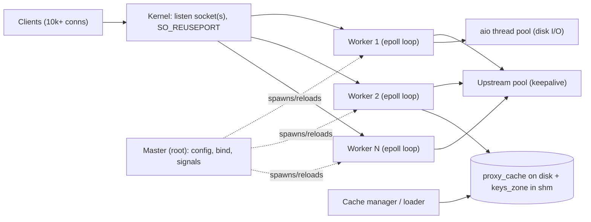
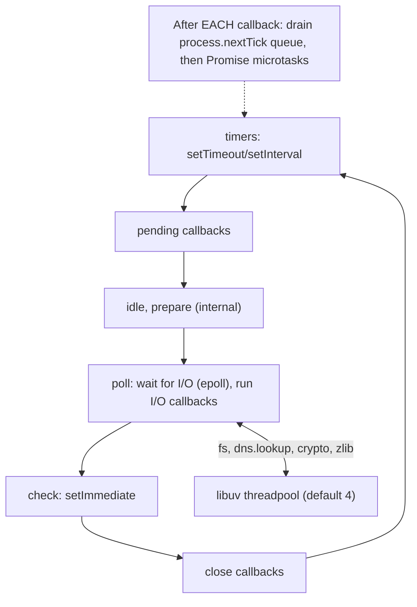
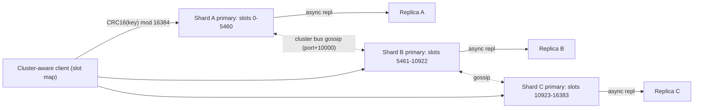
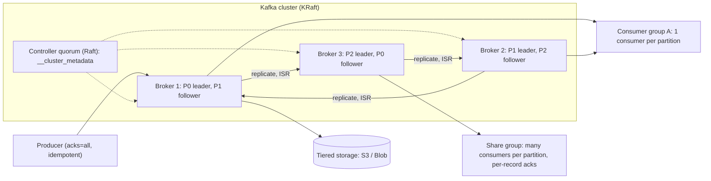
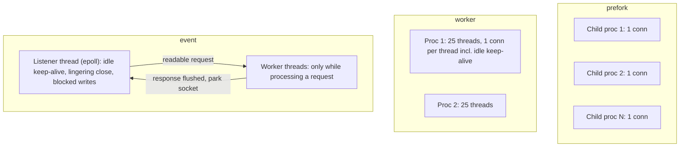
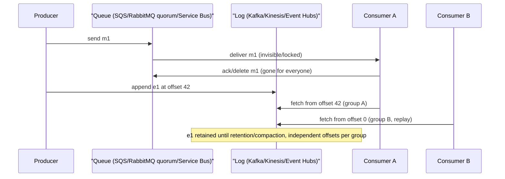
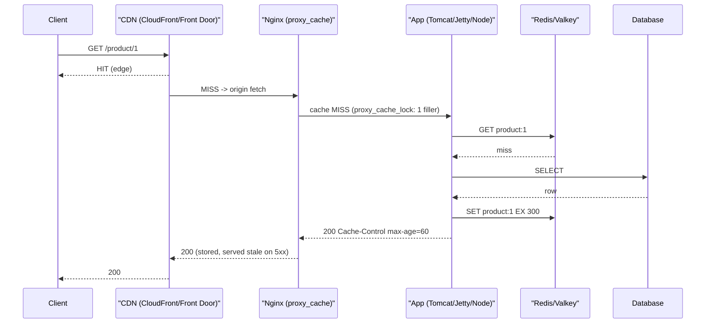

# C6 Technology Stack
> Last verified: 2026-10 · Audience: senior/staff DevOps, SRE, AI eng, NetEng, DevSecOps, architects

## TL;DR
- **Concurrency model is the core lens.** Thread or process per connection (Apache prefork/worker, classic Tomcat/Jetty) vs **event loop** (Nginx, Node.js, Redis, Netty) vs **virtual threads** (Java 21+). Know where each one blocks and what limits it: RAM per thread, file descriptors, or CPU.
- **Edge tier:** Nginx (or Envoy/HAProxy) in front as reverse proxy, TLS terminator and micro-cache. App servers sit behind it. A CDN (CloudFront / Front Door) sits in front of all of it.
- **Caching:** Memcached is a simple, multi-threaded, volatile LRU cache with a slab allocator. Redis/Valkey is a data-structure server with a single-threaded command core, optional persistence (RDB/AOF), replication and Cluster (16,384 hash slots). Licensing as of 2026: Redis 8 is tri-licensed RSALv2/SSPLv1/**AGPLv3**. **Valkey** (Linux Foundation, BSD-3) is the fork that AWS and others build on.
- **Messaging:** RabbitMQ is a smart broker with exchange routing, per-message acks and **quorum queues** (Raft). Kafka is a dumb broker with smart consumers: a partitioned, replicated log. It is **KRaft-only since 4.0** (ZooKeeper removed). **Share groups (Queues for Kafka, KIP-932)** have been production-ready since 4.2. Redis Pub/Sub is fire-and-forget. Redis Streams are a durable log with consumer groups.
- **Cloud mapping:** S3 ↔ Blob, CloudFront ↔ Front Door, ElastiCache/MemoryDB ↔ Azure Managed Redis, SQS ↔ Storage Queues/Service Bus, SNS/EventBridge ↔ Event Grid, Kinesis/MSK ↔ Event Hubs (Kafka API).
- **2025–2026 changes interviewers like to probe:**
  - AWS App Runner is closed to new customers. AWS points to ECS Express Mode instead.
  - Azure Cache for Redis retires: Enterprise tiers on 2027-03-31, Basic/Standard/Premium on 2028-09-30. The replacement is Azure Managed Redis.
  - Front Door (classic) retires 2027-03-31.
  - The SQS maximum message size is now 1 MiB.
  - S3 has had strong read-after-write consistency since Dec 2020.

## C6.1 Web applications
- **How it works:** The classic tiers are **client → (CDN) → L4/L7 LB → web server / reverse proxy → app server → cache / DB / queue**.
  - Static content (HTML, JS, images) is served from the edge or object storage.
  - Dynamic content is rendered by app servers, either SSR or JSON APIs for an SPA.
- **Statelessness** is what lets the web/app tier scale horizontally. Session state goes to Redis, signed cookies or JWT, and files go to object storage. Sticky sessions are a fallback, not the plan.
- **Request-cost anatomy:**
  - DNS, then TCP + TLS (1-RTT in TLS 1.3, 0-RTT with QUIC resumption), then the proxy hop, the app handler and the downstream calls.
  - Tail latency comes from fan-out and blocking I/O.
- **Interview angles:**
  - If asked "how do you scale a web app 10×", say: make it stateless, put a CDN in front for static content and cacheable API responses, autoscale the app tier behind an LB, add a cache tier, move slow work to queues, and scale the DB with replicas and sharding last.
  - Pitfall: storing sessions in local memory or on local disk, which breaks scale-in and blue/green.

## C6.2 Solutions for web applications
| Layer | Typical choices | Concurrency model |
|---|---|---|
| Web server / reverse proxy | **Nginx**, Apache httpd, Caddy, HAProxy, Envoy, Traefik | Event-driven (Apache: MPM-dependent) |
| JVM app servers | Tomcat, **Jetty**, Undertow, Netty (WebFlux), Quarkus/Vert.x | Thread-per-request or event loop; virtual threads on Java 21+ |
| JS runtime | **Node.js**, Deno, Bun | Single-threaded event loop + libuv threadpool |
| Python | Gunicorn (pre-fork WSGI), Uvicorn (ASGI/asyncio) | Pre-fork processes / event loop |
| Go | net/http | Goroutine per connection (M:N scheduler) |
| Managed PaaS | Elastic Beanstalk, ECS Express Mode, App Service, Container Apps | Platform-managed |
- **Trade-off:**
  - Thread/process-per-request is simple and isolates failures, but memory grows linearly with concurrency (~1 MB stack per platform thread by default).
  - An event loop handles C10K+ cheaply, but one blocking call stalls every connection on that loop.
- **Interview angle:** Don't put a heavyweight server in front of a heavyweight server. A typical stack is Nginx/Envoy (TLS, buffering, slow-client protection) → app server (business logic).

## C6.3 Apache web server
- **How it works:**
  - Apache HTTP Server ("httpd", 2.4.x line) is a modular server. Modules include `mod_ssl`, `mod_proxy` (`_http`, `_fcgi`, `_balancer`), `mod_rewrite`, `mod_security`, `mod_http2` and `mod_cache`.
  - Dynamic content runs either in-process (`mod_php`, which needs prefork because of thread safety) or out of process via **`mod_proxy_fcgi` → PHP-FPM** (preferred).
  - Per-directory `.htaccess` lets you delegate config without a restart, but httpd then has to stat every directory in the path on every request. Set `AllowOverride None` for performance.
- **When to use:** shared hosting, legacy `.htaccess`-heavy apps, rich module ecosystem (mod_security WAF, auth modules), and teams with an Apache estate.
- **Interview angles:**
  - "Apache vs Nginx?" Apache gives flexibility, per-directory config and in-process modules. Nginx gives a lower memory footprint per connection with an event-driven design.
  - Apache **event MPM** has largely closed the keep-alive gap.

## C6.4 Apache webserver architecture
- **MPMs (Multi-Processing Modules)** decide how connections map to processes and threads. Only **one MPM can be loaded at a time**, and it can be switched via `LoadModule` when built with `--enable-mpms-shared`.

| MPM | Model | Pros | Cons |
|---|---|---|---|
| **prefork** | One single-threaded child process per connection | Isolation; works with non-thread-safe modules (mod_php) | Highest RAM per connection; poor at keep-alive |
| **worker** | N processes × `ThreadsPerChild` threads; one thread per connection | Far less RAM | An idle keep-alive connection still pins a thread |
| **event** | Like worker, plus a **listener thread** per process using epoll/kqueue | Keep-alive, lingering close and blocked writes are handed to the listener, so workers are only busy while actually processing | Needs thread-safe modules |

- **Default MPM on Unix:** `event` if the OS supports threads and thread-safe polling (all modern OSes do), otherwise worker, otherwise prefork.
- **Event MPM connection math:**
  - A process accepts new connections while `connections < ThreadsPerChild + AsyncRequestWorkerFactor × idle_workers`.
  - `AsyncRequestWorkerFactor` defaults to **2**.
  - Worked example: 4 processes × 10 threads (`MaxRequestWorkers` 40) can hold about 120 connections when all workers are idle.
- **Interview angle:** If asked why Apache "fell over at 256 users", the answer is prefork's default `MaxRequestWorkers` (256), with idle keep-alive connections holding processes. Fix: switch to event MPM + PHP-FPM, and tune `KeepAliveTimeout`.

## C6.5 Apache webserver scalability
- **Vertical:**
  - Size `MaxRequestWorkers` ≤ RAM / per-worker RSS, and set `ServerLimit` and `ThreadsPerChild` to match.
  - Set `MaxConnectionsPerChild` to recycle leaky children.
  - Keep `KeepAliveTimeout` low (2–5 s) on prefork/worker.
- **Offload:**
  - Static files go to a CDN or Nginx.
  - App logic moves out of process (PHP-FPM, app servers behind `mod_proxy_balancer`).
  - TLS can be terminated at the LB.
- **Horizontal:** run stateless httpd nodes behind an L4/L7 LB. Share sessions via an external store, and don't keep app state on local disk.
- **Caching:** `mod_cache` + `mod_cache_disk`/`mod_cache_socache`, though Nginx or Varnish is more common in front.
- **Pitfall:** raising MaxRequestWorkers past available RAM makes the box swap, and throughput collapses. Queueing at the LB is better than thrashing.

## C6.6 Nginx webserver
- **What it is:** an event-driven HTTP server, reverse proxy, L7 load balancer, TLS terminator, cache and TCP/UDP proxy (`stream` module).
  - Open source (nginx.org) and NGINX Plus (F5) adds active health checks, cache purge API, JWT auth, dynamic upstreams and a live API.
  - Forks and relatives: Angie (a fork by ex-NGINX developers) and OpenResty (Nginx + LuaJIT).
- **Use cases:** static file serving (`sendfile`, `tcp_nopush`), reverse proxy to app servers, API gateway (rate limiting with `limit_req`/`limit_conn`), HTTP/2 and HTTP/3 (QUIC) termination, and micro-caching.
- **Kubernetes note:** the community **ingress-nginx** controller was announced for retirement, with best-effort maintenance ending March 2026. Migrate to the Gateway API with Envoy-based or other controllers (verify the current status). This is separate from F5's NGINX Ingress Controller.
- **Interview angle:** Nginx is not a "faster Apache". It wins on concurrency per MB, because 10k idle keep-alive connections cost a few MB of RAM rather than 10k threads.

## C6.7 Nginx architecture
- **Master process:**
  - Runs as root. It reads and validates config, binds ports, and spawns and manages workers.
  - `nginx -s reload` (SIGHUP) starts new workers with the new config and gracefully drains the old ones. That gives zero-downtime config changes and binary upgrades (USR2).
- **Worker processes:**
  - Use `worker_processes auto` (one per core), and each worker is single-threaded.
  - Each runs a non-blocking **event loop** over epoll/kqueue, handling thousands of connections as state machines.
  - `worker_connections` defaults to 512. The connection ceiling is roughly `worker_processes × worker_connections`. A proxied request uses 2 connections, and `worker_rlimit_nofile` caps file descriptors.
- **Accept distribution:** `accept_mutex` is off by default since 1.11.3. `listen ... reuseport` (SO_REUSEPORT) gives each worker its own accept queue, which spreads load better.
- **Blocking work:** disk reads that miss the page cache can block a worker. `aio threads` (thread pools) offloads them. There are also cache manager and cache loader helper processes.
- **Interview angles:**
  - "What blocks Nginx?" Slow disk I/O without aio threads, heavy Lua/njs code, and a synchronous resolver at startup.
  - "Why one worker per core?" No context-switch thrash and no locking. Pin workers with `worker_cpu_affinity`.



## C6.8 Nginx as reverse proxy and cache
- **Reverse proxy:**
  - `proxy_pass` to an `upstream` block. Load-balancing methods are round-robin (default), `least_conn`, `ip_hash`, `hash ... consistent` and `random two least_conn`.
  - Passive health checks come from `max_fails`/`fail_timeout`. Active health checks are NGINX Plus only.
  - Turn on `keepalive N` to upstreams, together with `proxy_http_version 1.1` and `proxy_set_header Connection ""`. Since **1.29.7** the `proxy_http_version` default is 1.1 (previously 1.0).
  - `proxy_buffering on` (the default) shields app servers from slow clients. Turn it off for SSE/streaming and LLM token streams.
  - Set `X-Forwarded-For`, `X-Forwarded-Proto` and `Host`. `proxy_next_upstream` defaults to `error timeout`, so be careful retrying non-idempotent POSTs.
- **Cache:**
  - Defined with `proxy_cache_path /data levels=1:2 keys_zone=name:10m max_size=… inactive=10m` (inactive defaults to 10 min). The keys zone lives in shared memory, about **8k keys per MB**, while the bodies live on disk and in the page cache.
  - The default key is `$scheme$proxy_host$request_uri`. `proxy_cache_valid` sets TTLs per status code. Upstream `Cache-Control`/`Expires`/`Set-Cookie` headers are respected.
- **Stampede and resilience controls:**
  - `proxy_cache_lock on`: only one request fills a given key.
  - `proxy_cache_use_stale error timeout updating http_5xx`: serve stale content while the origin is down.
  - `proxy_cache_background_update on`: stale-while-revalidate behaviour.
  - `proxy_cache_revalidate`: conditional GETs to the origin.
  - **Micro-caching** (1–10 s TTL) absorbs spikes on dynamic pages.
- **Pitfalls:** caching personalised responses (missing `Vary`/cookie bypass), purge needing NGINX Plus or a third-party module, and `inactive` evicting content before its TTL expires. See [C1 caching](../C-large-scale-architecture/C1-performance.md#c127-caching-for-performance).

## C6.9 Web containers & Spring framework
- **Servlet container ("web container"):**
  - Tomcat, Jetty and Undertow implement Jakarta Servlet, managing connectors, the request lifecycle, the filter chain and sessions.
  - The jakarta.* namespace replaced javax.* from Jakarta EE 9 (Spring Boot 3+).
- **Classic model: thread-per-request.** Tomcat NIO uses an acceptor plus pollers, then hands the request to a worker thread for its whole duration.
  - Defaults: `maxThreads` **200**, `maxConnections` 8192 (NIO), `acceptCount` 100 (the OS backlog).
  - A blocking JDBC or HTTP call holds a ~1 MB platform thread, so throughput ≈ threads / latency (Little's Law).
- **Spring MVC** (blocking, Servlet) vs **Spring WebFlux** (reactive on Netty event loops, Reactor). WebFlux needs end-to-end non-blocking drivers (R2DBC, reactive clients) to pay off.
- **Virtual threads (JEP 444, GA in Java 21):** `spring.threads.virtual.enabled=true` (Boot 3.2+) runs request handling on virtual threads. `@Async` and the scheduler switch to `SimpleAsyncTaskExecutor`/`SimpleAsyncTaskScheduler`, which ignore pool sizing.
  - This gives blocking-style code with event-loop-like concurrency.
  - **Pinning:** `synchronized` blocks pinned the carrier thread until **JDK 24 (JEP 491)**. Native/JNI frames still pin.
  - The bottleneck moves downstream. Bound concurrency with DB pool size (HikariCP) or semaphores, because "unlimited threads" will DDoS your database.
- **Spring Boot 4 / Framework 7 (Nov 2025):** Jakarta EE 11 / Servlet 6.1 baseline. Undertow support was dropped (unverified — check the Boot 4 release notes).
- **Interview angle:** "Thread pool exhausted at 200 concurrent slow requests" is a Little's Law problem. Fix it with timeouts, bulkheads, and virtual threads or async, not just `maxThreads=2000`.

## C6.10 Jetty & Spring
- **Jetty** (Eclipse) is a lightweight, embeddable server popular in embedded and IoT, Hadoop/Spark UIs, Solr and gRPC/HTTP2 stacks.
  - **Jetty 12** has an async core decoupled from Servlet. It supports EE8, EE9 and EE10 (EE11 in 12.1) environments side by side, plus HTTP/1.1, HTTP/2, HTTP/3 and WebSocket.
- **Threading:**
  - `QueuedThreadPool` (default max 200) plus `ReservedThreadExecutor`.
  - Jetty's "eat what you kill" scheduling runs the selector's task on the same thread to keep CPU caches hot.
  - Jetty 12 can use a virtual-thread executor via `QueuedThreadPool.setVirtualThreadsExecutor`. In Spring Boot, `spring.threads.virtual.enabled` applies to Jetty too.
- **In Spring Boot:** exclude `spring-boot-starter-tomcat` and add `spring-boot-starter-jetty`. Tune with `server.jetty.threads.max/min/idle-timeout` and `server.jetty.max-connections`.
- **Tomcat vs Jetty:** Tomcat is the default and has the broadest ops knowledge. Jetty has a smaller footprint, strong async/HTTP2 and fine-grained embedding. Throughput differences are usually negligible next to app and DB latency.
- **Interview angle:** choose the server by ecosystem and ops familiarity. The real performance levers are timeouts, pool sizes, connection reuse and offloading TLS to the proxy or mesh.

## C6.11 Node.js
- **How it works:**
  - V8 runs JS on **one main thread**. **libuv** provides the event loop and does async network I/O via epoll/kqueue/IOCP (no threads needed).
  - A **threadpool** handles the work that can't be done asynchronously at the OS level: fs, `dns.lookup` (getaddrinfo), crypto (`pbkdf2`, `scrypt`, `randomBytes`), zlib.
  - The threadpool size defaults to **4** via `UV_THREADPOOL_SIZE` (max 1024).
- **Scaling on multiple cores:**
  - The `cluster` module or a process manager (PM2), or one process per container with K8s replicas (preferred).
  - `worker_threads` for CPU-bound JS.
- **Good fit:** I/O-bound APIs, BFF/gateways, WebSockets/real-time, SSR, streaming.
- **Bad fit:** CPU-heavy work on the main thread (JSON parse of large payloads, image processing, sync crypto). It blocks every connection.
- **Versions:** even-numbered majors become LTS. Node 24 has been LTS since Oct 2025, and Node 26 is due for LTS around Oct 2026. Check nodejs.org/en/about/previous-releases.
- **Interview angles:**
  - "DNS lookups slow under load" → `dns.lookup` saturates the 4-thread pool. Raise `UV_THREADPOOL_SIZE`, use `dns.resolve*` (c-ares, no pool), or cache.
  - Monitor **event loop lag/utilisation** (`perf_hooks.monitorEventLoopDelay`).

## C6.12 Node.js event loop
- **Phases, in order, per iteration:**
  1. **timers** (`setTimeout`/`setInterval`)
  2. **pending callbacks** (deferred system I/O errors)
  3. **idle/prepare** (internal)
  4. **poll** (fetch new I/O events, run I/O callbacks; it blocks here when nothing else is pending)
  5. **check** (`setImmediate`)
  6. **close callbacks** (`socket.on('close')`)
- **Microtasks:** `process.nextTick` queue first, then the Promise microtask queue. Both drain completely after each callback, before moving on. Recursive `nextTick` can **starve I/O**.
- **Ordering gotcha:**
  - Inside an I/O callback, `setImmediate` always fires before `setTimeout(…,0)`.
  - From the main module the order is non-deterministic (it depends on process performance).
- **Interview angles:**
  - "p99 spikes but CPU averages 30%" → a long synchronous task blocks the loop. Find it with `--cpu-prof` or clinic.js, then chunk it with `setImmediate` or move it to a worker thread.
  - Backpressure: honour `stream.write()` returning false / `'drain'`, or memory balloons.



## C6.13 Cloud solutions for web †
- **AWS:**
  - **Elastic Beanstalk** is opinionated PaaS on EC2 + ASG + ELB. You still see and own the resources. Deploy policies are all-at-once, rolling, rolling with additional batch, immutable, and traffic splitting.
  - **App Runner** is container/source-to-URL. **It is closed to new customers**: existing customers keep it, and no new features are planned. AWS recommends **Amazon ECS Express Mode** (one API call → Fargate service + ALB + autoscaling, no extra charge).
  - **ECS/Fargate**, **EKS**, **Lambda** + API Gateway / Lambda Function URLs, and **Amplify Hosting** for SPA/SSR frontends.
- **Azure:**
  - **App Service** (Web Apps): Windows/Linux, code or container. Deployment slots with swap give blue/green. Plans go from Free/Basic/Standard to Premium v3/v4 and Isolated v2 (App Service Environment v3).
  - **Container Apps**: serverless containers on managed K8s, with KEDA scale-to-zero, Dapr, revisions with traffic split, and workload profiles (dedicated/GPU).
  - Also AKS, **Functions** (Flex Consumption), and **Static Web Apps**.
- **Interview angles:**
  - Pick PaaS (App Service ↔ Beanstalk/ECS Express) for standard web apps.
  - Pick serverless containers (Container Apps ↔ ECS Express/Fargate, or Cloud Run on GCP) for spiky, scale-to-zero microservices.
  - Pick K8s (EKS ↔ AKS) when you need platform-level control or portability.
  - Gotcha: App Service slots share the plan's compute, so a perf test in a staging slot hurts prod.

## C6.14 Cloud storage †
- **S3 storage classes** (all 11 nines durability):

| Class | AZs | Min duration | Min billable size | Access |
|---|---|---|---|---|
| Standard | ≥3 | – | – | ms |
| Intelligent-Tiering | ≥3 | – | (<128 KB not tiered) | ms. Auto-moves to IA after 30 d and Archive Instant after 90 d. Optional Archive/Deep tiers |
| Standard-IA | ≥3 | 30 d | 128 KB | ms + retrieval fee |
| One Zone-IA | 1 | 30 d | 128 KB | ms. Not AZ-loss resilient |
| **Express One Zone** | 1 (you pick it) | – | – | single-digit ms, up to 10× faster, request cost 50% lower. **Directory buckets**, session auth |
| Glacier Instant Retrieval | ≥3 | 90 d | 128 KB | ms |
| Glacier Flexible Retrieval | ≥3 | 90 d | 40 KB overhead | minutes to hours (restore) |
| Glacier Deep Archive | ≥3 | 180 d | 40 KB overhead | hours (restore) |

- **Azure Blob access tiers** (block blobs only):
  - **Hot**; **Cool** (30 d min); **Cold** (90 d min); **Archive** (180 d, offline, rehydrate up to 15 h at standard or high priority).
  - **Smart tier** automatically moves blobs between hot, cool and cold.
  - Archive works only with LRS/GRS/RA-GRS, not ZRS/GZRS.
  - **Premium block blob** (SSD, a separate account type that can't be tiered) is the closest match to S3 Express One Zone in purpose. But Premium is regional (LRS/ZRS) rather than an AZ-pinned directory bucket.
- **Consistency:**
  - S3 has had **strong read-after-write consistency for all PUT/DELETE/LIST since Dec 2020**.
  - S3 supports conditional writes (`If-None-Match`, `If-Match`) for optimistic concurrency.
  - Azure Blob has always been strongly consistent, with ETag/lease concurrency.
- **Redundancy:**
  - S3 classes are multi-AZ by default. CRR/SRR handle replication.
  - Azure needs an explicit choice: LRS, ZRS, GRS/RA-GRS, GZRS/RA-GZRS.
- **Interview angles:**
  - Lifecycle rules plus minimum-duration penalties: moving small objects to IA costs more.
  - Express One Zone for ML training scratch and shuffle data, co-located with compute in the same AZ.
  - Use presigned URLs / SAS for direct client uploads. Use OAC (CloudFront) or Private Endpoint / Front Door Premium Private Link to keep buckets private.

## C6.15 Cloud CDN †
- **Amazon CloudFront:**
  - Global PoPs plus Regional Edge Caches, with optional **Origin Shield** (a single mid-tier that collapses origin fetches).
  - Cache and origin-request policies control behaviour. **OAC** protects S3 origins, and VPC origins allow private ALB/EC2.
  - Edge compute: **CloudFront Functions** (lightweight JS, viewer events) and **Lambda@Edge** (Node/Python, origin events).
  - Integrates with WAF and Shield.
  - Flat-rate pricing plans that bundle WAF/DDoS were introduced in 2025 (unverified details).
- **Azure Front Door Standard/Premium:**
  - A global L7 entry point that combines CDN, anycast acceleration (split TCP), WAF, and origin load balancing with health probes.
  - **Premium** adds managed WAF rule sets, bot protection, and **Private Link to origins**.
  - **Front Door (classic) retires 2027-03-31.** **Azure CDN Standard from Microsoft (classic) retires 2027-09-30**; no new profiles since Aug 2025. Azure CDN from Edgio was shut down in Jan 2025.
- **Key differences:**
  - Front Door is CDN + global LB/WAF in one resource.
  - On AWS, global L7 failover across regions needs CloudFront origin groups or Route 53 / Global Accelerator.
  - Global Accelerator (anycast L4) ↔ Azure cross-region Load Balancer.
- **Interview angles:** cache keys (avoid busting via query strings/cookies), purge/invalidation cost and latency, versioned asset filenames instead of invalidation, `stale-while-revalidate`, and protecting the origin from direct access. See [I3 Acceleration](../I-dns-tls-acceleration-gaps/I3-acceleration.md) and the CDN overlaps D1.14 and H6.12.

## C6.16 Services
- **Meaning:** the stateful "backing services" behind stateless web/app tiers:
  - **cache** (C6.18–21)
  - **message queue / event stream** (C6.22–26)
  - **datastores** (C6.27+)
  - **search / analytics** (C6.41+)
- In 12-factor terms they are attached resources, addressed via config (URL/credentials) and swappable.
- **Design rules:**
  - Each service has its own SLO, capacity model and failure mode.
  - The app must degrade gracefully: cache miss means fall through to the DB, a queue outage means buffer or reject, and search being down means hide the feature.
- **Interview angle:** draw the synchronous request path short (LB → app → cache → DB), and push everything else off-path via queues and streams.

## C6.17 Services solutions
| Need | Self-managed OSS | AWS | Azure |
|---|---|---|---|
| Ephemeral cache | Memcached | ElastiCache (Memcached) | – (Azure Managed Redis) |
| Cache + data structures | Redis / **Valkey** | ElastiCache (Valkey/Redis OSS), MemoryDB | **Azure Managed Redis** |
| Task queue | RabbitMQ, ActiveMQ | SQS, Amazon MQ | Storage Queues, Service Bus |
| Pub/sub fan-out / events | NATS, Redis Pub/Sub | SNS, EventBridge | Event Grid |
| Event log / streaming | **Kafka**, Pulsar, Redpanda | MSK, Kinesis Data Streams | Event Hubs (Kafka API) |
- **Selection heuristics:**
  - Need routing, per-message ack/retry/DLQ or workflow semantics → **queue** (RabbitMQ/SQS/Service Bus).
  - Need replay, ordering per key, multiple independent consumers or high throughput → **log** (Kafka/Kinesis/Event Hubs).
  - Need sub-ms reads → **cache**.
  - Choose a managed service unless there's a hard requirement (feature, cost at very large scale, portability).

## C6.18 Memcached
- **What it is:** a multi-threaded, in-memory, volatile **key → opaque blob** cache.
  - Defaults: port 11211, `-m 64` MB, max item size 1 MB (`-I` raises it), `-t 4` threads.
  - Commands: get/set/add/replace/cas/incr/decr/touch, with text and meta protocols.
- **No persistence, no replication, no server-side clustering.** Clients shard keys with **consistent hashing** (ketama). Losing a node loses only its keys, and they refill from the DB.
- **When to use:** a simple look-aside cache of rendered fragments or serialized objects, scaling vertically with threads on many cores. One big multi-threaded node is very efficient.
- **Interview angle:** "Why Memcached over Redis?" For a pure cache with large values on many cores, Memcached is simpler and multi-threaded, with predictable memory. Pick Redis when you need data structures, persistence, replication or pub/sub.

## C6.19 Memcached Architecture
- **Slab allocator:**
  - Memory is carved into 1 MB **pages** assigned to **slab classes**. Each class holds fixed-size **chunks**, and chunk sizes grow by the factor `-f` (default **1.25**).
  - An item goes in the smallest chunk that fits. This avoids malloc fragmentation but wastes space inside each chunk.
- **Eviction:** **per-slab-class LRU** (segmented HOT/WARM/COLD since 1.5), plus the background LRU crawler for expired items.
  - "Slab calcification" happens when the value-size distribution shifts. `slab_reassign`/`slab_automove` (on by default in modern versions) rebalances pages.
- **Threads:** a listener thread plus N worker threads (libevent), with fine-grained item locks.
  - **Extstore** spills large values to flash/SSD while keys stay in RAM.
- **Distribution:** entirely client-side (consistent hashing). Add **mcrouter** (Meta) for pools, replication and failover routing.
- **Pitfalls:**
  - Thundering herd on a hot key expiry. Use lease tokens (as Meta does), lock-on-miss or early refresh.
  - Mod-N hashing remaps almost every key when a node is added. Use consistent hashing (see B6.2/D1.21).

## C6.20 Redis Cache & its architecture
- **Core:**
  - A **single-threaded command execution** event loop (epoll), so every command is atomic. Lua scripts / Functions and MULTI/EXEC give multi-key atomicity.
  - **I/O threads** (`io-threads`, since 6.0) parallelise socket read/write and parsing. Redis 8 reworked them for big throughput gains.
  - Background threads handle `UNLINK`/lazyfree and fsync.
- **Data structures:** strings, hashes (per-field TTL in 7.4+/Valkey 9), lists, sets, sorted sets, streams, bitmaps, HyperLogLog, geo.
  - Redis 8 folds JSON, time series, probabilistic types, the Query Engine and **vector sets** into core.
- **Eviction:** `maxmemory-policy` options are `noeviction` (the default), `allkeys-lru/lfu`, `volatile-*`, `allkeys-random`. The algorithm is approximate LRU/LFU by sampling.
- **Persistence:**
  - **RDB**: fork + copy-on-write snapshots (`save 60 1000`). Compact and fast to restart, but you lose the minutes since the last snapshot.
  - **AOF**: logs every write. `appendfsync everysec` is the default and loses at most ~1 s. **Multi-part AOF** since 7.0. Hybrid RDB preamble.
  - On restart AOF wins if both are enabled. A large-heap fork can stall for a few ms up to about 1 s, so watch `latest_fork_usec` and THP.
- **HA and scale:**
  - Async replication. **Sentinel** provides failover for non-cluster setups.
  - **Redis Cluster** has **16,384 hash slots** (`CRC16(key) mod 16384`), clients that understand MOVED/ASK redirects, a gossip bus on port +10000, and multi-key ops only within one slot (hash tags `{user:1}`).
  - Async replication means acknowledged writes can be lost on failover. `WAIT` helps but isn't consensus.
- **Licensing (verified):**
  - Mar 2024: Redis 7.4+ moved from BSD to dual RSALv2/SSPLv1.
  - That triggered the **Valkey** fork from 7.2.4 under the Linux Foundation (BSD-3), backed by AWS, Google and Oracle. Valkey 8.0 (Sep 2024), 8.1 (Apr 2025), 9.0 (Oct 2025, atomic slot migration, hash-field expiry), 9.1 (May 2026).
  - May 2025: **Redis 8 added AGPLv3** as a third option (RSALv2/SSPLv1/AGPLv3).
- **Interview angles:**
  - "Redis is single-threaded, so how does it do 1M ops/s?" In-memory work, no locks, pipelining, I/O threads, and sharding across cores and nodes.
  - Big keys and O(N) commands (`KEYS *`, a huge `HGETALL`) block everyone. Use `SCAN`.
  - Hot keys need client-side caching (`CLIENT TRACKING`) or replication of the key.



## C6.21 Cloud caching solutions †
- **Amazon ElastiCache:**
  - Engines are **Valkey**, Redis OSS (up to 7.1) and Memcached.
  - **Serverless** (Valkey 7.2+, Memcached 1.6.22+, Redis OSS 7.1) autoscales memory and compute. Public endpoints need IAM auth + TLS 1.3 and Valkey 9.0+.
  - **Node-based** clusters support cluster mode on/off, Multi-AZ auto-failover and Global Datastore (cross-region).
  - Valkey is priced lower than Redis OSS (roughly 20% on nodes, 33% on serverless — verify on the pricing page).
  - Node-based Valkey can enable **durability** (a Multi-AZ transactional log).
- **Amazon MemoryDB** (Valkey/Redis OSS-compatible) is a **durable primary database** with a Multi-AZ transaction log. It has strong consistency on the primary and is slower on writes than ElastiCache.
- **Azure Managed Redis (AMR):**
  - Built on Redis Enterprise software and first-party, so there's no Marketplace component.
  - **Clustered by default** (OSS or Enterprise cluster policy; non-clustered up to 25 GB). **Zone redundant by default**, Entra ID auth.
  - Includes modules (JSON, Search/vector, TimeSeries, Bloom) and **active geo-replication** (multi-region active-active via CRDTs).
  - Tiers: Memory Optimized, Balanced, Compute Optimized, and Flash Optimized.
- **Azure Cache for Redis retirement (verified):**
  - **Enterprise/Enterprise Flash** retire **2027-03-31** and are disabled from 2027-04-01.
  - **Basic/Standard/Premium** retire **2028-09-30** and are disabled from 2028-10-01.
  - Migrate to AMR. Clients must handle cluster mode and cross-slot commands.
- **Interview angles:**
  - ElastiCache ↔ AMR is the equivalence.
  - MemoryDB ↔ AMR with persistence + active geo-replication is the closest match for "Redis as primary DB" (or use Cosmos DB).
  - Cache-aside, write-through and TTL jitter are covered in C1.26–C1.30 and D1.15.

## C6.22 RabbitMQ
- **What it is:**
  - A general-purpose message broker. It speaks native **AMQP 0-9-1**; **AMQP 1.0** has been native since 4.0; MQTT and STOMP come via plugins; streams have their own protocol.
  - The "smart broker / dumb consumer" model handles routing, per-message acks, TTL, DLX, priorities and delayed retry.
- **Current line:** **4.x** (docs at 4.3).
  - 4.0 **removed classic mirrored queues**. Classic queues are now non-replicated, and the CQv1 storage format was removed.
  - Use **quorum queues** or **streams** for HA.
- **Fit:**
  - Task/work queues, RPC, complex routing (topic/headers), per-message retry/DLQ.
  - Moderate throughput, roughly tens of thousands of msgs/s per queue (unverified ballpark).
- **Interview angle:** "RabbitMQ vs Kafka?"
  - RabbitMQ: messages are deleted on ack, flexible routing, consumers are pushed messages with prefetch, and it works per message.
  - Kafka: messages are retained, can be replayed, are ordered per partition, and are consumed by pulling offsets. It works per log.

## C6.23 RabbitMQ architecture
- **Topology:** producer → **exchange** → (bindings with routing key/pattern) → **queue** → consumer. Exchange types:
  - **direct** (exact key)
  - **fanout** (broadcast)
  - **topic** (`*` matches one word, `#` matches zero or more)
  - **headers**
  - default (nameless) direct exchange
  - plus alternate exchanges and **DLX** (dead-letter exchange)
- **Reliability chain:** publisher confirms + `mandatory` flag → durable queue + persistent messages → manual consumer **acks** + **prefetch** (`basic.qos`) → DLX for rejects/TTL.
- **Queue types:**
  - **Classic**: single node, non-replicated in 4.x.
  - **Quorum**: Raft-replicated, default 3 replicas (an odd number survives (n-1)/2 failures). Always durable. **Delivery limit defaults to 20** (poison-message protection). No exclusive/non-durable queues and no global QoS.
  - **Streams** (3.9+): an append-only replicated log with non-destructive reads by offset, large fan-out and replay. **Super streams** are partitioned streams.
- **Cluster:**
  - Nodes share metadata, which is stored in Mnesia or **Khepri** (Raft-based). Khepri is the default in recent 4.x (unverified on which version).
  - Queues have a leader on one node. Use odd cluster sizes (3/5). Partition handling matters (`pause_minority`).
  - Federation and Shovel handle WAN replication.
- **Pitfalls:**
  - Long queues (RabbitMQ is happiest when queues are near-empty).
  - Unbounded prefetch.
  - One huge queue as a bottleneck. Shard with consistent-hash exchanges or super streams.
  - Memory/disk alarms block publishers.

## C6.24 Kafka architecture
- **Core model:**
  - A topic is split into **partitions**. Each partition is an ordered, immutable, append-only log made of segment files, where every record has an offset.
  - Ordering is guaranteed **per partition** only, and the key hash picks the partition.
  - Retention is by time or size, or by **log compaction** (keeps the latest value per key).
  - **Tiered storage** (KIP-405, GA in 3.9) offloads old segments to object storage.
- **Replication:**
  - Each partition has a leader and followers. The **ISR** (in-sync replicas) are the followers within `replica.lag.time.max.ms`.
  - With `acks=all` + `min.insync.replicas=2` + RF=3, an acked write survives the loss of one broker.
  - `unclean.leader.election.enable=false` (the default) prefers unavailability over data loss.
  - Idempotent producers are the default (since 3.0). Transactions give exactly-once read-process-write.
- **Metadata: KRaft.**
  - A Raft quorum of **controllers** (3 or 5, dedicated or combined mode) stores metadata in the `__cluster_metadata` log.
  - **ZooKeeper mode was removed in 4.0** (Mar 2025). To migrate from ZK, go through 3.9 (the bridge release) first, then upgrade to 4.x.
  - 4.0 also needs Java 17 for brokers and Java 11+ for clients.
- **Consumption:**
  - **Consumer groups**: each partition goes to at most one consumer in the group, so parallelism ≤ partition count. Offsets are committed to `__consumer_offsets`.
  - The **next-gen rebalance protocol (KIP-848)** has been GA since 4.0 (`group.protocol=consumer`). The broker-side coordinator does incremental assignment, with no stop-the-world rebalances.
  - **Share groups / Queues for Kafka (KIP-932):** preview in 4.1, **production-ready in 4.2 (Feb 2026)**. Multiple consumers cooperatively read the *same* partition with per-record acquisition locks, acks/release/reject, and delivery counts. That gives queue semantics, with no ordering, scaling beyond the partition count.
- **Versions:** 4.3.1 (Jun 2026) is the latest feature line, and 4.2.2 shipped Sep 2026.
- **Interview angles:**
  - Partition count planning: throughput and consumer parallelism vs file handles, recovery time and rebalance cost. Partitions are hard to reduce, and adding them breaks key→partition mapping.
  - Exactly-once is only end-to-end with idempotent sinks or transactions.
  - Consumer lag is the key SLI. See [M4 Kafka at scale](../M-data-platforms/M4-kafka-at-scale.md).



## C6.25 Redis Pub/Sub
- **Pub/Sub:**
  - `PUBLISH`/`SUBSCRIBE`/`PSUBSCRIBE` is **fire-and-forget, at-most-once**. Nothing is stored, offline subscribers miss messages, and there are no acks.
  - Slow subscribers are disconnected when they exceed `client-output-buffer-limit pubsub` (default 32mb hard / 8mb for 60 s soft).
  - In Cluster, classic PUBLISH is broadcast to every node over the bus. **Sharded Pub/Sub** (`SPUBLISH`/`SSUBSCRIBE`, 7.0+) routes by channel slot and scales.
- **Streams** (`XADD`/`XREADGROUP`/`XACK`/`XAUTOCLAIM`):
  - A persisted append-only log with IDs, consumer groups, a **pending entries list (PEL)**, and re-claiming of stuck messages.
  - At-least-once delivery. Trim with `MAXLEN ~`/`MINID`.
  - Streams are a single key, so they live on one shard. Shard across multiple stream keys for scale.
- **When to use:**
  - Pub/Sub: ephemeral signals (cache invalidation fan-out, presence, live dashboards, WebSocket backplanes).
  - Streams: lightweight durable queues and event logs when Redis is already there.
  - Kafka/Event Hubs: big, replayable, retained, multi-team streams.
- **Interview angle:** "Use Redis Pub/Sub for order events?" No. It loses messages on disconnect. Use Streams with consumer groups, or a real broker.

## C6.26 Cloud MQ solutions †
- **AWS:**
  - **SQS Standard**: at-least-once, best-effort ordering, nearly unlimited TPS. Optional **fair queues** use MessageGroupId for multi-tenant noisy-neighbour isolation.
  - **SQS FIFO**: exactly-once processing with 5-min dedup, ordering per MessageGroupId. 300 TPS per partition without batching; **high-throughput mode** goes up to 70k TPS (700k msgs/s batched) in the largest regions.
  - SQS limits:
    - max message **1 MiB** (the Extended Client via S3 handles up to 2 GB)
    - retention 1 min–14 days (default 4 days)
    - visibility timeout default 30 s, max 12 h
    - delay up to 15 min
    - long polling up to 20 s
    - DLQ via redrive policy
  - **SNS**: push pub/sub fan-out to SQS, Lambda, HTTP, SMS and email. Filter policies. FIFO topics. The SNS → SQS fan-out pattern.
  - **EventBridge**: event bus with content-based rules, schema registry, archive/replay, Pipes, Scheduler, SaaS partner sources and cross-account buses.
  - **Kinesis Data Streams**:
    - shards give 1 MB/s or 1k rec/s in and 2 MB/s out
    - on-demand or provisioned capacity
    - retention 24 h default, up to 365 d
    - Enhanced fan-out for dedicated per-consumer throughput
  - **MSK**: managed Apache Kafka, either Provisioned (Standard or **Express brokers**) or **MSK Serverless**. MSK Connect for connectors.
  - **Amazon MQ**: managed ActiveMQ / RabbitMQ for lift-and-shift of JMS/AMQP/MQTT/STOMP apps.
- **Azure:**
  - **Storage Queues**: simple and cheap. 64 KB messages, huge backlog (account-capacity bound), at-least-once, HTTP.
  - **Service Bus**: an enterprise broker.
    - Queues and topics/subscriptions with SQL and correlation filters.
    - **Sessions** (FIFO per session), DLQ, duplicate detection, scheduled messages and transactions.
    - Message size: Basic/Standard **256 KB**; Premium up to **100 MB** over AMQP (default 1 MB), with 1 MB batches.
    - Queue size up to 80 GB.
    - AMQP 1.0 + JMS 2.0 (Premium).
  - **Event Grid**: push eventing for reactive, discrete events. Namespace topics add pull delivery and an **MQTT broker**. CloudEvents schema.
  - **Event Hubs**: a partitioned log with a **Kafka protocol endpoint** (Standard and above; no broker to run).
    - Basic: 32 partitions, 1-day retention, 256 KB events.
    - Standard: 32 partitions, 7 days, 1 MB.
    - Premium: 100 partitions per hub, 90 days.
    - Dedicated: 1,024 partitions, 90 days, 20 MB.
    - Capture to Blob/ADLS (Avro/Parquet).
  - No first-party managed RabbitMQ: use Service Bus (AMQP 1.0), the Marketplace, or self-host on AKS (RabbitMQ Cluster Operator).
- **Interview angles:**
  - "SQS vs Kinesis?" SQS works per message: workers ack and delete, and it autoscales with no shards. Kinesis is an ordered, replayable shard log for streaming analytics with multiple consumers.
  - "Service Bus vs Event Hubs?" Service Bus carries *commands/messages* with transactional semantics. Event Hubs carries *telemetry/event streams* at high volume.
  - Visibility-timeout / lock-duration tuning plus idempotent consumers is the universal at-least-once recipe.

<!-- PART2-IDS-GO-HERE -->

## Diagrams

### Apache MPM models


### Queue vs log vs pub/sub semantics


### Reverse proxy + cache request flow


## Cloud mapping: AWS vs Azure
| Capability | AWS | Azure | Role it plays | Key differences | Alternatives |
|---|---|---|---|---|---|
| Web PaaS (code) | Elastic Beanstalk | App Service (Web Apps) | Managed runtime for web apps | Beanstalk exposes the underlying EC2/ASG/ELB. App Service is fully abstracted, with deployment slots + swap | Heroku, Render, GCP App Engine |
| Serverless containers | **ECS Express Mode** / Fargate (App Runner closed to new customers) | **Container Apps** | Container → HTTPS URL with autoscale | ACA has KEDA scale-to-zero, Dapr and revisions. Express Mode provisions an ALB + Fargate in your account | GCP Cloud Run, Knative on K8s |
| Managed K8s | EKS | AKS | Full container orchestration | AKS has a free control-plane tier. EKS charges per cluster-hour | Self-managed K8s, GKE |
| FaaS web backends | Lambda + API Gateway / Function URLs | Functions (Flex Consumption) + API Management | Event-driven HTTP | Cold-start and VNet behaviour differ by plan | Cloudflare Workers |
| Static / SPA hosting | Amplify Hosting, S3 + CloudFront | Static Web Apps, Blob static website + Front Door | Frontend delivery | SWA bundles managed Functions APIs | Cloudflare Pages, Vercel, Netlify |
| Object storage | S3 (Standard, IA, One Zone-IA, Intelligent-Tiering, Glacier IR/Flexible/Deep) | Blob Storage (Hot/Cool/Cold/Archive, smart tier) | Durable blobs, data lake | S3 classes are per object and multi-AZ by default. Azure redundancy (LRS/ZRS/GRS/GZRS) is per account. Archive isn't allowed on ZRS | GCS, Cloudflare R2 (no egress fees), MinIO |
| Low-latency object storage | **S3 Express One Zone** (directory buckets, single AZ) | **Premium block blob** (SSD account) | ML scratch, analytics shuffle | Express is AZ-pinned with session auth. Premium is regional LRS/ZRS and can't be tiered | Local NVMe, FSx for Lustre ↔ Azure Managed Lustre |
| CDN / edge | CloudFront (+ Origin Shield, CloudFront Functions, Lambda@Edge) | **Front Door Standard/Premium** (classic retires 2027-03-31; CDN classic 2027-09-30) | Edge caching, TLS, WAF, acceleration | Front Door bundles global L7 LB + WAF + CDN. AWS uses CloudFront + Route 53/Global Accelerator for multi-region failover. Private origin: CloudFront VPC origins ↔ AFD Premium Private Link | Cloudflare, Akamai, Fastly |
| Reverse proxy / L7 LB (regional) | ALB | Application Gateway (WAF v2) | L7 routing in front of app servers | AppGW is deployed in its own subnet. ALB is ENI-based across AZs | Nginx, Envoy, HAProxy, Gateway API |
| Cache (Memcached) | ElastiCache for Memcached | – (no Memcached service; use AMR) | Volatile look-aside cache | Azure dropped Memcached as a first-party option | Self-host Memcached on VMs/AKS |
| Cache (Redis-compatible) | ElastiCache for **Valkey** / Redis OSS (serverless or node-based, Global Datastore) | **Azure Managed Redis** (Azure Cache for Redis retiring 2027/2028) | Cache, sessions, rate limiting, leaderboards | AMR is Redis Enterprise-based with modules + active-active geo, clustered by default. ElastiCache is Valkey-first and cheaper on Valkey | Redis Cloud, Upstash, Dragonfly, Momento |
| Durable Redis primary DB | **MemoryDB** (Valkey/Redis OSS) | AMR with persistence + geo-replication (closest), or Cosmos DB | In-memory primary DB with durability | MemoryDB commits to a Multi-AZ transaction log before ack. AMR persistence is RDB/AOF to disk | Redis Enterprise, Aerospike |
| Simple queue | **SQS** (Standard/FIFO) | **Storage Queues** | Decoupled work queue | SQS: 1 MiB messages, FIFO, DLQ redrive. Storage Queues: 64 KB, no FIFO/DLQ semantics built in | RabbitMQ, Redis Streams |
| Enterprise broker | SQS FIFO + SNS, or **Amazon MQ** (ActiveMQ/RabbitMQ) | **Service Bus** (queues/topics, sessions, transactions) | Commands, workflows, JMS/AMQP | Service Bus has native topics with filters, sessions, dedup and 100 MB messages (Premium). Amazon MQ is broker-on-instances for protocol compatibility | RabbitMQ, ActiveMQ Artemis, Solace |
| Pub/sub fan-out | **SNS** | Service Bus topics / Event Grid | 1→N delivery | SNS pushes to endpoints. Service Bus subscriptions are pull with durable per-subscriber queues | NATS, Google Pub/Sub |
| Event routing bus | **EventBridge** (rules, archive/replay, Pipes, Scheduler) | **Event Grid** (push, CloudEvents, namespace pull + MQTT) | Reactive integration and SaaS events | EventBridge has richer content filtering + replay. Event Grid has MQTT broker + Azure resource events | Knative Eventing, Kafka Connect |
| Event streaming (log) | **Kinesis Data Streams** | **Event Hubs** | Ordered, partitioned, retained telemetry | Kinesis shards have per-shard limits. Event Hubs uses TU/PU/CU units and speaks the Kafka protocol | Kafka, Redpanda, Pulsar |
| Managed Kafka | **MSK** (Provisioned Standard/Express, Serverless) | **Event Hubs Kafka endpoint** (not real Kafka brokers) or Confluent Cloud on Azure (Marketplace) | Kafka API without ops | MSK is real Apache Kafka (KRaft). Event Hubs implements the protocol, so some admin APIs, compaction limits and Streams features differ | Confluent Cloud, Aiven, Strimzi on K8s |
| MQTT / IoT ingest | IoT Core | Event Grid MQTT broker / IoT Hub | Device messaging | Event Grid MQTT supports MQTT v3.1.1/v5 with routing to Event Hubs | EMQX, HiveMQ |

- **Web hosting:**
  - Beanstalk is IaaS-shaped PaaS: you can SSH in and the resources live in your account.
  - App Service is fully managed. Slot swaps warm up instances before swapping.
  - App Runner closed to new customers in 2026. New designs on AWS should use ECS Express Mode (or Fargate/EKS).
  - Container Apps is the default "serverless containers" answer on Azure.
- **Storage:**
  - S3 makes you choose a class per object, and lifecycle transitions are cheap. Azure tiers are per blob, but redundancy is set per account.
  - Both have early-deletion minimums (30/90/180 d). S3 also has a 128 KB minimum billable size for IA/Glacier IR.
  - Strong consistency on both.
  - S3 Express One Zone is not resilient to AZ loss, so treat it as a cache or scratch tier.
- **CDN:**
  - CloudFront is a pure CDN + edge compute.
  - Front Door is CDN + global anycast L7 LB + WAF. Use it as the single global entry point in Azure designs.
  - Plan the classic-tier migrations (Front Door classic 2027-03-31, CDN classic 2027-09-30).
- **Caching:**
  - AWS is Valkey-first, a result of the 2024 Redis license change.
  - Azure moved to Redis Enterprise (AMR), which is clustered by default. Clients must support cluster mode and avoid cross-slot multi-key ops (or use hash tags).
  - Retirement dates: Enterprise 2027-03-31, Basic/Standard/Premium 2028-09-30.
- **Messaging:**
  - The closest pairs are SQS ↔ Service Bus queues (or Storage Queues for simple, cheap cases), SNS ↔ Service Bus topics / Event Grid, EventBridge ↔ Event Grid, Kinesis ↔ Event Hubs, and MSK ↔ Event Hubs (Kafka API).
  - Event Hubs is Kafka-*compatible*, not Kafka. Verify the feature parity you need (transactions and compaction exist on certain tiers; check the current docs).
  - Azure has no Amazon MQ equivalent.
- **Alternatives:**
  - Cloudflare (CDN, R2, Queues, Workers).
  - Confluent Cloud (multi-cloud Kafka with Flink).
  - Strimzi or the RabbitMQ Cluster Operator on Kubernetes for portability.
  - Self-managed Valkey for licence-clean Redis.

## Hands-on (optional)
```yaml
# docker compose: Nginx micro-cache in front of an app, plus Valkey and a single-node KRaft Kafka
services:
  nginx:
    image: nginx:1.29
    ports: ["8080:80"]
    volumes: ["./nginx.conf:/etc/nginx/conf.d/default.conf:ro"]
  app:
    image: traefik/whoami
  valkey:
    image: valkey/valkey:9
    command: ["valkey-server", "--appendonly", "yes", "--appendfsync", "everysec", "--maxmemory", "256mb", "--maxmemory-policy", "allkeys-lfu"]
  kafka:
    image: apache/kafka:4.1.0
    environment:
      KAFKA_NODE_ID: 1
      KAFKA_PROCESS_ROLES: broker,controller
      KAFKA_LISTENERS: PLAINTEXT://:9092,CONTROLLER://:9093
      KAFKA_ADVERTISED_LISTENERS: PLAINTEXT://kafka:9092
      KAFKA_CONTROLLER_LISTENER_NAMES: CONTROLLER
      KAFKA_CONTROLLER_QUORUM_VOTERS: 1@kafka:9093
      KAFKA_OFFSETS_TOPIC_REPLICATION_FACTOR: 1
```

```bash
# nginx.conf micro-cache (write before `docker compose up`)
cat > nginx.conf <<'EOF'
proxy_cache_path /var/cache/nginx levels=1:2 keys_zone=micro:10m max_size=1g inactive=10m;
upstream app { server app:80; keepalive 32; }
server {
  listen 80;
  location / {
    proxy_pass http://app;
    proxy_http_version 1.1;
    proxy_set_header Connection "";
    proxy_cache micro;
    proxy_cache_valid 200 5s;
    proxy_cache_lock on;
    proxy_cache_use_stale error timeout updating http_500 http_502 http_503;
    proxy_cache_background_update on;
    add_header X-Cache $upstream_cache_status;
  }
}
EOF
docker compose up -d
curl -sI localhost:8080 | grep X-Cache   # MISS then HIT

# Apache: which MPM is active?
apachectl -V | grep -i mpm

# Redis/Valkey: persistence + slot for a key
docker compose exec valkey valkey-cli INFO persistence | grep -E 'aof_enabled|rdb_last_bgsave_status'
docker compose exec valkey valkey-cli CLUSTER KEYSLOT '{user:1}:cart'   # works without cluster mode

# Kafka: create a topic, inspect ISR
docker compose exec kafka /opt/kafka/bin/kafka-topics.sh --bootstrap-server kafka:9092 \
  --create --topic orders --partitions 6 --replication-factor 1
docker compose exec kafka /opt/kafka/bin/kafka-topics.sh --bootstrap-server kafka:9092 --describe --topic orders

# Node: increase libuv threadpool for fs/dns-heavy services
UV_THREADPOOL_SIZE=16 node server.js
```

```hcl
# Terraform: SQS with DLQ (at-least-once + poison handling) and an ElastiCache Valkey serverless cache
resource "aws_sqs_queue" "dlq" {
  name                      = "orders-dlq"
  message_retention_seconds = 1209600 # 14 days
}

resource "aws_sqs_queue" "orders" {
  name                       = "orders"
  visibility_timeout_seconds = 60
  receive_wait_time_seconds  = 20 # long polling
  redrive_policy = jsonencode({
    deadLetterTargetArn = aws_sqs_queue.dlq.arn
    maxReceiveCount     = 5
  })
}

resource "aws_elasticache_serverless_cache" "cache" {
  engine = "valkey"
  name   = "app-cache"
  cache_usage_limits {
    data_storage {
      maximum = 10
      unit    = "GB"
    }
  }
}
```

## Cross-links
- [C1 Performance: caching (C1.26–C1.30)](../C-large-scale-architecture/C1-performance.md#c127-caching-for-performance)
- [C2 Scalability: stateless tiers, partitioning, L4/L7 LB](../C-large-scale-architecture/C2-scalability.md)
- [C3 Reliability: DR, standby](../C-large-scale-architecture/C3-reliability.md)
- [C5 Deployment: blue/green, slots](../C-large-scale-architecture/C5-deployment.md)
- [D1 System design basics: CDN (D1.14), caching (D1.15), LB (D1.3–D1.5), consistent hashing (D1.21)](../D-system-design/D1-system-design-basics.md)
- [D2 Reusable parts of system design](../D-system-design/D2-reusable-parts-of-system-design.md)
- [B6 Database sharding: consistent hashing (B6.2)](../B-database-engineering/B6-database-sharding.md)
- [A7 Socket management: epoll, accept queues](../A-operating-systems/A7-socket-management.md)
- [H6 Web application architecture: proxies, CDN (H6.4–H6.12)](../H-full-stack-troubleshooting/H6-web-application-architecture.md)
- [I3 Acceleration (CDN, edge)](../I-dns-tls-acceleration-gaps/I3-acceleration.md)
- [M4 Kafka at scale](../M-data-platforms/M4-kafka-at-scale.md) · [M5 Stream processing](../M-data-platforms/M5-stream-processing.md)
- [K7 AI gateways, caching, cost](../K-ai-infra-llm/K7-ai-gateways-caching-cost.md)
- [J5 Capacity planning and load testing](../J-sre/J5-capacity-planning-load-testing.md)

## Sources
- https://httpd.apache.org/docs/2.4/mpm.html
- https://httpd.apache.org/docs/2.4/mod/event.html
- https://nginx.org/en/docs/http/ngx_http_proxy_module.html
- https://nodejs.org/en/learn/asynchronous-work/event-loop-timers-and-nexttick
- https://docs.spring.io/spring-boot/reference/features/task-execution-and-scheduling.html
- https://redis.io/docs/latest/operate/oss_and_stack/management/persistence/
- https://redis.io/docs/latest/operate/oss_and_stack/management/optimization/benchmarks/
- https://redis.io/blog/agplv3/
- https://valkey.io/blog/
- https://www.rabbitmq.com/docs/quorum-queues
- https://www.rabbitmq.com/docs/classic-queues
- https://kafka.apache.org/community/downloads/
- https://kafka.apache.org/blog/2025/09/04/apache-kafka-4.1.0-release-announcement/
- https://kafka.apache.org/blog/2026/02/17/apache-kafka-4.2.0-release-announcement/
- https://docs.aws.amazon.com/AmazonS3/latest/userguide/storage-class-intro.html
- https://docs.aws.amazon.com/AmazonElastiCache/latest/dg/WhatIs.html
- https://docs.aws.amazon.com/apprunner/latest/dg/apprunner-availability-change.html
- https://docs.aws.amazon.com/AWSSimpleQueueService/latest/SQSDeveloperGuide/quotas-messages.html
- https://learn.microsoft.com/en-us/azure/azure-cache-for-redis/retirement-faq
- https://learn.microsoft.com/en-us/azure/frontdoor/front-door-cdn-comparison
- https://learn.microsoft.com/en-us/azure/storage/blobs/access-tiers-overview
- https://learn.microsoft.com/en-us/azure/event-hubs/event-hubs-quotas
- https://learn.microsoft.com/en-us/azure/service-bus-messaging/service-bus-quotas
