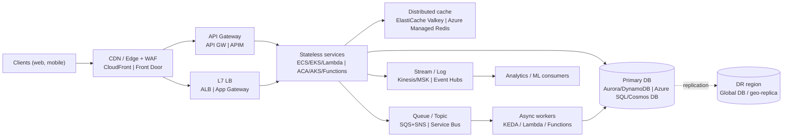
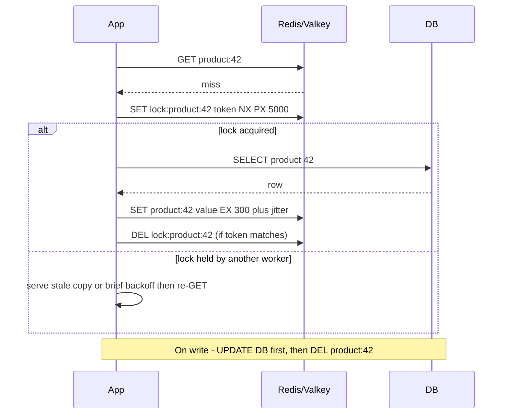
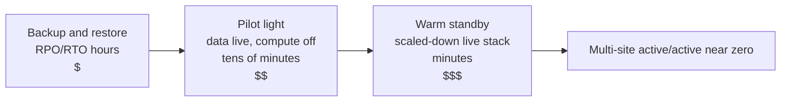

# D1 System Design Basics
> Last verified: 2026-10 · Audience: senior/staff DevOps, SRE, AI eng, NetEng, DevSecOps, architects

## TL;DR
- **Start with requirements and numbers, not boxes.** Cover functional scope, then **QPS (peak and average), read:write ratio, data size and growth, latency SLO, availability SLO, RPO/RTO and consistency needs**. Every later choice (cache, queue, SQL vs NoSQL, sharding, DR tier) should be justified by one of these numbers.
- **Default shape of a design:** clients → **CDN/edge** → **L7 LB or API gateway** → **stateless services** that scale horizontally → **cache** → **primary datastore** (with replicas or partitions) plus **queues/streams** for async work. Say where state lives and how each tier scales and fails.
- **Name the trade-offs:** monolith vs microservices (team autonomy vs distributed-systems tax), L4 vs L7 (speed and protocol-agnostic vs content-aware), sync vs async (simplicity vs decoupling), queue vs log (work distribution vs replay), SQL vs NoSQL (joins/transactions vs predictable scale-out), cache strategies (freshness vs hit rate), HA vs FT (cost vs zero interruption), and **CAP/PACELC** (consistency vs availability or latency).
- **Scaling order:** vertical scale → query/index tuning → **cache** → **read replicas** → async offload → **partition/shard** → multi-region. Shard last, because it is the hardest step to undo.
- **Reliability vocabulary:** availability "nines" multiply in series. Redundancy plus health checks plus automatic failover gives **HA**. **FT** means no interruption at all. **DR** is measured in **RPO** (data loss) and **RTO** (downtime). There are four strategies: **backup & restore → pilot light → warm standby → multi-site active/active**.
- **Cloud fluency is expected.** Know ALB/NLB ↔ Application Gateway/Azure Load Balancer, API Gateway ↔ API Management, SQS/SNS/EventBridge/Kinesis ↔ Service Bus/Event Grid/Event Hubs, DynamoDB ↔ Cosmos DB, Aurora/Aurora DSQL ↔ Azure SQL Hyperscale, ElastiCache ↔ **Azure Managed Redis**, and AWS DR/Backup ↔ Azure Site Recovery/Backup.
- **2026 status:** **Azure Cache for Redis** Basic/Standard/Premium retires **2028-09-30**, and Enterprise/Enterprise Flash retires **2027-03-31**. Both are replaced by **Azure Managed Redis**. **Functions Flex Consumption** is the recommended serverless Functions plan. **AKS node auto-provisioning (NAP)** is managed Karpenter. **Aurora DSQL** is GA: active-active and PostgreSQL-compatible. **DynamoDB global tables** now offer **multi-Region strong consistency (MRSC)**.

---

## D1.1 Monolith vs Microservices: What and Why
- **How it works:**
  - **Monolith:** one deployable unit with one process (or replicated identical processes) and usually one database. In-process calls cost nanoseconds, and you get one transaction boundary.
  - **Modular monolith:** one deployable with strict internal module boundaries (packages, enforced dependencies, a schema per module). It is often the right first step.
  - **Microservices:** independently deployable services, each owning its own data (**database-per-service**). They talk over the network (REST/gRPC, or async messaging) and align with **bounded contexts** (DDD) and team boundaries (**Conway's law**).
- **Trade-offs / when to use:**

| Dimension | Monolith | Microservices |
|---|---|---|
| Deploy | One pipeline. A change redeploys everything | Independent deploys, smaller blast radius per deploy |
| Scaling | Scale the whole app | Scale hot services independently |
| Data | ACID across the domain | Per-service DBs. Cross-service consistency uses **sagas** or the **outbox** pattern |
| Latency | In-process calls | Network hops, serialization, retries, tail-latency amplification |
| Ops | Simple observability | Needs tracing, service discovery, mesh/mTLS, contract testing, platform team |
| Org fit | Small team, early product | Many teams that need autonomy |

- **Interview angles:**
  - **30-second answer:** "Start with a modular monolith. Extract a service when there's a clear reason: a different scaling profile, a different release cadence, team ownership, or fault isolation. Microservices trade code complexity for operational and distributed-data complexity."
  - Follow-up "how do you split?" → by business capability or bounded context, **not** by technical layer. Use the **strangler fig** pattern behind a gateway or routing layer.
  - Follow-up "transactions across services?" → avoid them. Use **sagas** (orchestrated or choreographed) with compensating actions, the **transactional outbox** plus CDC, and idempotent consumers. 2PC across services is an anti-pattern.
  - Pitfall: a **distributed monolith**, meaning services that share a DB or must deploy in lockstep. Another pitfall is chatty synchronous call chains: availability multiplies down the chain (5 services at 99.9% in series ≈ 99.5%).

## D1.2 Microservices on a cloud platform †
- **How it works (compute options):**

| Need | AWS | Azure | Notes |
|---|---|---|---|
| Managed container orchestration (opinionated, no K8s API) | **ECS** on **Fargate** or EC2 | **Azure Container Apps** (ACA) | ACA runs on K8s under the hood, with built-in **KEDA** scaling, **Dapr**, revisions/traffic split and scale-to-zero. ECS uses **Service Connect** for service-to-service |
| Full Kubernetes | **EKS** (+ **EKS Auto Mode**, Karpenter) | **AKS** (+ **AKS Automatic**, NAP) | Choose this for portability, operators, CRDs or a mesh |
| Functions / FaaS | **Lambda** + **API Gateway** (or ALB / Function URLs) | **Azure Functions** (Flex Consumption) + **API Management** | Event-driven and pay-per-use. Watch cold starts and concurrency limits ([D1.7](#d17-vm-serverless-container-scaling)) |
| Workflow orchestration | **Step Functions** | **Durable Functions** / **Logic Apps** | Saga orchestration |
| Service-to-service networking | ECS Service Connect, **VPC Lattice**, Istio on EKS | Istio-based **AKS service mesh add-on**, ACA built-in ingress/Dapr | **AWS App Mesh reached end of support 2026-09-30.** Migrate to Service Connect or VPC Lattice |
| Edge / API front door | CloudFront + API Gateway / ALB | Front Door + APIM / Application Gateway | See [D1.5](#d15-load-balancer-vs-api-gateway-) |
| Async backbone | SQS, SNS, EventBridge, Kinesis/MSK | Service Bus, Event Grid, Event Hubs | See [D1.10](#d110-queues-vs-pubsub)–[D1.11](#d111-streaming-vs-messaging) |
| Identity between services | IAM roles for tasks / EKS Pod Identity | Managed identities / Workload Identity | No static secrets |

- **Trade-offs / when to use:**
  - **Lambda/Functions:** best for spiky, event-driven, short-lived work. Limits are 15-minute max on Lambda, cold starts, per-account concurrency, and harder local testing.
  - **ECS/ACA:** containers without operating K8s. Fewer extension points.
  - **EKS/AKS:** maximum control and portability. You run upgrades, add-ons and node lifecycle (reduced with Auto Mode/Automatic).
- **Interview angles:**
  - "Which would you pick for 30 microservices on AWS?" → ECS Fargate if the team has no K8s skills. EKS if you need K8s ecosystem features (operators, GitOps with Argo, Karpenter, mesh). Use Lambda for glue and event handlers. On Azure, the equivalent ladder is Container Apps → AKS, with Functions for glue.
  - Mention **per-service DB**, **IaC per service**, **independent pipelines**, **distributed tracing** (OpenTelemetry → X-Ray/CloudWatch or Application Insights) and **workload identity**.

## D1.3 Load Balancing: L7 vs L4 load balancers †
> Deep dive: [F6.9 L4 vs L7](../F-network-engineering/F6-network-performance.md#f69-load-balancing-at-layer-4-vs-layer-7), [H6.5 Data-center LBs](../H-full-stack-troubleshooting/H6-web-application-architecture.md#h65-data-center-load-balancers-l7-routing-https-termination-sticky-sessions).

- **How it works:**
  - **L4** balances on the 5-tuple (TCP/UDP). It either **passes through** or proxies at the connection level and never reads the payload. One TCP connection is pinned to one target. It is very fast, keeps state per flow, and can preserve client IP.
  - **L7** **terminates** HTTP(S) and makes **per-request** decisions on host, path, headers, cookies or gRPC method. It can do TLS offload, WAF, redirects, header rewrites, connection multiplexing and HTTP/2/gRPC to backends. The cost is CPU and latency, and it needs certificates.
  - **AWS:** **ALB** (L7) uses round robin by default, with least outstanding requests or weighted random as options. Cross-zone is always on at the LB level. It adds `X-Forwarded-For`. **NLB** (L4 TCP/UDP/TLS) uses a **flow hash** (protocol, src/dst IP:port, TCP seq). It gives a **static IP per AZ** (optionally EIP) and has cross-zone **off by default**. **GWLB** steers traffic to appliances with GENEVE on 6081.
  - **Azure:** **Application Gateway** (regional L7 plus WAF; also a TCP/TLS proxy). **Azure Load Balancer** (L4 pass-through, zone-redundant, regional or **cross-region/global tier**). **Front Door** (global L7 + CDN + WAF). **Traffic Manager** (DNS-based global). **Application Gateway for Containers** (L7 for AKS).
- **Trade-offs / when to use:**
  - Use L4 for non-HTTP traffic (DBs, MQTT, gaming/UDP), extreme throughput, static IPs for allow-lists, PrivateLink services (NLB is the PrivateLink provider front), and end-to-end TLS pass-through.
  - Use L7 for path/host routing to microservices, WAF, auth offload (ALB OIDC/Cognito), canary or weighted routing, and gRPC.
  - It's common to layer them: **NLB → ALB** (static IP plus L7), or **Front Door → App Gateway**.
- **Interview angles:**
  - **30-second answer:** "L4 routes connections and L7 routes requests. L7 can see the URL, so it can route `/api` vs `/static`, terminate TLS and run WAF. L4 is cheaper and protocol-agnostic, and it keeps long-lived connections pinned."
  - Follow-up "long-lived gRPC/HTTP2 connections are unbalanced behind an L4 LB" → one connection carries many requests, so L4 can't spread them. Use an L7 LB with HTTP/2 to backends, client-side LB, or a mesh.
  - Follow-up on algorithms: round robin, least connections/outstanding requests, weighted, consistent hash/ring (session stickiness without cookies), and **power of two choices**.
  - Pitfalls: health checks that don't reflect dependencies (too shallow or too deep), **idle timeouts** (ALB default 60 s; Azure LB TCP idle default 4 min) killing WebSockets, and missing connection draining.

## D1.4 API and API Gateway
- **How it works:**
  - An **API** is a contract: REST (resources, HTTP verbs, idempotent PUT/DELETE), **gRPC** (protobuf over HTTP/2, streaming), **GraphQL** (client-shaped queries, one endpoint), or async APIs (webhooks, AsyncAPI). Version via URI or header. Use **idempotency keys** on POST, pagination (cursor > offset), and standard error formats (RFC 9457 problem+json).
  - An **API gateway** is a reverse proxy specialized for API management. It handles **authN/authZ** (JWT/OIDC validation, API keys, mTLS), **rate limiting/quotas** (token bucket), **request/response transformation**, **routing/versioning**, **caching**, **aggregation** (BFF), usage plans/monetization, a developer portal, and analytics.
  - **AWS API Gateway:** REST APIs (full features: usage plans, API keys, caching, request validation, mapping templates, WAF), HTTP APIs (cheaper, lower latency, JWT authorizers) and WebSocket APIs. The account throttle is **10,000 RPS with 5,000 burst** (token bucket) per Region by default. Integration timeout is **50 ms–29 s**; on Regional/private REST APIs it **can be raised above 29 s**, possibly at the cost of a lower throttle quota. Payload limit is **10 MB**. Cache TTL defaults to **300 s** (max 3600).
  - **Azure API Management:** **policies** (XML pipeline: inbound/backend/outbound/on-error) such as `rate-limit-by-key`, `quota-by-key`, `validate-jwt`, `set-body`, `cache-lookup`. Tiers are Consumption, classic (Developer/Basic/Standard/Premium) and **v2 (Basic v2, Standard v2, Premium v2, all GA)**. Premium v2 supports full VNet injection and zones. Self-hosted gateway is classic Premium/Developer only (not v2). Multi-region deployment is **classic Premium only** (not yet on v2).
- **Trade-offs / when to use:** a gateway centralizes cross-cutting concerns, but it adds a hop (a few ms), can become a single point of failure or bottleneck, and can turn into a **"god gateway" that holds business logic** (anti-pattern).
- **Interview angles:**
  - **30-second answer:** "A gateway is the single entry point for APIs. It handles auth, throttling, transformation, versioning and observability, so services stay focused on business logic."
  - Follow-ups: the **BFF pattern** (a gateway per client type), **gateway vs service mesh** (north-south vs east-west), and rate-limit algorithms (token bucket, leaky bucket, fixed/sliding window, and distributed counters in Redis).

## D1.5 Load Balancer vs API Gateway †
> L7 proxy fundamentals: [F6.8 Proxies](../F-network-engineering/F6-network-performance.md#f68-the-importance-of-proxy-and-reverse-proxies), [H6.6 Reverse proxy](../H-full-stack-troubleshooting/H6-web-application-architecture.md#h66-reverse-proxy-server-operation-tls-offloading-caching-compression).

| Capability | L4 LB (NLB / Azure LB) | L7 LB (ALB / App Gateway / Front Door) | API Gateway (API GW / APIM) |
|---|---|---|---|
| Primary job | Spread connections | Spread HTTP requests, route by content | Manage APIs as products |
| Throttling / quotas per client | No | Coarse (WAF rate rules) | **Yes**: per key, user or plan (usage plans, `rate-limit-by-key`) |
| Auth | No | ALB OIDC/Cognito auth; App Gateway has none native (mTLS only) | **JWT/OAuth, API keys, Lambda authorizers, `validate-jwt`, mTLS** |
| Transformation | No | Header rewrite, redirects | **Body/header mapping, protocol mediation (SOAP↔REST), response caching** |
| Dev portal, analytics, monetization | No | No | Yes |
| Protocols | Any TCP/UDP | HTTP/1.1, HTTP/2, gRPC, WebSocket | HTTP(S), WebSocket. gRPC limited (APIM gRPC only on self-hosted gateway, verify) |
| Cost / latency | Lowest | Low | Highest per request |

- **Trade-offs / when to use:** use an LB for raw traffic distribution and HA in front of a fleet. Use an API gateway when APIs are consumed by **third parties or many teams** and you need per-consumer policy. A common Azure topology is **Front Door (WAF) → App Gateway (WAF/TLS) → APIM (internal) → AKS/Functions**. On AWS it's **CloudFront + WAF → API Gateway → (VPC link → NLB/ALB) → ECS/EKS**, or **ALB → services** for internal APIs.
- **Interview angles:**
  - **30-second answer:** "An LB answers *which healthy instance* gets the request. A gateway answers *is this caller allowed, how much, and in what shape*. They're complementary, and many designs have both."
  - Follow-up "can ALB replace API Gateway?" → it can for internal services: path routing, OIDC auth, WAF, cheaper at high RPS. It has no per-client quotas, usage plans, request validation or transformation.
  - Pitfall: using APIM only as a load balancer. Microsoft explicitly says not to adopt APIM solely for LB.

## D1.6 Scaling: Vertical vs Horizontal
> Detail: [C2 Scalability](../C-large-scale-architecture/C2-scalability.md).

- **Vertical (scale up):** a bigger instance. It's simple, needs no code change, and keeps strong consistency. Limits are a hardware ceiling, cost growing superlinearly, a single point of failure, and usually a restart (Azure SQL/Hyperscale and Aurora Serverless v2 resize with little or no disruption).
- **Horizontal (scale out):** more instances behind an LB. It needs **stateless** services (externalize session state to Redis or a DB, or use JWTs), idempotent handlers, and a partitioned data tier. It gives near-linear scale and fault isolation.
- **Data tier:** reads scale with replicas and cache. Writes scale with partitioning/sharding ([D1.22](#d122-database-sharding)). **Amdahl's/USL**: coordination and contention cap the speedup.
- **Interview angles:** "Scale up first while it's cheap and simple, and design stateless so you *can* scale out. Databases are usually scaled up long before they are sharded." Mention autoscaling signals (CPU, RPS per target, queue depth, latency) and **headroom** for AZ loss (N+1 / run at ≤ 66% across 3 AZs).

## D1.7 VM, Serverless, Container Scaling
- **How it works:**

| Layer | AWS | Azure | Key mechanics |
|---|---|---|---|
| VMs | **EC2 Auto Scaling groups**: target tracking, step, scheduled, **predictive** scaling. Warm pools, instance refresh, mixed instances + Spot | **Virtual Machine Scale Sets** (Flexible orchestration is the default/recommended), Azure Monitor **autoscale** (metric, schedule, **predictive**), standby pools (verify GA) | Minutes to boot. Use golden images, health-based replacement, and warm pools to cut launch time |
| Functions | **Lambda**: default **1,000 concurrent executions per Region** (raisable); each function scales by **1,000 execution environments every 10 s**; **reserved** concurrency (cap + guarantee) vs **provisioned** concurrency (pre-initialized, paid); **SnapStart** for cold starts; RPS limit = 10 × concurrency | **Functions Flex Consumption** (Linux only): per-function scaling (HTTP/Blob/Durable groups), up to **1,000 instances** (Consumption: 200), instance memory **512 MB / 2 GB / 4 GB**, **always-ready** instances (default 0), VNet integration, regional quota **250 cores** per subscription (default), 1 app per plan, no deployment slots | Concurrency = RPS × avg duration (Lambda doc formula). Lambda runs **1 request per environment**. Flex runs **many concurrent executions per instance** (HTTP concurrency default depends on memory size) |
| Containers (managed) | **ECS Service Auto Scaling** (target tracking on CPU/mem/ALB RequestCountPerTarget), Fargate | **Container Apps**: KEDA rules (HTTP default **10 concurrent requests**/replica, TCP, custom). Default min **0**/max **10** replicas (max configurable **1,000**). Polling 30 s, cooldown 300 s, scale-up steps 1→4→8→16… | Scale-to-zero on ACA. ECS min ≥ 0 but no request-buffering scale-from-zero |
| Pods (K8s) | **HPA/VPA**, **KEDA** (self-install on EKS) | HPA/VPA, **KEDA add-on** for AKS | KEDA scales on event-source lag (queues, Kafka, Prometheus) and down to 0 |
| Nodes (K8s) | **Karpenter** (just-in-time, bin-packing, consolidation, Spot), **EKS Auto Mode** (managed Karpenter), Cluster Autoscaler | **Node auto-provisioning (NAP)** = managed **Karpenter** (`NodePool`/`AKSNodeClass` CRDs). Default in **AKS Automatic**. Cluster Autoscaler on VMSS node pools | NAP limits: no Windows pools, no IPv6 clusters, no cluster stop. AKS Automatic pod-readiness SLA (99.9% within 5 min) |

- **Trade-offs / when to use:** VMs scale slowest (minutes) but have full control. Containers scale in seconds once nodes exist, and node provisioning adds a minute or more. Serverless scales fastest from zero, but has cold starts, concurrency quotas and per-invocation cost that loses to containers at sustained high utilization.
- **Interview angles:**
  - "Lambda at 5,000 RPS × 200 ms?" → concurrency **1,000**, which equals the default account limit, so request an increase and reserve concurrency for critical functions. Protect downstream DBs (RDS Proxy, or reserved concurrency as a throttle).
  - "Why Karpenter/NAP over Cluster Autoscaler?" → it provisions **right-sized nodes directly** from pending pod specs without pre-defined node groups, consolidates underused nodes, and handles Spot well.
  - Pitfalls: scaling on CPU for I/O-bound services (scale on RPS or queue depth instead), missing **scale-in protection/draining**, and autoscaling thrash (stabilization windows, cooldowns).

## D1.8 Real World Scaling Interview Tips
- **Do back-of-envelope math out loud.** 1 day ≈ 86,400 s ≈ 10^5 s. 1M req/day ≈ 12 RPS avg; assume peak = 3–10× avg. Storage = items × size × retention × replication factor. **Little's law:** concurrency = throughput × latency.
- **Find the bottleneck first** (DB writes, a hot key, fan-out, network egress) before adding boxes. "Measure, then scale." Name the metric you'd watch (p99 latency, saturation, queue lag).
- **Standard playbook in order:** stateless app + autoscaling → CDN + cache → read replicas → async/queue for slow work → denormalize/precompute → partition/shard → multi-region. Say **why** you're taking each step.
- **Always cover failure modes and limits:** retries with **exponential backoff + jitter**, timeouts, **circuit breakers**, **bulkheads**, **load shedding** and backpressure, idempotency, and quota/limit awareness (Lambda concurrency, API GW 10k RPS, DynamoDB partition 3,000 RCU / 1,000 WCU).
- **Talk about cost and operability:** reserved vs on-demand vs Spot, managed vs self-run, observability (RED/USE, tracing), and SLOs ([J1 SLIs/SLOs](../J-sre/J1-slis-slos-error-budgets.md)).
- **Anti-patterns interviewers probe:** premature microservices or sharding, a cache without an invalidation story, synchronous chains across many services, global strong consistency "just because", and ignoring hot partitions.

## D1.9 Synchronous vs Event Driven Architectures
- **How it works:**
  - **Synchronous (request/response):** the caller blocks on REST/gRPC. Temporal coupling means both must be up. Latency is the sum of the chain, and availability is the product of the chain.
  - **Event-driven:** producers emit **events** (facts: `OrderPlaced`) or **commands** to a broker. Consumers react asynchronously. Variants are **event notification**, **event-carried state transfer**, **event sourcing** (the log is the source of truth) and **CQRS**.
- **Trade-offs / when to use:**
  - Sync suits user-facing reads that need an immediate answer, simple CRUD, and strong read-after-write.
  - Async suits slow or long work (video transcode, emails), spike absorption (load leveling), fan-out to many consumers, and cross-service workflows. The costs are **eventual consistency**, harder debugging (needs correlation IDs and tracing), duplicate and out-of-order delivery, and schema evolution (schema registry).
- **Interview angles:**
  - **30-second answer:** "Sync is simpler but couples availability and latency. Event-driven decouples services in time and scale, at the cost of eventual consistency and more operational tooling. I make the user-facing path sync and push side-effects async."
  - Must-mention: **at-least-once delivery ⇒ idempotent consumers** (dedupe by event ID), the **transactional outbox** to avoid dual writes, DLQs, poison-message handling, and ordering only per key/partition.
  - Cloud: **EventBridge** ↔ **Event Grid** (event routing), **Step Functions** ↔ **Durable Functions** (orchestration).

## D1.10 Queues vs PubSub
- **How it works:**
  - **Queue (point-to-point):** each message is consumed by **one** of N competing consumers, then deleted after ack. It load-levels, distributes work, and supports visibility timeout/lock, retries and a **DLQ**.
  - **Pub/Sub (topic):** each message is delivered to **every subscription**. Fan-out. Subscriptions are often backed by queues (SNS → SQS fan-out, Service Bus topic → subscriptions with filters).
- **Cloud mapping:**

| Pattern | AWS | Azure | Notes |
|---|---|---|---|
| Simple queue | **SQS Standard** (at-least-once, best-effort order) | **Storage Queues** (simple, large backlog) / **Service Bus queues** | SQS visibility timeout default 30 s, retention default 4 days (max 14) |
| Ordered / exactly-once processing | **SQS FIFO** (message group ID, dedup ID) | **Service Bus sessions** + duplicate detection + transactions | Ordering is per group/session, not global |
| Pub/Sub fan-out | **SNS** (+ SNS FIFO) | **Service Bus topics** (rich filters) / **Event Grid** | |
| Event bus / routing | **EventBridge** (rules, schema registry, archive/replay, Pipes) | **Event Grid** (push, at-least-once, MQTT broker) | Event Grid has no ordering guarantee |
| Enterprise broker (AMQP/JMS) | **Amazon MQ** (ActiveMQ/RabbitMQ) | **Service Bus Premium** (AMQP 1.0, JMS 2.0) | Lift-and-shift of brokers |

- **Interview angles:**
  - "Queue or pub/sub?" → do you want **one worker** to do the job (queue) or **every interested service** to know (pub/sub)? Often both: SNS topic → per-service SQS queues so each service has its own buffer, retry and DLQ.
  - Follow-ups: the visibility timeout must exceed processing time (or extend it), the redrive/DLQ policy (`maxReceiveCount`), backpressure through queue-depth autoscaling (KEDA), and the claim-check pattern for large payloads (store in S3/Blob, send a pointer).

## D1.11 Streaming vs Messaging
> Deep dive: [M4 Kafka at scale](../M-data-platforms/M4-kafka-at-scale.md), [M5 Stream processing](../M-data-platforms/M5-stream-processing.md).

| | Messaging (queue/broker) | Streaming (log) |
|---|---|---|
| Storage model | Message removed after ack | **Append-only, retained log**. Consumers track **offsets** |
| Consumers | Competing consumers. Per-message ack, DLQ | **Consumer groups**. Each group reads all data; parallelism = partitions |
| Replay | No (EventBridge archive is an exception) | **Yes**: rewind offsets, reprocess, new consumers backfill |
| Ordering | Per group/session | **Per partition** |
| Throughput | Thousands to tens of thousands msg/s per queue | Millions of events/s (partitioned) |
| Use | Commands, jobs, workflows, transactions | Telemetry, clickstream, CDC, event sourcing, real-time analytics, ML feature pipelines |
| AWS | SQS, SNS, Amazon MQ | **Kinesis Data Streams** (retention 24 h default, up to 365 d), **MSK** (Kafka) |
| Azure | Service Bus, Storage Queues | **Event Hubs** (Kafka-compatible endpoint; retention 1–7 d Standard, up to 90 d Premium/Dedicated), Confluent on Azure |

- **Interview angles:**
  - **30-second answer:** "Messaging is about *delivering work*. Each message is handled once and then gone. Streaming is about *recording facts*, a durable ordered log many consumers can read and replay independently."
  - Follow-ups: partition count caps consumer parallelism, key choice drives ordering and hot partitions, and exactly-once is really **idempotent producer + transactional read-process-write** (Kafka EOS) or idempotent sinks. Kafka **share groups** (KIP-932, "queues for Kafka") add queue semantics to Kafka (GA status by version unverified).

## D1.12 SQL vs NoSQL, and managed distributed relational vs managed key-value NoSQL †
- **How it works:**
  - **SQL/relational:** schema, joins, **ACID** multi-row transactions, secondary indexes and ad-hoc queries. The classic architecture scales up plus read replicas. **Distributed SQL/NewSQL** (Spanner, CockroachDB, Aurora DSQL) shards automatically and uses consensus.
  - **NoSQL:** key-value/wide-column (DynamoDB, Cassandra), document (Cosmos DB, MongoDB), graph and time-series. You **model for access patterns** (single-table design). Partition key + sort key gives predictable single-digit-ms latency at any scale. Joins and ad-hoc queries are limited.
- **Managed services:**

| | AWS | Azure | Notes |
|---|---|---|---|
| Scale-up relational with shared distributed storage | **Aurora** (MySQL/PostgreSQL; storage 6 copies across 3 AZs, up to 15 read replicas; **Aurora Global Database** <1 s typical cross-Region lag, promote <1 min) | **Azure SQL Database Hyperscale** (page servers + log service; **up to 128 TB**, **0–4 HA replicas**, **up to 30 named replicas**, geo-replicas, snapshot backups; 2–192 vCores) | Both separate compute from log-structured storage, with fast clones/restores. Still a **single writer** |
| Horizontally sharded relational | **Aurora PostgreSQL Limitless Database** | **Azure Database for PostgreSQL elastic clusters** (Citus) | See [B6](../B-database-engineering/B6-database-sharding.md) |
| Active-active distributed SQL | **Aurora DSQL**: serverless, PostgreSQL 16-compatible, **strong consistency + snapshot isolation**, active-active multi-Region (peered clusters plus witness, within one Region set, **no cross-continent**), **99.99% single-Region / 99.999% multi-Region** availability | No first-party equivalent. Closest options are **Cosmos DB for PostgreSQL** (retiring, not for new projects), Azure SQL with geo-replication (single writer), or **CockroachDB/YugabyteDB** on Azure | DSQL uses optimistic concurrency, so retry on conflicts. It has some PostgreSQL feature gaps (e.g., foreign keys, sequences; verify current list) |
| Key-value / document NoSQL | **DynamoDB**: item ≤ 400 KB, partition ~3,000 RCU / 1,000 WCU, on-demand or provisioned, **global tables** in **MREC** (async, last-writer-wins, RPO ≈ seconds) or **MRSC** (exactly 3 Regions or 2 + witness, **RPO 0**; no transactions/TTL/LSIs). 99.999% SLA for global tables | **Cosmos DB** (NoSQL API + Mongo/Cassandra/Gremlin/Table APIs): RU/s, logical partition ≤ 20 GB, **5 consistency levels** (Strong, Bounded staleness, **Session** = most used, Consistent prefix, Eventual), multi-region writes, p99 <10 ms reads/writes | Cosmos lets you tune consistency per account/request. DynamoDB picks eventual or strong per read (strong is within a Region in MREC) |

- **Trade-offs / when to use:**
  - **Pick SQL** when you need relationships, multi-entity invariants (money, inventory), ad-hoc reporting, or the access patterns are still evolving. **Pick key-value NoSQL** when access patterns are known, scale or latency must be predictable, schema is flexible, or the workload is very high write throughput.
  - **Aurora/Hyperscale** when you need a familiar engine, single writer, and read scale-out. **DSQL** when you need active-active multi-Region writes with strong consistency and can accept OCC retries and feature gaps. **DynamoDB/Cosmos DB** for internet-scale key access.
- **Interview angles:**
  - **30-second answer:** "SQL gives flexible queries and transactions but scale-out is hard. Key-value NoSQL gives effortless partitioned scale and predictable latency, but you design around access patterns and lose joins. Distributed SQL tries to give both, at the cost of write latency from consensus."
  - Follow-ups: hot partitions (high-cardinality key, write sharding with a suffix), GSIs are eventually consistent, Cosmos Strong across multi-region writes is impossible (RPO 0 + RTO 0 can't both hold), and multi-region strong-consistency writes cost ≈ 2 × RTT between the farthest regions.

## D1.13 WebSockets for Server to Client Communication
- **How it works:**
  - **WebSocket (RFC 6455):** an HTTP/1.1 `Upgrade: websocket` gets `101 Switching Protocols` back, giving a full-duplex framed channel over one TCP connection (`wss://` over TLS). Over HTTP/2 it's RFC 8441 extended CONNECT.
  - Alternatives: **SSE** (one-way server→client over HTTP, auto-reconnect, simple through proxies), **long polling** (fallback), **WebTransport** over HTTP/3 (emerging), and **webhooks** for server-to-server.
- **Scaling concerns:** connections are **stateful and long-lived**. You need: LB idle timeouts above the heartbeat interval; ping/pong keepalives; a **connection registry** mapping user to node; a **pub/sub backplane** (Redis/Valkey pub/sub, Kafka) to deliver to whichever node holds the socket; graceful drain on deploy (clients reconnect with jittered backoff); and per-node file-descriptor and memory sizing ([A7 sockets](../A-operating-systems/A7-socket-management.md)).
- **Managed options:**
  - **API Gateway WebSocket APIs:** routes `$connect`/`$disconnect`/`$default`, with the backend pushing via the `@connections` callback API. Limits: **500 new connections/s** per account per Region (raisable), **2 h max connection duration**, **10 min idle timeout**, **32 KB frames / 128 KB message**. There's no concurrent-connection cap; ~3.6 M is reachable at the default rate.
  - **ALB** supports WebSocket upgrades. After the upgrade, listener rules and WAF no longer apply.
  - **AWS AppSync** (GraphQL subscriptions / AppSync Events) and **IoT Core** (MQTT) are alternatives.
  - **Azure Web PubSub:** generic WebSocket and pub/sub, custom subprotocols, the server doesn't need to hold connections. **Azure SignalR Service:** for the ASP.NET SignalR ecosystem (RPC, auto-transport fallback to SSE/long-poll). Both are scaled in **units** (≈1,000 concurrent connections per unit, verify). Application Gateway and Front Door also pass WebSockets.
- **Interview angles:**
  - "Chat/notifications for 10M users?" → managed fan-out service (API GW WebSocket / Web PubSub) or a fleet of connection servers + Redis/Kafka backplane + presence store. Use SSE if traffic is server→client only.
  - Pitfalls: sticky sessions hiding uneven load, reconnect storms after a deploy (add jitter), and the API GW 2-hour cap (clients must reconnect).

## D1.14 Caching (where to cache: gateway, CDN, cache cluster; TTL)
> Overlap: [C1 caching](../C-large-scale-architecture/C1-performance.md), [H6.4 Browser caching](../H-full-stack-troubleshooting/H6-web-application-architecture.md#h64-browser-caching-cache-control-policies-etag-proxy-and-cdn-revalidation), [H6.12 CDN](../H-full-stack-troubleshooting/H6-web-application-architecture.md#h612-content-delivery-network-cdn-edge-servers-ip-anycast-bgp).

- **Tiers (outer to inner):** **browser/client** (`Cache-Control`, `ETag`) → **CDN/edge** (CloudFront ↔ Front Door; Cloudflare) → **API gateway cache** (API GW REST cache, TTL default 300 s / max 3600 s, ≤ 1 MB response; APIM built-in or external Redis cache) → **app in-process cache** (fastest, per-instance, inconsistent across nodes) → **distributed cache cluster** (ElastiCache/Valkey ↔ Azure Managed Redis) → **DB buffer pool / DAX** (DynamoDB Accelerator) / Cosmos integrated cache.
- **TTL design:** short TTLs for volatile data, long TTLs plus **versioned keys/URLs** (cache busting) for immutable assets. Add **TTL jitter** to avoid synchronized expiry. Use `stale-while-revalidate` / `stale-if-error` at the edge. Explicitly invalidate on write for correctness-critical keys (CloudFront invalidations cost money and take time, so prefer versioned paths).
- **Interview angles:**
  - **30-second answer:** "Cache as close to the user as correctness allows. Static and public content goes to the CDN, per-user API responses to the gateway or distributed cache, and hot DB rows to Redis. Every cache needs an explicit staleness budget (TTL) and an invalidation story."
  - Metrics: hit ratio, eviction rate, p99 latency, memory fragmentation. Pitfalls: caching personalized responses at the CDN (vary on auth / `Cache-Control: private`), and treating the cache as the source of truth.

## D1.15 Redis and Memcached Caching Strategies
- **Engines:**

| | Redis / Valkey | Memcached |
|---|---|---|
| Data model | Strings, hashes, lists, sets, sorted sets, streams, bitmaps, HyperLogLog, geo, JSON/search (modules) | Opaque strings (default max item 1 MB) |
| Threads | Single-threaded command execution (I/O threads optional) | Multithreaded, so it scales vertically on cores |
| Persistence / replication | RDB/AOF, replicas, automatic failover, **Cluster mode** (16,384 hash slots, `{hashtag}` for co-location) | None. Client-side consistent hashing (ketama) |
| Extras | Pub/sub, Lua, transactions (MULTI), TTL per key, distributed locks | Simple LRU slab cache |
| Managed | **ElastiCache** (Valkey, Redis OSS, Memcached; Serverless or node-based), **MemoryDB** (durable Valkey/Redis); **Azure Managed Redis** (Redis Enterprise-based, clustered by default, Entra ID auth, active geo-replication) | **ElastiCache for Memcached**. **No first-party Azure Memcached**, so self-host or use Redis |

- **Strategies:**
  - **Cache-aside / lazy loading** (the default): read the cache; on a miss, read the DB and populate with a TTL. Only requested data is cached and a cache-node failure isn't fatal. Costs: a 3-trip miss penalty and staleness until TTL or invalidation. On write: **update the DB, then delete the key** (not set), which shrinks race windows.
  - **Read-through:** the cache library or provider loads on a miss (DAX, Cosmos integrated cache). Same semantics, less app code.
  - **Write-through:** write the cache and DB on every write. The cache is fresh, but there's a write latency penalty, churn from never-read data (add a TTL), and missing data on a new node (combine with lazy loading).
  - **Write-behind / write-back:** write the cache and flush to the DB asynchronously in batches. Very fast writes and absorbs bursts, but **data loss risk** if the cache dies before flush, plus ordering and consistency complexity. Use only with durable caches (MemoryDB) or tolerant data (counters, metrics).
  - **Refresh-ahead:** proactively refresh hot keys before expiry.
  - **Eviction:** `allkeys-lru`/`allkeys-lfu` for pure caches, `volatile-*` when mixing persistent keys. `noeviction` causes write errors when full.
- **Stampede / thundering-herd protection:**
  1. **Request coalescing / single-flight:** one in-flight load per key per process.
  2. **Distributed lock:** `SET lock:key token NX PX 5000`. The winner rebuilds; others serve stale data or wait and retry.
  3. **Probabilistic early expiration** (XFetch): recompute with rising probability as the TTL nears.
  4. **TTL jitter** (±10–20%) to spread expiries.
  5. **Serve stale** while rebuilding (soft TTL inside the value plus a hard TTL on the key).
  6. **Warm the cache** before cutover or failover.
  - Also handle **hot keys** (replicate to N suffixed keys or a local L1 cache) and **cache penetration** (cache negative results briefly, Bloom filter for non-existent keys).
- **Interview angles:**
  - "Redis or Memcached?" → Redis/Valkey by default: data structures, replication/HA, persistence, cluster. Memcached for a simple, multithreaded, ephemeral object cache where losing everything is fine.
  - "How do you keep cache and DB consistent?" → you can't make it perfectly atomic without a distributed transaction. Use cache-aside + delete-on-write + short TTL, or CDC (DynamoDB Streams / Debezium) driven invalidation. Mention the race (stale read repopulates after delete) and fixes (delayed double-delete, versioned values).

## D1.16 High Availability
> Detail: [C3 Reliability](../C-large-scale-architecture/C3-reliability.md).

- **How it works:** eliminate SPOFs with **redundancy** (N+1 or N+2 across **AZs**), **health checks**, **automatic failover**, stateless tiers, replicated state, and graceful degradation.
- **Nines:** 99.9% ≈ **8.76 h/yr** (43.8 min/mo). 99.95% ≈ 4.38 h/yr. 99.99% ≈ **52.6 min/yr** (4.38 min/mo). 99.999% ≈ **5.26 min/yr**.
  - **Serial:** A = A1 × A2 × … (each dependency lowers it).
  - **Parallel:** A = 1 − ∏(1 − Ai). For example, two independent 99.9% replicas give 99.9999% in theory, but correlated failures make it lower in practice.
- **Cloud building blocks:** multi-AZ ASG/VMSS behind ALB/App Gateway, RDS/Aurora Multi-AZ ↔ Azure SQL zone-redundant, ZRS storage, zone-redundant Azure Managed Redis, Route 53 / Traffic Manager / Front Door health-based routing, and **ARC zonal shift** to drain an impaired AZ. Use **data-plane** operations for failover; control planes are less available.
- **Interview angles:** "HA is a property of the whole request path, so find the weakest serial dependency." Mention **static stability** (pre-provisioned capacity so failover doesn't need the control plane), **cell-based architecture** to limit blast radius, and SLO-driven design ([J1](../J-sre/J1-slis-slos-error-budgets.md)). Chaos testing: [J7](../J-sre/J7-chaos-engineering.md).

## D1.17 High Availability vs Fault Tolerance
| | High availability | Fault tolerance |
|---|---|---|
| Goal | Minimize downtime | **Zero** service interruption on component failure |
| Mechanism | Redundancy + detection + failover (seconds to minutes) | Full active redundancy, lockstep or quorum. Failure is masked |
| Data loss | Possible (async replica lag) | None (synchronous) |
| Cost | Moderate | High (2× or more resources, complexity) |
| Examples | Multi-AZ RDS failover (~1–2 min), ASG replacing instances | Quorum storage (Aurora 4-of-6 writes), Raft clusters, RAID, Cosmos DB/DynamoDB replica sets, VMware FT, dual power/NICs |

- **Interview angles:** "HA *recovers* from failures quickly. FT *doesn't notice* them." Most cloud systems are HA at the instance level and FT at the storage/quorum level. Follow-up: neither replaces **DR** (region loss, corruption, ransomware) or **backups** (logical errors replicate instantly).

## D1.18 Distributed Computing
- **Core realities:**
  - The **8 fallacies** of distributed computing: the network is reliable, latency is zero, bandwidth is infinite, the network is secure, topology doesn't change, there is one admin, transport cost is zero, the network is homogeneous.
  - **Partial failure** is normal, and you can't distinguish slow from dead (FLP impossibility for async consensus).
  - **Time:** wall clocks drift. Use **Lamport/vector clocks**, **hybrid logical clocks**, or bounded-uncertainty clocks (Spanner TrueTime, AWS Time Sync with microsecond accuracy, used by DSQL). Never order events across nodes by wall time alone.
  - **Consensus and quorums:** Raft/Paxos with majority **⌊N/2⌋+1**. Use 3 or 5 voters across failure domains. Leader election with **fencing tokens/leases** to prevent split brain. **R + W > N** for quorum reads to see the latest write.
  - **Delivery semantics:** at-most-once, at-least-once (+ idempotency = effectively once). "Exactly-once" is end-to-end idempotent processing.
- **Patterns:** retries + backoff + jitter, timeouts and deadlines propagated across calls, circuit breaker, bulkhead, sagas, outbox, leader election, sharding, replication, gossip/membership (SWIM), and Merkle-tree anti-entropy.
- **Interview angles:** when asked "how do you make X reliable", cover timeouts, retries with idempotency, quorum or replication, and what happens during a partition. Link that to CAP/PACELC ([D1.25](#d125-cap-theorem)).

## D1.19 Hashing
- **How it works:** a hash function maps arbitrary keys to fixed-size values. Properties: deterministic, uniform, fast, and (for crypto hashes) preimage/collision resistant.
  - **Non-cryptographic** (speed, distribution): MurmurHash3, **xxHash**, CityHash/FarmHash, CRC16/CRC32 (Redis Cluster slot = `CRC16(key) mod 16384`).
  - **Keyed, DoS-resistant:** SipHash, used for hash tables exposed to untrusted input.
  - **Cryptographic:** SHA-256/SHA-3, BLAKE3. Use for integrity, content addressing and dedup. Passwords need a **slow KDF** (Argon2id, bcrypt, scrypt), never a plain hash.
- **System-design uses:** partitioning/sharding (`H(key) mod N`), LB affinity (source-IP hash, NLB flow hash), cache key placement, Bloom filters, HyperLogLog, consistent IDs, content-addressed storage (Git, container image digests), ETags.
- **Interview angles:** "Which hash for sharding?" → a fast, well-distributed, non-crypto hash (Murmur3/xxHash) is fine. You don't need SHA-256. The *mapping* (mod N vs consistent hashing) matters more than the function.

## D1.20 Challenges of Hashing
- **Rehashing on resize:** with `H(key) mod N`, changing N remaps ≈ **(N−1)/N** of keys (≈ all keys). For a cache that means a near-total miss storm and DB overload. For a datastore it means massive data movement. This is the motivation for consistent hashing.
- **Skew / hot keys:** a uniform hash doesn't fix **non-uniform access** (celebrity users, a viral item). Fixes are key salting/suffixing, splitting the hot key, local caching, and adaptive capacity (DynamoDB isolates hot items automatically to a degree).
- **Collisions:** fine in hash tables (chaining or probing). For dedup or integrity use crypto hashes. Hash-flooding attacks need keyed hashes (SipHash).
- **Loss of locality:** hashing destroys key order, so range scans become scatter-gather. Range partitioning keeps order but creates hot spots on monotonic keys.
- **Heterogeneous nodes and membership churn:** plain mod N can't weight bigger nodes or handle frequent joins and leaves.
- **Interview angles:** "What happens when you add a cache node with mod-N?" → nearly every key moves, hit ratio collapses, and the DB gets stampeded. The fix is consistent hashing / rendezvous hashing plus gradual warm-up.

## D1.21 Consistent Hashing
> Full mechanics: [B6.2 Consistent hashing](../B-database-engineering/B6-database-sharding.md#b62-consistent-hashing).

- Hash nodes and keys onto the same **ring**. A key belongs to the **first node clockwise**. Adding or removing a node moves only **≈ K/N keys**.
- Use **virtual nodes** (many tokens per node) to smooth load, weight heterogeneous nodes, and spread a failed node's load across many peers.
- **Replication:** store on the next **RF distinct** physical nodes clockwise (Dynamo-style preference list).
- **Alternatives:** **rendezvous/HRW** (no ring, highest `H(key,node)` wins), **jump consistent hash** (O(1) memory, buckets numbered 0..N−1), **Maglev** (L4 LBs; minimal disruption plus even spread), **fixed hash slots + directory** (Redis Cluster 16,384 slots, Citus/Vitess ranges). Modern managed databases mostly use the slot/directory approach.
- **Where it shows up:** Memcached client libraries (ketama), Cassandra/ScyllaDB, the original Dynamo paper (managed DynamoDB today uses managed partition maps, not client-side rings), Envoy `ring_hash`/`maglev` LB policies, and CDN request routing.
- **Interview angles:** draw the ring, show what happens when a node is added, then add vnodes. Follow-up: "Is consistent hashing enough for hot keys?" → no, because it balances *keys*, not *load*. Use **bounded-load consistent hashing** or hot-key replication.

## D1.22 Database Sharding
> Full treatment: [B6 Database sharding](../B-database-engineering/B6-database-sharding.md), [B5 Partitioning](../B-database-engineering/B5-database-partitioning.md), [C2 Scalability](../C-large-scale-architecture/C2-scalability.md).

- **Sharding** splits rows across independent DB servers by a **shard key**. It scales **writes and storage** (replicas only scale reads).
- **Strategies:** hash (even spread, scatter range scans), range (cheap scans, hot tail on monotonic keys), directory/lookup (flexible, needs an HA metadata store), geo/tenant.
- **Shard key rules:** high cardinality, even load, immutable, present in most queries, and most transactions stay within one key (tenant_id/user_id).
- **Costs:** cross-shard joins and transactions (sagas/2PC), global unique IDs (Snowflake/ULID), resharding, hot shards, and operational load.
- **Managed paths:** Aurora PostgreSQL Limitless ↔ Azure Database for PostgreSQL elastic clusters (Citus). Auto-partitioned DynamoDB ↔ Cosmos DB. Distributed SQL (Aurora DSQL, Spanner, CockroachDB). Vitess/PlanetScale.
- **Interview angles:** "Shard last." Exhaust caching, replicas, vertical scale and functional splits first, and pick the key from the top queries.

## D1.23 Disaster Recovery: RPO vs RTO
> Overlap: [C3 Reliability](../C-large-scale-architecture/C3-reliability.md) (C3.24–C3.26).

- **RPO (Recovery Point Objective):** the maximum acceptable **data loss**, measured back in time from the disaster. It's driven by backup frequency or replication lag. Sync replication gives RPO ≈ 0.
- **RTO (Recovery Time Objective):** the maximum acceptable **downtime** until service is restored. It's driven by detection, decision, provisioning, data restore and DNS/traffic switch.
- Related terms: **MTTR/MTBF**, **WRT** (work recovery time), and **MTD** (max tolerable downtime, a business limit).
- **Examples from the docs:**
  - Cosmos DB, single region: **RPO < 240 min**.
  - Cosmos DB, multi-region with Session/Eventual: **RPO < 15 min**.
  - Cosmos DB, multi-region with Strong: **RPO 0**.
  - DynamoDB MREC: RPO ≈ replication delay (seconds). MRSC: **RPO 0**.
  - Aurora Global DB: typical lag < 1 s, promotion < 1 min.
- **Interview angles:**
  - **30-second answer:** "RPO is how much data we can lose, and RTO is how long we can be down. Both are business decisions that set the DR tier and its cost, and both must be *tested*."
  - Pitfalls: replication is not backup (corruption and deletes replicate, so keep PITR plus immutable/cross-account backups); failover runbooks that depend on control-plane APIs in the failed region; untested restores; quotas in the DR region too small to scale up.

## D1.24 Different Disaster Recovery Options
- **The four strategies** (AWS DR whitepaper; the same ladder applies on Azure):

| Strategy | What runs in the DR region | Typical RPO / RTO | Cost | AWS building blocks | Azure building blocks |
|---|---|---|---|---|---|
| **Backup & restore** | Nothing. Only backups plus IaC | Hours / hours (up to 24 h) | $ | **AWS Backup** (cross-Region/cross-account copy), EBS/RDS snapshots, S3 CRR + versioning, CloudFormation/CDK/Terraform | **Azure Backup** (GRS vault, cross-region restore), SQL geo-restore (RA-GRS backups), Bicep/Terraform |
| **Pilot light** | Data **live and replicating**. Core infra defined but app servers **off or not deployed** | Tens of minutes / tens of minutes | $$ | Aurora Global DB, DynamoDB global tables, RDS cross-Region replicas, S3 replication, **AWS Elastic Disaster Recovery (DRS)** (block-level replication to a staging area; launches full capacity on failover) | **Azure Site Recovery** (continuous replication for Azure/VMware VMs; Hyper-V as low as 30 s; VMs created at failover), SQL active geo-replication / failover groups, GRS storage |
| **Warm standby** | **Scaled-down but fully functional** stack serving no traffic (or test traffic) | Minutes / minutes | $$$ | Pilot light + running ASG at min capacity, scale up on failover; Route 53 / **ARC** routing controls, Global Accelerator | Scaled-down VMSS/AKS/App Service in the secondary region, Front Door / Traffic Manager priority routing, SQL failover groups |
| **Multi-site active/active** (or hot standby) | Full capacity in 2+ regions serving traffic | Near-zero / near-zero (corruption still needs backups) | $$$$ | Route 53 latency/geo routing or Global Accelerator traffic dials, DynamoDB global tables (write-local), Aurora Global DB write forwarding (write-global), Aurora DSQL multi-Region | Front Door, **Cosmos DB multi-region writes**, Azure SQL geo-replicas (single writer), Azure Managed Redis active geo-replication |

- **Key distinctions:**
  - **Pilot light vs warm standby:** pilot light **can't serve requests** until servers are turned on or deployed. Warm standby **can serve immediately** at reduced capacity and only needs to scale up.
  - **Hot standby:** full capacity, not serving traffic.
  - **Active/active write strategies:** *write global* (one writer region), *write local* (last-writer-wins conflicts), *write partitioned* (by key).
- **Interview angles:**
  - "Pick a DR tier for a payments API with RPO 0 and RTO 5 min" → multi-region with synchronous or strongly consistent data (DynamoDB MRSC / Aurora DSQL / Cosmos Strong single-writer), pre-scaled compute, and data-plane failover (ARC routing controls, Front Door health probes). Justify the cost against the business impact.
  - Always add: **regular DR drills** (ASR test failover, AWS FIS, Resilience Hub), runbook automation, failback plan, and DNS TTLs. Prefer manual-initiated but automated failover over auto-failover on noisy health checks (false failovers cost data and time).

## D1.25 CAP Theorem
- **How it works:**
  - **CAP** (Brewer 2000; proved by Gilbert & Lynch 2002). When a **network partition** happens, a replicated system must choose **Consistency** (linearizable reads see the latest write; some requests fail or wait) or **Availability** (every non-failed node answers, possibly with stale data). P isn't optional on real networks, so "CA" only describes a single-node or single-site system.
  - **PACELC** (Abadi): if **P**artition, choose **A** or **C**; **E**lse (normal operation), choose **L**atency or **C**onsistency. This is the more useful framing, because most of the time there's no partition and the real trade-off is latency (sync cross-region commit) vs consistency.
- **Classification (typical defaults):**

| System | PACELC | Notes |
|---|---|---|
| DynamoDB (single-Region / MREC global tables) | PA/EL | Eventual reads by default. Strongly consistent read option within a Region. LWW across Regions |
| DynamoDB MRSC global tables, Aurora DSQL, Spanner, CockroachDB | PC/EC | Synchronous cross-region commit adds latency. Minority side rejects writes |
| Cosmos DB | Tunable | Strong ≈ PC/EC. Session/Consistent prefix/Eventual ≈ PA/EL. Bounded staleness sits in between |
| Cassandra / ScyllaDB | PA/EL (tunable with QUORUM) | R + W > N for stronger reads |
| Single-primary RDBMS + async replicas | PC/EC on the primary; replica reads are EL | Failover can lose the async tail (RPO > 0) |
| ZooKeeper / etcd | PC/EC | Majority quorum. Minority partitions are unavailable |

- **Interview angles:**
  - **30-second answer:** "During a partition you pick consistency or availability. Outside partitions you still trade latency for consistency, which is PACELC. I choose per data type: strong for balances and inventory, eventual or session for feeds, likes and caches."
  - Follow-ups: "C in CAP ≠ C in ACID" (linearizability vs integrity constraints). The consistency spectrum runs linearizable → sequential → causal → session (read-your-writes) → eventual. A quorum isn't automatically linearizable without extra care (read repair, sync).
  - Pitfall: saying "we picked CA". Instead say the system is CP or AP **under partition**, and state the expected latency cost.

---

## Diagrams







## Cloud mapping: AWS vs Azure

| Capability | AWS | Azure | Role it plays | Key differences | Alternatives |
|---|---|---|---|---|---|
| L7 regional LB | **ALB** | **Application Gateway** (v2, WAF_v2), App Gateway for Containers | Host/path routing, TLS offload, WAF | ALB has native OIDC auth and Lambda targets. App Gateway does TCP/TLS proxy too, WAF in-SKU, needs a dedicated subnet | Envoy/NGINX/HAProxy, K8s Gateway API |
| L4 LB | **NLB** (+ GWLB for appliances) | **Azure Load Balancer** (Standard, regional + global tier), Gateway LB | TCP/UDP, static IPs, ultra-low latency | NLB static IP per AZ, PrivateLink provider. Azure LB is pass-through (no proxy), zone-redundant frontends | MetalLB, Cloudflare Spectrum |
| Global entry / CDN | **CloudFront**, **Global Accelerator**, Route 53 | **Front Door** (Std/Premium), Traffic Manager | Edge caching, anycast, global failover | Global Accelerator = anycast L4. Front Door = anycast L7 + CDN. Traffic Manager and Route 53 = DNS-based | Cloudflare, Akamai, Fastly |
| API gateway | **API Gateway** (REST/HTTP/WebSocket) | **API Management** (Consumption, classic, v2 tiers) | Auth, throttling, transformation, dev portal | API GW is fully serverless, per-request pricing, 10k RPS default account throttle. APIM is unit-based, with an XML policy engine, workspaces, self-hosted gateway (classic) | Kong, Apigee, Cloudflare API Shield |
| Containers | **ECS/Fargate**, **EKS** (+Auto Mode, Karpenter) | **Container Apps**, **AKS** (+Automatic, NAP) | Microservice hosting | ACA has scale-to-zero + KEDA + Dapr built in. ECS doesn't scale to zero on requests | GKE, OpenShift, Nomad |
| Functions | **Lambda** | **Functions** (Flex Consumption, Premium, Dedicated) | Event-driven compute | Lambda = 1 request/env, 1,000 default account concurrency. Flex = multi-concurrency per instance, 1,000 max instances, 250-core regional quota | Cloudflare Workers, Cloud Run functions |
| VM autoscaling | **EC2 Auto Scaling** | **VM Scale Sets** + Azure Monitor autoscale | Elastic VM fleets | Both have predictive scaling. AWS warm pools ↔ VMSS standby pools | Karpenter (K8s nodes) |
| Queue | **SQS** (Std/FIFO) | **Service Bus queues**, Storage Queues | Work distribution | Service Bus adds sessions, transactions, dup detection, AMQP. Storage Queues = cheap and simple | RabbitMQ, Kafka share groups |
| Pub/sub & event routing | **SNS**, **EventBridge** | **Service Bus topics**, **Event Grid** | Fan-out, event routing | EventBridge has archive/replay and schema registry. Event Grid is push with an MQTT broker | Google Pub/Sub, NATS |
| Streaming | **Kinesis Data Streams**, **MSK** | **Event Hubs** (Kafka endpoint), Confluent on Azure | Partitioned log | Event Hubs speaks the Kafka protocol natively without running brokers | Confluent Cloud, Redpanda |
| Relational (scale-up, shared storage) | **Aurora**, RDS | **Azure SQL Hyperscale**, Azure DB for PostgreSQL/MySQL Flexible | OLTP | Hyperscale up to 128 TB, 30 named replicas. Aurora up to 15 replicas + Global DB | AlloyDB, Neon |
| Distributed SQL | **Aurora DSQL**, Aurora Limitless | Azure DB for PostgreSQL **elastic clusters** (Citus) | Scale-out / active-active SQL | DSQL is active-active multi-Region with strong consistency. Azure has no first-party equivalent | Spanner, CockroachDB, YugabyteDB, TiDB |
| Key-value / document | **DynamoDB** (+ DAX, global tables MREC/MRSC) | **Cosmos DB** (5 consistency levels, multi-region writes, integrated cache) | Massive-scale key access | Cosmos has tunable consistency and multi-API. DynamoDB has capacity modes and MRSC with 3 Regions | Cassandra/ScyllaDB, MongoDB Atlas |
| Cache | **ElastiCache** (Valkey/Redis OSS/Memcached, Serverless), **MemoryDB** | **Azure Managed Redis** (Azure Cache for Redis retiring 2027/2028) | Low-latency cache, sessions, locks, rate limits | AMR is Redis Enterprise-based, clustered by default, Entra ID auth, active geo-replication. No Azure Memcached | Redis Cloud, Momento, Dragonfly |
| Real-time push | **API GW WebSocket**, AppSync Events, IoT Core | **Web PubSub**, **SignalR Service** | Server→client messaging | API GW caps connections at 2 h. Web PubSub/SignalR are unit-based and hold connections for you | Ably, Pusher, Cloudflare Durable Objects |
| Backup / DR | **AWS Backup**, **Elastic Disaster Recovery**, ARC, Resilience Hub, FIS | **Azure Backup**, **Azure Site Recovery**, Chaos Studio | RPO/RTO attainment | DRS = block replication (pilot light). ASR = continuous VM replication with recovery plans and test failover | Zerto, Veeam, Commvault |

- **Scope and zones:**
  - ALB/NLB and App Gateway/Azure LB are **regional**.
  - Front Door, CloudFront, Global Accelerator and Traffic Manager are **global**.
  - Azure LB and App Gateway v2 are zone-redundant when deployed across zones.
  - ALB requires at least 2 AZs. NLB cross-zone is off by default (billing for cross-AZ data applies when you turn it on).
- **Pricing shape:**
  - Lambda, API GW, EventBridge, SQS and DynamoDB on-demand are per-request.
  - APIM classic/v2, App Gateway (capacity units), Service Bus Premium (messaging units), Event Hubs (TU/PU) and Web PubSub/SignalR (units) are **provisioned units**.
  - Model the steady-state load before choosing.
- **Gotchas:**
  - API GW 29 s default integration timeout (raisable for Regional/private REST).
  - ALB stops applying rules and WAF after a WebSocket upgrade.
  - Flex Consumption has no deployment slots and one app per plan.
  - AKS NAP has no Windows pools.
  - DynamoDB MRSC: no transactions or TTL, exactly 3 Regions.
  - Aurora DSQL: no cross-continent clusters, OCC retries.
  - Azure Managed Redis is clustered by default, so cross-slot commands need hash tags.
- **Retired / renamed:**
  - AWS App Mesh: end of support 2026-09-30.
  - Azure Cache for Redis: Enterprise retires 2027-03-31, Basic/Standard/Premium 2028-09-30, replaced by Azure Managed Redis.
  - Cosmos DB for PostgreSQL: retiring, not for new projects. Use elastic clusters.
  - Functions Linux Consumption: legacy, use Flex Consumption.

## Hands-on (optional)

```bash
# Lambda: check account concurrency, then reserve 100 for a critical function
aws lambda get-account-settings --query 'AccountLimit.[ConcurrentExecutions,UnreservedConcurrentExecutions]'
aws lambda put-function-concurrency --function-name orders-api --reserved-concurrent-executions 100

# Container Apps: scale 0..20 on Service Bus queue depth (KEDA), managed identity auth
az containerapp update -n worker -g rg-app \
  --min-replicas 0 --max-replicas 20 \
  --scale-rule-name sb-depth --scale-rule-type azure-servicebus \
  --scale-rule-metadata "queueName=orders" "namespace=sb-prod" "messageCount=50" \
  --scale-rule-identity system

# Redis/Valkey stampede lock: acquire for 5 s only if absent
redis-cli SET lock:product:42 "$(uuidgen)" NX PX 5000
```

```hcl
# ASG target tracking: keep ALB requests per target near 500
resource "aws_autoscaling_policy" "rps" {
  name                   = "alb-rps-target"
  autoscaling_group_name = aws_autoscaling_group.web.name
  policy_type            = "TargetTrackingScaling"
  target_tracking_configuration {
    predefined_metric_specification {
      predefined_metric_type = "ALBRequestCountPerTarget"
      resource_label         = "${aws_lb.web.arn_suffix}/${aws_lb_target_group.web.arn_suffix}"
    }
    target_value = 500
  }
}
```

## Cross-links
- [B5 Database partitioning](../B-database-engineering/B5-database-partitioning.md) · [B6 Database sharding](../B-database-engineering/B6-database-sharding.md) (B6.2 consistent hashing) · [B8 Replication](../B-database-engineering/B8-database-replication.md) · [B1 ACID](../B-database-engineering/B1-acid.md)
- [C1 Performance](../C-large-scale-architecture/C1-performance.md) (caching C1.26–C1.30) · [C2 Scalability](../C-large-scale-architecture/C2-scalability.md) · [C3 Reliability](../C-large-scale-architecture/C3-reliability.md) (DR C3.24–C3.26) · [C6 Technology stack](../C-large-scale-architecture/C6-technology-stack.md) (Dynamo, caching C6.18–C6.21)
- [D2 Reusable parts of system design](./D2-reusable-parts-of-system-design.md) · [D3 Modern applications](./D3-system-design-of-modern-applications.md)
- [F6 Network performance](../F-network-engineering/F6-network-performance.md) (F6.8 proxies, F6.9 L4 vs L7) · [H6 Web application architecture](../H-full-stack-troubleshooting/H6-web-application-architecture.md) (H6.4 caching, H6.5 LBs, H6.12 CDN)
- [G14 Service-to-service networking](../G-cloud-network-architecture/G14-service-to-service-networking.md) · [G7 Private Link](../G-cloud-network-architecture/G7-service-endpoints-private-link.md)
- [J1 SLIs/SLOs](../J-sre/J1-slis-slos-error-budgets.md) · [J5 Capacity planning](../J-sre/J5-capacity-planning-load-testing.md) · [J7 Chaos engineering](../J-sre/J7-chaos-engineering.md)
- [M4 Kafka at scale](../M-data-platforms/M4-kafka-at-scale.md) · [M5 Stream processing](../M-data-platforms/M5-stream-processing.md) · [K7 AI gateways, caching, cost](../K-ai-infra-llm/K7-ai-gateways-caching-cost.md)

## Sources
- https://docs.aws.amazon.com/whitepapers/latest/disaster-recovery-workloads-on-aws/disaster-recovery-options-in-the-cloud.html
- https://docs.aws.amazon.com/lambda/latest/dg/lambda-concurrency.html
- https://learn.microsoft.com/en-us/azure/azure-functions/flex-consumption-plan
- https://learn.microsoft.com/en-us/azure/aks/node-autoprovision
- https://learn.microsoft.com/en-us/azure/container-apps/scale-app
- https://docs.aws.amazon.com/apigateway/latest/developerguide/limits.html
- https://docs.aws.amazon.com/apigateway/latest/developerguide/api-gateway-execution-service-limits-table.html
- https://docs.aws.amazon.com/apigateway/latest/developerguide/apigateway-execution-service-websocket-limits-table.html
- https://learn.microsoft.com/en-us/azure/api-management/v2-service-tiers-overview
- https://learn.microsoft.com/en-us/azure/architecture/guide/technology-choices/load-balancing-overview
- https://docs.aws.amazon.com/elasticloadbalancing/latest/userguide/how-elastic-load-balancing-works.html
- https://docs.aws.amazon.com/aurora-dsql/latest/userguide/what-is-aurora-dsql.html
- https://learn.microsoft.com/en-us/azure/azure-sql/database/service-tier-hyperscale
- https://docs.aws.amazon.com/amazondynamodb/latest/developerguide/V2globaltables_HowItWorks.html
- https://learn.microsoft.com/en-us/azure/cosmos-db/consistency-levels
- https://docs.aws.amazon.com/AmazonElastiCache/latest/dg/Strategies.html
- https://learn.microsoft.com/en-us/azure/azure-cache-for-redis/retirement-faq
- https://learn.microsoft.com/en-us/azure/service-bus-messaging/compare-messaging-services
- https://learn.microsoft.com/en-us/azure/azure-web-pubsub/resource-faq
- https://learn.microsoft.com/en-us/azure/site-recovery/site-recovery-overview
