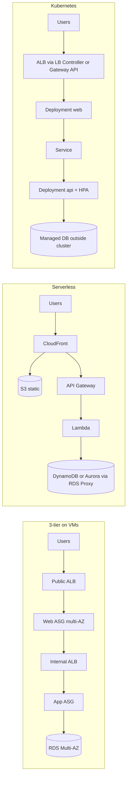
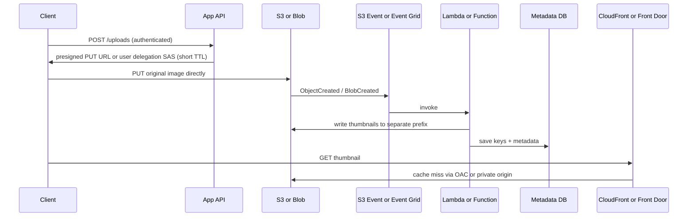
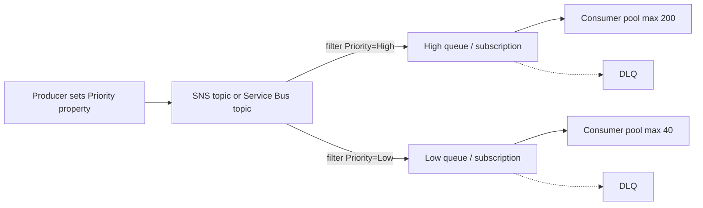
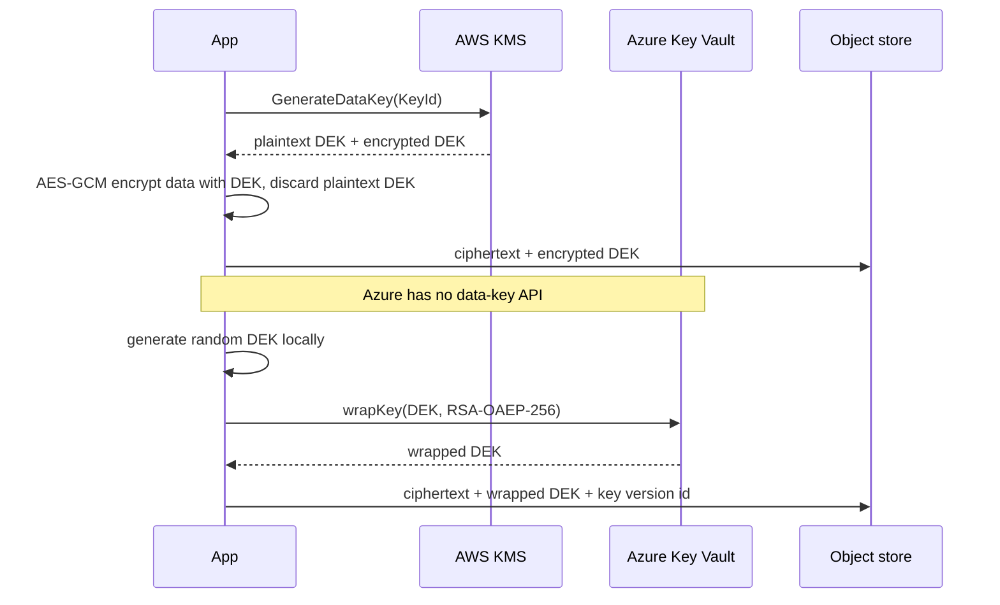
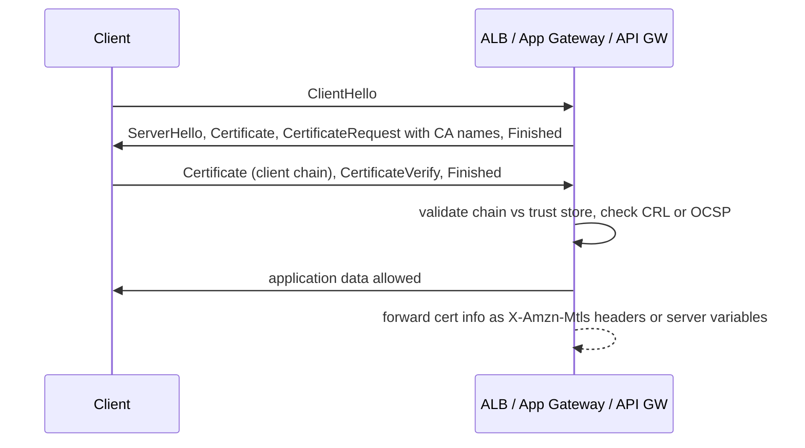
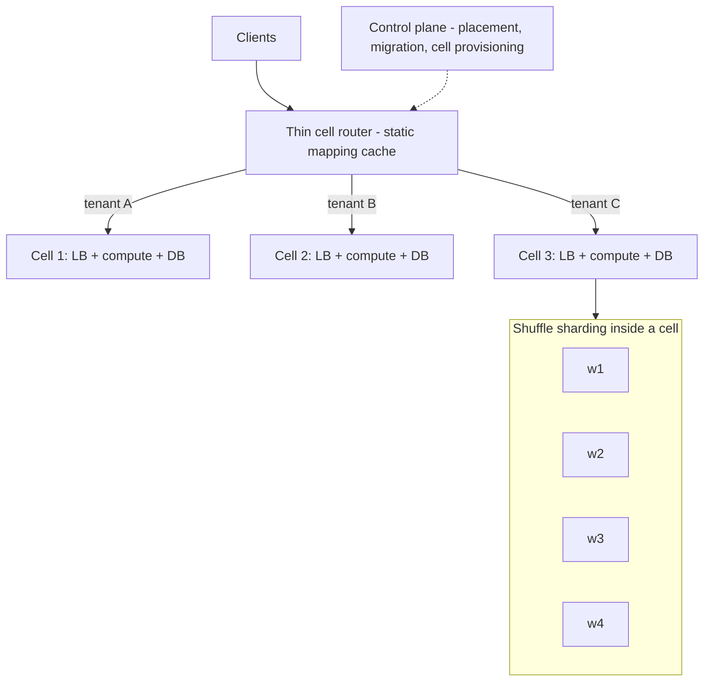

# D2 Reusable Parts of System Design
> Last verified: 2026-10 · Audience: senior/staff DevOps, SRE, AI eng, NetEng, DevSecOps, architects

## TL;DR
- **Well-Architected**: AWS has **6 pillars** (Operational Excellence, Security, Reliability, Performance Efficiency, Cost Optimization, **Sustainability**). Azure WAF has **5**, with no Sustainability pillar; Azure covers it in separate sustainable-workload guidance. Name the tooling: **AWS WA Tool + Lens Catalog** vs **Azure Well-Architected Review + Azure Advisor (score per pillar)**.
- **The usual building blocks**: 3-tier (VMs, serverless or Kubernetes), pub/sub with **broker-side content filtering**, **direct-to-object-storage uploads** with presigned URLs or SAS plus event-driven thumbnails, **separate queues for priority**, and lambda/kappa/lakehouse for analytics.
- **Priority queues**: **SQS, Azure Storage Queues and Azure Service Bus have no native per-message priority.** The standard design is one queue (or one subscription) per priority, each with its own consumer pool. Microsoft's own example routes a `Priority` property through Service Bus topic SQL filters.
- **Encryption at rest** means **envelope encryption**: a per-object **DEK** encrypts the data, and the **KEK/root key** stays inside the HSM. AWS KMS has `GenerateDataKey`. Azure Key Vault has **no data-key API**: you generate the DEK yourself and call `wrapKey`/`unwrapKey`.
- **TLS vs mTLS**: plain TLS authenticates only the server. With mTLS the client also presents an X.509 certificate. Where to terminate it: **ALB (passthrough/verify) / API Gateway (custom domain + S3 truststore)** vs **App Gateway v2 (strict/passthrough, OCSP only) / APIM client certificates**.
- **Layered network defence**: SG (stateful, allow-only) and NACL (stateless, allow and deny) are **filters, not IDS/IPS**. For IPS use **AWS Network Firewall (Suricata)** or **Azure Firewall Premium IDPS**. **GuardDuty** and **Defender for Cloud** detect threats but do not block inline.
- **IAM**: prefer **roles and federation over IAM users**. Org guardrails are **SCPs** (cap principals) and **RCPs** (cap resources). On Azure the equivalents are **Entra ID groups + Azure RBAC at management-group/subscription scope + Azure Policy + managed identities**.
- **Resilience at scale**: 12-factor (stateless processes, config in the environment, logs as streams). **Cell-based architecture** with a thin router and fixed-size cells is the Azure "Deployment Stamps" pattern. **Shuffle sharding** shrinks the blast radius from 1/N to roughly 1/C(N,k).

## D2.1 Well-Architected Framework †
- **How it works:**
  - **AWS WAF** has **6 pillars**: Operational Excellence, Security, Reliability, Performance Efficiency, Cost Optimization, Sustainability. Each pillar has design principles, questions and best practices (IDs such as `REL10-BP01`).
  - **Azure WAF** has **5 pillars**: Reliability, Security, Cost Optimization, Operational Excellence, Performance Efficiency. Each pillar has design principles, a checklist (codes such as `RE:02` and `PE:09`) and explicit **tradeoffs** pages.
  - **Pillar mapping**:

| AWS pillar | Azure pillar | Note |
|---|---|---|
| Operational Excellence | Operational Excellence | Azure leans on safe deployment practices (SDP) and observability |
| Security | Security | Both are built around zero trust and least privilege |
| Reliability | Reliability | Azure starts with "critical flows" (RE:02) and failure-mode analysis |
| Performance Efficiency | Performance Efficiency | Same scope |
| Cost Optimization | Cost Optimization | Azure splits it into "usage" and "rate" optimization |
| **Sustainability** | *No pillar* (separate sustainable-workloads guidance) | Common trick question |

  - **Lenses vs workload guidance**:
    - **AWS Lens Catalog** (official lenses) includes Generative AI, Machine Learning, Serverless Applications, SaaS, Data Analytics, Container Build, DevOps, IoT, FSI, Healthcare, Government, SAP, Migration, M&A and Connected Mobility. You can also build **custom lenses** and share them across accounts.
    - Lens limits in the WA Tool: **up to 5 lenses added at a time, 20 per workload**.
    - **Azure** has no lenses. Its equivalent is **workload guidance**, for example **AI workloads on Azure**, Mission-Critical, SaaS, SAP, AVD and Oracle. The AI guidance has design areas for application design, application platform, **training data**, **grounding data**, data platform, **MLOps/GenAIOps**, operations, **testing and evaluation**, personas and **Responsible AI**.
    - Azure also publishes **service guides**: WAF guidance per Azure service.
  - **Tooling**:
    - **AWS Well-Architected Tool** is free. It provides workloads, milestones, improvement plans, profiles, review templates, Trusted Advisor integration and Jira sync. The **AWS Well-Architected Agent** was in preview as of 2026-10.
    - **Azure** has the **Azure Well-Architected Review** in Microsoft Assessments, with an AI-workload assessment as well. **Azure Advisor** groups its recommendations by WAF pillar, and **Advisor Score** gives a per-pillar score.
    - The AWS counterpart to Advisor is **Trusted Advisor**, plus Compute Optimizer and Security Hub CSPM.
- **Trade-offs / when to use:**
  - The pillars conflict, and Azure documents the tradeoffs explicitly. Multi-region raises Reliability at a Cost penalty. TLS inspection raises Security and costs Performance.
  - Run a review at design time, before launch, and after major change. Track the results as **milestones**.
- **Interview angles:**
  - If asked "how do you review an architecture?", say: pick a lens, gather workload context (SLO, RTO/RPO, data classification), go pillar by pillar, record high- and medium-risk issues, then build an improvement plan and revisit it.
  - If asked "is it compliance?", say **no**. It is a best-practice review, not an attestation.
  - Pitfall: treating Advisor recommendations as a WAF review. Advisor checks resource configuration only and cannot see design intent.

## D2.2 Three-Tier Architecture
- **How it works:**
  - The tiers are **presentation** (web/static/CDN), **application/logic** (stateless app servers) and **data** (RDBMS/NoSQL + cache).
  - Classic VM layout:
    - Public **L7 LB** in public subnets → **web/app ASG/VMSS** in private subnets across **≥2 AZs** → **internal LB** → app tier → **DB in a private/data subnet**: RDS/Aurora Multi-AZ or Azure SQL/PostgreSQL Flexible zone-redundant HA.
    - Outbound traffic goes through NAT.
  - **Security groups chain by reference**: web-SG → app-SG → db-SG, so the DB accepts traffic only from app-SG. On Azure, use **NSG + Application Security Groups** for the same effect.
  - Sessions are externalized to Redis or DynamoDB/Cosmos DB, which keeps the app tier stateless and lets you autoscale on CPU, RPS or queue depth.
- **Trade-offs / when to use:**
  - Simple to reason about and fits lift-and-shift.
  - Costs: patching, idle capacity and slower scaling (minutes) compared with serverless.
  - The DB tier is usually the scaling bottleneck. Address it with read replicas, caching, then sharding (see [B6](../B-database-engineering/B6-database-sharding.md)).
- **Interview angles:**
  - "Where does TLS terminate?" → at the LB. Re-encrypt to the backend if compliance requires it.
  - "How do you make it HA?" → multi-AZ for every tier, health checks, and connection draining.
  - Pitfall: putting the DB in a public subnet, or using sticky sessions instead of an external session store.

## D2.3 Three-Tier Architecture on Serverless and Kubernetes
- **How it works:**
  - **Serverless**:
    - AWS: **CloudFront + S3 (OAC)** for static content → **API Gateway** (REST or HTTP API) → **Lambda** → **DynamoDB** or **Aurora Serverless v2** (put **RDS Proxy** in front for connection storms).
    - Azure: **Static Web Apps** or **Front Door + Blob** → **API Management** → **Azure Functions (Flex Consumption)** or **Container Apps** → **Cosmos DB** or **Azure SQL serverless**.
  - **Kubernetes**:
    - Ingress (or **Gateway API**) → Deployment (web) → Service → Deployment (API) → managed DB **outside** the cluster. Running a StatefulSet DB in-cluster is possible but adds operational burden.
    - AWS: **EKS + AWS Load Balancer Controller** (ALB/NLB).
    - Azure: **AKS + Application Gateway for Containers** (or the managed NGINX app-routing add-on).
    - Scale with **HPA/KEDA** for pods and **Karpenter / Cluster Autoscaler / AKS Node Auto-Provisioning** for nodes.
- **Trade-offs / when to use:**
  - **Serverless**: zero idle cost and fast scale-out. Downsides are cold starts, execution limits (Lambda caps at 15 min), per-request pricing that loses at sustained high RPS, and DB connection limits.
  - **Kubernetes**: portable, efficient for steady and high load, and supports sidecars and service mesh. It needs a platform team and has more security surface (RBAC, network policies, image supply chain).
  - **VMs**: legacy, licensing-bound or kernel-specific workloads.
- **Interview angles:**
  - "When serverless vs K8s?" → spiky or low traffic with small teams → serverless. Sustained load, many services or a platform team → K8s. Long-running stateful work → VMs or K8s.
  - Follow-up on Lambda + RDS: mention **RDS Proxy** and the connection-pool math.
  - See [D1.7](../D-system-design/D1-system-design-basics.md#d17-vm-serverless-container-scaling).

## D2.4 Content Based Messaging System
- **How it works:** producers publish to a topic, and the **broker evaluates each subscriber's filter**, so consumers receive only matching messages.
  - **SNS filter policies** are set per subscription. The **filter policy scope** is either `MessageAttributes` (the default) or `MessageBody` (body must be JSON). Operators include exact, prefix, suffix, anything-but, numeric ranges, exists and IP CIDR. A message with no matching policy is **not delivered** to that subscriber. The usual layout is **SNS → SQS fan-out**.
  - **EventBridge rules** match **event patterns** on any JSON field: prefix, suffix, wildcard, numeric, anything-but and exists. Add input transformers, multiple targets, archive/replay and schema registry. **EventBridge Pipes** add source-side filtering for SQS, Kinesis, DynamoDB Streams and Kafka.
  - **Azure Service Bus topic subscriptions** use **SQL filters** (SQL-like over system and user properties, plus actions), **correlation filters** (equality on CorrelationId, Subject/Label, To, custom properties) and boolean True/False filters.
    - Filters **cannot inspect the message body**.
    - Microsoft says to **prefer correlation filters**, because SQL filters reduce throughput.
    - Each new subscription gets a `$Default` TrueFilter. Remove it, or the subscription receives everything.
  - **Azure Event Grid** filters by event type, subject begins-with/ends-with, and **advanced filters** on data fields. It is push delivery for reactive events, and Event Grid namespaces add MQTT and pull delivery.
  - **Kafka / Event Hubs** have **no broker-side content filtering**. Consumers filter, or a stream processor (Flink/ksqlDB) re-routes into derived topics.
- **Trade-offs / when to use:**
  - Broker-side filtering cuts consumer cost and coupling, but puts routing logic in infrastructure config. Version that config in IaC.
  - Use attributes for cheap routing and body filtering for richer, schema-dependent matching.
- **Interview angles:**
  - "Fan-out with different consumers wanting subsets" → SNS + SQS with filter policies, or a Service Bus topic with correlation filters.
  - "Event-driven integration across SaaS and AWS services" → EventBridge.
  - Pitfall: forgetting the Service Bus `$Default` rule, or expecting Service Bus to filter on the body.

## D2.5 Store and Retrieve Images
- **How it works:**
  - **Never stream uploads through the app tier.** The app authenticates the user and issues a short-lived **S3 presigned URL** (or a presigned POST with a `content-length-range` policy). On Azure it issues a **user delegation SAS**, which is signed by Entra ID and preferred over account-key SAS.
  - The client uploads directly to S3 or Blob.
  - The **object-created event** triggers processing: S3 Event Notifications or EventBridge on AWS, Event Grid `BlobCreated` on Azure. A Lambda or Function validates the file (type, size, malware scan) and writes thumbnails to a **separate bucket or prefix**.
  - Image metadata goes into a DB (DynamoDB/Cosmos DB/RDBMS).
  - Reads go through a **CDN**: CloudFront with **Origin Access Control**, or **Azure Front Door Standard/Premium** with a Private Link origin. Azure CDN from Edgio was retired in Jan 2025, and Front Door is the go-forward CDN.
  - **Presigned URL limits**: up to **7 days** with SigV4 and IAM user keys. With role or STS credentials the URL dies **when the session expires**, often 1–6 h. The S3 console allows 1 min–12 h. A bucket policy can cap URL age with `s3:signatureAge`.
  - **SAS rules**:
    - User delegation SAS must be ad hoc; stored access policies are not supported.
    - Service SAS with a **stored access policy** (max **5 per container**) is revocable without rotating account keys.
    - Set the start time about 15 min in the past to absorb clock skew.
  - Use **multipart / block uploads** for large files. S3 single PUT ≤ 5 GB and objects up to 5 TB.
- **Trade-offs / when to use:**
  - Signed URLs are **bearer tokens**: anyone holding one can use it. Keep them short-lived and least-privilege, and always serve them over HTTPS.
  - For private content behind a CDN, use **CloudFront signed URLs/cookies** rather than S3 presigned URLs. Front Door can use token-auth patterns or private origins.
  - Generate thumbnails eagerly (on upload) or lazily (on-the-fly resize at the edge, then cache).
- **Interview angles:**
  - "Why not store images in the DB?" → cost, bloated backups, and no CDN integration. Store only the key and metadata.
  - Pitfall: a thumbnail function writing back to the **same prefix it is triggered on** (infinite loop). Another: unbounded upload size, which means egress and storage bills (Microsoft's 200 GB blob example).

## D2.6 High Priority Queuing/Messaging System
- **How it works:**
  - **Native per-message priority is rare in managed cloud queues.** SQS (standard and FIFO), Azure Storage Queues and **Azure Service Bus do not support it.**
  - Microsoft's Priority Queue pattern (updated 2026-08) uses **one Service Bus topic with a `Priority` property**, SQL filters routing to `highPriority`/`lowPriority` subscriptions, and **separate consumer pools**. In the example the high pool scales to 200 instances and the low pool to 40.
  - **Pattern options**:
    1. **Multiple queues + single consumer pool**: drain high first. Low-priority work can **starve**.
    2. **Multiple queues + dedicated pools per priority**: isolation and independent scaling. This is the usual answer.
    3. **Single queue with priority ordering**: needs broker support, as in RabbitMQ `x-max-priority`, Amazon MQ (ActiveMQ JMS priority), or a Redis sorted set.
  - On AWS, use separate **SQS queues** (optionally SNS + filter policy to route) with separate Lambda event-source mappings. Use **maximum concurrency** per mapping to protect downstreams.
- **Trade-offs / when to use:**
  - Good for tiered SLAs (premium vs free) and critical vs batch work.
  - Add **aging/promotion** to avoid starvation, a **DLQ per queue** for poison messages, and scale on **queue depth or age of oldest message**.
  - Each additional queue adds request costs.
- **Interview angles:**
  - "Does Service Bus have priority?" → No. Use topics + filters, or separate queues.
  - Combine with Queue-Based Load Leveling for bursts.
  - Pitfall: priority inversion when high-priority jobs depend on low-priority ones. The pattern also does not fit strict cross-priority ordering requirements.

## D2.7 Data Analytics & Big Data Design Patterns
- **How it works:**
  - **Lambda architecture**: a **batch layer** (complete, recomputable) plus a **speed layer** (approximate, real-time), merged in a serving layer. Its weakness is two codebases.
  - **Kappa architecture**: **stream-only**. The log (Kafka/Kinesis/Event Hubs) is the source of truth, and reprocessing means replaying the log with new code. It needs long retention or tiered storage.
  - **Lakehouse**: open table formats (**Delta, Iceberg, Hudi**) on object storage, with ACID, time travel and schema evolution, organized in **medallion** layers (bronze/silver/gold). One copy serves BI and ML.
  - Common pipeline patterns: CDC, ELT vs ETL, partitioning/compaction, data mesh ownership, and streaming joins with watermarks.
  - **Service mapping**:
    - AWS: Kinesis/MSK → Glue/EMR/Managed Flink → S3 (+ **S3 Tables/Iceberg**) → Athena/Redshift; governance in Lake Formation.
    - Azure: Event Hubs → Stream Analytics/Databricks/Fabric → ADLS Gen2/**OneLake (Delta)** → Fabric Warehouse/Synapse/ADX; governance in Purview.
- **Trade-offs / when to use:**
  - Kappa is simpler for event-centric domains. Lambda still shows up where batch correctness (finance) and real-time views must coexist.
  - Lakehouse vs warehouse: openness and cost vs mature concurrency and performance. Many stacks use both.
- **Interview angles:**
  - "Design clickstream analytics" → ingest to a stream, land raw in bronze, run streaming aggregates to a serving store, batch-curate silver/gold.
  - Cross-links: [M1 Lakehouse](../M-data-platforms/M1-lakehouse-table-formats.md), [M5 Stream processing](../M-data-platforms/M5-stream-processing.md), [M4 Kafka](../M-data-platforms/M4-kafka-at-scale.md), [M7 Warehouses](../M-data-platforms/M7-data-warehouses.md).

## D2.8 Performance and Cost Optimization
- **How it works:**
  - **Performance levers**: caching (CDN, Redis), async/queues, right-sized instances, **Arm** (Graviton vs Azure Cobalt/Ampere VMs), autoscaling on the correct signal, connection pooling, and data locality/egress avoidance.
  - **Rate optimization (AWS)**, per the Savings Plans docs:

| AWS offer | Max discount | Scope |
|---|---|---|
| Compute Savings Plans | up to **66%** | EC2 (any family, size, Region, OS), Fargate, Lambda |
| EC2 Instance Savings Plans | up to **72%** | One family in one Region |
| **Database Savings Plans** | up to **35%** | Aurora, RDS, DynamoDB, ElastiCache, DocumentDB, Neptune, Keyspaces, Timestream, DMS, OpenSearch (incl. serverless) |
| SageMaker AI Savings Plans | up to **64%** | SageMaker AI instances |
| Reserved Instances | up to **72%** | Standard/Convertible EC2 RIs, plus RDS/ElastiCache/Redshift/OpenSearch RIs |
| **Spot** | up to ~90% | Interruptions arrive with a **2-minute notice** |

    - Savings Plans terms are 1 or 3 years, paid all/partial/no upfront.
  - **Rate optimization (Azure)**:
    - **Reservations** (1/3-yr, resource + region specific, deepest discount).
    - **Savings plan for compute** (hourly $ commitment across VMs, App Service, Functions Premium, ACI, Container Apps, Dedicated Host) and **savings plan for databases** (SQL DB/MI, PostgreSQL, MySQL, Cosmos DB, and more). Both are 1/3-yr, **non-cancellable**, and unused hourly commitment does not roll over.
    - **Spot VMs**: eviction with ~**30 s** notice via Scheduled Events.
    - **Azure Hybrid Benefit** for Windows Server and SQL licenses.
  - **Usage optimization tools**: AWS **Compute Optimizer**, Cost Explorer, CUR 2.0/Data Exports and Cost Optimization Hub. Azure **Advisor** (cost pillar) and Cost Management exports. Both clouds support the **FOCUS** billing schema.
- **Trade-offs / when to use:**
  - Commit only to the **baseline**, cover peaks with on-demand, and send fault-tolerant work (batch, CI, stateless K8s nodes) to Spot.
  - Savings plans trade discount depth for flexibility; reservations are the reverse.
  - Over-caching causes consistency bugs. Over-committing causes stranded spend.
- **Interview angles:**
  - "Cut the bill 30%" → visibility (tagging/allocation) → right-size → schedule non-prod → storage tiering and lifecycle → commitments → architecture changes (serverless, Arm, egress/NAT reduction).
  - Pitfall: buying RIs before right-sizing. Another: NAT gateway and cross-AZ data charges that nobody tracks.

## D2.9 Security: Authentication (Log In) & Authorization
- **How it works:**
  - **AuthN** proves who the caller is: OIDC/SAML, passwordless/passkeys, MFA. **AuthZ** decides what they may do: RBAC, ABAC, ReBAC, policy engines.
  - Tokens: the **ID token** (OIDC) is for the client. The **access token** (OAuth2, JWT) is for APIs. Keep refresh tokens short-lived and rotated.
  - **AWS Cognito**:
    - **User pools** are the user directory and OIDC IdP, with managed login, social/SAML federation, MFA and Lambda triggers.
    - **Identity pools** exchange tokens for **temporary AWS credentials** (STS).
    - Fine-grained app authorization lives in **Amazon Verified Permissions** (Cedar).
  - **Azure / Microsoft Entra**:
    - **Entra External ID in an external tenant** is the CIAM option (self-service sign-up, social IdPs, branding, Conditional Access/MFA via email OTP or SMS).
    - **B2B collaboration** in the workforce tenant handles partners.
    - **Azure AD B2C is end-of-sale for new customers since 2025-05-01.**
    - App authorization uses **app roles/scopes** in tokens.
  - Gateways validate JWTs before your code runs: API Gateway JWT/Cognito authorizers or Lambda authorizers; APIM `validate-jwt`/`validate-azure-ad-token`.
- **Trade-offs / when to use:**
  - Managed IdPs remove password storage risk. The cost is vendor-specific customization limits and per-MAU pricing.
  - Self-hosted options (Keycloak) give control but leave you running it.
  - Centralize authN at the edge and keep **authZ near the data/business logic**.
- **Interview angles:**
  - "Sessions vs JWT?" → JWT is stateless and scales, but revocation is hard (short TTL plus a denylist). Server-side sessions are revocable and need a shared store.
  - Depth: [C4.14 AuthN/AuthZ](../C-large-scale-architecture/C4-security.md#c414-authentication-and-authorization), [C4.17 Stateful authentication](../C-large-scale-architecture/C4-security.md#c417-stateful-authentication).

## D2.10 Security: Encryption at Rest & Client/Server Side Encryption (envelope encryption, data keys vs master keys)
- **How it works:**
  - **Envelope encryption**: data is encrypted with a **data encryption key (DEK)**. The DEK is encrypted ("wrapped") with a **key encryption key (KEK)**, which is the **KMS key** or Key Vault key, still loosely called a "master key". The **wrapped DEK is stored next to the ciphertext**. The root key never leaves the HSM in plaintext; AWS KMS uses FIPS 140-3 Level 3 HSMs.
  - **AWS KMS**:
    - `GenerateDataKey` returns a **plaintext DEK + encrypted DEK**. Encrypt locally, then discard the plaintext.
    - `GenerateDataKeyWithoutPlaintext` is for deferred use.
    - `Decrypt` unwraps. `ReEncrypt` rotates the KEK without touching the data.
    - Direct `Encrypt` handles small payloads only (≤4 KB).
    - Symmetric KMS operations use AES-256-GCM.
    - **Data key caching** and **S3 Bucket Keys** cut KMS request volume and cost.
  - **Azure Key Vault / Managed HSM**:
    - **No data-key generation API.** The app or service generates the DEK and calls **`wrapKey`/`unwrapKey`**: RSA-OAEP-256 for RSA keys, **AES-KW** for oct-HSM keys (Managed HSM; Key Vault Premium oct-HSM is in preview).
    - Keys are non-exportable. Backup/Restore works only within Azure.
    - The **`release`** operation exists for confidential computing via attestation.
    - Use Azure RBAC roles: Key Vault Crypto Officer, Crypto User, **Crypto Service Encryption User**.
  - **Server-side vs client-side encryption**:
    - **SSE**: the service encrypts. S3 SSE-S3 is the default; also SSE-KMS, DSSE-KMS and SSE-C. Azure Storage SSE uses Microsoft-managed keys or **CMK** in Key Vault.
    - **CSE**: the app encrypts before upload, so the provider never sees plaintext. Options include the AWS Encryption SDK, the S3 Encryption Client, DynamoDB Database Encryption SDK, and Azure Storage client-side encryption v2 (AES-GCM) with a Key Vault key resolver.
- **Trade-offs / when to use:**
  - SSE is transparent and protects against disk/media theft. It **does not** protect against a principal who has both data-read and key-use permission.
  - CSE protects against a curious provider or admin, but you own key distribution and lose server-side features such as search and analytics.
  - CMK adds control (revocation = crypto-shred) plus availability risk: a deleted or disabled key makes data unreadable. Enable soft-delete and purge protection on Key Vault, and use pending-deletion windows on KMS.
- **Interview angles:**
  - "Why not encrypt everything directly with KMS?" → the 4 KB limit, latency and request cost, and HSM throughput quotas. Envelope encryption lets you encrypt locally at line rate.
  - "How do you rotate?" → rotate the KEK (automatic rotation keeps old versions for decrypt) and re-wrap DEKs. Re-encrypt the data only when the DEK is compromised.
  - Depth: [C4.2 Symmetric encryption](../C-large-scale-architecture/C4-security.md#c42-symmetric-key-encryption), [L2 Key management](../L-data-privacy-ai-security/L2-encryption-key-management.md).

## D2.11 Security: Encryption In Transit with SSL/TLS/mTLS
- **How it works:**
  - Use TLS 1.2+ (prefer **1.3**) everywhere: client→edge, edge→origin and service→service.
  - Decide where to **terminate**:
    - At the edge/LB: CDN, ALB, App Gateway, APIM. Certificates come from **ACM** or **Key Vault**.
    - **Re-encrypt** to the backends.
    - Or **pass through** (NLB TCP/TLS passthrough, App Gateway TLS proxy) to get end-to-end encryption to the pod or VM.
  - East-west traffic: service mesh mTLS (Istio, including the **AKS Istio add-on**, or Linkerd), **VPC Lattice** or ECS Service Connect on AWS. **AWS App Mesh reached end of support on 2026-09-30.**
  - Private CAs: **AWS Private CA** vs Key Vault certificates with an integrated CA, or a self-run CA (cert-manager/step-ca). Automate rotation.
- **Trade-offs / when to use:**
  - Terminating at the LB enables WAF and L7 routing but exposes plaintext inside the LB. Passthrough keeps plaintext off the LB but loses L7 features.
  - TLS inspection at a firewall (Azure Firewall Premium, AWS Network Firewall TLS inspection) requires a trusted intermediate CA on clients.
- **Interview angles:**
  - "Is in-VPC traffic safe unencrypted?" → zero trust says no. Compliance regimes (PCI) often require encryption inside the network too.
  - Depth: [C4.5 SSL/TLS](../C-large-scale-architecture/C4-security.md#c45-ssl-and-tls), [C4.10 handshake](../C-large-scale-architecture/C4-security.md#c410-tlsssl-handshake), [H4 TLS](../H-full-stack-troubleshooting/H4-transport-layer-security.md), [I2 Certificates](../I-dns-tls-acceleration-gaps/I2-tls-and-certificates.md).

## D2.12 TLS vs mTLS
- **How it works:**
  - **TLS**: the server presents a certificate and the client validates the chain and hostname. The client is anonymous at the TLS layer and authenticates later, at L7, with a token or password.
  - **mTLS**: the server sends a **CertificateRequest**. The client presents a certificate and proves it holds the key with **CertificateVerify**. The server validates the client chain against a **trust store**, checks revocation if configured, and maps subject/SAN → identity.
  - **ALB mTLS**:
    - **Passthrough** forwards the whole chain in `X-Amzn-Mtls-Clientcert` and leaves validation to the app.
    - **Verify** validates against a **trust store** (CA bundle, optional **CRLs**) and forwards serial, issuer, subject, validity and leaf headers.
    - Session resumption is not supported with mTLS. "Advertise CA subject names" is available.
  - **API Gateway mTLS**:
    - REST/HTTP APIs on a **Regional custom domain** with a truststore `.pem` in S3, chain depth ≤4.
    - **Disable the default `execute-api` endpoint**, or clients can bypass mTLS.
    - **No revocation check**: do it in a Lambda authorizer.
    - Not supported for private APIs.
  - **App Gateway mTLS** (Standard_v2/WAF_v2):
    - **Strict** mode uploads the client CA chain in an **SSL profile**, up to 100 chains per profile and 200 per gateway.
    - **Passthrough** mode requests the certificate but does not enforce it.
    - Revocation by **OCSP only (no CRL)**.
    - Certificate details reach the backend through server variables.
  - **APIM**: negotiate client certificates (an explicit setting on Consumption tier), then a `validate-client-certificate` policy checks thumbprint, issuer and subject.
- **Trade-offs / when to use:**
  - Use mTLS for **B2B APIs, IoT, service-to-service and zero trust**.
  - The cost is certificate lifecycle (issuance, rotation, revocation) and harder debugging.
  - Tokens (OAuth2 client credentials) are easier for public clients. Combining them gives **certificate-bound tokens** (RFC 8705).
- **Interview angles:**
  - "mTLS vs API key?" → the key is a shared bearer secret. mTLS proves possession of a private key and is not replayable.
  - Pitfall: an unreachable OCSP responder means **400s** on App Gateway. Another: a truststore missing intermediates.

## D2.13 IDS vs IPS vs instance firewalls and network ACLs †
- **How it works:**
  - **Security Group (AWS)**: **stateful**, **allow-only**, attached to ENIs/instances, and can reference other SGs.
  - **NACL (AWS)**: **stateless**, **allow + deny**, per subnet, rules evaluated **in number order**. Return traffic needs **ephemeral ports** opened.
  - **Azure NSG**: **stateful**, **allow + deny**, priority 100–4096, attached to subnet and/or NIC, with **Application Security Groups** for tag-like grouping. Azure has **no stateless subnet ACL**.
  - All of these filter on **L3/L4 5-tuple** only. They have no payload awareness.
  - **IDS** inspects traffic or logs and **alerts** (out-of-band). **IPS** sits **inline** and can **drop**.
    - **AWS Network Firewall**: stateless + stateful engines. Stateful rules are **Suricata-compatible** (upgraded to Suricata 8.0.3), with AWS **managed threat-signature rule groups**, alert vs drop actions, domain lists and TLS inspection. It is deployed through firewall endpoints per AZ, usually in an **inspection VPC behind Transit Gateway**.
    - **Gateway Load Balancer**: inserts third-party NGFW/IPS appliances.
    - **Azure Firewall Premium IDPS**:
      - **67,000+ signatures in 50+ categories**, with 20–40+ new rules daily.
      - Modes are Disabled, **Alert**, or **Alert and Deny**, and you can override up to 10,000 rules.
      - Applies to inbound, east-west and outbound traffic.
      - **TLS inspection** covers outbound and east-west. Inbound TLS inspection belongs to App Gateway WAF.
      - Scales to 100 Gbps with a 99.99% SLA across AZs.
    - **Threat detection (no blocking)**:
      - **Amazon GuardDuty** analyzes CloudTrail management events, VPC Flow Logs and DNS logs. Protection plans cover S3, EKS, Runtime, Malware, RDS, Lambda and **AI Protection** (Bedrock/SageMaker), and Extended Threat Detection correlates attack sequences.
      - **Microsoft Defender for Cloud** (Defender for Servers/Containers/Storage/AI, etc.) with **Sentinel** as the SIEM.
      - Automate response through EventBridge → Lambda or Logic Apps playbooks.
  - L7 layer: **AWS WAF** vs **Azure WAF** on Front Door or App Gateway. DDoS: **Shield** vs **DDoS Protection**.
- **Trade-offs / when to use:**
  - SG/NSG are free, distributed and always on. Inline IPS adds cost, latency and a choke point, so design for HA and symmetric routing.
  - IDS has no blocking risk but responds after the fact.
  - Signature IPS misses zero-days. Pair it with anomaly detection (GuardDuty/Defender).
- **Interview angles:**
  - "Block one malicious IP fast in AWS" → a **NACL deny**, because SGs cannot deny. Better: WAF IP set or Network Firewall.
  - "Does GuardDuty block?" → **No**. It produces findings; automate remediation separately.
  - "Why did return traffic fail?" → a stateless NACL missing the ephemeral port range.
  - Depth: [C4.12 Firewalls](../C-large-scale-architecture/C4-security.md#c412-firewalls), [C4.13 Network security](../C-large-scale-architecture/C4-security.md#c413-network-security-subnets-dmz-port-rules), [G1.7](../G-cloud-network-architecture/G1-virtual-network-fundamentals.md#g17-instance-level-stateful-firewall-rules), [G1.8](../G-cloud-network-architecture/G1-virtual-network-fundamentals.md#g18-subnet-level-stateless-network-acls).

## D2.14 Identity and access management: users, roles, groups †
- **How it works (AWS):**
  - **IAM users** have long-term credentials (password and access keys). Avoid them for humans and workloads.
  - **Groups** are collections of users used to attach policies. A group is **not a principal**, so it cannot appear in a resource policy.
  - **Roles** are assumed via **STS** to get **temporary credentials**. The trust policy defines who may assume the role. Used for EC2 instance profiles, the Lambda execution role, **EKS Pod Identity/IRSA**, cross-account access and OIDC federation (e.g. GitHub Actions).
  - **IAM Identity Center**: human SSO from an external IdP (Entra, Okta) via SAML/SCIM. **Permission sets** become roles in each account.
  - **Policy types**: identity-based, resource-based, **permission boundaries**, session policies, **SCPs** and **RCPs**.
    - **SCPs** cap what **principals** in member accounts can do.
    - **RCPs** (since late 2024) cap what can be done to **resources** in member accounts, including by external principals. Supported services include S3, KMS, STS, SQS, Secrets Manager, DynamoDB, ECR, Cognito and many more.
    - Neither SCPs nor RCPs **grant** permissions, and neither affects the **management account**. RCPs do not apply to service-linked roles.
  - **Evaluation**: explicit **Deny wins**. Otherwise the request needs an Allow at every applicable layer (SCP ∩ RCP ∩ boundary ∩ identity/resource policy).
- **How it works (Azure):**
  - **Entra ID** holds users, groups (security/M365, dynamic membership) and **service principals**: app registrations plus **managed identities**, which can be system-assigned (lifecycle tied to the resource) or user-assigned (shareable). **Workload identity federation** covers GitHub/K8s OIDC.
  - **Azure RBAC**: role assignment = principal + role definition + **scope**. Scopes form a hierarchy: management group → subscription → resource group → resource, and assignments **inherit downward**. There are also deny assignments.
  - Distinguish **Entra roles** (directory, e.g. Global Admin) from **Azure roles** (resources, e.g. Owner/Contributor).
  - **Management groups** nest up to **6 levels** below the root. Guardrails come from **Azure Policy**, with effects such as deny, audit, modify and deployIfNotExists.
  - **PIM** provides just-in-time elevation and **Conditional Access** gates sign-ins.
- **Trade-offs / when to use:**
  - **Groups → roles** scales better than per-user grants.
  - ABAC (tags/conditions) reduces role explosion but is harder to audit.
  - Guardrails (SCP/RCP/Policy) set the preventive boundary. Detective controls come from Config, Access Analyzer and Defender.
- **Interview angles:**
  - "IAM user vs role?" → a user has long-lived keys, a role has short-lived STS credentials. Always prefer roles plus federation.
  - "SCP vs Azure Policy?" → an SCP limits **API actions** for principals. Azure Policy evaluates **resource properties** (e.g. deny public IP or a disallowed SKU). The Azure counterpart to SCPs is RBAC at MG scope plus deny assignments.
  - "Data perimeter" → SCP (principals) + RCP (resources) + VPC endpoint policies.
  - Pitfall: a wildcard `Principal` in resource policies, and expecting an SCP to restrict the management account.

## D2.15 Twelve Factor App
- **How it works:** the factors, each with its cloud mapping:
  1. **Codebase**: one repo, many deploys.
  2. **Dependencies**: declared and isolated. Container images pin the full dependency tree.
  3. **Config in the environment**: env vars or injected config. SSM Parameter Store/Secrets Manager vs **App Configuration/Key Vault**; ConfigMaps/Secrets on K8s.
  4. **Backing services as attached resources**: a DB or queue swaps by URL.
  5. **Build, release, run separated**: immutable artifact + config = release.
  6. **Stateless processes**: state lives in backing services.
  7. **Port binding**: the service exports HTTP itself.
  8. **Concurrency**: scale out via the process model.
  9. **Disposability**: fast start and graceful **SIGTERM** shutdown. This matters for Spot, K8s and autoscaling.
  10. **Dev/prod parity**.
  11. **Logs as event streams**: write to stdout and let the platform ship them to CloudWatch, Azure Monitor or OTel.
  12. **Admin processes** run as one-offs (migrations as Jobs).
- **Trade-offs / when to use:**
  - It is the baseline for containers and PaaS.
  - Modern additions not in the original: **telemetry/OpenTelemetry**, **API-first**, **security/identity** (no secrets in env vars; use managed identity or a secret-store CSI driver).
  - Heroku moved the manifesto to open-source community stewardship in late 2024 (unverified).
- **Interview angles:**
  - "Which factor breaks most often?" → config (secrets baked into images), stateless processes (local session/file state), and disposability (ignoring SIGTERM, which drops in-flight requests during deploys).

## D2.16 Cell Based Architecture
- **How it works:**
  - A **cell** is a complete, independent replica of the workload stack (compute + data) serving a subset of customers, chosen by a **partition key** (customerId, plus a second dimension for very large tenants).
  - A **thin cell router** maps key → cell. It can use DNS (Route 53), API Gateway, or a lightweight custom router with cached mapping, and **must be the simplest, most available part**.
  - A **control plane** handles provisioning, placement and **cell migration**.
  - Cells have a **fixed maximum size** that has been load-tested. You scale by **adding cells**, not by growing them.
  - Partition mapping options are full mapping table, prefix/range, naive modulo (avoid: everything remaps when N changes) and consistent hashing.
  - Route cross-cell calls **back through the router**, never cell-to-cell.
  - **Blast radius** for N cells is about 1/N.
  - Deploy waves cell by cell, starting with a canary/"cell 0".
  - **Shuffle sharding**:
    - Each customer gets a **random combination of k workers out of N**.
    - With 8 workers and k=2 there are **28 combinations**, so impact is 1/28, which is **7× better** than plain sharding into 4 shards.
    - Route 53 uses 2,048 virtual name servers with k=4, about **730 billion** shards. No two domains share more than 2 servers.
    - Clients must **retry across their shard members**.
- **Trade-offs / when to use:**
  - Gains: fault and noisy-neighbour isolation, predictable scale, and testable limits.
  - Costs: **lower utilization** (per-cell overhead), harder cross-cell queries and analytics, router and control-plane complexity, and migrating customers between cells.
  - Use it for multi-tenant SaaS and control planes with extreme availability targets.
  - **Azure equivalent**: the **Deployment Stamps** pattern plus Azure Mission-Critical guidance, with Front Door or Traffic Manager as the global router.
- **Interview angles:**
  - "Difference from sharding?" → sharding splits **data**. A cell isolates the **whole stack**, including compute, queues and caches.
  - "What if the router fails?" → keep it static/cached, deploy it multi-AZ/region, and keep it free of business logic.
  - Cross-link: consistent hashing in [D1.21](../D-system-design/D1-system-design-basics.md#d121-consistent-hashing), bulkheads in [C3 Reliability](../C-large-scale-architecture/C3-reliability.md).

## Diagrams

**3-tier on VMs vs serverless vs Kubernetes (AWS names; Azure in the mapping table)**


**Image upload and retrieval (presigned URL / SAS, event-driven thumbnails)**


**Priority queues with separate consumer pools**


**Envelope encryption (KMS GenerateDataKey vs Key Vault wrapKey)**


**mTLS handshake (TLS 1.3, simplified)**


**Cell-based architecture with shuffle sharding**


## Cloud mapping: AWS vs Azure
| Capability | AWS | Azure | Role it plays | Key differences | Alternatives |
|---|---|---|---|---|---|
| Architecture review | Well-Architected Tool, Lens Catalog (GenAI, ML, Serverless, SaaS…) | Azure Well-Architected Review, Advisor + Advisor Score, workload guidance (AI, Mission-Critical) | Pillar-based design review | 6 vs 5 pillars (no Azure Sustainability pillar); AWS lenses vs Azure workload guides | Google Cloud Architecture Framework |
| L7 entry / 3-tier front | ALB, CloudFront | Application Gateway v2, Front Door | TLS termination, routing, WAF | Front Door is global; App GW is regional | Cloudflare, NGINX/Envoy |
| Serverless compute | Lambda | Azure Functions (Flex Consumption), Container Apps | Stateless logic tier | Lambda 15-min max; Functions plans differ in limits | Cloud Run, Knative |
| Managed K8s | EKS + AWS LB Controller, Karpenter | AKS + App Gateway for Containers, NAP | Container tier | AKS free control-plane tier; EKS per-cluster hourly fee | Self-managed K8s |
| API front door | API Gateway (REST/HTTP) | API Management | AuthN, throttling, mTLS | APIM is richer policy-wise and priced by tier | Kong, Apigee |
| Content-based pub/sub | SNS filter policies, EventBridge rules/Pipes | Service Bus topic filters (SQL/correlation), Event Grid filters | Broker-side routing | SNS/EventBridge can filter on body; Service Bus only on properties | Kafka + Flink routing, RabbitMQ headers exchange |
| Queues / priority | SQS (no priority), Amazon MQ (JMS priority) | Service Bus / Storage Queues (no priority) | Async work, priority via multiple queues | Neither cloud-native queue has per-message priority | RabbitMQ `x-max-priority`, Redis sorted sets |
| Object storage + delegated access | S3 + presigned URL (≤7 d SigV4) | Blob + user delegation SAS | Direct client upload/download | SAS can be revoked via stored access policy (service SAS); presigned dies with credentials | Cloudflare R2 presigned URLs |
| CDN | CloudFront (OAC, signed URLs/cookies) | Front Door Std/Premium (Azure CDN from Edgio retired) | Edge caching of images | Front Door combines CDN + global LB + WAF | Cloudflare, Akamai, Fastly |
| Stream / lake | Kinesis, MSK, Glue, EMR, Athena, S3 Tables, Redshift | Event Hubs, Fabric/OneLake, Databricks, ADX, Synapse | Lambda/kappa/lakehouse | Fabric is SaaS-unified; AWS is composable services | Databricks, Snowflake, Confluent |
| Commitment discounts | Savings Plans (Compute 66%, EC2 72%, DB 35%, SageMaker 64%), RIs, Spot (2-min notice) | Reservations, Savings plan for compute and for databases, Spot VMs (~30 s notice), Hybrid Benefit | Rate optimization | Azure savings plans non-cancellable; AWS RIs can be sold on Marketplace (Standard) | Third-party commitment managers |
| Customer identity | Cognito user pools + identity pools, Verified Permissions | Entra External ID (external tenant); B2C end-of-sale 2025-05-01 | Login, tokens, app authZ | Cognito identity pools mint AWS creds; Entra integrates Conditional Access | Auth0/Okta CIC, Keycloak |
| Key management | KMS (GenerateDataKey), CloudHSM, XKS | Key Vault (wrap/unwrap), Managed HSM, Dedicated HSM | Envelope encryption KEK | Azure has no data-key API; KMS 4 KB direct-encrypt limit | HashiCorp Vault Transit |
| mTLS termination | ALB (passthrough/verify, CRL), API GW (S3 truststore, no revocation) | App Gateway v2 (strict/passthrough, OCSP only), APIM client certs | Client cert auth | Revocation support differs | Envoy/Istio, Cloudflare API Shield |
| Instance / subnet filtering | Security Groups (stateful), NACLs (stateless) | NSG (stateful, subnet/NIC) + ASGs | L3/L4 allow/deny | Azure has no stateless subnet ACL; SGs can't deny | K8s NetworkPolicy, Cilium |
| Inline IPS | Network Firewall (Suricata), GWLB + NGFW | Azure Firewall Premium IDPS, NVAs | Signature-based prevention | Azure ships a 67k+ managed signature set; AWS lets you write raw Suricata rules | Palo Alto, Fortinet |
| Threat detection | GuardDuty, Security Hub CSPM, Detective | Defender for Cloud, Sentinel | Detection, not blocking | GuardDuty analyzes logs agentlessly; Defender spans CSPM + CWPP | CrowdStrike, Wiz |
| Workforce IAM | IAM roles, Identity Center, SCPs, RCPs | Entra ID users/groups, Azure RBAC, managed identities, Azure Policy, management groups, PIM | Who can do what, where | SCP limits actions; Azure Policy limits resource properties | Okta, Teleport |
| Config (12-factor) | SSM Parameter Store, Secrets Manager, AppConfig | App Configuration, Key Vault | Externalized config/secrets | Both support feature flags | Vault, K8s Secrets + CSI |
| Cells / stamps | Cell-based architecture whitepaper, Route 53 / API GW router | Deployment Stamps pattern, Front Door router | Blast-radius isolation | Same concept, different naming | — |

- **Scope differences**:
  - Front Door is global, while App Gateway, ALB and API Gateway are regional. CloudFront is global.
  - SCPs and RCPs apply per AWS Organization. Azure RBAC and Policy inherit through the **management group → subscription → RG** tree.
- **Identity gotchas**:
  - AWS **groups cannot be principals** in resource policies, while Entra groups **can** be assigned Azure roles.
  - AWS needs IAM roles for workloads. Azure **managed identities** are first-class and need no secret.
- **Filtering gotchas**:
  - Service Bus filters cannot read the body. SNS can, if scope = `MessageBody`. EventBridge always matches on the JSON event.
- **Revocation gotchas**:
  - ALB trust stores support CRLs. App Gateway supports OCSP only. API Gateway has no revocation check (use a Lambda authorizer).
- **Retired / renamed services**:
  - Azure AD B2C is end-of-sale; use **Entra External ID**.
  - Azure CDN from Edgio is retired; use **Front Door**.
  - AWS App Mesh reached end of support on 2026-09-30; use **VPC Lattice / ECS Service Connect**.
- **Alternatives**: Kubernetes-native equivalents include NetworkPolicy/Cilium for SG-like filtering, cert-manager + Istio for mTLS, and KEDA for queue-depth scaling. Cloudflare (R2, CDN, API Shield mTLS, WAF) can replace several edge pieces in both clouds.

## Hands-on (optional)
```bash
# Envelope encryption with KMS: get a data key, encrypt locally, keep only the wrapped key
aws kms generate-data-key --key-id alias/app --key-spec AES_256 \
  --query '{p:Plaintext,c:CiphertextBlob}' --output json > dk.json
jq -r .p dk.json | base64 -d > dek.bin
jq -r .c dk.json | base64 -d > dek.wrapped
openssl enc -aes-256-cbc -pbkdf2 -in photo.jpg -out photo.enc -pass file:./dek.bin   # demo only; use AES-GCM via SDK in prod
shred -u dek.bin dk.json

# Presigned GET (CLI presign supports GET only; use SDK for PUT/POST)
aws s3 presign s3://my-bucket/images/123.jpg --expires-in 300

# Azure user delegation SAS (Entra-signed, read-only, 15 min)
az storage blob generate-sas --account-name mystg --container-name images --name 123.jpg \
  --permissions r --expiry "$(date -u -d '+15 min' +%Y-%m-%dT%H:%MZ)" \
  --auth-mode login --as-user --full-uri

# Test an mTLS endpoint
curl -v --cert client.pem --key client.key https://api.example.com/health
```

```hcl
# SNS -> SQS fan-out with a body-scoped filter policy (high priority only)
resource "aws_sns_topic_subscription" "high" {
  topic_arn           = aws_sns_topic.orders.arn
  protocol            = "sqs"
  endpoint            = aws_sqs_queue.orders_high.arn
  filter_policy_scope = "MessageBody"
  filter_policy = jsonencode({
    priority = ["high"]
    amount   = [{ numeric = [">=", 1000] }]
  })
}
```

## Cross-links
- [D1 System design basics](./D1-system-design-basics.md): L7/L4 LB (D1.3), queues vs pub/sub (D1.10), caching/CDN (D1.14), consistent hashing (D1.21), sharding (D1.22)
- [D3 Modern applications](./D3-system-design-of-modern-applications.md)
- [C4 Security](../C-large-scale-architecture/C4-security.md): TLS (C4.5–C4.11), firewalls (C4.12–C4.13), AuthN/AuthZ (C4.14–C4.17)
- [C3 Reliability](../C-large-scale-architecture/C3-reliability.md), [C1 Performance](../C-large-scale-architecture/C1-performance.md), [C5 Deployment](../C-large-scale-architecture/C5-deployment.md)
- [G1 Virtual network fundamentals](../G-cloud-network-architecture/G1-virtual-network-fundamentals.md) (SG/NACL G1.7–G1.8), [G8 Transit hub](../G-cloud-network-architecture/G8-transit-hub.md) (inspection VPC)
- [H4 TLS](../H-full-stack-troubleshooting/H4-transport-layer-security.md), [I2 TLS and certificates](../I-dns-tls-acceleration-gaps/I2-tls-and-certificates.md)
- [L2 Encryption and key management](../L-data-privacy-ai-security/L2-encryption-key-management.md), [L7 Zero trust and workload identity](../L-data-privacy-ai-security/L7-zero-trust-workload-identity.md)
- [M1 Lakehouse](../M-data-platforms/M1-lakehouse-table-formats.md), [M4 Kafka](../M-data-platforms/M4-kafka-at-scale.md), [M5 Stream processing](../M-data-platforms/M5-stream-processing.md)
- [K7 AI gateways and cost](../K-ai-infra-llm/K7-ai-gateways-caching-cost.md) (GenAI lens context)

## Sources
- https://docs.aws.amazon.com/wellarchitected/latest/framework/the-pillars-of-the-framework.html
- https://docs.aws.amazon.com/wellarchitected/latest/userguide/lenses.html
- https://docs.aws.amazon.com/wellarchitected/latest/userguide/lens-catalog.html
- https://learn.microsoft.com/en-us/azure/well-architected/pillars
- https://learn.microsoft.com/en-us/azure/well-architected/ai/get-started
- https://learn.microsoft.com/en-us/azure/architecture/patterns/priority-queue
- https://learn.microsoft.com/en-us/azure/service-bus-messaging/topic-filters
- https://docs.aws.amazon.com/sns/latest/dg/sns-message-filtering.html
- https://docs.aws.amazon.com/AmazonS3/latest/userguide/using-presigned-url.html
- https://learn.microsoft.com/en-us/azure/storage/common/storage-sas-overview
- https://docs.aws.amazon.com/savingsplans/latest/userguide/what-is-savings-plans.html
- https://docs.aws.amazon.com/savingsplans/latest/userguide/plan-types.html
- https://learn.microsoft.com/en-us/azure/cost-management-billing/savings-plan/savings-plan-overview
- https://learn.microsoft.com/en-us/entra/external-id/external-identities-overview
- https://docs.aws.amazon.com/kms/latest/developerguide/kms-cryptography.html
- https://learn.microsoft.com/en-us/azure/key-vault/keys/about-keys-details
- https://docs.aws.amazon.com/elasticloadbalancing/latest/application/mutual-authentication.html
- https://docs.aws.amazon.com/apigateway/latest/developerguide/rest-api-mutual-tls.html
- https://learn.microsoft.com/en-us/azure/application-gateway/mutual-authentication-overview
- https://docs.aws.amazon.com/network-firewall/latest/developerguide/stateful-rule-groups-ips.html
- https://learn.microsoft.com/en-us/azure/firewall/premium-features
- https://docs.aws.amazon.com/guardduty/latest/ug/what-is-guardduty.html
- https://docs.aws.amazon.com/organizations/latest/userguide/orgs_manage_policies_rcps.html
- https://12factor.net/
- https://docs.aws.amazon.com/wellarchitected/latest/reducing-scope-of-impact-with-cell-based-architecture/reducing-scope-of-impact-with-cell-based-architecture.html
- https://docs.aws.amazon.com/wellarchitected/latest/reducing-scope-of-impact-with-cell-based-architecture/cell-partition.html
- https://builder.aws.com/content/3F06NpJ8YeoIGP8VHTw4n81pFn8/workload-isolation-using-shuffle-sharding
