# D3 System Design of Modern Applications
> Last verified: 2026-10 · Audience: senior/staff DevOps, SRE, AI eng, NetEng, DevSecOps, architects

## TL;DR
- Run every case study through the same loop: **requirements (functional + non-functional) → back-of-envelope capacity → API → high-level architecture → data model & DB choice → 2–3 deep dives → bottlenecks/trade-offs → security → ops (SLOs, DR, cost)**. Interviewers grade the loop and the trade-offs. Naming the "right" product matters much less.
- **Read/write asymmetry decides the architecture.** Video and feeds are read-heavy (100:1 to 1000:1), so precompute, cache and push to a CDN. Chat and location tracking are write-heavy or connection-heavy, so you need stateful gateways, per-user queues and in-memory geo indexes.
- **Precompute on write vs compute on read** shows up everywhere: Twitter fan-out-on-write with pull for celebrities, Tinder precomputed match stacks, YouTube transcoding the bitrate ladder once and serving it many times.
- **Shard by the access key.** Use `user_id` for timelines and inboxes, `video_id` for metadata, a **geo cell** (geohash/S2/H3) for Tinder/Uber, and `conversation_id` for chat ordering. Then name the hot-key failure mode: celebrities, a viral video, downtown at rush hour, a big group chat.
- **Media pipelines go upload → object store → event → DAG of parallel chunk jobs → packaging (HLS/DASH/CMAF) → CDN**. Moderation and DRM are gates in that DAG. Storage tiering is where you cut cost.
- **Real-time messaging needs** WebSocket gateways with a session registry (user→gateway), a durable per-user inbox for offline delivery, heartbeats for presence, idempotent message IDs and ack-based receipts. With E2E (Signal protocol) the server is only a relay and can't read or moderate content.
- **Geo systems** (Tinder, Uber) index points into hierarchical cells. They query the k-ring of neighbouring cells, shard stateful in-memory services by cell (Uber: Ringpop's consistent hashing and SWIM gossip), and treat dense cells as hot shards.
- Always close with **security**: authN/Z at the edge, signed URLs/cookies for media, least privilege, encryption in transit and at rest, abuse/rate limiting, and PII/location privacy.

## D3.1 Must-knows for system design

### Microservices behind a load balancer or API gateway
- **Edge stack:** DNS (latency or geo routing) → **CDN/WAF** → **API gateway** (authN via JWT/OIDC, rate limiting, request validation, routing, API versioning) → **L7 LB / service mesh** → stateless services → data tier.
- Use the **gateway** for cross-cutting API concerns (keys, quotas, usage plans, transformation). Use the **L7 LB** for raw throughput, path/host routing and health checks. Use an **L4 LB (NLB)** for long-lived TCP/WebSocket and when you need static IPs or very high connection counts. Background: [D1 System design basics](../D-system-design/D1-system-design-basics.md) (D1.3–D1.5).
- **Service boundaries follow data ownership.** Each service owns its store and others never read its tables. Services talk through APIs or events.
- **BFF (backend-for-frontend):** a separate aggregation layer for mobile, TV and web clients. Netflix and SoundCloud popularised it.
- **Pitfalls:** chatty synchronous call chains (latency adds up and availability multiplies down: 5 serial deps at 99.9% ≈ 99.5%), distributed monolith, shared database.

### Sync vs async patterns
- **Sync (REST/gRPC)** when the user waits for the answer: login, read the feed, swipe. **Async (queue/stream)** for anything slow, bursty or fan-out shaped: transcoding, timeline fan-out, notifications, analytics.
- **Async toolkit:** queue for work distribution (SQS / Service Bus), pub/sub for fan-out (SNS / Event Grid), log/stream for ordered replay and multiple consumers (Kafka/Kinesis/Event Hubs). Details in [D1.9](../D-system-design/D1-system-design-basics.md#d19-synchronous-vs-event-driven-architectures) and [D1.10](../D-system-design/D1-system-design-basics.md#d110-queues-vs-pubsub).
- **Must-say properties:** consumers are **at-least-once** so they must be **idempotent** (dedupe on message ID), **DLQ** with redrive, **backpressure**, **ordering per key** (partition key = `conversation_id`, `user_id`), and the **outbox pattern** so DB writes and event publishes stay consistent. Use sagas, not 2PC, across services.
- **Real-time push to clients:** WebSocket (bidirectional), SSE (server→client), long polling (fallback), mobile push (APNs/FCM) when the app is backgrounded. See [D1.13](../D-system-design/D1-system-design-basics.md#d113-websockets-for-server-to-client-communication).

### Database selection and optimization
| Access pattern | Pick | Examples in D3 |
|---|---|---|
| Relational, transactions, joins, moderate scale | PostgreSQL/MySQL (RDS/Aurora, Azure DB for PostgreSQL/MySQL); shard with Vitess/Citus at scale | Users, billing, video metadata (YouTube ran MySQL + **Vitess**) |
| Huge KV/wide-column, write-heavy, simple key lookups | DynamoDB / Cosmos DB, Cassandra / Keyspaces / ScyllaDB | Timelines, chat messages (Discord moved Cassandra → ScyllaDB), swipes |
| Full-text + faceted search | OpenSearch/Elasticsearch, Azure AI Search | Video search, tweet search |
| Geo queries | Redis GEO, PostGIS, OpenSearch geo, in-memory cell index (H3/S2) | Tinder, Uber |
| Graph traversal | Neptune / Cosmos DB Gremlin, or an adjacency list in KV | Follow graph |
| Blobs | S3 / Blob Storage plus a CDN | Video, images |
| Analytics | Warehouse/lakehouse (Redshift, Synapse/Fabric, Databricks, BigQuery) | Trending baselines, recs training |
- **Optimization checklist:** design indexes for the top queries, denormalize for read paths, read replicas, connection pooling (RDS Proxy / PgBouncer), partition by time for TTL'd data, cache-aside, avoid scatter-gather queries, choose the partition key to spread writes (no monotonically increasing hot keys). Deeper material: [B9](../B-database-engineering/B9-database-system-design.md), [B6](../B-database-engineering/B6-database-sharding.md).
- **IDs:** a Snowflake-style 64-bit ID is sortable by time and needs no coordination: 41-bit ms timestamp + 10-bit worker + 12-bit sequence ≈ 4,096 IDs/ms/worker.

### Caching
- Layers: **client → CDN → gateway → app (in-process) → distributed cache (Redis/Valkey/Memcached) → DB buffer pool**.
- Patterns: cache-aside (default), write-through, write-behind, refresh-ahead. Choose the TTL based on how stale the data may be. Use **request coalescing / single-flight** to stop a thundering herd on a hot key. Add jitter to TTLs.
- Hot keys: replicate the key across shards (`key#1..N`), add a local L1 cache, or push the content to the CDN. Overlap: [C1 Performance](../C-large-scale-architecture/C1-performance.md) (C1.26–C1.30), [D1.14/D1.15](../D-system-design/D1-system-design-basics.md#d115-redis-and-memcached-caching-strategies).

### Security
- **Edge:** TLS 1.2+/1.3 everywhere, WAF (OWASP rules, bot control), DDoS protection (Shield / DDoS Protection), rate limits per user/IP/API key.
- **Identity:** OIDC/OAuth2 with short-lived JWTs and refresh tokens. Use Cognito or Entra External ID; Azure AD B2C is no longer sold to new customers (as of 2025), so Entra External ID is the path for new tenants. Service-to-service: mTLS through a mesh plus workload identity (IAM roles / managed identities), not static keys.
- **Data:** KMS/Key Vault envelope encryption, secrets in Secrets Manager/Key Vault, private endpoints to data stores, least-privilege IAM, audit logs (CloudTrail / Activity Log).
- **App:** input validation, object-level authorization (check ownership of each resource ID to prevent IDOR, the #1 API risk), signed URLs for blobs, PII minimisation. Overlap: [C4 Security](../C-large-scale-architecture/C4-security.md), [H4 TLS](../H-full-stack-troubleshooting/H4-transport-layer-security.md).

### Interview angles
- "Where do you start?" → Clarify scope and agree 3–5 core features. State the non-functionals as numbers (p99 latency, availability, consistency level, scale). Estimate, then draw.
- "Why microservices here?" → Independent scaling of very different workloads (upload/transcode vs playback), team autonomy, failure isolation. Admit the cost: ops overhead, distributed tracing, eventual consistency.
- Pitfall: picking a DB before stating the access pattern. Say "the read path is get-timeline-by-user, so partition key = user_id" first.

## D3.2 Design YouTube/Netflix/Prime Video

### Requirements and features
- **Functional:** upload video (creator), transcode into multiple resolutions and codecs, stream with adaptive bitrate, search, view metadata, likes, comments and view counts, recommendations, moderation, DRM for premium content (Netflix/Prime).
- **Non-functional:** playback start < 2 s, rebuffer ratio < 0.5%, availability 99.95%+ on the playback path, upload durability 11 9s. Eventual consistency is fine for counts and recs. Global reach. Cost efficiency matters most because egress and storage dominate the bill.
- **Key distinction:** YouTube is **UGC**: huge upload volume, long tail, moderation required. Netflix/Prime are a **curated catalogue**: few uploads, heavy pre-encoding, DRM, popularity predictable enough to **pre-position content on the CDN**.

### Capacity estimates (YouTube-scale, stated assumptions)
| Item | Assumption | Result |
|---|---|---|
| Upload rate | ~500 hours of video uploaded per minute (widely cited YouTube figure) | 720K hours/day |
| Raw ingest | ~1 GB per hour avg mezzanine | ~720 TB/day raw |
| Transcoded output | ~6 renditions × 2–3 codecs (H.264, VP9/AV1) ≈ 1.5–2× raw | ~1.1–1.4 PB/day new encoded data |
| Views | 1B DAU × 5 videos × 5 min | 25B minutes/day |
| Egress | avg 3 Mbps ≈ 22.5 MB/min | ~560 PB/day ≈ **52 Tbps avg, 100+ Tbps peak** |
| Metadata reads | 5B video views/day | ~58K QPS avg, ~150K QPS peak |
- **Takeaways:** egress makes the **CDN mandatory**, and ISP-embedded caches are the cheapest path. Storage growth of PB per day forces **tiering**. Transcoding needs **massively parallel, preemptible/Spot compute**.

### High-level architecture
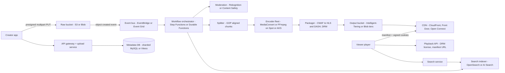

### Video ingestion
- Use **direct-to-object-store upload** so video bytes never pass through app servers. The API returns presigned URLs and the client uploads straight to S3/Blob.
- **S3 multipart upload:** parts are **5 MiB–5 GiB** (no minimum on the last part), **max 10,000 parts**, max object **48.8 TiB**. AWS recommends multipart from **~100 MB**. Parts upload in parallel, are retried individually and the upload is **resumable**. Validate integrity with SigV4 checksums (CRC32C, CRC64NVME, SHA-256…).
  - Flow: `CreateMultipartUpload` → server presigns N `UploadPart` URLs → client PUTs parts in parallel → `CompleteMultipartUpload` with the ETag list.
  - Ops gotcha: incomplete uploads keep billing. Add a **lifecycle rule `AbortIncompleteMultipartUpload`** (e.g. 7 days).
  - Long-haul creators: **S3 Transfer Acceleration** (edge ingest over the AWS backbone).
- **Azure equivalent:** block blobs. Stage blocks with `Put Block` and commit them with `Put Block List`. Up to 50,000 blocks per blob. Clients get a **user-delegation SAS**, which is scoped and short-lived.
- The upload service writes a metadata row with `status=UPLOADING`. The object-created event moves it to `PROCESSING`.

### Database
- **Video metadata** (`video_id`, owner, title, description, tags, status, durations, rendition manifest paths, visibility): relational and sharded by `video_id`. YouTube built **Vitess** to shard MySQL. Alternatives: Aurora/Cosmos DB/DynamoDB with GSIs for `owner_id`.
- **User/channel data:** relational. **Comments:** wide-column keyed by `(video_id, time bucket)`. **Watch history/resume position:** KV keyed by `user_id`. Netflix uses Cassandra plus **EVCache** (memcached-based) heavily.
- **View counts / likes:** never `UPDATE videos SET views=views+1` on a hot row. Use **sharded counters** or stream aggregation (Kafka → Flink → periodic flush) and expose approximate counts.
- **Search index:** OpenSearch/AI Search, fed by CDC/events from the metadata DB.

### Video encoding
- **Transcoding** = decode the mezzanine, then re-encode into a **bitrate ladder** (e.g. 240p@400 kbps … 1080p@5 Mbps … 4K@15–20 Mbps) across codecs: **H.264/AVC** (universal), **HEVC**, **VP9**, **AV1** (~30% smaller than VP9/HEVC at equal quality, but encoding is CPU-expensive).
- **Packaging for ABR:** split the encodes into 2–6 s segments and add manifests. **HLS** (`.m3u8`, Apple; required on iOS/Safari) and **MPEG-DASH** (`.mpd`). **CMAF** (fragmented MP4) lets **one set of segments serve both HLS and DASH**, which halves storage and CDN cache footprint. **LL-HLS / LL-DASH** use partial segments for ~2–5 s live latency.
- **Adaptive bitrate:** the player measures throughput and buffer level and switches renditions per segment. Algorithms are throughput-based, buffer-based (BOLA), or hybrid. Netflix popularised **per-title / per-shot encoding** (custom ladder per content complexity, quality measured by **VMAF**).
- **AWS:** **Elemental MediaConvert** (file-based transcode: jobs, presets, job templates; **queues** control parallel capacity, on-demand vs reserved; outputs HLS/DASH/CMAF/MP4; QVBR rate control; DRM via **SPEKE**). **MediaPackage** for just-in-time packaging and DRM (mainly live and origination). **IVS** for managed low-latency live.
- **Azure:** **Azure Media Services was retired on 30 June 2024**. Streaming stopped, accounts went read-only and were then deleted; Azure Media Player retired too. Alternatives:
  - **Partner SaaS on Azure Marketplace:** **Bitmovin**, **MediaKind (MK.IO)**, **Ravnur** (Azure Government).
  - **DIY:** FFmpeg/GStreamer workers on **AKS** (Spot node pools) or **Azure Batch**, triggered by **Event Grid** and Service Bus. Package to HLS/DASH into Blob and serve through **Front Door**.
  - Video analysis moved to **Azure AI Video Indexer**.
- **Pattern for a DIY encoder:** idempotent tasks keyed `(video_id, chunk_id, rendition)`, outputs written to deterministic paths, at-least-once queue, Spot interruptions handled by retry.

### Adult content detection
- **Pipeline position:** run moderation **in parallel with encoding** and gate **publishing**, not upload. Sample frames (e.g. 1 fps or on shot changes), add audio transcription and thumbnail checks, and hash-match against known-bad content (perceptual hashes).
- **Amazon Rekognition:** `DetectModerationLabels` (images) and `StartContentModeration` → async job, completion notification through SNS, then `GetContentModeration` (stored video). Labels come in a **hierarchical taxonomy** with confidence scores; you pick the thresholds. **Custom Moderation adapters** fine-tune accuracy on your own data. Hook in **Amazon Augmented AI (A2I)** for human review; AWS says ML pre-filtering reduces human review to ~1–5% of volume.
- **Azure AI Content Safety:** text and image APIs score **Sexual, Violence, Hate, Self-harm** with severity levels. Custom categories are in preview. **S0 rate limit = 1000 requests per 10 s** for text/image moderation. There's **no native stored-video moderation API**, so extract frames yourself (FFmpeg) and call the image API, or use **Azure AI Video Indexer**. Content Safety **cannot be used for CSAM detection**. Use dedicated hash-matching services for that, e.g. PhotoDNA (Microsoft's CSAM hash-matching service) and NCMEC reporting obligations.
- **Decision policy:** auto-block above a high threshold, send the middle band to a human queue, auto-allow below a low threshold. Age-gate borderline content. Keep an appeals path.

### Parallel processing
- **Split → map → reduce:** cut the mezzanine at **closed-GOP / scene boundaries** into chunks (e.g. 30–60 s), encode **chunks × renditions** in parallel, then concatenate and package. A 2-hour film turns into thousands of independent tasks and wall-clock time drops from hours to minutes. Netflix runs chunked/shot-based encoding on its internal media platform; their blog calls it **Cosmos** (unverified detail; blog not reachable during verification).
- **Orchestration:** Step Functions (**Distributed Map** fans out to large item counts) or SQS + autoscaled Spot workers. On Azure: Durable Functions fan-out/fan-in, or KEDA-scaled AKS jobs on Service Bus queue depth.
- **Concerns:** stragglers (speculative re-execution), chunk-boundary artifacts (encode with overlap or at IDR frames), cost (Spot/preemptible, encode cheap codecs first and AV1 later for popular titles only), and priority (premium creators or live-to-VOD go first through separate queues).

### Content Delivery Network (CDN)
- **Why:** ~50–100+ Tbps egress. Offload > 95% of bytes from origin. Popular segments get high hit ratios; the long tail misses to a regional mid-tier cache (**origin shield**) and then origin.
- **Netflix Open Connect:** a purpose-built CDN. **Open Connect Appliances (OCAs)** are **embedded inside ISP networks free of charge** for qualifying ISPs, plus **settlement-free peering at IXPs**. Content is **proactively filled during nightly off-peak windows** based on predicted popularity, so the serving path barely touches AWS. The control plane (API, recs, steering, DRM licences) runs on **AWS**. YouTube has an equivalent: **Google Global Cache**.
- **Commercial CDN options:** **CloudFront** (Origin Shield, OAC to S3, signed URLs/cookies, Lambda@Edge/CloudFront Functions), **Azure Front Door** Standard/Premium. Azure CDN from Edgio was shut down in January 2025, and **Azure CDN Standard from Microsoft (classic) is slated for retirement** (unverified exact date: 2027). Front Door is the go-forward choice. **Cloudflare**, Akamai and Fastly are the usual multi-CDN partners.
- **Multi-CDN steering:** DNS- or client-side (the player picks a CDN per session from QoE data) for resilience and price leverage.

### Searching and viewing video
- **Search:** inverted index over title, description, tags, auto-captions/transcripts and channel. Rank by text relevance × engagement × freshness × personalization. Autocomplete uses edge n-grams or a prefix trie with top-K completions cached per prefix.
- **Viewing flow:** `GET /videos/{id}` → metadata from cache → playback service checks entitlement and region rights, chooses a CDN, and returns the **manifest URL plus a signed cookie/token and DRM licence URL** → the player fetches the manifest and segments from the CDN and switches ABR renditions. Heartbeats record resume position and QoE telemetry.
- **Thumbnails** and preview sprites are pre-generated during the pipeline and served from the CDN.

### Object storage cost savings techniques †
- **S3 Intelligent-Tiering:** automatically moves objects to **Infrequent Access after 30 days** and **Archive Instant Access after 90 days** of no access, both with ms latency. Optional **Archive Access (≥90 days)** and **Deep Archive Access (≥180 days)** tiers have hours of restore time (Archive Access: 3–5 h standard; Deep Archive: within 12 h). Access promotes an object back to Frequent. **Objects < 128 KB are not monitored** and stay in Frequent. There's a small per-object monitoring fee and no retrieval fees for the automatic tiers.
  - Fit: rendition segments whose popularity decays unpredictably, i.e. the UGC long tail.
  - Gotcha: millions of tiny HLS segments under 128 KB never tier down. Use larger segments or fMP4 byte-range addressing (single file per rendition).
- **Explicit lifecycle rules:** raw mezzanine → **Glacier Flexible Retrieval / Glacier Deep Archive** after N days. Deep Archive is ~$0.00099/GB-mo vs ~$0.023 for Standard in us-east-1 list price (≈ 23× cheaper; verify current pricing). Keep the mezzanine only for re-encoding with new codecs.
- **Azure Blob:** **Hot / Cool (min 30 d) / Cold (min 90 d) / Archive (min 180 d, offline)**. Early-deletion penalties are prorated. Archive rehydration takes **up to 15 h** (standard or high priority) and **lifecycle policies cannot rehydrate**. Archive is **not supported on ZRS/GZRS/RA-GZRS**, only LRS/GRS/RA-GRS. Availability SLA drops to 99% for Cool/Cold/Archive vs 99.9% for Hot. **Smart tier** (auto-moves between hot/cool/cold, the Intelligent-Tiering analogue) now appears in the docs (GA status unverified).
- **Other levers:**
  - **CMAF**: one segment set for HLS and DASH.
  - **Popularity-aware ladders**: encode AV1/4K only for videos crossing a view threshold.
  - **Delete unused renditions** for long-tail videos and re-encode on demand.
  - **Dedupe** identical uploads by content hash.
  - **Egress optimisation**: CDN hit ratio, ISP embedding, and CloudFront-to-S3 origin fetch, which carries no data-transfer-out charge.

### Security
- **Signed URLs vs signed cookies (CloudFront):** a signed URL covers one object. **ABR streams fetch hundreds of segment URLs, so use signed cookies** (or tokenized manifests). Use **trusted key groups** (recommended over the root-account CloudFront key pair) and **Origin Access Control (OAC)** so the S3 bucket is reachable only through CloudFront.
- **S3 presigned URLs** (upload): valid up to **7 days** with IAM-user SigV4 credentials. If you sign with a role or STS creds, the URL dies when those creds expire (often 1–6 h). Restrict with `s3:signatureAge`, `aws:SourceIp`/`aws:SourceVpce`, exact key and content-type.
- **Azure:** **user-delegation SAS** (Entra-backed, max 7 days) with stored access policies. Front Door with **Private Link to the storage origin**. Token auth at the edge needs Front Door rules or WAF custom logic (native CDN token auth was an Edgio/Verizon feature; unverified).
- **DRM:** **Widevine** (Android/Chrome), **FairPlay** (Apple), **PlayReady** (Windows/Xbox/TVs), multi-key CENC. AWS MediaConvert and MediaPackage integrate through **SPEKE**. Add forensic watermarking for premium content.
- Other: geo-restriction (licensing), malware scanning of uploads (GuardDuty Malware Protection for S3 / Defender for Storage), rate limits on upload sessions, and encryption at rest with KMS/Key Vault.

### Bottlenecks / trade-offs
- **Hot video** (viral): CDN absorbs it; origin shield collapses concurrent misses into one origin fetch.
- **Transcode backlog spikes:** prioritized queues; publish a low-res rendition first and add higher ones later.
- **Encoding cost vs quality:** AV1 saves egress but costs ~10× CPU to encode, so it only pays off for high-view content.
- **Netflix pre-positioning vs YouTube pull-through caching:** predictable catalogue vs long-tail UGC.

### Interview angles
- "Upload of a 50 GB file over a flaky mobile link?" → Multipart/resumable upload with presigned per-part URLs, retry only failed parts, checksum, lifecycle abort for orphans.
- "How do you make transcoding fast?" → GOP-aligned chunking, parallel map over chunks × renditions, Spot fleet, speculative retries for stragglers.
- "How do you protect paid content?" → DRM + signed cookies + OAC + short TTL + geo-block + watermarking. Signed URLs alone don't stop screen capture or link sharing within the TTL.
- "Azure equivalent of MediaConvert?" → Azure Media Services **retired June 2024**. Use Bitmovin/MediaKind from Marketplace or FFmpeg on AKS/Batch. Saying "Azure Media Services" without that caveat is a red flag.

## D3.3 Design Twitter

### Features and design requirements
- **Functional:** post tweet (text ≤ 280 chars, media), follow/unfollow, home timeline (following plus ranked "For You"), user timeline, like/retweet/reply, search, trends, notifications.
- **Non-functional:** timeline read p99 < 200 ms, post visible to followers within ~5 s (eventual consistency OK), 99.99% read availability, extreme read:write ratio (~100:1+), spiky global events.

### Capacity estimates
| Item | Assumption | Result |
|---|---|---|
| Writes | 500M tweets/day | ~5.8K tweets/s avg; peaks 5–25× (2013 record ~143K TPS, unverified) |
| Timeline reads | 300M DAU × 20 refreshes | 6B/day ≈ 70K QPS avg, ~300K QPS peak |
| Fan-out | avg ~200 followers | 100B timeline inserts/day ≈ **1.2M writes/s** |
| Timeline cache | 800 entries × ~16 B (tweet_id + author_id + flags) | ~13 KB/user × 300M ≈ 3.8 TB; × 3 replicas ≈ **~12 TB RAM** |
| Tweet storage | ~300 B text + metadata | ~150 GB/day (media stored separately in object storage) |

### Table design
- `users(user_id PK, handle UNIQUE, name, bio, created_at, follower_count, following_count, verified)`
- `tweets(tweet_id PK Snowflake, author_id, text, media_ids[], reply_to, quote_of, created_at)`: shard by `tweet_id`, plus a secondary index or separate table `user_tweets(author_id, tweet_id DESC)` for the user timeline.
- `follows(follower_id, followee_id, created_at)`: store **both directions** (`followers_of(followee_id)` and `following_of(follower_id)`), each partitioned by its leading key, so fan-out and "who do I follow" are both single-partition scans.
- `likes(tweet_id, user_id)` + `user_likes(user_id, tweet_id)`. Counters live in a separate counter service.
- `home_timeline:{user_id}` → Redis list/sorted set of the last ~800 tweet IDs (cache only, rebuildable).

### Timeline design
- **Fan-out-on-write (push):** on post, the fan-out service reads the follower list and inserts the `tweet_id` into each follower's cached timeline. Reads are O(1) (fetch IDs, then hydrate tweets via multi-get). Costs: write amplification, and wasted work for inactive followers (only fan out to users active in the last N days).
- **Fan-out-on-read (pull):** at read time, merge the latest tweets from everyone you follow. Writes are cheap; reads are expensive (k-way merge over hundreds of followees).
- **Hybrid (what Twitter did):** push for normal accounts, **pull for celebrities**, merged at read time. Twitter's 2013 QCon talk described Redis timeline clusters holding ~800 entries per user, replicated ×3. Treat it as historical background (unverified).
- **Ranked "For You" (open-sourced 2023):** **home-mixer** (built on product-mixer) sources ~half the candidates in-network from **Earlybird** (search index) and the rest out-of-network via **SimClusters**, **TwHIN** embeddings and **real-graph**. A neural **heavy ranker** scores them, then **visibility filters** apply. User actions stream through **unified-user-actions**.
- Hydration: tweet objects, author and counts come from caches with multi-get. Pagination uses a `max_id` cursor, not offsets.

### Architecture on a cloud platform †
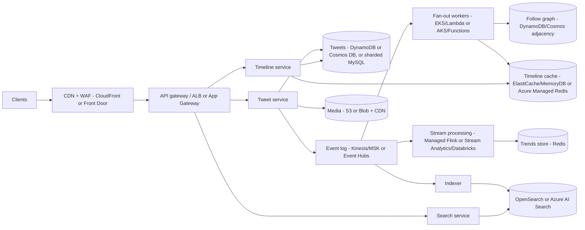
- **AWS:** ALB/API Gateway, EKS, DynamoDB (tweets, graph; on-demand or provisioned capacity plus DAX optional), **ElastiCache/MemoryDB** for timelines (MemoryDB if you want a durable Redis), Kinesis or MSK, **Amazon Managed Service for Apache Flink** (formerly Kinesis Data Analytics), OpenSearch, S3 + CloudFront, SNS mobile push.
- **Azure:** Application Gateway / API Management, AKS, **Cosmos DB** (choose partition key = `author_id`/`user_id`, mind the 20 GB logical-partition limit), **Azure Managed Redis** (successor to Azure Cache for Redis), Event Hubs (Kafka endpoint), Stream Analytics or Databricks Structured Streaming, **Azure AI Search** (formerly Cognitive Search), Blob + Front Door, Notification Hubs.
- Multi-region: active-active reads. Writes go to the user's home region and replicate asynchronously (DynamoDB global tables / Cosmos DB multi-region writes). Timelines are rebuilt per region from the event log.

### Database discussion
- **Tweets:** immutable, keyed by ID, so KV/wide-column fits. Twitter historically used sharded MySQL (Gizzard), then **Manhattan** (in-house KV). Snowflake IDs give time-ordering without a central sequence.
- **Graph:** an adjacency list in KV is enough; only multi-hop traversal ("who to follow") needs graph processing, which runs offline (Spark/GraphX).
- **Timelines:** cache-only and reconstructable. Losing a shard means rebuilding it from the graph and recent tweets, so no DB is needed for it.
- **Counters:** approximate and eventually consistent. Use a dedicated counter service (sharded) to avoid hot rows.
- **SQL vs NoSQL answer:** NoSQL for tweets/timelines/graph (scale, simple access paths). SQL for accounts, billing, ads. See [D1 (D1.12)](../D-system-design/D1-system-design-basics.md).

### Edge case
- **Celebrity / hot-user problem:** a 100M-follower account would cause 100M cache writes per tweet, minutes of lag and a write storm. Fix with the hybrid model:
  - Followee count above a threshold (e.g. > ~100K–1M) → no fan-out. Followers pull the celebrity's recent tweets at read time from a **hot, heavily replicated cache** and merge them.
  - Viral tweet reads: replicate the hot key, add an L1 in-process cache, and use request coalescing.
- **Other edges:**
  - Users following 5K+ accounts make the pull merge expensive, so cap it.
  - Inactive users: skip fan-out and rebuild on login.
  - Deletes/edits/blocks: lazily filter at read via visibility filters rather than un-fan-out everywhere.
  - Thundering herd at global events (New Year, World Cup): pre-scale and degrade gracefully (serve cached timelines, defer non-critical writes).

### Trending feature
- **Pipeline:** tweet events → tokenise hashtags/entities/n-grams → **sliding windows** (e.g. 5 min buckets over 1–24 h) per region → **anomaly score** (velocity vs baseline, e.g. z-score against the same hour last week). Raw counts alone would always trend "good morning". Then spam/bot filtering and safety review → top-K per locale → Redis → API.
- **Count-Min Sketch (CMS):** a d×w counter matrix with d hash functions. Increment one counter per row and estimate with the **minimum**, which **only overestimates**. Size: **w = ⌈e/ε⌉, d = ⌈ln(1/δ)⌉**. Example: ε = 0.001, δ = 0.01 gives w = 2,719, d = 5, about 13.6K counters (~54 KB with 32-bit counters) per window regardless of vocabulary size. Combine with a **min-heap of top-K** (heavy hitters) or Space-Saving/Misra-Gries.
- **Why approximate:** exact counts for every distinct token per window per region are memory-heavy. CMS sketches are **mergeable** (element-wise add), so you can compute per partition and merge, and roll windows up by addition.
- **Stream engines:** Flink (event time, watermarks, tumbling/sliding windows) on Managed Flink / Confluent / Databricks; Kafka Streams; Azure Stream Analytics (SQL-like windowing). See [M5 Stream processing](../M-data-platforms/M5-stream-processing.md).

### Security
- OAuth2 for the third-party API with per-app rate limits. 2FA/passkeys. Bot/spam detection (velocity rules plus ML). Account-takeover detection.
- Visibility/safety filters at read time. Abuse reporting. Media scanning (CSAM hash matching).
- Privacy: protected accounts mean the fan-out must respect ACLs and search must exclude them. DMs encrypted at rest; E2E DMs are a product decision.
- Defend the API from scraping with per-user quotas, signed client attestation and WAF bot control.

### Interview angles
- "Push or pull?" → Hybrid, with an explicit follower-count threshold and an inactive-user skip. Quantify the write amplification (1.2M inserts/s).
- "How do trends avoid always showing the same words?" → Velocity relative to baseline, not raw counts, plus a CMS for memory-bounded counting and spam filtering.
- "What if the timeline cache cluster dies?" → Rebuild from the graph and tweet store (pull path) while degraded. The cache is not the system of record.

## D3.4 Design WhatsApp/Telegram/Snapchat

### Requirements
- **Functional:** 1:1 and group chat (WhatsApp groups up to **1,024** members), media messages, delivery/read receipts, online/last-seen presence, typing indicators, push notifications when offline, multi-device, E2E encryption. Snapchat adds **ephemeral** content; Telegram adds large channels plus cloud history.
- **Non-functional:** end-to-end delivery p99 < 500 ms when both parties are online, **no message loss**, **per-conversation ordering**, exactly-once *display* (at-least-once delivery + dedupe), long-lived connections at huge concurrency, and battery/bandwidth efficiency on mobile.

### Capacity estimates
| Item | Assumption | Result |
|---|---|---|
| Messages | ~100B/day (Meta-reported order of magnitude) | ~1.2M msg/s avg, ~3M/s peak |
| Concurrent connections | 500M online | at ~200K–1M conns/gateway → **~500–2,500 gateway hosts** (WhatsApp's Erlang/FreeBSD servers famously hit ~2M conns/host in 2012) |
| Heartbeats | every 30–60 s per conn | ~10–15M heartbeats/s, so heartbeats must be cheap (in-memory, no DB write) |
| Message size | ~100 B avg encrypted text | ~10 TB/day transit; media goes out-of-band via blob store + CDN |
| Server-side storage | store-and-forward only (WhatsApp deletes after delivery) | the inbox only holds undelivered messages, kept for up to ~30 days (unverified) |

### High-level architecture
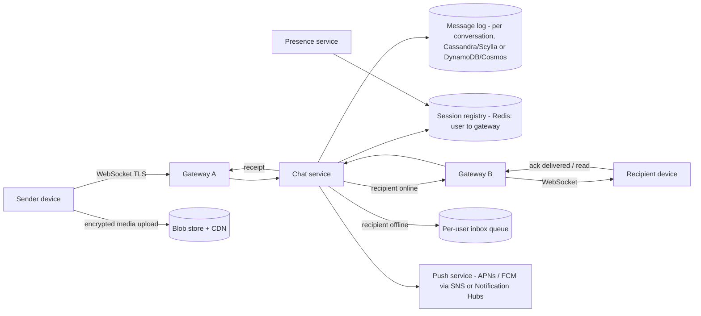

### Message queue
- **Per-user inbox:** a durable, ordered queue of undelivered messages keyed by `recipient_device_id`. On reconnect the client sends its last-acked cursor and the server drains the inbox in order. Delete on ack (store-and-forward), or keep the full history (Telegram cloud chats, Slack/Discord).
- **Implementation options:**
  - Wide-column table `inbox(device_id, msg_seq)` with TTL (Cassandra/Scylla, DynamoDB TTL, Cosmos TTL).
  - Kafka partitions keyed by user, reached through a routing layer. One SQS queue per user does **not** scale to billions of queues.
  - Erlang process mailboxes plus Mnesia (WhatsApp's historical design).
- **Ordering:** a per-conversation monotonic `seq` assigned by the conversation owner shard (or a hybrid logical clock). The client sorts by `seq` and dedupes by client-generated `msg_id` (UUID) for idempotent retries.
- **Group fan-out:** the server fans out to N members' inboxes (write amplification bounded by the 1,024-member cap). Huge Telegram channels instead use pull/fan-out-on-read like Twitter.

### WebSocket API
- A persistent **WebSocket over TLS** (or MQTT; Facebook Messenger historically used MQTT) carries messages both ways. Frames: `send`, `ack`, `receipt`, `typing`, `presence`, `sync`. Heartbeat ping/pong keeps NAT/LB mappings alive. Mobile carriers' NAT idle timeouts can be as short as ~30 s–5 min.
- **Gateways are stateful** (they hold sockets) but carry **no business logic**. A **session registry** (Redis: `user/device → gateway_id`, TTL'd) lets the chat service route to the right gateway, through direct RPC or a per-gateway pub/sub channel.
- **LB choice:** an **L4 NLB** for millions of long-lived connections (or ALB with WebSocket support). Spread connections with least-connections. Plan for **connection draining** on deploys (send a reconnect-with-backoff+jitter frame to avoid a reconnect storm).
- **Managed options:**
  - **API Gateway WebSocket APIs:** **500 new connections/s per account per region** (adjustable), **2 h max connection duration**, **10 min idle timeout**, **32 KB frame / 128 KB message**. That is fine for moderate scale but not WhatsApp scale.
  - **AWS AppSync Events** is the newer serverless pub/sub over WebSocket.
  - **Azure Web PubSub:** up to **1M concurrent connections per resource**. Premium adds autoscale, zone redundancy and geo-replication. It supports Socket.IO and MQTT plus a chat capability. **Azure SignalR Service** suits ASP.NET SignalR apps.
- At WhatsApp scale you run **custom gateways** (Erlang/Elixir/Go/Rust, epoll, tuned kernel: `somaxconn`, `nofile` limits, ephemeral ports, TCP keepalive) on EC2/AKS behind NLB. See [A7 Socket management](../A-operating-systems/A7-socket-management.md).

### Online status checks
- **Heartbeat:** the client pings every ~30–60 s. The gateway updates `presence:{user} = online` with **TTL ≈ 2–3× the heartbeat interval** (in Redis or gateway memory). TTL expiry or a socket close means offline, and `last_seen = now`.
- **Fan-out cost:** never broadcast presence to all contacts. Push presence **only to users currently viewing that chat** (subscription on chat open), otherwise fetch it lazily. Debounce flapping (mobile reconnects) with a grace period.
- **Typing indicators:** ephemeral, best-effort, never persisted, rate-limited.
- Privacy: "last seen" visibility settings are enforced server-side.

### Delivery receipts
- **WhatsApp tick model:** one ✓ = the **server** persisted the message (server ack to sender). ✓✓ = delivered to the **recipient device** (device ack). Blue ✓✓ = **read** (read receipt, which the user can disable). In groups each member has their own state.
- Receipts are just small messages flowing back through the same pipeline: idempotent, ordered per conversation, coalesced (one "read up to seq N" instead of N receipts).
- Sender retries with the same `msg_id` until the server acks. The server dedupes. The recipient dedupes on display. Together this gives **effectively-once**.

### End-to-end encryption (Signal protocol)
- **Key setup:** each device publishes an identity key, a signed prekey and a batch of **one-time prekeys** to the server. The sender fetches the recipient's prekey bundle and runs **X3DH** (Extended Triple Diffie-Hellman) for asynchronous session setup that works while the recipient is offline. Signal has moved to **PQXDH** (post-quantum, adds ML-KEM/Kyber).
- **Double Ratchet:** a new key per message gives **forward secrecy** (past messages stay safe if a key leaks) and **post-compromise security** (the DH ratchet heals the session). **Sesame** manages sessions across multiple devices.
- **Groups:** **Sender Keys**. Each member distributes a sender chain key once over pairwise sessions, then encrypts each group message once (server fan-out is cheap). Removing a member forces a rekey.
- **Multi-device:** client-side fan-out. The sender encrypts separately for each of the recipient's devices and its own other devices.
- **Media:** encrypted on the client with a random AES-256 key plus HMAC and uploaded as an opaque blob. The key and hash travel inside the E2E message.
- **Server implications:** the server sees only routing metadata (who, when, size), so **no server-side content moderation or search**. Abuse handling relies on user reports, which forward decrypted content from the reporter's device. Backups need their own E2E (WhatsApp offers an encrypted backup option). Safety numbers / QR codes verify identity keys and defeat MITM.
- **Telegram contrast:** default **cloud chats are client-server encrypted (MTProto)**, not E2E, which is what enables multi-device history and huge channels. **Secret Chats** are E2E and device-bound.
- **Snapchat contrast:** ephemeral by policy. Snaps are deleted from servers after all recipients view them, and unopened snaps expire after ~30 days (unverified). Ephemerality is a server-side retention policy plus client UX, not cryptographic.

### Bottlenecks / trade-offs
- **Reconnect storm** after a gateway/AZ failure: jittered backoff, staged reconnects, autoscaling headroom.
- **Big groups:** write amplification, solved with sender keys and per-group fan-out workers.
- **Ordering across devices:** use a server-assigned seq per conversation. Don't trust device clocks.
- **E2E vs features:** no server search, no cloud history (without E2E backups), and harder moderation.

### Interview angles
- "How do you know which server a user is connected to?" → Session registry (Redis, TTL) updated on connect/heartbeat. Or use consistent hashing of user→gateway so lookups need no registry, at the cost of rebalancing on scale events.
- "User offline for a week?" → Durable inbox with TTL plus an APNs/FCM push carrying no plaintext. Drain on reconnect using the cursor.
- "Guarantee no duplicates?" → You can't guarantee exactly-once delivery. Use at-least-once with idempotent `msg_id` dedupe on server and client.

## D3.5 Design Tinder

### Requirements and design specs
- **Functional:** profile with photos (up to ~9), discovery preferences (distance radius, age range, gender), swipe right/left/super-like, mutual match, chat between matches, location updates, recommendations ranked by likelihood of mutual interest.
- **Non-functional:** a recommendation deck loads in < 200 ms. The match notification is near-real-time. Location freshness ≈ minutes. Very read-heavy for profiles and images, write-heavy for swipes. Strong privacy (exact location never exposed). Availability over consistency for the deck; correctness for match creation (no lost mutual likes).

### Capacity estimates
| Item | Assumption | Result |
|---|---|---|
| Users | 50M MAU, 10M DAU (unverified) | |
| Swipes | ~1.6B/day (historical Tinder claim, unverified) | ~18.5K swipes/s avg, ~50K/s peak |
| Images | 50M × 6 photos × 3 sizes × ~200 KB | ~180 TB plus growth; CDN serves ~all reads |
| Image reads | 10M DAU × 100 profiles × 1–2 images | ~1.5B image GETs/day ≈ 17K/s avg, so CDN hit ratio is critical |
| Location updates | DAU updating every ~5–15 min while active | ~10–30K/s |

### High-level architecture
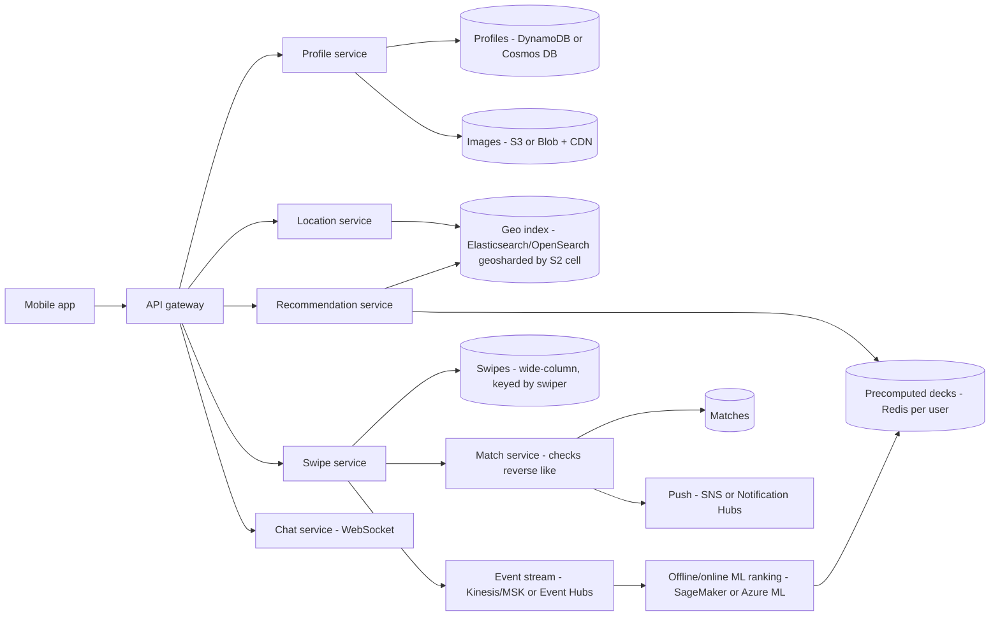

### Image store/retrieve design
- **Upload:** a presigned PUT straight to object storage, then an event pipeline: **moderation** (Rekognition `DetectModerationLabels` / Content Safety image API), face-presence check, EXIF/GPS stripping (privacy), resizing to fixed sizes (thumb/medium/full) and **WebP/AVIF** variants, and perceptual hashing for duplicate/fake detection.
- **Serve:** immutable, content-addressed keys (`/u/{user_id}/{photo_hash}_{size}.webp`) with long cache TTLs on the CDN, so there are no cache invalidations and a new photo means a new key. Signed URLs are optional; profile photos are semi-public to matches and discovery.
- **Prefetch:** the client prefetches the next N cards' images while the user looks at the current card.
- **Metadata:** photo order and ids live in the profile record. Blobs are never stored in the DB.

### Match search and database design
- **Core query:** "users within R km, matching my preferences, whose preferences match me, not already swiped, active recently". It's a geo + filter + exclusion query.
- **Geo indexing options:**
  - **Geohash:** base32 Z-order string. Prefix = containing cell (5 chars ≈ 4.9 × 4.9 km, 6 chars ≈ 1.2 × 0.6 km). Simple with any KV/B-tree prefix scan. Edge problem: neighbours can have different prefixes, so query the cell plus its 8 neighbours.
  - **Google S2:** projects the sphere onto a cube with a **Hilbert curve**, giving 31 levels (0–30) of 64-bit cell IDs. Cells are near-uniform. `RegionCoverer` covers a circle with a handful of cell ranges. **Tinder's published geosharding** uses S2 cells to shard Elasticsearch indexes so a query hits only the few shards covering the user's radius (cell level per Tinder blog; unverified).
  - **Uber H3:** hexagons, uniform neighbour distance, k-ring queries. Covered in D3.6.
- **Geosharding:** partition the user index by geo cell (balanced by **user density**, so dense cities get smaller shards). A query fans out only to the shards intersecting the radius.
- **Tables:**
  - `profiles(user_id PK, prefs, last_active, location_cell, …)`
  - `swipes(swiper_id, swipee_id, direction, ts)`: partition by `swiper_id` to answer "already seen?", plus a **Bloom filter per user** for fast exclusion.
  - `likes_received(swipee_id, swiper_id)` for match checks.
  - `matches(match_id, user_a, user_b, created_at)` indexed by both users.
- **Match creation:** on a right-swipe A→B, check whether `likes_received(A)` contains B (or check B→A). If yes, create the match **idempotently** (canonical `match_id = hash(min(A,B), max(A,B))`) and notify both. A conditional write (DynamoDB `ConditionExpression` / Cosmos ETag) prevents duplicate matches when both swipe simultaneously.

### Recommendation engine
- **Two stages:**
  - **Candidate generation:** geo + hard filters (age, gender, distance, not swiped, not blocked), ~1K candidates.
  - **Ranking:** an ML model predicting **P(mutual like)**, using features like attractiveness/desirability score (Tinder historically described an Elo-like score and later moved away from it), activity recency, profile completeness, embedding similarity, and reciprocity.
- **Fairness/marketplace:** avoid showing only top-desirability profiles. Balance exposure, boost new users, and keep ratios healthy.
- **Online learning signals:** swipes stream to a feature store and the model retrains (SageMaker / Azure ML). Real-time features include recent swipe velocity and current session.

### Precomputing matches
- **Precompute a deck** (e.g. 100–200 ranked candidates) per active user, in batch (nightly plus incremental) or on app open, and store it in **Redis** (`deck:{user_id}` list). A swipe pops from the deck, and a refill job runs when the deck drops below a threshold.
- **Benefits:** read latency becomes O(1). Expensive geo and ML work runs off the critical path and can use Spot.
- **Costs:** staleness (a user moved city or someone already swiped elsewhere). Mitigate with a final **re-filter at serve time** (Bloom filter of swiped and blocked, still-active check) and invalidate the deck on a large location change.
- **Location-change trigger:** traveling mode or a big move → rebuild the deck immediately.

### Chat feature
- Same design as D3.4, at smaller scale. Chat is **only allowed between matched users**: the server checks `matches` before accepting a message (authorization), and unmatching revokes access and hides history.
- WebSocket gateway + message store keyed by `match_id` (wide-column, time-ordered) + push notifications. Moderation on text (toxicity, scam/link detection; Tinder's "Does this bother you?" / "Are you sure?" prompts) is possible because chat is **not E2E**. That is a deliberate trade-off.

### Bottlenecks / trade-offs / security
- **Hot cells:** dense cities on Friday night. Split shards by density and cache the deck.
- **Privacy:** never return exact coordinates, only rounded distance ("3 km away"). Add **jitter/coarsening** to defeat **trilateration attacks** (researchers located users by querying distance from 3 spoofed points), and rate-limit location changes.
- **Abuse:** photo moderation, bot/scam detection, photo verification (liveness selfie), block/report, rate limits on swipes for free tier.
- **Data protection:** dating data is sensitive (sexual orientation is a GDPR **special category**). Encrypt at rest, minimise retention, enforce deletion on account close.

### Interview angles
- "How do you find nearby users efficiently?" → Hierarchical cell index (geohash/S2/H3), query covering cells, filter by exact distance, geoshard the index by density.
- "Why precompute?" → Swipe UX needs instant cards. Ranking is expensive. Re-validate at serve time.
- "How do you prevent double matches?" → Canonical match ID + conditional write.

## D3.6 Design Uber

### Requirements
- **Functional:** rider requests a ride (pickup, drop-off, product type), sees ETA and price (surge), gets matched to a nearby driver, both see live location, trip lifecycle (requested → accepted → arrived → in-progress → completed), payment, ratings, trip history.
- **Non-functional:** dispatch in < ~2–5 s. Location update ingest at high write rates. **Strong consistency for trip state and payment** (no double-assignment of a driver). Availability for dispatch is critical (a city outage means revenue loss and safety issues). Multi-region / per-city isolation.

### Capacity estimates
| Item | Assumption | Result |
|---|---|---|
| Trips | ~30M/day (Uber 2024 public total ≈ 11B trips/year) | ~350 trip requests/s avg, a few K/s peak |
| Online drivers | ~1–2M concurrently online at global peak (assumption) | |
| Location pings | every ~4 s per online driver | 1M / 4 = **~250K–500K location writes/s** |
| Location payload | ~100 B (driver_id, lat, lng, heading, speed, ts) | ~25–50 MB/s ingest; keep only latest in memory, history to the data lake |
| ETA/supply queries | each request plus each app-open queries nearby supply | tens of K QPS of geo k-NN queries |
- **Takeaway:** location data is **ephemeral, high-frequency and latest-value-wins**. Keep it in an **in-memory geo index sharded by cell**, not in a transactional DB.

### High-level architecture
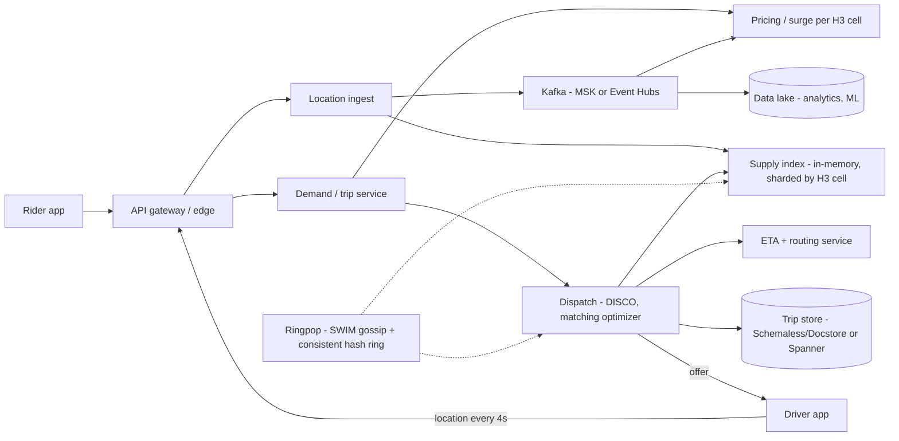

### Geo-sharding and H3
- **Geo-sharding:** partition stateful services (supply index, dispatch, surge) by **geographic cell**. Each worker owns a set of cells, and a query for "drivers near X" goes to the owner(s) of X's cell and its neighbours. Cities are natural failure domains.
- **H3 (Uber, open source):** hexagonal hierarchical grid with **16 resolutions (0–15)**. Each finer level has **~1/7 the area (aperture 7)**. It is built on an icosahedron (122 base cells, **12 pentagons** placed in oceans). Approximate average sizes: res 7 ≈ 5.2 km², res 8 ≈ 0.74 km², res 9 ≈ 0.1 km² (verify against h3geo.org tables).
  - **Why hexagons:** every neighbour's centre is the **same distance** away (squares have 2 distances, triangles 3), which makes **k-ring** "within N steps" queries, gradients and smoothing clean. Less quantisation error as vehicles move.
  - **Uses:** **surge pricing** (supply/demand per hex), **dispatch** candidate search (`gridDisk(origin, k)`), marketplace forecasting, analytics independent of city boundaries.
  - Caveat: hexagons don't nest perfectly (children only approximately cover the parent), unlike S2/geohash squares that nest exactly. That's fine for aggregation; for exact containment use polygon checks.
- **Earlier/alternatives:** Uber's original dispatch (DISCO) used **Google S2** cells as shard keys (unverified level detail). Geohash and Redis `GEOSEARCH` work for smaller systems. Managed services: **Amazon Location Service** / **Azure Maps** for maps, routing and geofencing, not for million-QPS supply indexes.

### Dispatch
- **Flow:** rider request → demand service creates trip `REQUESTED` → dispatch queries supply in nearby cells → filters by product, availability and constraints → computes **ETA via the road graph** (not straight-line distance) → selects a driver → sends an offer with an accept timeout (~15 s) → on accept, transitions the trip atomically (driver `AVAILABLE → DISPATCHED`, trip `→ ACCEPTED`).
- **Optimisation:** **batched matching**. Collect requests for a short window (seconds) and solve an assignment problem (bipartite matching minimising total ETA) instead of greedy nearest-driver. Also consider en-route drivers finishing nearby trips and pooled rides.
- **Consistency:** the driver must not get two trips. Use a per-driver lock/lease or **conditional update (compare-and-set on driver state + version)** in the owning shard, plus an idempotent offer ID. Trip state is a **state machine** persisted durably.
- **Live tracking:** driver location updates flow to the rider through a WebSocket/push channel, throttled to ~1–4 s intervals. The client interpolates for smooth animation.

### Schemaless (Uber's MySQL-based datastore)
- **Why:** in 2014 Uber's trip data was projected to outgrow a single Postgres. Cassandra, Riak and MongoDB failed its criteria: **linear scaling, write availability, change notifications, secondary indexes, operational trust**.
- **Model:** append-only, **immutable cells** addressed by `(row_key UUID, column_name, ref_key int)`. The cell body is **JSON**, with no schema enforced by the store. An "update" writes a new cell with a **higher ref_key** (versioning), and you read the latest ref_key.
- **Architecture:** stateless **worker nodes** route to **storage nodes** running **sharded MySQL** (a fixed large number of shards mapped to clusters; the Uber blog describes 4,096 shards, unverified here). **Buffered writes** to a secondary master keep **write availability during master failure**. **Triggers** stream cell writes to downstream consumers, giving an event-driven pipeline (e.g. billing after trip completion). **Secondary indexes** are eventually consistent (Uber reported typically < 20 ms lag), sharded by a designated index field so each query hits one shard.
- **Evolution:** Uber later built **Docstore** (MySQL-based, Raft-replicated, schemaful documents with transactions) on Schemaless lessons. Its newer **Fulfillment platform** re-architecture moved core trip/driver state to **Google Cloud Spanner** for strong consistency at scale (per Uber eng blog; unverified details). Interview takeaway: append-only cells + triggers = **event sourcing on MySQL**.

### Ringpop (hash ring and gossip membership)
- **Purpose:** make **stateful, in-memory services** (supply index, dispatch) scale horizontally and self-heal without a central coordinator. Uber built it when scanning all vehicles in one process's memory stopped scaling.
- **Three parts:**
  1. **SWIM gossip membership:** nodes ping random peers. If a direct ping fails they send **indirect pings via k peers** before marking the node **suspect**, then **faulty**. Membership changes piggyback on pings, and checksums detect divergence (full sync on mismatch). Flap damping isolates unstable nodes. Failure detection costs O(1) messages per node per period and dissemination takes O(log N) rounds.
  2. **Consistent hash ring:** **FarmHash** with **replica (virtual) points** per node for balance, stored in a red-black tree for O(log n) lookup. Adding or removing a node moves only its key ranges (~1/N of keys). See [D1.21](../D-system-design/D1-system-design-basics.md#d121-consistent-hashing) and [B6](../B-database-engineering/B6-database-sharding.md) (B6.2).
  3. **Handle-or-forward:** any node can receive any request. If the key (e.g. cell ID or driver ID) hashes elsewhere, the node **proxies** it over **TChannel** (Uber's RPC) to the owner, with retries. Clients need no knowledge of the shard map.
- **Trade-offs:** application-level sharding with **eventual membership convergence**. During a partition or churn, two nodes may briefly both think they own a key, so the design must tolerate that (idempotent ops, short-lived state rebuilt from the location stream). This is the **AP, Dynamo-style** family, so contrast it with a coordinator-based approach (ZooKeeper/etcd leases, or Kubernetes-native sharding). Ringpop is no longer showcased as a core component in Uber's recent architecture posts (status unverified).

### Bottlenecks / trade-offs
- **Hot cells** (stadium exit, airport): adaptive cell resolution, or split cell ownership across multiple workers.
- **Location write firehose:** keep only the latest value in memory and send history asynchronously to Kafka → lake. Never store pings synchronously in the OLTP database.
- **Region/city failure:** Uber has written about client-side state replication so trips survive datacenter failover (unverified detail). Generally: per-city cells, active-active regions, trip state replicated.
- **Strong vs eventual:** money and trip assignment need strong consistency. Locations, ETAs and surge are eventual.

### Security
- PII + **precise location** = high sensitivity. Restrict internal access by purpose (Uber's 2014 "God View" incident led to stricter access controls), audit-log every lookup, retain minimally, mask rider/driver phone numbers through proxy numbers, and share trip status only with trusted contacts.
- Payments: tokenised cards (PCI scope minimisation), fraud detection (GPS spoofing, collusion), driver identity verification (selfie checks).
- Service mesh mTLS, signed driver-app requests, rate limits against scraping the supply map.

### Interview angles
- "How do you find the nearest drivers fast?" → In-memory geo index sharded by H3/S2 cell, k-ring search, rank by **road ETA**, not straight-line distance.
- "How do you avoid assigning one driver twice?" → Single owner per driver (consistent hashing) + CAS on driver state + offer timeout + idempotent offer ID.
- "Why not store locations in a DB?" → 250K+ writes/s of latest-value-wins data. Use memory + stream; the DB only gets trip events.
- "Explain Ringpop vs Consul/etcd." → Ringpop is decentralised (gossip, no quorum, AP). etcd is CP and lease-based with clear ownership but a coordination bottleneck and quorum dependency.

## D3.7 Design Fandango/Ticketmaster/Livenation

### Requirements
- **Functional:**
  - Browse and search events by city, date, performer and venue.
  - Show the venue seat map with near-live availability.
  - Pick specific reserved seats, or a quantity for general admission (GA) or best-available.
  - **Hold** the seats for a fixed window (typically 5–10 min; the exact Ticketmaster value is unverified).
  - Pay, then issue a mobile ticket.
  - Transfer, resale, refund.
  - **Fandango-style differences:** the theatre's POS system often owns the inventory, so the platform needs an **inventory adapter** that calls the exhibitor's system. It can't just write to its own DB.
- **Non-functional:**
  - **Never double-sell a seat.** Inventory needs strong consistency, linearizable per seat.
  - Catalog: 99.99% available, eventual consistency is fine.
  - On-sales spike **100–1000× baseline within seconds**.
  - Fair ordering and resistance to bots.
  - Hold API p99 under ~500 ms.
  - Payment takes effect exactly once.

### Capacity estimates
| Item | Assumption | Result |
|---|---|---|
| Baseline browse | 50M DAU × 20 page views | ~1B/day ≈ **12K rps avg**, mostly CDN/cache hits |
| Mega on-sale | Ticketmaster's Nov 2022 Eras Tour presale statement: ~14M users, **3.5B system requests** (4× its previous peak), ~2M tickets sold in a day (per Ticketmaster; unverified here) | Demand is effectively unbounded |
| One stadium show | 70K seats, sells out in ~10 min | ~120 sales/s. With ~5 hold attempts per sale, **~600 hold writes/s on one event** |
| Seat-map polling | 50K admitted shoppers polling every 3 s | **~17K rps per event** on availability. Serve it from a cached bitmap, never from row scans |
| Inventory size | 1M events/yr × ~5K seats × ~100 B | ~500 GB/year. One event's inventory is **only ~7 MB** |
- **Takeaway:** supply is tiny and hot while demand is unbounded. The hard parts are **admission control** and **contention on a small hot dataset**. Storage and raw throughput are easy.

### High-level architecture
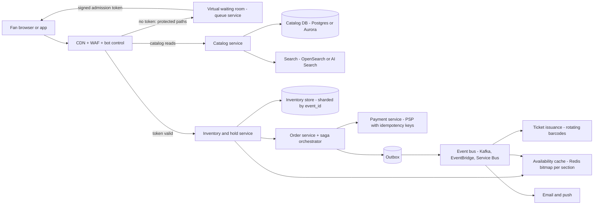

### Separating ticket transactions from catalog data
| Concern | Catalog (events, venues, performers, seat-map geometry, prices, media) | Transactions (seat status, holds, orders, payments) |
|---|---|---|
| Access pattern | Read-heavy (≥1000:1), searchable, cacheable | Write-heavy bursts on a few hot events |
| Consistency | Eventual. A stale price label is shown and re-checked at checkout | **Strong**. A conditional write per seat |
| Store | Postgres/Aurora + OpenSearch + CDN. Seat-map SVG/JSON is a static asset | Small, sharded by `event_id`. RDBMS rows, DynamoDB/Cosmos items, or Redis plus a durable system of record |
| Scaling lever | Cache TTLs, CDN, read replicas | Admission rate (waiting room), **partitioning by event/section**, short transactions |
| Failure mode tolerated | Serve stale | Fail closed. Never oversell |
- Splitting them lets the catalog **stay up and be cached aggressively** during an on-sale. The inventory service only has to scale for **admitted** users.
- **Availability view ≠ truth.** The seat map shows a per-section **bitmap** (1 bit per seat, so 70K seats ≈ 9 KB) refreshed every 1–5 s from inventory change events. The authoritative check happens **at hold time**. Expect and handle "seat just taken" errors in the UX.

### Seat locking with timed holds
- **Seat state machine:** `AVAILABLE → HELD(hold_id, expires_at) → SOLD`. Expiry or cancel sends `HELD → AVAILABLE`. Refund sends `SOLD → AVAILABLE` (or to resale).
- **Implementation options:**

| Option | Mechanism | Pros | Cons / gotchas |
|---|---|---|---|
| **Redis lock with TTL** | `SET hold:{event}:{seat} {hold_id} NX PX 600000`. Do multi-seat all-or-nothing with a **Lua script** that checks every key and then sets them all | Sub-ms latency, TTL expires the hold for you, absorbs huge read/write rates | Replication is async, so **a failover can lose holds** and two users can then hold the same seat. Use it as a fast **pre-filter**. The durable store must still enforce `SOLD` |
| **RDBMS conditional UPDATE** | `UPDATE seats SET status='HELD', hold_id=$h, hold_expires_at=now()+'10 min' WHERE event_id=$e AND seat_id = ANY($ids) AND (status='AVAILABLE' OR (status='HELD' AND hold_expires_at < now()))`, then commit only if `rowcount = n` | ACID, one round trip, no long-held locks, **lazy expiry** built into the predicate | Hot event = hot shard. Keep transactions tiny. Use DB time (`now()`), not app clocks |
| **RDBMS pessimistic** | `SELECT … FOR UPDATE SKIP LOCKED LIMIT n` for **best-available** | Concurrent pickers skip rows other transactions have locked instead of queueing behind them | Holds the lock while you decide, so the transaction must stay short |
| **DynamoDB conditional write** | `UpdateItem` with `ConditionExpression: attribute_not_exists(hold_id) OR hold_expires < :now`. Multi-seat via **`TransactWriteItems` (≤100 items, 4 MB)** | Serverless scale, per-item linearizable conditions | **TTL deletion is lazy (typically within a few days)**, so never rely on TTL to free a seat. Put the expiry check in the condition. A transaction conflict comes back as `TransactionCanceledException` |
| **Cosmos DB** | Optimistic concurrency with `If-Match: <_etag>`. **Transactional batch** (≤100 ops, 2 MB, **same logical partition**) | Partition key `event_id#section` makes a section's seats one atomic unit | 20 GB logical-partition cap; RU hot partition |
- **Fencing:** the final `HELD → SOLD` transition is conditional on `hold_id = $h AND status='HELD'`. That way a payment that completes after expiry or a Redis failover **can't overwrite** another buyer's hold. It works like a fencing token.
- **General admission / quantity-only:** use `UPDATE inventory SET remaining = remaining - $n WHERE id=$x AND remaining >= $n`. One counter is a hot row, so **split it into N sub-counters (buckets)** and decrement a random one. Alternatively, pre-load N tokens into a queue (Redis list / SQS) where pop = reserve.
- **Releasing expired holds:** do it three ways.
  1. **Lazily**, through the predicate above.
  2. With a **sweeper** job.
  3. With **delayed messages** to emit `seat.released` for the map cache. SQS delay is ≤ 15 min; Service Bus uses scheduled messages.
- **Hold-length trade-off:** a longer hold gives buyers time but lets bots park inventory and shows phantom sell-outs. A shorter hold makes payment race the timer. Fix that by **extending the hold once** when payment starts (a payment lease).

### Virtual waiting room for flash sales
- **Flow:**
  1. Users arrive early and land in a **pre-queue**.
  2. At T0, assign queue positions **randomly** among the pre-queue (a lottery, which beats a click race for fairness). Late arrivals get FIFO positions.
  3. The queue service advances a **"now serving" counter** at the rate the inventory service can sustain (closed-loop on its p99 and error rate).
  4. When admitted, the user gets a **signed, short-lived token** (JWT: `event_id`, `user_id`, `exp` ≈ 10–15 min, single use or device-bound).
  5. The edge or gateway **rejects protected paths without a valid token**.
- **Cheap polling:** clients poll a tiny, CDN-cacheable "serving position" endpoint (1–5 s TTL). They don't hit the queue DB.
- **AWS:**
  - **CloudFront Functions:** sub-ms, cheap, **no network calls**. They can read **CloudFront KeyValueStore** for flags like "origin open" or admit rate, and can check a token signature (HMAC) or cookie.
  - **Lambda@Edge:** use it when you need RS256 verification with network access or richer logic. It has higher latency and cost.
  - **WAF:** Bot Control plus rate-based rules.
  - Queue API: API Gateway + Lambda + DynamoDB/ElastiCache.
  - **Note:** the "Virtual Waiting Room on AWS" solution is **no longer available**. AWS now points to Marketplace partners or the CloudFront Functions visitor-prioritization pattern.
- **Azure:**
  - **There is no native waiting room.**
  - **Front Door Premium** gives you WAF rate-limit rules, bot manager rule set, and Rules Engine redirects to a static waiting page in Blob/Static Web Apps.
  - Build the queue service on Functions/Container Apps with **Azure Managed Redis** (sorted set) or Service Bus.
  - Validate the token at **APIM (`validate-jwt`)** or in the app. Front Door rules don't verify JWT signatures (unverified for newest rule features).
- **SaaS alternatives:** Queue-it, Cloudflare Waiting Room, Akamai.
- **Ticketmaster's own approach:** **Smart Queue** plus **Verified Fan**, which is pre-registration that filters bots and invites a capped number of fans per on-sale.

### Idempotent payments and the purchase saga
- **Saga (orchestrated):**
  1. Hold seats.
  2. Create order `PENDING`.
  3. **Authorize** payment.
  4. Mark seats `SOLD` (fenced by `hold_id`).
  5. **Capture** payment.
  6. Issue tickets.
  7. Notify.
- **Compensations:** void the authorization, release seats, mark the order `FAILED`. If capture succeeds but issuance fails, **retry issuance** (it's idempotent). Don't refund.
- **Idempotency:**
  - The client generates an `Idempotency-Key` per checkout attempt and the server stores `(key → response)`. Stripe's API dedupes on this header; keys may be pruned after ≥ 24 h.
  - Webhooks from the payment provider (PSP) arrive at-least-once, so dedupe on the event ID.
- **Late payment:** if payment succeeds **after** the hold expired and the seat was resold, the fenced `SOLD` update fails. The saga then **auto-refunds** and tells the user.
- **Outbox** for order events, plus a nightly **reconciliation** against PSP settlement reports, which catches stuck auths.
- **Don't use 2PC** between your DB and a PSP. They can't share a transaction.

### Data model
- `events(event_id PK, venue_id, performer_ids, starts_at, on_sale_at, status)` lives in the catalog.
- `seats(event_id, seat_id, section, row, number, price_tier, status, hold_id, hold_expires_at, order_id, version)` has **PK `(event_id, seat_id)`** and is sharded by `event_id`.
  - For DynamoDB, use PK `EVENT#e#SEC#s`, SK `SEAT#r#n`.
- `holds(hold_id PK, user_id, event_id, seat_ids[], expires_at, state)`.
- `orders(order_id PK, user_id, hold_id, amount, currency, state, idempotency_key UNIQUE, psp_payment_id)`.
- `tickets(ticket_id PK, order_id, seat, barcode_secret, owner_user_id, transfer_history)`.

### Bottlenecks / trade-offs
- **Hot event shard:** shard **within** an event by section so the conditional writes spread out. Isolate mega-events on dedicated cells.
- **Admission rate vs conversion:** admit too slowly and fans churn; too fast and the inventory p99 explodes. Tie the admit rate to SLO feedback.
- **Redis-first vs DB-first holds:** Redis gives speed, the DB gives durability. A common hybrid is a Redis pre-filter plus DB fencing on sale.
- **Pre-assign seats vs let users pick:** best-available assignment server-side cuts contention a lot compared with everyone clicking the same front-row seats.

### Security
- **Bots and scalpers:** WAF bot control, CAPTCHA or proof-of-work at queue entry, device fingerprinting, per-account, per-card and per-household limits, Verified-Fan-style pre-registration. The US **BOTS Act (2016)** makes circumventing ticket-purchase controls illegal.
- **PCI DSS:** keep card data out of scope with PSP hosted fields or tokenization. PCI DSS v4.0.1 is current, and the v4.0 future-dated requirements became mandatory on 31 Mar 2025.
- **Tickets:** **rotating barcodes** (Ticketmaster SafeTix uses a time-based rotating code, TOTP-like) stop screenshot resale. Bind the ticket to the account.
- Admission tokens are short-lived and bound to the user or device. Replay a token from another device and it fails.

### Interview angles
- "How do you prevent double booking?" → A conditional write or row-level predicate on `(event_id, seat_id)` in the system of record, plus fencing on the final `SOLD` transition. Redis TTL locks are an optimisation, not the source of truth.
- "How do holds expire?" → Expiry lives in the write predicate (`hold_expires_at < now()`), a sweeper and delayed events update the cache, and you never rely on DynamoDB TTL timing.
- "10M people at 10:00 for 70K seats?" → A waiting room with randomized pre-queue, admission rate matched to inventory capacity, signed tokens checked at the edge, a catalog served from CDN, and bot filtering. Most traffic never reaches the inventory service.
- "Payment succeeded but the hold expired?" → The fenced update fails, the saga compensates with a refund, and the idempotency key prevents a double charge on retry.

## D3.8 IoT System Design

### Requirements
- **Functional:**
  - Provision and authenticate millions of devices.
  - Ingest telemetry.
  - Send commands and config to devices (cloud-to-device).
  - Keep **device state** in sync (shadow/twin) for offline devices.
  - OTA firmware updates.
  - Rules and alerts, dashboards, and historical analytics.
  - Edge processing for sites with flaky links.
- **Non-functional:**
  - Intermittent, low-bandwidth links and constrained MCUs (KB of RAM).
  - Per-device identity.
  - Ordering per device.
  - Store-and-forward at the edge.
  - Long device lifetimes (10+ years), so plan for crypto agility.
  - OT/IT network separation.

### Capacity estimates
| Item | Assumption | Result |
|---|---|---|
| Fleet | 10M devices, 1 msg per 10 s | **1M msgs/s** |
| Payload | ~200 B (compact JSON/CBOR/Protobuf) | ~200 MB/s ≈ **17 TB/day raw**, so compress and downsample for the warm store |
| Connections | always-on MQTT, keepalive 60–300 s | 10M concurrent TLS sessions. Plan around **account/hub quotas** (AWS IoT Core default 500K concurrent connections per account, adjustable) |
| Broker quotas | AWS IoT Core: 20K inbound publishes/s per account default, **100 publishes/s and 512 KB/s per connection**, adjustable account quotas | 1M msg/s needs **quota raises + Basic Ingest + multiple accounts/regions**. On Azure, scale **IoT Hub units** (per-unit daily message quotas) or several hubs |
| Shadow updates | 1 per device per hour | ~2.8K/s |
- **Takeaway:** treat ingest as a **stream** (broker → rules → Kinesis/Event Hubs) and store latest state separately from history. Shard by `device_id` / site.

### High-level architecture
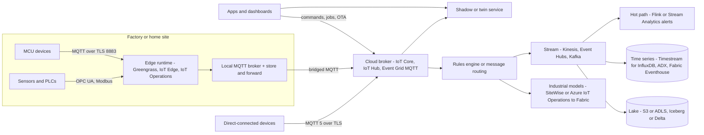

### MQTT broker and topics
- **Protocol basics:**
  - MQTT is pub/sub over TCP, with a **2-byte minimum fixed header**.
  - Ports: **8883** for TLS. **443** with ALPN `x-amzn-mqtt-ca` on AWS, or MQTT over WebSocket, when firewalls block 8883.
  - Clients connect **outbound**, so devices behind NAT need no inbound ports.
- **Topics:**
  - Topics are hierarchical, with `/` as the separator.
  - Wildcards: **`+`** matches one level, **`#`** matches multiple levels and must be last.
  - Design pattern: `{tenant}/{site}/{device_id}/telemetry/{stream}`, `.../cmd/{name}`, `.../cmd/{name}/res`.
  - Put the **device ID in the topic** so authorization policies can pin each device to its own subtree, e.g. AWS policy variable `${iot:Connection.Thing.ThingName}`.
  - AWS limits: topic ≤ 256 bytes, ≤ 7 slashes.
- **QoS levels:**
  - **0** = at most once.
  - **1** = at least once (PUBACK, possible duplicates, so consumers must be idempotent).
  - **2** = exactly once (4-step PUBREC/PUBREL/PUBCOMP handshake).
  - **AWS IoT Core, Azure IoT Hub and Event Grid's MQTT broker support only QoS 0/1.** IoT Hub closes the connection on a QoS 2 publish. Design for dedupe with a message ID or sequence number.
- **Retained message:** the broker keeps the **last message per topic** and delivers it immediately to new subscribers. Use it for config or last-known state.
  - AWS IoT Core supports it (default 500K retained msgs per account, ≤1 retained publish/s per topic).
  - **IoT Hub does not persist retained messages.** It just tags them `mqtt-retain` and forwards them to the backend.
- **LWT (Last Will and Testament):** set in CONNECT. The broker publishes the will message if the client drops **without DISCONNECT** (keepalive timeout). It's the standard **presence/offline detection**. MQTT 5 adds a **will delay** to suppress flaps.
  - On IoT Hub, the will is forwarded as a telemetry message with `iothub-MessageType: Will`.
  - Event Grid MQTT supports LWT natively.
- **Sessions:**
  - `cleanSession=0` (3.1.1) or MQTT 5 **session expiry** keeps subscriptions and queued QoS 1 messages while the device is offline.
  - AWS default persistent-session expiry is 1 h (adjustable).
  - Event Grid MQTT: 1 h default and up to 8 h. Its offline queue is capped at 100 msgs or 1 MB, after which the session is terminated.
- **MQTT 5 additions:**
  - Session and message expiry.
  - **Shared subscriptions** (`$share/group/topic`) to load-balance backend consumers.
  - User properties, reason codes, request/response (response topic + correlation data), topic aliases, flow control (Receive Maximum).
- **Keepalive limits:** AWS clamps it to 30–1200 s. IoT Hub's server-side timeout is capped at 1,767 s. Event Grid's maximum is 1,160 s. Shorter keepalives detect failures faster but cost battery and data.
- **Broker comparison:**

| | AWS IoT Core | Azure IoT Hub | Azure Event Grid MQTT broker | Self-hosted (EMQX, HiveMQ, Mosquitto, VerneMQ) |
|---|---|---|---|---|
| MQTT versions | 3.1.1, 5 | **3.1.1 only** (fixed topics) | 3.1.1, 5 | 3.1.1, 5 |
| Model | Full pub/sub + rules engine | **Device↔cloud, not a general broker** (no device-to-device, no broadcasts, ≤5 subscriptions) | Full pub/sub, custom topics, fan-out, routing to Event Hubs and others | Full broker, clustering, QoS 2 |
| Max message | 128 KB | 256 KB | 1 MB per Event Grid MQTT docs (IoT Hub's comparison table says 512 KB) | Configurable |
| Retained / LWT | Yes / Yes | No (forwarded) / Yes | Retain support: check current docs (unverified) / Yes | Yes / Yes |
| State | Device Shadow | Device twin, direct methods, cloud-to-device | Bring your own | Bring your own |

### Device shadows / twins
- **AWS Device Shadow:**
  - A JSON document with `state.desired`, `state.reported`, a computed **`delta`**, `metadata` timestamps and a **`version`** for optimistic concurrency.
  - Supports a **classic** shadow plus **named shadows** per thing.
  - Limits: **8 KB** per document, 8 levels of JSON depth, 20 requests/s per thing.
  - MQTT topics: `$aws/things/{thing}/shadow/update` → `/accepted`, `/rejected`, `/delta`, `/documents`.
- **Azure device twin:**
  - Fields: `tags` (backend only), `properties.desired`, `properties.reported`, `$version`.
  - Device topics: `$iothub/twin/GET`, `$iothub/twin/PATCH/properties/reported/?$rid=`. Desired changes arrive on `$iothub/twin/PATCH/properties/desired/`.
  - Notifications are sent **only while the device is connected**, so on reconnect the device **GETs the full twin** and reconciles.
  - Also available: **module twins** for edge modules, and **direct methods** for synchronous request/response with a timeout.
- **Pattern:**
  1. The app writes `desired`.
  2. The device receives the delta on connect.
  3. The device applies it and writes `reported`.
  4. The UI shows "pending" until `reported == desired`.
- **What belongs where:** high-frequency telemetry **never goes into the shadow**. The shadow is for low-rate state and config. Telemetry goes to the stream.

### Edge computing
- **Why use the edge:**
  - Latency for control loops.
  - **Bandwidth**: filter, aggregate and compress before uplink.
  - Keep working **offline**.
  - Data residency.
  - Protocol translation (OPC UA, Modbus, BACnet to MQTT).
- **AWS IoT Greengrass v2:**
  - Runs components (processes, containers, Lambda) deployed from the cloud.
  - **Stream manager** handles buffered export to Kinesis, S3 or SiteWise.
  - Provides a local MQTT broker component and an MQTT bridge.
  - Runs ML inference at the edge.
- **AWS IoT SiteWise Edge:** runs on Greengrass. It collects OPC UA data (**up to 100 OPC UA servers per gateway**), processes it locally and syncs asset data to the cloud.
- **Azure IoT Edge:** container **modules**, with an **edgeHub** module for local routing and offline store-and-forward, deployed via IoT Hub.
- **Azure IoT Operations:**
  - **Kubernetes-native** on **Azure Arc-enabled** clusters.
  - Provides an **edge MQTT broker**, **Akri connectors** (OPC UA, HTTP/REST), **data flows** for transform and contextualize, and **Azure Device Registry** with a schema registry.
  - Runs **offline for up to 72 h**.
  - Sends to Event Hubs/Kafka, Event Grid MQTT, ADLS, **Fabric OneLake** and ADX.
  - It's Microsoft's go-forward industrial edge platform. IoT Edge stays for device-level module deployment.
- **Design rules:**
  - Deploy edge workloads as **immutable, versioned** artifacts with staged rollouts (canary sites).
  - Make local buffers bounded, with a drop policy (oldest-first for telemetry, never drop commands' acks).
  - Use **clock sync (NTP/PTP)** and device-side timestamps, so analytics use **event time**.

### IoT analytics
- **Hot path:** stream processing (Amazon Managed Service for Apache Flink, Azure Stream Analytics, Fabric Real-Time Intelligence) handles threshold or anomaly alerts, windowed aggregates and **late or out-of-order** data using watermarks.
- **Warm path:** a time-series store for dashboards over days to months. Options include Timestream for InfluxDB, Azure Data Explorer / Fabric Eventhouse (KQL), InfluxDB and TimescaleDB.
- **Cold path:** a data lake (S3/ADLS) in Parquet with Iceberg/Delta, queried by Athena, Spark/Databricks or Synapse/Fabric for ML training and fleet analytics.
- **Industrial modelling:**
  - **AWS IoT SiteWise** asset models (hierarchies, transforms, metrics like **OEE**, alarms) with **hot, warm and cold (S3) storage tiers**.
  - **AWS IoT TwinMaker** and **Azure Digital Twins** cover digital twins.
- **Service status changes (verify before quoting):**
  - **AWS IoT Analytics:** closed to new customers in 2024 and reached **end of support on 15 Dec 2025**. Its doc and product pages now redirect to the generic AWS IoT page.
    - Migrate to IoT Core rules → Kinesis/Firehose → S3 + Glue/Athena, or SiteWise.
  - **AWS IoT Events:** **end of support 20 May 2026**. Migrate detector models to Flink/Lambda/Step Functions or SiteWise alarms. Dates are per AWS end-of-support notices; the exact days are unverified here.
  - **Amazon Timestream for LiveAnalytics:** reported closed to new customers in 2025 (unverified). Timestream for InfluxDB is the open path.
  - **Azure Time Series Insights:** retired July 2024. Use ADX or Fabric Real-Time Intelligence instead.
  - **Azure IoT Central:**
    - Microsoft published, then **withdrew**, a retirement notice (unverified).
    - The current Learn overview (May 2025) shows IoT Central as an active aPaaS with Standard 0/1/2 per-device pricing and no retirement banner.
    - For new industrial or custom builds, Microsoft steers to **IoT Hub + IoT Operations + Fabric**.
    - Check the current status before you recommend it.

### Fleet provisioning and OTA
- **Provisioning:**
  - The factory installs a **unique X.509 cert or key** in a secure element/TPM, or uses a claim cert.
  - First connect goes through **AWS IoT fleet provisioning / JITP / JITR**, or **Azure DPS**. Enrollment groups, attestation, and allocation to the right hub or region.
- **OTA:**
  - Use signed firmware (code signing) with A/B partitions and rollback.
  - Do **staged rollouts** with abort thresholds, using AWS IoT Jobs (rollout rate, abort config) or IoT Hub automatic device management / Device Update for IoT Hub.
  - Deliver via presigned S3/Blob URLs, not over MQTT payloads.

### Bottlenecks / trade-offs
- **Reconnect storms** after a broker or region outage: millions of TLS handshakes at once. Use **exponential backoff with jitter** in firmware, connect-rate quotas (AWS allows 1 CONNECT/s per client ID), and TLS session resumption.
- **Managed vs self-hosted broker:** managed means quotas and limited MQTT features (no QoS 2, 128–256 KB messages). Self-hosted (EMQX/HiveMQ on Kubernetes) gives full spec support and control, but you own the 10M-connection scale-out.
- **Edge vs cloud processing:** the edge saves bandwidth and latency but creates a large fleet of distributed computers you have to patch.
- **Ordering:** guaranteed only per topic/session at QoS 1, so carry a device sequence number and dedupe or reorder downstream.

### Security
- Unique **per-device identity** (X.509 in a hardware secure element). Never share fleet-wide keys. Rotate certs. Plan for CA rotation (e.g. the Azure DigiCert G2 root migration).
- **Least-privilege topic policies** (a device can only pub/sub on its own subtree). Only the backend can publish commands.
- **AWS IoT Device Defender** (audit plus behavioural anomalies) and **Microsoft Defender for IoT** (agentless OT network monitoring).
- **OT segmentation** (Purdue model, ISA/IEC 62443), with edge gateways as the only path from OT to the cloud. No inbound ports on devices.
- **Regulation:** the EU **Cyber Resilience Act** brings vulnerability-handling and SBOM obligations for connected products (phased in through 2027).

### Interview angles
- "QoS 2 for payments or commands?" → The managed clouds don't support it. Use QoS 1 + idempotent handlers keyed by command ID, plus an ack topic.
- "How do you know a device is offline?" → LWT (with will delay) + keepalive + lifecycle events (`$aws/events/presence/...` on AWS, connection state events via Event Grid on Azure). Don't poll.
- "Where does the device's state live?" → The shadow/twin for desired and reported config; the stream and time-series DB for telemetry.
- "IoT Analytics / Time Series Insights in your design?" → Both are retired or end-of-support. Saying so is a senior-level signal.

## D3.9 Design Shopify

### Requirements and design spec
- **Functional:**
  - **Multi-tenant** commerce platform: merchants create stores on custom domains, with themes (Liquid templates) or headless storefronts.
  - Product catalog and inventory, cart, checkout and payments (Shop Pay), orders and fulfilment, discounts.
  - **App ecosystem** (Admin GraphQL API, webhooks).
  - Merchant admin, analytics, POS.
- **Non-functional:**
  - Millions of merchants, most of them tiny, with a long tail of **flash-sale** merchants (celebrity drops) that can 1000× in seconds.
  - **Tenant isolation**, so a noisy neighbour can't take down others.
  - Checkout availability above everything else (it is the revenue path).
  - **PCI DSS Level 1**.
  - Survive **BFCM** (Black Friday/Cyber Monday).
- **Scale anchor:**
  - BFCM 2025: **$14.6B in sales**, a peak of **$5.1M per minute**, and **11 TB of logs per minute** at peak (Shopify's BFCM 2025 report).
  - Earlier BFCM engineering posts cite edge peaks in the hundreds of millions of requests per minute (unverified figures).

### Capacity estimates
| Item | Assumption | Result |
|---|---|---|
| Checkout peak | $5.1M/min ÷ ~$115 avg cart | **~44K orders/min ≈ 740 orders/s** platform-wide at peak |
| Storefront traffic | ~50–100 page/API views per order | **~40K–75K rps** dynamic origin, far more at the edge (cache hits) |
| Flash-sale shop | 1M fans for 10K units at noon | One shop briefly exceeds whole-platform baseline, so tenant isolation and a checkout queue are needed |
| Data | 5M+ shops × catalog/orders | Hundreds of TB in OLTP, so **shard by `shop_id`** |

### Online store design
- **Request path:**
  1. Edge/CDN + WAF.
  2. **Sorting Hat**, an OpenResty/Lua routing layer, maps the `Host` header → shop → **pod** and adds a header naming the pod.
  3. Stateless app tier: Rails modular monolith (**Packwerk** boundaries), plus a separate **Storefront Renderer** service for read-only Liquid rendering.
  4. The pod's datastores.
- **Storefront caching:**
  - Full-page or fragment cache keyed by `(shop, path, locale, currency, theme version)`.
  - **Surrogate-key/tag purge** when a product changes. Short TTLs with `stale-while-revalidate`.
  - Read replicas for renderer queries.
  - **Cart and checkout are never cached.**
- **Headless:** Storefront API + **Hydrogen** (React framework) hosted on **Oxygen** (Shopify's edge hosting).
- **Custom domains:** automated TLS issuance (ACME/Let's Encrypt) and renewal per domain. Store certs centrally and load them via SNI at the edge.
- **Checkout:** a separate, hardened path with its own capacity. During flash sales, a **checkout queue/throttle** (a waiting room) admits buyers at a sustainable rate. Same pattern as [D3.7](#d37-design-fandangoticketmasterlivenation).

### Cost effectiveness and scaling
- **Multi-tenancy density:** most shops are tiny, so pack many shops per pod or shard and keep app servers **shared and stateless**. That's far cheaper than a stack per tenant.
- **Pods (cells):** a pod is a set of shops on a **fully isolated set of datastores** (MySQL, Redis, Memcached, etc.).
  - Any request touches **exactly one pod**, so a pod failure has a limited blast radius.
  - Shared workers are pinned to one pod per unit of work.
- **Rebalancing:**
  - **Ghostferry** (open source, binlog-tailing) does zero-downtime **shop moves** between shards and pods. Use it to isolate big merchants or fix hotspots.
  - **Pod Mover** fails over or moves a pod between paired regions "in about a minute without dropping requests".
- **Elasticity:**
  - Autoscale the stateless tier.
  - **Pre-scale for BFCM** with load tests. Shopify's in-house load generator is called **Genghis** (unverified).
  - Run game days, add capacity reservations with the cloud provider, and freeze code.
  - Shopify runs on **Google Cloud** (migrated around 2018) with Kubernetes.
- **Flash-sale hot row:**
  - A single variant's `inventory_quantity` takes MySQL row-lock contention.
  - Decrement atomically with `... WHERE qty >= n`.
  - Reserve at checkout completion, not at add-to-cart.
  - Throttle checkout.
  - Move the shop to an isolated pod ahead of a known drop.

### Database design
- **Sharded MySQL by `shop_id`** (sharded since 2015). Every tenant table carries `shop_id`, with **composite PK/indexes leading with `shop_id`**, and every query is **scoped by shop**. The ORM default scope enforces it, which also enforces tenant isolation.
- **Global IDs** come from a central ID generator, so IDs stay unique across shards and survive shop moves.
- **Cross-shop data** (billing, partner and app registry, Shop Pay identity) lives in separate global services and stores, kept small.
- **Search:** Elasticsearch/OpenSearch-style indexes per shop collection, fed by CDC.
- **Background jobs:** Redis-backed queues per pod, with idempotent jobs keyed by shop.

### Security
- **PCI DSS Level 1:** card data enters a **separate card vault** through **hosted, iframed payment fields** and never touches the main monolith, which keeps it out of PCI scope.
- **Tenant isolation:** shop scoping in the data layer, per-shop caches and keys, and authorization tests for IDOR across shops.
- **Apps:**
  - OAuth with granular scopes.
  - **Webhooks HMAC-SHA256 signed** (`X-Shopify-Hmac-Sha256`).
  - API rate limiting: a REST leaky bucket and GraphQL **cost-based** throttling. Exact bucket sizes vary by plan and version (unverified).
- **Theme and app code:** Liquid is sandboxed (no arbitrary code execution server-side). Use CSP for storefront scripts.
- **Bot and fraud protection** on checkout, plus fraud analysis on orders.

### Analytics and high availability
- **Analytics:** CDC/binlog → Kafka → lake/warehouse for merchant analytics (ShopifyQL-style reports) and platform BI. Merchant-facing **live view** during BFCM comes from a stream aggregation. **Never query OLTP shards** for analytics.
- **HA:**
  - Pods are active in one region with a replica in a paired region, and **pod-level failover** (Pod Mover).
  - MySQL primary/replica with automated failover.
  - Stateless tiers run across regions.
  - Degrade gracefully: storefront can serve stale cache when origin is impaired.
  - Feature flags shed non-critical features (recommendations, analytics widgets) at peak.

### Interview angles
- "One merchant's flash sale is taking everyone down?" → Pods/cells isolate datastores, Ghostferry moves the shop to a dedicated pod, a checkout queue throttles it, and storefront traffic is served from cache.
- "Shard key?" → `shop_id`. Almost every query is shop-scoped, which gives isolation and easy shop moves. Its weakness is cross-shop queries, which go to the lake or global services instead.
- "Why a modular monolith?" → Shopify kept Rails with enforced component boundaries instead of hundreds of microservices. That gives a simpler transactional model and good developer velocity, and scale comes from **cells**, not service count.

## D3.10 Design URL Shortener/TinyURL
> DB-level design (key generation, schema, sharding, 301 vs 302, click-stream partitioning) is in [B9.2](../B-database-engineering/B9-database-system-design.md#b92-building-a-short-url-system-database-backend). This section covers the **full system**.

### Requirements
- **Functional:**
  - Shorten a URL (optional custom alias and expiry).
  - Redirect.
  - Disable a link.
  - Per-link analytics (clicks, geo, referrer, device).
  - User accounts and API keys.
  - QR codes.
- **Non-functional:**
  - Redirect p99 < 50 ms at the edge and < 100 ms from origin.
  - **Redirect availability 99.99%+**, higher than the create path.
  - Codes must not be guessable when a link is private.
  - Read:write ≈ 100:1.
- **Capacity (from B9.2):**
  - ~1.2K creates/s and ~120K redirects/s average, ~3× at peak.
  - 7-char base62 gives 3.5T codes.
  - ~180 TB over 10 years, so you need a sharded KV store.

### API
- `POST /api/v1/links {long_url, alias?, expires_at?}` → `201 {code, short_url}`. Requires an API key/OAuth and an `Idempotency-Key`.
- `GET /{code}` → `302 Location: …` (or 301/308 for permanent links, if you accept losing analytics). Returns `404` or `410 Gone` for disabled or expired links.
- `GET /api/v1/links/{code}/stats?from&to&granularity`.
- `DELETE`/`PATCH` on links. Owner only, with an object-level authorization check.

### High-level architecture
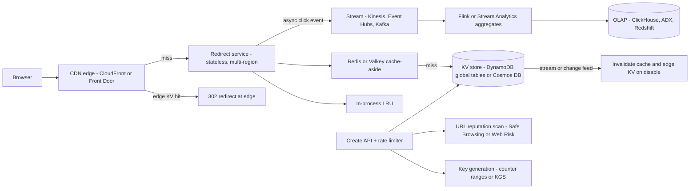

### Caching (full stack)
- **Edge:** the hottest links can be answered **at the CDN**.
  - On CloudFront, use **CloudFront Functions + KeyValueStore** (small KV, ~5 MB per store, so only the hot set) to return a 302 without touching origin.
  - Alternatively, cache the 302 response itself at the CDN with a short `s-maxage` and pull click analytics from **CDN logs** (real-time logs on CloudFront; Front Door access logs).
- **Service:** in-process LRU (seconds TTL) → Redis cache-aside (hours TTL, LFU eviction). A **Bloom filter / negative cache** stops enumeration scans from hitting the DB.
- **Invalidation:** when a link is disabled (abuse), a **change stream** (DynamoDB Streams / Cosmos change feed) purges Redis, the edge KV and the CDN. Keep TTLs short enough that a takedown propagates within your SLA.
- **Hot key (viral link):** L1 cache + request coalescing (singleflight) + edge serving. The DB never sees it.

### Analytics
- The redirect path emits fire-and-forget events (or the CDN logs them). Stream aggregation builds per-minute rollups, with an OLAP store for slicing.
- Use **HyperLogLog** for unique visitors and approximate counts. The partitioning and exactly-once caveats are in B9.2.
- Dedupe bot clicks: link-preview crawlers (Slack, iMessage, Twitter) hit links once on paste. Filter them by UA/ASN.

### Multi-region
- The redirect path is **active-active** in all regions (DynamoDB global tables or Cosmos multi-region). Latency-based DNS or anycast CDN routes users.
- Creation can be single-writer per code range. Counter ranges per region avoid cross-region coordination.
- **A late-replicated new link may 404** in another region for about a second. On a miss, fall back to a read from the home region.

### Security / abuse
- Phishing and malware: scan URLs on create and periodically re-scan (Google Safe Browsing / Web Risk, VirusTotal). Domain blocklists. Takedown workflow.
- Rate-limit creates per key/IP. CAPTCHA for anonymous users.
- Use **non-sequential codes** for private links to prevent enumeration.
- Preview pages (`/{code}+`) let users see the destination first.
- Analytics privacy: hashed IPs, retention limits.

### Interview angles
- "Where's the bottleneck?" → Not storage. It's the **read path latency and the hot key**, so answer with edge + multi-layer caches. Writes are ~1K/s and easy.
- "301 or 302?" → 302 by default (analytics, editability). Use 301 only for permanent, high-volume links where origin cost matters more.
- "How do you take down a malicious link fast?" → A disable flag, a change-stream purge of every cache layer, and short edge TTLs.

## D3.11 Design Parking Garage

### Requirements
- **Functional:**
  - Multiple garages, levels and spots of types `MOTORCYCLE`, `COMPACT`, `REGULAR`, `LARGE`, `EV`, `ACCESSIBLE`.
  - Drive-up entry issues a ticket, or uses licence-plate recognition (LPR).
  - **Online reservations** for a time window.
  - Exit with payment (hourly, daily cap, event pricing, monthly passes).
  - Display boards show free counts per level.
  - Admin pricing.
- **Non-functional:**
  - **No double allocation** of a spot or slot.
  - Gates must work **offline** (a network blip must not trap cars), so you need edge autonomy.
  - Payments are PCI-scoped.
  - Scale is modest (a 2,000-spot garage sees at most a few entries per second). It's an **OOD + correctness** interview, not a scale one.

### Object-oriented design
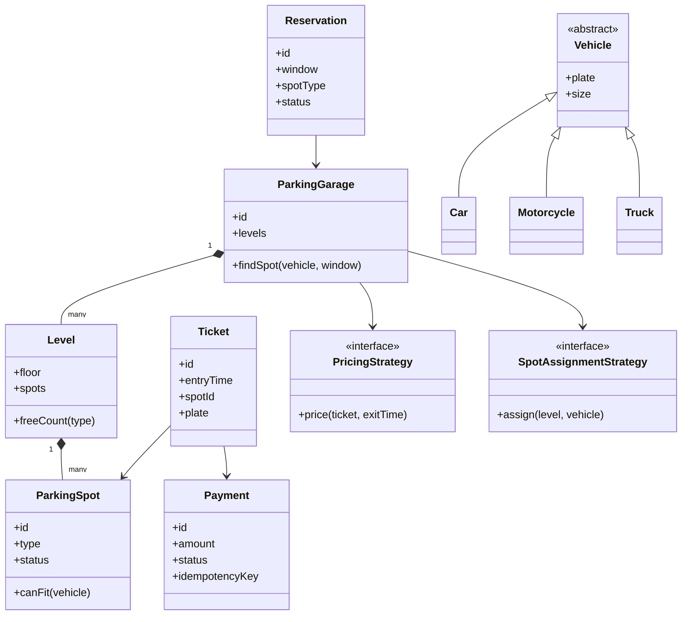
- **Design patterns:**
  - **Strategy** for pricing (hourly, flat event, dynamic) and for spot assignment (nearest to elevator, fill-lowest-level, EV-first).
  - **State** for spot and ticket lifecycles.
  - **Factory** for vehicles and spots.
  - **Observer** to update display boards.
- **Pitfalls:**
  - A global **Singleton** `ParkingLot` hurts testability and multi-garage support. Inject it instead.
  - Deep `Vehicle` inheritance: a `size` enum plus a `canFit` table is often simpler.
- **Fit rules:** motorcycle → any spot; car → compact/regular/large; truck → large only. Allow downgrading a vehicle into a larger spot only when no spot of its own type is free.

### Reservation system
- **Inventory model choice:**
  - **Pooled by spot type** (sell N `REGULAR` slots per time window; assign the physical spot at arrival). Most commercial systems do this, and it's tolerant of early or late arrivals.
  - **Specific spot** (rarer: reserved EV chargers).
- **Pooled capacity check:** count overlapping reservations per type per window. Use time-bucketed counters (15-min slots), or check the max concurrent count over the window. Hold back an **overbooking buffer** or a no-show model.
- **Specific-spot no-overlap**, Postgres exclusion constraint:
  - `EXCLUDE USING gist (spot_id WITH =, during WITH &&)` on a `tstzrange` column (needs the `btree_gist` extension).
  - The DB **rejects overlapping bookings atomically**, with no application locking.
- **Concurrency for pooled counters:** `UPDATE slot_capacity SET reserved = reserved + 1 WHERE garage=$g AND type=$t AND slot BETWEEN $a AND $b AND reserved < capacity`. Check that the updated row count equals the number of slots, or roll back. Alternatively, `SELECT … FOR UPDATE` on the slot rows in a **consistent order** to avoid deadlocks.
- **Holds:** a reservation checkout holds capacity for ~10 min (same TTL pattern as [D3.7](#d37-design-fandangoticketmasterlivenation)).
- **States:** `PENDING_PAYMENT → CONFIRMED → CHECKED_IN → COMPLETED`, plus `CANCELLED` and `NO_SHOW` (release capacity after a grace period).
- **Entry with a reservation:** LPR or QR code at the gate → validate → assign a physical spot via the strategy → open the gate.

### Concurrency on spots (drive-up)
- Two cars at two entry gates must not get the same spot. Assign with a conditional update: `UPDATE spots SET status='OCCUPIED', ticket_id=$t WHERE id=$s AND status='FREE'`, retrying on 0 rows. Or pop from a per-type free list (Redis `SPOP` / DB `SKIP LOCKED`).
- **Physical reality wins:** drivers park in the wrong spot. Use **occupancy sensors / cameras** to reconcile actual vs assigned, and treat the assignment as advisory. Counts drive the display boards.
- **Offline gates:** each gate controller keeps a local cache of reservations and passes, plus a local ticket sequence (prefix = gate ID, so IDs never collide), and syncs when the link returns. It **fails open on exit** (safety) with deferred billing.

### Payments
- Pre-authorize the card at reservation (or take a deposit). **Capture at exit** for the actual amount, which covers overstays.
- Send an `Idempotency-Key` per payment attempt, because exit kiosks retry on timeouts.
- Lost ticket: charge the max daily rate, or use LPR entry-time lookup.
- Monthly passes are subscriptions (recurring billing via the PSP).
- Keep PCI scope small: P2PE terminals at kiosks, hosted fields online. The core system never sees the PAN.
- **Pricing calc:** `ceil(duration / unit) × rate`, capped at the daily max, plus event surcharges. Keep it **deterministic and versioned**, so a dispute can be recomputed with the rate table in force at entry time.

### Interview angles
- "Design the classes" → Start with entities and relationships, then behaviours (`findSpot`, `issueTicket`, `pay`). Name the strategies. Say where concurrency matters (spot assignment, reservations).
- "Prevent double reservation" → Postgres exclusion constraint on a time range, or conditional capacity counters. Don't use read-then-write in app code.
- "Scale to 10K garages?" → Partition by `garage_id` (every operation is garage-local), edge controllers per garage, and a central reservation/payment service. Smart-parking ML (occupancy prediction, dynamic pricing) is in [E5](../E-ai-system-design/E5-smart-car-parking-case-study.md).

## D3.12 Design Amazon.com/Flipkart

### Requirements
- **Functional:**
  - Product catalog: many sellers per product (ASIN → offers).
  - Search with facets and autocomplete.
  - Product detail page (PDP) with price and availability.
  - Cart, checkout, payment, order tracking, returns.
  - Inventory across fulfilment centres (FCs).
  - Recommendations, reviews, deals.
  - **Event-scale peaks** (Prime Day, Flipkart Big Billion Days).
- **Non-functional:**
  - PDP/search p99 < 200–300 ms (Amazon famously links latency to revenue).
  - **Cart always writable.**
  - Checkout correctness (no charge without an order, no oversell beyond tolerance).
  - Multi-region.
  - Peak 5–10× baseline with lightning deals spiking individual items.
- **Scale anchors (AWS's Prime Day 2024 recap):**
  - DynamoDB peaked at **146M requests/s**.
  - Aurora: 6,311 instances ran **376B transactions**.
  - ElastiCache peaked at **over 1T requests/min**.
  - CloudFront peaked at **500M requests/min** (1.3T total).
  - Lambda: 1.3T invocations.
  - **733 FIS (Fault Injection Service) experiments** ran beforehand.

### Capacity estimates
| Item | Assumption | Result |
|---|---|---|
| Catalog | 500M+ products × ~5 KB attributes | ~2.5 TB (images separate, on CDN) |
| Search | 300M DAU × 10 searches | **3B/day ≈ 35K QPS avg, 200K+ peak** |
| PDP views | 300M × 20 | 6B/day ≈ 70K rps avg. Served from cache + CDN-assembled fragments |
| Orders | ~10M/day normal, ~5–10× on event days | 115/s avg, **~2–5K/s peak**, with inventory hot spots on deals |
| Cart ops | 5× orders | Write-heavy KV |

### High-level architecture
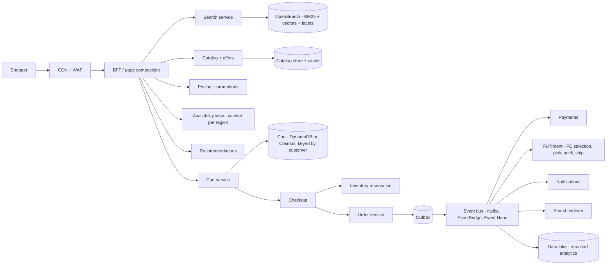

### Catalog search with OpenSearch
- **Index design:**
  - One document per product (or per product-offer group), split per marketplace or locale.
  - Fields: title/brand/bullets (analyzed with stemming and synonyms), category path, attributes (keyword for facets), price/rating/sales rank (numeric, used in ranking), availability flag, embedding vector.
- **Query:**
  1. BM25 lexical retrieval + **k-NN vector** (semantic) retrieval, combined via **hybrid search**. OpenSearch uses a search pipeline with a normalization processor; reciprocal rank fusion (RRF) is the alternative.
  2. Filters on facets.
  3. **Aggregations** compute facet counts.
  4. Re-rank top-K with a **learning-to-rank (LTR)** model on behavioural features (CTR, conversion, availability, delivery speed, sponsored ads).
- **Autocomplete:** an edge-n-gram or completion suggester, with popular prefixes precomputed and cached at the edge.
- **Indexing:** catalog/price/stock change events → indexer → bulk index.
  - Use **partial updates** for price and stock, because a full reindex per price change is too expensive.
  - Use separate fast-changing fields, or join availability at query time from a cache.
  - Reindex with an **alias swap** (blue/green index).
- **Scaling:**
  - Shard count sized to ~10–50 GB per shard. Replicas to scale reads.
  - Separate clusters for search vs analytics. **UltraWarm/cold** tiers only for logs, not product search.
  - k-NN engine: **faiss** or **Lucene**; nmslib is deprecated in recent OpenSearch.
  - Cache hot queries.
- **Azure equivalent:** **Azure AI Search** gives hybrid search (RRF) + **semantic ranker** + vector, with facets and scoring profiles. It's a managed index, so there are fewer knobs than OpenSearch.

### Cart
- **Dynamo heritage:** Amazon's 2007 Dynamo paper used the **shopping cart** as the motivating case. The cart must be "always writeable": accept an add-to-cart even during partitions, and merge divergent versions (union of items, so deleted items can resurface).
  - Today's DynamoDB is a different design ([C6.32–C6.33 caveat](../C-large-scale-architecture/C6-technology-stack.md)).
- **Modern design:**
  - Cart in DynamoDB/Cosmos, keyed by `customer_id` (guest carts keyed by `session_id`, merged at login).
  - Each item stores **price at add-time for display only**. Price and stock are **re-validated at checkout**.
  - TTL on abandoned guest carts.
- **Saved-for-later** and wishlists are separate collections.

### Inventory reservation
- **Model:** `inventory(sku, fc_id) = on_hand, reserved, available = on_hand - reserved`. The PDP shows a **cached, approximate availability** per region ("Only 3 left" is eventual).
- **Reserve at checkout/place-order:** do a conditional decrement on `(sku, fc)`, or over a regional pool. The reservation has a TTL so abandoned checkouts release stock, and it becomes an allocation when payment succeeds. Same pattern as [D3.7](#d37-design-fandangoticketmasterlivenation) holds.
- **Hot SKUs (lightning deals):**
  - Split deal inventory into **N buckets / sub-counters**.
  - Or pre-issue **deal tokens** in a queue.
  - Or put a deal-specific waiting queue in front ("join waitlist").
  - Accept a tiny **oversell tolerance** with cancellation, which can beat a global lock (a business decision).
- **Sourcing:** pick the FC by delivery promise, cost and stock. The promise engine runs before the order is placed, and the final allocation happens asynchronously.

### Order pipeline with events
- **Place order (sync, fast):**
  1. Validate price and promotions.
  2. Reserve inventory.
  3. **Authorize** payment, or defer it (Amazon often charges at shipment).
  4. Write the order `PLACED` + **outbox** row in one transaction.
  5. Return the order ID.
- **Async pipeline (events):** `OrderPlaced → PaymentAuthorized → InventoryAllocated → FulfillmentRequested → Shipped → Delivered`. Each consumer is idempotent and keyed by `order_id`, with per-order ordering via the partition key.
- **Saga orchestration:** Step Functions / Durable Functions / Temporal. **Compensations:** payment failed → release inventory, cancel the order, notify; out of stock at FC → reallocate or split the shipment.
- **Exactly-once effects:** use idempotency keys on payment, dedupe tables on consumers, and the outbox. **Kafka transactions** for stream-to-stream processing.

### Recommendations
- **Item-to-item collaborative filtering** (Amazon's 2003 paper by Linden, Smith and York): precompute similar items offline from co-purchase and co-view data. The online lookup is O(1).
- **Modern stack:**
  1. Candidate generation: co-visitation, two-tower embeddings + ANN.
  2. Ranking model (gradient-boosted trees or deep models) on real-time features from a feature store.
  3. Business rules: in stock, diversity, sponsored placement.
- Batch recs land in a KV store for the PDP and home page. Session-based real-time recs use streaming features.
- Managed options: **Amazon Personalize**, or SageMaker. On Azure, build it on Azure ML (Personalizer is being retired; unverified date).

### Prime Day scaling
- **Plan early:**
  - Forecast peak per service.
  - **Pre-scale** (Auto Scaling warm pools, provisioned concurrency, DynamoDB provisioned/warm throughput, Aurora replicas), and raise quotas weeks ahead.
  - **Capacity reservations** (On-Demand Capacity Reservations for EC2).
- **Prove it:** load tests at 1.5–2× forecast, **GameDays**, and **FIS chaos experiments** (733 in 2024).
- **Architect for blast radius:**
  - **Cell-based architecture**: customers sharded into independent cells, with shuffle sharding.
  - Static stability: the data plane keeps working when the control plane fails.
  - **Load shedding** with priority (checkout over recs).
  - **Brownout** feature flags (turn off personalized widgets).
  - Queue-based load levelling for non-real-time work.
- **Cache warming** and CDN pre-positioning of deal pages. **Change freeze** around the event.

### Security
- Account takeover (ATO) defence: MFA/passkeys, credential-stuffing detection with bot control at the edge, and risk-based step-up at checkout.
- Fraud scoring on orders (Amazon Fraud Detector is being discontinued for new customers (unverified)). Third-party seller vetting.
- PCI scope minimisation through a tokenized payment vault.
- Per-service IAM / workload identity, and encryption everywhere.
- Price-scraping and inventory-hoarding bots: rate limits, cart-hold caps.

### Interview angles
- "How do you show stock on the PDP without hammering inventory?" → A cached, approximate availability view per region, with the authoritative reservation at checkout.
- "Prime Day lightning deal for 10K units, 1M clickers?" → Bucketed counters or a token queue, a deal waitlist, and a reservation TTL. Optionally accept bounded oversell with automated cancellation.
- "Why events after place-order?" → It decouples slow, failure-prone steps (payment, FC allocation, shipping) from the user's latency, with outbox + idempotent consumers + a saga for compensation.
- "OpenSearch or a vector DB?" → OpenSearch does both lexical and vector search (hybrid). Product search still needs BM25 for exact matches on SKUs and brands.

## D3.13 Design Gen AI Systems

### Requirements (RAG chatbot over enterprise documents)
- **Functional:**
  - Chat with streaming answers.
  - **Grounded in company docs with citations.**
  - Per-user **document permissions** respected.
  - Multi-turn memory.
  - Tool use (create ticket, look up order).
  - Feedback (thumbs up/down).
  - Admin: data sources, prompts, model choice.
- **Non-functional:**
  - **TTFT (time to first token) < 1–2 s.**
  - Full answer < 10 s.
  - Hallucination rate within an eval budget.
  - Tenant/data isolation.
  - Per-tenant cost controls.
  - Provider/model failover.
  - Audit logging.
  - Regulated data stays in-region.

### Capacity estimates
| Item | Assumption | Result |
|---|---|---|
| Queries | 1M DAU × 10 queries | 10M/day ≈ **115 QPS avg, ~500 QPS peak** |
| Tokens per query | ~3K system prompt + tools + ~2K retrieved chunks + history, ~500 output | ~**4–6K input + 500 output**, so ~50B input tokens/day |
| Cost lever | Static prefix (system + tools) is ~3K of it | **Prompt caching** bills the cached prefix at the cache-read rate. Cache hits don't count against the input-tokens-per-minute (ITPM) rate limit for some models |
| Corpus | 10M docs × 20 chunks × 1,024-dim float32 | 200M vectors × 4 KB ≈ **800 GB raw vectors**. Consider quantization (int8/binary) or S3 Vectors for the cold tier |
| Throughput | 500 QPS × 5.5K tokens | ~165M tokens/min. Needs **provisioned throughput / PTUs or multi-region pooling**; check per-model TPM quotas |

### Reference architecture
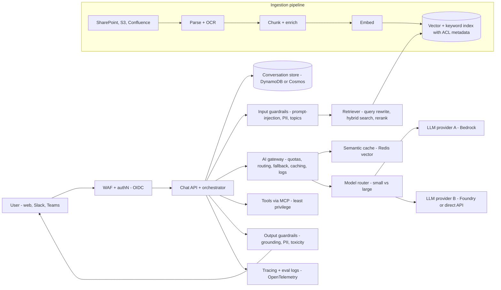

### AI gateway
- One choke point between apps and models.
- **Responsibilities:**
  - AuthN with workload identity.
  - **Per-tenant TPM/RPM quotas** and budgets.
  - Routing and **fallback across regions or providers** (on 429/5xx, honour `Retry-After`).
  - Load balancing across PTU-first then pay-as-you-go deployments.
  - Request/response logging (with redaction).
  - Token metering for chargeback.
  - Caching.
  - A unified API.
- **Azure: API Management AI gateway policies:**
  - `llm-token-limit` (TPM or token quota per counter key, with optional prompt-token pre-estimate).
  - `llm-emit-token-metric`.
  - `llm-semantic-cache-lookup/store` (backed by **Azure Managed Redis**).
  - `llm-content-safety`.
  - Backend pools: round-robin, weighted, **priority**, session-aware, with a **circuit breaker** honouring `Retry-After`.
  - Can govern Bedrock, Vertex and Anthropic Messages APIs and **MCP servers**.
  - Can be attached directly to Foundry (preview).
- **AWS:**
  - No first-party "AI gateway" product. Use API Gateway + Lambda, or the **multi-provider generative AI gateway** guidance (LiteLLM on ECS/EKS).
  - Bedrock-native features cover part of the need: **cross-region inference profiles**, **intelligent prompt routing**, **application inference profiles** for cost tagging.
  - **AgentCore Gateway** turns APIs into MCP tools.
- **Alternatives:** LiteLLM, Kong AI Gateway, Cloudflare AI Gateway, Portkey. Details in [K7](../K-ai-infra-llm/K7-ai-gateways-caching-cost.md).

### Guardrails
- **Input side:**
  - Prompt-injection / jailbreak detection, covering **indirect injection from retrieved docs and tool outputs** too.
  - PII detection and masking.
  - Denied topics.
  - Input length and token caps (a DoS guard).
- **Output side:**
  - **Groundedness/contextual-grounding check** against retrieved sources.
  - PII leakage.
  - Toxicity.
  - Citation presence.
  - Schema validation for tool calls.
- **Amazon Bedrock Guardrails:**
  - Content filters (hate, insults, sexual, violence, misconduct, **prompt attack**).
  - Denied topics, word filters.
  - **Sensitive-info (PII + regex) block or mask.**
  - **Contextual grounding checks** for RAG hallucinations.
  - **Automated Reasoning checks** (logic-rule validation).
  - Usable through **`ApplyGuardrail`** independently of the model, so it works with non-Bedrock models too.
  - Input tagging lets you evaluate only user content.
- **Azure AI Content Safety:**
  - Harm categories with severity scores.
  - **Prompt Shields** for user prompt attacks and **document attacks**.
  - **Groundedness detection.**
  - Protected-material detection.
  - Foundry content filters on deployments.
- **Deterministic controls beat model-based ones for actions:** tool allow-lists, per-user OAuth scopes, human approval for writes. AgentCore Policy (Cedar-compatible) intercepts tool calls. More in [K9](../K-ai-infra-llm/K9-llmops-evals-guardrails.md) and [L4](../L-data-privacy-ai-security/L4-ai-security-threats.md).

### Model router
- **Why:** most queries don't need the biggest model. Routing simple ones to small models cuts cost 3–10× (rough industry range) and lowers latency.
- **Options:**
  - Rules: query classifier, length, tenant tier.
  - An **LLM-based classifier**.
  - Cascade: try small → escalate on low confidence or failed validation.
  - Managed routers.
- **Bedrock intelligent prompt routing:**
  - Routes between **two models of the same family**, predicting response quality per request and using a "response quality difference" threshold against a fallback model.
  - Default routers use Nova/Llama families.
  - Optimized for **English prompts only**, and can't learn from your app's performance data.
- **Foundry model router:**
  - A trained router deployed **as one model deployment**.
  - Modes: **Balanced** (default; picks the cheapest model within ~1–2% of the best quality), **Cost** (~5–6% band), **Quality**.
  - **Model subsets** for compliance, plus **automatic failover**.
  - Routes across OpenAI, Anthropic (Claude must be deployed separately first), xAI, DeepSeek, Meta.
  - **Context window = the smallest underlying model's.**
  - Prompt-cache benefit only when the same model serves consecutive turns (session affinity in preview).
- **Gotchas:**
  - Routing breaks **prompt-cache locality**.
  - Responses vary in style across models.
  - Evals must cover each route.

### Retrieval and vector store
- **Ingestion:**
  1. Parse (layout-aware, tables, OCR).
  2. Chunk at ~300–800 tokens with overlap (or structure-aware, hierarchical parent/child).
  3. Enrich with metadata (source, ACL principals, timestamps).
  4. Embed with a **versioned embedding model**, and **re-embed everything** when you change models (blue/green index).
  5. Sync incrementally via change events, and propagate deletes.
- **Query time:**
  1. Query rewrite / multi-query.
  2. **Hybrid (BM25 + vector)** with metadata filters, including **ACL security trimming** where the user's groups become a filter.
  3. **Rerank** top-50 → top-5.
  4. Assemble context with citations.
  - Chunking and GraphRAG depth are in [E1.9](../E-ai-system-design/E1-system-design-fundamentals.md#e19-rag-chunking-and-retrieval-strategies) and [E1.10](../E-ai-system-design/E1-system-design-fundamentals.md#e110-graphrag-knowledge-graphs-for-advanced-retrieval).
- **Stores:**
  - **Bedrock Knowledge Bases** support OpenSearch Serverless and managed clusters (only these support **binary vectors**), **S3 Vectors** (cheap, sub-second, best for infrequent queries, float only), Aurora PostgreSQL pgvector (HNSW; enable iterative scans for filtered queries), Neptune Analytics (GraphRAG), Pinecone, Redis Enterprise Cloud, MongoDB Atlas.
  - On Azure: **Azure AI Search** (hybrid + RRF + semantic ranker + integrated vectorization), Cosmos DB vector search, PostgreSQL pgvector.
  - Deep dive in [K2](../K-ai-infra-llm/K2-embeddings-vector-databases.md) and [K3](../K-ai-infra-llm/K3-rag-pipelines.md).

### Prompt caching vs semantic caching
- **Prompt (prefix) caching** is done by the provider and reuses the KV-cache of an **identical prompt prefix**.
  - Put **static content first** (tools → system → long docs), then dynamic content.
  - **Bedrock specifics:**
    - Explicit `cachePoint` checkpoints, up to **4** per request for Claude.
    - The minimum prefix is **512–4,096 tokens depending on model**.
    - **TTL 5 min (reset on each hit), 1 h optional** on supported Claude models.
    - Cache writes may cost more than base input, and reads are discounted.
    - The order is `tools → system → messages`, and changing an earlier section invalidates the later ones.
  - **Exact-match safe:** the answer is still freshly generated.
- **Semantic caching** is done by the app or gateway. It returns a **previous answer** when a new query's embedding is within a similarity threshold (APIM `llm-semantic-cache-*`, Redis vector).
  - **Risk:** it returns wrong or stale answers for "similar but different" questions and can **leak across users**.
  - Scope the cache key by tenant + ACL set + model + prompt version. Use a high threshold and a short TTL. Only use it for FAQ-like, non-personalized queries.

### Evals and observability
- **Offline evals:**
  - Use a golden dataset (questions, expected answers, gold passages).
  - Retrieval metrics: recall@k, MRR.
  - **RAG triad:** context relevance, **groundedness/faithfulness**, answer relevance. Plus task success, safety, citation accuracy.
  - Score with an **LLM-as-judge** calibrated against human labels.
  - Run evals as **CI gates** on every prompt, model, chunking or index change.
- **Online:**
  - User feedback, A/B tests of prompts and models, and sampled LLM-judge scoring of production traces.
  - Drift dashboards.
  - Cost, latency (TTFT, tokens/s), cache hit rate, guardrail intervention rate.
- **Tooling:**
  - **Tracing:** OpenTelemetry GenAI semantic conventions.
  - **AWS:** Bedrock model evaluation and KB/RAG evaluation, AgentCore Observability and **AgentCore Evaluations**.
  - **Azure:** Foundry evaluations + tracing (Application Insights).
  - **Open source / SaaS:** Ragas, Promptfoo, Langfuse, Arize.

### Bedrock vs Microsoft Foundry
| Capability | Amazon Bedrock | Microsoft Foundry (renamed from Azure AI Studio → Azure AI Foundry) |
|---|---|---|
| Models | Anthropic Claude, Amazon Nova, Meta Llama, Mistral, Cohere, OpenAI open-weight & others; cross-region inference profiles | 10,000+ catalog incl. Azure OpenAI, Anthropic Claude, Meta, Mistral, xAI, DeepSeek; Global / Data Zone / regional deployments |
| Capacity | On-demand quotas, **Provisioned Throughput** | Standard quotas, **PTU** (provisioned throughput units) |
| RAG | **Knowledge Bases** (managed ingest + vector stores, GraphRAG via Neptune) | Azure AI Search integration, Foundry IQ/knowledge tools (verify naming) |
| Safety | **Guardrails** (+ `ApplyGuardrail`, contextual grounding, Automated Reasoning) | **Content filters**, Content Safety, Prompt Shields, groundedness |
| Routing | Intelligent prompt routing (same family) | **Model router** (cross-provider, modes, subsets) |
| Caching | Prompt caching (explicit checkpoints, 5 min / 1 h TTL) | Prompt caching (automatic for supported models), APIM semantic cache |
| Agents | **AgentCore** (Runtime, Gateway, Memory, Identity, Policy, Observability, Evaluations, Code Interpreter, Browser); Bedrock Agents | **Foundry Agent Service** (prompt agents, hosted agents; Responses API = Agents v2) |
| Gateway | DIY (API Gateway / LiteLLM) | **APIM AI gateway** (token limits, semantic cache, LB, MCP) |
| Network | PrivateLink VPC endpoints; data not used to train models | Private Endpoints, managed VNet; data not used to train models |
- **Naming as of 2026:**
  - **Azure AI Studio → Azure AI Foundry → Microsoft Foundry.**
  - "Azure AI Services" → **Foundry Tools**.
  - Hub-based projects now live in **Foundry (classic)**. New investment goes to Foundry projects on a single **Foundry resource**.
  - The Assistants API is replaced by the **Responses API (Agents v2)**.
- Platform deep dive: [K6](../K-ai-infra-llm/K6-managed-model-platforms.md). Serving internals (KV cache, batching): [K4](../K-ai-infra-llm/K4-llm-serving-inference.md). Agents and MCP: [K8](../K-ai-infra-llm/K8-agents-tool-use-mcp.md).

### Security
- Use the **OWASP Top 10 for LLM Applications (2025)** as the checklist:
  - LLM01 prompt injection.
  - LLM02 sensitive information disclosure.
  - LLM05 improper output handling.
  - LLM06 excessive agency.
  - LLM07 system prompt leakage.
  - **LLM08 vector and embedding weaknesses.**
  - LLM10 unbounded consumption.
- **Controls:**
  - ACL trimming at retrieval. The model must **never** see docs the user can't.
  - Tenant-partitioned indexes or a mandatory tenant filter.
  - Treat retrieved text and tool output as **untrusted data**.
  - Sanitize markdown/HTML output to block exfiltration via image URLs.
  - Least-privilege tools with user-delegated OAuth.
  - Human-in-the-loop for destructive actions.
  - Token and cost caps per user.
  - Private connectivity (PrivateLink / Private Endpoint).
  - Prompt and response logs with PII redaction and retention limits.
  - Data residency through regional or Data Zone deployments.
- Details: [L4 AI security threats](../L-data-privacy-ai-security/L4-ai-security-threats.md), [L5 Model & data governance](../L-data-privacy-ai-security/L5-model-data-governance.md).

### Interview angles
- "Walk me through a RAG request" → AuthN → input guardrail → query rewrite → hybrid retrieval with ACL filter → rerank → prompt assembly (static prefix cached) → gateway (quota, route, fallback) → LLM stream → output grounding check → cite + log trace.
- "How do you know it's good?" → A golden-set offline eval with the RAG triad gating CI, online feedback + sampled LLM-judge, and guardrail metrics. "Vibes" isn't an answer.
- "Cut cost 50%?" → Prompt caching of the static prefix, a model router/cascade, fewer and better chunks (rerank), output length caps, batch for offline jobs, a semantic cache only for safe FAQ queries, and PTU vs on-demand math.
- "Provider outage?" → Gateway fallback to another region or provider with a prompt template per model, evals per route, and circuit breakers.
- Pitfall: semantic caching across users, or skipping ACL filtering. Both are data-leak findings.

## Diagrams

### Video upload → publish (D3.2)
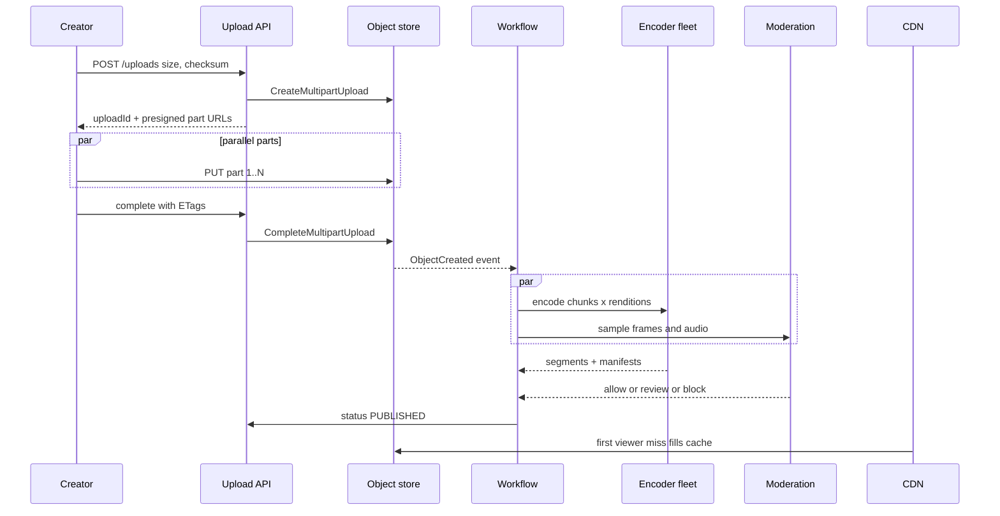

### Chat message with receipts (D3.4)
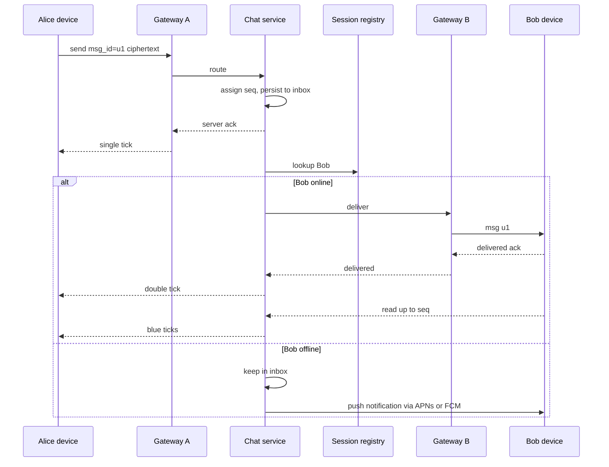

### Hybrid timeline fan-out (D3.3)
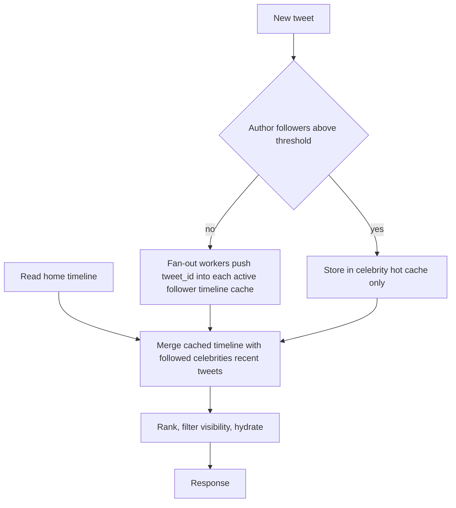

## Cloud mapping: AWS vs Azure

| Capability | AWS | Azure | Role it plays | Key differences | Alternatives |
|---|---|---|---|---|---|
| Object storage + multipart | S3 (multipart, presigned URLs, Transfer Acceleration) | Blob Storage (block blobs, SAS, Put Block List) | Raw uploads, renditions, images | S3 10K parts / 5 GiB parts; Blob 50K blocks; SAS vs presign semantics | GCS, Cloudflare R2 (no egress fees), MinIO |
| Storage tiering | S3 Intelligent-Tiering, Glacier IR / Flexible / Deep Archive, lifecycle rules | Hot / Cool / Cold / Archive, lifecycle mgmt, Smart tier | Cut long-tail storage cost | Azure archive: rehydrate ≤15 h, no ZRS, lifecycle can't rehydrate; S3 IT has no retrieval fees but ignores objects under 128 KB | R2 + infrequent access class |
| Video transcoding | Elemental MediaConvert (+ MediaPackage, IVS for live) | **None first-party since Azure Media Services retired 30 Jun 2024**; partners (Bitmovin, MediaKind, Ravnur) or FFmpeg on AKS/Batch | Bitrate ladder, HLS/DASH/CMAF, DRM | Biggest asymmetry in this file | Mux, Cloudflare Stream, Bitmovin, self-hosted FFmpeg on Kubernetes |
| Content moderation | Rekognition (image + async stored video), A2I human review | Azure AI Content Safety (text/image), Azure AI Video Indexer for video | Adult/violent content gates | Rekognition has native video moderation; Content Safety needs frame extraction; neither does CSAM (use hash matching) | Hive, Google Cloud Vision SafeSearch, Claude/Gemini vision models for policy review |
| CDN / edge | CloudFront (Origin Shield, OAC, signed URLs/cookies, Functions) | Azure Front Door Std/Premium (classic Azure CDN offerings retiring) | Video/image delivery, WAF at edge | CloudFront signed cookies are first-class; Front Door relies on SAS/Private Link origin + rules | Cloudflare, Akamai, Fastly, Netflix Open Connect (private) |
| API front door | API Gateway (REST/HTTP/WebSocket), ALB, NLB | API Management, Application Gateway, Azure Load Balancer | AuthN, rate limit, routing | APIM tiers differ in VNet support; API GW WebSocket 2 h limit | Kong, Envoy, NGINX |
| Real-time WebSocket | API Gateway WebSocket APIs, AppSync Events, or NLB + EC2/EKS | Azure Web PubSub (1M conns/resource), SignalR Service | Chat, presence, live location | API GW: 500 new conns/s default, 2 h max, 10 min idle; Web PubSub Premium adds geo-replication | Self-hosted Erlang/Elixir/Go gateways, Ably, Pusher |
| KV / wide-column | DynamoDB (global tables, TTL), Keyspaces | Cosmos DB (NoSQL API, multi-region writes, TTL), Cosmos DB for Apache Cassandra / Managed Instance for Cassandra | Tweets, inboxes, swipes, profiles | DynamoDB RCU/WCU vs Cosmos RU/s; Cosmos 20 GB logical partition limit; 5 consistency levels in Cosmos | ScyllaDB, Cassandra, Bigtable |
| Relational / sharded SQL | Aurora, RDS (+ RDS Proxy) | Azure DB for PostgreSQL/MySQL Flexible Server, Azure SQL Hyperscale, Cosmos DB for PostgreSQL (Citus) | Accounts, metadata, payments | Citus on Azure is managed sharding; on AWS shard yourself or use Aurora Limitless (Postgres) | Vitess/PlanetScale, Spanner, CockroachDB |
| In-memory cache | ElastiCache (Redis OSS / Valkey / Memcached), MemoryDB (durable) | Azure Managed Redis (successor), Azure Cache for Redis (being retired, timeline unverified) | Timelines, decks, presence, session registry, geo | MemoryDB = durable multi-AZ log; Managed Redis has Redis Enterprise modules | Self-hosted Redis/Valkey, Dragonfly |
| Event streaming | Kinesis Data Streams, MSK | Event Hubs (Kafka protocol endpoint) | Fan-out, location firehose, trends | Event Hubs speaks Kafka without brokers to manage; MSK is real Kafka | Confluent Cloud, Redpanda |
| Stream processing | Amazon Managed Service for Apache Flink (ex-Kinesis Data Analytics) | Azure Stream Analytics, Databricks Structured Streaming | Trending windows, surge pricing | ASA is SQL-like and serverless; Flink has richer event-time state | Confluent Flink, Databricks |
| Search | Amazon OpenSearch Service | Azure AI Search (ex-Cognitive Search) | Video/tweet search, geo search | OpenSearch = self-tuned cluster; AI Search = managed index with vector + semantic ranker | Elastic Cloud, Algolia |
| Workflow / fan-out | Step Functions (Distributed Map), SQS, Lambda | Durable Functions, Logic Apps, Service Bus, Functions | Transcode DAG, moderation gates | Durable Functions = code-first orchestration; Step Functions = ASL state machines | Temporal, Airflow, Argo Workflows |
| Mobile push | SNS mobile push (APNs/FCM) | Azure Notification Hubs | Offline delivery, match alerts | Both wrap APNs/FCM; Notification Hubs has tags/templates | Firebase Cloud Messaging direct, OneSignal |
| Geo / maps | Amazon Location Service | Azure Maps | Geocoding, routing, geofences | Neither replaces an in-memory H3/S2 supply index at Uber scale | H3/S2 libraries, PostGIS, Google Maps Platform |
| ML recs | SageMaker, Personalize | Azure Machine Learning (Azure AI Personalizer is being retired, unverified date) | Tinder ranking, video recs | Personalize is turnkey recsys; on Azure build with Azure ML | Databricks, Vertex AI |
| Identity | Cognito | Entra External ID (Azure AD B2C closed to new customers 2025) | Consumer sign-in | Check B2C migration status | Auth0, Okta CIC |
| Malware scan of uploads | GuardDuty Malware Protection for S3 | Defender for Storage malware scanning | Reject infected uploads | Both are event-driven on object create | ClamAV in pipeline |

- **Media is the biggest gap:** AWS has a first-party media stack (MediaConvert/MediaPackage/MediaLive/IVS). Azure exited first-party media in 2024, so Azure designs use Marketplace partners or self-managed FFmpeg on AKS/Batch with Front Door. Say so explicitly in interviews.
- **Moderation:** Rekognition handles stored video asynchronously (SNS completion). Content Safety is text/image with severity scores and RPS quotas (S0: 1000 req per 10 s), so video needs frame sampling or Video Indexer. Pair either with human review and CSAM hash matching.
- **CDN signing:** CloudFront signed URLs/cookies with trusted key groups plus OAC is the canonical private-media pattern. On Azure, combine short-lived **user-delegation SAS** (≤ 7 days) or app-issued tokens with Front Door Private Link origins.
- **Data stores:** DynamoDB and Cosmos DB are both partitioned KV with global replication. Cosmos offers five consistency levels and multi-region writes as a setting; DynamoDB global tables are multi-active with last-writer-wins (plus newer multi-Region strong consistency option; verify availability).
- **WebSockets:** API Gateway WebSocket quotas (2 h max, 10 min idle, 500 new conns/s) push very large chat systems to self-managed gateways behind NLB. Azure Web PubSub scales to 1M concurrent connections per resource with Premium geo-replication.
- **Renamed or retired (as of 2026):**
  - Kinesis Data Analytics → Amazon Managed Service for Apache Flink.
  - Azure Cognitive Search → Azure AI Search.
  - Azure Media Services → retired June 2024.
  - Azure CDN (Edgio) → retired January 2025.
  - Azure AD B2C → Entra External ID for new customers.
  - Azure Cache for Redis → Azure Managed Redis.

## Cross-links
- [D1 System design basics](../D-system-design/D1-system-design-basics.md): microservices, LB vs gateway, [D1.9 sync vs event-driven](../D-system-design/D1-system-design-basics.md#d19-synchronous-vs-event-driven-architectures), [D1.13 WebSockets](../D-system-design/D1-system-design-basics.md#d113-websockets-for-server-to-client-communication), [D1.21 consistent hashing](../D-system-design/D1-system-design-basics.md#d121-consistent-hashing), [D1.22 sharding](../D-system-design/D1-system-design-basics.md#d122-database-sharding), [D1.25 CAP](../D-system-design/D1-system-design-basics.md#d125-cap-theorem)
- [D2 Reusable parts of system design](../D-system-design/D2-reusable-parts-of-system-design.md): TLS, firewalls, reusable components
- [B6 Database sharding](../B-database-engineering/B6-database-sharding.md) (B6.2 consistent hashing), [B8 Replication](../B-database-engineering/B8-database-replication.md), [B9 Database system design](../B-database-engineering/B9-database-system-design.md)
- [C1 Performance](../C-large-scale-architecture/C1-performance.md) (C1.26–C1.30 caching), [C2 Scalability](../C-large-scale-architecture/C2-scalability.md), [C4 Security](../C-large-scale-architecture/C4-security.md), [C6 Technology stack](../C-large-scale-architecture/C6-technology-stack.md) (C6.15 CDN; C6.32–C6.33 Dynamo-style gossip, relevant to Ringpop)
- [A7 Socket management](../A-operating-systems/A7-socket-management.md): epoll and connection limits for WebSocket gateways
- [H4 TLS](../H-full-stack-troubleshooting/H4-transport-layer-security.md), [H6 Web application architecture](../H-full-stack-troubleshooting/H6-web-application-architecture.md) (H6.12 CDN)
- [E4 Facebook content moderation case study](../E-ai-system-design/E4-facebook-content-moderation-case-study.md): ML moderation depth
- [M4 Kafka at scale](../M-data-platforms/M4-kafka-at-scale.md), [M5 Stream processing](../M-data-platforms/M5-stream-processing.md): trending, location firehose
- [L1 Data classification & PII](../L-data-privacy-ai-security/L1-data-classification-pii.md), [L2 Encryption & key management](../L-data-privacy-ai-security/L2-encryption-key-management.md): location/dating data, E2E vs at-rest
- [J5 Capacity planning & load testing](../J-sre/J5-capacity-planning-load-testing.md): back-of-envelope method

## Sources
- https://docs.aws.amazon.com/AmazonS3/latest/userguide/qfacts.html (multipart limits)
- https://docs.aws.amazon.com/AmazonS3/latest/userguide/intelligent-tiering-overview.html
- https://docs.aws.amazon.com/AmazonS3/latest/userguide/using-presigned-url.html
- https://docs.aws.amazon.com/AmazonCloudFront/latest/DeveloperGuide/PrivateContent.html
- https://docs.aws.amazon.com/mediaconvert/latest/ug/what-is.html
- https://docs.aws.amazon.com/rekognition/latest/dg/moderation.html
- https://docs.aws.amazon.com/apigateway/latest/developerguide/apigateway-execution-service-websocket-limits-table.html
- https://learn.microsoft.com/en-us/azure/storage/blobs/access-tiers-overview
- https://learn.microsoft.com/en-us/previous-versions/azure/media-services/latest/azure-media-services-retirement
- https://learn.microsoft.com/en-us/azure/ai-services/content-safety/overview
- https://learn.microsoft.com/en-us/azure/azure-web-pubsub/overview
- https://openconnect.netflix.com/en/
- https://www.uber.com/blog/h3/
- https://www.uber.com/blog/schemaless-part-one-mysql-datastore/
- https://www.uber.com/blog/ringpop-open-source-nodejs-library/
- https://ringpop.readthedocs.io/en/latest/architecture_design.html
- https://signal.org/docs/
- https://github.com/twitter/the-algorithm (README component list)
