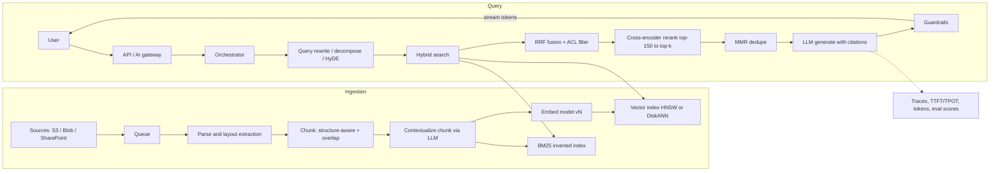
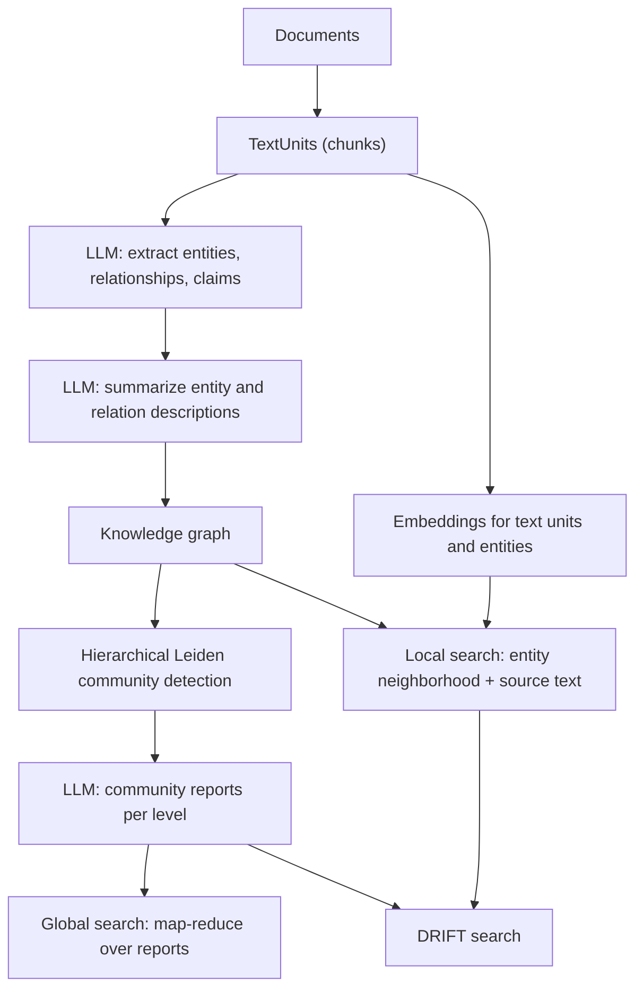
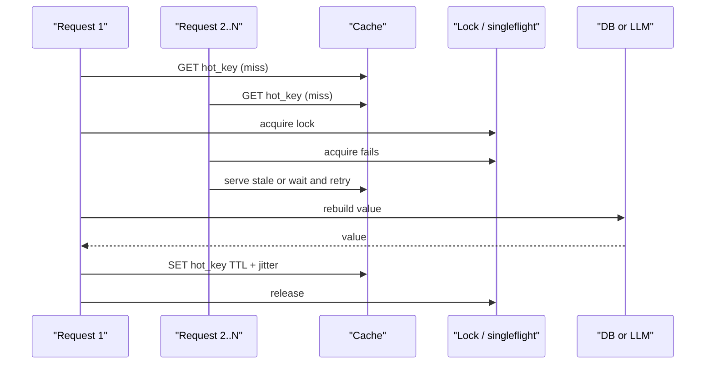

# E1 System Design Fundamentals
> Last verified: 2026-10 · Audience: senior/staff DevOps, SRE, AI eng, NetEng, DevSecOps, architects

## TL;DR
- **AI system design = traditional system design + a probabilistic core.** You still need LBs, caches, queues, sharding, SLOs, but you add **non-determinism**, **data/model drift**, **eval-driven releases**, **GPU cost per token**, and **token-level latency budgets (TTFT / TPOT)**.
- Latency for LLM features is two numbers, not one: **TTFT** (prefill, compute-bound, grows with prompt length) and **TPOT/ITL** (decode, memory-bandwidth-bound). End-to-end ≈ `TTFT + TPOT × (output_tokens − 1)`.
- Caching in AI systems has the classic failure modes (**penetration, breakdown, avalanche**) plus new layers: **prompt/prefix (KV) caching** and **semantic caching**.
- Start as a **modular monolith**; split out services where scaling profiles differ. The classic split in AI is **CPU app tier vs GPU inference tier**, since they scale, deploy and fail differently.
- Containers + **immutable image digests + GitOps (Argo CD / Flux)** are the default delivery path. Model weights usually **do not** belong in the image.
- Canonical AI components are **API/AI gateway → orchestrator → model serving**, with a **vector DB / search index**, **feature store**, **queue** for async/batch, and **observability that includes evals, token spend and traces**.
- RAG quality is mostly a retrieval problem. Combine **structure-aware chunking**, **hybrid BM25 + dense** retrieval, a **reranker**, and **contextual retrieval**. Anthropic reported that contextual embeddings + contextual BM25 + reranking cut top-20 retrieval failures by **67%**.
- **GraphRAG** builds an entity graph plus **Leiden community summaries** so it can answer **global** "what are the themes" questions that vector RAG can't. The price is a much higher **LLM indexing cost**. On AWS it is managed via **Bedrock Knowledge Bases + Neptune Analytics**. Azure has no first-party one-click GraphRAG.

---

## E1.1 Introduction to System Design (traditional vs AI system design)
- **How it works:**
  - Traditional design is **deterministic**: the same input gives the same output. Correctness is checked by unit and integration tests, and the cost driver is CPU, RAM and IOPS.
  - AI design adds a component whose output is a **distribution**. Correctness is statistical and measured by **evals** (golden sets, LLM-as-judge, human review). The cost driver is **GPU-hours or tokens**.
- **Key differences table:**

| Dimension | Traditional | AI / LLM system |
|---|---|---|
| Output | Deterministic | Stochastic (temperature, sampling). Even `temperature=0` is not bit-exact across batch sizes and hardware |
| Testing | Unit/integration, pass/fail | **Eval suites**, regression on golden sets, score thresholds, A/B tests |
| Failure mode | Crash, error, timeout | **Silent quality failure**: hallucination, refusal, format drift, prompt injection |
| Change sources | Code, config | Code, config, **prompt, model version, data, embeddings, index** |
| Drift | Rare (schema change) | **Data drift** (input distribution shifts), **concept drift** (the label relationship shifts), **model drift** (provider updates or deprecates a model) |
| Latency SLO | p50/p99 request latency | **TTFT**, **TPOT/ITL**, tokens/s, end-to-end. Streaming changes how latency is perceived |
| Capacity unit | RPS, CPU % | **Tokens/s**, concurrent sequences, **KV-cache memory**, GPU utilisation |
| Cost | Mostly fixed infra | **Variable per request** (input + output tokens), and output tokens usually cost several times more than input |
| Scaling | Horizontal, cheap and fast | GPUs are scarce, slow to cold-start (pulling weights takes minutes), quota-bound |

- **Token latency budget (memorise):**
  - **TTFT** (time to first token) = queueing + network + **prefill**. Prefill is compute-bound and scales roughly linearly with prompt tokens. Prefix/prompt caching and shorter context reduce it.
  - **TPOT / ITL** (time per output token / inter-token latency) = **decode**. Decode is memory-bandwidth-bound because each step reads the weights plus the KV cache. Bigger batches raise throughput and also raise TPOT.
  - Example budget: chat UX wants TTFT under about 1 s and a stream faster than reading speed (about 10–20 tok/s or more). At TTFT 500 ms and TPOT 30 ms, a 400-token answer takes about 12.5 s end to end, so **stream**.
- **Trade-offs / when to use:**
  - Use an LLM where fuzziness is acceptable or valuable: summarisation, extraction, classification with a human or a guardrail behind it. Keep deterministic code for money, auth and anything with invariants.
  - Small, distilled or classical models are often 10–100x cheaper. Use a **model cascade/router**: cheap model first, escalate to a larger one.
- **Interview angles:**
  - If asked "what is different about designing an AI system?", name **non-determinism → evals**, **drift → monitoring and retraining/re-indexing**, **GPU/token cost → caching, routing, batching**, and **TTFT/TPOT → streaming and prefill optimisation**.
  - Pitfall: quoting only p99 request latency for an LLM endpoint. Interviewers expect TTFT and TPOT separately.
  - Follow-up: "How do you roll out a new model version?" Answer with an offline eval gate, then shadow/canary on a slice, compare quality, latency and cost, then promote. Pin model versions and treat a prompt change as a deploy. See [K9](../K-ai-infra-llm/K9-llmops-evals-guardrails.md).

## E1.2 Core Principles of System Design (scalability, availability, reliability, performance)
- **How it works (brief; depth in C2/C3):**
  - **Scalability:** horizontal scaling of stateless tiers, partitioning of stateful tiers. See [C2 Scalability](../C-large-scale-architecture/C2-scalability.md).
  - **Availability:** the fraction of time the system serves requests. Serial dependencies multiply, so two 99.9% services in series give about 99.8%. Redundancy across AZs/regions recovers it.
  - **Reliability:** the system serves *correct* results over time. Use retries with jitter, timeouts, circuit breakers, bulkheads and idempotency. See [C3 Reliability](../C-large-scale-architecture/C3-reliability.md).
  - **Performance:** latency (p50/p95/p99) and throughput. See [C1 Performance](../C-large-scale-architecture/C1-performance.md).
- **AI twists:**
  - **Scalability:** GPU capacity is quota- and supply-bound. Plan **provisioned throughput or reserved capacity** for the baseline and on-demand or cross-region inference for bursts.
  - **Availability:** an LLM provider is an external dependency with **429 rate limits**. Use multi-model/multi-region fallback through an AI gateway ([K7](../K-ai-infra-llm/K7-ai-gateways-caching-cost.md)).
  - **Reliability:** "200 OK but wrong" counts as a reliability failure. Add an **eval-based SLI**, such as groundedness rate or JSON-schema-valid rate ([J1](../J-sre/J1-slis-slos-error-budgets.md)).
  - **Performance:** optimise TTFT (prompt caching, smaller context) separately from TPOT (quantisation, speculative decoding, batching). See [K4](../K-ai-infra-llm/K4-llm-serving-inference.md).
- **Interview angles:** for "design for 99.95%", give the AZ/region math, name your dependencies' SLAs, add graceful degradation (fall back to a smaller model, cached answer, or search results without generation).

## E1.3 Introduction to AI System Design
- **How it works:** the typical lifecycle is **problem framing → data → features/embeddings → model (train, fine-tune or buy an API) → evaluation → serving → monitoring → feedback loop**.
  - **Framing:** pick the business metric (CTR, deflection rate) and the ML proxy metric (AUC, recall@k, groundedness), and define the cost of FP vs FN.
  - **Build vs buy:** hosted FM API (Bedrock / Microsoft Foundry Models), fine-tuned FM, or self-hosted open weights on GPUs (vLLM/TGI on EKS/AKS).
  - **Online vs batch inference:** online is used for interactive work with latency SLOs. Batch is for scoring and embedding backfills, and batch APIs are typically about 50% cheaper.
  - **Feedback loop:** log prompts, outputs, retrieved context and user feedback, with PII handling ([L1](../L-data-privacy-ai-security/L1-data-classification-pii.md)), to feed evals and retraining.
- **Naming note:** **Azure AI Studio → Azure AI Foundry → Microsoft Foundry**. As of 2026, Learn docs use "Microsoft Foundry" and "Foundry (new)" portal.
- **Trade-offs / when to use:**
  - Choose **prompting + RAG** for knowledge that changes, **fine-tuning** for style/format or narrow tasks, and **classical ML** for tabular prediction such as CTR (E2).
- **Interview angles:**
  - Always state the **eval plan and the monitoring plan** up front, which is the senior signal.
  - Discuss **drift detection**: input distribution stats (PSI/KL), embedding centroid shift, falling online feedback scores, provider model deprecation dates.
  - Pitfall: designing the serving tier first and forgetting data and labels.

## E1.4 Databases in System Design (cache miss, cache breakdown, sharding)
- **How it works: cache miss types:**
  - **Compulsory (cold)**, **capacity** (evicted under LRU/LFU), **conflict/invalidation** (TTL expired or key invalidated).
  - Patterns: **cache-aside** (the most common), read-through, write-through, write-behind. See [C1 caching](../C-large-scale-architecture/C1-performance.md) and the D1/C6 caching IDs.
- **The three named cache disasters:**

| Problem | What happens | Fixes |
|---|---|---|
| **Cache penetration** | Requests for keys that **don't exist** in cache *or* DB (often malicious) all hit the DB | **Cache null/negative results** with short TTL. **Bloom filter** in front. Input validation and rate limiting |
| **Cache breakdown** (hotspot invalid / thundering herd on one key) | A **single hot key** expires and thousands of concurrent misses stampede the DB | **Mutex/singleflight** (one rebuilder, others wait or serve stale). **Logical expiry**: never physically expire, refresh asynchronously. Probabilistic early refresh |
| **Cache avalanche** | **Many keys expire at once** (same TTL) or the cache cluster dies, so the DB is overwhelmed | **TTL jitter**. Multi-level cache (local + Redis). HA cache (replicas, cluster). Circuit breaker or rate limit to the DB. Pre-warm |

- **AI-specific caching layers:**
  - **Exact-match response cache:** key on a hash of `(model, prompt, params)`. Only safe for deterministic or low-temperature calls.
  - **Semantic cache:** embed the query and serve a cached answer if cosine similarity is above a threshold. Too low a threshold returns **wrong answers**, so tune per domain and scope keys by tenant/ACL.
  - **Prompt/prefix (KV) caching** at the provider: it cuts TTFT and input cost on repeated system prompts and documents. See [K7](../K-ai-infra-llm/K7-ai-gateways-caching-cost.md).
  - **Embedding cache:** do not re-embed unchanged chunks. Key on content hash plus embedding-model version.
- **Sharding (summary; depth in [B6](../B-database-engineering/B6-database-sharding.md), [B5](../B-database-engineering/B5-database-partitioning.md)):**
  - Range, hash and directory/lookup sharding. **Consistent hashing** limits rebalancing. Watch for hot shards, cross-shard joins and transactions, and resharding cost.
  - **Vector DB sharding:** ANN indexes (HNSW/DiskANN/IVF) shard by tenant or by hash. A query fans out to all shards and **merges top-k**, so tail latency equals the slowest shard. **Tenant-per-index or partition** gives isolation and simplifies deletes.
- **DB choices in AI systems:** OLTP (Postgres/Aurora/Azure SQL) for app state and chat history. **KV/document** (DynamoDB/Cosmos DB) for sessions and conversation turns. **Vector store** (pgvector, OpenSearch, Azure AI Search, Cosmos DB vector, S3 Vectors). **Feature store** for ML features. **Object store** for docs and model artifacts.
- **Interview angles:**
  - If asked "the cache expired and the DB fell over", ask whether it was one key (breakdown → singleflight) or many keys (avalanche → jitter). If the keys never exist, it is penetration → Bloom filter or null caching.
  - Semantic cache follow-up: "How do you prevent leaking user A's answer to user B?" Partition the cache by tenant or ACL, and never semantic-cache personalised responses.

## E1.5 Monolithic Architecture Fundamentals
- **How it works:** a single deployable unit with one codebase and usually one DB. Modules call each other in-process.
- **Pros:** simple to build, test, debug and deploy; ACID transactions across modules; no network hops; low ops overhead. Ideal for an MVP or small team.
- **Cons:** scaling is all-or-nothing, coupling grows over time, one bad deploy breaks everything, a single tech stack, and long builds.
- **Modular monolith:** enforce module boundaries (packages, internal APIs, separate schemas) so you can extract services later. This is often the right answer in 2026.
- **AI angle:** putting **GPU inference inside the web monolith** is the classic anti-pattern. It forces GPU nodes for CPU work and couples deploys, so split the inference tier even when the rest stays a monolith.
- **Interview angles:** "Monolith first, unless team topology or divergent scaling profiles force a split". Cite Conway's law.

## E1.6 Microservices Architecture Fundamentals
- **How it works:** independently deployable services, each owning its **own data**, communicating via sync (REST/gRPC) or async (events/queues). Supporting pieces are an API gateway, service discovery, a service mesh (mTLS, retries) and distributed tracing.
- **Trade-offs:**

| | Monolith | Microservices |
|---|---|---|
| Deploy | One unit | Independent, per team |
| Scaling | Whole app | Per service (e.g. GPU pool vs CPU API) |
| Data consistency | ACID | **Eventual**; sagas or outbox pattern |
| Failure | Process-wide | Partial; needs timeouts, circuit breakers, bulkheads |
| Ops cost | Low | High (CI/CD per service, observability, mesh) |
| Latency | In-process | Network hops add up (fan-out amplifies p99) |

- **AI decomposition example:** `api-gateway` → `chat-orchestrator` (CPU, stateless) → `retrieval-svc` (vector DB) → `inference-svc` (GPU, vLLM). Separate `ingestion-workers` (queue-driven chunk/embed), `eval-svc`, and `feedback-svc`.
- **Interview angles:**
  - Pitfalls: a **distributed monolith** (services that must deploy together), a shared DB across services, chatty sync call chains, and no idempotency on retries.
  - Fan-out p99: if a request calls 10 services, each with a 1% chance of being slow, about 10% of requests hit at least one slow call. Use hedging or timeouts.
  - Cross-link [C5 Deployment](../C-large-scale-architecture/C5-deployment.md), [D2 reusable parts](../D-system-design/D2-reusable-parts-of-system-design.md).

## E1.7 Containers and Modern System Design (images, registries, volumes, networks, GitOps)
### Images
- An OCI image is a set of **layers** (content-addressed by sha256 digest) plus a manifest and config. Layers are cached and shared. Order the Dockerfile from least to most frequently changing.
- **Multi-stage builds** keep build toolchains out of the runtime image. Use **distroless/slim** bases, run as non-root, and pin base images by **digest**.
- **Deploy by digest, not `:latest`.** Use immutable tags in the registry. Sign images and attach an SBOM ([L6](../L-data-privacy-ai-security/L6-secrets-supply-chain.md)).
- **AI images:** CUDA base images are several GB. Keep **model weights out of the image**. Pull them from S3/Blob or a model registry at start, mount them from a shared volume, or use lazy-loading/streaming (ACR artifact streaming, SOCI on AWS (unverified for your region)). Huge images mean slow autoscale.
### Registries: ECR vs ACR
- **ECR:** regional, private repositories with IAM resource policies. Features: lifecycle policies, scan on push (basic or enhanced via Inspector), **cross-region and cross-account replication**, **pull-through cache**, repository creation templates, tag immutability, **managed signing**. Pricing is per GB stored plus data transfer. ECR Public exists separately.
- **ACR:** three SKUs, Basic / Standard / Premium.
  - Included storage is **10 / 100 / 500 GiB**; the storage cap is **40 / 40 / 100 TiB**.
  - **Premium-only:** geo-replication, Private Link (up to 200 private endpoints), CMK, connected registries, artifact streaming, retention policy for untagged manifests, dedicated agent pools.
  - Artifact cache (pull-through) requires Standard or higher. Zone redundancy is on by default on all SKUs in supported regions.
  - Data-plane rate limits return HTTP **429** with `Retry-After`. DataplaneRead is 10k r/m on Basic/Standard and 20k r/m on Premium, per registry.
### Volumes
- Container FS is ephemeral. Persistent data uses **volumes** (Docker named volumes or bind mounts; K8s PV/PVC via CSI: EBS/EFS/FSx on AWS; Azure Disk/Azure Files/Azure Managed Lustre on Azure).
- For model weights on many GPU pods, use **read-many** shared storage (EFS/FSx for Lustre, Azure Files/Blob CSI/Lustre) or a node-local cache.
### Networks
- Docker drivers: `bridge` (default, NAT), `host`, `overlay` (multi-host), `macvlan`, `none`. User-defined bridges give DNS by container name.
- In K8s the CNI gives every pod an IP: AWS VPC CNI (pods get VPC IPs) and Azure CNI (Overlay/Pod Subnet). Services and Ingress/Gateway API sit on top. See [G14](../G-cloud-network-architecture/G14-service-to-service-networking.md).
### GitOps
- **Principles (OpenGitOps):** declarative, versioned and immutable, **pulled** automatically, and **continuously reconciled**.
- **Argo CD:** an `Application` CRD with a UI, multi-cluster support, sync waves/hooks, and ApplicationSets.
- **Flux:** a toolkit of controllers (source, kustomize, helm, image-automation) with CLI/CRD-first operation.
- **Managed options:** Azure offers **AKS GitOps (Flux v2 extension)**. On AWS, EKS has managed **Argo CD capability** (unverified) or you self-install.
- **Benefits:** drift correction, audit trail via PR, easy rollback (`git revert`), no CI credentials into the cluster (pull model).
- **Interview angles:** "Push CD vs GitOps?" GitOps is pull-based and self-healing, and secrets come via External Secrets/SOPS, never plain text in Git. For AI, promote **model version + prompt + config** through the same Git flow.

## E1.8 Core Components of Modern System Design
| Component | Role in AI system | AWS | Azure |
|---|---|---|---|
| **API gateway / AI gateway** | AuthN/Z, rate limit per tenant, **token quotas**, routing/fallback across models, logging, semantic cache | API Gateway + Bedrock (or LiteLLM/Kong on EKS) | **API Management AI gateway** policies (token limit, semantic cache, load balancing) |
| **Orchestrator** | Prompt assembly, RAG, tools/agents, guardrails | Lambda/ECS/EKS, Bedrock Agents/AgentCore | Functions/Container Apps/AKS, Foundry Agent Service |
| **Model serving** | Hosted FM or self-hosted (vLLM/TGI/Triton) with continuous batching and autoscaling on queue depth or KV usage | Bedrock, SageMaker AI endpoints, EKS + GPU | Foundry Models (Azure OpenAI), Azure ML online endpoints, AKS + GPU |
| **Feature store** | Consistent online/offline features, point-in-time correctness to avoid training/serving skew | SageMaker Feature Store | Azure ML managed feature store, Databricks Feature Store |
| **Vector DB / search** | ANN retrieval for RAG, recommendations, semantic cache | OpenSearch, Aurora pgvector, **S3 Vectors**, Bedrock KB | **Azure AI Search**, Cosmos DB vector, PG pgvector |
| **Queue / stream** | Async ingestion, batch inference, decoupling, back-pressure | SQS, Kinesis, MSK, EventBridge | Service Bus, Storage Queues, Event Hubs, Event Grid |
| **Object store / lake** | Raw docs, datasets, weights | S3 | Blob / ADLS Gen2 |
| **Observability** | Metrics (TTFT, TPOT, tokens, cost), traces across retrieval and generation (OpenTelemetry GenAI conventions), **eval scores**, drift | CloudWatch, X-Ray, Bedrock invocation logs | Azure Monitor/App Insights, Foundry tracing & evaluations |

- **Interview angles:**
  - Draw the **request path** (gateway → orchestrator → retrieval → model → guardrail → stream back) and the **ingestion path** (source → queue → parse/chunk → embed → index) separately.
  - Name the **autoscaling signal** for GPU tiers: queue depth, pending requests or KV-cache utilisation, *not* CPU.

## E1.9 RAG Chunking and Retrieval Strategies
### Chunking
| Strategy | How | Pros | Cons |
|---|---|---|---|
| **Fixed-size** | N tokens/chars + overlap | Simple, predictable cost | Splits mid-thought |
| **Recursive** | Split on `\n\n` → `\n` → sentence → word until under size (LangChain `RecursiveCharacterTextSplitter`) | Good default; respects natural breaks | Still blind to meaning |
| **Semantic** | Embed sentences; break where adjacent similarity drops below percentile | Coherent topics | Extra embedding/FM cost; variable sizes |
| **Structure-aware** | Split on headings, sections, tables, code blocks (Markdown/HTML/layout parser) | Best for docs, manuals | Needs good parsing (OCR/layout) |
| **Parent-child (hierarchical)** | Embed small child chunks for precision; return the **parent** for context | Precision + context | More storage/metadata; fewer distinct results |
| **Late chunking** | Run a long-context embedding model over the **whole doc**, then mean-pool token embeddings per chunk span | Chunk vectors carry doc context | Needs long-context embedder; model-specific |
| **Contextual retrieval** (Anthropic) | An LLM prepends a **50–100 token** chunk-specific context ("This chunk is from ACME 10-Q Q2 2023…") before **both** embedding and BM25 indexing | Big recall gain | One-time LLM cost (about **$1.02 per M doc tokens** with prompt caching, per Anthropic) |

- **Defaults and numbers:**
  - **Bedrock KB:** default chunking is about **300 tokens**, honouring sentence boundaries. Fixed-size (max tokens + overlap %), hierarchical (parent/child sizes + overlap tokens), semantic (max tokens, **buffer size**, **breakpoint percentile threshold**; extra FM cost), and no chunking are also available. Custom Lambda transformation is supported.
  - **Bedrock hierarchical chunking caveats:**
    - It is not recommended with an S3 Vectors store, because of metadata size limits.
    - `numberOfResults` counts child chunks, so you may get back fewer results after parent replacement.
  - **Azure AI Search:** recommended start is **512 tokens with 25% (128-token) overlap**. For the Text Split skill (character mode), start at `maximumPageLength` **2000** and `pageOverlapLength` **500**. Overlap must be **under half** the page length. Token-based splitting is in the 2026-08-01-preview API. Semantic/structure chunking is available via the **Content Understanding skill** (markdown output).
  - A rule of thumb is about 10–25% overlap. More overlap means a bigger index and duplicate hits.
- **Embedding model limits:** e.g. text-embedding-3-small accepts up to 8,191 tokens. The chunk must fit, and the index dimension must match the model (Titan V2: 1024/512/256; Cohere Embed: 1024).
### Retrieval
- **Hybrid search:** run BM25 (lexical: exact IDs, product codes, names) and dense vector search (semantic) **in parallel**, then fuse with **Reciprocal Rank Fusion**, `score = Σ 1/(k + rank)` with k typically 60.
  - **Azure AI Search** does this natively in one request (`search` + `vectorQueries`, RRF).
  - **Bedrock KB** supports `HYBRID` only on **RDS/Aurora, OpenSearch Serverless and MongoDB** stores with a filterable text field. Other stores fall back to semantic.
  - The new **Bedrock Managed KB** always runs hybrid.
- **Reranking:** a cross-encoder rescoring top-N (e.g. 50–150) down to top-k. It is slower but much more precise.
  - Azure **semantic ranker** (L2 rerank) works on the top **50**, so set vector `k=50`.
  - Bedrock KB supports reranker models (Amazon Rerank, Cohere Rerank).
  - Anthropic's setup retrieved **top 150** and reranked to **top 20**.
- **MMR (Maximal Marginal Relevance):** `λ·sim(q,d) − (1−λ)·max sim(d, selected)` to diversify and avoid five near-duplicate chunks.
- **Query transformation:**
  - **Query rewriting:** fix typos, resolve "it" from chat history, expand synonyms.
  - **Multi-query / decomposition:** Bedrock `QUERY_DECOMPOSITION`; Azure **agentic retrieval** query planning runs LLM-generated subqueries in parallel, each semantically reranked.
  - **HyDE:** an LLM writes a hypothetical answer, and you embed *that* for the search. It helps short or ambiguous queries but adds an LLM call and can hallucinate a misleading direction.
  - **Step-back prompting:** generalise the query first.
- **Metadata filtering:** pre-filter vs post-filter matters. HNSW + selective post-filter can return fewer than k results, so use iterative scans (pgvector ≥ 0.8 `hnsw.iterative_scan`) or pre-filtering. Use filters for **ACL/tenant security trimming**.
- **Anthropic contextual retrieval results** (top-20 retrieval failure rate, baseline 5.7%):
  - Contextual embeddings: **−35%** (3.7%).
  - Plus contextual BM25: **−49%** (2.9%).
  - Plus reranking: **−67%** (1.9%).
  - Also: if the corpus is under about **200k tokens**, skip RAG and put it all in the prompt with prompt caching.
- **Trade-offs:** every stage adds latency to **TTFT**. Typical budget: embed query about 20–50 ms, ANN about 10–50 ms, rerank about 50–200 ms, LLM query rewrite 300 ms+. Agentic/multi-query retrieval trades latency and tokens for recall.
- **Interview angles:**
  - "RAG answers are wrong — debug it." **Separate retrieval from generation.** Measure recall@k / MRR / nDCG on a labelled set first. If the right chunk wasn't retrieved, the fix is chunking, hybrid or reranking, not the prompt. If it was retrieved but ignored, fix context ordering ("lost in the middle"), the prompt or the model.
  - **Re-indexing:** changing the embedding model requires a **full re-embed** into a new index, then blue/green swap via alias.
  - **Security:** retrieved docs are untrusted input (indirect prompt injection, [L4](../L-data-privacy-ai-security/L4-ai-security-threats.md)). Enforce doc-level ACLs at retrieval time.
  - Depth: [K2 Embeddings & vector DBs](../K-ai-infra-llm/K2-embeddings-vector-databases.md), [K3 RAG pipelines](../K-ai-infra-llm/K3-rag-pipelines.md).

## E1.10 GraphRAG: Knowledge Graphs for Advanced Retrieval
- **Why it exists:**
  - Vector RAG finds *similar chunks*. It fails at **global/sensemaking** questions ("What are the main themes across 10k support tickets?") and at **multi-hop** questions, where the facts sit in different documents linked by entities.
- **Microsoft GraphRAG indexing pipeline:**
  1. **TextUnits:** chunk the corpus. These are the fine-grained provenance references.
  2. **Extraction:** an LLM extracts **entities, relationships and key claims** from every TextUnit, then entity descriptions are summarised and merged.
  3. **Community detection:** **hierarchical Leiden** clustering over the entity graph.
  4. **Community reports:** the LLM writes bottom-up summaries for each community at each level.
  5. Optionally embed entities, text units and reports.
- **Query modes:**
  - **Global search:** map-reduce over community reports. Use it for holistic questions.
  - **Local search:** start from entities matched to the query, then fan out to neighbours, relationships, claims and source text. Use it for specific entity questions.
  - **DRIFT search:** local search enriched with community context.
  - **Basic search:** plain vector RAG fallback.
- **Cost / trade-offs:**
  - Indexing makes **several LLM calls per chunk** (extraction, gleaning, summarisation, reports). That is **orders of magnitude more expensive** than embedding-only RAG, and re-indexing on change is expensive too (incremental update support is limited).
  - Microsoft docs warn that out-of-the-box results may not be best and recommend **prompt tuning** per domain.
  - Global search queries are also token-heavy because they map over many reports.
  - **LazyGraphRAG** (Microsoft Research) defers LLM summarisation to query time to cut indexing cost (unverified for GA status).
  - Use GraphRAG when questions are relational or global and the corpus is fairly stable. Use plain hybrid RAG for FAQ-style lookups.
- **AWS: Bedrock Knowledge Bases GraphRAG + Neptune Analytics:**
  - **Flow:** vector search finds the initial chunks, then retrieves the linked graph nodes, **traverses the graph** to expand related chunks, and generates from the enriched context.
  - **Limits as of 2026-10:**
    - **S3 is the only data source.**
    - **1,000 files per data source** (raisable to 10,000).
    - No customisation of the graph build.
    - **No autoscaling** of Neptune Analytics. Capacity is in m-NCUs, about 1 GiB memory each.
    - You choose a graph-construction FM, and that automatically enables contextual enrichment.
    - Hierarchical chunking returns child chunks only.
  - **Regions:** us-east-1, us-west-2, eu-central-1, eu-west-1, eu-west-2, ap-northeast-1, ap-southeast-1.
  - **Gotchas:**
    - The vector index must be set when the graph is created.
    - Deleting the KB **does not delete the graph**, and the graph keeps billing.
- **Azure:**
  - There is **no first-party managed GraphRAG** equivalent to Bedrock's (unverified as of 2026-10).
  - Common patterns:
    - The **Microsoft GraphRAG** OSS library on Azure OpenAI (Foundry Models), storing output in Blob/Parquet with Azure AI Search or Cosmos DB for vectors.
    - **Fabric IQ** graphs/ontologies for analytics-side reasoning.
    - **Agentic retrieval / Foundry IQ** for multi-hop via query decomposition rather than an explicit graph.
- **Interview angles:**
  - "When would you *not* use GraphRAG?" When the corpus is high-churn, the questions are lookups, or the cost or latency budget is tight. Hybrid search + rerank + query decomposition gets most multi-hop wins far more cheaply.
  - "How do you evaluate it?" Use comprehensiveness, diversity and faithfulness (LLM-judge pairwise vs vector RAG), plus indexing $ and query p95.

---

## Diagrams

**RAG pipeline (ingestion + query paths)**


**GraphRAG indexing and query (Microsoft GraphRAG)**


**Cache breakdown mitigation (singleflight)**


## Cloud mapping: AWS vs Azure
| Capability | AWS | Azure | Role it plays | Key differences | Alternatives |
|---|---|---|---|---|---|
| Managed RAG | **Bedrock Knowledge Bases** (custom: bring a vector store; **Managed KB**: fully managed store) | **Azure AI Search** + **Foundry IQ** knowledge bases (agentic retrieval) in **Microsoft Foundry** | Ingest, chunk, embed, retrieve, generate with citations | Bedrock KB offers RetrieveAndGenerate end to end. Azure AI Search is a search engine with integrated vectorisation; Foundry IQ adds LLM query planning and ACL/Purview-aware retrieval | LangChain/LlamaIndex on EKS/AKS, Vertex AI Search, Claude with Files/citations |
| Managed GraphRAG | Bedrock KB + **Neptune Analytics** | No first-party one-click (OSS Microsoft GraphRAG on Azure OpenAI; Cosmos DB / AI Search for vectors) (unverified) | Entity-graph retrieval for multi-hop/global | AWS: S3-only, 1k files/data source, no graph build customisation | Neo4j + LLM graph builder, Microsoft GraphRAG OSS |
| Low-cost vector storage | **S3 Vectors** (GA): up to **2B vectors/index**, 10k indexes/bucket, dims 1–4,096, top-k ≤ 10,000, cosine/euclidean, float32 only | **Cosmos DB for NoSQL** vector (flat ≤ 505 dims; quantizedFlat/**DiskANN** ≤ 4,096 dims) or **Azure AI Search** vector fields | Cheap, durable vector storage for large, infrequently queried corpora | S3 Vectors: sub-second (not ms) latency, no hybrid in Bedrock KB, 40 KB metadata/vector (1 KB custom via Bedrock KB). Cosmos DB keeps vectors with operational docs, billed in RU, needs ≥ 1,000 vectors for quantised indexes | OpenSearch, pgvector, Pinecone, Redis, MongoDB Atlas |
| Hybrid/semantic search engine | **OpenSearch Service/Serverless** (BM25 + k-NN); Kendra (**maintenance mode**) | **Azure AI Search** (BM25 + HNSW/eKNN + RRF + semantic ranker) | Lexical + vector + rerank in one query | Azure does hybrid + L2 rerank natively in one call. Bedrock KB hybrid only on Aurora/RDS, OSS, MongoDB | Elasticsearch, Vespa, Weaviate |
| Enterprise search | **Kendra**: maintenance mode **2026-06-30**, **closed to new customers 2026-07-30**. AWS recommends migrating to Bedrock Managed KB | **Azure AI Search** + Foundry IQ (SharePoint/OneLake/web knowledge sources) | Connector-based enterprise search | Kendra has 32+ connectors and BMKB has 7. Facets, synonyms, spellcheck and query suggestions need workarounds on BMKB | Glean, Elastic, Amazon Q Business |
| Container registry | **ECR** (replication, pull-through cache, Inspector scanning, managed signing) | **ACR** Basic/Standard/Premium (geo-rep, Private Link, CMK, artifact streaming = Premium) | Store and distribute images and OCI artifacts | ECR is regional with replication rules. ACR Premium geo-replication is one registry name across many regions. ACR documents 429 per-SKU rate limits | GHCR, Harbor, Docker Hub, Artifactory |
| GitOps | EKS + Argo CD/Flux (self-managed or EKS capability (unverified)) | **AKS GitOps (Flux v2 extension)**, Arc-enabled K8s | Pull-based reconciliation | Azure ships Flux as a first-party extension | Argo CD, Flux, Rancher Fleet |
| AI gateway | API Gateway + Bedrock / custom LiteLLM | **API Management** GenAI gateway policies | Token quotas, routing, semantic cache | APIM has built-in token-limit and semantic-cache policies | Kong AI Gateway, Cloudflare AI Gateway, LiteLLM |
| Feature store | SageMaker Feature Store | Azure ML managed feature store | Online/offline feature parity | Both have offline (lake) + online (low-latency) stores | Databricks Feature Store, Feast |

- **Bedrock Knowledge Bases:**
  - **Vector store options:** OpenSearch Serverless/Managed (only stores supporting binary vectors), **S3 Vectors**, Aurora PostgreSQL (pgvector; HNSW + GIN index required), **Neptune Analytics** (GraphRAG), Pinecone, Redis Enterprise Cloud, MongoDB Atlas.
  - **Retrieval:** `numberOfResults` defaults to 5. It supports metadata filters (up to 5 per group), **implicit filtering** (an LLM generates the filter from a schema), reranking, `QUERY_DECOMPOSITION`, guardrails, and streaming RetrieveAndGenerate.
  - **Bedrock Managed KB (type `MANAGED`):** a fully Bedrock-operated store, always hybrid, 1024-dim float32 embeddings. Semantic chunking is **not** supported. It has 7 connectors.
- **Azure AI Search:**
  - **Hybrid in one request:** BM25 + vector fused by RRF, with an optional **semantic ranker** over the top 50.
  - **Integrated vectorisation:** indexer + skillset (Text Split / Content Understanding + embedding skill).
  - **Agentic retrieval** (knowledge bases + knowledge sources):
    - GA in REST API `2026-04-01` for minimal-effort extractive retrieval.
    - LLM query planning and answer synthesis are **preview** in `2026-08-01-preview`.
    - It is billed per token (Search) plus Azure OpenAI tokens.
  - It underpins **Foundry IQ**. Foundry IQ offers permission-aware knowledge bases for agents, ACL sync, Purview labels, and Entra identity passthrough.
- **S3 Vectors vs Azure:**
  - **S3 Vectors** targets **cheap, large, infrequently queried** vector sets: sub-second latency, no infrastructure to manage.
  - **Write limits:** up to 1,000 PutVectors/DeleteVectors requests/s and 2,500 vectors/s inserted or deleted per index; up to 500 vectors per PutVectors call.
  - **Azure has no direct "vectors in object storage" equivalent.** The closest are Azure AI Search (with storage-optimised tiers/quantisation) and Cosmos DB DiskANN (pay per RU, vectors co-located with app data).
  - A common AWS tiering pattern keeps hot vectors in OpenSearch and cold or archive vectors in S3 Vectors (OpenSearch can integrate with S3 Vectors (unverified details)).
- **Kendra vs AI Search:**
  - For new designs in 2026, **do not propose Kendra**: it is in maintenance mode and closed to new customers. Kendra's GenAI index (us-east-1/us-west-2, English only) can still serve as a Bedrock KB retriever for existing customers.
  - Azure AI Search is the active, strategic Azure equivalent.
- **ECR vs ACR:**
  - Both are OCI-compliant and support pull-through cache, scanning and signing.
  - **ACR features are tiered by SKU.** Private Link and geo-replication need Premium.
  - **ECR has no SKUs.** It uses VPC interface endpoints (`ecr.api`, `ecr.dkr`) plus the S3 gateway endpoint, because layers are served from S3.

## Hands-on (optional)
```dockerfile
# Multi-stage, slim runtime for a RAG orchestrator (weights NOT baked in)
FROM python:3.12-slim AS build
WORKDIR /app
COPY requirements.txt .
RUN pip install --no-cache-dir --prefix=/install -r requirements.txt
COPY src/ ./src

FROM gcr.io/distroless/python3-debian12
COPY --from=build /install /usr/local
COPY --from=build /app/src /app/src
ENV PYTHONPATH=/usr/local/lib/python3.12/site-packages
USER nonroot
ENTRYPOINT ["python3", "/app/src/server.py"]
```

```bash
# Push by digest to ECR and ACR
aws ecr get-login-password --region us-east-1 | docker login --username AWS --password-stdin 123456789012.dkr.ecr.us-east-1.amazonaws.com
docker push 123456789012.dkr.ecr.us-east-1.amazonaws.com/rag-orch:1.4.2
az acr login --name myregistry && docker push myregistry.azurecr.io/rag-orch:1.4.2
# Resolve the immutable digest to pin in GitOps manifests
docker buildx imagetools inspect myregistry.azurecr.io/rag-orch:1.4.2 --format '{{json .Manifest.Digest}}'
# ACR Premium needed for geo-replication
az acr update --name myregistry --sku Premium && az acr replication create --registry myregistry --location westeurope
```

```hcl
# S3 Vectors bucket + index — resource/argument names (unverified): check your hashicorp/aws provider version docs
resource "aws_s3vectors_vector_bucket" "kb" {
  vector_bucket_name = "rag-vectors-prod"
}

resource "aws_s3vectors_index" "docs" {
  vector_bucket_name = aws_s3vectors_vector_bucket.kb.vector_bucket_name
  index_name         = "docs-titan-v2-1024"
  data_type          = "float32"
  dimension          = 1024
  distance_metric    = "cosine"
  metadata_configuration {
    non_filterable_metadata_keys = ["AMAZON_BEDROCK_TEXT", "AMAZON_BEDROCK_METADATA"]
  }
}
```

## Cross-links
- [C1 Performance (caching, latency)](../C-large-scale-architecture/C1-performance.md) · [C2 Scalability](../C-large-scale-architecture/C2-scalability.md) · [C3 Reliability](../C-large-scale-architecture/C3-reliability.md) · [C5 Deployment](../C-large-scale-architecture/C5-deployment.md)
- [B5 Partitioning](../B-database-engineering/B5-database-partitioning.md) · [B6 Sharding](../B-database-engineering/B6-database-sharding.md)
- [D1 System design basics](../D-system-design/D1-system-design-basics.md) · [D2 Reusable parts](../D-system-design/D2-reusable-parts-of-system-design.md)
- [K1 LLM fundamentals (TTFT/TPOT)](../K-ai-infra-llm/K1-llm-fundamentals-for-infra.md) · [K2 Embeddings & vector DBs](../K-ai-infra-llm/K2-embeddings-vector-databases.md) · [K3 RAG pipelines](../K-ai-infra-llm/K3-rag-pipelines.md) · [K4 LLM serving](../K-ai-infra-llm/K4-llm-serving-inference.md) · [K6 Managed model platforms](../K-ai-infra-llm/K6-managed-model-platforms.md) · [K7 AI gateways, caching, cost](../K-ai-infra-llm/K7-ai-gateways-caching-cost.md) · [K9 LLMOps, evals](../K-ai-infra-llm/K9-llmops-evals-guardrails.md)
- [J1 SLIs/SLOs](../J-sre/J1-slis-slos-error-budgets.md) · [J3 Observability](../J-sre/J3-observability.md)
- [L4 AI security threats](../L-data-privacy-ai-security/L4-ai-security-threats.md) · [L6 Supply chain](../L-data-privacy-ai-security/L6-secrets-supply-chain.md)
- [G14 Service-to-service networking](../G-cloud-network-architecture/G14-service-to-service-networking.md)
- Case studies: [E2 CTR](./E2-google-ctr-prediction-case-study.md) · [E7 Interview chatbot](./E7-ai-interview-chatbot-case-study.md) · [E8 Deep research agent](./E8-deep-research-agent-case-study.md)

## Sources
- https://www.anthropic.com/news/contextual-retrieval
- https://docs.aws.amazon.com/bedrock/latest/userguide/knowledge-base-build-graphs.html
- https://docs.aws.amazon.com/bedrock/latest/userguide/kb-chunking.html
- https://docs.aws.amazon.com/bedrock/latest/userguide/knowledge-base-setup.html
- https://docs.aws.amazon.com/bedrock/latest/userguide/kb-test-config.html
- https://docs.aws.amazon.com/AmazonS3/latest/userguide/s3-vectors-limitations.html
- https://docs.aws.amazon.com/kendra/latest/dg/hiw-index-types.html
- https://docs.aws.amazon.com/kendra/latest/dg/kendra-availability-change.html
- https://docs.aws.amazon.com/AmazonECR/latest/userguide/what-is-ecr.html
- https://learn.microsoft.com/en-us/azure/container-registry/container-registry-skus
- https://learn.microsoft.com/en-us/azure/search/hybrid-search-overview
- https://learn.microsoft.com/en-us/azure/search/vector-search-how-to-chunk-documents
- https://learn.microsoft.com/en-us/azure/search/agentic-retrieval-overview
- https://learn.microsoft.com/en-us/azure/foundry/agents/concepts/what-is-foundry-iq
- https://learn.microsoft.com/en-us/azure/cosmos-db/vector-search
- https://microsoft.github.io/graphrag/
