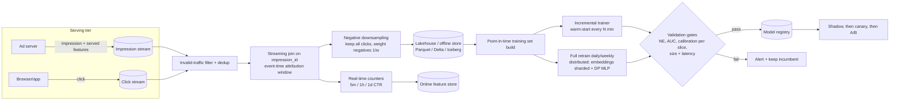
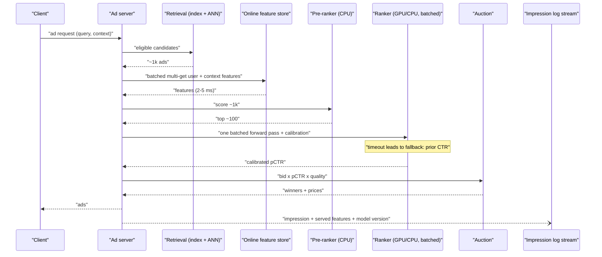
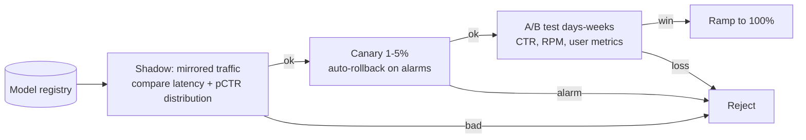

# E2 Google CTR Prediction System Case Study
> Last verified: 2026-10 · Audience: senior/staff DevOps, SRE, AI eng, NetEng, DevSecOps, architects

## TL;DR
- **Framing:** CTR prediction is **binary classification** that must output **calibrated probabilities** `pCTR = P(click | user, query/context, ad, position)`. The auction multiplies it by the bid (`bid × pCTR × quality`), so a pCTR that is 10% too high means mispriced ads. Ranking quality (AUC) alone is not enough.
- **Metrics:** offline **log loss / normalized cross-entropy (NE)**, **AUC**, and **calibration ratio** (Σpredicted / Σactual ≈ 1.0, checked per slice). Online: CTR, revenue per mille (RPM), advertiser ROI and latency in an A/B test. Small gains matter: Google's paper treats a **0.1–1% relative log-loss improvement as significant**.
- **Scale:** expect millions of scored (request × candidate ad) pairs per second, a ranking p99 of about **10–50 ms** inside a ~100 ms page budget, and **billions of impressions per day**. Freshness ranges from minutes to hours, because new ads, queries and trends appear all the time.
- **Data:** join impressions and clicks with an **attribution window** (this creates **delayed labels**). Use **negative downsampling with importance weights or recalibration**. Generate training rows with **point-in-time-correct** features, ideally by logging the features at serve time ("log-and-wait"). This kills training/serving skew.
- **Models:** the classic baseline is **logistic regression + hashing trick + FTRL-Proximal online learning** (Google, KDD 2013). Modern rankers are **Wide&Deep / DCN-v2 / DLRM**, where huge sparse **embedding tables** feed an MLP. Training is **incremental (warm-start)** with a periodic full retrain.
- **Serving:** a funnel of **candidate retrieval → light pre-ranker → heavy ranker → auction**. Do a batched **feature lookup** from an online store (a few ms), and keep **CPU for small models, GPU for large embedding and DCN models with request batching**. Use timeouts with fallback **prior CTRs**, then roll out through **shadow → canary → A/B**.
- **Drift and bias:** separate **data drift (P(X))**, **concept drift (P(y|X))** and **model drift/staleness**. Detect them with **PSI / KL / JS** on features and predictions, plus **calibration and NE on delayed labels**. Correct **position bias** (position feature or shallow tower) and **selection/feedback-loop bias** (exploration traffic, IPS).

---

## E2.1 Problem Overview (data drift, bias, model drift)

### Problem framing
- **Task:** given (user/context, query or page, ad creative, slot), predict `P(click)`. The output is a **probability**, not a label. Downstream consumers are the auction (expected value = bid × pCTR), pacing/budgeting, and reserve-price logic.
- **Why calibration is first-class:** ads are priced with **second-price/GSP-style auctions** that use pCTR. A uniform 2× over-prediction keeps AUC unchanged but breaks pricing and budgets. Monitor the **calibration ratio = Σ pCTR / Σ clicks** (target 1.0, alert at about ±2–5% per slice) and **reliability diagrams** (calibration curves).
- **Class imbalance:** CTRs are often **0.1–5%**. Accuracy is meaningless, because a model that always says "no click" is about 99% accurate.
- **Loss and metrics:**

| Metric | Formula / meaning | Strength | Weakness |
|---|---|---|---|
| **Log loss (binary cross-entropy)** | `−(1/N) Σ [y log p + (1−y) log(1−p)]` | Proper scoring rule; rewards calibration | Depends on the base CTR, so it can't be compared across datasets |
| **Normalized Entropy / NCE** | log loss ÷ entropy of a background CTR predictor `−[p̄ log p̄ + (1−p̄) log(1−p̄)]` | Comparable across traffic mixes; < 1.0 means better than predicting the average CTR (Facebook 2014 "Practical Lessons…") | Still sensitive to calibration shifts |
| **ROC-AUC** | Probability that a random positive ranks above a random negative | Measures ranking quality; insensitive to imbalance | **Blind to calibration**; global AUC hides per-query ranking |
| **PR-AUC** | Area under the precision–recall curve | Useful under heavy imbalance | Hard to interpret for the auction |
| **Calibration ratio / ECE** | Σp/Σy; expected calibration error over buckets | Direct auction-health signal | Needs delayed labels |
| **Online** | CTR, RPM, conversion rate, long-term user satisfaction (ad blindness) | The ground truth | Noisy; needs A/B tests and guardrails |

- Google's "View from the Trenches" uses **progressive validation**: each example is evaluated *before* it is trained on, which is natural for online learning. It also reports metrics **relative to a control model** and **sliced by country, query type and so on**, because aggregate deltas hide regressions.

### Drift taxonomy (interviewers want the distinctions)
| Kind | What changes | CTR example | Detect | Respond |
|---|---|---|---|---|
| **Data drift (covariate shift)** | `P(X)` | New device mix, a new country launch, a new ad format | PSI/KL/JS/KS on input features versus a training baseline | Often nothing, if the model generalizes; otherwise retrain or reweight |
| **Label/prior shift** | `P(y)` | Holiday season raises the base CTR | Prediction-mean versus label-mean drift | Recalibrate (cheap) |
| **Concept drift** | `P(y \| X)` | Users start ignoring a creative style (ad fatigue); a news event changes what a query means | **Delayed-label metrics**: NE, calibration and AUC degrade even when the features look stable | Retrain or online-learn; boost freshness |
| **Model drift / staleness** | Model quality decays relative to the world | Model age in hours versus NE gap compared with a fresh model | NE of the serving model versus a freshly trained shadow model | Raise the retrain cadence |
| **Training/serving skew** | Features differ between offline and online (a bug, not drift) | Online uses a 1-hour aggregate while offline uses a full-day aggregate | Compare logged serving features with recomputed offline features | Log features at serve time; share one feature definition |
| **Upstream data bugs** | Nulls, unit changes, a dead logging pipeline | Click logger drops iOS events | Null-rate, volume and schema checks | Halt training; roll back to the last good snapshot |

- **PSI (Population Stability Index):** `PSI = Σ_bins (a_i − e_i) · ln(a_i / e_i)` over about 10 quantile bins of the baseline. Industry rules of thumb are **< 0.1 stable, 0.1–0.25 moderate, > 0.25 significant shift** (these are conventions, not standards). PSI is symmetric, and it equals the sum of KL(a‖e) and KL(e‖a).
- **KL divergence:** `Σ p log(p/q)` is asymmetric and **infinite when a bin is empty**, so smooth with an epsilon. **Jensen–Shannon** is symmetric and bounded (0–1 with log₂), which is why it is the Azure ML default-style choice. Use **KS** for continuous features and **chi-squared** for categorical ones.
- For **high-cardinality sparse IDs** (ad_id, query hash), per-value PSI is noisy. Monitor **OOV/unseen-ID rate**, top-K frequency shift, **embedding-norm or prediction-distribution drift**, and **feature-importance-weighted drift** on the top N features.
- **Prediction drift** (the distribution of the pCTR output) is the cheapest early warning, because it needs no labels.

### Bias in CTR systems
- **Position bias:** top slots get more clicks regardless of relevance, so `P(click) = P(examined | position) × P(click | examined, relevance)`.
  - Fix 1: add **position as a training feature** and set it to a **fixed constant (for example, position 1)** at serving. Every candidate is then scored as if it were shown in the same slot.
  - Fix 2: use a **separate shallow "position/bias tower"** whose logit is added during training and dropped at serving (YouTube 2019 and Huawei PAL pattern).
  - Fix 3: **click models / IPS** weighting by an estimated examination propensity, using result randomization (swap-pair experiments) to estimate it.
- **Selection bias / feedback loop:** you only observe labels for ads you chose to show, so the model never learns about ads it scores low ("rich get richer"). Mitigate with **exploration traffic** (ε-greedy or Thompson/UCB for new ads, often 1–5% of traffic), **randomized holdout buckets** and **inverse propensity scoring**. Give new ads **cold-start priors** from advertiser, category or creative embeddings.
- **Sampling bias:** negative downsampling distorts the base rate; see E2.3 for recalibration.
- **Fairness/regulatory bias:** sensitive attributes and proxies (zip code → demographics) cause problems in housing, employment and credit ads (US regulators have acted on these cases). Exclude protected attributes, audit per-segment delivery, and log for compliance. Cross-link to L1 and L5.
- **Bot/click fraud:** invalid clicks poison the labels. Filter them with an invalid-traffic (IVT) classifier **before** the join.

### Interview angles
- *"Why not just maximize AUC?"* → Because the auction consumes pCTR **values**. Optimize log loss (a proper scoring rule), track calibration per slice, and add a post-hoc calibrator (Platt / isotonic / piecewise-linear per slice) as a safety net.
- *"How do you tell data drift from concept drift?"* → Data drift is visible **without labels** (input PSI). Concept drift shows up as **label-based degradation** (NE or calibration) even when the inputs look stable. A fresh challenger model beating the incumbent is the practical staleness test.
- *"Your CTR dropped 5% overnight. Is that the model?"* → Check pipeline health first (click-log volume, join rate, null rates). Next, look for a product change (UI, slot count). Then check calibration by slice, and only after that the model. Many "model drift" incidents are logging bugs.
- Pitfall: alerting on PSI for every one of thousands of features produces alert fatigue. Weight alerts by feature importance and require persistence (for example, 3 consecutive windows).

---

## E2.2 Gathering Requirements

### Functional
- Score `N` candidate ads per request (N ≈ 10s–1000s after retrieval) and return pCTR, optionally with pConversion (multi-task).
- Support new ads and advertisers instantly (cold start), multiple surfaces (search, display, video, app), and per-advertiser constraints.
- Allow experimentation: multiple models live at once (A/B buckets, shadow), plus a kill switch and fallback.
- Produce logs for training, billing reconciliation, debugging ("why was this ad shown?") and audit.

### Non-functional (state your assumptions explicitly in the interview)
| Dimension | Typical target / estimate | Notes |
|---|---|---|
| **Request QPS** | 100k–1M+ ad requests/s at global peak | Search-ads scale |
| **Scoring throughput** | QPS × candidates, for example 200k × 200 = **40M predictions/s** | This drives the funnel design: heavy models only see the top-K |
| **Latency** | Whole ad server ≤ ~100 ms; **ranking stage p99 10–50 ms**; online feature fetch ≤ 5 ms p99 | Measure tail latency, not averages; see J1 |
| **Availability** | ≥ 99.9–99.99% for the ad-serving path | Fail-open: show house ads or a simpler model rather than nothing |
| **Freshness** | Features: seconds to minutes (real-time counters); model: hourly incremental / daily full | Freshness gains are measurable in NE (Facebook reported that daily versus weekly retraining matters) |
| **Data volume** | 10B impressions/day × ~1–2 KB = **10–20 TB/day** raw; ~115k impressions/s average, 3–5× at peak | Training sets are often months of data, downsampled |
| **Model size** | LR: 10⁹ hashed weights; DLRM-style: embedding tables from 100s of GB to TBs | Embeddings dominate memory and must be sharded |
| **Consistency** | Billing and click logs must be exactly-once (or deduplicated); the training join can tolerate minutes of lag | Idempotent event IDs |
| **Privacy/compliance** | Consent (GDPR/CCPA, DMA), data retention TTLs, no raw PII in features | Hash or pseudonymize IDs; regional data residency (L3) |
| **Cost** | Cost per 1k predictions; GPU utilization | The funnel and caching are cost controls |

### Back-of-envelope
- Click stream: 1M events/s × 1 KB = **1 GB/s**. On Kinesis provisioned (1 MB/s or 1,000 records/s write per shard) that is about **1,000+ shards**. On Event Hubs Standard (1 MB/s per TU, max 40 TUs per namespace) it **does not fit in one Standard namespace**, so you need Premium/Dedicated or several namespaces. MSK, Confluent or Event Hubs Dedicated are the usual choices at this scale.
- Feature lookups: 200k requests × (1 user + 200 ads) keys. Cache ad-side features in-process (the ad corpus changes slowly) and fetch user/context features once per request.

### Interview angles
- Always ask: **which surface?** (search has query intent; display/feed has none), **what is the objective?** (clicks, conversions, revenue, long-term satisfaction), **are labels delayed?**, and **what is the latency budget for ranking?**
- State the funnel early: "a heavy model can't score 10⁶ ads in 20 ms, so retrieve about 1k, pre-rank to about 100, and fully rank those."
- Mention **guardrail metrics**: latency, ad load, user-side metrics (long clicks versus bounce clicks), advertiser ROI. CTR can be gamed with clickbait creatives.

---

## E2.3 Data Pipeline & Model Training

### Logging and label join
- Emit **impression events** (request_id, impression_id, ad_id, slot/position, model version, **the served feature vector or its hash**, timestamp) and **click events** (impression_id, timestamp). Use separate streams with **idempotent IDs**.
- **Streaming join** (Flink / Spark Structured Streaming / Kafka Streams / Google's Photon, VLDB 2013) on `impression_id`. The **event-time window** is the **click attribution window**, for example 15–60 minutes for clicks, versus days for conversions. Use watermarks for late data (see M5).
- **Delayed feedback / label latency:**
  - **Wait-window:** emit the impression as a negative only after the window closes. This is simple and correct, but it adds the window length to freshness.
  - **Emit immediately as a negative, then correct:** duplicate the row as a positive when the click arrives ("fake negative" weighting / importance sampling). This gives better freshness but biases the training mix, so it needs a weighting fix.
  - **Delayed-feedback models** (Chapelle 2014) model the time to conversion. They matter much more for **conversion** prediction (days) than for clicks (seconds to minutes).
  - Billing and monitoring must also respect the delay: compute calibration only on impressions older than the window.
- **Invalid-traffic filtering** and deduplication happen before the join. Training data must match what billing considers valid.

### Negative downsampling + recalibration
- Positives are rare, so keep **all positives** and sample negatives at rate `w` (for example, 1–10%). This cuts storage and training cost by 10–100× with little loss.
- Two correct options:
  1. **Importance weight** each kept negative by `1/w`. The model then stays calibrated, as in the Google paper's query subsampling, where non-clicked queries are sampled at rate `r` and weighted `1/r`.
  2. Train unweighted, then **recalibrate**: `q = p / (p + (1 − p)/w)`, where `p` is the predicted probability in the downsampled space and `q` is the true-space probability (Facebook 2014).
- Forgetting this is a classic bug: predicted CTR inflated by about 1/w, while AUC is unaffected, so offline AUC dashboards look fine.

### Feature engineering and feature store
- **Feature families:** user (historical CTR, interests, embeddings), ad (creative ID, advertiser, historical CTR with **smoothed counters** such as Bayesian/Beta priors), query/context (query tokens, device, geo, time), **cross features** (query × ad keyword, user segment × advertiser), and real-time counters (impressions/clicks in the last 5 minutes, 1 hour and 1 day).
- **Hashing trick:** `index = hash(feature_name + value) mod 2^b` (b ≈ 20–30). It needs **no vocabulary** and handles unseen values. Collisions act like noise or regularization; use signed hashing to reduce bias.
- **Point-in-time correctness:** for each training impression at time `t`, join feature values **as of `t`, never later**. Using features computed after the click is **label leakage**. Feature stores implement this as **as-of / time-travel joins** on `event_time` (Azure managed feature store "point-in-time temporal joins"; SageMaker offline store keeps the full history in S3 with event-time columns).
- **Online/offline split:** the **offline store** (S3/ADLS/BigQuery, Parquet or Delta/Iceberg, append-only history) serves training and backfills. The **online store** (KV/Redis/DynamoDB/Bigtable, latest value only, ms reads) serves inference. Use one definition with materialization to both, or, best for skew, **log the online values at serve time** and train on those logs.
- **Feature admission:** Google's paper uses **probabilistic feature inclusion** (Poisson inclusion and Bloom-filter inclusion). A new feature value is only added to the model after it has been seen enough times, which saves memory on the long tail of rare features. The paper also uses **reduced-precision weights** (a 16-bit q2.13 encoding instead of 32/64-bit floats). See [K2](../K-ai-infra-llm/K2-embeddings-vector-databases.md) for embeddings at scale.

### Model evolution (know the lineage)
| Model | Year / origin | Idea | Serving profile |
|---|---|---|---|
| **LR + hashing + FTRL-Proximal** | Google KDD 2013 | Linear on billions of sparse features; FTRL with per-coordinate learning rates, L1 gives **sparsity**, and it learns online | CPU, sub-ms, tiny memory per request |
| **GBDT → LR** | Facebook 2014 | Tree leaves as feature transforms, plus a freshly trained LR | CPU |
| **FM / FFM** | 2010 / 2016 | Pairwise feature interactions through latent vectors | CPU |
| **Wide & Deep** | Google 2016 (Play Store) | Wide = memorization of crosses; deep = embeddings + MLP for generalization; trained jointly | CPU or GPU |
| **DeepFM** | Huawei 2017 | FM replaces the hand-crafted wide part | CPU/GPU |
| **DCN / DCN-v2** | Google 2017 / 2020 | **Cross network** learns explicit bounded-degree feature crosses cheaply; v2 is used in Google production ranking | GPU/TPU or optimized CPU |
| **DLRM** | Meta 2019 | Embedding tables (model-parallel) + bottom/top MLPs (data-parallel), dot-product interactions | GPU; **memory-bound on embeddings** |
| **Multi-task (MMoE / PLE)** | Google 2018 / Tencent 2020 | Joint pCTR + pCVR heads; ESMM for the sample-selection bias of CVR | GPU |
| **Sequence/attention (DIN, transformer user-history)** | Alibaba 2018 onward | Attend over the user's behavior sequence relative to the candidate ad | GPU; latency-sensitive |

- **Embeddings:** each sparse ID gets a vector (dim 8–128). Tables with **billions of rows** must be **sharded across hosts or GPUs** (row-wise or table-wise sharding). Use **frequency thresholds/eviction**, **mixed dimension**, the **hashing trick**, and **quantization (fp16/int8)** to fit in memory.

### Training infrastructure
- **Distributed:** sparse embeddings use **parameter servers** or **model-parallel sharding** (TorchRec, TF/TPU embedding API), while dense layers use **data parallelism with all-reduce**. This hybrid is the DLRM pattern. Input pipelines are often the bottleneck, so stream Parquet/TFRecord and prefetch.
- **Cadence:**
  - **Online/incremental:** warm-start from the last checkpoint and train on new data every N minutes to hours (FTRL makes this natural).
  - **Periodic full retrain** (daily or weekly) on a long window, to fix accumulated bias and pick up architecture or feature changes.
  - **Catastrophic forgetting / instability:** cap learning rates, mix replay data, and **validate before every push**.
- **Validation gates before a push (automated):** offline NE/AUC versus the incumbent on a fresh holdout, **calibration per slice**, prediction-distribution sanity (mean pCTR within ±x%), feature-coverage checks, model size and latency benchmark. Promote only if all gates pass. Otherwise keep the old model; a stale model beats a broken one.
- **Reproducibility/lineage:** version the data snapshot, feature definitions, code, hyperparameters and model artifact in a model registry (MLflow / SageMaker Model Registry / Azure ML registry).



### Interview angles
- *"Why not use features computed in the batch warehouse for training and a separate service for serving?"* → That causes **training/serving skew**. Use a shared feature definition plus point-in-time joins, or train on **features logged at serve time**.
- *"How do you handle the delay in clicks?"* → Use an attribution window with watermarks. Accept the freshness cost, or use fake-negative correction. Call out that conversions need delayed-feedback modeling.
- *"You downsampled negatives. What breaks?"* → Calibration breaks. Fix it with importance weights `1/w` or the closed-form recalibration `q = p/(p + (1−p)/w)`.
- *"Why FTRL?"* → It is an online, per-coordinate adaptive learning rate (AdaGrad-like) algorithm. Its L1 regularization produces **truly sparse** models (many weights exactly zero), which saves serving memory compared with plain online SGD.
- Pitfall: random train/test splits. Always use a **temporal split** (train on days 1..T, test on day T+1), or you leak the future.

---

## E2.4 Inference Architecture

### Request path (funnel)
1. **Candidate generation/retrieval:** keyword/targeting match, inverted index, and **two-tower embeddings + ANN** (ScaNN/FAISS/HNSW) take millions of ads down to about 1k. Budget and eligibility filters apply here.
2. **Pre-ranker:** a lightweight model (LR or a small two-tower) takes about 1k down to about 100. It is cheap, so it can run on CPU.
3. **Ranker:** the heavy model (DCN-v2 / DLRM / multi-task) produces calibrated pCTR (and pCVR), followed by a **calibration layer** (per-slice isotonic or piecewise-linear).
4. **Auction / re-ranking:** `rank score = bid × pCTR × quality`, with reserve prices, diversity, ad load and pacing. GSP or VCG pricing then uses the pCTRs.
5. **Logging:** log the impression with model version, features and pCTR. This feeds training, monitoring and billing.

### Latency budget (example: 30 ms p99 for ranking)
| Step | Budget | Techniques |
|---|---|---|
| Feature fetch (user + context) | 2–5 ms | One **batched multi-get** per request; co-locate the online store in the same AZ/region; PrivateLink with private DNS in the same AZ (the SageMaker Feature Store docs recommend this to cut network hops) |
| Ad-side features | ~0 ms | **In-process cache** refreshed every minute, since ad features change slowly; precompute ad-tower embeddings |
| Model inference | 5–15 ms | Batch all ~100–1k candidates in **one forward pass**; quantize embeddings (fp16/int8); ONNX/TensorRT/OpenVINO compilation |
| Network + serialization | 2–5 ms | gRPC with protobuf; keep-alive; avoid cross-AZ hops |
| Slack for tail | rest | **Hedged requests**, per-stage timeouts, **fallback to prior/pre-ranker scores** on timeout |

### CPU vs GPU serving
| | CPU | GPU |
|---|---|---|
| Fits | LR/FTRL, GBDT, small MLPs, pre-rankers | DCN-v2/DLRM/transformer-sequence rankers with large dense compute |
| Latency | Predictable, no batching delay | Needs **dynamic batching** (Triton/TorchServe) to be efficient; batching adds queueing delay, so cap the batching window at about 1–2 ms |
| Embeddings | In RAM (large-memory instances) or remote parameter/embedding servers | HBM is limited, so use hot-embedding caches on the GPU and cold embeddings in host memory or a remote store |
| Cost | Cheap per instance; scales horizontally | Cheaper per prediction **only** at high utilization |
- Common hybrid: **embedding lookup on CPU memory servers, dense compute on GPU**, or all on CPU with AVX-512/AMX for mid-size models. Google uses TPUs internally.

### Caching
- **Do cache:** ad-side features and embeddings, user embeddings (TTL in minutes), model artifacts in memory, and calibration tables.
- **Don't cache final pCTR** for personalized requests, because the context (time, position, recent behavior) changes. A short-TTL cache keyed on (query, ad) is acceptable only for non-personalized fallbacks.
- Use **cache-miss/stampede protection** (request coalescing) when a hot ad's features expire. See [C1 Performance](../C-large-scale-architecture/C1-performance.md) and [E1](E1-system-design-fundamentals.md) on cache breakdown.

### Safe deployment
- **Shadow (mirror) traffic:** the new model scores real requests but its responses are discarded. Compare latency, errors and **prediction distribution / calibration** against the incumbent.
- **Canary:** a small percentage of real traffic (1–5%) with automatic rollback on CloudWatch/Azure Monitor alarms (latency, error rate, mean pCTR shift).
- **A/B test:** user- or request-hashed buckets, run for days to weeks to see revenue, CTR and user metrics. Watch for **novelty effects** and **auction interference**: a model in one bucket changes prices that the control bucket also sees, so budget-split designs may be needed.
- **Fallback chain:** heavy model → previous model version → pre-ranker → historical CTR priors. This keeps the system **fail-open** so ads still serve.

### Monitoring (ops + ML)
- **System:** QPS, p50/p99/p99.9 latency per stage, timeouts and fallback rate, GPU/CPU utilization, feature-store read latency and error rate, model load time.
- **Data:** null/default-value rate per feature, OOV rate, PSI on the top-N features, **training/serving skew** (sampled online features compared with offline recomputation), stream lag (consumer lag, join-rate drop).
- **Model:** prediction mean and distribution (label-free, real-time), **calibration ratio per slice after the attribution window**, NE/AUC on joined labels, model age/freshness.
- **Business:** CTR, RPM, spend pacing, advertiser complaints. Tie alerts to SLOs and error budgets ([J1](../J-sre/J1-slis-slos-error-budgets.md), [J2](../J-sre/J2-monitoring-and-alerting.md)).





### Interview angles
- *"How do you hit 10 ms with 500 candidates?"* → Use a funnel, one batched forward pass, cached ad-side features and precomputed ad embeddings, a single multi-get for user features, a quantized model, same-AZ placement, and a timeout with fallback.
- *"GPU or CPU?"* → Base it on model FLOPs and embedding size. GPUs win only with batching at high utilization, and the batching window adds tail latency. Many production CTR rankers still run on CPU.
- *"How do you know the new model is safe?"* → Offline gates, then shadow (no user impact), then canary with auto-rollback, then an A/B test with guardrails. Monitor the **calibration ratio** in addition to CTR.
- Pitfall: A/B-testing ranking models in a shared auction. Price interference contaminates the control, so mention budget-split or counterfactual evaluation.

---

## Cloud mapping: AWS vs Azure

| Capability | AWS | Azure | Role it plays | Key differences | Alternatives |
|---|---|---|---|---|---|
| Click/impression stream | **Kinesis Data Streams**, **Amazon MSK** (Kafka) | **Event Hubs** (Kafka-compatible endpoint), HDInsight Kafka (legacy) | Ingest impression and click events | Kinesis: 1 MB/s or 1,000 rec/s write per shard (provisioned); on-demand scales to 10 GB/s write in large regions; retention 24 h–365 d. Event Hubs: TU = 1 MB/s in / 2 MB/s out; Standard max 32 partitions, 40 TUs, 7 d; Premium/Dedicated 90 d | Confluent Cloud, self-managed Kafka on K8s ([M4](../M-data-platforms/M4-kafka-at-scale.md)) |
| Stream join / real-time features | Managed Service for Apache Flink, EMR / Glue Streaming (Spark) | Stream Analytics, Databricks / HDInsight / Fabric Spark | Impression×click windowed join, counters | Flink offers the richest event-time semantics | Databricks Structured Streaming, Confluent Flink ([M5](../M-data-platforms/M5-stream-processing.md)) |
| Lake / offline store | S3 + Glue Catalog + Athena (Iceberg) | ADLS Gen2 + Fabric/Synapse (Delta) | Training history | — | Databricks Delta + Unity Catalog ([M1](../M-data-platforms/M1-lakehouse-table-formats.md)) |
| Feature store | **SageMaker Feature Store** (offline in S3 + online `Standard` / `Standard_V2` / `InMemory`) | **Azure ML managed feature store** (offline ADLS Gen2, online Redis, materialization on managed Spark) | Point-in-time training sets + ms online lookups | SageMaker `InMemory` = ElastiCache Redis OSS, online-only (no offline replication), default max 50 GiB per group, no CMK. Azure feature sets are versioned and immutable, with built-in PIT joins | Databricks Feature Engineering (UC), Vertex AI Feature Store (BigQuery + Bigtable/Optimized online), Feast |
| Pipelines / orchestration | **SageMaker Pipelines**, Step Functions, MWAA | **Azure ML pipelines**, Data Factory / Fabric pipelines | Join → train → validate → register | — | Databricks Workflows/Jobs, Vertex Pipelines (KFP), Airflow ([M6](../M-data-platforms/M6-orchestration-etl.md)) |
| Distributed training | SageMaker training jobs (distributed data/model parallel), SageMaker HyperPod | Azure ML compute clusters (PyTorch DDP/DeepSpeed) | Embedding-sharded + data-parallel training | — | Databricks (TorchDistributor), GKE/TPU, Ray |
| Registry | SageMaker Model Registry (and managed MLflow) | Azure ML registry (MLflow-native) | Versioning + approval gate | — | MLflow in Unity Catalog |
| Online inference | **SageMaker real-time endpoints** (multi-variant, inference components) | **Azure ML managed online endpoints** (deployments + traffic split) | Low-latency scoring | Azure: reserves +20% capacity for upgrades, recommends ≥3 instances for HA, default endpoint bandwidth quota 5 MBps | KServe/Triton on EKS/AKS, Databricks Model Serving, Vertex AI endpoints |
| Shadow / canary | **Shadow tests** (shadow variant on the same endpoint); **deployment guardrails**: blue/green all-at-once, canary, linear, rolling with CloudWatch-alarm auto-rollback and a baking period | **Mirror traffic** (≤50%, one shadow deployment, not supported on Kubernetes online endpoints) + **traffic split** blue/green | Safe rollout | SageMaker shadow tests are not supported with serverless, async, multi-model, multi-container or Inf1 endpoints | Argo Rollouts / Flagger, Istio mirroring ([C5](../C-large-scale-architecture/C5-deployment.md)) |
| Model monitoring | **SageMaker Model Monitor**: data quality, model quality, bias drift, feature attribution drift. **No longer open to new customers (2026)**; AWS points to open-source Evidently + SageMaker MLflow + CloudWatch/QuickSight | **Azure ML model monitoring**: data drift (JS, PSI, normalized Wasserstein, KS, chi-squared), prediction drift, data quality, feature attribution drift (preview), model performance (preview); Event Grid alerts | Drift + delayed-label quality | Azure lookback window size and offset (reference offset defaults to 2× production window); depends on Spark | Evidently, WhyLabs/Arize, Databricks Lakehouse Monitoring, Vertex AI Model Monitoring |
| Ops metrics | CloudWatch (endpoint latency, invocations, anomaly detection) | Azure Monitor / App Insights | SLOs | — | Prometheus + Grafana, Datadog |

- **Streams:** at about 1 GB/s of click and impression events, plan shards and partitions explicitly. Kinesis provisioned needs about 1,000 shards. Event Hubs Standard caps at 40 TUs (≈40 MB/s) per namespace, so this scale means **Premium (PUs) / Dedicated (CUs, 1,024 partitions per hub)** or MSK/Confluent. Event Hubs exposes a Kafka endpoint on Standard and above, which lets Kafka clients port with config changes.
- **Feature store gotchas:** SageMaker `Standard_V2` adds partial `UpdateRecord` with EventTime-based rejection of out-of-order writes, which suits hot counters like `click_count`. Choose `InMemory` for the lowest latency, but know it does **not replicate to the offline store**, so you need a separate history path for PIT training. The Azure managed feature store is a **workspace type shared across project workspaces**, and its features can be consumed from Azure Databricks.
- **Monitoring status change:** for new AWS builds, don't design around SageMaker Model Monitor. Use data capture → S3/Athena-Iceberg → scheduled Evidently (PSI/KS) → MLflow + SNS/CloudWatch. Azure's built-in monitor still offers PSI/JS out of the box. Both need **your own join of delayed ground truth** by inference ID.
- **Databricks** (either cloud) is a full alternative: Delta Live Tables / Lakeflow for the join, Feature Engineering in Unity Catalog with online serving, Mosaic AI Model Serving, and Lakehouse Monitoring for drift. See [M3](../M-data-platforms/M3-databricks-platform.md).
- **Vertex AI** is the canonical Google analogue: BigQuery as the offline source, with Bigtable or Optimized online serving, Vertex Pipelines, endpoints with traffic split, and Model Monitoring. As of 2026 the Google docs present the Feature Store under an "Agent Platform" banner (naming unverified). Google's own ads stack is internal (Photon, TPUs), not Vertex.

## Hands-on (optional)
```bash
# AWS: on-demand Kinesis stream for click events (auto-scaling shards)
aws kinesis create-stream --stream-name ctr-clicks --stream-mode-details StreamMode=ON_DEMAND
aws kinesis increase-stream-retention-period --stream-name ctr-clicks --retention-period-hours 168

# Azure ML: shadow a candidate ranker with 10% mirrored traffic, then canary 5% live
az ml online-endpoint update --name ctr-ranker --mirror-traffic "green=10"
az ml online-endpoint update --name ctr-ranker --mirror-traffic "green=0" --traffic "blue=95 green=5"
```

## Cross-links
- [E1 System Design Fundamentals](E1-system-design-fundamentals.md): core principles, databases and caching (cache miss / breakdown)
- [E3 HubSpot User Clustering](E3-hubspot-user-clustering-case-study.md): batch vs online learning, nightly retraining
- [K2 Embeddings & Vector Databases](../K-ai-infra-llm/K2-embeddings-vector-databases.md): ANN retrieval for candidate generation
- [K6 Managed Model Platforms](../K-ai-infra-llm/K6-managed-model-platforms.md): SageMaker / Azure ML / Vertex
- [M4 Kafka at Scale](../M-data-platforms/M4-kafka-at-scale.md), [M5 Stream Processing](../M-data-platforms/M5-stream-processing.md), [M1 Lakehouse Table Formats](../M-data-platforms/M1-lakehouse-table-formats.md), [M3 Databricks](../M-data-platforms/M3-databricks-platform.md)
- [C1 Performance](../C-large-scale-architecture/C1-performance.md) (caching), [C5 Deployment](../C-large-scale-architecture/C5-deployment.md) (canary/blue-green)
- [J1 SLIs/SLOs](../J-sre/J1-slis-slos-error-budgets.md), [J2 Monitoring & Alerting](../J-sre/J2-monitoring-and-alerting.md)
- [L1 Data Classification & PII](../L-data-privacy-ai-security/L1-data-classification-pii.md), [L5 Model & Data Governance](../L-data-privacy-ai-security/L5-model-data-governance.md)

## Sources
- https://research.google/pubs/ad-click-prediction-a-view-from-the-trenches/ (McMahan et al., KDD 2013)
- https://developers.google.com/machine-learning/crash-course/classification/prediction-bias
- https://docs.aws.amazon.com/sagemaker/latest/dg/feature-store.html
- https://docs.aws.amazon.com/sagemaker/latest/dg/feature-store-storage-configurations-online-store.html
- https://docs.aws.amazon.com/sagemaker/latest/dg/model-monitor.html
- https://docs.aws.amazon.com/sagemaker/latest/dg/model-monitor-availability-change.html
- https://docs.aws.amazon.com/sagemaker/latest/dg/shadow-tests.html
- https://docs.aws.amazon.com/sagemaker/latest/dg/deployment-guardrails.html
- https://docs.aws.amazon.com/streams/latest/dev/service-sizes-and-limits.html
- https://learn.microsoft.com/en-us/azure/machine-learning/concept-model-monitoring
- https://learn.microsoft.com/en-us/azure/machine-learning/concept-what-is-managed-feature-store
- https://learn.microsoft.com/en-us/azure/machine-learning/how-to-safely-rollout-online-endpoints
- https://learn.microsoft.com/en-us/azure/event-hubs/event-hubs-quotas
- https://docs.cloud.google.com/vertex-ai/docs/featurestore/latest/overview
- Papers referenced from memory (not re-fetched this session): He et al. "Practical Lessons from Predicting Clicks on Ads at Facebook" (2014, NE + recalibration formula); Cheng et al. "Wide & Deep" (2016); Wang et al. DCN (2017) / DCN-v2 (2020); Naumov et al. DLRM (2019); Chapelle "Modeling Delayed Feedback" (2014); Ananthanarayanan et al. "Photon" (VLDB 2013).
