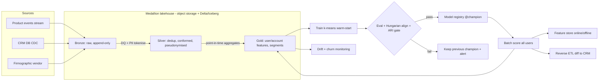
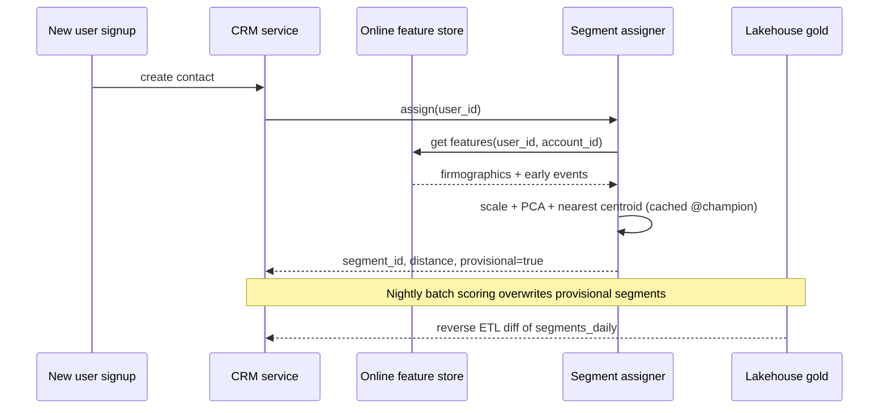

# E3 HubSpot User Clustering Case Study
> Last verified: 2026-10 · Audience: senior/staff DevOps, SRE, AI eng, NetEng, DevSecOps, architects

> Note: "HubSpot" is the course's framing of a B2B CRM/marketing-platform scenario. Nothing here describes HubSpot's real internal stack. All scale numbers are **interview assumptions**.

## TL;DR
- **Problem:** this is **unsupervised segmentation**. You group B2B **users (contacts)** and **accounts (companies)** into a few stable, explainable segments that marketing can target. There are no labels, so "accuracy" is replaced by **cohesion/separation metrics, stability, and business lift** (A/B-tested campaign CTR or conversion per segment).
- **Requirements that drive the design:** **daily freshness**, **explainable** segments (a marketer must be able to read "high-engagement SMB evaluators"), **stable IDs across retrains**, new users assigned to a segment within minutes, and **PII minimisation**.
- **Data path:** use ELT into a **medallion lakehouse**. **Bronze** holds raw events, CRM and firmographics. **Silver** is deduplicated, conformed and pseudonymised. **Gold** holds per-user and per-account **feature tables** plus segment outputs.
- **Model:** start with **mini-batch k-means** on scaled behavioural, firmographic and embedding features. Pick **k** with elbow, silhouette, Davies-Bouldin, BIC and the business limit of about 5–15 segments. Use **GMM** when you need soft membership and **HDBSCAN** to find outliers and natural density. HDBSCAN is transductive, so you still need a separate assignment step for new users.
- **Stability:** run **Hungarian matching** of new centroids to previous ones so the IDs stay the same ("Segment 3" still means the same thing). Track **ARI** and **% users switching segment** between runs, and gate promotion on them.
- **Architecture:** a **nightly orchestrated pipeline** runs ingest → features → train → evaluate/align → register → **batch score all users** → write to the **feature store and CRM** (reverse ETL). Separately, a **lightweight online assigner** computes the nearest centroid for brand-new users. **Batch retrain plus online inference** is better than true online learning.
- **Cloud:** on AWS, use Glue/EMR + S3 (+ Iceberg) → SageMaker Processing/Pipelines/Batch Transform, orchestrated by MWAA. On Azure, use Data Factory/Fabric + ADLS Gen2/OneLake → Azure ML pipelines + batch endpoints. **Databricks** (Delta Lake, Lakeflow Jobs, MLflow/Unity Catalog) is the cross-cloud option.
- **Monitor:** watch feature drift (PSI), the cluster-size distribution, the mean distance-to-centroid, the outlier rate, assignment churn, and downstream KPI per segment. Note that **SageMaker Model Monitor is closed to new customers**, so build custom checks.

## E3.1 Requirements & Design

### Clarifying questions (ask these first)
- **Entity:** are we segmenting contacts, accounts, or both? In B2B, buying decisions happen at the **account** level, so the usual answer is a **two-level** design: account segments plus user personas within an account.
- **Consumer:** who uses the output? Options are marketing lists/workflows, sales prioritisation, product personalisation, and analytics. This decides the latency and the explainability bar.
- **Freshness:** segments are **recomputed daily**. A new sign-up should get a provisional segment in **minutes or less**.
- **Number of segments:** marketers can act on **about 5–15**. More than that becomes noise. A hierarchical approach (coarse → fine) can serve both.
- **Multi-tenancy:** are we clustering the platform's own customers (one global model) or every customer's contacts (**one model per tenant**, meaning thousands of small models)? This changes the compute shape completely: one big Spark job versus many small parallel jobs.
- **Constraints:** GDPR/CCPA, consent, data residency, and no sensitive attributes (see [L1](../L-data-privacy-ai-security/L1-data-classification-pii.md)).

### Functional and non-functional requirements
| Requirement | Target (assumed) | Design consequence |
|---|---|---|
| Scale | 50–200M contacts, ~5M accounts, ~5B events/day | Spark for features, mini-batch k-means, and silhouette computed on a sample |
| Freshness | Daily batch, SLA ready by 06:00 local | Nightly DAG, about a 4h window, retries and backfill |
| New-user assignment | p99 < 100 ms | Centroids cached (k×d floats, a few KB) and online features |
| Explainability | Every segment has a human-readable profile | Centroid z-score profiles, a surrogate tree, and naming reviewed by a person |
| Stability | ≤ 5–10% of users switch segment per day with no real behaviour change | Hungarian alignment, warm-start centroids, promotion gate |
| Privacy | No raw PII in features. Erasure within the legal SLA | Pseudonymised keys in silver/gold. Delete propagation |
| Availability | Batch can fail without user impact (serve yesterday's segments) | Last-good snapshot pattern |

### Features
- **Behavioural (from events):** 7/30/90-day counts of logins, email opens/clicks, page views, feature usage, form fills and meetings booked. Also **recency** (days since last activity), **frequency**, **intensity** (sessions/week), **breadth** (distinct features used), trend (30d vs prior 30d), and funnel stage.
- **Firmographic (account):** industry, employee band, revenue band, country/region, tech stack, plan tier, seats and tenure.
- **Embeddings:**
  - **Behavioural sequence embeddings** (item2vec/word2vec-style over event sequences, or an autoencoder over the feature vector).
  - **Text embeddings** of company descriptions or job titles. See [K2 Embeddings](../K-ai-infra-llm/K2-embeddings-vector-databases.md).
  - L2-normalise them so Euclidean k-means approximates **cosine (spherical) k-means**.
- **Preprocessing (most points are lost here in interviews):**
  - **log1p** heavy-tailed counts, then **standardise**. Otherwise one feature (page views) dominates the Euclidean distance.
  - Handle categoricals with one-hot for low cardinality and embeddings or target-free grouping for high cardinality. **k-prototypes** is an option for mixed data.
  - Use **PCA** to decorrelate and reduce dimension (for example 200 → 20–50 dims). Use UMAP only for **visualisation** or pre-HDBSCAN, because it distorts global distances.
  - **Weight feature groups** (behaviour vs firmographic vs embedding) on purpose. Otherwise the group with the most columns wins.
  - Use **point-in-time** feature snapshots (as-of date). This makes retrains reproducible.

### Algorithms
| Algorithm | Strengths | Weaknesses | Predict new points? | Use here |
|---|---|---|---|---|
| **k-means / mini-batch k-means** | Scales to very large n. Centroids are easy to explain. Cheap assignment | Assumes spherical, similar-size clusters. Must choose k. Sensitive to scaling and outliers | Yes (nearest centroid) | **Default baseline** |
| **Bisecting k-means** (Spark MLlib) | Hierarchical coarse → fine segments | Greedy | Yes | Two-level segment taxonomy |
| **GMM** | **Soft membership** probabilities, elliptical clusters, BIC/AIC for k | scikit-learn marks it "not scalable"; sensitive to init | Yes (posterior) | "70% evaluator / 30% champion" scoring. Fit on a sample |
| **HDBSCAN** | Finds clusters of varying density, labels **noise/outliers**, no k | Transductive. scikit-learn's `HDBSCAN` has no `predict` (the standalone `hdbscan` library has `approximate_predict`) | Not natively | Exploration, outlier detection, or seeding k |
| **DBSCAN** | Arbitrary shapes, noise | One global `eps`, poor on varying density | No | Rarely for this use case |
| **Embedding + clustering** | Captures sequence/semantic similarity | Harder to explain, so needs post-hoc profiles | Yes (if k-means on embeddings) | Behaviour-rich segments |

- **SageMaker built-in k-means** is a modified **web-scale mini-batch k-means**. It returns `closest_cluster` and `distance_to_cluster`, and AWS recommends training it on CPU.
- **Choosing k:**
  - **Elbow** on inertia (WCSS).
  - **Silhouette** `s=(b−a)/max(a,b)` in [−1, 1], higher is better. It is O(n²), so compute it on a 50–100k sample.
  - **Davies-Bouldin** (lower is better) and **Calinski-Harabasz** (higher is better).
  - **Gap statistic** and **BIC** (for GMM).
  - Then apply **business constraints**: minimum segment size (for example ≥1% of users, and ≥ the k-anonymity threshold for exports), actionability, and stability across bootstrap resamples (ARI between runs).
- **Explainability:**
  - A per-segment **centroid profile**: the features with the highest z-score versus the population mean.
  - A **surrogate decision tree** or gradient-boosted classifier that predicts the segment, with SHAP on the surrogate.
  - Representative members (medoids).
  - An LLM can draft segment names and descriptions from profiles, but **a person approves** them before marketers see them.

### Cluster stability across retrains (label alignment)
- **The problem:** k-means labels are arbitrary. Retraining can permute them (old segment 2 becomes new segment 5), which breaks CRM workflows and reports.
- **The fix:**
  1. **Warm-start** with the previous centroids as the init.
  2. Build a cost matrix of distances between new and old centroids, or of 1 − Jaccard overlap of member sets.
  3. Solve the **Hungarian algorithm** (linear assignment, O(k³), trivial for small k).
  4. Map new IDs to old **stable segment IDs**.
  5. A new centroid whose matched cost is above a threshold becomes a **new segment** that needs human naming. An unmatched old segment is **retired** or merged. Record splits and merges in a segment registry.
- **Gate metrics:**
  - **ARI** between yesterday's and today's assignment of the same users (1 = identical, ~0 = random).
  - The **% of users switching segment**.
  - Per-segment Jaccard.
  - If churn is above the threshold and features did not drift, **block promotion** and keep yesterday's model.
- **Hysteresis:** reassign an existing user only if the new centroid is closer by a margin, or after N consecutive days. This stops users flip-flopping at boundaries.

### Interview angles
- **"How do you evaluate without labels?"** Use intrinsic metrics (silhouette, DB), stability (ARI across runs and bootstraps), and **extrinsic** metrics: segment-targeted campaigns vs random in an **A/B test**, and whether segments differ significantly on held-out KPIs such as churn and upgrade rate.
- **"Why not just use HDBSCAN?"** It has no k and handles noise well, but there is no native `predict`, it is costlier at 100M scale, and a large "noise" bucket is useless to marketing. Use it for exploration or outlier flags and k-means for production.
- **Pitfall:** skipping scaling, or letting embedding dimensions (for example 768) swamp 20 behavioural features.
- **Pitfall:** clustering on IDs or leaked post-outcome features.
- **Pitfall:** re-numbering segments every night.
- **Follow-up: "Account vs user?"** Aggregate user features to the account (mean, max, % active seats) and cluster accounts separately. Expose both as CRM properties.
- Fundamentals: [E1 System Design Fundamentals](E1-system-design-fundamentals.md). A supervised contrast is in [E2 CTR prediction](E2-google-ctr-prediction-case-study.md).

## E3.2 System Workflow (batch vs online learning, ETL, silver and gold layers, nightly retraining)

### Batch vs online learning
| | **Batch retrain (nightly)** | **Online / incremental learning** |
|---|---|---|
| Mechanism | Refit on a fresh gold snapshot (warm-start), then align labels | `partial_fit` mini-batch k-means, or streaming k-means with a decay factor (Spark `spark.mllib` StreamingKMeans, an RDD API in maintenance) |
| Freshness | 24h model, minutes for assignment via the online assigner | Continuous |
| Reproducibility | High (snapshot + code + params are versioned) | Low (state depends on arrival order) |
| Stability | Controlled by a promotion gate | Centroids **drift silently** and segment meaning changes underneath marketers |
| Ops | Simple, cheap, easy rollback | Hard rollback, needs a stateful streaming job |
| **Verdict** | **Choose this** | Only if the segment definition itself must adapt intraday (rare for marketing) |

- **Key distinction to state out loud:** *online inference* (assign a new user to existing centroids in real time) is **not** *online learning* (updating centroids in real time). Use **batch learning + online inference**.

### ETL vs ELT and the medallion layers
- Use **ELT**: land raw data first, then transform inside the lakehouse with Spark/SQL. This lets you reprocess history when a feature definition changes. **ETL** (transform before landing) suits cases where raw PII must not land at all.
- **Bronze (raw):**
  - Append-only product events (Kafka/Kinesis/Event Hubs → Auto Loader/Firehose), CRM table **CDC**, email-engagement logs and third-party firmographics.
  - Keep the original format and schema-on-read. This is the single source for audit and replay.
  - Databricks guidance is to avoid writing ingestion directly into silver, so that schema changes do not break the pipeline.
- **Silver (validated/conformed):**
  - Schema enforcement, **dedupe** (event_id), late-data handling (watermarks), identity resolution (contact ↔ account), timezone normalisation and bot filtering.
  - **Pseudonymise**: replace email with a salted hash or token, and drop free text.
  - Data quality expectations, for example the Lakeflow Declarative Pipelines (formerly DLT) `EXPECT` constraints, or Glue Data Quality.
- **Gold (business/ML-ready):**
  - `user_features_daily` and `account_features_daily` (point-in-time, partitioned by `as_of_date`).
  - `segments_daily` (user_id, segment_id, distance, model_version, run_date).
  - `segment_registry` (stable IDs, names, profiles).
  - The feature store offline tables are registered from gold.
- **Incremental processing:** use `MERGE` upserts, Delta **Change Data Feed** or Iceberg incremental reads, and partition pruning on date. Recompute rolling 7/30/90-day windows from a daily aggregate table rather than raw events.
- Deeper coverage: [M1 Lakehouse table formats](../M-data-platforms/M1-lakehouse-table-formats.md), [M2 Spark at scale](../M-data-platforms/M2-spark-at-scale.md), [M6 Orchestration & ETL](../M-data-platforms/M6-orchestration-etl.md).

### Nightly retraining orchestration (DAG)
1. **Sensors:** wait for bronze partitions and CRM CDC to complete (data-arrival or table-update trigger, not just the clock).
2. Run bronze → silver → gold jobs, then **data quality gates**. Fail fast and serve yesterday's segments.
3. Build the training snapshot: sample (for example 10–20M users) plus scaler/PCA fit.
4. Train k-means (warm-start). Optionally sweep k ±2 for the weekly "k review".
5. **Evaluate and align:** silhouette/DB on a sample, Hungarian mapping, ARI/churn versus the previous model, and minimum segment size.
6. **Conditional promotion:** register the model version and move the alias (`@champion`). On failure, alert and keep the old champion.
7. **Batch score** all users. Write `segments_daily` and update the feature store online/offline.
8. **Reverse ETL** to the CRM: push only the **diff** (changed segment) as an idempotent upsert keyed by `(user_id, run_date)`. Respect API rate limits with backoff.
9. Refresh monitoring metrics and dashboards. Notify on SLA misses.
- **Idempotency and backfill:** every task is parameterised by `run_date` and overwrites its own partition, so re-runs and backfills are safe.
- **Cadence split:** **retrain weekly** and **score daily** (assignment with a fixed model) is a common, cheaper variant. If the requirement says "retrain nightly", warm-start plus the gate keeps it safe.



### Interview angles
- **"Why medallion?"** It separates concerns: replayable raw data, a trusted conformed layer, and purpose-built consumer tables. PII stays fenced in bronze/silver. You can recompute gold when feature logic changes.
- **"What if upstream data is late?"** Use sensors with timeouts. Then either run on partial data with a flag, or skip and serve yesterday's segments (the stated SLA decides). Never silently train on half a day of data.
- **Pitfall:** training/serving skew from computing features differently in batch scoring and in the online assigner. Use one feature definition through the feature store.

## E3.3 Training & Inference Architecture

### Training
- **Compute:** Spark (Glue/EMR/Databricks/Fabric) for features. Training runs on a single large CPU node for a sample of ≤ tens of millions × ≤ 50 dims, or on distributed Spark MLlib `KMeans` / `BisectingKMeans` / `GaussianMixture` for full data.
- **Rough sizing:** 100M users × 50 float32 = **20 GB**, which fits in memory on one large instance or a modest Spark cluster. k-means runtime is O(n·k·d·iterations).
- **Artifacts:** a single versioned **pipeline artifact** that holds scaler + PCA + centroids + the label-mapping table, with lineage to the gold snapshot (MLflow `log_input` / SageMaker lineage). The online assigner must load this exact artifact.
- **Registry:** use MLflow Models in Unity Catalog with **aliases** (`@champion`/`@challenger`; aliases replace legacy stages), the SageMaker Model Registry (model package groups, approval status) or the Azure ML registry.

### Inference: two paths
- **Batch scoring (primary):** score every user nightly and write the results to gold `segments_daily`, the feature store and the CRM. Options are SageMaker **Batch Transform**, Azure ML **batch endpoints**, or a Spark job running `mlflow.pyfunc.spark_udf` on `models:/...@champion`.
- **Online assignment (new or changed users):**
  1. A sign-up or event-burst triggers the assigner.
  2. It fetches the available features from the **online feature store** (firmographics from enrichment, early events).
  3. It applies the scaler and PCA, then computes the nearest centroid.
  4. It returns the segment with a `provisional=true` flag.
  5. The nightly batch later overwrites it.
- **Online assigner deployment:** a tiny model, so run it as a serverless function or a small container, or **embed the centroids in the CRM service** itself. A SageMaker real-time or serverless endpoint and an Azure ML managed online endpoint are also valid, but are often overkill for a k×d dot product.
- **Cold start:** with no behavioural data, assign using a **firmographic-only sub-model** (centroids projected onto the firmographic dimensions), or a default "new / onboarding" segment.



### Monitoring cluster drift
| Signal | How | Alert idea |
|---|---|---|
| **Feature drift** | PSI / KS / Jensen-Shannon per feature versus the training baseline | PSI > 0.2 on key features (common rule of thumb) |
| **Segment size distribution** | Share per segment day over day | Any segment ±30% relative, or < min size |
| **Fit quality** | Mean distance-to-assigned-centroid, inertia per point, silhouette on a sample | Rising trend means the data no longer fits the centroids, so retrain or re-k |
| **Outliers** | % of users beyond the p99 training distance | Spike means a new behaviour pattern or a pipeline bug |
| **Stability** | ARI / % switching between consecutive runs | Above the threshold without feature drift points to a model or pipeline problem |
| **Business** | Campaign CTR/conversion per segment, sales acceptance | Declining lift means the segments are stale |
| **Pipeline SLOs** | DAG success, completion time, CRM sync lag | Freshness SLO breach. See [J2](../J-sre/J2-monitoring-and-alerting.md) |

- **SageMaker Model Monitor** supports monitoring batch transform input/output, but as of 2026 it is **no longer open to new customers** (existing customers only, no new features). For new builds, use a scheduled SageMaker Processing job that writes metrics to CloudWatch, or open-source checks.
- **Azure ML model monitoring** (data drift, prediction drift, data quality) or **Databricks Lakehouse Monitoring** (data-quality/profile monitors on the gold tables) are the equivalents.

### Privacy and PII
- **Data minimisation:** the clustering needs behaviour and firmographics, not names or emails. Tokenise identifiers in silver, and keep the token ↔ PII map in a restricted vault table.
- **No sensitive or protected attributes** (or close proxies) in the features. Review segments for unintended proxies, for example country + title acting as a proxy for a protected class.
- **Consent and purpose:** filter out contacts who are unsubscribed or have not consented to profiling *before* feature generation. Store a consent flag in silver.
- **Right to erasure:**
  - Delete across bronze/silver/gold, the feature store (online `DeleteRecord`) and the CRM.
  - With Delta, run `DELETE` and then `VACUUM` (default retention 7 days) so old files are physically removed.
  - Erasure does not require retraining a k-means model trained on aggregates, but **document that**.
- **Export controls:** set a minimum segment size (k-anonymity style) for anything shared externally, apply column masks and row filters (Unity Catalog / Lake Formation / Purview), and use **CMK** encryption plus private networking for training and scoring jobs.
- **Residency:** keep EU tenants' data and models in EU regions. That means a per-region pipeline instead of a single global model. See [L3](../L-data-privacy-ai-security/L3-residency-compliance.md) and [L5](../L-data-privacy-ai-security/L5-model-data-governance.md).

### Interview angles
- **"Real-time endpoint for k-means?"** Usually not. Assignment is a dot product against about 10 centroids, so embed it in the calling service. The hard part is **feature freshness and consistency**, not model serving.
- **"Rollback?"** Point the `@champion` alias (or the approved package) at the previous version and re-run batch scoring for `run_date`. The CRM diff push restores the old segments.
- **"Multi-tenant per-customer models?"** Use fan-out jobs (Spark `applyInPandas` per tenant, Lakeflow Jobs for-each tasks, Step Functions Map, or Azure ML parallel jobs) with per-tenant model registration. Set minimum-data thresholds and fall back to the global model.
- **Pitfall:** the online assigner uses a different scaler version than the batch scorer. Prevent this with one artifact and one alias.

## Cloud mapping: AWS vs Azure
| Capability | AWS | Azure | Role it plays | Key differences | Alternatives |
|---|---|---|---|---|---|
| Event ingestion | Kinesis Data Streams / Firehose, MSK | Event Hubs (Kafka API) | Product events into bronze | Event Hubs speaks the Kafka protocol natively. Firehose lands files to S3 directly | Kafka/Confluent ([M4](../M-data-platforms/M4-kafka-at-scale.md)) |
| Lake storage | S3 (+ Iceberg via Glue Catalog / S3 Tables) | ADLS Gen2 (hierarchical namespace), Fabric OneLake | Bronze/silver/gold storage | ADLS HNS gives atomic directory renames. OneLake is one logical lake per Fabric tenant | Delta Lake on either |
| ETL/ELT compute | Glue (serverless Spark), EMR / EMR Serverless | Data Factory / Fabric Data Factory (Dataflow Gen2, Copy job, notebooks), Synapse/Fabric Spark | Medallion transforms | Fabric Data Factory is positioned as the next generation of ADF. Glue is serverless per-DPU, EMR is cluster or serverless | Databricks, dbt |
| Data quality | Glue Data Quality | Fabric/ADF data-flow assertions, Purview data quality | Silver gates | — | Lakeflow Declarative Pipelines expectations, Great Expectations |
| Orchestration | MWAA (Airflow), Step Functions, SageMaker Pipelines | ADF/Fabric pipelines (+ Apache Airflow job in Fabric), Azure ML pipeline schedules | Nightly DAG | MWAA runs real Airflow with CloudWatch logs. Fabric/ADF pipeline SLA is 99.9% with activity start ≤ 4 min | Lakeflow Jobs, Airflow on K8s, Dagster |
| Feature processing / training | SageMaker Processing + Training (built-in k-means = web-scale mini-batch) | Azure ML command/Spark jobs in pipelines | Fit scaler/PCA/centroids | SageMaker Pipelines bills only the underlying jobs. Azure ML pipelines reuse **components** | Databricks ML runtime |
| Feature store | SageMaker Feature Store (online = latest, offline = S3 Parquet, append-only) | Azure ML managed feature store (offline ADLS Gen2, online Redis, point-in-time joins) | Train/serve consistency, online lookup | Azure feature sets are versioned and immutable. SageMaker online store keeps the latest record only | Databricks feature tables / online tables |
| Registry | SageMaker Model Registry | Azure ML model registry / registries | Champion versioning | — | MLflow Models in Unity Catalog (aliases) |
| Batch scoring | SageMaker **Batch Transform** | Azure ML **batch endpoints** (model or pipeline-component deployments) | Score all users nightly | BT: `MaxPayloadInMB` ≤ 100 MB, one file goes to one instance. Azure: compute scales to zero, and low-priority VMs retired 2026-03-31 → Spot | Spark `spark_udf` |
| Online assignment | Lambda / SageMaker serverless or real-time endpoint | Azure Functions / Azure ML managed online endpoint | New-user provisional segment | Endpoint is often overkill for a centroid lookup | Embed centroids in the CRM service |
| Monitoring | Custom Processing job + CloudWatch (Model Monitor closed to new customers) | Azure ML model monitoring + Azure Monitor | Drift, churn, SLA | — | Databricks Lakehouse Monitoring, Evidently |
| Governance/PII | Lake Formation, Macie, KMS | Purview, Key Vault, ADLS ACLs | Masking, discovery, CMK | Macie scans S3 for PII. Purview catalogs and classifies data | Unity Catalog (masks/row filters) |

- **AWS flow:** Firehose/MSK → S3 bronze → Glue/EMR Spark → silver/gold Iceberg tables in the Glue Catalog → SageMaker Pipeline (Processing → Training → Condition (ARI gate) → RegisterModel → Transform) → Feature Store ingestion and reverse-ETL Lambda/Glue job to the CRM. **MWAA** wraps it all when the data and ML DAGs span teams. SageMaker Pipelines alone suffices for the ML part.
- **Azure flow:** Event Hubs → ADLS Gen2/OneLake bronze → Fabric Data Factory / ADF + Spark notebooks → gold → Azure ML pipeline (components) on a schedule → registry → **batch endpoint** invocation → feature store materialisation → CRM sync (Data Factory copy or Function).
- **Naming as of 2026:**
  - "Amazon SageMaker AI" is the ML service (renamed Dec 2024). "Amazon SageMaker" is now the umbrella unified platform.
  - Databricks "Workflows" is now **Lakeflow Jobs** (up to 1000 tasks per job, 2000 concurrent task runs per workspace).
  - "Delta Live Tables" is now **Lakeflow Declarative Pipelines**.
  - Azure AI Studio is now **Azure AI Foundry**. Azure ML remains the classic-ML service.
- **Databricks (cross-cloud):**
  - Auto Loader → Delta bronze/silver/gold, with Lakeflow Declarative Pipelines expectations.
  - **Lakeflow Jobs** with file-arrival or table-update triggers run the nightly DAG.
  - **MLflow** handles tracking and Models in Unity Catalog, and `@champion` is loaded by alias in batch scoring.
  - Feature tables in Unity Catalog serve as the feature store.
  - Lakehouse Monitoring watches the gold tables.
  - The same code runs on AWS, Azure and GCP. Choose it when the org standardises on Spark or multi-cloud. See [M3 Databricks](../M-data-platforms/M3-databricks-platform.md).

## Hands-on (optional)
```bash
# AWS: kick off the nightly SageMaker pipeline for a given run date (idempotent per RunDate)
aws sagemaker start-pipeline-execution \
  --pipeline-name user-seg-nightly \
  --pipeline-parameters Name=RunDate,Value=2026-10-08

# Azure ML: invoke the batch endpoint's default deployment on the gold feature data asset
az ml batch-endpoint invoke --name user-seg-scoring \
  --input azureml:gold_user_features:42 \
  --resource-group rg-ml --workspace-name ws-ml

# Databricks: trigger the Lakeflow Job (nightly DAG) manually for a backfill
databricks jobs run-now 123456789
```

## Cross-links
- [E1 System Design Fundamentals](E1-system-design-fundamentals.md) · [E2 CTR prediction (supervised contrast)](E2-google-ctr-prediction-case-study.md)
- [K2 Embeddings & vector DBs](../K-ai-infra-llm/K2-embeddings-vector-databases.md) · [K9 LLMOps/evals](../K-ai-infra-llm/K9-llmops-evals-guardrails.md)
- [M1 Lakehouse table formats](../M-data-platforms/M1-lakehouse-table-formats.md) · [M2 Spark](../M-data-platforms/M2-spark-at-scale.md) · [M3 Databricks](../M-data-platforms/M3-databricks-platform.md) · [M5 Stream processing](../M-data-platforms/M5-stream-processing.md) · [M6 Orchestration & ETL](../M-data-platforms/M6-orchestration-etl.md)
- [L1 Data classification & PII](../L-data-privacy-ai-security/L1-data-classification-pii.md) · [L3 Residency](../L-data-privacy-ai-security/L3-residency-compliance.md) · [L5 Model & data governance](../L-data-privacy-ai-security/L5-model-data-governance.md)
- [J2 Monitoring & alerting](../J-sre/J2-monitoring-and-alerting.md)

## Sources
- https://docs.databricks.com/aws/en/lakehouse/medallion
- https://docs.databricks.com/aws/en/jobs/
- https://docs.databricks.com/aws/en/machine-learning/manage-model-lifecycle/
- https://docs.aws.amazon.com/sagemaker/latest/dg/batch-transform.html
- https://docs.aws.amazon.com/sagemaker/latest/dg/k-means.html
- https://docs.aws.amazon.com/sagemaker/latest/dg/pipelines.html
- https://docs.aws.amazon.com/sagemaker/latest/dg/feature-store.html
- https://docs.aws.amazon.com/sagemaker/latest/dg/model-monitor.html
- https://docs.aws.amazon.com/mwaa/latest/userguide/what-is-mwaa.html
- https://learn.microsoft.com/en-us/azure/machine-learning/concept-endpoints-batch
- https://learn.microsoft.com/en-us/azure/machine-learning/concept-what-is-managed-feature-store
- https://learn.microsoft.com/en-us/fabric/data-factory/data-factory-overview
- https://scikit-learn.org/stable/modules/clustering.html
