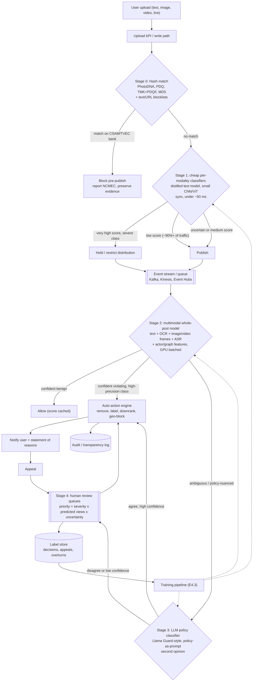
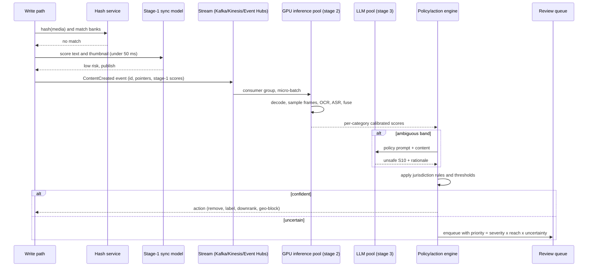

# E4 Facebook Content Moderation Case Study
> Last verified: 2026-10 · Audience: senior/staff DevOps, SRE, AI eng, NetEng, DevSecOps, architects

## TL;DR
- Frame it as a **cascade**: the cheapest exact signals run first, the most expensive judgment runs last. **Hash match** (PhotoDNA/PDQ/TMK+PDQF) → **cheap per-modality classifiers** → **fused multimodal "whole-post" model** → **LLM policy classifier** (Llama Guard-style) → **prioritized human review**. Each stage handles roughly 10x less traffic than the one before it.
- Requirements are split **per harm category**. CSAM and terrorism need near-100% recall, run pre-publish where possible, and allow very aggressive auto-action. Bullying, hate and misinformation need high precision, depend on context and run post-publish. One global threshold is the wrong answer.
- Split latency into **tiers**: a synchronous pre-publish gate (tens of ms: hash plus tiny models), near-real-time async post-publish (seconds to minutes), and batch/re-scan (hours, e.g. when a new hash bank or model ships).
- The north-star metric is **prevalence**: the share of *views* that land on violating content, estimated with stratified human-labelled sampling. Pair it with **proactive rate** (actioned before any user report), precision/appeal-overturn rate, and time-to-action weighted by views.
- The training loop is the product. It runs on **human labels plus appeals**, **active learning** (uncertainty and disagreement sampling), class-imbalance handling, adversarial-evasion red teaming, and fast adaptation to new harms (Meta's **Few-Shot Learner** cut adaptation from months to weeks; LLM policy prompts cut it to days).
- Costs are controlled through **early exit**, **distillation** (an LLM teacher labels data, a small student model serves 100% of traffic), GPU dynamic batching, and running heavy models only on content that is *likely to get views*.
- Product requirements: **appeals**, **regional law** (EU DSA statement of reasons and complaint handling; country-specific geo-blocking), and auditability of every decision, including model version, threshold and reviewer.
- Since Jan 2025, Meta's direction has been to aim automation at **illegal/high-severity** harms, raise confidence thresholds, use **LLMs as a "second opinion"** before enforcement, and leave low-severity harms to user reports. That is a precision-over-recall shift, and Meta reported about 50% fewer enforcement mistakes in the US.

---

## E4.1 System Requirements

### Functional
- **Ingest every content surface.** Posts, comments, images, video, Reels, Live, Stories, ads, profiles and groups. Messaging is E2EE, so server-side scanning is limited there (metadata, user reports and client-side signals only), and you should say so.
- **Classify against a policy taxonomy.** Use multi-label output per harm category (e.g. CSAM, terrorism/DOI, violence/graphic, adult nudity, hate, bullying/harassment, self-harm/suicide, spam/scams/fraud, regulated goods, misinformation).
- **Choose from a graduated action ladder,** not just allow/remove. Options: allow · label/interstitial ("sensitive content") · downrank/demote · age-gate · geo-block (local law only) · remove · strike/account penalty · escalate to law enforcement (e.g. NCMEC CyberTipline for CSAM).
- **Support appeals and restore.** The user gets a notice with the reason, appeals, the case is re-reviewed (by a different reviewer or a higher tier), and content is restored on overturn. The overturn becomes a high-value label.
- **Keep an audit trail.** Store the decision record (content ID, policy, model+version, scores, threshold, reviewer ID, jurisdiction, timestamps) for transparency reports and regulators.

### Non-functional / scale (state these as interview assumptions)
| Dimension | Assumption to state | Consequence |
|---|---|---|
| Volume | ~**3–5B new items/day** across surfaces (unverified, use as an envelope) → ~35–60K items/s average, 2–3x at peak | Stream processing; per-item cost must be sub-millicent at the head of the cascade |
| Images/video | ~1B+ images/day; video is a small share of count but most of the compute (decode, keyframes, ASR) | Frame sampling; GPU for decode and inference |
| Languages | 100+ languages; FSL covers 100+ | Multilingual encoders (XLM-R family), with translation only as a fallback |
| Pre-publish latency | p99 **< 50–100 ms** added to the post path | Only hashing and tiny models run synchronously |
| Post-publish latency | p95 **seconds to minutes**; for Live, act within seconds to minutes | Async queues; for virality, prioritize by predicted views |
| Availability | Moderation failure must **fail open** for posting (except hash-bank hits on CSAM/TVEC, which fail closed) | A degraded mode where the queue backlog is OK but posting stays up |
| Human review | Tens of thousands of reviewers (unverified); costly and wellbeing-sensitive | Send humans only the ambiguous, high-reach and appeal cases |

### Precision/recall trade-off per harm category
| Category | Optimize for | Typical gate | Auto-action? |
|---|---|---|---|
| CSAM, terrorist propaganda (known) | **Recall ~100%** on known; legal mandate | Pre-publish hash match | Yes. Block, report, preserve evidence |
| Novel CSAM / TVEC | Recall, with human confirmation | Async classifier → specialist queue | Restrict immediately, then specialist review |
| Adult nudity, graphic violence | Balanced; precision helps on "art/medical/news" exceptions | Async | Auto at high confidence; interstitial at mid confidence |
| Hate speech, bullying | **Precision** (context, reclaimed slurs, satire, counter-speech) | Async plus user reports | Humans or an LLM second opinion before removal |
| Spam/scams | Recall plus speed (adversarial, high volume) | Pre- and post-publish; account-level signals | Yes, heavy automation |
| Misinformation | Precision; policy is volatile | Post-publish; Community Notes (US since 2025) | Mostly labels/downrank, not removal |
| Self-harm | Recall (safety), with **supportive** action rather than punitive | Async, prioritized | Resources/interstitial; escalate imminent risk |

- **Cost asymmetry.** A false negative on CSAM causes legal and human harm. A false positive on political speech harms trust and draws regulatory scrutiny (DSA). Thresholds should come from the **cost matrix per category per region**.

### Regional law (requirements, not footnotes)
- **EU Digital Services Act (DSA).** Notice-and-action, a **statement of reasons** to the affected user, an internal complaint-handling (appeals) system, out-of-court dispute settlement, transparency DB submissions, and VLOP risk assessments and audits.
- **EU Terrorist Content Online Regulation.** Remove within **1 hour** of a competent authority's removal order. That needs a 24/7 on-call path that bypasses the normal queue.
- **Germany NetzDG** (largely superseded by the DSA): 24h for "manifestly unlawful" content. **UK Online Safety Act**: illegal-harms and child-safety duties enforced by Ofcom.
- **Design implication.** Keep a policy engine that is **jurisdiction-aware**. The same item may be *geo-restricted* in one country and visible elsewhere. Keep data-residency for review tooling and evidence storage (→ [L3 Residency & compliance](../L-data-privacy-ai-security/L3-residency-compliance.md)).

### Trade-offs / when to use
- Pre-publish blocking cuts exposure to zero but adds latency and has a large false-positive blast radius. Reserve it for hash matches and very high-confidence severe classes.
- Post-publish async can use bigger models, but violating content collects views until it is actioned. Mitigate that by gating **distribution**: hold a borderline item out of recommendation feeds until it is scored.

### Interview angles
- "What's your success metric?" → **Prevalence** (views of violating content ÷ total views, from stratified sampling with 95% CIs), not "number removed". Removals can go up while user exposure stays flat.
- "Precision or recall?" → It depends on the category. Write the cost matrix and show different thresholds per category and per action. Auto-remove needs high precision. "Send to review" can trade precision for recall.
- Pitfall: treating moderation as a single binary classifier. A strong answer covers multi-label output, multi-action decisions, multi-region rules and multi-stage processing.
- Follow-up: "What happens if the moderation service is down?" → Posting fails open. Hash-bank checks fail closed for severe classes. The backlog drains with view-weighted priority, and everything gets a re-scan.

---

## E4.2 Architecture & Model Selection

### The cascade (main diagram)


### Stage 0: hash matching for known content
- **How it works:** a perceptual hash is computed on upload and nearest-neighbor matched against **hash banks** of previously confirmed violating media.
  - **PhotoDNA** (Microsoft): the industry standard for **CSAM**. It is licensed only to qualified orgs, via the PhotoDNA Cloud Service. NCMEC and industry hash lists use it. Azure Content Safety/Content Moderator explicitly **cannot** be used for CSAM detection.
  - **PDQ** (Meta, open source via **ThreatExchange**, 2019): a **256-bit** perceptual image hash "inspired by pHash". Recommended match at **Hamming distance ≤ 31**. A **quality score** goes with it (discard hashes with quality ≤ 49). It is not rotation-invariant, so hash the dihedral variants. About 4K img/s per core-ish with FAISS matching (per the README).
  - **TMK+PDQF** (Meta + Univ. Modena/Reggio Emilia): **video** matching. It handles temporal match plus per-frame PDQF, and catches re-encodes and trims.
  - **Hasher-Matcher-Actioner (HMA)**: Meta's open-source reference service that wires hashing → matching → action, with ThreatExchange/GIFCT bank sync.
  - Industry sharing: **GIFCT** hash-sharing DB for terrorist content, NCMEC for CSAM, StopNCII for non-consensual intimate imagery.
- **Indexing:** a 256-bit Hamming search at billions-scale uses **multi-index hashing** (split into 16-bit chunks, exact lookup on chunks, verify full distance) or FAISS binary indexes. Shard by hash prefix (→ [B6 Sharding](../B-database-engineering/B6-database-sharding.md)).
- **Trade-offs:** almost zero false positives and very cheap (microseconds), so it runs **pre-publish on 100%** of uploads. But it only finds *known* content. Adversaries crop, overlay or mirror, so pair hashing with **media-match on derived content** and classifiers. When a new bank entry arrives, a **retroactive re-scan** of stored content has to run (batch).

### Stage 1: cheap classifiers (sync or near-sync)
- Distilled text transformers (e.g. a 6-layer multilingual student model of an XLM-R-class teacher, int8-quantized), small CNN/EfficientNet/ViT-S image models, and spam/actor models (gradient-boosted trees on account age, velocity, graph and IP reputation).
- Goal: **filter out the ~90%+ of obviously benign traffic** and catch the obvious severe cases. Run on CPU or small GPU slices. Cache embeddings for reuse downstream.
- Text normalization (homoglyphs, leetspeak, zero-width chars, emoji substitution) is a must-have against evasion.

### Stage 2: multimodal "whole-post" models
- Meta's public pattern is **WPIE (Whole Post Integrity Embeddings)**. It fuses text, image, OCR'd text-in-image, video, comments and author signals into one representation, because memes are harmful only *in combination* (benign image + benign text = hateful meme; see the Hateful Memes challenge).
- Building blocks: a multilingual text encoder (**XLM-R**), efficient long-context attention (**Linformer**, linear-time attention, which Meta used for hate speech at scale), image/video encoders (ViT/CLIP-style, frame sampling at e.g. 1 fps plus shot-boundary keyframes), **ASR** for audio, and **OCR** for text in images.
- Output: multi-task heads (one per policy category), each with a calibrated probability, so thresholds stay per-category.
- **Live video:** rolling-window scoring on sampled frames and audio, plus a reach-based trigger (concurrent viewers) for priority human review.

### Stage 3: LLM-based policy classifiers
- **Llama Guard family** (Meta, open weights). It is an LLM fine-tuned to output `safe` / `unsafe` plus the violated category codes, given a **policy taxonomy in the prompt**.
  - **Llama Guard 3:** 1B and 8B text variants; **11B-Vision** for image+text. It uses the MLCommons-aligned hazard taxonomy (S1–S13 plus code-interpreter abuse).
  - **Llama Guard 4 (Apr 2025):** **12B**, **natively multimodal** (early fusion), **pruned from Llama 4 Scout** (routed experts removed, shared dense expert kept). It covers **14 hazard categories S1–S14**, supports **multi-image** input, and replaces both LG3-8B and LG3-11B-Vision. Meta reports +4% recall on English text, +10% on single images and +20% on multi-image relative to LG3.
  - Companion: **Prompt Guard** (small classifier for jailbreak/prompt injection). It matters for GenAI surfaces, not much for UGC.
- **Why LLMs at this stage:** policy-as-prompt makes a new or changed policy deployable in **days** without retraining. The model reasons about context (satire, counter-speech, news reporting) and can produce **explanations** for the statement of reasons and reviewer assistance.
- **Why not everywhere:** cost and latency are 100–1000x a distilled encoder, outputs are non-deterministic unless constrained, and the model is itself an attack surface (prompt injection *inside the content under review*, so wrap content in delimiters and never let it change instructions; → [L4 AI security threats](../L-data-privacy-ai-security/L4-ai-security-threats.md)).
- Meta (Jan 2025) said it uses **LLMs to provide a "second opinion"** on some content before enforcement. That is the canonical placement: right before an irreversible action.

### Stage 4: human review with prioritization
- **Priority score** ≈ `severity_weight(category) × predicted_reach (views in next N hours) × model_uncertainty`, plus SLA boosts (legal orders, Live, imminent self-harm). Reviewing a post that will get 10 views is worth less than one going viral.
- **Routing:** language/market skills, specialist queues (CSAM, terrorism, legal), tiered escalation (tier-1 outsourced → tier-2 FTE policy experts → policy team), and **multi-reviewer consensus** for high-impact actions (Meta 2025: "multiple reviewers" in more cases).
- **Reviewer tooling:** blur/greyscale by default, time limits on graphic content, and wellness rotation. Pre-fill model rationale but measure **automation bias** (randomly hide model suggestions on a sample).
- **QA:** golden-set audits, inter-annotator agreement (Cohen's/Krippendorff's κ), and reviewer accuracy feeding back into routing weights.

### Model selection summary
| Stage | Model choice | Why | Cost/item (relative) |
|---|---|---|---|
| 0 | PDQ/TMK/PhotoDNA + blocklists | Exact known-bad, near-zero FP | 1x |
| 1 | Distilled multilingual text encoder, small image CNN/ViT, GBDT actor model | Throughput; CPU/INT8 | ~10x |
| 2 | Multimodal fusion transformer (XLM-R/Linformer text + ViT/CLIP image + ASR/OCR) | Cross-modal harms (memes), multi-task heads | ~100x |
| 3 | Llama Guard 3/4-style LLM, or a larger in-house LLM with policy prompts | Nuance, quick policy changes, explanations | ~1,000–10,000x |
| 4 | Humans | Ground truth, appeals, edge cases | ~10^6x |

### Trade-offs / when to use
- **Build vs buy.** At Meta scale you build: custom taxonomy, 100+ languages, cost. A mid-size platform should buy managed APIs (Rekognition, Content Safety) for stages 1–2, use open-weights Llama Guard for stage 3, and add custom adapters/categories for its own policies.
- **One multi-task model vs many per-category models.** Multi-task shares compute and the representation. Per-category models ship independently and isolate regressions. A common answer is a shared backbone with per-category heads plus independent threshold configs.
- **Per-modality vs early-fusion.** Late fusion is cheaper and modular. Early fusion catches cross-modal meaning. Use cheap per-modality models in stage 1 and fusion in stage 2.

### Interview angles
- "Why not just run Llama Guard on everything?" → Do the math: 50K items/s at even ~20 ms GPU time each is about 1,000 GPU-seconds per second, so roughly 1,000 GPUs with no headroom, before images. A cascade with ~2% escalation to the LLM cuts that 50x. **Distill** the LLM into stage-1/2 students.
- "How do you handle memes?" → OCR plus image plus text fused (WPIE-style). Show the hateful-meme example where neither modality alone is violating.
- "Known vs novel content?" → Hashing for known content, classifiers for novel. Every confirmed novel item gets **hashed back into the bank**, which closes the loop.
- Pitfall: putting the LLM pre-publish on the write path. It belongs async, or as a pre-enforcement check.

---

## E4.3 Training & Inference Pipeline

### Training data and labeling ops
- **Label sources, by trust level:** specialist reviewers > tier-1 reviewers > appeal outcomes (very high signal, especially *overturns* = false positives) > user reports (noisy, brigaded, biased) > LLM-generated labels (cheap, need calibration against a human gold set).
- **Label schema:** policy category + sub-reason + action + confidence + jurisdiction. Version the **policy** itself. When policy changes, labels need a `policy_version`, and old labels may need re-annotation or must be excluded.
- **Annotation QA:** golden questions, consensus (2–3 labelers for training data), adjudication, and per-language/per-market agreement tracking.

### Active learning
- **Uncertainty sampling:** route scores near the threshold to labelers.
- **Disagreement sampling:** cases where stage-2 and the LLM disagree, or model versions disagree.
- **Diversity/coverage sampling:** embedding-space clustering to find unlabeled regions (new memes, new slang).
- **Prevalence sampling, kept separate:** sample *by views* (stratified) to estimate prevalence without bias. Never estimate prevalence from active-learning samples, because they are biased by design.

### Class imbalance
- Violating content is a tiny fraction of total volume. Meta reports prevalence in the hundredths of a percent of views for many categories.
- Techniques: stratified/hard-negative mining, class-weighted or **focal loss**, oversampling the minority class with augmentation, and **calibration** (Platt/isotonic) after reweighting so thresholds mean something.
- Evaluate on **PR-AUC and recall-at-fixed-precision** (e.g. R@P=0.95 for the auto-remove threshold). ROC-AUC looks great at 1:10,000 imbalance and tells you little.

### Adversarial evasion
- Tactics: character obfuscation, text rendered into images, image perturbation/cropping/borders to beat hashes, coded language/dog whistles, splitting content across comments, rapid account recycling, and AI-generated variants.
- Countermeasures: normalization layers, OCR, multiple hash types plus derived-content matching, **actor/behavior models** (the account and network are harder to fake than the content), **adversarial training** with red-team-generated variants, and fast adaptation:
  - Meta's **Few-Shot Learner (FSL)**: pretrained on billions of generic examples, then on policy-violating and borderline content, with entailment-style formulation (content ⊨ policy description). It covers 100+ languages and adapts to new harm types in **weeks rather than months**.
  - **Policy-as-prompt LLMs** → days. Then distill once enough labels exist.
- **RIO (Reinforcement Integrity Optimizer)** (Meta, 2020): optimizes classifiers end-to-end with **online enforcement outcomes as reward** (data, features, architecture, parameters), instead of a static offline dataset. Use it as an example of "optimize the business metric, not offline F1".

### Distillation for cost
- Teacher: LLM or large multimodal model. It labels millions of unlabeled items and produces soft labels.
- Student: small encoder, trained on human labels plus teacher soft labels (KD loss), then **quantized** (INT8/FP8) and pruned.
- Gate promotion on the **human gold set**, not teacher agreement. Otherwise the student inherits teacher bias.

### Training infrastructure and release
- A lakehouse holds content features, embeddings and labels (→ [M1 Lakehouse table formats](../M-data-platforms/M1-lakehouse-table-formats.md)), with point-in-time correct feature joins.
- Retrain cadence: per category, from daily (spam) to monthly (stable categories). Triggers: drift in score distributions, rising appeal overturn rate, new policy version.
- **Release gates:** offline R@P per category, per language and per region (fairness slices), shadow mode on live traffic, then canary with **enforcement volume deltas** (a new model that suddenly removes 3x more is a red flag), then full rollout. Threshold configs are versioned separately from model weights (→ [K9 LLMOps, evals, guardrails](../K-ai-infra-llm/K9-llmops-evals-guardrails.md), [K5 Training & fine-tuning](../K-ai-infra-llm/K5-training-fine-tuning.md)).

### Inference pipeline

- **Async via queues/streams.** Partition by content ID. Use separate topics per modality and priority (Live and high-reach on a fast lane). Consumers must be **idempotent**, because the same content ID may be re-scored on edit, re-scan or model upgrade. DLQ the poison items (corrupt media). (→ [M4 Kafka at scale](../M-data-platforms/M4-kafka-at-scale.md), [M5 Stream processing](../M-data-platforms/M5-stream-processing.md))
- **GPU batching.** Dynamic batching (Triton/vLLM-style), with batch size tuned on the latency-SLO knee. Separate pools per model size. Video decode on GPU (NVDEC) avoids CPU bottlenecks. For the LLM stage, constrain output (short category tokens) so tokens decoded per item stay at a handful (→ [K4 LLM serving](../K-ai-infra-llm/K4-llm-serving-inference.md)).
- **Cascade/early exit.** Each stage has **two thresholds** (benign-exit and violating-exit) with the band in between escalating. Tune the bands to a cost budget: the expected per-item cost is Σ stage_cost × pass-through rate.
- **Reach-aware compute.** Run expensive models first on content that is starting to accumulate views. Re-score on velocity spikes. This is the cheapest way to cut prevalence.
- **Caching/dedup.** Exact-dup (MD5/SHA) and near-dup (PDQ) results are reused. A meme shared 1M times is scored once.
- **Backpressure/fail-open.** If GPUs saturate, stage-1 decisions stand and the backlog drains by priority. Alert on queue age (oldest unprocessed item) rather than depth (→ [J2 Monitoring & alerting](../J-sre/J2-monitoring-and-alerting.md)).

### Metrics
| Metric | Definition | Use |
|---|---|---|
| **Prevalence** | Est. % of content *views* that were violating; stratified sampling, 95% CI | North star per category |
| **Proactive rate** | % of actioned content found by systems before a user report (Meta reported 94.7% for hate speech in its 2020-era report) | Detection coverage; can be gamed by over-removal |
| Content actioned | Count of items acted on | Volume, not quality |
| **Appealed / restored** | Appeals filed; % overturned (with/without appeal) | Precision proxy; FP cost |
| Precision/recall @ threshold | Per category, per language, per region | Release gates, fairness |
| Time-to-action, view-weighted | Views accrued before action | Latency SLO that reflects harm |
| Reviewer metrics | Accuracy vs gold, κ, queue age, handle time | Ops health |
| Cost | $ per 1K items per stage, GPU utilization | Cascade tuning |

### Feedback loops (and their traps)
- **Positive loops:** review decisions → labels; appeals overturns → hard negatives; confirmed novel media → hash bank; new trend clusters → FSL/LLM prompt → labels → distilled student.
- **Selection bias:** the model only sees labels on content *it* flagged, so recall estimates drift. Fix it with **random exploration samples** and prevalence sampling independent of the model.
- **Automation bias:** reviewers rubber-stamp model suggestions, so the labels just echo the model. Fix it with blind-review samples.
- **Adversarial co-adaptation:** attackers probe thresholds. Avoid exposing exact scores or the reason granularity that would teach evasion, which is in tension with DSA transparency.
- **Feedback delay:** appeals can land weeks later. Use delayed-label joins and don't train on unresolved cases.

### Interview angles
- "How do you know your recall?" → You can't measure it from model flags. Use **prevalence sampling** of views (independent of the models) to estimate what was missed.
- "New harm trend appears tomorrow, what do you do?" → Same day: hash known samples and add keyword/blocklists. Days: LLM policy prompt in the ambiguous band plus review. Weeks: FSL/fine-tune and distill into the cheap stages.
- "Model update doubled removals overnight." → Roll back the threshold config (separate from the weights), check the calibration shift, and check slice metrics (a language or region regression). This is why canaries watch **action-volume deltas**.
- Pitfall: training on user reports as ground truth (brigading, mass-report attacks).

---

## Cloud mapping: AWS vs Azure
| Capability | AWS | Azure | Role it plays | Key differences | Alternatives |
|---|---|---|---|---|---|
| Image/video moderation | **Rekognition** `DetectModerationLabels` (image, sync), `StartMediaAnalysisJob` (bulk), `StartContentModeration` (video, async + SNS) + **Custom Moderation adapters** | **Azure AI Content Safety** Analyze Image (+ multimodal image+text, preview) | Stage 1–2 managed classifier | Rekognition: 3-level taxonomy (L1/L2/L3), confidence 0–100 (`MinConfidence` default 50), **stored video supported**. Content Safety: 4 categories (Hate, Sexual, Violence, Self-harm) with severity 0/2/4/6 for images; **no video API** (sample frames yourself; legacy Content Moderator video is deprecated) | Self-host CLIP/ViT on K8s, Llama Guard 4 vision, Gemini/Claude with policy prompts |
| Text moderation | **Comprehend** `DetectToxicContent` (8 labels incl. HATE_SPEECH, INSULT, VIOLENCE_OR_THREAT; **English only**; ≤10 segments × 1 KB) | Content Safety **Analyze Text** (≤10K chars; severity 0–7 or trimmed 0/2/4/6; 8 tested languages, more work) + **blocklists** + **custom categories** (preview) | Stage 1 text | Azure is multilingual and severity-graded; Comprehend is English-only, probability-scored | Distilled XLM-R students, Perspective API (Google), Llama Guard 3-1B |
| LLM / GenAI guardrails | **Bedrock Guardrails** (content filters Hate/Insults/Sexual/Violence/Misconduct/Prompt attack, NONE–HIGH strength; text + image; denied topics, word filters, PII, contextual grounding, Automated Reasoning; `ApplyGuardrail` works without invoking a model) | Content Safety **Prompt Shields** (jailbreak + indirect/document attacks), protected material, groundedness (preview), task adherence; surfaced as **Foundry Guardrails** | Stage 3 policy check / GenAI surfaces | Bedrock images: PNG/JPEG ≤4 MB, ≤20/request, 25 img/s fixed. Azure Prompt Shields ≤10K chars + 5 docs | Llama Guard 4 + Prompt Guard self-hosted, NeMo Guardrails |
| Custom model train/serve | **SageMaker AI** (training, real-time/async endpoints, multi-model, inference components) | **Azure Machine Learning** / Foundry (managed online & batch endpoints) | Stages 1–3 in-house models | Both support GPU autoscaling; SageMaker Async Inference fits big video payloads (S3 in/out, scale-to-zero) | Kubernetes + Triton/vLLM, Databricks Model Serving |
| Human review | **Amazon A2I** (flow definitions, Rekognition built-in; private/vendor/MTurk workforce). **Closed to new customers**, no new features; alternatives: **SageMaker Ground Truth** or a custom review app | No managed equivalent (Content Moderator Review tool retired with Content Moderator). Use **Azure ML Data Labeling** for training labels plus a custom review app (App Service/Functions + Service Bus + Cosmos DB) | Stage 4 queues + labels | Both clouds now point you to **build** production review tooling; managed labeling is for training data, not real-time ops | Labelbox, Scale, in-house tooling |
| Ingest stream | **Kinesis Data Streams** / **MSK** (Kafka) | **Event Hubs** (Kafka-protocol endpoint) | Fan-out ContentCreated events to stages | Kinesis shard = 1 MB/s or 1K rec/s in; Event Hubs throughput/processing units; both replayable (retention) for re-scans | Apache Kafka/Confluent |
| Work queues | **SQS** (standard/FIFO, DLQ, visibility timeout) | **Service Bus** (sessions, DLQ, scheduled msgs, **priority via separate queues/subscriptions**) / Storage Queues | Per-stage work dispatch, review queues | Service Bus has richer broker semantics (sessions, duplicate detection, transactions); SQS is simpler and nearly unlimited throughput | RabbitMQ, Kafka topics per priority |
| Hash matching | No managed perceptual-hash service; self-host PDQ/HMA on ECS/EKS + OpenSearch/DynamoDB | **PhotoDNA Cloud Service** (Microsoft; qualified orgs, CSAM) | Stage 0 | PhotoDNA is a Microsoft offering but licensed separately, not a normal Azure SKU | Meta HMA (open source), Thorn Safer, Cloudflare CSAM Scanning Tool |

- **Rekognition limits:** raw-bytes image ≤ **5 MB**, S3 image ≤ **15 MB**, min 80 px, `DetectModerationLabels` max 10K px. Stored video ≤ **10 GB / 6 h**, H.264 MP4/MOV, **20 concurrent video jobs/account** by default. Bulk analysis ≤ 10K images per batch. It also flags **animated/illustrated** content type. Rekognition does **not** detect illegal content such as CSAM. AWS claims ML pre-filtering lets humans review only ~**1–5%** of volume.
- **Azure Content Safety limits:** image ≤ **4 MB**, 50×50 to 7200×7200 px, JPEG/PNG/GIF/BMP/TIFF/WEBP. Multimodal (preview) text ≤ 1K chars. S0 rate: **1000 requests / 10 s** for text/image moderation, 10 RPS for multimodal. Region choice matters: some features (task adherence) route globally, which matters for **data residency**. Content Safety **cannot be used for CSAM detection**.
- **Retirements/renames (as of 2026-10):** Azure **Content Moderator** was deprecated Feb 2024 and **retires 15 Mar 2027**; migrate to Content Safety. Amazon **A2I** is closed to new customers. Comprehend **prompt safety classification** is no longer available to new customers. Azure AI Studio → **Azure AI Foundry → Microsoft Foundry**, where guardrails are configured per deployment.
- **Pricing shape:** all managed moderation APIs are **per image / per 1K text records**. At Meta-scale volumes, self-hosted distilled models are orders of magnitude cheaper. Managed APIs win under roughly hundreds of millions of items/month or for bootstrapping (judgment call, unverified threshold).
- **Architecture on AWS:** S3 upload → EventBridge/Kinesis → Lambda/ECS hash+stage-1 → SQS priority queues → SageMaker async endpoints (stage 2) → Bedrock (Llama Guard / Claude with policy prompt, or Guardrails `ApplyGuardrail`) → custom review UI (DynamoDB case store) → Step Functions for appeal workflows.
- **Architecture on Azure:** Blob → Event Grid/Event Hubs → Functions/AKS hash+stage-1 → Service Bus (priority queues, DLQ) → Azure ML managed endpoints → Content Safety / Foundry model with guardrails → custom review app (Cosmos DB) → Logic Apps / Durable Functions for appeals.

---

## Hands-on (optional)
```bash
# AWS: image moderation (S3 object), stricter-than-default confidence
aws rekognition detect-moderation-labels \
  --image '{"S3Object":{"Bucket":"ugc-uploads","Name":"post/123.jpg"}}' \
  --min-confidence 70

# AWS: async video moderation, completion notified via SNS
aws rekognition start-content-moderation \
  --video '{"S3Object":{"Bucket":"ugc-uploads","Name":"video/456.mp4"}}' \
  --min-confidence 60 \
  --notification-channel 'SNSTopicArn=arn:aws:sns:us-east-1:111122223333:mod-done,RoleArn=arn:aws:iam::111122223333:role/RekSNS'

# AWS: English-only toxicity (up to 10 segments x 1 KB)
aws comprehend detect-toxic-content --language-code en \
  --text-segments '[{"Text":"example comment"}]'

# Azure: text analysis with full 0-7 severity scale
curl -s -X POST "$CS_ENDPOINT/contentsafety/text:analyze?api-version=2024-09-01" \
  -H "Ocp-Apim-Subscription-Key: $CS_KEY" -H "Content-Type: application/json" \
  -d '{"text":"example comment","categories":["Hate","Violence","Sexual","SelfHarm"],"outputType":"EightSeverityLevels"}'
```

---

## Cross-links
- [E1 System design fundamentals](./E1-system-design-fundamentals.md): requirements → metrics → architecture framing
- [E2 Google CTR prediction case study](./E2-google-ctr-prediction-case-study.md): calibration, class imbalance, online/offline metrics
- [K9 LLMOps, evals, guardrails](../K-ai-infra-llm/K9-llmops-evals-guardrails.md) · [K4 LLM serving & inference](../K-ai-infra-llm/K4-llm-serving-inference.md) · [K7 AI gateways, caching, cost](../K-ai-infra-llm/K7-ai-gateways-caching-cost.md) · [K5 Training & fine-tuning](../K-ai-infra-llm/K5-training-fine-tuning.md)
- [L4 AI security threats](../L-data-privacy-ai-security/L4-ai-security-threats.md) (prompt injection inside moderated content) · [L3 Residency & compliance](../L-data-privacy-ai-security/L3-residency-compliance.md)
- [M4 Kafka at scale](../M-data-platforms/M4-kafka-at-scale.md) · [M5 Stream processing](../M-data-platforms/M5-stream-processing.md) · [M1 Lakehouse table formats](../M-data-platforms/M1-lakehouse-table-formats.md)
- [J1 SLIs, SLOs, error budgets](../J-sre/J1-slis-slos-error-budgets.md) · [J2 Monitoring & alerting](../J-sre/J2-monitoring-and-alerting.md)
- [D2 Reusable parts of system design](../D-system-design/D2-reusable-parts-of-system-design.md) (queues, rate limiting) · [B6 Database sharding](../B-database-engineering/B6-database-sharding.md)

## Sources
- https://docs.aws.amazon.com/rekognition/latest/dg/moderation.html
- https://docs.aws.amazon.com/rekognition/latest/dg/moderation-api.html
- https://docs.aws.amazon.com/rekognition/latest/dg/limits.html
- https://docs.aws.amazon.com/comprehend/latest/dg/trust-safety.html
- https://docs.aws.amazon.com/bedrock/latest/userguide/guardrails.html
- https://docs.aws.amazon.com/bedrock/latest/userguide/guardrails-mmfilter.html
- https://docs.aws.amazon.com/sagemaker/latest/dg/a2i-use-augmented-ai-a2i-human-review-loops.html
- https://learn.microsoft.com/en-us/azure/ai-services/content-safety/overview
- https://learn.microsoft.com/en-us/azure/ai-services/content-safety/concepts/harm-categories
- https://learn.microsoft.com/en-us/azure/ai-services/content-safety/region-availability
- https://learn.microsoft.com/en-us/azure/ai-services/content-moderator/overview
- https://huggingface.co/meta-llama/Llama-Guard-4-12B
- https://about.fb.com/news/2019/08/open-source-photo-video-matching/
- https://github.com/facebook/ThreatExchange/tree/main/pdq
- https://ai.meta.com/blog/harmful-content-can-evolve-quickly-our-new-ai-system-adapts-to-tackle-it/
- https://ai.meta.com/blog/how-facebook-uses-super-efficient-ai-models-to-detect-hate-speech/
- https://ai.meta.com/blog/training-ai-to-detect-hate-speech-in-the-real-world/
- https://transparency.meta.com/policies/improving/prevalence-metric/
- https://about.fb.com/news/2025/01/meta-more-speech-fewer-mistakes/
