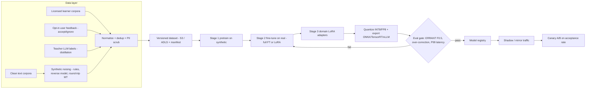
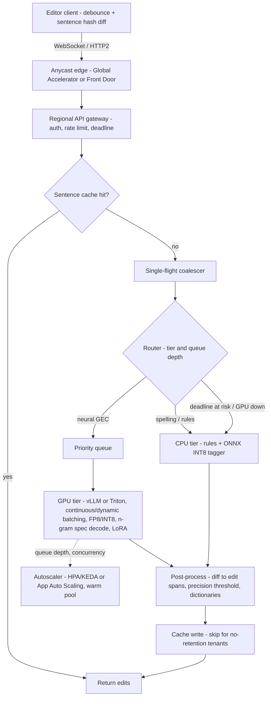
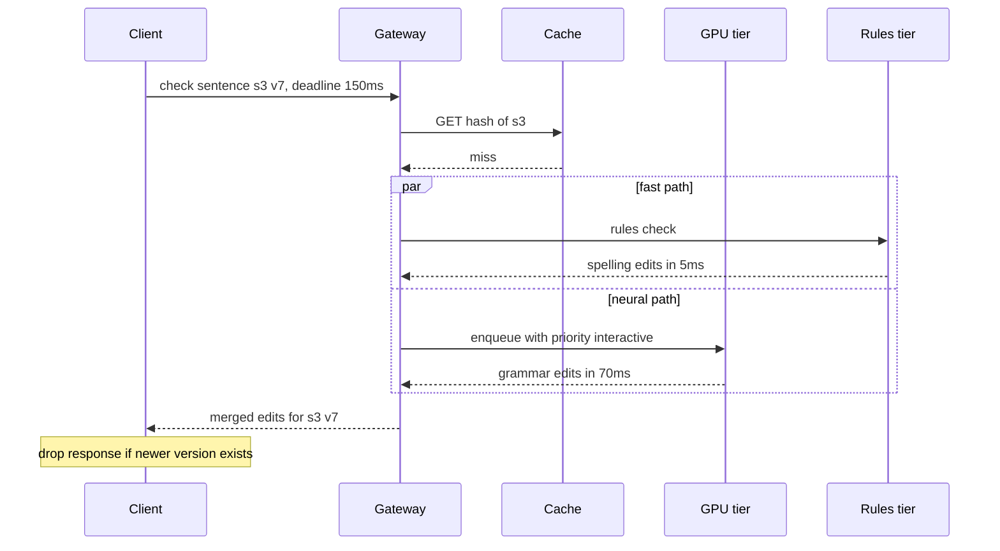

# E6 AI Grammar Checker SaaS Case Study
> Last verified: 2026-10 · Audience: senior/staff DevOps, SRE, AI eng, NetEng, DevSecOps, architects

## TL;DR
- **Traffic shape decides the design.** "100k concurrent users" is a keystroke stream, not a request stream. Turn it into **sentence-level checks** with client **debounce** (about 300–800 ms idle or a sentence boundary), **sentence-hash diffing** (only re-check sentences that changed), and **cancel-on-supersede**. That cuts raw load by 10–50x.
- **Back-of-envelope:** 100k users × 1 check per 5 s gives **about 20k RPS at steady state and about 40k RPS at peak**. A **30–50% cache hit rate** leaves about 20–28k RPS for the model. Size from **tokens/s per GPU**, not from users.
- **Use the smallest model that meets quality.** Options are a GEC-tuned **seq2seq (T5/BART class)**, a **sequence-tagging edit model (GECToR-style, non-autoregressive, one forward pass)**, or a **≤1–3B decoder distilled from a large LLM**. Make it cheaper with INT8/FP8 and **n-gram (prompt-lookup) speculative decoding**, which suits GEC well because the output mostly copies the input.
- **Training:** pretrain on **synthetic errors** (rule noising, reverse "clean→noisy" model, round-trip translation), then fine-tune on real learner corpora, then on a small high-quality set. Use **LoRA/QLoRA** for per-domain or per-tenant adapters. Evaluate with **ERRANT F0.5**, where precision counts double because false alarms lose user trust.
- **Inference:** **regional, edge-near deployments** behind anycast (Global Accelerator / Front Door). Then a gateway with auth and rate limiting, a **sentence-hash cache**, request coalescing, and **dynamic/continuous batching** (Triton / vLLM). Tier the work: a CPU tier handles spelling/rules/ONNX INT8, a GPU tier handles neural rewrites, and a **rules-based checker is the fallback** when the latency budget is blown.
- **Latency budget for 200 ms P99:** about 40 ms network to the edge PoP, about 20 ms edge to region, about 10 ms gateway and cache, **≤20 ms batching queue delay**, **≤80 ms model**, and about 30 ms headroom. Autoscale on **queue depth / concurrent requests per copy**, not CPU%. Keep **warm pools**, because GPU cold start takes minutes.
- **Privacy is a feature you sell:** **zero-retention / no-logging** by default for enterprise, **regional pinning** (EU traffic stays in the EU), CMK, opt-in training data only, and PII scrubbing before anything is stored.
- **Cloud mapping:** SageMaker real-time endpoints with **inference components** (plus Inferentia2 for cost) ↔ Azure ML **managed online endpoints** (Microsoft Foundry for catalog/serverless models). EKS + vLLM/Triton ↔ AKS + **KAITO** (vLLM-backed, CNCF Sandbox). Global Accelerator/CloudFront ↔ Front Door.

## E6.1 System Planning & Requirements (100k concurrent users, sub-200 ms P99)

### Clarifying questions (ask these first)
- **Surfaces:** browser extension, web editor, desktop/mobile keyboards, or an API for partners? Keyboards have the tightest latency needs and the weakest devices.
- **Feature depth:** spelling and grammar only (local edits), or also **style, tone and full-sentence rewrites** (generative and longer outputs)? Rewrites can carry a softer SLO, for example P99 ≤ 1 s, and run on a separate tier.
- **Languages:** English only, or multilingual? This drives model size and tokenizer choice.
- **Users:** consumer free tier vs paid vs **enterprise**. Enterprise brings data residency, no-retention, SSO and admin policy.
- **Correctness bar:** a false positive (flagging correct text) is worse than a miss. Optimize for **precision**.

### Functional requirements
- Underline errors as the user types and return a **list of edits** (`span start/end, replacement, category, confidence`), not a whole rewritten document.
- Support accept/ignore actions and a custom dictionary per user and per org. Feedback events feed training only with consent.
- Offer an optional on-demand "improve this paragraph" action. This is generative and runs on a separate SLO tier.

### Non-functional requirements
| Requirement | Target | Note |
|---|---|---|
| Concurrency | 100k concurrent active editors | Plan for **2–3x peak** (weekday mornings across time zones) |
| Latency | **P99 < 200 ms** per sentence check (server side ≤ ~120 ms) | Measured from request sent to suggestions rendered |
| Availability | 99.9% for the API, **graceful degradation** to rules | A grammar checker should **fail open**: no underline, never block typing |
| Freshness | Results only for the **latest** text version | Drop stale responses with a version or sequence number |
| Privacy | No content persisted by default for enterprise, regional processing | See E6.3 Privacy |
| Cost | GPU cost per active user per month is the core unit economic | Drives model size, caching and the CPU tier |

### Traffic shaping: keystrokes to checks
- **Raw keystrokes:** about 200 cpm (≈ 3.3 keystrokes/s) × 100k users = **about 330k events/s**. Never send these to a model.
- **Client debounce:** fire a check after **~300–800 ms idle**, on **sentence-terminal punctuation**, or on blur. This brings the rate down to roughly **one check every 3–10 s per active user**.
- **Incremental, sentence-level checks:** split the document into sentences on the client, hash each one (for example SHA-256 of normalized text plus language and model version), and send **only changed sentences** with context: the previous sentence plus a doc ID, for coreference and tense agreement.
- **Cancel-on-supersede:** each request carries a `(docId, sentenceId, version)`. The server drops queued work if a newer version arrives (cancellation over WebSocket / HTTP/2 stream reset). The client discards responses whose version is stale.
- **Transport:** a persistent **WebSocket or HTTP/2** connection per editor avoids a TLS handshake per check. 100k long-lived connections need L7 LBs or gateways sized for connections, not just RPS (see [F4 TCP](../F-network-engineering/F4-transmission-control-protocol.md)).

### Back-of-envelope math (state assumptions out loud)
| Step | Calculation | Result |
|---|---|---|
| Checks/s at steady state | 100k users ÷ 5 s per check | **20k RPS** |
| Peak | × 2 | **40k RPS** |
| After cache and dedup (40% hit) | 40k × 0.6 | **~24k RPS to model** |
| Tokens per check | ~25 input tokens (sentence) + ~15 context; output ~25 tokens (seq2seq rewrite) or **0 decode steps** (tagger) | |
| Decode load (seq2seq) | 24k × 25 | **~600k output tok/s** |
| Per-GPU throughput (assumption: ~1B INT8/FP8 model, continuous batching, L4/A10G class) | ~10–15k output tok/s at an acceptable per-token latency **(unverified, benchmark it)** | |
| GPUs (seq2seq) | 600k ÷ 12k = 50, × 1.3 headroom for P99, × N+1 per region | **~70–80 GPUs across 3 regions** |
| GPUs (tagger, encoder-only ~300M INT8) | thousands of sentences/s per GPU **(unverified)** → 24k ÷ ~3k | **~10–15 GPUs** (or a large CPU fleet) |
- **Takeaway for the interviewer:** the **model family (tagger vs autoregressive)** changes the fleet size by about 5x, which matters more than any infra tweak. Size from measured **tokens/s at the P99 latency target**, not from peak throughput. Run a load test sweep (see [J5 Capacity planning](../J-sre/J5-capacity-planning-load-testing.md)).
- **Latency per token:** a small model decodes at about 2–5 ms/token, so 25 tokens ≈ 50–125 ms. That is **why output length must be short**: emit **edits, not full rewrites**, or use a tagger.

### Latency budget (P99 200 ms)
| Hop | Budget |
|---|---|
| Client → nearest PoP (anycast, TLS already up) | 20–40 ms |
| PoP → regional origin over the provider backbone | 10–30 ms |
| Gateway: auth (cached JWT), rate limit, cache lookup | 5–10 ms |
| Batching queue delay (`max_queue_delay`) | ≤ 10–20 ms |
| Model inference (prefill + decode) | ≤ 60–80 ms |
| Post-processing (align edits to spans, filter low confidence) | ≤ 5 ms |
| Headroom (GC, retries, tail) | ~20–30 ms |

- **Trade-offs / when to use:**
  - Debounce delay trades **perceived latency for cost**. 300 ms feels instant, while 1 s halves the RPS.
  - Sentence granularity misses cross-sentence errors. Run a slower **paragraph or document pass** asynchronously (for example every 30 s or on idle) on a cheaper batch tier.
- **Interview angles:**
  - If asked "100k users = 100k RPS?", say no: **concurrency ≠ throughput**. Walk through debounce, then diffing, then cache, and give RPS with your assumptions.
  - If asked "Why P99 and not average?", explain that each user fires dozens of checks per minute, so they **hit the tail constantly**. P99 per request is close to the median *session* experience (see [J1 SLOs](../J-sre/J1-slis-slos-error-budgets.md)).
  - Pitfall: designing for whole-document re-checks on every keystroke.
  - Pitfall: forgetting stale-response handling, which makes underlines flicker in the wrong places.

## E6.2 Model Training Architecture

### Model choice
| Option | Latency | Quality | Cost | Notes |
|---|---|---|---|---|
| **Rules + spell (LanguageTool-style, Hunspell, n-gram LM)** | < 5 ms CPU | Low recall, high precision on covered rules | Lowest | Always present: **fallback tier** and first pass |
| **Sequence tagging (GECToR-style: encoder plus per-token edit tags such as KEEP/DELETE/APPEND_x/REPLACE_x)** | One forward pass, **no autoregressive decode** | Strong on local grammar | Low; runs on CPU with ONNX INT8 or a small GPU | Iterative refinement takes 2–3 passes. Edits are explicit, so spans are easy to show |
| **Seq2seq (T5/BART/Flan-T5 base–large, GEC-tuned)** | Encoder plus short decode | Strong, handles rewrites | Medium | Output is the corrected sentence. Diff it against the input to get edits |
| **Small decoder LLM (≤ 1–3B, distilled/LoRA)** | Decode-bound | Best fluency and style | Medium–high | Good for "improve" or tone features. Needs speculative decoding and quantization to hit SLO |
| **Large LLM (frontier API: Claude/GPT/Gemini)** | 300 ms–seconds | Best on hard rewrites | Highest per call | **Teacher** for distillation and offline labeling, not the hot path at 40k RPS |

- **Distillation:** a large LLM labels or corrects millions of sentences, producing silver data that trains the small student. Keep the teacher's **minimal-edit** behaviour, because large LLMs tend to **over-correct** (paraphrase), which hurts precision.
- **Quantization:**
  - **INT8** weights and activations: ONNX Runtime recommends **dynamic quantization for transformers on CPU**, using the S8S8 QDQ format by default. Static (calibrated) quantization suits CNNs. ORT GPU INT8 goes through the TensorRT EP and needs INT8 Tensor Cores.
  - **FP8 W8A8** in vLLM needs **Ada (SM 8.9) / Hopper (SM 9.0)** or newer, so it does not run on Ampere (A100/A10G).
  - **INT4 weight-only** (AWQ/GPTQ, W4A16) suits memory-bound small-batch decode.
- **Speculative decoding** (vLLM supports draft model, EAGLE, MTP, **n-gram / prompt lookup**, suffix decoding). GEC output ≈ input, so **n-gram prompt lookup** proposes the next tokens by copying from the source sentence and accepts most of them. vLLM's docs state that speculative decoding helps most at **medium-to-low QPS, memory-bound** workloads and gains less at high QPS. Benchmark at your real batch sizes.

### Data pipeline
- **Real corpora:** learner error corpora (Lang-8 / cLang8, NUCLE, FCE, W&I+LOCNESS). Check licensing: several are **research-only**, which is a common legal trap for a SaaS.
- **Synthetic error generation** (the bulk of the data, 10–100M+ pairs):
  - **Rule-based noising:** drop or swap articles and prepositions, change verb tense or agreement, insert typos using **keyboard-adjacency** and phonetic confusion sets, homophones (their/there), punctuation and casing.
  - **Reverse ("back-") model:** train a clean→noisy model on real pairs, then run it on clean web text. This gives realistic error distributions.
  - **Round-trip translation** for fluency-type errors.
  - **Match the error-type distribution** to production, measured on consented samples, or the model learns the wrong priors.
- **Curriculum:** (1) pretrain on synthetic data, (2) fine-tune on real learner data, (3) fine-tune on a small high-quality, in-domain set (for example business email).
- **Feedback loop:** accept/ignore events are **weak labels** (an ignored suggestion is likely a false positive). Collect them only from users who opted in, de-identified, with **sentence text stored separately or not at all** under enterprise no-retention.
- **Fine-tuning:** **LoRA/QLoRA** adapters per domain or language (and optionally per large enterprise tenant). Use **multi-LoRA serving** so one base model serves many adapters (vLLM supports LoRA adapters, and KAITO inference workspaces can mount adapters). See [K5 Training & fine-tuning](../K-ai-infra-llm/K5-training-fine-tuning.md).

### Evaluation
- **ERRANT** extracts and classifies edits (for example `R:VERB:TENSE`, `M:DET`) and scores **span-level P/R/F0.5** (BEA-2019 standard). The CoNLL-2014 benchmark uses the **M2 scorer**.
- **F0.5** weights **precision twice as heavily as recall**. A wrong red underline costs more trust than a missed one.
- Gate with **per-category regression tests** so that no error type drops more than x%, plus **over-correction rate** on clean text (it should flag about 0%), plus **latency and throughput on the target hardware after quantization**. Quantization can silently lose 0.5–2 F0.5.
- **Online:** acceptance rate, ignore rate, and "undo after accept". Shadow or mirror new models (Azure ML endpoints support traffic mirroring; SageMaker uses shadow variants) before an A/B ramp. See [K9 LLMOps evals](../K-ai-infra-llm/K9-llmops-evals-guardrails.md).



- **Trade-offs / when to use:**
  - Tagger: best latency and cost, explicit edits, weaker on rewrites.
  - Seq2seq / small LLM: better fluency, but needs decode optimizations.
  - Common answer: **tagger or small seq2seq on the hot path, plus a small LLM for opt-in rewrites.**
  - LoRA per tenant gives isolation and customization. The cost is adapter sprawl and eval burden, so cap the number of adapters.
- **Interview angles:**
  - If asked "Why not just call a frontier LLM?", answer with cost (40k RPS × tokens), latency (hundreds of ms or more), over-correction, and data residency. Use it as **teacher and judge** instead.
  - If asked "How do you get training data?", answer: synthetic noising plus a reverse model, licensed corpora, and distillation, with distribution matching.
  - If asked "Which metric?", say **F0.5 via ERRANT**, plus online acceptance rate.
  - Pitfall: evaluating only on benchmark test sets while production is business email.

## E6.3 Inference Architecture

### Request path
1. **Edge:** anycast entry (AWS Global Accelerator / CloudFront, or Azure Front Door) terminates TLS near the user and rides the provider backbone to the **nearest healthy region**. Residency rules can pin enterprise tenants to a region set (EU only). See [I3 Acceleration](../I-dns-tls-acceleration-gaps/I3-acceleration.md).
2. **Gateway (regional):** auth (JWT/API key), **per-tenant rate limits**, request validation (max sentence length, for example ≤ 512 tokens), and routing to a tier.
3. **Cache:** Redis keyed by `hash(normalized_sentence + lang + model_version + tenant_dictionary_version)` with a TTL of hours to days. Hit rates are high for boilerplate ("Thanks for your email.", signatures). For **no-retention tenants**, use a per-tenant namespace, an in-memory-only short TTL, or disable the cache. Bump the version to invalidate on model deploys (see [C1 caching](../C-large-scale-architecture/C1-performance.md)).
4. **Request coalescing (single-flight):** identical in-flight sentence hashes share one inference, which matters when many users paste the same template.
5. **Tiered inference:**
   - **CPU tier:** spell checking, rules, and ONNX Runtime INT8 tagger. It is cheap, scales horizontally, and serves as the always-on fallback.
   - **GPU tier:** neural GEC on **Triton** (dynamic batcher with `max_queue_delay_microseconds` and priority levels, queue policy with max queue size and timeouts, `ModelWarmup`) or **vLLM** (continuous batching, prefix caching, LoRA, FP8, n-gram speculation).
6. **Post-process:** diff the output against the input to produce edit spans, apply the confidence threshold (tuned for precision), and apply user and org dictionaries and style-guide filters.
7. **Deadline propagation:** the request carries a deadline (for example 150 ms). If the GPU queue is too deep, **shed to the rules tier** and return a partial result instead of a late one. The client renders whatever arrives and the neural results can refine later.

### Batching
- **Dynamic batching (Triton):** wait up to `max_queue_delay` (for example 5–10 ms) to build bigger batches. Throughput rises and latency is bounded. Triton docs advise against `preferred_batch_size` unless specific sizes (for example TensorRT profiles) are much faster. Tune in this order: max batch → enable → measure → adjust delay.
- **Continuous (iteration-level) batching (vLLM):** new requests join at each decode step, so short GEC outputs do not wait for long ones. This is essential for autoregressive models.
- **Priority queues:** interactive checks rank above document-level background passes and "improve" rewrites.

### Autoscaling and warm capacity
- Scale on **concurrency or queue depth**, not CPU%:
  - SageMaker target-tracking: **`SageMakerVariantConcurrentRequestsPerModelHighResolution`** or **`SageMakerInferenceComponentConcurrentRequestsPerCopyHighResolution`**. These emit **every 10 s** (standard metrics like InvocationsPerInstance emit every 1 min) and scale out faster, while scale-in speed stays the same as with standard metrics.
  - On Kubernetes: KEDA/HPA on vLLM `num_requests_waiting` or Triton queue-time metrics, and GPU util (DCGM) as a secondary signal.
- **Warm pools:** GPU nodes plus model load take minutes. KAITO docs say machine readiness can take up to ~10 min and workspace readiness up to ~20 min for large models.
  - Keep **min capacity = peak-of-last-hour or predictive** (scheduled scale-up ahead of 9 am by time zone).
  - Pre-pull images, cache weights on local NVMe, and use Triton `ModelWarmup` so the first request is not slow.
- **Scale-to-zero** (SageMaker inference components only, via `MinInstanceCount: 0` plus a step-scaling alarm on `NoCapacityInvocationFailures`) suits rarely used **per-language or per-tenant adapters**, not the hot path. Invocations fail while capacity provisions, which takes several minutes.
- **Multi-region capacity:** N+1 per region, and the surviving regions absorb a failed region's load **within the latency budget for nearby geos only**. A far region breaks 200 ms, so degrade to the CPU tier there instead.

### Reliability and fallback
- **Fail open:** if the neural tier is down or slow, serve rules and spelling only. The UI never blocks typing.
- Circuit breaker per tier, a retry budget (no retries for interactive checks past the deadline), hedged requests only for the CPU tier.
- **Model rollout:** shadow/mirror, then canary 1–5% gated on acceptance rate and P99, then ramp. Keep the previous model warm for rollback. See [C5 Deployment](../C-large-scale-architecture/C5-deployment.md).

### Privacy and enterprise
- **No-logging mode:** no request bodies in logs or traces, and only metadata (latency, token counts, error categories) in metrics. Scrub at the gateway **and** make the model server's log level drop payloads.
- **Data residency:** route enterprise tenants only to in-geo regions (GA endpoint groups or Front Door origin groups per geo), with in-region caches and storage. See [L3 Residency & compliance](../L-data-privacy-ai-security/L3-residency-compliance.md).
- **Training data use:** opt-in only, enterprise excluded by contract. CMK encryption for any stored samples, retention TTLs, and DSAR deletion paths.
- **On-device option:** a tiny quantized tagger or spell model in the extension or keyboard (WASM/ONNX Runtime Web) serves offline use and the most sensitive tenants.
- Private connectivity for enterprise API customers: PrivateLink / Private Endpoint (see [G7](../G-cloud-network-architecture/G7-service-endpoints-private-link.md)).





- **Trade-offs / when to use:**
  - **Managed endpoints (SageMaker / Azure ML)** give faster time to market, managed scaling, and blue/green or shadow rollouts. **K8s plus vLLM/Triton** gives the best GPU bin-packing, multi-LoRA, custom schedulers and portability, at the cost of more operational work.
  - **Inferentia2** (inf2: 1–12 chips, 32 GB per chip, BF16/FP16/cFP8, Neuron SDK; AWS claims up to 40% better price-performance) is cheaper at steady high volume but brings compile-time and op-coverage friction. Fit it to stable, small models.
  - A big cache TTL saves GPUs but conflicts with no-retention. Make it a per-tenant policy.
- **Interview angles:**
  - If asked "How do you hit P99 at peak?", answer: batching with bounded queue delay, autoscaling on concurrency (10 s high-resolution metrics), warm headroom, deadline-based shedding to the rules tier, and short outputs (edits) plus speculative decoding.
  - If asked "GPU or CPU?", give the CPU tier for rules and the INT8 tagger and the GPU tier for seq2seq/LLM. Show the cost per 1M checks for each.
  - If asked "What breaks first at 3x?", name GPU capacity and quota (regional GPU stockouts), then connection counts at the LB, then Redis hot keys. Mitigations are predictive scaling, multi-region spill for near geos, and the rules fallback.
  - Pitfall: autoscaling on GPU util alone. It sits near 100% with continuous batching regardless of queueing, so use queue or wait time.
  - Pitfall: logging prompts in APM traces, which breaks the privacy promise.

## Cloud mapping: AWS vs Azure
| Capability | AWS | Azure | Role it plays | Key differences | Alternatives |
|---|---|---|---|---|---|
| Managed real-time model serving | **SageMaker AI real-time endpoints** (+ **inference components**) | **Azure ML managed online endpoints** (endpoint → deployments) | Hosted GEC model with autoscale | SageMaker ICs pack multiple models/copies per instance with per-model CPU/GPU/memory, **scale to zero**; Azure ML splits traffic % across deployments, supports **mirroring**, reserves **20% extra quota** for upgrades | Self-host on K8s; Databricks Model Serving |
| Model catalog / serverless LLMs (teacher, "improve" tier) | **Amazon Bedrock** | **Microsoft Foundry** (formerly Azure AI Studio → Azure AI Foundry) | Large-LLM teacher, judge, rewrite feature | Per-token billing vs your own GPUs; check residency per model/region | Claude API, Gemini |
| Custom inference accelerator | **Inferentia2 (inf2)** via Neuron SDK | No direct equivalent (Maia is not a general customer SKU **(unverified)**); use NVIDIA NC/ND VMs | Cost-optimized steady-state inference | Inf2 needs Neuron compilation | GPUs, CPU INT8 |
| Kubernetes LLM serving | **EKS + vLLM / Triton** (Karpenter GPU node pools) | **AKS + KAITO add-on** (CNCF Sandbox; integrates vLLM; OpenAI-compatible API; auto-provisions GPU node pools; LoRA/QLoRA tuning workspaces) | Self-managed, max control, multi-LoRA | KAITO needs **NVIDIA SM ≥ 8.0 (Ampere+; no T4/V100)**, no AMD/Windows, add-on lags upstream by ~1 release; EKS has no first-party equivalent operator | KServe, Ray Serve, NVIDIA NIM |
| Global anycast entry | **Global Accelerator** (2 static anycast IPv4, L4 TCP/UDP, endpoint groups per region, traffic dials) / **CloudFront** (L7 CDN) | **Azure Front Door** Standard/Premium (L7 anycast, split TCP, WAF, Private Link origins in Premium) | Edge TLS termination, nearest-healthy-region routing, residency steering | GA is L4 with no caching or WAF; Front Door is L7 with WAF and rules engine. Azure's L4 analogue is the **cross-region (global) Load Balancer** | Cloudflare (Spectrum / LB / Workers) |
| Sentence cache | ElastiCache (Valkey/Redis) | Azure Managed Redis / Azure Cache for Redis | Hash → edits cache, single-flight locks | Cluster mode / sharding limits; per-tenant namespaces | Self-hosted Redis/Dragonfly |
| Autoscaling signal | App Auto Scaling target tracking on **ConcurrentRequestsPerModel/PerCopy HighResolution** (10 s) | Azure Monitor autoscale (metric / schedule rules) on deployment metrics | Scale on concurrency, not CPU | SageMaker high-res metrics scale out faster; Azure ML autoscale is rule-based | KEDA on vLLM/Triton metrics |
| Training | SageMaker training jobs / HyperPod; EKS | Azure ML jobs / Foundry fine-tuning; AKS + KAITO tuning | Synthetic data, LoRA fine-tunes | KAITO tuning outputs an **adapter image to ACR** | Databricks, Anyscale |
| Private access / residency | PrivateLink, region pinning, KMS CMK | Private Endpoint, region pinning, Key Vault CMK | Enterprise isolation | Managed network isolation is built into Azure ML managed online endpoints | — |

- **SageMaker inference components** decouple model from endpoint. Each IC sets the CPU cores, accelerators and memory it needs plus a copy count, and copies can scale to 0. **Scale-from-zero** needs a step-scaling policy fired by a CloudWatch alarm on `NoCapacityInvocationFailures`. Expect **minutes** of errors meanwhile, so do not use it for the hot path.
- **Azure ML managed online endpoints:**
  - Blue/green % routing, bypass header `azureml-model-deployment`, and **traffic mirroring** (shadow).
  - Autoscale through Azure Monitor (metric or schedule rules). Use **≥3 instances** for HA.
  - Quota needed = `ceil(1.2 × instances) × cores` for most SKUs.
  - Kubernetes online endpoints (AKS v2) are the bring-your-own-cluster variant, and **they do not support mirroring**.
- **Foundry naming (as of 2026):** Azure AI Studio → Azure AI Foundry → **Microsoft Foundry**. Hub-based projects now live in the "Foundry (classic)" portal, and new work goes to Foundry projects.
- **KAITO vs EKS DIY:** KAITO gives a `Workspace` CRD that provisions GPU nodes and a vLLM server from presets or HF models, and it mounts LoRA adapters. On EKS you assemble Karpenter, NVIDIA device plugin/GPU operator, vLLM/Triton Deployments and KEDA yourself (or use NIM / KServe).
- **Edge:**
  - Global Accelerator gives fixed IPs (good for enterprise firewall allowlists) and fast health-based regional failover. **CloudFront** adds L7 caching and WAF but is less useful here, because responses are per-user dynamic POSTs.
  - Front Door combines L7 acceleration, WAF and bot protection. Use **Private Link origins (Premium)** to keep origins private.

## Hands-on (optional)
```bash
# Serve a small GEC/LLM with vLLM: FP8 weights (Ada/Hopper), n-gram prompt-lookup speculation, LoRA adapters
docker run --gpus all -p 8000:8000 --ipc=host vllm/vllm-openai:latest \
  --model my-org/gec-1b \
  --quantization fp8 \
  --max-model-len 1024 \
  --enable-prefix-caching \
  --enable-lora --lora-modules legal=/adapters/legal medical=/adapters/medical \
  --speculative-config '{"method":"ngram","num_speculative_tokens":5,"prompt_lookup_max":4}'

# Scale signal to watch (queue, not GPU util)
curl -s localhost:8000/metrics | grep -E 'vllm:num_requests_(waiting|running)'
```

```bash
# AKS: enable KAITO, then apply a Workspace CRD
az aks update -g rg-gec -n aks-gec --enable-ai-toolchain-operator --enable-oidc-issuer
kubectl get workspace -w
```

## Cross-links
- [E1 System design fundamentals](../E-ai-system-design/E1-system-design-fundamentals.md)
- [E7 AI interview chatbot (LLM serving contrast)](../E-ai-system-design/E7-ai-interview-chatbot-case-study.md)
- [K4 LLM serving & inference](../K-ai-infra-llm/K4-llm-serving-inference.md) · [K5 Training & fine-tuning](../K-ai-infra-llm/K5-training-fine-tuning.md) · [K6 Managed model platforms](../K-ai-infra-llm/K6-managed-model-platforms.md) · [K7 AI gateways, caching, cost](../K-ai-infra-llm/K7-ai-gateways-caching-cost.md) · [K9 LLMOps evals](../K-ai-infra-llm/K9-llmops-evals-guardrails.md)
- [C1 Performance / caching](../C-large-scale-architecture/C1-performance.md) · [C2 Scalability](../C-large-scale-architecture/C2-scalability.md) · [C5 Deployment](../C-large-scale-architecture/C5-deployment.md)
- [I3 Acceleration](../I-dns-tls-acceleration-gaps/I3-acceleration.md) · [G13 Managed global WAN](../G-cloud-network-architecture/G13-managed-global-wan.md)
- [J1 SLOs](../J-sre/J1-slis-slos-error-budgets.md) · [J5 Capacity planning](../J-sre/J5-capacity-planning-load-testing.md)
- [L1 PII classification](../L-data-privacy-ai-security/L1-data-classification-pii.md) · [L3 Residency & compliance](../L-data-privacy-ai-security/L3-residency-compliance.md)

## Sources
- https://docs.aws.amazon.com/sagemaker/latest/dg/realtime-endpoints-deploy-models.html (inference components)
- https://docs.aws.amazon.com/sagemaker/latest/dg/endpoint-auto-scaling-add-code-define.html (high-resolution concurrency metrics, 10 s)
- https://docs.aws.amazon.com/sagemaker/latest/dg/endpoint-auto-scaling-zero-instances.html (scale to zero)
- https://aws.amazon.com/ec2/instance-types/inf2/
- https://docs.aws.amazon.com/global-accelerator/latest/dg/what-is-global-accelerator.html
- https://learn.microsoft.com/en-us/azure/machine-learning/concept-endpoints-online
- https://learn.microsoft.com/en-us/azure/aks/ai-toolchain-operator
- https://learn.microsoft.com/en-us/azure/aks/ai-toolchain-operator-fine-tune
- https://learn.microsoft.com/en-us/azure/foundry/what-is-foundry
- https://learn.microsoft.com/en-us/azure/frontdoor/front-door-overview
- https://docs.vllm.ai/en/latest/features/speculative_decoding/
- https://docs.vllm.ai/en/latest/features/quantization/index.html
- https://docs.nvidia.com/deeplearning/triton-inference-server/user-guide/docs/user_guide/batcher.html
- https://docs.nvidia.com/deeplearning/triton-inference-server/user-guide/docs/user_guide/model_configuration.html
- https://onnxruntime.ai/docs/performance/model-optimizations/quantization.html
