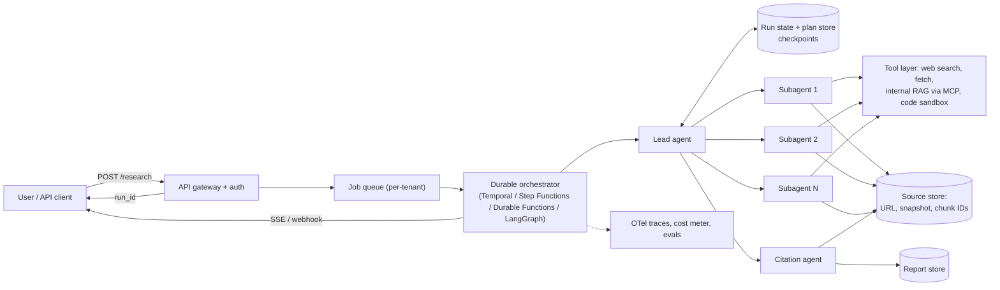
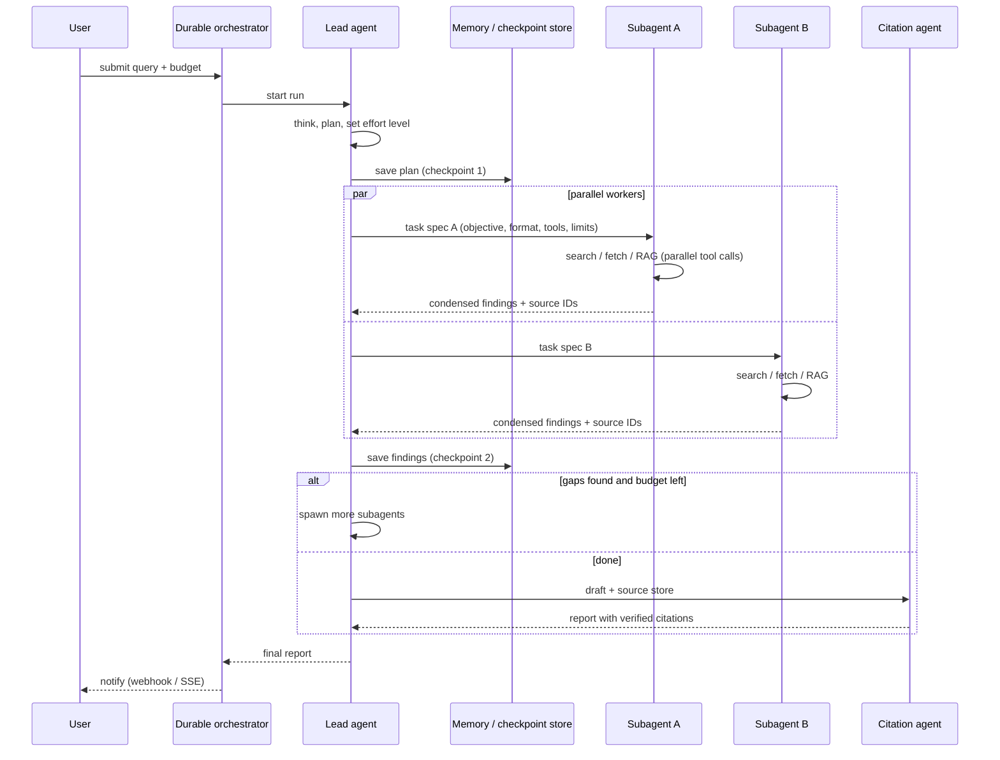
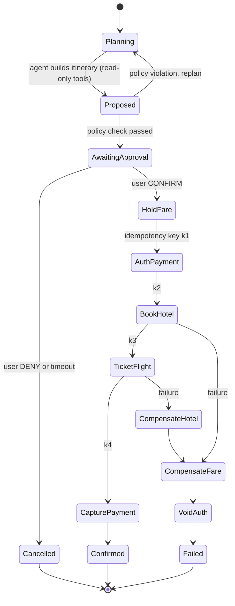

# E8 Deep Research Agent Case Study
> Last verified: 2026-10 · Audience: senior/staff DevOps, SRE, AI eng, NetEng, DevSecOps, architects

## TL;DR
- A deep research agent is a **long-running (minutes, not seconds), asynchronous, tool-heavy job**. Design it as a **job system** (submit, then poll/stream/webhook), not a chat request/response.
- Canonical architecture is **orchestrator-worker**: a **lead agent** plans, saves the plan to external memory, spawns **3–5+ parallel subagents** that each have **their own context window**, then synthesizes. A separate **citation pass** maps claims back to sources.
- **Token economics drive everything**. Anthropic measured agents at about **4x** the tokens of chat and multi-agent systems at about **15x**. Token usage alone explained **about 80%** of performance variance on their browsing eval. Use multi-agent only for **high-value, breadth-first, parallelizable** queries, and enforce **budgets** (tokens, $, tool calls, wall clock, spawn depth and concurrency).
- **Durability is mandatory**. Runs are long and stateful, so you need **checkpoints and resume**, idempotent tool calls, retries with backoff, and a durable orchestrator (Temporal, Step Functions Standard, Durable Functions, LangGraph checkpointer). Do not restart a 20-minute run from scratch.
- **Context engineering**: subagents compress and return only their findings. Use tool-result clearing and compaction, plus external memory for the plan. Cap tool output size with pagination or truncation.
- **Evals** use an **LLM-as-judge rubric** (factual accuracy, citation accuracy, completeness, source quality, tool efficiency), **end-state evaluation**, small early eval sets, and human review for edge cases.
- **Safety**: treat all web and document content as **untrusted input** that can carry prompt injection. Agents that only read get least-privilege tools. Code execution runs in a sandbox. Any action with side effects needs **human-in-the-loop** approval, and that is the core of the travel-booking variant.
- **Managed hosting**: Bedrock **AgentCore** (Runtime sessions up to **8 h** in isolated microVMs, plus Memory, Gateway, Identity, Observability, Policy, Evaluations) vs **Microsoft Foundry Agent Service** (formerly Azure AI Foundry Agent Service: prompt agents or hosted agents, toolboxes, Entra agent identity). Turnkey alternatives include Gemini Deep Research (Interactions API, `background=true`) and the OpenAI and Claude Agent SDKs.

---

## E8.1 System Planning

### Requirements (state them out loud in the interview)
| Category | Requirement | Design consequence |
|---|---|---|
| Functional | Multi-step research over **public web plus internal docs** (SharePoint, Confluence, Drive, DBs) | Web search and fetch tools, enterprise connectors via **MCP**, a RAG index for internal corpora with **per-user ACL filtering** |
| Functional | Report with **inline citations** to exact sources | Keep source IDs and quotes through the pipeline. Run a citation pass, and drop or flag unsupported claims |
| Functional | Clarify scope before running (optional) | A "plan and confirm" step, like Gemini's collaborative planning. It cuts wasted runs |
| Functional | Follow-ups on a finished report | Persist the run state and source store. Continue from the previous run ID |
| Non-functional | **Minutes-long runs** (typically 2–30 min) | Async job API: `POST /research` returns `run_id`, progress arrives via SSE, WebSocket or poll, results via webhook or email |
| Non-functional | **Cost caps** per run, user and tenant | A budget object (max $, tokens, tool calls, subagents, depth, wall clock) enforced by the orchestrator, not just suggested in the prompt |
| Non-functional | Reliability | Checkpoint after every plan step and subagent result, resume on crash or deploy, and return a partial report on budget exhaustion |
| Non-functional | Concurrency and throughput | Per-tenant queues, model RPM/TPM quotas, search API QPS limits, backpressure |
| Non-functional | Security and compliance | Tenant isolation, data residency, PII handling, audit trail of every tool call |
| Non-functional | Observability | A distributed trace per run (agent, LLM and tool spans), cost attribution per tenant |

### Capacity and cost back-of-envelope (illustrative, verify current prices)
- Baseline chat turn is about 5k tokens. A single agent is about 4x (~20k). Multi-agent is about **15x (~75k+)**, and complex runs reach **several hundred thousand to millions** of tokens because every subagent re-reads its own context on every turn.
- Cost formula: `cost = sum over all LLM calls of (input_tokens * p_in + cached_input * p_cache + output_tokens * p_out) + search/fetch API fees + sandbox compute`.
- Levers, roughly in order of impact:
  1. Better model (Anthropic found a model upgrade beats doubling the token budget).
  2. **Cheaper models for subagents** (strong lead with fast workers; Anthropic's eval system used an Opus lead with Sonnet subagents).
  3. **Prompt caching** of system prompts and tool definitions.
  4. Effort scaling rules.
  5. Tool-output truncation.
  6. Stopping early when sources converge.
- 1,000 runs/day at about 1M tokens each is about 1B tokens/day. Plan TPM quotas (Bedrock and Foundry quotas are per region and model) and consider batch or flex tiers for non-interactive runs.

### Effort scaling (put rules in the lead prompt, enforce them in code)
| Query type | Agents | Tool calls |
|---|---|---|
| Simple fact-finding | 1 agent | 3–10 calls |
| Direct comparison | 2–4 subagents | 10–15 calls each |
| Complex or open-ended research | 10+ subagents with clearly divided responsibilities | many |

### High-level flow (job system)

### Key planning decisions
- **Workflow vs agent** (from Anthropic's "Building effective agents"): start with the simplest thing that works. A fixed pipeline (plan, then N parallel searches, then synthesize) is cheaper and more predictable. Choose a fully agentic loop only when you cannot predict the subtasks in advance, which is exactly the case for open-ended research.
- **Sync vs async**: anything over about 30–60 s should be async. Return `202 Accepted` with a `run_id`, stream progress events (plan, sources found, subagent done) for UX, and allow cancel (which must propagate to subagents).
- **Grounding sources**: web via a search API plus fetch. Internal docs via a RAG index or **MCP** connectors that run with the **user's delegated identity** (OAuth on-behalf-of), so the agent can never read what the user cannot.
- **Output contract**: a structured report (sections, claims, citation IDs) as JSON, then rendered to Markdown or PDF. A schema makes evals and citation checks deterministic.
- **Stopping conditions**: max iterations, max $, max wall clock, plus a "sufficient coverage" heuristic. Always emit a **partial report** with a gap list instead of failing silently.

### Interview angles
- If asked "why not one big agent with a 1M-token context?", say: context rot and attention dilution, serial (slow) tool calls, and one failure poisons the whole run. Subagents give **separation of concerns and compression**: each explores in its own window and returns only the distilled findings.
- If asked "how do you cap cost?", say: hard budgets enforced in the orchestrator and SDK (e.g. the Claude Agent SDK `max_budget_usd`, spawn depth defaulting to 3, max 20 concurrent subagents), per-tenant quotas, model tiering, caching, and graceful degradation to a partial report.
- If asked "what is the SLO?", it is not latency P99 of a request. Use a **job-completion SLO** (e.g. 95% of runs complete in under 15 min), a success rate excluding user cancels, and a **quality SLO** from sampled LLM-judge scores. Cross-link to [J1 SLIs/SLOs](../J-sre/J1-slis-slos-error-budgets.md).
- Pitfalls: synchronous HTTP holding a connection for 10 minutes behind an LB idle timeout. No idempotency on resume, so the same search runs twice. No per-user ACLs on internal RAG.

---

## E8.2 Multi-Agent Architecture

### Orchestrator-worker pattern
- **Lead agent (orchestrator)**: analyzes the query and writes a **research plan**. It **persists the plan to external memory**, because context can be truncated past about 200k tokens and must survive compaction. It then spawns subagents with **explicit task specs**: objective, output format, tool and source guidance, scope boundaries. Vague delegations like "research the semiconductor shortage" cause duplicated work.
- **Subagents (workers)**: each gets a **fresh, isolated context window**, a restricted toolset and a turn limit. They use **interleaved thinking** to evaluate tool results, run **3+ tool calls in parallel**, and return a **condensed** result with source references. Only the final message goes back to the parent.
- **Synthesis**: the lead merges findings, detects gaps or conflicts, and decides whether to spawn more subagents (iterative deepening) or finish.
- **Citation agent**: a dedicated pass over the draft plus the source store. It attaches each claim to the exact source span and flags uncited or unsupported claims.
- Parallelism: the lead spawns **3–5 subagents in parallel** and each subagent runs **3+ tools in parallel**. Anthropic reports **up to 90% less research time** on complex queries.
- Result: an Opus 4 lead with Sonnet 4 subagents beat single-agent Opus 4 by **90.2%** on Anthropic's internal research eval (June 2025 post).
- Known bottleneck: the lead waits **synchronously** for each batch of subagents to finish. Async subagent execution adds coordination, state-consistency and error-propagation complexity. Newer SDKs run subagents in the background by default and offer script-driven "workflows" for hundreds of agents.

### Multi-agent topologies (know the vocabulary)
| Pattern | Where you see it | Use when |
|---|---|---|
| Orchestrator-workers (agents as tools) | Anthropic Research, Claude Agent SDK subagents, OpenAI Agents SDK "agents as tools", Foundry hosted multi-agent | Breadth-first, parallelizable research |
| Handoffs (control transfer) | OpenAI Agents SDK handoffs, A2A | Routing to a specialist that owns the conversation from then on |
| Graph or state machine | LangGraph, Step Functions, Durable Functions | Deterministic stages with explicit branches, HITL interrupts |
| Evaluator-optimizer | Draft, then critique, then revise | Clear quality criteria (e.g. citation coverage) |
| Parallel voting | Run N times and compare | High-stakes classification or fact checks |

### Tool design (agent-computer interface)
- Treat tool descriptions like a UI. Use **namespacing** (`web_search`, `gdrive_search`, `jira_search`) and **consolidated tools** (one `search_and_fetch` rather than 5 thin API wrappers). Use **unambiguous parameters**, **poka-yoke** designs (e.g. absolute paths) and semantic IDs instead of UUIDs.
- Make outputs token-efficient: pagination, truncation and filters with sensible defaults (Claude Code caps tool responses at about 25k tokens by default), a `response_format: concise|detailed` option, and **actionable error messages** ("too many results; add a date filter").
- Teach a search heuristic: **start wide, then narrow**. Agents default to overly long, specific queries.
- Let agents improve tools. Anthropic used a tool-testing agent that rewrote bad tool descriptions and cut task completion time by about 40%.
- Expose internal systems through **MCP servers** behind a gateway that applies authN/Z, rate limits and audit. Cross-link: [K8 Agents, tool use and MCP](../K-ai-infra-llm/K8-agents-tool-use-mcp.md).

### Context management
- **Isolation**: subagents are the main compression mechanism. The parent never sees raw pages.
- **External memory**: plan, findings and source store live outside the context, in a memory tool, a file system or a DB. Subagents can write artifacts (e.g. tables) directly to storage and pass back **references**, which avoids the "game of telephone" through the lead.
- **Server-side context editing on Claude**: `clear_tool_uses_20250919` (default trigger 100k input tokens, keeps the last 3 tool uses) and `clear_thinking_20251015`. **Server-side compaction** is `compact_20260112`. All sit behind beta header `context-management-2025-06-27`. Pair them with the **memory tool** so the agent saves state before results are cleared.
- Watch prompt caching: clearing tool results invalidates the cached prefix. Use `clear_at_least` so each invalidation is worth it.
- When a context fills, spawn a **fresh agent with a clean context plus a handoff summary** rather than letting quality degrade.

### Durable execution and checkpointing
- Why: runs last minutes to hours, and deploys, OOMs, model 429/529s and tool timeouts **will** happen mid-run. Agents are **stateful and errors compound**, so restarting from zero is expensive and frustrating.
- Pattern: model each LLM call and tool call as an **activity or step** whose result is persisted. On a crash, **replay from the event history** and skip steps that already completed. Let the model know when a tool failed and allow it to adapt, while deterministic retries and backoff handle transient errors.
- Deployments: in-flight runs must survive code changes. Anthropic uses **rainbow deployments** that shift traffic gradually while old versions keep serving existing runs. Pin a run to the agent version it started on (AgentCore runtime versions and endpoints, Foundry agent versions).

| Engine | Max run | Semantics | HITL wait | Notes |
|---|---|---|---|---|
| **AWS Step Functions Standard** | **1 year** | **Exactly-once** per state (unless Retry) | `.waitForTaskToken` callback | History kept 90 days. Billed per state transition. Best for **non-idempotent** steps like payments |
| Step Functions Express | **5 min** | At-least-once (async) or at-most-once (sync) | No `.waitForTaskToken` or `.sync` | Wrong choice for research runs |
| **Azure Durable Functions / Durable Task Scheduler** | Effectively unbounded (event-sourced) | Replay. Orchestrator code must be **deterministic** | `waitForExternalEvent` (human interaction pattern) | Patterns: chaining, fan-out/fan-in, async HTTP, monitor, human interaction |
| **Temporal** | Unbounded (continue-as-new for huge histories) | Workflow replay, activities retried | Signals and updates | Popular for agent loops. Integrations with the OpenAI Agents SDK exist (unverified for the current version) |
| **LangGraph checkpointer** | App-defined | Checkpoint per super-step, resume by `thread_id` | `interrupt()`, then resume | Use Postgres or SQLite savers. **In-memory savers lose state on restart**. Prune old checkpoints |
| AgentCore Runtime session | **8 h** max, **15 min** idle timeout | Ephemeral microVM per session | App-level | Session state is **not durable**. Use AgentCore Memory or an external store |

### Evals
- **Start small, start early**: about 20 representative queries are enough to see large effect sizes in the early days. Do not wait for a 1,000-case suite.
- **LLM-as-judge rubric** (single call scoring 0.0–1.0 plus pass/fail was the most consistent for Anthropic): **factual accuracy**, **citation accuracy**, **completeness**, **source quality** (primary over SEO farms), **tool efficiency**.
- **End-state evaluation**: grade the final report or state, not the exact path, because agents take different valid paths. For agents that change state, check the final state (e.g. the booking record), with discrete checkpoints for long runs.
- **Human eval** still catches what judges miss, such as a bias toward SEO content farms over authoritative sources.
- Ops metrics per run: tokens and $, number of subagents and tool calls, wall clock, % partial reports, citation coverage %, judge score. Gate releases on them. Managed options include **AgentCore Evaluations**, **Foundry evaluations**, and OpenAI and LangSmith evals. Cross-link: [K9 LLMOps, evals and guardrails](../K-ai-infra-llm/K9-llmops-evals-guardrails.md).

### Observability
- One **trace per run**, using the **OpenTelemetry GenAI semantic conventions** (now maintained in a separate `semantic-conventions-genai` repo, status still Development/experimental). Spans:
  - `invoke_agent {agent}` for the lead and each subagent, as nested spans
  - `chat {model}` for LLM calls
  - `execute_tool {tool}`
- Attributes: `gen_ai.operation.name`, `gen_ai.provider.name`, `gen_ai.request.model`, `gen_ai.agent.id/name`, `gen_ai.conversation.id`, `gen_ai.usage.input_tokens/output_tokens`.
- Monitor **decision patterns and interaction structure**, not conversation contents, for privacy. Export to CloudWatch (AgentCore Observability), Application Insights (Foundry), or Langfuse, Datadog or Honeycomb. Cross-link: [J3 Observability](../J-sre/J3-observability.md).
- Cost attribution: emit token counters per tenant, run and agent role. Alert on runaway loops, such as tool calls per run above p99 or repeated identical queries.

### Safety and security
- **Indirect prompt injection** from fetched pages, PDFs and internal docs is the primary threat. Defenses:
  1. Treat tool output as data. Use spotlighting or delimiters and instruct the model never to follow embedded instructions.
  2. **Least-privilege tools**: research subagents are read-only, with no email, write or payment tools.
  3. **Egress allow and deny lists** plus a fetch proxy (blocks SSRF to `169.254.169.254` and internal ranges).
  4. Output scanning, such as the Claude Code subagent-output scan that neutralizes control-tag and turn-marker imitation.
  5. Content-safety and XPIA filters (Foundry guardrails, Bedrock Guardrails).
- **Data exfiltration**: injected instructions try to put secrets into URLs or images. Block agent-constructed URLs to unknown domains and strip markdown image rendering in reports.
- **Sandboxing**: run code in isolated sandboxes (AgentCore Code Interpreter, Foundry code interpreter, Firecracker or gVisor containers) with no ambient credentials.
- **Identity**: agents act **on behalf of the user** (OAuth OBO, token vault). Never use a super-privileged service account for internal RAG. Cross-link: [L4 AI security threats](../L-data-privacy-ai-security/L4-ai-security-threats.md), [L7 Zero trust and workload identity](../L-data-privacy-ai-security/L7-zero-trust-workload-identity.md).
- **Runaway agents**: enforce depth, concurrency and budget limits in the harness. Prompt instructions only steer behaviour, while harness limits are what actually bound it.

### Interview angles
- If asked "single agent vs multi-agent?", answer: multi-agent wins on **breadth-first, parallelizable** tasks with information beyond one context window. It loses on tightly coupled tasks such as most coding and on tasks where all agents need shared context, and it costs about 15x tokens. Quote the 90.2% and 15x numbers and the 80%-variance-from-tokens finding.
- If asked "how do subagents avoid duplicate work?", say: detailed task specs with boundaries, a shared plan in memory, and dedup of URLs in the source store.
- If asked "how do you debug a non-deterministic agent?", say: full production tracing of decisions and tool calls, replay from checkpoint, and end-state evals on sampled runs.
- Anti-patterns: spawning 50 subagents for a simple query (Anthropic saw early versions do this), letting the lead read raw pages, citations generated from model memory instead of the source store, and no cap on fetch size.

---

## E8.x Bonus: Autonomous travel booking agent (hidden course section)
> The curriculum notes E has 4 hidden sections, and one is likely this case study. Its key difference from deep research is **side effects**: money moves, so correctness beats autonomy.

### Requirements
- Functional: understand trip intent (dates, budget, preferences), search flights, hotels and cars across suppliers (GDS or NDC APIs, hotel APIs), propose itineraries, **book and pay**, handle changes and cancellations, and remember preferences (window seat, loyalty numbers).
- Non-functional: **no double bookings**, no unauthorized charges, PCI-DSS scope minimized, partial-failure recovery, audit trail, latency of seconds for search and minutes for the booking workflow. Quotes expire (fare holds of about 15–30 min, unverified as a general figure because it varies by supplier).

### Architecture: agent plans, deterministic workflow executes
- **Read tools** (search fares, availability, policy lookup) are freely callable by the agent.
- **Write tools** (`hold_fare`, `book`, `charge`, `cancel`) are not called directly by the LLM. The agent produces a **proposed itinerary (structured)**, and a **durable workflow** executes it after **explicit human confirmation**.
- **Human-in-the-loop**: show the exact price, fare rules and refundability, then require CONFIRM or DENY. Bedrock Agents action groups support built-in **user confirmation** (`returnControl` with `confirmationState` CONFIRM/DENY), positioned by AWS as a prompt-injection safeguard. Equivalents: LangGraph `interrupt()`, Step Functions `.waitForTaskToken`, Durable Functions `waitForExternalEvent`, OpenAI Agents SDK HITL approvals, Claude Agent SDK permission hooks or `canUseTool`.
- **Idempotency**: every side-effecting call carries an **idempotency key** (e.g. `run_id:step:segment`). Supplier and payment APIs (e.g. Stripe-style `Idempotency-Key`) dedupe retries. The workflow persists a step's result before moving on.
- **Saga with compensations**: there is no distributed transaction across airline, hotel and payment. Run the forward steps in order. On failure, run the **compensating actions in reverse** (cancel hotel, void the fare, refund or release the payment authorization). Prefer **authorize then capture** for payment: capture only after all segments are ticketed.
- **Payments**: tokenize cards via the PSP (the agent never sees a PAN). Spending limits apply per user or policy. AgentCore **Payments** and AgentCore **Policy** (Cedar-compatible rules intercepting tool calls at the Gateway) can enforce "max $X without manager approval" deterministically.
- **Policy engine outside the LLM**: corporate travel policy (class of service, max nightly rate) is checked in code. The LLM's own judgement is never the control.

### Interview angles
- If asked "can the LLM call the booking API directly?", answer no. The LLM proposes, and deterministic code disposes after confirmation, idempotency check and policy check. This also limits injection blast radius: a malicious hotel description cannot trigger a charge.
- If asked "what if the price changes between proposal and booking?", say: re-quote in the workflow. If the delta exceeds a threshold, return to AwaitingApproval.
- If asked about exactly-once, say it is impossible end to end. Get effectively-once from idempotency keys plus an exactly-once orchestrator (Step Functions Standard) plus reconciliation jobs against supplier PNRs.
- Cross-link sagas and locking: [C1 Performance](../C-large-scale-architecture/C1-performance.md), [B7 Concurrency control](../B-database-engineering/B7-concurrency-control.md), [D2 Reusable parts](../D-system-design/D2-reusable-parts-of-system-design.md).

---

## Cloud mapping: AWS vs Azure
| Capability | AWS | Azure | Role it plays | Key differences | Alternatives |
|---|---|---|---|---|---|
| Managed agent runtime | **Bedrock AgentCore Runtime** (plus AgentCore Harness for a managed loop). Classic **Bedrock Agents** for config-driven agents | **Microsoft Foundry Agent Service**: prompt agents (config) and **hosted agents** (your container or zip) | Hosts the lead and subagent loop and scales sessions | AgentCore: microVM per session, **8 h max, 15 min idle**, HTTP/MCP/A2A protocols, any framework or model. Foundry: hosted agents run in VM-isolated sandboxes with BYO VNet and a dedicated Entra identity per agent | Claude Agent SDK on ECS/EKS/AKS, LangGraph Platform, OpenAI Agents SDK, Gemini Deep Research agent |
| Memory | **AgentCore Memory** (short-term events, long-term extracted insights and preferences, shareable across agents) | Foundry built-in memory tool plus BYO **Cosmos DB** for conversation state | Plan, findings, user preferences | AgentCore extracts long-term memory asynchronously via strategies. Foundry lets you own the store (compliance) | LangGraph store, Redis, Postgres, Claude memory tool |
| Tool gateway | **AgentCore Gateway** (APIs, Lambda, OpenAPI to MCP tools, plus existing MCP servers) | Foundry **Toolboxes** (one managed MCP endpoint, versioned). Azure Functions MCP webhook | Single governed tool plane | Both converge on MCP. AgentCore adds **Policy** (Cedar-compatible) interception per tool call | Self-hosted MCP behind API Management or Kong, Cloudflare MCP |
| Agent identity and auth | **AgentCore Identity** (workload identities, inbound JWT, outbound OAuth or API key, token vault, user-delegated or autonomous modes) | **Microsoft Entra Agent ID**, managed identity, OAuth OBO passthrough | Least privilege, act-on-behalf-of-user | Entra integrates natively with M365 and the Entra Agent Registry. AgentCore Identity works with any IdP (Cognito, Okta, Entra, Auth0) | SPIFFE/SPIRE, Okta |
| Web grounding and browsing | AgentCore **Browser** tool, third-party search APIs | Foundry **web search** tool (Bing-backed grounding) | Web research | Check data-handling terms. Bing grounding sends queries outside the compliance boundary (unverified for the current terms) | Claude web search and fetch server tools, Gemini Google Search grounding |
| Code sandbox | AgentCore **Code Interpreter** | Foundry **code interpreter** | Analysis and charts in isolation | Both are managed sandboxes | E2B, Firecracker or gVisor on K8s |
| Durable orchestration | **Step Functions Standard** (1 yr, exactly-once, `.waitForTaskToken`) | **Durable Functions / Durable Task Scheduler** (event-sourced replay, `waitForExternalEvent`) | Checkpoint, resume, HITL, saga | SFN is declarative ASL billed per transition. Durable is code-first and needs deterministic orchestrators | Temporal, LangGraph checkpointer |
| Observability | **AgentCore Observability** to CloudWatch (OTel-compatible) | Foundry tracing to **Application Insights** (OTel) | Per-run trace, cost, debugging | Both ingest OTel GenAI spans | Langfuse, LangSmith, Datadog LLM Obs |
| Evals | **AgentCore Evaluations** (sessions, traces, spans), AgentCore Optimization (A/B) | Foundry **evaluations** and agent optimizer (preview) | Quality gates | AgentCore Evaluations supports Strands and LangGraph traces via OTel or OpenInference | OpenAI evals, promptfoo, Ragas |
| Safety filters | **Bedrock Guardrails**, user confirmation on action groups | Foundry **guardrails / content filters** incl. XPIA (cross-prompt injection) | Injection and harmful output mitigation | Azure explicitly markets XPIA detection. Bedrock Agents has built-in CONFIRM/DENY | Llama Guard, Lakera, NeMo Guardrails |
| Internal doc RAG | **Bedrock Knowledge Bases**, Kendra | **Azure AI Search**, SharePoint tool | Enterprise grounding with ACLs | Both support security trimming. Verify per-connector ACL sync | Vertex AI Search, pgvector |

- **AgentCore** (GA October 2025) is modular. Use Runtime, Memory, Gateway, Identity, Browser, Code Interpreter, Observability, Evaluations, Policy, Registry and Payments independently with any framework (Strands, LangGraph, CrewAI, OpenAI Agents SDK, Google ADK) and any model. Runtime versions are immutable, and endpoints point at versions, which enables pinning and gradual rollout of long runs. Runtime **V2** restores from a snapshot for consistent cold starts in select regions. Session state is ephemeral, so durable state belongs in Memory or your own DB.
- **Classic Bedrock Agents** (action groups, knowledge bases, multi-agent collaboration with a supervisor) is still valid but config-driven. AgentCore is the strategic path for custom orchestrators.
- **Foundry naming**: Azure AI Studio became Azure AI Foundry, which became **Microsoft Foundry**. The service is now "Foundry Agent Service" (docs dated 2026-09). Prompt agents support private networking. Hosted agents support BYO VNet. Agents can be published to Teams, M365 Copilot and the Entra Agent Registry. It supports **A2A v1.0 (GA)**. You can also call the **Responses API** directly as "ephemeral agents".
- **Gemini Deep Research** is a turnkey managed research agent via the **Interactions API**. It requires `background=true` and you poll an interaction ID. Agents `deep-research-preview-04-2026` and `deep-research-max-preview-04-2026` (preview). Tools: Google Search, URL context, code execution, File Search, MCP. Supports collaborative planning, streaming with reconnect, and `previous_interaction_id` follow-ups. Use it when buying beats building. You get less control over cost caps, tools and data boundaries.
- **Claude Agent SDK** gives you the Claude Code harness as a library: subagents with isolated context, tool restrictions, `maxTurns`, background subagents, **depth (default 3), concurrency (default 20) and `max_budget_usd`** caps, and resume via `session_id` and `agentId`. Claude models are also available in Bedrock and Foundry.
- **OpenAI Agents SDK** primitives are agents, handoffs, agents-as-tools, guardrails (input, output and tool), sessions (SQLite, Redis, etc.), built-in tracing, HITL and sandbox agents.
- **LangGraph** is graph or state-machine orchestration with checkpointers (Postgres for production), `thread_id` resume, `interrupt()` for HITL, and a cross-thread store for long-term memory.

---

## Cross-links
- [E1 System design fundamentals (RAG, GraphRAG)](E1-system-design-fundamentals.md)
- [E7 AI interview chatbot case study](E7-ai-interview-chatbot-case-study.md)
- [K3 RAG pipelines](../K-ai-infra-llm/K3-rag-pipelines.md)
- [K6 Managed model platforms](../K-ai-infra-llm/K6-managed-model-platforms.md)
- [K7 AI gateways, caching and cost](../K-ai-infra-llm/K7-ai-gateways-caching-cost.md)
- [K8 Agents, tool use and MCP](../K-ai-infra-llm/K8-agents-tool-use-mcp.md)
- [K9 LLMOps, evals and guardrails](../K-ai-infra-llm/K9-llmops-evals-guardrails.md)
- [L4 AI security threats](../L-data-privacy-ai-security/L4-ai-security-threats.md)
- [M6 Orchestration and ETL](../M-data-platforms/M6-orchestration-etl.md)
- [J3 Observability](../J-sre/J3-observability.md)

## Sources
- https://www.anthropic.com/engineering/multi-agent-research-system
- https://www.anthropic.com/engineering/building-effective-agents
- https://www.anthropic.com/engineering/writing-tools-for-agents
- https://platform.claude.com/docs/en/build-with-claude/context-editing
- https://code.claude.com/docs/en/agent-sdk/subagents
- https://docs.aws.amazon.com/bedrock-agentcore/latest/devguide/what-is-bedrock-agentcore.html
- https://docs.aws.amazon.com/bedrock-agentcore/latest/devguide/runtime-how-it-works.html
- https://docs.aws.amazon.com/bedrock-agentcore/latest/devguide/memory.html
- https://docs.aws.amazon.com/bedrock-agentcore/latest/devguide/identity.html
- https://docs.aws.amazon.com/bedrock/latest/userguide/agents-userconfirmation.html
- https://docs.aws.amazon.com/step-functions/latest/dg/choosing-workflow-type.html
- https://learn.microsoft.com/en-us/azure/foundry/agents/overview
- https://learn.microsoft.com/en-us/azure/durable-task/durable-functions/durable-functions-overview
- https://ai.google.dev/gemini-api/docs/deep-research
- https://openai.github.io/openai-agents-python/
- https://docs.langchain.com/oss/python/langgraph/durable-execution
- https://opentelemetry.io/docs/specs/semconv/gen-ai/ (moved to github.com/open-telemetry/semantic-conventions-genai)
