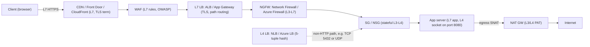

# F1 Fundamentals of Networking
> Last verified: 2026-10 · Audience: senior/staff DevOps, SRE, AI eng, NetEng, DevSecOps, architects

## TL;DR
- **Client-server** centralizes state, auth and scaling decisions on the server side. **P2P** pushes them to the peers, which removes the central bottleneck but adds NAT traversal, discovery (DHT, trackers) and trust problems. Most "P2P" products are hybrids: a central signalling or index server plus a peer data plane (WebRTC, BitTorrent with trackers).
- The **OSI model has 7 layers and is for reasoning only**. Real stacks are **TCP/IP with 4 or 5 layers**. Classify a device by the **highest layer it reads or rewrites**: a switch reads MACs (L2), a router or NAT rewrites IPs (L3), an L4 LB or SG reads ports and 5-tuples (L4), and an L7 proxy, WAF or API gateway terminates TLS and parses HTTP (L7).
- The core L4 vs L7 point: **a pass-through L4 LB forwards packets or flows**, so the client connection reaches the backend. **A terminating L7 proxy keeps two separate TCP/TLS connections**, which gives it TLS offload, routing on path or headers, and a WAF, at the cost of extra latency and certificate management. Note that AWS NLB and Azure Application Gateway both blur this line.
- **Host-to-host delivery:** the host compares the destination IP with its own subnet mask. If the destination is on the same subnet, it ARPs for that host's MAC. Otherwise it ARPs for the **default gateway's** MAC. **The MAC address changes at every hop. The IP address stays the same unless NAT rewrites it.** Ports pick the process (socket).
- **Cloud VPCs and VNets are L3 overlays.** They have **no broadcast and no multicast by default**, VLANs and GRE are blocked in Azure, and **the hypervisor answers ARP itself** (Nitro answers every ARP request locally). The "router" is a distributed function at `.1`. **AWS and Azure both reserve 5 IPs per subnet**, but which addresses they reserve differs.
- Subnet sizes: **AWS IPv4 subnets are /16 to /28** (so a /28 gives 11 usable IPs) and IPv6 subnets are /44 to /64. **Azure IPv4 subnets are /29 to /2** (so a /29 gives 3 usable IPs) and IPv6 subnets must be exactly /64.
- Per-layer cloud services:
  - L4: **NLB ↔ Azure Load Balancer (Standard)**
  - L7 regional: **ALB ↔ Application Gateway**
  - L7 global: **CloudFront + Global Accelerator ↔ Front Door**
  - WAF: **AWS WAF ↔ Azure WAF (on Application Gateway or Front Door)**
  - L3–L7 firewall: **AWS Network Firewall ↔ Azure Firewall**
  - Inserting third-party appliances: **GWLB (GENEVE 6081) ↔ Azure Gateway LB (VXLAN)**
- Changes as of 2026:
  - **Azure Basic LB was retired on 2025-09-30.**
  - **New Azure VNets have private subnets by default since 2026-03-31.** There is no default outbound access, so you must add a NAT Gateway or another explicit egress method.
  - **AWS added regional NAT gateways.** They are multi-AZ and do not need a public subnet.

## F1.1 Client-Server Architecture
- **How it works:**
  - The **client** initiates a request. The **server** listens on a well-known port (a passive open) and keeps the authoritative state. The relationship is many clients to one logical server. Behind a VIP or LB, that one logical server is really many servers.
  - Variants:
    - **2-tier:** client to DB.
    - **3-tier / n-tier:** presentation, app, data.
    - **Thin vs thick client.**
    - **RPC style** (gRPC, Thrift) vs **REST**.
    - **Push** (WebSocket, SSE, long-poll) vs request/response.
  - **Stateless servers** with state kept outside them (DB, Redis, a JWT) scale out horizontally behind an LB. Stateful servers need sticky sessions or a separate partitioning or affinity layer.
  - **Peer-to-peer (P2P):** every node is both client and server.
    - Discovery uses a **tracker or index server**, a **DHT** (Kademlia in BitTorrent and IPFS), or gossip.
    - Peers behind NAT need **NAT traversal**. **STUN** discovers the public mapping, **TURN** relays when hole punching fails (symmetric NAT), and **ICE** tries the candidates in order. All of this is standard WebRTC.
  - **Hybrid** is the norm. A central control plane handles signalling, auth and indexing, and P2P handles the data plane. Examples: WebRTC calls, Skype historically, BitTorrent with trackers, and game lobbies with P2P sessions.
- **Trade-offs / when to use:**

  | Aspect | Client-server | P2P |
  |---|---|---|
  | Control, auth, consistency | Central and easy | Hard (Sybil attacks, poisoning) |
  | Scaling cost | Operator pays for bandwidth and compute | Capacity grows with peers |
  | Single point of failure | Yes, unless made redundant (LB, multi-AZ) | No, but churn hurts availability |
  | NAT and firewall friendliness | Clients only open outbound connections | Needs hole punching or a TURN relay |
  | Typical use | Web, APIs, SaaS, databases | File distribution, live video mesh, blockchain, some edge or IoT |

  - Choose **client-server** when you need authority, auditing, compliance or strong consistency. That covers nearly every enterprise system.
  - Choose **P2P or a hybrid** for large static distribution (BitTorrent was used to ship OS images and patches), latency-sensitive media between 2 and N parties, or to save server bandwidth.
- **Interview angles:**
  - "Why not P2P for video calls with 50 people?" → A full mesh needs N×(N−1) upstream streams, so it does not scale. Use an **SFU** (Selective Forwarding Unit), which is client-server for media. Keep P2P for 1:1 calls.
  - "How do clients behind NAT accept connections?" → They don't. They connect outbound to a rendezvous server, or use STUN/ICE and fall back to TURN. This is the reason servers live on public IPs or behind an LB.
  - On "where does state live?", say that LB affinity is an anti-pattern for scaling, and push session state into Redis or a token. See also caching IDs C1.26 to C1.30.
  - Pitfall: "the client trusts the server" is not the same as "the server trusts the client". **Always validate on the server.** Client-side checks are only a UX convenience.
  - Real-world note: in Kubernetes and in cloud setups, a service is often a client and a server at once (microservices). The client role brings timeouts, retries and connection pools; see F4 and C1 latency.

## F1.2 OSI Model (where applications, proxies and network devices sit in each layer)
- **How it works:** the OSI layers and their TCP/IP equivalents.

  | # | OSI layer | PDU | TCP/IP model | Addressing | Typical protocols |
  |---|---|---|---|---|---|
  | 7 | Application | data | Application | URLs, hostnames | HTTP/1.1/2/3, gRPC, DNS, SMTP |
  | 6 | Presentation | data | Application | — | TLS (in practice), encodings, compression |
  | 5 | Session | data | Application | — | TLS sessions, RPC sessions, (QUIC conn IDs) |
  | 4 | Transport | segment / datagram | Transport | **ports** | TCP, UDP, QUIC (QUIC runs on UDP) |
  | 3 | Network | packet | Internet | **IP** | IPv4/IPv6, ICMP, IPsec, routing (BGP is carried over TCP 179) |
  | 2 | Data link | frame | Link | **MAC** | Ethernet, 802.1Q VLAN, ARP (L2/L3 boundary), Wi-Fi |
  | 1 | Physical | bits | Link (or Physical in 5-layer) | — | fiber, copper, radio |

  - TLS has no clean place in OSI. It sits **between L4 and L7**. Most people call it L6 or say "L7 terminates TLS". Say that out loud if you are asked about it.
  - **Encapsulation:** each layer adds a header on the way down (HTTP → TCP → IP → Ethernet) and removes it on the way up. Overlays such as **VXLAN (UDP 4789), GENEVE (UDP 6081)**, GRE and IPsec put a whole L2 or L3 packet inside another one. This is how cloud VPCs and VNets, Kubernetes CNIs and GWLB work.

### Where devices and software sit

| Layer | Device or software | What it reads or rewrites |
|---|---|---|
| L1 | Hub, repeater, transceiver, cable | Bits only |
| L2 | Switch, bridge, NIC, Wi-Fi AP, VXLAN VTEP | Learns MAC to port mappings and floods unknown unicast and broadcast frames |
| L3 | Router, L3 switch, **NAT** (rewrites IP addresses; NAPT/PAT also rewrites ports, so it is really L3/L4), VPC/VNet router, cloud **route tables** | Destination IP lookup by longest-prefix match, decrements TTL, rewrites the L2 header at every hop |
| L3/L4 | **Stateless ACLs** (AWS NACL), **stateful packet filters** (Security Group, Azure NSG, iptables/nftables conntrack) | 5-tuple matching. Stateful filters automatically allow return traffic |
| L4 | **L4 load balancer** (AWS NLB, Azure LB, LVS/IPVS, kube-proxy, MetalLB), L4 proxy (HAProxy in TCP mode, Envoy TCP proxy) | Flow hashing on the 5-tuple. Either pass-through (DNAT/DSR, keeps the client IP) or terminating |
| L4–L7 | **NGFW** (AWS Network Firewall/Suricata, Azure Firewall, Palo Alto, Fortinet), IDS/IPS | DPI, SNI/FQDN filtering, TLS inspection on premium tiers |
| L7 | **Reverse proxy or L7 LB** (ALB, Application Gateway, Envoy, NGINX, HAProxy in HTTP mode), **API gateway**, **WAF**, **CDN**, **service mesh sidecar**, forward proxy (Squid) | Terminates TCP and TLS, parses HTTP, routes on host, path or headers, inserts headers (X-Forwarded-For), caches |
| L7 | **Application** (the browser, your service) | Business logic |

- **Trade-offs / when to use:**
  - **L4 LB:**
    - Pros: lowest latency, protocol-agnostic (TCP, UDP, TLS pass-through, databases, MQTT, gaming), can keep the source IP, millions of flows.
    - Cons: no content routing, no HTTP health semantics, and **long-lived HTTP/2 or gRPC connections end up stuck to one backend**.
  - **L7 LB or proxy:**
    - Pros: per-request balancing (fixes the gRPC imbalance), TLS offload, path and host routing, retries, auth, WAF, observability.
    - Cons: an extra TCP and TLS hop, certificates to manage, higher cost, the proxy can see the payload (privacy and compliance), and client IPs arrive in `X-Forwarded-For` or PROXY protocol instead of the packet source.
  - **Stateless NACL vs stateful SG/NSG:**
    - A stateless NACL needs explicit **ephemeral port** rules for return traffic (Linux uses 32768–60999, Windows 49152–65535, and AWS docs suggest 1024–65535).
    - Use stateful rules by default. Use stateless rules for coarse subnet deny-lists.
  - A WAF only sees what it can decrypt. **It must sit at or after the TLS termination point.**
- **Interview angles:**
  - "Which layer is a load balancer?" → It depends on what it terminates. AWS NLB is L4 but can terminate TLS. Azure Application Gateway is L7 but now also has an L4 TCP/TLS proxy mode. Classify by behaviour, not by product name.
  - "Is NAT L3 or L4?" → Basic NAT is L3, rewriting the IP. NAPT/PAT, which is what home routers, AWS NAT GW and Azure NAT GW do, also rewrites ports, so it is L4-aware. **SNAT port exhaustion** is a classic Azure and AWS outage cause: AWS allows 55,000 concurrent connections per NAT IP per unique destination, and Azure allows 64,512 SNAT ports per public IP (unverified for StandardV2).
  - "Where does the client IP go behind an L7 proxy?" → `X-Forwarded-For` / `Forwarded` (RFC 7239) for HTTP, or **PROXY protocol v1/v2** for L4. AWS NLB can **preserve the client IP** natively (instance targets), and Azure LB is pass-through, so the backend sees the client IP.
  - "Where is the firewall?" → For north-south traffic: edge (CDN/WAF/DDoS) → L7 LB with WAF → NGFW → SG/NSG on the NIC. For east-west traffic: SG/NSG, mesh mTLS and policy. See firewall IDs C4.12, D2.13, G1.7.
  - Pitfall: saying "OSI is how the internet works". TCP/IP came first in practice, and L5 and L6 are folded into the application.
  - Pitfall: putting ARP in L3. ARP is carried directly in Ethernet frames (EtherType 0x0806). It **maps L3 addresses to L2 addresses**, so call it "L2.5" or "the L2/L3 glue".

## F1.3 Host to Host communication (MAC, IP, subnet masks, routers, gateways, ports)
- **How it works:**
  - **MAC address**
    - 48 bits. The first 24 bits are the OUI (vendor).
    - Only meaningful **inside one L2 broadcast domain**.
    - The broadcast MAC is `ff:ff:ff:ff:ff:ff`.
    - A switch learns MAC to port mappings from frame source addresses.
  - **IP address and subnet mask**
    - The mask splits an address into network bits and host bits. For example, `/24` = `255.255.255.0`, which is 256 addresses and 254 usable on-prem (network and broadcast are reserved).
    - Usable hosts on-prem = 2^(32−prefix) − 2. In the cloud it is −5, see below.
    - The RFC 1918 private ranges are `10/8`, `172.16/12` and `192.168/16`. `100.64/10` (RFC 6598 CGNAT) is also used, for example by EKS custom networking and Azure.
  - **Same-subnet test:** compare `(src IP AND mask)` with `(dst IP AND mask)`.
    - **Equal** → ARP for the destination's MAC (`Who has 10.0.1.20? Tell 10.0.1.10`, broadcast), cache the answer in the **ARP table** (`ip neigh`), and send the frame directly.
    - **Not equal** → look up the routing table, which usually ends at the default route `0.0.0.0/0 via <gateway>`. ARP for the **gateway's** MAC, then send the frame to the gateway's MAC with the **final destination IP**.
  - **Router / default gateway**
    - Receives the frame, strips the L2 header, does a longest-prefix-match route lookup, **decrements TTL** (dropping at 0 and sending ICMP Time Exceeded, which is how traceroute works), and builds a new L2 header for the next hop.
    - **At every hop the MAC changes and the IP stays the same**, unless NAT rewrites it.
  - **Ports** (16 bits) identify the process or socket.
    - 0–1023 are well-known ports (binding to them needs root/`CAP_NET_BIND_SERVICE`), 1024–49151 are registered, and ephemeral ranges vary by OS (Linux `net.ipv4.ip_local_port_range` defaults to 32768–60999).
    - A connection is identified by the **5-tuple** (proto, src IP, src port, dst IP, dst port).
  - **IPv6:** there is no ARP. **NDP** (ICMPv6 Neighbor Solicitation/Advertisement to solicited-node multicast) replaces it, and there is no broadcast at all. SLAAC or DHCPv6 assigns addresses.
  - **Gratuitous ARP:** a host announces its own IP to MAC mapping. It is used for VIP failover (keepalived/VRRP) and **does not work in the cloud**, so cloud VIP failover is done through API calls (moving a secondary IP or EIP, or updating a route table) or through an LB.
- **Cloud abstraction of L2 (high-value interview material):**
  - **AWS VPC**
    - The VPC is a **Layer 3 network**.
    - The Nitro hypervisor **proxies ARP responses locally** for all ARP requests, because the VPC mapping service already knows where every IP lives.
    - Nitro checks source and destination MACs against the ENI registrations, and **only lets ARP, IPv4 and IPv6 frames through**. Everything else (LLC, raw Ethernet) is dropped.
    - **No broadcast.** Multicast is only available through **Transit Gateway multicast domains** (IGMPv2 or static sources).
    - **Source/dest check** is on by default. Disable it on NAT instances and NVAs.
  - **Azure VNet**
    - The docs say VNets are "Layer 3 overlays… Azure does not support any Layer 2 semantics", and you **cannot bring VLANs**.
    - **Multicast, broadcast, IP-in-IP and GRE are blocked.** Allowed protocols are TCP, UDP, ESP, AH and ICMP.
    - The default gateway **does not answer ping**.
    - UDP **4791** and **65330** are reserved for the host.
    - All ARP requests are answered by the host with one platform MAC, widely reported as `12:34:56:78:9a:bc` (unverified, not in the official docs).
    - IP forwarding must be enabled on the NIC for NVAs.
  - **Reserved IPs per subnet: both clouds reserve 5.** Example for `10.0.0.0/24`:

    | Address | AWS | Azure |
    |---|---|---|
    | `.0` | Network address | Network address |
    | `.1` | VPC router | Default gateway |
    | `.2` | Amazon DNS (VPC base+2, also reserved in every subnet) | Azure DNS mapping |
    | `.3` | Reserved for future use | Azure DNS mapping |
    | `.255` (last) | "Broadcast". Reserved even though broadcast is not supported | Broadcast |
    | Size limits | IPv4 /16–/28; IPv6 /44–/64 in /4 steps (also 5 reserved) | IPv4 /29–/2; IPv6 exactly /64 |
    | Gotchas | BYOIP ranges can use .0 and .last. DNS is also at `169.254.169.253` | Can't use 224/4, 127/8, 169.254/16, 168.63.129.16 (platform DNS/health) |

  - Usable IPs: a **/28 in AWS gives 11**, a **/29 in Azure gives 3**, and a **/24 gives 251** in both clouds. Some subnets need minimum sizes:
    - AzureFirewallSubnet must be a /26.
    - GatewaySubnet should be /27 or larger.
    - Application Gateway v2 should get a /24 (recommended).
    - EKS and AKS pod IPs eat subnets quickly (VPC CNI uses one IP per pod; Azure CNI overlay avoids this).
- **Trade-offs / when to use:**
  - **Small subnets** limit the blast radius and give finer NACL/NSG and routing control, but they waste 5 IPs each and can run out at scale-out time (ASG, Kubernetes nodes, Lambda ENIs, App Gateway autoscale).
  - **Large subnets** are simpler, but on-prem the broadcast domain gets bigger (not an issue in the cloud) and the security segmentation is coarser.
  - **Plan CIDRs early.** They must not overlap anywhere you will peer, use TGW, or connect over VPN/ExpressRoute/Direct Connect. Re-IPing later is expensive. Use AWS VPC IPAM or Azure Virtual Network Manager IPAM.
  - Anything that depends on L2 needs a redesign before moving to the cloud. That includes **keepalived/VRRP, Pacemaker with gratuitous ARP, multicast discovery** (old Hazelcast, Ehcache, JGroups UDP) and **DHCP relay assumptions**. Replace them with unicast discovery (DNS, Kubernetes API, cloud tags), LB health checks, or API-driven IP moves.
- **Interview angles:**
  - "Walk through what happens when host A pings host B in another subnet" → mask check → route lookup → ARP for the gateway (cache miss) → frame to the gateway's MAC with B's IP → the router does LPM, decrements TTL and ARPs on the egress interface → delivered. In the cloud, the "ARP" is answered by the hypervisor and the "router" is the SDN fabric.
  - "Why can't I ping the Azure default gateway?" → It is a virtual function and does not reply to ICMP. Test end-to-end between VMs, or use Network Watcher.
  - "My keepalived VIP doesn't fail over on EC2 or an Azure VM" → Gratuitous ARP is ignored. Use an NLB or Azure LB (HA ports), move the secondary IP or EIP through the API, or update a route table entry.
  - "Why only 251 IPs in a /24?" → 5 are reserved (`.0`, `.1`, `.2`, `.3` and the last address).
  - "MAC vs IP in one sentence" → The MAC gets a frame **to the next hop**. The IP gets the packet **to the final host**. The port gets the data **to the process**.
  - Pitfall: the **ARP/neighbor cache overflow** on large flat Kubernetes nodes (`net.ipv4.neigh.default.gc_thresh3`, default 1024) shows up as "neighbour table overflow" in dmesg.
  - Pitfall: overlapping CIDRs between VPCs/VNets block peering. Docker's default `172.17.0.0/16` bridge can collide with corporate ranges. See F2.4 ARP and F2.6 Routing for the deeper versions.

## Diagrams


```mermaid
sequenceDiagram
    participant A as "Host A 10.0.1.10/24"
    participant GW as "Gateway 10.0.1.1"
    participant B as "Host B 10.0.2.20/24"
    Note over A: "10.0.2.20 AND mask is not 10.0.1.0, so use the default route"
    A->>GW: "ARP who-has 10.0.1.1 (broadcast; in cloud answered by hypervisor)"
    GW-->>A: "ARP reply with gateway MAC"
    A->>GW: "Frame dst MAC = GW, packet dst IP = 10.0.2.20, TTL 64"
    Note over GW: "LPM lookup, TTL to 63, new L2 header"
    GW->>B: "ARP for 10.0.2.20 then frame dst MAC = B, dst IP unchanged"
    B-->>A: "Reply follows the reverse path via its own gateway"
```

## Cloud mapping: AWS vs Azure
| Capability | AWS | Azure | Role it plays | Key differences | Alternatives |
|---|---|---|---|---|---|
| L4 load balancer | **Network Load Balancer (NLB)** | **Azure Load Balancer (Standard)**; Global tier for cross-region | TCP/UDP/TLS flow distribution, keeps the client IP | NLB gives a **static IP or EIP per AZ**, can terminate TLS, and SGs are optional. Azure LB is pure pass-through, zone-redundant, and has **HA ports** for NVAs. **Basic SKU retired 2025-09-30** | kube-proxy/IPVS, MetalLB, HAProxy, Cloudflare Spectrum |
| L7 load balancer (regional) | **Application Load Balancer (ALB)** | **Application Gateway v2** (+ App Gateway for Containers) | HTTP(S)/gRPC routing, TLS offload | ALB is a managed fleet with no subnet sizing. App GW needs a **dedicated subnet (/24 recommended)**, has WAF built in as a SKU, and has an L4 TCP/TLS proxy mode | Envoy, NGINX, Traefik, Kubernetes Gateway API |
| Global L7 / edge | **CloudFront** (+ **Global Accelerator** for anycast L4) | **Front Door** (Std/Premium); **Traffic Manager** (DNS) | Anycast edge, caching, global failover | Front Door combines CDN, global L7 LB and WAF. AWS splits these across CloudFront, GA and Route 53 | Cloudflare, Akamai, Fastly |
| WAF | **AWS WAF** (on CloudFront, ALB, API GW, AppSync, Cognito, App Runner, Verified Access) | **Azure WAF** (on Application Gateway or Front Door) | L7 OWASP rules, bot control, rate limits | AWS WAF uses WCU-based web ACLs and Managed Rule Groups. Azure uses DRS 2.x managed rulesets and is bound to the hosting service's tier | Cloudflare WAF, ModSecurity/Coraza |
| Managed NGFW | **AWS Network Firewall** (Suricata-based) | **Azure Firewall** (Basic / Standard / Premium) | Stateful L3–L7 filtering, IDS/IPS, FQDN filtering, central egress | ANF: firewall endpoints per AZ, traffic steered by **route tables**, Suricata rules, supports TGW. Azure FW: needs **AzureFirewallSubnet /26**, does **SNAT/DNAT** itself, autoscales (Basic 250 Mbps, Std 30 Gbps, Premium 100 Gbps), Premium adds TLS inspection and IDPS | Palo Alto, Fortinet, Check Point NVAs |
| Inserting third-party NVAs | **Gateway Load Balancer** (L3, **GENEVE UDP 6081**, GWLB endpoints) | **Gateway Load Balancer** SKU (**VXLAN**, chained to a Std LB frontend or VM public IP) | Transparent bump-in-the-wire with flow symmetry | AWS steers traffic with route tables pointing at a GWLBe. Azure uses **chaining** (UDRs cannot point at it) | Plain UDR to NVA with HA ports ILB |
| Stateful instance or subnet filter | **Security Group** (ENI, allow-only) | **NSG** (subnet and/or NIC, allow + deny, priority 100–4096) + ASGs | L3/L4 micro-segmentation | SG has no deny rules and can reference other SGs. NSG has deny rules and service tags, and its rules are evaluated subnet then NIC on inbound | Kubernetes NetworkPolicy, Calico, Cilium |
| Stateless subnet ACL | **Network ACL** | (none; NSG covers it) | Coarse deny lists | NACL rules are numbered, stateless, and need ephemeral port rules | — |
| Outbound NAT | **NAT Gateway** (zonal; **regional mode** now auto-spans AZs, no public subnet) | **NAT Gateway** (Standard = zonal; **StandardV2 = zone-redundant, 100 Gbps, IPv6/NAT64**) | Private subnets get outbound-only access | AWS: 55k conns per IP per destination, up to 8 IPs zonal / 32 IPs per AZ regional, 5→100 Gbps. Azure: up to 16 public IPs, TCP idle 4–120 min. **New Azure VNets are private by default since 2026-03-31** | NAT instance, Azure Firewall SNAT, egress gateway (Istio) |
| L2 semantics | No broadcast; multicast only via **TGW multicast**; ARP proxied by Nitro | No broadcast, multicast or GRE; no VLANs | — | Both reserve 5 IPs per subnet. AWS min subnet /28, Azure min /29 | Overlay (VXLAN) built inside VMs, e.g. CNIs |

- **NLB vs Azure LB:**
  - Both are flow-hash L4 and keep the client IP.
  - The NLB has its own static per-AZ IP or EIP, which is good for firewall allow-lists. It can do TLS termination (ALPN), and since 2023 it supports Security Groups, but **only if attached at creation** (verify for your use).
  - Azure LB has no TLS and no SGs (the NSG on the backend does the filtering). Use **HA ports** rules for NVA HA. **Outbound rules** give SNAT.
- **ALB vs Application Gateway:**
  - ALB is fully managed and invisible in your subnet sizing beyond ENIs.
  - App GW v2 is deployed **into your VNet subnet**, autoscales instances, and has the **WAF_v2 SKU** with WAF integrated. Prefer Front Door when traffic is global.
- **AWS WAF vs Azure WAF:**
  - AWS WAF is a separate service attached to several resource types.
  - Azure WAF is a policy bound to App Gateway or Front Door, so its "placement" follows the LB choice.
  - Both need TLS termination at the attached service.
- **Network Firewall vs Azure Firewall:**
  - ANF is inserted purely through routing, its rules are Suricata-compatible, and it keeps source IPs by default. A forward-proxy "no-source-preservation" mode is in preview (us-east-2 only as of 2026-10).
  - Azure Firewall is the hub of the classic **hub-spoke with UDR 0.0.0.0/0 → AzFW** design. It also does DNS proxy, SNAT/DNAT and FQDN tags.
  - Cost shape for both: per-hour deployment plus per-GB processing.
- **Gotchas:**
  - Cross-AZ firewall endpoints cost inter-AZ data charges on AWS.
  - Azure NAT GW takes precedence over LB outbound rules and instance PIPs. A UDR 0/0 pointing at an NVA or VNG overrides the NAT GW.
  - AWS charges for all public IPv4 addresses (since Feb 2024), which pushes designs toward NAT, IPv6 and PrivateLink.

## Hands-on (optional)
```bash
# Host-to-host basics on Linux
ip -br addr                     # IPs + prefix (mask)
ip route                        # default via <gateway>
ip route get 8.8.8.8            # which route/interface/src IP will be used
ip neigh                        # ARP (IPv4) / NDP (IPv6) cache
sudo arping -I eth0 10.0.1.1    # ARP the gateway (in cloud: answered by hypervisor)
sudo tcpdump -ni eth0 arp or icmp   # watch ARP then ICMP
sysctl net.ipv4.ip_local_port_range net.ipv4.neigh.default.gc_thresh3
ipcalc 10.0.1.0/28              # 16 addresses; cloud usable = 16 - 5 = 11
```

```hcl
# Carve /24 subnets per AZ from a /16 without overlap (AWS); Azure azurerm_subnet is analogous
resource "aws_vpc" "main" { cidr_block = "10.20.0.0/16" }

resource "aws_subnet" "private" {
  count             = 3
  vpc_id            = aws_vpc.main.id
  cidr_block        = cidrsubnet(aws_vpc.main.cidr_block, 8, count.index) # 10.20.0.0/24, .1.0/24, .2.0/24
  availability_zone = data.aws_availability_zones.az.names[count.index]
}
data "aws_availability_zones" "az" { state = "available" }
```

## Cross-links
- [F2 Internet Protocol: F2.2 IP packet / MTU / TTL, F2.4 ARP, F2.6 Routing](../F-network-engineering/) (F2.x)
- [F4 TCP / sockets and kernel queues](../F-network-engineering/) (F4.9); also `../A-operating-systems/` (A7.1)
- [F6 L4 vs L7 proxies and load balancers](../F-network-engineering/) (F6.8, F6.9); `../C-large-scale-architecture/` (C2.26); `../D-system-design/` (D1.3 to D1.5); `../H-full-stack-troubleshooting/` (H6.5, H6.6)
- [Firewalls and ACLs](../G-cloud-network-architecture/) (G1.7, G1.8); `../C-large-scale-architecture/` (C4.12, C4.13); `../D-system-design/` (D2.13); `../H-full-stack-troubleshooting/` (H2.7)
- [TLS termination placement](../C-large-scale-architecture/) (C4.5 to C4.11); `../F-network-engineering/` (F5.2, F5.3)
- [DNS](../F-network-engineering/) (F5.1); `../G-cloud-network-architecture/` (G3); `../H-full-stack-troubleshooting/` (H3)
- [Caching / CDN](../C-large-scale-architecture/) (C1.26 to C1.30, C6.15)

## Sources
- https://docs.aws.amazon.com/vpc/latest/userguide/subnet-sizing.html
- https://docs.aws.amazon.com/vpc/latest/userguide/how-it-works.html
- https://aws.amazon.com/blogs/networking-and-content-delivery/setting-up-layer-2-networking-on-amazon-ec2/
- https://docs.aws.amazon.com/vpc/latest/tgw/tgw-multicast-overview.html
- https://docs.aws.amazon.com/vpc/latest/userguide/nat-gateway-basics.html
- https://docs.aws.amazon.com/vpc/latest/userguide/nat-gateways-regional.html
- https://aws.amazon.com/elasticloadbalancing/features/
- https://docs.aws.amazon.com/elasticloadbalancing/latest/gateway/introduction.html
- https://docs.aws.amazon.com/network-firewall/latest/developerguide/what-is-aws-network-firewall.html
- https://learn.microsoft.com/en-us/azure/virtual-network/virtual-networks-faq
- https://learn.microsoft.com/en-us/azure/architecture/guide/technology-choices/load-balancing-overview
- https://learn.microsoft.com/en-us/azure/load-balancer/gateway-overview
- https://learn.microsoft.com/en-us/azure/load-balancer/load-balancer-basic-upgrade-guidance
- https://learn.microsoft.com/en-us/azure/firewall/choose-firewall-sku
- https://learn.microsoft.com/en-us/azure/nat-gateway/nat-overview
- https://learn.microsoft.com/en-us/azure/virtual-network/ip-services/default-outbound-access
