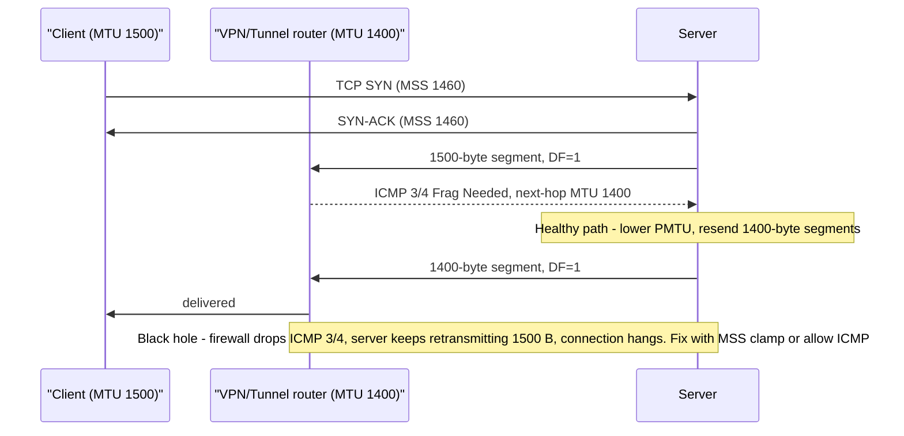
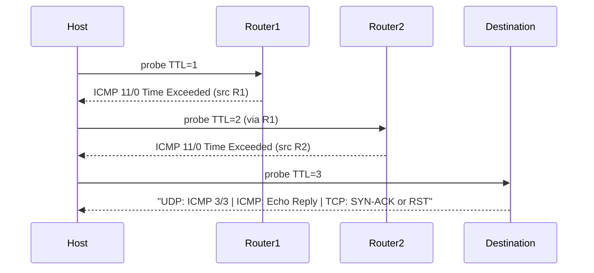
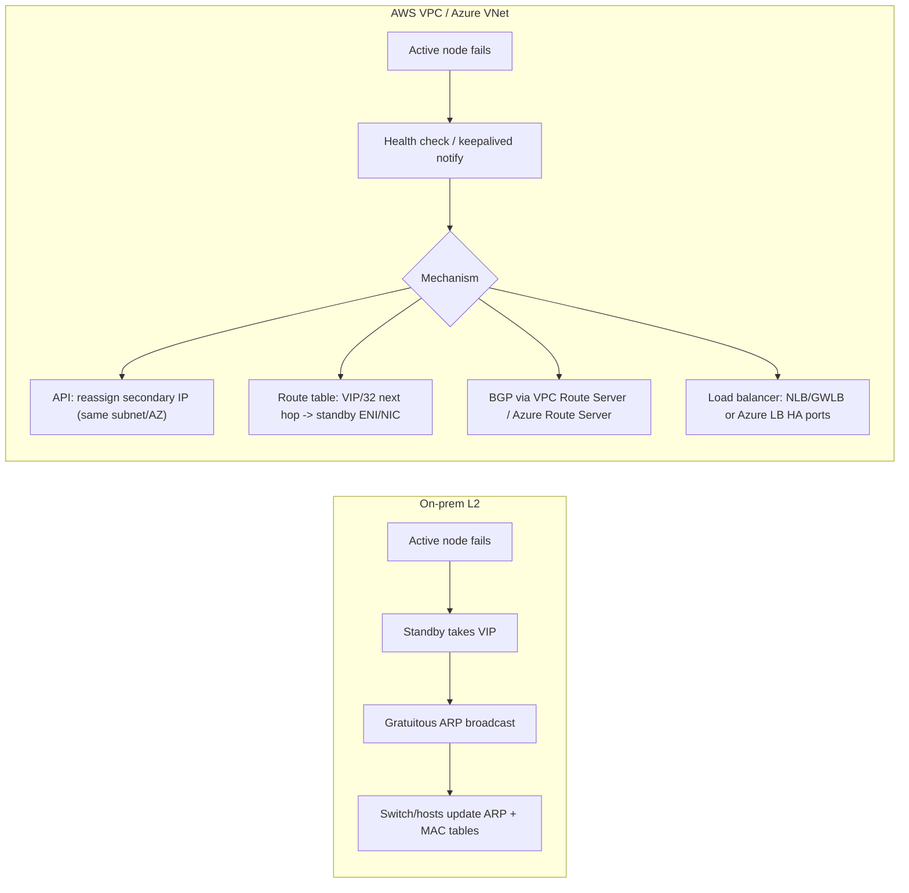

# F2 Internet Protocol (IP)
> Last verified: 2026-10 · Audience: senior/staff DevOps, SRE, AI eng, NetEng, DevSecOps, architects

## TL;DR
- **IP is connectionless, best-effort, hop-by-hop.** Each router decides the next hop by **longest-prefix match (LPM)**, decrements **TTL**, recomputes the IPv4 header checksum, and **rewrites the L2 (MAC) header**. Unless NAT is involved, src/dst IP stay the same end to end.
- **IPv4 header:** 20 bytes minimum (IHL=5), 60 maximum. Fields to know: **DSCP/ECN, Total Length, ID, Flags (DF/MF), Fragment Offset (in 8-byte units), TTL, Protocol (1/6/17/50), Checksum**. **IPv6** has a fixed 40-byte header, no checksum, no fragmentation by routers, and a minimum MTU of 1280.
- **MTU and PMTUD:** when a DF packet is larger than a link's MTU, the router drops it and sends **ICMP type 3 code 4 "Fragmentation Needed"** (IPv6: **ICMPv6 type 2 Packet Too Big**). If a firewall blocks that ICMP, you get a **PMTU black hole**: the handshake works and large transfers hang. Fixes: allow ICMP 3/4, **MSS clamping**, `tcp_mtu_probing` (PLPMTUD, RFC 4821/8899). RFC 8900 says fragmentation is fragile.
- **ping = ICMP echo (8→0). traceroute = increasing TTL plus ICMP type 11 Time Exceeded.** Linux `traceroute` sends UDP to port 33434+ by default, Windows `tracert` sends ICMP, and `traceroute -T` / `tcptraceroute` uses TCP SYN to get through firewalls. A missing hop (`* * *`) means that hop doesn't answer ICMP. It doesn't mean the hop is down.
- **ARP** maps an IPv4 address to a MAC on the local L2 segment: a broadcast request and a unicast reply. **Gratuitous ARP** is how on-prem VIPs fail over (keepalived/VRRP). **It does nothing in AWS VPC or Azure VNet**: the SDN answers ARP and broadcast/multicast isn't supported. Fail over instead with **secondary-IP reassignment, route-table updates, VPC Route Server / Azure Route Server (BGP), or a load balancer** (GWLB, Azure LB HA ports).
- **Private ranges:** RFC 1918 is 10/8, 172.16/12 and 192.168/16. **RFC 6598 100.64.0.0/10** is CGNAT shared space. Clouds reuse it for **non-routable pod ranges**: EKS custom networking secondary CIDRs, and Azure CNI Overlay pod CIDRs (default 10.244.0.0/16, RFC 6598 supported). Overlapping CIDRs are the most common long-term pain in hybrid designs.
- **Cloud defaults:** inbound ICMP is **not allowed** by a new AWS security group. Azure NSG default rules allow VNet↔VNet (ICMP included) but deny Internet inbound. Both clouds reserve **5 IPs per subnet**. AWS VPC jumbo MTU is **9001**, IGW/VPN are **1500**, TGW is **8500**. Azure default MTU is **1500**; larger MTU works only inside a VNet or same-region peering (3900 on Mellanox, 9000 on MANA).

---

## F2.1 The IP Building Blocks
- **How it works:**
  - **Address = network prefix + host part.** CIDR `/n` gives n prefix bits. Usable hosts = 2^(32−n) − 2 for classic subnets. `/31` is valid for point-to-point links (RFC 3021, no network/broadcast address). `/32` is a host route.
  - **Classful addressing (A/B/C) is historical.** CIDR (1993) replaced it. Interviewers still use "class C" to mean /24.
  - **On-link vs off-link decision:** the host ANDs the destination with its own mask. On the same subnet, it ARPs for the destination directly. Otherwise it ARPs for the **default gateway's MAC** and sends the frame there. The IP header still carries the final destination.
  - **Special ranges:** `0.0.0.0/8` ("this network"), `127.0.0.0/8` loopback, `169.254.0.0/16` link-local (the cloud metadata IP is **169.254.169.254** on both AWS and Azure), `224.0.0.0/4` multicast, `240.0.0.0/4` reserved, `255.255.255.255` limited broadcast, `192.0.2.0/24`, `198.51.100.0/24` and `203.0.113.0/24` documentation, `198.18.0.0/15` benchmarking. Azure also uses **168.63.129.16** as its virtual public IP for DNS, DHCP and health probes.
  - **Routing vs forwarding:** the **control plane** (BGP/OSPF/static) builds the RIB, which is installed into the FIB. The **data plane** does an LPM lookup in the FIB for each packet.
- **Trade-offs / when to use:**
  - Larger subnets leave room for autoscaling, pods and ENIs but waste space and grow the blast radius. Smaller subnets run out of IPs (EKS/AKS IP exhaustion is a classic outage).
  - IPv6 removes scarcity and NAT, but you still need dual-stack and egress-only/NAT64 designs. Not every managed service is IPv6-ready.
- **Interview angles:**
  - "What happens when you send a packet to 10.0.2.5 from 10.0.1.10/24?" The destination is off-link, so the host ARPs for the gateway, sends to the gateway's MAC with dst IP 10.0.2.5, and the router does LPM and forwards.
  - "Why does each hop change the MAC but not the IP?" L2 is link-local and L3 is end-to-end. NAT is the exception.
  - Pitfall: reserved addresses. AWS and Azure both reserve the **first 4 and the last IP** of every subnet. AWS subnets range from /28 to /16. Azure subnets range from /29 to /2, and Azure IPv6 subnets must be exactly /64.

## F2.2 IP Packet (header, MTU, fragmentation, TTL)

### IPv4 header (RFC 791)
| Field | Bits | What to say |
|---|---|---|
| Version | 4 | 4 |
| IHL | 4 | Header length in 32-bit words. Min 5 (20 B), max 15 (60 B). >5 means options are present, and options are often dropped or slow-pathed |
| DSCP / ECN | 6 / 2 | QoS marking (e.g. EF=46 for voice). ECN lets routers signal congestion without dropping (needs TCP ECE/CWR) |
| Total Length | 16 | Header + payload, max 65,535 B |
| Identification | 16 | Groups fragments. Wraps fast at high rates, which corrupts reassembly (RFC 8900/4963) |
| Flags | 3 | Reserved, **DF** (Don't Fragment), **MF** (More Fragments) |
| Fragment Offset | 13 | In **8-byte units**, so every fragment except the last carries a payload that is a multiple of 8 |
| TTL | 8 | Decremented at each hop. At 0 the packet is dropped and **ICMP 11/0** is sent. Defaults: Linux/macOS **64**, Windows **128**, many network OSes **255** |
| Protocol | 8 | 1 ICMP, 6 TCP, 17 UDP, 47 GRE, 50 ESP, 51 AH, 4 IP-in-IP, 41 IPv6-in-IPv4, 112 VRRP |
| Header Checksum | 16 | Covers the header only. Recomputed at every hop because TTL changes. **Removed in IPv6** |
| Src / Dst | 32 / 32 | Rewritten only by NAT |
| Options | 0–40 B | Record Route, Timestamp, Source Route (blocked almost everywhere) |

### IPv6 differences (RFC 8200)
- Fixed **40-byte** header. **Hop Limit** replaces TTL. **Flow Label** (20 bits) is used for ECMP hashing. Extension headers chain through Next Header.
- **Routers never fragment.** Only the source fragments, using a Fragment extension header. Minimum link MTU is **1280**. PMTUD relies on **ICMPv6 type 2 Packet Too Big**, so blocking ICMPv6 breaks IPv6.
- ARP is replaced by **NDP** (ICMPv6 133–137: RS, RA, NS, NA, Redirect). Blocking ICMPv6 kills address resolution.

### MTU, fragmentation and the DF bit
- **How it works:**
  - **MTU** is the largest L3 packet a link carries. Ethernet is 1500, giving a 1460 TCP MSS (1500 − 20 IP − 20 TCP). Jumbo frames are ~9000. Tunnel overhead reduces the usable MTU: IPsec ~50–73 B, VXLAN/GENEVE 50+ B, GRE 24 B, WireGuard 60/80 B.
  - IPv4 **without DF**: a router can split the packet into fragments, and only the destination reassembles them. **With DF** (which Linux sets by default on TCP for PMTUD): the router drops the packet and returns **ICMP 3/4 Fragmentation Needed**, with the next-hop MTU (RFC 1191).
  - Linux caches the learned PMTU per destination (`ip route get <dst>` shows `mtu`). The cache expires after `net.ipv4.route.mtu_expires` = 600 s.
  - IPv4 hosts must accept 576-byte datagrams, and the minimum IPv4 MTU is 68.
- **Why fragmentation is bad (RFC 8900):** non-first fragments carry no L4 ports, so stateless ACLs, NAT, ECMP hashing and LBs can't classify them. Losing one fragment means losing the whole datagram. Reassembly costs CPU and memory and is a DoS vector. ID wraparound can corrupt data. Fragments also take slow paths in the cloud: **Azure Accelerated Networking does not process fragments**, and Azure **drops out-of-order fragments by default**.
- **PMTU black hole:** the symptom is that the TCP handshake and small requests work, while large responses (TLS ServerHello with a cert chain, big HTTP bodies, `git clone`, `scp`) **hang**. The usual cause is a firewall or SG/NACL dropping ICMP 3/4, or a tunnel with a lower MTU.
  - Fixes: allow ICMP type 3 code 4 (and ICMPv6 type 2), **clamp MSS** on the tunnel or edge (`--clamp-mss-to-pmtu` or a fixed value; Azure recommends **MSS 1350 / tunnel MTU 1400** for VPN), enable `net.ipv4.tcp_mtu_probing=1` (PLPMTUD, RFC 4821/8899), or lower the interface MTU.
- **TTL:** prevents routing loops from circulating packets forever. Also used by traceroute, by GTSM (RFC 5082: BGP peers send TTL 255 and accept only ≥254), and for OS fingerprinting.
- **Trade-offs / when to use:**
  - Jumbo frames help inside a placement group, between storage and DB nodes, or for distributed training (fewer packets, less per-packet CPU). Keep 1500 for anything that crosses an IGW, VPN or the Internet, or set MTU per route or per ENI.
  - MSS clamping only fixes TCP. UDP-based protocols (QUIC, DNS over UDP, VXLAN) need their own sizing. QUIC uses PLPMTUD with a 1200-byte minimum, and DNS uses EDNS0 buffers of about 1232.
- **Interview angles:**
  - "Connections hang after the handshake over the VPN" → MTU/PMTUD black hole. Prove it with `ping -M do -s 1472` (1500 − 28) and lower sizes until replies come back. Fix with MSS clamping or by allowing ICMP.
  - "Why does IPv6 need ICMP more than IPv4?" Routers can't fragment, so PTB is the only signal, and NDP itself runs on ICMPv6.
  - Gotcha: in captures, **TSO/GSO/LRO** make packets look larger than the MTU (e.g. 64 KB). That is NIC offload, not fragmentation. Azure documents this explicitly for LSO.
  - "When migrating from VPC peering to TGW, why do some packets drop?" Inter-region peering MTU is 8500 and TGW MTU is 8500, but mismatches during cutover cause asymmetric drops. TGW **clamps MSS for all packets** and generates FRAG_NEEDED/PTB only for traffic **ingressing on VPC and Connect attachments**. It does not do PMTUD on VPN, DX or peering attachments.

## F2.3 ICMP, PING, TraceRoute
- **How it works:**
  - **ICMP (protocol 1)** carries errors and diagnostics for IP. The types that matter:

| Type/Code | Meaning | Why you care |
|---|---|---|
| 0 / 8 | Echo Reply / Request | ping |
| 3/0, 3/1 | Net / Host unreachable | No route, or no ARP reply from the last-hop router |
| **3/3** | **Port unreachable** | UDP traceroute's "arrived" signal. Also how a closed UDP port answers |
| **3/4** | **Fragmentation Needed and DF set** | **PMTUD. Never block it** |
| 3/13 | Communication administratively prohibited | A firewall/ACL rejected the packet (rather than dropping it silently) |
| 5 | Redirect | A router telling a host there's a better gateway. Usually disabled for security |
| **11/0** | **Time Exceeded (TTL)** | traceroute hops, routing loops |
| 11/1 | Fragment reassembly time exceeded | Fragment loss |
| 12 | Parameter problem | Bad header/options |
| ICMPv6 1/2/3/128/129/133–137 | Unreach / **PTB** / Time Exceeded / Echo / **NDP** | Blocking these breaks IPv6 |

  - **ping:** sends ICMP echo requests and reports RTT min/avg/max/mdev and loss. Useful flags: `-c`, `-i`, `-s` size, `-M do` (set DF; Windows `-f -l`), `-t` TTL, `-I` source interface. ICMP has no ports, so NAT tracks it by the ICMP **identifier**.
  - **traceroute:** sends probes with TTL=1,2,3,… Each router whose decrement hits 0 replies with **ICMP 11/0** from its own IP. The last hop is identified by the protocol's terminal reply:

| Variant | Probe | Terminal reply | Use when |
|---|---|---|---|
| Linux `traceroute` (default) | **UDP** to dst port **33434+** (incremented per probe) | ICMP 3/3 port unreachable | Classic. Often blocked by firewalls |
| `traceroute -I`, Windows `tracert` | ICMP echo | ICMP echo reply | The destination answers ping |
| `traceroute -T -p 443`, `tcptraceroute`, `mtr -T` | **TCP SYN** to a real service port | SYN-ACK or RST | Firewalls only allow 443. **Best for cloud and LB paths** |
| `tracepath` | UDP, no root needed | — | Also **discovers PMTU** per hop |
| `mtr` | Continuous traceroute + ping | — | Loss/latency per hop over time |

  - Defaults: 3 probes per hop, max 30 hops.
- **Trade-offs / when to use:**
  - ICMP ping shows L3 reachability only. It says nothing about TCP ports, LB health or the app. Use `nc -zv`, `curl -w` or TCP traceroute for those.
  - **Reading traceroute:** loss at an **intermediate hop that doesn't carry through** to later hops is ICMP **rate-limiting/deprioritization** on that router's control plane, not real loss. Only loss that persists to the destination matters. Asymmetric return paths make per-hop latency misleading. ECMP can show different routers at the same hop (Paris-traceroute keeps the flow hash constant).
- **Interview angles:**
  - "Ping fails but HTTPS works." ICMP is blocked by an SG/NSG/NACL or host firewall, or the target is an LB/PaaS endpoint that doesn't answer ICMP. Examples: the Azure default gateway doesn't answer ping, and Azure service endpoints carry only TCP, so ping/tracert don't show the real path.
  - "Traceroute shows `* * *` in the middle and then completes." That hop doesn't send Time Exceeded. Harmless.
  - "Explain how traceroute finds the destination for each variant." Covered by the table above. Bonus: AWS/Azure SDN hops are often invisible or collapsed, so use cloud-native tools: AWS **Reachability Analyzer** and **Network Access Analyzer**, Azure **Network Watcher Connection troubleshoot / Next hop / IP flow verify**.
  - Security: blanket "block all ICMP" is an anti-pattern. Allow 3/4 (and ICMPv6 1–4 plus NDP), and rate-limit echo instead.

## F2.4 ARP
- **How it works:**
  - **ARP (RFC 826, EtherType 0x0806)** maps an IPv4 address to a MAC. The **request** is broadcast to `ff:ff:ff:ff:ff:ff` ("who-has 10.0.1.1 tell 10.0.1.10"). The **reply** is unicast ("10.0.1.1 is-at aa:bb:…"). Opcodes: 1 request, 2 reply.
  - Results are cached in the neighbor table (`ip neigh`). Linux states: REACHABLE → STALE → DELAY → PROBE → FAILED. `base_reachable_time` is ~30 s, randomized.
  - **`gc_thresh1/2/3` defaults are 128/512/1024.** Large flat L2 networks or big K8s nodes overflow the table with the error **"neighbour table overflow"**. Raise the thresholds.
  - **Gratuitous ARP (GARP):** an unsolicited ARP (request or reply) where **sender IP = target IP**. Uses: (1) detect duplicate IPs (and ACD, RFC 5227), (2) **update neighbors' and switches' caches after a VIP moves**, as in keepalived/VRRP (protocol 112, multicast 224.0.0.18), Pacemaker, F5 HA pairs, and MetalLB L2 mode.
  - **Proxy ARP:** a router answers ARP on behalf of another subnet. This is effectively what cloud SDNs do.
  - Linux tuning for DSR/LVS: `arp_ignore=1`, `arp_announce=2`. Without them, real servers answer ARP for the VIP held on loopback.
- **ARP in cloud VPC/VNet:**
  - There is **no real L2 broadcast domain**. The hypervisor/SDN (AWS Nitro, Azure VFP/SmartNIC) **answers ARP itself** from its own mapping database, keyed by which ENI/NIC owns which IP. Packets sent to an IP the platform hasn't assigned to your NIC are dropped by **source/destination checks**.
  - AWS: "We do not support broadcast in a VPC" (TGW multicast is a separate opt-in). Azure: "Multicast and broadcast are not supported", and GRE and IP-in-IP are also blocked inside VNets.
  - Consequence: **GARP-based VIP failover does nothing.** The SDN ignores your GARP. Keepalived needs `unicast_peer` just to exchange VRRP, and even then the VIP doesn't move.
  - **Cloud-native VIP failover patterns:**

| Pattern | AWS | Azure |
|---|---|---|
| Move a secondary private IP | `aws ec2 assign-private-ip-addresses --allow-reassignment` (same subnet, so **same AZ**) | Update NIC ipconfig via API (same subnet) |
| Route-table "overlay VIP" outside the VPC CIDR | `replace-route` for VIP/32 → new ENI/instance. **Works across AZs** | UDR VIP/32 → next hop *Virtual appliance* = new NVA IP |
| BGP-driven | **VPC Route Server** (BGP into VPC route tables, BFD for sub-second detection; blog Sept 2025) | **Azure Route Server** (BGP with NVAs) |
| Load balancer in front | NLB, or **Gateway Load Balancer** for appliances (AWS's preferred NVA HA) | Internal **Standard LB with HA ports** for NVAs |
| Public IP | Re-associate an **Elastic IP** | Re-associate a Public IP |

  - Routing or NAT appliances need **source/dest check disabled** on AWS and **IP forwarding enabled** on the Azure NIC, plus `net.ipv4.ip_forward=1` in the OS.
- **Trade-offs / when to use:**
  - The API-driven move takes seconds (control-plane call plus propagation) and depends on IAM and on control-plane health. Route-based failover works across AZs but is subject to route-table quotas. BGP (Route Server) is automatic and fast but adds complexity. An LB is the simplest, but it's L4 and costs more.
- **Interview angles:**
  - "Port your on-prem keepalived HA pair to AWS." GARP won't work. Use NLB/GWLB, or a keepalived `notify` script that calls `replace-route` or `assign-private-ip-addresses`, or VPC Route Server with BGP+BFD. A secondary IP can't cross AZs because a subnet lives in one AZ.
  - "Why did failover on-prem take ~4 minutes?" Upstream ARP caches or switch MAC tables still pointed to the old MAC because the GARP was lost or ignored. Fixes: repeat GARP (keepalived `garp_master_repeat`), shorten timeouts, or use a virtual MAC (VRRP 00:00:5e:00:01:XX).
  - Security: **ARP spoofing / MITM** works on on-prem L2. Mitigate with Dynamic ARP Inspection and DHCP snooping. It's largely impossible in VPC/VNet because the SDN owns ARP.

## F2.5 Capturing IP, ARP and ICMP Packets with TCPDUMP
- **How it works:** tcpdump uses libpcap with **BPF** kernel filters, so filtered-out packets never reach user space. Default snaplen is 262144 bytes (full packets). Use `-w` to write pcap and open it in Wireshark (see F8).
- **Essential flags:** `-i any|eth0`, `-nn` (no DNS or port names, which also avoids generating DNS noise), `-e` (show MAC/L2 header, needed for ARP), `-v/-vv` (shows TTL, ID, DF flags, length), `-c N`, `-s 0`, `-w file.pcap`, `-r`, rotation with `-C 100 -W 10` or `-G 3600`, `-Q in|out` (direction).
- **Filters to memorize:**

```bash
tcpdump -nn -e -i eth0 arp                                # ARP who-has/is-at incl. gratuitous ARP
tcpdump -nn -i eth0 icmp                                  # all ICMPv4
tcpdump -nn -i eth0 'icmp[icmptype] == icmp-echo or icmp[icmptype] == icmp-echoreply'
tcpdump -nn -i eth0 'icmp[icmptype] == icmp-unreach and icmp[icmpcode] == 4'   # PMTUD Frag-Needed
tcpdump -nn -i eth0 'icmp[icmptype] == icmp-timxceed'     # traceroute hop replies / loops
tcpdump -nn -i eth0 'icmp6 and ip6[40] == 2'              # ICMPv6 Packet Too Big (no ext headers)
tcpdump -nn -i eth0 'ip[6:2] & 0x1fff != 0 or ip[6] & 0x20 != 0'  # fragments (offset!=0 or MF set)
tcpdump -nn -v -i eth0 'ip[6] & 0x40 != 0 and greater 1400'       # large packets with DF set
tcpdump -nn -i eth0 'ip[8] < 5'                           # TTL < 5 (loop / traceroute probes)
tcpdump -nn -i eth0 'udp dst portrange 33434-33534'       # classic UDP traceroute probes
tcpdump -nn -i eth0 'tcp[tcpflags] & (tcp-syn|tcp-rst) != 0 and host 10.0.1.5'
tcpdump -nn -i any -w /tmp/cap.pcap -C 100 -W 5 'host 10.0.1.5 and not port 22'
```

- **Trade-offs / when to use:**
  - Capturing on `any` loses real L2 headers (Linux "cooked" SLL). Use a specific interface for ARP and MAC work.
  - Offloads (GRO/TSO) show super-MTU packets. Use `ethtool -K eth0 gro off tso off` (temporarily, on test hosts only) to see what's on the wire.
  - On busy hosts, a capture without a filter drops packets ("dropped by kernel") and burns CPU. Always filter and cap with `-c` or rotation.
- **Interview angles:**
  - "Prove it's a PMTU black hole." Capture on the sender. You see full-size DF segments retransmitted with no ACK and **no ICMP 3/4 arriving**. Then ping with DF at decreasing sizes.
  - Kubernetes: capture inside a pod's netns with `kubectl debug node/<n>` or an ephemeral container, or `nsenter -t <pid> -n tcpdump …`. Cloud-wide options: **AWS VPC Traffic Mirroring** (ENI → NLB/ENI, VXLAN 4789); Azure **Network Watcher packet capture** or **virtual network TAP** (vTAP is still preview per the VNet FAQ, so no SLA). **VPC Flow Logs / NSG/VNet flow logs** are metadata only, not packets. AWS flow logs also skip traffic to the Amazon DNS resolver, IMDS and DHCP.

## F2.6 Routing Example
- **How it works:**
  - **Longest-prefix match:** the most specific matching route wins regardless of the order routes appear in. For dst 10.1.2.3 with routes 10.0.0.0/8 → A, 10.1.0.0/16 → B, 10.1.2.0/24 → C and 0.0.0.0/0 → IGW, the packet goes to **C**.
  - **Tie-breaking** on an identical prefix: on-prem uses **administrative distance** (connected 0 < static 1 < eBGP 20 < OSPF 110 < iBGP 200), then the protocol metric, then ECMP.
    - **AWS VPC route tables:** LPM first. For the same prefix, **static** (IGW, NAT GW, ENI, TGW, peering, GWLBe) > **prefix-list routes** > **propagated** (Direct Connect BGP > VPN static > VPN BGP). The `local` route covers the VPC CIDR. You can add routes **more specific than local** to steer east-west traffic through an appliance.
    - **Azure:** LPM first. For the same prefix, **UDR > BGP > system**. But system routes for VNet, peering and service endpoints stay preferred even over more-specific BGP routes. Azure adds system routes with next hop **None** for 10/8, 172.16/12, 192.168/16 and **100.64/10** until you use those ranges.
  - **Per-hop packet walk:** (1) the host decides off-link and ARPs for the gateway; (2) router 1 does LPM, decrements TTL, recomputes the checksum and builds a new L2 header for the next hop (ARP if needed); (3) repeat until the last router ARPs for the destination host. **Return traffic is routed independently**, so paths can be asymmetric. Stateful firewalls in asymmetric paths drop the return traffic.
  - Linux: `ip route get 10.1.2.3` shows the chosen route, source IP and PMTU. Policy routing uses `ip rule` plus multiple tables (multi-ENI hosts need this to avoid asymmetric replies).
- **Trade-offs / when to use:**
  - Summarize routes to stay under quotas (Azure: 400 UDRs per table, 1,000 with AVNM; TGW: 10,000 combined routes). Blackhole routes (AWS `blackhole` state, Azure next hop `None`) are useful for explicit deny.
  - Forcing 0.0.0.0/0 through an NVA (Azure forced tunneling) also captures traffic to Azure PaaS public IPs unless you add service endpoints, private endpoints or service-tag UDRs.
- **Interview angles:**
  - "Peering is up but there's no connectivity." Check: a route in **both** directions' route tables, an SG/NSG that allows it, no overlapping CIDR, and NACLs (stateless, so ephemeral return ports must be allowed).
  - "Packets go to the firewall but replies bypass it." The routing is asymmetric. Fix with symmetric UDRs, GWLB with flow stickiness, or SNAT at the NVA.
  - Overlap: TGW/peering/vWAN can't route overlapping CIDRs. Options are a **PrivateLink / Private Endpoint** service, an AWS **private NAT gateway**, NAT on an NVA, or re-IP.

## F2.7 Private IP addresses (RFC 1918)
- **How it works:**
  - **RFC 1918:** `10.0.0.0/8` (16.7M addresses), `172.16.0.0/12` (172.16–172.31, 1M), `192.168.0.0/16` (65K). Not routed on the public Internet. Reaching the Internet requires **NAT/PAT**.
  - **RFC 6598 `100.64.0.0/10`** (100.64.0.0–100.127.255.255) is "Shared Address Space" for **CGNAT** between ISP CGN and customer CPE. It exists because ISPs can't safely use RFC 1918 when customers already use it. It **MUST NOT be forwarded across provider boundaries**. RFC 6598 warns that non-CGN use can conflict with CGN.
    - **Cloud reuse:** both AWS and Azure explicitly allow 100.64/10 in a VPC/VNet. AWS lets you add 100.64/10 secondary CIDRs (/16 to /28) to an RFC 1918 VPC. `198.19.0.0/16` is allowed only when the primary CIDR isn't RFC 1918. Azure treats RFC 6598 as private.
    - **EKS custom networking:** add a non-routable 100.64.x.x/16 secondary CIDR and create `ENIConfig` per AZ. The VPC CNI (`AWS_VPC_K8S_CNI_CUSTOM_NETWORK_CFG=true`) puts pod IPs on **secondary ENIs** in those subnets. Trade-offs: the primary ENI's IPs aren't used for pods (fewer pods per node), pods that leave the VPC are SNATed to the node IP, it's **IPv4 only**, and AWS says to consider an IPv6 cluster if the only goal is solving IP exhaustion.
    - **Azure CNI Overlay:** pods get IPs from a private pod CIDR (default **10.244.0.0/16**, one fixed **/24 per node**, max 250 pods per node). Supported ranges are RFC 1918 or **RFC 6598**. Traffic leaving the cluster is SNATed to the node IP. Pods aren't encapsulated, so subnet NSG rules apply. The same pod CIDR can be reused across clusters in one VNet. AKS defaults to Overlay when no plugin is specified. **kubenet retires 2028-03-31.**
  - **Other "private-ish" ranges:** IPv6 **ULA `fc00::/7`** (RFC 4193). `169.254/16` link-local. Docker default bridge **172.17.0.0/16**: AWS warns that Cloud9 and SageMaker use it, so avoid it for VPCs. kubeadm defaults: pod 10.244/16 (flannel), service 10.96.0.0/12.
- **Trade-offs / when to use:**
  - **IPAM discipline:** allocate non-overlapping blocks per region, account and environment from day one (AWS VPC IPAM, Azure Virtual Network Manager IPAM). Avoid `10.0.0.0/16`, `172.31.0.0/16` (AWS default VPC) and `192.168.0.0/16`, the ranges every home router and lab uses.
  - 100.64/10 for pods saves routable space, but it can collide with on-prem or ISP CGNAT, with Tailscale (which uses 100.64/10 for node IPs), or with partner networks. Document it and keep it non-advertised.
  - IPv6 (EKS IPv6 clusters, AKS dual-stack) is the long-term answer to exhaustion. Azure VNets are IPv4-only or dual-stack, with no IPv6-only VNet. AWS supports dual-stack and IPv6-only subnets (NAT64/DNS64), but a VPC always keeps an IPv4 CIDR.
- **Interview angles:**
  - "Our EKS cluster ran out of IPs." Options: prefix delegation (/28 per ENI slot), custom networking with 100.64/10, an IPv6 cluster, or an overlay CNI (Cilium/Calico). Explain the trade-offs: pod density, SG-per-pod, routability.
  - "Is 100.64/10 private?" It isn't RFC 1918. It's shared CGNAT space, non-routable on the Internet, and accepted as private by AWS and Azure. Mention the collision risks.
  - "Can 172.32.0.1 be used as private?" No, the private /12 ends at 172.31.255.255. A common trick question.

---

## Diagrams

### PMTUD and the black hole


### traceroute (TTL expiry)


### VIP failover: on-prem GARP vs cloud


---

## Cloud mapping: AWS vs Azure
| Capability | AWS | Azure | Role it plays | Key differences | Alternatives |
|---|---|---|---|---|---|
| Private address space | VPC CIDR /16–/28, secondary CIDRs (RFC 1918, 100.64/10, public, 198.19/16 conditional) | VNet address space (RFC 1918 + RFC 6598 recommended), subnets /29–/2 | IPAM foundation | AWS has strict mixing rules for secondary CIDRs. Azure adds `None` system routes for unused private ranges | GCP VPC (global), on-prem IPAM (Infoblox) |
| Reserved IPs per subnet | 5 (network, router .1, DNS .2, future .3, broadcast) | 5 (network, gateway .1, DNS .2/.3, broadcast) | Sizing math | Same count, different purposes | — |
| ICMP filtering | Security group (stateful, **no inbound by default** on new SGs; default SG allows same-SG traffic) + NACL (stateless, default allows all) | NSG default rules: AllowVnetInBound (65000), AllowAzureLoadBalancerInBound (65001), DenyAllInBound (65500) | Allows ping and **PMTUD** | AWS needs an explicit ICMP 3/4 inbound rule unless the flow is tracked. Azure allows ICMP inside the VNet by default but blocks it from the Internet. The Azure default gateway doesn't answer ping | Host firewall (nftables), Cloud NGFW |
| MTU | 9001 in VPC. 1500 via IGW, VPN, inter-region (no TGW). 8500 via TGW, inter-region peering | 1500 default. Up to 3900 (Mellanox) / 9000 (MANA) only inside a VNet or same-region peering | Throughput vs fragmentation risk | Azure drops out-of-order fragments, and fragments skip Accelerated Networking. TGW clamps MSS | Cloudflare/edge terminate TLS at 1500 |
| ARP / L2 | Nitro answers ARP. No broadcast (TGW multicast opt-in). Source/dest check | SDN answers ARP. No broadcast, multicast, GRE or IP-in-IP. NIC IP forwarding flag | GARP VIPs don't work | Both need API- or route-based failover | Overlay (VXLAN in VMs), Kubernetes LB |
| VIP / HA failover | Secondary IP reassignment (same AZ), `replace-route`, **VPC Route Server** (BGP+BFD), NLB/GWLB, EIP | IP reassignment, UDR to NVA, **Azure Route Server**, ILB **HA ports**, Public IP move | Floating IP for NVAs and legacy HA | GWLB uses GENEVE and is AWS's preferred NVA HA. Azure's standard is ILB HA ports | MetalLB BGP mode, Cilium BGP |
| Route selection | LPM. Static > prefix list > propagated (DX > VPN static > VPN BGP). Routes more specific than local are allowed | LPM. UDR > BGP > system. VNet/peering system routes stay preferred over BGP | Traffic steering | Azure: 400 UDRs per table (1,000 with AVNM) | — |
| Packet capture | VPC Traffic Mirroring, Flow Logs (metadata) | Network Watcher packet capture, vTAP (preview), VNet flow logs | Forensics / debugging | Flow logs aren't packets on either cloud | tcpdump on host, Cilium Hubble |
| Path diagnostics | Reachability Analyzer, Network Access Analyzer | Network Watcher: Connection troubleshoot, Next hop, IP flow verify | Replaces traceroute where SDN hides hops | Both analyze configuration. Neither sends real probes for all checks | mtr / TCP traceroute |
| K8s pod IP conservation | EKS custom networking (100.64/10 secondary CIDR + ENIConfig), prefix delegation, IPv6 clusters | AKS **Azure CNI Overlay** (pod CIDR RFC 1918/6598, /24 per node), Pod Subnet, dual-stack | Avoid VPC/VNet IP exhaustion | EKS pods stay VPC-routable (in the secondary CIDR). Azure Overlay pods aren't routable outside the cluster (SNAT). kubenet retires 2028-03-31 | Cilium/Calico overlay, GKE alias IPs |
| IPv6 | Dual-stack and IPv6-only subnets (/64), VPC /44–/60 blocks, egress-only IGW, NAT64/DNS64. Can't remove IPv4 from the VPC | IPv4-only or dual-stack VNets. Subnets exactly /64. No IPv6-only VNet | Scale beyond IPv4 | AWS is further along on IPv6-only. Azure IPv6 LB probes come from link-local (AKS needs `externalTrafficPolicy: Local`) | — |

- **AWS SG and ICMP:** security groups are stateful, so ICMP errors tied to a **tracked** outbound connection (including flows through NAT GW or LBs) get back in. If the flow is untracked or asymmetric, add an inbound rule for **ICMP type 3 code 4** (or all ICMP from trusted CIDRs). A **NACL** can still deny ICMP even when the SG allows it.
- **Azure NSG and ICMP:** the `VirtualNetwork` service tag covers the VNet, peered VNets and on-prem prefixes learned through gateways. That's why ping works across peering by default and fails from the Internet. Azure-provided gateway IPs (.1) don't answer ICMP.
- **Gotchas:** AWS TGW does PMTUD only for traffic ingressing on VPC and Connect attachments. Azure documents an MSS of 1350 and tunnel MTU of 1400 for VPN. Azure service endpoints carry only TCP, so ICMP tests mislead. Secondary-IP failover in AWS can't cross AZs because a subnet lives in one AZ. Use route-based failover, Route Server or an LB for multi-AZ.
- **Alternatives:** Kubernetes-native VIPs (MetalLB in BGP mode, Cilium LB-IPAM + BGP) replace GARP in bare metal and hybrid setups. Cloudflare Magic Transit/WAN handles MSS clamping at its edge (MTU 1476 for GRE) (unverified).

---

## Hands-on (optional)
```bash
# Find path MTU (Linux): 1500 - 20 IP - 8 ICMP = 1472 payload
ping -c 3 -M do -s 1472 10.0.2.5     # "message too long" / no reply => path MTU < 1500
tracepath -n 10.0.2.5                # per-hop PMTU discovery, no root needed
ip route get 10.0.2.5                # chosen route, src IP, cached mtu

# Traceroute variants
traceroute -n 8.8.8.8                # UDP 33434+
traceroute -n -I 8.8.8.8             # ICMP echo
sudo traceroute -n -T -p 443 example.com   # TCP SYN, firewall friendly
mtr -rwzc 100 -T -P 443 example.com  # per-hop loss/latency report, TCP mode

# ARP / neighbor table
ip neigh show; sysctl net.ipv4.neigh.default.gc_thresh{1,2,3}
arping -U -I eth0 -c 3 10.0.1.100    # send gratuitous ARP (does nothing useful in VPC/VNet)

# MSS clamping on a Linux router/VPN box + PLPMTUD
iptables -t mangle -A FORWARD -p tcp --tcp-flags SYN,RST SYN -j TCPMSS --clamp-mss-to-pmtu
sysctl -w net.ipv4.tcp_mtu_probing=1

# AWS: cloud-native "VIP" failover
aws ec2 assign-private-ip-addresses --network-interface-id eni-standby \
  --private-ip-addresses 10.0.1.100 --allow-reassignment
aws ec2 replace-route --route-table-id rtb-123 --destination-cidr-block 192.168.100.10/32 \
  --network-interface-id eni-standby
aws ec2 modify-instance-attribute --instance-id i-123 --no-source-dest-check
```

```hcl
# Allow PMTUD ICMP into an AWS SG, and add a 100.64/10 secondary CIDR for EKS pods
resource "aws_vpc_security_group_ingress_rule" "pmtud" {
  security_group_id = aws_security_group.app.id
  ip_protocol       = "icmp"
  from_port         = 3   # ICMP type
  to_port           = 4   # ICMP code (Fragmentation Needed)
  cidr_ipv4         = "0.0.0.0/0"
}

resource "aws_vpc_ipv4_cidr_block_association" "pods" {
  vpc_id     = aws_vpc.main.id
  cidr_block = "100.64.0.0/16"
}
```

---

## Cross-links
- [F1 Fundamentals of Networking](./F1-fundamentals-of-networking.md)
- [F3 UDP](./F3-user-datagram-protocol.md) · [F4 TCP](./F4-transmission-control-protocol.md) (MSS, retransmissions)
- MTU overlap: [F6 Network Performance](./F6-network-performance.md) (F6.1) · `../G-cloud-network-architecture/ (G4.1, G12.27)` · `../H-full-stack-troubleshooting/ (H5.8)`
- [F7 Network Routing](./F7-network-routing.md) (LPM, BGP)
- Diagnostic tools: [F8 Analyzing Protocols with Wireshark](./F8-analyzing-protocols-with-wireshark.md) · `../H-full-stack-troubleshooting/ (H1 Linux Network Diagnostics, H2 Troubleshooting Your Network)`
- Firewalls/ACLs (ICMP rules): `../G-cloud-network-architecture/ (G1.7, G1.8)` · `../C-large-scale-architecture/ (C4.12, C4.13)`
- Cloud VNet fundamentals: `../G-cloud-network-architecture/ (G1 Virtual Network Fundamentals)`

## Sources
- RFC 791 (IPv4): https://www.rfc-editor.org/rfc/rfc791
- RFC 1191 (PMTUD): https://www.rfc-editor.org/rfc/rfc1191
- RFC 8900 (IP Fragmentation Considered Fragile): https://www.rfc-editor.org/rfc/rfc8900.html
- RFC 6598 (Shared Address Space 100.64/10): https://www.rfc-editor.org/rfc/rfc6598.html
- RFC 1918: https://www.rfc-editor.org/rfc/rfc1918
- AWS EC2 network MTU / PMTUD: https://docs.aws.amazon.com/AWSEC2/latest/UserGuide/network_mtu.html
- AWS Transit Gateway quotas (MTU, PMTUD, MSS clamping): https://docs.aws.amazon.com/vpc/latest/tgw/transit-gateway-quotas.html
- AWS VPC CIDR blocks and association restrictions: https://docs.aws.amazon.com/vpc/latest/userguide/vpc-cidr-blocks.html
- AWS subnet sizing / reserved IPs / no broadcast: https://docs.aws.amazon.com/vpc/latest/userguide/subnet-sizing.html
- AWS route priority: https://docs.aws.amazon.com/vpc/latest/userguide/route-tables-priority.html
- AWS security groups: https://docs.aws.amazon.com/vpc/latest/userguide/vpc-security-groups.html
- AWS IPv6 support for VPC: https://docs.aws.amazon.com/vpc/latest/userguide/vpc-migrate-ipv6.html
- EKS custom networking: https://docs.aws.amazon.com/eks/latest/userguide/cni-custom-network.html
- VPC Route Server floating IP blog: https://aws.amazon.com/blogs/networking-and-content-delivery/dynamic-routing-using-amazon-vpc-route-server
- Azure TCP/IP performance tuning (MTU, fragmentation, PMTUD, MSS 1350): https://learn.microsoft.com/en-us/azure/virtual-network/virtual-network-tcpip-performance-tuning
- Azure VM MTU configuration: https://learn.microsoft.com/en-us/azure/virtual-network/how-to-virtual-machine-mtu
- Azure Virtual Network FAQ (ranges, reserved IPs, broadcast/multicast, ICMP): https://learn.microsoft.com/en-us/azure/virtual-network/virtual-networks-faq
- Azure VNet traffic routing (LPM, UDR > BGP > system): https://learn.microsoft.com/en-us/azure/virtual-network/virtual-networks-udr-overview
- Azure CNI Overlay concepts and configuration: https://learn.microsoft.com/en-us/azure/aks/concepts-network-azure-cni-overlay · https://learn.microsoft.com/en-us/azure/aks/azure-cni-overlay
