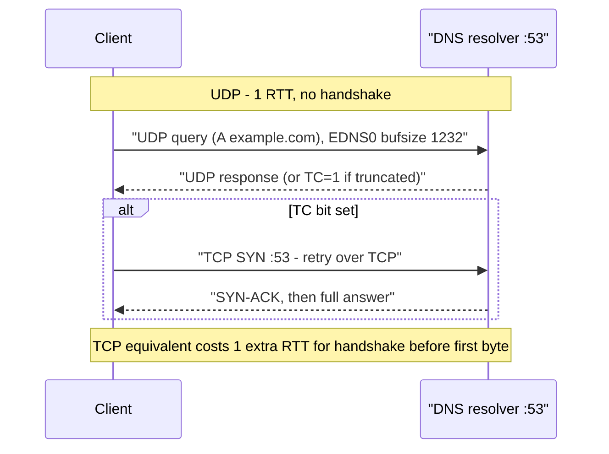
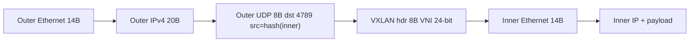
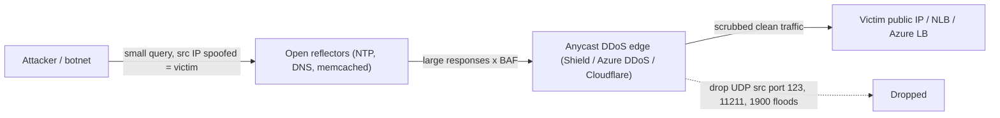

# F3 User Datagram Protocol (UDP)
> Last verified: 2026-10 · Audience: senior/staff DevOps, SRE, AI eng, NetEng, DevSecOps, architects

## TL;DR
- **UDP (RFC 768, IP protocol 17)** gives you ports, a length and a checksum on top of IP. That's all. There's no connection, no ordering, no retransmission and no flow control or **congestion control**. Your app (or QUIC) has to provide whatever it needs.
- **8-byte header**: src port, dst port, length, checksum. The checksum is optional on IPv4 (0 = none) and **mandatory on IPv6** (with narrow exceptions for tunnels, RFC 6935/6936). Max payload is **65,507 B on IPv4**. In practice, stay under the path MTU: 1472 B payload on a 1500 MTU. The safe fallback is 576/1280 B for v4/v6 (RFC 8085), and DNS uses **1232 B** EDNS buffers.
- **Use cases**: DNS, **QUIC/HTTP/3**, VoIP/RTP, WebRTC, gaming, NTP, syslog, SNMP, DHCP, overlay tunnels (**VXLAN 4789**, **Geneve 6081**, WireGuard 51820, IPsec NAT-T 4500). The pattern is low latency, small transactions, multicast, or "I'll build my own reliability".
- **"Stateless" isn't stateless in practice.** Every stateful middlebox keeps UDP pseudo-flows keyed on the 5-tuple with **idle timers**: Linux conntrack 30 s/120 s, EC2 SG 30 s/180 s, NLB 120 s, Global Accelerator 30 s. Expect keepalives and NAT rebinding.
- **Security**: there's no handshake, so source IPs can be spoofed. That makes UDP the basis of **reflection/amplification DDoS**: memcached up to 51,000x, NTP ~557x, DNS 28–54x. Mitigate with BCP 38 ingress filtering, rate limiting, closing open resolvers, and cloud DDoS services (Shield, Azure DDoS Protection, Cloudflare).
- **Cloud LB**: AWS NLB supports UDP, TCP_UDP, and **QUIC/TCP_QUIC passthrough** (since Nov 2025), with Connection-ID stickiness. Azure Standard LB balances UDP on a 5-tuple hash with no QUIC awareness. Neither cloud can health-check over UDP, so you use TCP/HTTP(S) probes. **Front Door, ALB and App Gateway don't carry UDP.**
- **Debug**: `tcpdump -ni any udp port 53`. Use `ss -uanp` and `nstat`/`netstat -su` to look for **receive buffer errors**, which are the most common silent UDP loss on hosts.

## F3.1 What Is UDP?
- **How it works:**
  - Defined in **RFC 768 (1980)**, which is about 3 pages long. It's a transport protocol that does **multiplexing (ports) and error detection (checksum)** and nothing else. Each `sendto()` produces exactly one datagram, so **message boundaries are preserved**, unlike TCP's byte stream.
  - There's **no handshake**, so the first packet already carries data (0-RTT at L4). There's no teardown, no sequence numbers, no ACKs, no retransmits, no windowing and no congestion control.
  - It supports **unicast, broadcast and multicast**. TCP can't do the last two. That's why DHCP (67/68), mDNS (5353), SSDP (1900) and IPTV multicast use UDP.
  - **Ordering and duplication**: datagrams can arrive out of order, duplicated, or not at all, and the app must tolerate all three. If the receiving port is closed, the host replies **ICMP Port Unreachable** (type 3 code 3). Apps only see that as `ECONNREFUSED` on a *connected* UDP socket.
  - **Well-known ports**: DNS 53, DHCP 67/68, TFTP 69, NTP 123, SNMP 161/162, syslog 514, IKE 500 / NAT-T 4500, RADIUS 1812/1813, RTP (dynamic, often 16384–32767), QUIC/HTTP3 443, VXLAN 4789, Geneve 6081, WireGuard 51820, OpenVPN 1194, Kubernetes Flannel VXLAN 8472 (Linux default port, pre-IANA).
- **Use cases (interview staples):**

| Use case | Why UDP | Notes |
|---|---|---|
| **DNS** | 1 RTT request/response, no handshake cost | Falls back to TCP when TC=1 (truncation). Use 1232 B EDNS buffer (DNS Flag Day 2020). See F5.1 / G3 / H3 |
| **QUIC / HTTP/3** (RFC 9000/9114) | Kernel TCP ossification. QUIC puts reliability, congestion control and TLS 1.3 in user space | Avoids TCP head-of-line blocking. 1-RTT/0-RTT setup. **Connection IDs survive IP changes** (connection migration) |
| **VoIP / RTP / WebRTC** | A late packet is useless, so retransmission hurts | Jitter buffers, FEC, RTCP feedback. SIP on 5060 (UDP/TCP). STUN/TURN for NAT |
| **Gaming** | Latest state beats complete history | Custom reliability per message type, client-side prediction |
| **Syslog** (RFC 5426, 514) | Fire-and-forget, no backpressure on the app | **Silent loss** under load. Use TCP/TLS (RFC 5425, 6514) or RELP for audit/compliance logs |
| **Telemetry** (StatsD 8125, NetFlow/IPFIX, sFlow) | Cheap, never blocks the hot path | Sampled, so loss is acceptable |
| **VXLAN** (RFC 7348, 4789) / **Geneve** (RFC 8926, 6081) | Encapsulate L2/L3 in UDP so ECMP hashes on the outer 5-tuple | The **source port is derived from a hash of the inner flow**, which gives entropy for ECMP. Overhead is 50 B (VXLAN), so the MTU has to grow. **AWS GWLB uses Geneve 6081. Azure Gateway LB uses VXLAN** |
| **WireGuard / IPsec NAT-T** | Gets through NAT. Avoids TCP-over-TCP meltdown | Tunnels TCP inside UDP safely |

- **Trade-offs / when to use:**
  - Pick UDP when **latency beats completeness**, when the exchange is one request and one response, when you need multicast, or when you'll implement transport in user space (QUIC).
  - Avoid raw UDP for bulk transfer unless you add congestion control. **RFC 8085** requires apps to compete fairly with TCP. Low-volume apps should send ≤1 datagram per RTT, or **≤1 per 3 s** if the RTT is unknown.
- **Interview angles:**
  - "Why is HTTP/3 on UDP rather than a new transport?" Middleboxes drop unknown IP protocol numbers, and TCP is frozen in kernels and middleboxes. UDP is the only deployable substrate. QUIC encrypts almost everything, so middleboxes **can't ossify it**.
  - "Is UDP faster?" The protocol isn't faster on the wire. It removes handshake RTTs, retransmit HOL blocking and kernel congestion control. Without pacing, UDP can be *worse*: drops cause app-level retries and storms.
  - Pitfall: "UDP is connectionless so LBs and firewalls don't track it." Wrong. See conntrack in F3.3.



## F3.2 User Datagram Structure
- **How it works:**
  - The header is **8 bytes**, four 16-bit fields:

```
 0      7 8     15 16    23 24    31
+--------+--------+--------+--------+
|   Source Port   | Destination Port|
+--------+--------+--------+--------+
|     Length      |    Checksum     |
+--------+--------+--------+--------+
|          data octets ...          |
```

  - **Source port**: optional. 0 means "no reply expected". Clients normally use an ephemeral port (Linux `net.ipv4.ip_local_port_range` default 32768–60999).
  - **Length**: header plus data, so the minimum is 8. With a 20 B IPv4 header, the max payload is **65,535 − 20 − 8 = 65,507 B**. IPv6 payloads above 65,535 B use **jumbograms** (RFC 2675, length = 0). IPv6 needs no length cross-check because the IPv6 header carries a payload length.
  - **Checksum**: 16-bit one's complement over a **pseudo-header** plus the UDP header plus data. For IPv4 the pseudo-header is src IP, dst IP, zero, protocol=17 and UDP length. Including the IPs catches misdelivered packets, which is why **NAT must recompute UDP checksums**.
    - IPv4: optional, and 0 means not computed. A computed value of 0 is sent as 0xFFFF.
    - IPv6: **mandatory** (RFC 8200). The only exception is zero-checksum for tunnels on explicitly enabled ports (RFC 6935/6936). VXLAN over IPv6 often uses this.
    - The checksum is weak (it misses reordered 16-bit words). Real integrity comes from the app or from crypto (QUIC AEAD, DTLS, WireGuard).
  - **Overhead comparison**: UDP is 8 B, TCP is 20–60 B. A 1500-byte MTU leaves **1472 B** of UDP payload over IPv4 and **1452 B** over IPv6.
  - **Fragmentation**: UDP has no MSS negotiation, so datagrams larger than the path MTU get **IP-fragmented**. Losing one fragment loses the whole datagram. Fragments after the first have no ports, which breaks firewalls, LBs and ECMP hashing. IPv6 routers never fragment, so you rely on PMTUD and ICMPv6 PTB.
    - AWS Global Accelerator forwards UDP fragments to the endpoint for reassembly but drops TCP fragments.
    - QUIC sets DF and requires ≥**1200 B** datagrams (RFC 9000), using padding on Initial packets for anti-amplification.
  - **Kernel offloads**: UDP **GSO** (`UDP_SEGMENT`) and **GRO** batch datagrams for QUIC throughput. `SO_REUSEPORT` spreads one port across N sockets or threads, and is used by DNS servers and QUIC.
- **Trade-offs / when to use:**
  - Small header means efficient small messages. Missing fields (seq, ack, window) mean any reliability you need sits above it, as with QUIC packet numbers or RTP sequence and timestamp.
  - Keep datagrams under the PMTU. For DNS, 1232 B avoids fragmentation, which also prevents fragment-based cache-poisoning attacks.
- **Interview angles:**
  - "What's in the UDP header?" 4 fields, 8 bytes. Then explain the pseudo-header and why NAT touches the checksum.
  - "Max UDP datagram size?" 65,507 B over IPv4 in theory. In practice ≤1472 B to avoid fragmentation, which matters more for availability.
  - The MTU follow-up is a classic: VXLAN adds 50 B, so set the underlay MTU to ≥1550 or the overlay MTU to 1450. Cross-link to F6.1 / G4.1 / H5.8.



## F3.3 UDP Pros & Cons
- **Pros:**
  - **Latency**: no handshake. The first datagram carries data. No HOL blocking across messages.
  - **Low overhead**: 8 B header, no per-connection kernel state (no TIME_WAIT, no socket per peer). One socket can serve millions of clients, as DNS and QUIC servers do.
  - **App control**: you choose reliability, ordering, pacing and FEC per message. That's how QUIC innovates without kernel upgrades.
  - **Multicast/broadcast**. It also traverses NAT well for P2P (STUN hole punching).
- **Cons:**
  - **No reliability or ordering**, and **no congestion control**, so an aggressive sender hurts others and itself.
  - **Silent drops**. Loss shows up in counters, not errors. Look for socket receive-buffer overflow (`RcvbufErrors`), NIC ring overflow, and conntrack table full (`nf_conntrack: table full, dropping packet`).
  - **Spoofable and amplifiable**: no handshake proves the source IP. This drives reflection DDoS (below).
  - **Middlebox hostility**: some enterprise firewalls block or rate-limit UDP/443. QUIC clients **race or fall back to TCP** (Happy Eyeballs-style, Alt-Svc / HTTPS DNS RR). NAT UDP mappings expire fast.
  - **LB affinity**: 5-tuple hashing breaks when a client's IP or port changes (NAT rebinding, Wi-Fi→LTE) unless the LB understands QUIC Connection IDs.

### UDP and connection tracking (conntrack)
- Stateful firewalls, NAT and LBs create **pseudo-connections** for UDP, keyed on the 5-tuple, with idle timers:

| Layer | UDP "unreplied / single" | UDP "stream / assured" | Notes |
|---|---|---|---|
| **Linux netfilter** | `nf_conntrack_udp_timeout` = **30 s** | `nf_conntrack_udp_timeout_stream` = **120 s** | Generic protocol timeout 600 s. Watch `nf_conntrack_max` and `conntrack -S` drops |
| **EC2 security groups (ENA, Nitro)** | `UdpTimeout` **30 s** (30–60) | `UdpStreamTimeout` **180 s** (60–180) | Per-ENI configurable. Metrics `conntrack_allowance_exceeded` / `_available`. Flows with 0.0.0.0/0 both ways are **untracked**. NLB/GA/NAT GW flows are always tracked |
| **AWS NLB** | **120 s** UDP flow idle (fixed) | — | Only the TCP idle timeout is configurable (60–6000 s, default 350). After a UDP flow expires, the next packet is a **new flow and may go to a different target** |
| **AWS Global Accelerator** | **30 s** UDP (fixed) | — | TCP is 340 s |
| **Azure Standard LB** | Idle timeout setting **does not apply to UDP rules** | — | Configurable idle timeout (4–100 min) and TCP reset are TCP-only |
| **NAT RFC 4787** | UDP mapping MUST NOT expire < **2 min** (5 min recommended) | — | Many CPE devices ignore this (≈30 s). RFC 8085 says keepalives ≥15 s apart |

- **Kubernetes gotchas**: kube-proxy (iptables/IPVS) relies on conntrack for UDP Services. Known failure modes:
  - **Stale UDP conntrack entries** after an endpoint changes. Packets keep going to a dead pod IP. Flush with `conntrack -D -p udp --orig-dst <svcIP>`. kube-proxy tries to clean these up.
  - **DNS 5-second timeouts** caused by a conntrack insert race when glibc sends A and AAAA queries in parallel from the same socket. Mitigate with `options single-request-reopen`, NodeLocal DNSCache, or TCP to upstream.
  - Mixed-protocol LoadBalancer Services (TCP+UDP on the same port) have been **GA since Kubernetes 1.26**.

### UDP reflection / amplification DDoS
- **How it works**: the attacker spoofs the victim's IP as the source and sends small queries to open reflectors, which send large responses to the victim. **BAF** (bandwidth amplification factor) = response bytes / request bytes.
- Amplification factors from US-CERT/CISA TA14-017A:

| Protocol | Port | BAF |
|---|---|---|
| Memcached | 11211 | 10,000–51,000 |
| NTP (monlist) | 123 | 556.9 |
| CharGEN | 19 | 358.8 |
| QOTD | 17 | 140.3 |
| RIPv1 | 520 | 131.24 |
| DNS (open resolver, ANY/DNSSEC) | 53 | 28–54 |
| SSDP | 1900 | 30.8 |
| CLDAP | 389 | 56–70 |
| SNMPv2 | 161 | 6.3 |

- **Mitigations**:
  - **BCP 38/84** ingress filtering (anti-spoofing at the source network). AWS VPCs drop spoofed source IPs by default unless you disable source/dest check.
  - Close open resolvers and reflectors. Use **DNS RRL** and disable NTP `monlist`. Memcached 1.5.6+ disables UDP by default.
  - Upstream volumetric scrubbing with an anycast edge: Shield, Azure DDoS Protection, Cloudflare Magic Transit/Spectrum.
  - **Allowlist expected UDP ports** at SG/NSG/NACL and drop the rest. NLB already drops traffic that doesn't match a listener, which makes it an "unintended traffic" filter.
  - QUIC has built-in **anti-amplification**: a server sends at most **3x** the bytes received until the client address is validated. Client Initials are padded to ≥1200 B, and Retry tokens are available.
- **Other UDP floods**: random-port UDP floods trigger ICMP unreachable storms. Rate-limit ICMP (`net.ipv4.icmp_ratelimit`).

- **Interview angles:**
  - "Why do you need keepalives for UDP if it's connectionless?" NAT and conntrack timers. A VoIP or WireGuard tunnel goes one-way-dead after 30–120 s without traffic (WireGuard `PersistentKeepalive = 25`).
  - "Design a game server or VoIP backend on AWS/Azure." Use an NLB UDP listener (or GA custom routing for session-to-server pinning) and a TCP/HTTP health-check sidecar on the target. Size conntrack and ENI timeouts and expect flow re-hash after 120 s idle.
  - "Explain how a 1 Tbps attack is possible." Amplification multiplies a small botnet's bandwidth. Plus the source can't be traced because it's spoofed.



## F3.4 Capturing UDP traffic with TCPDUMP
- **How it works:**
  - tcpdump uses libpcap with **BPF** filters compiled in the kernel. Filter early to avoid drops, which tcpdump reports as "packets dropped by kernel" at exit.
  - The UDP header sits at a fixed offset, so BPF can index it directly with `udp[0:2]` (src port), `udp[2:2]` (dst port), `udp[4:2]` (length) and `udp[6:2]` (checksum).
  - **Checksum offload** caveat: on the sending host, outgoing packets show `bad udp cksum` because the NIC computes it later. This is harmless. Use `-K`/`--dont-verify-checksums` or capture on the wire or the receiver.
  - **GRO/GSO**: you may see "super-datagrams" larger than the MTU on the host. Disable for accurate captures with `ethtool -K eth0 gro off`.
- **Recipes:**

```bash
# All UDP on any interface, no name/port resolution, with link-level header
sudo tcpdump -ni any -e udp

# DNS: decode queries/answers, show truncation (TC) / EDNS
sudo tcpdump -ni eth0 -vvv udp port 53

# QUIC/HTTP3 (UDP 443) -- payload is encrypted; first byte bit 0x80 = long header (Initial/Handshake)
sudo tcpdump -ni eth0 'udp port 443 and (udp[8] & 0x80 != 0)'

# VXLAN: decode inner frames (tcpdump auto-decodes 4789); Geneve on 6081 (AWS GWLB)
sudo tcpdump -ni eth0 -v 'udp port 4789'
sudo tcpdump -ni eth0 -v 'udp port 6081'

# Syslog / StatsD / SIP / RTP range
sudo tcpdump -ni eth0 -A 'udp port 514 or udp port 8125'
sudo tcpdump -ni eth0 'udp portrange 16384-32767'   # RTP media

# Datagrams > 1472 payload (likely fragmented) and IP fragments themselves
sudo tcpdump -ni eth0 'udp and udp[4:2] > 1480'
sudo tcpdump -ni eth0 '(ip[6:2] & 0x3fff) != 0'     # MF set or frag offset != 0

# Closed-port responses (ICMP port unreachable) -- UDP "connection refused"
sudo tcpdump -ni eth0 'icmp[icmptype] == icmp-unreach and icmp[icmpcode] == 3'

# Amplification hunting: big responses FROM reflector ports
sudo tcpdump -ni eth0 'udp and (src port 123 or src port 11211 or src port 1900 or src port 19) and greater 400'

# Ring buffer to disk for later Wireshark analysis (10 x 100 MB files)
sudo tcpdump -ni eth0 -s 0 -C 100 -W 10 -w /tmp/udp.pcap udp

# Generate test UDP traffic
echo "hello" | nc -u -w1 10.0.0.5 9999
```

- **Companion host counters** (UDP loss is silent, so check these before blaming the network):

```bash
nstat -az | grep -E 'Udp(InErrors|RcvbufErrors|SndbufErrors|NoPorts)'
netstat -su                       # "receive buffer errors", "packets to unknown port"
ss -uanpm                         # per-socket rmem / drops (skmem d=)
cat /proc/net/udp                 # last column = per-socket drops
sysctl net.core.rmem_max net.core.rmem_default net.core.netdev_max_backlog
sudo conntrack -L -p udp | head; sudo conntrack -S   # conntrack entries / insert_failed / drop
ethtool -S eth0 | grep -iE 'drop|miss|fifo'          # NIC ring overflow
```

- **Interview angles:**
  - "Users report intermittent DNS failures. How do you debug?" Run `tcpdump udp port 53` on the client and the resolver. Correlate query IDs, look for missing replies and TC bits. Check `RcvbufErrors` on the resolver, conntrack `insert_failed` on k8s nodes, and the EC2 `conntrack_allowance_exceeded` / Route 53 Resolver per-ENI limit (1024 pps).
  - "The capture shows bad checksums." That's TX checksum offload. Capture on the receiver.
  - In the cloud, you often can't tcpdump the LB. Use **VPC Traffic Mirroring** (AWS) or **Network Watcher packet capture / virtual network TAP** (Azure), plus VPC/VNet flow logs. Cross-link to F8 / H1 / H2 diagnostic tools.

## Cloud mapping: AWS vs Azure

| Capability | AWS | Azure | Role it plays | Key differences | Alternatives |
|---|---|---|---|---|---|
| Regional UDP L4 load balancing | **NLB** (UDP, TCP_UDP, QUIC, TCP_QUIC listeners) | **Standard Load Balancer** (TCP/UDP rules, HA ports) | Pass-through L4 distribution of UDP flows to VMs/targets | NLB: 120 s UDP flow idle, QUIC CID stickiness, UDP on dual-stack NLB needs IPv6 TGs. Azure: 5-tuple hash (or 2/3-tuple session persistence), no QUIC awareness, idle timeout not applicable to UDP | K8s Service `type: LoadBalancer` (UDP), MetalLB, Envoy UDP proxy, Cloudflare Spectrum, GCP passthrough NLB |
| QUIC/HTTP3 front door | NLB **QUIC passthrough** (end-to-end QUIC to targets). CloudFront terminates HTTP/3 at the edge | **Front Door / App Gateway don't do UDP passthrough.** Standard LB passes UDP 443 but with no CID awareness | Serve HTTP/3 with connection migration | Only NLB routes on QUIC Connection ID (QUIC v1 only, no version negotiation) | Cloudflare (HTTP/3 at the edge), self-run Envoy/HAProxy/nginx with QUIC |
| Global anycast UDP entry | **Global Accelerator** (standard and custom routing, TCP and UDP) | **Global (cross-region) tier of Standard LB** (TCP/UDP, static anycast IP) | Static anycast IPs, nearest healthy region, backbone transit | GA: 2 static IPv4 (+2 IPv6 dual-stack), 30 s UDP idle, traffic dials/weights, custom routing for game/VoIP session pinning, any region. Azure global LB: public only, backends must be regional public Standard LBs, deploy in a "home region", 5 s health aggregation, no UDP port 3, no ICMP | Cloudflare Spectrum, Traffic Manager / Route 53 (DNS-based, protocol-agnostic but TTL-bound failover) |
| HTTP-only global edge (not for UDP) | CloudFront / ALB | **Front Door** (HTTP/HTTPS only) | L7 acceleration, WAF, caching | **Front Door can't carry raw UDP, DNS, VoIP or game traffic.** Use the global LB tier or Traffic Manager instead | Cloudflare CDN |
| Health checks for UDP services | TCP/HTTP/HTTPS health checks on any port (no UDP probe) | TCP/HTTP/HTTPS probes from 168.63.129.16 (no UDP probe) | Detect dead UDP backends | Both need a sidecar health endpoint that reflects UDP service state. Azure: when one probe goes down, existing UDP flows move to healthy instances. When all go down, UDP flows terminate | App-level synthetic UDP probes (e.g. `dig`) via CloudWatch Synthetics / Azure Monitor |
| L3/L4 DDoS (UDP floods, reflection) | **Shield Standard** (free, automatic) / **Shield Advanced** (paid subscription: DRT/SRT, cost protection, covers EIP, NLB/ALB, CloudFront, GA, Route 53) | **Infrastructure protection** (default) / **DDoS Network Protection** (per-VNet plan) / **DDoS IP Protection** (per public IP) | Volumetric scrubbing, adaptive thresholds | Azure applies 3 auto-tuned policies per public IP: **TCP SYN, TCP, UDP**. IP Protection lacks DRR, cost protection and WAF discount. Shield Advanced bills once per AWS Org payer and includes standard WAF on protected resources | Cloudflare Magic Transit / Spectrum, Akamai Prolexic |
| Stateful filtering of UDP | Security groups (stateful, conntrack timeouts per ENI), NACLs (stateless) | NSGs (stateful), Azure Firewall | Allowlist UDP ports, track flows | AWS exposes UDP conntrack timeouts and allowance metrics per ENI. Azure doesn't expose NSG flow idle tuning | nftables/iptables, Cilium |
| Encapsulation for inline appliances | **Gateway Load Balancer** (Geneve UDP 6081) | **Gateway Load Balancer** (VXLAN UDP, internal + external tunnel) | Transparent NVA insertion | Different encapsulation, so NVAs must support Geneve (AWS) or VXLAN (Azure). Both preserve flow symmetry | Third-party NVA clusters, Cilium/Calico overlays |
| Packet capture | VPC Traffic Mirroring (VXLAN 4789 to collector), VPC Flow Logs | Network Watcher packet capture, Virtual Network TAP, VNet flow logs | Visibility into UDP flows | AWS mirroring itself uses VXLAN over UDP 4789. Azure NSG flow logs are being retired in favour of **VNet flow logs** | tcpdump on hosts, Cilium Hubble |

- **AWS NLB**:
  - Listener protocols are TCP, TLS, UDP, TCP_UDP, QUIC and TCP_QUIC.
  - **QUIC passthrough** was added Nov 2025. It keeps stickiness by **QUIC Connection ID**, so roaming clients keep their target. QUIC traffic is metered within UDP LCU entitlements.
  - UDP and QUIC targets are health-checked over TCP/HTTP/HTTPS. Unmatched traffic is dropped.
  - Client IP is preserved for UDP, so target SGs must allow client CIDRs.
- **Azure Standard LB**:
  - Basic SKU was **retired 30 Sep 2025**.
  - **HA ports** rules balance all TCP+UDP ports for NVAs.
  - It's closed by default, so an NSG must allow UDP.
  - There's no idle-timeout or TCP-reset semantics for UDP rules.
  - Session persistence uses 2-tuple or 3-tuple hashing, but there's no QUIC CID awareness, so a client that roams to a new IP gets re-hashed.
- **Global**:
  - GA is the AWS answer for static anycast UDP. Its **custom routing accelerator** deterministically maps users to a specific EC2 instance and port, which suits game sessions and VoIP media servers.
  - Azure's equivalent is the **global tier of Standard LB**. **Front Door is HTTP(S) only** (a common exam trap). Traffic Manager is DNS-based and protocol-agnostic, but it's not a data-path proxy.
- **Cloudflare Spectrum** proxies arbitrary TCP/UDP through Cloudflare anycast with L3/L4 DDoS protection. **Custom UDP apps require Enterprise** plus the Spectrum add-on. Client IP is passed via Proxy Protocol (v2 / Simple Proxy Protocol for UDP).
- **DDoS**:
  - Shield Standard and Azure's default infrastructure protection are free and always on.
  - The paid tiers (Shield Advanced, DDoS Network/IP Protection) add tuned detection, response teams (SRT / DRR) and **cost protection** for scale-out during attacks.
  - Azure DDoS is regional and VNet/IP-scoped. Shield Advanced protects global edge resources (CloudFront, GA, Route 53) as well as regional ones.
  - Exact list prices change, so check the pricing pages. Shield Advanced is historically about USD 3,000/month with a 1-year commitment. Azure Network Protection is historically about USD 2,944/month for 100 IPs (both unverified for 2026).

## Hands-on (optional)

```hcl
# AWS NLB with UDP (DNS-style) + QUIC passthrough listeners, TCP health check for UDP targets
resource "aws_lb" "udp" {
  name               = "udp-nlb"
  load_balancer_type = "network"
  subnets            = var.public_subnet_ids
}

resource "aws_lb_target_group" "dns" {
  name        = "dns-udp"
  port        = 53
  protocol    = "UDP"
  vpc_id      = var.vpc_id
  target_type = "instance"
  health_check {
    protocol = "TCP"     # UDP health checks are not supported
    port     = "8053"    # sidecar that reflects UDP service health
  }
}

resource "aws_lb_listener" "dns" {
  load_balancer_arn = aws_lb.udp.arn
  port              = 53
  protocol          = "UDP"
  default_action {
    type             = "forward"
    target_group_arn = aws_lb_target_group.dns.arn
  }
}

# QUIC passthrough (requires a recent AWS provider that supports the QUIC protocol value)
resource "aws_lb_target_group" "h3" {
  name     = "h3-quic"
  port     = 443
  protocol = "QUIC"
  vpc_id   = var.vpc_id
  health_check {
    protocol = "HTTPS"
    port     = "443"
  }
}
```

```hcl
# Azure Standard LB rule for UDP with a TCP probe (no UDP probes exist)
resource "azurerm_lb_probe" "udp_svc" {
  name            = "tcp-health-8053"
  loadbalancer_id = azurerm_lb.this.id
  protocol        = "Tcp"
  port            = 8053
}

resource "azurerm_lb_rule" "dns_udp" {
  name                           = "dns-udp-53"
  loadbalancer_id                = azurerm_lb.this.id
  protocol                       = "Udp"
  frontend_port                  = 53
  backend_port                   = 53
  frontend_ip_configuration_name = "fe-public"
  backend_address_pool_ids       = [azurerm_lb_backend_address_pool.pool.id]
  probe_id                       = azurerm_lb_probe.udp_svc.id
  load_distribution              = "SourceIPProtocol" # 3-tuple persistence for UDP clients
}
```

```bash
# Tune a Linux UDP server (DNS/syslog/QUIC) against silent receive-buffer drops
sudo sysctl -w net.core.rmem_max=26214400 net.core.rmem_default=26214400
sudo sysctl -w net.core.netdev_max_backlog=16384
sudo sysctl -w net.netfilter.nf_conntrack_udp_timeout_stream=60   # high-churn UDP (DNS/syslog)
# Or bypass conntrack entirely for a high-pps UDP service:
sudo iptables -t raw -A PREROUTING -p udp --dport 53 -j NOTRACK
sudo iptables -t raw -A OUTPUT     -p udp --sport 53 -j NOTRACK
```

## Cross-links
- [F2 Transmission Control Protocol](../F-network-engineering/) (F2.3, F2.5 diagnostic tools: TCP vs UDP comparison)
- [F4 sockets and kernel queues](../F-network-engineering/) (F4.9), [A7 OS networking](../A-operating-systems/) (A7.1), [H6](../H-full-stack-troubleshooting/) (H6.7)
- [F5.1 DNS](../F-network-engineering/) · [G3 cloud DNS](../G-cloud-network-architecture/) · [H3 DNS troubleshooting](../H-full-stack-troubleshooting/)
- [F6 latency and MTU](../F-network-engineering/) (F6.1, F6.8, F6.9 L4 vs L7 LB) · [G4.1 MTU](../G-cloud-network-architecture/) · [H5.8 MTU](../H-full-stack-troubleshooting/)
- [F8 network diagnostic tools](../F-network-engineering/) · [H1/H2 troubleshooting tools](../H-full-stack-troubleshooting/)
- Firewalls and ACLs: [C4.12/C4.13](../C-large-scale-architecture/), [G1.7/G1.8](../G-cloud-network-architecture/), [H2.7](../H-full-stack-troubleshooting/)
- L4 vs L7 load balancing: [C2.26](../C-large-scale-architecture/), [D1.3–D1.5](../D-system-design/), [H6.5/H6.6](../H-full-stack-troubleshooting/)
- QUIC/HTTP3 and TLS 1.3: [F5.2/F5.3](../F-network-engineering/), [I DNS/TLS/acceleration gaps](../I-dns-tls-acceleration-gaps/)

## Sources
- https://www.rfc-editor.org/rfc/rfc768 (UDP)
- https://www.rfc-editor.org/rfc/rfc8085.html (UDP Usage Guidelines)
- https://www.rfc-editor.org/rfc/rfc9000 (QUIC), https://www.rfc-editor.org/rfc/rfc7348 (VXLAN), https://www.rfc-editor.org/rfc/rfc8926 (Geneve), https://www.rfc-editor.org/rfc/rfc4787 (NAT UDP behaviour)
- https://docs.kernel.org/networking/nf_conntrack-sysctl.html
- https://www.cisa.gov/news-events/alerts/2014/01/17/udp-based-amplification-attacks
- https://docs.aws.amazon.com/elasticloadbalancing/latest/network/load-balancer-listeners.html
- https://docs.aws.amazon.com/elasticloadbalancing/latest/network/update-idle-timeout.html
- https://docs.aws.amazon.com/elasticloadbalancing/latest/network/target-group-health-checks.html
- https://aws.amazon.com/about-aws/whats-new/2025/11/aws-network-load-balancer-quic-passthrough-mode/
- https://docs.aws.amazon.com/AWSEC2/latest/UserGuide/security-group-connection-tracking.html
- https://docs.aws.amazon.com/global-accelerator/latest/dg/introduction-how-it-works.html
- https://docs.aws.amazon.com/waf/latest/developerguide/ddos-advanced-summary.html
- https://learn.microsoft.com/en-us/azure/load-balancer/load-balancer-overview
- https://learn.microsoft.com/en-us/azure/load-balancer/cross-region-overview
- https://learn.microsoft.com/en-us/azure/load-balancer/load-balancer-custom-probe-overview
- https://learn.microsoft.com/en-us/azure/load-balancer/load-balancer-tcp-reset
- https://learn.microsoft.com/en-us/azure/ddos-protection/ddos-protection-overview
- https://developers.cloudflare.com/spectrum/
