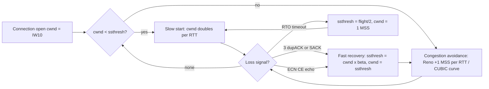
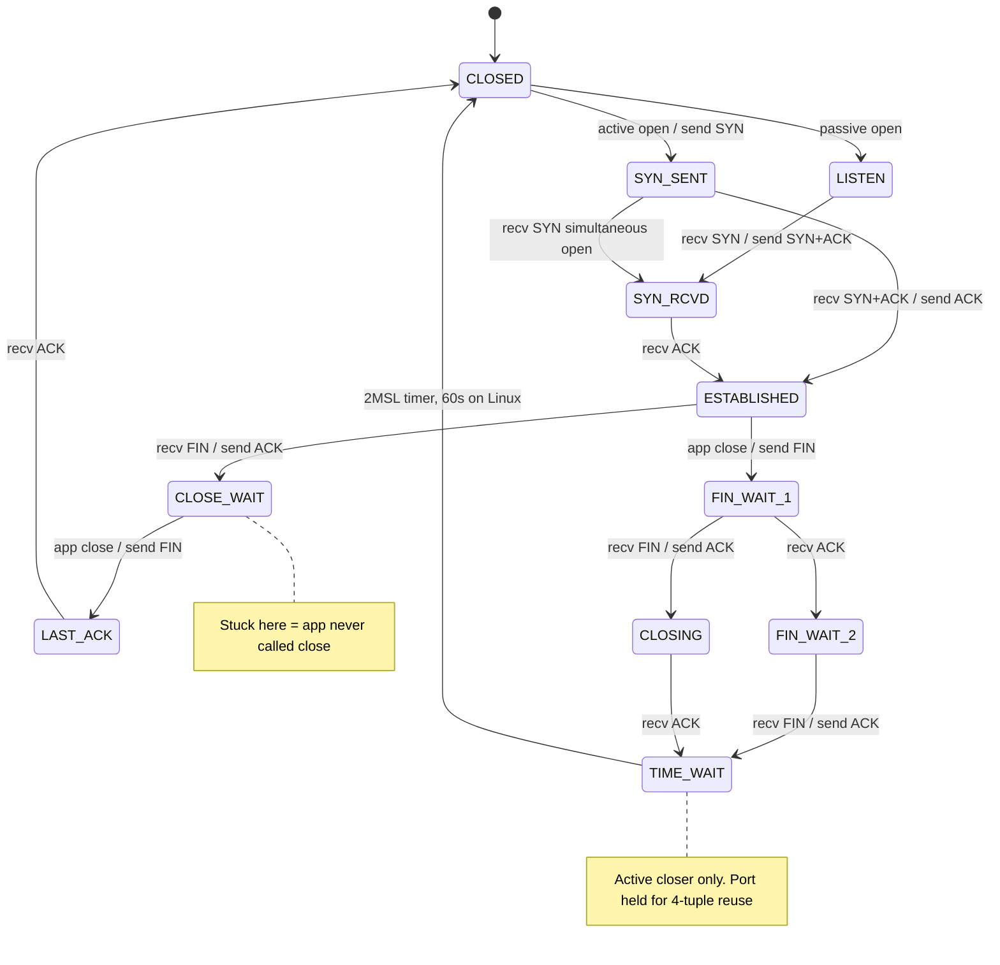
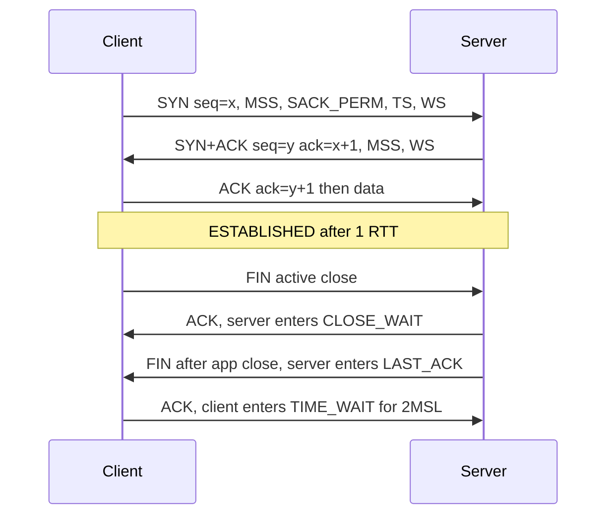
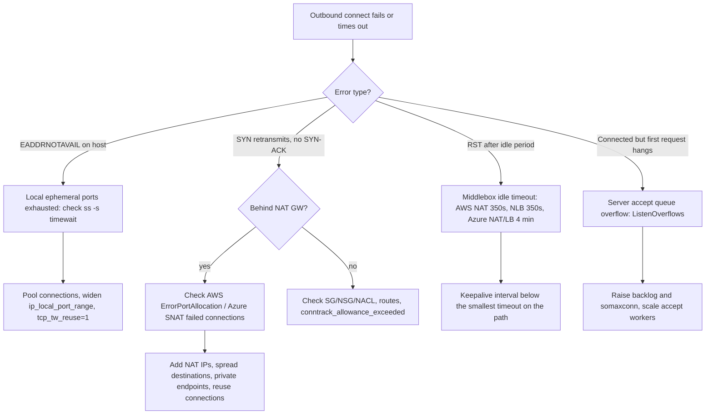

# F4 Transmission Control Protocol (TCP)
> Last verified: 2026-10 · Audience: senior/staff DevOps, SRE, AI eng, NetEng, DevSecOps, architects

## TL;DR
- **TCP = reliable, ordered, connection-oriented byte stream** over IP. It gives you sequencing, ACKs, retransmission, **flow control (rwnd)** and **congestion control (cwnd)**. The spec is **RFC 9293** (2022), which replaced RFC 793. Throughput is capped at **min(cwnd, rwnd) / RTT**.
- **Header:** 20 B minimum, 60 B maximum. It has 8 flags (CWR ECE URG ACK PSH RST SYN FIN). Options that matter: **MSS, Window Scale, SACK, Timestamps** (all negotiated on the SYN only), plus TFO and MPTCP.
- **Lifecycle:** a 3-way handshake (1 RTT before any data) and a 4-way FIN close. **The side that closes first goes into TIME_WAIT** (2MSL; Linux hard-codes 60 s). **Piles of CLOSE_WAIT sockets mean the application never called close().** Treat that as an app bug. No kernel setting fixes it.
- **Congestion control:** Reno/NewReno (loss-based AIMD). **CUBIC** (RFC 9438) is the default on Linux and Windows. **BBR** is model-based: it estimates bottleneck bandwidth and min RTT and paces sends. BBRv3 is in IETF draft-ietf-ccwg-bbr-06 (Experimental), but mainline Linux still ships v1 (unverified as of 2026-10). **ECN/L4S/AccECN** signal congestion by marking packets instead of dropping them.
- **Slow start** begins at IW10 (about 14.6 KB) and doubles cwnd each RTT, so short flows are latency-bound. Reuse connections and set `tcp_slow_start_after_idle=0` on long-lived pools.
- **NAT/PAT** keeps per-flow state. Running out of SNAT ports is the classic cloud outage. Per destination (dst IP:port:proto), **AWS NAT GW allows 55,000 connections per IP** and **Azure NAT GW allows 50,000 per IP (64,512 SNAT ports per IP)**. Idle timeouts are short: **AWS 350 s fixed**, **Azure 4 min default (configurable 4–120 min)**. Keepalives must fire before the shortest idle timer on the path.
- **Stateful firewalls track connections too.** AWS SGs track every flow except "untracked" all-open rule pairs. Watch `conntrack_allowance_exceeded`. On **Nitro v6 the default TCP-established tracking timeout dropped from 5 days to 350 s**. Azure NSGs keep flow records, and Azure VMs have per-VM flow limits (at least 500k in + 500k out).
- **Debug toolkit:** `ss -tanpi`, `nstat -az`, `tcpdump`, and Wireshark (F8). Kernel queues (SYN queue and accept queue) are covered in [A7.1](../A-operating-systems/A7-socket-management.md#a71-sockets-connections-and-kernel-queues).

## F4.1 What is TCP?
- **How it works:**
  - Layer 4 (IP protocol number **6**). It gives you a **full-duplex byte stream** between two endpoints. A connection is identified by the **4-tuple** (src IP, src port, dst IP, dst port), and the protocol makes it a 5-tuple.
  - **Reliability:** every byte has a 32-bit sequence number. ACKs are cumulative and selective (SACK, RFC 2018). Lost data is resent either on **RTO** expiry (RFC 6298: initial 1 s; Linux minimum RTO is 200 ms, `tcp_rto_min_us`) or by **fast retransmit** after 3 duplicate ACKs or RACK-TLP (RFC 8985, the Linux default for loss detection).
  - **Ordering:** the receiver reassembles out-of-order segments, so the app always sees bytes in order. The cost is **head-of-line blocking** (F6.7).
  - **No message boundaries.** The app must frame its own messages (length prefix, delimiter, HTTP/2 frames). One `send()` does not equal one segment or one `recv()`.
  - **Two control loops.** Flow control keeps the sender from overrunning the receiver (rwnd). Congestion control keeps it from overrunning the network (cwnd).
  - **Initial sequence numbers (ISNs)** are randomized with a keyed hash (RFC 6528) to stop sequence prediction and off-path injection. SYN and FIN each consume one sequence number.
- **Trade-offs / when to use:**
  - Use it by default for anything that needs correctness: HTTP/1.1, HTTP/2, gRPC, DB protocols, Kafka, SSH, TLS.
  - Prefer UDP or QUIC ([F3](./F3-user-datagram-protocol.md)) for real-time media, DNS, gaming, and HTTP/3. Those need no HOL blocking, connection migration, or user-space congestion control.
- **Interview angles:**
  - "TCP guarantees delivery?" → Say no. It guarantees in-order delivery **or an error** (RST or timeout). A successful `send()` only means the bytes reached the local kernel buffer. You still need app-level ACKs or idempotency.
  - Follow-up on "reliable" → Mention that TCP's 16-bit checksum is weak. TLS or app checksums catch corruption that TCP can miss.

## F4.2 TCP Segment
- **How it works:** the header layout (RFC 9293):

| Field | Bits | Notes |
|---|---|---|
| Source / Dest port | 16 / 16 | Linux ephemeral range `ip_local_port_range` = **32768–60999** (28,232 ports) |
| Sequence number | 32 | Number of the first payload byte. Wraps at 4 GiB, which takes about 3.4 s at 10 Gbps, hence **PAWS** (timestamps) |
| Acknowledgment number | 32 | Next byte expected. Valid only when ACK is set |
| Data offset | 4 | Header length in 32-bit words, so **20–60 bytes** (at most 40 B of options) |
| Reserved / AE | 4 | AccECN uses the **AE** bit |
| Flags | 8 | **CWR ECE URG ACK PSH RST SYN FIN** |
| Window | 16 | Receive window. Max 65,535 unless **window scaling** is negotiated |
| Checksum | 16 | Covers a pseudo-header (src/dst IP, proto, length) plus header and data |
| Urgent pointer | 16 | Effectively obsolete |
| Options | 0–320 | See below |

- **Key options** (kind number):
  - **MSS (2)**, sent on SYN only. Typically 1460 for IPv4 on a 1500 MTU and 1440 for IPv6. Cloud NAT gateways and VPNs **clamp** MSS. See [F6.1](./F6-network-performance.md#f61-mss-vs-mtu-vs-pmtud).
  - **Window Scale (3)**, SYN only, shift count of at most **14**.
  - **SACK-permitted (4)** on the SYN, and **SACK (5)** blocks afterwards (3–4 blocks fit when timestamps are on).
  - **Timestamps (8)**, 10 B. Used for RTT measurement and PAWS. Also required for `tcp_tw_reuse`.
  - **TFO cookie (34)**: [F6.5](./F6-network-performance.md#f65-tcp-fast-open). **MPTCP (30)**: RFC 8684. **TCP-AO (29)**: RFC 5925, the replacement for the BGP **MD5 option (19)**.
- **Flags in practice:**
  - **SYN** opens a connection. **SYN+ACK** is the server's reply.
  - **PSH** tells the receiver to push data to the app now.
  - **RST** aborts. It is sent for a closed port, an `SO_LINGER{1,0}` close, or a middlebox idle timeout.
  - **FIN** is a graceful half-close.
  - **ECE/CWR** carry ECN echo and acknowledgement.
- **Interview angles:**
  - "Max TCP payload?" → Answer MSS = MTU − IP header (20 B IPv4 / 40 B IPv6) − TCP header (20 B). With timestamps on, each segment carries 12 B of options, so the effective payload is 1448 B.
  - "A middlebox strips options" → Window scaling lost means throughput stuck at 64 KB/RTT. SACK lost means slow recovery. MSS lost means PMTUD black holes.

## F4.3 Flow Control
- **How it works:**
  - The receiver advertises **rwnd**, the free space in its receive buffer, in every ACK. The sender keeps unacked bytes in flight at or below rwnd. This is a **sliding window**.
  - **Window scaling (RFC 7323):** the 16-bit field is shifted left by the negotiated scale (0–14), which allows windows up to **~1 GiB**. The scale is negotiated **only in the SYN/SYN-ACK** and only takes effect if both sides send it. It cannot be added mid-connection.
  - **Bandwidth-delay product (BDP):** to fill the pipe you need window ≥ bandwidth × RTT. For example, 10 Gbps × 100 ms = **125 MB**. An unscaled 64 KB window over 100 ms caps you at about **5.2 Mbps**, no matter how fast the link is.
  - **Zero window:** when the receiver's app does not read, rwnd drops to 0. The sender then starts the **persist timer** and sends **window probes**. In tcpdump you see `win 0` and on the server a growing `Recv-Q`.
  - **Silly window syndrome:** the receiver avoids it with Clark's rule (advertise only once a meaningful window opens). The sender avoids it with **Nagle** (F6.2). Nagle combined with **delayed ACK** (F6.3) gives the classic 40–200 ms stall. Use `TCP_NODELAY` for request/response protocols.
  - **Linux autotuning:** `tcp_moderate_rcvbuf=1`. `tcp_rmem` = 4K / **128K** / up to 32 MB (RAM-dependent). `tcp_wmem` = 4K / 16K / up to 4 MB. **Setting `SO_RCVBUF` explicitly disables autotuning**, and that often makes throughput worse.
- **Trade-offs / when to use:**
  - Large buffers raise throughput on long fat networks (LFNs) but cost memory per socket and can add bufferbloat.
  - `tcp_notsent_lowat` (for example 16 KB) keeps the unsent queue small, which matters for HTTP/2 prioritisation. Socket buffers are covered in [H6.7](../H-full-stack-troubleshooting/H6-web-application-architecture.md#h67-tcp-socket-buffers).
- **Interview angles:**
  - "Cross-region copy only gets 50 Mbps on a 10G link" → Compute the BDP first. Then check window scaling (`ss -ti` shows `wscale:`, `rcv_space`, `snd_wnd`). Look for apps that pin `SO_RCVBUF`, and for loss (that is cwnd, not rwnd). Fixes: parallel streams, larger `tcp_rmem` max, or BBR.
  - Pitfall: confusing flow control (protects the **receiver**) with congestion control (protects the **network**).

## F4.4 Congestion Control
- **How it works:** the sender keeps **cwnd**, and in-flight data is at most min(cwnd, rwnd). The algorithm is pluggable on Linux: `net.ipv4.tcp_congestion_control`, `tcp_available_congestion_control`, or per socket with `TCP_CONGESTION`.

| Algorithm | Signal | Behaviour | Notes |
|---|---|---|---|
| **Reno / NewReno** (RFC 5681 / 6582) | Loss | AIMD: +1 MSS per RTT, halve on loss. Fast retransmit/recovery on 3 dupACKs | Poor on high-BDP paths, where recovering from one loss takes many RTTs |
| **CUBIC** (RFC 9438) | Loss | Window grows as a cubic function of **time since the last loss** (independent of RTT). Multiplicative decrease β = **0.7** | **Linux default since 2.6.19**. Also the Windows default (Win10 1709 / Server 2019+, unverified build). Fills deep buffers, which causes bufferbloat |
| **BBR v1** (2016) | Model: BtlBw and RTprop | Paces at the estimated bottleneck rate, cwnd ≈ 2×BDP. States **Startup → Drain → ProbeBW → ProbeRTT** (every ~10 s, cwnd = 4 packets for ≥200 ms) | Ignores loss, so heavy retransmits in shallow buffers and unfair to CUBIC. This is what mainline `tcp_bbr` still is (unverified as of 2026-10) |
| **BBR v2 / v3** | Model plus loss and ECN | Adds `inflight_hi/lo` bounds, reacts to loss rate (>2%) and ECN. v3 = tuned v2 | Spec **draft-ietf-ccwg-bbr-06** (Jul 2026, Experimental). Out-of-tree at github.com/google/bbr (v3 branch). Google runs it for google.com / YouTube |
| **DCTCP** (RFC 8257) | ECN fraction | Cuts cwnd in proportion to the fraction of CE-marked packets | Only for data-centre networks you control. Needs switch ECN marking |

- **ECN (RFC 3168):**
  - Uses two IP bits: **ECT(0), ECT(1), CE**. An AQM router (CoDel, FQ-CoDel, PIE) marks **CE** instead of dropping. The receiver echoes **ECE** and the sender answers with **CWR**. You get congestion feedback without loss and without the retransmit RTT.
  - **L4S** (RFC 9330/9331/9332) uses ECT(1) for scalable congestion controllers (TCP Prague) and targets sub-millisecond queueing.
  - **AccECN** (the AE bit plus a TCP option) reports *how many* packets were CE-marked. Recent Linux exposes `tcp_ecn` values 0–5 and a `tcp_ecn_option` sysctl. Current kernel docs give `tcp_ecn` default **2** = AccECN for incoming connections, classic ECN for outgoing (exact kernel version unverified). Older kernels: 2 = accept ECN only when requested.
- **Trade-offs / when to use:**
  - **BBR** helps on lossy, high-BDP WAN or last-mile paths and for video and CDN egress. It can starve CUBIC flows and pushes up retransmit counts.
  - **CUBIC** is the safe general default.
  - **DCTCP or ECN** is for DC fabrics, where you get low tail latency for incast workloads such as storage, ML all-reduce, and RDMA-adjacent traffic.
  - Only the **sender's** algorithm matters. Changing it on a client does nothing for downloads.
- **Interview angles:**
  - "Why BBR?" → Loss is a bad congestion signal on modern paths: random wireless loss and deep buffers that hold 100s of ms. BBR models the pipe instead.
  - "Downsides?" → BBRv1 fairness and retransmissions. Pacing used to need the `fq` qdisc (internal pacing since 4.13).
  - "What is bufferbloat?" → Oversized queues plus loss-based congestion control give high latency under load. Fix with AQM (fq_codel/CAKE), ECN, and BBR.
  - Mention **PRR** (RFC 6937) and **HyStart++** (RFC 9406) to show depth.

## F4.5 Slow Start vs Congestion Avoidance
- **How it works:**
  - **Slow start:** cwnd starts at the **initial window**. RFC 6928 sets **IW10 = 10 × MSS ≈ 14.6 KB**, and some CDNs use larger values. cwnd then grows by 1 MSS per ACK, which is **exponential, roughly doubling every RTT**, until cwnd ≥ **ssthresh** or loss occurs.
  - **Congestion avoidance:** above ssthresh, Reno adds about +1 MSS per RTT (linear growth). CUBIC follows its cubic curve.
  - **On 3 dupACKs / SACK loss:** ssthresh = cwnd × β (0.5 for Reno, 0.7 for CUBIC), then cwnd ≈ ssthresh (fast recovery). The connection stays in congestion avoidance.
  - **On RTO:** ssthresh = max(FlightSize/2, 2·MSS) and **cwnd = 1 MSS**, which restarts slow start. That is the worst case for latency.
  - **HyStart / HyStart++** (RFC 9406) leaves slow start early when RTT rises, which avoids overshoot loss.
  - **Slow start after idle** (RFC 2861/7661): Linux `tcp_slow_start_after_idle=1` (default) decays cwnd after an idle RTO. **Set it to 0** for long-lived keepalive/HTTP/2/gRPC pools so a burst after idle is not throttled.
- **Trade-offs / when to use:**
  - Short flows (most web objects under 100 KB) **never leave slow start**, so their latency is set by RTT count, not bandwidth.
  - Remedies: connection reuse, CDN or edge termination (shorter RTT), larger IW, TFO, or TLS 1.3 / QUIC to cut handshake RTTs.
- **Interview angles:**
  - "How long to reach a 125 MB window?" → log2(125 MB / 14.6 KB) ≈ **13 RTTs** with no loss. At 100 ms RTT that is about 1.3 s before full speed, and a single loss resets a big chunk of it.
  - Why connection pooling matters: a fresh connection costs 1 RTT (TCP) + 1 RTT (TLS 1.3) + slow start. A warm one already has its cwnd.



## F4.6 NAT
- **How it works:**
  - **SNAT** rewrites the source, which is how private hosts get out. **DNAT** rewrites the destination (port forwarding, load-balancer VIPs). **PAT/NAPT** maps many private IP:port pairs onto one public IP by rewriting **source ports**.
  - The NAT keeps a **translation/conntrack table** keyed by the 5-tuple. Entries expire on FIN/RST or after an idle timeout.
  - **The port limit is per destination.** One public IP has about 64k ports **per (dst IP, dst port, proto)**. The same source port can be reused toward a *different* destination. Exhaustion therefore hits when many connections go to **one popular endpoint** (a SaaS API, S3 or Storage public endpoint, a DB proxy).
  - **NAT behaviour types** (RFC 4787 UDP / RFC 5382 TCP): endpoint-independent mapping ("full cone"), address-dependent, and port-dependent (≈ "symmetric"). Symmetric NAT breaks P2P / STUN, which then needs TURN.
  - **RFC 5382** asks that a NAT's TCP established idle timeout be **≥ 2 h 4 min**. **Cloud NATs ignore that**: AWS uses 350 s and Azure 4 min by default. That gap is the root cause of "connection silently dies after ~5 minutes".
  - **Linux conntrack:**
    - `nf_conntrack_max`. When it fills, dmesg shows `nf_conntrack: table full, dropping packet`.
    - `nf_conntrack_tcp_timeout_established` defaults to **432000 s (5 days)**.
    - Kubernetes kube-proxy (iptables/IPVS) and pod-to-external SNAT depend on it. Known **UDP DNS conntrack races** produce 5 s DNS timeouts.
  - **What NAT breaks:** end-to-end reachability (no unsolicited inbound), IPsec AH, active FTP, and SIP. **NAT-T** wraps IPsec in UDP/4500 (G10.4). Carrier-grade NAT uses **100.64.0.0/10** (RFC 6598).
- **Trade-offs / when to use:**
  - NAT conserves IPv4 addresses and hides internal topology, but it is **not a security control**. Use firewalls for that.
  - It adds state, which means failure modes and a scaling ceiling.
  - Prefer **private endpoints** for cloud-provider services, which avoids SNAT entirely: AWS gateway/interface endpoints, Azure Private Link. Prefer **IPv6 plus an egress-only gateway** where possible.
- **Interview angles:**
  - "Intermittent outbound timeouts at peak, only to one partner API" → Suspect SNAT port exhaustion. Check AWS `ErrorPortAllocation` / Azure SNAT connection count (failed). Fixes:
    - Add IPs: AWS up to 8 per zonal NAT GW / 32 per AZ on a regional one, Azure up to 16.
    - Pool and reuse connections (HTTP keep-alive).
    - Spread traffic across destinations or NAT GWs.
    - Use private endpoints.
  - "Why did `tcp_tw_recycle` break clients behind NAT?" → It dropped SYNs with timestamps that were not monotonic, and many clients behind one NAT IP have unrelated timestamp clocks. It was **removed in Linux 4.12**. AWS's NAT troubleshooting doc still calls it out.

## F4.7 TCP Connection States
- **How it works:** RFC 9293 defines 11 states: **LISTEN, SYN-SENT, SYN-RECEIVED, ESTABLISHED, FIN-WAIT-1, FIN-WAIT-2, CLOSE-WAIT, CLOSING, LAST-ACK, TIME-WAIT, CLOSED**.
  - **Handshake:**
    - The client sends SYN (enters SYN-SENT).
    - The server replies SYN+ACK (enters SYN-RECEIVED and sits in the SYN queue).
    - The client sends ACK. Both sides are now ESTABLISHED and the server moves the connection to the accept queue.
    - Simultaneous open is legal.
  - **SYN retries:** initial RTO is 1 s. Linux `tcp_syn_retries=6` means about **127 s** before `connect()` fails. Set app connect timeouts much lower.
  - **Close:**
    - The **active closer** sends FIN and enters FIN-WAIT-1. On ACK it moves to FIN-WAIT-2. When the peer's FIN arrives it moves to **TIME-WAIT** and waits **2×MSL**, then CLOSED.
    - The **passive closer** gets FIN and moves to **CLOSE-WAIT**. It **stays there until the app calls close()**, which sends FIN and moves it to LAST-ACK. The final ACK moves it to CLOSED.
  - **TIME_WAIT** has two jobs: (1) resend the final ACK if the peer's FIN is retransmitted, and (2) let old duplicate segments die before the same 4-tuple is reused.
    - On Linux it is **60 s, hard-coded** (`TCP_TIMEWAIT_LEN`). `tcp_fin_timeout` (60 s) controls **FIN-WAIT-2** for orphaned sockets, not TIME_WAIT.
    - `tcp_max_tw_buckets` caps the count.
  - **Half-close:** `shutdown(SHUT_WR)` sends FIN but keeps reading. **Abortive close** sends RST and skips TIME_WAIT. It loses unsent data, so avoid it except for load shedding.
- **TIME_WAIT debugging:**
  - **Symptom:** `EADDRNOTAVAIL` / "Cannot assign requested address" on outbound `connect()`, plus `ss -s` showing tens of thousands of `timewait`.
  - **Math:** about 28k ephemeral ports ÷ 60 s ≈ **470 new connections/s sustained to a single dst IP:port** from one source IP.
  - **Fixes, in order:**
    1. **Reuse connections** with keep-alive pools.
    2. Let the **client** be the active closer, so the server holds no TIME_WAIT.
    3. Widen `ip_local_port_range`.
    4. Set `tcp_tw_reuse=1` (outbound only, needs timestamps). The default **2 = loopback only**, and `tcp_tw_reuse_delay` defaults to 1000 ms.
    5. Add source IPs or destination IPs/ports.
  - Use `SO_REUSEADDR` on servers so a restart can rebind while old TIME_WAITs exist.
  - **Never** turn on `tcp_tw_recycle` (removed anyway).
- **CLOSE_WAIT debugging:**
  - **Symptom:** a growing `CLOSE-WAIT` count, fd exhaustion ("too many open files"), and the peer (or LB) logging resets.
  - **Cause:** the app never closes sockets after the peer's FIN. Typical culprits are a leaked HTTP client response body, a pool that does not evict dead connections, or blocked worker threads.
  - Fix the code. No sysctl applies, and CLOSE-WAIT has no kernel timeout.
  - `ss -tanp state close-wait` shows the owning process. `lsof -p` shows the fd count.
- **FIN-WAIT-2 pileups** mean the peer never sends its FIN. They are reaped after `tcp_fin_timeout` only if the socket is orphaned.
- **SYN-RECV pileups** mean either a SYN flood or the client's final ACK is being lost. Use **syncookies** (`tcp_syncookies=1`, which kicks in only when the SYN queue overflows).
- **Interview angles:**
  - "Who gets TIME_WAIT?" → The side that closes first, not necessarily the client.
  - "Server has 50k TIME_WAIT, is that bad?" → Usually harmless on a server (inbound connections share one listening port and differ by client tuple). It costs about 200 B of memory each. It only matters on the **connecting** side, where ports run out.
  - "Thousands of CLOSE_WAIT" → The app is leaking sockets. Restarting only hides it.





## F4.8 TCP Pros and Cons

| Pros | Cons |
|---|---|
| Reliable, ordered delivery with built-in retransmission | **Head-of-line blocking**: one lost segment stalls every multiplexed stream (HTTP/2) |
| Flow and congestion control protect the receiver and the internet | Handshake latency: 1 RTT for TCP plus 1 RTT for TLS 1.3 (2 for TLS 1.2) |
| Works through virtually every firewall, NAT and LB. Mature tooling | **Stateful** on both ends and at every middlebox: memory, SYN floods, conntrack/SNAT limits |
| Kernel implementation with offloads (TSO/GRO), zero-copy, kTLS | Kernel-bound and **ossified**: middleboxes block new options, so it evolves slowly |
| Pluggable congestion control (CUBIC/BBR) | Connection bound to the 4-tuple: no migration across Wi-Fi to LTE (MPTCP RFC 8684 or QUIC fix this) |
| | Byte stream only: the app must frame messages |

- **Interview angles:**
  - "TCP vs QUIC" → QUIC (RFC 9000) runs over UDP in user space. It has per-stream loss recovery (no HOL), 1-RTT or 0-RTT handshakes with TLS 1.3 built in, and connection IDs for migration. The costs are more CPU and UDP throttling by some networks. See [F3](./F3-user-datagram-protocol.md).
  - Pitfall: assuming HTTP/2 fixed HOL blocking. It fixed it at the app layer only, not at the TCP layer.

## F4.9 Sockets, Connections and Kernel Queues
- **Fully covered in [A7.1](../A-operating-systems/A7-socket-management.md#a71-sockets-connections-and-kernel-queues).** The TCP-specific points:
  - **SYN queue** holds half-open connections in SYN-RECV, sized by `tcp_max_syn_backlog`. On overflow you get syncookies or dropped SYNs.
  - **Accept queue** holds completed handshakes waiting for `accept()`. Its size is min(`listen()` backlog, `net.core.somaxconn`), and somaxconn defaults to **4096 since Linux 5.4** (128 before).
  - On accept-queue overflow the kernel **drops the final ACK** (or sends RST if `tcp_abort_on_overflow=1`). The client thinks it is connected and its first request times out. Check `nstat -az TcpExtListenOverflows TcpExtListenDrops`. For a LISTEN socket, `ss -lnt` shows Recv-Q = current accept queue and Send-Q = backlog.
  - **Send/receive buffers** are per socket (F4.3 and [H6.7](../H-full-stack-troubleshooting/H6-web-application-architecture.md#h67-tcp-socket-buffers)). `SO_REUSEPORT` gives one accept queue per worker, which balances load across cores.

## F4.10 Capturing TCP Segments with TCPDUMP
- **How it works:** use `tcpdump -i <if|any> -nn` (no DNS/port name lookups) with `-S` (absolute sequence numbers), `-s 0` (full snaplen, the default now) and `-w file.pcap` (write a file for Wireshark, see [F8](./F8-analyzing-protocols-with-wireshark.md)). Reading the flags:
  - `[S]` is a SYN and `[S.]` a SYN-ACK. `.` marks ACK.
  - `[P.]` is PSH+ACK carrying data.
  - `[F.]` is FIN and `[R]` / `[R.]` is RST.
  - `[S]` repeated with no `[S.]` means the SYN is filtered or blackholed (SG/NSG/NACL or routing). An **immediate `[R.]` to a SYN** means the port is closed or a middlebox rejected it.
- **What to read:**
  - SYN options `mss 1460,sackOK,TS val … ecr 0,nop,wscale 7`: missing wscale means a middlebox stripped it.
  - `win 0` means a zero window: the receiver app is slow.
  - The same seq repeated means retransmissions. Rising RTO gaps (1 s, 2 s, 4 s) mean a dead path.
  - An RST arriving exactly 350 s or 4 min after the last packet points to a NAT/LB idle timeout.
- **Interview angles:**
  - Capture on **both** ends. One-sided captures cannot tell a lost packet from a lost ACK.
  - In the cloud, use **VPC Traffic Mirroring / Azure virtual network TAP or Network Watcher packet capture** when you cannot install tcpdump (G5.2).

```bash
# Handshake, teardown and resets only, port 443
sudo tcpdump -i any -nn -S 'tcp port 443 and (tcp[tcpflags] & (tcp-syn|tcp-fin|tcp-rst) != 0)'
# Full capture to file, rotate every 100 MB, keep 5 files
sudo tcpdump -i eth0 -nn -s 0 -C 100 -W 5 -w /tmp/tcp.pcap 'host 10.0.1.25 and tcp'
# Per-connection TCP internals: cwnd, rtt, retrans, wscale, rcv_space, congestion algorithm
ss -tani 'dst 10.0.1.25'
# State histogram: TIME_WAIT vs CLOSE_WAIT
ss -tan | awk 'NR>1{print $1}' | sort | uniq -c | sort -rn
# Who owns CLOSE_WAIT sockets
ss -tanp state close-wait
# Accept queue overflow, retransmits, SYN cookies
nstat -az TcpExtListenOverflows TcpExtListenDrops TcpRetransSegs TcpExtSyncookiesSent
# Conntrack table pressure on a Linux NAT/K8s node
sudo sysctl net.netfilter.nf_conntrack_count net.netfilter.nf_conntrack_max
```

## Diagrams



## Cloud mapping: AWS vs Azure

| Capability | AWS | Azure | Role it plays | Key differences | Alternatives |
|---|---|---|---|---|---|
| Managed outbound NAT | **NAT Gateway**: zonal (default) or **regional availability mode** (Nov 2025) | **Azure NAT Gateway**: Standard (zonal) or **StandardV2** (zone-redundant) | SNAT/PAT for private subnets to reach the internet | AWS: 55k connections per IP per destination, up to 8 IPs (zonal) / 32 per AZ (regional), **350 s fixed idle**. Azure: 64,512 SNAT ports per IP, 50k per IP per destination, up to 16 IPs, **4–120 min TCP idle** | NAT instance / NVA, Azure Firewall SNAT, K8s egress gateways, IPv6 + egress-only IGW |
| LB-based outbound SNAT | No equivalent (NLB/ALB are inbound only) | **Load Balancer outbound rules** (Standard LB) | Static SNAT port preallocation per backend VM | Azure default allocation is ≤1,024 ports per VM (32–1,024 by pool size), so prefer NAT GW. AWS always uses NAT GW or public IPs | NAT GW |
| Stateful instance firewall and connection tracking | **Security groups** (tracked vs untracked flows, per-ENI conntrack allowance) | **NSG** flow records (stateful 5-tuple) plus per-VM **flow limits** | Allow return traffic, enforce rules per flow | AWS exposes `conntrack_allowance_exceeded` and configurable timeouts. Azure exposes Inbound/Outbound Flows metrics, with no user-tunable NSG TCP idle timer | Stateless NACLs (AWS), NVA firewalls, Cilium/Calico policies |
| L4 LB idle timeout | **NLB**: TCP 350 s default (60–6000 s), TLS listener 350 s fixed, UDP 120 s | **Azure Load Balancer**: 4 min default (4–100 min for LB rules, 4–120 min for outbound rules). Optional **TCP reset on idle** | Drops idle flow state | NLB sends RST only when a packet arrives after the timeout. Azure LB silently drops unless TCP reset is enabled (then RST goes to both sides) | Envoy/HAProxy with explicit timeouts |
| L7 LB idle timeout | **ALB**: 60 s default (1–4000 s). HTTP client keepalive 3600 s (60 s–7 days) | **Application Gateway / Front Door** (defaults vary; check per SKU, unverified) | HTTP connection reuse | ALB returns 502 if the target closes the connection first. Set the backend keep-alive above the LB idle timeout | Cloudflare, Envoy |
| Avoid SNAT to provider services | Gateway endpoints (S3/DynamoDB), interface endpoints (PrivateLink) | Private Endpoint / Private Link, service endpoints | Keep traffic private, consume no NAT ports | DynamoDB gateway endpoint connections use **2 conntrack entries** each | — |

- **AWS NAT Gateway:**
  - **Zonal NAT GW** lives in one AZ (deploy one per AZ and route per AZ). It handles 5 Gbps scaling to **100 Gbps** and 1M scaling to **10M pps**. It allows **55,000 simultaneous connections per IP to each unique destination**. You can attach 1 primary + 7 secondary IPs (2 EIPs by default quota) and it uses ports **1024–65535**.
  - **Idle timeout 350 s (not configurable).** After that the NAT GW **returns RST** to the instance on the next packet (no FIN). Fix: TCP keepalive below 350 s.
  - No IP fragmentation for TCP/ICMP. MTU is 8500 and it **clamps MSS**.
  - Metrics: `ErrorPortAllocation` (SNAT exhaustion), `IdleTimeoutCount`, `PacketsDropCount`, `ActiveConnectionCount`, `ConnectionAttemptCount` vs `ConnectionEstablishedCount`.
  - **Regional NAT GW** (GA Nov 2025; not GovCloud or China):
    - Expands automatically into an AZ when an ENI appears there. **This can take up to 60 min**, and until then traffic is processed cross-zone.
    - Needs no public subnet and has its own route table. Supports up to **32 IPs per AZ**.
    - Modes: automatic (AWS-managed IPs) or manual. **No private NAT.**
    - Converting from zonal resets connections.
- **Azure NAT Gateway:**
  - **Standard** is zonal: a zone outage takes out egress for its subnets. **StandardV2** is **zone-redundant**, supports IPv6 and NAT64, delivers 100 Gbps / 10M pps, and needs StandardV2 public IPs. You cannot upgrade Standard in place.
  - Standard: 50 Gbps (25 out / 25 in), 5M pps. Both SKUs cap at **2M active connections**.
  - SNAT ports are allocated **on demand** across the subnet (no per-VM preallocation). Port reuse hold-down to the same destination: **65 s after FIN, 16 s after RST, 30 s half-open**.
  - **TCP idle timeout 4 min default, configurable to 120 min. UDP is fixed at 4 min.** Microsoft advises *not* raising it, because idle flows hold ports. Use keepalives instead.
  - It sends a **TCP RST** when traffic hits an expired flow (one direction only).
  - **NAT GW takes precedence** over LB outbound rules and instance public IPs.
  - **Default outbound access is retired**: VNets created after **31 Mar 2026** default to private subnets, so explicit egress (NAT GW etc.) is required.
- **AWS security group connection tracking:**
  - **Untracked flows** happen only when a TCP/UDP rule allows 0.0.0.0/0 (or ::/0) in one direction **and** a matching all-ports 0.0.0.0/0 rule exists in the other direction. Removing that rule **cuts untracked flows immediately**.
  - **Tracked flows survive rule removal** until they time out. Use NACLs for an instant cut.
  - ICMP is always tracked.
  - Traffic via **NLB, NAT GW, PrivateLink, GWLB/Network Firewall, Global Accelerator, Lambda Hyperplane ENIs, egress-only IGW** is **always tracked**.
  - Per-instance conntrack allowance depends on instance size. Watch ENA `conntrack_allowance_available` / `conntrack_allowance_exceeded` (`ethtool -S eth0`, or the CloudWatch agent).
  - **Idle tracking timeout:**
    - TCP-established is 60–432000 s. Default **432000 s (5 days)**, but **350 s on Nitro v6** instance types.
    - UDP 30–60 s (default 30). UDP stream 60–180 s (default 180).
    - Set per ENI / launch template.
  - **Gotcha:** if the NLB idle timeout is raised above 350 s, the target ENI's `TcpEstablishedTimeout` must be at least as high, or packets drop on Nitro v6.
  - Asymmetric routing with tracked flows: AWS recommends a 60 s timeout.
- **Azure NSG flow state:**
  - Stateful via **flow records** on the 5-tuple. **Removing a rule does not break existing flows**, only new ones. To cut existing flows immediately, use an NVA or Azure Firewall, or bounce the connection.
  - VM **flow limits**: at least 500k inbound + 500k outbound flows. Recommended totals are 100k connections for 2–7 vCPU, up to 1M for 64+ vCPU (2M on Azure Boost/MANA). NVAs should use **half**.
  - Metrics: VM *Inbound Flows* / *Outbound Flows* / *Maximum creation rate*.
  - NSG flow logs retire **30 Sep 2027**. Use **VNet flow logs** (G5.1).
- **TCP keepalive guidance (both clouds):**
  - Linux defaults are `tcp_keepalive_time=7200 s`, intvl 75 s, 9 probes. That is **useless behind cloud NATs and LBs**.
  - Set the keepalive time below the **smallest idle timer on the path**:
    - AWS: below 350 s, typically 60–300 s. AWS recommends under 5 min for SG conntrack.
    - Azure: below 240 s, or raise the NAT/LB idle timeout deliberately.
  - Keepalives work only if the app enables `SO_KEEPALIVE`. Many drivers (JDBC, Redis, Postgres `keepalives_idle`) have their own knobs. Use **app-level pings** when an L7 proxy terminates TCP. For example, ALB ignores HTTP/2 PING, and NLB TLS listener keepalives must carry no payload.
  - Combine with **`TCP_USER_TIMEOUT`** so writes to a dead peer fail fast instead of retrying for about 15 minutes (`tcp_retries2=15`).
- **Alternatives:**
  - Cloudflare (edge TCP/QUIC termination, BBR at the edge).
  - Kubernetes egress gateways and **Cilium** (eBPF conntrack, with its own CT table limits).
  - GCP Cloud NAT, the canonical third option: static per-VM port allocation by default, dynamic optional.

## Hands-on (optional)
```bash
# Keepalive tuned for cloud NAT/LB (AWS 350s, Azure 4min): probe after 120s idle, every 30s, 4 probes
sudo sysctl -w net.ipv4.tcp_keepalive_time=120 net.ipv4.tcp_keepalive_intvl=30 net.ipv4.tcp_keepalive_probes=4
# Outbound-heavy client host: wider port range plus TIME_WAIT reuse for outgoing connections
sudo sysctl -w net.ipv4.ip_local_port_range="1024 65000" net.ipv4.tcp_tw_reuse=1
# Long-lived pools: don't collapse cwnd after idle. Check and switch congestion control
sudo sysctl -w net.ipv4.tcp_slow_start_after_idle=0
sysctl net.ipv4.tcp_available_congestion_control
sudo modprobe tcp_bbr && sudo sysctl -w net.core.default_qdisc=fq net.ipv4.tcp_congestion_control=bbr
# AWS: conntrack allowance drops on an ENA instance
ethtool -S eth0 | grep -E 'conntrack_allowance_(exceeded|available)'
# AWS: lower the SG conntrack idle timeout on an ENI
aws ec2 modify-network-interface-attribute --network-interface-id eni-0123 \
  --connection-tracking-specification TcpEstablishedTimeout=600,UdpStreamTimeout=60,UdpTimeout=30
# Azure: NAT gateway idle timeout (minutes)
az network nat gateway update -g rg -n natgw --idle-timeout 4
```

```hcl
# Azure NAT Gateway (StandardV2, zone-redundant) with 2 public IPs = ~129k SNAT ports
resource "azurerm_nat_gateway" "egress" {
  name                    = "natgw-egress"
  location                = var.location
  resource_group_name     = var.rg
  sku_name                = "StandardV2" # provider support for StandardV2 depends on azurerm version (unverified)
  idle_timeout_in_minutes = 4
}

# AWS regional NAT gateway is created with: aws ec2 create-nat-gateway --vpc-id vpc-123 --availability-mode regional
resource "aws_nat_gateway" "az_a" {
  allocation_id                  = aws_eip.nat_a.id
  subnet_id                      = aws_subnet.public_a.id
  secondary_allocation_ids       = [aws_eip.nat_a2.id] # +55k connections per destination
}
```

## Cross-links
- [A7 Socket management: A7.1 Sockets, Connections and Kernel Queues](../A-operating-systems/A7-socket-management.md#a71-sockets-connections-and-kernel-queues)
- [F2 Internet Protocol (IP header, fragmentation, tcpdump basics)](./F2-internet-protocol.md)
- [F3 User Datagram Protocol](./F3-user-datagram-protocol.md)
- [F6 Network performance: MSS/MTU/PMTUD, Nagle, delayed ACK, TFO, HOL, L4 vs L7](./F6-network-performance.md)
- [F8 Analyzing protocols with Wireshark](./F8-analyzing-protocols-with-wireshark.md)
- [G1 Virtual network fundamentals: G1.7 stateful firewalls, G1.11–G1.14 NAT gateway](../G-cloud-network-architecture/G1-virtual-network-fundamentals.md)
- [G4 Network performance and optimization](../G-cloud-network-architecture/G4-network-performance-and-optimization.md)
- [G5 Traffic monitoring and troubleshooting (flow logs, mirroring)](../G-cloud-network-architecture/G5-traffic-monitoring-troubleshooting.md)
- [H1 Linux network diagnostics](../H-full-stack-troubleshooting/H1-linux-network-diagnostics.md)
- [H5 Network performance deep dive (H5.3 TCP protocol delay, H5.6 packet loss)](../H-full-stack-troubleshooting/H5-network-performance-deep-dive.md)
- [H6.7 TCP Socket Buffers](../H-full-stack-troubleshooting/H6-web-application-architecture.md#h67-tcp-socket-buffers)
- [C4 Security (C4.12 firewalls)](../C-large-scale-architecture/C4-security.md)

## Sources
- https://www.rfc-editor.org/rfc/rfc9293 (TCP)
- https://www.rfc-editor.org/rfc/rfc7323 (Window scale, timestamps) · https://www.rfc-editor.org/rfc/rfc5681 (Congestion control) · https://www.rfc-editor.org/rfc/rfc9438 (CUBIC) · https://www.rfc-editor.org/rfc/rfc6928 (IW10) · https://www.rfc-editor.org/rfc/rfc3168 (ECN) · https://www.rfc-editor.org/rfc/rfc9330 (L4S) · https://www.rfc-editor.org/rfc/rfc5382 (NAT TCP behaviour)
- https://datatracker.ietf.org/doc/html/draft-ietf-ccwg-bbr (BBRv3 draft-06, Jul 2026)
- https://docs.kernel.org/networking/ip-sysctl.html
- https://man7.org/linux/man-pages/man7/tcp.7.html
- https://docs.aws.amazon.com/vpc/latest/userguide/nat-gateway-basics.html
- https://docs.aws.amazon.com/vpc/latest/userguide/nat-gateways-regional.html
- https://aws.amazon.com/about-aws/whats-new/2025/11/aws-nat-gateway-regional-availability
- https://docs.aws.amazon.com/vpc/latest/userguide/nat-gateway-troubleshooting.html
- https://docs.aws.amazon.com/AWSEC2/latest/UserGuide/security-group-connection-tracking.html
- https://docs.aws.amazon.com/elasticloadbalancing/latest/network/network-load-balancers.html
- https://docs.aws.amazon.com/elasticloadbalancing/latest/application/edit-load-balancer-attributes.html
- https://learn.microsoft.com/en-us/azure/nat-gateway/nat-gateway-resource
- https://learn.microsoft.com/en-us/azure/load-balancer/load-balancer-tcp-reset
- https://learn.microsoft.com/en-us/azure/load-balancer/load-balancer-outbound-connections
- https://learn.microsoft.com/en-us/azure/virtual-network/network-security-groups-overview
- https://learn.microsoft.com/en-us/azure/virtual-network/virtual-machine-network-throughput
