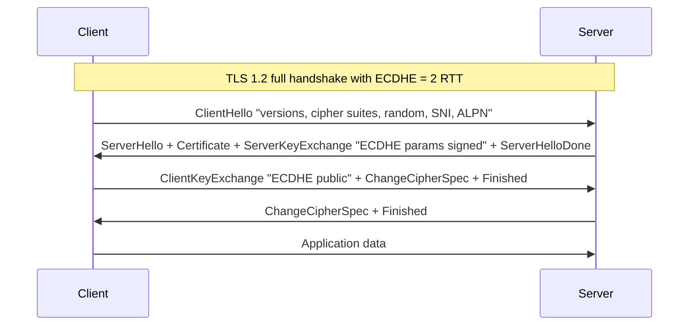
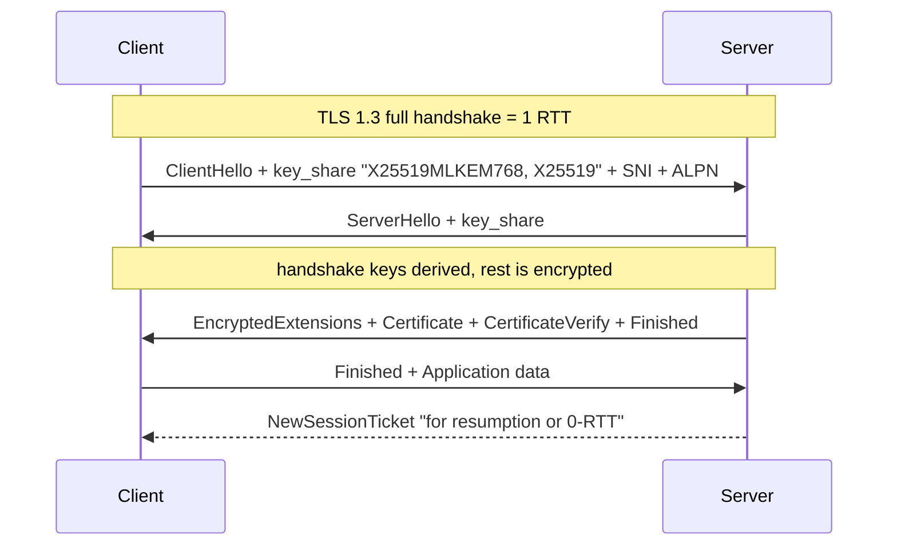
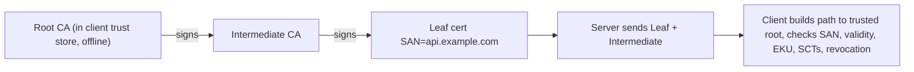

# F5 Overview of Popular Networking Protocols
> Last verified: 2026-10 · Audience: senior/staff DevOps, SRE, AI eng, NetEng, DevSecOps, architects

> This is the **overview-level** file for DNS, TLS and HTTPS. Deeper treatments are in
> [H3 Domain Name System](../H-full-stack-troubleshooting/H3-domain-name-system.md),
> [H4 Transport Layer Security](../H-full-stack-troubleshooting/H4-transport-layer-security.md),
> [I1 DNS gaps](../I-dns-tls-acceleration-gaps/I1-dns.md),
> [I2 TLS and certificates gaps](../I-dns-tls-acceleration-gaps/I2-tls-and-certificates.md),
> [C4 Security](../C-large-scale-architecture/C4-security.md) (C4.5 to C4.11) and
> [G3 Network DNS and DHCP](../G-cloud-network-architecture/G3-network-dns-and-dhcp.md).

## TL;DR
- **DNS** is a hierarchical, cached, eventually consistent key-value lookup: stub → **recursive resolver** → root → TLD → **authoritative**. **TTL** drives both propagation speed and query load; negative answers are cached too (SOA minimum, RFC 2308).
- DNS is plaintext on UDP/TCP 53 by default; **DoT** (TCP 853, RFC 7858) and **DoH** (443, RFC 8484) encrypt stub-to-resolver only. **DNSSEC** gives integrity/authenticity, not confidentiality. They solve different problems.
- **TLS 1.3** (RFC 8446): 1-RTT full handshake (vs 2-RTT in 1.2), 0-RTT resumption (replayable), only AEAD ciphers, **(EC)DHE mandatory → forward secrecy always**, everything after ServerHello encrypted (including the certificate).
- Authentication = **certificate chain** (leaf → intermediate(s) → trusted root in client store), hostname check against **SAN** (CN is ignored by modern clients). Server must send intermediates; missing intermediates is the #1 "works in Chrome, fails in curl" bug.
- **SNI** selects the cert/virtual host (plaintext unless **ECH**, RFC 9849, March 2026); **ALPN** negotiates h2/http/1.1 inside the handshake (HTTP/3 is discovered via Alt-Svc or the DNS **HTTPS** record, RFC 9460).
- **Certificate lifetimes are collapsing (CA/B Forum SC-081v3):** 398 days → **200 days from 15 Mar 2026** → 100 days from 15 Mar 2027 → **47 days from 15 Mar 2029**; domain-validation reuse drops to 10 days. Manual renewal is dead; ACME/managed certs are mandatory.
- **Post-quantum hybrid key exchange `X25519MLKEM768`** is on by default in Chrome, Edge, Firefox and Cloudflare; per Cloudflare, more than two-thirds of human HTTPS traffic to its network used it by April 2026. AWS CloudFront (default), ALB/NLB (opt-in policies) support it.
- Cloud: **Route 53 ↔ Azure DNS** (both 100% SLA authoritative, anycast), **ACM ↔ Key Vault certificates / App Service managed certs**, Cloudflare as a third-party DNS + edge TLS alternative.

## F5.1 DNS

### Resolution flow and components
- **How it works:**
  - **Stub resolver** (OS/libc, `/etc/resolv.conf`, systemd-resolved) asks a **recursive resolver** (ISP, 1.1.1.1, 8.8.8.8, VPC `.2` resolver / Azure `168.63.129.16`). The recursive resolver walks **root (13 named root server identities, anycast to 1,000+ instances)** → **TLD** (`.com`) → **authoritative** NS for the zone, following referrals, then caches every answer for its TTL.
  - Stub → recursive is a **recursive** query (RD bit set: "give me the final answer"). Recursive → authoritative is **iterative** (each server returns a referral or the answer).
  - Transport: UDP 53 by default; **TCP 53** when the response is truncated (TC bit), for zone transfers (AXFR/IXFR), and increasingly by default. Classic limit is 512 bytes UDP; **EDNS(0)** (RFC 6891) advertises larger buffers. DNS Flag Day 2020 recommended **1232 bytes** to avoid IP fragmentation.
  - Glue records: A/AAAA records for in-bailiwick nameservers served by the parent so the referral is resolvable.
- **Trade-offs / when to use:**
  - Caching makes DNS fast and scalable but means **changes are not instantaneous**: old answers live until TTL expiry at every resolver (and some clients/JVMs cache longer than TTL).
- **Interview angles:**
  - "What happens when you type a URL" → browser cache → OS cache → recursive resolver → root/TLD/authoritative → TCP/QUIC → TLS → HTTP. Mention DNS as a frequent hidden latency (cold lookups 20–100+ ms).
  - "DNS is UDP only" is wrong; TCP is mandatory to support (RFC 7766).

### Record types (know these cold)
| Type | Purpose | Notes / pitfalls |
|---|---|---|
| **A / AAAA** | Name → IPv4 / IPv6 | Multiple records = simple round-robin, no health awareness |
| **CNAME** | Alias to another name | **Not allowed at the zone apex** (conflicts with SOA/NS); cannot coexist with other records at same name |
| **ALIAS / ANAME / alias record** | Apex-capable alias (provider feature) | Route 53 **alias** (free queries to AWS targets), Azure DNS **alias record set**, Cloudflare **CNAME flattening** |
| **NS** | Delegates a zone | Mismatch between parent and child NS is a classic outage cause |
| **SOA** | Zone authority, serial, refresh/retry/expire, **negative-cache TTL** | |
| **MX** | Mail exchanger with priority | Must point to a name, not a CNAME |
| **TXT** | Arbitrary text: SPF, DKIM, DMARC, domain verification | ACME `dns-01` uses `_acme-challenge` TXT |
| **SRV** | Service host+port+priority+weight | Used by SIP, LDAP, Kerberos, some service discovery |
| **CAA** | Which CAs may issue for the domain (RFC 8659) | CAs must check it; cheap protection against mis-issuance |
| **PTR** | Reverse lookup (in-addr.arpa / ip6.arpa) | Owned by the IP holder (cloud provider), important for mail |
| **HTTPS / SVCB** | Service binding: ALPN (h3), ECH config, IP hints (RFC 9460) | Lets browsers use HTTP/3 and ECH on first connection |
| **DS / DNSKEY / RRSIG / NSEC(3)** | DNSSEC chain of trust | DS lives in parent zone |

### Caching and TTL
- **How it works:**
  - Each RRset carries a TTL (seconds). Resolvers decrement it; clients may cache too (browser ~1 min in Chrome, JVM `networkaddress.cache.ttl`, nscd, systemd-resolved).
  - **Negative caching** (NXDOMAIN/NODATA) uses min(SOA MINIMUM, SOA TTL) per RFC 2308. Querying a record before creating it can "poison" your own rollout for the negative TTL.
  - Serve-stale (RFC 8767) lets resolvers return expired data if authoritatives are unreachable.
- **Trade-offs / when to use:**
  - Low TTL (30–60 s): fast failover/migrations, more queries (cost on Route 53/Azure DNS is per query), more latency. High TTL (hours/days): resilient to auth outages, slow to change.
  - Migration playbook: **lower TTL at least one old-TTL ahead of the change**, cut over, verify, raise TTL again.
- **Interview angles:**
  - "DNS-based failover takes too long" → TTL + client caching + long-lived connections that never re-resolve; for sub-minute failover prefer anycast/global LB (Global Accelerator, Front Door, Cloudflare LB).
  - "DNS propagation" is a misnomer: it is cache expiry, not push.

### Encrypted DNS and DNSSEC
| | **DoT** | **DoH** | **DoQ** | **DNSSEC** |
|---|---|---|---|---|
| RFC | 7858 | 8484 | 9250 | 4033–4035 |
| Port | TCP 853 | TCP/UDP 443 (HTTP/2, HTTP/3) | UDP 853 | 53 (same as DNS) |
| Gives | Confidentiality stub↔resolver | Same, blends with web traffic | Same, over QUIC | Origin authenticity + integrity end-to-end, no confidentiality |
| Ops view | Easy to identify/block by port | Hard to block, bypasses enterprise DNS controls | Newer | Key rollover risk, larger responses, amplification |
- **Interview angles:**
  - "Does DoH replace DNSSEC?" → No. DoH protects the last hop to a resolver you trust; DNSSEC proves the data came from the zone owner. Recursive→authoritative is still mostly plaintext.
  - Enterprise angle: browsers' DoH can bypass corporate DNS filtering → use canary domain `use-application-dns.net`, policies, or a managed DoH resolver (e.g. **Route 53 Global Resolver**, which offers Do53/DoT/DoH on anycast IPs with filtering and DNSSEC validation).
  - DNSSEC failure mode: expired RRSIGs or bad DS during a KSK roll → validating resolvers return **SERVFAIL** for the whole domain.
- Deeper: [H3](../H-full-stack-troubleshooting/H3-domain-name-system.md), [I1](../I-dns-tls-acceleration-gaps/I1-dns.md), cloud private DNS in [G3](../G-cloud-network-architecture/G3-network-dns-and-dhcp.md).

## F5.2 TLS

### TLS 1.2 vs TLS 1.3
| Aspect | TLS 1.2 (RFC 5246) | TLS 1.3 (RFC 8446) |
|---|---|---|
| Full handshake | **2-RTT** | **1-RTT** |
| Resumption | Session IDs / tickets (1-RTT) | PSK tickets, optional **0-RTT** early data |
| Key exchange | RSA key transport **or** (EC)DHE | **(EC)DHE only** (or PSK+DHE); static RSA removed |
| Forward secrecy | Only with ECDHE/DHE suites | Always (except PSK-only mode) |
| Ciphers | Many, incl. CBC, RC4, 3DES (legacy) | 5 AEAD suites, e.g. `TLS_AES_128_GCM_SHA256`, `TLS_AES_256_GCM_SHA384`, `TLS_CHACHA20_POLY1305_SHA256` |
| Certificate | Sent in cleartext | **Encrypted** (after ServerHello) |
| Renegotiation | Supported (attack surface) | Removed (KeyUpdate instead) |
| KDF | PRF | HKDF |
| Downgrade protection | Weak | Sentinel bytes in ServerHello.random |
- **Status:** TLS 1.0/1.1 deprecated (RFC 8996, 2021). Baseline today is **TLS 1.2 minimum, prefer 1.3**. QUIC/HTTP/3 embeds TLS 1.3 (RFC 9001).

### Handshakes



- If the server does not support the client's guessed group it sends **HelloRetryRequest** (costs an extra RTT). Large PQ key shares (~1.2 KB for ML-KEM-768) can push ClientHello over one packet, which has broken some middleboxes.

### ECDHE and forward secrecy
- **How it works:** each side generates an **ephemeral** key pair per connection; the shared secret comes from (EC)DH; the server's long-term key only **signs** the handshake (CertificateVerify / ServerKeyExchange). Compromise of the private key later cannot decrypt recorded sessions.
- With TLS 1.2 **RSA key transport**, the client encrypts the pre-master secret with the server's RSA public key, so stealing that key decrypts all captured traffic (no FS). This is also why passive "SSL decryption with the server key" works only on old RSA suites; with ECDHE you need the session keys (`SSLKEYLOGFILE`, see [F8](F8-analyzing-protocols-with-wireshark.md)).
- **Post-quantum hybrid:** `X25519MLKEM768` (codepoint 0x11EC) concatenates classical X25519 with **ML-KEM-768** (NIST FIPS 203). Secure if either holds; defeats **harvest-now-decrypt-later**. Authentication (cert signatures) is still classical: PQ certificates (ML-DSA) are not yet in the WebPKI.
- **Interview angles:**
  - "Why is TLS 1.3 faster?" → client guesses the group and sends key_share in the first flight, so keys are ready after one round trip; plus 0-RTT on resumption.
  - "Is 0-RTT safe?" → early data is **replayable**; only allow idempotent requests (GET), servers/CDNs restrict it (Cloudflare adds `Early-Data: 1` header, origins can reject with 425 Too Early).
  - "TLS termination where?" → at LB/CDN (offload, WAF, L7 routing) vs passthrough (end-to-end, L4). Re-encrypt to backends for zero trust. See [C4](../C-large-scale-architecture/C4-security.md) and [H4](../H-full-stack-troubleshooting/H4-transport-layer-security.md).

### SNI and ALPN
- **SNI** (RFC 6066): hostname in ClientHello so one IP can serve many certs. Visible to on-path observers (used by firewalls/censors for filtering). Missing SNI → server returns a default cert → hostname mismatch errors (old clients, `openssl s_client` without `-servername`).
- **ECH** (RFC 9849, March 2026): encrypts the inner ClientHello (SNI, ALPN) with a key published in the DNS HTTPS record; the outer SNI shows the provider's public name. Supported by Cloudflare and major browsers; breaks SNI-based egress filtering.
- **ALPN** (RFC 7301): client lists `h2`, `http/1.1`; server picks in the handshake, so no extra RTT to upgrade. gRPC requires `h2`. HTTP/3 uses `h3` over QUIC, discovered via `Alt-Svc` header or **HTTPS RR**.
- **mTLS:** server sends CertificateRequest, client presents a cert. Used for service mesh and B2B APIs. Note: public CAs are **dropping the clientAuth EKU** from server certs in 2026 (Chrome Root Program requirement; App Service managed/App Service certificates remove it by May 2026), so mTLS client certs must come from a **private CA**.

## F5.3 HTTPS, TLS, Keys and Certificates

### Keys and certificates
- **How it works:**
  - A **certificate** (X.509v3) binds a **public key** to identities in the **SAN** extension, signed by a CA. Fields: subject, issuer, validity (notBefore/notAfter), SAN, key usage / EKU, AIA (issuer URL), CRL distribution points, SCTs (Certificate Transparency).
  - **Key types:** RSA 2048/3072 or **ECDSA P-256** (smaller, faster handshakes). Dual-cert (ECDSA + RSA) setups serve old clients.
  - **Chain of trust:** leaf → intermediate CA → root. Roots live in OS/browser **trust stores** (and are not sent). The server sends leaf + intermediates. Browsers sometimes fetch missing intermediates via AIA; curl, Java, Go, Python usually do not.
  - **Validation levels:** DV (domain control via ACME http-01, dns-01, tls-alpn-01), OV, EV (no browser UI benefit today).
  - **Certificate Transparency:** browsers require SCTs proving the cert was logged; monitor CT logs (crt.sh) for mis-issuance of your domains. Combine with **CAA**.
  - **Revocation:** CRL, OCSP, OCSP stapling. Industry is moving away from OCSP (Let's Encrypt ended OCSP in 2025) toward CRLs plus short lifetimes; browsers use pushed revocation sets (CRLite/CRLSets).
- **HTTPS** = HTTP over TLS on 443. **HSTS** (`Strict-Transport-Security: max-age=...; includeSubDomains; preload`) forces HTTPS and prevents SSL-stripping; preload is hard to undo.



### Certificate lifetime reduction (CA/B Forum Ballot SC-081v3, approved April 2025)
| Effective date | Max cert validity | Domain/IP validation reuse |
|---|---|---|
| Before 15 Mar 2026 | 398 days | 398 days |
| **15 Mar 2026** | **200 days** | 200 days |
| 15 Mar 2027 | 100 days | 100 days |
| **15 Mar 2029** | **47 days** | **10 days** |
- Subject identity info (OV/EV org data) reuse also drops from 825 to 398 days.
- Provider reactions: **ACM** public certs are 198 days since 18 Feb 2026 and renew 45 days before expiry (exportable public certs priced at $7 per FQDN, $79 per wildcard). **App Service Certificates** are 198 days, with overlapping certs auto-issued to keep 1 year of coverage. **Let's Encrypt**: 6-day "shortlived" profile GA January 2026; 45-day certs opt-in from May 2026; default goes 90 → 64 days (2027) → 45 days (2028).
- **Interview angles:**
  - "How do you handle 47-day certs?" → ACME automation (cert-manager, managed certs), expiry monitoring (alert at less than 30% lifetime left), no cert pinning to leaf/intermediate, inventory of exported certs (on-prem appliances, IoT, mobile pinning are the real risk).
  - "Cert expired outage" is a classic postmortem (it has hit large providers). Fix is automation plus synthetic monitoring of `notAfter`.

### Troubleshooting quick hits
```bash
# Show chain, negotiated version/cipher/group, ALPN; -servername sets SNI
openssl s_client -connect example.com:443 -servername example.com -alpn h2,http/1.1 -showcerts </dev/null
# Check expiry
echo | openssl s_client -connect example.com:443 -servername example.com 2>/dev/null | openssl x509 -noout -dates -ext subjectAltName
# DNS: trace delegation from the root, check TTLs, DNSSEC and HTTPS RR
dig +trace www.example.com
dig +dnssec example.com A
dig example.com HTTPS
# Encrypted DNS test via DoH
curl -s -H 'accept: application/dns-json' 'https://cloudflare-dns.com/dns-query?name=example.com&type=A'
```

## Cloud mapping: AWS vs Azure
| Capability | AWS | Azure | Role it plays | Key differences | Alternatives |
|---|---|---|---|---|---|
| Authoritative public DNS | **Route 53** public hosted zones | **Azure DNS** public zones | Host zone records on anycast nameservers | Both 100% SLA, both support DNSSEC signing. Route 53 has rich routing policies (latency, geo, weighted, failover with health checks); Azure DNS is plain authoritative, traffic steering lives in **Traffic Manager** | Cloudflare DNS, NS1, Akamai |
| Apex alias | Route 53 **alias records** (free queries to AWS targets) | Azure DNS **alias record sets** (Public IP, Traffic Manager, Front Door, CDN) | CNAME-like at zone apex | Route 53 alias evaluates target health | Cloudflare CNAME flattening |
| Private DNS | Route 53 **private hosted zones** + Resolver (`.2`) | **Azure Private DNS zones** + `168.63.129.16` | VPC/VNet internal names | See G3 | CoreDNS in Kubernetes |
| Hybrid / encrypted resolver | Route 53 **Resolver endpoints**, **Route 53 Global Resolver** (Do53/DoT/DoH, anycast) | **Azure DNS Private Resolver** (inbound/outbound endpoints) | On-prem ↔ cloud resolution, filtering | AWS Global Resolver provides DoH/DoT for remote clients; Azure Private Resolver is Do53 in-VNet | Cloudflare Gateway (DoH filtering) |
| DNS firewall | Route 53 Resolver **DNS Firewall** | Azure **DNS security policy** (unverified feature name maturity) | Block exfil/malicious domains | | Cloudflare Gateway |
| Public certificates | **ACM** (free for integrated services; exportable public certs paid) | **App Service Managed Certificates** (free, DigiCert), **App Service Certificates** (paid), **Front Door / App Gateway managed certs**, **Key Vault** certificates via integrated CAs (DigiCert, GlobalSign) | Issue and auto-renew TLS certs | ACM non-exportable certs bind to ELB/CloudFront/API GW; Key Vault stores certs + keys and auto-renews with partnered CAs; CloudFront certs must be in **us-east-1** | Let's Encrypt + cert-manager, Cloudflare Universal SSL |
| Private CA | **AWS Private CA** | Key Vault with private CA integration / AD CS (no first-party managed private CA equivalent, unverified) | mTLS, internal services | | HashiCorp Vault PKI, cert-manager CA issuer |
| Key storage | **KMS / CloudHSM** | **Key Vault / Managed HSM** | Protect private keys | | Vault |
| TLS termination with PQ | CloudFront (hybrid PQ on all policies by default), ALB/NLB (opt-in PQ policies: X25519MLKEM768, SecP256r1MLKEM768, SecP384r1MLKEM1024) | Front Door / App Gateway PQ support (unverified) | Edge TLS | AWS documented; Azure not confirmed in official docs | Cloudflare (PQ on by default, origin PQ too) |
- **Route 53** is a global service; **Azure DNS** zones are global resources in a resource group. Both bill per hosted zone per month plus per million queries (alias queries to AWS resources are free on Route 53).
- **ACM** is regional (except CloudFront needs us-east-1); certs auto-renew only if DNS validation CNAME stays in place. **Key Vault** is regional; App Service/Front Door/App Gateway pull certs from it via managed identity, and auto-rotation picks up new versions (Front Door "latest" version).
- **Cloudflare** combines authoritative DNS, DoH resolver (1.1.1.1), edge TLS with ECH and PQ, and origin certs; the common alternative when you want one control plane across clouds.

## Cross-links
- [H3 Domain Name System](../H-full-stack-troubleshooting/H3-domain-name-system.md)
- [H4 Transport Layer Security](../H-full-stack-troubleshooting/H4-transport-layer-security.md)
- [I1 DNS gaps](../I-dns-tls-acceleration-gaps/I1-dns.md)
- [I2 TLS and certificates gaps](../I-dns-tls-acceleration-gaps/I2-tls-and-certificates.md)
- [C4 Security (C4.5 to C4.11 TLS/certs)](../C-large-scale-architecture/C4-security.md)
- [G3 Network DNS and DHCP](../G-cloud-network-architecture/G3-network-dns-and-dhcp.md)
- [D2 Reusable parts (D2.11, D2.12)](../D-system-design/D2-reusable-parts-of-system-design.md)
- [F4 TCP](F4-transmission-control-protocol.md), [F3 UDP](F3-user-datagram-protocol.md), [F6 Network performance](F6-network-performance.md), [F8 Wireshark](F8-analyzing-protocols-with-wireshark.md)
- [L2 Encryption and key management](../L-data-privacy-ai-security/L2-encryption-key-management.md), [L7 Zero trust and workload identity](../L-data-privacy-ai-security/L7-zero-trust-workload-identity.md)

## Sources
- https://www.rfc-editor.org/rfc/rfc8446 (TLS 1.3)
- https://www.rfc-editor.org/rfc/rfc9849 (ECH, March 2026)
- https://www.rfc-editor.org/rfc/rfc8484 (DoH), https://www.rfc-editor.org/rfc/rfc7858 (DoT), https://www.rfc-editor.org/rfc/rfc9460 (SVCB/HTTPS RR), https://www.rfc-editor.org/rfc/rfc2308 (negative caching)
- https://cabforum.org/2025/04/11/ballot-sc081v3-introduce-schedule-of-reducing-validity-and-data-reuse-periods/
- https://aws.amazon.com/about-aws/whats-new/2026/02/aws-certificate-manager-updates-default
- https://docs.azure.cn/en-us/app-service/industry-wide-certificate-changes
- https://docs.aws.amazon.com/Route53/latest/DeveloperGuide/gr-concepts-terminology.html
- https://learn.microsoft.com/azure/dns/public-dns-overview
- https://aws.amazon.com/about-aws/whats-new/2025/11/network-load-balancers-post-quantum-key-exchange-tls
- https://aws.amazon.com/about-aws/whats-new/2025/09/amazon-cloudfront-TLS-policy-post-quantum-support
- https://blog.cloudflare.com/post-quantum-visibility/
- https://letsencrypt.org/2026/01/15/6day-and-ip-general-availability
- https://letsencrypt.org/docs/cert-lifetimes/
