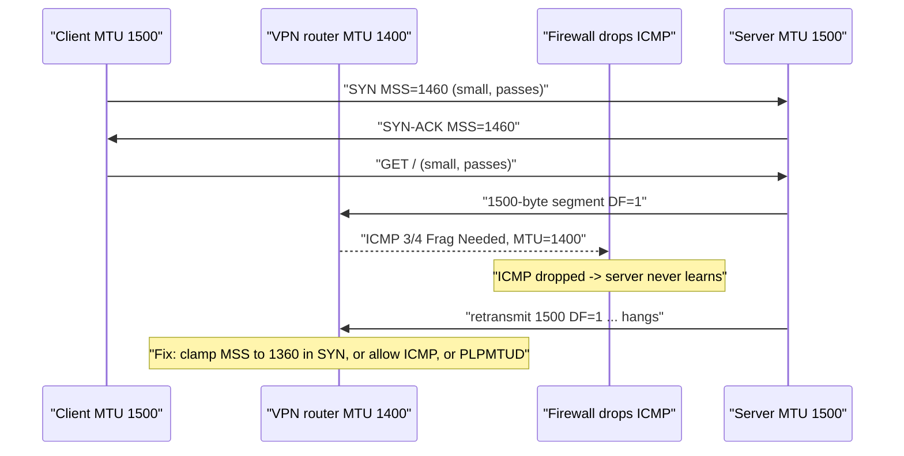
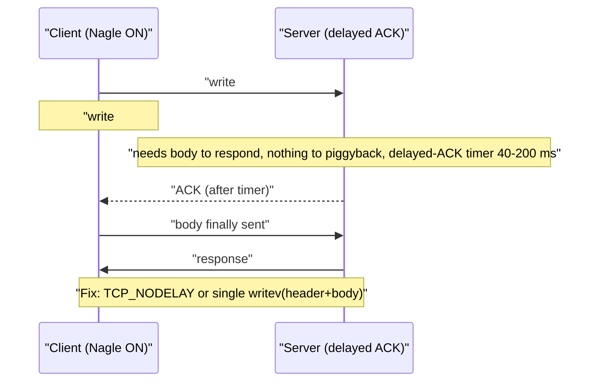
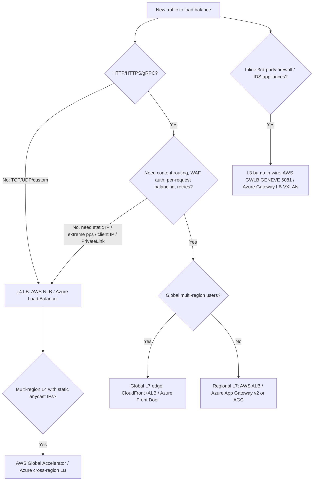
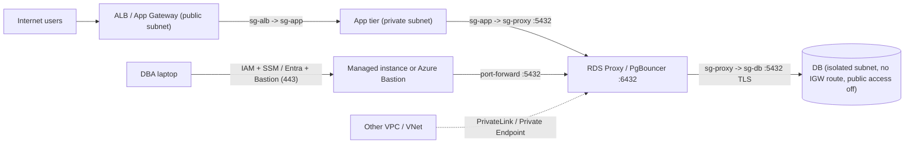

# F6 Network Performance
> Last verified: 2026-10 · Audience: senior/staff DevOps, SRE, AI eng, NetEng, DevSecOps, architects

## TL;DR
- **MSS = MTU − IP − TCP headers** (1500 → 1460 on IPv4, 1440 on IPv6). **PMTUD needs ICMP**: if "Frag Needed"/"Packet Too Big" is filtered you get a **PMTU black hole** (handshake works, big transfers hang). Fix with **MSS clamping**, allowing ICMP, or **PLPMTUD** (`tcp_mtu_probing`).
- Cloud MTU: **AWS VPC 9001** (jumbo) but **1500 over IGW/VPN**, **8500 over TGW / inter-region peering**. **Azure default 1500**. Bigger MTUs only inside the VNet or with directly peered VNets in the same region: **3900 on Mellanox**, **9000 on MANA**. "4088" is the Windows `*JumboPacket` registry value, not the MTU.
- **Nagle + delayed ACK = 40–200 ms stalls** on a write-write-read pattern. Latency-sensitive protocols set **TCP_NODELAY** or merge writes into one buffer.
- A connection costs **1 RTT (TCP) + 1 RTT (TLS 1.3) or 2 RTT (TLS 1.2)**, plus DNS, slow start and server CPU. **Pool and keep alive**, and keep **keepalive/idle timeouts in the right order** through every LB and NAT.
- **TFO** saves 1 RTT but is rarely used: middleboxes drop it, the SYN data can be replayed, and cookies can track users. **TLS 1.3 / QUIC 0-RTT** is the modern answer, and it still needs replay-safe (idempotent) requests.
- **HOL blocking**: HTTP/1.1 has it at the app layer (one request per connection at a time). HTTP/2 fixes that but still has it at the **TCP** layer, so one loss stalls every stream. **HTTP/3 over QUIC** keeps streams independent.
- **Reverse proxies / L7 LBs** terminate connections and can route on content, run a WAF, retry and pool backend connections. **L4 LBs** pass flows through, preserve the client IP, handle any TCP/UDP, give the highest pps and offer static IPs.
- DB access pattern: **private subnet**, no public endpoint, **SG→SG reference** (Azure: **NSG + ASG**), **private endpoints**, admin access through **SSM Session Manager / Azure Bastion** (not an open SSH bastion), plus a **pooler** (RDS Proxy / built-in PgBouncer).

## F6.1 MSS vs MTU vs PMTUD
- **How it works:**
  - **MTU** is the largest L3 packet a link carries (Ethernet 1500; the 14 B header and 4 B FCS are not counted). The minimums are **IPv4 576** and **IPv6 1280**.
  - **MSS** is the TCP payload limit. Each side announces it **in the SYN only** and each direction uses the peer's value. **IPv4: MTU − 40 → 1460. IPv6: MTU − 60 → 1440.** TCP timestamps (+12 B) drop the real payload per segment to about **1448**. With no MSS option the default is **536** (IPv4).
  - **PMTUD**: the sender sets **DF=1**. A router that can't forward the packet sends **ICMP type 3 code 4 "Fragmentation Needed"** (IPv4, RFC 1191) or **ICMPv6 type 2 "Packet Too Big"** (RFC 8201) with its next-hop MTU, and the sender lowers its PMTU. **IPv6 routers never fragment.**
  - **PLPMTUD** (RFC 4821, and DPLPMTUD RFC 8899 used by QUIC) probes with real packets and doesn't depend on ICMP. Linux `net.ipv4.tcp_mtu_probing`: **0 = off (default)**, **1 = on only after a black hole is detected**, **2 = always** (starts at `tcp_base_mss`).
  - **Encapsulation overhead** (subtract from the inner MTU): VXLAN **50**, GENEVE **≥58** (AWS GWLB adds ~68 with its options), GRE **24**, IPsec ESP **~50–73**, WireGuard **60 (v4) / 80 (v6)**, PPPoE **8**.
- **PMTU black hole**: a firewall, NACL or SG drops the ICMP, so the sender keeps resending full-size DF packets that die silently.
  - Classic symptoms: **TCP connect and small requests work, big responses hang**; `ssh` logs in but `scp` stalls; TLS stalls at the certificate flight; a VPN works for ping but not for HTTPS.
  - Fixes, best first:
    - Allow ICMP 3/4 and ICMPv6 2 (never block all ICMPv6).
    - **MSS clamping** on the tunnel or edge device: rewrite the SYN's MSS down to the path MTU (`iptables -t mangle ... TCPMSS --clamp-mss-to-pmtu`, `ip tcp adjust-mss` on Cisco). It only works for TCP, and only where the device sees the SYN.
    - `tcp_mtu_probing=1`.
    - Lower the interface MTU.
- **Cloud specifics:**
  - **AWS** (EC2 MTU doc):
    - All current-gen instances support **9001**.
    - Traffic over an **IGW, Site-to-Site VPN, or between Regions without a TGW** is limited to **1500**.
    - **Inter-region VPC peering** is limited to **8500**.
    - **Transit Gateway: 8500** for VPC, DX, Connect and peering attachments; **1500** over VPN. TGW **enforces MSS clamping on all packets**. It generates FRAG_NEEDED/PTB for traffic entering through VPC and Connect attachments only, not through VPN, DX or peering attachments.
    - Direct Connect private VIF supports up to 9001 and transit VIF up to 8500 (see G12).
    - PMTUD responses reach the instance if the flow is tracked or ICMP is allowed inbound. A NACL can still block them.
  - **Azure** (MTU how-to):
    - Default **1500**.
    - A larger MTU works **only within the VNet and directly peered VNets in the same region**. It is not supported through gateways, global peering or the internet.
    - Maximums: **Mellanox CX-3/4/5 → 3900** (on Windows you set `*JumboPacket` = **4088**, then persist the MTU from `Test-Connection -MtuSize`); **MANA → 9000** (registry value 9014).
    - Accelerated Networking **doesn't process fragments**: they take the slow path, and **out-of-order fragments are dropped** by default.
    - For VPN, Microsoft recommends **TCP MSS clamping at 1350 and a tunnel MTU of 1400**.
    - Microsoft generally advises **against** raising the VM MTU because PMTUD is fragile.
- **Trade-offs / when to use:**
  - Jumbo frames cut per-packet CPU and header overhead. Good for east-west bulk traffic (storage, Spark shuffle, cluster placement groups, NCCL over TCP).
  - Jumbo frames are risky the moment traffic leaves the jumbo domain (NAT, VPN, internet, cross-region). Per-route MTU (`ip route ... mtu 1500`) or separate ENIs/NICs contain that risk.
  - LSO/TSO/GRO show "giant" frames in captures. That isn't jumbo MTU or fragmentation.
- **Interview angles:**
  - "Site-to-site VPN: SSH works, file copy hangs" → PMTU black hole. Clamp MSS to about 1350–1379 on the tunnel and allow ICMP 3/4. Confirm with `ping -M do -s <MTU-28>` and `tracepath`.
  - "Why 9001 and not 9000?" → AWS's chosen value. What matters is that both ends **and every hop** agree.
  - Pitfall: copying a "block all ICMP" hardening rule into SGs/NACLs, or Kubernetes overlay MTU (Calico/Flannel VXLAN) not set to host MTU − 50. See [G4 MTU](../G-cloud-network-architecture/G4-network-performance-and-optimization.md) and [H5](../H-full-stack-troubleshooting/H5-network-performance-deep-dive.md).



## F6.2 Nagle's Algorithm's Effect on Performance
- **How it works:** Nagle (RFC 896, 1984) says that **if unACKed data is in flight, hold small segments (< MSS)** and send them once an ACK arrives or a full MSS has built up. The goal was to stop "tinygram" floods (1-byte telnet payload + 40 B headers).
- **Effect:** at most one small segment in flight per RTT. That's fine for bulk transfer and interactive typing, but bad for request/response protocols that issue **several small writes**.
- **Controls (Linux tcp(7)):**
  - **`TCP_NODELAY`** disables Nagle, so segments go out immediately.
  - **`TCP_CORK`** does the opposite: it holds partial frames until uncorked, with a **200 ms ceiling** (sendfile + header pattern).
  - **`MSG_MORE`** works per call.
  - Nagle is on by default in the kernel. Many runtimes and servers turn it off: Go `net` sets NODELAY by default, nginx has `tcp_nodelay on` (default, for keepalive connections), and most DB/RPC drivers (JDBC, libpq, gRPC) do the same.
- **Trade-offs / when to use:**
  - Disable Nagle for RPC, DB protocols, gaming, trading and interactive APIs.
  - Leave it on (or cork) for bulk streams with many tiny writes, where it saves packets.
  - Even better is to **build the full message in user space and make one `write`/`writev`**. NODELAY plus lots of tiny writes creates a packet storm (high pps, poor goodput).
- **Interview angles:** "Our p50 is 40 ms on a LAN with 0.2 ms RTT" → suspect **Nagle × delayed ACK** (F6.3). Check for split header/body writes. Fix with NODELAY or coalesced writes.

## F6.3 Delayed Acknowledgment Effect on Performance
- **How it works:**
  - The receiver waits to piggy-back the ACK on response data or to ACK every 2nd full segment.
  - RFC 1122 / RFC 9293: the delay **must be < 0.5 s**, and the receiver should ACK at least every second full-sized segment.
  - **Linux**: the delayed-ACK timer adapts between about **40 ms (min) and 200 ms**, and the kernel starts connections in quickack mode. **Windows**: **200 ms** default (`TcpAckFrequency`).
- **Nagle × delayed ACK deadlock-ish stall:**
  1. The client writes the header (sent at once, since nothing is outstanding), then writes the body. Nagle holds the body because the header isn't ACKed yet.
  2. The server can't reply until it has the body, so it has no data to piggy-back on and waits for its delayed-ACK timer.
  3. Result: **+40 ms (Linux) / +200 ms (Windows)** per request.
- **Controls:**
  - Sender: `TCP_NODELAY` (the usual fix).
  - Receiver: `TCP_QUICKACK` (Linux; **not sticky**, so re-arm it after each recv).
  - Windows: `TcpAckFrequency=1` per interface (registry).
- **Trade-offs:** delayed ACK cuts ACK traffic about 50%, which helps CPU and asymmetric links. Turning it off globally raises pps. Fix the **sender pattern** first.
- **Interview angles:**
  - Explain the write-write-read pattern and why write-read-write-read (one write per request) doesn't trigger it.
  - The tell-tale is a latency histogram with a **spike at exactly ~40 ms or ~200 ms**.



## F6.4 Cost of Connection Establishment
- **How it works (round trips before the first useful byte):**

| Stack | New connection | Resumed |
|---|---|---|
| TCP only | 1 RTT | 1 RTT (0 with TFO) |
| TCP + TLS 1.2 | 3 RTT | 2 RTT (session ticket) |
| TCP + TLS 1.3 | 2 RTT | 1 RTT (TCP) + **0-RTT** early data |
| QUIC (HTTP/3) | **1 RTT** (transport + TLS combined) | **0-RTT** |

  - Add **DNS** (0 to several RTTs) and **slow start**: initial cwnd **10 segments ≈ 14.6 KB** (RFC 6928), so the first responses need several RTTs to grow. `tcp_slow_start_after_idle=1` (default) **collapses cwnd on idle pooled connections**, so set it to 0 for long-lived backend pools.
  - Server-side cost:
    - TLS asymmetric crypto (ECDHE plus RSA/ECDSA sign).
    - Kernel socket state.
    - **Per-connection process in PostgreSQL** (fork, several MB). Postgres strains past a few thousand connections.
    - Auth plugins (SCRAM iterations, IAM token validation).
  - Client-side cost:
    - **Ephemeral ports** (`ip_local_port_range` default 32768–60999 ≈ 28k).
    - **TIME_WAIT** (Linux holds it 60 s, fixed) → port exhaustion. The same thing happens on **cloud NAT/SNAT**: Azure LB outbound SNAT ports, AWS NAT Gateway's 55k concurrent connections per destination IP:port.
    - On NLB with client-IP preservation, NAT-loopback / same-tuple issues.
- **Mitigations:**
  - **Connection pooling** (HTTP keep-alive, HTTP/2 multiplexing, DB pools such as HikariCP, PgBouncer, RDS Proxy).
  - **TLS session resumption / tickets**, **OCSP stapling**, ECDSA certs.
  - **TLS termination at the edge** (CloudFront / Front Door) near the user, with warm long-lived connections to origin.
  - `tcp_tw_reuse` for outbound connections. **Never `tcp_tw_recycle`**, which was removed in Linux 4.12 and broke NAT.
- **Keepalive and idle-timeout alignment (top production gotcha):**
  - **AWS ALB** idle timeout defaults to **60 s** (1–4000 s).
  - **AWS NLB** TCP idle is **350 s**, configurable **60–6000 s** (TLS listener fixed at 350 s; UDP 120 s). Above 350 s, raise the target ENI conntrack `TcpEstablishedTimeout` as well.
  - **Azure LB** is **4 min** by default, **4–100 min** on rules and **4–120 min** on outbound rules. It **silently drops** idle flows unless **TCP Reset on idle** is enabled.
  - Linux `tcp_keepalive_time` defaults to **7200 s**, far too long to keep LB/NAT state alive. Set app or socket keepalive (`TCP_KEEPIDLE`) **below** the smallest middlebox idle timeout.
  - Rule: **backend keepalive timeout > LB idle timeout > client keepalive.** Example: nginx/Node `keepAliveTimeout` 65–75 s behind an ALB at 60 s. Otherwise the backend closes first and the LB returns **502s** under low traffic.
- **Interview angles:**
  - "Lambda storms the DB with connections" → RDS Proxy, or the Data API.
  - "Sporadic 502s after idle" → timeout ordering.
  - "Connection refused at 28k RPS from one client" → ephemeral port / SNAT exhaustion.
  - See [C1 latency](../C-large-scale-architecture/C1-performance.md), [I3 acceleration](../I-dns-tls-acceleration-gaps/I3-acceleration.md), [I2 TLS](../I-dns-tls-acceleration-gaps/I2-tls-and-certificates.md).

## F6.5 TCP Fast Open
- **How it works (RFC 7413, TCP option kind 34):**
  1. On the first connection the client asks for a cookie. The server returns a **MAC-based cookie** tied to the client IP.
  2. On later connections the client sends **SYN + cookie + data**. The server can pass the data to the app **before the handshake finishes**, saving 1 RTT for repeat clients.
  - Linux `net.ipv4.tcp_fastopen`: **default 0x1 = client only**, 0x2 = server, so use 3 for both. The server enables it with `setsockopt(TCP_FASTOPEN, qlen)`. Clients use `sendto(MSG_FASTOPEN)` or `TCP_FASTOPEN_CONNECT`. nginx: `listen ... fastopen=N`.
- **Why it's rarely used:**
  - **Replay:** SYN data can reach the app twice (RFC 7413 says so), so only idempotent requests are safe.
  - **Middleboxes:** RFC 7413 cites about 6% of paths dropping SYNs with data or unknown options. Clients have to detect this and fall back, which **adds** latency when it fails.
  - **Cookies are per server IP:** they break behind anycast/LB pools and when mobile clients change IPs. They also work as a **cross-site tracking identifier**.
  - **Most of the saving is eaten by TLS:** TFO saves the TCP RTT, but TLS still needs its own unless you use TLS 1.3 0-RTT.
  - Major browsers shipped and then disabled or removed TFO; Apple and Linux CDNs use it sparingly (unverified as of 2026).
- **Modern replacement:** **TLS 1.3 0-RTT** and **QUIC 0-RTT** move early data into the crypto layer, with resumption tickets that work across a server fleet. You still **must** limit 0-RTT to safe or idempotent methods: RFC 8470 defines the `Early-Data: 1` header and **425 Too Early**. CDNs (Cloudflare, CloudFront, Front Door) offer 0-RTT/HTTP/3 toggles.
- **Interview angles:**
  - "Would you enable TFO?" → Only on controlled paths (DC-internal, own clients) for idempotent RPC. For the public web, prefer HTTP/3 + 0-RTT with replay protection.
  - Mention the cookie and the replay caveat.

## F6.6 Listening Server
- **How it works:**
  - `socket → bind(ip:port) → listen(backlog) → accept()`.
  - The kernel keeps a **SYN queue** (half-open, SYN_RECV, `tcp_max_syn_backlog`; **SYN cookies** when it overflows) and an **accept queue** (fully established, waiting for `accept`). The accept queue is capped by **`net.core.somaxconn` (default 4096 since Linux 5.4; was 128)**.
  - When the accept queue overflows, the final ACK is dropped (or a RST is sent if `tcp_abort_on_overflow=1`). Watch `ss -lnt` (Recv-Q vs Send-Q) and `nstat ListenOverflows/ListenDrops`.
- **Server models:**
  - **Process per connection:** Postgres, Apache prefork. Simple and isolated, but heavy, hence poolers.
  - **Thread per connection / thread pool:** classic Java and MySQL.
  - **Event loop + epoll/kqueue/io_uring:** nginx, Envoy, Node, Netty. C10K and beyond.
  - **Multiple listeners via `SO_REUSEPORT`:** the kernel hashes connections across workers (nginx `reuseport`), which avoids the accept thundering herd. `EPOLLEXCLUSIVE` is an alternative.
  - **`TCP_DEFER_ACCEPT`:** wake the app only when data arrives, which cuts idle-connection wakeups.
- **Gotchas:**
  - Binding to **127.0.0.1 inside a container or pod** makes the service unreachable, so bind 0.0.0.0/[::].
  - IPv6 dual-stack (`IPV6_V6ONLY`).
  - Privileged ports < 1024 (`CAP_NET_BIND_SERVICE`).
  - Listening on all interfaces exposes admin ports, so pair with SG/NSG.
  - Graceful drain: stop accepting, deregister from the LB (ALB deregistration delay **300 s** default), finish in-flight work.
- **Interview angles:** "Clients see connect timeouts but the server's CPU is idle" → accept-queue overflow (app not calling accept fast enough, or a small backlog). Raise `somaxconn` and the app backlog, and fix the event loop. Cross-link [A7 Socket management](../A-operating-systems/A7-socket-management.md) and [H6 web architecture](../H-full-stack-troubleshooting/H6-web-application-architecture.md).

## F6.7 TCP Head of line blocking
- **How it works:** TCP delivers a **single ordered byte stream**. If segment N is lost, segments N+1… sit in the receive buffer until the retransmit arrives (≥ 1 RTT, often an RTO of **≥ 200 ms** on Linux, default minimum).
- **By protocol:**

| Protocol | App-layer HOL | Transport HOL | Notes |
|---|---|---|---|
| HTTP/1.1 | **Yes**: one in-flight request per connection; pipelining effectively unusable | Per connection | Browsers open **~6 connections per host**; domain sharding was the workaround |
| HTTP/2 | No: streams multiplexed | **Yes**: one TCP connection, so one loss stalls **all** streams | HPACK; single connection makes loss worse on lossy mobile/Wi-Fi |
| HTTP/3 (QUIC, RFC 9000/9114) | No | **No**: per-stream reliability over UDP | QPACK limits header-compression HOL; connection migration via connection IDs |

- **Trade-offs:**
  - On clean networks HTTP/2 wins: one handshake, one cwnd, header compression.
  - At **high loss**, HTTP/1.1 with 6 connections (6 cwnds) can beat a single HTTP/2 connection. HTTP/3 removes that penalty.
  - QUIC costs more CPU (userspace, UDP GSO/GRO) and **UDP/443 is sometimes blocked**, so clients fall back via **Alt-Svc / HTTPS DNS RR**.
  - gRPC (HTTP/2) inherits TCP HOL, and one long-lived HTTP/2 connection also defeats L4 load balancing (F6.9).
- **Interview angles:**
  - "Does HTTP/2 eliminate HOL?" → Only at the HTTP layer. TCP HOL remains, and QUIC fixes it.
  - Also mention **HOL in queues/proxies**: a slow request at the front of a FIFO worker blocks the rest. Bound concurrency and use separate pools.

## F6.8 The importance of Proxy and Reverse Proxies
- **Forward proxy** (acts for **clients**): egress control, FQDN allow-listing, auth, caching, DLP/TLS inspection, hiding client IPs. Examples: Squid, corporate SWG (Zscaler), **Azure Firewall explicit proxy**, Squid/Network Firewall egress patterns on AWS.
  - **Explicit** proxies use `HTTP(S)_PROXY` and `CONNECT` tunnels for TLS.
  - **Transparent** proxies intercept via routing/iptables.
- **Reverse proxy** (acts for **servers**): TLS termination and certificate management, load balancing, caching/compression, WAF and rate limiting, auth offload (OIDC), routing (host/path), **connection pooling to backends** (many short client connections become a few warm keepalive connections), retries and timeouts, hiding topology, blue/green and canary splits. Examples: nginx, Envoy, HAProxy, Traefik, ALB, App Gateway, Front Door, CloudFront, API gateways, service-mesh sidecars.
- **Client identity across proxies:**
  - L7: `X-Forwarded-For/-Proto`, `Forwarded` (RFC 7239). Trust only the last N hops you control.
  - L4: **PROXY protocol v1/v2** (supported by NLB, Azure Private Link Service, HAProxy, nginx).
- **Trade-offs:**
  - Costs: an extra hop (≈0.1–1 ms in-region), a SPOF or scaling point, double TLS, timeout chains, and debugging complexity (whose 502/504?).
  - Benefit: it is the place to centralize cross-cutting concerns (Gateway Offloading pattern).
- **Interview angles:**
  - "Where do you terminate TLS?" → At the edge for performance and WAF. Re-encrypt to the backend for zero trust/compliance, or use mTLS in the mesh.
  - "A proxy returns 502 vs 504" → upstream reset/closed vs upstream timeout.
  - Cross-link [C2 scalability](../C-large-scale-architecture/C2-scalability.md), [D1 basics](../D-system-design/D1-system-design-basics.md), [H6](../H-full-stack-troubleshooting/H6-web-application-architecture.md).

## F6.9 Load Balancing at Layer 4 vs Layer 7
- **L4 (transport):**
  - Decides per **flow** (5-tuple hash, or least-connections) and forwards packets. Either pass-through/DSR or NAT. **One TCP connection end to end** (unless it's a TLS listener).
  - Strengths: protocol-agnostic (TCP/UDP/QUIC), very high pps, low latency, **client IP preservation**, **static/Elastic IPs**, PrivateLink frontends.
  - Blind to URLs and headers. Health checks are usually TCP-level.
- **L7 (application):**
  - **Terminates** the client connection, parses HTTP/gRPC, chooses a backend **per request**, and opens or reuses a **second connection**.
  - Enables host/path/header routing, weighted canaries, retries, WAF, authentication, header rewriting, HTTP/2 → HTTP/1.1 translation, gRPC per-call balancing, sticky cookies.
  - Costs: more CPU and latency, it has to hold certificates, and client IP arrives via XFF.
- **Key subtleties:**
  - **Long-lived connections** (gRPC, WebSocket, DB) behind an L4 LB stick to one backend, which causes imbalance after scale-out. Use an L7 LB, client-side LB, or `MaxConnectionAge`.
  - **Cross-zone**: AWS NLB has it **off** by default (each node uses its own AZ's targets); ALB has it on.
  - **Hash consistency**: L4 LBs and NVAs need **flow symmetry**, hence GWLB/Gateway LB flow stickiness.
  - **Global**: anycast L4 (Global Accelerator, Azure cross-region LB) vs L7 edge (CloudFront, Front Door) vs DNS (Route 53, Traffic Manager; failover limited by TTL).
- **Interview angles:**
  - "NLB or ALB for gRPC?" → ALB, which balances per request and supports gRPC. Or NLB plus client-side balancing if you need static IPs or very high pps.
  - "Why does one pod get all the traffic?" → connection-level balancing of HTTP/2.
  - Cross-link [C2](../C-large-scale-architecture/C2-scalability.md), [D1](../D-system-design/D1-system-design-basics.md), [H6](../H-full-stack-troubleshooting/H6-web-application-architecture.md).



## F6.10 Network Access Control to Database Servers
- **Placement:**
  - DB in **private/isolated subnets** with **no route to an IGW**. Any internet egress (patching) goes through NAT, or ideally none at all.
  - **Publicly accessible = false** (RDS) or **public network access disabled** (Azure).
  - Multi-AZ subnet group across at least 2 AZs.
- **Least-privilege L3/L4:**
  - **AWS SG → SG referencing**: the DB SG allows `tcp/5432` **from `sg-app`**, not from CIDRs. It scales with autoscaling and needs no IP bookkeeping.
    - Works across same-region **VPC peering**.
    - Works across **Transit Gateway** (since 2024): inbound rules only, same Region, must be enabled on both the TGW and the attachment, Nitro instances only. Not across peered TGWs.
  - NACLs are a **stateless** coarse backstop. Remember ephemeral return ports, and don't block ICMP 3/4 (F6.1).
  - **Azure**: **NSG** rules using **Application Security Groups (ASGs)** as source/destination are the closest analog to SG references. Azure DB PaaS options:
    - **Private access (VNet integration into a delegated subnet)**, or
    - **Private Endpoint** plus `privatelink.*` Private DNS zone, and disable public access.
    - Avoid the Azure SQL "**Allow Azure services and resources**" firewall toggle: it admits *any* Azure tenant's IPs.
- **Private connectivity / cross-account:**
  - RDS ENIs already live in your VPC. Expose a DB to *other* VPCs/accounts via peering/TGW, or **NLB + PrivateLink endpoint service** (watch for failover IP changes; use RDS Proxy as the target or keep the target group updated).
  - Azure: Private Endpoints (cross-subscription/tenant via approval).
  - DNS split-horizon is the usual failure mode. See [G7](../G-cloud-network-architecture/G7-service-endpoints-private-link.md).
- **Human/admin access:**
  - **Bastion/jump host**: a public SSH box. Patching burden, keys sprawl, port 22 open, weak audit. It's legacy.
  - **AWS SSM Session Manager**:
    - No inbound ports and no SSH keys. IAM-authorized, CloudTrail-logged.
    - `AWS-StartPortForwardingSessionToRemoteHost` tunnels `localhost:5432` → RDS endpoint through any managed instance (agent ≥ 3.1.1374.0).
    - Private subnets need VPC endpoints `ssm`, `ssmmessages`, `ec2messages`.
    - Caveat: **session logging is not available for port-forwarding/SSH sessions** (it's only a tunnel), so rely on DB audit logs.
    - Also **EC2 Instance Connect Endpoint** (keyless SSH/RDP to private IPs without a public bastion).
  - **Azure Bastion**:
    - Managed RDP/SSH over TLS 443. Needs a dedicated **`AzureBastionSubnet` /26 or larger** (Developer SKU excepted).
    - **Standard+** adds host scaling, custom ports, shareable links and native-client **tunneling** (`az network bastion tunnel` to a VM, then hop to the DB).
    - **Premium** adds **session recording** and **private-only** deployment.
  - Better still: **just-in-time** access (Defender for Cloud JIT, IAM Identity Center + temporary credentials).
- **Identity and encryption at the DB:**
  - **IAM DB authentication** (15-min tokens) or **Microsoft Entra auth**. Secrets in Secrets Manager / Key Vault with rotation.
  - Enforce TLS: `rds.force_ssl=1`, `require_secure_transport=ON`.
  - Separate roles for app, migration and read-only users.
- **Poolers as a security and performance control:**
  - **RDS Proxy**:
    - Pools and multiplexes connections, queues or sheds load during surges, and preserves client connections through failover.
    - Can **enforce IAM auth** for clients, using Secrets Manager or IAM to reach the DB.
    - **Must be in the same VPC and is never publicly accessible.**
    - Default endpoint spans **2 AZs**. For RDS instances it attaches to the **writer only**.
    - **Pinning** (session state, statements > 16 KB) kills the multiplexing benefit.
    - Limit of 20 proxies per account (adjustable).
  - **Azure Database for PostgreSQL Flexible Server built-in PgBouncer**:
    - Port **6432**, **transaction** pool mode by default, `default_pool_size` 50, `max_client_conn` 5000.
    - **Not on Burstable.** Restarts on the new primary after HA failover.
    - It's single-threaded, so for scale run PgBouncer/PgCat on VMs or AKS.
  - **Azure SQL Database** has no proxy-pooler. Its gateway **connection policy** is **Redirect** (direct to node, ports **11000–11999** + 1433, lower latency) or **Proxy** (all via gateway on 1433). The default is Redirect inside Azure and Proxy from outside. Pool in the client driver.
  - Azure MySQL Flexible: no built-in pooler (unverified), so use ProxySQL.
- **Interview angles:**
  - "Design secure DB access for a 3-tier app" → private subnets, SG-ref chain ALB-SG → app-SG → db-SG, no public IP, RDS Proxy with IAM, TLS, SSM port forwarding for DBAs, VPC Flow Logs + DB audit logs, KMS encryption.
  - Pitfall: SG allowing `0.0.0.0/0:5432` "temporarily".
  - Pitfall: a Private Endpoint created but public access still enabled, or DNS not resolving to the private IP.
  - Cross-link [B12 DB security](../B-database-engineering/B12-database-security.md), [C4 security](../C-large-scale-architecture/C4-security.md), [L7 zero trust](../L-data-privacy-ai-security/L7-zero-trust-workload-identity.md).



## Diagrams
- See the sequence diagrams in F6.1 (PMTU black hole) and F6.3 (Nagle × delayed ACK), the L4/L7 decision flowchart in F6.9, and the DB access architecture in F6.10.

## Cloud mapping: AWS vs Azure
| Capability | AWS | Azure | Role it plays | Key differences | Alternatives |
|---|---|---|---|---|---|
| L4 load balancer | **NLB** | **Azure Load Balancer (Standard)** | Flow-level TCP/UDP balancing, client IP preserved | NLB: per-AZ static/EIP, TLS listener, SGs supported, idle 350 s (60–6000). Azure LB: zone-redundant frontend, HA ports, outbound rules/SNAT, idle 4 min (4–100), silent drop unless TCP reset | HAProxy, Envoy, MetalLB, Cloudflare Spectrum |
| Regional L7 LB / reverse proxy | **ALB** | **Application Gateway v2** (+WAF); **App Gateway for Containers** for AKS | Host/path routing, TLS offload, WAF, gRPC | ALB idle 60 s; App GW is a dedicated subnet-injected, autoscaling instance pool and also does L4 TCP/TLS proxy | nginx, Envoy/Istio gateway, Traefik, Kong |
| Bump-in-the-wire NVA LB | **Gateway Load Balancer** (L3, **GENEVE UDP 6081**, via GWLB endpoints + route tables) | **Gateway Load Balancer** SKU (**VXLAN**, chained to Std public LB frontend or VM NIC IP config, no UDRs) | Transparent, symmetric insertion of firewalls/IDS | AWS steers with route tables to GWLBe; Azure "chains" without UDRs and can't be a UDR next hop; Azure GWLB doesn't work with the global tier | Palo Alto/Fortinet clusters with UDR/ECMP |
| Global L7 edge | **CloudFront** (+ALB/VPC origins) | **Azure Front Door** (Std/Premium) | Anycast PoP TLS termination, caching, WAF, fast failover | Front Door is an LB + CDN in one product; CloudFront + Route 53/ALB gives the same result | Cloudflare, Akamai, Fastly |
| Global L4 anycast | **Global Accelerator** | **Cross-region (global) Load Balancer** | Static anycast IPs, fast regional failover for TCP/UDP | GA has 2 static IPs and edge TCP termination; Azure global LB fronts regional Std LBs | Cloudflare Spectrum |
| DNS-based LB | **Route 53** routing policies | **Traffic Manager** (and Azure DNS) | Region steering by latency, geo, weight, failover | Failover bounded by TTL/resolver caching | NS1, Cloudflare LB |
| Jumbo frames / MTU | **9001** in VPC; 1500 IGW/VPN/inter-region w/o TGW; **8500** TGW and inter-region peering; TGW MSS-clamps | **1500** default; up to **3900** (Mellanox) / **9000** (MANA) only intra-VNet and same-region direct peering | East-west throughput | AWS jumbo works out of the box on current gen; Azure needs per-VM OS config + NIC type; Azure fragments skip Accelerated Networking | GCP VPC MTU up to 8896 |
| VPN MSS guidance | S2S VPN MTU 1500 path; clamp MSS (~1379 typical, unverified) | VPN Gateway: **MSS 1350, tunnel MTU 1400** | Avoid PMTU black holes over IPsec | Azure publishes explicit numbers | WireGuard, SD-WAN |
| DB network isolation | Private subnets + **SG-to-SG references** (peering, TGW since 2024) + NACLs | Delegated-subnet VNet integration or **Private Endpoint** + **NSG with ASGs** | Least-privilege L4 to DB | Azure SQL firewall + "Allow Azure services" pitfall; AWS SG refs are identity-like, while ASGs are VNet-scoped | Kubernetes NetworkPolicy, Cilium |
| Private service exposure | **PrivateLink** (interface endpoints, endpoint services behind NLB/GWLB) | **Private Link / Private Endpoint**, **Private Link Service** behind Std LB | Consume a DB/service privately across accounts/VNets | Azure PEs exist for most PaaS DBs natively; for AWS RDS you front with NLB/RDS Proxy | Tailscale/Zero-trust connectors |
| DB connection pooler | **RDS Proxy** (MySQL, PostgreSQL, MariaDB, SQL Server; IAM, Secrets Manager, failover) | **Built-in PgBouncer** (PG Flexible, port 6432); Azure SQL **Redirect/Proxy** gateway policy (not a pooler) | Cap DB connections, absorb surges, faster failover | RDS Proxy is a separate managed fleet, VPC-only; PgBouncer is co-located on the DB VM, single-threaded, no Burstable | PgBouncer/PgCat/ProxySQL on K8s |
| Admin access to private hosts/DBs | **SSM Session Manager** port forwarding, **EC2 Instance Connect Endpoint** | **Azure Bastion** (Basic/Standard/Premium/Developer), JIT VM access | Replace public SSH bastions | SSM needs agent + IAM, no subnet; Bastion needs `AzureBastionSubnet` /26 and a public IP unless private-only; session recording is Premium | Teleport, Boundary, Cloudflare Access |
| Forward/egress proxy | Network Firewall (FQDN/SNI), Squid on EC2, Route 53 DNS Firewall | **Azure Firewall** (FQDN rules, explicit proxy) | Egress allow-listing | Azure Firewall has a native explicit-proxy mode; AWS commonly uses SNI filtering instead | Zscaler, Squid, Cloudflare Gateway |

- **Roles and differences:**
  - **NLB vs Azure LB**: both are pass-through and preserve the client IP.
    - NLB gives **one IP per AZ** (EIPs possible) and can terminate TLS.
    - Azure LB is a **zone-redundant single frontend IP**, also does **outbound SNAT** (port exhaustion is a classic Azure issue), and offers **HA ports** for NVAs.
    - Idle defaults differ by about 6 minutes and Azure drops silently by default, so tune keepalives per cloud.
  - **ALB vs Application Gateway**:
    - ALB is fully managed, with no subnet sizing beyond its ENIs.
    - App Gateway v2 is deployed into a **dedicated subnet** and autoscales instances (scale-out lag matters for spikes). WAF is a tier/policy.
    - For AKS, **Application Gateway for Containers** replaces AGIC for new designs.
  - **GWLB (AWS) vs Gateway LB (Azure)**:
    - Same purpose. Different encapsulation (**GENEVE** vs **VXLAN**) and different insertion model (**route-table next hop to GWLBe** vs **chaining** on the frontend/NIC).
    - Account for the encapsulation overhead in the appliance MTU. AWS GWLB supports up to 8500 MTU (unverified in this pass).
  - **Front Door** combines global L7 LB, CDN and WAF. On AWS the equivalent is **CloudFront + (ALB | VPC origin) + WAF**, with Global Accelerator for non-HTTP.
  - **Jumbo**: AWS gives 9001 by default inside a VPC. Azure needs explicit OS MTU changes, and MANA vs Mellanox decides 9000 vs 3900. Always test with DF pings across the real path.
  - **RDS Proxy vs Azure**:
    - Azure has no single equivalent.
    - PostgreSQL Flexible has **built-in PgBouncer**.
    - Azure SQL relies on driver pooling and the **Redirect** policy. Redirect needs outbound 11000–11999, a firewall gotcha. Private Endpoint clients don't need the gateway IP ranges.
- **Alternatives:**
  - Kubernetes: Services (L4 via kube-proxy/IPVS/eBPF), Gateway API / Ingress (L7), service mesh (Istio/Linkerd/Cilium) for per-request gRPC balancing and mTLS.
  - Cloudflare: global anycast L7/L4, Tunnel for private origin access.
  - Self-managed PgBouncer/PgCat/ProxySQL.

## Hands-on (optional)
```bash
# Find path MTU (Linux): DF set, payload = MTU - 28 (IPv4+ICMP headers)
ping -M do -s 1472 -c 3 10.0.1.20     # 1500 path
ping -M do -s 8973 -c 3 10.0.1.20     # 9001 path (AWS jumbo)
tracepath -n 10.0.1.20                # reports pmtu per hop

# Inspect MSS/cwnd/rtt and delayed-ACK behaviour of live sockets
ss -tin dst 10.0.1.20                 # look for mss:, pmtu:, rtt:, cwnd:, ato:

# PLPMTUD on ICMP black hole + MSS clamping on a Linux VPN/router
sysctl -w net.ipv4.tcp_mtu_probing=1
iptables -t mangle -A FORWARD -p tcp --tcp-flags SYN,RST SYN -j TCPMSS --clamp-mss-to-pmtu

# Listen queue health and overflows
sysctl net.core.somaxconn net.ipv4.tcp_max_syn_backlog
ss -lnt                               # Recv-Q (queued) vs Send-Q (backlog) on LISTEN sockets
nstat -az TcpExtListenOverflows TcpExtListenDrops

# Keepalive below LB/NAT idle timeouts; keep cwnd on idle pooled conns
sysctl -w net.ipv4.tcp_keepalive_time=120 net.ipv4.tcp_slow_start_after_idle=0

# TFO: 3 = client+server
sysctl -w net.ipv4.tcp_fastopen=3

# DBA access to private RDS via SSM (no inbound ports)
aws ssm start-session --target i-0123456789abcdef0 \
  --document-name AWS-StartPortForwardingSessionToRemoteHost \
  --parameters '{"host":["mydb.cluster-xyz.us-east-1.rds.amazonaws.com"],"portNumber":["5432"],"localPortNumber":["15432"]}'
```

```hcl
# DB SG admits Postgres only from the app SG (SG-to-SG reference), never a CIDR
resource "aws_vpc_security_group_ingress_rule" "db_from_app" {
  security_group_id            = aws_security_group.db.id
  referenced_security_group_id = aws_security_group.app.id
  ip_protocol                  = "tcp"
  from_port                    = 5432
  to_port                      = 5432
}

resource "aws_lb_target_group" "api" {
  name     = "api"
  port     = 8080
  protocol = "HTTP"
  vpc_id   = aws_vpc.main.id
  deregistration_delay = 30   # default 300 s; shorten for fast deploys
}
```

## Cross-links
- [F4 TCP (handshake, windows, congestion)](../F-network-engineering/F4-transmission-control-protocol.md)
- [F2 Internet Protocol (fragmentation, ICMP)](../F-network-engineering/F2-internet-protocol.md)
- [F5 DNS/TLS](../F-network-engineering/F5-popular-networking-protocols.md)
- [A7 Socket management (accept/SYN queues)](../A-operating-systems/A7-socket-management.md)
- [G4 Network performance and optimization (MTU, G4.1)](../G-cloud-network-architecture/G4-network-performance-and-optimization.md)
- [G12 Dedicated interconnect (DX/ER MTU, G12.27)](../G-cloud-network-architecture/G12-dedicated-interconnect.md)
- [G7 Service endpoints and Private Link](../G-cloud-network-architecture/G7-service-endpoints-private-link.md)
- [G1 Virtual network fundamentals (SG/NSG/NACL)](../G-cloud-network-architecture/G1-virtual-network-fundamentals.md)
- [H5 Network performance deep dive (MTU H5.8)](../H-full-stack-troubleshooting/H5-network-performance-deep-dive.md)
- [H6 Web application architecture (proxies, LBs)](../H-full-stack-troubleshooting/H6-web-application-architecture.md)
- [C1 Performance (latency)](../C-large-scale-architecture/C1-performance.md) · [C2 Scalability (L4/L7, C2.26)](../C-large-scale-architecture/C2-scalability.md) · [C4 Security](../C-large-scale-architecture/C4-security.md)
- [D1 System design basics (D1.3–D1.5 LB/proxy)](../D-system-design/D1-system-design-basics.md)
- [I2 TLS and certificates](../I-dns-tls-acceleration-gaps/I2-tls-and-certificates.md) · [I3 Acceleration (QUIC/0-RTT/edge)](../I-dns-tls-acceleration-gaps/I3-acceleration.md)
- [B12 Database security](../B-database-engineering/B12-database-security.md) · [L7 Zero trust & workload identity](../L-data-privacy-ai-security/L7-zero-trust-workload-identity.md)

## Sources
- https://docs.aws.amazon.com/AWSEC2/latest/UserGuide/network_mtu.html
- https://docs.aws.amazon.com/vpc/latest/tgw/transit-gateway-quotas.html
- https://learn.microsoft.com/en-us/azure/virtual-network/how-to-virtual-machine-mtu
- https://learn.microsoft.com/en-us/azure/virtual-network/virtual-network-tcpip-performance-tuning
- https://docs.kernel.org/networking/ip-sysctl.html
- https://man7.org/linux/man-pages/man7/tcp.7.html
- https://www.rfc-editor.org/rfc/rfc7413.html (TCP Fast Open)
- https://www.rfc-editor.org/rfc/rfc9114.html (HTTP/3)
- https://docs.aws.amazon.com/elasticloadbalancing/latest/network/network-load-balancers.html
- https://docs.aws.amazon.com/elasticloadbalancing/latest/gateway/introduction.html
- https://learn.microsoft.com/en-us/azure/architecture/guide/technology-choices/load-balancing-overview
- https://learn.microsoft.com/en-us/azure/load-balancer/gateway-overview
- https://learn.microsoft.com/en-us/azure/load-balancer/load-balancer-tcp-reset
- https://docs.aws.amazon.com/AmazonRDS/latest/UserGuide/rds-proxy.html
- https://learn.microsoft.com/en-us/azure/postgresql/connectivity/concepts-pgbouncer
- https://learn.microsoft.com/en-us/azure/azure-sql/database/connectivity-architecture
- https://learn.microsoft.com/en-us/azure/bastion/configuration-settings
- https://docs.aws.amazon.com/systems-manager/latest/userguide/session-manager-working-with-sessions-start.html
- https://aws.amazon.com/blogs/networking-and-content-delivery/introducing-security-group-referencing-for-aws-transit-gateway/
