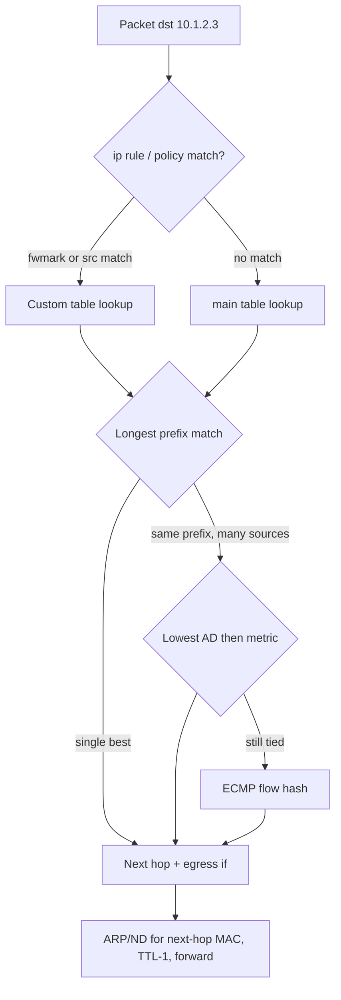
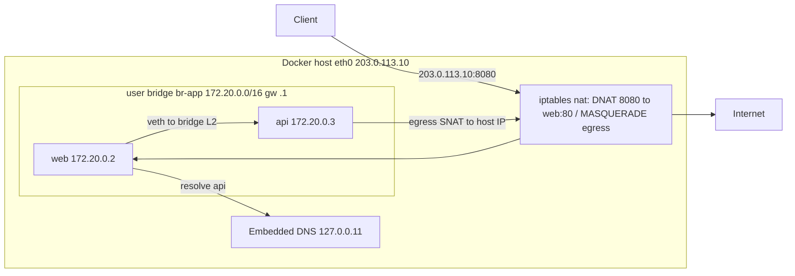

# F7 Network Routing
> Last verified: 2026-10 · Audience: senior/staff DevOps, SRE, AI eng, NetEng, DevSecOps, architects

## TL;DR
- **A router makes one decision per packet**: look up the destination IP using **longest prefix match (LPM)** and forward the packet to the next hop. **Administrative distance (AD)** and then **metric** only break ties between routes with the *same* prefix length. A /32 always beats a /0, whatever its source.
- **Static vs dynamic routing:**
  - **Static routes** are predictable, but they do not detect failure on their own.
  - **IGPs (OSPF, IS-IS)** flood link state inside a domain and converge in seconds.
  - **BGP** is a policy-driven path-vector protocol between domains. Cloud hybrid routing is **all BGP** (Direct Connect, ExpressRoute, VPN, TGW Connect, Route Server).
- **ECMP** spreads *flows* over equal-cost next hops using a **5-tuple hash**, so a single flow never gets faster. Hash polarisation and stateful middleboxes with asymmetric return paths are the classic pitfalls.
- **Policy-based routing (PBR)** chooses a route by source, mark or interface instead of only the destination. On Linux this is `ip rule` plus multiple routing tables. In the cloud it means **UDRs or more-specific routes that send traffic to an NVA or firewall**.
- **Cloud route tables:**
  - **AWS VPC:** LPM first. For the same prefix, **static > prefix list > propagated** (DX BGP > VPN static > VPN BGP).
  - **Azure:** LPM first. For the same prefix, **UDR > BGP > system**. The exception is that **VNet, peering and service-endpoint system routes win even against more-specific BGP routes**.
  - **Dynamic NVA routing:** **Azure Route Server** (GA since 2021) and **AWS VPC Route Server** (GA **2025-04-01**). Both exchange BGP routes with appliances and program the SDN. **Neither sits in the data path.**
- **Docker networking:**
  - The default `bridge` (**docker0, 172.17.0.0/16**) has **no DNS between containers**.
  - **User-defined bridges** add the embedded DNS server at **127.0.0.11** and give isolation per network.
  - Published ports are **DNAT rules in iptables** (Engine 29 adds an **experimental nftables** backend). Egress is **MASQUERADE**.
  - Published ports **bypass ufw** and bind to **0.0.0.0 by default**.
- **Kubernetes CNI:**
  - **Overlay CNIs** give pods IPs from a separate CIDR and SNAT pod traffic to the node IP when it leaves the cluster. They save VNet/VPC IPs.
  - **VPC-native CNIs** give pods real VPC IPs, so pods are directly routable but IPs run out.
  - **EKS VPC CNI** is VPC-native. Use prefix delegation, custom networking on 100.64/10, or IPv6 to fix IP exhaustion.
  - **AKS:** use **Azure CNI Overlay** by default, **Pod Subnet** for a flat network, and **Cilium** as the eBPF dataplane (no kube-proxy). **kubenet retires 2028-03-31.**

## F7.1 Fundamentals of Network Routing

### Routing table and forwarding decision
- **How it works:**
  - The **RIB** (routing information base) holds every candidate route from every source (connected, static, OSPF, BGP). The best routes are installed into the **FIB** (forwarding information base), which hardware or the kernel uses per packet. AWS VPC Route Server documents the same RIB → FIB model.
  - Each route entry holds: **prefix/len → next hop (IP) and/or egress interface, plus metric**, AD/protocol, scope and source address hint (Linux `src`).
  - The lookup order:
    1. **Longest prefix match.**
    2. Among routes with the same prefix from different protocols, the **lowest AD** wins. Cisco defaults: connected 0, static 1, eBGP 20, OSPF 110, IS-IS 115, RIP 120, iBGP 200.
    3. Within one protocol, the **lowest metric** wins.
    4. If several routes are still equal, use **ECMP**.
  - **Default route** `0.0.0.0/0` (`::/0`) is the gateway of last resort. A **blackhole/null route** (`ip route add blackhole 10.99.0.0/16`, Azure next hop `None`) drops traffic on purpose. It is used for summarisation loops and DDoS sinks.
  - **The router changes the L2 header at each hop and decrements TTL. The IP header is kept** unless NAT is applied (see [F2 Internet Protocol](./F2-internet-protocol.md)).
  - **Linux tables:**
    - `local` (255) holds local and broadcast addresses and is consulted first.
    - `main` (254) is what `ip route` shows.
    - `default` (253) is the last one checked.
    - Use `ip route get <dst>` to see the real decision, including any policy rule.
  - Forwarding is off by default: `net.ipv4.ip_forward=0`. You must turn it on for a Linux router, an NVA, or a Docker or k8s node.
  - **Reverse-path filtering:** `rp_filter` 1 = strict (RFC 3704), 2 = loose. **Strict mode silently drops asymmetric traffic.** This is a common cause in multi-NIC and PBR debugging.
- **Trade-offs / when to use:** keep tables small by **summarising (aggregating) prefixes**. Smaller tables mean faster convergence and stay under cloud route limits (Azure gateway and Route Server limits, AWS 100 propagated routes per table).
- **Interview angles:**
  - "Packet to 10.1.2.3 with routes 10.0.0.0/8 via A, 10.1.0.0/16 via B and 0/0 via C?" → **B**, because LPM wins regardless of AD or metric.
  - "Static route with AD 1 vs an OSPF /24 that is more specific?" → **The OSPF /24 wins.** AD only compares routes with the same prefix.
  - "How do you prove which path a packet takes?" → `ip route get`, `traceroute`/`mtr`, and in the cloud **effective routes** (Azure NIC → Effective routes; AWS **Reachability Analyzer**). See [H1 Linux network diagnostics](../H-full-stack-troubleshooting/H1-linux-network-diagnostics.md).

### Static vs dynamic routing (OSPF, BGP overview)
- **How it works:**

  | | Static | OSPF / IS-IS (IGP, link-state) | BGP (EGP, path-vector) |
  |---|---|---|---|
  | Scope | Single hop config | Inside one AS or domain | Between ASes (eBGP) or inside one (iBGP) |
  | Algorithm | none | Dijkstra SPF over the flooded LSDB | Best-path selection by attributes |
  | Metric | n/a | Cost (ref BW / link BW) | Weight, LOCAL_PREF, AS_PATH length, origin, **MED**, eBGP>iBGP, IGP cost, router ID |
  | Transport | n/a | IP proto 89, multicast 224.0.0.5/6 | **TCP 179** |
  | Convergence | Never (manual) | Sub-second to seconds (with BFD) | Seconds to minutes. Default timers keepalive 60 s / hold 180 s, so use **BFD** |
  | Scale | Small | Thousands of routes, areas (area 0 backbone) | Full Internet table (~1M IPv4 routes) |

  - **OSPF:**
    - Routers form adjacencies (Hello/Dead **10 s / 40 s** on broadcast links), elect a **DR/BDR** on multi-access segments, and flood **LSAs**.
    - **Areas** limit the flooding domain. ABRs summarise between areas.
    - The cloud SDN **does not run OSPF**: there is no multicast in a VPC/VNet. OSPF over GRE or IPsec between NVAs is possible but rare.
  - **BGP:**
    - **eBGP** between ASNs; next hop changes and AS_PATH is prepended.
    - **iBGP** inside an AS needs a full mesh, **route reflectors** or confederations.
    - **Private ASNs** are 64512–65534 (16-bit) and 4200000000–4294967294 (32-bit).
    - Common traffic-engineering tools:
      - **LOCAL_PREF**: controls your own outbound choice.
      - **AS_PATH prepend** and **MED**: influence inbound path choice.
      - **Communities**: tags such as NO_EXPORT and NO_ADVERTISE.
  - Cloud ASNs to know:
    - **Azure** reserves **65515** (VPN Gateway, Route Server), 65517–65520, and **12076** (the Microsoft ExpressRoute edge).
    - **AWS** VGW/TGW default to **64512**.
  - **Deep dive on hybrid BGP** (DX/ER private peering, prepending for active/standby, route limits): [G9 Hybrid network basics](../G-cloud-network-architecture/G9-hybrid-network-basics.md), [G10 Site-to-site VPN](../G-cloud-network-architecture/G10-site-to-site-vpn.md), [G12 Dedicated interconnect](../G-cloud-network-architecture/G12-dedicated-interconnect.md).
- **Trade-offs / when to use:**
  - **Static:**
    - Use it for stub networks, single exit points, and cloud UDRs pointing at an ILB/GWLB in front of an NVA pool. The LB health probe gives you the failover that static routes lack.
    - Anti-pattern: static routes to a single NVA IP with no HA.
  - **OSPF/IS-IS:** use for campus and DC underlay (IS-IS is common in hyperscaler and leaf-spine fabrics; BGP-only fabrics per **RFC 7938** are also common).
  - **BGP:** use for anything crossing an administrative boundary (ISP, cloud, SD-WAN). It is also used as a **service-discovery and anycast** mechanism (MetalLB BGP mode, Calico/Cilium BGP, anycast DNS).
- **Interview angles:**
  - "Why BGP and not OSPF to the cloud?" → It works across trust boundaries, it supports policy (prepend, communities, max-prefix), it runs over TCP unicast with no multicast needed, and every cloud edge speaks it.
  - "How to make DX/ER active-passive?" → Use **AS_PATH prepend / MED** on the backup path inbound to the cloud, and **LOCAL_PREF** on-prem for outbound. In AWS also use the **more-specific prefix** trick, because LPM beats any attribute.
  - Pitfall: **asymmetric routing through stateful firewalls**. The return traffic takes a different path and the firewall drops it because it has no session. Fix it with symmetric routing, SNAT at the NVA, or by keeping flows in a GWLB/Azure Gateway LB.

### ECMP
- **How it works:**
  - When several next hops have equal cost for the same prefix, the router **hashes each flow** to pick one. Linux: `ip route add 10.0.0.0/24 nexthop via A nexthop via B`.
  - Linux `net.ipv4.fib_multipath_hash_policy` options:
    - **0** = L3 (src, dst, proto). This is the default.
    - **1** = L4 5-tuple.
    - **2** = L3 or inner L3.
    - **3** = custom fields.
  - Set `fib_multipath_use_neigh=1` so that **next hops whose neighbour entry has failed are skipped**.
  - **Per-flow, not per-packet**, so packets within a flow are not reordered. As a result, **a single elephant flow is limited by one link**.
  - **Resilient/consistent hashing** (Linux nexthop groups `type resilient`) limits how many flows get reshuffled when a member goes down.
- **Cloud:**
  - **An AWS VPC route table holds one target per destination, so there is no ECMP in the VPC table.** ECMP lives in **Transit Gateway**: VPN ECMP must be enabled and is used to aggregate many standard 1.25 Gbps tunnels, and Connect/GRE+BGP also uses ECMP. Scale-out NVAs sit behind **GWLB**, which hashes flows to appliances.
  - **Azure Route Server**: if several NVAs advertise the same prefix with **equal AS_PATH length**, it programs **ECMP** to VMs. A shorter AS_PATH wins outright. With UDRs, use an **internal LB with HA ports** as the next hop for an NVA pool.
- **Trade-offs:**
  - ECMP gives cheap horizontal scale and fast failover.
  - It breaks **stateful** devices unless both directions hash to the same box. Use symmetric hashing, GWLB/Gateway LB flow stickiness, or SNAT.
- **Interview angles:**
  - "Why is my 10 Gbps flow stuck at 1.25 Gbps over 8 standard VPN tunnels?" → A single flow uses one tunnel (one IPsec SA), so ECMP only helps the aggregate.
  - "What is hash polarisation?" → Every tier uses the same hash, so traffic piles onto the same links. Fix it by seeding the hash differently per tier.

### Policy-based routing (PBR)
- **How it works:**
  - Linux **RPDB**: `ip rule` entries are evaluated by priority. The defaults are 0 = `local`, 32766 = `main`, 32767 = `default`.
  - Rules can match `from`, `to`, `iif`/`oif`, `fwmark`, `ipproto`, `dport`, `uidrange`, and send the lookup to a custom table.
  - Typical uses:
    - **Multi-NIC / multi-homed hosts**, so replies leave via the NIC they came in on.
    - **Split egress per tenant**.
    - **VPN split tunnelling**. WireGuard `wg-quick` uses fwmark + table 51820.
    - **Kubernetes CNIs**. AWS VPC CNI installs per-ENI tables and `ip rule from <podIP> lookup <eni-table>`.
- **Cloud equivalents:**
  - Neither cloud offers source-based routing in the route table itself. Routing is by destination only.
  - You get "policy" through **per-subnet route tables**:
    - **AWS:** subnet route tables, **IGW/VGW edge associations (ingress routing)**, and **more-specific-than-local routes** (2021+) to force intra-VPC traffic through an appliance or GWLB endpoint.
    - **Azure:** UDRs per subnet, including overriding the VNet prefix to force east-west traffic through Azure Firewall.
  - Azure UDRs can also use **service tags** as the prefix (max 25 per route table).
  - True PBR happens **inside the NVA**.
- **Interview angles:**
  - "Second ENI on EC2 and replies go out the wrong interface?" → Add a source-based `ip rule` + table for the secondary subnet, or set `rp_filter=2`.
  - "Force east-west inspection in Azure?" → Add a UDR on each spoke subnet for the other spokes' prefixes (or the whole supernet) → next hop is the Azure Firewall private IP. Route Server **cannot** override intra-VNet system routes.



### Hands-on: Linux routing
```bash
ip route show table main                 # routing table
ip route get 8.8.8.8                     # actual decision incl. src + policy
sudo sysctl -w net.ipv4.ip_forward=1     # act as router
sudo ip route add 10.50.0.0/16 via 192.168.1.254 dev eth0
sudo ip route add blackhole 10.99.0.0/16
# ECMP over two gateways, L4 hashing, skip dead neighbours
sudo ip route add 10.60.0.0/16 nexthop via 192.168.1.1 weight 1 nexthop via 192.168.1.2 weight 1
sudo sysctl -w net.ipv4.fib_multipath_hash_policy=1 net.ipv4.fib_multipath_use_neigh=1
# Source-based PBR for a second NIC
echo "100 eth1rt" | sudo tee -a /etc/iproute2/rt_tables
sudo ip route add default via 10.0.2.1 dev eth1 table eth1rt
sudo ip rule add from 10.0.2.10/32 table eth1rt priority 1000
ip rule show
```

## F7.2 Networking with Docker (bridge networks, container DNS, gateways)

### Drivers
- **How it works:**

  | Driver | What it is | Use when | Gotchas |
  |---|---|---|---|
  | `bridge` (default) | Linux bridge + **veth pair** per container. NAT to the host. | Single-host apps, dev, Compose | Default `docker0` has no DNS. >1000 containers per bridge network is unstable (per docs) |
  | `host` | Shares the host netns. No isolation, no NAT, `-p` ignored | Max perf, many ports, network tools | Port conflicts, no network isolation |
  | `none` | Only `lo` | Batch or sandboxed jobs | — |
  | `overlay` | **VXLAN** across Swarm nodes | Multi-host Swarm | Needs **TCP 2377** (mgmt), **TCP/UDP 7946** (gossip), **UDP 4789** (VXLAN). Optional IPsec `--opt encrypted` |
  | `macvlan` | Container gets its own MAC on the parent NIC | Legacy apps that need L2 presence on the LAN | **Host cannot reach its own macvlan containers** without a macvlan shim. **Most clouds block unknown MACs** |
  | `ipvlan` (L2/L3) | Shares the parent MAC. L3 mode routes | Where MAC count is limited or in the cloud | L3 mode needs upstream routes to the container subnet |
  | `container:<id>` | Joins another container's netns | Sidecars (the same idea as k8s pod `pause`) | Shared port space |

### Default bridge vs user-defined bridge
- **docker0** default: **172.17.0.0/16**, gateway **172.17.0.1** (the bridge IP on the host). User networks get address pools from the defaults (172.17–172.31/16, 192.168.0.0/16 split into /20s). Change them with `default-address-pools` in `daemon.json` to avoid **overlap with VPC/VNet or VPN ranges**. This is a classic "can't reach on-prem from a container" bug.
- **User-defined bridge** advantages, per the docs:
  - **Automatic DNS** by container name and `--alias`.
  - **Better isolation**: only attached containers can talk to each other.
  - **Attach and detach at runtime.**
  - **Per-network config** (MTU, ICC, masquerade).
  - The default bridge needs the legacy `--link` for name resolution.
- **Embedded DNS (127.0.0.11):**
  - On user-defined networks, the container's `/etc/resolv.conf` points to **127.0.0.11**. The engine answers container/service names and aliases itself and **forwards other queries to the host's configured resolvers**.
  - On the default bridge, the container copies the host `resolv.conf`, with any loopback resolvers such as systemd-resolved 127.0.0.53 removed.
  - Compose service names resolve through this DNS. Scaled replicas return multiple A records (DNS round-robin).
- **Gateway / default route:**
  - The container's default route points to the bridge IP. A container on several networks uses the one with the highest **`gw-priority`** as its default gateway (default 0; Compose `gw_priority`; Engine 28+ — version unverified).
  - Bridge **gateway modes**:
    - **`nat`** (default): SNAT/masquerade.
    - **`nat-unprotected`**: legacy, allows direct access to unpublished ports.
    - **`routed`**: no NAT. Container IPs are visible, so upstream needs routes to the bridge subnet.
    - **`isolated`**: only with `--internal`.
  - `--internal` networks have **no external connectivity at all**.

### Port publishing and NAT (iptables / nftables)
- **How it works:**
  - `-p 8080:80` → a **DNAT** rule in the `nat` table `DOCKER` chain (reached from PREROUTING and OUTPUT) rewrites host:8080 → containerIP:80.
  - FORWARD rules (`DOCKER-FORWARD`/`DOCKER` chains) accept the flow.
  - Egress uses **MASQUERADE** in POSTROUTING for the bridge subnet (`enable_ip_masquerade=true`).
  - **`docker-proxy`** (the userland proxy) handles cases like hairpin and localhost when it is enabled.
  - **`DOCKER-USER`** is the supported place for your own filter rules. It is evaluated before Docker's rules.
- **Defaults and security:**
  - **Published ports bind to 0.0.0.0 and :: by default.** Use `-p 127.0.0.1:8080:80` or the daemon/network option `host_binding_ipv4`.
  - Before **28.0**, hosts on the same L2 segment could reach localhost-published ports (moby#45610).
  - **ufw/firewalld INPUT rules do not protect published ports**, because the DNAT happens before INPUT and the traffic goes through FORWARD. **"Docker bypasses ufw"** is a top interview and incident item.
- **nftables:**
  - Added in **Docker Engine 29.0** as **experimental**: `"firewall-backend": "nftables"`. It creates `ip docker-bridges` / `ip6 docker-bridges` tables.
  - **There is no DOCKER-USER chain.** Write your own table with base chains at matching hooks and priorities.
  - **Not supported in Swarm mode** (overlay rules are still iptables).
  - You must enable `ip_forward` yourself.

### Container-to-container routing
- **Same bridge network:** L2 through the Linux bridge. Name resolution through 127.0.0.11. **ICC** (`enable_icc`) can disable traffic between containers.
- **Different bridge networks:** **isolated by default**, using Docker's isolation chains. Connect the container to both networks (`docker network connect`) instead of routing between bridges.
- **Container to host service:** use the gateway IP or `host.docker.internal` (add `--add-host=host.docker.internal:host-gateway` on Linux).
- **Across hosts:**
  - Use **overlay** (Swarm), **macvlan/ipvlan** (LAN-routable), or **`routed` mode** with static routes on the upstream router pointing the container subnet at the Docker host.
  - In Kubernetes the CNI takes this role (see below).
- **MTU:** the bridge defaults to 1500. Inside VXLAN or a cloud overlay, set `com.docker.network.driver.mtu` (e.g. 1450). Otherwise you get TLS hangs and black-holed large packets. See [F6 Network performance](./F6-network-performance.md) and [G4](../G-cloud-network-architecture/G4-network-performance-and-optimization.md).



### Hands-on: Docker networking
```bash
docker network ls; ip addr show docker0; bridge link
docker network create --driver bridge \
  --subnet 172.30.0.0/24 --gateway 172.30.0.1 \
  -o com.docker.network.driver.mtu=1450 appnet
docker run -d --name api --network appnet --network-alias backend nginx:alpine
docker run --rm --network appnet busybox sh -c 'cat /etc/resolv.conf; nslookup backend; ip route'
# Publish only on localhost (avoid 0.0.0.0 exposure / ufw bypass)
docker run -d --name web --network appnet -p 127.0.0.1:8080:80 nginx:alpine
sudo iptables -t nat -L DOCKER -n -v          # DNAT rules for published ports
sudo iptables -t nat -L POSTROUTING -n -v     # MASQUERADE for 172.30.0.0/24
sudo iptables -I DOCKER-USER -i eth0 ! -s 10.0.0.0/8 -j DROP   # restrict published ports
# Internal-only network (no egress), and macvlan on the LAN
docker network create --internal backend-only
docker network create -d macvlan --subnet 192.168.1.0/24 --gateway 192.168.1.1 -o parent=eth0 lan
docker network inspect appnet --format '{{json .IPAM.Config}}'
```

```yaml
# compose.yaml: frontend/backend split, internal DB network, fixed subnet
services:
  web:
    image: nginx:alpine
    ports: ["127.0.0.1:8080:80"]
    networks: [frontend, backend]
  api:
    image: ghcr.io/example/api:1.0
    networks:
      backend:
        aliases: [api.internal]
  db:
    image: postgres:17
    environment: { POSTGRES_PASSWORD: example }
    networks: [data]
networks:
  frontend: {}
  backend:
    ipam:
      config: [{ subnet: 172.31.10.0/24 }]
  data:
    internal: true   # no route out; api must also join to reach db
```
- Note: `api` above cannot reach `db` until it is attached to `data` too. That is the point of network segmentation in Compose.

### Kubernetes CNI comparison (brief)
- **How it works:**

  | Model | Pod IP source | Pod reachable from VPC/on-prem? | Egress | Examples |
  |---|---|---|---|---|
  | **Overlay** (VXLAN/Geneve/IP-in-IP, or routing over a separate pod CIDR) | Separate pod CIDR, not in the VNet | No (pod-initiated only) | SNAT to node IP | Flannel, Calico VXLAN, Cilium overlay, **Azure CNI Overlay**, kubenet (legacy) |
  | **VPC-native / flat** | Real VPC/VNet IPs (secondary IPs or prefixes) | Yes, both ways | Pod IP preserved inside the VPC. SNAT at the edge | **EKS VPC CNI**, **Azure CNI Pod Subnet**, Azure CNI Node Subnet (legacy), GKE VPC-native |
  | **BGP-routed underlay** | Pod CIDR advertised by BGP | Yes, if the fabric learns the routes | Configurable | Calico BGP, Cilium BGP control plane (on-prem) |

- **EKS VPC CNI:**
  - The **only CNI EKS supports on EC2 nodes**. EKS Auto Mode bundles it.
  - It attaches ENIs and assigns **secondary IPs** to pods. Max pods = ENIs × (IPs per ENI − 1) + 2.
  - **Prefix delegation** assigns **/28 prefixes** (16 IPs each). This needs Nitro, can fail on **fragmented subnets** (use subnet CIDR reservations), and is the recommended path to **max-pods 110 / 250**.
  - **Custom networking** (`ENIConfig`) puts pods in a secondary CIDR, recommended **100.64.0.0/10**. The primary ENI is then unused, so fewer pods fit per node.
  - **Security groups for pods** use branch ENIs. **IPv6 mode** removes exhaustion entirely.
- **AKS:**
  - **Azure CNI Overlay** is the default recommendation: pod CIDR, 250 pods per node, SNAT outbound.
  - **Azure CNI Pod Subnet** is the flat-network choice: pod IPs preserved across connected VNets.
  - **Azure CNI Node Subnet** is legacy.
  - **kubenet** retires **2028-03-31**. Migrate to Overlay.
  - **Azure CNI Powered by Cilium** (`--network-dataplane cilium`):
    - eBPF dataplane, **no kube-proxy**, network policy built in, Linux only.
    - It is the default on **AKS Automatic**, which uses Overlay + Cilium.
    - Add **ACNS** for FQDN filtering, L7 policy, flow logs and WireGuard.
- **Interview angles:**
  - "Pods can't get IPs on EKS?" → It is subnet or ENI exhaustion. Fixes, in order: prefix delegation → custom networking on 100.64/10 → IPv6. Overlap with on-prem can be handled with a private NAT gateway.
  - "When choose flat over overlay?" → When on-prem or other VNets must **initiate** connections to pods, or a firewall must see real pod IPs. Otherwise choose overlay for IP conservation.
  - Docker vs k8s: Docker gives one bridge per host plus NAT. Kubernetes requires **every pod to reach every pod without NAT**. The CNI meets that with an overlay or with VPC routing.

## Cloud mapping: AWS vs Azure

| Capability | AWS | Azure | Role it plays | Key differences | Alternatives |
|---|---|---|---|---|---|
| Subnet routing table | **VPC route table** (main + custom, 1 per subnet; also gateway/edge route tables) | **Route table with UDRs** + automatic **system routes** (0 or 1 per subnet) | Destination-based next hop per subnet | AWS: 500 non-propagated routes by default (max 1,000), **100 propagated (hard)**. Azure: **400 UDRs** (1,000 via AVNM routing config). Azure has implicit system routes you override. AWS has an explicit `local` route | GCP VPC routes, Kubernetes CNI routes |
| Same-prefix tie-break | Static > prefix-list > propagated (DX BGP > VPN static > VPN BGP) | **UDR > BGP > system** (but VNet/peering/service endpoint system routes beat more-specific BGP) | Route selection after LPM | Azure BGP **cannot** override intra-VNet routes. Only UDRs can | — |
| Drop route | Blackhole state (target deleted), or NACL | Next hop **None** | Sinkhole | Azure exposes None explicitly. RFC1918/100.64 default to None until used | — |
| Dynamic routing with NVAs | **VPC Route Server** (GA 2025-04-01; BGP + BFD, 2 endpoints/subnet, **100 routes per peer & per server**, updates subnet/IGW route tables via the FIB) | **Azure Route Server** (GA 2021; ASN 65515, /26+ `RouteServerSubnet`, **16 peers, 4,000 routes/peer**, ECMP, branch-to-branch, route maps) | Learn routes from BGP NVAs and program the SDN | Both are **control plane only**. AWS: designed for NVA **failover** (MED-preferred active, standby on BFD down), IPv4+IPv6, no VGW tables, no TGW (use TGW Connect). Azure: IPv4 only, injects into whole VNet + peered spokes, exchanges with ER/VPN gateways, 16-bit ASN only | TGW Connect (GRE+BGP), GWLB / Azure Gateway LB, Virtual WAN hub routing |
| Hybrid BGP | VGW / TGW / DX Gateway (ASN 64512 default) | VPN Gateway / ExpressRoute Gateway (ASN 65515), Virtual WAN | On-prem route exchange | See G9/G12 | SD-WAN NVAs, Cloudflare Magic WAN |
| ECMP | TGW (VPN ECMP, Connect). **Not in VPC route tables** | Route Server ECMP from NVAs. ILB HA ports for UDR next hop | Scale-out across paths/appliances | AWS VPC table = 1 target per prefix | GWLB flow hashing |
| Force traffic through firewall | More-specific-than-local routes, ingress routing (IGW edge association), GWLB endpoints | UDR override of VNet prefix / 0.0.0.0/0 to Azure Firewall or NVA | Inspection insertion | AWS needs per-AZ symmetry. Azure needs UDRs on every spoke subnet (AVNM can push them) | AWS Network Firewall ↔ Azure Firewall |
| Managed K8s CNI | **EKS VPC CNI** (VPC IPs; prefix delegation; custom networking; SG for pods; IPv6) | **Azure CNI Overlay** / **Pod Subnet** / Node Subnet (legacy); **Cilium** dataplane; kubenet retiring 2028-03-31 | Pod IPAM + pod routing | EKS defaults to flat VPC IPs. AKS recommends overlay | Cilium (BYO CNI on both), Calico |
| Route visibility | Reachability Analyzer, VPC Flow Logs, TGW Network Manager | Effective routes (NIC), Network Watcher next hop, VNet flow logs | Debug the routing decision | Azure "Effective routes" shows Active/Invalid per route | — |

- **VPC route table vs Azure route table:**
  - AWS route tables are explicit and **associated with subnets or gateways** (edge association enables ingress routing).
  - Azure starts from **system routes on every subnet**. Your UDR table is merged on top, and the portal shows overridden routes as **Invalid**.
  - Both are **destination-only**, with no source-based PBR.
  - Azure next-hop types: `VirtualAppliance`, `VirtualNetworkGateway` (VPN gateway only), `VnetLocal`, `Internet`, `None`. You cannot specify peering or service-endpoint next hops in a UDR.
  - **An Azure NVA NIC needs "Enable IP forwarding". The AWS equivalent is disabling source/dest check.**
- **Route Server comparison (verified 2026-10):**
  - **AWS VPC Route Server:**
    - GA **2025-04-01** in 6 regions, 14 regions by July 2025.
    - Components: route server → VPC association → **endpoints** (managed ENIs, max **2 per subnet** per route server) → **peers** (your appliance ENIs that start BGP) → **propagation** to route tables.
    - Supports **BFD**. Best path computed from MED and similar attributes. Quotas: **5 per VPC**, **100 routes per server**, plus per-peer limits.
  - **Azure Route Server:**
    - Deployed as 2 instances. **Peer each NVA with both.** Keepalive 60 s / hold 180 s.
    - Exceeding 4,000 routes **drops the session**.
    - Deployment causes about **10 min** of downtime on existing VPN/ER gateways in the VNet.
    - Capacity is measured in routing infrastructure units (2 by default, about 4,000 VMs).
    - Billed hourly per deployment.
  - **Both** remove the need for "Lambda/Function rewrites the UDR on failover" scripts.
- **EKS VPC CNI vs Azure CNI:**
  - EKS VPC CNI ≈ **Azure CNI Pod Subnet** (flat, routable pod IPs).
  - **Azure CNI Overlay** has no first-party EKS equivalent. On EKS you would use custom networking + private NAT, IPv6, or BYO Cilium/Calico overlay, which AWS supports with limited support scope.
  - Cilium is first-party managed on AKS. On EKS, **EKS Auto Mode** is the managed path but it still uses the VPC CNI model.

## Cross-links
- [F2 Internet Protocol](./F2-internet-protocol.md) (addressing, TTL, subnetting) · [F6 Network performance](./F6-network-performance.md) (MTU, L4/L7 LB)
- [G1 Virtual network fundamentals](../G-cloud-network-architecture/G1-virtual-network-fundamentals.md) · [G2 Additional VNet features](../G-cloud-network-architecture/G2-additional-virtual-network-features.md) · [G8 Transit hub](../G-cloud-network-architecture/G8-transit-hub.md)
- [G9 Hybrid network basics (BGP deep dive)](../G-cloud-network-architecture/G9-hybrid-network-basics.md) · [G10 Site-to-site VPN](../G-cloud-network-architecture/G10-site-to-site-vpn.md) · [G12 Dedicated interconnect](../G-cloud-network-architecture/G12-dedicated-interconnect.md)
- [G14 Service-to-service networking](../G-cloud-network-architecture/G14-service-to-service-networking.md) (k8s/service mesh)
- [G3 Network DNS and DHCP](../G-cloud-network-architecture/G3-network-dns-and-dhcp.md) · [H3 DNS](../H-full-stack-troubleshooting/H3-domain-name-system.md) (resolver behaviour behind 127.0.0.11)
- [C4 Security](../C-large-scale-architecture/C4-security.md) (firewalls/ACLs) · [H1 Linux network diagnostics](../H-full-stack-troubleshooting/H1-linux-network-diagnostics.md) · [H2 Troubleshooting your network](../H-full-stack-troubleshooting/H2-troubleshooting-your-network.md)
- [A7 Socket management](../A-operating-systems/A7-socket-management.md) (netns, kernel networking)

## Sources
- https://docs.aws.amazon.com/vpc/latest/userguide/route-tables-priority.html
- https://docs.aws.amazon.com/vpc/latest/userguide/dynamic-routing-route-server.html
- https://docs.aws.amazon.com/vpc/latest/userguide/route-server-how-it-works.html
- https://docs.aws.amazon.com/vpc/latest/userguide/route-server-terms.html
- https://docs.aws.amazon.com/vpc/latest/userguide/amazon-vpc-limits.html
- https://aws.amazon.com/about-aws/whats-new/2025/04/amazon-vpc-route-server
- https://aws.amazon.com/about-aws/whats-new/2025/07/amazon-vpc-route-server-available-new-regions
- https://learn.microsoft.com/en-us/azure/virtual-network/virtual-networks-udr-overview
- https://learn.microsoft.com/en-us/azure/route-server/overview
- https://learn.microsoft.com/en-us/azure/route-server/route-server-faq
- https://learn.microsoft.com/en-us/azure/aks/concepts-network-cni-overview
- https://learn.microsoft.com/en-us/azure/aks/azure-cni-powered-by-cilium
- https://docs.aws.amazon.com/eks/latest/userguide/managing-vpc-cni.html
- https://docs.aws.amazon.com/eks/latest/userguide/cni-increase-ip-addresses.html
- https://docs.aws.amazon.com/eks/latest/best-practices/custom-networking.html
- https://docs.docker.com/engine/network/
- https://docs.docker.com/engine/network/drivers/bridge/
- https://docs.docker.com/engine/network/port-publishing/
- https://docs.docker.com/engine/network/packet-filtering-firewalls/
- https://docs.docker.com/engine/network/firewall-nftables/
- https://docs.kernel.org/networking/ip-sysctl.html
